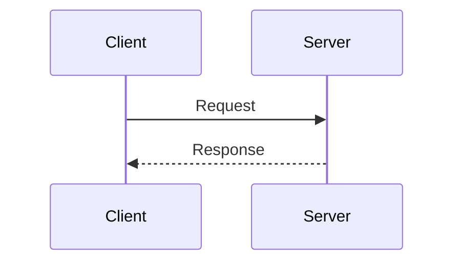

# CLAUDE.md

This file provides guidance to Claude Code (claude.ai/code) when working with code in this repository.

## Project Type: Knowledge Management System

**IMPORTANT: This is NOT a programming project.**

This repository is a **unified knowledge base** for two companies:
- **SAIYU Construction** (Building Services)
- **PSEC Project Services** (Architectural Services)

### Primary Purpose
Maintain a well-structured wiki database with clear hierarchy, consistent filing systems, and professional documentation in Markdown format.

### Working Principles
- **DO NOT generate code solutions** unless explicitly requested
- **DO NOT modify `index.html`** unless explicitly requested
- Focus on content structure, naming conventions, and documentation quality
- Treat this as a knowledge management project, not a software development project

## Technical Stack

This wiki uses Docsify for presentation:
- **Docsify 4**: Front-end Markdown renderer (no build required)
- **docsify-themeable**: Light/Dark theme support with system preference detection
- **Mermaid 10**: Diagram rendering (UMD version for compatibility)
- **Deployment**: Vercel with SPA rewrites

## Local Development

### Starting the server
```bash
# Install docsify-cli globally (first time only)
npm install -g docsify-cli

# Start local server (default port 3000)
docsify serve .

# Custom port
docsify serve . --port 8080

# Background mode
nohup docsify serve . &
```

### Development workflow
- Markdown file changes in `docs/` auto-refresh in browser
- Changes to `index.html` require manual browser refresh
- No build step required

## Architecture

### File Structure
```
/ (root)
├── index.html              # Docsify config, theme setup, Mermaid integration
├── docs/                   # All documentation content
│   ├── README.md           # Homepage/Dashboard
│   ├── _sidebar.md         # Global sidebar (2-level max)
│   ├── getting-started.md  # Onboarding guide
│   ├── 01-policies/        # Internal policies (HSE, QA, IT)
│   ├── 02-commercial/      # Procurement, progress claims
│   ├── 04-procedures/      # Step-by-step workflows
│   │   ├── buildertrend/
│   │   ├── fieldwire/
│   │   └── googleservice/
│   ├── 05-quality/         # Inspection guides, ITPs
│   ├── 06-safety/          # SWMS, risk matrix
│   ├── 07-knowledge-base/  # FAQs, glossary, standards
│   │   ├── dev/            # Development processes
│   │   ├── technical/      # Technical references
│   │   └── geeks/          # Tech tools & tips
│   ├── 08-templates/       # Reusable forms
│   └── 11-assets/          # Images, diagrams
├── sidebar_rule.md         # Sidebar authoring guidelines
└── vercel.json             # SPA routing config
```

### Key Configuration (`index.html`)

**Docsify settings:**
- `basePath: '/docs/'` - All content served from docs folder
- `loadSidebar: true` - Enables `_sidebar.md`
- `alias: { '/.*/_sidebar.md': '/_sidebar.md' }` - Global sidebar reuse
- `subMaxLevel: 2` - Two-level table of contents (enforced limit)
- `search: { paths: 'auto' }` - Full-text search

**Theme system:**
- Light/Dark stylesheets loaded via `prefers-color-scheme` media query
- Manual toggle switch (top-right) overrides system preference
- Theme preference stored in `localStorage` (`preferred-theme`)
- Mermaid diagrams re-render on theme change with optimized dark mode colors

**Mermaid integration:**
- Loaded as UMD module before `docsify-mermaid` plugin
- `initMermaidWithTheme(dark)` function handles theme-specific config
- Dark theme uses enhanced contrast (white strokes, custom backgrounds)
- Diagrams marked with `.mermaid` class are auto-processed

## Sidebar Rules (`_sidebar.md`)

Critical constraints for sidebar editing:

1. **Two-level maximum hierarchy** (enforced by Docsify config)
   ```markdown
   - Root Level Heading (no link)
     - [Sub Item](path/to/file)
   ```

2. **README.md as folder default**
   - Link to folder path automatically loads `README.md`
   - Every second-level folder MUST have `README.md` with heading
   ```markdown
   - [Section](/section/)  ← Loads section/README.md
   ```

3. **Link format**
   - Omit `.md` extension: `[Title](path/file)` not `[Title](path/file.md)`
   - Paths relative to `basePath` (`/docs/`)

4. **Folder naming**
   - Number prefixes for ordering: `01-policies/`, `02-commercial/`

## Content Guidelines

### Documentation standards
- Write in **clean, professional Markdown** with clear cross-links
- Maintain consistency across:
  - Filing systems
  - Revision naming conventions
  - Document indexing
- Use proper headings hierarchy (`#`, `##`, `###`)
- Include descriptive link text (avoid "click here")

### Organizational conventions
- **Folder structure**: Use numbered prefixes for ordering (`01-`, `02-`, etc.)
- **Assets management**: Store images, diagrams, and external references in `/docs/11-assets/` or category-specific asset folders
- **README requirement**: Every second-level folder MUST have `README.md` with section heading
- **Cross-company support**: Structure should accommodate both SAIYU Construction and PSEC Project Services

### Language conventions
- UI text and user-facing content: **English**
- Source code comments (JS/CSS): **Chinese** (only when modifying code, which should be rare)
- Documentation language: **English**

### Markdown features
- Standard GitHub-flavored Markdown
- Mermaid diagrams in fenced code blocks:
  ````markdown
  ```mermaid
  graph TD
    A[Start] --> B[End]
  ```
  ````
- Image zoom plugin enabled (click images to enlarge)
- Use relative links for internal navigation

## Theme Implementation

The custom theme toggle works through:

1. **Detection priority**: `localStorage` override > system preference
2. **Stylesheet switching**: Modifies `<link>` media attributes (`all` vs `not all`)
3. **Mermaid sync**: `reinitMermaid(dark)` re-initializes diagrams
4. **Persistence**: Auto-reload after manual toggle to ensure clean state

Functions in `index.html`:
- `getCurrentTheme()` - Returns active theme ('light'|'dark')
- `applyTheme(theme)` - Switches stylesheets and updates localStorage
- `initMermaidWithTheme(dark)` - Configures Mermaid colors
- `reinitMermaid(dark)` - Clears processed diagrams and re-renders

## Deployment

Hosted on Vercel with SPA routing:
```json
{"rewrites":[{"source":"/(.*)","destination":"/index.html"}]}
```

All routes serve `index.html`, letting Docsify handle client-side routing.

## Common Tasks

### Adding new documentation
1. Create `.md` file in appropriate `docs/XX-category/` folder
2. Add entry to `docs/_sidebar.md` (respect 2-level limit)
3. Ensure parent folder has `README.md` with section heading
4. Use clear, descriptive headings and proper Markdown formatting
5. Add cross-links to related documents where relevant

### Organizing assets
- Images: Place in `docs/11-assets/images/` or category-specific subfolder
- Diagrams: Create as Mermaid code blocks when possible; use `docs/11-assets/diagrams/` for external files
- Reference images from Markdown: ``

### Proposing structure changes
When suggesting folder reorganization or naming conventions:
1. Explain rationale for the proposed structure
2. Show how it supports both SAIYU and PSEC workflows
3. Ensure compatibility with 2-level sidebar constraint
4. Consider migration path for existing content

### Adding diagrams
Use Mermaid syntax in Markdown - no special setup required:
````markdown

````

### Modifying theme (rare - requires explicit request)
- Light theme: `theme-simple.css` styles
- Dark theme: `theme-simple-dark.css` styles
- Mermaid dark optimizations: Media query in `<style>` block (index.html:27-37)
- Toggle switch styling: `.theme-switch` classes (index.html:40-79)
- **Remember**: Do NOT modify `index.html` unless explicitly requested
