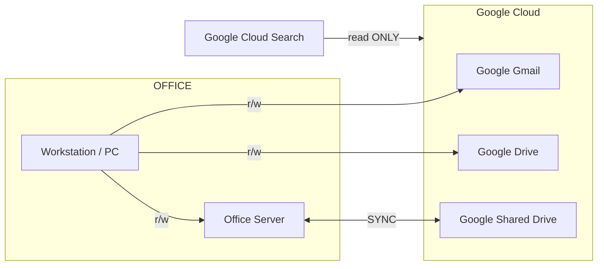

# Filing System and Email Management Guideline
---

Date: 23.08.2025 | Revision: 2025.08.a

## Introduction

The goal of filing system and email management strategy is to enhance efficiency, simplify access to critical documents, and leverage the strengths of **Google Workspace** tools. This guideline provides a structured approach to organizing emails and files with minimal effort while maintaining high levels of retrievability and clarity. We prioritize using **search** and **shared labels** over traditional folder hierarchies to maximize productivity.

?> More reading about [Google Search 101](/04-procedures/googleservice/GoogleSearch)

### Theoretical Foundation

Our approach to file and email management is rooted in the idea of accessibility and simplicity. Traditional folder structures, while visually organized, can be restrictive and inefficient, especially when dealing with a large volume of documents that might belong to multiple categories. By utilizing Google Workspace's **search capabilities** and a robust **labeling system**, we can quickly access documents without needing to recall their exact location within a hierarchical structure. The philosophy is to make information accessible based on its context and purpose, rather than its storage path.

### Relation Map

Note: 
**r/w** - Read and Write
**SYNC** - Synchronize

---

# PSEC Filing Systems

**Email Management System**

**Server Filing System for Documents**

---

# SAIYU Filing Systems

### 1. Email Management: Gmail

SAIYU employs a label-based system in Gmail to ensure consistent and efficient email management. This approach allows for greater flexibility than traditional folders, as a single email can be assigned multiple labels.

#### Shared Labels

To streamline email retrieval, all team members must use the following shared labels:

- **`Contracts-and-Related`**: Applied to all email threads involving contract discussions, agreements, amendments, and other formal communications.
- **`Invoices-to-SAIYU`**: Used for all incoming invoices from subcontractors, vendors, and suppliers.
- **`Quotations-Received`**: Assigned to all quotations received from or sent to external partners.
- **`Verified`**: Indicates that an email's content has been reviewed and processed. This label can be used alone or with other labels (e.g., `Invoices-to-SAIYU`) to confirm that an invoice has been checked.
- **`Pending`**: Marks any email or document requiring further action or resolution.

#### Search-Oriented Strategy

Instead of creating project-specific labels, we rely on Google Workspace’s powerful search capabilities. Employees are expected to include project names and relevant keywords in email subjects and content to facilitate effective searches. For advanced search techniques, refer to the [Google Search 101](/04-procedures/googleservice/GoogleSearch)

---

### 2. Document Management: Google Shared Drive

All company documents are stored in a Google Shared Drive, which is synchronized with an office-based NAS (Network Attached Storage) to ensure data redundancy and accessibility.

#### Folder Structure

Our Shared Drive uses a flat, categorized folder system to simplify navigation:

- **`00-Saiyu-Admin`**: Core administrative documents, including company details, logos, insurance certificates, builder licenses, and business templates.
- **`01-Saiyu-Accounts`**: Financial records, including audit information, invoices (incoming, filed, and problematic), and payment documentation.
  > *Note: As of June 2024, some functions of this folder have been deprecated. Legacy information remains for archival purposes. (Updated: 12 Dec 2024)*
- **`02-Operation`**: Operational resources, including CRM lists, Safework documentation, Australian Standards (AS), and handbooks.
  > *Note: This folder is under construction. Additional uses are to be determined. (Updated: 12 Dec 2024)*
- **`Projects_Archived`**: Completed projects, with each project in a designated folder named using the format: `[Project Code]_[Project Address] ([Nickname])`.
- **`Projects_Current`**: Active projects, following the same naming convention as archived projects.
  > *Example: `SY200723_47 Thomson St Kiama (K3)`*
  > *Note: `SY` denotes SAIYU, and `200723` represents the approximate start date (YYMMDD).*
- **`Projects_Potential`**: Prospective projects, named using the format: `[Suburb]_[Project Address]`.
  > *Example: `Maroubra_51 Chester Ave`*
- **`Research`**: Case studies and research materials.
- **`Temporary`**: Temporary files, which are periodically deleted.

---

### 3. Operational Guidelines

- **Labeling Responsibility**: The recipient of an email is responsible for applying the correct labels. For documents, the uploader must ensure proper naming and placement.
- **Archiving**: Documents and emails that are no longer active should be labeled as **Archived** and moved to the appropriate archive folder.
- **System Maintenance**: The filing system and label structure will be reviewed every six months to remove outdated information and ensure efficiency.

### 4. Best Practices

- **Avoid Duplication**: Do not store identical documents in multiple locations.
- **Use Consistent Keywords**: Employ consistent keywords in document titles and email subjects to improve searchability.

---

Page Title: Filing System and Email Management Guideline | Last Update: 23.08.2025 | Revision: 2025.08.a | Status: Published