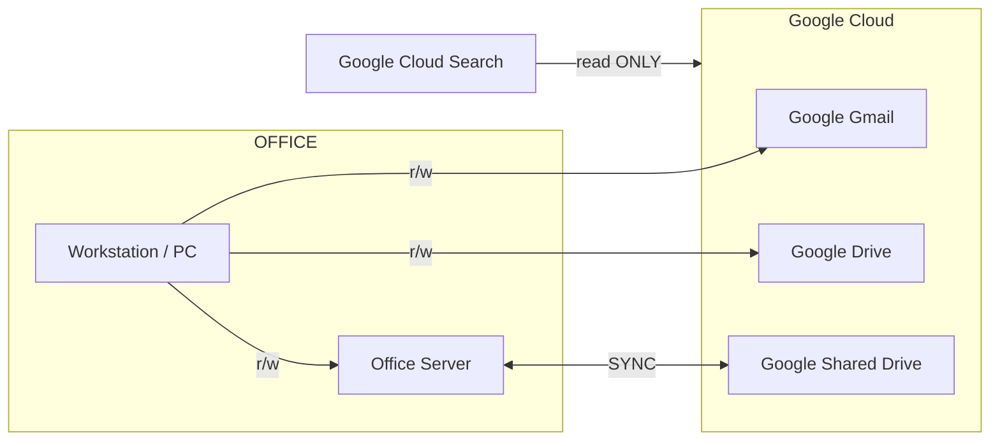

# Filing System and Email Management Guideline
---

Date: 04.02.2025 | Revision: 2024.11.d

## Introduction

The goal of filing system and email management strategy is to enhance efficiency, simplify access to critical documents, and leverage the strengths of **Google Workspace** tools. This guideline provides a structured approach to organizing emails and files with minimal effort while maintaining high levels of retrievability and clarity. We prioritize using **search** and **shared labels** over traditional folder hierarchies to maximize productivity.

?> More reading about [Google Search 101](/04-procedures/googleservice/GoogleSearch)

### Theoretical Foundation

Our approach to file and email management is rooted in the idea of accessibility and simplicity. Traditional folder structures, while visually organized, can be restrictive and inefficient, especially when dealing with a large volume of documents that might belong to multiple categories. By utilizing Google Workspace's **search capabilities** and a robust **labeling system**, we can quickly access documents without needing to recall their exact location within a hierarchical structure. The philosophy is to make information accessible based on its context and purpose, rather than its storage path.

### Relation Map

Note: 
**r/w** - Read and Write
**SYNC** - Synchronize

# PSEC Filing Systems

---

Date: 24.08.2025 | Revision: 2025.08.c

## 1.1 Gmail Label System

For PSEC, the Gmail label system is organized into three primary categories to streamline email management and ensure clarity across all projects and administrative tasks.

| Label Type | Name | Purpose & Workflow |
| :--- | :--- | :--- |
| **Project-Specific** | `Project Label` | Applied to all emails related to a specific project. This label is managed by the individual responsible for the project to keep all relevant correspondence organized and easily accessible. |
| **Action Required** | `Pending[PSEC]` | Used to mark any emails or items that require follow-up, review, or further action. This ensures that important tasks are not overlooked and can be tracked efficiently. |
| **Financial** | `Invoice to PSEC` | Assigned to all incoming invoices. This label helps centralize financial documents, making it easier to manage payments and track expenses. |

## 1.2 Server Filing System for Documents

Section below outlines the standardized project management folder system for PSEC's architectural and construction projects in New South Wales, Australia. It is designed to ensure consistency, clarity, and efficiency from project feasibility through to post-completion.

### 1.2.1 Core Principles

Our file organization is guided by four key principles:

| Principle | Description |
| :--- | :--- |
| **Consistent Numbering** | Main categories are prefixed with two digits (e.g., `01`, `02`) to maintain a logical and predictable order. |
| **Clear Hierarchy** | The structure is kept to a maximum of 3-4 levels deep to prevent over-nesting and ensure easy navigation. |
| **Standardized Naming** | Files like meeting minutes and invoices follow a strict `YYMMDD` format for chronological sorting. |
| **Version Control** | Superseded files are moved to `SS` folders to maintain a clean working directory and a clear document history. |

### 1.2.2 Root Structure Overview

| No. | Folder Name | Purpose |
| :-- | :--- | :--- |
| 01 | **Administration** | Central hub for financials, legal, and project reporting. |
| 02 | **Authorities** | Manages all interactions with government and regulatory bodies. |
| 03 | **Consultants** | Organizes all consultant deliverables, proposals, and correspondence. |
| 04 | **Contractor Correspondence** | Tracks all communication with the contractor, organized by project phase. |
| 05 | **Data Records** | Chronological log of critical project communications and site photos. |
| 09 | **Research Info** | Repository for non-project-specific research and reference materials. |

---

### 1.2.3 Detailed Folder Breakdown

#### Administration

The central hub for project administration, financial management, and business operations.

-   `01 Accounting/`
    -   `01 Feasibility/`: Financial feasibility studies.
    -   `02 Project Budget/`: Detailed project budgets and cost forecasts.
    -   `03 Project Expenses/`: Central repository for **all invoices**. Naming: `YYMMDD_ProjectCode_Company_(if Paid)`.
    -   `04 Finance - Bank Funding/`: Bank loan documentation.
-   `02 Legal/`: Legal contracts, agreements, and warranties.
-   `03 Meeting Minutes/`: Unified folder for all meeting records. Naming: `YYMMDD_ProjectCode_Subject_Attendee01-Attendee02(Company)`.
-   `04 Project Monthly Report/`: Regular project status and progress reports.
-   `05 Sales Contract and Marketing/`
    -   `01 Sales Contracts/`: Purchase agreements and settlement documents.
    -   `02 Marketing/`: Materials, agent agreements, and price lists.
    -   `03 Strata management/`: Strata bylaws and plans.
-   `09 Fieldwire Backups/`: Digital backups from the Fieldwire platform.

#### Authorities

Manages all interactions and submissions with government authorities and utility providers.

-   `01 NSW Planning Portal/`
-   `02 Council/` (DA, LEC, S4.55, S88B)
-   `03 PCA - building/` (CC, OC)
-   `04 PCA - Strata/`
-   `05 NSW Land Registry Services(LRS)/`
-   `06 NSW Fire & Rescue/`
-   `07 Sydney Water/`
-   `08 Energy Provider Ausgrid & EE/`
-   `09 Telstra & NBN/`
-   `10 Jemina/` (Gas)
-   `11 NSW RFS/`
-   `12 Water NSW/`
-   `13 Railcorp/`

#### Consultants

Manages all project consultants, their deliverables, and fee proposals.

> **Note:** Each consultant's root folder contains their **current working files**. Outdated files are moved to the `SS/` (Superseded) sub-folder. All invoices are filed in `01 Administration/03 Project Expenses/`.

-   `3D Physical model & Rendering/`
-   `Access & DDA compliance/`
-   `Acoustic engineering/`
-   `Arborist services/`
-   `Architecture services/`
-   `BASIX & Section J/`
-   `BCA (Building Code of Australia)/`
-   `Civil & Stormwater engineering/`
-   `Environmental assessment/`
-   `Facade engineering/`
-   `Fire Safety engineering/`
-   `Geotechnical engineering/`
-   `Hydraulic engineering/`
-   `Interior design/`
-   `Landscape architecture/`
-   `Level 3 ASP/`
-   `MEPF/` (Mechanical, Electrical, Plumbing, Fire)
-   `Planning consultants/`
-   `Project management services/`
-   `Quantity surveying/`
-   `Structural engineering/`
-   `Survey services/`
-   `Sydney Water coordination/`
-   `Traffic engineering/`
-   `Vertical Transport Engineer/`

#### Contractor Correspondence

Tracks all formal communication with the contractor, organized by project phase.

-   `01 Tender/`: Tender process documentation.
-   `02 Construction/`
    -   `01 RFI_AI_Notice/`: Requests for Information and Architect's Instructions.
    -   `02 Progress Claim/`: Progress payment claims.
    -   `03 EOT/`: Extension of Time requests.
    -   `04 Variations/`: Contract variations.
    -   `05 PCG reports/`: Project Control Group reports.
    -   `06 QA check/`: Quality Assurance checks.
-   `03 Pre-OC/`: Pre-Occupation Certificate activities.
-   `04 Post PC/`: Post-Practical Completion activities.

#### Data Records

A chronological log for critical information and communications not captured elsewhere.

> **Best Practice:** Use descriptive filenames and maintain chronological order for easy retrieval.

-   **Naming Convention:**
    -   `YYMMDD_IN_description`: For incoming correspondence.
    -   `YYMMDD_OUT_description`: For outgoing correspondence.
-   **Contents:**
    -   Important project communications.
    -   Key decisions and approvals.
    -   Chronological site photos.

#### Research Info

A repository for non-project-specific research, industry standards, and reference materials.

> **Note:** Once a product or system is selected for the project, its specifications should be relocated to the relevant consultant's folder (e.g., a selected cladding spec moves to `03 Consultants/Facade engineering/`).

-   **Contents:**
    -   Industry best practices.
    -   Regulatory updates.
    -   Market research.
    -   Technical specifications for potential products.

---

# SAIYU Filing Systems

---

DDate: 04.02.2025 | Revision: 2024.11.d

## 2.1 Email Management: Gmail

SAIYU employs a label-based system in Gmail to ensure consistent and efficient email management. This approach allows for greater flexibility than traditional folders, as a single email can be assigned multiple labels.

#### Shared Labels

To streamline email retrieval, all team members must use the following shared labels:

- **`Contracts-and-Related`**: Applied to all email threads involving contract discussions, agreements, amendments, and other formal communications.
- **`Invoices-to-SAIYU`**: Used for all incoming invoices from subcontractors, vendors, and suppliers.
- **`Quotations-Received`**: Assigned to all quotations received from or sent to external partners.
- **`Verified`**: Indicates that an email's content has been reviewed and processed. This label can be used alone or with other labels (e.g., `Invoices-to-SAIYU`) to confirm that an invoice has been checked.
- **`Pending`**: Marks any email or document requiring further action or resolution.

#### Search-Oriented Strategy

Instead of creating project-specific labels, we rely on Google Workspace’s powerful search capabilities. Employees are expected to include project names and relevant keywords in email subjects and content to facilitate effective searches. For advanced search techniques, refer to the [Google Search 101](/04-procedures/googleservice/GoogleSearch)

---

## 2.2 Document Management: Google Shared Drive

All company documents are stored in a Google Shared Drive, which is synchronized with an office-based NAS (Network Attached Storage) to ensure data redundancy and accessibility.

#### Folder Structure

Our Shared Drive uses a flat, categorized folder system to simplify navigation:

- **`00-Saiyu-Admin`**: Core administrative documents, including company details, logos, insurance certificates, builder licenses, and business templates.
- **`01-Saiyu-Accounts`**: Financial records, including audit information, invoices (incoming, filed, and problematic), and payment documentation.
  > *Note: As of June 2024, some functions of this folder have been deprecated. Legacy information remains for archival purposes. (Updated: 12 Dec 2024)*
- **`02-Operation`**: Operational resources, including CRM lists, Safework documentation, Australian Standards (AS), and handbooks.
  > *Note: This folder is under construction. Additional uses are to be determined. (Updated: 12 Dec 2024)*
- **`Projects_Archived`**: Completed projects, with each project in a designated folder named using the format: `[Project Code]_[Project Address] ([Nickname])`.
- **`Projects_Current`**: Active projects, following the same naming convention as archived projects.
  > *Example: `SY200723_47 Thomson St Kiama (K3)`*
  > *Note: `SY` denotes SAIYU, and `200723` represents the approximate start date (YYMMDD).*
- **`Projects_Potential`**: Prospective projects, named using the format: `[Suburb]_[Project Address]`.
  > *Example: `Maroubra_51 Chester Ave`*
- **`Research`**: Case studies and research materials.
- **`Temporary`**: Temporary files, which are periodically deleted.

---

#### 3. Operational Guidelines

- **Labeling Responsibility**: The recipient of an email is responsible for applying the correct labels. For documents, the uploader must ensure proper naming and placement.
- **Archiving**: Documents and emails that are no longer active should be labeled as **Archived** and moved to the appropriate archive folder.
- **System Maintenance**: The filing system and label structure will be reviewed every six months to remove outdated information and ensure efficiency.

#### 4. Best Practices

- **Avoid Duplication**: Do not store identical documents in multiple locations.
- **Use Consistent Keywords**: Employ consistent keywords in document titles and email subjects to improve searchability.

