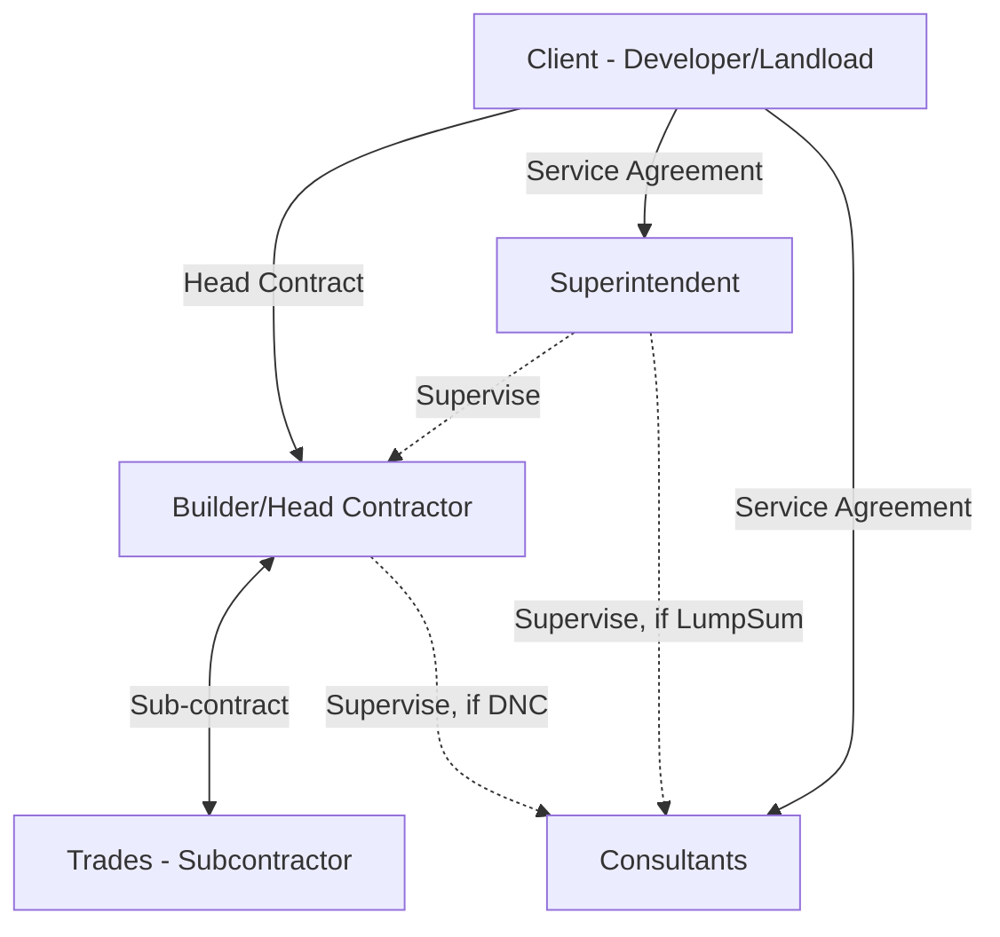

# Construction Contract Explained
---

Last Update: 23.08.2025 | Revision: 2025.08.a

## Relationship

## Major Types of Construction Contracts

### Defined by Payment/Scope Structures

1. **Lump Sum Contract**  
   - **Description**: A fixed price for a clearly defined scope of work.  
   - **Risk Allocation**: The builder assumes the risk of cost overruns unless scope changes or variations arise.

2. **Design and Construct (DNC) Contract**  
   - **Description**: The contractor is responsible for both the design and the construction of the project.  
   - **Risk Allocation**: Design liability and construction risk largely sit with the contractor.

3. **Cost Plus Contract**  
   - **Description**: The owner pays for the actual costs of the work (labor, materials, etc.) plus an agreed fee (either a percentage of costs or a fixed fee).  
   - **Risk Allocation**: The owner bears the risk of cost overruns, as the final price can fluctuate with changing costs.

---

### Standard Contract Forms

#### Issuing Authorities and Typical Biases

These are pre-drafted templates that reflect the perspectives (and often the vested interests) of their issuing bodies. Parties commonly use these templates as a base, then modify or “amend” them to suit specific project needs.

| Form | Issuing Authority | Typical Bias / Purpose |
|---|----|----|
| **AS_Contracts** | Standards Australia | A- relatively neutral baseline with balanced risk allocation.|
| **Amended_AS**   | Customized by drafting parties (e.g., developers, principal’s lawyers) | Typically shifts risk to favor the drafting party—for instance, tighter deadlines or limited contractor entitlements. |
| **MBA NSW** | Master Builders Association (NSW) | Generally builder-friendly; aligns with NSW building legislation and includes provisions beneficial to contractors.|
| **HIA** | Housing Industry Association | Simplified residential contracts; typically builder-friendly with streamlined provisions for smaller-scale jobs. |
| **ABIC** | Jointly by the Australian Institute of Architects & Master Builders Australia | Balances architect and builder interests; architects often play a central role in contract administration (e.g., certifying payments). |

---

### Why It Matters

- **Developers** often prefer using **Amended AS contracts** so they can insert clauses that shift more risk or impose stricter performance obligations on the builder.  
- **Builders** frequently opt for **MBA NSW / HIA contracts** for their familiarity and builder-friendly terms.  
- **Architects** typically recommend **ABIC forms**, which integrate design oversight and contract administration powers for the architect.

Understanding both **contract type** (lump sum, DNC, cost plus) and **standard contract form** (AS, MBA, HIA, ABIC) is crucial for balancing risk, controlling costs, and defining roles clearly in any construction project.

---

Page Title: Contract Explained | Last Update: 23.08.2025 | Revision: 2025.08.a | Status: Published
