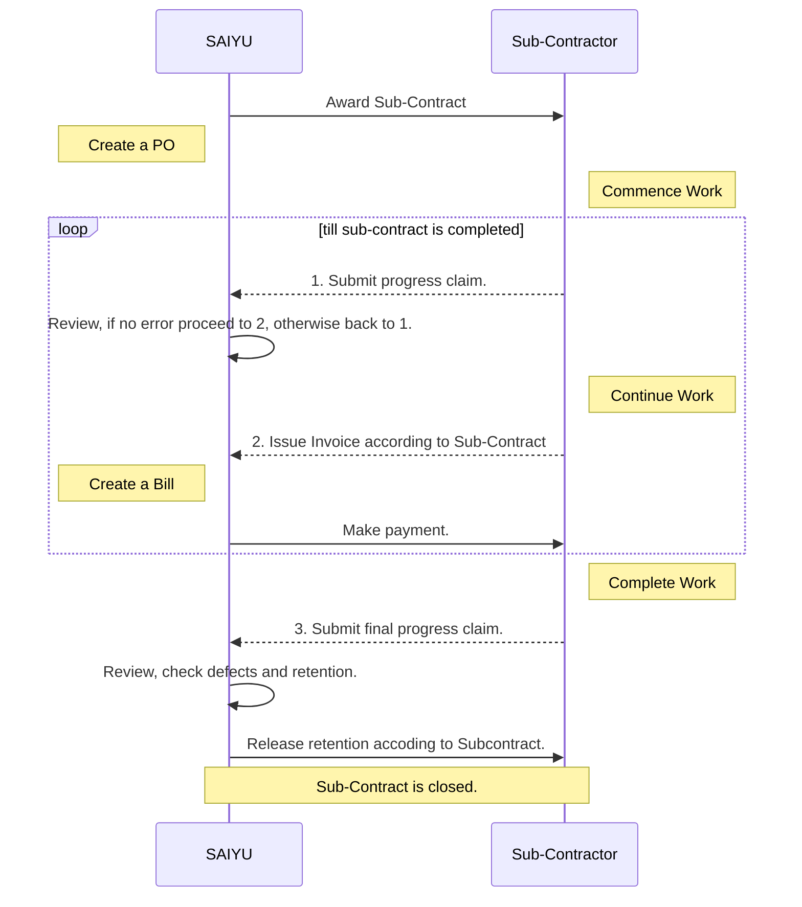

# Purchasing Order (POs) & Bills Explained
---

Date: 04.02.2025 | Revision: 2024.08.c

> **Goal:** Maintaining transparency and simplifying the process for both administrative and accounting purposes.

## Relationship

## Relationship Between POs, Bills, and Invoices

### Purchase Orders (POs)

  - A Purchase Order (PO) outlines the scope of work or the materials to be supplied.
  - Specifies the agreed amount (from Bids and Tender) or an estimated amount based on previous expenditures.
  - Serves as an official record of what has been ordered and authorizes the start of work or delivery of goods.
  - Review and **APPROVE** is critical, once approved cost then will be shown in **Job Costing Budget Panel - Committed Cost**

### Bills

  - Represent the amount we owe to a subcontractor or supplier for work performed or materials provided.
  - **Important:** Bills **must always** be linked to a corresponding PO; they **cannot** be created independently.
  - The total of all bills related to a specific PO must **never exceed** the amount specified in the PO (Buildtrend has a system policy, so these rule is default).
  - This ensures financial control and prevents overspending.

### Invoices

  - Requests for payment submitted by subcontractors or suppliers.
  - The work completed or the amount owed is not based solely on the invoices themselves but on the **approved invoices**.

- **Approval Process:**
  - **Verify** the invoice's accuracy.
  - **Check** for duplicates.
  - **Ensure** the amount claimed is legitimate.
  - **Confirm** that the work was completed without defects.
  - **Cross-check** against the original contract terms.
  - Once these checks are completed, the project manager or contract administrator must:
    - **Link** the invoice to a bill in the system.
    - **Mark** the bill as **"Ready for Payment"**.

- **Note:**
  - Marking a bill as **"Ready for Payment"** indicates that everything has been fully assessed and approved, signifying that the payment process can proceed.
  - It's possible to create a bill and link an invoice without marking it as **"Ready for Payment"**, but this means the invoice has **not** been fully reviewed and approved yet. e.g. pending for a signed docket.

> for invoice managment, more details refer to [Procedure for Filing Invoices](/Sub-Contract/IncomingInvoices)
{.is-info}

### Summary

In summary:

- **POs** define the spending scope.
- **Bills** track expenses within that scope.
- **Invoices**, once approved, initiate payment processes.

This workflow ensures thorough checks and balances, maintaining financial discipline and accuracy throughout the project.

## Approach to Creating Purchase Orders (POs)

Create purchase orders (POs) for different types of subcontractors based on their **characteristics**:

### Main Sub-Contractors

- **Policy:**
  - For each main contractor or subcontractor (except for accounts and labor), create **one PO per job**.
  - This PO covers all aspects of their work on that job, including major and minor tasks, as well as any variations.
  - It serves as a single PO that encapsulates everything for that contractor on that particular job.

### Accounts and Labor

- **Policy:**
  - Operate on a different billing cycle, typically monthly.
  - **Accounts:**
    - Create a **new PO for each billing cycle** (monthly).
  - **Labor:**
    - The PO may cover a month, but **itemize each week's labor separately** within that PO.
    - This allows for clear tracking and accountability of weekly labor costs.

### One-Off Trades/Subcontractors

- **Policy:**
  - Even for one-off tasks like specialized services (e.g., concrete pumping or cutting), maintain the approach of **one contractor, one PO**.
  - Ensures all activities by that contractor are consolidated under a single PO for organizational clarity and ease of management.

---

Page Title: POs & Bills | Last Update: 20.11.2024 | Revision: 2023.02.c | Status: Published
