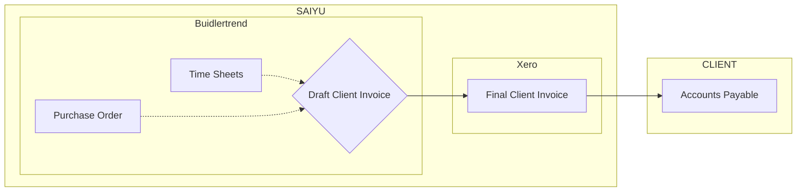

# SAIYU - Invoicing to Clients 
---

Date: 09.02.2025 | Revision: 2025.02.a

## Overview

Starting from 2025, all invoices from **Saiyu** will be managed exclusively through **Buildertrend**, regardless of the contract type. The invoicing pipeline is scenario-based, tailored to the nature of the contract. The following sections outline the pipelines for each contract type:

- **Lump Sum Contract**
- **Design and Construct (D&C) Contract**
- **Cost Plus Contract**

More reading about [Contract Types](/02-commercial/ConstructionContractExplained.md)

## Flow Chart

---

## 1. Lump Sum Contract

### Description
A fixed-price contract with a clearly defined scope of work. Invoicing is straightforward, issued as **progress claims** or at **predetermined stages**.

### Process

1. **Invoice Generation**  
   - Generate the client invoice (**progress claim** or **per stage**) directly from Buildertrend.

1. **Financial Disclosure**  
   - No internal financial details from Saiyu are disclosed in the client invoice.

1. **Synchronization to Xero**  
   - Sync the generated client invoice from Buildertrend to **Xero**.

1. **Final Issuance**  
   - Issue the final invoice to the client from **Xero**.

---

## 2. Design and Construct (DNC) Contract

### Description
In this contract, the contractor is responsible for both **design and construction**. Depending on client requirements, **partial financial information** may be disclosed.

### Process

1. **Review POs**  
   - Review **Purchase Orders (POs)** in Buildertrend.

2. **Invoice Generation**  
   - Convert the POs into a **client invoice** in Buildertrend, incorporating any contract required **partial financial disclosures**.

3. **Consultant Handling**  
   - All consultants involved are treated as **subcontractors** within the invoicing process.

4. **Synchronization to Xero**  
   - Sync the generated client invoice from Buildertrend to **Xero**.

5. **Final Issuance**  
   - Issue the final invoice to the client from **Xero**.

---

## 3. Cost Plus Contract

### Description
A contract where the **owner pays actual costs** (labor, materials, etc.) plus an **agreed fee**. This is the most complex scenario and is split into two pipelines:  
- One for **Saiyu’s management services**  
- Another for the **construction component**

### 3.1 Management Component

#### Process

1. **Timesheet Recording**  
   - Record all **management activities** via timesheets in Buildertrend.

2. **Invoice Generation**  
   - Generate a **management invoice** directly from the timesheets in Buildertrend.

4. **Synchronization to Xero**  
   - Sync the generated client invoice from Buildertrend to **Xero**.

5. **Final Issuance**  
   - Issue the final invoice to the client from **Xero**.

### 3.2 Construction Component

#### Process

1. **PO Creation**  
   - Create a **Purchase Order (PO)** in Buildertrend for **construction activities**.

2. **Invoice Generation**  
   - Convert the POs into a **client invoice** in Buildertrend.

4. **Synchronization to Xero**  
   - Sync the generated client invoice from Buildertrend to **Xero**.

5. **Final Issuance**  
   - Issue the final invoice to the client from **Xero**.

---

## Summary

- **Unified Platform**  
  - All client invoices are managed through **Buildertrend** and synchronized with **Xero**.

- **Lump Sum Contracts**  
  - Invoices are issued as **progress claims** or at **predetermined stages**.  
  - No internal financial data is disclosed to the client.

- **Design and Construct (DNC) Contracts**  
  - Invoices may include **partial financial disclosures** as required by the client.  
  - **Consultants are treated as subcontractors**.

- **Cost Plus Contracts**  
  - **Management Invoicing**  
    - Generated from **timesheets** in Buildertrend, synced to Xero, and issued to the client.  
  - **Construction Invoicing**  
    - Generated from a **Purchase Order** in Buildertrend, synced to Xero, and issued to the client.

---

Page Title: Invoice to Client | Last Update: 09.02.2025 | Revision: 2025.02.a | Status: Published
