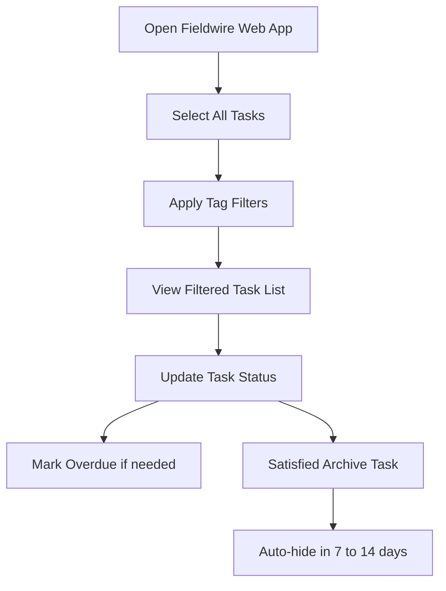

# Fieldwire Task Management for PSEC Project

**Document Information:**
- Date: 14.05.2025 | Revision: 2025.05.a
- Category: Operations Guide
- Applies to: PSEC Projects

## Overview

This document outlines how to use **Fieldwire's Tasks** feature for effective project management for **PSEC**. The system is structured to support compliance tracking, meeting follow-ups, and documentation of open issues using tags, filters, and categories. Emphasis is placed on using **tags** to organize tasks such as **CC Checklists**, **OC Checklists**, and **Meeting** and **Minutes**.

> **Important:** Always use the standardized tags and status formats when creating or editing tasks to ensure consistent filtering and reporting.

## Task Filtering and Navigation

### Accessing All Tasks

1. **Open Fieldwire Web App** and log into the PSEC project.
2. Click on the **Tasks** tab in the left-hand navigation bar.
3. Under the Tasks section, select **All Tasks** to view the complete list.

### Filtering by Tag

1. Click the **Filter** button at the top of the task list.
2. In the **Tag** section of the filter menu:
   - Tick **`meeting`** and **`minutes`** to display all meeting-related items.
   - Tick **`cc checklist`** or **`oc checklist`** to focus on compliance conditions.
3. Any lost items (i.e. new created tasks), can be found by applying `no tag`.

> **Note:** Tags are essential for organizing task visibility—always ensure tasks are properly tagged when created.

## Task Status and Priority System

### Status Naming Convention

Tasks follow the naming format based on the **PCA CC checklist**, so might **differ** from project to project.

**Example for Gerringong Project:**
- **Not Satisfied** – High Priority
- **Not Submitted** – Normal Priority
- **On Hold**
- **Satisfied**
- **Noted Only**

### Overdue Highlighting

- **Urgent** status has been removed for screen clarity.
- Marking a task as **Overdue** will highlight it in the far left column of the task list.

## Archiving and Auto-Hide Function

1. When a task reaches **Satisfied** and no further action is required:
   - Manually mark `meeting` / `minutes` tasks as **Archive**.
   - If it is an `OC or CC Checklist` item, leave the item as **Satisfied**
2. Archived tasks will **auto-hide** after 7–14 days.
3. To view archived tasks, enable the toggle switch in the task view settings.

> **Note:** Archived tasks are hidden, not deleted—they can be re-shown anytime via toggle settings.

## Task Categorization by Consultant

- Each consultant involved in the project (e.g., PCA, certifier, structural engineer) has their own **task category**.
- Assign new tasks to the correct consultant category during creation to ensure proper accountability.

## Summary Workflow

## Best Practices

### Task Creation
- Always assign appropriate tags during task creation
- Use consistent naming conventions
- Assign to correct consultant category
- Set appropriate priority levels

### Task Management
- Regularly update task status
- Use overdue marking for urgent items
- Archive completed tasks appropriately
- Review and filter tasks regularly

### Compliance Tracking
- Use CC and OC checklist tags for compliance items
- Maintain clear status updates
- Document progress in task comments
- Ensure proper handover between team members

## Troubleshooting

### Common Issues
- **Tasks not appearing:** Check filter settings and tag assignments
- **Missing archived tasks:** Enable archived task toggle in view settings
- **Incorrect categorization:** Verify consultant category assignments
- **Status confusion:** Refer to project-specific status naming conventions

### Support Resources
- Fieldwire Help Documentation
- Project-specific status guidelines
- Team training materials
- IT support for technical issues