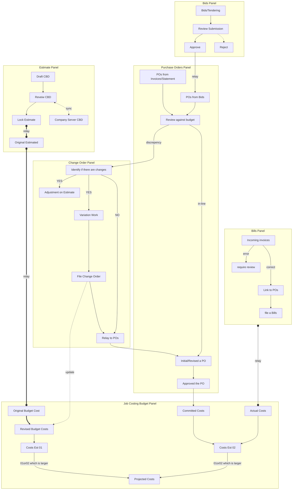

# Subcontracting and Budget Management Workflow

Date: 23.08.2025 | Revision: 2025.08.a

## 1. Introduction

This document provides a comprehensive overview of the subcontracting lifecycle, from initial tendering and contract letting to ongoing budget management within Buildertrend. It outlines the key stages, procedures, and best practices to ensure financial control and project success.

## 2. Subcontracting Basics

- **Standard Contracts:** SAIYU utilizes the Master Builders Association of NSW's Standard Trade Contract for all sub-contracting agreements.
- **Amendments:**
  - Appendix A: Amends the Scope of Work.
  - Appendix B: Amends the Special Conditions.
- **Resources:**
  - **Master Builders Association of NSW:** [_https://www.mbansw.asn.au/_](https://www.mbansw.asn.au/)
  - **Appendices:** [_Google Drive_](https://drive.google.com/drive/folders/1dZKqt3NBSAydYDgIb46Gk-KLP-n1xbjI?usp=drive_link)

## 3. Tendering Process

### 3.1. Starting a Tender

1.  **Prepare Tendering Package:** Upload the scope of work, drawings, and reports to the project folder.
2.  **Create Bids in Buildertrend:** List all subcontractors who will receive the package.
3.  **Deliver Package:** Email the information package to the selected subcontractors.

> **Note:** Do not send notifications to contractors via Buildertrend. The platform is for internal record-keeping only.

### 3.2. Maintaining a Tender

1.  **Follow-up:** Call subcontractors to confirm receipt of the tender package.
2.  **Ensure Clarity:** Verify that all subcontractors have reviewed the information and address any questions.
3.  **Distribute Updates:** If new information is provided to one subcontractor that impacts scope or cost, it must be shared with all.
4.  **Track Design Changes:** Keep all subcontractors informed of any design changes during the tendering period.
5.  **Evaluate Submissions:** Conduct an "apple-to-apple" comparison of the packages received.

### 3.3. Awarding a Subcontract

1.  **Review Submissions:** Evaluate the information submitted by subcontractors.
2.  **Present for Review:** Present the evaluation to the PM or Director for a final decision.
3.  **Prepare Subcontract:**
    - Create a draft contract.
    - Update Appendices A & B.
    - Verify that all drawings and reports are up-to-date.
    - Check the subcontractor's Certificate of Currency (COC) and ABN.
    - Confirm the timeframe and staging with the PM.
4.  **Issue for Signature:** Send the draft subcontract to the subcontractor for review and signature.
5.  **Finalize:** Collect the signed subcontract and update the Purchase Order (PO) in Buildertrend.

## 4. Contract Letting and Budget Management in Buildertrend

### 4.1. Workflow Chart

### 4.2. Workflow Explanation

-   **Estimate Panel:** Create and lock the **Original Estimate**. Avoid editing it after it's locked.
-   **Change Orders:** Use **Change Orders** to track all budgetary changes, which automatically reflect in the Job Costing Budget Panel.
-   **Job Costing Budget Panel:** This is the primary tool for managing financials. It tracks the **Original Budget**, manages revisions via **Change Orders**, and monitors **Committed** and **Actual Costs**.

### 4.3. Key Panels in Buildertrend

-   **Estimate Panel:** Serves as the foundation for financial planning. Once locked, it should not be changed.
-   **Bids Panel:** Records tender details from subcontractors. Approved bids should be reflected in the budget via a **Change Order**, not by editing the estimate.
-   **Job Costing Budget Panel:** The central hub for tracking financial updates. It is independent of the Estimate Panel and provides clarity on awarded contract value (**Committed Cost**) and work completed (**Actual Cost**).

> For a detailed discussion on Purchase Orders and Bills, refer to [Procedure for Managing Invoices, POs, and Bills in Buildertrend](04-procedures/buildertrend/BT-Workflow-Invoices-Bills-POs.md).

---

Page Title: Subcontracting and Budget Management Workflow | Last Update: 23.08.2025 | Revision: 2025.08.a | Status: Published