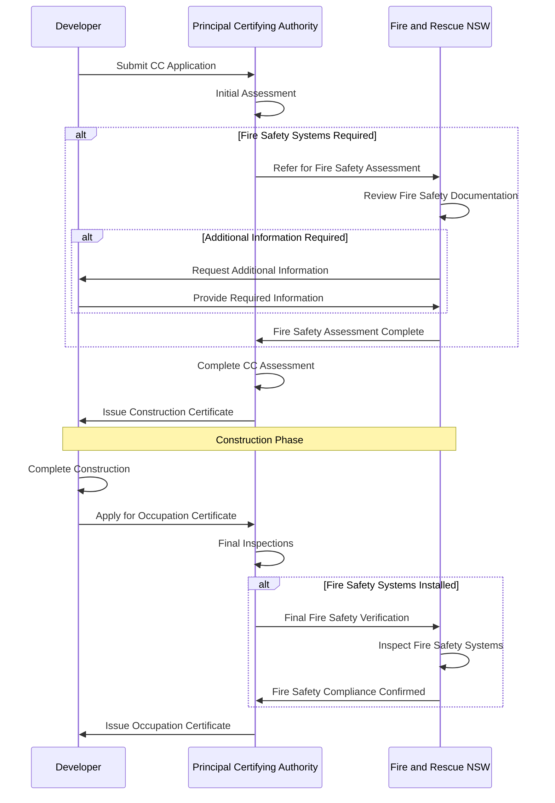

# Class 1 Building Construction Certificate Application Process

This document outlines the Application Process (CC) for Class 1 Buildings, defining key terms and illustrating the application flow from Developer to Principal Certifying Authority (PCA) and Fire and Rescue NSW (FRNSW).

## Key Definitions

### FEB - Fire Engineering Brief
A document that outlines the fire safety strategy for a building project, including performance-based solutions and alternative compliance methods.

### PBDB - Performance-Based Design Brief
A comprehensive document detailing performance-based design solutions that demonstrate compliance with fire safety objectives through alternative methods.

### FER - Fire Engineering Report
A detailed technical report that provides analysis and documentation of fire engineering solutions, including modeling, calculations, and compliance demonstrations.

### IFSR - Integrated Fire Safety Report
A comprehensive report that integrates all fire safety systems and measures for a building project, ensuring coordinated fire safety outcomes.

### FFSR - Final Fire Safety Report
The concluding report that documents the completed fire safety installations and verifies compliance with approved designs and relevant standards.

### FRNSW - Fire and Rescue NSW
The statutory authority responsible for fire safety regulation, emergency response, and building fire safety compliance in New South Wales.

## Application Process Flow

The following sequence diagram illustrates the typical application flow:

## Process Stages

### 1. Pre-Application Phase
- **Fire Safety Strategy Development**
  - Prepare Fire Engineering Brief (FEB) if required
  - Develop Performance-Based Design Brief (PBDB) for alternative solutions
  - Coordinate with fire safety consultants

- **Documentation Preparation**
  - Compile architectural and engineering drawings
  - Prepare fire safety system specifications
  - Gather relevant compliance documentation

### 2. Construction Certificate Application
- **Application Submission**
  - Submit CC application to Principal Certifying Authority
  - Include all required fire safety documentation
  - Pay applicable fees

- **PCA Assessment**
  - Initial review of application completeness
  - Technical assessment of building compliance
  - Coordination with relevant authorities

### 3. FRNSW Assessment (if applicable)
- **Referral Triggers**
  - Buildings with fire safety systems
  - Performance-based fire safety solutions
  - Complex fire safety arrangements

- **Assessment Process**
  - Review of Fire Engineering Report (FER)
  - Evaluation of Integrated Fire Safety Report (IFSR)
  - Assessment of compliance with fire safety standards

### 4. Construction Phase
- **Installation Oversight**
  - Monitor fire safety system installation
  - Conduct progress inspections
  - Verify compliance with approved designs

- **Documentation Updates**
  - Maintain as-built documentation
  - Record any approved variations
  - Prepare for final inspections

### 5. Occupation Certificate Application
- **Final Inspections**
  - Complete building inspections
  - Test fire safety systems
  - Verify Final Fire Safety Report (FFSR)

- **FRNSW Final Assessment**
  - Inspect installed fire safety systems
  - Verify operational compliance
  - Confirm maintenance arrangements

## Key Requirements

### Fire Safety Documentation
- Fire Engineering Brief (where applicable)
- Performance-Based Design Brief (for alternative solutions)
- Fire Engineering Report
- Integrated Fire Safety Report
- Final Fire Safety Report
- System commissioning reports

### Compliance Standards
- Building Code of Australia (BCA)
- Australian Standards (AS series)
- Fire and Rescue NSW guidelines
- Local council requirements

### System Requirements
- Fire detection and alarm systems
- Emergency lighting and exit signs
- Fire suppression systems (where required)
- Smoke management systems
- Emergency warning and intercommunication systems

## Common Challenges

### Documentation Issues
- Incomplete fire safety documentation
- Inconsistencies between drawings and specifications
- Missing commissioning reports
- Inadequate maintenance procedures

### Technical Compliance
- Complex performance-based solutions
- Integration of multiple fire safety systems
- Coordination between different trades
- Verification of system performance

### Process Delays
- Incomplete applications
- Additional information requests
- Coordination between authorities
- System testing and commissioning

## Best Practices

1. **Early Engagement**
   - Consult with PCA and FRNSW early in design phase
   - Engage qualified fire safety consultants
   - Coordinate with all relevant stakeholders

2. **Documentation Management**
   - Maintain comprehensive project documentation
   - Ensure consistency across all documents
   - Implement version control procedures

3. **Quality Assurance**
   - Conduct regular design reviews
   - Implement inspection and testing protocols
   - Verify compliance at each stage

4. **Communication**
   - Maintain regular communication with authorities
   - Provide timely responses to information requests
   - Coordinate between all project stakeholders

---

*This document provides an overview of the Class 1 Building CC application process. For specific project requirements, consult with qualified professionals and relevant authorities.*