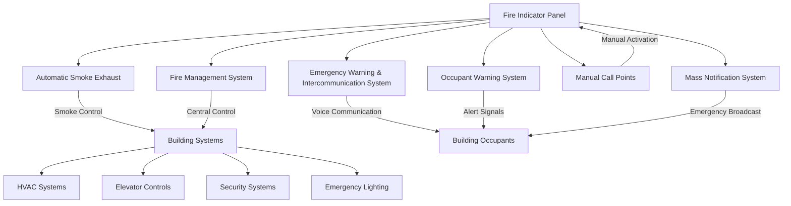

# Fire Indicator Panels (FIP)

This document provides comprehensive information on Fire Indicator Panels (FIPs), including their modular configuration, key components, external system communication, and compliance requirements.

## System Overview

Fire Indicator Panels are critical components of fire detection and alarm systems, providing centralized monitoring and control of fire safety systems within a building.

## Modular Configuration

### Internal Module Capacity
- **Maximum Modules**: Up to 8 internal modules per panel
- **Detection Zones**: Up to 64 detection zones total
- **Expandability**: Modular design allows for system expansion
- **Redundancy**: Built-in backup and failover capabilities

### Module Types
- **Input Modules**: For fire detectors and manual call points
- **Output Modules**: For alarm devices and system controls
- **Communication Modules**: For network connectivity
- **Power Modules**: For system power management

## Key Components

### Firefighter Facility
A dedicated interface providing firefighters with:
- **System Status Display**: Real-time fire system status
- **Zone Identification**: Clear identification of activated zones
- **Manual Controls**: Override and control functions
- **Communication Interface**: Direct communication capabilities
- **Emergency Access**: Secure but accessible during emergencies

### Network Compatibility
Modern FIPs feature comprehensive network integration:
- **Protocol Support**: Multiple communication protocols
- **Network Redundancy**: Backup communication paths
- **Remote Monitoring**: Off-site monitoring capabilities
- **Integration Capability**: Connection with building management systems
- **Scalability**: Support for large, distributed systems

## External System Communication

The FIP communicates with various external systems to provide comprehensive fire safety coverage:

### System Descriptions

#### ASE - Automatic Smoke Exhaust
- **Function**: Automated smoke removal and ventilation control
- **Integration**: Direct interface with FIP for coordinated response
- **Operation**: Activates based on fire detection signals
- **Control**: Manual override capabilities through FIP

#### EWIS/OWS - Emergency Warning & Intercommunication/Occupant Warning System
- **Function**: Voice communication and warning systems
- **Coverage**: Building-wide communication capabilities
- **Features**: Pre-recorded messages and live announcements
- **Integration**: Coordinated activation with fire detection

#### FMS - Fire Management System
- **Function**: Centralized fire system management and control
- **Scope**: Integration of all fire safety systems
- **Monitoring**: Real-time system status and performance
- **Reporting**: Comprehensive logging and reporting capabilities

#### MCP - Manual Call Points
- **Function**: Manual fire alarm activation points
- **Location**: Strategic placement throughout building
- **Operation**: Direct connection to FIP for immediate response
- **Testing**: Regular testing and maintenance protocols

#### MNS - Mass Notification System
- **Function**: Large-scale emergency communication
- **Capability**: Multi-modal notification (audio, visual, text)
- **Integration**: Coordinated with fire detection and alarm systems
- **Coverage**: Building-wide and external notification capabilities

## REMTEC Integration

### Remote Technology Features
- **Remote Monitoring**: Off-site system monitoring capabilities
- **Diagnostic Tools**: Advanced system diagnostics and troubleshooting
- **Maintenance Alerts**: Proactive maintenance notifications
- **Performance Analytics**: System performance analysis and optimization
- **Cloud Connectivity**: Secure cloud-based monitoring and control

## Compliance Standards

### AS1670 - Fire Detection, Warning, Control and Intercom Systems
- **Installation Requirements**: Proper system installation standards
- **Performance Criteria**: System performance and reliability standards
- **Testing Protocols**: Commissioning and acceptance testing procedures
- **Documentation**: Required system documentation and records

### AS1851.6-8 - Routine Service of Fire Protection Systems
- **Maintenance Schedules**: Regular maintenance requirements
- **Service Procedures**: Standardized service and testing procedures
- **Record Keeping**: Maintenance and service record requirements
- **Competency Requirements**: Technician qualification standards

## Testing Requirements

### Monthly Testing (AS 1851-2012)
- **Visual Inspections**: System component visual checks
- **Functional Tests**: Basic system operation verification
- **Battery Tests**: Backup power system testing
- **Alarm Tests**: Alarm device functionality verification
- **Documentation**: Test results recording and reporting

### Bi-Annual Testing
- **Comprehensive Testing**: Full system performance testing
- **Communication Tests**: Network and communication verification
- **Integration Tests**: Multi-system coordination testing
- **Performance Analysis**: System performance evaluation
- **Compliance Verification**: Standards compliance confirmation

## NSW Legislation Compliance

### Regulatory Framework
- **Environmental Planning and Assessment Act**: Development compliance
- **Building and Development Control Regulation**: Construction standards
- **Fire and Rescue NSW Guidelines**: Fire safety requirements
- **Local Council Requirements**: Local fire safety provisions

### Certification Requirements
- **System Certification**: Third-party system certification
- **Installation Certification**: Qualified installer certification
- **Commissioning Reports**: System commissioning documentation
- **Compliance Certificates**: Ongoing compliance verification

## Installation Considerations

### Location Requirements
- **Accessibility**: Easy access for operation and maintenance
- **Visibility**: Clear visibility of status indicators
- **Protection**: Protection from environmental hazards
- **Security**: Secure but accessible during emergencies

### Power Requirements
- **Primary Power**: Reliable mains power supply
- **Backup Power**: Battery backup systems
- **Power Quality**: Clean, stable power supply
- **Monitoring**: Power supply monitoring and alerts

### Network Infrastructure
- **Communication Cables**: Appropriate cable types and routing
- **Network Redundancy**: Backup communication paths
- **Interference Protection**: Protection from electromagnetic interference
- **Future Expansion**: Provision for system expansion

## Maintenance and Service

### Routine Maintenance
- **Scheduled Inspections**: Regular system inspections
- **Preventive Maintenance**: Proactive component maintenance
- **Performance Monitoring**: Ongoing system performance monitoring
- **Documentation**: Comprehensive maintenance records

### Emergency Service
- **24/7 Support**: Round-the-clock emergency support
- **Rapid Response**: Quick response to system faults
- **Temporary Solutions**: Interim measures during repairs
- **System Restoration**: Complete system restoration procedures

---

*This document provides comprehensive information on Fire Indicator Panels. For specific installation and maintenance requirements, consult with qualified fire safety professionals and relevant authorities.*