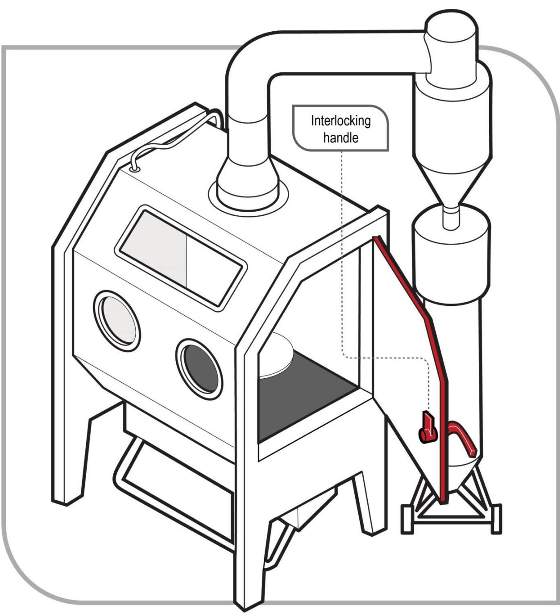

# Abrasive blasting

Code of Practice

# Disclaimer

Safe Work Australia is an Australian Government statutory body established in 2009. Safe Work Australia includes Members from the Commonwealth, and each state and territory, Members representing the interests of workers and Members representing the interests of employers.

Representing the interests of employers.

Safe Work Australia works with the Commonwealth, state and territory governments to improve work health and safety and workers' compensation arrangements. Safe Work Australia is a national policy body, not a regulator of work health and safety. The Commonwealth, states and territories have responsibility for regulating and enforcing work health and safety laws in their jurisdiction.

ISBN 978- 0- 642- 78417- 9 (PDF)  ISBN 978- 0- 642- 78418- 6 (DOCX)

# Creative Commons

This copyright work is licensed under a Creative Commons Attribution- Noncommercial 4.0 International licence. To view a copy of this licence, visit creativecommons.org/licenses In essence, you are free to copy, communicate and adapt the work for non- commercial purposes, as long as you attribute the work to Safe Work Australia and abide by the other licence terms.

Safe Work Australia | info@swa.gov.au | www.swa.gov.au

# Contents

Foreword 4

1. Introduction 5

1.1. What is abrasive blasting? 5  1.2. Who has health and safety duties in relation to abrasive blasting? 5  1.3. What is involved in managing risks associated with abrasive blasting? 7  1.4. Information, training, instruction and supervision 8

2. The risk management process 10

2.1. Identifying the hazards 10  2.2. Assessing the risks 11  2.3. Controlling the risks 12  2.4. Maintaining and reviewing control measures 13

3. Specific hazards and control measures 17

3.1. Prohibited and restricted chemicals 17  3.2. Dust 18  3.3. Particulate matter 28  3.4. Abrasive blasting plant and equipment 31  3.5. Recycling of blast material 35  3.6. Disposal of waste 35

4. Other hazards and control measures 36

4.1. Noise 36  4.2. Heat 37  4.3. Vibration 38  4.4. Manual tasks 39  4.5. Confined spaces 39

Appendix A—Glossary 41

Appendix B—Selecting an abrasive blasting medium 45  Amendments 46

# Foreword

This Code of Practice on how to manage the risks associated with abrasive blasting is an approved code of practice under section 274 of the Work Health and Safety (WHS) Act.

An approved code of practice provides practical guidance on how to achieve the standards of work health and safety required under the WHS Act and the Work Health and Safety Regulations (the WHS Regulations) and effective ways to identify and manage risks.

A code of practice can assist anyone who has a duty of care in the circumstances described in the code of practice. Following an approved code of practice will assist the duty holder to achieve compliance with the health and safety duties in the WHS Act and Regulations, in relation to the subject matter of the code of practice. Like regulations, codes of practice deal with particular issues and may not cover all hazards or risks. The health and safety duties require duty holders to consider all risks associated with work, not only those for which regulations and codes of practice exist.

Codes of practice are admissible in court proceedings under the WHS Act and Regulations. Courts may regard a code of practice as evidence of what is known about a hazard, risk, risk assessment or risk control and may rely on the code in determining what is reasonably practicable in the circumstances to which the code of practice relates. For further information see the Interpretive Guideline: The meaning of 'reasonably practicable'.

Compliance with the WHS Act and WHS Regulations may be achieved by following another method, if it provides an equivalent or higher standard of work health and safety than the code.

An inspector may refer to an approved code of practice when issuing an improvement or prohibition notice.

# Scope and application

This Code is intended to be read by a person conducting a business or undertaking (PCBU). It provides practical guidance to PCBUs on how to manage health and safety risks associated with abrasive blasting.

This Code may be a useful reference for other persons interested in the duties under the WHS Act and WHS Regulations.

This Code applies to all workplaces covered by the WHS Act where abrasive blasting processes are carried out and where abrasive blasting products and equipment are used and stored.

# How to use this Code of Practice

This Code includes references to the legal requirements under the WHS Act and WHS Regulations. These are included for convenience only and should not be relied on in place of the full text of the WHS Act or WHS Regulations. The words 'must', 'requires' or 'mandatory' indicate a legal requirement exists that must be complied with.

The word 'should' is used in this Code to indicate a recommended course of action, while 'may' is used to indicate an optional course of action.

# 1. Introduction

# 1.1. What is abrasive blasting?

'Abrasive blasting' means propelling a stream of abrasive material at high speed against a surface using compressed air, liquid, steam, centrifugal wheels or paddles to clean, abrade, etch or otherwise change the original appearance or condition of the surface.

It is used in a wide range of industries for many different purposes, including cleaning surfaces such as steel, bricks, cement and concrete. The most common method uses compressed air to propel abrasive material from a blast pot, through a blasting hose to a nozzle that is manually controlled by the operator. Automated abrasive blasting machines such as centrifugal wheel systems and tumblers are also used. Blasting is generally performed in enclosed environments like blasting chambers or cabinets, or on open sites, for example on buildings, bridges, tanks, boats or mobile plant.

Common hazards include dusts, noise, hazardous chemicals and risks associated with the use of plant and equipment.

# 1.2. Who has health and safety duties in relation to abrasive blasting?

Duty holders who have a role in managing the risks of abrasive blasting include:

persons conducting a business or undertaking (PCBUs) designers, manufacturers, importers, suppliers and installers of plant, substances or structures, and officers.

Workers and other persons at the workplace also have duties under the WHS Act, such as the duty to take reasonable care for their own health and safety at the workplace.

A person can have more than one duty and more than one person can have the same duty at the same time.

Early consultation and identification of risks can allow for more options to eliminate or minimise risks and reduce the associated costs.

# Person conducting a business or undertaking

WHS Act section 19 Primary duty of care

A PCBU has the primary duty to ensure, so far as is reasonably practicable, workers and other persons are not exposed to health and safety risks arising from the business or undertaking.

A PCBU that carries out abrasive blasting must eliminate risks arising from abrasive blasting, or if that is not reasonably practicable, minimise the risks so far as is reasonably practicable.

The WHS Regulations include more specific requirements to manage the risks of hazardous chemicals, airborne contaminants and plant, as well as other hazards associated with abrasive blasting activities like noise and manual tasks.

PCBUs have a duty to consult workers about work health and safety and may also have duties to consult, cooperate and coordinate with other duty holders.

Designers, manufacturers, importers and suppliers of plant, substances or structures

# WHS Act Part 2 Division 3

Further duties of persons conducting businesses or undertakings

Designers, manufacturers, importers and suppliers of plant or substances or structures used in abrasive blasting must ensure, so far as is reasonably practicable, the plant, substances or structure they design, manufacture, import or supply is without risks to health and safety. This duty includes carrying out testing and analysis as well as providing specific information about the plant or substance.

To assist in meeting these duties, the WHS Regulations require:

- manufacturers to consult with designers of the plant- importers to consult with designers and manufacturers of plant, and- the person who commissions construction work to consult with the designer of the structure.

# Officers

# WHS Act section 27

Duty of officers

Officers, including company directors, have a duty to exercise due diligence to ensure the PCBU complies with the WHS Act and WHS Regulations. This includes taking reasonable steps to ensure the business or undertaking has and uses appropriate resources and processes to eliminate or minimise risks arising from abrasive blasting. Further information on who is an officer and their duties is available in the Interpretive Guideline: The health and safety duty of an officer under section 27.

# Workers

# WHS Act section 28

Duties of workers

Workers have a duty to take reasonable care for their own health and safety and to not adversely affect the health and safety of other persons. Workers must comply with any reasonable instructions, as far as they are reasonably able, and cooperate with reasonable health and safety policies or procedures that have been notified to workers. If personal protective equipment (PPE) is provided by the business or undertaking, the worker must so far as they are reasonably able, use or wear it in accordance with the information and instruction and training provided.

# Other persons at the workplace

# WHS Act section 29

Duties of other persons at the workplace

Other persons at the workplace, like visitors, must take reasonable care for their own health and safety and must take care not to adversely affect other people's health and safety. They must comply, so far as they are reasonably able, with reasonable instructions given by the PCBU to allow that person to comply with the WHS Act.

# 1.3. What is involved in managing risks associated with abrasive blasting?

The WHS Regulations require a PCBU to 'manage risks' associated with specific hazards, including noise, hazardous chemicals, plant and electricity.

WHS Regulations Part 3.1 Regulations 32- 38 Managing risks to health and safety

This Code provides guidance on how to manage the risks associated with abrasive blasting in the workplace using the following systematic process:

Identify hazards- find out what could cause harm. Assess risks, if necessary- understand the nature of the harm that could be caused by the hazard, how serious the harm could be and the likelihood of it happening. This step may not be necessary if you are dealing with a known risk with known controls. Eliminate risks so far as is reasonably practicable Control risks- if it is not reasonably practicable to eliminate the risk, implement the most effective control measures that are reasonably practicable in the circumstances in accordance with the hierarchy of control measures, and ensure they remain effective over time. Review control measures to ensure they are working as planned.

Chapter 2 of this Code provides guidance on how to manage risks associated with abrasive blasting.

Further guidance on the risk management process is in the Code of Practice: How to manage work health and safety risks.

# Consulting workers

# WHS Act section 47

Duty to consult workers

A PCBU must consult, so far as is reasonably practicable, with workers who carry out work for the business or undertaking and who are (or are likely to be) directly affected by a health and safety matter.

This duty to consult is based on the recognition that worker input and participation improves decision- making about health and safety matters and assists in reducing work- related injuries and disease.

The broad definition of a 'worker' under the WHS Act means a PCBU must consult, so far as is reasonably practicable, with contractors and sub- contractors and their employees, on- hire workers, outworkers, apprentices, trainees, work experience students, volunteers and other people who are working for the PCBU and who are, or are likely to be, directly affected by a health and safety matter.

Workers are entitled to take part in consultations and to be represented in consultations by a health and safety representative who has been elected to represent their work group.

Consulting, cooperating and coordinating activities with other duty holders

# WHS Act section 46

Duty to consult with other duty holders

The WHS Act requires a PCBU to consult, cooperate and coordinate activities with all other persons who have a work health or safety duty in relation to the same matter, so far as is reasonably practicable.

There is often more than one business or undertaking involved in abrasive blasting, with each having responsibility for the same health and safety matters, either because they are involved in the same activities or share the same workplace.

In these situations, each duty holder should exchange information to find out who is doing what and work together in a cooperative and coordinated way so risks are eliminated or minimised so far as is reasonably practicable.

For example, if you engage a contractor to carry out abrasive blasting activities at your workplace, then you should find out what blasting medium and what work processes are being used, what are the associated hazards and how the risks will be controlled. This may include jointly conducting a risk assessment for the work and determining the control measures to implement. After the risk assessment has been conducted, it is important for all duty holders to cooperate and coordinate activities with each other to implement the control measures.

Further guidance on consultation is available in the Code of Practice: Work health and safety consultation, cooperation and coordination.

# 1.4. Information, training, instruction and supervision

# WHS Regulation 19

Primary duty of care

# WHS Regulation 39

Provision of information, training and instruction

The WHS Act requires that a PCBU ensure, so far as reasonably practicable, the provision of any information, training, instruction or supervision that is necessary to protect all persons from risks to their health and safety arising from work carried out as part of the conduct of the business or undertaking.

The PCBU must ensure that information, training or instruction provided to a worker are suitable and adequate having regard to:

the nature of the work carried out by the worker the nature of the risks associated with the work at the time of the information, training and instruction, and the control measures implemented.

The PCBU must also ensure, so far as is reasonably practicable, that the information, training and instruction are provided in a way that is readily understandable to whom it is provided.

Workers must be trained and have the appropriate skills to carry out a particular task safely. Training should be provided to workers by a competent person.

Information, training, instruction provided to workers who carry out spray painting and powder coating should include:

the proper use, wearing, storage and maintenance of personal protective equipment (PPE) any other examples.

In addition to the PCBU's general duty to provide any supervision necessary to protect all persons from work health and safety risks, the WHs Regulations also impose specific duties to provide supervision necessary to protect a worker from risks to health and safety in certain circumstances, for example, where the worker:

uses, handles, generates or handles hazardous chemicals operates, tests, maintains, repairs or decommissions a storage or handling systems for a hazardous chemical, or is likely to be exposed to a hazardous chemical.

# 2. The risk management process

A risk assessment is not mandatory for abrasive blasting activities however it is required for specific situations, for example when working in a confined space. However, in many circumstances it will be the best way to determine the measures that should be implemented to control risks. It will help to:

identify which workers are at risk of exposure determine what sources and processes are causing that risk identify if and what kind of control measures should be implemented, and check the effectiveness of existing control measures.

Risk management is a systematic process to eliminate or minimise the potential for harm to people.

# 2.1. Identifying the hazards

The first step in the risk management process is to identify all hazards associated with abrasive blasting. This involves finding things and situations which could potentially cause harm to people. Hazards generally arise from the following aspects of work and their interaction:

physical work environment equipment, materials and substances used work tasks and how they are performed, and work design and management

Hazards may be identified by looking at the workplace and how work is carried out. It is also useful to talk to workers, manufacturers, suppliers and health and safety specialists and review relevant information, records and incident reports.

Examples of abrasive blasting hazards include:

airborne contaminants like dust hazardous chemicals, particulate matter, for example small particles or pieces of the substrate or blasting medium noise, and abrasive blasting plant and equipment.

# Exposure standards

# WHS Regulation 49

Ensuring exposure standards for substances and mixtures not exceeded

As a person conducting a business or undertaking (PCBU), you must ensure that no person at the workplace is exposed to a substance or mixture in an airborne concentration that exceeds the exposure standard for the substance or mixture.

Exposure standards represent airborne concentrations of a particular substance or mixture that must not be exceeded. There are three types of exposure standard:

8- hour time- weighted average peak limitation, and short term exposure limit.

Exposure standards are based on the airborne concentrations of individual substances that, according to current knowledge, should not cause adverse health effects nor cause undue discomfort to nearly all workers.

Chemicals with workplace exposure standards are listed in the Safe Work Australia (SWA) Workplace exposure standards for airborne contaminants. These exposure standards are also available from the Hazardous Chemical Information System (HCIS) on the SWA website. The HCIS database contains information and guidance for many substances. Although exposure standards may be listed in Section 8 of a chemical's Safety Data Sheet (SDS), you should always check the Workplace exposure standards for airborne contaminants or HCIS to be certain.

If the blasting medium or the surface being blasted contains crystalline silica, lead or any other substance with an exposure standard, you must ensure workers are not exposed to levels exceeding the relevant exposure standard.

To comply with the WHs Regulations, monitoring of workplace contaminant levels for chemicals with exposure standards may be necessary.

Guidance on interpreting exposure standards is available in SWA's Guidance on the interpretation of Workplace exposure standards for airborne contaminants.

# 2.2. Assessing the risks

A risk assessment involves considering what could happen if someone is exposed to a hazard and the likelihood of it happening. A risk assessment can help you determine:

- how severe a risk is- whether any existing control measures are effective- what action you should take to control the risk, and- how urgently the action needs to be taken.

Hazards have the potential to cause different types and severities of harm, ranging from minor discomfort to a serious injury or death.

Many hazards and their associated risks are well known and have well established and accepted control measures. In these situations, the second step to formally assess the risk is not required. If after identifying a hazard you already know the risk and how to control it effectively, you may simply implement the controls.

The following questions may help to assess the risk:

How often, and for how long, will exposure to the hazard occur? In the event of exposure to the hazard, will the outcome be severe, moderate or mild? What are the properties of the blasting medium being used? What is the substrate being blasted? What are the surface coatings of the items being blasted? For example do they contain lead or other toxic metals? What are the conditions under which abrasive blasting is carried out (for example, confined spaces)? What are the skills, competence and experience of the operator?

Further guidance on the risk management process and the hierarchy of control measures is available in the Code of Practice: How to manage work health and safety risks.

# Monitoring airborne contaminant levels

# WHS Regulation 50

Monitoring airborne contaminant levels

As a PCBU you must ensure that air monitoring is carried out to determine the airborne concentration of a substance or mixture at the workplace to which an exposure standard applies if:

you are not certain on reasonable grounds whether or not the airborne concentration of the substance or mixture at the workplace exceeds the relevant exposure standard, or monitoring is necessary to determine whether there is a risk to health.

The results of air monitoring must be recorded and kept for 30 years after the date the record is made.

Air monitoring is the sampling of workplace atmospheres to get an estimate of workers' potential inhalation exposure to hazardous chemicals.

Air monitoring can be used:

when there is uncertainty about the level of exposure to indicate whether the exposure standards are being exceeded or approached, and to test the effectiveness of the control measures.

Air monitoring should be carried out by a person like an occupational hygienist with skills to carry out the monitoring according to standards and to interpret the results.

Where monitoring of airborne contaminants is used to determine a person's exposure, the monitoring must be undertaken in the breathing zone of the worker (i.e. inside the abrasive blasting helmet) to ensure the effectiveness of the abrasive blasting helmet.

Monitoring should also be conducted in the breathing zones of other workers in the vicinity, to ensure they are not exposed to hazardous levels of dust.

Results from air monitoring indicate how effective the control measures are, for example whether ventilation systems are operating as intended. If monitoring identifies the exposure standard is being exceeded, control measures must be reviewed and necessary changes made.

In dense clouds of dust it is often necessary to take a measurement more than once to ensure an accurate reading. Air monitoring is particularly important in measuring exposure when a toxic material is introduced into the blasting process.

Air monitoring cannot be used to determine a risk to health via skin contact of airborne chemicals.

# 2.3. Controlling the risks

# The hierarchy of control measures

The hierarchy of control measuresThe WHS Regulations require duty holders to work through the hierarchy of control measures when managing certain risks; however, it can be applied to any risk. The hierarchy ranks control measures from the highest level of protection and reliability to the lowest. Further guidance on the risk management process and the hierarchy of control measures is in the Code of Practice: How to manage work health and safety risks.

# Eliminating and minimising the risk

You must always aim to eliminate the risk. If eliminating the hazards and associated risks is not reasonably practicable, you must minimise the risk by one or more of the following:

Substitution- - minimise the risk by substituting or replacing a hazard or hazardous work practice with something that gives rise to a lesser risk. For example, use a less hazardous abrasive material Isolation- minimise the risk by isolating or separating the hazard or hazardous work practice from any person exposed to it. For example, carry out blasting in a blasting cabinet or enclosure Engineering controls- engineering controls are physical control measures to minimise risk. For example, use automatic cut- off devices on abrasive blasting equipment.

If risk remains, it must be minimised by implementing administrative controls, so far as is reasonably practicable, for example by establishing exclusion zones around open air blasting activities.

Any remaining risk must be minimised with suitable personal protective equipment (PPE), having regard to the hazards associated with the work.

Administrative control measures and PPE do not control the hazard at the source. They rely on human behaviour and supervision and, used on their own, tend to be least effective in minimising risks.

A combination of control measures may be required in order to manage the risks with abrasive blasting. You should check your chosen control measures do not introduce new hazards.

Chapter 3 and Chapter 4 of this Code provide information on control measures for abrasive blasting activities.

# 2.4. Maintaining and reviewing control measures

Control measures must be maintained so they remain fit for purpose, suitable for the nature and duration of work and are installed, set up and used correctly.

The control measures put in place to protect health and safety should be regularly reviewed to make sure they are effective. This may involve, for example, air monitoring to measure the concentration of crystalline silica in the worker's breathing zone during the abrasive blasting process. If the control measure is not working effectively it must be revised to ensure it is effective in controlling the risk.

You must review and as necessary revise control measures so as to maintain, so far as is reasonably practicable, a work environment that is without risks to health or safety. For example:

when the control measure does not control the risk so far as is reasonably practicable before a change at the workplace that is likely to give rise to a new or different risk to health and safety that the measure may not effectively control a new or relevant hazard or risk is identified the results of consultation indicate a review is necessary, or a health and safety representative requests a review if that person reasonably believes that:

a circumstance in any of the above points affects or may affect the health and safety of a member of the work group represented by the health and safety representative the control measure has not been adequately reviewed in response to the circumstance.

Common review methods include workplace inspection, consultation, testing and analysing records and data.

You can use the same methods as in the initial hazard identification step to check control measures. You must also consult your workers and their health and safety representatives and consider the following questions:

- Are the control measures working effectively in both their design and operation?- Have the control measures introduced new problems?- Have all hazards been identified?- Have new work methods, new equipment or chemicals made the job safer?- Are safety procedures being followed?- Has the training and instruction provided to workers on how to work safely been successful?- Are workers actively involved in identifying hazards and possible control measures?- Are they openly raising health and safety concerns and reporting problems promptly?- Are the frequency and severity of health and safety incidents reducing over time?- If new legislation or new information becomes available, does it indicate current control measures may no longer be the most effective?

If problems are found, go back through the risk management steps, review your information and make further decisions about risk control.

# Health monitoring

# WHS Regulation 368

Duty to provide health monitoring

As a PCBU, you must ensure health monitoring is provided to a worker carrying out work for the business or undertaking if:

- the worker is carrying out ongoing work using, handling, generating or storing hazardous chemicals and there is a significant risk to the worker's health because of exposure to a hazardous chemical referred to in Schedule 14, table 14.1, to the WHS Regulations.- you identify that because of ongoing work carried out by a worker using, handling, generating or storing hazardous chemicals there is a significant risk that the worker will be exposed to a hazardous chemical (other than a hazardous chemical referred to in Schedule 14, table 14.1 to the WHS Regulations) and either:

- valid techniques are available to detect the effect on the worker's health, or- a valid way of determining biological exposure to the hazardous chemical is available and it is uncertain, on reasonable grounds, whether the exposure to the hazardous chemical has resulted in the biological exposure standard being exceeded.

Health monitoring of a worker means monitoring the worker to identify changes in their health status due to exposure to certain substances. It involves the collection of data to measure exposure or evaluate the effects of exposure and to determine whether or not the absorbed dose is within safe levels.

Health monitoring allows decisions to be made about implementing ways to eliminate or minimise the worker's risk of exposure, for example reassigning a worker to other duties which involve less exposure or improving control measures.

Substances commonly encountered during abrasive blasting (either in the blasting medium or the surface being blasted) that may require health monitoring to be carried out include:

- asbestos- crystalline silica

Abrasive blasting Code of Practice

- cadmium- inorganic arsenic- inorganic chromium, and- inorganic lead.

Health monitoring, which may include biological monitoring, can assist in:

- establishing whether an identifiable disease or health effect known to be linked to exposure to dust, chemicals or noise has occurred, and- determining levels of toxic substances in the body so informed decisions can be made about the effectiveness of control measures and whether further action needs to be taken (for example eliminating or minimizing exposure).

Under the WHs Regulations, biological monitoring means the measurement and evaluation of a substance, or its metabolites, in the body tissue, fluids or exhaled air of a person exposed to the substance, or blood lead level monitoring.

Biological monitoring is a way of assessing exposure to hazardous chemicals that may have been absorbed through the skin, ingested or inhaled. For example, workers exposed to lead may require biological monitoring to measure the level of lead in their blood.

Biological monitoring has the specific advantage of being able to take into account individual responses to particular hazardous chemicals. Individual responses are influenced by factors including size, fitness, personal hygiene, work practices, smoking and nutritional status.

If health monitoring is required, you must ensure the type of health monitoring referred to in the WHs Regulations is provided, unless:

- an equal or better type of health monitoring is available, and- the use of the other type of monitoring is recommended by a registered medical practitioner with experience in health monitoring.

Health monitoring is not an alternative to implementing control measures. If the results of health monitoring indicate that a worker is experiencing adverse health effects or signs of exposure to a hazardous chemical, the control measures must be reviewed and if necessary revised.

You must:

- inform workers and prospective workers about health monitoring requirements- ensure health monitoring is carried out by or under the supervision of a registered medical practitioner with experience in health monitoring- consult workers about the selection of the registered medical practitioner- pay all expenses relating to health monitoring- provide certain information about a worker to the registered medical practitioner- take all reasonable steps to obtain a report from the registered medical practitioner as soon as practicable after the monitoring has been carried out- provide a copy of the report to the worker as soon as practicable after obtaining the report- provide a copy to the regulator if the report contains test results that indicate the worker may have contracted a disease, injury or illness or recommends remedial measures should be taken as a result of the work that triggered the requirement for health monitoring- provide the report to all other persons conducting a business or undertaking who have a duty to provide health monitoring for the worker as soon as reasonably practicable after obtaining the report- keep reports as confidential records for at least 30 years after the record is made (40 years for reports relating to asbestos exposure), and

not disclose the report to anyone without the worker's written consent unless required to under the WHS Regulations.

The WHS Regulations also contain specific requirements relating to health monitoring for lead. If a worker is carrying out lead risk work, health monitoring must be provided to a worker before the worker first commences lead risk work and one month after the worker first commences lead risk work.

Further information on health monitoring can be found in SWA's *Health monitoring for exposure to hazardous chemicals—Guide for workers and Health monitoring for exposure to hazardous chemicals—Guide for persons conducting a business or undertaking*.

# 3. Specific hazards and control measures

# 3.1. Prohibited and restricted chemicals

The WHS Regulations prohibit and restrict the use of some hazardous chemicals as abrasive material in an abrasive blasting process.

# WHS Regulation 381

Using, handling and storing restricted carcinogens

# Restricted hazardous chemicals

As a person conducting a business or undertaking (PCBU), you must not use, handle or store, or direct or allow a worker to use, handle or store the hazardous chemicals listed in Schedule 10, Table 10.3, column 1 for abrasive blasting.

These restricted chemicals include any substance that contains greater than:

$1\%$  free silica (crystalline silicon dioxide)  $0.1\%$  antimony  $0.1\%$  arsenic  $0.1\%$  beryllium  $0.1\%$  cadmium  $0.5\%$  chromium (except as specified for wet abrasive blasting)  $0.1\%$  cobalt  $0.1\%$  lead (or which would expose the operator to levels in excess of those set in the WHS Regulations covering lead)  $0.1\%$  nickel  $0.1\%$  tin.

Restrictions also apply to:

for wet abrasive blasting, any substance than contains chromate, nitrate or nitrite polychlorinated biphenyls (PCBs) (WHS Regulation 382).

Other carcinogenic chemicals are prohibited or their use is restricted under the WHS Regulations and therefore cannot be used in abrasive blasting. For example, acrylonitrile (CAS number 107- 13- 1) must not be used, handled or stored for any purpose, including abrasive blasting, unless the regulator has properly authorised it. Prohibited and restricted carcinogenic chemicals and restricted hazardous chemicals are listed in Schedule 10 of the WHS Regulations.

# Asbestos

# WHS Regulation 446

Duty to limit use of equipment

As a PCBU, you must not use, direct or allow a worker to use high pressure water spray or compressed air on asbestos or asbestos- containing materials.

The use of high pressure water spray or compressed air on asbestos or asbestos- containing materials is prohibited. Asbestos can release airborne fibres whenever it is disturbed, and inhaling these fibres into the lungs is a significant health risk.

Asbestos has been used in products including:

- certain textured coatings and paints- roofing materials- vinyl or thermoplastic floor tiles, profiled sheets used on roofs and walls and flat sheets in flashings- imitation brick cladding, and- plaster patching compounds.

The WHS Regulations contain specific requirements on asbestos and asbestos- containing material.

It can be difficult to identify the presence of asbestos by sight so having a sample of the suspected material analysed will confirm whether it is asbestos or not. Sampling can be hazardous and should only be undertaken by a competent person. Samples should only be analysed by a National Association of Testing Authorities (NATA) accredited laboratory or a laboratory approved by the regulator or operated by the regulator.

Further guidance is available in the Code of Practice: How to safely remove asbestos and the Code of Practice: How to manage and control asbestos in the workplace.

# Lead

Lead may be present in surface coatings or the object being blasted. The WHS Regulations contain specific requirements for working with lead in addition to the hazardous chemicals requirements. These include identifying lead risk work and removing a worker from lead risk work in certain circumstances.

# Naturally occurring radioactive material

Some abrasive blasting mediums like garnet and staurolite may contain trace levels of thorium. Thorium is a naturally occurring radioactive material. While the concentration of thorium or other radioactive materials is low, mineral extraction may concentrate naturally occurring radioactive material. Exposure to naturally occurring radioactive material is through inhaled dust. Exposure to radioactive materials may increase the risk of cancer.

The use of abrasives containing any radioactive substance where the level of radiation exceeds 1 becquerels per gram  $(\mathsf{Bq} / \mathsf{g})$  is prohibited, so far as reasonably practicable. You should actively source material with lower radioactive content levels to minimise the risks from radiation.

# 3.2. Dust

One of the main hazards in abrasive blasting is dust, which in many cases can be toxic. Crystalline silica and lead are typical examples of toxic dusts generated during abrasive blasting activities.

# Identifying dust hazards

Abrasive blasting can generate large quantities of respirable and inhalable dust from both the abrasive blasting medium and the surface of the object being blasted.

'Inhalable' dust means the dust present in the air which a worker can inhale through the nose or mouth during breathing. 'Respirable' dust is the portion of inhalable dust small enough to enter the lungs down to the lower bronchioles and alveolar regions.

Respirable dusts may be more hazardous than inhalable dusts for some materials, for example crystalline silica can result in permanent scarring of the lung tissue.

Labels and SDS should be checked to identify dust hazards in the blasting medium. Manufacturers, importers and suppliers of hazardous chemicals have a duty under the WHS Regulations to ensure that the current SDS is provided to a person at the workplace if the person asks for it. The SDS provides information about the chemical, possible health effects, control measures that may be used to minimise exposure and first aid requirements.

You should also consider dust hazards presented by the surface being blasted, which could discharge particles of hazardous chemicals. Hazards include any paint or coating on the surface (which, for example, could contain lead) and the composition of the object or structure being blasted (which could contain asbestos or other hazardous chemicals).

# Crystalline silica dust

Crystalline silica dust can be generated by:

- using abrasive materials containing traces of crystalline silica, (for example staurolite or garnet), or- abrasive blasting surfaces containing crystalline silica (for example concrete, sandstone masonry, calcium silicate bricks, foundry castings).

Exposure to respirable crystalline silica can result in silicosis, which is stiffening and scarring of the lungs. It results in shortness of breath, coughing and chest pain. The effects are irreversible and lead to a degeneration in the person's health, invariably resulting in death. Exposure to respirable crystalline silica is also associated with chronic lung diseases and cancer.

Silicosis can result from short- term exposure to high concentrations of crystalline silica dust (acute silicosis) or it can develop after long- term exposure over a number of years.

# Lead dust

Lead dust can be generated by:

- using an abrasive material containing lead (prohibited under the WHS Regulations)- the abrasive blasting of surfaces containing lead, or- abrasive blasting surfaces covered by paint containing lead.

These surfaces commonly occur on bridges, ships, machinery, vehicles and recycled old housing timber.

Lead is easily absorbed or taken into the body by:

- inhaling dust or fumes- eating contaminated food, or- eating, drinking or smoking using contaminated fingers.

The major risk associated with lead is lead poisoning (plumbism). This affects the blood system and can cause anaemia. Other symptoms include abdominal pain, convulsions, hallucinations, coma, weakness, tremors and the possible increased risk of cancer. Lead exposure can also affect both male and female reproductive systems. A developing foetus is particularly at risk, especially in the early weeks before a pregnancy becomes known.

The rate of absorption of lead depends on the size of the particles and the route of entry. Abrasive blasting produces particles small enough to be absorbed rapidly, leading to more acute and severe toxic effects.

# WHS Regulation 392

Meaning of lead process

Under the WHS Regulations, the definition of a lead process includes:

using a power tool, including abrasive blasting and high pressure water jets, to remove a surface coated with paint containing more than 1 per cent by dry weight of lead metal, and handling waste containing lead.

This means certain requirements in the WHS Regulations apply, including:

giving information to a person likely to be engaged to carry out a lead process, before the person is so engaged, on the health risks and toxic effects associated with lead, and the need for medical examinations and biological monitoring of workers carrying out a lead process, and assessing each lead process to determine if the lead process is lead risk work, i.e. if the work is likely to cause a worker's blood lead level to be more than 5 micrograms per decilitre (for a female of reproductive capacity) or 20 micrograms per decilitre (for all other cases).

# Assessing the risks from dust exposure

There are a number of factors affecting the degree of risk associated with dust produced in abrasive blasting activities. These factors include:

the concentration of airborne dust in the breathing zone of the worker the size of the dust particles generated (whether dust particles are inhalable or respirable) the duration of exposure, and the type of dust and its biological effect

You should also identify situations where dust could spread to other workplaces or the environment.

Control of dust—Using a less hazardous abrasive material Before purchasing abrasive blasting mediums, you should look at the label and SDS to check the concentration of impurities and whether its use is prohibited or restricted under the WHS Regulations. Where a material is prohibited from use, your supplier may be able to tell you about alternative abrasive blasting medium (see Appendix A—Glossary)

It is important to select an abrasive blasting medium with qualities which generate minimum dust levels. Metallic abrasives have proven characteristics that resist shattering on impact, which is the major cause of the dust produced during blasting. Environmentally clean and recyclable abrasives, for example chilled iron grit or cast steel grit, should be used where reasonably practicable.

Control of dust—Using a less hazardous surface preparation methodSurface preparation methods can also affect the amount of dust in the air.

# Wet abrasive blasting

Wet abrasive blastingIn wet abrasive blasting a standard blast machine and compressed air are used to propel the abrasive with just enough water added to suppress the dust. Inhibitors are sometimes added to the water to minimise flash rusting. For effective dust suppression, the water should be added before the abrasive leaves the nozzle. The use of inhibitors like chromate, nitrate or nitrite must comply with the restrictions on use in Table 10.3 of Schedule 10 of the WHS Regulations.

# Water jetting (high and ultra high pressure)

Water jetting (high and ultra high pressure)High pressure water jetting is an alternative method to abrasive blasting. For further information on high pressure water jetting you should refer to AS/NZS 4233.1- 2013: High pressure water jetting systems—Safe operation and maintenance and AS/NZS 4233.2- 2013: High pressure water jetting systems—Construction and performance.

# Centrifugal wheel blasting

Centrifugal wheel blastingCentrifugal wheel blasting involves a rotating wheel assembly, either air or electrically driven, inside an enclosure fitted with a dust collector. Abrasive is propelled outwards from the spinning wheel by centrifugal force, striking the surface to be cleaned and removing rust, paint and mill scale.

Abrasives used include steel shot, steel grit, cut wire and chilled iron grit. They are recyclable and are continuously recovered, cleaned and returned for re- use.

Centrifugal wheel blasting is normally used where the work is of a consistent size (for example pipes, valves or steel sections). Normally, the rotating wheel assembly remains fixed and the surface to be cleaned is passed through the enclosure, but centrifugal wheel blasting can also be used on- site (for example on a tank), with special adaptors where the wheel assembly moves across a stationary work surface.

Because blasting takes place within an enclosure, there is no contact with airborne dust or high velocity particles. This minimises the risk to operators. However, attention should be paid to seals on wheel abrading equipment to ensure toxic dusts cannot escape into the workplace during operation, and extraction clearance time in accordance with the manufacturer's instructions is allowed before access doors are opened.

# Vacuum blasting

Vacuum blast cleaning uses a standard abrasive blast nozzle operating inside a shroud which is in close contact with the work surface, forming a tight seal. As the abrasive impinges on the surface, a vacuum is applied inside the shroud, removing the debris. The abrasive material, which typically can be steel shot, steel grit, chilled iron grit, aluminium oxide or garnet, is separated, and returned for re- use.

A variety of heads may be used to achieve a tight seal for inside corners, outside corners, and flat surfaces. In practice, however, operators tend not to change heads, lifting the assembly from the surface to clean odd shapes and inaccessible surfaces. While this may save time, it breaks the seal, defeating the purpose of the vacuum and exposing workers and the environment to hazards. This practice should be avoided where possible.

When used properly, vacuum blast cleaning can clean effectively with minimal dust generation.

# Other removal methods

Emerging techniques and equipment may be used to minimise airborne dust levels. These include:

sodium bicarbonate blasting blast cleaning with re- usable sponge abrasives, and carbon dioxide (dry ice) blast cleaning.

You should also consider other cleaning techniques than abrasive blasting, particularly for smaller jobs. These include:

- chemical strippers- heat guns- power tools with dust collection systems- manual sanding, and- scraping.

Although these techniques should generate low levels of dust, and therefore generally present lower risks to workers than abrasive blasting, other risks involved in using such techniques must be assessed and controlled.

# Isolation and engineering controls

Abrasive blasting should be carried out in a blasting cabinet or blasting chamber where practicable.

# Blasting cabinets

Blasting cabinets are suitable for blasting small objects. The cabinet (see Figure 1) is fully sealed and the operator manipulates the work piece and the blasting hose from outside, viewing the object through a sealed window.

When using a properly designed and maintained cabinet, respiratory devices are not necessary. However, a low toxicity abrasive should still be used as poor maintenance of the cabinet may expose workers to dust.

  
Figure 1 Blasting cabinets

# Blasting chambers

Blasting chambers (also known as blast rooms—see Figure 2) should be used for cleaning transportable objects too large to be treated inside a blasting cabinet.

Blasting is done manually by operators working inside the chamber. Operators working inside blasting chambers must wear a hood or helmet- type airline respirator which should be fitted with an inner bib and a high visibility shoulder cape, jacket or protective suit. Further information on hood or helmet- type airline respirators can be found in AS/NZS 1716- 2012: Respiratory protective devices. The necessary capacity of air service for respiratory protection should be calculated on a minimum requirement of 170 litres per minute continuous flow for each person, measured at the regulator. Where air cooling or encapsulated suits are used, more air will be required and advice should be sought from a competent person. Further information on quality of breathing air can be found in AS/NZS 1715- 2009: Selection, use and maintenance of respiratory protective equipment.

  
Figure 2 Blasting chambers

# Temporary enclosures

Temporary enclosures should be used when the object or structure to be blasted is unable to be transported or is too large for a blasting chamber. Temporary enclosures should also be used for fixed structures, for example bridges or water tanks.

Where monitoring indicates people in surrounding areas may be exposed to dust levels in excess of the exposure standards, they should be excluded from the area where possible by warning signs and barricading, or provided with PPE.

Regardless of the control measures chosen, you must ensure no- one at the workplace is exposed to dust levels in an airborne concentration exceeding the relevant exposure standard.

Further information on blasting cabinets, blasting chambers and temporary enclosures can be found in Section 3.4 of this Code.

# Administrative controls

# Exclusion zones

Although open air blasting activities are not recommended, there may be occasions when there is no alternative. In these circumstances, exclusion zones (also known as buffer zones) should be used to protect workers and other people in the vicinity from exposure to hazardous dust (see Figure 3). Exclusion zones may also be used in conjunction with blasting chambers and temporary enclosures.

The size of the exclusion zone should be determined after assessing the risk to unprotected people. The prevailing conditions at the time of blasting should be taken into account, for example, the exclusion zone should be extended down- wind.

  
Figure 3 Exclusion zone

An exclusion zone should be established and maintained to exclude workers and other people who are not wearing respiratory protective equipment (RPE). Warning signs should be located so they are clearly visible before entering the area.

Signs should warn that:

abrasive blasting is in progress and there is a dust hazard access to the area is restricted to authorised persons, and RPE should be worn in the exclusion zone.

Where an exclusion zone interferes with other activities at a workplace, other workers should only work within the exclusion zone after being provided with RPE.

# Scheduling abrasive blasting activities

The number of people who will be exposed to dust should be minimised by:

shifting the site of abrasive blasting away from other workers scheduling blasting outside normal working hours ceasing blasting in windy conditions, and stopping other work on a site and clearing people while blasting is taking place.

# Housekeeping

Drift from abrasive blasting can be harmful not only to workers but also to members of the public. Good housekeeping can minimise the risk of exposure.

While other control measures should prevent dust escaping from the area where blasting is being done, dust or residue that does make its way into the workplace should be removed as soon as practicable after blasting has finished. This includes the surfaces in an exclusion zone.

Where practicable, accumulated dust should be removed using wet cleaning methods, or High Efficiency filter vacuum methods.

Because workers undertaking cleaning work may be exposed to dust levels exceeding the exposure standard, they should wear PPE.

# Facilities

Decontamination facilities should be provided to allow workers to shower and change clothes after completing blasting. Many types of dust (particularly lead dust) may enter the body by ingestion. It is therefore important workers take care with personal hygiene by washing hands and face before eating or drinking. A clean area, separated from the blast site, should be provided for consuming food.

Further guidance on the type of facilities that should be provided is available in the Code of Practice: Managing the work environment and facilities.

# Personal protective equipment PPE should include:

Personal protective equipmentPPE should include:- an airline respirator of the hood or helmet type, fitted with an inner bib and a high visibility shoulder cape- protective clothing (a jacket or protective suit)- protective gloves (canvas or leather)- protective footwear, and- personal hearing protectors.

# WHS Regulation 44

Provision to workers and use of personal protective equipment

If personal protective equipment (PPE) is to be used at the workplace, as the PCBU, you must ensure that the equipment is:

selected to minimise risk to health and safety, including by ensuring that the equipment is suitable for the nature of the work and any hazard associated with the work and is of suitable size and fit and reasonably comfortable for the worker who is to use or wear it maintained, repaired and replaced so that is continues to minimise risk to the worker who uses it, including by ensuring that the equipment is clean and hygienic, and in good working order.

If you direct the carrying out of work, you must provide the worker with information, training and instruction in the proper use and wearing of PPE, and the storage and maintenance of PPE.

A worker must, so far as reasonably able, use or wear the PPE in accordance with any information, training or reasonable instruction and must not intentionally misuse or damage the equipment.

As abrasive blasting is a high hazard activity, some PPE should always be worn regardless of other control measures in place.

# Respiratory protection

Workers engaged in abrasive blasting should be supplied with and wear an airline positive pressure hood or helmet fitted with an inner bib and a high visibility shoulder cape, jacket or protective suit.

Respirator helmets must be supplied with breathing air of an adequate quality. For information on air quality see AS/NZS 1715- 2009: Selection, use and maintenance of respiratory protective equipment. If the air is supplied from compressed air cylinders, the source should be fitted with an alarm device to warn the wearer or an attendant when the cylinder pressure falls below a predetermined level.

Air- fed respirators should have an alarm to warn and log the incidence of carbon monoxide gas.

An air purifying respirator should also be worn by the pot attendant and any other person within the work area while abrasive blasting is in progress, during maintenance or repair work or during the clean- up of dust. For further information see AS/NZS 1716- 2012: Respiratory protective devices.

Care should be taken to ensure breathing air lines cannot be run over by vehicles or damaged by the blasting process. Air intakes to breathing air compressors should be situated well away from sources of contaminants, particularly exhaust gases from mobile liquid fuel engines, or areas where exhaust fumes may accumulate.

Respirators should be fitted for each person individually and if one is to be used by another operator, it should be disinfected and refitted before use. The tightness of connections and the condition of the face piece, headbands and valves should be checked before each use.

Respirators should be selected, fitted, used and maintained in accordance with the manufacturer's instructions. For further information also see AS/NZS 1715- 2009: Selection, use and maintenance of respiratory protective equipment.

# Protective clothing

To keep out dust and abrasive grit, protective suits or clothing should be worn and should have leather or elastic straps at the wrist and ankles and overlapping flaps at suit closures.

Protective gloves should be industrial safety gloves or mittens of an appropriate material to minimise penetration of particulate matter. For further information refer to AS/NZS 2161 (Set)1: Occupational protective gloves.

Protective footwear should be made of material which minimises penetration from particulate matter, and where necessary, should be waterproof. For further information see AS/NZS 2210.1- 2010: Safety, protective and occupational footwear- Guide to selection, care and use.

If disposable clothing is worn, the clothing should be appropriately disposed of after use, without risk to the safety and health of others.

# Helmets and eye protection

Helmets will provide protection from flying fragments to the eyes, head and neck.

Helmets should not be held or hung up by the air feed hose, dropped or left in areas where they might be exposed to dust and dirt or be subject to distortion. After removing the helmet, dust should be vacuumed and the cleaned helmet placed in an airtight plastic bag. It should be stored in a dust- free area, away from direct sunlight. At least once a week, the inside of the helmet should be washed with warm water and mild detergent.

The helmet cape requires frequent inspection, periodic cleaning and immediate replacement if damaged. You should never use tape to repair holes or worn areas. The inner collar should be replaced when the elastic becomes stretched out of shape.

For further information on the selection, use and maintenance of helmets see AS/NZS 1800- 1998: Occupational protective helmets- Selection, care and use.

Protective eye equipment includes safety glasses, goggles, face shields, hoods or helmets with lenses designed to withstand medium to high velocity impact by flying objects. For further information refer to AS/NZS1336- 2014: Eye and face protection- Guidelines and AS/NZS 1337.0 (Int.):2010 (in part) Personal eye protection- - Eye and face protectors- - Vocabulary and AS/NZS 1337.1- 2010: Personal eye protection- - Eye and face protectors for occupational applications.

# Maintenance of PPE

The WHs Regulations require PPE is maintained, repaired or replaced to ensure it continues to be effective. A maintenance program should include procedures for:

daily cleaning and inspecting of PPE by the worker for wear and damage identification and repair or replacement of worn or defective components of equipment regular periodic inspection, maintenance and testing of respiratory protective equipment in accordance with the manufacturer's instructions, and regular periodic testing of breathing air quality, in accordance with the manufacturer's instructions or, where manufacturer's instructions are not available, the instructions of a competent person.

# 3.3. Particulate matter

# Identifying particulate matter

Particulate matter is small particles or pieces of the substrate being blasted, or of the blasting medium, which are generated during abrasive blasting. Particulate matter can also include water.

Workers carrying out abrasive blasting can be struck by particulate matter. Serious injuries or death can result from being struck by particulate matter discharged under high pressure.

Common injuries include:

eye damage severe lacerations burns, and skin penetration.

# Assessing the risks

You should observe workers undertaking abrasive blasting. This will allow you to see if they are following correct procedures and using the PPE provided. The risk of sustaining a serious injury from particulate matter is increased when:

blasting in a confined space working in an elevated position, and the operator is out of the line of sight of a pot attendant or there is no dedicated pot tender who can provide help if required.

# Controlling the risks

# Isolation

Abrasive blasting activities should be isolated from other workplace activities to minimise the possibility of workers being struck by particulate matter. This can be done by using blasting chambers, blasting cabinets, temporary enclosures and exclusion zones.

Abrasive blasting plant can also incorporate guards to minimise the possibility of particulate matter striking the operator.

# Engineering controls

Abrasive blasting equipment should be fitted with a fast acting self- actuating cut- off device under the direct control of the nozzle operator to immediately stop the flow of abrasive material. The device most commonly used is called a 'dead man control' (see Figure 4).

  
Figure 4 Nozzle with dead man control handle to cut off spray

Using a blast machine without a dead man control (under the direct control of the operator) is dangerous and may result in serious injury or death.

The dead man control is usually attached to the nozzle. When the nozzle is dropped, the air supply shuts off and prevents the hose from whipping and injuring the worker and the abrasive material firing at the operator or other people nearby. For more information on dead man controls, refer to section 3.4 of this Code on abrasive blasting plant and equipment.

# Administrative controls

When blasting, the nozzle should only be pointed at the work. A blast nozzle should never be pointed at a person. Blast hoses should be uncoiled when in use and operators should be trained in the use and maintenance of this equipment.

# PPE

Workers exposed to high velocity particulate material should wear PPE to protect against flying abrasive particles. The PPE should include:

- eye protection- protective gloves (canvas or leather)- protective footwear- protective clothing (overalls, long trousers, blast suits, aprons), and- RPE.

# 3.4. Abrasive blasting plant and equipment

As a PCBU who has management or control of plant at a workplace, you must ensure, so far as is reasonably practicable, that the plant is without risks to the health and safety of any person.

Designers of plant must ensure, so far as is reasonably practicable, that the plant is designed to be without risks to the health and safety of persons.

When purchasing abrasive blasting plant and equipment you should ensure safety features have been incorporated into the design. The following information must be passed on from the designer through to the manufacturer and supplier to the end user:

the purpose for which plant was designed or manufactured the results of calculations, analysis, testing or examination, and conditions necessary to ensure the safe use of the plant.

A supplier must give this information to each person who receives the plant (which may be in the form of a manufacturer's manual).

Guidance on managing the risk of injury associated with the use of high pressure devices is available in the Code of Practice: Managing risks of plant in the workplace.

# Air compressors and blast pots

Valves on air compressors should be of a rating equivalent to the pressure vessel and be correctly attached. A safety relief valve should be fitted on the compressor or air supply system and regularly checked. Further information on the design of pressure vessels can be found in AS/NZS 1200- 2015: Pressure equipment.

Blow- down procedures (if applicable), should be developed and implemented. Never exceed the rated working pressure as this may lead to explosion.

A muffler should be attached to blast pots to minimise the noise from escaping air when the machine is depressurised.

Portable blast pots should have wheels and be ergonomically designed.

Planned inspection and routine maintenance should be carried out by a competent person. Further information can be found in AS/NZS 3788- 2006 (R2017): Pressure equipment- - In- service inspection.

# Nozzle

Where dry blasting is being conducted, an efficient means for the discharge of static electrical charge from the blast nozzle and the object being blasted should be provided.

The nozzle lining and threads should be checked for wear and damage. Use nozzle washers, and replace them when they show signs of wear.

Dead man controls (also known as fast acting automatic cut- off device)

Abrasive blasting equipment should be fitted with an automatic cut- off device (dead man control) near the blast nozzle so it is under the direct control of the nozzle operator to quickly stop the flow of abrasive material to the nozzle.

Dead man controls can be either pneumatic or electric. Pneumatic controls are only suitable for distances up to 40 metres because the response time increases with distance. Electric controls are recommended for distances over 40 metres as they respond almost instantly and response times do not increase with distance. Dead man controls are subjected to rough treatment because they are located at the nozzle, which results in damage and rapid wear. Dead man controls (especially the lever and lever lock) should be inspected and tested several times each working day. Moving parts should be cleaned regularly to prevent jamming. You should also:

- replace the rubber buttons and seals as necessary to prevent air escaping and abrasive from entering, and- inspect and clean control hose line fittings before connecting them, to prevent dust and dirt clogging air passageways throughout the system which can damage control valve cylinder walls.

You should never modify, remove or substitute parts and never tape down or prevent free movement of the control handle. This defeats the safety purpose of the remote control system and may cause serious injury if an uncontrolled nozzle is dropped.

# Blast hoses, hose whips and couplings

Hoses should be constructed with anti- static rubber linings or fitted with an earth wire or similar mechanism to prevent electric shock. Static electricity may build up in dry blasting operations, from abrasive blasting equipment and the surfaces being blasted. Static electricity can shock workers and create an ignition source, with the potential for explosion if there is a combustible atmosphere (for example, an atmosphere containing metal dust, organic abrasive or fine paint particles). You should ensure:

- hoses or couplings are purpose designed- the rated working pressure of a blast hose is not exceeded- the hose from the pot to the blast nozzle is kept as straight as possible. In situations where a hose needs to be curved around an object, a long radius curve should be used. The use of sharp curves may create rapid wear on the hose, leading to the possibility of the hose malfunctioning- blasting does not take place with a coiled hose- hose whip checks or hose coupling safety locks or both are fitted to hoses- safety cables are used to support the weight of elevated hoses- pin holes are not taped in the blast hose. The hole will enlarge quickly and will cause a blow-out- blast hoses are coiled and stored away from water, oil and chemicals to prevent rotting- coupling fit is checked- screws provided by the coupling manufacturer are used- the hose end fits uniformly flush with the coupling shoulder- nozzle holders and couplings fit snugly on the blast hose. Reject those that are loose- hoses with a damaged outer cover are replaced- hoses or lines are positioned in locations where they are not subject to damage, fouling or restrictions, and- hoses, hose whips and couplings are inspected, tested and maintained in accordance with the manufacturer's instructions.

# Blasting cabinets

Blasting cabinets should be used for blasting small objects. The cabinets should be constructed from an abrasive resistant, non- combustible material and should also:

- have a sealed window so the operator can view the object being cleaned

- be fitted with a dust extraction/collection system which has a sufficient air change rate to increase visibility and keep dust exposures less than the relevant exposure standards when the cabinet is opened- have a dust tight light fixture, and- have interlocked doors to eliminate the possibility of the machine being operated while the door is open.

In conjunction with the air change rate, clearance time in accordance with the manufacturer's instructions should be allowed before opening the cabinet.

Cabinets should be regularly inspected and maintained in accordance with the manufacturer's instructions, especially for gloves, gasket, door seals and structural integrity.

# Blasting chambers

Blasting chambers should be constructed from an abrasive resistant, non- combustible material designed to prevent the escape of dust and minimise internal projections on which dust may settle.

Blasting chambers should have a mechanical exhaust system to effectively extract the dust from the blasting chamber and prevent re- entry of the extracted dust into the blasting chamber and the workplace. Extracted air should be passed through a filtering or cleaning device to remove airborne contaminants before discharge. In a down- draught air flow blasting chamber, the ventilation system should produce a minimum air velocity of 0.3 linear metres per second; and in a cross- draught air flow blasting chamber, the ventilation system should produce a minimum air velocity of 0.4 linear metres per second in the direction of extraction. The ventilation system ducts should be fitted with inspection ports and cleaning ports, ideally at locations where dust might be reasonably expected to accumulate. Bonding and grounding should be used to prevent static build- up.

Blasting chambers should also have:

- easily accessible operating controls and interlocked doors to prevent the machinery being operated while the door is open- windows or inspection ports which are fixed in a metal sash and constructed of toughened safety glass, laminated safety glass or safety wired glass. Windows or inspection ports should be maintained to allow effective visibility- an emergency exit located at the furthermost position from the main entrance that is signposted and backlit so it is visible if the power is cut- a ventilation system kept in continuous operation whenever blasting is being done and for at least 5 minutes after blasting has finished or when cleaning, maintenance or repair is carried out on the chamber or cabinet, except where operating the ventilation system may create a hazard (in which case effective alternative means of ventilation should be provided)- an illumination of at least 200 lux measured on a horizontal plane one metre above the floor of the blasting chamber or enclosure, and- an electrical supply which complies with relevant standards, for example. AS/NZS 60079.10.1:2009: Explosive atmospheres —Classification of Areas —Explosive gas atmospheres, AS/NZS 60079.14:2009: Explosive atmospheres — Electrical installations design, selection and erection, AS/NZS 60079.17:2009: Explosive atmospheres— Electrical installations inspection and maintenance and AS/NZS 3000-2007/Amdt 2-2012: Electrical installations (known as the Australian/New Zealand Wiring Rules).

Blasting chambers should be maintained to prevent dust from escaping. Doors should be kept closed during blasting.

Only abrasive blasting work, work incidental to abrasive blasting, or maintenance or repairs to the blast room or its equipment should be carried out in the blasting room.

Manufacturers of blasting chambers should conduct testing to ascertain the level of ventilation required under normal operating conditions. This should assist you to select a chamber appropriate to your needs.

Testing of the ventilation should be conducted on- site when the chamber is installed to ensure it is operating to the design specifications. Ventilation should also be tested when there is a change in blasting procedures (for example use of a different abrasive material), after damage or repairs and on a regular basis (for example every 12 months). This testing can be conducted by an occupational hygienist or other competent person.

# Temporary enclosures

Where possible the object being blasted should be fully enclosed. Where full enclosure is not possible, screening should extend two metres above the structure and blasting should be conducted downwards. Where people outside the structure may be exposed to dust, exclusion zones, signage and PPE should be used. Stringent monitoring may be necessary to ensure people outside the structure are not exposed to dust levels greater than workplace exposure standards.

Temporary enclosures should have:

- dust extraction/collection systems fitted, and- containment screens made of puncture- and tear-resistant materials (for example woven polypropylene fabric or rubber) for high abrasion areas inside the enclosure. Selection should also consider fire retardancy, burst strength, and ultraviolet (UV) resistance.

Porous materials like shaded cloth will not prevent the escape of fine dust, and should not be used for temporary enclosures if the work generates silica, lead or other toxic dusts.

# Maintenance of plant and equipment

Regular inspection and maintenance is particularly important for abrasive blasting plant and equipment as the process is self- destructive by nature. Every blasting chamber, blasting cabinet, ventilating system duct, filtering or cleaning device and item of abrasive blasting equipment should be inspected by a competent person in accordance with the manufacturer's instructions. In addition, plant and equipment should be checked daily by the operator for wear and damage. You should keep log books and inspection reports containing a full history of service and repairs.

Further guidance on plant is available in the Code of Practice: Managing risks of plant in the workplace.

# 3.5. Recycling of blast material

3.5. Recycling of blast materialThe recycling of blast material involves three stages—collection, cleaning and re- use of spent material containing some usable abrasive grains. During abrasive blasting, the spent material has endured high velocity impact with the surface being cleaned, producing shattered abrasive and dust, combined with particles of the material being removed. The recycling process needs to separate these and allow the recovered abrasive to be re- used efficiently and safely without an increase in dust levels. Wet abrasive cannot be recycled as dust separation is not possible. It may not be possible to remove toxic chemicals like lead paint from used abrasive and the abrasive should be disposed of in accordance with relevant environmental and waste management regulations.

# Collection

CollectionCollecting spent material from the blasting site is best done using the method that least disturbs the spent material. Vacuum recovery equipment offers the best protection for operators. Methods generating dust (for example sweeping or compressed air blowdown) should be avoided.

# Cleaning

The following contaminants should be extracted before the blast material is re- used:

oversized trash- - particles (for example rust, paint flakes and other foreign matter) large enough to clog the blast machine metering valve or nozzle toxic dust- toxic contaminants introduced or released into the media (for example lead from lead paint material) nuisance dust- - fine shattered abrasive grains, and respirable dust- - powdered material is respirable and will penetrate to the lower respiratory system.

If abrasive blasting has been carried out on a substrate containing grains of sand (for example foundry castings, concrete) it may subsequently contain a significant amount of crystalline silicon dioxide in a particle size range similar to the spent abrasive material which is to be recycled. Abrasive materials used in this kind of work should not be recycled unless it can be established the concentration of crystalline silicon dioxide remains below the allowed amount.

# Re-use

Re- useThe collected material will contain various contaminants (listed above) as well as the reusable abrasive grains. The contaminants should be separated from the media by passing through engineered equipment including airwashes, cyclones and screens as required, before it can be returned to the blast machine for re- use.

# 3.6. Disposal of waste

To minimise risks, waste products from abrasive blasting should be covered to prevent them from becoming airborne.

The waste material resulting from abrasive blasting should be disposed of in accordance with local laws about the disposal of waste materials.

# 4. Other hazards and control measures

# 4.1. Noise

# WHS Regulation 57

Managing risk of hearing loss from noise

# WHS Regulation 58

Audiometric testing

As a person conducting a business or undertaking (PCBU), you must manage risks to health and safety relating to hearing loss associated with noise. You must ensure that the noise a worker is exposed to at the workplace does not exceed the exposure standard for noise.

Audiometric testing must be provided to a worker who is frequently required to use personal protective equipment (PPE) to protect the worker from the risk of hearing loss associated with noise that exceeds the exposure standard for noise.

Exposure to high noise levels can cause permanent hearing loss. Abrasive blasting equipment can generate noise levels that may cause workers to be exposed to noise exceeding the exposure standard.

The exposure standard for noise relating to hearing loss is defined in the WHS Regulations as an  $\mathsf{L}_{\mathsf{Aeq},\mathsf{8h}}$  of 85 dB(A) or an  $\mathsf{L}_{\mathsf{C},\mathsf{peak}}$  of 140 dB(C). There are two parts to the exposure standard for noise because noise can either cause gradual hearing loss over a period of time or be so loud it causes immediate hearing loss.

In the abrasive blasting industry, the main sources of noise for the operator are:

- discharge of compressed air from the blast nozzle—112 to 119 dB(A)- the feed air inside the protective helmet—94 to 102 dB(A)- blast cabinets—90 to 101 dB(A), and- air compressors—85 to 88 dB(A).

Maximum noise levels up to 145 dB(A) have been measured at the operator's position during blasting activities when the abrasive runs out.

Operators of small abrasive blasting cabinets are particularly at risk. They may not perceive the noise to be damaging because of the relatively short periods of use. However, average noise levels at the operator's ears have been measured between 90 to 101 dB(A). This means at 101 dB(A), for instance, an exposure of unprotected ears of only 12 minutes is allowed in an eight- hour shift so as not to exceed the exposure standard of  $\mathsf{L}_{\mathsf{Aeq},\mathsf{8h}}$  85 dB(A). Following such exposure, other work activities must not contribute to further noise exposure.

Unprotected workers and others close to the blasting process may also be exposed to excessive noise.

# Control measures

Control measures to manage the risks of noise in the workplace may include:

using an alternative, quieter method to clean or prepare surfaces, where possible isolating workers and other people from the noise source by:

using blast chambers, and relocating or enclosing noisy equipment- blast cabinets, air compressors and grit pots can be located in soundproof enclosures or separate rooms away from the work area. In the open air, mobile enclosures lined internally with sound absorbent material could be used at locations where noisy work has to be carried out and other people may be affected. Such enclosures could reduce operator exposure by about five to 20 dB(A) depending on their construction.

using engineering controls, for example:

reducing the amount of pressure used to abrade the substrate improving mufflers on blast pots silencers on intake and exhaust systems baffles and muffling materials in air supply hoses for blast helmets sound attenuating material on walls and ceilings, and sound transmission barriers around compressors.

using administrative controls, for example:

undertaking abrasive blasting out of normal working hours to minimise noise exposure to other workers stopping other work and clearing people from a site while blasting is taking place establishing a rotation system for work to be carried out in shifts establishing exclusion zones where noise exposure levels are in excess of the exposure standard and restricting entry to only people with hearing protectors regularly maintaining abrasive blasting plant and equipment providing quiet areas for rest breaks for workers exposed to noisy work, and limiting the time workers spend in noisy areas by moving them to quiet work before their daily noise exposure levels exceed the exposure standard, and providing personal hearing protectors, for example ear plugs, ear canal caps, ear muffs, and hearing protective helmets. Further information on requirements relating to PPE can be found in AS/NZS 1269.3- 2005(R2016): Occupational noise management- Hearing protector program.

Further guidance on how to identify, assess, control and monitor exposure to noise is available in the Code of Practice: Managing noise and preventing hearing loss at work.

# 4.2. Heat

Heat is also a common hazard associated with carrying out abrasive blasting. Workers are at risk of heat strain due to working in hot, poorly ventilated or confined spaces and the type of PPE worn, for example blast helmets, protective suits or leather coveralls.

Heat strain is a serious medical condition which could lead to heat exhaustion and death.

When assessing the risks associated with heat, you should consider a number of factors including the workplace temperature, humidity, air movement, exposure to sources of heat, the work demands, how much clothing is worn (including PPE), individual risk factors, and whether the worker is acclimatised to the conditions.

# Control measures

Control measures to manage heat include:

- fitting cooling devices to the air supply of blast helmets- providing PPE selected and fitted to minimise the build-up of heat and wearing cotton undergarments- providing a cool, well-ventilated area where workers can take rest breaks or carry out other tasks- scheduling work so abrasive blasting is done at cooler times and- ensuring cool drinking water is readily available.

Further guidance on controlling the risks of heat exposure is available in the Code of Practice: Managing the work environment and facilities.

# 4.3. Vibration

The force of the abrasive moving through the blast hose transmits vibration to the hands and arms of operators holding the equipment. Prolonged use of abrasive blasting equipment may lead to a condition known as occupational Raynaud's disease (also called white finger or dead finger).

It results from persistent microscopic damage to nerves and blood capillaries. It may also cause carpal tunnel syndrome.

Symptoms include:

blanching (whiteness) and numbness in the fingers fingers are cold to touch loss of dexterity or increased clumsiness decreased sensitivity to touch, temperature and pain, and loss of muscular control.

Chronic exposure may result in gangrenous and necrotic changes in the finger. The condition may take months or years to develop. There is no effective treatment to reverse the effects of white finger.

The risk of injury or disease from vibration will vary depending on the equipment being used, the intensity of the vibration, frequency and duration of exposure, the force of grip applied by the worker, maintenance of the equipment and insulation provided by protective gloves.

Further information on measuring exposure to hand/arm vibration is available in AS ISO 5349.1- 2013: Mechanical vibration- Measurement and evaluation of human exposure to hand- transmitted vibration- General requirements and AS ISO 5349.2- 2013: Mechanical vibration- Measurement and evaluation of human exposure to hand- transmitted vibration- Practical guidance for measurement at the workplace.

# Control measures

Control measures to manage vibration may include:

Control measures to manage vibration may include:- using an alternative method to clean or prepare surfaces, where possible- using engineering controls, for example vibration- minimising equipment like vibration isolating handles incorporated into blasting nozzles and supports to reduce the pressure of the hand to control the nozzle- using administrative controls, for example reducing the amount of time an operator is required to operate a blast nozzle by job rotation or more frequent breaks. Frequent maintenance of equipment may also minimise vibration, and

using PPE, for example vibration absorbing gloves may assist in dampening vibration.

# 4.4. Manual tasks

# WHS Regulation 60

Managing risks to health and safety

As a PCBU, you must manage risks to health and safety relating to a musculoskeletal disorder associated with a hazardous manual task.

Abrasive blasting may result in musculoskeletal disorders from performing hazardous manual tasks, for example:

- back strain from lifting or pushing- muscle strain from working in awkward positions- strain from hose whip, and- Occupational Overuse Syndrome from controlling the blast hose.

Ways of reducing the risk of musculoskeletal disorders include:

- plant and hoses which are tied to prevent hose whip- reducing the amount of force necessary to perform tasks, for example fixing wheels to heavy equipment, and moving heavy objects into and out of blasting chambers by using specially designed equipment- ensuring workers do not have to perform manual tasks in excess of their capability, and- job rotation.

Further information on how to manage the risks of hazardous manual tasks can be found in the Code of Practice: Hazardous manual tasks.

# 4.5. Confined spaces

# WHS Regulation 66

Managing risks to health and safety

As a PCBU, you must manage the risks to health and safety associated with a confined space at a workplace, including risks associated with entering, working in, on or in the vicinity of a confined space (including a risk of a person inadvertently entering a confined space).

Hazards that may be encountered in a confined space include:

- flammable gases or vapours, toxic gases or vapours, flammable, combustible or toxic liquids or solids, or potentially explosive dusts- oxygen deficiency or excess- physical agents, for example thermal extremes, radiation, noise or flooding- engulfment, and- mechanical equipment.

A wide range of injuries can be sustained from working in a confined space including:

- burns

electrocution asphyxiation and suffocation poisoning brain damage and death, and crush injuries.

A risk assessment must be carried out by a competent person before workers enter confined spaces. Identified risks must be eliminated or minimised and a confined space entry permit issued for the work.

# Control measures

Control measures in confined spaces may include.

- Elimination--assess the need to carry out abrasive blasting in a confined space- Isolation--the confined space should be isolated to avoid the introduction of harmful substances or activating moving parts (for example isolate the confined space from power sources, lock or tag moveable components)- Engineering--mechanical ventilation systems should be used to remove hazardous contaminants produced by the work being performed in the confined space- Administrative--develop and document a method for confined space entry.

Further information on how to work safely in confined spaces can be found in the Code of Practice: Confined spaces.

# Appendix A—Glossary

<table><tr><td>Key terms</td><td>Meaning</td></tr><tr><td>Biological monitoring</td><td>The measurement and evaluation of a substance, or its metabolites, in the body tissue, fluids or exhaled air of a person exposed to that substance, such as blood lead level monitoring.</td></tr><tr><td>Combustible liquid</td><td>A liquid, other than a flammable liquid, that has a flash point, and a fire point less than its boiling point.</td></tr><tr><td>Combustible substance</td><td>A substance that is combustible and includes dust, fibres, fumes, mists or vapours produced by the substance.</td></tr><tr><td>Competent person</td><td>A person who has acquired through training, qualification or experience the knowledge and skills to carry out the task.
A competent person has a more specific meaning in the following circumstances:
- For design verification, the person must have the skills, qualifications, competence and experience to design the plant or verify the design.
- For inspecting plant for registration purposes the person must have:
  - educational or vocational qualifications in an engineering discipline relevant to the plant being inspected, or
  - knowledge of the technical standards relevant to the plant being inspected.
For inspecting mobile cranes, tower cranes, amusement devices and passenger ropeways the person must:
- have the skills, qualifications, competence and experience to inspect the plant, and be registered under a law that provides for the registration of professional engineers in jurisdictions where such a law exists, or
- be determined by the regulator to be a competent person.</td></tr><tr><td>Control measure</td><td>An action taken to eliminate or minimise health and safety risks so far as is reasonably practicable. A hierarchy of control measures is set out in the WHS Regulations to assist duty holders to select the highest control measures reasonably practicable.
Note: The WHS Regulations also refer to a control measure as a risk control measure or a risk control. In this Code, control measure is used throughout.</td></tr><tr><td>Designer</td><td>A PCBU who designs a structure that is to be used or could reasonably be expected to be used, as or at, a workplace including during construction, maintenance, renovation or demolition of a structure.</td></tr></table>

<table><tr><td>Key terms</td><td>Meaning</td></tr><tr><td>Duty holder</td><td>Any person who owes a work health and safety duty under the WHS Act including a person conducting a business or undertaking, a designer, manufacturer, importer, supplier, installer of products or plant used at work (upstream duty holder), officer or a worker.</td></tr><tr><td>Exposure standard</td><td>An exposure standard published by Safe Work Australia in the Workplace Exposure Standards for Airborne Contaminants.</td></tr><tr><td>Flammable liquid</td><td>A flammable liquid within the meaning of the GHS that has a flash point of less than 93℃.</td></tr><tr><td>Flash point</td><td>The lowest temperature (corrected to a standard pressure of 101.3 kPa) at which the application of an ignition source causes the vapours of a liquid to ignite under specified test conditions.</td></tr><tr><td>Hazard</td><td>A situation or thing that has the potential to harm a person. Hazards at work may include: noisy machinery, a moving forklift, chemicals, electricity, working at heights, a repetitive job, bullying and violence at the workplace.</td></tr><tr><td>Hazardous chemical</td><td>Any substance, mixture or article that satisfies the criteria for any one or more hazard classes in the GHS (including a classification referred to in Schedule 6 of the WHS Regulations), unless the only hazard class or classes for which the substance, mixture or article satisfies the criteria are any one or more of the following:
  - acute toxicity—oral—category 5
  - acute toxicity—dermal—category 5
  - acute toxicity—inhalation—category 5
  - skin corrosion/irritation—category 3
  - aspiration hazard—category 2
  - flammable gas—category 2
  - acute hazard to the aquatic environment—category 1, 2 or 3
  - chronic hazard to the aquatic environment—category 1, 2, 3 or 4
  - hazardous to the ozone layer.
Note: The Schedule 6 tables replace some tables in the GHS.</td></tr><tr><td>Health</td><td>Health includes both physical and psychological health.</td></tr><tr><td>Health and safety committee</td><td>A consultative body established under the WHS Act. The committee&#x27;s functions include facilitating cooperation between workers and the person conducting a business or undertaking to ensure workers&#x27; health and safety at work, and assisting to develop work health and safety standards, rules and procedures for the workplace.</td></tr><tr><td>Health and safety representative</td><td>A worker who has been elected by their work group under the WHS Act to represent them on health and safety matters.</td></tr><tr><td>Import</td><td>Bring into the jurisdiction from outside Australia.</td></tr></table>

<table><tr><td>Key terms</td><td>Meaning</td></tr><tr><td>Importer (of a hazardous chemical)</td><td>A person who conducts a business or undertaking that imports a substance that is a hazardous chemical that is to be used, or could reasonably be expected to be used, at a workplace.</td></tr><tr><td>Managing risk</td><td>This is a process set out in the WHS Regulations to eliminate health and safety risks so far as is reasonably practicable, or if this is not reasonably practicable, minimise the risks so far as is reasonably practicable.
It includes identifying hazards, assessing and implementing control measures, and reviewing and maintaining the control measures to ensure their ongoing effectiveness.</td></tr><tr><td>Manufacture</td><td>The activities of packing, repacking, formulating, blending, mixing, making, remaking and synthesising of the chemical.</td></tr><tr><td>May</td><td>&#x27;May&#x27; indicates an optional course of action.</td></tr><tr><td>Mixture</td><td>A combination of, or a solution composed of, two or more substances that do not react with each other.</td></tr><tr><td>Must</td><td>&#x27;Must&#x27; indicates a legal requirement exists that must be complied with.</td></tr><tr><td>Officer</td><td>- An officer under the WHS Act includes:
- an officer under section 9 of the Corporations Act 2001 (Cth)
- an officer of the Crown within the meaning of section 247 of the WHS Act, and
- an officer of a public authority within the meaning of section 252 of the WHS Act.
A partner in a partnership or an elected member of a local authority is not an officer while acting in that capacity.</td></tr><tr><td>Person conducting a business or undertaking (PCBU)</td><td>A PCBU is an umbrella concept which intends to capture all types of working arrangements or relationships.
A PCBU includes a:
- company
- unincorporated body or association
- sole trader or self-employed person.
Individuals who are in a partnership that is conducting a business will individually and collectively be a PCBU.
- A volunteer association (defined under the WHS Act, see below) or elected members of a local authority will not be a PCBU.</td></tr></table>

<table><tr><td>Key terms</td><td>Meaning</td></tr><tr><td>Plant</td><td>Plant includes machinery, equipment, appliance, container, implement and tool components or anything fitted or connected to those things. Plant includes items as diverse as lifts, cranes, computers, machinery, conveyors, forklifts, vehicles, power tools, quad bikes, mobile plant and amusement devices.
Plant that relies exclusively on manual power for its operation and is designed to be primarily supported by hand, for example a screwdriver, is not covered by the WHS Regulations. The general duty of care under the WHS Act applies to this type of plant.
Certain kinds of plant, for example forklifts, cranes and some pressure equipment, require a licence from the regulator to operate and some high-risk plant must also be registered with the regulator.</td></tr><tr><td>Risk</td><td>The possibility harm (death, injury or illness) might occur when exposed to a hazard.</td></tr><tr><td>Should</td><td>&#x27;Should&#x27; indicates a recommended course of action.</td></tr><tr><td>Volunteer association</td><td>A group of volunteers working together for one or more community purposes where none of the volunteers, whether alone or jointly with any other volunteers, employs any person to carry out work for the volunteer association.</td></tr><tr><td>Work group</td><td>A group of workers established to facilitate the representation of workers by one or more health and safety representatives. A work group may be all workers at a workplace but it may also be appropriate to split a workplace into multiple work groups where workers share similar work conditions or are exposed to similar risks and hazards. For example all workers on night shift.</td></tr><tr><td>Worker</td><td>Any person who carries out work for a person conducting a business or undertaking, including work as an employee, contractor or subcontractor (or their employee), self-employed person, outworker, apprentice or trainee, work experience student, employee of a labour hire company placed with a &#x27;host employer&#x27; or a volunteer.</td></tr><tr><td>Workplace</td><td>Any place where work is carried out for a business or undertaking and includes any place where a worker goes, or is likely to be, while at work. This may include offices, factories, shops, construction sites, vehicles, ships, aircraft or other mobile structures on land or water.</td></tr></table>

# Appendix B—Selecting an abrasive blasting medium

# Do not use

# Blast material which may be used:

Materials with any radioactive substances where the level of radiation exceeds 1 becquerels per gram, so far as is reasonably practicable

Materials containing more than:

$0.1\%$  antimony  $0.1\%$  arsenic  $0.1\%$  beryllium  $0.1\%$  cadmium  $0.5\%$  chromium (except as specified for wet blasting)  $0.1\%$  cobalt  $0.1\%$  lead (or which would expose the operator to levels in excess of those set out in Part 7.2 of the Regulations)  $0.1\%$  nickel  $0.1\%$  tin

Materials containing more than  $1\%$  free silica (crystalline silicon dioxide) including:

- river sand- beach sand or other white sand- dust from quartz rock- diatomaceous earth (pool filter material).

In dry abrasive blasting:

- recycled materials which have not been treated to remove respirable dust- recycled materials for which treatment has not removed toxic materials to below the prescribed concentrations- any substance likely to harm the upper respiratory tract.

In wet abrasive blasting:

- any substance that contains chromate, nitrate or nitrite.

The following materials will not usually result in exposures greater than national exposure standards. However, you should check the Safety Data Sheet to ensure the composition of substances does not exceed prohibited levels:

- ilmenite- aluminium oxide- garnet (low crystalline silica content only)- other rocks and mineral sands which do not contain significant levels of silica- metal shot- steel grit- crushed glass- sodium bicarbonate- plastic beads- glass beads- some metal slags (check content analysis before purchase)- dry ice.

Note: There are environmental requirements for abrasive blasting mediums. If in doubt, seek advice from your local council.

# Amendments

The model Code of Practice: Abrasive blasting has been amended since its publication in November 2013, including a number of amendments agreed to in 2017 as part of a technical and usability review of the model Code. The current version, dated May 2018, incorporates all of those amendments.

Additional amendments were made to this model Code of Practice in July 2020 to reflect the adoption of the  $7^{\text{th}}$  revised edition of the GHS.