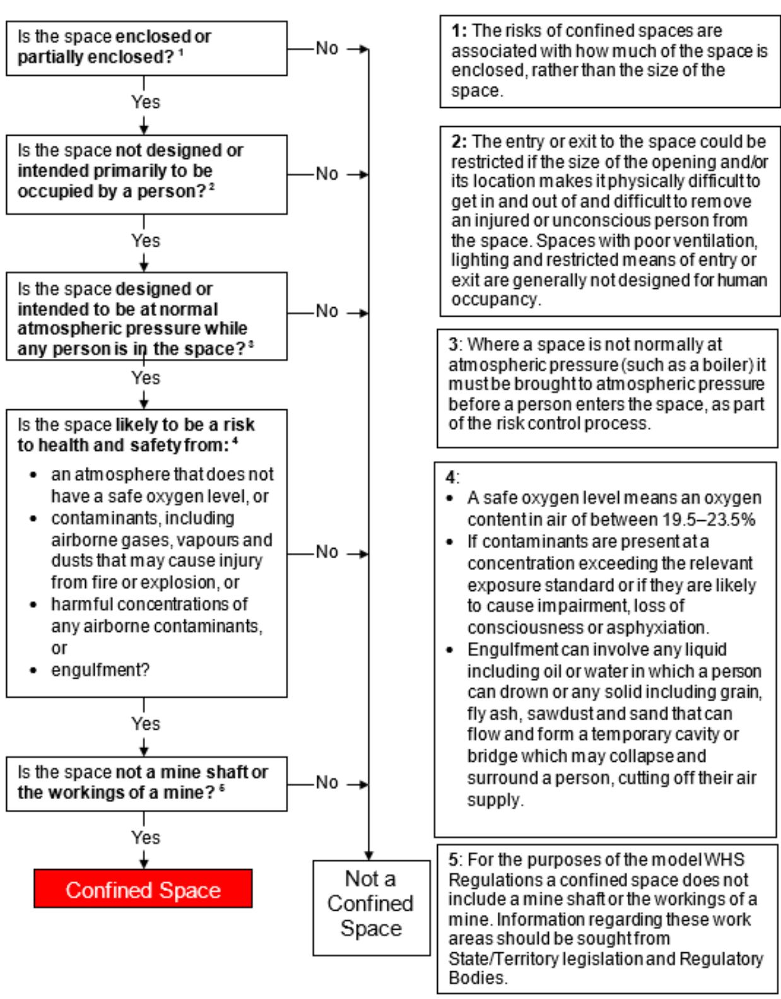
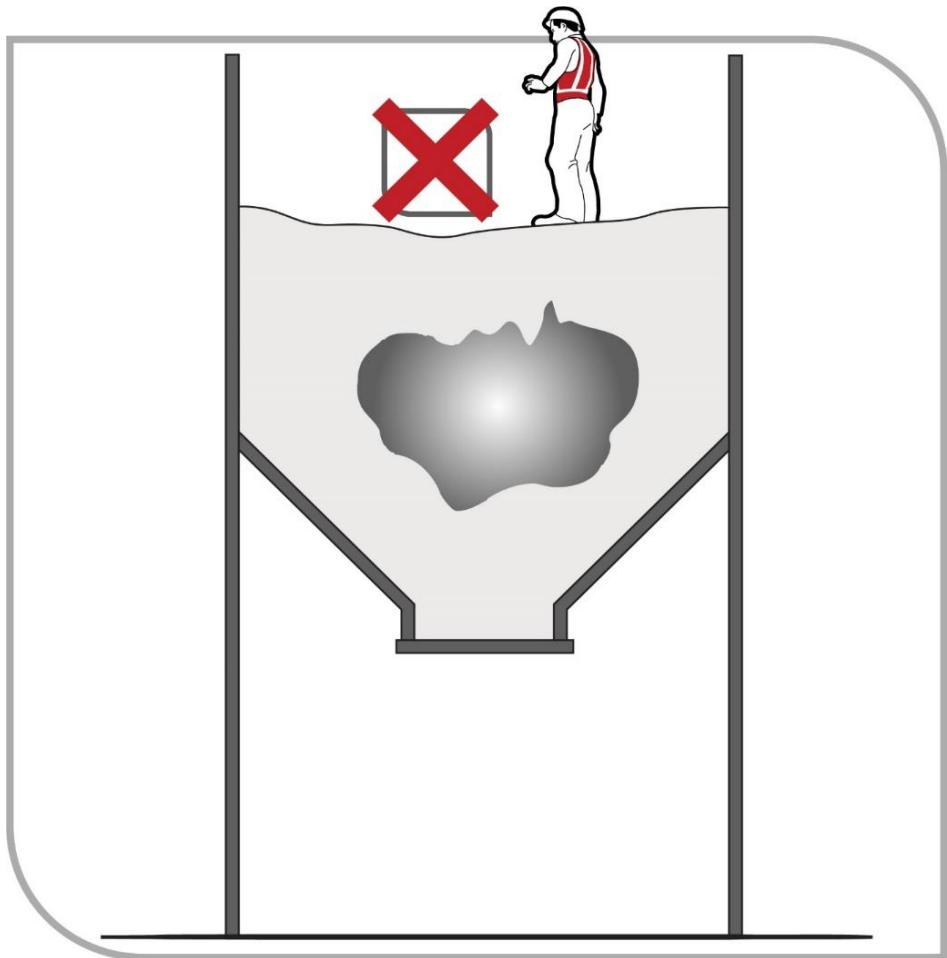
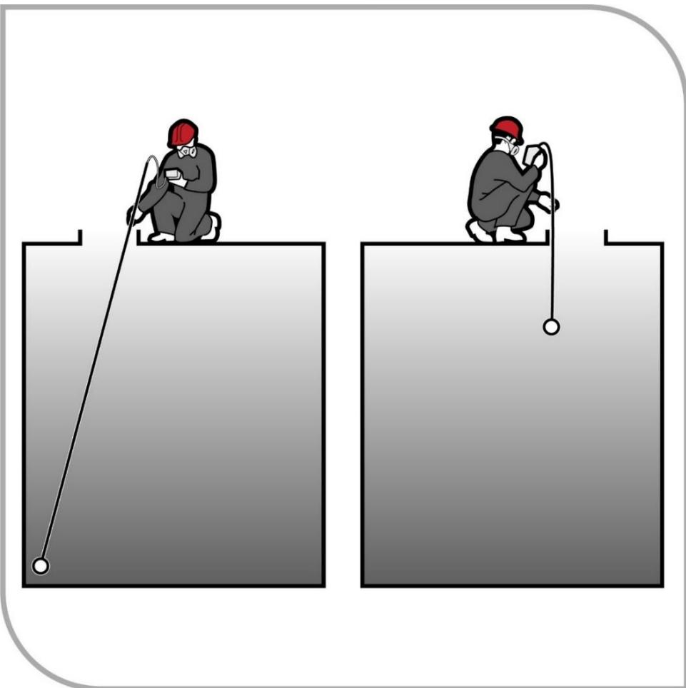
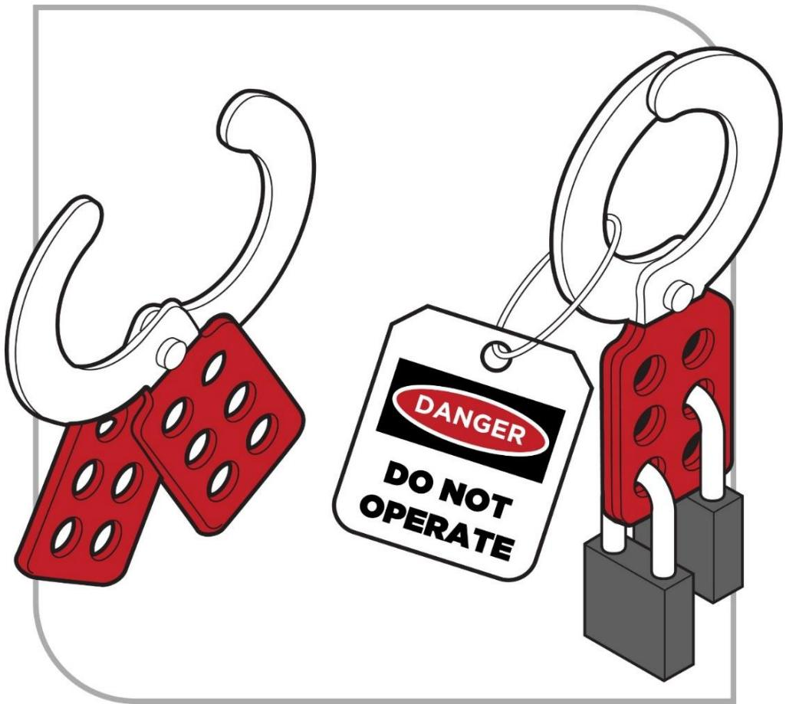
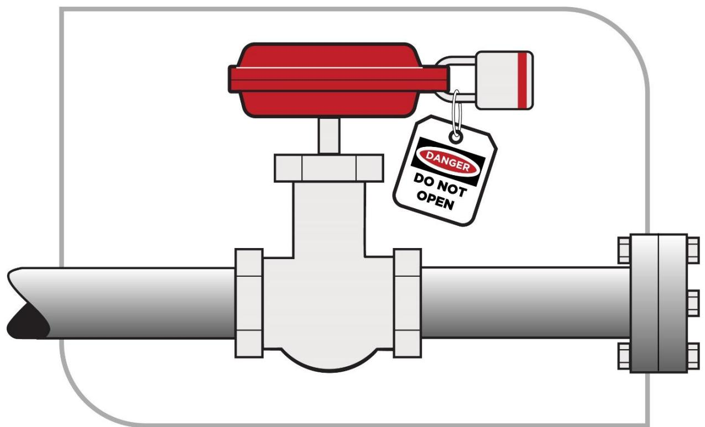
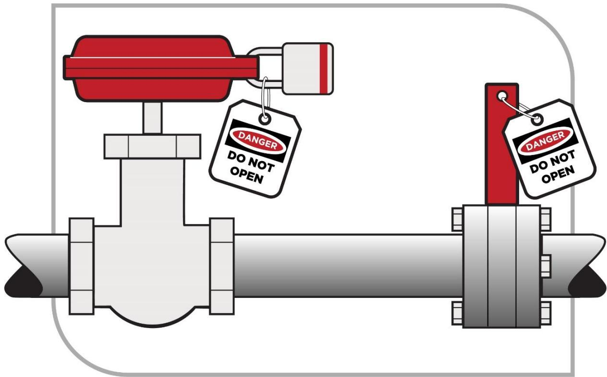
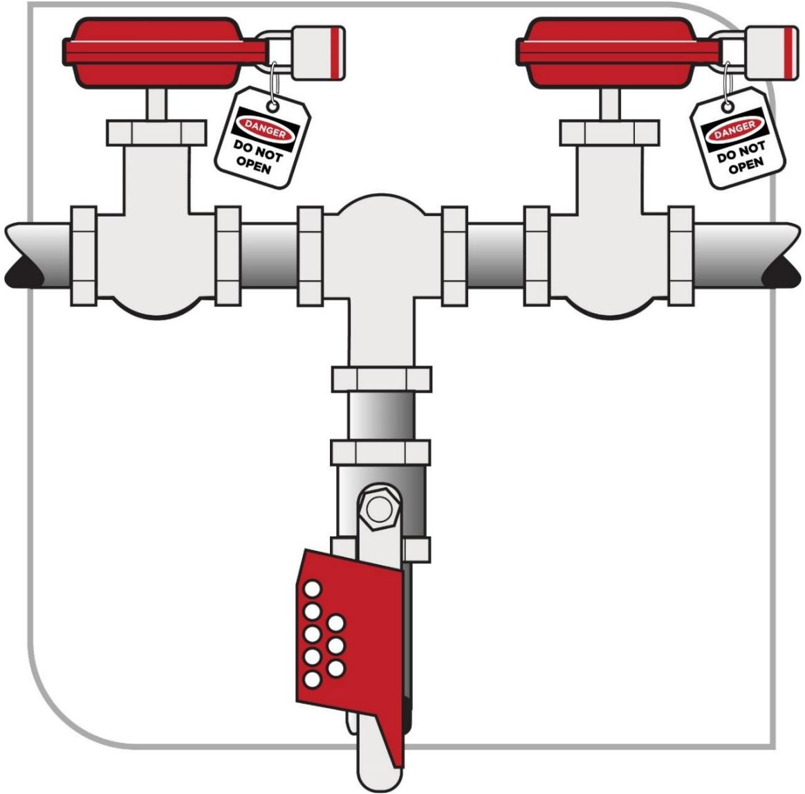
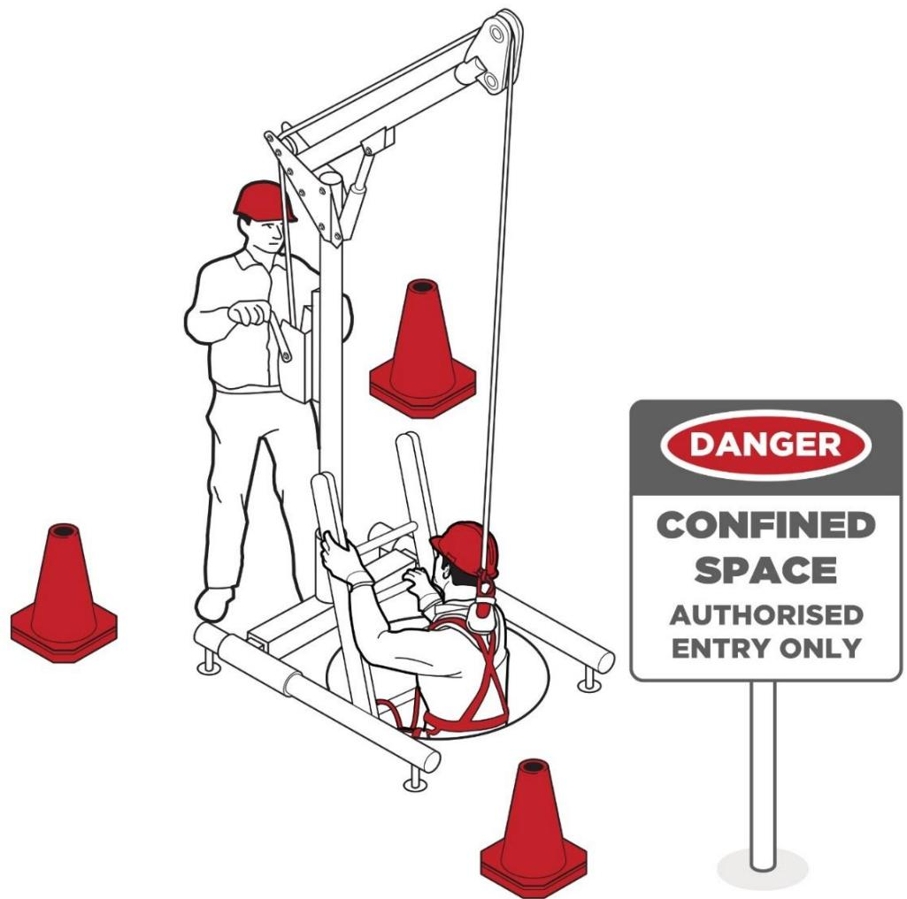

# Confined spaces

Code of Practice

JULY 2020

# Disclaimer

Safe Work Australia is an Australian Government statutory agency established in 2009. Safe Work Australia includes Members from the Commonwealth, and each state and territory, Members representing the interests of workers and Members representing the interests of employers.

Safe Work Australia works with the Commonwealth, state and territory governments to improve work health and safety and workers' compensation arrangements. Safe Work Australia is a national policy body, not a regulator of work health and safety. The Commonwealth, states and territories have responsibility for regulating and enforcing work health and safety laws in their jurisdiction.

ISBN 978- 0- 642- 33313- 1 (PDF)  ISBN 978- 0- 642- 33314- 8 (DOCX)

# ISBN Creative Commons

This copyright work is licensed under a Creative Commons Attribution- Noncommercial 4.0 International licence. To view a copy of this licence, visit creativecommons.org/licenses In essence, you are free to copy, communicate and adapt the work for non- commercial purposes, as long as you attribute the work to Safe Work Australia and abide by the other licence terms.

# Contact information

Safe Work Australia | info@swa.gov.au | www.swa.gov.au

# Contents

Foreword 4

1. Introduction 5

1.1. What is a confined space? 5  1.2. Who has health and safety duties in relation to confined spaces? 7  1.3. What is involved in managing risks associated with working in confined spaces? 10  1.4. Information, training, instruction and supervision 12

# 2. Duty of designers, manufacturers, importers, suppliers, installers and constructors 14

2.1. Eliminating or minimising the need to enter a confined space 14  2.2. Entry and exit 14

# 3. The risk management process 16

3.1. Identifying the hazards 16  3.2. What hazards are associated with a confined space? 17  3.3. Other hazards 19  3.4. Assessing the risks 21

# 4. Controlling the risks 25

4.1. Eliminate the need to enter a confined space 26  4.2. Minimise the risks 26  4.3. Entry permits 27  4.4. Isolation 29  4.5. Atmosphere 33  4.6. Communication and safety monitoring 35  4.7. Entry and exit procedures 36  4.8. Signs and barricades 37  4.9. Maintaining and reviewing control measures 37

# 5. Emergency procedures 39

Appendix A—Glossary 41  Appendix B—Confined space criteria 43  Appendix C—Sample confined space entry permit 44  List of amendments 53

# Foreword

This Code of Practice on how to manage the risks associated with confined spaces in the workplace is an approved code of practice under section 274 of the Work Health and Safety Act (WHS Act).

An approved code of practice provides practical guidance on how to achieve the standards of work health and safety required under the WHS Act and the Work Health and Safety Regulations (the WHs Regulations) and effective ways to identify and manage risks.

A code of practice can assist anyone who has a duty of care in the circumstances described in the code of practice. Following an approved code of practice will assist the duty holder to achieve compliance with the health and safety duties in the WHs Act and WHS Regulations, in relation to the subject matter of the code of practice. Like regulations, codes of practice deal with particular issues and may not cover all relevant hazards or risks. The health and safety duties require duty holders to consider all risks associated with work, not only those for which regulations and codes of practice exist.

Codes of practice are admissible in court proceedings under the WHs Act and WHS Regulations. Courts may regard a code of practice as evidence of what is known about a hazard, risk, risk assessment or risk control and may rely on the code in determining what is reasonably practicable in the circumstances to which the code of practice relates. For further information see the Interpretive Guideline: The meaning of 'reasonably practicable'.

Compliance with the WHs Act and WHS Regulations may be achieved by following another method if it provides an equivalent or higher standard of work health and safety than the code.

An inspector may refer to an approved code of practice when issuing an improvement or prohibition notice.

# Scope and application

This Code is intended to be read by a person conducting a business or undertaking (PCBU). It provides practical guidance to PCBUs on how to manage health and safety risks associated with work carried out in a confined space.

This Code may be a useful reference for other persons interested in the duties under the WHS Act and WHS Regulations.

This Code applies to all workplaces covered by the WHS Act where work is carried out in confined spaces.

# How to use this Code of Practice

This Code includes references to the legal requirements under the WHS Act and WHS Regulations. These are included for convenience only and should not be relied on in place of the full text of the WHS Act or WHS Regulations. The words 'must', 'requires' or 'mandatory' indicate a legal requirement exists that must be complied with.

The word 'should' is used in this Code to indicate a recommended course of action, while 'may' is used to indicate an optional course of action.

# 1. Introduction

Confined spaces pose dangers because they are usually not designed to be areas where people work. Confined spaces often have poor ventilation which allows hazardous atmospheres to quickly develop, especially if the space is small. The hazards are not always obvious and may change from one entry into the confined space to the next.

The risks of working in confined spaces include loss of consciousness, impairment, injury or death from:

the immediate effects of airborne contaminants fire or explosion from the ignition of flammable contaminants difficulty rescuing and treating an injured or unconscious person oxygen deficiency or immersion in a free- flowing material, such as grain, sand, fertiliser, water or other liquids falls from a height environmental factors, for example extremes in temperature poor lighting, and manual handling.

# 1.1. What is a confined space?

# WHS Regulation 5

Definitions

A 'confined space' means an enclosed or partially enclosed space that:

- is not designed or intended to be occupied by a person- is, or is designed or intended to be, at normal atmospheric pressure while any person is in the space; and- is or is likely to be a risk to health and safety from:  
- an atmosphere that does not have a safe oxygen level, or  
- contaminants, including airborne gases, vapours and dusts, that may cause injury from fire or explosion, or  
- harmful concentrations of any airborne contaminants, or  
- engulfment.

A confined space is determined by the hazards associated with a set of specific circumstances and not just because work is performed in a small space.

Entry into a confined space means a person's head or upper body is in the confined space or within the boundary of the confined space.

Confined spaces are commonly found in vats, tanks, pits, pipes, ducts, flues, chimneys, silos, containers, pressure vessels, underground sewers, wet or dry wells, shafts, trenches, tunnels or other similar enclosed or partially enclosed structures, when these examples meet the definition of a confined space in the WHS Regulations.

# What is not a confined space for the purposes of the WHS Regulations?

A confined space does not include a mine shaft or the workings of a mine.

The following kinds of workplaces are also generally not confined spaces for the purposes of the WHS Regulations:

places that are intended for human occupancy and have adequate ventilation, lighting and safe means of entry and exit, such as offices and workshops some enclosed or partially enclosed spaces that at particular times have harmful airborne contaminants but are designed for a person to occupy, for example abrasive blasting or spray painting booths, and enclosed or partially enclosed spaces that are designed to be occasionally occupied by a person if the space has a readily and conveniently accessible means of entry and exit via a doorway at ground level, for example: a cool store accessed by a LPG powered forklift to move stock- although the use of a LPG powered forklift in a cool store can be hazardous, the door at ground level means that once the alarm is raised, escape and rescue can happen quickly, or a fumigated shipping container with a large ground level opening that will facilitate escape and rescue.

Trenches are not considered confined spaces based on the risk of structural collapse alone, but will be confined spaces if they potentially contain concentrations of airborne contaminants that may cause impairment, loss of consciousness or asphyxiation.

# How to determine whether a space is a confined space

A confined space is determined by the structure and a specific set of circumstances. The same structure may or may not be a confined space depending on the circumstances when the space is entered. Entry to a confined space is considered to have occurred when a person's head or upper body enters the space.

A space may become a confined space if work that is to be carried out in the space would generate harmful concentrations of airborne contaminants.

Temporary control measures such as providing temporary ventilation or achieving a satisfactory pre- entry gas test will not cause a confined space to be declassified. For a confined space to be declassified as a non- confined space, it needs to have undergone sufficient changes in structure and use to eliminate all inherent hazards that define a confined space.

The following flowchart will help to determine whether a space is a 'confined space' for the purposes of the WHS Regulations.

Appendix B provides examples to illustrate how a confined space is determined.

# 1.2. Who has health and safety duties in relation to confined spaces?

Duty holders who have a role in managing the risks of working in confined spaces include:  - persons conducting a business or undertaking (PCBUs)

designers, manufacturers, importers, suppliers, installers and constructors of plant, substances or structures, and officers.

Workers and other persons at the workplace also have duties under the WHS Act, such as the duty to take reasonable care for their own health and safety at the workplace.

A person can have more than one duty and more than one person can have the same duty at the same time.

Early consultation and identification of risks can allow for more options to eliminate or minimise risks and reduce the associated costs.

Person conducting a business or undertaking

# WHS Act section 19

Primary duty of care

A PCBU must eliminate risks arising from working in confined spaces, or if that is not reasonably practicable, minimise the risks so far as is reasonably practicable.

The WHS Regulations include more specific requirements for PCBUs to manage the risks of hazardous chemicals, airborne contaminants and plant, as well as other hazards associated with confined spaces.

PCBUs have a duty to consult workers about work health and safety and may also have duties to consult, cooperate and coordinate with other duty holders.

Designers, manufacturers, importers, suppliers, installers and constructors of plant, substances or structures or structures

# WHS Act Part 2 Division 3

Further duties of persons conducting businesses or undertakings

Designers, manufacturers, importers, suppliers, installers and constructors of plant, substances or structures that include a space that is intended, or is likely to become a confined space must ensure, so far as is reasonably practicable, the plant, substance or structure they design, manufacture, import, supply or install is without risks to health and safety. This duty includes carrying out testing and analysis as well as providing specific information about the plant, substance or structure.

To carry out this duty they must:

eliminate the need for any person to enter a confined space and eliminate the risk of inadvertent entry, so far as is reasonably practicable, or if it is not reasonably practicable to eliminate the need to enter or the risk of inadvertent entry: the need or risk is minimised so far as is reasonably practicable the space is designed with safe means of entry and exit, and the risk to health and safety of any person who enters the space is eliminated so far as is reasonably practicable, and if this is not possible, the risk is minimised so far as is reasonably practicable.

To assist in meeting these duties, the WHS Regulations require:

- manufacturers to consult with designers of plant- importers to consult with designers and manufacturers of plant, and- the person who commissions construction work to consult with the designer of the structure.Please refer to AS 2865-2009: Confined spaces for specific obligations of designers.

Please refer to AS 2865- 2009: Confined spaces for specific obligations of designers.

# Officers

# WHS Act section 27

Duty of officers

Officers, for example company directors, have a duty to exercise due diligence to ensure the PCBU complies with the WHS Act and WHS Regulations. This includes taking reasonable steps to ensure the business or undertaking has and uses appropriate resources and processes to eliminate or minimise risks to health and safety from work carried out as part of the conduct of the business or undertaking, including those arising from working in confined spaces. Further information on who is an officer and their duties is available in the Interpretive Guideline: The health and safety duty of an officer under section 27.

# Workers

# WHS Act section 28

Duties of workers

WorkersWHS Act section 28Duties of workersWorkers have a duty to take reasonable care for their own health and safety and to not adversely affect the health and safety of other persons. Workers must comply with reasonable instructions, as far as they are reasonably able, and cooperate with reasonable health and safety policies or procedures that has been notified to workers, including information, instructions and training in relation to work carried out by the worker in a confined space. If personal protective equipment (PPE) is provided, the worker must so far as they are reasonably able, use or wear it in accordance with the information, instructions and training provided.

# WHS Regulation 63

Confined spaces- Application to emergency service workers

# WHS Regulation 67

Confined space entry permit

# WHS Regulation 68

Confined spaces- Signage

Some requirements for entry permits and signage do not apply to entry into a confined space by an emergency service worker if the worker is rescuing or providing first aid to a person in a confined space, at the direction of the emergency service organisation.

Other persons at the workplace

# WHS Act section 29

Other persons at the workplace, like visitors, must take reasonable care for their own health and safety and must take care not to adversely affect other people's health and safety. They must comply, so far as they are reasonably able, with reasonable instructions given by the PCBU to allow that person to comply with the WHS Act.

# 1.3. What is involved in managing risks associated with working in confined spaces?

# WHS Regulations Part 3.1 Regulations 32-38

Managing risks to health and safety

This Code provides guidance on how to manage the risks associated with confined spaces in the workplace using the following systematic process:

- Identify hazards--find out what could cause harm.- Assess risks, if necessary--understand the nature of the harm that could be caused by the hazard, how serious the harm could be and the likelihood of it happening. This step may not be necessary if you are dealing with a known risk with known controls.- Eliminate risks to health and safety so far as is reasonably practicable- Control risks--if it is not reasonably practicable to eliminate the risk, implement the most effective control measures that are reasonably practicable in the circumstances in accordance with the hierarchy of control measures, and ensure they remain effective over time.- Review control measures to ensure they are working as planned.

Duties in relation to confined spaces include:

- managing health and safety risks associated with a confined space, including risks when entering, working in, on or near a confined space, and the risk of inadvertent entry, in accordance with requirements for managing risks to health and safety set out in Part 3.1 of the WHS Regulations- ensuring a risk assessment is conducted, reviewed and as necessary revised by a competent person- not directing a worker to enter a confined space unless the worker has an entry permit- erecting signs next to each entry to the confined space- ensuring, so far as is reasonably practicable, that a worker does not enter a confined space until all the duties in relation to the confined space have been complied with, for example meeting entry permit requirements- establishing first aid and rescue procedures to be followed in the event of an emergency in the confined space and ensuring these procedures are practised as necessary, and- providing suitable and adequate information, training and instruction to workers.

The WHS Regulations set out requirements for specific control measures within the confined space including communication and safety monitoring, signs, isolation of connected plant and services, and controls to maintain a safe atmosphere.

Further guidance on the risk management process is available in the Code of Practice: How to manage work health and safety risks.

# Consulting workers

WHS Act section 47Duty to consult workersWHS Act section 48Nature of consultation

A PCBU must consult, so far as is reasonably practicable, with workers who carry out work for the business or undertaking and who are (or are likely to be) directly affected by a health and safety matter.

This duty to consult is based on the recognition that worker input and participation improves decision- making about health and safety matters and assists in reducing work- related injuries and disease.

The broad definition of a 'worker' under the WHS Act means a PCBU must consult, so far as is reasonably practicable, with contractors and sub- contractors and their employees, on- hire workers, outworkers, apprentices, trainees, work experience students, volunteers and other people who are working for the PCBU and who are, or are likely to be, directly affected by a health and safety matter.

Workers are entitled to take part in consultations and to be represented in consultations by a health and safety representative (HSR) who has been elected to represent their work group.

It is often more effective to involve a team of people in the risk management process to draw on a range of knowledge and experience, for example knowledge of:

the particular confined space under assessment any work methods that will be used in or near the confined space, and confined space hazards and control measures.

Consulting, cooperating and coordinating activities with other duty holders

# WHS Act section 46

Duty to consult with other duty holders

The WHS Act requires a PCBU to consult, cooperate and coordinate activities with all other persons who have a work health or safety duty in relation to the same matter, so far as is reasonably practicable.

There is often more than one business or undertaking involved in relation to a confined space, that may each have responsibility for the same health and safety matters, either because they are involved in the same activities or share the same workplace.

In these situations, each duty holder should exchange information to find out who is doing what and work together in a cooperative and coordinated way so risks are eliminated or minimised so far as is reasonably practicable. For example, a person who owns the plant or structure that contains the confined space will have management or control of the confined space. A contractor engaged to carry out work in the same space will also have management or control of the confined space at the time that work is being carried out. In these situations, effective communication, cooperation and coordination of activities between duty holders is essential to ensure that risks associated with the confined space are eliminated or minimised as far as is reasonably practicable.

Further guidance on consultation is available in the Code of Practice: Work health and safety consultation, cooperation and coordination.

# Principal contractors

# WHS Regulation 309

WHS management plan—preparation

The principal contractor for a construction project has a specific duty under the WHS Regulations to document, in their WHS Management Plan for the project, the arrangements in place for consultation, cooperation and coordination between the PCBUs at the site.

# 1.4. Information, training, instruction and supervision

# WHS Act section 19

Primary duty of care

# WHS Regulation 39

Provision of information, training and instruction

The WHS Act requires that a PCBU ensure, so far as is reasonably practicable, the provision of any information, training, instruction or supervision that is necessary to protect all persons from risks to their health and safety arising from work carried out as part of the conduct of the business or undertaking.

The PCBU must ensure that information, training or instruction provided to a worker are suitable and adequate having regard to:

the nature of the work carried out by the worker the nature of the risks associated with the work at the time of the information, training and instruction, and the control measures implemented.

The PCBU must also ensure, so far as is reasonably practicable, that the information, training and instruction are provided in a way that is readily understandable for the person to whom it is provided.

Workers must be trained and have the appropriate skills to carry out a particular task safely. Training should be provided to workers by a competent person.

# WHS Regulation 76

Confined spaces—Information, training and instruction for workers

The information, training and instruction provided to relevant workers must cover:

the nature of all hazards associated with a confined space the need for, and appropriate use of, risk control measures the selection, fit, use, wearing, testing, storage and maintenance of any PPE the contents of any relevant confined space entry permit, and

emergency procedures.

A 'relevant' worker means a worker who could enter or work in a confined space, or other workers who are not required to enter the confined space but could carry out related functions or emergency procedures, such as:

undertake hazard identification or risk assessment in relation to a confined space implement risk control measures complete entry permits act as a stand- by person or communicate with workers in a confined space monitor conditions while work is being carried out purchase equipment for confined space work, and design or lay out a work area that includes a confined space.

The supervisors of these workers are also relevant workers.

Retraining or refresher training should be provided as appropriate for a particular workplace. The frequency of this training should depend on how often workers are required to carry out tasks associated with entry to or work in confined spaces.

Records of all training provided to workers in relation to confined space work must be kept for two years.

In addition to the PCBU's general duty to provide any supervision necessary to protect all persons from work health and safety risks, the WHs Regulations also impose specific duties to provide supervision necessary to protect a worker from risks to health and safety in certain circumstances, for example, where the worker:

uses, handles or generates hazardous chemicals operates, tests, maintains, repairs or decommissions a storage or handling system for a hazardous chemical, or is likely to be exposed to a hazardous chemical.

Workers and their supervisors must be provided with suitable and adequate information, training and instruction so they have the skills and knowledge to understand the hazards associated with working in the confined space, the contents of any confined space entry permit, and the control measures implemented for their protection.

# 2. Duty of designers, manufacturers, importers, suppliers, installers and constructors

The design, manufacture or modification of any plant or structure that includes a confined space can significantly affect the risks associated with confined spaces. Thoughtful design can eliminate the need to enter a confined space or eliminate the risk of inadvertent entry. The design stage should consider the whole life cycle of the plant or structure, from manufacture and use through to demolition and disposal.

# 2.1. Eliminating or minimising the need to enter a confined space

# WHS Regulation 64

Confined spaces- Duty to eliminate or minimise risk

A designer, manufacturer, importer or supplier of a plant or structure, and a person who installs or constructs a plant or structure, must eliminate the need to enter a confined space and eliminate the risk of inadvertent entry so far as is reasonably practicable. If this is not reasonably practicable, then:

the need for any person to enter the space and the risk of a person inadvertently entering the space must be minimised so far as is reasonably practicable the space must be designed with a safe means of entry and exit, and risk to the health and safety of any person who enters the space must be eliminated or minimised so far as is reasonably practicable.

The following features should be incorporated in the design and manufacturing stages:

provision of outlets and facilities for cleaning, to eliminate the need for entry use of lining materials that are durable, require minimal cleaning and do not react with materials contained in the confined space, and design of the structure and mechanical parts to provide for safe and easy maintenance to reduce the need for persons to enter.

# 2.2. Entry and exit

If it is not reasonably practicable to eliminate the need to enter the confined space or the risk of inadvertent entry, then any risk associated with entry to and exit from the space must be minimised. Entry to and exit from a confined space are safer when openings (access points) are large and located in a position that persons and equipment can pass through easily.

Where relevant, the following features should be incorporated at the design, manufacture and installation stages:

Access points (including those within the confined space, through divisions, partitions or obstructions) should be large enough to allow people wearing the necessary

protective clothing and equipment to pass through, and to permit the rescue of all people who may enter the confined space.

- A safe means of access to and within the confined space, such as fixed ladders, platforms and walkways, should be provided. Further guidance is available in AS 1657-2018: Fixed platforms, walkways, stairways and ladders - Design, construction and installation.

- Access points should be unobstructed by fittings or equipment that could impede rescue and should also be kept free of any obstructions during work in the confined space. If there is a requirement to pass equipment such as electrical cables, leads, hoses and ventilation ducts through an access hole, a second access point may be needed.

- There should be enough access points to provide safe entry to and exit from the confined space. For example, the spacing of access holes on sewers (or in the case of large gas mains, the absence of such access holes over considerable lengths) may affect both the degree of natural ventilation and the ease with which persons can be rescued.

For further guidance please refer to AS 2865- 2009: Confined spaces.

# 3. The risk management process

# WHS Regulation 66

Confined spaces- Managing risks to health and safety

A risk assessment is mandatory for confined spaces under the WHs Regulations. As a person conducting a business or undertaking (PCBU), you must ensure that a risk assessment is conducted by a competent person and recorded in writing.

A risk assessment will determine the measures that should be implemented to control risks. It will help to:

identify which workers are at risk of exposure determine what sources and processes are causing that risk identify if and what kind of control measures should be implemented, and check the effectiveness of existing control measures.

Risk management is a systematic process to eliminate or minimise the potential for harm to people.

# 3.1. Identifying the hazards

The first step in the risk management process is to identify all hazards associated with confined spaces. This involves finding things and situations which could potentially cause harm to people. Hazards generally arise from the following aspects of work and their interaction:

physical work environment equipment, materials and substances used work tasks and how they are performed, and work design and management.

Hazards may be identified by looking at the workplace and how work is carried out. It is also useful to talk to workers, manufacturers, suppliers and health and safety specialists and review relevant information, records and incident reports.

# WHS Regulation 34

Duty to identify hazards

In managing the risks associated with a confined space the duty holder must identify reasonably foreseeable hazards that could give rise to health and safety risks.

The types of substances previously stored in a confined space (however briefly) will indicate the sorts of hazards that may be present. Substances stored in a confined space may result in a lack of oxygen, airborne contaminants or a flammable atmosphere within the confined space. Other hazards may arise from work activities, products or by- products in or around the confined space.

Many confined spaces' hazards are invisible to the naked eye or not visible from outside the space, for example toxic gases, smaller spaces within a space and concealed electrical or mechanical parts.

# 3.2. What hazards are associated with a confined space?

# Restricted entry or exit

Restricted entry or exitSmall entrances and exits make it difficult to rescue injured workers or to get equipment in or out of the confined space. In some cases, entrances and exits may be very large but their location can make them difficult to access. For example, accessing pits or openings high up in silos may require the use of ladders, hoists or other devices, and escape and rescue from such spaces may be difficult in emergency situations.

# Harmful airborne contaminants

The following table illustrates the kinds of harmful atmospheres that may be present in a confined space, and how they may be created.

Table 1 Sources of contaminants  

<table><tr><td>Source of contaminant</td><td>Examples</td></tr><tr><td>Substance stored in the confined space or its by-product(s)</td><td>- release of toxic substances e.g. hydrogen sulphide in tanks of decomposing organic material, especially when the material is disturbed
- build-up of hydrogen sulphide in sewers and pits</td></tr><tr><td>Work performed in the confined space</td><td>- use of paints, adhesives, solvents or cleaning solutions
- welding or brazing with metals capable of producing toxic vapours or gases
- exhaust vapours or gases from engines used in the confined space
- painting or moulding glass-reinforced plastics</td></tr><tr><td>Entry of natural contaminants, e.g. groundwater and gases, into the confined space from the surrounding land, soil or strata</td><td>- acid groundwater acting on limestone with the potential to produce dangerous accumulations of carbon dioxide
- methane released from groundwater and from decay of organic matter</td></tr><tr><td>Release of airborne contaminants</td><td>- when sludge, slurry or other deposits are disturbed or when scale is removed</td></tr><tr><td>Manufacturing process</td><td>- residues left in tanks, vessels etc or remaining on internal surfaces can evaporate into a vapour or gas</td></tr><tr><td>Entry and accumulation of gases and liquids from adjacent plant, installations, services or processes</td><td>- the contamination of underground confined spaces by substances from plant in the vicinity of the confined space
- carbon monoxide from the exhaust of LPG-powered forklifts operating in, or in the vicinity of, the confined space</td></tr></table>

# Unsafe oxygen level

Unsafe oxygen levelAir normally contains 21 per cent oxygen by volume, although oxygen levels of 19.5 per cent to 23.5 per cent by volume are considered to be safe.

Some situations can cause the level of oxygen to dramatically decrease, leading to an oxygen- deficient atmosphere and possible asphyxiation. This may occur if oxygen in the atmosphere is:

displaced by gases produced during biological processes, for example methane in a sewer displaced during purging of a confined space with an inert gas to remove flammable or toxic vapours or gases depleted inside metal tanks and vessels through surface oxidation (for example when rust forms) consumed during combustion of flammable substances, or absorbed or reacts with grains, wood chips, soil or chemicals in sealed silos.

Too much oxygen can increase the risk of fire or explosion. Oxygen- enriched atmospheres may occur if:

chemical reactions cause the production of oxygen, for example certain reactions with hydrogen peroxide, or there is a leak of oxygen from an oxygen tank or fitting while using oxy- acetylene equipment.

Refer to AS 1674 (Series)1: Safety in welding and allied processes to cover circumstances where ignition source is cutting, grinding or welding.

# Fire and explosion

A fire or explosion requires the presence of three elements:

an ignition source air, and a fuel (gas, vapour or mist) capable of igniting.

A flammable atmosphere is one in which the flammable gas, vapour or mist is likely to exceed 5 per cent of its lower explosive limit (LEL).

Flammable atmospheres in confined spaces may result from the evaporation of a flammable residue, flammable materials used in the space, a chemical reaction (such as the formation of methane in sewers), or from the presence of combustible dust (such as that in flour and other grain silos and coal handling areas).

If an ignition source, such as a sparking electrical tool or static on a person, is introduced into a space containing a flammable atmosphere, an explosion is likely to result.

# Engulfment

Engulfment means to be swallowed up in or immersed by material, which may result in asphyxiation. Examples of materials that may pose a risk of engulfment include plastics, sand, liquids, fertiliser, grain, coal, coal products, fly ash, animal feed and sewage.

Stored materials such as sand and grain can form a crust or bridge when a container is emptied from below, leaving the top layer in place. Workers walking on the crust or bridge or working below the bridge on the floor of the container may be engulfed if the crust cracks or dislodges and a bridge collapses (see Figure 1).

  
Figure 1 Example of 'bridging' which may result in engulfment

# 3.3. Other hazards

# Uncontrolled introduction of substances

The uncontrolled introduction of substances such as steam, water or other liquids, gases or solids may result in drowning, immersion, being overcome by fumes (for example vision and odour impairment from hydrogen sulphide  $(H_{2}S)$ , inability to breathe due to fine grain or ceramic dust), or other harm depending on the nature of the substance.

Combustible engines, vehicles and liquid petroleum gas (LPG) forklifts operating close to the opening of the confined space can cause a build- up of exhaust gases, including carbon monoxide, in the space.

# Biological hazards

Contact with micro- organisms, such as viruses, bacteria or fungi, may result in infectious diseases, dermatitis or lung conditions such as hypersensitivity pneumonitis. Sewers, grain silos and manure pits are examples of confined spaces where biological hazards may be present.

# Mechanical hazards

Mechanical hazardsExposure to mechanical hazards associated with plant may result in entanglement, crushing, cutting, piercing or shearing of parts of a person's body. Sources of mechanical hazards include plant such as augers, agitators, blenders, mixers and stirrers.

# Electrical hazards

Electrical hazardsElectrical hazards may cause electrocution, shocks or burns, and can arise from cables, transformers, capacitors, relays, exposed terminals and wet surfaces where electrical circuits and electrically powered plant are used.

Further guidance is available in the Code of Practice: Managing electrical risks in the workplace.

# Skin contact with hazardous substances

The nature of a confined space could give rise to an increased likelihood of skin contact with surface contaminants. Skin contact with hazardous substances may result in immediate health effects such as burns, irritation or allergic dermatitis, or longer- term systemic effects.

# Noise

NoiseNoise generated in a confined space from the use of plant, the work method or process may be amplified due to reflections off hard surfaces. Exposure to hazardous noise may result in hearing loss, tinnitus and other non- auditory health effects. Hazardous noise may also prevent workers from hearing warning signals and distract workers from their work.

Further guidance is available in the Code of Practice: Managing noise and preventing hearing loss at work.

# Manual tasks

Hazards arising from manual tasks may be exacerbated by physical constraints associated with working in a confined space. Additional hazards may arise from the use of personal protective equipment (PPE) that restricts movement, grip and mobility.

Further guidance is available in the Code of Practice: Hazardous manual tasks.

# Radiation

The health effects associated with radiation depend on the type of radiation involved. Sources of radiation include radioactive sources, X- rays, lasers, welding flash, radio frequency and microwaves.

# Environmental hazards

Environmental hazards associated with work in a confined space may cause or contribute to harm. Examples of environmental hazards include:

heat or cold stress arising from the work, process or conditions slips, trips and falls arising from slippery surfaces or obstacles, and inadequate lighting.

Further guidance is available in the Code of Practice: Managing the work environment and facilities.

# Hazards outside the confined space

Where the confined space has a vertical opening, there is a risk that people could fall in.

Traffic hazards are a concern where confined space entrances or exits are located on footpaths or roads. There is the potential for workers entering or exiting the space to be struck and injured by vehicle traffic.

Work done outside the space, but near openings to it, can contaminate the atmosphere inside the space. A common example is the exhaust gases from an internal combustion engine. There may also be potential for fire or explosion where hot work is done in areas next to confined spaces that contain flammable atmospheres.

# Additional physiological and psychological demands

Working in a confined space may impose additional physiological and psychological demands over and above those encountered in a normal working environment. Consideration should be given to a worker's:

physical ability ability to work in a restrictive space (for example claustrophobia), and ability to wear the PPE required to do the work (for example respirators).

# 3.4. Assessing the risks

A risk assessment involves considering what could happen if someone is exposed to a hazard and the likelihood of it happening. A risk assessment can help you determine:

how severe a risk is whether any existing control measures are effective what action you should take to control the risk, and how urgently the action needs to be taken.

Hazards have the potential to cause different types and severities of harm, ranging from minor discomfort to a serious injury or death.

Many hazards and their associated risks are well known and have well established and accepted control measures. In these situations, the second step in the process outlined in section 1.3 of this Code (to formally assess the risk) is not required. If after identifying a hazard you already know the risk and how to control it effectively, you may simply implement the controls.

In some circumstances, a risk assessment will assist to:

identify which workers are at risk of exposure determine what sources and processes are causing the risk identify if and what kind of control measures should be implemented, and check the effectiveness of existing control measures.

# WHS Regulation 66

Confined spaces - Managing risks to health and safety

# WHS Regulation 77

Confined spaces - Confined space entry permit and risk assessment must be kept

As a PCBU, you must ensure a competent person conducts a risk assessment to assess health and safety risks associated with the identified hazards of the confined space.

The risk assessment for a confined space must be undertaken by a competent person and be recorded in writing. The risk assessment must be reviewed and revised by a competent person whenever any risks change.

A copy must be kept until at least 28 days after the work to which it relates is completed, or if a notifiable incident occurs in connection with the work to which the assessment relates, for at least two years after the incident occurs. A copy of the risk assessment must be available to any relevant worker on request.

To manage risk and ensure a risk assessment is carried out by a competent person, you must take into account all relevant matters, including:

- whether the work can be carried out without the need to enter the confined space- the nature of the confined space- if the hazard is associated with the concentration of oxygen or the concentration of airborne contaminants in the confined space—any change that may occur in that concentration- the work required to be carried out in the confined space, the range of methods by which the work can be carried out and the proposed method of working, and- the type of emergency procedures, including rescue procedures, required.

When undertaking a risk assessment to determine the risks requiring control, the following factors should be considered:

- the risk of engulfment of a person- the number of persons occupying the space- the soundness and security of the overall structure and the need for lighting and visibility- the identity and nature of the substances last contained in the confined space- any risk control measures needed to bring the confined space to atmospheric pressure- the number of persons required outside the space:  
- to maintain equipment essential for the task being undertaken within the confined space  
- to provide continuous communication with the persons within the confined space, and  
- to properly initiate emergency response procedures.- risks associated with other hazards, such as noise or electricity- arrangements for emergency response, for example first aid and resuscitation- the physiological and psychological demands of the task and the competency of persons involved in the tasks or emergency response duties- the adequate instruction of persons in any required procedure, particularly those that are unusual or non-typical, including the use and limitations of any PPE and other equipment to be used- the availability and adequacy of appropriate PPE and emergency equipment for all persons likely to enter the confined space- the need for additional risk control measures, including:  
- prohibiting hot work in adjacent areas  
- prohibiting smoking and naked flames within the confined space and adjacent areas  
- avoiding contamination of breathing air from operations or sources outside the confined space, for example from the exhaust of an internal combustion engine  
- prohibiting movement of equipment in adjacent areas, for example forklifts

- prohibiting spark-generating equipment, clothing and footwear.- whether purging or cleaning in the confined space is necessary- whether hot work is necessary, and- conditions that could impede entry and exit or the conduct of the tasks in the confined space, for example plant layout, dimensions, manual handling and ergonomic aspects of the task.

Further guidance on the risk management process and the hierarchy of control measures is available in the Code of Practice: How to manage work health and safety risks.

# Atmospheric testing and monitoring

Testing and monitoring the atmosphere in a confined space are routine parts of determining appropriate control measures for confined spaces.

# WHS Regulation 50

Monitoring airborne contaminant levels

WHS Regulation 71

Confined spaces—Specific control—atmosphere

WHS Regulation 72

Confined spaces—Specific control—flammable gases and vapours

As a PCBU, you must ensure that air monitoring is carried out to determine the airborne concentration of a substance or mixture at the workplace to which an exposure standard applies if:

- the person is not certain on reasonable grounds whether or not the airborne concentration of the substance or mixture exceeds the relevant exposure standard, or- monitoring is necessary to determine whether there is a risk to health.

Any air monitoring in a confined space should be carried out by a competent person using a suitable, correctly calibrated gas detector. You must ensure that while work is being carried out in a confined space to test the atmosphere for:

- oxygen content- airborne concentration of flammable contaminants, and- airborne concentration of potentially harmful contaminants (for example hydrogen sulphide and carbon monoxide).

A person's senses should never be used to determine if the air in a confined space is safe. Many toxic or flammable gases and unsafe oxygen levels cannot be detected using one's senses.

Initial testing should be done from outside the confined space by inserting a sample probe and/or portable gas detection device at appropriately selected access holes, nozzles and openings. Because contaminants can settle at different levels, each part of the confined space should be tested—side to side and top to bottom (see Figure 2).

For example, some gases (such as hydrogen sulphide) are heavier than air and in unventilated areas will settle to the bottom of the space, while other gases (such as methane) are lighter than air and will collect at the top of the space. Testing should be carried out on a sufficient number of points to accurately reflect areas of the space that are likely to be accessed.

  
Figure 2 Atmospheric testing of remote regions and different levels within the confined space

Lighter gases may be vented into the breathing zone of the person conducting the tests. Some gases may be dissolved in liquids and released when the liquid is disturbed or a crust over the liquid is broken, so it may be necessary to agitate liquids before monitoring.

If it is necessary to enter the space to test remote regions away from entrances or access holes, air- supplied respiratory equipment should be worn and the entry must be undertaken in accordance with the WHS Regulations using a confined space entry permit.

Re- testing and continuous monitoring of the air may be necessary if the risk assessment indicates that conditions may change due to the work being done or the disturbance of hazardous material in the confined space.

# Generic risk assessment

A single (or generic) risk assessment may be carried out for a class of confined spaces in a number of different work areas or workplaces where the confined spaces are the same. This will only be appropriate if all of the hazards, tasks and circumstances covered by the risk assessment are the same. A risk assessment must be carried out on individual confined spaces if the hazards, tasks or circumstances are different and a worker may be exposed to greater, additional or different risks.

A confined space entry permit may be used as a record of the risk assessment.

# 4. Controlling the risks

# Hierarchy of control measures

The WHs Regulations require duty holders to work through the hierarchy of control measures when managing certain risks; however, it can be applied to any risk. The hierarchy ranks control measures from the highest level of protection and reliability to the lowest. Further guidance on the risk management process and the hierarchy of control measures is in the Code of Practice: How to manage work health and safety risks.

As a person conducting a business or undertaking (PCBU), you should, as far as is reasonably practicable, ensure health and safety by taking into account and weighing up all relevant matters to control risk. For example putting in place control measures when confined space entry is a relatively infrequent activity for most workplaces.

# Eliminating the risk

You must always aim to eliminate the risk, for example by eliminating the need to enter a confined space. If eliminating the hazards and associated risks is not reasonably practicable, you must minimise the risk by one or more of the following:

Substitution- minimise the risk by substituting or replacing a hazard or hazardous work practice with something that gives rise to a lesser risk. For example, changing work methods to minimise time inside the confined space, therefore reducing likelihood of heat stress. Isolation- minimise the risk by isolating or separating the hazard or hazardous work practice from any person exposed to it, for example by isolating moving or electric parts. Engineering controls- engineering controls are physical control measures to minimise risk, for example forced extraction ventilation for large spaces, tanks, vessels.

If risk remains, it must be minimised by implementing administrative controls, so far as is reasonably practicable. For example, providing training relevant to working in confined spaces.

Any remaining risk must be minimised with suitable personal protective equipment (PPE). For example, respiratory protective equipment when oxygen levels are outside the safe range.

Administrative control measures and PPE do not control the hazard at the source. They rely on human behaviour and supervision and used on their own tend to be the least effective in minimising risks.

The WHs Regulations require a PCBU to consider certain relevant matters when managing risks, which will help to inform decisions about the most effective and appropriate risk control measures in the circumstances.

# WHS Regulation 66

Confined spaces- Managing risks to health and safety

In managing risks associated with a confined space, such risks associated with working in, or in the vicinity of the confined space, all relevant matters must be considered, including:

whether the work can be carried out without the need to enter the confined space the nature of the confined space if the hazard is associated with any airborne contaminant or unsafe level of oxygen the work to be carried out in the confined space, the range of methods by which the work can be carried out, and the proposed method of working, and the type of emergency procedures, including rescue procedures, required.

# 4.1. Eliminate the need to enter a confined space

Risks associated with work in a confined space must be eliminated so far as is reasonably practicable, and therefore the first question is: can the work be carried out without entering the confined space?

Work could be carried out from outside the confined space, for example by:

installing fixed or temporary cleaning devices, for example spray balls using highpressure hoses inserted through an access hatch to clean the inside of a tank using remote cameras or a mirror attached to a probe for internal inspection of vessels using remotely operated rotating flail devices, vibrators or air purgers to clear blockages in silos, and using a hook, long- handled clasp or magnet on a string to retrieve an object dropped into a confined space.

# 4.2. Minimise the risks

If entering a confined space cannot be avoided, then a safe system for working inside the space must be implemented. A risk assessment carried out by a competent person will help determine what controls are needed to minimise any risk associated with work in the confined space. You must take all relevant matters into account when managing the risks associated with working in a confined space and ensure a risk assessment is conducted which includes the following considerations.

# The nature of the space

The nature of a confined space may contribute to the risks associated with it, for example:

whether the number, size and location of entrances and exits may make the rapid exit and rescue of workers from the space difficult the temperature of the space may cause heat stress, and lack of adequate lighting may mean poor visibility.

# The concentration of oxygen or airborne contaminants

The level of oxygen and airborne contaminants is a significant contributor to the risk of working in a confined space. The WHS Regulations contain specific risk control measures for managing these risks, such as:

the atmosphere of the confined space must have a safe level of oxygen, or if this is not reasonably practicable, any worker carrying out work in a space with an oxygen

level less than 19.5 per cent by volume must be provided with air supplied respiratory equipment

purging or ventilation of any contaminant in the atmosphere of the space must be carried out, so far as is reasonably practicable. The gas mixture used for ventilation or purging must not have an oxygen concentration exceeding 21 per cent by volume, and air monitoring must be carried out to determine the airborne concentration of a substance or mixture to which an exposure standard applies if it is not certain on reasonable grounds whether the concentration exceeds the standard or if monitoring is necessary to determine if there is a risk to health.

# The work and work method

Consideration must be given to whether the proposed work or work process will introduce any new hazards or contribute to the risks of working in the confined space. The WHS Regulations set out some specific control measures for risks associated with work in confined spaces in certain circumstances:

ignition sources must not be introduced into a space if there is a possibility of fire or explosion while work is being carried out, the concentration of flammable gas, vapour or mist must be less than five per cent of its lower explosive limit (LEL), so far as is reasonably practicable. At LEL of between five per cent and 10 per cent, the worker must be removed unless a gas detector is used, and the worker must be immediately removed if the LEL is equal to or greater than 10 per cent risks associated with the introduction of any substance or condition into the space from plant or services connected to the space must be eliminated so far as is reasonably practicable, and ensure a person does not enter a confined space to carry out work unless there is a system of work that includes communication with the worker from outside the space and monitoring of conditions within the space by a stand- by person in the vicinity of the space and, if practicable, observing the work being carried out.

Work processes should:

minimise the release of harmful airborne contaminants into the space reduce the time spent in the space or the number of people that have to enter the space, and eliminate the risk of engulfment.

Consider any risks associated with the use of PPE in a confined space. Using PPE may introduce new risks for those working in the space, for example the weight or discomfort of protective clothing and hearing protection.

# Emergency procedures

When things go wrong in a confined space, people may be exposed to serious and immediate danger. Effective arrangements for raising the alarm and carrying out rescue operations in an emergency are essential (refer to Chapter 5 of this Code).

# 4.3. Entry permits

A confined space entry permit provides a formal check to ensure all elements of a safe system of work are in place before people are allowed to enter the confined space. It also provides a means of communication between site management, supervisors and those

carrying out the work and ensures that the PCBU has checked and authorised the entry to the confined space and it is safe to proceed.

# WHS Regulation 65

Entry into confined space must comply with this Division

# WHS Regulation 67

Confined space entry permit

# WHS Regulation 77

Confined space entry permit and risk assessment must be kept

A PCBU must not allow or direct a worker to enter a confined space to carry out work unless the worker has been issued a confined space entry permit for the work.

The permit must be completed in writing by a competent person and:

specify the confined space to which the permit relates record the names of persons permitted to enter the confined space and the period of time that the work in the space will be carried out set out risk control measures based on the risk assessment and include control measures for safe entry and details about the systems of work, and contain space for an acknowledgement that work in the confined space has been completed and all persons have left the space.

A copy of the permit must be kept at least until the work is completed or, if a notifiable incident occurs, for at least two years after the confined space work to which the permit relates is completed.

A competent person is one who has acquired through training, qualification or experience the knowledge and skills to carry out the task.

A confined space entry permit must be issued for each time work is to be carried out in a confined space. Each permit only applies to one confined space and allows one or more workers to enter that space. A competent person who directs and supervises the work should be nominated and authorised to complete the permit on behalf of the business or undertaking.

A confined space entry permit is also required when a person enters a confined space to conduct the initial hazard identification or risk assessment. The permit may need to be revised after the risk assessment is completed. The confined space entry permit must list the information set out in Table 2.

Table 2 Requirements of a confined space entry permit  

<table><tr><td colspan="2">Requirements</td></tr><tr><td>Confined space to which the permit relates</td><td>+ The permit form should be designed and completed in such a way as to enable clear identification and recording of the space that each permit applies to.
- A single permit can be used for multiple entries into a space and can be used where there is more than one access point into a single space.</td></tr><tr><td>Name of any worker permitted to enter the space</td><td>+ Full name of each worker</td></tr></table>

<table><tr><td colspan="2">Requirements</td></tr><tr><td>Period of time during which work in the space will be carried out</td><td>— A permit may be required for varying periods of time depending on the time required to complete the work being carried out in a confined space.
— The permit must be re-validated if the person with direct management or control of work in the space changes; a break in work continuity occurs; changes are made to the work that introduce hazards not addressed by the current permit; or new control measures are needed.</td></tr><tr><td>Measures to control the risk</td><td>— List the control measures that must be implemented before work commences, for example the isolation of plant and services, purging, ventilation, atmospheric testing, cleaning and signage.
— List the control measures that must be implemented or continued while work is being done in the space, for example ventilation, continuous monitoring, respiratory protective equipment and PPE.
— List any equipment to be taken into the confined space, and any exclusions such as ignition sources.
— List any specialist emergency rescue equipment required.</td></tr></table>

The entry permit must be used as a written record that all workers have exited the confined space on completion of the work. It should be displayed in a prominent place to facilitate signing and clearance. Workers carrying out work in confined spaces must be provided with suitable and adequate information, training and instruction about the contents of the confined space entry permit in a way that is readily understandable.

The information on the entry permit may be used as a suitable record of the risk assessment that has been carried out. An example of an entry permit is provided at Appendix B.

# 4.4. Isolation

All potentially hazardous plant and services should be isolated prior to any person entering the confined space. Refer to AS 2865- 2009: Confined spaces for further information on isolation requirements.

Isolate to prevent the:

- introduction of hazardous contaminants or conditions through piping, ducts, vents, drains, conveyors, service pipes and fire protection equipment- activation or energising of machinery in the confined space- activation of plant or services outside the confined space that could adversely affect the space (for example heating or refrigerating methods)- release of any stored or potential energy in plant, and- inadvertent use of electrical equipment.

# Pipe work

If liquids, gases or vapours could enter the confined space, pipe work should be physically isolated.

Isolation measures, for example physically locking, tagging, closing and blanking (see Figure 3), should be supervised or checked at each isolation point. Isolation measures should be supported by systems to ensure that the isolation measures are not removed until all work is complete and all workers have left the space.

  
Figure 3 Example of tag and lockout with padlocks

Methods of isolation from materials, contaminants or conditions include isolating in accordance with one of the methods described below or by an alternative method ensuring at least an equivalent level of safety:

Removing a valve, spool piece or expansion joint in piping leading to the confined space (as close as practicable to the space) and blanking or capping the open end of the piping (see Figure 4). The blank or cap should be tagged to indicate its purpose. Blanks or caps should be made of a material that is compatible with the liquid, vapour or gas with which they are in contact. The material should also have sufficient strength to withstand the maximum operating pressure, for example surges, which can build up in the piping.

  
Figure 4 Open end of pipe capped with the nearest valve closed, locked and tagged

Inserting a suitable full- pressure spade or blank in piping between the flanges as close as practicable to the confined space (see Figure 5). The full- pressure spade or blank should be tagged to indicate its purpose.

  
Figure 5 Insertion of full pressure spade or blank

Closing, locking and tagging at least two valves in the piping leading to the confined space (see Figure 6). A drain or vent valve between the two closed valves should be locked open to atmosphere as part of this method.

  
Figure 6 Closing, locking and tagging at least two valves

# Moving parts and stored energy

Before entry is permitted to any confined space that can move, or in which agitators, fans or other moving parts that may pose a risk to workers are present, the possibility of movement should be eliminated.

Equipment or devices with stored energy, including hydraulic, pneumatic, electrical, chemical, mechanical, thermal or other types of energy, should be reduced to a zero energy condition so that no energy is left in devices and systems that could cause injury or illness.

If the confined space has agitators, blades and other moving equipment, consider chocking, wedging, chaining or removing these parts. Alternatively de- energise the equipment, lockout and tag out machinery, mixers, agitators and other equipment containing moving parts in the confined space. This may require additional isolation, blocking or de- energising of the machinery itself to guard against the release of stored energy.

# Using a lock

When a lock is used, the key should be kept in the possession of the person placing the lock. Spare keys should not be accessible except in emergencies. The tag should indicate that a person is in the confined space and that such isolation should not be removed until all people have left the confined space.

Examples where this procedure may be used include:

an open circuit breaker or open isolating switch supplying electrical power to equipment with hazardous moving parts, and where a power source cannot be controlled readily or effectively, requiring a belt or other mechanical linkage to be disconnected and tagged.

# 4.5. Atmosphere

As a PCBU, you must eliminate or minimise risks associated with the atmosphere in a confined space, so far as is reasonably practicable. A safe atmosphere in a confined space is one that:

has a safe oxygen level is free of airborne contaminants or any airborne contaminants are in concentrations below their allowable exposure standard (if any), and any flammable gas, vapour or mist in the atmosphere is at concentrations below 5 per cent of its lower explosive level (LEL).

A safe atmosphere can be achieved within the confined space using methods such as cleaning, purging and ventilation.

# WHS Regulation 71(1)(b)

Specific control- flammable gases and vapours

The WHS Regulations prohibit pure oxygen or gas mixtures with oxygen in a concentration greater than 21 per cent by volume being used for purging or ventilating a confined space because of the risk of increased flammability.

Consideration should be given to engaging the services of a specialist in ventilation or a hygienist.

# Purging

Purging is the method used to displace any contaminant from a confined space. Purging is usually done using an inert gas, such as nitrogen, to clear flammable gases or vapours before work in the confined space begins.

Purging must be carried out, so far as is reasonably practicable, where a risk assessment identifies the potential for the confined space to contain an unacceptable level of contaminants.

After purging, the confined space should be adequately ventilated with sufficient fresh air to ensure that oxygen has returned to a normal level of 21 per cent. Purging should be done in a way that ensures any contaminants removed from the confined space are expelled to a location where they present no further risk. Atmospheric testing should be carried out before entry to check that the purging and ventilation have been effective.

When flammable contaminants are to be purged, purging and ventilation equipment designed for use in hazardous areas must be used. A hazardous area is an area in which an explosive atmosphere is present, or may be expected to be present, in quantities that require special precautions during the construction, installation and use of potential ignition sources.

# Ventilation

Ventilation of a confined space with fresh air by natural, forced or mechanical means may be necessary to establish and maintain a safe atmosphere and temperature for as long as anyone is in the confined space.

If the confined space has sufficient openings then natural ventilation may be adequate, but in most cases mechanical ventilation is likely to be needed.

Consideration should also be given to where the fresh air is drawn from and where the exhaust air is finally vented to, so that the fresh air is not contaminated either by exhaust air or by other pollutants, and the exhaust air does not cause other risks.

Mechanical ventilation may be either local exhaust ventilation (LEV) or dilution ventilation. LEV is effective where the source of contaminant generation is localised, the extraction point can be located close to the source, and adequate make- up air is available (for example in the capture or extraction of welding fumes).

Where dilution ventilation is used, air needs to be introduced in a way that will ensure effective circulation throughout the confined space, taking account of the configuration of the space, the position of the openings and the properties of the contaminants. The source point of the air must be such that the air is fresh, breathable and free of contaminants such as gases arising from the operation of plant and equipment, for example combustible engines.

During operations likely to generate contaminants, mechanical ventilation equipment may not be adequate or sufficiently reliable to maintain contaminants at acceptable levels or to ensure a safe oxygen level. Where mechanical ventilation equipment is likely to be necessary to maintain acceptable contaminant levels in a confined space, the equipment should:

- be monitored to ensure continuous operation while the confined space is occupied, and- have the controls (including any remote power supply) clearly identified, tagged and protected to guard against unauthorised interference.

# Flammable gases and vapours

# WHS Regulation 72

Confined spaces—Specific control—flammable gases and vapours

A PCBU must, while work is being carried out in a confined space, ensure that the concentration of any flammable gas, vapour or mist in the atmosphere of the space is less than 5 per cent of its LEL, so far as is reasonably practicable.

If this is not reasonably practicable, and the concentration of any flammable gas, vapour or mist in the atmosphere of the confined space:

- is equal to or greater than 5 per cent but less than 10 per cent of its LEL—the PCBU must ensure that any worker is immediately removed from the space unless a suitably calibrated, continuous-monitoring flammable gas detector is used in the space, or

- is equal to or greater than 10 per cent of its LEL--the PCBU must ensure that any worker is immediately removed from the space.

Where a flammable atmosphere may exist in a confined space and there is a risk of fire and explosion, all ignition sources in the vicinity must be eliminated.

Examples of potential ignition sources, both inside and outside the space, include:

- open flames and hot surfaces- electrical equipment- internal combustion engines- metal tools striking metal surfaces- spark-producing equipment for example grinding wheels, and- welding, grinding, oxy acetylene cutting, combustion engines and battery-operated equipment.

# Respiratory protective equipment (RPE)

If it is not reasonably practicable to ensure the confined space contains a safe oxygen level, or safe levels of airborne contaminants, then appropriate air- supplied respiratory equipment (RPE) must be provided. RPE should also be provided and worn in situations where there is no exposure standard for a substance, or where the substance is present in an unknown concentration.

'Respiratory protective equipment' refers to a range of breathing equipment, including air- supplied and self- contained breathing apparatus. The appropriate RPE should be based on the level and type of contaminants and the work to be done. Whenever there is any doubt about the airborne contaminant and/or type of RPE required, a conservative approach should be adopted (for instance, use air- supplied respiratory equipment).

Further guidance is available in AS/NZS 1715:2009: Selection, use and maintenance of respiratory protective equipment.

# 4.6. Communication and safety monitoring

# WHS Regulation 69

Confined spaces- Communication and safety monitoring

As a PCBU, you must ensure that a system of work is provided that includes:

- continuous communication with the worker from outside the confined space, and- monitoring of conditions within the confined space by a stand-by person who is in the vicinity of the confined space and, if practicable, observing the work being carried out.

A communication system is needed to enable communication between people inside and outside the confined space and to summon help in an emergency.

Depending on the conditions in the confined space, communication can be achieved by voice, radio, hand signals or other suitable methods.

Before a worker enters a confined space, a stand- by person must be assigned to continuously monitor the wellbeing of those inside the space, if practicable observe the work being carried out, and initiate appropriate emergency procedures when necessary (see Figure 7).

The stand- by person should:

understand the nature of the hazards inside the confined space and be able to recognise signs and symptoms that workers in the confined space may experience remain outside the confined space and do no other work which may interfere with their primary role of monitoring the workers inside the space have all required rescue equipment (for example safety harnesses, lifting equipment, a lifeline) immediately available have the authority to order workers to exit the space if any hazardous situation arises, and never enter the space to attempt rescue.

  
Figure 7 Stand-by person monitoring the confined space with rescue equipment and sign in place

# 4.7. Entry and exit procedures

For the entire period for which the confined space entry permit is valid, procedures should be in place to indicate when any worker is in the space, for example by using tags, a system of signing in and out on the entry permit, or having a stand- by person record who is in the space.

# 4.8. Signs and barricades

Before any work in relation to a confined space starts, signs must be erected to prevent entry of persons not involved in the work.

Signs must warn against entry by people other than those who are listed on the confined space entry permit, and must be placed at each entrance to the confined space. Signs must be in place while the confined space is accessible, including when preparing to work in the space, during work in the space, and when packing up on completion of the work.

Signposting alone should not be relied on to prevent unauthorised entry to a potential confined space. Security devices, for example locks and fixed barriers, should be installed.

# 4.9. Maintaining and reviewing control measures

# WHS Regulation 37

Maintenance of control measures

Control measures must be maintained so they remain fit for purpose, suitable for the nature and duration of the work and be installed, set up and used correctly.

To allow the chosen control measures to operate effectively, you should develop work procedures on how to correctly install, use and maintain the control measures. The procedures should include a planned program of inspections and maintenance for the control measures. The inspection regime should include details of:

the equipment to be inspected including its unique identification the frequency and type of inspection, for example pre- use checks, detailed inspections action to be taken on finding defective equipment means of recording the inspections training of users, and the system of monitoring the inspection regime to verify inspections are carried out appropriately.

The manufacturer or supplier of the equipment should be consulted for product specific requirements. If signs of excessive wear or other defects are found during the inspection the defective equipment must be withdrawn from use.

# WHS Regulation 38

Review of control measures

The control measures put in place to protect health and safety should be regularly reviewed to make sure they are effective. If the control measure is not working effectively it must be revised to ensure it is effective in controlling the risk.

You must review and as necessary revise control measures so as to maintain, so far as is reasonably practicable, a work environment that is without risks to health or safety. For example:

when the control measure does not control the risk so far as is reasonably practicable

before a change at the workplace that is likely to give rise to a new or different risk to health and safety that the measure may not effectively control a new or relevant hazard or risk is identified the results of consultation indicate a review is necessary, or a health and safety representative (HSR) requests a review if that person reasonably believes that: a circumstance in any of the above points affects or may affect the health and safety of a member of the work group represented by the HSR, or the control measure has not been adequately reviewed in response to the circumstance.

Common review methods include workplace inspection, consultation, testing and analysing records and data. Equipment that should be regularly inspected includes:

- atmospheric testing and sampling equipment- PPE including respirators- ventilation equipment- safety harness and lines- emergency rescue equipment- gas detectors- respirator filters, and- safety harnesses, lines and rescue retrieval equipment.

You can use the same methods as in the initial hazard identification step to check control measures. You must consult your workers involved in the confined spaces work and their health and safety representative (HSR) and consider the following questions:

- Are the control measures working effectively in both their design and operation?- How effective is the risk assessment process? Are all hazards being identified?- Are workers actively involved in the risk management process? Are they openly raising health and safety concerns and reporting problems promptly?- Have new work methods or new equipment made the job safer?- Are safety procedures being followed?- Have instruction and training provided to workers been successful?- If new legislation or new information becomes available, does it indicate that current controls may no longer be the most effective?- Is any change planned to any plant or structure that may create a confined space or change the nature of an existing confined space?- Has an incident occurred as a result of work carried out in a confined space?

If problems are found, go back through the risk management steps, review your information and make further decisions about risk control.

# 5. Emergency procedures

# WHS Regulation 74

Confined spaces- Emergency procedures

A person conducting a business or undertaking (PCBU) must establish first aid and rescue procedures to be followed in an emergency and ensure that workers practise those procedures to ensure that they are efficient and effective. First aid and rescue procedures must be initiated from outside the confined space as soon as practicable in an emergency.

As a PCBU, you must also ensure that openings for entry and exit are of a sufficient size to allow emergency access, openings are not obstructed, and any plant, equipment and personal protective equipment (PPE) provided for first aid or emergency rescue are maintained in good working order.

When establishing emergency procedures, the following factors must be taken into account to manage risks associated with confined spaces:

whether the work can be carried out without the need to enter the confined space the nature of the confined space any changes in hazards associated with the concentration of oxygen or the concentration of airborne contaminants in the confined space the work to be carried out in the confined space, the range of methods by which the work can be carried out and the proposed method of working, and the type of emergency and rescue procedures required.

You should also take into account the considerations in Table 3.

Table 3 Considerations when establishing emergency procedures for confined spaces  

<table><tr><td>Relevant consideration</td><td>Questions</td></tr><tr><td>Location of the confined space</td><td>- What is the geographic location of the space?
- How accessible is it in an emergency? and
- How far away is it from appropriate medical facilities?</td></tr><tr><td>Communications</td><td>- How can workers working inside the space communicate to people outside in an emergency?
- Exactly how will the alarm be raised and by whom?
- Has planning been done to ensure that rescue and emergency personnel can access the workplace during night shift, weekends and holiday periods?</td></tr><tr><td>Rescue and resuscitation equipment</td><td>- What kinds of emergencies are contemplated?
- Have you identified and provided suitable rescue and resuscitation equipment dependent on the potential emergencies? For example taking into account:
  · the nature of the work being carried out at the workplace
  · the size and location of the workplace, and
  · the number and composition of the workers and other persons at the workplace.
  · Is the selected rescue equipment kept in close proximity to the confined space so that it can be used immediately?</td></tr></table>

<table><tr><td>Relevant consideration</td><td>Questions</td></tr><tr><td>Capabilities of rescuers</td><td>- Are rescuers properly trained, sufficiently fit to carry out their task and capable of using any equipment provided for rescue (e.g. breathing apparatus, lifelines and firefighting equipment)?
- How will rescuers be protected during the emergency operation?</td></tr><tr><td>First aid</td><td>- Is appropriate first aid available for immediate use?
- Are trained first aid personnel available to make proper use of any necessary first aid equipment?</td></tr><tr><td>Local emergency services—if they are to be relied on for rescue</td><td>- How will the local emergency services (e.g. fire brigade) be notified of an incident?
- What information about the particular dangers in the confined space will be given to them on their arrival?
- Have prior arrangements been made with local emergency services to ensure they are able to respond in a reasonable time and have the specialist confined space retrieval equipment readily available?</td></tr></table>

First aid and rescue procedures should be rehearsed with relevant workers to ensure that they are efficient and effective.

Rescue should be performed from outside the confined space, if possible. Workers performing a rescue must be adequately trained, and must be provided with air- supplied respiratory protective equipment if they enter a confined space in an emergency in which:

the atmosphere in the confined space does not have a safe oxygen level, or the atmosphere in the space has a harmful concentration of an airborne contaminant, or there is a serious risk of the atmosphere in the space becoming affected in the way referred to above while the worker is in the space.

If a person inside a confined space has been overcome by lack of oxygen or by airborne contaminants, it should always be assumed that entry for rescue is unsafe unless air- supplied respiratory protective equipment is used.

Potential problems with the size of entrances and exits must be addressed when developing emergency and rescue procedures. Where openings are found to be inadequate, their size should be increased, or an alternative safe means of entry and exit should be provided.

# Appendix A-Glossary

Term Description

Airborne contaminant A chemical or substance in the form of a fume, mist, gas, vapour or dust, including micro- organisms.

# Competent person

A person who has acquired through training, qualification or experience the knowledge and skills to carry out the task.

# Duty holder

Any person who owes a work health and safety duty under the WHS Act including a person conducting a business or undertaking (PCBU), a designer, manufacturer, importer, supplier, installer of products or plant used at work (upstream duty holder), officer or a worker.

# Hazard

A situation or thing that has the potential to harm a person. Hazards at work may include: noisy machinery, a moving forklift, chemicals, electricity, working at heights, a repetitive job, bullying and violence at the workplace.

# Hazardous chemical

Any substance, mixture or article that satisfies the criteria for any one or more hazard classes in the GHS (including a classification referred to in Schedule 6 of the WHS Regulations), unless the only hazard class or classes for which the substance, mixture or article satisfies the criteria are any one or more of the following:

- acute toxicity-oralcategory 5- acute toxicity-dermalcategory 5- acute toxicity-inhalationcategory 5- skin corrosion/irritationcategory 3- aspiration hazardcategory 2- flammable gascategory 2- acute hazard to the aquatic environmentcategory 1,2 or 3- chronic hazard to the aquatic environmentcategory 1,2,3 or 4- hazardous to the ozone layer.

Note: The Schedule 6 tables replace some tables in the GHS.

<table><tr><td>LEL</td><td>Lower explosive limit</td></tr><tr><td>LEV</td><td>Local exhaust ventilation</td></tr><tr><td>May</td><td>‘May’ indicates an optional course of action.</td></tr><tr><td>Must</td><td>‘Must’ indicates a legal requirement exists that must be complied with.</td></tr><tr><td>Officer</td><td>An officer under the WHS Act includes:
- an officer under section 9 of the Corporations Act 2001 (Cth)
- an officer of the Crown within the meaning of section 247 of the WHS Act, and
- an officer of a public authority within the meaning of section 252 of the WHS Act.</td></tr></table>

<table><tr><td>Term</td><td>Description</td></tr><tr><td></td><td>A partner in a partnership or an elected member of a local authority is not an officer while acting in that capacity.</td></tr><tr><td>Person conducting a business or undertaking (PCBU)</td><td>PCBU is an umbrella concept which intends to capture all types of working arrangements or relationships. A PCBU includes a:
  - company
  - unincorporated body or association, and
  - sole trader or self-employed person.
Individuals who are in a partnership that is conducting a business will individually and collectively be a PCBU.
A volunteer association (defined under the WHS Act, see below) or elected members of a local authority will not be a PCBU.</td></tr><tr><td>Plant</td><td>Plant includes machinery, equipment, appliance, container, implement and tool components or anything fitted or connected to those things. Plant includes items as diverse as lifts, cranes, computers, machinery, conveyors, forklifts, vehicles, power tools, quad bikes, mobile plant and amusement devices.
Plant that relies exclusively on manual power for its operation and is designed to be primarily supported by hand, for example a screwdriver, is not covered by the WHS Regulations. The general duty of care under the WHS Act applies to this type of plant.
Certain kinds of plant, for example forklifts, cranes and some pressure equipment, require a licence from the regulator to operate and some high-risk plant must also be registered with the regulator.</td></tr><tr><td>Relevant worker</td><td>A worker who could enter or work in a confined space, or other workers who are not required to enter the confined space but could carry out related functions or emergency procedures.</td></tr><tr><td>Risk</td><td>The possibility harm (death, injury or illness) might occur when exposed to a hazard.</td></tr><tr><td>Should</td><td>&#x27;Should&#x27; indicates a recommended course of action.</td></tr><tr><td>Substance</td><td>A chemical element or compound in its natural state or obtained or generated by a process:
  - including any additive necessary to preserve the stability of the element or compound and any impurities deriving from the process, but
  - excluding any solvent that may be separated without affecting the stability of the element or compound, or changing its composition.</td></tr><tr><td>Volunteer association</td><td>A group of volunteers working together for one or more community purposes where none of the volunteers, whether alone or jointly with any other volunteers, employs any person to carry out work for the volunteer association.</td></tr></table>

Appendix B-Confined space criteria  

<table><tr><td></td><td colspan="6">Confined space criteria</td><td>Confined space?</td></tr><tr><td rowspan="3">Example of the space and activity</td><td>A</td><td>B</td><td>C</td><td colspan="3">D</td><td rowspan="3">If the answer to A, B, C and at least one of D is yes, then the space is a confined space.</td></tr><tr><td rowspan="2">Is the space enclosed or partially enclosed</td><td rowspan="2">Is the space not designed or intended to be occupied by a person</td><td rowspan="2">Is the space designed or intended to be at normal atmospheric pressure while any person is in the space</td><td colspan="3">Does the space present a risk from:</td></tr><tr><td>Harmful airborne or flammable contaminants</td><td>An unsafe oxygen level</td><td>Engulfment</td></tr><tr><td>Sewer with access via a vertical ladder</td><td>✓</td><td>✓</td><td>✓</td><td>✓</td><td>✓</td><td>✓</td><td>Yes</td></tr><tr><td>Dislodging grain from a silo with sole access through a manhole at the top</td><td>✓</td><td>✓</td><td>✓</td><td>✓</td><td>×</td><td>✓</td><td>Yes</td></tr><tr><td>Cleaning spilled cadmium pigment powder in a shipping container</td><td>✓</td><td>✓</td><td>✓</td><td>✓</td><td>×</td><td>×</td><td>Yes</td></tr><tr><td>Inspecting a fuel tank in the wing of an aircraft</td><td>✓</td><td>✓</td><td>✓</td><td>✓</td><td>×</td><td>×</td><td>Yes</td></tr><tr><td>Dislodging a sludge blockage in a drain pit</td><td>✓</td><td>✓</td><td>✓</td><td>✓</td><td>✓</td><td>✓</td><td>Yes</td></tr><tr><td>Internal inspection of a new, clean tank prior to commissioning</td><td>✓</td><td>✓</td><td>✓</td><td>×</td><td>×</td><td>×</td><td>No</td></tr><tr><td>Internal inspection of an empty cement silo through a door at ground level</td><td>✓</td><td>×</td><td>✓</td><td>×</td><td>×</td><td>×</td><td>No</td></tr><tr><td>Stocktake using an LPG forklift in a fruit cool store</td><td>✓</td><td>×</td><td>✓</td><td>✓</td><td>×</td><td>×</td><td>No</td></tr><tr><td>Installing insulation in a roof cavity</td><td>✓</td><td>✓</td><td>✓</td><td>×</td><td>×</td><td>×</td><td>No</td></tr></table>

# Appendix C--Sample confined space entry permit

# General

Location of Work:

# Description of Work:

# Control measures

# Isolation

Space needs to be isolated from: Water/gas/steam/chemicals:

Mechanical/electrical drives:

Auto fire extinguishing systems:

Hydraulic/electric/gas/power:

Sludge/deposits/wastes:

Locks and/or tags have been affixed to isolation points: ☐ Yes ☐ No

# Atmosphere

The atmosphere in the confined space has been tested: ☐ Yes ☐ No

Results of tests:

# Oxygen:

% % % %

Flammable gases: % % % %

# Other gases:

% % % %

# Other airborne contaminants:

ppm (less than ppm) ppm (less than ppm)

The conditions for entry are as marked below:

1. With supplied air breathing apparatus: ☐ Yes ☐ No  
2. Without respiratory protection: ☐ Yes ☐ No  
3. With escape unit: ☐ Yes ☐ No

# Hot work

Area clear of all combustibles including atmosphere: ☐ Yes ☐ No

# Type of appropriate fire prevention equipment available:

Suitable access and exit: Yes No Hot work is permitted: Yes No  $< 5\%$  LEL: Yes No

# Personal protective equipment

The following safety equipment must be worn:

# Type:

# Respiratory protection:

# Harness/lifelines:

# Eye protection:

# Hand protection:

# Footwear:

# Protective clothing:

Hearing protectors:

# Safety helmet:

# Communication equipment:

# Other:

# Other Precautions

Other PrecautionsWarning notices/barricades: ☐ Yes ☐ NoAll persons have been trained: ☐ Yes ☐ NoIs continual air monitoring required: ☐ Yes ☐ No

# Emergency response

Procedures/Equipment

# Stand-by person

# Stand-by personnel requirements

# Authority to enter

The control measures and precautions appropriate for the safe entry and execution of the work in the confined space have been implemented and persons required to work in the confined space have been advised of and understand the requirements of this written authority.

Signed (person in direct control):

Date:

Time:

This written authority is valid until:

Date:

Date:

Time:

# Person authorised to enter confined space

I have been advised of and understand the control measures and precautions to be observed with the entry and work in the confined space.

<table><tr><td colspan="3">Entry</td><td colspan="3">Exit</td></tr><tr><td>Name</td><td>Date</td><td>Time</td><td>Name</td><td>Date</td><td>Time</td></tr><tr><td></td><td></td><td></td><td></td><td></td><td></td></tr><tr><td></td><td></td><td></td><td></td><td></td><td></td></tr><tr><td></td><td></td><td></td><td></td><td></td><td></td></tr><tr><td></td><td></td><td></td><td></td><td></td><td></td></tr></table>

# Withdrawal of written authority

All persons and equipment accounted for: ☐ Yes ☐ No  Equipment checked and stored correctly: ☐ Yes ☐ No

No No

Signed (person in direct control):

Date: Time:

Remarks or comments about the work:

# Amendments

The model Code of Practice: Confined spaces has been amended since its publication in December 2011, including a number of amendments agreed to in 2018 as part of a technical and usability review of the model Code. The current version, dated October 2018, incorporates all of those amendments.

Additional amendments were made to this model Code of Practice in July 2020 to reflect the adoption of the 7th revised edition of the GHS.