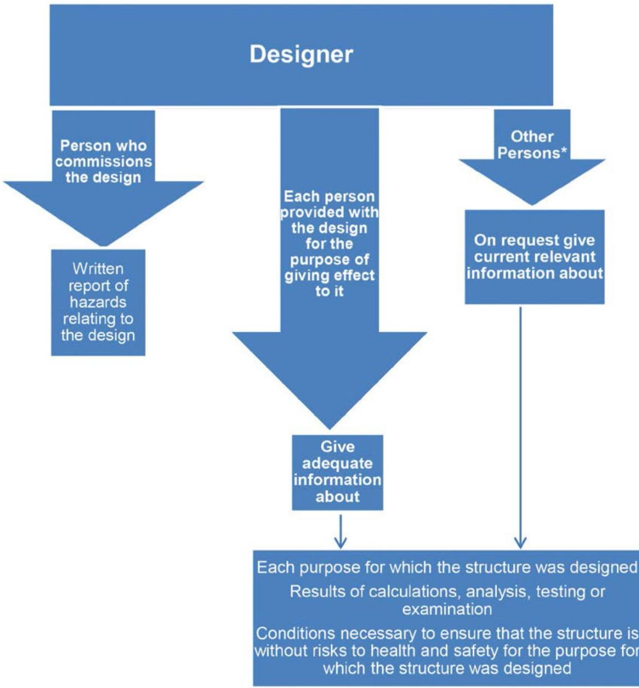

# Construction work

Code of Practice

# Disclaimer

Safe Work Australia is an Australian Government statutory agency established in 2009. Safe Work Australia includes Members from the Commonwealth, and each state and territory, Members representing the interests of workers and Members representing the interests of employers.

Representing the interests of employers.

Safe Work Australia works with the Commonwealth, state and territory governments to improve work health and safety and workers' compensation arrangements. Safe Work Australia is a national policy body, not a regulator of work health and safety. The Commonwealth, states and territories have responsibility for regulating and enforcing work health and safety laws in their jurisdiction.

ISBN 978- 0- 642- 33361- 2 (PDF)  ISBN 978- 0- 642- 33362- 9 (DOCX)

# Creative Commons

This copyright work is licensed under a Creative Commons Attribution- Noncommercial 4.0 International licence. To view a copy of this licence, visit creativecommons.org/licenses In essence, you are free to copy, communicate and adapt the work for non- commercial purposes, as long as you attribute the work to Safe Work Australia and abide by the other licence terms.

# Contact information

Safe Work Australia | info@swa.gov.au | www.swa.gov.au

# Contents

Foreword 5

# 1. Introduction 6

1.1. What is 'construction work'? 6  1.2. What is not 'construction work'? 7  1.3. What is a 'structure'? 7  1.4. What is 'high risk construction work'? 8  1.5. What is a 'construction project'? 8  1.6. Who has health and safety duties relating to construction work? 9  1.7. What is involved in managing risks associated with construction work? 11

# 2. Specific duties relating to construction work 16

2.1. Persons conducting a business or undertaking 16  2.2. Officers 20  2.3. Workers 20  2.4. Other persons 20

# 3. The risk management process 21

3.1. Identifying hazards 21  3.2. Assessing the risks 21  3.3. Controlling the risks 22  3.4. Maintaining and reviewing control measures 24

# 4. Safe work method statements 25

4.1. What is a safe work method statement? 25  4.2. Preparing a SWMS 26  4.3. Implementing a SWMS 28  4.4. Reviewing a SWMS 29

# 5. WHS management plans for construction projects 30

5.1. What is a WHS management plan? 30  5.2. What must the WHS management plan contain? 30  5.3. How to prepare a WHS management plan 31  5.4. Informing people about the WHS management plan 31  5.5. Reviewing and revising a WHS management plan 31  5.6. Keeping the WHS management plan 32

# 6. Information, training, instruction and supervision 33

6.1. General construction induction training 33  6.2. Workplace specific induction training 34  6.3. Other training 35  6.4. Supervision 36

# 7. General workplace management arrangements 37

Appendix A—Glossary 38

Appendix B—Examples of construction work 41

Appendix C—Examples of high risk construction work 44

Appendix D—Design duties 46

Consulting, cooperating and coordinating activities with other duty holders 47 Calculation, testing or examination 47 Providing information 47 The designer's safety report 49

Appendix E—Safe work method statement template—Guidelines 50

Recommended steps for filling out the safe work method statement template 50 High risk construction work safe work method statement template 52

Appendix F—Sample of a completed Safe work method statement 54

Appendix G—Preparing a WHS management plan 57

People with health and safety responsibilities 57

Appendix H—WHS Management plan template 60

Appendix I—Sample of a completed WHS Management plan 62

Appendix J—Housing construction workplace management arrangements 66

Appendix K—General construction workplace management arrangements 75

The work environment 75 Entry and exit 75 Work areas 76 Floors and surfaces 76 Lighting 76 Heat and cold 77 Essential services 77 Facilities at a construction workplace 78 First aid 80 Emergency planning 81 Personal protective equipment 82 Falling objects 83 Falls from heights 84

General construction workplace facilities 85

Amendments 88

# Foreword

This Code of Practice on construction work is an approved code of practice under section 274 of the Work Health and Safety Act (the WHS Act).

An approved code of practice provides practical guidance on how to achieve the standards of work health and safety required under the WHS Act and the Work Health and Safety Regulations (the WHS Regulations) and effective ways to identify and manage risks.

A code of practice can assist anyone who has a duty of care in the circumstances described in the code of practice. Following an approved code of practice will assist the duty holder to achieve compliance with the health and safety duties in the WHS Act and WHS Regulations, in relation to the subject matter of the code of practice. Like regulations, codes of practice deal with particular issues and may not cover all relevant hazards or risks. The health and safety duties require duty holders to consider all risks associated with work, not only those for which regulations and codes of practice exist.

Codes of practice are admissible in court proceedings under the WHS Act and WHS Regulations. Courts may regard a code of practice as evidence of what is known about a hazard, risk, risk assessment or risk control and may rely on the code in determining what is reasonably practicable in the circumstances to which the code of practice relates. For further information see the Interpretive Guideline: The meaning of reasonably practicable.

Compliance with the WHS Act and WHS Regulations may be achieved by following another method, if it provides an equivalent or higher standard of work health and safety than the code.

An inspector may refer to an approved code of practice when issuing an improvement or prohibition notice.

# Scope and application

This Code is intended to be read by a person conducting a business or undertaking (PCBU). It provides practical guidance for PCBUs, including those persons who design, construct, import, supply or install plant or structures, on how to eliminate, or if that is not possible, minimise the risks relating to construction work.

This Code may be a useful reference for other persons interested in the duties under the WHS Act and WHS Regulations that relate to construction work.

This Code applies to all types of construction work and all workplaces covered by the WHS Act and WHS Regulations.

# $=$  Housing construction work

While the information and guidance contained in this code is relevant to every type of construction work, extra guidance marked with this symbol  $=$  is provided for businesses in the housing construction sector.

# How to use this Code of Practice

This Code includes references to the legal requirements under the WHS Act and WHS Regulations. These are included for convenience only and should not be relied on in place of the full text of the WHS Act or WHS Regulations. The words 'must', 'requires' or 'mandatory' indicate a legal requirement exists that must be complied with.

The word 'should' is used in this Code to indicate a recommended course of action, while 'may' is used to indicate an optional course of action.

# 1. Introduction

# 1.1. What is 'construction work'?

# WHS Regulation 289

Meaning of construction work

'Construction work' is defined in the WHS Regulations as any work carried out in connection with the construction, alteration, conversion, fitting- out, commissioning, renovation, repair, maintenance, and refurbishment, demolition, decommissioning or dismantling of a structure.

Construction work can be commercial, civil or housing construction and includes the following:

- any installation or testing carried out in connection with an activity referred to in the above definition- the removal from the workplace of any product or waste resulting from demolition- the prefabrication or testing of elements, at a place specifically established for the construction work, for use in construction work- the assembly of prefabricated elements to form a structure, or the disassembly of prefabricated elements forming part of a structure- the installation, testing or maintenance of an essential service in relation to a structure- any work connected with an excavation- any work connected with any preparatory work or site preparation including landscaping as part of site preparation carried out in connection with an activity referred to in the above definition, or- an activity referred to in the above definition, carried out on, under or near water including work on buoys and obstructions to navigation.

Contracts covering a project are a good guide to what activities are done in connection with construction. Examples include:

- work by architects or engineers in on-site offices or conducting on-site inspections, but not architects or engineers working in offices away from the construction site- work by a mechanic on an excavator on-site and not in an isolated service area- delivering building materials to different points on the site, but not making deliveries to a single designated delivery area- excavating for a basement garage- testing fire equipment on the construction site- supervisors and manager moving around the site to monitor work- surveying a site after construction has started, but not surveying a greenfield site before construction has started, and- traffic control on a construction site.

For the purposes of this Code, housing construction work involves construction work relating to the following:

detached houses attached dwellings, separated from each other by a fire resisting wall, such as a terrace, row or town houses villa homes, strata or company title home units or residential flats

boarding and guest houses, hostels or similar with a floor area  $< 300m^2$ , and ancillary buildings to the above, such as private garages, gazeboes and carports.

The definitions above are based on classes 1, 2 and 10 of the National Construction Code. Work on multistorey buildings, that is above three habitable storeys, is not considered housing construction work for the purposes of this Code.

Examples of construction work are provided in Appendix B, Table 1.

# 1.2. What is not 'construction work'?

Construction work does not include any of the following:

- planning and design activities carried out prior to commencing the work- the manufacture of plant- the prefabrication of elements, other than at a place specifically established for the construction work, for use in the construction work- the construction or assembly of a structure that, once constructed or assembled, is intended to be transported to another place- testing, maintenance or repair work of a minor nature carried out in connection with a structure, or- mining or the exploration for or extraction of minerals.

Examples of what is not construction work are provided in Appendix B, Table 2.

# 1.3. What is a 'structure'?

The WHs Act defines a structure as anything that is constructed, whether fixed or moveable, temporary or permanent. A structure includes:

buildings, masts, towers, framework, pipelines, transport infrastructure and underground works (shafts or tunnels), for example noise reduction barriers on a freeway, communications masts or towers, electricity transmission towers and associated cables, flying cables and supports, guyed towers such as a ski- lift tower any component of a structure, or part of a structure.

Examples of what is defined as a structure include the following:

- a roadway or pathway- a ship1 or submarine- foundations, earth retention works and other earthworks including river works and sea defence works- formwork, falsework or any other structure designed or used to provide support, access or containment during construction work, for example a prop or formwork system- an airfield- a dock, harbour, channel, bridge, viaduct, lagoon or dam, and

- a sewer or sewerage or drainage works, for example stormwater drains, sheet piling to divert the course of a river or to build a cofferdam, underground storage tanks for an irrigation system, road tunnels, ventilation or access shaft for underground services.

Examples of structures relating to housing construction work may include:

- a carport, pergola, tool shed, tennis court, shade sails, awnings- an in-ground swimming pool- foundations, earth retention works and other earthworks- a structure designed or used to provide support, access or containment during construction work, for example a prop or formwork system, and- a sewer, a septic tank, or stormwater drain.

Chapter 6 of the WHS Regulations (the Construction Work chapter) does not apply to plant unless:

the plant is:

- a ship or submarine- a pipe or pipeline- an underground tank- designed or used to provide support, access or containment during work in connection with construction work (for example fall prevention devices, work positioning systems, formwork, personnel or material hoists where these are used in connection with construction work).

- work on the plant relates to work carried out in connection with construction work, or- the plant is fixed plant on which outage work or overhaul work involves or may involve work being carried out by five or more persons conducting businesses or undertakings at any point in time.

# 1.4. What is 'high risk construction work'?

# WHS Regulation 291

Meaning of high risk construction work

WHS Regulation 291 sets out a list of construction work that is considered to be high risk for the purposes of the WHS Regulations. It is construction work for which a safe work method statement (SWMS) is required. Chapter 4 of this Code provides more detail on SWMS.

Examples of high risk construction work are provided in Appendix C.

# 1.5. What is a 'construction project'?

# WHS Regulation 292

Meaning of construction project

A construction project is a project that involves construction work where the cost of the construction work is $250,000 or more. A construction project covers the activities involved in the construction work up to the point where the construction project is handed over to the person who commissioned it. The handover usually takes place at the practical completion

of the project, for example when a house is considered habitable and the buyer or owner takes possession.

# Valuing construction work

The cost of construction work can be determined by the contract price for carrying out the work. The kinds of costs that may be included are:

project management costs associated with the work the costs of fittings and furnishings including any refitting or refurbishing associated with the work except where the work involves an enlargement, expansion or intensification of a current use of land, and any taxes, levies or charges other than GST paid or payable in connection with the work by or under any law.

The cost of the construction work should not include:

The cost of the land on which the development is to be carried out including the civil engineering, utility and other land development costs involved in a land subdivision the costs associated with marketing or financing the development including interest on any loans, and the costs associated with legal work carried out or to be carried out in connection with the development.

# Principal contractor

# WHS Regulation 293

Meaning of principal contractor

Under the WHS Regulations, each construction project must have a principal contractor. There can only be one principal contractor for a construction project at any one time. A principal contractor is a person conducting a business or undertaking (PCBU).

The PCBU who commissions a construction project is the principal contractor for that project, unless they engage another PCBU to be the principal contractor for the duration of the project. The PCBU who commissions the construction project must authorise the nominated principal contractor to have management or control of the workplace and discharge their duties as the principal contractor.

A person with management or control of a workplace must comply with section 20 of the WHS Act.

# 1.6. Who has health and safety duties relating to construction work?

Everyone involved in construction work has health and safety duties when carrying out the work.

A PCBU has the primary duty under the WHS Act to ensure, so far as is reasonably practicable, workers and other persons are not exposed to health and safety risks arising from the business or undertaking.

Specific duties relating to construction work are outlined in Chapter 2 of this Code, noting a PCBU may also have multiple or shared duties while undertaking construction work.

# Multiple duties

The nature of construction work means there are various businesses or undertakings with duties relating to the same construction work. It can involve PCBUs who:

carry out construction work design the building or structure commission the construction work (except for a home- owner where they are not a PCBU) are principal contractors have management or control of a workplace at which construction work is carried out, or carry out high risk construction work.

Other duty holders who have responsibilities under the WHS Act and WHS Regulations are:

officers (for example, company directors) workers, and other persons (for example, visitors to construction sites).

It is common in the construction industry for a person to fall into more than one duty holder category. For example a principal contractor will have the duties of a principal contractor as well as other duties of a PCBU. A subcontractor is a PCBU and can also be a worker when working at a construction workplace.

# Shared duties

More than one person can concurrently have the same duty. Where two or more people have the same duty, each person must comply with that duty, even if another duty holder has the same duty. Each person's requirement to discharge this duty is however limited by the extent to which:

the person has the capacity to influence and control the matter, or would have had capacity but for an agreement or arrangement purporting to limit or remove that capacity.

A person cannot contract out of their health and safety duties, but can make arrangements with other PCBUs to do the things that will assist them to meet their duties.

For example a principal contractor and a subcontractor, as PCBUs, will have the same duty to ensure access to first aid facilities at a workplace. It may not be practical or necessary for both PCBUs to provide the first aid facilities, so they may arrange for only one of them to provide the facilities. In doing this and confirming the facilities are in place and accessible to workers, each PCBU has 'ensured access to first aid facilities' and therefore complied with their duty.

Determining which person or persons have the capacity to influence and control the work depends on the circumstances at the time.

For example at a housing construction site subcontractors have the capacity to directly manage the risks associated with their own work and the activities of any worker they engage to carry out the work. The principal contractor or builder will also be able to influence and control the way work is carried out, and how risks are managed, by coordinating and monitoring the work and confirming risk control measures are implemented by the subcontractor.

Although a principal contractor or builder may not be present on site, they must still ensure the work is being carried out safely. The principal contractor or builder should check the subcontractor's work procedures and any SWMS (if relevant) to ensure risks associated with the work are addressed and then visit the site as necessary to verify the work is being carried out safely.

In every case, individuals are expected to take reasonable care for their own safety and that their acts do not adversely affect the health and safety of others.

# 1.7. What is involved in managing risks associated with construction work?

# WHS Regulation 297

Management of risks to health and safety WHS Regulation 32 Application of Part 3.1 WHS Regulation 33 Specific requirements must be complied with WHS Regulation 34 Duty to identify hazards WHS Regulation 35 Managing risks to health and safety WHS Regulation 36 Hierarchy of control measures WHS Regulation 37 Maintenance of control measures WHS Regulation 38 Review of control measures

This Code provides guidance on how to manage the risks associated with construction work in the workplace using the following systematic process:

Identify hazards- find out what could cause harm. Assess risks, if necessary- understand the nature of the harm that could be caused by the hazard, how serious the harm could be and the likelihood of it happening. This step may not be necessary if you are dealing with a known risk with known controls. Control risks- - implement the most effective control measures that are reasonably practicable in the circumstances in accordance with the hierarchy of control measures, and ensure they remain effective over time. Review control measures to ensure they are working as planned.

# Hierarchy of control measures

The WHS Regulations require duty holders to work through the hierarchy of control measures when managing certain risks; however, it can be applied to any risk. The hierarchy ranks control measures from the highest level of protection and reliability to the lowest. You must, so far as is reasonably practicable:

first, eliminate risks by eliminating hazards; this is the most effective control measure then substitute hazards with something safer, isolate hazards from people and/or use engineering controls to minimise any risks that have not been eliminated then use administrative controls to minimise any remaining risks, and then use personal protective equipment (PPE) to minimise any risks that remain.

The control measures you apply may change the way work is carried out. In these situations, you must consult your workers and develop safe work procedures, and provide your workers with training, instruction, information and supervision on the changes.

Further guidance on the risk management process and the hierarchy or control measures is in the Code of Practice: How to manage work health and safety risks.

In addition to the duties covered in this Code, there are other requirements under the WHS Regulations that may apply to construction work, for example relating to:

prevention of falls noise hazardous manual tasks confined spaces demolition work electrical safety and electrical work plant and structures high risk work (licensing and registrations) hazardous chemicals, asbestos and lead, and resolving WHS issues.

# Consulting workers

Consultation involves sharing information, giving workers a reasonable opportunity to express views and taking those views into account before making decisions on health and safety matters.

# WHS Act section 47

Duty to consult workers

# WHS Act section 48

Nature of consultation

A PCBU must consult, so far as is reasonably practicable, with workers who carry out work for the business or undertaking and who are (or are likely to be) directly affected by a health and safety matter. This duty to consult is based on the recognition that worker input and participation improves decision- making about health and safety matters and assists in reducing work- related injuries and disease.

The broad definition of a 'worker' under the WHS Act means a PCBU must consult with employees and anyone else who carries out work for the business or undertaking. A PCBU must consult, so far as is reasonably practicable, with contractors and subcontractors and

their employees, on- hire workers, outworkers, apprentices, trainees, work experience students, volunteers and other people who are working for the PCBU and who are, or are likely to be, directly affected by a health and safety matter.

Workers are entitled to take part in consultations and to be represented in consultations by a health and safety representative who has been elected to represent their work group.

Consultation with workers and their health and safety representatives is required at each step of the risk management process.

In many cases, decisions about construction work and construction projects are made prior to engaging workers. In such cases, it may not be possible to fully consult with workers in these early stages. However, it is important to consult with them as the construction work progresses.

At its most basic level, consultation should involve talking to each other about work health and safety. Consultation can occur by holding discussions with workers in face- to- face talks or by phone, fax, email or other networks. Where workers are culturally or linguistically diverse or are inexperienced then face- to- face consultation may be more effective.

For example, the builder or principal contractor can communicate with subcontractors via face- to- face meetings, email, phone or fax, and request information is passed on to the subcontractors' workers. It is important the builder follows up with the workers and the subcontractors to check the information has been passed on, and any feedback is provided to the builder. This may take place when the builder or their representative is on site. Other options include conducting toolbox talks, sending out information online and requesting feedback, or using telephone hook- ups.

Consultation may also occur through the builder talking to subcontractors and asking them to share information with the subcontractors' workers and pass any feedback back to the builder.

Toolbox talks or pre- start meetings can be used by both the builder and subcontractors to provide information to and receive feedback from workers as well as assist in raising the awareness of how construction work can be carried out in a safe and healthy manner.

At a toolbox talk, the PCBU can provide updates on any upcoming issues which may have an effect on health and safety, for example:

- new high risk construction activities- changes in access and site security, and- changes which may affect members of the public.

When using toolbox talks it is considered best practice to:

- keep a record of the topic covered, attendees and any feedback received- organise a program of toolbox talks to give workers sufficient opportunity to provide input into how risks should be controlled, and- monitor the effectiveness of toolbox talks through safety outcomes, for example, control measures implemented and near misses.

# Consulting, cooperating and coordinating activities with other duty holders

# WHS Act section 46

Duty to consult with other duty holders

If more than one person has a duty in relation to the same matter, each person with the duty must, so far as is reasonably practicable, consult, cooperate and coordinate activities with all other persons who have a duty in relation to the same matter.

Examples of where a PCBU will have a health and safety duty include where:

the PCBU engages workers to carry out work the PCBU directs or influences workers in carrying out work other persons may be put at risk from work carried out in their business or undertaking the PCBU manages or controls a workplace or the fixtures, fittings or plant at a workplace the PBCU's business or undertaking involves designing, manufacturing, importing or supplying plant, substances or structures for use at a workplace the PBCU's business or undertaking involves installing, constructing or commissioning plant or structures at a workplace.

Duty holders' work activities may overlap and interact at particular times. When they share a duty, for example a duty in relation to the health and safety of the same worker or workers, or are involved in the same work, they will be required to consult, cooperate and coordinate activities with each other so far as is reasonably practicable.

Since various contractors and subcontractors work on the same construction site, their activities are likely to overlap and interact with each other. They each have a duty to protect the health and safety of workers and other persons at the workplace and must therefore consult, cooperate and coordinate activities to ensure each person is made aware of what the others are doing, to identify the hazards and risks and decide who is best placed to take action to control the risks.

Principal contractors for a construction project must document, in their WHS management plan for the project, the arrangements in place for consultation, cooperation and coordination between the PCBUs at the workplace where the construction project is being undertaken.

PCBUs should discuss WHS arrangements with other duty holders including other subcontractors, prior to commencing work, for example by visiting the site or by phone or email.

Subcontractors working on the same site should also discuss their activities with each other directly.

# Examples of consultation, cooperation and coordination on construction workplaces

# Example 1

As part of work for a builder, a roof tile subcontractor installs a roof perimeter guardrail system to minimise the risk of falls. The builder reaches an agreement with the roof tiler that the guardrail will remain in place until solar panels are installed by another subcontractor. The roof tiler contacts both the builder and the panel installer when the tiling is complete, and the panel installer checks to make sure the guardrail is properly installed before

commencing work. The panel installer then lets the builder know when the panels are finished, and arrangements are then made to dismantle the guardrail. The builder also checks the progress of the work regularly and ensures the relevant fall protection information is included in each subcontractor's SWMS and is properly installed on site.

# Example 2

An electrician needs to isolate the electricity supply so they can work safely. At the same time, a carpenter requires electricity for powered equipment. If the electrician doesn't communicate with the carpenter about the electricity shut off, and if the carpenter reconnects the supply, this increases the risk of injury to them both. The electrician should speak with both the carpenter and the builder to tell them the electricity supply will be shut off and negotiate the time during which electricity will be unavailable. The carpenter should check with the electrician to make sure it is safe to use the electricity supply.

# Example 3

A plumber's work on one site is delayed, so they decide to continue work on another job. On the way to the second site, the plumber telephones the builder of the home and leaves a message to say that they will be attending the site. The builder calls the plumber back to let them know that bricks are being delivered that day. The plumber assures the builder that their workers and vehicle will be away from the site access point and delivery area. The builder also reminds the plumber to lock the gates when the work is finished.

Further information is in the Code of Practice: Work health and safety consultation, cooperation and coordination.

# 2. Specific duties relating to construction work

2.1. Persons conducting a business or undertaking

# Designers

# WHS Regulation 294

Person who commissions work must consult with designer

# WHS Regulation 295

Designer must give safety report to person who commissions design

# WHS Regulation 296

Person who commissions project must give information to principal contractor

Persons conducting a business or undertaking (PCBUs) who design a structure to be used, or could reasonably be expected to be used as, or at, a workplace have specific WHS duties.

There may be multiple designers who are involved in the design of a structure and have the same duties, for example draftspersons, building designers, architects and engineers. A builder could be a designer if they design a structure themselves or are involved in altering the design for a building, even after construction work has started.

In relation to construction work, a designer of a structure or any part of a structure to be constructed must give a written report to the PCBU who commissioned the design. The report must specify, so far as the designer is reasonably aware, the hazards relating to the design that create a risk to the health and safety of persons who will carry out construction work on the structure, and are specific to the particular design.

In addition, if requested the designer can provide to anyone who is issued with the design, information on how they have designed the structure to be without risk to health and safety throughout its lifecycle when it is used as a workplace. The lifecycle includes construction, maintenance, use and demolition. This information may also be included in the designer's safety report.

Further information is provided in Appendix D. For detailed guidance on designers' duties refer to the Code of Practice: Safe design of structures.

# Person that commissions construction work

The WHS Regulations require a PCBU who commissions construction work to:

- consult, so far as is reasonably practicable, with the designer of the whole or any part of the structure about how to ensure risks to health and safety arising from the design during the construction work are eliminated, so far as is reasonably practicable, or if it is not reasonably practicable to eliminate the risks, minimised so far as is reasonably

practicable. Such consultation must include giving the designer any information that the person has in relation to the hazards and risks at the workplace where the construction work is to be carried out

take reasonable steps to have a copy of the designer's safety report if they did not themselves commission the design of the construction project, and give the principal contractor any information they have in relation to hazards and risks at or in the vicinity of the workplace where the construction project is to be carried out.

While there may be persons who represent the person that commissions the construction work or a construction project and coordinate the commissioning (for example, project managers, construction managers, architects or engineers), the person who actually commissions the work will remain the duty holder for the above duties.

Examples of persons that commission construction work include:

- a builder engaging a designer to design a large spanning roof truss system for a home- property developers, clients, owner-builders, and- a subcontractor engaging an engineer to design precast and tilt-up panels for a home.

# Principal contractor

# WHS Regulation 308

Specific control measure—signage identifying principal contractor

# WHS Regulation 309

WHS management plan—preparation

# WHS Regulation 310

WHS management plan—duty to inform

# WHS Regulation 311

WHS management plan—review

# WHS Regulation 312

High risk construction work—safe work method statements

# WHS Regulation 313

Copy of WHS management plan must be kept

# WHS Regulation 314

Further health and safety duties—specific regulations

# WHS Regulation 315

Further health and safety duties—specific risks

Under the WHS Regulations a principal contractor for a construction project must:

- ensure signs are installed that:

- show the principal contractor's name and telephone contact numbers including an out of hours telephone number- show the location of the site office for the project, if there is one, and- are clearly visible from outside the workplace, or the work area of the workplace, where the construction project is being undertaken.

prepare and review the WHS management plan for the workplace before work on the project commences, ensuring, so far as is reasonably practicable, each person who is to carry out the construction work is, before commencing work, made aware of the content of the plan and their right to inspect the management plan. Importantly,

- a copy of the management plan must be kept until the project is completed, unless a notifiable incident occurs in connection with the construction project to which the statement relates in which case the management plan must be retained for at least 2 years after the incident occurs, and- the principal contractor must review and as necessary revise the WHS management plan to ensure it remains up to date, and- if it is revised the principal contractor must ensure, so far as is reasonably practicable, each person carrying out construction work is made aware of the revision.

- take all reasonable steps to obtain a copy of the safe work method statement (SWMS) relating to high risk construction work before high risk construction work starts- make arrangements for ensuring compliance at the workplace with Divisions 2 to 10 of Part 3.2 and Part 4.4 of the WHS Regulations, and manage the specific risks to health and safety associated with:

- the storage, movement and disposal of construction materials and waste at the workplace- the storage of plant not in use- traffic in the vicinity of the workplace that may be affected by construction work carried out in connection with the construction, and- essential services at the workplace.

More detail on the WHS management plan is in Chapter 5 of this Code. Information on the role of the principal contractor in general workplace management arrangements is in Chapter 7 of this Code.

# Persons who have management or control of a workplace at which construction work is carried out

A person with management or control of a workplace at which construction work is carried out must:

- ensure, so far as is reasonably practicable, the workplace is secured from unauthorised access. To the extent to which it cannot be prevented isolate hazards within the workplace, having regard to relevant matters, including risks to health and safety arising from unauthorised access to the workplace, and the likelihood of unauthorised access occurring, and- take all reasonable steps to get current underground essential services information when excavation work is to be carried out and provide it to any person engaged to carry out the excavation work.

Depending on the circumstances, both the builder and subcontractors may have these duties in relation to the part of the workplace over which they have management or control.

For example, the person with management or control of the workplace must take reasonable steps to ensure underground essential services information is received prior to directing or allowing excavation work to start. Both the builder and excavation subcontractor must consult with each other to decide who will get the required information before the work starts.

If the builder gets the information, the information must be provided to the excavation subcontractor and the excavation subcontractor must provide it to the workers engaged to

carry out the work. The excavation contractor can also ask for this information to ensure they carry out their work safely.

Both the builder and subcontractors would also have a duty to ensure, so far as is reasonably practicable, subcontractors' work areas are secured against unauthorised access prior to leaving the site if hazards are present. For example, both duty holders must ensure the risk of anyone falling into open excavations after hours is eliminated or minimised so far as is reasonably practicable. The duty holders must, so far as is reasonably practicable, consult to reach an agreement about who should actually secure the site. The excavation subcontractor might undertake to barricade the excavation area in an agreed way and the builder might undertake to fence off the construction site to prevent unauthorised persons entering the site.

$\circledcirc$  Bricklaying subcontractors working on site by themselves should secure their scaffolds, for example by removing access ladders prior to leaving the site. As the builder also has a duty to ensure health and safety in relation to scaffolds at the workplace, they must, so far as is reasonably practicable consult, cooperate and coordinate with the bricklaying subcontractor to determine how any risks will be managed (that is, the way in which the scaffold will be secured). This might be as simple as having a discussion and agreeing the subcontractor will secure the scaffold in a way that is determined to be safe.

# Persons carrying out high risk construction work

The WHS Regulations place an obligation on the PCBU that includes the carrying out of high risk construction work to:

ensure a SwMs is prepared, or has already been prepared before the proposed work starts make arrangements to ensure the high risk construction work is carried out in accordance with the SwMS ensure a copy of the SwMs is given to the principal contractor before the work starts ensure the SwMs is reviewed and revised if necessary keep a copy of the SwMs until the high risk construction work is completed, or if a notifiable incident occurs in connection with the high risk construction work, for at least two years after the incident occurs, and ensure for the period the SwMs must be kept it is readily accessible and understandable to any worker engaged to carry out the high risk construction work and for inspection under the WHS Act (for example, by an inspector).

# Other duties

Apart from the specific duties outlined above, a PCBU must:

manage risks to health and safety in accordance with the WHs Regulations when excavation work is being carried out comply with the requirements of the WHs Regulations regarding the excavation of trenches, and comply with the requirements of the WHs Regulations in relation to general construction induction training (for more information about general construction induction training, see Part 6.1 of this Code).

Further guidance on excavation work is available in the Code of Practice: Excavation work.

Further guidance on general construction induction training is available in the Workplace induction for construction workplaces - information sheet.

# 2.2. Officers

Officers, for example company directors, have a duty under the WHs Act to exercise due diligence to ensure the PCBU complies with its duties or obligations under the WHS laws. Exercising 'due diligence' includes taking reasonable steps to:

acquire and keep up- to- date knowledge of work health and safety matters gain an understanding of the PCBU's operations including the hazards and risks associated with those operations ensure the PCBU has available for use, and uses, appropriate resources and processes to eliminate or minimise risks to health and safety arising from the work ensure the PCBU has appropriate processes for receiving, considering and responding to information about hazards, risks and incidents ensure the PCBU has, and implements, processes for complying with its work health and safety duties or obligations, and verify these resources and processes are provided and used.

# 2.3. Workers

A worker is any person who carries out work in any capacity for a business or undertaking. Workers include, but are not limited to, direct employees, subcontractors and employees of subcontractors, employees of labour hire companies and apprentices. Workers must always:

take reasonable care for their own health and safety take reasonable care their acts or omissions do not adversely affect the health and safety of other persons comply, so far as they are reasonably able, with any reasonable instruction, and cooperate with any reasonable policy or procedure relating to health and safety at the workplace that the PCBU has notified workers of.

In relation to construction work, workers must:

keep their general construction induction training card (white card) available for inspection, or if awaiting a decision on their application for a general construction induction training card (white card) - - keep their general induction training certification available for inspection.

Subcontractors must comply with both the duties of workers and of PCBUs. Self- employed PCBUs are also workers for their own business or undertaking.

# 2.4. Other persons

Other persons at the workplace, for example inspectors and visitors to construction sites including home owners and potential buyers, have a duty to:

take reasonable care for their own health and safety take reasonable care their acts or omissions do not adversely affect the health and safety of other persons, and comply, so far as is reasonably practicable, with any reasonable instruction given to them by the PCBU.

# 3. The risk management process

# 3.1. Identifying hazards

The first step in the risk management process is to identify the hazards associated with construction work. Examples of hazards include:

the construction workplace itself, including its location, layout, condition and accessibility the use of ladders, incorrectly erected equipment, unguarded holes, penetrations and voids, unguarded excavations, trenches, shafts and lift wells, unstable structures such as incomplete scaffolding or mobile platforms, fragile and brittle surfaces such as cement sheet roofs, fibreglass roofs, skylights and unprotected formwork decks falling objects, for example tools, debris and equipment collapse of trenches structural collapse the handling, use, storage, and transport or disposal of hazardous chemicals the presence of asbestos and asbestos- containing materials welding fumes, gases and arcs hazardous manual tasks the interface with other works or trade activities, and the physical working environment, for example the potential for electric shock, immersion or engulfment, fire or explosion, slips, trips and falls, people being struck by moving plant, exposure to noise, heat, cold, vibration, radiation including solar UV radiation, static electricity or a contaminated atmosphere, and the presence of a confined space.

# 3.2. Assessing the risks

Assessing the risk includes considering:

the severity of any injury or illness that could occur, for example is it a small isolated hazard that could result in a very minor injury or is it a significant hazard that could have wide- ranging and severe effects, and the likelihood or chance someone will suffer an illness or injury, for example consider the number of people exposed to the hazard.

The WHS Regulations do not expressly require a risk assessment to be performed in respect of construction work.

However, in many circumstances a risk assessment will assist in determining the control measures that should be implemented. It will help to:

identify which workers are at risk of exposure determine what sources and processes are causing risk identify if and what kind of control measures should be implemented, and check the effectiveness of existing control measures.

A risk assessment is not necessary if the risk and how to control it is already known.

For information about preparing a safe work method statement (SwMS) for high risk construction work, see Chapter 4.

# 3.3. Controlling the risks

3.3. Controlling the risksThe WHS Regulations may require specific control measures to be implemented in certain circumstances. For example, the risk of collapse of trenches 1.5 metres or more in depth must be controlled with shoring, benching or battering. Where specific controls are prescribed, these must be implemented before work proceeds.

# The hierarchy of control measures

The hierarchy of control measuresSome control measures are more effective than others. Control measures can be ranked from the highest level of protection and reliability to the lowest. This ranking is known as the hierarchy of control. The higher order controls must always be considered first.

# Eliminate the risk

This means removing the hazard or hazardous work practice from the workplace. This is the most effective control measure and must always be considered before anything else. For example, eliminate the risk of a fall from a height by doing the work at ground level.

If elimination of the risk is not reasonably practicable, you must consider using substitution, isolation or engineering controls, or a combination of these control measures, to minimise the risk.

# Minimise the risk by using one of the following control measures

# Substitution

Minimise the risk by substituting or replacing a hazard or hazardous work practice with a less hazardous one. For example:

substituting a two- part epoxy substance with a water- based acrylic waterproofing system will minimise exposure to a hazardous substance substituting an ordinary brick- cutting saw blade with a noise- reduced saw blade will minimise exposure to hazardous noise, and using a water- based paint rather than a solvent- based paint.

# Isolation

IsolationMinimise the risk by isolating or separating the hazard or hazardous work practice from people. For example isolating a mobile plant work zone from workers and the public with physical barriers to minimise the risk of contact occurring between a person and the mobile plant.

# Engineering controls

Engineering controls are physical control measures to minimise risk. For example:

carrying tools from one level to another with a material hoist or craning material will minimise the risk of workers developing a musculoskeletal disorder benching, battering or shoring the sides of the excavation will minimise the risk of a person being trapped and prevent the excavation from collapsing enclosing an open cab excavator, for example using a falling object protective structure (FOPS) or a roll- over protective structure (ROPS) will minimise the risk of an operator being struck by a falling object or being crushed if the excavator rolls over, and

using safety switches or residual current devices (RCD) to minimise the risk of electric shock.

# Minimise the risk using administrative controls

Administrative controls should only be considered when other higher order control measures are not practicable, or to increase protection from the hazard. These are work methods or procedures designed to minimise the exposure to a hazard, such as ensuring there is no unauthorised entry of a person to a work area. For example:

using a 'keep out' sign and a person to secure an exclusion zone when dismantling scaffolding to minimise the risk of people entering the work area and being struck by a falling object scheduling tasks so they are completed outside peak UV radiation times to reduce exposure to UV radiation implementing a training program to show workers how to use new equipment implementing a job rotation system, and using permit systems to prevent unauthorised persons from entering a confined space.

# Minimise the risk using personal protective equipment

Personal protective equipment (PPE) is the lowest order control measure in the hierarchy of controls. PPE should also only be considered when other higher order control measures are not reasonably practicable or to increase protection from the hazard.

PPE relies on the proper fit and use of the PPE and does nothing to change the hazard itself. It therefore requires thorough training and effective supervision to ensure compliance and effectiveness. Examples of PPE include:

wide- brimmed hats to shade the face, head, neck and ears (where hard hats are required then it should be a hard hat brim or neck flap), sunglasses and broad spectrum SPF 30 or higher sunscreen to minimise the exposure to ultraviolet (UV) radiation high visibility reflective clothing or vests, and earplugs or ear muffs to minimise the risk of exposure to excessive noise when operating noisy machinery and power tools.

# Combination of control measures

In many cases a combination of control measures may be implemented to control a risk. When selecting and implementing a combination of control measures it is important to consider whether any new risks might be introduced as a result and, if so, whether the combination of the control measures should be reviewed.

# Example 1

$\circledcirc$  To manage the risk of a fall when a worker is removing old roofing on a building under demolition, control measures may include the following:

determine whether the roof can be demolished from the ground (elimination) if this is not reasonably practicable, minimise the risk of a fall by working off scissor lifts or elevating work platforms (engineering control), and provide training on site rules and SwMS about work at heights (administrative control).

# Example 2

To manage the risk of persons working in the same area from being struck by mobile plant, control measures may include:

using traffic lights instead of a traffic controller to control traffic at roadworks (elimination) replacing an item of mobile plant which has a restricted field of vision with one with a clear field of vision (substitution) using zero tail swing excavators rather than conventional tail swing excavators (substitution) segregating the work processes through distance and time (isolation) installing collision avoidance technology (in accordance with manufacturer's instructions) when the vehicle is reversing (engineering) developing and implementing a traffic management plan for any traffic control being carried out (administrative), and requiring workers to wear high visibility reflective clothing or vests (PPE).

# 3.4. Maintaining and reviewing control measures

# WHS Regulation 37

Maintenance of control measures

# WHS Regulation 38

Review of control measures

The control measures put in place to protect health and safety must be regularly reviewed to make sure they are effective, by ensuring they remain fit for purpose, suitable for the nature and duration of work, and installed, set up and used correctly.

A review of control measures must occur as necessary so as to maintain, so far as is reasonably practicable, a work environment that is without risks to health or safety. This can be done by using the same methods as the initial hazard identification process. A review may take place when the control measures are no longer effective in controlling the risk, before a change takes place at the workplace that is likely to give risk to new or different health and safety risks or that the measure may not effectively control, when a new hazard or risk is identified, if a review is identified as being necessary following a consultation, or if a health and safety representative requests a review. Common methods include workplace inspection, consultation, testing and analysing records and data. Reviewing the control measures also involves considering whether a higher order control measure is now reasonably practicable.

When reviewing control measures, the SwMs must also be reviewed and revised where necessary.

If problems are found, go back through the risk management steps, review your information and make further decisions about control measures.

A change at the workplace includes:

a change to the workplace itself or any aspect of the work environment, and a change to a system of work, a process or a procedure.

Where a SwMS has been developed for high risk construction work or a WHS management plan has been developed for a construction project, these documents must also be reviewed and revised (where necessary) when control measures have been reviewed.

# 4. Safe work method statements

# 4.1. What is a safe work method statement?

A safe work method statement (SwMs) is required for the high risk construction work activities defined in the WHs Regulations. Examples of high risk construction work are provided in Appendix C.

A SwMs is a written document that must identify the high risk construction work activities to be carried out at a workplace, the hazards and risks to health and safety arising from these activities, the measures to be implemented to control the risks and how the control measures are to be implemented, monitored and reviewed. Its primary purpose is to help persons conducting a business or undertaking (PCBUs), supervisors and workers implement and monitor the control measures established at the workplace to ensure high risk construction work is carried out safely.

For other construction activities a SwMs is not required. However, as a PCBU you must manage risks to health and safety by eliminating or minimising risks so far as is reasonably practicable, and if it is not reasonably practicable, to minimise those risks so far as is reasonably practicable.

# Who is responsible for preparing a SwMs?

A PCBU must prepare a SwMs- or ensure a SwMs has been prepared- - before high risk construction work starts.

The person responsible for carrying out the high risk construction work is best placed to prepare the SwMs in consultation with workers who will be directly engaged in the high risk construction work.

If more than one PCBU has the duty to ensure a SwMs is or has been prepared, they must consult and cooperate with each other to coordinate who will be responsible for actually preparing it.

There may be situations where there are different types of high risk construction work occurring at the same time at the same workplace, for example if work is being carried out:

where there is a risk of a person falling more than 2 metres, and near a trench with an excavated depth greater than 1.5 metres.

In these cases one SwMs may be prepared to cover any high risk construction work activities being carried out at the workplace. Alternatively, a separate SwMs can be prepared for each type of high risk construction work. If separate SwMs are prepared, consider how the different work activities may impact on each other and whether this may lead to inconsistencies between control measures.

# Example

A subcontractor, such as a roof plumber, is engaged to install roof sheeting on a structure higher than 2 metres. A second subcontractor is engaged to use a crane to lift the roof sheeting so the first subcontractor can install it. Both subcontractors are required to prepare a SwMS for the high risk construction work being carried out—for the work where there is a risk of falling more than 2 metres and for the work involving powered mobile plant.

In this case, the subcontractors may decide to prepare one SWMS to cover both types of high risk construction work or they may decide to prepare two separate SWMS. If separate SWMS are being prepared, the subcontractors must consult, cooperate and coordinate to ensure the work will be carried out safely. The principal contractor must be provided with the SWMS and monitor their activities.

# 4.2. Preparing a SWMS

# SWMS content

# WHS Regulation 299

Safe work method statement required for high risk construction work

Guidance for using a SWMS template is at Appendix E. This outlines the information which must be included in a SWMS and other information which should be included, for example the details of the person responsible for ensuring compliance with the SWMS.

The content of a SWMS should provide clear direction on the control measures to be implemented. There should be no statements that require a decision to be made by supervisors or workers. For example, the statement 'use appropriate personal protective equipment (PPE)' does not detail the control measures. The control measures should be clearly specified.

The SWMS must be accessible and understandable to any individual who needs to use it. It is important that those who need to carry out work in accordance with the SWMS understand the detail of the SWMS and what they are required to do to implement and maintain risk controls. For example, it should take into account the literacy needs and the cultural or linguistically diverse backgrounds of the workers.

An example of the information to be included in a SWMS is at Appendix F.

# Workplace specific focus

A SWMS must take into account the circumstances at the workplace that may affect the way in which the high risk construction work is carried out—that is, the site where the high risk construction work is being carried out, the work environment and the workers carrying out the work.

A generic SWMS may be prepared and used for high risk construction work activities carried out on a regular basis. However, a generic SWMS must be reviewed to take into account the hazards and risks for the specific workplace and be revised as necessary.

# Consultation

Workers and their health and safety representatives, if any, must be consulted when preparing SwMs. If there are no workers engaged at the planning stage, consultation must occur with workers when the SwMs is first made available to workers, for example during workplace- specific training or a toolbox talk. Workers and their health and safety representatives, if any, must also be consulted when a SwMs is reviewed.

A SwMs may include details of workers who have been consulted on the content of the SWMS, the date the consultation occurred and the signature of each worker acknowledging their participation in developing the SwMs.

# Construction projects

If high risk construction work is being carried out in connection with a construction project, a SWMS must take into account the WHS management plan prepared by the principal contractor.

A PCBU must provide the principal contractor with a copy of the SwMS before high risk construction work starts.

The principal contractor also has a duty to take reasonable steps to get the SwMS before high risk construction work starts, for example by:

asking contractors to provide a copy of the SwMS before they start work and to have the SWMS available on site, and making it clear in the WHS management plan that the SwMS must be provided to the principal contractor before work starts.

The SwMS must ensure it identifies the high risk construction work, specifies the hazards relating to the high risk construction work and any related risks to health and safety, describes the measures to be implemented so the risks can be controlled adequately, and describes how the control measures implemented may be monitored and reviewed adequately.

For a construction project the SwMS may also include:

the name of the principal contractor the address where the high risk construction work will be carried out the date the SwMS was prepared and the date it was provided to the principal contractor, and the review date (if any).

# 4.3. Implementing a SwMS

Complying with a SwMS

# WHS Regulation 300

Compliance with safe work method statement

PCBUs who are involved in high risk construction work must put in place arrangements to ensure the work is carried out in accordance with the SwMS. The PCBU who directly engages the workers performing the high risk construction work is best placed to implement the SwMS and to ensure compliance.

Arrangements may include a system of routine or random workplace inspections, for example observing workers and supervisors to see if the control measures outlined in the SwMS are being implemented.

The responsibility to implement, monitor and review the control measures may be allocated to a person supervising the work, such as a work crew's leading hand or supervisor. However, the duties of the PCBU are not transferrable. The PCBU must be satisfied the control measures are implemented, monitored and reviewed to ensure the health and safety of the workers.

A builder must have a system in place to monitor compliance with the SwMS. This system may include checking the control measures detailed in the SwMS are being used when the builder or the builder's representative attends the site.

If the work is not being carried out in accordance with the SwMS then the work must stop immediately or as soon as it is safe to do so. Work must not resume until the work can be carried out in accordance with the SwMS. If work is stopped, the work and the SwMS should be reviewed to identify non- compliance and ensure the method in the SwMS is the most practical and safest way of doing the task. If another method is identified as being a reasonably practicable option, the SwMS should be revised to take this change into account before re- commencing work.

# Providing information and instruction

PCBUs must ensure that a SwMS is readily accessible to any workers engaged in high risk construction. Workers should:

understand the hazards and risks arising from the work understand and implement the risk controls in a SwMS, and know what to do if the work is not being conducted in accordance with the SwMS.

This information and instruction may be provided during general construction induction training, workplace- specific training or during a toolbox talk by the principal contractor, contractor or subcontractor.

# Keeping the SwMS and making it available

Keeping the SwMS and making it availableThe SWMS must be kept and readily accessible to any person engaged to carry out the high risk construction work and for inspection until the high risk construction work to which it relates is completed or for at least 2 years following the occurrence of a notifiable incident. If

the SWMS is not kept at the workplace, then it should be stored at a location where it can be delivered to the workplace quickly. A SWMS can also be kept electronically.

Where a SWMS is revised, every version should be kept.

# 4.4. Reviewing a SWMS

Section 3.4 of this Code provides information on when control measures must be reviewed. If the control measures detailed in a SWMS are revised the SWMS must be reviewed and revised as necessary.

The review process must be carried out in consultation with workers including contractors and subcontractors who may be affected by the revisions to the SWMS and their health and safety representatives (if any).

When a SWMS has been revised the PCBU should ensure:

people involved with the high risk construction work are told a revision has been made and how they can access the revised SWMS. For a construction project, the principal contractor must be given a copy of the revised SWMS people who will need to change a work procedure or system as a result of the review are told of the changes in a way that will enable them to implement their duties consistently with the revised SWMS, and workers involved in the high risk construction work are provided with the relevant information and instruction to assist them in understanding and implementing the revised SWMS.

# 5. WHS management plans for construction projects

# WHS Regulation 309

WHS management plan—preparation

# 5.1. What is a WHS management plan?

A WHS management plan is a written plan that sets out the arrangements for managing some site health and safety matters. The intention of a WHS management plan is to ensure the required processes are in place to manage the risks associated with a complex construction project, as there are usually many contractors and subcontractors involved and circumstances can change quickly from day to day.

The WHS management plan must be in writing and must be prepared by the principal contractor before a project starts. It should be easily understood by workers including contractors and subcontractors.

# 5.2. What must the WHS management plan contain?

The WHS Management Plan must contain:

- names, positions and health and safety responsibilities of persons at the workplace whose positions or roles involve specific health and safety responsibilities, for example site supervisors, project managers, first aid officers- arrangements in place for consultation, cooperation and coordination- arrangements in place for managing WHS incidents that occur- site-specific health and safety rules and how people will be informed of the rules, and- arrangements to collect and assess, monitor and review safe work method statement (SWMS).

It may also include information on:

- the provision and maintenance of a hazardous chemicals register, safety data sheets and hazardous chemicals storage- the safe use and storage of plant- the development of a construction project traffic management plan- getting and providing essential services information- workplace security and public safety, and- ensuring workers have appropriate licences and training to undertake the construction work.

# 5.3. How to prepare a WHS management plan

While a WHS management plan is required for every construction project, a principal contractor may prepare a generic WHS management plan that is capable of being applied to several construction projects. However, a generic plan must be reviewed by the principal contractor to take into account the hazards and risks for the specific project and workplace, and revised as necessary.

Appendix G provides further advice on preparing WHS management plans. Appendix H provides a template for a WHS management plan. Appendix I provides an example of a completed WHS management plan.

# 5.4. Informing people about the WHS management plan

# WHS Regulation 310

WHS management plan- - duty to inform

The principal contractor must ensure, so far as is reasonably practicable, every individual who is required to carry out construction work in connection with the construction project is made aware of the content of the WHS management plan and is aware they have a right to inspect the plan at any time.

The principal contractor may do this by:

giving subcontractors a copy of the plan with a requirement to make their workers aware of the contents of the plan applicable to their work, prior to commencing work on site, and checking to make sure this is done displaying the plan on site on a sign or a sticker, or giving each worker a copy of the plan directly.

# 5.5. Reviewing and revising a WHS management plan

# WHS Regulation 311

WHS management plan- - review

It is the responsibility of the principal contractor to review and revise the WHS management plan to ensure it remains up to date. Situations where a review of a WHS management plan may be prompted include where there are significant changes to site conditions resulting in changes to the contents such as site safety rules, or persons with responsibility for health and safety.

Following the revision of the WHS management plan, if a process has changed, the principal contractor must ensure, so far as is reasonably practicable, each person carrying out construction work in connection with the construction project is made aware of the revisions to the WHS management plan. This may be achieved in the same manner as detailed in section 5.4 of this Chapter.

# 5.6. Keeping the WHS management plan

The WHS management plan (including any revisions to it) must be kept and made readily accessible to any person engaged to carry out the construction work, and for inspection until the construction project is completed and for at least 2 years after a notifiable incident occurs.

# 6. Information, training, instruction and supervision

6. Information, training, instruction and supervisionPersons conducting a business or undertaking (PCBU) including builders, subcontractors and self-employed persons and sole traders must provide relevant information, training, instruction and supervision to protect every individual from risks to their health and safety arising from construction work carried out.

# WHS Regulation 39

Provision of information, training and instruction

A range of activities can assist in ensuring people have the necessary knowledge and skills to complete the work safely, including general construction induction training and other training specific to the workplace or the task the person is performing. Information that might be provided includes identification of the nature of the work to be carried out, what risks could be associated with completing the work as well as workplace health and safety arrangements and procedures in place, such as for emergency evacuations. Information provided must be readily understandable by any person to whom it is provided and can be provided in various forms including written formats or verbally, for example during workplace- specific training, pre- start meetings or toolbox talks.

Information and instruction are often provided at the same time. In addition, supervisors will provide specific workplace instructions during the work including for health and safety. Supervisors should be aware of and provide the level of supervision necessary to ensure the health and safety of workers including checking workers' competency to undertake the work.

# 6.1. General construction induction training

# WHS Regulation 316

Duty to provide general construction induction training

# WHS Regulation 317

Duty to ensure worker has been trained

General construction induction training provides basic knowledge of construction work, the work health and safety laws that apply, common hazards likely to be encountered in construction work, and how the associated risks can be controlled.

Any person who is to carry out construction work, for example managers and engineers, foreman, supervisors, surveyors, labourers and tradespersons must successfully complete general construction induction training before starting work.

If a worker has not successfully completed the general construction induction training or successfully completed general construction induction training more than two years ago and has not carried out construction work in the last two years, a PCBU must not direct or allow that worker to carry out construction work and must provide general construction induction training to that worker.

General construction induction training must be delivered in Australia by a Registered Training Organisation (RTO) and cover the content set out in the specified VET course for general construction induction training. The training should include:

the roles, responsibilities and rights of duty holders health and safety consultation and reporting processes the principles of risk management common construction hazards and control measures, and safety information and documentation (for example, WHS management plans and safe work method statement (SwMs)).

# White cards

# WHS Regulation 317

Duty to ensure worker has been trained

# WHS Regulation 319

Issue of card

Once a person has successfully completed general construction induction training they may apply to their regulator for a general construction induction training card, commonly referred to within the construction sector as a 'white card'. As a PCBU you must ensure each construction worker holds a white card, or a certification to identify the worker has applied for but has not yet been issued with a white card.

If a worker has applied for a white card and has not been notified of the decision on the application within 60 days of submitting the application, the worker is taken to hold a white card until a decision is made by the regulator. If the worker receives a cancellation notice, they must return the white card as requested in the notice.

Where a worker holds a white card issued by a regulator in a different jurisdiction to where the work is being carried out, the white card is recognised as being valid as long as it is used in accordance with the terms and conditions under which it was granted. For example, a white card is not valid if it has been suspended or cancelled.

Workers must keep their white card available for inspection by an inspector. They will also need to provide their white card to the PCBU that engages them so the PCBU can be sure the worker has successfully completed general construction induction training, and can direct or allow the worker to carry out construction work.

# 6.2. Workplace specific induction training

Workplace specific induction training aims to provide information about work health and safety issues and safe work practices specific to the construction workplace. It should be conducted by a PCBU who has management or control at the workplace or by the principal contractor for the construction project.

This training need not include common information already provided to workers contained in the SwMS or common matters covered in general construction induction training.

Workplace specific induction training may include the following:

hazards and control measures relevant to the site location of underground services site specific safety documents, policies and plans (for example, traffic management plans, the WHS management plan) supervisory, consultation and reporting arrangements site safety rules workplace facilities including their location, use and maintenance first aid provisions and emergency procedures including after- hours emergency contacts health monitoring requirements and procedures access, egress and security, and how safety issues are resolved.

Workers should attend workplace specific induction training so they can become aware of procedures, management and reporting arrangements, as well as other issues relevant to a particular construction workplace. Other persons who visit the site may also require some workplace specific induction training.

Workplace specific induction training can be delivered in a variety of ways including:

toolbox talks pre- start meetings on- the- job instructions one- off sessions or events called for a specific purpose, and online technologies and apps to communicate site specific information and training.

$\circledcirc$  In housing construction work, PCBUs must provide relevant workplace specific training. Subcontractors can provide this training to the workers they employ or engage and do this on behalf of the builder or principal contractor following appropriate consultation. The builder or principal contractor should discuss with subcontractors the site conditions and specific work health and safety issues to be used for this training and then verify the training has been provided.

For example, before starting excavation work, the builder must get current underground essential services information for the site. This is to be provided to every subcontractor who will carry out excavation work, such as foundations, plumbing, electrical, landscaping and fencing subcontractors. When on site, the builder checks the subcontractors and their workers are aware of and understand the information and control measures. Any deficiencies found are addressed prior to any excavation work commencing.

# 6.3. Other training

Other training may also be necessary to ensure the worker has the relevant information and instruction when undertaking a particular construction activity. For example, task specific training on how to use fall arrest equipment may be provided to a worker required to work at height.

Task specific training should be developed for the actual task carried out and be regularly reviewed and updated whenever there are changes to the task, processes, systems of work, plant and substances that may affect health and safety.

# 6.4. Supervision

Supervision is particularly important where workers are unfamiliar with the site or the nature of the work.

Workers in a supervisory role (for example, leading hand or foreman) should be trained and authorised to ensure the work is carried out in accordance with relevant policies, procedures and the SWMS. In some cases the most experienced worker on the site may take on the role of supervisor.

# 7. General workplace management arrangements

The principal contractor must put in place arrangements for ensuring compliance with the following duties:

providing a safe working environment without risks to health and safety providing and maintaining adequate and accessible facilities providing first aid preparing, maintaining and implementing emergency plans providing workers with personal protective equipment (PPE), if PPE is required to be used to minimise a risk to health and safety managing risks associated with airborne contaminants managing risks associated with hazardous atmospheres including ignition sources storing flammable and combustible substances managing risks associated with falls, and managing risks associated with falling objects.

Any arrangements the principal contractor provides do not absolve other persons conducting a business or undertaking (PCBU) from complying with these requirements. If, for example, a principal contractor provides facilities for the workplace, other PCBUs do not also have to provide facilities but need to satisfy themselves the facilities provided by the principal contractor are adequate to enable the PCBUs to meet their responsibilities.

The principal contractors may put in place arrangements for ensuring compliance with the above requirements through contractual arrangements, but they cannot rely only on these arrangements to ensure compliance. The principal contractor must also coordinate, so far as is reasonably practicable, with other PCBUs, such as subcontractors, and check compliance whenever the principal contractor attends the construction site. Alternatively, the principal contractor may directly provide the relevant facilities and procedures.

Principal contractors also have duties to manage the following specific risks:

the storage, movement and disposal of construction materials and waste the storage of plant not in use traffic in the vicinity of the workplace that may be affected by the work carried out, and essential services at the workplace.

Appendix J provides further guidance on workplace management arrangements for housing construction work.

Appendix K provides guidance on workplace management arrangements for general construction work.

Further guidance on specific control measures is located in the Code of Practice: Managing the work environment and facilities.

# Appendix A-Glossary

<table><tr><td>Term</td><td>Description</td></tr><tr><td>Builder</td><td>A person conducting a business or undertaking (PCBU) that commissions the construction work and is authorised to manage, control and coordinate the construction work at the workplace.</td></tr><tr><td>Control measure</td><td>An action taken to eliminate or minimise health and safety risks so far as is reasonably practicable. A hierarchy of control measures is set out in the WHS regulations to assist duty holders to select the highest control measures reasonably practicable.
Note: The WHS regulations also refer to a control measure as a risk control measure or a risk control. In this Code, control measure is used throughout.</td></tr><tr><td>Designer</td><td>A PCBU that designs a structure that is to be used or could reasonably be expected to be used, as or at, a workplace including during construction, maintenance, renovation or demolition of a structure.</td></tr><tr><td>Duty holder</td><td>Any person who owes a work health and safety duty under the WHS Act including a person conducting a business or undertaking, a designer, manufacturer, importer, supplier, installer of products or plant used at work (upstream duty holder), officer or a worker.</td></tr><tr><td>Hazard</td><td>A situation or thing that has the potential to harm a person. Hazards at work may include: noisy machinery, a moving forklift, chemicals, electricity, working at heights, a repetitive job, bullying and violence at the workplace.</td></tr><tr><td>Health</td><td>Includes both physical and psychological health.</td></tr><tr><td>Health and safety committee</td><td>A consultative body established under the WHS Act. The committee&#x27;s functions include facilitating cooperation between workers and the person conducting a business or undertaking to ensure workers&#x27; health and safety at work, and assisting to develop work health and safety standards, rules and procedures for the workplace.</td></tr><tr><td>Health and safety representative</td><td>A worker who has been elected by their work group under the WHS Act to represent them on health and safety matters.</td></tr></table>

<table><tr><td>Term</td><td>Description</td></tr><tr><td>Managing risk</td><td>This is a process set out in the WHS regulations to eliminate health and safety risks so far as is reasonably practicable, or if this is not reasonably practicable, minimise the risks so far as is reasonably practicable.
It includes identifying hazards, assessing and implementing control measures, and reviewing and maintaining the control measures to ensure their ongoing effectiveness.</td></tr><tr><td>May</td><td>&#x27;May&#x27; indicates an optional course of action.</td></tr><tr><td>Must</td><td>&#x27;Must&#x27; indicates a legal requirement exists that must be complied with.</td></tr><tr><td>Officer</td><td>An officer under the WHS Act includes:
– an officer under section 9 of the Corporations Act 2001 (Cth)
– an officer of the Crown within the meaning of section 247 of the WHS Act, and
– an officer of a public authority within the meaning of section 252 of the WHS Act.
A partner in a partnership or an elected member of a local authority is not an officer while acting in that capacity.</td></tr><tr><td>Owner-builder</td><td>A person who builds their own home will be issued with an owner-builder permit, license or certificate2 and will be considered to be a PCBU. Owner-builders have management or control of the workplace and take on the responsibility and liability that would normally fall on the principal contractor. Owner-builders must ensure, so far as is reasonably practicable, the health and safety of any workers they engage such as electricians, plumbers and gasfitters. Building laws may also impose certain requirements.
A person is not considered to be owner-builder or a PCBU if they:
– are a home buyer, owner or occupier commissioning work on their home, or
– are an individual undertaking maintenance, refurbishment or minor renovations of their own home or helping a friend.</td></tr><tr><td>Person conducting a business or undertaking (PCBU)</td><td>A PCBU is an umbrella concept which intends to capture all types of working arrangements or relationships.
A PCBU includes a:
– company
– unincorporated body or association
– sole trader or self-employed person.
Individuals who are in a partnership that is conducting a business will individually and collectively be a PCBU.
A volunteer association (defined under the WHS Act, see below) or elected members of a local authority will not be a PCBU.</td></tr></table>

<table><tr><td>Term</td><td>Description</td></tr><tr><td>Risk</td><td>The possibility harm (death, injury or illness) might occur when exposed to a hazard.</td></tr><tr><td>Should</td><td>‘Should’ indicates a recommended course of action.</td></tr><tr><td>Subcontractor</td><td>A PCBU that enters into a contract with a builder or principal contractor to undertake specified construction work.</td></tr><tr><td>Volunteer association</td><td>A group of volunteers working together for one or more community purposes where none of the volunteers, whether alone or jointly with any other volunteers, employs any person to carry out work for the volunteer association.</td></tr><tr><td>White card</td><td>An industry term for a ‘general construction induction training card’.</td></tr><tr><td>Work group</td><td>A group of workers established to facilitate the representation of workers by one or more health and safety representatives. A work group may be all workers at a workplace but it may also be appropriate to split a workplace into multiple work groups where workers share similar work conditions or are exposed to similar risks and hazards. For example all workers on right shift.</td></tr><tr><td>Worker</td><td>Any person who carries out work for a person conducting a business or undertaking, including work as an employee, contractor or subcontractor (or their employee), self-employed person, outworker, apprentice or trainee, work experience student, employee of a labour hire company placed with a ‘host employer’ or a volunteer.</td></tr><tr><td>Workplace</td><td>Any place where work is carried out for a business or undertaking and includes any place where a worker goes, or is likely to be, while at work. This may include offices, factories, shops, construction sites, vehicles, ships, aircraft or other mobile structures on land or water.</td></tr></table>

# Appendix B-Examples of construction work

Table 1 Examples of construction work as defined in WHS Regulation 289 including housing construction work  

<table><tr><td>Activity</td><td>Examples of construction work</td></tr><tr><td>Any installation or testing carried out in connection with the construction work for example electrical and alarm systems</td><td>- installing an alarm system in a building during the fit-out phase of its construction
- testing an electrical installation in a building under construction (but testing, maintenance and repair work is not covered if the floor has been completed and handed over to the building owner with a certificate of occupancy, unless it is fixing defects arising from the construction work)
- installing an alarm system in a house during the fit-out phase of its construction
- testing the electrical wiring and connections in a house under construction (but testing, maintenance and repair work is not covered if the house has been completed and handed over to the owner with a certificate of occupancy, unless it is fixing defects arising from the construction work)
- fixing defects as part of the defect liability period after the house has been completed and handed over to the owner.</td></tr><tr><td>Rubbish removal</td><td>- loading trucks, waste bins and rubbish skips with demolition waste.</td></tr><tr><td>The prefabrication or testing of elements, at a place specifically established for the construction work, for use in construction work</td><td>- making concrete panels or roof trusses at the construction site
- preparing bitumen at a bitumen plant specifically established for road construction work
- undertaking on-site concrete batch testing
- making wall frames or roof trusses at the construction site
- making concrete panels at the construction site
- undertaking on-site concrete batch testing.</td></tr><tr><td>Assembly or disassembly of prefabricated elements on site</td><td>- constructing a factory using precast concrete panels
- dismantling a prefabricated building
- installing prefabricated power poles
- installing bridge beams
- assembling a kit home
- building housing units using precast concrete panels
- installing a kitchen made up of prefabricated modules
- fencing the site off with temporary fencing panels.</td></tr></table>

# Activity

# Examples of construction work

The installation, testing or maintenance of an essential service in relation to a structure

roughing- in telephone, television and internet cables major drainage repair works installing a waste water or grey water recycling system installing solar heating units major drainage repair works installing solar panels.

Excavation work and site preparation

preparatory site clearing, benching or levelling done before construction soil- testing the ground for design purposes before construction of a structure installing an in- ground swimming pool or spa doing excavations while constructing a golf course, house foundations, or basement garage assembling temporary fencing for a building site carrying out remediation excavation work on a contaminated site excavating trenches to install services such as gas and electricity other than for the purpose of testing, maintenance or repair work of a minor nature soil- testing the ground for design purposes before construction temporarily fencing off the building site.

Work carried out on, under or near water including work on buoys and obstructions to navigation

dredging to prepare for the erection of a structure re- piling jetties and piers building a structure on or near a river, lake or reservoir driving navigation markers into the seabed constructing a boat ramp or any other structure over water for a waterfront home constructing a structure near a swimming pool.

Table 2 Examples of activities not considered construction work (see WHS Regulation 289(3))  

<table><tr><td>Activity</td><td>Examples of what is not construction work</td></tr><tr><td>The manufacture of plant</td><td>– the manufacture of plant not (or will not be) fixed including machinery, equipment, vehicles and vessels
– any manufacturing stages involved in mass producing components for the kind of plant covered by Chapter 6 of the WHS Regulations (see regulation 290(2))
Note: Chapter 6 of the WHS Regulations applies to the construction of some types of plant for example the construction or assembly of fixed plant, ships and submarines.
It also applies to any work on plant at a pre-existing construction site.</td></tr></table>

<table><tr><td>Activity</td><td>Examples of what is not construction work</td></tr><tr><td>Prefabrication of elements off-site</td><td>- making building elements such as windows or roof trusses at a factory or workshop that makes such elements for industry in general
Note: It is construction work if elements are made at the construction site where the elements are to be used.</td></tr><tr><td>The construction or assembly of a structure that once constructed or assembled is intended to be transported to another place</td><td>- mobile or prefabricated homes.</td></tr><tr><td>Testing, maintenance or repair work of a minor nature carried out in connection with a structure</td><td>- undertaking regular inspections of a building&#x27;s fire equipment or lifts
- servicing or repair of an air-conditioning system
- replacing or repairing solar panels
- replacing or repairing a damaged door
- repainting a wall in an existing home
- replacing or repairing carpet in a house not under construction
- replacing or repairing individual roof tiles.
Testing, maintenance or repair work is considered of a minor nature if it requires little or no pre-start preparation of the work area. It is small scale and involves minimal control measures. Minimal preparation of the work area includes:
- small scale work not impacting on the existing design or stability of the building or structure
- work completed using hand tools
- work with minimal effect on the public—that is, roads and footpaths are unaffected.</td></tr><tr><td>Mining or the exploration for, or extraction of, minerals</td><td>- extracting sand or rock from a quarry or an open-cut mine
- tunnelling or shafts in an underground mine to extract or inject minerals including activities such as installing roof supports
- installing services as part of mining including communication and controls such as ventilation
- drilling for a sample or developing a shaft
- removing overburden at an open cut mine.</td></tr></table>

# Appendix C-Examples of high risk construction work

Table 3 Examples of high risk construction work (as defined in WHS Regulation 291)  

<table><tr><td>High risk construction work</td><td>Examples</td></tr><tr><td>Work involving a risk of a person falling more than 2 metres</td><td>- installing an evaporative cooler on the roof of a house
- installing roof trusses
- installing roof tiles or roof sheeting
- working adjacent to a pit or opening with a fall height of more than 2 metres.</td></tr><tr><td>Work carried out on a telecommunication tower</td><td>- installing equipment on a telecommunications tower.</td></tr><tr><td>Work involving demolition of an element of a structure that is load-bearing or otherwise related to the physical integrity of the structure</td><td>- knocking down a load-bearing wall in a house
- removing bracing from a wall or roof as part of a renovation
- knocking down load-bearing walls as part of a warehouse conversion.</td></tr><tr><td>Work involving, or is likely to involve, the disturbance of asbestos</td><td>- removing floor tiles containing asbestos as part of a renovation
- cutting or drilling into an asbestos cement sheet wall
- demolishing a house that contains asbestos
- working on asbestos cement pipework.</td></tr><tr><td>Work involving structural alterations or repairs requiring temporary support to prevent collapse</td><td>- using props to support a ceiling where a load-bearing wall will be removed.</td></tr><tr><td>Work carried out in or near a confined space</td><td>- connecting a new sewer to a sewer main in a 3-metre trench
- unblocking a sewer line from within a large underground sewer pit.</td></tr><tr><td>Work carried out in or near a shaft or trench with an excavated depth greater than 1.5 metres or is carried out in or near a tunnel</td><td>- laying or repairing pipes or conduits in a trench more than 1.5 metres deep
- testing drainage pipes in a trench more than 1.5 metres deep
- working near bored piers greater than 1.5 m deep
- building a tunnel in the course of constructing an underground railway or road.</td></tr><tr><td>Work involving the use of explosives</td><td>- using explosives to break up rock or to remove a tree stump
- blasting to prepare for construction of a building or a road.
Note: Using explosive power tools is not considered ‘work involving the use of explosives’</td></tr></table>

# High risk construction work Examples

<table><tr><td>Work carried out on or near:</td><td>- excavating foundations near to an existing gas supply
- drilling into a wall where live electrical wiring may be present
- working near overhead or underground power lines.</td></tr><tr><td>- pressurised gas distribution mains or piping
- chemical, fuel or refrigerant lines
- energised electrical installations or services</td><td>Note: &#x27;Near&#x27; in the above circumstances means close enough that there is a risk of hitting or puncturing the mains, piping, electrical installation or service.
Electrical installations/services do not include appliances such as power leads and electrically powered tools.</td></tr><tr><td>Work carried out in an area that may have a contaminated or flammable atmosphere</td><td>- removing pipework or tank that may contain the residue of hazardous chemicals
- demolishing a petrol station and removing old tanks
- decommissioning plant.</td></tr><tr><td>Work involving tilt-up or precast concrete</td><td>- building housing units using precast panels
- installing a precast drainage pit.</td></tr><tr><td>Work carried out on, in or adjacent to a road, railway, shipping lane or other traffic corridor that is in use by traffic other than pedestrians</td><td>- using part of the road to deliver construction materials to the site
- installing drainage that involves digging up part of the road, kerb or gutter
- building an extra lane on a road.</td></tr><tr><td>Work carried out in an area at a workplace in which there is any movement of powered mobile plant</td><td>- working in an area of a construction site not isolated from the movement of skid steer loaders, backhoes, mobile cranes or trucks.</td></tr><tr><td>Work carried out in an area in which there are artificial extremes of temperature</td><td>- inside enclosed roof cavities
- construction work in an operating cool room or freezer
- construction work alongside an operating boiler.</td></tr><tr><td>Work carried out in or near water or other liquid that involves a risk of drowning</td><td>- installing shade sails over a swimming pool
- building a gazebo adjacent to a swimming pool
- constructing a bridge over a river or restoring a wharf.</td></tr><tr><td>Work involving diving work</td><td>- divers undertaking structural repairs to the jetty of a waterfront home
- structural work on marinas, wharves and piers.</td></tr></table>

# Appendix D-Design duties

This appendix provides information to builders about consulting and working with designers on work health and safety matters during the construction process. It also explains the kind of work health and safety information designers must provide to ensure the safe 'buildability' of structures.

Guidance for designers is available in the Code of Practice: Safe design of structures.

The WHS Act requires a designer to:

- so far as is reasonably practicable, ensure the structure is designed to be without risks to the health and safety of persons who:

- at a workplace, use the structure for a purpose for which it was designed- construct the structure at a workplace- carry out any reasonably foreseeable activity at the workplace in relation to the manufacture, assembly or use of the structure for a purpose for which it was designed, or the proper demolition or disposal of the structure, and- are at or in the vicinity of a workplace and who are exposed to the structure at the workplace or whose health may be affected by a use or activity referred to above.

- carry out, or arrange for the carrying out of, any calculations, analysis, testing or examination that may be necessary for the performance of the above duties- give adequate information to each person who is provided with the design for the purpose of giving effect to it concerning:

- each purpose for which the structure was designed- the results of any calculations, analysis, testing or examination, or- any conditions necessary to ensure the structure is without risks to health and safety when used for a purpose for which it was designed or when carrying out any activity referred to above.

- on request, so far as is reasonably practicable, give current relevant information on the matters referred to above to a person who carries out or is to carry out any of the activities referred to above.

A designer of a structure or any part of a structure has extra obligations under the WHS Regulations to give a written report to the persons conducting a business or undertaking (PCBU) who commissioned the construction work. This report must specify the hazards relating to the design of the structure, so far as the designer is reasonably aware, that:

- create a risk to the health or safety of persons who are to carry out any construction work on the structure or part, and- are associated only with the particular design and not with other designs of the same type of structure.

There may be multiple designers who are involved in the design of a structure and have the same duties, for example draftspersons, architects and engineers. A builder could also be considered to be a designer if they design a structure themselves or are involved in altering the design for a building, even after construction work has started.

# Example 1

A builder or subcontractor who alters or modifies a design without consulting the original or subsequent designer assumes the duties of a designer.

Any changes to the design of a structure may affect the health and safety of those who work on or use the structure and must be considered by the person altering or modifying a design.

If new or different health and safety risks are created, further calculations, analysis, testing or examination may be required, and a revised safety report may need to be prepared.

# Consulting, cooperating and coordinating activities with other duty holders

The design process often occurs in various stages and involves different people who make financial, commercial, specialist or technical decisions over a design, for example clients, architects, project managers and interior designers.

Such decisions may positively or negatively affect the safety of a building. In these circumstances, each party will have responsibility for health and safety in the design stage.

So far as is reasonably practicable, the duty holders involved must consult each other on the hazards and risks associated with the building and work together on appropriate design solutions. This would include a client cooperating with a designer in changing a design to address a health and safety risk identified in the design process.

# Calculation, testing or examination

Designers of structures must carry out, or arrange the carrying out of, any calculations, analysis, testing or examination that may be necessary to ensure the safety of the design.

Depending on qualifications and experience, a designer may not always be aware of construction methods and processes to be applied in practice and should therefore seek feedback from builders about the safe 'buildability' of their design.

Other legislative provisions governing the design of buildings and structures in Australia include the building laws in each jurisdiction and the National Construction Code of Australia (NCCA). In addition, there are technical and engineering guidelines and standards produced by other government agencies, Standards Australia and relevant professional bodies.

# Providing information

Information on how the designer has designed the structure to be without risk to health and safety must be provided to anyone issued with the design documents. This includes the lifecycle of the structure from construction, maintenance and use to demolition at end of life. In addition, a safety report detailing hazards unique to the design must be provided to the PCBU who commissions the construction work.

Designers must give adequate information to each person who is provided with the design and who is to give effect to the design, such as the home owner or builder, about:

the purposes for which the structure was designed the results of any calculations, analysis, testing or examination. This may include:

a statement to the effect that the design complies with the relevant sections of the National Construction Code of Australia any relevant Australian Standards, and

whether the designer has made reasonable enquiries of builders regarding the design of the buildability of the designed structure to ensure the structure can be built in a safe way in practice.

any conditions necessary to ensure the structure is without risks to safety when carrying out work activities such as construction, maintenance and demolition.

The designer must also, so far as is reasonably practicable, provide this information to any person who carries out activities in relation to the structure—like a renovator—if requested.

  
Figure 1 Designer's duties to provide information to different duty holders

* Persons who:

- use the structure for a purpose for which it was designed, or- construct the structure at a workplace, or- carry out any reasonably foreseeable activity at a workplace in relation to the manufacture, assembly or use of the structure for a purpose for which it was designed or the proper demolition or disposal of the structure, or

- are at or in the vicinity of a workplace and who are exposed to the structure at the workplace or whose health or safety may be affected by a use or activity referred to above.

# The designer's safety report

A written safety report is required for designs of structures with unusual or atypical features which present hazards and risks during the construction phase. Examples of designs that may introduce unique hazards include:

- a design specifying a steel structure that has to be built in a particular sequence to prevent it from structural collapse during construction- a design specifying ventilation in the sub-floor because the home is to be built on landfill and there is a risk of a build-up of methane gas which could create risks to those excavating or constructing the home- putting an extra storey on top of an existing storey- a design specifying an unusually steep pitch that might present risks of falls, and- a concrete slab incorporating pre-stressed reinforced steel.

A written safety report is not required for designs of structures that do not create a risk to health or safety of persons who are to carry out any construction work on the structure, or do create a risk but that risk is typical to other designs of the same type of structure. Typical designs may include a single storey, timber framed, slab- on- ground house constructed in a new housing estate using typical housing materials designed to be built by housing industry tradespeople and workers.

# What hazards must be included in the designer's report?

The report must identify the hazards the designer is reasonably aware create a risk to the health or safety of persons who are to carry out any construction work on the structure. Only hazards unique to the particular design need to be included.

The designer may recommend ways to control the risks associated with the hazards identified. This may be done in consultation with the PCBU carrying out the work and may include:

- competency requirements for workers carrying out the construction work- requirements for the kind of plant that should be used- the sequence in which a steel structure should be erected, or- supervision requirements or other risk control measures for the construction work.

# When must a safety report be provided for designs of residential homes?

The designer must provide a written report if the person commissioning the design is a PCBU.

If the home- owner is a PCBU and the owner commissions the construction project and engages a principal contractor, the owner must give the principal contractor any information the owner has about hazards and risks including a copy of the designer's report.

# Appendix E-Safe work method statement template-Guidelines

# Recommended steps for filling out the safe work method statement template

1. Consult with relevant workers involved with the high risk construction work, on the activities involved and associated hazards, risks and controls. 
2. In the 'High risk construction work' column, identify the high risk construction work that will be undertaken. 
3. In the 'What are the hazards and risks?' column, list the hazards and risks for each high risk construction work activity. 
4. Identify the workplace circumstances that may affect the way in which the high risk construction work will be done, for example:

a. information relating to the design of the structure, the workplace (for example location, access, transport) and information contained in the WHS Management Plan 
b. information on any 'essential services' located on or near the workplace 
c. confirmation that the regulator has been told of any 'notifiable work' (for example demolition work involving explosives), and 
d. safe work methods and plant to be used.

5. In the 'What are the control measures?' column, select an appropriate control or combination of controls by working through the hierarchy of controls. It is important you are able to justify why the selected control measure is reasonably practicable for the specific workplace.

Safe Work Australia has developed a document to assist persons conducting a business or undertaking (PCBU) in the development of a safe work method statement (SwMs) for high risk construction work. Guidance is available in the fact sheet: Safe Work Method Statement for High Risk Construction Work.

# Selecting control measures

1. Eliminate the risks so far as is reasonable practicable. 
2. If this is not reasonably practicable, minimise them so far as reasonably practicable by: a. substituting the hazard. b. isolating the hazard, and. c. implementing engineering controls. 
3. If the risk still remains, minimise the remaining risk by implementing administrative controls 
4. If the risk still remains, minimise the remaining risk by ensuring the provision and use of suitable personal protective equipment (PPE).

# SWMS compliance (information, monitoring and review)

1. Brief each team member on the SwMs before commencing work. Ensure each team member knows work is to stop if the SwMs is not followed. 
2. Observe the work being carried out and monitor compliance with the SwMs. Review risk controls regularly including:

a. before a change occurs to the work itself, the system of work or the work location 
b. if a new hazard associated with the work is identified 
c. when new or extra information about the hazard becomes available 
d. when a notifiable incident occurs in relation to the work, and 
e. when risk controls are inadequate or the SwMs is not being followed.

In any of the above situations stop the work, review the SwMS, adjust as required and re. brief the team.

3. Keep the SwMS in a readily available location for the duration of the high risk construction work and for at least 2 years after a notifiable incident occurs.  
4. If high risk construction work is being carried out in connection with a construction project, the principal contractor must be provided with a copy of the SwMS before the high risk work starts.

# High risk construction work safe work method statement template

Note: Work must be performed in accordance with this safe work method statement (SwMS). This SwMS must be kept and be available for inspection until the high risk construction work to which this SwMS relates is completed. If the SwMS is revised, every version should be kept If a notifiable incident occurs in relation to the high risk construction work in this SwMS, the SwMS must be kept for at least 2 years from the date of the notifiable incident.

<table><tr><td>Person conducting a business or undertaking (PCBU):</td><td>[PCBU Name, contact details]</td><td>Principal Contractor (PC)</td><td>[Name, contact details]</td></tr><tr><td>Works Manager::</td><td>[Name, contact phone]</td><td>Date SWMS provided to PC:</td><td>Click here to enter a date.</td></tr><tr><td>Work activity:</td><td>[Job description]</td><td>Workplace location:</td><td>Click here to enter text.</td></tr></table>

# High risk construction work:

Risk of a person falling more than 2 metres (note: in some jurisdictions this is 3 metres)

Work on a telecommunication tower

Likely to involve disturbing asbestos

Work in or near a confined space

Use of explosives

Work on or near chemical, fuel or refrigerant lines

Work in an area that may have a contaminated or flammable atmosphere

Work on, in or adjacent to a road, railway, shipping lane or other traffic corridor in use by traffic other than pedestrians

Work in an area with movement of powered mobile plant

Work in or near water or other liquid that involves a risk of drowning

Demolition of load- bearing structure Temporary load- bearing support for structural alterations or repairs Work in or near a shaft or trench deeper than  $1.5m$  or a tunnel Work on or near pressurised gas mains or piping Work on or near energised electrical installations or services Tilt- up or precast concrete elements Traffic other than pedestrians Work in areas with artificial extremes of temperature Diving work

<table><tr><td>Person responsible for ensuring compliance with SWMS:</td><td>Click here to enter text.</td><td>Date SWMS received:</td><td>Click here to enter a date.</td></tr><tr><td>What measures are in place to ensure compliance with the SWMS?</td><td>Click here to enter text.</td><td></td><td></td></tr><tr><td>Person responsible for reviewing SWMS control measures:</td><td>Click here to enter text.</td><td>Date SWMS received by reviewer:</td><td>Click here to enter a date.</td></tr><tr><td>How will the SWMS control measures be reviewed?</td><td>Click here to enter text.</td><td></td><td></td></tr><tr><td>Review date:</td><td>Click here to enter a date.</td><td>Reviewer&#x27;s signature:</td><td></td></tr><tr><td colspan="4"></td></tr><tr><td>What are the tasks involved?</td><td>What are the hazards and risks?</td><td>What are the control measures?</td><td></td></tr><tr><td>List the work tasks in a logical order</td><td>Identify the hazards and risks that may cause harm to workers or the public</td><td>Describe what will be done to control the risk. What will you do to make the activity as safe as possible?</td><td></td></tr><tr><td>Click here to enter text.</td><td>Click here to enter text.</td><td>Click here to enter text.</td><td></td></tr><tr><td>Click here to enter text.</td><td>Click here to enter text.</td><td>Click here to enter text.</td><td></td></tr><tr><td colspan="4"></td></tr><tr><td>Name of worker(s)</td><td></td><td>Worker signature(s)</td><td></td></tr><tr><td>Click here to enter text.</td><td></td><td></td><td></td></tr><tr><td>Click here to enter text.</td><td></td><td></td><td></td></tr><tr><td>Click here to enter text.</td><td></td><td></td><td></td></tr><tr><td>Date SWMS received by workers</td><td></td><td>Click here to enter a date.</td><td></td></tr></table>

# Appendix F--Sample of a completed Safe work method statement

Note: Work must be performed in accordance with this safe work method statement (SwMS). This SwMS must be kept and be available for inspection until the high risk construction work to which this SwMS relates is completed. If the SwMS is revised, every version should be kept If a notifiable incident occurs in relation to the high risk construction work in this SwMS, the SwMS must be kept for at least 2 years from the date of the notifiable incident.

<table><tr><td>Person conducting a business or undertaking (PCBU):</td><td>ABC Bricklaying
123 Main Street
Standard Course ACT 2600
Ph: (02) 1234 5678</td><td>Principal Contractor (PC)</td><td>XYZ Contracting Services
8910 Management Road
Projectville ACT 2666
Ph. (02) 9876 5432</td></tr><tr><td>Works Manager:</td><td>Fred Bloggs 0400 111 111</td><td>Date SWMS provided to PC:</td><td>10 October 2017</td></tr><tr><td>Work activity:</td><td>Bricklaying</td><td>Workplace location:</td><td>Potters Hut, Brick Street, Pottery ACT 2600</td></tr></table>

# High risk construction work:

Risk of a person falling more than 2 metres (note: in some jurisdictions this is 3 metres)

Work on a telecommunication tower Likely to involve disturbing asbestos Work in or near a confined space Use of explosives Work on or near chemical, fuel or refrigerant lines Work in an area that may have a contaminated or flammable atmosphere Work on, in or adjacent to a road, railway, shipping lane or other traffic corridor in use by traffic other than pedestrians Work in an area with movement of powered mobile plant Work in or near water or other liquid that involves a risk of drowning

Demolition of load- bearing structure Temporary load- bearing support for structural alterations or repairs Work in or near a shaft or trench deeper than  $1.5m$  or a tunnel Work on or near pressurised gas mains or piping Work on or near energised electrical installations or services Tilt- up or precast concrete elements Work in areas with artificial extremes of temperature Diving work

<table><tr><td>Person responsible for ensuring compliance with SWMS:</td><td>Joe Bloggs, Leading Hand</td><td>Date SWMS received:</td></tr><tr><td>What measures are in place to ensure compliance with the SWMS?</td><td colspan="2">ABC Bricklaying WHS policies and procedures, general and workplace induction training, toolbox meetings, SWMS provided to and discussed with worker(s) at workplace and signed off, ongoing workplace supervision by experienced leading hand.</td></tr><tr><td>Person responsible for reviewing SWMS control measures:</td><td>Fred Bloggs, Works Manager</td><td>Date SWMS received by reviewer:</td></tr><tr><td>How will the SWMS control measures be reviewed?</td><td colspan="2">SWMS control measures to be reviewed (and revised if necessary) if work tasks/methods change or unexpected issues arise.</td></tr><tr><td>Review date:</td><td colspan="2">Reviewer&#x27;s signature:</td></tr><tr><td>What are the tasks involved?</td><td>What are the hazards and risks?</td><td>What are the control measures?</td></tr><tr><td>List the work tasks in a logical order</td><td>Identify the hazards and risks that may cause harm to workers or the public</td><td>Describe what will be done to control the risk. What will you do to make the activity as safe as possible?</td></tr><tr><td>Delivery of bricks
- Movement of powered mobile plant.
- Work in or adjacent to a road, railway, shipping lane or other traffic corridor in use by traffic other than pedestrians</td><td>Workers being struck by powered mobile plant including delivery vehicle and forklift used for unloading.
Workers being struck by vehicles in adjacent road or traffic corridor.
Vehicles in adjacent road or traffic corridor being struck by falling objects.</td><td>Implement workplace traffic management plan and make available to workers:
Exclusion zone for mobile plant to be clearly identified (signage and barricades as per site plan) and controlled during vehicle loading/unloading operations.
Dedicated, trained road traffic controller(s) to direct traffic entering and leaving site and control traffic (pedestrian and vehicle) on adjacent pedestrian footpaths and roadways.
Use portable traffic signals and/or temporary safety barriers to direct/control traffic flow as required.
Brick delivery vehicle to be unloaded on-site (not from public roadway).
Place brick pallets adjacent to bricklaying work areas (inside workplace boundaries and clear of workplace traffic routes).</td></tr><tr><td>Working at ground level
- Movement of powered mobile plant.</td><td>Being struck by powered mobile plant.</td><td>Powered mobile plant to travel on planned and controlled workplace traffic routes. Where powered mobile plant are required to travel outside planned and controlled routes, a dedicated, trained road traffic controller is to control plant movement.</td></tr></table>

# Construction work

Code of Practice

<table><tr><td>What are the tasks involved?</td><td>What are the hazards and risks?</td><td>What are the control measures?</td></tr><tr><td>Working above ground
- A risk of a person falling more than 2 metres.
- Construction work is carried out on or near energised electrical installations or services.</td><td>Worker falling from height.
Worker coming in contact with or receiving electric shock from overhead electric lines.
Plant/equipment contacting overhead electric lines.</td><td>For bricklaying activity where there is a risk of a person falling less than 2 metres, use fully decked heavy duty frame trestle scaffolds, with bay lengths of 1.8 metres or less.
For bricklaying activity where there is a risk of a person falling greater than 2 metres, use heavy duty modular scaffolds with brick-pafts.
Scaffolds from which a person can fall more than 4 metres must be constructed and certified by a licensed scaffolder.
- Platforms are not to be loaded with more than 100 bricks per bay (or 400 kg of blocks).
- No scaffold alterations are to be undertaken except by licensed scaffolder.
- Access to scaffold platforms is to be via stairs or ladder towers.
The exclusion zones and approach distances to overhead electric lines at the locations and distances specified on the site plan are to be clearly identifiable and enforced by a dedicated controller.</td></tr><tr><td>Constructing brick walls
Structural alterations or repairs requiring temporary support to prevent collapse.</td><td>Worker injured by structural collapse before completion &amp;amp; curing.</td><td>Brace constructed brick walls in accordance with Company Instruction Sheet #3.</td></tr><tr><td>Work completion
- A risk of a person falling more than 2 metres.
- Structural alterations or repairs requiring temporary support to prevent collapse.</td><td>Injuries to public from unauthorised access to workplace (for example, falls greater than 2 metres, structural collapse).</td><td>Scaffolding and site fencing is secure and serviceable. Entries and exits must be locked at the end of each day.</td></tr><tr><td>Name of worker(s)</td><td></td><td>Worker signature(s)</td></tr><tr><td>Tom Smith</td><td></td><td></td></tr><tr><td>Date SWMS received by workers</td><td></td><td>10 October 2017</td></tr></table>

# Appendix G-Preparing a WHS management plan

The level of detail required for a WHS management plan will depend on how complex the workplace is (in particular, the number of contractors at the workplace at any one time) and the risks involved in the work.

# People with health and safety responsibilities

People with health and safety responsibilitiesPersons at the workplace whose positions or roles involve specific health and safety responsibilities must be identified in the WHS management plan. For example, people who should be listed include WHS managers, first aid officers and project managers. Their responsibilities should be briefly described. Health and safety representatives do not need to be listed, unless they have a coordinating role separate to their role as a health and safety representative.

# Arrangements for consultation, cooperation and coordination

An important part of the WHS management plan involves the arrangements for consultation, cooperation and coordination of every person conducting a business or undertaking (PCBU) at the workplace.

The principal contractor must include details in the WHS management plan about how the PCBUs at the workplace will consult and cooperate with each other. There should be ongoing consultation and cooperation between duty holders so when work overlaps, each person is aware of other construction activities and can control any associated hazards and risks. Examples include:

holding pre- commencement WHS meetings with contractors and subcontractors scheduling regular contractor/subcontractor WHS meetings holding toolbox WHS meetings establishing a construction project WHS committee, and distributing a regular WHS newsletter.

In many cases, people who have responsibilities are not always at the workplace. It is recommended that consultation arrangements for communicating with people off- site also be included in the WHS management plan.

# Arrangements for managing incidents

Arrangements for managing incidentsThe principal contractor should consider the types of health and safety incidents that might occur and must document the arrangements in place for managing those incidents should they occur. The WHS management plan should document the actions taken and who will represent the principal contractor. The following should be included (covering both the process involved and the person responsible for it):

Table 4 Inclusions in the Work Health and Safety Management plan  

<table><tr><td>Process</td><td>Action to be taken</td></tr><tr><td>Incident management</td><td>- arrangements to stabilise and evacuate any injured person after ensuring safety of rescuers
- arrangements for isolating the incident scene
- arrangements for making the workplace safe after the incident
- arrangements for preserving the incident site
- arrangements for notifying the principal contractor
- notification of the relevant regulator and emergency services as necessary
- arrangements for the investigation of an incident.</td></tr><tr><td>Emergency situations</td><td>- the emergency plan for the construction project
- arrangements for testing of the emergency plan
- arrangements for training and instruction requirements.</td></tr><tr><td>First aid arrangements</td><td>- the facilities and first aid equipment will be provided by the principal contractor
- arrangements for training in first aid
- first aid equipment will be provided by contractors and subcontractors.</td></tr></table>

The WHs management plan should also include arrangements for reporting and acting upon any 'near misses'.

# Arrangements to collect and assess, monitor and review safe work method statement

The WHS management plan must include details of the arrangements for the collection and any assessment, monitoring and review of safe work method statement (SwMs) at the workplace. The principal contractor should ensure the work being undertaken does not conflict with control measures being used by other contractors or subcontractors working in the same location or create extra risks for others.

The WHS management plan may also include arrangements to ensure SwMs are followed by affected workers including contractors and subcontractors and work is ceased if the SwMS is not being followed.

# Site-specific health and safety rules

The WHS management plan must detail any site- specific WHS rules the principal contractor requires persons to comply with and the arrangements for ensuring every individual at the workplace is informed of these rules. The rules should be simple and clear and, where appropriate, they should show who each rule applies to.

The nature of the work, hazards, size and location of the workplace, and the number and composition of the workers and other persons at the workplace can assist in determining the site- specific rules.

After finalising the rules, the principal contractor should inform everyone in the workplace about them, for example by:

holding toolbox meetings or face- to- face discussionsposting them in a prominent position at the workplace, anddistributing copies to everyone at the workplace.

If there are people at the workplace who do not understand English well, the WHS management plan should set out how these people will be informed of the rules.

# Appendix H—WHS Management plan template

# Principal Contractor details:

Click here to enter text.

Project Details (Insert project address where relevant):

Click here to enter text.

# People with specific health and safety responsibilities

List details of people with specific responsibilities for this project for example, site supervisor, safety manager; or where to get their specific contact details

<table><tr><td>Name</td><td>Position</td><td>Brief description of WHS responsibilities</td></tr><tr><td></td><td></td><td></td></tr><tr><td></td><td></td><td></td></tr><tr><td></td><td></td><td></td></tr><tr><td></td><td></td><td></td></tr><tr><td></td><td></td><td></td></tr><tr><td colspan="2">Arrangements in place for consultation, cooperation and coordination</td><td>Persons responsible</td></tr><tr><td colspan="3">Describe the consultation, cooperation and coordination arrangements between persons conducting a business or undertaking (POBIs), such as subcontractors, so if work overlaps, each is aware of others&#x27; activities in relation to compliance with the WHS laws.</td></tr><tr><td></td><td></td><td></td></tr><tr><td></td><td></td><td></td></tr><tr><td></td><td></td><td></td></tr><tr><td></td><td></td><td></td></tr></table>

# Arrangements for managing work health and safety incidents

Persons responsible

Describe the arrangements to manage each type of incident that may occur and who will contact the emergency services and the local safety authority. Also describe the first aid arrangements for the project.

Safe work method statement (SWMS)

Persons responsible

Set out the arrangements to collect, assess, monitor and review SwMs at the workplace

# Site safety rules

Persons responsible for communicating the rule

Each rule should be simple and clear. Set out who is covered by the rule and who is responsible for communicating it/how it will be ensured every person at the workplace is informed of the rules.

Construction work Code of Practice

# Appendix I--Sample of a completed WHS Management plan

# Principal Contractor details:

XYZ Builders Pty Ltd 27 Main Street, Newcastle, NSW

Project Details (Insert project address where relevant):

This WHS Management plan applies to XYZ Builders Pty Ltd construction projects

# People with specific health and safety responsibilities

List details of people with specific responsibilities for this project for example, site supervisor, safety manager; or where to get their specific contact details

<table><tr><td>Name</td><td>Position</td><td>Brief description of WHS responsibilities</td></tr><tr><td>Various</td><td>XYZ Builders Site Supervisor
Please contact XYZ builders on (02) 4325 1100 for contact details of the supervisor for your site</td><td>Primary contractor (PC)s representative and first point of contact for site WHS matters.
Implement, monitor and maintain this WHS Management Plan and make it available to workers.
Ensure the principal contractor signage is posted and visible.
Confirm workers have construction induction training.
Keep persons informed of safety issues relating to this site.
Ensure site is inspected and work is being done by workers in accordance with safe work method statement (SWMS) and the site safety rules.</td></tr><tr><td>James McDonald</td><td>XYZ Builders Safety Manager
Ph (02) 4325 1135
Mob 0412 234 134</td><td>Company health and safety manager with responsibility for implementing policies, systems and instructions to be used at XYZ Builders&#x27; sites.
Point of contact for WHS matters when the XYZ Builders site supervisor is unavailable.</td></tr><tr><td>Various</td><td>Subcontractors</td><td>Responsible for the health and safety of themselves and their own workers and anyone else who may be affected by their actions.
Provide SWMS to XYZ Builders prior to commencing work on site.
Ensure work is done in accordance with the SWMS and site safety rules.</td></tr></table>

<table><tr><td>Arrangements in place for consultation, cooperation and coordination</td><td>Persons responsible</td></tr><tr><td colspan="2">Describe the consultation, cooperation and coordination arrangements between persons conducting a business or undertaking (PCBU), such as subcontractors, so if work overlaps, each is aware of others&#x27; activities in relation to compliance with the WHS laws.</td></tr><tr><td colspan="2">Liaise with subcontractors about WHS arrangements prior to commencing work.</td></tr><tr><td>Provide a copy of this plan to subcontractors and make it available to workers.</td><td>XYZ Builders Site Supervisor</td></tr><tr><td>Assist subcontractors to modify SWMS if necessary to adequately control risks to health and safety.</td><td>XYZ Builders Site Supervisor</td></tr><tr><td>Arrangements for managing work health and safety incidents</td><td>Persons responsible</td></tr><tr><td colspan="2">Describe the arrangements to manage each type of incident that may occur and who will contact the emergency services and the local safety authority. Also describe the first aid arrangements for the project.</td></tr><tr><td>General emergencies
- Implement the emergency plan for this project.</td><td>XYZ Builders Site Supervisor</td></tr><tr><td>- Notify the XYZ Builders Site Supervisor.
- Notify emergency services if necessary.</td><td>Subcontractors</td></tr><tr><td>Incident management
- Provide access to a first aid kit and trained first aider.
- Arrange first aid / transport / ambulance to Medical Centre.
- Report any incidents which occur at this site to the XYZ Builders Site Supervisor as soon as possible.
- Depending on nature of incident, stop work at the incident area and make it secure.
- If the incident is notifiable notify SafeWork NSW and make sure the incident area is not disturbed.</td><td>Subcontractors</td></tr><tr><td>- Log incidents in site diary and report details to XYZ Builders Safety Manager as soon as possible.
- Attend the site for every notifiable incident.</td><td>XYZ Builders Site Supervisor</td></tr></table>

<table><tr><td colspan="2">Arrangements for managing work health and safety incidents</td><td>Persons responsible</td></tr><tr><td colspan="2">- Ensure incident has been notified to SafeWork NSW where required.
- Undertake investigation, consult with workers and provide recommendations.</td><td>XYZ Builders Safety Manager</td></tr><tr><td colspan="2"></td><td></td></tr><tr><td colspan="2">SWMS</td><td>Persons responsible</td></tr><tr><td colspan="2">Set out the arrangements to collect, assess, monitor and review SWMS at the workplace</td><td></td></tr><tr><td colspan="2">Provide copy of SWMS to the XYZ Builders Safety Manager or Site Supervisor prior to commencing the work.</td><td>Subcontractors</td></tr><tr><td colspan="2">Request copy of SWMS from subcontractors who will be carrying out high risk construction work.</td><td>XYZ Builders Safety Manager</td></tr><tr><td colspan="2">Supervise workers to make sure the work is performed in accordance with the SWMS.</td><td>Owner of SWMS (for example, Subcontractors or XYZ Builders Site Supervisor)</td></tr><tr><td colspan="2">Modify the SWMS whenever the control measures are revised.</td><td>Owner of SWMS (for example, Subcontractors or XYZ Builders Site Supervisor)</td></tr><tr><td colspan="2">Assist subcontractors to modify SWMS (where necessary) to ensure every risk to health and safety will be under adequate control.</td><td>XYZ Builders Site Supervisor</td></tr></table>

# Site safety rules

Persons responsible for communicating the rule

Each rule should be simple and clear. Set out who is covered by the rule and who is responsible for communicating it/how it will be ensured every person at the workplace is informed of the rules.

Subcontractors are to make their workers aware of the contents of this WHS management plan and make sure they understand these site safety rules. No access to the site unless XYZ Builders Site Supervisor knows about it first. If an area is barricaded do not enter the barricaded area unless authorised to do so. Subcontractors are to have first aid kits available in their vehicles whenever working on site. Work areas are to be kept clean and tidy and rubbish to be placed in bins/cages. Nails on waste timber to be removed or bent over. No alcohol or drugs (other than prescription drugs) to be consumed on this site. No fighting, bullying, harassment or aggressive behaviour by anyone on this site. Persons must leave site amenities in a clean, tidy and hygienic state after use—notify the XYZ Builders Site Supervisor if facilities are unhygienic.

# Appendix J—Housing construction workplace management arrangements

Table 5 Housing construction workplace management arrangements

# Requirement

Examples of actions for persons conducting a business or undertaking to consider

# The work environment—WHS Regulation 40

A person conducting a business or undertaking (PCBU) must ensure, so far as is reasonably practicable, the layout of the workplace allows, and is maintained to allow, persons to enter, exit, and move within it safely, both under normal working conditions and in an emergency.

- providing sufficient clear space for site access and exit points- providing entry and exit areas and passageways are lit, and kept free from materials, waste and debris- avoiding blocking walkways or work areas- allocating enough area to safely store materials or plant for the construction work- considering scheduling deliveries 'just in time' to reduce quantity of materials needing storage on site- considering the need to separate areas such as loading zones, materials storage, waste and recycling areas.

A PCBU must ensure, so far as is reasonably practicable, work areas have space for work to be carried out without risk to health and safety.

- encouraging subcontractors and workers to adopt good housekeeping practices- providing adequate clear space for movement to work areas- providing walkways and scaffold access platforms that have at least 450 mm clear access- keeping driveways and footpaths clear of materials.

A PCBU must ensure, so far as is reasonably practicable, floors and other surfaces are designed, installed and maintained to allow work to be carried out without risk to health and safety.

- keeping the worksite free from trip hazards- keeping ramps adequately supported and stabilised- avoiding excessive debris and material on scaffolds- avoiding exposed nails- reducing waste accumulation by providing adequate waste bins or dedicated waste placement points- elevating electrical extension leads so as not to present tripping hazards (in access routes)- stacking materials to minimise tripping hazards

# Requirement

# Examples of actions for persons conducting a business or undertaking to consider

A PCBU must ensure, so far as is reasonably practicable, lighting enables each worker to carry out work and move within the workplace without risk to health and safety, and for safe evacuation in an emergency.

A PCBU must ensure, so far as is reasonably practicable, ventilation enables workers to carry out their work without risk to their health and safety.

A PCBU must ensure, so far as is reasonably practicable, workers exposed to extremes of heat or cold are able to carry out work without risk to their health and safety.

minimising the need for protruding objects or protect against tripping or lacerations avoiding the accumulation of combustible and flammable materials by keeping only the lowest quantity needed.

providing artificial light whenever working at night or in dark areas such as basements where natural lighting is insufficient checking lighting regularly to ensure it remains sufficient for the construction work or project as it progresses.

providing adequate openings for natural ventilation or provide artificial ventilation such as exhaust fans if required.

consider rescheduling work in the open in very hot weather conditions, or ensure subcontractors are adequately managing risk of heat stress providing access to adequate, cool, clean water providing access to appropriate personal protective equipment (PPE).

A PCBU must ensure, so far as is reasonably practicable, work in relation to or near essential services (such as gas, electricity, water, sewerage and telecommunications) does not give rise to a risk to the health and safety of persons at the workplace.

Note: Services may be overhead, underground or hidden in floor slabs and behind walls.

making enquiries before work starts to find out what essential services could create a risk if contacted or damaged including those adjacent to where the excavation work is carried out, for example, by contacting Dial Before You Dig or similar services.

# Excavation work - WHS Regulations 304-306

Before commencing excavation work, a person with management or control of the workplace must take all reasonable steps to get current underground essential services information relating to the workplace and areas adjacent to the workplace. The person must provide this information to any persons carrying out the excavation work and ensure it is readily available for inspection under the WHs Act until the excavation is completed on if there is a notifiable incident relating to the excavation,2 years after making enquiries before work starts to find out what essential services could create a risk if contacted or damaged including those adjacent to where the excavation work is carried out, for example, by contacting Dial Before You Dig or similar services providing relevant information to workers, such as:

the essential services that may be affected

# Requirement

# Examples of actions for persons conducting a business or undertaking to consider

the incident occurs. PCBUs must have regard to that information during the work.

The PCBU who proposes to excavate a trench of at least  $1.5m$  deep must ensure so far as is reasonably practicable the work area is secured against unauthorised access.The PCBU must also minimise risk by ensuring sides of the trench are adequately supported by either benching, battering, or shorting by shielding or other comparable means.

the location including depth, of any pipes, cables or other plant associated with the affected essential services, and any conditions on the proposed excavation work.

minimising the risk of falling into excavations and trenches by para webbing or cordoning off the area filling excavations and trenches as soon as practical keeping workers not involved in trenching work away from the work area barricading unfilled trenches against unauthorised access after hours.

Further information on how to manage the risks associated with excavation work is available in the Code of Practice: Excavation work.

# Adequate and accessible facilities-WHS Regulation 41

Having regard to all relevant matters, PCBUs must, so far as is reasonably practicable, ensure:

the provision of adequate facilities for workers including toilets, drinking water, washing facilities and eating facilities, and the facilities are maintained in good working order and are clean, safe and accessible.

When determining adequate facilities, consider:

the nature of the hazards at the site the location of the site the nature of the work to be done the number of workers, and the availability of power and services.

Plan for the following:

the safe and convenient location of facilities positioning and construction to prevent external flooding clear access to facilities hygienic and safe discharge of waste water clean and sanitary facilities, and adequate natural or artificial lighting for safe access and use of facilities.

Enclosed facilities should be of sound construction and weatherproof, with adequate ventilation and lighting

# Eating and shelter facilities

Workers should be provided with hygienic and weatherproof meal and shelter facilities in an area accessible to the building under construction at the earliest opportunity, for example in the garage or similar covered area.

These facilities should include:

adequate seating (which could include a board across two trestles and other

# Requirement

# Examples of actions for persons conducting a business or undertaking to consider

alternatives to chairs) and a clean surface upon which to place food, which could include an esky provided by the worker or subcontractor or other material owned or controlled by the relevant subcontractor a rubbish bin with a lid or appropriate alternative(s) for the hygienic disposal of food scrapers

At the initial stages of construction, but only until an adequate area can be made available, shelter may be provided in the form of contractors' vehicles.

# Toilets

Workers must have access to conveniently located toilet facilities. Where the toilet is not connected to the sewerage system, self- contained fresh water flushing portable toilets should be provided and regularly serviced in accordance with the supplier's information and instructions, but not less than monthly.

To provide an acceptable standard of hygiene and privacy, the toilet must be:

kept clean weatherproof well- lit and well ventilated, either naturally or artificially provided with a hinged seat and lid provided with a door that can be locked from inside provided with a well- drained floor above ground level that is covered with a durable waterproof material provided with a plentiful supply of toilet paper, and set up to remain level and stable under working conditions.

Toilets may be shared between sites if:

the sites are under the control of the same builder or there is clear agreement between the builders the toilets are convenient and readily accessible to the workers on each site, and there is at least one toilet per 15 male workers or one toilet per 10 female workers.

However, one unisex toilet may be provided in workplaces with both male and female workers where:

the total number of people who normally work at the workplace is 10 or fewer, and

# Requirement

# Examples of actions for persons conducting a business or undertaking to consider

there are two or fewer workers of one gender.

Where female workers are present on site, appropriate measures for sanitary item disposal should be made, such as a disposal unit provided in the portable toilet or sewer connected toilet closet.

# Washing facilities

Hand washing facilities within or adjacent to each toilet or urinal should be provided. Clean water and soap should be provided for the purposes of washing.

# Drinking water

A readily accessible and plentiful supply of drinking water must be available to workers on the site.

The site water tapping, complete with hose bib- tap, should be installed at the earliest opportunity.

Where a mains water supply connection is not possible, drinking water may be provided using flasks, labelled water containers, water bags or similar. However, mains water supply should be provided at the earliest possible time.

Drinking water facilities must be separated from toilet facilities to ensure adequate hygiene.

# Site security-WHS Regulation 298

A person with management or control of a workplace at which construction work is carried out must ensure, so far as is reasonably practicable, the workplace is secured from unauthorised access, having regard to all relevant matters.

A person with management or control of a scaffold at a workplace must ensure unauthorised access to the scaffold is prevented while the scaffold is incomplete or unattended (WHS Regulation 225(5)).

PCBUs, including subcontractors, encouraging their workers to secure the site or their work area against unauthorised access prior to leaving the site, especially if hazards are present, for example, by securing or isolating any open excavation if there is a risk of anyone falling into it.

For sites in close proximity to a route travelled by children, such as a school, park or recreational area, consider installing a perimeter fence if hazards cannot be removed or secured against unauthorised access.

While construction work is being carried out and people are on site, a fence may be left unlocked or incomplete to ensure safe entry and exit.

Guidelines for suitable types of fencing include:

it should be difficult to gain access under the fence and to scale the fence

# Requirement

# Examples of actions for persons conducting a business or undertaking to consider

- it should be able to withstand the anticipated loads to which it may be subjected, such as wind forces, persons attempting to scale and vehicle impact loads- where a fence consists of discrete panels, the joints should not weaken it and should provide the same level of security as the panels, and- gates should not represent a weak point and the closed gate should provide the same level of security.

# First aid—WHS Regulation 42

A PCBU must ensure provision of first aid equipment and worker access to the equipment and to facilities for administering first aid.

A PCBU must ensure an adequate number of workers are trained to administer first aid and workers have access to persons trained to administer first aid.

PCBUs providing their supervisors and other directly engaged workers and employees with access to a first aid kit.

First aid kits and access information may be kept in subcontractors' or workers' vehicles.

Informing workers about the arrangements for first aid and how to get access to first aiders. The builder may do this by providing the relevant information to subcontractors and instructing them to inform their workers about these arrangements, for example during workplace specific training. Subcontractors may also make their own arrangements for first aid.

# Requirement

# Examples of actions for persons conducting a business or undertaking to consider

# Emergency planning-WHS Regulation 43

PCBUs must ensure an emergency plan is prepared for the workplace. Workplaces must have an emergency plan that has been specifically developed for the particular workplace and its specific hazards and covers a range of potential incidents.

The emergency plan must include:

an effective response to an emergency evacuation procedures notifying emergency service organisations at the earliest opportunity medical treatment and assistance, and effective communication between the person authorised to coordinate the emergency response and persons at the workplace.

PCBUs must ensure the emergency plan provides for testing, and frequency of testing of the emergency procedures, including providing workers with information, training and instruction about implementing the emergency plan.

Identifying the types of emergency most likely to arise from their activities, for example, fire, gas leak, explosion, structural collapse, serious injury.

Identifying who must be contacted and notified in an emergency

Setting out how to evacuate the workplace

Giving this information to workers

Communicating the emergency plan by including the arrangements in the WHS management plan or in a separate emergency plan, informing subcontractors and requiring them to pass this information to their respective workers.

Including in the emergency plan any necessary procedures for rescuing people, for example assisting workers suspended on a safety harness.

Note: Such emergency procedures are required in some situations such as work in a confined space or when using a fall arrest system.

Displaying the evacuation procedures on site.

# Remote or isolated work-WHS Regulation 48

PCBUs must manage the risks to health and safety associated with remote or isolated work including providing a system of work that includes effective communication with the worker carrying out remote or isolated work.

Considering the following factors when assessing the risks:

how long will the person need to be alone to finish the job? is there increased risk at certain times of day? For example, working late at night lower temperatures or low levels of lighting may increase risks what machinery, tools and equipment may be used? are high risk activities involved? For example, work at heights, work with electricity, hazardous substances or hazardous plant what forms of communication does the worker have access to? are there procedures for regular contact with the worker?

# Requirement

# Examples of actions for persons conducting a business or undertaking to consider

is the work in a remote location that makes immediate rescue or attendance of emergency services difficult? will the emergency communication system work properly in every situation? is fatigue likely to increase risk (for example, with long hours driving a vehicle or operating machinery)? what is the worker's level of work experience and training? Is the worker able to make sound judgements about his or her own safety? are you aware of a pre- existing medical condition that may increase risk?

The control of risks may be achieved using the following:

Communication systems- If the workplace has mobile phone coverage communication via the mobile phone is adequate. In situations where mobile phone coverage is not available, another method allowing a worker to call for help in the event of an emergency may be chosen, for example two- way radio, personal security system, personal locator beacons (PLB), satellite phones. PCBU can also record GPS coordinates of the site in the plan to enable these to be provided to emergency services where necessary.

Note: If relying on mobile phones confirm coverage in the area where the worker will work before work starts. It is important batteries are kept charged or a spare is available.

Buddy systems- where the worker, supervisor or another worker calls in regularly or at agreed times.

# Personal protective equipment (PPE)-WHS Regulations 44-47

Where PPE is being used to minimise risk the PCBU who directs the carrying out of work must provide PPE to workers and persons other than a worker unless another PCBU does so.PPE must be in accordance with WHS Regulation 44(3).

The worker and persons other than a worker must use or wear the equipment in accordance with any information, training or reasonable instruction by the PCBU.

Each PCBU providing PPE to workers they engage directly and persons other than a worker brought onto the site.

Each worker who is a PCBU (for example, selfemployed trades) providing their own PPE.

Each PCBU providing training and supervision to ensure the proper fit and use of the PPE.

# Requirement

# Examples of actions for persons conducting a business or undertaking to consider

# Falling objects-WHS Regulations 54, 55

A PCBU must manage, in accordance with Part 3.1 of the WHS Regulations, risks to health and safety associated with an object falling on a person if the falling object is reasonably likely to injure the person.

A PCBU must eliminate the risk, so far as is reasonably practicable.If the risk cannot be eliminated, a PCBU must so far as is reasonably practicable minimise the risk of falling objects by providing and maintaining a safe system of work including:

preventing objects from falling freely, so far as is reasonably practicable, or if it is not reasonably practicable, providing a system to arrest the fall of a falling object.

Providing a secure barrier, such as toe boards or guardrail infill panels on scaffolds.

Providing a safe means of raising and lowering objects, such as materials hoists, tile elevators, or gin wheels.

Setting up an exclusion zone that prohibits persons from entering.

Securing and properly bracing structures.

Securing loose material such as plywood, metal- sheeting and off- cuts against the wind.

Using tool lanyards.

Erecting catch platforms and/or nets.

# Site signs-WHS Regulation 308

For construction projects (that is, construction work costing \(\) 250,000$ or more) signs must be installed that:

show the principal contractor's name and telephone contact numbers (including an out of hours telephone number) show the location of the site office for the project if there is one, and are clearly visible from outside the workplace, or the work area of the workplace, where the construction project is being undertaken.

Installing a site sign on the site boundary.

Note: A site sign may also be used to detail the WHS management plan or elements of the plan such as the site safety rules.

# Appendix K-General construction workplace management arrangements

# The work environment

# WHS Regulation 40

Duty in relation to general workplace facilities

An untidy workplace can cause injuries. Good housekeeping practices are essential to ensure a safe workplace, for example:

- the entry, exits and access ways in the workplace are kept clean and clear of materials and waste- the layout of the workplace allows, and is maintained to allow, persons to enter and exit the workplace, and move within it without risk to health and safety, under both normal working conditions and in the case of an emergency- a safe system implemented for collecting, storing and disposing of excess or waste materials by providing adequate rubbish bins and recycling bins- enough area is allocated to safely store materials or plant for the construction work- temporary electrical supply cables are positioned so as not to present tripping hazards (off the floor or away from access routes as far as is reasonably practicable)- materials are safely stacked away from fences and hoardings and located to minimise re-handling and reduce transport distances- combustible and flammable substances and other hazardous chemicals are safely stored and clearly identified- ventilation enables workers to carry out their work without risk to their health and safety- protruding objects such as exposed nails are removed or covered- floors and other surfaces are designed, installed and maintained to allow work to be carried out safely- lighting enables each worker to carry out work safely, persons to move around safely and safe evacuation in an emergency- workers exposed to extremes of heat and cold are able to carry out work without risk to their health and safety, and- work in relation to or near essential services (such as gas, electricity, water, sewerage and telecommunications) does not give rise to a risk to the health and safety of persons at the workplace.

For a construction project, principal contractors must also manage risks to health and safety associated with the storage, movement and disposal of construction materials and waste at the workplace in accordance with Part 3.1 of the WHS Regulations.

Further guidance on specific control measures is located in the Code of Practice: Managing the work environment and facilities.

# Entry and exit

The layout of the workplace must allow for persons to enter and exit and to move about without risk to health and safety. For example, providing separate entries and exits for

mobile plant including cranes or trucks and pedestrians will reduce the risk of persons being hit by moving vehicles. If persons and vehicles have to share a traffic route, use kerbs, barriers or clear markings to designate a safe walkway and have traffic management controls implemented.

Entry and exit areas and passageways should be clearly lit, signed and kept free from materials and debris to minimise the risk of trips and slips.

Emergency exit routes must be easily identifiable, kept free from obstruction and have emergency lighting, directional signs and exit points marked. Emergency lighting back- up systems should have sufficient capacity to provide safe emergency egress for a reasonable period of time in the event of power failure. Emergency lighting systems should be tested regularly to ensure an evacuation could be safely carried out in both daylight and night time conditions.

# Work areas

Work areas should be clearly identified and separated as necessary so work can be undertaken safely. A workplace management plan may be prepared to outline different areas including loading zones, access and egress, materials storage, offices, first aid stations, waste and recycling areas. Signs may be used to provide clear instructions to persons at the construction workplace, for example, 'No Entry', 'No Smoking', 'personal protective equipment (PPE) required', and signs identifying hazard areas.

Vehicle, plant and pedestrian traffic in the workplace may be controlled through clear vehicle paths, allocated parking areas, signage, physical barriers and/or traffic controllers.

Where there is risk of falling objects, exclusion zones may need to be created to prevent unauthorised people entering the work area and being put at risk.

# Floors and surfaces

The type of work surfaces required at a workplace will depend on the different phases of construction and the type of work being carried out. Construction work surfaces will vary (for example, earth, steel, timber and concrete) and the risk of slips and trips must be appropriately controlled.

Consideration should be given to the surface slope, profile and how workers carry out work on the surface. Dust, moisture and the materials from which the surface is constructed will also present hazards to workers and the placement of materials and equipment. Surfaces should be inspected regularly and maintained to eliminate or minimise slip and trip hazards.

# Lighting

Adequate lighting must be provided to supplement low levels of natural light to ensure tasks can be conducted safely.

The level of illumination should match the demands of the job and the location. The following are examples for minimum lighting levels at the workplace:

- general access ways and base lighting to rooms, stairways: 40 LUX- typical building work (for example, bricklaying, plastering, gyprock and electrical): 160 LUX.

If adequate lighting cannot be provided, the room or area should be suitably locked out and not used.

Lighting installations should avoid the risk of electric shock, burns and glare. For example high intensity lighting such as halogen and metal halide fittings should be installed at a sufficient height and angle to prevent glare and contact burns and have sufficient clearance from combustible materials so as not to create a fire hazard.

Lighting should be checked regularly to ensure it remains adequate for the construction work or project as it progresses. Any defective globes, lamp guards and fittings should also be replaced or repaired promptly by a competent person.

# Heat and cold

Heat stress can arise from working in high air temperatures, exposure to high thermal radiation or high levels of humidity including working on a formwork deck, landscaping works and fit- out work in an enclosed non air- conditioned structure. The symptoms of heat stress include dizziness, fatigue, headache, nausea, breathlessness, clammy skin or difficulty remaining alert.

If it is not reasonably practicable to eliminate exposure to heat and cold, risks can be minimised with a range of control measures. Examples of control measures in a hot work environment may include installing shade structures, task rotation, rest breaks, or isolating workers from heat. Workers must have access to adequate, cool, clean water.

Outdoor workers should be provided with protection in adverse weather conditions, for example sunshades, sheds, caravans, tents and windbreaks. Protection against solar ultraviolet (UV) exposure is also important, for example by:

organising outdoor work so workers carry out alternative tasks or work in shade during hot periods of the day, and providing personal protective clothing and equipment, such as a wide brim hat, long sleeved and collared shirt, long pants, sunglasses and sunscreen, and hard hat attachments.

# Essential services

Essential services include the supply of gas, water, sewerage, telecommunications, electricity, chemicals, fuel and refrigerant in pipes or lines. The principal contractor for a construction project must manage the risks to health and safety associated with essential services at the workplace in accordance with Part 3.1 of the WHS Regulations.

The WHS Regulations define as high risk construction work any essential services construction work carried out on or near:

pressurised gas distribution mains or piping chemical, fuel or refrigerant lines, and energised electrical installations.

A safe work method statement (SwMs) must be prepared before this work starts.

Before work starts, the principal contractor must find out what essential services are at or near the location where the work is to be done that could create a risk if contacted or damaged. Essential services may be underground or hidden in floor slabs and behind walls.

# Underground essential services

Underground essential services underground.

# WHS Regulation 304

Excavation work- underground essential services information

Before commencing excavation work, a person conducting a business or undertaking (PCBU) who holds management or control of the workplace must take reasonable steps to obtain the current underground essential services information relating to the workplace and areas adjacent. This information must be provided to any person carrying out the excavation work and the PCBU must ensure it is readily available for inspection under the WHS Act until the excavation is completed. In the case of a notifiable incident relating to the excavation work to which the information relates to, the information must remain available for at least 2 years after the incident occurs.

General location of underground services can be determined by a number of different methods including:

contacting organisations that can assist in locating underground services (for example, DIAL BEFORE YOU DIG), and examining the records held by the person commissioning the construction work.

Relevant information includes:

the essential services that may be affected the location including depth, of any pipes, cables or other plant associated with the affected essential services, and any conditions on the proposed excavation work.

Persons with management or control of the workplace and any PCBU who is given that information must have regard to that information in carrying out or directing or allowing the carrying out of the work. Further information on how to manage the risks associated with excavation work is available in the Code of Practice: Excavation work.

# Facilities at a construction workplace

# WHS Regulation 41

Duty to provide and maintain adequate and accessible facilities

Given the often temporary and dynamic nature of construction workplaces, how these facilities are provided and who provides them will vary at workplaces carrying out construction work.

When providing facilities, relevant matters must be considered including:

the nature of the work being carried out at the workplace the nature of the hazards at the workplace the size, location and nature of the workplace, and the number and composition of the workers at the workplace.

Affected workers must also be consulted when making decisions about the adequacy of facilities for the welfare of workers.

# Deciding what facilities are required

To decide what facilities are required at any particular construction workplace, a PCBU must consider:

the nature of the work being carried out. For example, if workers are required to change into protective clothing to use hazardous chemicals, it may be reasonably practicable to provide change rooms the size, location and nature of the workplace. For example:

where there are existing suitable facilities available (for example, a factory shutdown), arrange with the owner to use these facilities, and where the construction work will be carried out in a remote or isolated area not connected to essential services, portable toilets, drinking water, eating and washing facilities should be provided.

the number and composition of the workers at the workplace. For example:

facilities need to be accessible during the hours shiftworkers are working, and where there are both male and female workers, separate toilet, washing and shower facilities may be required.

Other factors that should be considered:

toilets, washing and shower facilities must not be used for any other purposes, for example storing of dangerous goods. Closets and urinals should be washed and kept in a clean, hygienic condition: adequate washing facilities are suitably drained, and washbasins/troughs should be supplied with hot and cold running water, and personal cleaning products such as soap and towels or air dryers should be supplied.

Facilities available on a construction site are to be maintained and in good working order, ensuring they are clean, safe and accessible to workers.

# Number of toilets

For workplaces within buildings, the National Construction Code of Australia sets out the ratio of toilets to the number of workers, and the specifications for toilets. Generally, separate toilets should be provided in workplaces where there are both male and female workers. However, one unisex toilet may be provided in workplaces with both male and female workers where:

the total number of people who normally work at the workplace is 10 or fewer, or there are two or fewer workers of one gender.

For example, a construction workplace with two male and eight female workers or with one female and three male workers could have a unisex toilet because there are 10 or fewer workers in total and two or fewer workers of one gender.

Any female toilet including unisex facilities should have adequate means for disposing of sanitary items.

For other construction workplaces, separate toilets should be provided using the following ratios:

<table><tr><td>Workers</td><td>Closet Pan(s)</td><td>Urinals</td></tr><tr><td>Males</td><td>1 per 15 males (or fraction of)</td><td>1 per 20 males (or fraction of)
Note: A urinal is not required for fewer than 10 workers. If a slab urinal is provided, each 600 mm shall be regarded as one urinal.</td></tr><tr><td>Females</td><td>1 per 10 females (or fraction of)</td><td>N/A</td></tr></table>

Refer to Table 6 at the end of this Appendix for examples of facilities required at different sites.

Further general guidance on workplace facilities is available in the Code of Practice: Managing the work environment and facilities.

# First aid

# WHS Regulation 42

Duty to provide first aid

Workplaces must have first aid provisions in case of injury or illness. Construction workplaces must have access to an adequate number of persons who have been trained to administer first aid (first aid officers). First aid officers should be familiar with the specific conditions and hazards at the construction workplace and the types of injuries likely to occur.

The names of first aid officers, first aid procedures and emergency contact phone numbers should be part of the workplace- specific training and displayed in prominent locations visible to workers.

The principal contractor must put in place arrangements for ensuring compliance with the requirement to provide first aid at the construction project workplace. How the principal contractor intends to ensure compliance should be detailed in the WHS management plan.

When considering first aid provisions for a workplace including the number of and training requirements for first aid officers, the PCBU and/or the principal contractor, should take into account the:

- nature of the work and the workplace hazards- size and location of the workplace, and- number and occupations of the workers and other people.

A construction workplace where high risk construction work is undertaken should be considered a high risk workplace. In these circumstances, it may be appropriate to employ specific work health professionals or services.

Further guidance on how to provide first aid is available in the Code of Practice: First aid in the workplace.

# Emergency planning

# WHS Regulation 43

Duty to prepare, maintain and implement emergency plan

Workplaces must have an emergency plan that has been specifically developed for the particular workplace and its specific hazards and covers a range of potential incidents. Persons at the construction workplace must receive information, training and instruction about implementing the emergency plan.

A reliable and effective means of communication should be established between work areas and persons involved to permit and ensure effective evacuation of danger areas.

Rescue equipment and a communication system to contact any necessary emergency services, should be available and readily accessible at the workplace.

The emergency procedures in the emergency plan must clearly explain how to respond in various types of emergency including how to evacuate people from the workplace in a controlled manner. Contact numbers for emergency services should be prominently displayed.

A register of persons who are at the construction workplace on a particular day should be kept so in the case of any emergency everyone can be accounted for.

Emergency procedures must include:

- an effective response to an emergency  
- evacuation procedures  
- notifying emergency service organisations at the earliest opportunity  
- medical treatment and help, and  
- effective communication between the person authorised by the PCBU to coordinate the emergency response and persons at the workplace.

For example, emergency procedures may include:

- the personnel in charge of emergencies including personnel to respond to and oversee the evacuation of injured persons  
- the warning system (for example, the alarm signal for evacuation)  
- the safe assembly point  
- shutting down of work including plant and electrical equipment  
- information regarding hazardous chemicals located on site  
- provision of firefighting and rescue equipment at appropriate locations  
- procedures for assisting injured people and people whose means of escape are limited  
- procedures for managing the risk of combustible materials (such as paper, card, wood, dust, timber, plastic and polystyrene) and highly flammable liquids and gases (such as solvents, liquefied petroleum gas (LPG) and oxygen)  
- procedures following an evacuation, for example undertaking a headcount to determine if persons that were at the construction workplace have been accounted for, and  
- procedures regarding incident investigation, counselling and debrief.

The evacuation procedures should be displayed in appropriate location(s) at the construction workplace. The emergency plan and evacuation procedures must be tested on a regular basis.

# Personal protective equipment

# WHS Regulation 44

Provision to workers and use of personal protective equipment

# WHS Regulation 46

Duties of worker

PPE is one of the least effective ways of controlling risks to health and safety and should only be used:

when there are no other practical control measures available (as a last resort) as an interim measure until a more effective way of controlling the risk can be used, or to supplement higher level control measures (as a back- up).

Where PPE is to be used to minimise a risk to health and safety, the PCBU who directs the carrying out of work must provide the PPE to workers at the workplace, unless it has been provided by another PCBU. A worker who is provided with PPE by a PCBU must:

use or wear the equipment in accordance with any information, training or reasonable instruction provided by the PCBU, so far as they are reasonably able not intentionally misuse or damage the equipment, and tell the PCBU of any damage to, defect in or need to clean or decontaminate any of the equipment they are aware of.

If the PPE is uncomfortable or does not fit properly, the worker should consult with their manager.

PPE used at a workplace must be selected to minimise risk to health and safety, including by ensuring that the equipment is:

suitable for the nature of the work and any hazard associated with the work a suitable size and fit and reasonably comfortable for the person wearing it, and maintained, repaired or replaced so it continues to minimise the risk including ensuring the equipment is clean, hygienic and in good working order.

Selection processes must include consultation with workers and their health and safety representatives and should also include:

- detailed evaluation of the risk and performance requirements for the PPE- ensuring compatibility of PPE items where more than one type of PPE is required (for example, ear muffs with a hard hat)- consultation with the supplier to ensure PPE is suitable for the work and workplace conditions, and- preference for PPE that complies with the relevant Australian Standard or equivalent standard.

Examples of PPE that should be provided to workers:

head protection (for example, hard hats must be worn to protect against falling objects or collision with fixed objects, tools or plant)- foot protection (for example, safety boots with toe and mid- sole protection such as steel cap boots)- eye protection (for example, goggles or glasses when working with power or machine tools and pressure equipment; face shields should be worn when handling hazardous chemicals; suitable welding goggles must be worn for gas welding and cutting; welding helmets should be worn for electric arc welding; welding screens will protect the eyes of

other persons from welding flashes) gloves sun protective hats, sun protective work clothing (long sleeved collared shirts, long pants), sunglasses and SPF 30 or higher broad spectrum sunscreen, and high visibility clothing.

The following equipment may also be provided where it has been identified by a risk assessment:

hearing protection if the noise levels are not within the appropriate levels (for example, earplugs or ear muffs should be worn when working with or near jackhammers, grinders, explosive- powered tools or pile driving) respiratory protection (for example, respirators, face masks or cartridge filters should be worn where there is a risk of exposure to hazardous chemical vapours, fumes, dust or fibres), and body protection (for example, aprons, safety harnesses, lanyards, shock absorbers and inertia reels).

Other persons including visitors to the workplace must also be provided with PPE (for example, hard hats, gloves, ear protection, high visibility clothing and respiratory protection) to wear when they are at the construction workplace to protect them from health and safety risks. They must wear the PPE in accordance with any information, training and instruction provided to them by the PCBU at the workplace.

# Falling objects

# Regulation 54

Management of risk of falling objects

# Regulation 55

Minimising risk associated with falling objects

Falling objects can pose a significant risk and cause serious injuries to workers at construction workplaces or members of the public if control measures are not implemented to eliminate or minimise the associated risks. For example, a person could receive fatal head injuries if building materials or equipment are not secured or prevented from falling. It is essential to ensure objects do not fall onto workers or other persons who may be under or adjacent to the area where the work is being performed.

Objects that could fall include:

- parts of a structure being built or dismantled- walls being demolished- materials stored or stacked at the workplace- construction or waste material- debris- plant- tools- scaffolding components, and- pre-cast concrete panels.

When work must be undertaken at height or there are open excavations there will be a risk of people or objects that fall, topple over or roll over. If work cannot be performed safely from the ground or from solid construction, fall prevention, such as perimeter guardrails and

temporary work platforms (for example, scaffolding, elevating work platforms and work boxes) should be provided.

Control measures can be implemented to manage the risk of falling objects when undertaking construction work including:

securing and properly bracing structures securing loose material such as plywood, iron sheets and off- cuts against the wind using chutes when placing debris into a skip below the work area erecting perimeter containment screens not stacking materials close to un- meshed guardrails and perimeter edges enclosing areas over which loads are being lifted using toe boards on edge protection using tool lanyards erecting catch platforms and/or nets using a gantry where work involving multiple levels is being performed beside a footpath closure of the adjoining area to form an exclusion zone establishing traffic management devices including road diversions or traffic detours using a spotter on the ground level when loads are being lifted to higher levels using traffic controllers to direct pedestrians or other traffic working outside normal hours, and using PPE such as hard hats.

Fall prevention must be considered and, so far as is reasonably practicable, implemented before considering options for arresting the fall of objects.

Control measures include:

using the appropriate equipment to raise and lower objects including ensuring working load limits are not exceeded providing a secure physical barrier at the edge of the elevated area, such as toe boards or infill panels that form part of a guardrail system erecting perimeter containment screening made of mesh, timber, plywood or metal sheeting. The framework supporting the screen should be able to bear the load of the screen inspecting pallets each time before use to make sure they are in a safe condition, and load pallets correctly to ensure load stability. Banding, shrink or stretch wrap can help with this.

When considering control measures to contain or catch falling objects, identify the types of objects that could fall, as well as the fall gradient and distance, to ensure any protective equipment or structures are strong enough to withstand the impact forces of the falling object. Examples of these control measures include:

erecting a covered pedestrian walkway erecting a catch platform with vertical sheeting or perimeter screening, and providing overhead protective structures on mobile plant.

# Falls from heights

For more information and guidance on falls, consult the following Codes of Practice:

- Managing the risk of falls at workplaces- Preventing falls in housing construction.

# General construction workplace facilities

Table 6 General construction workplace facilities  

<table><tr><td>Workplace</td><td>Toilets</td><td>Hand washing facilities</td><td>Drinking water</td><td>Eating facilities</td><td>Showers</td><td>Change rooms</td><td>Personal storage</td></tr><tr><td>What facilities are required?</td><td>Number and type based on number and sex of workers</td><td>Number based on number of workers</td><td>Adequate supply of cool, clean drinking water (free of charge)</td><td>Hygienic dining facilities for eating meals and preparing and storing food</td><td>For example, if the work involves dirty, hot or arduous work</td><td>For example, if a need to change in and out of clothing (for example, PPE)</td><td>For example, if a need to store personal belongings such as tools</td></tr><tr><td>Example 1: 
Large residential project</td><td rowspan="3">Minimum requirements:
- 1 female pan (inc adequate means for disposal of sanitary items)
- 2 male pan, and housing
- 2 (space) urinal.
Options include:
- temporary facilities such as portable toilets with a handbasin
- relocatable buildings with toilet facilities, or
- use new building facilities when available.</td><td rowspan="3">Minimum requirements:
- 1 female handbasin, and
- 2 male handbasins.
Options include:
- temporary facilities such as portable toilets with a handbasin
- relocatable buildings with hand washing facilities, or
- use new building facilities when available.</td><td rowspan="3">Drinking water facilities such as:
- direct connection to the mains water supply
- bottled water or containers.</td><td rowspan="3">A separate dining facility such as:
- relocatable building, or building when available.</td><td rowspan="3">If required, provide 2 separate shower facilities such as:
- portable shower units, or
- use new building facilities when available.</td><td rowspan="3">If required:
– provide temporary change room facilities, or
– use area of new building.</td><td rowspan="3">If required, provide:
– lockable space in an existing or relocatable building, or
– lockable vehicle or trailer, or
– lockable tool/storage boxes.</td></tr><tr><td>New multiple single dwellings not included in housing construction work definition</td></tr><tr><td>Max 30 workers at any one time including 3 female workers (1.5 million)</td></tr></table>

<table><tr><td>Workplace</td><td>Toilets</td><td>Hand washing facilities</td><td>Drinking water</td><td>Eating facilities</td><td>Showers</td><td>Change rooms</td><td>Personal storage</td></tr><tr><td>Example 2: Commercial construction project
New 12-storey office tower
Max 70 workers including 5 female workers $200 million
Hazardous chemicals in use at the workplace</td><td>Minimum requirements:
- 1 female pan (inc adequate space for disposal of sanitary items)
- 5 male pans, and
- 5 (space) animal.
Extra requirements due to multistorey building:
- 1 toilet (at least) provided on every third floor.
Options include:
- relocatable buildings with toilet facilities
- temporary facilities such as portable toilets with a handbasin, or
- use new building facilities when available.</td><td>Minimum requirements:
- 5 female handbasins.
Options include:
- relocatable buildings with hand washing facilities
- temporary facilities such as portable toilets with a handbasin, or
- use new building facilities when available.</td><td>Drinking water facilities such as:
- direct connection to the water supply, or bottled water or containers.</td><td>A separate dining facility such as:
- relocatable building, or
- use of part of new building when available.</td><td>If required provide 3 male and 1 separate female shower facilities, such as portable shower units.
- Specialised shower facilities may also be required dependent on the types of activities being undertaken, and any use of hazardous chemicals at the workplace.</td><td>As some workers are required to use hazardous chemicals at the workplace, which requires the use of specific PPE, charge room facilities should be provided.
When required:
- provide temporary change room facilities, or
- use area of new building.</td><td>When required, provide:
- lockable space in change room facility
- lockable container, vehicle or trailer, or
- lockable tool/storage boxes.</td></tr></table>

<table><tr><td>Workplace</td><td>Toilets</td><td>Hand washing facilities</td><td>Drinking water</td><td>Eating facilities</td><td>Showers</td><td>Change rooms</td><td>Personal storage</td></tr><tr><td>Example 3: Civil construction project
New major road Outdoor and rural location
Max 70 workers (no female workers on site) $350 million</td><td>Minimum requirements:
– 5 male pairs, and
– 4 (space) urine.
– Due to rural location and portability of the workplace, temporary facilities such as portable toilets or relocatable facilities should be provided.</td><td>Minimum requirements:
– 5 male handbasins.
Options include:
– temporary facilities such as portable toilets with a handbasin, or relocatable buildings with hand washing facilities.</td><td>Drinking water facilities such as:
– direct connection to the local water supply, or bottled water or containers.</td><td>Access provided to a separate dining facility such as a relocatable building for example, transportable lunchroom.</td><td>If required, provide 3 separate shower facilities such as portable shower units (dependent on the types of activities undertaken).</td><td>If required, access provided to temporary change room facilities such as a relocatable building.</td><td>If required, provide:
– lockable space in a relocatable building
– lockable vehicle or trailer, or
– lockable tool/storage boxes.</td></tr></table>

# Amendments

The model Code of Practice: Construction work has been amended since its publication in November 2013, including a number of amendments agreed to in 2017 as part of a technical and usability review of the model Code. The current version, dated May 2018, incorporates all of those amendments.