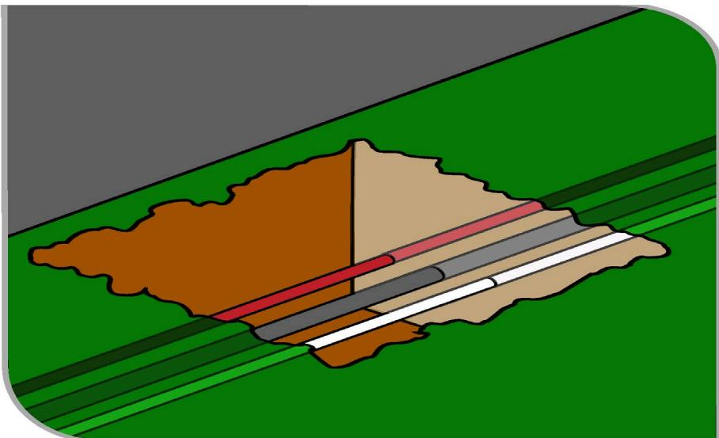

# Demolition work

Code of Practice

# Disclaimer

Safe Work Australia is an Australian Government statutory agency established in 2009. Safe Work Australia includes Members from the Commonwealth, and each state and territory, Members representing the interests of workers and Members representing the interests of employers.

Safe Work Australia works with the Commonwealth, state and territory governments to improve work health and safety and workers' compensation arrangements. Safe Work Australia is a national policy body, not a regulator of work health and safety. The Commonwealth, states and territories have responsibility for regulating and enforcing work health and safety laws in their jurisdiction.

ISBN 978- 0- 642- 78415- 5 (PDF)  ISBN 978- 0- 642- 78416- 2 (DOCX)

# Creative Commons

This copyright work is licensed under a Creative Commons Attribution- Noncommercial 4.0 International licence. To view a copy of this licence, visit creativecommons.org/licenses In essence, you are free to copy, communicate and adapt the work for non- commercial purposes, as long as you attribute the work to Safe Work Australia and abide by the other licence terms.

# Contact information

Safe Work Australia | info@swa.gov.au | www.swa.gov.au

# Contents

Foreword 5

1. Introduction 7

1.1 What is demolition work? 7  1.2 Who has health and safety duties in relation to demolition work? 7  1.3 What is involved in managing risks associated with demolition work? 10  1.4 Information, training, instruction and supervision 13

2. The risk management process 15

2.1 Identifying the hazards 15  2.2 Assessing the risks 16  2.3 Controlling the risks 17  2.4 Maintaining and reviewing control measures 18

3. Planning the demolition work 19

3.1 Notifiable demolition work 19  3.2 Principal contractor for a construction project 20  3.3 Designers 21  3.4 Safe Work Method Statements 22  3.5 Demolition licensing 23  3.6 Asbestos licensing 24  3.7 Adjacent or adjoining buildings 25  3.8 Essential services 25

# 4. Controlling risks in demolition work 28

4.1 The building or structure to be demolished 28  4.2 Hazardous chemicals and materials 28  4.3 Securing the work area 32  4.4 Emergency plan 33  4.5 Plant and equipment 34  4.6 Powered mobile plant 35  4.7 Removal of debris 35  4.8 Falls 36  4.9 Electricity 37  4.10 Fire prevention 37  4.11 Manual demolition 38

4.12 Mechanical demolition 41  4.13 Induced collapse 43  4.14 Using explosives 44

# 5. Controlling risks when demolishing special structures 46

5.1 Pre and post- tensioned concrete 46  5.2 Fire- damaged, ruinous and structurally unsound buildings or structures 47  5.3 Lift shafts 47  5.4 Basements, cellars, vaults, domes and arched roofs 47  5.5 Masonry and brick arches 48  5.6 Independent chimneys and spires 48  5.7 Pylons and masts 48  5.8 Precast concrete panels 49  5.9 Facade retention 49  5.10 Storage tanks and pipelines 49

# Appendix A—Glossary 51

Appendix B—Demolition plan 56

Appendix C—Engineering investigation considerations 57

Appendix D—References and other information sources 58

Amendments 59

# Foreword

This Code of Practice on how to manage the risks associated with demolition work is an approved code of practice under section 274 of the Work Health and Safety Act (the WHS Act).

An approved code of practice provides practical guidance on how to achieve the standards of work health and safety required under the WHS Act and the Work Health and Safety Regulations (the WHS Regulations) and effective ways to identify and manage risks.

A code of practice can assist anyone who has a duty of care in the circumstances described in the code of practice. Following an approved code of practice will assist the duty holder to achieve compliance with the health and safety duties in the WHS Act and WHS Regulations, in relation to the subject matter of the code of practice. Like regulations, codes of practice deal with particular issues and may not cover all relevant hazards or risks. The health and safety duties require duty holders to consider all risks associated with work, not only those for which regulations and codes of practice exist.

Codes of practice are admissible in court proceedings under the WHS Act and WHS Regulations. Courts may regard a code of practice as evidence of what is known about a hazard, risk, risk assessment or risk control and may rely on the code in determining what is reasonably practicable in the circumstances to which the code of practice relates. For further information see the Interpretive Guideline: The meaning of reasonably practicable'.

Compliance with the WHS Act and WHS Regulations may be achieved by following another method, if it provides an equivalent or higher standard of work health and safety than the code.

An inspector may refer to an approved code of practice when issuing an improvement or prohibition notice.

# Scope and application

This Code is intended to be read by a person conducting a business or undertaking (PCBU). It provides practical guidance to PCBUs on how to manage health and safety risks associated with demolition work.

The guidance in this Code is relevant to demolition contractors as well as PCBUs who have management or control of workplaces where excavation work is carried out, for example principal contractors.

This Code may be a useful reference for other persons interested in the duties under the WHS Act and WHS Regulations.

This Code applies to all workplaces covered by the WHS Act where demolition work is carried out and where demolition work products and equipment are used and stored.

Persons who have duties in relation to demolition work should also refer to the Code of Practice: Construction work.

# How to use this Code of Practice

This Code includes references to the legal requirements under the WHS Act and WHS Regulations. These are included for convenience only and should not be relied on in place of the full text of the WHS Act or WHS Regulations. The words 'must', 'requires' or 'mandatory' indicate a legal requirement exists that must be complied with.

The word 'should' is used in this Code to indicate a recommended course of action, while 'may' is used to indicate an optional course of action.

# 1. Introduction

# 1.1 What is demolition work?

Demolition work means work to demolish or dismantle a structure or part of a structure that is load- bearing or otherwise related to the physical integrity of the structure, but does not include:

the dismantling of formwork, falsework, scaffolding or other structures designed or used to provide support, access or containment during construction work, or the removal of power, light or telecommunication poles.

A structure is anything that is constructed, whether fixed or moveable, temporary or permanent, and includes buildings, sheds, towers, chimney stacks, silos, storage tanks.

Demolition work is a type of 'construction work'. Therefore, when carrying out demolition work, the requirements relating to construction work must also be complied with.

Demolition work is also 'high risk construction work' if it involves demolition of an element of a structure that is load- bearing or otherwise related to the physical integrity of the structure. A Safe Work Method Statement (SwMS) must be prepared before the high risk construction work starts. Further guidance on SwMS is available in section 3.4 of this Code.

Further guidance on construction work and high risk construction work duties is available in the Code of Practice: Construction work.

Other key terms relating to demolition work are listed in Appendix A.

# 1.2 Who has health and safety duties in relation to demolition work?

Duty holders who have a role in managing the risks of demolition work include:

persons conducting a business or undertaking (PCBUs) designers, manufacturers, importers, suppliers and installers of plant, substances or structures, and officers.

Workers and other persons at the workplace also have duties under the WHS Act, such as the duty to take reasonable care for their own health and safety at the workplace.

A person can have more than one duty and more than one person can have the same duty at the same time.

Early consultation and identification of risks can allow for more options to eliminate or minimise risks and reduce the associated costs.

The main duties in relation to managing the risks of demolition work are set out in Chapter 2.

Person conducting a business or undertaking

WHS Act section 19 Primary duty of care

A PCBU must eliminate risks arising from demolition work, or if that is not reasonably practicable, minimise the risks so far as is reasonably practicable.

The WHS Regulations include specific requirements for PCBUs to manage the risks of hazardous chemicals, airborne contaminants and plant, as well as other hazards associated with demolition work.

PCBUs have a duty to consult workers about work health and safety and may also have duties to consult, cooperate and coordinate with other duty holders.

For the purposes of this Code, the PCBU who has management or control of the demolition work is sometimes referred to as the 'demolition contractor'.

# Principal contractor

# WHS Regulation 292

Meaning of principal contractor

# WHS Regulation 308

Specific control measure—signage identifying principal contractor

# WHS Regulation 309

WHS management plan—preparation

# WHS Regulation 310

WHS management plan—duty to inform

# WHS Regulation 311

WHS management plan—review

# WHS Regulation 312

High risk construction work—safe work method statements

# WHS Regulation 313

Copy of WHS management plan must be kept

# WHS Regulation 314

Further health and safety duties—specific regulations

# WHS Regulation 315

Further health and safety duties—specific risks

The principal contractor for a construction project has a specific duty under the WHS Regulations to document, in their WHS Management Plan for the project, the arrangements in place for consultation, cooperation and coordination between the PCBUs at the site.

A construction project is a project that involves construction work where the cost of the construction is $250 000 or more. Additional duties apply to principal contractors of construction projects. (Refer to section 3.2 of this Code.)

# Designers, manufacturers, importers, suppliers and installers of plant, substances or structures

# WHS Act Part 2 Division 3

Further duties of persons conducting businesses or undertakings

# WHS Act section 22

Duties of persons conducting businesses or undertakings that design plant, substances or structures

# WHS Act section 23

Duties of persons conducting businesses or undertakings that manufacture plant, substances or structures

# WHS Act section 24

Duties of persons conducting businesses or undertakings that import plant, substances or structures

# WHS Act section 25

Duties of persons conducting businesses or undertakings that supply plant, substances or structures

# WHS Act section 26

Duties of persons conducting businesses or undertakings that install, construct or commission plant, or structures

Designers, manufacturers, importers, suppliers and installers of plant or structures used in demolition work must ensure, so far as is reasonably practicable, that the plant or structure they design, manufacturer, import or supply is without risks to health and safety. This duty includes carrying out testing and analysis as well as providing specific information about the plant or substance.

To assist in meeting these duties, the WHS Regulations require:

- manufacturers to consult with designers of plant- importers to consult with designers and manufacturers of plant, and- the person who commissions construction work to consult with the designer of the structure.

# Officers

# WHS Act section 27

Duty of officers

Officers, for example, company directors, have a duty to exercise due diligence to ensure the PCBU complies with the WHS Act and WHS Regulations. This includes taking reasonable steps to ensure the business or undertaking has and uses appropriate resources and processes to eliminate or minimise risks to health and safety from demolition work.

Further information on who is an officer and their duties is available in the Interpretive Guideline: The health and safety duty of an officer under section 27.

# Workers

WHS Act section 7Meaning of workerWHS Act section 28Duties of workersWHS Regulation 46Duties of workers

Workers have a duty to take reasonable care for their own health and safety and to not adversely affect the health and safety of other persons. Workers must comply with reasonable instructions, as far as they are reasonably able, and cooperate with reasonable work health and safety policies and procedures that have been notified to workers.

If personal protective equipment (PPE) is provided by the business or undertaking, the worker must so far as they are reasonably able, use or wear it in accordance with the information and instruction and training provided.

# Other persons at the workplace

WHS Act section 29Duties of other persons at the workplace

Other persons at the workplace, like visitors, must take reasonable care for their own health and safety and must take care not to adversely affect other people's health and safety. They must comply, so far as they are reasonably able, with reasonable instructions given by the PCBU to allow the PCBU to comply with the WHS Act.

# 1.3 What is involved in managing risks associated with demolition work?

1.3 What is involved in managing risks associated with demolition work?WHS Regulation 297Management of risks to health and safetyWHS Regulation 34Duty to identify hazardsWHS Regulation 35Managing risks to health and safetyWHS Regulation 36Hierarchy of control measuresWHS Regulation 37Maintenance of control measuresWHS Regulation 38

This Code provides guidance on how to manage the risks associated with demolition work in the workplace using the following systematic process:

Identify hazards- find out what could cause harm. Assess risks, if necessary- understand the nature of the harm that could be caused by the hazard, how serious the harm could be and the likelihood of it happening. This step may not be necessary if you are dealing with a known risk with known controls. Eliminate risks so far as is reasonably practicable. Control risks- if it is not reasonably practicable to eliminate the risk, implement the most effective control measures that are reasonably practicable in the circumstances in accordance with the hierarchy of control measures, and ensure they remain effective over time. Review control measures to ensure they are working as planned.

Further guidance on the risk management process is available in the Code of Practice: How to manage work health and safety risks.

# Consulting workers

# WHS Act section 47

Duty to consult workers

# WHS Act section 48

Nature of consultation

# WHS Act Section 49

When consultation is required

Consultation involves sharing information, giving workers a reasonable opportunity to express views and taking those views into account before making decisions on health and safety matters.

A PCBU must consult, so far as is reasonably practicable, with workers who carry out work for the business or undertaking and who are, or are likely to be, directly affected by a health and safety matter.

This duty to consult is based on the recognition that worker input and participation improves decision- making about health and safety matters and assists in reducing work- related injuries and disease.

The broad definition of a 'worker' under the WHS Act means a PCBU must consult with employees and anyone else who carries out work for the business or undertaking. A PCBU must consult, so far as is reasonably practicable, with contractors and subcontractors and their employees, on- hire workers, outworkers, apprentices, trainees, work experience students, volunteers and other people who are working for the PCBU and who are, or are likely to be, directly affected by a health and safety matter.

Workers are entitled to take part in consultations and to be represented in consultations by a health and safety representative who has been elected to represent their work group.

By drawing on the experience, knowledge and ideas of workers, demolition work hazards are more likely to be identified and effective control measures implemented.

In many cases, decisions about construction work and construction projects are made prior to engaging workers, therefore it may not be possible to consult with workers in these early stages. However, it is important to consult with them as the planning and construction work progresses.

Consultation should include discussions about:

- demolition methods- types of risk control measures- interaction with other trades- SWMS- provision of appropriate amenities- procedures to deal with emergencies- identification of hazards- proposing changes that may affect the health and safety of workers- procedures for consulting with workers- resolving work health and safety issues- monitoring the health of workers- monitoring the conditions at any workplace under the management or control of the PCBU- providing information and training for workers, and- when carrying out any other activity prescribed by the regulations for the purposes of this section.

Consulting, cooperating and coordinating activities with other duty holders

# WHS Act section 46

Duty to consult with other duty holders

The WHS Act requires a PCBU to consult, cooperate and coordinate activities with all other persons who have a work health or safety duty in relation to the same matter, so far as is reasonably practicable.

There is often more than one business or undertaking involved in demolition work, who may each have responsibility for the same health and safety matters, either because they are involved in the same activities or share the same workplace.

In these situations, each duty holder should exchange information to find out who is doing what and work together in a cooperative and coordinated way so risks are eliminated or minimised so far as is reasonably practicable.

For example, structural engineers, mobile plant operators and asbestos removalists should consult with other duty holders about the risks associated with the demolition work.

Further guidance on consultation is available in the Code of Practice: Work health and safety consultation, cooperation and coordination.

# 1.4 Information, training, instruction and supervision

# WHS Act section 19

Primary duty of care

# WHS Regulation 39

Provision of information, training and instruction

# WHS Regulation 317

Duty to ensure worker has been trained

The WHS Act requires that a PCBU ensure, so far as reasonably practicable, the provision of any information, training, instruction or supervision that is necessary to protect all persons from risks to their health and safety arising from work carried out as part of the conduct of the business or undertaking.

The PCBU must ensure that information, training or instruction provided to a worker are suitable and adequate having regard to:

the nature of the work carried out by the worker the nature of the risks associated with the work at the time of the information, training and instruction, and the control measures implemented.

The PCBU must also ensure, so far as is reasonably practicable, that the information, training and instruction are provided in a way that is readily understandable to whom it is provided.

Workers must be trained and have the appropriate skills to carry out a particular task safely. Training should be provided to workers by a competent person.

Information, training and instruction provided to workers who carry out demolition work should include:

the proper use, wearing, storage and maintenance of personal protective equipment (PPE) any other examples.

In addition to the PCBU's general duty to provide any supervision necessary to protect all persons from work health and safety risks, the WHS Regulations also impose specific duties to provide supervision necessary to protect a worker from risks to health and safety in certain circumstances, for example where the worker:

uses, generates or handles hazardous chemicals operates, tests, maintains, repairs or decommissions a storage or handling system for a hazardous chemical, or is likely to be exposed to a hazardous chemical.

Training specific to the demolition work and to the site must also be provided to workers by a competent person. Workers operating certain types of plant at the workplace must possess a valid licence to operate that plant.

Workers in a supervisory role, for example a leading hand or foreman should be experienced and trained in the type of demolition being done to ensure the work is carried out in accordance with the SWMS.

Further information on general construction induction training and other training is available in the Code of Practice: Construction work.

# 2. The risk management process

2. The risk management processWHS Regulation 34Duty to identify hazardsWHS Regulation 35Managing risks to health and safetyWHS Regulation 36Hierarchy of control measuresWHS Regulation 37Maintenance of control measuresWHS Regulation 38Review of control measuresWHS Regulation 297Management of risks to health and safetyWHS Regulation 299Safe work method statement required for high risk construction work

A risk assessment is not mandatory for demolition work under the WHs Regulations. However, in many circumstances it will be the best way to determine the measures that should be implemented to control risks. It will help to:

identify which workers are at risk of exposure determine what sources and processes are causing that risk identify if and what kind of control measures should be implemented, and check the effectiveness of existing control measures.

Risk management is a systematic process to eliminate or minimise the potential for harm to people.

# 2.1 Identifying the hazards

The first step in the risk management process is to identify all hazards associated with demolition work. This involves finding things and situations that could potentially cause harm to people. Hazards generally arise from the following aspects of work and their interaction:

physical work environment equipment, materials and substances used work tasks and how they are performed, and work design and management.

Hazards may be identified by looking at the workplace and how work is carried out. It is also useful to talk to workers, manufacturers, suppliers and health and safety specialists and review relevant information, records and incident reports.

Potential demolition hazards arise in a number of ways, including:

unplanned structure collapse falls from one level to another

- falling objects- the location of above-ground and underground essential services including the supply of gas, water, sewerage, telecommunications, electricity, chemicals, fuel and refrigerant in pipes or lines- exposure to asbestos- exposure to hazardous chemicals—these may be present in demolished material or in the ground where demolition work is to be carried out, such as contaminated sites- hazardous noise from plant and explosives used in demolition work, and- the proximity of the building or structure being demolished to other buildings or structures.

# 2.2 Assessing the risks

A risk assessment involves considering what could happen if someone is exposed to a hazard and the likelihood of it happening. A risk assessment can help you determine:

- how severe a risk is- whether any existing control measures are effective- what action you should take to control the risk, and- how urgently the action needs to be taken.

Hazards have the potential to cause different types and severities of harm, ranging from minor discomfort to a serious injury or death.

Many hazards and their associated risks are well known and have well established and accepted control measures. In these situations, the second step in the process outlined in section 1.3 of this Code to formally assess the risk is not required. If, after identifying a hazard, you already know the risk and how to control it effectively, you may simply implement the controls.

In some circumstances, a risk assessment will assist to:

- identify which workers are at risk of exposure- determine what sources and processes are causing the risk- identify if and what kind of control measures should be implemented, and- check the effectiveness of existing control measures.

The nature and severity of risks will depend on various factors, including the:

- the structure to be demolished and its structural integrity- the method of demolition including its sequencing- the scheduling of the work- the layout of the workplace including whether there are fall hazards both for people and objects- what plant and equipment will be used and the skill and experience required by the people who will use it safely- what exposures might occur, for example to noise or ultraviolet (UV) rays- the number of people involved, and- local weather conditions.

Further guidance on the risk management process and the hierarchy of control measures is available in the Code of Practice: How to manage work health and safety risks.

# Review available information

Information and advice about hazards and risks relevant to particular industries and types of work is available from regulators, industry associations, unions, technical specialists and safety consultants.

Manufacturers and suppliers can also provide information about hazards and safety precautions for specific substances (safety data sheets), plant or processes (instruction manuals).

Analyse your records of health monitoring, workplace incidents, near misses, worker complaints and the results of any inspections and investigations to identify hazards. If someone has been hurt doing a particular task, then a hazard exists that could hurt someone else. These incidents need to be investigated to find the hazard that caused the injury or illness.

# 2.3 Controlling the risks

# WHS Regulation 142

Notice of demolition work

# The hierarchy of control measures

The WHS Regulations require duty holders to work through the hierarchy of control measures when managing certain risks; however, the hierarchy can be applied to any risk. The hierarchy ranks control measures from the highest level of protection and reliability to the lowest.

# Eliminating the risk

You must always aim to eliminate the risk. For example, undertake work at ground level to eliminate the use of cranes and the need to work at height. If eliminating the hazards and associated risks is not reasonably practicable, you must minimise the risk by one or more of the following:

Substitution- - minimise the risk by substituting or replacing a hazard or hazardous work practice with something that gives rise to a lesser risk. For example, using a mechanical demolition method rather than a manual method. Isolation- minimise the risk by isolating or separating the hazard or hazardous work practice from any person exposed to it. For example, using concrete barriers to separate pedestrians and powered mobile plant to reduce the risk of collision. Engineering controls- engineering controls are physical control measures to minimise risk. For example, fitting an open cab excavator with a protective structure to minimise the risk of being struck by a falling object.

If risk remains, it must be minimised by implementing administrative controls, so far as is reasonably practicable, for example by installing warning signs.

Any remaining risk must be minimised with suitable PPE, for example providing workers with hard hats, hearing protectors and high visibility vests.

Administrative control measures and PPE do not control the hazard at the source. They rely on human behaviour and supervision and used on their own tend to be the least effective in minimising risks.

Chapters 4- 6 of this Code provide information on control measures for demolition work.

Further guidance on the risk management process and the hierarchy of control measures is available in the Code of Practice: How to manage work health and safety risks.

# Combining control measures

A combination of control measures may be used to minimise risks, so far as is reasonably practicable, if a single control is not sufficient for the purpose. In most cases, a combination of the control measures will provide the best solution to minimise the risk to the lowest level reasonably practicable.

You should also ensure that the control measures you select do not create new hazards, for example electrical risks from contact with overhead powerlines or crushing and entanglement from plant like elevating work platforms (EWPs). If any new hazards are created they must also be controlled.

# 2.4 Maintaining and reviewing control measures

Control measures must be maintained so they remain fit for purpose, suitable for the nature and duration of work and installed, set up and used correctly.

The control measures put in place to protect health and safety should be regularly reviewed to make sure they are effective. Checking effectiveness may involve, for example air monitoring to measure the concentration of crystalline silica in the worker's breathing zone during the abrasive blasting process. If the control measure is not working effectively it must be revised to ensure it is effective in controlling the risk.

You must review and as necessary revise control measures so as to maintain, so far as is reasonably practicable, a work environment that is without risks to health or safety. For example:

- when the control measure does not control the risk, so far as is reasonably practicable- before a change at the workplace that is likely to give rise to a new or different risk to health and safety that the measure may not effectively control- a new or relevant hazard or risk is identified- the results of consultation indicate a review is necessary, or- a health and safety representative requests a review.

Common review methods include workplace inspection, consultation, testing and analysing records and data. Where demolition work is 'high risk construction work' a SWMS must also be reviewed and revised where necessary.

You can use the same methods as in the initial hazard identification step to check control measures. You must also consult your workers and their health and safety representatives.

If problems are found, go back through the risk management steps, review your information and make further decisions about risk control.

# 3. Planning the demolition work

Demolition work should be carefully planned before work starts so it can be carried out safely. Planning involves identifying hazards, assessing risks and determining appropriate control measures in consultation with all relevant persons involved in the work including the principal contractor for the construction project, demolition contractor, structural engineers and mobile plant operators.

Consultation should include discussions about the:

nature and condition of the ground and working environment weather conditions nature of the work and other activities that may affect health and safety static and dynamic loads near the excavation interaction with other trades site access SWMS management of surrounding vehicle traffic and ground vibration type of equipment used for excavation work public safety existing services and their location providing facilities, and procedures to deal with emergencies.

Further guidance on amenities and emergencies is available in the Code of Practice: Managing the work environment and facilities.

A demolition plan should be prepared for all demolitions where there is more than one person conducting a business or undertaking (PCBU), for example subcontractors. If the demolition contractor is also the principal contactor for the construction project, the demolition plan should be incorporated as part of the WHs management plan.

Appendix B provides further information on what a demolition plan may include.

# 3.1 Notifiable demolition work

# WHS Regulation 142

Notice of demolition work

Under the WHs Regulations, a PCBU who proposes to carry out any of the following demolition work must ensure that written notice is given to the regulator, in the manner and form required by the regulator, at least five days before the work commences:

demolition of a structure, or a part of a structure that is load- bearing or otherwise related to the physical integrity of the structure, that is at least 6 metres in height demolition work involving load shifting machinery on a suspended floor demolition work involving explosives.

The height of a structure is measured from the lowest level of the ground immediately adjacent to the base of the structure (at the point at which the height is to be measured) to its highest point.

The type of information that would normally be included in the notification would be:

the name and contact details of the PCBU

if the work is in connection with a construction project, the name and contact details of the principal contractor for the project or the principal contractor's representative the name and contact details of the person directly supervising the work the date of the notice the nature of the demolition whether explosives will be used in carrying out the work and, if so, the licence details of the person who is to use the explosives when the PCBU reasonably believes the work is to commence and to be completed, and where the work is to be carried out.

There are some times when emergency services organisations do not need to give five days notice of notifiable demolition work. Where an emergency services organisation directs one or more of its workers to carry out notifiable demolition work in responding to an emergency, the organisation must provide a written notice to the regulator as soon as reasonably practicable, whether before or after the work is carried out.

# 3.2 Principal contractor for a construction project

A construction project is a project that involves construction work where the cost of the construction work is \(\) 250,000$ or more.

Additional duties apply to principal contractors of construction projects. There can only be one principal contractor for a construction project and this will be either the person commissioning the construction work or a person appointed as the principal contractor.

The principal contractor has a range of duties in relation to a construction project including:

preparing and reviewing a WHS management plan taking all reasonable steps to obtain a copy of the SwMs before high risk construction work commences putting in place arrangements to manage the work environment including falls, facilities, first aid, an emergency plan and traffic management installing signs showing the principal contractor's name, contact details and location of a site office, and securing the construction workplace.

It is possible the demolition contractor may be appointed as the principal contractor. This may occur, for example where there is significant demolition work required and there is a clear separation or delay between the demolition activity and subsequent building work. In this case the person who commissions the construction work may appoint the demolition contractor as the principal contractor, who must then comply with all the duties of a principal contractor until the demolition work is complete.

Further guidance on principal contractor duties is available in the Code of Practice: Construction work.

# 3.3 Designers

# WHS Act section 22

Duties of persons conducting businesses or undertakings that design plant, substances or structures

# WHS Regulation 295

Designer must give safety report to person who commissions design

Designers of structures must ensure, so far as is reasonably practicable, that the structures they design that could reasonably be expected to be used as or at a workplace are designed to be without risks to the health and safety of the persons who carry out reasonably foreseeable activities at the workplace in relation to the demolition or disposal of the structure.

Designers must give the person who commissioned the design a written safety report specifying the hazards relating to the design of the structure that create risks to persons carrying out construction work.

This written report must specify the hazards relating to the design of the structure that, so far as the designer is reasonably aware:

create a risk to the health and safety of persons who are to carry out construction work on the structure or part, and are associated only with particular design of the structure.

This is particularly important with modern designs where 'limit state' design techniques are used by the structural designer. In this approach, the designer considers the structure in its completed form with all the structural components, including bracing, installed. The completed structure can withstand much higher loads, including wind and other live loads, than when the structure is in the construction or demolition stage. With this in mind, it may be necessary for the designer to provide guidance to the demolition contractor on how the structure will remain standing as it is demolished or dismantled.

The principal contractor, or the demolition contractor if there is no principal contractor because it is not a construction project, should take all reasonable steps to obtain the designer's safety report.

For demolition work, there may be a number of designer safety reports available including:

the report prepared for the original construction of the structure any reports prepared for subsequent additions or alterations to the structure, and where a designer is engaged for the demolition work, the report provided to the person commissioning the design of the demolition work.

Designers who develop demolition specifications or procedures for the demolition of a structure should consider the possible work methods available and associated health and safety risks. Designers should then take into account the proposed demolition method and control measures available when producing final design documents for the demolition of a structure.

If as- built design documentation is not available, or there is a concern the structure has been damaged or weakened, for example by fire or deterioration, or plant is to be used on suspended floors, then a competent person such as a qualified structural engineer should conduct an engineering investigation and deliver an 'engineering investigation report'. Some issues that may be considered when undertaking an engineering investigation are listed in Appendix C.

The following design matters should be taken into account when considering demolition risks:

- the stability and structural integrity of the structure at all stages of demolition including assembled portions, single components and completed sequentially erected braced bays- the maximum permissible wind speed for partially demolished structures- the effect of the proposed demolition sequence on stability- the stability requirements for all components of the structure as it is sequentially demolished according to the structural engineer's requirements- the proximity of adjacent or adjoining buildings- a competent person's assessment of loadings at all stages of demolition- the provision of clear instructions for temporary bracing- the plant to be used for the work including the size, type, position and coverage of proposed demolition crane or cranes should be indicated on a site plan, locations such as unloading points and storage areas, if any, should be shown- the need to ensure the ground is compacted to design specifications to enable plant to be moved and used safely at the workplace- the proposed methods for handling heavy, bulky or awkward components- the need for specific lifting arrangements to be detailed on structural member drawings to facilitate safe lifting- the handling, lifting, storing, stacking and transportation of components, depending on their size, shape and weight, and- the provision of safe access and safe working areas.Further guidance on the safe design of structures can be found in the Code of Practice: Safe design of structures.

Further guidance on the safe design of structures can be found in the Code of Practice: Safe design of structures.

# Technical standards

Technical standardsDemolition specifications and procedures should be designed in accordance with acceptable engineering principles and published technical standards. Engineering principles would include, for example mathematical or scientific procedures outlined in an engineering reference manual or standard.

# 3.4 Safe Work Method Statements

# WHS Regulations 299

Safe work method statement required for high risk construction work

A SwMs is required for high risk construction work' activities.

The primary purpose of a SwMs is to help PCBUs, supervisors and workers implement and monitor the control measures established at the workplace to ensure high risk construction work is carried out safely.

The SwMs must:

identify the type of high risk construction work being done specify the health and safety hazards relating to the high risk construction work and risks arising from those hazards describe how the risks relating to the high risk construction work will be controlled describe how the control measures will be implemented, monitored and reviewed, and

- be developed in consultation with workers and their representatives who are carrying out the high risk construction work.

For other construction activities a SwMS is not required. However, a PCBU must manage risks to health and safety by eliminating or minimising risks so far as is reasonably practicable and, if it is not reasonably practicable, to minimise those risks so far as is reasonably practicable.

# Who is responsible for preparing a SwMS?

A PCBU must prepare a SwMS—or ensure a SwMS has been prepared—before high risk construction work starts.

The person responsible for carrying out the high risk construction work is best placed to prepare the SwMS in consultation with workers who will be directly engaged in that work.

If more than one PCBU has the duty to ensure a SwMS is or has been prepared, they must consult and cooperate with each other to coordinate who will be responsible for actually preparing it.

There may be situations where there are different types of high risk construction work occurring at the same time at the same workplace, for example if work is being carried out:

- where there is a risk of a person falling more than 2 metres- near a trench with an excavated depth greater than 1.5 metres, and- where there is a risk of mobile powered plant colliding with pedestrians or other powered mobile plant.

In these cases one SwMS may be prepared to cover any high risk construction work activities being carried out at the workplace. Alternatively, a separate SwMS can be prepared for each type of high risk construction work. If separate SwMS are prepared, consider how the different work activities may impact on each other and whether this may lead to inconsistencies between control measures.

# Complying with a SwMS

# WHS Regulation 300

Compliance with safe work method statement

If high risk construction work is not carried out in accordance with the SwMS for the work, the PCBU must ensure that the work is:

stopped immediately or as soon as it is safe to do so, and resumed only in accordance with the statement.

Further guidance on SwMS and an example SwMS template are available in the Code of Practice: Construction work which also provides examples of high risk construction work and Information Sheet: Safe Work Method Statement for high risk construction work.

# 3.5 Demolition licensing

A licence is required to undertake some demolition work. A PCBU who controls the workplace, who may be a principal contractor or demolition contractor, will need to seek advice from the local WHS regulator or building regulator about whether the demolition contractor or another person undertaking the demolition work requires a licence for the work to be undertaken.

# Other licences

Depending on the type of work being done there may be a need for persons to hold the relevant licence, for example to carry out asbestos removal work, high risk work, or use of explosives.

# 3.6 Asbestos licensing

# WHs Regulation 422

Asbestos to be identified or assumed at workplace

# WHS Regulation 458

Duty to ensure asbestos removalist is licensed

There are two types of asbestos removal licence: Class A and Class B. The class of licence required will depend on the type and quantity of asbestos, asbestos containing material (ACM) or asbestos contaminated dust or debris (ACD) that is being removed at a workplace, as set out in Table 1.

Table 1 Licence requirements for asbestos removal work  

<table><tr><td>Type of licence</td><td>What asbestos can be removed?</td></tr><tr><td>Class A</td><td>Can remove any amount or quantity of asbestos or ACM including:
- any amount of friable asbestos or ACM
- any amount of ACD, and
- any amount of non-friable asbestos or ACM.</td></tr><tr><td>Class B</td><td>Can remove:
- any amount of non-friable asbestos or ACM.
- any amount of ACD associated with the removal of non-friable asbestos or ACM.</td></tr><tr><td>No licence required</td><td>Can remove:
- up to 10 m² of non-friable asbestos or ACM
- ACD that is:
  · associated with the removal of less than 10 m² of non-friable asbestos or ACM not associated with the removal of friable or non-friable asbestos and is only a minor contamination.</td></tr></table>

Further information regarding the requirements relating to the identification of asbestos, asbestos registers and disposing of asbestos or ACM can be found in Chapter 4 of this Code.

Further guidance relating to the duties associated with the removal of asbestos, and specific guidance on managing asbestos when carrying out demolition and refurbishment work, is available in the model Code of Practice: How to safely remove asbestos, Code of Practice: How to manage and control asbestos in the workplace and Information sheet - Globally Harmonised System of Classification and Labelling of Chemicals.

# 3.7 Adjacent or adjoining buildings

No part of the demolition process should adversely affect the structural integrity of any other building. Consideration may be given to the use of shoring and underpinning and to the effects of changes in soil conditions as a result of the demolition work.

Lateral support for adjoining structures should be equal to or greater than any provided by the structure to be demolished. Before the existing lateral support is disturbed, provision should be made for the erection of temporary supports, which will need to be checked for effectiveness as the demolition proceeds.

It is also important other buildings in and around the demolition site are not adversely affected by vibration or concussion during the demolition process. Special precautions may need to be taken in the vicinity of hospitals and other buildings containing equipment sensitive to shock and vibration.

No part of the demolition process should cause flooding or water penetration to an adjoining building.

# 3.8 Essential services

# WHS Regulation 304

Excavation work- underground essential services information

# WHS Regulation 305

Management of risks to health and safety associated with excavation work

Management of risks to health and safety associated with excavation work. One of the most important elements of pre- demolition planning is the location and disconnection of all essential services.

Essential services include the supply of gas, water, sewerage, telecommunications, electricity, chemicals, fuel and refrigerant in pipes or lines. The principal contractor must ensure, so far as is reasonably practicable, that risks associated with essential services at the workplace are managed in accordance with the risk management process outlined in Chapter 2 of this Code.

'High risk construction work' includes construction work when carried out on or near:

pressurised gas distribution mains or piping chemical, fuel or refrigerant lines, and energised electrical installations.

A SwMs must be prepared before this work commences.

All electric, gas, water, sewer, steam and other service lines not required in the demolition process should be shut off, capped, or otherwise controlled, at or outside the building line, before demolition work is started.

In each case, the utility agency involved should be notified in advance and its approval or services, if necessary, obtained. A service retained for the demolition work should be adequately protected as required by the relevant authority, for example the protection of overhead powerlines.

# Underground essential services

Before directing or allowing work to start, a person with management or control of the workplace, who may be a principal contractor or demolition contractor, must take all reasonable steps to get current underground essential services information about the areas at the workplace where the excavation work is to be carried out. They must also get information about underground essential services in areas adjacent to the site of excavation and have regard for all of the information.

If excavating in a public place, the PCBU must take all reasonable steps to identify all electrical cables present. Information may be obtained by contacting:

Dial Before You Dig - a free enquiry service for information on underground assets anywhere in Australia. This organisation will tell you if electrical cables owned by one or more of its contributory members are located in the vicinity of your site. Definite cable locations can be determined by special arrangement with the organisations. Dial Before You Dig can be contacted by:

phoning 1100, or submitting an online enquiry on the Dial Before You Dig website (www.1100. com.au).

relevant authorities about all cables they may have placed in the vicinity of the excavation.Authorities may include:

electricity supply authorities communication companies local government authorities, and water authorities.

In some cases, customers of electricity supply authorities have authority to place electricity cables in public places. If excavating on private property, contact the owner or occupier of the premises about buried cables before starting work.

Any underground service plans that are obtained including information on underground essential services must be provided to the principal contractor and/or the excavation contractor. Other relevant parties, including any subcontractors and plant operators carrying out the excavation work, should also be provided with information about essential services and other plans so the information is considered when planning all work in the area.

Underground essential services information obtained must be:

made available to any worker, principal contractor and subcontractors readily available for inspection, as required under the WHS Act, and retained until the excavation work is completed or, if there is a notifiable incident relating to the excavation work, for two years after the incident occurs.

Available information about existing underground essential services may not be accurate. Therefore, it is important that excavation methods include an initial examination of the area to be excavated, for example sampling the area by exposing a short section of underground services usually using water pressure and a vacuum system to excavate or 'pothole' the area.

If it cannot be determined exactly where an underground cable is, 'potholing' should be used to carefully identify the cable location and avoid accidental contact with the cable. Potholing involves digging with hand tools to a pre- determined depth to verify if assets exist in the immediate location. Insulated hand digging tools suitable for the voltage concerned may be used or a vacuum pumping in the potholing process may also be used to locate the underground cable.

  
Figure 1 Underground essential services exposed by potholing.

Underground essential services can also be located using underground locators, for example electromagnetic cable locators and ground penetrating radar. The PCBU must ensure that workers operating such equipment have undergone the relevant training and are competent in their use.

A SWMS must be prepared for managing the risks associated with excavation work involving underground services.

Further guidance on the identification of underground essential services and how to locate them is available in the Code of Practice: Construction work, Code of Practice: Excavation Work, Guidance Material - Working in the vicinity of overhead and underground electric lines, and AS 5488- 2013: Classification of Subsurface Utility Information (SUI).

# 4. Controlling risks in demolition work

# 4.1 The building or structure to be demolished

The person conducting a business or undertaking (PCBU) who controls the workplace, who may be a principal contractor or demolition contractor, in control of the demolition work should consult with the designer and/or the principal contractor where applicable, so far as is reasonably practicable, to obtain a written report specifying the hazards associated with the design of the structure in the planning stage of the demolition work. Specific hazards may be outlined in a demolition plan.

The building or structure to be demolished and all its components should be maintained in a safe and structurally stable condition so as to prevent the unexpected collapse of part or all of the structure. Temporary braces, propping, shoring or guys may need to be added to ensure stability of the structure is maintained.

The position, depth and type of basements, wells and underground storage tanks should also be determined, as should the contents of storage tanks.

Adjoining properties and structures also need to be considered, as well as any easements, rights of way, boundary walls and other encumbrances.

# 4.2 Hazardous chemicals and materials

# WHS Regulation 49

Ensuring exposure standards for substances and mixtures not exceeded

A PCBU at a workplace must ensure that no person at the workplace is exposed to a substance or mixture in an airborne concentration that exceeds the exposure standard for the substance or mixture

Demolition work may involve workplaces or structures that contain or have contained hazardous materials including chemicals. Hazardous materials include lead, asbestos, polychlorinated biphenyls (PCBs), contaminated dust and combustible materials.

The risks arising from potential exposure to hazardous materials must be managed in accordance with the WHS Regulations.

Hazardous chemical exposure standards must not be exceeded. These are set out in Workplace Exposure Standards for Airborne Contaminants, and should also be listed in the manufacturer's safety data sheet (SDS).

Before starting demolition work, all areas of the workplace, including basements, cellars, vaults and waste dumps, should be examined to determine whether:

there are items which could be a fire and explosion risk previous use of the site might cause a risk because of the nature of and decomposition of materials, and there are toxic, radioactive or other hazardous chemicals present.

Hazardous materials including explosives should be clearly identified. Information about a chemical's hazards and control measures can be obtained from the chemical's SDS or the label of the chemical's container. If available, the workplace's former hazardous chemicals

register or manifest should be referred to for determining the nature and location of previous hazardous chemical storage areas. It may also be possible to obtain historical information from relevant government agencies. For example, the location of underground fuel tanks.

Before demolition work occurs, the PCBU at the workplace, who may be a principal contractor or demolition contractor, should inform all workers and other persons at the workplace of the presence of hazardous chemicals, and the control measures for exposure and safe disposal. A PCBU must also ensure the relevant SDSs are readily available to be referred to by anyone who is likely to be exposed to a hazardous chemical at the workplace for reference.

A PCBU at a workplace must ensure, so far as reasonably practicable, the provision of adequate clean facilities. This may help minimise risks where there are hazardous materials present.

Further specific guidance on hazardous chemicals can be found in the Code of Practice: Managing risks of hazardous chemicals in the workplace and the Code of Practice: Managing the work environment and facilities.

# Asbestos

# WHS Regulation 451

Determining presence of asbestos or ACM

The PCBU who controls the workplace has specific responsibilities in regard to identifying whether asbestos is present and informing others if it is.

The PCBU with management or control of the workplace must ensure so far as is reasonably practicable, that all asbestos or asbestos containing material (ACM) at the workplace, or assumed present, is identified by a competent person.

The PCBU who is to carry out the demolition or refurbishment must assume that asbestos or ACM is fixed to or installed in the structure or plant if:

the competent person is, on reasonable grounds, uncertain whether or not asbestos is fixed to or installed in the structure or plant, or part of the structure or plant is inaccessible and likely to be disturbed.

Construction work including demolition work that involves or is likely to involve the disturbance of asbestos is high risk construction work and a PCBU that involves the carrying out of this work must ensure that a SWMS is prepared before this work commences.

All asbestos likely to be disturbed by the demolition must be identified and, so far as is reasonably practicable, be removed before the demolition is started.

If only a part of a building or structure is to be demolished, only the asbestos likely to be disturbed during the demolition of that part of the building or structure is required to be removed, so far as is reasonably practicable, before the demolition work commences.

When planning demolition or refurbishment, consider:

- the age of the building and the likelihood of asbestos or other hazardous materials being present- the location of asbestos in relation to the proposed demolition or refurbishment- if there are inaccessible areas likely to contain asbestos- whether asbestos is likely to be damaged or disturbed as a result of the demolition or refurbishment work—if yes, can it be removed safely before work commences?- type and condition of asbestos present- amount of asbestos present

- method of demolition or refurbishment and how will it affect the asbestos, and- the nature of the ACM (friable or non-friable).

Demolition of part of a building, structure, or plant can be carried out to access in situ asbestos so it can be removed safely. Part of a wall may be demolished to access asbestos located in the wall cavity so it can be removed before further demolition.

# Asbestos register

# WHS Regulation 426

Review of asbestos register

# WHS Regulation 448

Demolition Review of asbestos register

# WHS Regulation 449

Duty to give asbestos register to person conducting business or undertaking of demolition or refurbishment.

# WHS Regulation 450

Duty to obtain asbestos register

The PCBU who controls the workplace who carries out demolition or refurbishment at a workplace must obtain a copy of the asbestos register from the person with management or control of that workplace before commencing the demolition or refurbishment.

A person with management or control of a workplace where an asbestos register is kept must ensure that:

- the register is reviewed and, as necessary, revised if asbestos is removed from, or disturbed, sealed or enclosed at the workplace- before demolition or refurbishment is carried out at the workplace, the asbestos register for the workplace is reviewed and if the register is inadequate having regard to the proposed demolition or refurbishment, the register must be revised, and- the PCBU who carries out the demolition or refurbishment is given a copy of the asbestos register before demolition/refurbishment work starts.

If there is no asbestos register, the person carrying out the demolition work must:

- not carry out the work until the structure or plant has been inspected to determine whether asbestos or ACM are fixed to or installed in the structure or plant- ensure that the determination is undertaken by a competent person, and- if asbestos or ACM are determined or assumed to be present:

- for domestic premises—inform the occupier and owner of the premises, and- in any other case—inform the person with management or control of the workplace.

# Disposing of asbestos or ACM

The PCBU that commissions the removal of asbestos must ensure that the asbestos removal work is carried out by a licensed asbestos removalist who is appropriately licensed to carry out the work, unless specified in the WHS Regulations that a licence is not required.

Asbestos waste must be transported and disposed of in accordance with the relevant state or territory Environment Protection Authority (EPA) requirements. Asbestos waste can only

be disposed of at a site licensed by the EPA and it must never be disposed of in the general waste system.

Further guidance relating to the duties associated with the removal of asbestos, including specific guidance on managing asbestos when demolition and refurbishment work are being carried out, is available in the Code of Practice: How to safely remove asbestos, Code of Practice: How to manage and control asbestos in the workplace and the sheet Globally Harmonised System of Classification and Labelling of Chemicals (GHS).

# Lead

Lead is found in paint, old water pipes and other plumbing fittings, sheet lead, solders, lead flashing, leadlight windows and glass. The age of a structure may be directly related to the amount of lead that can be present (see Table 2).

Table 2 Lead sources  

<table><tr><td>Approximate date of construction</td><td>Sources of lead hazards</td></tr><tr><td>1920–1978</td><td>Paint</td></tr><tr><td>1920–1978</td><td>Plumbing</td></tr><tr><td>1923–1986</td><td>Automobile exhaust (may accumulate as ceiling dust)</td></tr></table>

If it is suspected that the structure contains lead- based paint, a test for the presence of lead should be conducted.

Precautions which should be taken when demolishing materials containing lead include:

- minimising the generation of lead dust and fumes- cleaning work areas properly during and after work- wearing the appropriate personal protective equipment (PPE), and- maintaining good personal hygiene.

Further information can be found in AS 4361.1- 1995: Guide to lead paint management- - Industrial applications. Testing can recognise dried paint film with more than 1 per cent (by weight) to be lead- containing paint.

# Polychlorinated biphenyls

Workers can be exposed to polychlorinated biphenyls (PCBs) when dismantling electrical capacitors and transformers or when cleaning up spills and leaks. Appropriate control measures should be implemented when handling damaged capacitors to ensure any spillage does not contact workers and is appropriately cleaned up and disposed of.

Equipment or parts containing PCBs should be placed in a polyethylene bag and then placed into a marked sealable metal container.

If PCBs cannot be transported immediately for disposal, all containers should be stored in a protected area which prevents discharge of PCBs to the environment.

PPE including gloves made of materials resistant to PCBs, for example polyethylene, nitrile rubber or neoprene, should be provided to workers and worn when there is likelihood of exposure to PCBs.

# Synthetic mineral fibres

Synthetic mineral fibres are used extensively for insulation in building walls and ceilings as well as on items such as air- conditioning duct work. The specific material should be identified and control measures implemented according to the manufacturer's instructions.

PPE should be provided to workers and worn when insulation is being removed during the demolition process, and dust should be suppressed by damping down.

# 4.3 Securing the work area

# Exclusion zones

To protect workers undertaking demolition activities, exclusion zones should be considered to prevent unauthorised personnel entering particular work areas.

A system should be implemented to prevent objects from falling on people who are working on or in the vicinity of the demolition work. In particular, an area where a falling object might reasonably be expected to land should be designated an exclusion zone. The enclosed and/or protected area should extend horizontally to a safe distance beyond the overhead work area.

Planning for exclusion zones should take into consideration:

erecting secure impassable barricades with adequate signage and appropriate lock out procedures to prevent unauthorised pedestrian or vehicular access to the area providing information to workers and other persons at the workplace advising them of the status of the exclusion zones, and providing supervision so no unauthorised person enters an exclusion zone.

Exclusion zones and safe distances may be required during:

the stripping, removal and/or dropping of debris the operation of demolition plant or equipment pre- weakening activities for a deliberate collapse, and the deliberate collapse or pulling over of buildings or structures.

# Public access and protection

As the work progresses, adequate public safety should be maintained in public places and areas adjoining the workplace, for example roads and walkways. Where demolition work is adjacent to a public place and there is a risk of falling debris or hazardous noise, a method of protection should be selected and:

erected before the commencement of demolition work kept in position at all times during the progress of the work, and regularly inspected and maintained.

Control measures to isolate the work from the public may include installing hoarding such as security fencing, containment sheets and mesh, an overhead protective structure, road closures and specified exclusion zones.

Overhead protective structures should be provided for public walkways in conjunction with perimeter fencing. Overhead protection may be constructed from scaffolding, fabricated steel or timber and should be designed to withstand an appropriate load.

Unauthorized entry to a demolition workplace can expose persons to a number of hazards that, if not controlled, could result in fatalities or serious injuries. The PCBU who controls the workplace, who may be a principal contractor or demolition contractor, must ensure, so far as is reasonably practicable, the workplace is secured to prevent unauthorised access. Monitoring of entry and exit points for the workplace should be conducted during the work.

Further information on security fencing, falling materials, overhead protection and hoardings can be found in AS 2601- 2001: The demolition of structures.

# 4.4 Emergency plan

# WHS Regulation 43

Duty to prepare, maintain and implement emergency plan

A PCBU at a workplace, who may be a principal contractor or demolition contractor, must ensure there is an emergency plan for the workplace. An emergency plan is a written set of instructions outlining what workers and others at the workplace should do in an emergency. The emergency plan should be capable of covering a range of unexpected emergency incidents, for example ground slip, engulfment, flooding, gas leaks and the rescue of workers from an excavation.

An emergency plan must provide for the following:

emergency procedures, including: an effective response to an emergency evacuation procedures. notifying emergency service organisations at the earliest opportunity medical treatment and assistance effective communication between the person authorised to coordinate the emergency response and all people at the workplace.

testing of the emergency procedures- including the frequency of testing, and information, training and instruction to relevant workers in relation to implementing the emergency procedures.

In preparing an emergency plan, all relevant matters need to be considered including:

the nature of the work being carried out at the workplace the nature of the hazards at the workplace the size and location of the workplace, for example remoteness, proximity to health services, and the number and composition of the workers, for example employees, contractors, and other persons at the workplace such as visitors.

The PCBU must implement the emergency plan for the workplace in the event of an emergency.

To ensure a coordinated response to an emergency, the plan should be incorporated as part of the broader construction project emergency plan prepared by the PCBU at a workplace, who may be a principal contractor or demolition contractor. Further general guidance on emergency plans can be found in the Emergency plans fact sheet.

# Reviewing emergency plans

For emergency plans to remain current and effective they must be reviewed and revised, if necessary, on a regular basis. For example:

when there are changes to the workplace such as relocation or refurbishments when there are changes in the number or composition of staff including an increase in the use of temporary contractors when new activities have been introduced, and after the plan has been tested.

# 4.5 Plant and equipment

# WHS Regulation 206

Proper use of plant and controls

A person with management or control of plant at a workplace, who may be a principal contractor or demolition contractor, must:

take all reasonable steps to ensure the plant is only used for the purpose for which it is designed, unless the person has assessed that the proposed use does not increase the risk to health and safety in determining whether or not the proposed use of plant increases the risk to health and safety, ensure that the risk associated with the proposed use is assessed by a competent person, and take all reasonable steps to ensure that all safety features, warning devices, guarding, operational controls, emergency stops are used in accordance with instructions and information provided by the person.

A range of plant and equipment typically used for demolition work includes:

powered mobile plant personnel and/or materials hoists air compressors electric generators jack hammers oxyacetylene (gas cutting/welding) concrete saws and corers scaffolding ladders (limited use), and many types of handheld plant including: angle grinders, power saws, hammers, demolition saws, hydraulic jacks and pinch/lever bars.

A person with management or control of plant at a workplace, who may be a principal contractor or demolition contractor, should ensure:

plant is used and operated by a competent person appropriate guards and operator protective devices are fitted the safe working load is displayed and load measurement devices are operating correctly the ground is prepared to place plant, especially if the terrain is uneven plant is maintained in accordance with the manufacturer's or supplier's instructions or both, and relevant Australian Standards where necessary, and manufacturer's recommendations for the safe use and storage of oxyacetylene cutting equipment are referred to.

# 4.6 Powered mobile plant

The person with management or control of powered mobile plant such as cranes, excavators and bulldozers, must ensure a SwMS is prepared before work commences. A SwMS must be prepared for excavation work involving the use of powered mobile plant.

A high risk work licence is required to operate some types of powered mobile plant, such as some cranes, elevating work platforms and forklifts.

Whenever powered mobile plant is to be used for demolition work, traffic management arrangements must be implemented to prevent collisions, for example with pedestrians or other mobile plant.

# Cranes

Cranes may be used in demolition work for a number of purposes including:

lifting and lowering plant and/or materials lifting and lowering personnel work boxes, and holding suspended loads.

Many cranes require the operator to hold a high risk work licence. An operator may also need other competencies for specialist work.

If cranes are used to suspend loads that are to be cut and then lowered to the ground, it is important for the loads to be accurately calculated. It may be necessary to cut samples in order to determine the weight per unit length or area. Cranes used for this purpose should have a rated capacity not less than 1.5 times the assessed load.

A similar approach should be followed where weights cannot be determined with reasonable consistency and accuracy.

# 4.7 Removal of debris

The PCBU at a workplace, who may be a principal contractor or demolition contractor, must manage the risks to health and safety arising from the storage, movement and disposal of construction materials and waste at the workplace.

Debris should be progressively removed to prevent build up that could affect the integrity of a suspended floor of the building or structure; affect workplace entry and exit; become a fire hazard; or cause a health and safety hazard.

Demolished materials should not be allowed to fall freely unless they are confined within a chute or similar enclosure, shaft and/or exclusion zone.

A 'debris drop zone' is a debris pile that is enclosed and where the risk of an object striking workers or the public has been eliminated. Debris drop zones should be clearly identified, and areas where there is a risk that a worker or other persons at the workplace might be injured by falling or rebounding debris should be fenced or barricaded to prevent access.

If demolished materials are allowed to fall through internal floor openings, for example, lift shafts and/or debris drop zones, in multistorey buildings, the following should apply:

- at the working level, each opening should be protected by an adequate vehicle buffer during the removal of debris by mobile plant, and guarded by suitable barriers at all other times. Vehicle buffers should be high enough to prevent the mobile plant from riding over them and solid enough to stop the fully loaded mobile plant, and- at all levels below the working level, access to the area through or onto which material is falling should be prevented, either by sealing off the opening with guarding from floor to ceiling, or by erecting signs and barricades to prevent persons from coming near the openings.

Debris chutes should be designed and constructed to prevent the spillage of material and dust and to minimise noise while debris is passing through the chute. Vertical chutes should be fully enclosed with a cover or barrier at the top to prevent a person falling into the chute. Debris chutes or shafts should be adequately secured to the building or structure and to ensure debris falls freely and does not become jammed in them. Securing of the chute should take into consideration the weight of the chute plus the accumulated load.

Overhead demolition should cease during removal of the debris bins. Signs which warn of the risk from falling or ejected material should be placed at the discharge end of every chute.

# 4.8 Falls

# WHS Regulation 78

Management of risk of fall

A PCBU must manage risks to health and safety associated with a fall from one level to another that is reasonably likely to cause injury to the person or another person.

In managing the risks of falls, the WHS Regulations require the following specific control measures to be implemented. The first control measure is to, so far as is reasonably practicable, carry out the work on the ground or on a solid construction. A solid construction is an area that has:

- a surface that is structurally capable of supporting all persons and things that may be located or placed on it- barriers around its perimeter and any openings to prevent a fall- an even and readily negotiable surface and gradient, and- a safe means of entry and exit.

If the risk of fall cannot be eliminated, it must be minimised by providing and maintaining a safe system of work by implementing the following methods, in order, so far as is reasonably practicable:

1. providing a fall prevention device, for example temporary work platforms and guard rails2. providing a work positioning system, for example industrial rope access systems3. providing a fall arrest system, for example catch platforms.

These methods of providing a safe system of work must be implemented in order and the next control can only be implemented if the previous control is not reasonably practicable, for example the provision of a work position system can only be used as a method if it is not reasonably practicable to provide a fall protection device.

Construction work including demolition work involving a risk of a person falling more than 2 metres is high risk construction work and a PCBU must ensure that a relevant SWMS is prepared before this work commences.

# Fall prevention devices

A fall prevention device can include material or equipment- or a combination of both- - designed to prevent a fall when carrying out temporary work at heights that, once in place after initial installation, does not require any ongoing adjustment, alteration or operation by any person to ensure the device's integrity.

Fall prevention devices include secure fencing, edge protection, working platforms and covers.

Further information on the selection and use of fall prevention devices can be found in the Code of Practice: Managing the risk of falls at workplaces.

# 4.9 Electricity

Construction work carried out on or near energised electrical installations or services is high risk construction work and a PCBU involving this work must ensure that a SwMs is prepared before this work commences.

Electrical power sources, whether overhead or underground, can be a major hazard. In addition to direct electric shock and possible electrocution, contact with overhead powerlines can lead to a variety of hazards including arcing, explosion or fire causing burns, unpredictable cable whiplash and the electrifying of other objects, for example signs, poles, trees or branches.

Specific control measures must be implemented when work is done in the vicinity of powerlines. The local electricity supply authority should be consulted and appropriate control measures implemented. Before demolition commences, all live electrical wiring and components, apart from temporary electrical installations provided for the work, should be disconnected, isolated, or clearly marked and rendered safe by a competent person, for example an electrical engineer or, where necessary, the local electrical supply authority.

More detailed guidance on managing risks associated with electricity is available in the Code of Practice: Managing electrical risks at the workplace.

# 4.10 Fire prevention

Where required, adequate fire prevention equipment should be provided and maintained at all times during the demolition of a structure. Access to the fire protection service, including a booster fitting, should also be maintained.

If a sprinkler system is installed in a structure to be demolished, it should be maintained in an operable condition at each storey, so far as is reasonably practicable. Portable fire extinguishers should be kept in working areas at all times and maintained in an operable condition.

# Fire hazards from welding and cutting

Welding and cutting operations present a severe fire hazard unless precautions are taken.

In areas where the floor, walls or ground cover are combustible, the area should be protected by spraying it with water, spreading damp sand, laying fireproof blankets or other suitable means of protection.

In cases where a serious fire might quickly develop, a fire spotter should be assigned to the area. Fire extinguishing equipment should be readily available, and all workers trained in its use.

Where possible, flammable and combustible material should be removed from the work area and should not be allowed to accumulate to the extent it can become a fire hazard.

Further guidance on welding is available in the Code of Practice: Welding processes and in AS 1674.1- 1997: Safety in welding and allied processes - Fire precautions.

# Controlling risks of different demolition methods

The sequence in which a building or other structure is demolished can be critical for the health and safety of workers and the general public.

The demolition sequence will depend on things like the type of construction, location, and demolition method(s) selected. Buildings and structures should generally be demolished in reverse order to their construction, that is, by 'sequential demolition'. In particular:

- sequential demolition should be carried out in reasonably even stages, commencing from the roof or top of the building or structure being demolished- multistorey buildings or structures should be demolished storey by storey, and- masonry and brickwork should be taken down in reasonably even courses.

There is a range of demolition methods that may be used, either separately or in combination. Control measures should be selected on the basis of the demolition method(s) used. However, no matter what method is used, the building or structure to be demolished and all its components should be maintained in a safe and stable condition so as to prevent the unexpected collapse of part or all of the structure. Temporary braces, propping, shoring, or guys may need to be added for stability.

Further information on demolition methods can be found in AS 2601- 2001: The demolition of structures.

# 4.11 Manual demolition

Manual demolition should only be considered if it is not reasonably practicable to use mechanical demolition.

Manual demolition includes techniques where hand tools such as jack hammers, sledgehammers and picks are used.

Manual demolition creates many of the hazards present in other major demolition activities including unexpected collapse, falls, falling objects, manual handling and exposure to noise, dust and hazardous chemicals.

To manage the risk of unplanned collapses, the condition of roofs, walls and floors of the building should be assessed by a competent person before commencing demolition work.

Areas where debris will fall should be barricaded off and signs erected to prevent people from entering before demolition starts.

Where concrete members are being demolished manually, the reinforcement should not be cut while breaking of the concrete is in progress.

A competent person should advise on the demolition sequence where pre and post- tension demolition work is undertaken. For more information on the demolition of pre and post- tensioned concrete see section 6.1 of this Code.

# Manual demolition of roofs

Controlling the risk of falls of persons or objects is an important consideration for roof work.

Where it is not reasonably practicable to demolish a roof using mechanical means, or to remove the roofing from work platforms below the roof, then careful consideration should be given to the most suitable method of protection for workers engaged in the removal of the roofing. For example, roof trusses should be removed using safe temporary work platforms. It is important to ensure the removal of trusses does not cause wall instability.

Prior to commencing roof demolition or dismantling, consider:

Prior to commencing roof demolition or dismantling, consider:- fall hazards- structural stability- condition and strength of the roofing material and the identification of fragile roofing- identification of fragile panels or skylights in solid roofs- crane access- safe worker entry and exit- fall protection requirements including issues such as perimeter protection, the availability and strength of anchor points for static lines, inertia reels and lanyards and the suitability of roof structure for the use of safety nets- means of rescuing persons from safety nets or safety harnesses- the condition of any roof mesh or safety mesh- methods of raising and lowering equipment and materials- assessment of manual handling problems- electrical safety including the location of nearby power lines, and- worker competency and training needs.

# Fragile roofs

Before working on the roof, it should be inspected to identify if it is structurally adequate to work on and whether there is brittle material or if there is a fragile aspect to it, for example a skylight or worn section.

Brittle or fragile roofing material can include roofing made of asbestos cement, cellulose cement, glass panels, fibreglass, acrylic or other similar synthetic moulded or fabricated material used to sheath a roof or contained in a roof.

If asbestos cement roofing is involved, the work must be carried out in accordance with the asbestos related requirements of the WHS Regulations. Further information can be found in the Code of Practice: How to safely remove asbestos.

Where it is necessary for work to be carried out on or adjacent to part of a fragile roof, you should:

Where it is necessary for work to be carried out on or adjacent to part of a fragile roof, you should:- consider whether the need to work on the roof could be eliminated, for example by using an elevating work platform or scaffold from within the building- inspect the underside of the roof to determine the extent of the fragile roof material, the existence of safety mesh and its fixings, and the structural soundness of the roof material- complete the work from a temporary work platform- provide temporary walkways as a means of entry to and exit from a work area on the roof where permanent walkways are not provided- secure and fix cleats to walkways on high pitch roofs, for example where the slope of the roof exceeds 1:6- provide temporary roof ladders for steep roofs, for example in excess of 35 degrees, and- provide other fall protection as necessary, for example a work positioning or fall arrest system.

# Roof access

Roof accessThe PCBU where persons are employed to work on roofs has a responsibility to ensure, so far as is reasonably practicable the access from the ground to the actual work area is safe and without risk to health. Access arrangements may include personnel hoists, scaffolding, temporary work platforms and ladders.

# Purlin trolleys

Purlin trolleysPurlin trolleys are plant designed to travel on top of purlins which are horizontal beams running along the length of a roof and can be used to support material and roof workers. They are sometimes used during the removal of roof coverings.

Purlin trolleys should be provided with a holding brake and a device to prevent their accidental dislodgment from the supporting purlins. Where it is intended that the roof workers be supported by the trolley, the trolley should be provided with suitable safety harness anchorage points.

Before a purlin trolley is placed on a roof structure:

Before a purlin trolley is placed on a roof structure:- a competent person, for example a structural engineer, should have considered whether the roof structure is suitable for the particular purlin trolley and its operational loads, and- the purlin trolley should be designed and constructed to withstand the loads placed on it and for the purpose of the safe movement of materials and/or persons across the roof surface.

# Manual demolition of walls

Glass should be removed from the windows, doors or openings before the commencement of the demolition work.

Walls and gables should be demolished course by course. Work should be performed from safe working platforms. Workers should not work from the top of a wall or partition being demolished. A wall or partition should not be permitted to stand unless it is effectively supported against collapse, including being supported against lateral loads from wind and other forces.

If the demolition work involves the demolishing course by course of walls, columns, piers or other vertical structural members, the PCBU at a workplace, who may be a principal contractor or demolition contractor, should check:

risks to persons and property from falling collapsing and rebounding material are eliminated or minimised, and the remaining portion of the building or structure can withstand loads, impacts and vibration caused by felling or other environmental factors such as wind.

# Manual demolition of floors and members

All floors and other surfaces used to support workers, plant, equipment or materials should be assessed as capable of supporting the load. Suspended floors and their supporting members should not be loaded by workers, plant, falling or accumulated debris/materials to the extent there is excessive deflection, permanent deformation or danger of collapse. If water is used, the increased weight of the watered debris should be taken into account. For further information refer to AS 2601- 2001: The demolition of structures.

Openings in floors, through which a person may fall, should be properly guarded or boarded over and the boarding secured against accidental removal. Covers or boarding of openings in floors should be of sufficient strength to withstand expected loads that may be imposed on

the floor, for example elevating work platforms, people and material. Drop zones should be isolated and/or guarded to protect workers and the public from falling objects.

When jack hammering concrete floors, sufficient reinforcing steel should be left in position as protection against collapse or to prevent persons falling through the floor.

# Manual demolition of frameworks

Before framework is demolished or removed, all reasonably practicable precautions should be taken to prevent the rest of the building collapsing as a result.

A competent person, for example a structural engineer, should undertake an assessment to determine the necessary supports required when cutting members. Members should not be cut unless they are supported safely and effectively. Measures should be taken to prevent sudden spring, twist, collapse or other movement of the framework when it is cut, released or removed.

Framework which is not demolished should be strong enough to remain safely in position, or should be guyed or otherwise supported to ensure it will be stable in adverse weather conditions.

Framework members should be lowered in a controlled manner. Tag lines should be used on loads, where necessary, to control the load.

# 4.12 Mechanical demolition

Mechanical demolition involves the use of powered mobile plant, such as excavators, cranes, loaders and bulldozers. There may be a mix of hand and mechanical demolition methods applied.

Powered mobile plant used for demolition work must be fitted with a suitable combination of operator protective devices. Typically these include falling object protective structures (FOPS) and operator restraints, for example seat belts. A roll- over protective structure (ROPS) may also be an appropriate device for some types of cranes.

Operator protective structures should be designed to the appropriate standard that eliminates or minimises the risk, so far as is reasonably practicable, of operator injury due to:

roll over and consequent cabin impact damage objects falling on or over the cabin objects penetrating the cabin, and hazardous noise.

Operator protective structures should be built to always allow the operator to exit from the cabin during an emergency. Exits should be maintained and cleaned regularly so the door can always be opened.

If a door is fitted to the machine then the door should be closed while the machine is operating.

Windows and openings should be protected against penetrating objects by wire mesh, steel bars or by using suitable polycarbonate material.

Operator protective structures should follow the recommendations in AS 2294.1- 1997: Earth- moving machinery - Protective structures - General, and ISO 10262:1998: Earth- moving machinery - Hydraulic excavators - Laboratory tests and performance requirements for operator protective guards.

Demolition should be planned to be systematic and sequential. That is, a structure should generally be demolished in the reverse order to which it was constructed.

# Working on suspended floors

Suspended floors and their supporting members should not be loaded by workers, plant, falling or accumulated debris/materials to the extent there is excessive deflection, permanent deformation or danger of collapse. If water is used, the increased weight of the watered debris should be taken into account.

If powered mobile plant will be operated on a suspended floor, the PCBU at a workplace, who may be a principal contractor or demolition contractor, should ensure a competent person, for example a structural engineer, verifies and documents:

the type, size, weight and usage of specified plant, and the floor is capable of sustaining the static and live loads of the plant, including attachments and demolished materials, without excessive deformation or collapse, either: without additional support from below, or with specified propping to be applied from below so the loads carried do not exceed their manufacturer's specified rating.

Powered mobile plant used in demolition work should be moved between suspended floor slabs by hoist equipment or an appropriately fabricated ramp.

If load- shifting equipment is to be used on suspended floors as part of the demolition work, a notification must be made to the regulator (see section 3.1 of this Code).

When using powered mobile plant on suspended floors, the PCBU should review the demolition SWMS to confirm:

- where plant has been specified in the SWMS, another piece of plant of the same type and usage may be substituted for it provided the substituted equipment is neither larger nor heavier than the specified equipment- effective communication will be maintained between the equipment operator and the demolition supervisor while the equipment is operating- debris is progressively removed from each floor- buffers are used to prevent the plant from falling over the edge where plant is used to push/tip materials into nominated areas, and- guarding, hoarding and/or exclusion zones are used to protect persons against the risk of being struck by falling debris and materials.

Load shifting equipment should, so far as is reasonably practicable, be located on a beam. Skid steer loaders using a breaker may not be appropriate on suspended floors due to their limited reach.

It is important to consider the load created when large or multiple pieces of plant are used for this purpose to ensure a partially demolished structure can support the loads. For example, using an excavator with a hydraulic rock breaker or pulverising attachment to break up walls and floors while other load shifting equipment is used to shift the debris on a suspended floor will result in a higher load. Because of the weight of the plant, the vibration caused by its operation and the build- up of debris, careful design and planning is needed to prevent a premature collapse of the structure.

# Demolition of walls

When mobile plant, for example an excavator with a hydraulic rock breaker, is used to demolish walls, at least 900 mm of the wall being demolished should be left intact above the floor level to provide a protective barrier at the perimeter of the building and around lift wells,

stairwells, light wells and other places where persons or objects could fall. The remaining wall can later be safely demolished from the floor below. Remaining sections of walls should be identified and highlighted as buffers for edge protection.

Guarding, hoarding and/or exclusion zones should be used to protect workers and/or the public against the risk of being struck by falling debris and materials.

Walls should not be laterally loaded by accumulated rubble or debris to the extent they are in danger of collapse.

# Using plant and attachments

Plant attachments should be pinned and secured as per the manufacturer's requirements. The plant fittings used in demolition should be designed and fit for purpose. To avoid damaging the equipment itself and to prevent the risk of plant overturning, equipment should not be overloaded.

When plant is used to demolish vertical features, including columns or walls, the columns or walls should not be so high as to create a risk of debris falling onto the plant or operator.

A member to be severed, with grapples, shears, pulverising attachments or other means should either be effectively supported or, if allowed to fall will not endanger persons or plant or damage the remaining structure.

Exclusion zones should be established where necessary to protect the safety of people who are working on or in the vicinity of the demolition work. No person should be in an area near the mechanical demolition where there is a possibility of being struck by flying debris. Areas in which shears are operating should be kept clear of workers because of the risk of smaller pieces of metal, for example bolts, flying off when sheared.

For further guidance on the safe use of plant refer to the Code of Practice: Managing the risks of plant in the workplace.

# 4.13 Induced collapse

Induced collapse involves the systematic/sequential removal of key structural members and the application of a force to result in the controlled collapse of all or part of a building or structure. Expert advice should be sought from a competent person, such as an appropriately experienced structural engineer, before this method is used.

Induced collapse methods should only be used on detached, isolated structures on reasonably level sites. There must be sufficient clear space into which the collapsing material will fall. The space should be large enough to contain the collapsed material and enable equipment and personnel to be removed to a safe distance prior to the collapse.

For further information on induced collapse methods refer to AS 2601- 2001: The demolition of structures.

# Pre-weakening

Structures which are not carrying their design loads may be pre- weakened prior to deliberate collapse. This may involve removal of framework members and the partial cutting of loadbearing members. This pre- weakening should be carefully planned so, despite the pre- weakening, the remaining structure has sufficient strength to withstand wind or impact loads until the actual collapse is initiated.

Dead load can be reduced systematically by removing surplus material, machinery, roofs, cladding, walls and parts of floors before demolishing the structural frame.

Sometimes heavy loads are left at height to induce the collapse of the structure after movement is initiated. If this system is adopted, it should be carefully analysed and documented by a competent person, for example a structural engineer to avoid premature collapse.

# Wire rope, slings and chain pulling

If using wire rope, slings and chain pulling to demolish a structure, the pulling medium should be a securely anchored winch or plant designed for towing and heavy enough to apply the required tension without sliding or lifting from the surface on which it is located.

The wire rope, sling or chain should be long enough to ensure the horizontal distance from the demolition work to the pulling medium is at least twice the height of the highest part to be pulled. No person should be in a position where they could be struck by the wire rope, sling or chain in the event of a failure. The plant operator should be protected from rope breakage and flying debris. Exclusion zones should be established where necessary to protect the safety of people who are working on or in the vicinity of the demolition work.

Before pulling of a wall commences, the wall should be cut into appropriate sections having regard to their height, width and construction. If it is not possible to isolate these sections, the chains or wire ropes should be attached to their respective sections prior to the first pull being made. The free ends of the chains or ropes should be left a safe distance from the structure. Vertical reinforcing bars should not be cut until after the wall has been pulled over.

All wire rope, slings and chains used in mechanical demolition should comply with the relevant standards.

Further information on specifications for wire ropes, slings and chains can be found in: AS 1353- 1997 (set): Flat synthetic- webbing slings; AS 3775- 2014 (set): Chain slings for lifting purposes; AS 1666.1- 2009: Wire- rope slings - Product specification; AS 3569- 2010 (set): Steel wire ropes. See Appendix D for details of these standards.

# 4.14 Using explosives

Construction work involving the use of explosives is high risk construction work and a PCBU that involves carrying out this work must ensure that a SwMS is prepared before the work commences.

A competent person experienced in the controlled application of explosives for the purpose of carrying out the demolition should be consulted before deciding whether explosives may be used.

Explosives must not be used to induce the collapse of a structure unless approved by the regulatory authority.

All possession, storage, handling and use of explosives must be carried out in compliance with the relevant dangerous substances/goods or explosives legislation applicable in your state or territory.

The transport of explosives must be in accordance with the Australian Code for the Transport of Explosives by Road and Rail.

Explosives must only be used by a competent person who is licensed in the use of explosives and has experience in the work to be carried out.

If explosives are used in demolition work, a licensed competent person must develop and have authorised a blast management plant prior to the blasting starting.

If explosives are planned to be used in demolition work, a notification must be made to the regulator.

Requirements for the use of explosives and blasting notification requirements vary in each jurisdiction. The WHS regulator where the blast is to be carried out for specific requirements in each jurisdiction.

For further information on the planning and use of explosives for demolition work, refer to AS 2601- 2001: The demolition of structures and AS 2187.2- 2006: Explosives - Storage and use - Part 2 - Use of explosives.

# 5. Controlling risks when demolishing special structures

Special structures are complex and/or unusual because of the nature of their construction or condition. They include:

pre or post- tensioned construction pre- cast concrete panel and framed structures stressed skin structures such as buildings that rely on the sheeting, cladding or decking to stiffen and restrain the structural framework, and slung structures i.e. floors or roofs suspended from a framework, supported by a structural core.

Special structures require proper planning and care to be demolished safely. An appropriate demolition method and sequence should be selected and documented prior to the work commencing. A demolition plan and an assessment by a competent person of the proposed demolition method may assist with this process. A person conducting a business or undertaking (PCBU) carrying out this work must ensure that a SwMS is prepared where structural elements are to be demolished.

# 5.1 Pre and post-tensioned concrete

Pre- tensioned concrete contains tendons such as wires, strands or bars that have been tensioned before the concrete is placed.

Post- tensioned concrete contains tendons that have been tensioned after the concrete has hardened.

Tensioned tendons require controlled removal because the high level of potential energy stored in the tendons poses a risk to the health and safety of workers and can cause damage to property. It is also important to retain structural stability during and after tendon removal, prior to the final demolition of the concrete element.

The tendons can be subject to corrosion that weakens them and decreases the structural integrity of the building. Damage is not usually evident externally, even if strand breakage is extensive, and conditions can vary widely even within an individual structure.

Before demolishing pre or post- tensioned concrete elements, review all available documentation on the building or structure including:

building plans, designs and specifications- to understand the type of tensioning used, the load carried, anchorage points and number of tendons, and construction photographs- to obtain information on anchorage details, the construction sequencing, and other measures that may affect moisture access.

The condition of the concrete and tendons should be considered before and during demolition, for example by:

The condition of the concrete and tendons should be considered before and during demolition, for example by:- conducting a visual inspection to confirm loads, obvious deviations from the original design and waterproofing details- assessing conditions throughout the building, as well as utilising selective testing in representative areas to assess weakening or breakage of tendons- measuring humidity within tendon sheathing and analysing sheathing contaminants- removing, inspecting and testing a small number of tendons to assess their condition, and

continuing to monitor tendon tension.

Suitable control measures should be implemented, for example using steel plates or other restraint measures, at locations adjacent to pedestrian areas or where concrete cover is reduced. This will help to minimise the risk of personal injury or property damage arising from the unexpected release of stored energy in tendons.

# 5.2 Fire-damaged, ruinous and structurally unsound buildings or structures

An assessment should be undertaken to identify asbestos, hazardous materials and structural integrity issues relating to fire- damaged, ruinous or structurally unsound buildings or structures. The PCBU should request a written report by a competent person specifying the hazards associated with the design and the current state of the structure.

Control measures should be taken, as far as is reasonably practicable, during the assessment and demolition stages.

In specifying the hazards associated with the design and current state of the structure, the report by the competent person should also specify the control measures that should be applied to the demolition.

Where possible, fire damaged, ruinous or structurally unsound buildings or structures should be demolished by mechanical means.

# 5.3 Lift shafts

The combination of the lift shaft structure and the lift plant including the lift cage or car, winders, counterweights, electrical supply and controls can make these complex structures. Different methods can be applied to lift demolition and these will depend on the circumstances of the particular site.

In general, demolition procedures should include the following:

- temporary support of the lift cage and the disconnection of electric power to all areas of the lift machinery- lowering of counterweights to an appropriate level for disconnection and the unwinding of cables in a controlled manner prior to the removal of drums- provision of temporary decking in the lift shaft- progressive demolition of the lift shaft walls onto existing floors, and- removal of debris.

# 5.4 Basements, cellars, vaults, domes and arched roofs

During the demolition of a basement, cellar, arch, vault or dome frequent inspections should be made to identify whether there has been unplanned movement. If unplanned movement is detected, appropriate action should be taken to avoid uncontrolled collapse.

If a basement, cellar, vault or void adjoins another property, adjoining walls should be inspected by a competent person to determine whether they are strong enough to withstand the resultant ground pressure. If they are not, the proposed methods of strengthening them

should be subject to an assessment by a competent person, for example a structural engineer.

If a basement has been built in ground with a high water table, measures should be taken, as far as is reasonably practicable, to prevent collapse as a result of hydraulic pressure, uncontrolled water inrush or flotation.

If work is to be undertaken in a basement, it will be necessary to determine if the basement is a confined space. There are specific requirements in the WHs Regulations for working in confined spaces. Further information can be found in the Code of Practice: Confined spaces.

# 5.5 Masonry and brick arches

5.5 Masonry and brick archesMasonry and brick arches should be demolished in a sequence allowing for the removal of as much of the dead load material as possible without interfering with the stability of the main arch rings. The spandrel infilling should only be removed down to the springing line as the load- carrying capacity of many old arches relies on the filling between the spandrels. In multi- span arches, lateral restraints should be provided at the springing level before individual spans are removed.

# 5.6 Independent chimneys and spires

A detailed inspection and survey should be completed prior to the demolition of a chimney or spire. In particular, the condition of the structural material, which can range from stone and brick to steel, timber and concrete, needs to be assessed to identify faults, such as fractured or badly weathered stone or rotten timbers.

Measurements may need to be taken to determine whether there is deviation from the perpendicular. The possibility of chimney instability resulting from inclement weather, for example during high winds, needs to be considered during all stages of demolition work.

Due to their height, it is common for chimneys to be demolished by hand or through induced collapse. Temporary supports may be required to ensure premature collapse does not occur.

Hand demolition should be carried out progressively from the top of the chimney and from safe working platforms.

Due to their height, control measures that should be considered when demolishing chimneys or spires include:

temporary work platforms falling object protection exclusion zones, and dust control.

Induced collapse will require sufficient clear space, approximately 1.5 times the total height of the chimney and of sufficient width depending on the type of structure.

# 5.7 Pylons and masts

5.7 Pylons and mastsIf using hand demolition, a pylon or mast should be dismantled in the reverse order to that in which it was erected. If another method is used, such as demolition by wire rope pulling, planning that includes the provision of adequate clear space will be required.

# 5.8 Precast concrete panels

If a structure is composed of a series of reinforced precast concrete panels, an inspection of the fixings to the rest of the structural elements, jointing between elements, and the lifting points or fittings should be undertaken to establish their nature and condition before demolition of the structure begins.

Where possible, the panels should be removed by a crane in the reverse sequence to that used for their erection. Wherever panels act as bracing, for example along a wall, sufficient temporary bracing should be provided to the structure to maintain its stability during and after removal of the panels.

The original lifting points or fittings should not be reused to lift and/or support a panel during its removal if they have deteriorated and corroded.

Before removing an individual panel, it should be fully supported, both vertically and horizontally, above its centre of mass, to prevent sudden rotational movement during its detachment from the supporting structure.

# 5.9 Facade retention

The retention of facades should be planned and documented before demolition work commences. The demolition method(s) used should take into account the limits imposed by the planned facade retention.

Use guarding, hoarding and/or exclusion zones to protect persons against the risk of being struck by falling debris and materials.

The facade or footings may need to be repaired and temporary support for the facade may need to be installed before demolition work commences. Temporary support may also need to be installed in stages during the demolition work, depending on the support design and other external factors such as wind.

It may be necessary for a competent person, for example a structural engineer to supervise during various stages of the demolition work in order to monitor facade movement or cracking. The structure should be inspected after unusual incidents such as heavy rain or wind, an earth tremor or accidental impact on the facade or its supports.

# 5.10 Storage tanks and pipelines

Before an above ground or underground storage tank and/or associated pipelines are removed or demolished, previous use should be determined and appropriate action taken to identify and remove hazardous chemicals. Delivery lines and vent pipes should be purged. The tank should be emptied and certified by a competent person as being free of gas, flammable vapours or other hazardous chemicals.

If work is to be undertaken on storage tanks then it is necessary to determine whether they are a confined space for the purpose of the work. There are specific requirements in the WHS Regulations for working in confined spaces and further guidance can be found in the Code of Practice: Confined spaces.

# General precautions

During the demolition of tanks and pipelines, the following precautions should be taken:

- make sure no flammable or toxic substance or combustible liquid is allowed to enter a drainage system or watercourse- if excavating underground tanks and/or pipelines, check the soil surrounding the tank/pipe to establish it is not contaminated either by leakage from the tank/pipe or by spillage, and- hot work, for example welding/oxyacetylene cutting, should not be carried out where there is a chance flammable material may be present as a result of leakage/spillage or after cleaning out the tank/pipe.

# Hazardous facilities

Special precautions should be taken during the demolition of major hazard facilities, chemical works, gas works and similar establishments. These types of facilities should be examined in conjunction with a competent person, for example a chemical engineer to determine the nature of the plant, chemical deposits and their influence on the method of demolition or dismantling.

The removal of flammable materials and their new locations should be ascertained before demolition work starts.

# Containers that have held flammable or combustible material

Welding and cutting work on containers that have held flammable or combustible liquids, solids, gases or dusts can result in fire or explosion if the containers are not entirely free of these materials.

It is therefore important to conduct a rigorous cleaning process and ensure instructions for cleaning are followed. Containers which have held any of the following materials are considered unsafe and hot work should not be started before they are properly cleaned:

- petrol, kerosene, solvents or light oils- acids and alkalines, which can react with metal to produce explosive or toxic gases- heavy oils, tars or solids which can release combustible gases when exposed to heat, and- flammable solids, whose finely divided particles may form an explosive dust cloud.

A container which has held flammable or combustible substances should be considered unsafe until confirmed otherwise by a competent person.

Further guidance on welding safety precautions is available in the Code of Practice: Welding processes.

# Appendix A-Glossary

<table><tr><td>Term</td><td>Definition</td></tr><tr><td>Asbestos</td><td>The asbestiform varieties of mineral silicates belonging to the serpentine or amphibole groups of rock-forming minerals including actinolite asbestos, grunerite (or amosite) asbestos (brown), anthophyllite asbestos, chrysotile asbestos (white), crocidellite asbestos (blue), and tremolite asbestos, or a mixture that contains one or more of these.</td></tr><tr><td>Asbestos containing material (ACM)</td><td>Any material or thing that, as part of its design, contains asbestos.</td></tr><tr><td>Asbestos-contaminated dust or debris</td><td>Dust or debris that has settled within a workplace and is, or is assumed to be, contaminated with asbestos.</td></tr><tr><td>Bearer</td><td>The primary horizontal support members for a formwork deck that are placed on top of formwork frames. Bearers are usually constructed from timber but are sometimes constructed from metal, such as in the case of some modular formwork systems.</td></tr><tr><td>Brace</td><td>A member, usually a diagonal, which resists lateral loads and/or movements of a structure.</td></tr><tr><td>Chute</td><td>An inclined or vertical trough or tube through which articles are passed from a higher to a lower level.</td></tr><tr><td>Competent person</td><td>A person who has acquired, through training, qualification or experience, the knowledge and skills to carry out the task.</td></tr><tr><td>Competent person for asbestos removal</td><td>A person who has acquired through training or experience the knowledge and skills of relevant asbestos removal industry practice and holds:
  - a certification in relation to the specified VET course for asbestos removal work, or
  - a tertiary qualification in occupational health and safety, occupational hygiene, science, building, construction or environmental health.</td></tr><tr><td>Dead load</td><td>A permanent inert load on a building or other structure due to the weight of its structural members and the fixed loads they carry, which impose definite stresses and strains upon the structure.</td></tr><tr><td>Debris</td><td>Material created by demolition work larger than rubble.</td></tr><tr><td>Debris drop zone</td><td>A zone for the disposal of demolition rubble and debris which is clear of obstruction and isolated from workers and other persons at the workplace to allow objects to fall freely.</td></tr></table>

<table><tr><td>Term</td><td>Definition</td></tr><tr><td>Demolition contractor</td><td>For the purposes of this Code, the demolition contractor is the PCBU that has management or control of the demolition work.</td></tr><tr><td>Duty holder</td><td>Any person who owes a work health and safety duty under the WHS Act including a person conducting a business or undertaking, a designer, manufacturer, importer, supplier, installer of products or plant used at work (upstream duty holder), officer or a worker.</td></tr><tr><td>Essential services</td><td>Services that supply:
- gas, water, sewerage, telecommunications, electricity and similar services, and
- chemicals, fuel and refrigerant in pipes or lines.</td></tr><tr><td>Exclusion zone</td><td>An area from which all persons are excluded during demolition work.</td></tr><tr><td>Fall arrest system</td><td>Plant or material designed to arrest a fall, for example an industrial safety net, a catch platform, a safety harness system (other than a system that relies entirely on a restraint technique system).</td></tr><tr><td>Fall prevention device</td><td>Material or equipment—or a combination of both—typically designed to prevent a fall when carrying out temporary work at heights. Once erected or installed the device does not require any ongoing adjustment, alteration or operation by any person to ensure its integrity. For example, secure fencing, temporary work platforms, guard rails and covers.</td></tr><tr><td>Footing</td><td>The construction that transfers the weight of the structure to the foundation.</td></tr><tr><td>Foundation</td><td>The ground upon which the footings of a building are constructed.</td></tr><tr><td>Framework</td><td>A structure constructed of metal, concrete, timber, brick or other rigid material designed to support or enclose something.</td></tr><tr><td>Hazard</td><td>A situation or thing that has the potential to harm a person. Hazards at work may include: noisy machinery, a moving forklift, chemicals, electricity, working at heights, a repetitive job, bullying and violence at the workplace.</td></tr><tr><td>Health and safety representative</td><td>A worker who has been elected by their work group under the WHS Act to represent them on health and safety matters.</td></tr><tr><td>Live load</td><td>A moving load or a load of variable force acting upon a structure, in addition to its own weight.</td></tr><tr><td>Load bearing wall</td><td>A wall which provides structural support, including for the floor and/or roof in a building, its own weight, live loads, dead loads and lateral forces of arches, vaults and wind.</td></tr><tr><td>Masonry</td><td>Brick, concrete, stone, artificial stone or terracotta laid in mortar.</td></tr></table>

<table><tr><td>Term</td><td>Definition</td></tr><tr><td>May</td><td>&#x27;May&#x27; indicates an optional course of action.</td></tr><tr><td>Must</td><td>&#x27;Must&#x27; indicates a legal requirement exists that must be complied with.</td></tr><tr><td>Officer</td><td>An officer under the WHS Act includes:
- an officer under section 9 of the Corporations Act 2001 (Cth)
- an officer of the Crown within the meaning of section 247 of the WHS Act, and
- an officer of a public authority within the meaning of section 252 of the WHS Act.
A partner in a partnership or an elected member of a local authority is not an officer while acting in that capacity.</td></tr><tr><td>Partition</td><td>An interior wall or barrier dividing a building, enclosure etc.</td></tr><tr><td>Person conducting a business or undertaking (PCBU)</td><td>PCBU is an umbrella concept which intends to capture all types of working arrangements or relationships. A PCBU includes a:
- company
- unincorporated body or association, and
- sole trader or self-employed person.
Individuals who are in a partnership that is conducting a business will individually and collectively be a PCBU.
A volunteer association (defined under the WHS Act, see below) or elected members of a local authority will not be a PCBU.</td></tr><tr><td>Pier</td><td>A column or post supporting a superstructure such as floor bearers, verandas or beams.</td></tr><tr><td>Powered mobile plant</td><td>Plant that is provided with some form of self-propulsion that is ordinarily under the direct control of an operator.</td></tr><tr><td>Purlins</td><td>In simple roof construction, longitudinal roof timbers giving intermediate support for rafters, supported at intervals longitudinally by struts.
- In some roofs of trussed construction, the purlins provide direct support for the roof covering: they bear on the principal rafters of each truss and span between trusses.
- In roofs of trussed construction employing common rafters, purlins span between trusses, supporting the lighter common rafters at requisite intervals.</td></tr><tr><td>Rafter (common)</td><td>In roof construction, a timber framing member providing the principal support for the roofing material.</td></tr><tr><td>Reinforcing steel</td><td>Steel bars of various sizes and shapes used in concrete construction for giving added strength.</td></tr><tr><td>Risk</td><td>The possibility harm (death, injury or illness) might occur when exposed to a hazard.</td></tr></table>

<table><tr><td>Term</td><td>Definition</td></tr><tr><td>Roof truss</td><td>A truss providing structural support for a roof.</td></tr><tr><td>Rubble</td><td>Rough broken stones or brick used for filling.</td></tr><tr><td>Shoring</td><td>Temporary supports used to maintain stability and prevent movement typically to:
  - prevent the collapse of an excavation, and
  - support an existing structure, especially where it may be weakened by the removal of adjoining buildings.</td></tr><tr><td>Should</td><td>&#x27;Should&#x27; indicates a recommended course of action.</td></tr><tr><td>Stability</td><td>A determination of the ability of a structure to withstand overturning, sliding, buckling or collapsing.</td></tr><tr><td>Underground essential services</td><td>Essential services using pipes, cables or other associated plant located underground.</td></tr><tr><td>Underground essential services information</td><td>In relation to proposed demolition work, means the following information relating to underground essential services that may be affected by the excavation:
  - the essential services that may be affected
  - the location, including the depth, of any pipes, cables or other plant associated with the affected essential services, and
  - any conditions on the proposed excavation work.</td></tr><tr><td>Underpinning</td><td>The construction of new footings and walling under the footings of an existing structure which have failed or may fail.</td></tr><tr><td>Vault</td><td>An arched structure of masonry usually forming a ceiling or roof.</td></tr><tr><td>Volunteer association</td><td>A group of volunteers working together for one or more community purposes where none of the volunteers, whether alone or jointly with any other volunteers, employs any person to carry out work for the volunteer association.</td></tr><tr><td>Worker</td><td>Any person who carries out work for a person conducting a business or undertaking, including work as an employee, contractor or subcontractor (or their employee), self-employed person, outworker, apprentice or trainee, work experience student, employee of a labour hire company placed with a &#x27;host employer&#x27; or a volunteer.</td></tr><tr><td>Work group</td><td>A group of workers established to facilitate the representation of workers by one or more health and safety representatives. A work group may be all workers at a workplace but it may also be appropriate to split a workplace into multiple work groups where workers share similar work conditions or are exposed to similar risks and hazards. For example, all workers on night shift.</td></tr></table>

<table><tr><td>Term</td><td>Definition</td></tr><tr><td>Workplace</td><td>Any place where work is carried out for a business or undertaking and includes any place where a worker goes, or is likely to be, while at work. This may include offices, factories, shops, construction sites, vehicles, ships, aircraft or other mobile structures on land or water.</td></tr></table>

# Appendix B—Demolition plan

Given the specialist nature of demolition work, a demolition plan might be prepared to collate the key information relevant to the work into a single document including some information relevant to work health and safety. A demolition plan should not duplicate a WHS management plan or SWMS but may reference them.

A demolition plan may include:

- the location of the site on which the structure to be demolished stands the overall height of the structure above ground level and the least distance from the structure to each site boundary- the type of building (occupancy class), its structural support system and the principal materials of its construction- the proposed methods of demolition including the number and types of major items of plant- the proposed methods for handling and disposing of demolished materials and, in particular, of hazardous materials- the proposed methods of controlling and maintaining entry and exit to the workplace- the proposed sequence of carrying out the demolition works and an estimate of the time (in days) it is likely to take to complete all of each of the stages of the work- the proposed hoardings, scaffolding, fencing and overhead sidewalk protection- other plans, illustrations, written documents, or specialist reports as may be necessary to support the proposed methods of work or protective structures- traffic management arrangements, including managing vehicles and mobile plant hazards in relation to operation at the workplace and interaction with the public- the location and condition of underground essential services including:

- electricity- drainage and sewerage- gas- water- communications cables, for example telephone, radio and television relay lines- hydraulic pressure mains- liquid fuel lines- lubrication systems- process lines (chemical, acid).

the location and condition of:

- above ground essential services- hazardous materials including asbestos- underground structures such as a basement, cellars, or storage tanks.

- confined spaces where work will be undertaken

- the general condition of structures on adjoining properties, particularly where these are close to or on the boundaries of the demolition workplace

- the effect demolition may have on people working in adjoining properties or seeking entry to and exit from those properties, and

- the emergency arrangements, which should include equipment for the rescue of injured persons.

# Appendix C-Engineering investigation considerations

Some of the issues to be considered when undertaking an engineering investigation include:

obtaining the as- built details of the component members (if available) identifying the type of structural system involved conducting a search for engineering details specifying size, type and configuration of reinforcement and the strength of materials (if available) and the located documents referenced assessing the current load- carrying capacity of the structure, taking into account:

the strength requirements of the relevant structural technical standards current at the time of construction and the strength and loading requirements of those now current degradation of the original properties of the materials used due to time, weathering, wear, or other deleterious causes the capacity of the structure as a whole and individual members to sustain superimposed loads without premature collapse of a member, or deforming to an extent which will lead to static instability of the member itself or to connected members.

verifying the composition or quality of structural components, if necessary, using methods such as:

core drilling electronic reinforcement location exposure of reinforcement.

assessing loss of structural strength resulting from destructive investigation methods used identifying and locating: floor penetrations to facilitate construction or structural irregularities assessing whether the proposed methods and sequence of demolition can be executed without causing unpremeditated collapse of the whole or part of the structure, and identifying other details of the structure regarding strength, construction or contents which will influence the selection of demolition methods/procedures.

# Appendix D-References and other information sources

The following published technical standards provide guidance only on demolition work. Compliance with them does not guarantee compliance with the WHs Act and WHS Regulations in all instances. This list is not exhaustive.

AS 1353 (set): Flat synthetic- webbings slings includes:

AS 1353 (set): Flat synthetic- webbings slings includes:- AS 1353.1- 1997 (R2014): Flat synthetic- webbing slings - Product specification- AS 1353.1- 1997/Amdt 1:1998: Flat synthetic- webbing slings - Product specification- AS 1353.2- 1997 (R2014): Flat synthetic- webbing slings - Care and use

AS 3775 (set): Chain slings for lifting purposes includes:

AS 3775 (set): Chain slings for lifting purposes includes:- AS 3775.1- 2014: Chain slings for lifting purposes - Grade T(80) and V(100) - Product specification- AS 3775.1- 2014/Amdt 1:2015: Chain slings for lifting purposes - Grade T(80) and V(100) - Product specification- AS 3775.1- 2014/Amdt 2:2015: Chain slings for lifting purposes - Grade T(80) and V(100) - Product specification- AS 3775.2- 2014: Chain slings for lifting purposes - Grade T(80) and V(100) - Care and use- AS 3775.2- 2014/Amdt 1:2015: Chain slings for lifting purposes - Grade T(80) and V(100) - Care and use

AS 3569:Steel wire ropes includes:

AS 3569: Steel wire ropes includes:- AS 3569- 2010: Steel wire ropes - Product specification- AS 3569- 2010/Amdt 1:2012: Steel wire ropes - Product specification

AS 4361.1- 1995: Guide to lead paint management - Industrial applications

AS 2601- 2001: The demolition of structures

AS 2187.2- 2006: Explosives - Storage and use - Use of Explosives

AS 5488- 2013: Classification of Subsurface Utility Information (SUl)

AS 2550.1- 2011: Cranes, hoists and winches - Safe use - General requirements.

# Amendments

The model Code of Practice: Demolition work has been amended since its publication in February 2016, including a number of amendments agreed to in 2018 as part of a technical and usability review of the Code. The current version, dated October 2018, incorporates all of those amendments.