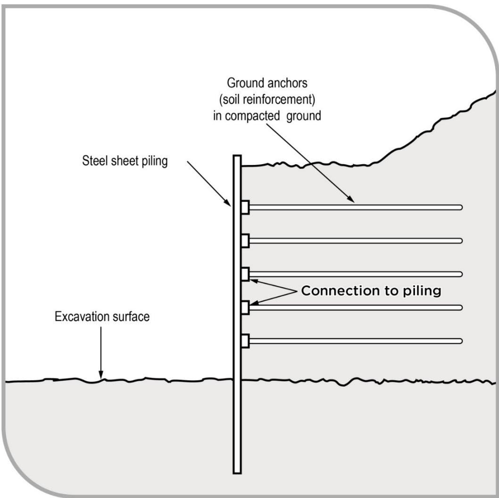

# Excavation work

Code of Practice

# Disclaimer

Safe Work Australia is an Australian Government statutory agency established in 2009. Safe Work Australia includes Members from the Commonwealth, and each state and territory, Members representing the interests of workers and Members representing the interests of employers.

Safe Work Australia works with the Commonwealth, state and territory governments to improve work health and safety and workers' compensation arrangements. Safe Work Australia is a national policy body, not a regulator of work health and safety. The Commonwealth, states and territories have responsibility for regulating and enforcing work health and safety laws in their jurisdiction.

ISBN 978- 0- 642- 78544- 2 (PDF)  ISBN 978- 0- 642- 78545- 9 (DOCX)

# Creative Commons

This copyright work is licensed under a Creative Commons Attribution- Noncommercial 4.0 International licence. To view a copy of this licence, visit creativecommons.org/licenses In essence, you are free to copy, communicate and adapt the work for non- commercial purposes, as long as you attribute the work to Safe Work Australia and abide by the other licence terms.

# Contact information

Safe Work Australia | info@swa.gov.au | www.swa.gov.au

# Contents

# Foreword 5

# 1. Introduction 7

1.1. What is excavation work? 7  1.2. Who has health and safety duties in relation to excavation work? 7  1.3. What is involved in managing risks associated with excavation work? 10  1.4. Information, training, instruction and supervision 13

# 2. The risk management process 15

2.1. Identifying the hazards 15  2.2. Assessing the risks 16  2.3. Controlling the risks 17  2.4. Maintaining and reviewing control measures 18

# 3. Planning the excavation work 20

3.1. Principal contractor for a construction project 20  3.2. Designers 21  3.3. Safe Work Method Statements 22  3.4. Asbestos licensing 23  3.5. Adjacent buildings or structures 26  3.6. Essential services 26  3.7. Securing the work area 28  3.8. Emergency plan 29

# 4. Controlling risks in excavation work 31

4.1. Excavated material and loads near excavations 32  4.2. Plant and equipment 34  4.3. Powered mobile plant 35  4.4. Falls 40  4.5. Using explosives 42  4.6. Atmospheric conditions and ventilation 43  4.7. Manual work 44

# 5. Excavation methods 45

5.1. Trenching 45  5.2. Tunnelling 46  5.3. Shafts 47

# 6. Preventing ground collapse 49

6.1. Ground conditions 50  6.2. Benching and battering 51  6.3. Shoring 53

6.4. Removal of shoring supports. 62 6.5. Shields and boxes. 62 6.6. Other ground support methods. 63 6.7. Regular inspection. 63 Appendix A- Glossary. 64 Appendix B- References and other information sources. 69 Amendments. 70

# Foreword

This Code of Practice on how to manage the risks associated with excavation work is an approved code of practice under section 274 of the Work Health and Safety Act (the WHS Act).

An approved code of practice provides practical guidance on how to achieve the standards of work health and safety required under the WHS Act and the Work Health and Safety Regulations (the WHS Regulations) and effective ways to identify and manage risks.

A code of practice can assist anyone who has a duty of care in the circumstances described in the code of practice. Following an approved code of practice will assist the duty holder to achieve compliance with the health and safety duties in the WHS Act and WHS Regulations, in relation to the subject matter of the code of practice. Like regulations, codes of practice deal with particular issues and may not cover all relevant hazards or risks. The health and safety duties require duty holders to consider all risks associated with work, not only those for which regulations and codes of practice exist.

Codes of practice are admissible in court proceedings under the WHS Act and WHS Regulations. Courts may regard a code of practice as evidence of what is known about a hazard, risk, risk assessment or risk control and may rely on the code in determining what is reasonably practicable in the circumstances to which the code of practice relates. For further information see the Interpretive Guideline: Interpretive Guideline: The meaning of 'reasonably practicable'.

Compliance with the WHS Act and WHS Regulations may be achieved by following another method, if it provides an equivalent or higher standard of work health and safety than the code.

An inspector may refer to an approved code of practice when issuing an improvement or prohibition notice.

# Scope and application

This Code is intended to be read by a person conducting a business or undertaking (PCBU). It provides practical guidance to PCBUs on how to manage health and safety risks associated with excavation work.

The guidance in this Code is relevant to excavation contractors as well as PCBUs who have management or control of workplaces where excavation work is carried out, for example principal contractors.

This Code may be a useful reference for other persons interested in the duties under the WHS Act and WHS Regulations.

This Code applies to all workplaces covered by the WHS Act where excavation work is carried out and where excavation work products and equipment are used and stored.

Persons who have duties in relation to excavation work should also refer to the Code of Practice: Construction work.

# How to use this Code of Practice

This Code includes references to the legal requirements under the WHS Act and WHS Regulations. These are included for convenience only and should not be relied on in place of the full text of the WHS Act or WHS Regulations. The words 'must', 'requires' or 'mandatory' indicate a legal requirement exists that must be complied with.

The word 'should' is used in this Code to indicate a recommended course of action, while 'may' is used to indicate an optional course of action.

# 1. Introduction

Excavation collapses are particularly dangerous. They can occur quickly, limiting the ability of workers and others to escape, especially if the collapse of a trench, tunnel or shaft is extensive.

The speed of an excavation collapse increases the risk associated with excavation work. The consequences are significant- - falling earth can bury or crush a person in its path. This can result in death by suffocation or internal crush injuries.

# 1.1. What is excavation work?

Excavation work means work to make an excavation or to fill or partly fill an excavation. Excavation work commonly includes work involving the removal of soil or rock from a site to form an open face, hole or cavity, including trenches, shafts and tunnels. Excavation work is generally carried out using tools, machinery or explosives. Requirements imposed under the WHS Act and WHS Regulations relating to excavation work do not apply to a mine, a bore to which a relevant water law applies, or a trench used as a place of interment.

Work connected with an excavation is a type of 'construction work'. Therefore, when carrying out excavation work, the requirements relating to construction work must also be complied with.

Construction work, including work connected with an excavation carried out in or near:

a shaft or trench with an excavated depth of greater than 1.5 metres, or a tunnel is 'high risk construction work' for which a Safe Work Method Statement (SwMs) must be prepared.

Further guidance on the duties related to high risk construction work and SwMs is available in the Code of Practice: Construction work.

Other key terms relating to excavation work are listed in Appendix A.

# 1.2. Who has health and safety duties in relation to excavation work?

Duty holders who have a role in managing the risks of excavation work include:

persons conducting a business or undertaking (PCBUs) designers, manufacturers, importers, suppliers and installers of plant, substances or structures, and officers.

Workers and other persons at the workplace also have duties under the WHS Act, such as the duty to take reasonable care for their own health and safety at the workplace.

A person can have more than one duty and more than one person can have the same duty at the same time.

Early consultation and identification of risks can allow for more options to eliminate or minimise risks and reduce the associated costs.

The main duties in relation to managing the risks of excavation work are set out in Chapter 2.

# Person conducting a business or undertaking

# WHS Act section 19

Primary duty of care

A PCBU must eliminate risks arising from excavation work, or if that is not reasonably practicable, minimise the risks, so far as is reasonably practicable.

The WHS Regulations include more specific obligations for PCBUs to manage the risks of hazardous chemicals, airborne contaminants and plant, as well as other hazards associated with excavation work, including trenches.

PCBUs have a duty to consult workers about work health and safety and may also have duties to consult, cooperate and coordinate with other duty holders.

# Principal contractors

WHS Regulation 293 Meaning of principal contractor WHS Regulation 308 Specific control measure- - - signage identifying principal contractor WHS Regulation 309 WHS management plan- - - preparation WHS Regulation 310 WHS management plan- - - duty to inform WHS Regulation 311 WHS management plan- - - review WHS Regulation 312 High risk construction work- - - safe work method statements WHS Regulation 313 Copy of WHS management plan must be kept WHS Regulation 314 Further health and safety duties- - - specific regulations WHS Regulation 315 Further health and safety duties- - - specific risks

The principal contractor for a construction project has a specific duty under the WHS Regulations to document, in their WHS Management Plan for the project, the arrangements in place for consultation, cooperation and coordination between the PCBUs at the site.

A construction project is a project that involves construction work where the cost of the construction is \(\) 250000$ or more. Additional duties apply to principal contractors of construction projects. (Refer to section 3.1 of this Code).

Designers, manufacturers, suppliers and importers of plant, substances or structures

# WHS Act Part 2 Division 3

Further duties of persons conducting businesses or undertakings

# WHS Act section 22

Duties of persons conducting businesses or undertakings that design plant, substances or structures

# WHS Act section 23

Duties of persons conducting businesses or undertakings that manufacture plant, substances or structures

# WHS Act section 24

Duties of persons conducting businesses or undertakings that import plant, substances or structures

# WHS Act section 25

Duties of persons conducting businesses or undertakings that supply plant, substances or structures

# WHS Act section 26

Duties of persons conducting businesses or undertakings that install, construct or commission plant, or structures

Designers, manufacturers, importers, suppliers and installers of plant or structures used in excavation work must ensure, so far as is reasonably practicable, that the plant or structure they design, manufacture, import or supply is without risks to health and safety. This duty includes carrying out testing and analysis as well as providing specific information about the plant or substance.

To assist in meeting these duties, the WHS Regulations require:

- manufacturers to consult with designers of plant- importers to consult with designers and manufacturers of plant, and- the person who commissions construction work to consult with the designer of the structure.

# Officers

# WHS Act section 27

Duty of officers

Officers, for example company directors, have a duty to exercise due diligence to ensure the PCBU complies with the WHS Act and WHS Regulations. This includes taking reasonable steps to ensure the business or undertaking has and uses appropriate resources and processes to eliminate or minimise risks to health and safety from excavation work.

Further information on who is an officer and their duties is available in the Interpretive Guideline: The health and safety duty of an officer under section 27.

# Workers

WHS Act section 7  Meaning of worker  WHS Act section 28  Duties of workers  WHS Regulation 46  Duties of workers

Workers have a duty to take reasonable care for their own health and safety and to not adversely affect the health and safety of other persons. Workers must comply with reasonable instructions, as far as they are reasonably able, and cooperate with reasonable health and safety policies or procedures that have been notified to workers.

If personal protective equipment (PPE) is provided by the business or undertaking, the worker must so far as they are reasonably able, use or wear it in accordance with the information, instruction and training provided.

Other persons at the workplace

# WHS Act section 29

Duties of other persons at the workplace

Other persons at the workplace, like visitors, must take reasonable care for their own health and safety and must take care not to adversely affect other people's health and safety. They must comply, so far as they are reasonably able, with reasonable instructions given by the PCBU to allow the PCBU to comply with the WHS Act.

1.3. What is involved in managing risks associated with excavation work?

# WHS Regulation 305

Management of risks to health and safety associated with excavation work

# WHS Regulation 34

Duty to identify hazards

# WHS Regulation 35

Managing risks to health and safety

# WHS Regulation 36

Hierarchy of control measures

# WHS Regulation 37

Maintenance of control measures

# WHS Regulation 38

Review of control measures

This Code provides guidance on how to manage the risks associated with excavation work in the workplace using the following systematic process:

Identify hazards- - find out what could cause harm. Assess the risks, if necessary- - understand the nature of the harm that could be caused by the hazard, how serious the harm could be and the likelihood of it happening. This step may not be necessary if you are dealing with a known risk with known controls. Eliminate risks, so far as is reasonably practicable. Control risks- - if it is not reasonably practicable to eliminate the risk, implement the most effective control measures that are reasonably practicable in the circumstances in accordance with the hierarchy of control measures, and ensure they remain effective over time. Review control measures to ensure they are working as planned.

Additional duties apply to the PCBU to manage the health and safety risks associated with excavation work before the work starts, including the risk of:

a person falling into an excavation a person being trapped by the collapse of an excavation a person working in an excavation being struck by a falling thing, and a person working in an excavation being exposed to an airborne contaminant.

To manage the risks, all relevant matters must be considered including:

the nature of the excavation the nature of the excavation work including the range of possible methods of carrying out the work, and the means of entry into and exit from the excavation, if applicable.

Further guidance on the risk management process is available in the Code of Practice: How to manage work health and safety risks.

# Consulting workers

# WHS Act section 47

Duty to consult with workers

# WHS Act section 48

Nature of consultation

# WHS ACT section 49

When consultation is required

A PCBU must consult, so far as is reasonably practicable, with workers who carry out work for the business or undertaking and who are, or are likely to be, directly affected by a health and safety matter.

This duty to consult is based on the recognition that worker input and participation improves decision- making about health and safety matters and assists in reducing work- related injuries and disease.

The broad definition of a 'worker' under the WHS Act means a PCBU must consult with employees and anyone else who carries out work for the business or undertaking. A PCBU must consult, so far as is reasonably practicable, with contractors and sub- contractors and their employees, on- hire workers, outworkers, apprentices, trainees, work experience students, volunteers and other people who are working for the PCBU and who are, or are likely to be, directly affected by a health and safety matter.

Workers are entitled to take part in consultations and to be represented in consultations by a health and safety representative who has been elected to represent their work group.

By drawing on the experience, knowledge and ideas of workers, excavation work hazards are more likely to be identified and effective control measures implemented.

In many cases, decisions about construction work and construction projects are made prior to engaging workers, therefore it may not be possible to consult with workers in these early stages. However, it is important to consult with them as the planning and construction work progresses.

Consultation may include discussions about:

- excavation methods- types of risk control measures- interaction with other trades- SWMS- provision of appropriate amenities- procedures to deal with emergencies- proposing changes that may affect the health and safety of workers- procedures for consulting with workers- resolving work health and safety issues- monitoring the health of workers- monitoring the conditions at any workplace under the management or control of the PCBU- providing information and training for workers, and- when carrying out any other activity prescribed by the regulations for the purposes of this section.

Consulting, cooperating and coordinating activities with other duty holders

# WHS Act section 46

Duty to consult with other duty holders

The WHS Act requires a PCBU to consult, cooperate and coordinate activities with all other persons who have a work health or safety duty in relation to the same matter, so far as is reasonably practicable.

There is often more than one business or undertaking involved in excavation work, who may each have responsibility for the same health and safety matters, either because they are involved in the same activities or share the same workplace.

In these situations, each duty holder should exchange information to find out who is doing what and work together in a cooperative and coordinated way so risks are eliminated or minimised, so far as is reasonably practicable.

For example, civil engineers and contractors should consult with other duty holders about the risks associated with the excavation work including traffic and plant movements near the excavation area.

Duty holders should co- operate with each other to ensure that each of their activities do not create risks for other workers during the excavation work. Further guidance on consultation is available in the Code of Practice: Work health and safety consultation, cooperation and coordination.

# 1.4. Information, training, instruction and supervision

# WHS Act section 19

Primary duty of care

WHS Regulation 39

Provision of information, training and instruction

WHS Regulation 317

Duty to ensure worker has been trained

The WHS Act requires that a PCBU ensure, so far as is reasonably practicable, the provision of any information, training, instruction or supervision that is necessary to protect all persons from risks to their health and safety arising from work carried out as part of the conduct of the business or undertaking.

The PCBU must ensure that information, training or instruction provided to a worker are suitable and adequate having regard to:

the nature of the work carried out by the worker the nature of the risks associated with the work at the time of the information, training and instruction, and the control measures implemented.

The PCBU must also ensure, so far as is reasonably practicable, that the information, training and instruction are provided in a way that is readily understandable for the person to whom it is provided.

Workers must be trained and have the appropriate skills to carry out a particular task safely. Training should be provided to workers by a competent person.

Information, training, instruction provided to workers who carry out excavation work should include the proper use, wearing, storage and maintenance of personal protective equipment (PPE).

In addition to the PCBU's general duty to provide any supervision necessary to protect all persons from work health and safety risks, the WHS Regulations also impose specific duties to provide supervision necessary to protect a worker from risks to health and safety in certain circumstances, for example, where the worker:

uses, generates or handles hazardous chemicals

- operates, tests, maintains, repairs or decommissions a storage or handling system for a hazardous chemical, or- is likely to be exposed to a hazardous chemical.

Training specific to the excavation work and to the site must also be provided to workers by a competent person. Workers operating certain types of plant at the workplace must possess a valid licence to operate that plant.

Workers in a supervisory role, for example a leading hand or foreman, should be experienced and trained in excavation work to ensure the work is carried out in accordance with a SWMS.

Further information on general construction induction training and other training is available in Chapter 6 of the Code of Practice: Construction work.

# 2. The risk management process

# WHS Regulation 34

Duty to identify hazards WHS Regulation 35 Managing risks to health and safety WHS Regulation 36

# WHS Regulation 37

Maintenance of control measures

# WHS Regulation 38

Review of control measures

# WHS Regulation 297

Management of risks to health and safety

# WHS Regulation 299

Safe work method statement required for high risk construction work

# WHS Regulation 305

Management of risks to health and safety associated with excavation work

A risk assessment is not mandatory for excavation work under the WHS Regulations. However, in many circumstances it will be the best way to determine the measures that should be implemented to control risks. It will help to:

identify which workers are at risk of exposure determine what sources and processes are causing that risk identify if and what kind of control measures should be implemented, and check the effectiveness of existing control measures.

Risk management is a systematic process to eliminate or minimise the potential for harm to people.

# 2.1. Identifying the hazards

The first step in the risk management process is to identify all hazards associated with excavation work. This involves finding things and situations that could potentially cause harm to people. Hazards generally arise from the following aspects of work and their interaction:

physical work environment equipment, materials and substances used work tasks and how they are performed, and work design and management.

Hazards may be identified by looking at the workplace and how work is carried out. It is also useful to talk to workers, manufacturers, suppliers and health and safety specialists and review relevant information, records and incident reports.

Examples of excavation specific hazards include:

Examples of excavation specific hazards include:- underground essential services including gas, water, sewerage, telecommunications, electricity, chemicals and fuel or refrigerant in pipes or lines- the fall or dislodgement of earth or rock- falls from one level to another- falling objects- inappropriate placement of excavated materials, plant or other loads- the instability of adjoining structures caused by the excavation- previous disturbance of the ground including previous excavation- the instability of the excavation due to persons or plant working adjacent to the excavation- the presence of or possible in- rush of water or other liquid- hazardous manual tasks- hazardous chemicals, which may be present in the soil where excavation work is to be carried out- hazardous atmosphere in an excavation, which could result from practices like using methyl ethyl ketone (MEK) solvent for PVC pipes in poorly ventilated trenches- vibration and hazardous noise, and- overhead essential services, such as powerlines, and ground- mounted essential services such as transformers, gas and water meters.

# 2.2. Assessing the risks

A risk assessment involves considering what could happen if someone is exposed to a hazard and the likelihood of it happening. A risk assessment can help you determine:

how severe a risk is whether any existing control measures are effective what action you should take to control the risk how urgently the action needs to be taken, and hazards that have the potential to cause different types and severities of harm, ranging from minor discomfort to a serious injury or death.

Many hazards and their associated risks are well known and have well established and accepted control measures. In these situations, the second step to formally assess the risk is unnecessary. If after identifying a hazard you already know the risk and how to control it effectively, you may simply implement the controls.

In some circumstances, a risk assessment will assist to:

identify which workers are at risk determine what sources and processes are causing that risk identify if and what kind of control measures should be implemented, and check the effectiveness of existing control measures.

The nature and severity of risks will depend on various factors, including the:

local site conditions including access, ground slope, adjacent buildings and structures, surface and underground water courses and trees depth of the excavation soil properties including variable soil types, stability, shear strength, cohesion, presence of groundwater, effect of exposure to the elements fractures or faults in rocks including joints, bedding planes, dip and strike directions and angles, clay seams

specialised plant or work methods required, for example ground support the method(s) of transport, haul routes and disposal what exposures might occur, for example noise, ultraviolet radiation or hazardous chemicals the number of people involved the possibility of unauthorised access to the work area local weather conditions, and the length of time the excavation will be open.

Further guidance on the risk management process and the hierarchy of control measures is available in the Code of Practice. How to manage work health and safety risks.

# Review available information

Information and advice about hazards and risks relevant to particular industries and types of work is available from regulators, industry associations, unions, technical specialists and safety consultants.

Manufacturers and suppliers can also provide information about hazards and safety precautions for specific substances (safety data sheets), plant or processes (instruction manuals).

Analyse your records of health monitoring, workplace incidents, near misses, worker complaints and the results of any inspections and investigations to identify hazards. If someone has been hurt doing a particular task, then a hazard exists that could hurt someone else. These incidents need to be investigated to find the hazard that caused the injury or illness.

# 2.3. Controlling the risks

# The hierarchy of control measures

The HHS Regulations require duty holders to work through the hierarchy of control measures when managing certain risks; however, the hierarchy can be applied to any risk. The hierarchy ranks control measures from the highest level of protection and reliability to the lowest.

# Eliminating the risk

You must always aim to eliminate the risk. For example undertake work above ground to eliminate the use of trenches, tunnels or shafts and the need to work below ground.

If eliminating the hazards and associated risks is not reasonably practicable, you must minimise the risk by one or more of the following:

Substitution- - minimise the risk by substituting or replacing a hazard or hazardous work practice with something that gives rise to a lesser risk, for example by using an excavator with a rock breaker rather than a manual method. Isolation- - minimise the risk by isolating or separating the hazard or hazardous work practice from any person exposed to it, for example by using concrete barriers to separate pedestrians and powered mobile plant to reduce the risk of a collision. Engineering controls- - engineering controls are physical control measures to minimise risk, for example by benching, battering or shoring the sides of the excavation to reduce the risk of ground collapse.

If risk remains, it must be minimised by implementing administrative controls, so far as is reasonably practicable, for example by installing warning signs near the excavation.

Any remaining risk must be minimised with suitable personal protective equipment (PPE), for example by providing workers with hard hats, hearing protectors and high visibility vests.

Administrative control measures and PPE do not control the hazard at the source. They rely on human behaviour and supervision and used on their own tend to be the least effective in minimising risks.

Chapters 4- 6 of this Code provide information about control measures for excavation work.

Further guidance on the risk management process and the hierarchy of control measures is available in the Code of Practice: How to manage work health and safety risks.

# Combining control measures

A combination of control measures may be used to minimise risks, so far as is reasonably practicable, if a single control is not sufficient for the purpose. In most cases, a combination of the control measures will provide the best solution to minimise the risk to the lowest level reasonably practicable.

You should also ensure that the control measures you select do not create new hazards, for example electrical risks from contact with overhead power lines or crushing and entanglement from plant like elevating work platforms (EwPs). If any new hazards are created they must also be controlled.

# 2.4. Maintaining and reviewing control measures

# WHS Regulation 38

Review of control measures

Control measures must be maintained so they remain fit for purpose, suitable for the nature and duration of work and installed, set up and used correctly.

The control measures put in place to protect health and safety should be regularly reviewed to make sure they are effective. If the control measure is not working effectively it must be revised to ensure it is effective in controlling the risk.

You must review and as necessary revise control measures so as to maintain, so far as is reasonably practicable, a work environment that is without risks to health or safety. For example:

when the control measure does not control the risk, so far as is reasonably practicable before a change at the workplace that is likely to give rise to a new or different health and safety risk that the measure may not effectively control a new or relevant hazard or risk is identified the results of consultation indicate a review is necessary, or a health and safety representative requests a review.

Common review methods include workplace inspection, consultation, testing and analysing records and data. Where excavation work is 'high risk construction work' a SwMs must also be reviewed and revised where necessary.

You can use the same methods as in the initial hazard identification step to check control measures. You must also consult your workers and their health and safety representatives.

If problems are found, go back through the risk management steps, review your information and make further decisions about risk control.

# 3. Planning the excavation work

Excavation work should be carefully planned before work starts so it can be carried out safely. Planning involves identifying the hazards, assessing the risks and determining control measures in consultation with all relevant persons involved in the work including the principal contractor for a construction project, excavation contractor, designers and mobile plant operators. Structural or geotechnical engineers may also need to be consulted at this stage.

Consultation should include discussions on the:

- nature and condition of the ground and working environment  
- weather conditions  
- nature of the work and other activities that may affect health and safety  
- static and dynamic loads near the excavation  
- interaction with other trades  
- site access  
- SWMS  
- management of surrounding vehicle traffic and ground vibration  
- types of equipment used for excavation work  
- public safety  
- existing services and their location  
- the length of time the excavation is to remain open  
- providing facilities, and  
- procedures to deal with emergencies.

Further information on amenities and emergencies is available in the Code of Practice: Managing the work environment and facilities.

# 3.1. Principal contractor for a construction project

# WHS Regulation 292

Meaning of construction project

# WHS Regulation 293

Meaning of principal contractor

A construction project is a project that involves construction work where the cost of the construction work is \(\) 250,000$ or more. Additional duties apply to principal contractors of construction projects. There can only be one principal contractor for a construction project and this will be either the person commissioning the construction work or a person appointed as the principal contractor by the person commissioning the construction work.

The principal contractor has a range of duties for a construction project including:

preparing and reviewing a WHS management plan preparing or taking all reasonable steps to obtain a SwMs that has already been prepared by another person before high risk construction work starts putting in place arrangements to manage the work environment including falls, facilities, first aid, an emergency plan and traffic management installing signs showing the principal contractor's name, contact details and location of a site office, and securing the construction workplace.

Where significant excavation work is being carried out and building works have not started, the person who commissions the construction work may appoint the excavation contractor as the principal contractor for the site preparation phase of the project and then replace them with a building expert after this phase is completed. If the excavation contractor is appointed as the principal contractor then the excavation contractor must comply with principal contractor duties during this phase.

Further guidance on how to calculate the cost of construction work and on principal contractor duties is available in the Code of Practice: Construction work.

# 3.2. Designers

# WHS Act section 22

Duties of persons conducting businesses or undertakings that design plant, substances or structures

# WHS Regulation 295

Designer must give safety report to person who commissions design

Designers of structures must ensure, so far as is reasonably practicable, that the structures they design that could reasonably be expected to be used as or at a workplace are designed to be without risks to the health and safety to the persons who construct the structures.

Designers must give the person who commissioned the design a written safety report specifying the hazards relating to the design of the structure that, so far as the designer is reasonably aware, create risks to persons carrying out construction work.

This written report must specify the hazards relating to the design of the structure that, so far as the designer is reasonably aware:

create a risk to the health and safety of persons who are to carry out construction work on the structure or part, and are associated only with the particular design of the structure.

Designers of structures should consider possible excavation work methods and health and safety control measures when producing final design documents and the safety report for the structure.

A person commissioning the construction work must consult, so far as is reasonably practicable, with the designer of the whole or part of the structure about eliminating and controlling risks. If the person commissioning the construction work did not commission the design, they must take all reasonable steps to obtain the designer's safety report.

Where there is a principal contractor, the person commissioning the construction work must give the principal contractor information they have about the hazards and risks associated with the work.

For further guidance on the duties of designers refer to the Code of Practice: Safe design of structures.

# 3.3. Safe Work Method Statements

# WHS Regulation 299

Safe work method statement required for high risk construction work

A SwMs is required for high risk construction work' activities.

The primary purpose of a SwMS is to help PCBUs, supervisors and workers implement and monitor the control measures established at the workplace to ensure high risk construction work is carried out safely.

The SwMS must:

identify the type of high risk construction work being done specify the health and safety hazards relating to the high risk construction work and risks arising from those hazards describe how the risks relating to the high risk construction work will be controlled describe how the control measures will be implemented, monitored and reviewed, and be developed in consultation with workers and their representatives who are carrying out the high risk construction work.

For other construction activities a SwMS is not required. However, a PCBU must manage risks to health and safety by eliminating or minimising risks, so far as is reasonably practicable, and if it is not reasonably practicable, to minimise those risks so far as is reasonably practicable.

# Who is responsible for preparing a SwMS?

A PCBU must prepare a SwMS- or ensure a SwMS has been prepared- - before high risk construction work starts.

The person responsible for carrying out the high risk construction work is best placed to prepare the SwMS in consultation with workers who will be directly engaged in the high risk construction work.

If more than one PCBU has the duty to ensure a SwMS is or has been prepared, they must consult and cooperate with each other to coordinate who will be responsible for actually preparing it.

There may be situations where there are different types of high risk construction work occurring at the same time at the same workplace, for example if work is being carried out:

where there is a risk of a person falling more than 2 metres near a trench with an excavated depth greater than 1.5 metres, and where there is a risk of mobile powered plant colliding with pedestrians or other powered mobile plant.

In these cases one SwMS may be prepared to cover any high risk construction work activities being carried out at the workplace. Alternatively, a separate SwMS can be prepared for each type of high risk construction work. If separate SwMS are prepared, consider how the different work activities may impact on each other and whether this may lead to inconsistencies between control measures.

# Complying with a SwMS

# WHS Regulation 300

Compliance with safe work method statement

If high risk construction work is not carried out in accordance with the safe work method statement for the work, the PCBU must ensure that the work:

is stopped immediately or as soon as it is safe to do so; and only in accordance with the statement.

Further guidance on SwMS and an example SwMS template are available in the Code of Practice: Construction work, which also provides examples of high risk construction work, and Information Sheet: Safe Work Method Statement for high risk construction work.

# 3.4. Asbestos licensing

During excavation work you may come in contact with material contaminated with asbestos, for example underground water pipes and telecommunications pits, or naturally occurring asbestos in the material being excavated.

# WHS Regulation 422

Asbestos to be identified or assumed at workplace

# WHS Regulation 458

Duty to ensure asbestos removalist is licensed

There are two types of asbestos licences: Class A and Class B. The class of licence required will depend on the type and quantity of asbestos, asbestos- containing material (ACM) or asbestos contaminated dust (ACD) that is being removed at a workplace, as set out in Table 1 below.

Table 1 Licence requirements for asbestos removal work  

<table><tr><td>Type of licence</td><td>What asbestos can be removed?</td></tr><tr><td>Class A</td><td>Can remove any amount or quantity of asbestos or ACM including:
- any amount of friable asbestos or ACM
- any amount of ACD, and
- any amount of non-friable asbestos or ACM</td></tr><tr><td>Class B</td><td>Can remove:
- any amount of non-friable asbestos or ACM
- any amount of ACD associated with the removal of non-friable asbestos or ACM.</td></tr></table>

# Type of licence

# What asbestos can be removed?

# No licence required

Can remove:

up to  $10m^2$  of non- friable asbestos or ACM

ACD that is:

associated with the removal of less than  $10m^2$  of non- friable asbestos or ACM not associated with the removal of friable or non- friable asbestos and is only a minor contamination.

# Asbestos

# WHS Regulation 451

Determining presence of asbestos or ACM

The PCBU who controls the workplace has specific responsibilities in regard to identifying whether asbestos is present and informing others if it is.

The PCBU with management or control of the workplace must ensure, so far as is reasonably practicable, that all asbestos or ACM at the workplace, or assumed present, is identified by a competent person.

All asbestos likely to be disturbed by the demolition must be identified and, so far as is reasonably practicable, be removed before the demolition is started.

If only a part of a building or structure is to be demolished, only the asbestos likely to be disturbed during the demolition of that part of the building or structure is required to be removed, so far as is reasonably practicable, before the excavation or demolition work commences.

The PCBU who is to carry out the demolition the demolition or refurbishment must assume that asbestos or ACM is fixed to or installed in the structure or plant if the competent person is, on reasonable grounds, uncertain whether or not asbestos is fixed to or installed in the structure or plant; or part of the structure or plant is inaccessible and likely to be disturbed.

Construction work including demolition work that involves or is likely to involve the disturbance of asbestos is high risk construction work and a PCBU that involves the carrying out of this work must ensure that a SwMS is prepared before this work commences.

When planning demolition or refurbishment, consider:

- the age of the building and the likelihood of asbestos or other hazardous materials being present- the location of asbestos in relation to the proposed demolition or refurbishment- if there are inaccessible areas likely to contain asbestos- whether asbestos is likely to be damaged or disturbed as a result of the demolition or refurbishment work—if yes, can it be removed safely before work commences?- type and condition of asbestos present- amount of asbestos present- method of demolition or refurbishment and how will it affect the asbestos, and- the nature of the ACM (friable or non-friable).

Demolition of part of a building, structure, or plant can be carried out to access in situ asbestos so it can be removed safely. Part of a wall may be demolished to access asbestos located in the wall cavity so it can be removed before further demolition.

# Asbestos register

# WHS Regulation 426

Review of asbestos register

# WHS Regulation 448

Demolition—Review of asbestos register

# WHS Regulation 449

Duty to give asbestos register to person conducting business or undertaking of demolition or refurbishment

# WHS Regulation 450

Duty to obtain asbestos register

The PCBU who controls the workplace who carries out demolition or refurbishment at a workplace must obtain a copy of the asbestos register from the person with management or control of that workplace before commencing the demolition or refurbishment.

A person with management or control of a workplace where an asbestos register is kept must ensure:

- the register is reviewed and, as necessary, revised if asbestos is removed from, or disturbed, sealed or enclosed at the workplace- that, before demolition or refurbishment is carried out at the workplace, the asbestos register for the workplace is reviewed and if the register is inadequate having regard to the proposed demolition or refurbishment, the register must be revised, and- the PCBU who carries out the demolition or refurbishment is given a copy of the asbestos register before demolition/refurbishment work starts.

If there is no asbestos register, the person carrying out the demolition work must:

- not carry out the work until the structure or plant has been inspected to determine whether asbestos or ACM are fixed to or installed in the structure or plant- ensure that the determination is undertaken by a competent person, and- if asbestos or ACM are determined or assumed to be present, for domestic premises—inform the occupier and owner of the premises; and in any other case—inform the person with management or control of the workplace.

# Disposing of asbestos or ACM

The PCBU that commissions the removal of asbestos must ensure that the asbestos removal work is carried out by a licensed asbestos removalist who is appropriately licensed to carry out the work, unless specified in the WHS regulations that a licence is not required.

Asbestos waste must be transported and disposed of in accordance with the relevant state or territory Environment Protection Authority (EPA) requirements. Asbestos waste can only be disposed of at a site licensed by the EPA and it must never be disposed of in the general waste system.

Further guidance relating to the duties associated with the removal of asbestos, and specific guidance on managing asbestos when carrying out demolition and refurbishment work, is available in the model Code of Practice: How to safely remove asbestos, Code of Practice:

# 3.5. Adjacent buildings or structures

Excavation work may seriously affect the security or stability of part of a structure at or adjacent to the location of the proposed excavation, which can lead to structural failure or collapse. Excavation work must not start until steps are taken to prevent the collapse or partial collapse of potentially affected buildings or structures.

Excavation below the level of the footing of a structure, including retaining walls, that could affect the stability of the structure should be assessed by a competent person and secured by a ground support system which has been designed by a competent person. Suitable supports to brace the structure may also be required and should be identified by a competent person.

It is also important other buildings in and around the excavation site are not adversely affected by vibration or concussion during the excavation work. Special precautions may need to be taken in the vicinity of hospitals and other buildings containing equipment sensitive to shock and vibration.

Care should be taken to ensure that excavation work does not cause flooding or water penetration to an adjacent building.

# 3.6. Essential services

# WHS Regulation 304

Excavation work- underground essential services information

One of the most important elements of pre- demolition planning is the location and disconnection of all essential services.

Essential services include the supply of gas, water, sewerage, telecommunications, electricity, chemicals, fuel and refrigerant in pipes or lines. The principal contractor must ensure, so far as is reasonably practicable, that risks associated with essential services at the workplace are managed in accordance with the risk management process outlined in Chapter 2.

Specific control measures must be implemented before using excavators or other earthmoving machinery near overhead powerlines. The relevant authority should be consulted regarding approach distances and control measures to be implemented to prevent any part of the plant or a load carried on it from coming too close or contacting overhead powerlines.

High risk construction work includes construction work when carried out on or near:

pressurised gas distribution mains or piping chemical, fuel or refrigerant lines, and energised electrical installations.

A SwMs must be prepared before this work commences.

All electric, gas, water, sewer, steam and other service lines not required in the demolition process should be shut off, capped, or otherwise controlled, at or outside the building line, before demolition work is started.

In each case, the utility agency involved should be notified in advance and its approval or services, if necessary, obtained. A service retained for the demolition work should be adequately protected as required by the relevant authority, for example the protection of overhead powerlines.

# Underground essential services

Before directing or allowing work to start, a person with management or control of the workplace must take all reasonable steps to get current information about underground essential services in the areas at the workplace where the excavation work is to be carried out. They must also get information about underground essential services in areas adjacent to the site of excavation and have regard for all of the information.

If excavating in a public place the PCBU must take all reasonable steps to identify all electrical cables present. Information may be obtained by contacting:

Dial Before You Dig - a free enquiry service for information on underground assets anywhere in Australia. This organisation will tell you if electrical cables owned by one or more of its contributory members are located in the vicinity of your site. Definite cable locations can be determined by special arrangement with the organisations. Dial Before You Dig can be contacted by:

- phoning 1100, or- submitting an online enquiry on the Dial Before You Dig website (www.1100.com.au).

- relevant authorities about all cables they may have placed in the vicinity of the excavation. Authorities may include:

- electricity supply authorities- communication companies- local government authorities, and- water authorities.

In some cases, customers of electricity supply authorities have authority to place electricity cables in public places. If excavating on private property, contact the owner or occupier of the premises about buried cables before starting work. Any underground service plans that are obtained, including information on underground essential services, must be provided to the principal contractor and/or the excavation contractor. Other relevant parties, including any subcontractors and plant operators carrying out the excavation work, should also be provided with information about essential services and other plans so the information is considered when planning all work in the area.

Underground essential services information obtained must be:

- made available to any worker, principal contractor and subcontractors- readily available for inspection, as required under the WHS Act, and- retained until the excavation work is completed or, if there is a notifiable incident relating to the excavation work, two years after the incident occurs.

Available information about existing underground essential services may not be accurate. Therefore it is important that excavation methods include an initial examination of the area to be excavated, for example sampling the area by exposing a short section of underground services usually using water pressure and a vacuum system to excavate or 'pothole' the area.

If it cannot determined exactly where an underground cable is, potholing should be used to carefully identify the cable location and avoid accidental contact with the cable.

Potholing involves digging with hand tools to a pre- determined depth to verify if assets exist in the immediate location. Insulated hand digging tools suitable for the voltage concerned may be used or a vacuum pumping in the potholing process may also be used to locate the underground cable.

The available information about existing underground essential services may not be accurate. Therefore it is important that excavation methods include an initial examination of the area to be excavated.

  
Figure 1 Underground essential services exposed by potholing

Underground essential services can also be located using underground locators, for example electromagnetic cable locators and ground penetrating radar. The PCBU must ensure that workers operating such equipment have undergone the relevant training and are competent in their use.

A SWMS must be prepared for managing the risks associated with excavation work involving underground services.

Further guidance on underground essential services and how to locate them is available in the Code of Practice: Construction work and Guidance Material - Working in the vicinity of overhead and underground electric lines.

# 3.7. Securing the work area

WHS Regulation 306 Additional controls—trenches

A person conducting a business or undertaking who proposes to excavate a trench at least 1- 5 metres deep must ensure, so far as is reasonably practicable, that the work area is secured from unauthorised access, including inadvertent entry.

In securing the trench or excavation, you must consider:

- risks to health and safety arising from unauthorised access to the work area, and- the likelihood of unauthorised access occurring.

This requirement aims to protect other workers on site who may be at risk by restricting access to the excavation area. It applies in addition to the duty the person with management or control of the construction site has to ensure, so far as is reasonably practicable, the site is secured from unauthorised access from members of the public, for example when the site is near schools, parks, shops or other public places.

Further information on securing the work area during the excavation of trenches can be found under section 5.1 of this Code.

# 3.8. Emergency plan

# WHS Regulation 43

Duty to prepare, maintain and implement emergency plan

A PCBU, such as an excavation contractor, at a workplace must ensure there is an emergency plan for the workplace. An emergency plan is a written set of instructions outlining what workers and others at the workplace should do in an emergency. The emergency plan should be capable of covering a range of unexpected emergency incidents, for example ground slip, engulfment, flooding, gas leaks and rescuing workers from an excavation. The PCBU must implement the emergency plan for the workplace in the event of an emergency.

An emergency plan must provide for the following:

emergency procedures, including an effective response to an emergency- evacuation procedures- notifying emergency service organisations at the earliest opportunity- medical treatment and assistance- effective communication between the person authorised to coordinate the emergency response and all people at the workplace- testing of the emergency procedures—including the frequency of testing, and- information, training and instruction to relevant workers in relation to implementing the emergency procedures.

In preparing an emergency plan, all relevant matters need to be considered including:

the nature of the work being carried out at the workplace- the nature of the hazards at the workplace- the size and location of the workplace, for example remoteness, proximity to health services, and- the number and composition of the workers, for example employees, contractors, and other persons at the workplace such as visitors.

To ensure a coordinated response to an emergency, the plan should be incorporated as part of the broader construction project emergency plan prepared by the principal contractor.

Further general guidance on emergency plans can be found in Emergency plans factsheet.

# Reviewing emergency plans

For emergency plans to remain current and effective they must be reviewed and revised (if necessary) on a regular basis. For example:

when there are changes to the workplace such as relocation or refurbishments when there are changes in the number or composition of staff including an increase in the use of temporary contractors when new activities have been introduced, and after the plan has been tested.

Further guidance on emergency plans can be found in the Emergency plan fact sheet.

# 4. Controlling risks in excavation work

The following table lists common hazards associated with excavation work and examples of control measures.

Table 2 Common hazards and examples of control measures  

<table><tr><td>Potential hazard</td><td>Examples of control measures</td></tr><tr><td>Ground collapse</td><td>Shoring, that is, the use of benching or the installation of ground support</td></tr><tr><td>Water in-rush</td><td>Pumps or other dewatering systems to remove water and prevent build-up</td></tr><tr><td>Falls</td><td>Fall prevention devices including secure fences, edge protection, working platforms and covers. Ramps, steps or other access into the excavation are examples of working platforms</td></tr><tr><td>Hazardous manual tasks</td><td>Rotating tasks between workers</td></tr><tr><td>Airborne contaminants</td><td>Air monitoring and mechanical ventilation to remove airborne contaminants</td></tr><tr><td>Buried contaminants</td><td>Training to identify buried contaminants and what action to take</td></tr><tr><td>Underground services</td><td>Obtain information from the relevant authorities on the location of underground services</td></tr><tr><td>Asbestos containing material (ACM)</td><td>Asbestos and ACM at the workplace must be identified by a competent person and recorded in the asbestos register</td></tr><tr><td>Powered mobile plant</td><td>Implement a traffic management plan</td></tr></table>

# 4.1. Excavated material and loads near excavations

Mechanical plant, vehicles and storage of materials including excavated material or other heavy loads should not be located in the 'zone of influence' of an excavation unless the ground support system installed has been designed by a competent person, for example a geotechnical engineer, to carry such loads.

The zone of influence will depend on the ground conditions. It is the zone in which there may be an influence on the excavation including possible ground collapse (see Figure 2).

  
Figure 2 Excavated material and loads near excavations

Figure 2 shows an example of:

- In the top diagram, an excavation with shoring designed to carry vehicle and material loads—this may be required where there is limited space around the excavation for vehicle movement and material storage, and- In the bottom diagram, an excavation with shoring designed only to carry the load of the excavated faces and the related zone of influence.

Any material will add a load to the area where it is placed. It is important materials are not placed or stacked near the edge of an excavation as this would put persons working in the excavation at risk, including by potentially causing a collapse of the side of the excavation.

To minimise the risk of ground collapse, excavated or loose material should be stored away from the excavation. Excavated material should be placed outside the zone of influence. Alternatively, a ground support system should be designed and installed to carry the extra loads including groundwater pressures, saturated soil conditions and saturated materials.

If excavating in sloping ground, decide which side of the excavation to place the excavated material. Things to consider include:

- ground conditions- access to the excavation- existing underground services- the need for earthmoving machinery or vehicles to work or move beside the excavation- service installation and backfilling requirements, and- manual work being carried out in the excavation.

Placing material on the lower side of the excavation will reduce the effective height of the excavation (see Figure 3) and reduce the risk of material falling or being washed into the excavation.

  
Figure 3 Excavated material impact on effective excavation depth

Care should be taken to ensure material placed on the high side of the excavation does not increase the risk of ground collapse, or flooding by ponding or holding back run- off water. Excavated material should be placed so it channels rainwater and other run- off water away from the excavation.

When a trench is being excavated beside an old service line, the excavated material should be placed on the side opposite the old service line to prevent excessive loading on previously weakened ground.

If excavated material is placed close to a trench due to obstructions, for example fences, buildings or trees, the weight of the excavated material may overload the sides of a trench. In this case, the ground support system should be strengthened at these locations and barriers, for example toe boards may need to be provided to prevent the material falling into the excavation.

When dumped in heaps, different soils will assume a characteristic shape and settle naturally at different slopes. The angle which a sloping face of loose earth makes with the horizontal is sometimes referred to as the angle of repose. However, it is poor practice to relate the safe slope of an excavation to the angle of repose, even though the safe slope may be similar in some types of soil to the angle of repose.

# 4.2. Plant and equipment

# WHS Regulation 206

Proper use of plant and controls

A person with management or control of plant at a workplace must:

- take all reasonable steps to ensure the plant is only used for the purpose for which it is designed, unless the person has assessed that the proposed use does not increase the risk to health and safety- in determining whether or not the proposed use of plant increases the risk to health and safety, ensure that the risk associated with the proposed use is assessed by a competent person; and- take all reasonable steps to ensure that all safety features, warning devices, guarding, operational controls, emergency stops are used in accordance with instructions and information provided by the person.

Excavation work cannot be carried out safely unless the plant being used is appropriate for the work and maintained in good condition. A range of plant and equipment may be used for excavation work including:

- powered mobile plant (see section 4.3)- air compressors- electric generators- jackhammers- hydraulic jacks- oxyacetylene, for example in gas cutting or welding- scaffolding- ladders, and- many types of handheld plant, for example shovels, picks, hammers and pinch/lever bars.

A person with management or control of plant at a workplace should ensure:

- plant is used and operated by a competent person- guards and operator protective devices are fitted- the safe working load is displayed and load measurement devices are operating correctly

- the ground is prepared to place plant, especially if the terrain is uneven, and- plant is maintained in accordance with the manufacturer's/supplier's instructions or relevant Australian Standards.

Further general guidance on plant can be found in the Code of Practice: Managing risks of plant in the workplace.

# Lasers

Lasers must be designed, constructed and installed so no person is exposed to accidental irradiation. Laser equipment on plant must also be protected so that any operator of the plant or any other person is not exposed to direct radiation, radiation produced by reflector or diffusion of secondary radiation. Also, any visual equipment that is used for the observation or adjustment of laser equipment on plant must not create a health and safety risk from the laser rays.

Lasers capable of producing hazardous diffuse reflections or that may constitute a fire hazard, that is laser classes 3B and 4 within the meaning of AS 2397- 2015: Safe use of lasers in the building and construction industry, must not be used in construction work.

A worker operating lasers must be trained in the use of the equipment. Further information on the safe use of lasers is available in AS 2397- 2015: Safe use of lasers in the building and construction industry.

# 4.3. Powered mobile plant

A wide range of powered mobile plant, including earthmoving machinery, may be used for excavation work. To select plant for the task, you should consider:

- site access and restrictions- site hazards, for example overhead powerlines and underground services- the ground conditions- the type and depth of excavation- the volume of material to be excavated and transported, and- where the excavated material is to be located and stored.

A high risk work licence is required to operate some types of powered mobile plant. In most cases, earthmoving machinery does not require a licensed operator if it is being used for the purpose for which it was originally designed. Earthmoving machinery operators should be able to demonstrate they are competent to operate the specific type of plant being used and attachments fitted to the plant.

Traffic management arrangements must be implemented at the workplace when powered mobile plant is to be used for excavation work, to prevent collision with pedestrians or other mobile plant.

A SWMS must be prepared for excavation work involving the use of powered mobile plant.

# Earthmoving machinery

Bulldozers and scrapers are often used to prepare a work area for further specific excavation.

Bulldozers typically excavate and move large amounts of material short distances. Bulldozers can be equipped with hydraulically operated rippers at the back of the machine which are capable of loosening the hardest of sedimentary rocks. This material may then be

bulldozed away. This method frequently proves more economical than drilling and blasting softer rock.

Self- propelled rubber tyred scrapers enable very large quantities of material to be excavated and hauled over long distances economically and at relatively high speed. Because of the large potential output and speeds of modern scrapers, careful attention should be given to job layout, haul roads, vehicle pathways and overall traffic management to achieve a healthy and safe workplace.

Temporary haul roads should be well constructed and maintained to enable plant operators to complete the work safely.

Large earthmoving machinery, for example bulldozers should not operate close to an overhang or a deep excavation as the weight may collapse the sides. Equipment should always approach embankments or trenches from across the line of a trench rather than parallel to it.

Excavation work exceeding 1.5 metres deep is typically done by excavators or specialised plant, for example tunnelling machines and raise- bores. Most of these types of plant have an element of mobility, although tunnelling machines typically have restricted movement.

Other plant used in excavation work includes backhoes, rubber- tyred loaders and skid steer loaders, for example bobcats, trench diggers, graders and tip trucks.

Pedestrians, other powered mobile plant and blind spots

# WHS Regulation 215

Powered mobile plant- - specific control measures

Operators of powered mobile plant can often have severely restricted visibility of ground workers or nearby pedestrians, particularly those close to the plant.

  
Figure 4 Mobile plant operator blind spots

Figure 4 shows some of the blind spots for operators of typical excavation equipment.

Before work starts an effective system of communication should be established based on two- way acknowledgement between mobile plant operators and ground workers. Relevant workers should also be trained in the procedures involved prior to the work commencing. The system should stop ground workers from approaching mobile plant until the operator has agreed to their request to approach. Similarly, the system should stop operators from moving plant closer than a set distance from ground workers until the operator has been advised by ground workers they are aware of the proposed movement.

Mobile plant operators and ground workers should be made familiar with the blind spots of particular items of plant being used. Induction training programs should emphasise the dangers of workers working in close proximity to mobile plant, and supervision should be provided.

Mobile plant operators and ground workers should be provided with and required to wear high- visibility clothing.

Operators of powered mobile plant must ensure that the plant does not collide with pedestrians or other powered mobile plant. If there is a possibility of this occurring such as where the plant operates near ground personnel or other powered mobile plant, the person with management or control of the powered mobile plant must ensure it has a warning device that will warn persons who may be at risk from the movement of the plant, for example reversing alarms and revolving lights.

An effective system of communication based on two way acknowledgement between mobile plant operators and ground workers should be established before work starts. Relevant workers should also be trained in the procedures involved prior to the work commencing. The system should stop ground workers from approaching mobile plant until the operator has agreed to their request to approach. Similarly the system should stop operators from moving plant closer than a set distance from ground workers until the operator has been advised by ground workers they are aware of the proposed movement.

Mobile plant operators and ground workers should be made familiar with the blind spots of particular items of plant being used. Induction training programs should emphasise the dangers of workers working in close proximity to mobile plant, and supervision should be provided.

Mobile plant operators and ground workers should be provided with and required to wear high- visibility clothing.

# Operator protection

Powered mobile plant must be equipped with a combination of operator protection devices, for example enclosed cabin and seatbelts, to prevent the ejection of the operator or the operator being struck by falling objects. These operator protective devices must be maintained and used.

If any person other than an operator of the powered mobile plant rides on the plant, they must be provided with a level of protection that is equivalent to that provided to the operator.

Earthmoving machinery weighing more than 1500 kgs, not including attachments, and designed to have a seated operator must have operator protective structures fitted. These are either in the form of roll- over protective structures (ROPs) or falling object protective structures (FOPS) or both, depending on the application.

# Operating near excavations

Powered mobile plant should not operate or travel near the edge of an excavation unless the ground support system installed has been designed by a competent person to carry such loads. Physical barriers, for example wheel stoppers, can be one way of restricting plant movement near an excavation (see Figure 5).

  
Figure 5 Preventing plant operation near excavations

# Inspection and maintenance

Regular planned inspection and maintenance and testing of powered mobile plant by a competent person must be carried out in accordance with the manufacturer's recommendations to ensure safe operation of mobile plant used in excavation work, whether leased, hired or owned. Both mechanical and electrical testing should be done. If there are no manufacturer's recommendations, the maintenance, inspection and testing must be carried out in accordance with the recommendations of a competent person.

The following checks should also be carried out:

daily pre- start checks by the plant operator on the general condition and maintenance of the plant, and regular inspections of the plant by a competent person in accordance with the manufacturer's/supplier's specifications or relevant Australian Standards.

Plant defects should be reported immediately to the person conducting business or undertaking (PCBU). Where a defect is likely to pose an immediate risk to health and safety the plant should be removed from service until the defect is rectified.

Owners of plant should keep logbooks and inspection check sheets containing a full service and repair history. These records should include reported defects, be kept current and retained for the life of the plant. If the plant is sold, the records should form part of the documentation forwarded to the purchaser of the plant upon its sale.

# 4.4. Falls

# WHS Regulation 78

Management of risk of fall

A PCBU at a workplace must manage risks to health and safety associated with a fall by a person from one level to another that is reasonably likely to cause injury to the person or any other person.

In managing the risks of falls, the WHS Regulations require the following specific control measures to be implemented:

The first control measure is to, so far as is reasonably practicable, carry out the work on the ground or on a solid construction. A solid construction is an area that has: a surface that is structurally capable of supporting all persons and things that may be located or placed on it barriers around its perimeter and any openings to prevent a fall an even and readily negotiable surface and gradient, and a safe means of entry and exit.

If the risk of fall cannot be eliminated, the risk of fall must be minimised by providing and maintaining a safe system of work by implementing the following methods, in order, so far as is reasonably practicable:

1. providing a fall prevention device, such as temporary work platforms and guardrails 
2. providing a work positioning system, such as industrial rope access systems 
3. providing a fall arrest system, such as catch platforms.

These methods of providing a safe system of work must be implemented in order and the next control can only be implemented if the previous control is not reasonably practicable, for example the provision of a work positioning system can only be used as a method if it is not reasonably practicable to provide a fall prevention device.

Control measures include:

the support system itself, for example using trench box extensions or trench sheets longer than the trench depth (see Figure 6) installing guard rails or covers on trench shields (see Figure 7) inserting guard rails and toe- boards into the ground immediately next to the supported excavation side installing landing platforms or scaffold towers inside deep excavations securing ladders to trench shields installing effective barriers or barricades providing clearly defined pedestrian detours providing alternative access and egress points to the excavation for emergency use, and backfilling the excavation as work progresses.

Construction work, including demolition work, involving a risk of a person falling more than 2 metres is 'high risk construction work' and a PCBU must ensure that a SwMs is prepared before this work commences.

Further information on the selection and use of fall prevention devices can be found in the Code of Practice: Managing the risk of falls at workplaces.

# Fall prevention devices

Fall prevention devicesA fall prevention device can include material or equipment—or a combination of both—designed to prevent a fall for temporary work at heights, and once in place after initial installation do not require any ongoing adjustment, alteration or operation by any person to ensure the device's integrity. Fall prevention devices include secure fencing, edge protection, working platforms and covers.

  
Figure 6 Extending trench shields above the excavation

  
Figure 7 Steel mesh covers over trench shields

A SWMS must be prepared for excavation work involving a risk of a person falling more than 2 metres.

Further guidance on controlling the risk of falls is available in the Code of Practice: Managing the risk of falls in housing construction and the Code of Practice: Managing the risk of falls at workplaces.

# 4.5. Using explosives

Construction work involving the use of explosives is 'high risk construction work' and a PCBU that involves carrying out this work must ensure that SWMS must be prepared before this work starts.

A competent person experienced in the controlled application of explosives for the purpose of carrying out the excavation work should be consulted before deciding whether explosives may be used.

All possession, storage, handling and use of explosives must be carried out in compliance with the relevant dangerous substances/goods or explosives legislation applicable in your state or territory.

The transport of explosives must be in accordance with the Australian Code for the Transport of Explosives by Road and Rail.

Explosives must only be used by a competent person who is licensed in the use of explosives and has experience in the work to be carried out.

If explosives are used in excavation work, a licensed competent person must develop and have authorised a blast management plan prior to the blasting starting.

If explosives are planned to be used in excavation work, a notification must be made to the regulator.

Requirements for the use of explosives and blasting notification requirements vary in each jurisdiction. The WHS regulator where the blast is to be carried out should be consulted for specific requirements in each jurisdiction.

For further information on the use of explosives for excavation work, refer to AS 2187.2- 2006: Explosives - Storage and use - Use of Explosives.

# 4.6. Atmospheric conditions and ventilation

# WHS Regulation 50

Monitoring airborne contaminant levels

The risk of atmospheric contamination through a build- up of gases and fumes must be controlled in excavation work. Gases and fumes heavier than air can collect in tunnels and excavations, for example: gases, sulphur dioxide, engine fumes, carbon monoxide and carbon dioxide, and leakage from gas bottles, fuel tanks, sewers, drains, gas pipes and LPG tanks.

Plant using a combustion engine, for example air compressors and electrical generators, should never be used in a confined excavation, for example a trench, if workers are in the trench. The build- up of exhaust gases in the excavation, particularly carbon monoxide, can cause death.

Ventilation systems help to maintain oxygen levels and dilute flammable gases, fumes and certain dusts, for example coal and sulphide which can ignite if in its explosive limits. The use of mechanical ventilation also reduces dust, fumes and hazardous contaminants and can control air temperature and humidity.

The ventilation system should be designed by a competent person to provide ventilation levels through the excavation, for example a tunnel during construction. This might include extra localised extraction ventilation to deal with dust production, heat or fumes from the excavation process and operating large plant, or other activities like plant maintenance. The design should allow for installing ventilation equipment or ducting as the excavation progresses to maintain air supply to the working face.

Air monitoring must also be undertaken to determine the airborne concentration of a substance or mixture at the workplace if:

- it is not certain if the airborne concentration of a substance or mixture exceeds the relevant exposure standards, or- monitoring is necessary to determine whether there is a risk to health.

Other methods of controlling the risks associated with atmospheric contamination include:

- pre-start checks of atmospheric conditions- using gas monitors including workers wearing personal monitors near their airways- ensuring there is ventilation, either natural or mechanical- working in pairs, with one person as a safety observer at the surface to monitor conditions- ensuring familiarity with rescue procedures, and- using PPE.

Further guidance on working in confined spaces is available in the Code of Practice: Confined spaces.

# 4.7. Manual work

Manual excavation methods are generally used for small, shallow excavations, for example less than 1.5 metres deep in soft soils.

# WHS Regulation 60

Managing risks to health and safety

PCBUs must manage risks relating to musculoskeletal disorders associated with hazardous manual tasks.

When working in close proximity, workers should be kept sufficiently far apart to prevent injury from the use of picks or other hand tools. This applies particularly to work in trenches and small excavations.

Preparatory drilling activity and the use of hand drills may increase the risk of musculoskeletal disorders, including disorders associated with exposure to vibration.

For further guidance on controlling the risks of musculoskeletal disorders, refer to the Code of Practice: Hazardous manual tasks.

# 5. Excavation methods

5. Excavation methodsThe nature of the excavation work being carried out will affect the selection of an excavation method and a safe system of work. Careful consideration should be given to health and safety issues when planning the work where the excavation involves anything other than shallow trenching and small quantities of material.

# 5.1. Trenching

# WHS Regulation 306

Additional controls- trenches

Persons conducting a business or undertaking (PCBUs) who propose to excavate a trench at least 1.5 metres deep must ensure, so far as is reasonably practicable, that the work area is secured from unauthorised entry including inadvertent entry. Additionally, the PCBU must minimise the risk to any person arising from the collapse of the trench by ensuring that all sides of the trench are adequately supported by implementing one or more of the following control measures:

shoring by shielding or other comparable means benching, or battering.

Combining these control measures may be the most effective depending on the work environment and characteristics of the excavated material. In built- up areas or streets the excavation may have to be fully or partly sheeted or supported to prevent collapse due to localised vehicle movement.

Where there is a risk of engulfment when a worker enters a trench, these control measures should be implemented regardless of the depth of the trench.

A report from a geotechnical engineer may be required to provide information on the stability and safety of a trench excavation. The report should include details of the soil conditions, shoring or trench support requirements, dewatering requirements and longer- term effects on the stability and safety of the excavation. A competent person, for example an engineer should design support systems or be involved in selecting other ground collapse control measures, for example trench shields.

Shoring, benching and battering may not be required if written advice is received from a geotechnical engineer that all sides of the trench are safe from collapse. The advice should state the period of time it applies to and may be subject to a condition that specified natural occurrences may create a risk of collapse.

# Preparation and excavation

Bulldozers, scrapers, excavators and other types of earthmoving equipment are commonly used for either preparing work areas prior to trenching or for the trenching work itself.

For some trench excavations manual work, for example trimming by hand will be required. Trimming can often be accomplished from outside the trench by shovelling or pushing the material with a long- handed tool or shovel to the bottom of the excavation where it can be picked up by the excavation plant. Risks associated with falls and working with powered mobile plant must be controlled.

# 5.2. Tunnelling

5.2. TunnellingThe nature of tunnelling work is complex and highly specialised, requiring high levels of engineering expertise during the planning, investigation, design and construction stages.

# Design

# WHS Regulation 295

Designer must give safety report to person who commissions design

Safe tunnel construction depends on an adequate pre- construction engineering investigation of the ground and site and accurate interpretation of the information obtained.

Designers should:

obtain or be provided with all available relevant information be advised of gaps in the information for planning and construction undertake or be involved in data acquisition for the site investigation program, and have on site involvement during the engineering investigation.

The information obtained from the engineering investigation and the anticipated excavation methods should be considered in preparing a tunnel design. The design should include:

details on the tunnel dimensions and allowable excavation tolerances temporary and final support and lining requirements for each location within the tunnel details of expected tunnel drive lengths and shaft location, and other requirements for the finished tunnel.

Designers must also give the PCBU who commissioned the design a written report that specifies the hazards relating to the design of the tunnel that, so far as the designer is reasonably aware:

create a risk to the health or safety of persons who are to carry out any construction work on the tunnel, and are associated only with the particular design and not with other designs of the same type of structure.

The design should also include information on the excavation methods and ground conditions considered in the design. This will allow the design to be reviewed if another excavation method is chosen or the ground conditions differ from that expected as the excavation proceeds.

The design also needs to take into account the construction methods used to construct the tunnel so that a safe design for construction purposes is achieved.

# Tunnelling hazards and risks

Common hazards and risks in tunnel construction generally relate to the confines of working underground including:

tunnel stability- rock or earth falls and rock bursts changing ground conditions- strata and stress fluctuations limited space and access, with possible confined spaces involved air contamination or oxygen depletion fire or explosion

the use of fixed and powered mobile plant the interaction of people and powered mobile plant temporary electrical supplies and circuits including loss of power for lighting and ventilation compressed air use and high pressure hydraulics large scale materials and equipment handling overhead seepage, ground and process water uneven and wet or other slippery surfaces falls of people or objects contaminated groundwater ground gas and water in- rush noise vibration heat and humidity ground loss or settlement at surface level, and hazardous substances.

Control measures include:

ground support, for example tunnelling shields, mesh, rockbolts and shotcrete fall protection, for example temporary work platforms plant and vehicle traffic management systems regular plant maintenance pumps or dewatering systems to remove groundwater mechanical ventilation to control airborne contaminants and air temperature/humidity dust extraction plant fitted with water scrubbers plant fitted with catalytic converters, and providing breathing equipment when a hazardous atmosphere is present and cannot be effectively ventilated by external means.

Using ground support designed for the unique circumstances of the work is essential to control the risk of a collapse or tunnel support failure. All excavation for tunnelling should be supported.

# 5.3. Shafts

Shafts are often constructed to provide access or ventilation to a tunnel. Comparatively shallow shafts can be sunk for investigating or constructing foundations, dewatering or providing openings to underground facilities.

Shafts vary greatly in design and construction technique, depending on their purpose and the local conditions. They may be vertical or inclined, lined or unlined, various shapes, and excavated using various techniques.

Shaft sinking involves excavating a shaft from the top, with access and spoil removal from the top. Other construction methods include raise- boring, which is a method of constructing a shaft or raise where underground access has already been established. Raised bored shafts can be from the surface or from one horizon to another underground. The method can be remotely executed, not requiring people to enter the shaft.

Access to shaft openings should be controlled by using a secure cover that is lockable and accessible only by a designated person. An alternative means is to use a suitable guardrail and toe board with a gate for access and supporting the sides by steel frames or sets of

timber. In special cases support can also be provided by installing precast concrete or steel liners.

Shafts can have special features so design and construction advice should be obtained from a competent person, for example an engineer before excavation and installation. In some cases, special ventilation facilities may be required.

Common hazards and risks involved in shaft construction include:

shaft dimensions limiting work space, possibly including confined space work the potential for ground instability for lifting and removing spoil falls and falling objects including fine material and water from the shaft wall hoisting equipment such as a winch, ropes and hooks hoisting and winching people, materials, spoil and plant water in- flow/in- rush and dewatering airborne contaminants and ventilation confined space manual tasks hazardous materials fire or explosion inadequate communication systems mobile plant noise, and emergency exits.

Control measures include:

- stabilising the ground at the head of the shaft and removal of spoil- continuously lining or supporting the shaft- providing fall protection, for example temporary work platforms- providing and maintaining hoisting equipment- installing dewatering systems- installing mechanical ventilation to control airborne contaminants and air temperature/humidity- isolating access to moving parts of plant and equipment- guiding the working platforms and material- avoiding overfilling material kibbles and cleaning kibbles before lifting- closing shaft doors before tipping, and- cleaning the spillage off doors, stage and steelwork.

Further guidance on confined spaces is available in the Code of Practice: Confined spaces.

# 6. Preventing ground collapse

6. Preventing ground collapseGround collapse is one of the primary risks to be controlled in excavation work. Ground collapse can occur quickly and without warning, giving a worker virtually no time to escape, especially if the collapse is extensive. Trench collapses of this nature can cause fatal injuries. A buried worker is likely to die from suffocation before help arrives, either because their head is buried, or their chest is so restricted by the weight of ground that the worker can no longer breathe.

Figure 8 shows a typical example of ground failure where material collapses onto a worker pinning them against the wall of a trench.

  
Figure 8 Trench collapse and associated ground forces

# Figure A

This is a very dangerous situation, requiring ground support. No worker should be in a trench  $>1.5m$  deep unless support has been installed.

1. Area of tension, as all starts to collapse 
2. Slipping plane 
3. Seepage along the slipping plane further reduces the stability of the wall. Water seeping into the excavation, tension cracks on the surface and building side walls are all signs of imminent collapse

Seepage in trench bottom may not be obvious until the actual collapse.

# Figure B

Shear plane failure along the seepage (slippage) plane.

# Figure C

Figure CWorker trapped and crushed against the trench wall by the quick collapse.

# Figure D

Figure DWorker badly injured and probably smothered after being crushed against the opposite wall by the collapsing ground. The weight of a wedge of sand over a one metre length of trench two metres deep is about three tonnes.

When planning the work and selecting excavation methods and control measures, it is important to consider:

- if the need for people to enter the excavation can be eliminated- the type and strength of the material to be excavated, for example whether the ground is natural and self-supporting or has been previously backfilled- the moisture content of the soil- if the ground is level or sloping- if groundwater is present- if there are discontinuities or faults in the strata- if there are other nearby watercourses, drains or runoff that might affect the stability of the excavation- the work area and access or operational limitations- the planned height of the excavated face- if vehicle traffic and powered mobile plant will operate near the excavation- if there will be other construction activity nearby that may cause vibration- other loads adjacent to the planned excavation, for example buildings, tanks, retaining walls, trees, and- underground essential services.The ground conditions will have a significant impact on selecting an excavation method and the control measures implemented.

The ground conditions will have a significant impact on selecting an excavation method and the control measures implemented.

# 6.1. Ground conditions

In their natural condition, soils have varying degrees of cohesive strength and frictional resistance. Examples of materials with virtually no cohesive strength are dry sand, saturated sand and gravels with minimum clay content. Ground encountered in excavations can generally be categorised as one of three types:

hard, compact soil soil liable to crack or crumble, and loose or running material.

Of these materials, hard compact soil is the type that can cause the most trouble because the face 'looks good' and this often leads to risks being taken. Loose or running material is often the safest, because the need for safety precautions is obvious from the start.

Soil liable to crack or crumble is doubtful and should be given careful consideration before the treatment to be given is determined. Useful information can often be obtained from local authorities.

Non- cohesive faces can be very hazardous. With the right amount of moisture they can look safe and solid. A little loss of water by evaporation from the face or an increase in water content from rain or other causes can make the soil crumble. The stability of any excavated face depends on the strength of the soil in the face being greater at all times than the stresses it is subjected to. The following situations all increase soil stresses in an excavated face and may lead to failure under adverse weather conditions, additional load or vibration:

deep cuts and steep slopes, by removal of the natural side support of the excavated material loads on the ground surface near the top of the face, for example excavated material, digging equipment or other construction plant and material shock and vibration, which could be caused by pile- driving, blasting, passing loads or vibration- producing plant

water pressure from groundwater flow, which fills cracks in the soil, increases horizontal stresses and the possibility of undermining, and soil saturation, which increases the weight and in some cases the volume of the soil.

The following may reduce soil strength:

excess water pressure in sandy soil which may cause boils and saturate the soil and increase its plasticity dryness of the soil may reduce cohesion in sandy soil and soils high in organic content which then crumble readily prolonged stress, may cause plastic deformity (squeezing or flowing), and prolonged inactivity at an excavation site. A soil evaluation should be carried out before work restarts.

There are three main types of ground collapse control measures that can be used where ground collapse may occur.

- benching and battering- positive ground support, for example shoring, and- shielding—shields do not ensure ground stability but they protect workers inside the shield from ground collapse by preventing the collapsing material from falling onto them.

# 6.2. Benching and battering

One fairly simple way of controlling the risk of ground collapse is to bench or batter the excavation walls. An excavated slope is safe when the ground is stable. That is, the slope does not flatten when left for a considerable period, there is no movement of material down the slope, and the toe of the slope remains in the same place.

If excavation work is planned to be carried out without positive ground support (that is, shoring), the continuing safety of the excavation will depend on the conditions arising during construction. If the conditions during construction are not as expected, or if conditions change during the course of the work, for example different soils, heavy rain/flooding, action should be taken immediately to protect workers, other persons and property. Implement control measures, for example temporarily suspending work until the ground is stable or, if necessary, providing positive ground support.

Benching is the creation of a series of steps in the vertical wall of an excavation to reduce the wall height and ensure stability (see Figure 9). Benching is a method of preventing collapse by excavating the sides of an excavation to form one or more horizontal levels or steps with vertical surfaces between levels.

  
Figure 9 Benching

  
Figure 10 Battering

Figure 10 BatteringBattering is where the wall of an excavation is sloped back to a predetermined angle to ensure stability (see Figure 10). Battering prevents ground collapse by cutting the excavated face back to a safe slope. Battering should start from the bottom of the excavation and in some circumstances it may be appropriate to use a combination of the two methods on an excavation (see Figure 11).

  
Figure 10  
Figure 11 Combination of benching and battering controls

Benching and battering of excavation walls can minimise the risk of soil or rock slipping onto the excavation. Control measures should be designed by a competent person, for example a geotechnical engineer, and be relative to the soil type, the moisture content of the soil, the planned height of the excavated face and surcharge loads acting on the excavated face.

It is not necessary to bench or batter the face of excavations which a competent person determines are in stable rock or has assessed there is no risk of collapse. When benching or battering the walls of an excavation, an angle of repose of 45 degrees should not be exceeded unless designed by a competent person and certified in writing.

Benches should be wide enough to stabilise the slopes and to prevent material from the top falling down to the working area. They should also be sloped to reduce the possibility of water scouring.

The size and type of earthmoving machinery to be used, and related haul routes, should be considered when designing the face slopes and widths of benches.

# 6.3. Shoring

Shoring is a positive ground support system that can be used when the location or depth of an excavation makes battering and benching impracticable. It should always be designed for the specific workplace conditions by a competent person, for example an engineer.

Shoring is the provision of support for an excavated face or faces to prevent the movement of soil and therefore ground collapse. It is a common method of ground support in trench excavation where unstable ground conditions are often encountered, for example soft ground or ground liable to be wet during excavation, for example sand, silt or soft moist clay.

Where ground is not self- supporting and benching or battering are not practical or effective control measures, shoring should be used. Shoring should also be used when there is a risk of a person being buried, struck or trapped by dislodged or falling material which forms the side of, or is adjacent to, the excavation work.

Where such a risk also exists for those installing shoring, other control measures must be in place to ensure the health and safety of people entering the excavation.

Shoring the face of an excavation should progress as the excavation work progresses. Where earthmoving machinery is used risk assessment should be used to determine whether a part of the trench may be left unsupported.

The system of work included in the SwMs should ensure workers do not enter a part of the excavation that is not protected. They should not work ahead of the shoring protection if it is being progressively installed.

The basic types of shoring are hydraulically operated metal shoring and timber shoring. The most common shoring used consists of hydraulic jacks and steel struts, walls and sheeting. Sometimes aluminium or timber components are used.

The use of metal shoring has largely replaced timber shoring because of its ability to ensure even distribution of pressure along a trench line, and it is easily adapted to various depths and trench widths.

Some of the common types of shoring are:

- hydraulic systems- steel sheet piling- steel trench sheeting- timber systems, for example soldier sets- prefabricated concrete panels, and- ground anchors.

# Hydraulic systems

Hydraulic support systems are commonly used to provide temporary or mobile ground support while other ground supports are being installed (see Figure 12). Ground pressures should be considered prior to installing hydraulic supports. The hydraulic support system should be designed by a competent person in consultation with the geotechnical engineer. The hydraulic capacity of the temporary ground support system must be designed to resist the expected ground pressures and potential for collapse.

Hydraulic support systems may become unreliable if not properly maintained and properly used. Frequent inspections of pressure hoses and rams are necessary to detect abrasion, fatigue or damage, for example bent or notched rams.

When a trench has been fully supported the hydraulic support systems should be dismantled to prevent costly damage. The hydraulic supports should be inspected, repaired if necessary and carefully stored prior to re- use.

Further information on hydraulic shoring is available in AS 5047- 2005: Hydraulic shoring and trench lining equipment.

  
Figure 12 Hydraulic shoring (soldier set style)

# Steel sheet piling

Steel sheet piling is generally used on major excavations, for example large building foundations or where large embankments are to be held back and can be installed prior to excavation work commencing. It is also used where an excavation is in close proximity to adjoining buildings (see Figure 13).

Sheet piling may be used when the ground is so unstable that side wall collapse is likely to occur during excavation, for example in loose and running sand. In such cases, sheet piling should be installed before excavation starts.

  
Figure 13 Steel sheet piling

1. Centre capped single tom  
2. Hanging bar  
3. Sheet piling  
4. Minimum height of sheet piling above surface: 300mm  
5. Waling  
6. Twin toms  
7. Twin capping  
8. Twin steel jacks should be used where extra strength is required due to heavy loading

# Steel trench sheeting

Steel trench sheetingOther methods of excavation may require the use of steel trench sheeting or shoring. It is positioned and pneumatically driven in to final depth. Toms and wallings are placed into position as the soil is excavated. Although timber can be used it is more efficient to use adjustable jacks or struts (see Figure 14)

Steel trench sheeting is lighter weight than normal sheet piling and in some circumstances may be driven by hand- held pneumatic hammers or electrical operated vibrating hammers. The potential for manual handling injuries to occur in this operation is very high, as is the risk of lacerations due to sharp metal protrusions. These risks should be addressed before the driving of the steel sheet starts. Projections on the underside of the anvil of jackhammers should be removed to prevent damage to the driving cap and potential injury to the operator.

During driving operations, if it is likely workers may be exposed to noise levels in excess of the exposure standard, a method of controlling the noise exposure is required.

Further information on exposure to noise levels is available in the Code of Practice: Managing noise and preventing hearing loss at work.

Steel shoring and trench lining equipment should be designed by a competent person. Further information on steel shoring can be found in AS 4744.1- 2000: Steel shoring and trench lining - Design.

  
Figure 14 Steel trench sheeting and jacks

# Timber soldier sets

The soldier set is a simple form of trench support set which can be formed with steel or timber. This system is mostly used in rock, stiff clays and in other soil types with similar self- supporting properties.

Unlike closed sheeting sets, soldier sets retain the earth where there may be a fault in the embankment. Soldier sets only provide ground support at regular intervals and do not provide positive ground support to the whole excavated face. Open soldier sets are only suitable for use in stable soil types (see Figure 15).

  
Figure 15 Timber soldier sets

1. Spoil heap at least  $1000\mathrm{mm}$  clear of excavation allows access along the side of the trench top and prevents material from the heap rolling into the trench.  
2. Toms placed from surface with special timbering tongs.  
3. Soldiers protrude  $500\mathrm{mm}$  above the top of the trench.  
4. Spoil heap or pile  
5. Top tom no lower than  $300\mathrm{mm}$  from the trench top  
6. For added side support, steel jacks may replace timber toms.  
7. Maximum spacing of toms no more than  $750\mathrm{mm}$   
8. Cleats securely nailed to soldiers before placing soldiers in trench.  
9. Soldier resting securely on trench bottom.  
10. Maximum spacing between soldier sets: 1.5 metres  
11. Soldier: minimum size  $150\mathrm{mm} \times 38\mathrm{mm}$   
12. Tom: minimum size  $150\mathrm{mm} \times 38\mathrm{mm}$   
13. Tom should be long enough to force soldiers firmly against trench sides. To prevent excessive bowing of soldiers against irregular trench sides, wood packing, between the trench wall and the soldier, may be used.  
14. Space between the bottom toms and trench floor should be sufficient to allow installation of a pipe—normally, no more than  $1000\mathrm{mm}$ .

# Closed sheeting

Closed sheeting is where vertical timber or metal members are used to fully cover and support a trench wall and which are in turn supported by other members of a ground support system.

  
Figure 16 Example of closed sheeting

Side lacing is a form of closed sheeting used primarily to ensure worker safety by preventing soil from slipping by the placement of fill behind timber boards or steel plates (see Figure 17). Side lacing is used in all types of ground, and is particularly useful where long or large diameter pipes are to be installed and in variable ground conditions where steel or timber supports are difficult to install. Side lacing should be firmly wedged into the ground to prevent it from moving when fill is placed against it.

When closed sheeting or side lacing is used to prevent ground collapse, workers should not:

- enter the excavation prior to the installation of the sheeting or lacing- work inside a trench, outside the protection of sheeting or lacing- enter the excavation after sheeting or lacing has been removed, and- enter an area where there is sheeting or lacing, other than by a ladder.

  
Figure 17 Side lacing in sand trench

# Ground anchors

A ground anchor is a tie- back to the soil behind the face requiring support and is typically used with steel sheet piling (see Figure 18).

  
Figure 18 Ground anchors for supporting steel sheet piling

Ground anchors may be installed in either granular or clay soils. The design of ground anchors should be carried out by a competent person, for example a geotechnical engineer.

In granular soil, the anchorage zone is usually a plug of grout located behind the active soil limit line. This plug resists the tension force induced in the stressing cables, due to the shear and cohesion forces developed along its length.

These forces can be due, in part, to the overburden. Removal of soil above installed ground anchors should only be carried out after approval has been received from a competent person.

Removal of the soil between the retaining wall and the active soil limit line may cause sheet piling to bend. This bending will release the load in the stressing cable, and render the ground anchor useless and dangerous to workers in the excavation area.

The ground anchor may not develop its original load carrying capacity on replacement of the soil. The anchorage of the stressing cable at the face of the sheet piling may be also dislodged or loosened. This depends on the type of stressing cable and the respective anchoring systems. While the ground anchoring system is operative, periodic checks with hydraulic jacks and pressure gauges are used to assess anchor behaviour over long periods.

# 6.4. Removal of shoring supports

Shoring and all support systems should be removed in a way that protects workers from ground collapse, structural collapse or being struck by structural members. Before removal begins, temporary structural members may need to be installed to ensure worker safety.

When removing shoring, the support system should be extracted or dismantled in reverse order to its installation. Persons performing the work in the excavation should not work outside the protection of the ground support system. No part of a ground support system should be removed until the trench is ready for final backfill and compaction.

# 6.5. Shields and boxes

6.5. Shields and boxesA shield is a structure, usually manufactured from steel, which is able to withstand the forces imposed by a ground collapse and to protect workers within it. Shields can be permanently installed or portable and designed to move along as work progresses. Many different shield system configurations are available for hire or purchase.

  
Figure 19 A typical trench shield.

Shields and boxes used in trenches are often referred to as trench shields or trench boxes, and are designed and constructed to withstand the earth pressures of particular trench depths and ground types. They incorporate specific lifting points for installation and removal.

Trench shields and boxes differ from shoring as shoring is designed to prevent collapse, while shielding and boxes are only designed to protect workers if a collapse occurs.

Trench shields and boxes are useful where it is not reasonably practicable to install other forms of support. They are mainly used in open areas where access is available for an excavator or backhoe to lower and raise the boxes or shields into and out of a trench. They are generally not suitable where access is difficult and ground conditions prevent the use of lifting equipment.

Steel boxes for trench work can be light or heavy duty construction depending on the depth of the trench and ground conditions. Trench shields and boxes should be designed by a competent person, for example an engineer and be pre- manufactured to job specific dimensions.

Used correctly, shields and boxes can provide a safe workspace for workers needing to enter an excavation. Trench shields and boxes should be maintained or they may fail unexpectedly, particularly if they have been abused or misused. The manufacturer's instructions for the installation, use, removal and maintenance of shields and boxes should always be followed.

Trench boxes should not be subjected to loads exceeding those which the system was designed to withstand. Earth pressures are reduced when correct benching and battering practices are used.

Shields and boxes should be stored and transported in accordance with the manufacturer's instructions. Heavy duty equipment may require disassembly for transport.

Boxes should be regularly inspected for damage. They should only be altered or modified with the approval of a competent person.

# 6.6. Other ground support methods

Support to the face of an excavation can sometimes be effectively provided by the use of chemical stabilisation techniques. These techniques involve injection under pressure of chemical solutions which bind and solidify soil. This method of stabilisation is only possible in porous soils.

# 6.7. Regular inspection

The condition of soil surrounding excavations can change quickly due to the soil drying out, changes in the water table or water saturation of the soil. The soil condition and the state of shoring, battering and trench walls should be frequently checked by a competent person for signs of earth fretting, slipping, slumping or ground swelling. Where necessary, repair the excavation or strengthen the shoring system from above before allowing work below ground to continue.

# Appendix A-Glossary

<table><tr><td>Term</td><td>Definition</td></tr><tr><td>Barrier</td><td>A physical structure which blocks or impedes something.</td></tr><tr><td>Barricade</td><td>An object or structure that creates a barrier obstacle to control, block passage or force the flow of traffic in the desired direction.</td></tr><tr><td>Backfill</td><td>material used for refilling excavations.</td></tr><tr><td>Battering</td><td>To form the face, side or wall of an excavation to an angle, usually less than the natural angle of repose, to prevent earth slippage.</td></tr><tr><td>Bench</td><td>A horizontal step cut into the face, side or wall of an excavation to provide horizontal bearing and sliding resistance.</td></tr><tr><td>Benching</td><td>The horizontal stepping of the face, side, or wall of an excavation.</td></tr><tr><td>Closed sheeting</td><td>A continuous frame with vertical or horizontal sheathing planks placed side by side to form a continuous retaining wall supported by other members of a support system used to hold up the face of an excavation.</td></tr><tr><td>Competent person</td><td>In relation to carrying out clearance inspections of asbestos removal areas under WHS Regulation 473—a person who has acquired through training or experience the knowledge and skills of relevant asbestos removal industry practice and holds:
  – a certification in relation to the specified VET course for asbestos assessor work, or
  – a tertiary qualification in occupational health and safety, occupational hygiene, science, building, construction or environmental health.
For all other purposes—a person who has acquired through training, qualification or experience, the knowledge and skills to carry out the task.</td></tr><tr><td>Construction work</td><td>Any work carried out in connection with the construction, alteration, conversion, fitting-out, commissioning, renovation, repair, maintenance, refurbishment, demolition, decommissioning or dismantling of a structure.</td></tr><tr><td>Earthmoving machinery</td><td>Operator-controlled mobile plant used to excavate, load, transport, compact or spread earth, overburden, rubble, spoil, aggregate or similar material, but does not include a tractor or industrial lift truck.</td></tr></table>

<table><tr><td>Term</td><td>Definition</td></tr><tr><td>Excavation</td><td>A trench, tunnel or shaft, but does not include:
    – a mine
    – a bore to which a relevant water law applies, or
    – a trench for use as a place of interment.</td></tr><tr><td>Excavation work</td><td>Work to:
    – make an excavation, or
    – fill or partly fill an excavation.</td></tr><tr><td>Face</td><td>An exposed sloping or vertical surface resulting from the excavation of material.</td></tr><tr><td>Fall arrest system</td><td>Plant or material designed to arrest a fall, for example an industrial safety net, a catch platform, a safety harness system (other than a system that relies entirely on a restraint technique system).</td></tr><tr><td>Fall prevention device</td><td>Material or equipment—or a combination of both—typically designed to prevent a fall for temporary work at heights, that once erected or installed does not require any ongoing adjustment, alteration or operation by any person to ensure the device&#x27;s integrity. For example secure fencing, temporary work platforms, guardrails and covers.</td></tr><tr><td>Geotechnical engineer</td><td>An engineer whose qualifications are acceptable for membership of the Institution of Engineers Australia and who has qualifications and experience in soil stability and mechanics and excavation work.</td></tr><tr><td>Hazard</td><td>A situation or thing that has the potential to harm a person. Hazards at work may include: noisy machinery, a moving forklift, chemicals, electricity, working at heights, a repetitive job, bullying and violence at the workplace.</td></tr><tr><td>Hoist</td><td>An appliance intended for raising or lowering a load or people, and includes an elevating work platform (EWP), a mast climbing work platform, personnel and materials hoist, scaffolding hoist and serial hoist but does not include a lift or building maintenance equipment.</td></tr><tr><td>May</td><td>&#x27;May&#x27; indicates an optional course of action.</td></tr><tr><td>Must</td><td>&#x27;Must&#x27; indicates a legal requirement exists that must be complied with.</td></tr></table>

<table><tr><td>Term</td><td>Definition</td></tr><tr><td>Officer</td><td>An officer under the WHS Act includes:
- an officer under section 9 of the Corporations Act 2001 (Cth)
- an officer of the Crown within the meaning of section 247 of the WHS Act, and
- an officer of a public authority within the meaning of section 252 of the WHS Act.
A partner in a partnership or an elected member of a local authority is not an officer while acting in that capacity.</td></tr><tr><td>Overburden</td><td>The surface soil that must be moved away.</td></tr><tr><td>Operator protective device</td><td>A roll-over protective structure (ROPS), falling object protective structure (FOPS), operator restraining device or seat belt.</td></tr><tr><td>Person conducting a business or undertaking (PCBU)</td><td>PCBU is an umbrella concept which intends to capture all types of working arrangements or relationships. A PCBU includes a:
  - company
  - unincorporated body or association, and
  - sole trader or self-employed person.
Individuals who are in a partnership that is conducting a business will individually and collectively be a PCBU.
A volunteer association (defined under the WHS Act, see below) or elected members of a local authority will not be a PCBU.</td></tr><tr><td>Powered mobile plant</td><td>Plant provided with some form of self-propulsion ordinarily under the direct control of an operator.</td></tr><tr><td>Risk</td><td>The possibility harm (death, injury or illness) might occur when exposed to a hazard.</td></tr><tr><td>Safe slope</td><td>The steepest slope at which an excavated face is stable against slips and slides, having regard to the qualities of the material in the face, the height of the face, the load above the face and the moisture conditions for the time being existing.</td></tr><tr><td>Shaft</td><td>A vertical or inclined way or opening from the surface downwards or from any underground working, the dimensions of which (apart from the perimeter) are less than its depth.</td></tr><tr><td>Sheet piling</td><td>Vertical, close-spaced, or interlocking planks of steel, reinforced concrete or other structural material driven to form a continuous wall ahead of the excavation and supported either by tie-backs into solid ground structural members from within the excavation as the work proceeds.</td></tr><tr><td>Shoring</td><td>The use of timber, steel or other structural material to support an excavation in order to prevent collapse so construction can proceed.</td></tr></table>

<table><tr><td>Term</td><td>Definition</td></tr><tr><td>Should</td><td>&#x27;Should&#x27; indicates a recommended course of action.</td></tr><tr><td>Soldier</td><td>Vertical upright steel or timber element used for supporting a trench wall.</td></tr><tr><td>Strut</td><td>Structural member (usually horizontal) in compression resisting thrust or pressure from the face or faces of an excavation.</td></tr><tr><td>Tom</td><td>Structural member used to hold soldiers against a trench wall or to press walers apart in a close sheeted trench.</td></tr><tr><td>Trench</td><td>A horizontal or inclined way or opening:
- the length of which is greater than its width and greater than or equal to its depth
- that commences starts at and extends below the surface of the ground, and
- that is open to the surface along its length.</td></tr><tr><td>Trench box</td><td>A structure with four vertical side plates permanently braced apart by bracing designed to resist the pressure from the walls of a trench and capable of being moved as a unit.</td></tr><tr><td>Trench shield</td><td>A steel or metal structure with two vertical side plates permanently braced apart by cross frames or struts designed to resist the pressure from the walls of a trench and capable of being moved as a unit.</td></tr><tr><td>Tunnel</td><td>An underground passage or opening that is approximately horizontal and starts at the surface of the ground or an excavation.</td></tr><tr><td>Volunteer association</td><td>A group of volunteers working together for one or more community purposes where none of the volunteers, whether alone or jointly with any other volunteers, employs any person to carry out work for the volunteer association.</td></tr><tr><td>Waler</td><td>A steel or timber element used for supporting a trench wall.</td></tr><tr><td>Water scouring</td><td>An erosion process resulting from flowing water.</td></tr><tr><td>Work group</td><td>A group of workers established to facilitate the representation of workers by one or more health and safety representatives. A work group may be all workers at a workplace but it may also be appropriate to split a workplace into multiple work groups where workers share similar work conditions or are exposed to similar risks and hazards. For example all workers on night shift.</td></tr></table>

<table><tr><td>Term</td><td>Definition</td></tr><tr><td>Worker</td><td>Any person who carries out work for a person conducting a business or undertaking, including work as an employee, contractor or subcontractor (or their employee), self-employed person, outworker, apprentice or trainee, work experience student, employee of a labour hire company placed with a &quot;host employer&quot; or a volunteer.</td></tr><tr><td>Workplace</td><td>Any place where work is carried out for a business or undertaking and includes any place where a worker goes, or is likely to be, while at work. This may include offices, factories, shops, construction sites, vehicles, ships, aircraft or other mobile structures on land or water.</td></tr><tr><td>Work positioning system</td><td>Any plant or structure, other than a temporary work platform, that enables a person to be positioned and safely supported at a location for the duration of the relevant work being carried out.</td></tr><tr><td>Zone of influence</td><td>The volume of soil around the excavation affected by an external load, for example vehicles, plant, excavated material.</td></tr></table>

# Appendix B-References and other information sources.

The following published technical standards provide guidance on the design, manufacture and use of certain types of plant. These technical standards provide guidance only and compliance with them does not guarantee compliance with the WHS Act and WHS Regulations in all instances. This list is not exhaustive.

AS 5488- 2013: Classification of Subsurface Utility Information (SUl) AS 2397- 2015: Safe use of lasers in the building and construction industry AS 2187.2- 2006: Explosives- Storage and use- Use of Explosives AS 5047- 2015: Hydraulic shoring and trench lining equipment AS 4744.1- 2000: Steel shoring and trench lining - Design

# Amendments

The model Code of Practice: Excavation work has been amended since its publication in March 2015, including a number of amendments agreed to in 2018 as part of a technical and usability review of the model Code. The current version, dated October 2018, incorporates all of those amendments.