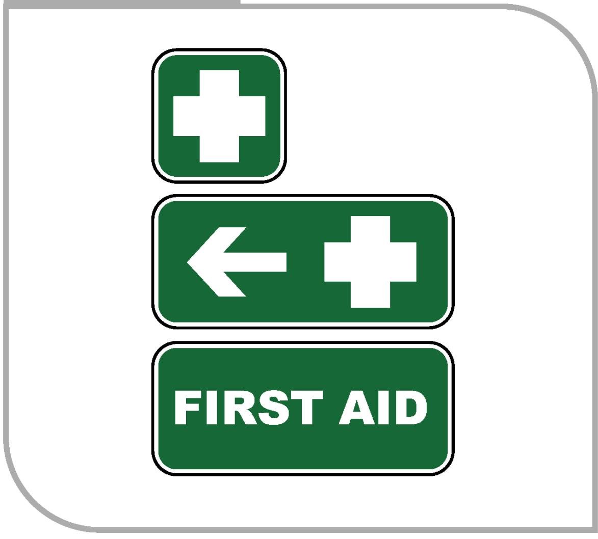
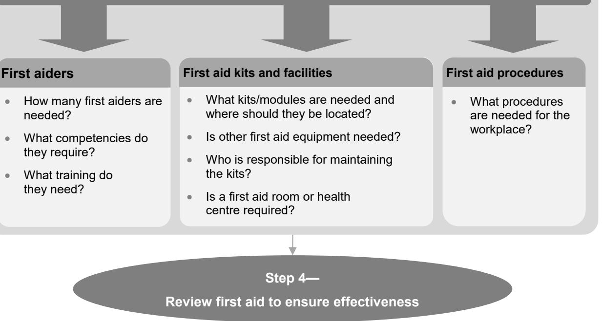

# First aid in the workplace 

Code of Practice
JULY 2019
# Disclaimer

Safe Work Australia is an Australian Government statutory body established in 2009. Safe Work Australia includes Members from the Commonwealth, and each state and territory, Members representing the interests of workers and Members representing the interests of employers.

Representing the interests of employers.

Safe Work Australia works with the Commonwealth, state and territory governments to improve work health and safety and workers' compensation arrangements. Safe Work Australia is a national policy body, not a regulator of work health and safety. The Commonwealth, states and territories have responsibility for regulating and enforcing work health and safety laws in their jurisdiction.

ISBN 978- 0- 642- 33347- 6 (PDF)

ISBN 978- 0- 642- 33348- 3 (DOCX)

# Creative Commons

This copyright work is licensed under a Creative Commons Attribution- Noncommercial 4.0 International licence. To view a copy of this licence, visit creativecommons.org/licenses In essence, you are free to copy, communicate and adapt the work for non- commercial purposes, as long as you attribute the work to Safe Work Australia and abide by the other licence terms.

Safe Work Australia | info@swa.gov.au | www.swa.gov.au

# Contents

Foreword 4

1. Introduction 5

1.1. Who has health and safety duties in relation to first aid? 5  1.2. What is required in providing first aid? 7

2. How to determine first aid requirements for your workplace 9

2.1. The nature of the work and workplace hazards 9  2.2. Size and location of the workplace 10  2.3. The number and composition of workers and others at the workplace 11

# 3. First aid equipment, facilities and training 12

3.1. First aid kits 12  3.2. First aid signs 13  3.3. Other first aid equipment 14  3.4. First aid facilities 15  3.5. First aiders 17  3.6. First aid procedures 18  3.7. Providing first aid information 20  3.8. Reviewing your first aid requirements 20

Appendix A- Glossary 22

Appendix B- First aid and the risk management process 25

Appendix C - Summary of recommended first aid requirements 26

Appendix D- Example of a first aid assessment 27 Nature of the work being carried out and the nature of the hazards at the workplace 28

Appendix E- Example of contents for first aid kits 30

Outdoor module 32 Remote module 32 Burn module 32

# Appendix F-Standard precautions for infection control 33

Providing first aid safely 33 Contaminated items 34 Cleaning spills 34

Amendments 35

# Foreword

This Code of Practice on first aid in the workplace is an approved code of practice under section 274 of the Work Health and Safety Act (the WHS Act).

An approved code of practice provides practical guidance on how to achieve the standards of work health and safety required under the WHS Act and the Work Health and Safety Regulations (the WHS Regulations) and effective ways to identify and manage risks.

A code of practice can assist anyone who has a duty of care in the circumstances described in the code of practice. Following an approved code of practice will assist duty holders to achieve compliance with the health and safety duties in the WHS Act and WHS Regulations, in relation to the subject matter of the code of practice. Like regulations, codes of practice deal with particular issues and may not cover all relevant hazards or risks. The health and safety duties require duty holders to consider all risks associated with work, not only those for which regulations and codes of practice exist.

Codes of practice are admissible in court proceedings under the WHS Act and WHS Regulations. Courts may regard a code of practice as evidence of what is known about a hazard, risk, risk assessment or risk control and may rely on the code in determining what is reasonably practicable in the circumstances to which the code of practice relates. For further information see the Interpretive Guideline: The meaning of 'reasonably practicable'.

Compliance with the WHS Act and WHS Regulations may be achieved by following another method if it provides an equivalent or higher standard of work health and safety than the code.

An inspector may refer to an approved code of practice when issuing an improvement or prohibition notice.

# Scope and application

This Code is intended to be read by a person conducting a business or undertaking (PCBU). It provides practical guidance to PCBUs on how to effectively provide first aid in the workplace. It includes information on first aid kits, procedures, facilities and training for first aiders.

This Code may be a useful reference for other persons interested in the duties under the WHS Act and WHS Regulations.

This Code applies to all types of work and all workplaces covered by the WHS Act.

# How to use this Code of Practice

This Code includes references to legal requirements under the WHS Act and WHS Regulations. These are included for convenience only and should not be relied on in place of the full text of the WHS Act or WHS Regulations. The words 'must', 'requires' or 'mandatory' indicate a legal requirement exists that must be complied with.

The word 'should' is used in this Code to indicate a recommended course of action, while 'may' is used to indicate an optional course of action.

# 1. Introduction

Providing immediate and effective first aid to workers or others who have been injured or become ill at the workplace may reduce the severity of the injury or illness. In some cases it could mean the difference between life and death.

# 1.1. Who has health and safety duties in relation to first aid?

Duty holders who have a role in first aid include:

persons conducting a business or undertaking (PCBUs) designers, manufacturers, importers, suppliers and installers of plant, substances or structures, and officers.

Workers and other persons at the workplace also have duties under the WHS Act, such as the duty to take reasonable care for their own health and safety at the workplace.

A person can have more than one duty and more than one person can have the same duty at the same time.

Early consultation and identification of risks can allow for more options to eliminate or minimise risks and reduce the associated costs.

# Person conducting a business or undertaking (PCBU)

PCBUs have the primary duty under the WHS Act. In general terms this duty requires PCBUs to ensure, so far as is reasonably practicable, that workers and other persons are not exposed to health and safety risks arising from the business or undertaking.

# WHS Regulation 42

Duty to provide first aid

A PCBU must ensure:

provision of first aid equipment each worker at the workplace has access to the equipment access to facilities for administering first aid, and an adequate number of workers are trained to administer first aid, or workers have access to an adequate number of other people who have been trained to administer first aid (see section 3.5 of this Code).

A PCBU may not need to provide first aid equipment or facilities if these are already provided by another duty holder at the workplace and they are adequate and easily accessible at the times the workers carry out work.

# Designers, manufacturers, importers and suppliers of plant, substances or structures

# WHS Act Part 2 Division 3

Further duties of persons conducting businesses or undertakings

Designers, manufacturers, importers and suppliers of plant or substances or structures used in the workplace must ensure, so far as is reasonably practicable, the plant, substance or structure they design, manufacture, import or supply is without risks to health and safety. This duty includes carrying out testing and analysis as well as providing specific information about the plant or substance.

To assist in meeting these duties, the WHS Regulations require:

- manufacturers to consult with designers of the plant- importers to consult with designers and manufacturers of plant, and- the person who commissions construction work to consult with the designer of the structure.

# Officers

# WHS Act section 27

Duty of officers

Officers, for example company directors, have a duty to exercise due diligence to ensure the PCBU complies with the WHS Act and WHS Regulations. This includes taking reasonable steps to ensure the business or undertaking has and uses appropriate processes for complying with the duty to provide first aid. Further information on who is an officer and their duties is available in the Interpretive Guideline: The health and safety duty of an officer under section 27.

# Workers

# WHS Act section 28

Duties of workers

Workers have a duty to take reasonable care for their own health and safety and to not adversely affect the health and safety of other persons. Workers must comply with reasonable instructions, as far as they are reasonably able, and cooperate with reasonable health and safety policies or procedures, that have been notified to workers, for example procedures for first aid and for reporting injuries and illnesses.

# Other persons in the workplace

# WHS Act section 29

Duties of other persons at the workplace

Other persons at the workplace, like visitors, must take reasonable care for their own health and safety and must take care not to adversely affect other people's health and safety. They must comply, so far as they are reasonably able, with reasonable instructions given by the PCBU to allow that person to comply with the WHS Act.

# 1.2. What is required in providing first aid?

First aid requirements will vary from one workplace to the next, depending on the nature of the work, the types of hazards, the workplace size and location, as well as the number of people at the workplace. These factors must be taken into account when deciding what first aid arrangements are provided.

This Code provides information on using a risk management approach to tailor first aid to suit the circumstances of your workplace, while also providing guidance on the number of first aid kits, their contents and the number of trained first aiders appropriate for some types of workplaces.

The risk management approach involves the following four steps, summarised in Appendix B:

1. identifying hazards that could result in work-related injury or illness  
2. assessing the type, severity and likelihood of injuries and illness  
3. providing the appropriate first aid equipment, facilities and training, and  
4. reviewing your first aid requirements on a regular basis or as circumstances change.

Guidance on the general risk management process is available in the Code of Practice: How to manage work health and safety risks.

# Consulting workers

# WHS Act section 47

Duty to consult workers

A PCBU must consult, so far as is reasonably practicable, with workers who carry out work for the business or undertaking and who are (or are likely to be) directly affected by a health and safety matter.

This duty to consult is based on the recognition that worker input and participation improves decision- making about health and safety matters.

The broad definition of a 'worker' under the WHS Act means a PCBU must consult, so far as is reasonably practicable, with contractors and subcontractors and their employees, on- hire workers, outworkers, apprentices, trainees, work experience students, volunteers and other people who are working for the PCBU and who are, or are likely to be, directly affected by a health and safety matter.

Workers are entitled to take part in consultations and to be represented in consultations by a health and safety representative who has been elected to represent their work group.

# WHS Act section 48

Nature of consultation

If the workers are represented by a health and safety representative, the consultation must involve that representative.

You must consult your workers when making decisions about what equipment and facilities are needed for administering first aid. Consultation should include:

- the number, location and contents of first aid kits and other equipment- the type of first aid facilities that may be needed- first aid procedures, and

# Consulting, cooperating and coordinating activities with other duty holders

# WHS Act section 46

Duty to consult with other duty holders

The WHS Act requires a PCBU to consult, cooperate and coordinate activities with all other persons who have a work health or safety duty in relation to the same matter, so far as is reasonably practicable.

There is often more than one business or undertaking with responsibility for the same health and safety matters, either because they are involved in the same activities or share the same workplace.

In these situations, each duty holder should exchange information to find out who is doing what and work together in a cooperative and coordinated way.

For example, if a PCBU provides labour hire workers as part of its business, both it and the host business have a duty of care. In these situations, the duty holder must discuss the hazards and risks associated with the work and ensure the host business has appropriate first aid arrangements the workers can access.

If the workplace is shared with other businesses that have first aiders, the PCBU may be able to ensure its workers have access to these first aiders instead of training their own workers. In these circumstances, it will be necessary to:

- cooperate with each other in sharing first aid equipment and facilities, and- coordinate access to the first aiders.

Further guidance on consultation is available in the Code of Practice: Work health and safety consultation, cooperation and coordination.

# 2. How to determine first aid requirements for your workplace

WHS Regulation 42(3) Duty to provide first aid

To meet your duty as a person conducting a business or undertaking (PCBU) to provide access to first aid equipment, facilities and trained first aiders you must have regard to all relevant matters, including the following:

the nature of the work being carried out at the workplace the nature of the hazards at the workplace the size and location of the workplace, and the number and composition of the workers and other persons at the workplace.

Appendix C summarises the requirements for first aid kits, first aiders and first aid rooms.

# 2.1. The nature of the work and workplace hazards

Certain work environments have greater risk of injury and illness due to the nature of work being carried out and the nature of the hazards at the workplace. For example, workers in factories, motor vehicle workshops and forestry operations are at greater risk of injury requiring immediate medical treatment than workers in offices or libraries. These workplaces will therefore require different first aid arrangements.

Table 1 Injuries associated with common workplace hazards that may require first aid  

<table><tr><td>Hazard</td><td>Potential harm</td></tr><tr><td>Manual tasks</td><td>Overexertion can cause muscular strain.</td></tr><tr><td>Working at height or on uneven or slippery surfaces</td><td>Slips, trips and falls can cause fractures, bruises, lacerations, dislocations, concussion.</td></tr><tr><td>Electricity</td><td>Potential ignition source—could cause injuries from fire. Exposure to live electrical wires can cause shock, burns and cardiac arrest.</td></tr><tr><td>Machinery and equipment</td><td>Being hit by moving vehicles, or being caught by moving parts of machinery can cause fractures, amputation, bruises, lacerations, dislocations.</td></tr><tr><td>Hazardous chemicals</td><td>Toxic or corrosive chemicals may be inhaled or may contact skin or eyes causing poisoning, chemical burns, irritation. 
Flammable chemicals could result in injuries from fire or explosion.</td></tr></table>

<table><tr><td>Hazard</td><td>Potential harm</td></tr><tr><td>Extreme temperatures</td><td>Hot surfaces and materials can cause burns.
Working in extreme heat can cause heat-related illness. It can also increase risks by reducing concentration and increasing fatigue and chemical uptake into the body.
Exposure to extreme cold can cause hypothermia and frostbite.</td></tr><tr><td>Radiation</td><td>Welding arc flashes, ionising radiation and lasers can cause burns.
Ultraviolet (UV) radiation from the sun can cause sunburn, skin cancers and eye damage.</td></tr><tr><td>Violence</td><td>Behaviours including intimidation and physical assault can cause both physical and psychological injuries.</td></tr><tr><td>Biological</td><td>Infection, allergic reactions</td></tr><tr><td>Animals</td><td>Bites, stings, kicks, crush injuries, scratches</td></tr></table>

Records of injuries, illnesses, 'near miss' incidents and other information will be useful when making decisions about first aid requirements.

You should check the safety data sheets (SDS) for hazardous chemicals handled, used or stored at your workplace. The SDS provides information about the chemical, possible health effects, controls that may be used to reduce exposure and first aid requirements.

Under the WHs Regulations suppliers of hazardous chemicals must provide the current SDS to a person at the workplace if the person asks for it.

# 2.2. Size and location of the workplace

In relation to the size and location of the workplace, you should take into account:

the distance between different work areas, and the response times for emergency services.

First aid equipment and facilities should be located at convenient points and in areas where there is a higher risk of an injury or illness occurring.

A large workplace may require first aid to be available in more than one location if:

work is being carried out a long distance from emergency services workers are dispersed over a wide area access to a part of the workplace is difficult, or the workplace has more than one floor level.

Where there are separate work areas, for example multiple buildings on a site or multiple floors in an office building, it may be appropriate to locate first aid facilities centrally and provide first aid kits in each work area. This may include portable first aid kits in motor vehicles and other separate work areas.

The distance of the workplace from ambulance services, hospital and medical centres should be taken into account when determining your first aid requirements. For example, if life- threatening injuries or illnesses could occur and timely access to emergency services cannot be assured, a person trained in more advanced first aid techniques, for example providing oxygen, should be considered.

Extra first aid considerations may be necessary for workers in remote or isolated areas. For example, where access is difficult due to travel time, poor roads or weather conditions, arrangements should include aerial evacuation.

In minimising the risks to health and safety associated with remote or isolated work, you must provide a safe system of work including effective communication with the worker. This will assist in enabling an immediate response in an emergency. Further guidance about working in remote or isolated areas is available in the Code of Practice: Managing the work environment and facilities.

# 2.3. The number and composition of workers and others at the workplace

When considering the size of your workforce, you should include contractors, subcontractors and volunteers you engage. This may mean the size of your workforce may vary over time. For the purposes of deciding who requires access to first aid, you should consider the maximum number of workers you may engage at one time. Generally, a larger workforce requires more first aid resources.

You should also consider:

- the particular needs of workers who have a disability or a known health concern for example asthma or allergies, and others at your workplace who are not your workers, for example:  
- students in schools and education facilities  
- clients under care, and  
- members of the public in places involving exercise, leisure and entertainment for example gyms, cinemas, fairgrounds and shopping centres.

Appendix D provides an example of how to determine first aid requirements.

# 3. First aid equipment, facilities and training

The information provided in this chapter may be used as a guide to determine the first aid equipment, facilities, first aiders and procedures that you as a person conducting a business or undertaking (PCBU), need to provide in various workplaces.

First aid equipment, facilities and first aiders must be accessible to workers whenever they work including those working night shifts or overtime.

Appendix C summarises the requirements for first aiders, first aid kits and first aid rooms.

# 3.1. First aid kits

All workers must be able to access a first aid kit. This will require at least one first aid kit to be provided at their workplace.

# Contents

The first aid kit should provide basic equipment for administering first aid for injuries including:

- cuts, scratches, punctures, grazes and splinters- muscular sprains and strains- minor burns- amputations and/or major bleeding wounds- broken bones- eye injuries, and- shock.

The contents of first aid kits should be based on a risk assessment. For example, there may be higher risk of eye injuries and a need for more eye pads in a workplace in which work involves machinery or chemicals. For example, where:

- chemical liquids or powders are handled in open containers- spraying, hosing or abrasive blasting operations are carried out- there is a possibility of flying particles causing eye injuries- there is a risk of splashing or spraying of infectious materials, or- welding, cutting or machining operations are carried out.

Extra equipment may be needed in remote workplaces, for example for serious burns, breathing difficulties or allergic reactions.

The recommended contents of a typical first aid kit and information on extra equipment is provided in Appendix E.

# Design of kits

First aid kits can be any size, shape or type to suit your workplace, but each kit should:

- be large enough to contain the necessary items- be immediately identifiable with a white cross on green background prominently displayed on the outside- contain a list of the contents for that kit, and

- be made of material that will protect the contents from dust, moisture and contamination.

# Location

In the event of a serious injury or illness, quick access to the kit is vital. First aid kits should be kept in a prominent, accessible location where they can be retrieved quickly. All workers must have access to first aid equipment including in security- controlled workplaces.

First aid kits should be located close to areas where there is a higher risk of injury or illness. For example, a school with a science laboratory or carpentry workshop should have first aid kits located in these areas. If the workplace occupies several floors in a multistorey building, at least one kit should be located on every second floor. Emergency floor plans displayed in the workplace should include the location of first aid kits.

A portable first aid kit should be provided in the vehicles of mobile workers if that is their workplace, for example couriers, taxi drivers, sales representatives, bus drivers and inspectors. These kits should be safely located so as not to become a projectile in a collision.

# Restocking and maintaining kits

A person in the workplace, usually a first aider, should be nominated to maintain the first aid kit and should:

- monitor usage of the first aid kit and ensure items used are replaced as soon as practicable after use- carry out regular checks, after each use or, if the kit is not used, at least once every 12 months, to ensure the kit contains a complete set of the required items. An inventory list in the kit should be signed and dated after each check, and- ensure items are in working order, have not deteriorated, are within their expiry dates and sterile products are sealed and have not been tampered with.

# 3.2. First aid signs

Displaying well- recognised first aid signs will assist in easily locating first aid equipment and facilities (see Figure 1 below). Further information on the design and use of signs is available in AS 1319- 1994: Safety Signs for the Occupational Environment.

FIGURE 1 first aid signs

  
Figure 1 First aid signs

# 3.3. Other first aid equipment

In addition to first aid kits, you should consider whether other first aid equipment is necessary to treat the injuries or illnesses that could occur as a result of a hazard at your workplace.

# Automated external defibrillators

Providing an automated external defibrillator (AED) can reduce the risk of fatality from cardiac arrest. While cardiopulmonary resuscitation (CPR) can prolong life, defibrillation is the only way to restore a heart with a fatal heart rhythm back to a normal heart rhythm.

You should consider providing an AED if there is a risk to workers at your workplace from electrocution, if there would be a delay in ambulance services arriving at the workplace, or where there are large numbers of members of the public.

AEDs are designed to be used by trained or untrained people. They provide audible step- by- step instruction on how to use them and how to perform CPR. They can detect whether they

have been applied correctly and will instruct whether defibrillation is appropriate. Most AEDs will also keep records once they are activated including some vital signs and whether shocks have been recommended and administered.

They should be located in an area clearly visible, accessible and not exposed to extreme temperatures. They should be clearly signed and maintained according to the manufacturer's specifications.

# Eye wash and shower equipment

Emergency eye wash equipment should be provided where there is a risk of hazardous chemicals or infectious substances causing eye injuries.

Immediate access should be provided to emergency shower equipment in workplaces where there is a risk of:

exposure to hazardous chemicals resulting in skin absorption or contamination from infectious substances, or serious burns to a large area of the face or body, including chemical or electrical burns or burns that are deep, in sensitive areas or larger than a 20 cent piece.

Shower facilities can consist of:

- a deluge facility- a permanently rigged hand-held shower hose, or- a portable plastic or rubber shower hose designed to be easily attached to a tap spout—for small, relatively low risk workplaces where a fixed deluge facility would not be reasonably practicable, but the risk of serious burns is still foreseeable, for example a fish and chip shop.

Eye wash and shower equipment may be permanently fixed or portable, depending on the workplace. Portable, self- contained eye wash or shower units have their own flushing fluid to flush chemicals, foreign objects or substances from the eyes or body. They need to be refilled or replaced after use.

Further guidance is available in AS 4775- 2007: Emergency eyewash and shower equipment.

# 3.4. First aid facilities

A risk assessment will help determine the type of first aid facilities needed. For example, a clean, quiet area within the workplace affording privacy to an injured or ill person may be suitable and practicable for some workplaces.

Access to a telephone for contacting emergency services or an emergency call system should be provided as part of first aid facilities.

# First aid rooms

A first aid room should be established at the workplace if a risk assessment indicates it would be difficult to administer first aid unless a first aid room is provided.

For example, workplaces where there is a higher risk of serious injury or illness occurring, requiring immediate first aid and possible further treatment by an emergency service, may benefit from having access to a dedicated first aid room.

A first aid room is recommended for:

- low risk workplaces with 200 workers or more, or- high risk workplaces with 100 workers or more.

The contents of a first aid room should suit the hazards specific to the workplace. The location and size of the room should allow easy access and movement of injured people, noting they may need to be supported or moved by stretcher or wheelchair.

The following items should be provided in the room:

- a first aid kit appropriate for the workplace- hygienic hand cleanser and disposable paper towels- an examination couch with waterproof surface and disposable sheets- an examination lamp with magnifier- a cupboard for storage- a container with disposable lining for soiled waste- a container for the safe disposal of sharps- a bowl or bucket, minimum 2 litres capacity- electric power points- a chair and a table or desk- a telephone and/or emergency call system, and- the names and contact details of first aiders and emergency organisations.

A first aid room should:

- be located within easy access to a sink with hot and cold water (where this is not provided in the room) and toilet facilities- offer privacy via screening or a door- be easily accessible to emergency services, with a minimum door width of 1 metre for stretcher access- be well lit and ventilated- have an appropriate floor area, 14 square metres as a guide, and- have an entrance that is clearly marked with first aid signage (see part 3.2 of this Code).

Maintaining a first aid room should be allocated to a trained first aider, except where this room is part of a health centre or hospital.

# Health centres

Health centres staffed by a registered health practitioner (a doctor or nurse) or paramedic can provide emergency medical treatment and cater to the types of hazards in high risk workplaces. A health centre may be established in the workplace, for example at a large mine site, or, if readily available, external emergency services may be used.

If a health centre is located at the workplace, the facility should:

- be self-contained- be located at ground level where possible in a quiet, clean area, a safe distance from hazardous operations and clear of general thoroughfares- be convenient and accessible to workers at the times they work and have an entrance clearly marked with health centre signage- have walls, floors and ceilings made of easy-to-clean impervious materials, and- have enough space to accommodate first aid equipment.

# 3.5. First aiders

# WHS Regulation 42(2)

Duty to provide first aid

As a PCBU you must ensure an adequate number of workers are trained to administer first aid at the workplace or workers have access to an adequate number of other people who have been trained to administer first aid.

First aid in the workplace can be provided in two ways:

1. training one or more of your own workers to administer first aid, or 
2. arranging for a person who does not work for you to administer first aid to your workers provided they have been trained to do so.

Through consultation with other duty holders, you may identify there are trained first aiders of other businesses who share your workplace, or other people who are qualified to administer first aid. You could seek to cooperate and coordinate with these other duty holders to ensure your workers have access to first aiders at the times when your workers carry out work, for example taking into account shiftwork and overtime.

If your first aiders move around the workplace during their shift you should ensure they are easy to locate and identify- for example on a construction site your first aiders could be identified by a high visibility vest of a particular colour or you could display a contact number for first aid in prominent locations.

# Types of first aid training

As a minimum first aiders should hold nationally recognised Statement/s of Attainment issued by a Registered Training Organisation (RTO) for the nationally endorsed first aid unit of competency Provide First Aid or a course providing equivalent skills. A higher level or additional training may be required to ensure your first aiders have appropriate skills for the risks you have identified in your workplace.

For example, additional training may be required where:

work is remote or isolated there are risks from dangerous substances such as cyanide or arsenic specialist first aid equipment or first aid room is installed in the workplace children are present in the workplace you have identified psychological risks, or workers have existing medical conditions which may require first aid.

Where workers or others at the workplace have known existing medical conditions, first aiders should be trained to respond to these conditions if the topic has not been covered in previous first aid training.

# Frequency of training for first aiders

First aiders should attend training on a regular basis to refresh their first aid knowledge and skills and to confirm their competence to provide first aid. Refresher training in CPR should be carried out annually and first aid qualifications should be renewed every three years.

# Number of trained first aiders

The following ratios are recommended:

low risk workplaces—one first aider for every 50 workers

- high risk workplaces—one first aider for every 25 workers- remote high risk workplaces—one first aider for every 10 workers.

The number and type of trained first aiders can be further refined by following the five- step guide below.

# Step 1:

Identify the maximum number of workers at the workplace at one time.

# Step 2:

Step 2:Consider the nature of the work being carried out at the workplace and determine if your workers are at high risk of being exposed to hazards requiring immediate first aid treatment.

# Step 3:

Step 3:Determine if the workplace is remote or if access to emergency services is difficult. High risk workplaces that do not have timely access to medical and ambulance services should have at least one first aider for every 10 workers.

# Step 4:

Consider the variety of ways your workers carry out work. For example, a worker may:

- spend most, if not all, of their time working alone or in transit, for example couriers, taxi drivers, sales representatives, door-to-door charity collectors and inspectors- work in a variety of locations on a regular basis and often work without supervision, for example tradespeople, construction workers in the housing industry, farmhands and cleaners- sometimes work alone for relatively short periods of time, for example when opening or closing a business for trade or working back late to meet a deadline.

In these situations it may not be practicable to have a first aider available at all times at the workplace. However, these workers must be able to access first aid assistance, for example by ensuring they are provided with:

- an effective means of accessing emergency services or first aiders, and- information, instruction and training on how to respond if a serious injury or illness occurs.

# Step 5:

Before finalising the number of first aiders your workers require access to, consider if there are other factors indicating your workplace needs more first aiders, for example:

- work arrangements, for example shiftwork or overtime- seasonal work, where there may be a sudden and significant increase or decrease in the number of workers- where there are large numbers of other people present on a regular basis, for example schools, shopping centres, hotels and function centres- workplaces with unique hazards, for example fitness centres, amusement rides and dive schools, and- access during times when a first aider is absent, for example on annual leave.

# 3.6. First aid procedures

You should develop and implement first aid procedures to ensure workers have a clear understanding of first aid in their workplace. The procedure should cover:

- the work areas and shifts allocated to each first aider, their names and contact details

- the types of first aid kits and where they are located- the location of first aid facilities like first aid rooms- who is responsible for the first aid kits and facilities and how frequently they should be checked and maintained- how to establish and maintain communication systems, including equipment and procedures, to ensure rapid emergency communication with first aiders and emergency services- the communication equipment and systems to be used when first aid is required, especially for remote and isolated workers. These procedures should contain information about how to locate the communication equipment, who is responsible for the equipment and how it should be maintained- arrangements to ensure first aiders receive appropriate training- arrangements for ensuring workers receive information, instruction and training for first aid- seeking information when a worker starts work about first aid needs requiring specific treatment in a medical emergency, for example asthma, diabetes, heart conditions or severe allergies. Information about a worker's health must be kept confidential and only provided to first aiders with the worker's consent- how to report injuries and illnesses occurring in the workplace- precautions to avoid exposure to blood and body substances. Refer to Appendix F- what to do when a worker or other person is too injured or ill to stay at work, for example if they require assistance with transport to a medical service, home or somewhere else where they can rest and recover, and- access to debriefing or counselling services to support first aiders and workers after a serious workplace incident.

# Record-keeping

A record of first aid treatment given should be kept by the first aider and reported to managers on a regular basis to assist reviewing first aid arrangements. First aid treatment records are subject to requirements under Health Records legislation. Further information is available from the Office of the Australian Information Commissioner.

# Procedures and plans for managing an emergency

# WHS Regulation 43(1)

Duty to prepare, maintain and implement emergency plan

You must ensure an emergency plan is prepared for the workplace, including:

- an effective response to an emergency- evacuation procedures- notifying emergency service organisations at the earliest opportunity- medical treatment and assistance, and- effective communication between the person you have authorised to coordinate the emergency response and all persons at the workplace.

You may incorporate your first aid procedures into your emergency planning procedures.

Emergency procedures should specify the role of first aiders according to their level of qualification and competence. In particular, first aiders should be instructed not to exceed their training and expertise in first aid. Other staff including supervisors should be instructed not to direct first aiders to exceed their first aid training and expertise.

Further guidance on emergency plans and preparing emergency procedures is available in the Code of Practice: Managing the work environment and facilities.

# 3.7. Providing first aid information

You must provide your workers with any information necessary to protect their health and safety while carrying out work. This should include information about where and how to access first aid so they know what to do and who to contact if they are sick or injured.

Information should be easy to understand, accessible and should take into account the language and literacy levels of your workers. Information may be given using verbal methods, for example explanations and demonstrations or visual methods, for example videos and posters.

The information and instruction on first aid should include:

the location of first aid equipment and facilities the names and location of people trained to administer first aid, and the procedures to be followed when first aid is required.

The information and instruction should be provided as part of workers' induction training and when there are changes, for example in the location of first aid facilities or in the names, locations or contact details of first aiders.

# 3.8. Reviewing your first aid requirements

As a person conducting a business or undertaking (PCBU), you should regularly review your first aid arrangements in consultation with your workers to ensure they remain adequate and effective.

Check the people who have responsibilities under your first aid procedures are familiar with them.

If the way work is performed is changed, or new work practices introduced, review your first aid against the new risk assessment to ensure the arrangements are still adequate.

Organise a mock first aid emergency to confirm first aid procedures are effective. Check kits and first aid rooms are easily accessible and suit the hazards unique to your workplace.

If an incident has occurred requiring first aid, evaluate the effectiveness of the first aid provided and make changes if necessary.

If new information is obtained about a previously unidentified hazard, review the first aid measures you have in place.

The questions in Table 2 can assist you to review first aid and assess whether improvement is needed.

Table 2 Questions to assist in reviewing first aid  

<table><tr><td>Question</td><td>Yes</td><td>No</td></tr><tr><td>Do all workers have access to first aiders and first aid kits?</td><td>□</td><td>□</td></tr></table>

<table><tr><td>Question</td><td>Yes</td><td>No</td></tr><tr><td>Are more first aid kits required?</td><td>□</td><td>□</td></tr><tr><td>Are more first aiders needed?</td><td>□</td><td>□</td></tr><tr><td>Do workers have access to first aiders at all times?</td><td>□</td><td>□</td></tr><tr><td>Do the first aid kits and modules suit the hazards at your workplace?</td><td>□</td><td>□</td></tr><tr><td>Are first aid kits well maintained and identifiable to workers?</td><td>□</td><td>□</td></tr><tr><td>Is a first aid room or health centre required?</td><td>□</td><td>□</td></tr><tr><td>Are first aid facilities well maintained?</td><td>□</td><td>□</td></tr><tr><td>Do first aiders have skills, training and competencies to provide first aid in your workplace and are their skills up to date?</td><td>□</td><td>□</td></tr><tr><td>Do workers know how to access first aid?</td><td>□</td><td>□</td></tr><tr><td>Is there easy access for emergency services, like parking for an ambulance?</td><td>□</td><td>□</td></tr></table>

# Appendix A-Glossary

<table><tr><td>Term</td><td>Description</td></tr><tr><td>Duty holder</td><td>Any person who owes a work health and safety duty under the WHS Act including a person conducting a business or undertaking, a designer, manufacturer, importer, supplier, installer of products or plant used at work (upstream duty holder), officer or a worker.</td></tr><tr><td>First aid</td><td>The immediate treatment or care given to a person suffering from an injury or illness until more advanced care is provided or the person recovers.</td></tr><tr><td>First aider</td><td>A person who has successfully completed a nationally accredited training course or an equivalent level of training that has given them the competencies required to administer first aid.</td></tr><tr><td>First aid equipment</td><td>Includes first aid kits and other equipment used to treat injuries and illnesses.</td></tr><tr><td>First aid facilities</td><td>Include first aid rooms, health centres, clean water supplies and other facilities needed for administering first aid.</td></tr><tr><td>Hazard</td><td>A situation or thing that has the potential to harm a person. Hazards at work may include: noisy machinery, a moving forklift, chemicals, electricity, working at heights, a repetitive job, bullying and violence at the workplace.</td></tr><tr><td>High risk workplace</td><td>A workplace where workers are exposed to hazards that could result in serious injury or illness and would require first aid. Examples of workplaces that may be considered high risk are ones in which workers:
  - use hazardous machinery, for example mobile plant, chainsaws, power presses and lathes
  - use hazardous substances, for example chemical manufacture, laboratories, horticulture, petrol stations and food manufacturing are at risk of falls that could result in serious injury, for example construction and stevedoring
  - carry out hazardous forms of work, for example, working in confined spaces, welding, demolition, electrical work and abrasive blasting
  - are exposed to the risk of physical violence, for example working alone at night, cash handling or having customers who are frequently physically aggressive, or
  - work in or around extreme heat or cold, for example, foundries and prolonged outdoor work in extreme temperatures.</td></tr><tr><td>Low risk workplace</td><td>A workplace where workers are less likely to be exposed to hazards that could result in serious injury or illness. For example, offices, shops and libraries. Work-related injuries and illnesses requiring first aid are likely to be minor in nature.</td></tr></table>

<table><tr><td>Term</td><td>Description</td></tr><tr><td>May</td><td>‘May’ indicates an optional course of action.</td></tr><tr><td>Module</td><td>An add-on to a standard first aid kit to address specific risks at a workplace.</td></tr><tr><td>Must</td><td>‘Must’ indicates a legal requirement exists that must be complied with.</td></tr><tr><td>Officer</td><td>An officer under the WHS Act includes:
– an officer under section 9 of the Corporations Act 2001 (Cth)
– an officer of the Crown within the meaning of section 247 of the WHS Act, and
– an officer of a public authority within the meaning of section 252 of the WHS Act.
A partner in a partnership or an elected member of a local authority is not an officer while acting in that capacity.</td></tr><tr><td>Person conducting a business or undertaking (PCBU)</td><td>A PCBU is an umbrella concept which intends to capture all types of working arrangements or relationships.
A PCBU includes a:
– company
– unincorporated body or association
– sole trader or self-employed person.
Individuals who are in a partnership that is conducting a business will individually and collectively be a PCBU.
A volunteer association (defined under the WHS Act, see below) or elected members of a local authority will not be a PCBU.</td></tr><tr><td>Remote</td><td>Remote or isolated work is work that is isolated from the assistance of other people because of the location, time or nature of the work being done. Assistance from other people includes rescue, medical assistance and emergency services.</td></tr><tr><td>Remote high risk workplace</td><td>A workplace that satisfies the definitions of being both a remote and a high risk workplace.</td></tr><tr><td>Risk</td><td>The possibility harm (death, injury or illness) might occur when exposed to a hazard.</td></tr><tr><td>Should</td><td>‘Should’ indicates a recommended course of action.</td></tr><tr><td>Volunteer association</td><td>A group of volunteers working together for one or more community purposes where none of the volunteers, whether alone or jointly with any other volunteers, employs any person to carry out work for the volunteer association.</td></tr></table>

<table><tr><td>Term</td><td>Description</td></tr><tr><td>Worker</td><td>Any person who carries out work for a person conducting a business or undertaking, including work as an employee, contractor or subcontractor (or their employee), self-employed person, outworker, apprentice or trainee, work experience student, employee of a labour hire company placed with a &#x27;host employer&#x27; or a volunteer.</td></tr><tr><td>Workplace</td><td>Any place where work is carried out for a business or undertaking and includes any place where a worker goes, or is likely to be, while at work. This may include offices, factories, shops, construction sites, vehicles, ships, aircraft or other mobile structures on land or water.</td></tr></table>

# Appendix B—First aid and the risk management process

# Step 1—Identify potential causes of workplace injury and illness

- Does the nature of the work being carried out pose a risk to people's health and safety?- Have these risks been identified in work that is being carried out?- Do any workers or others have pre-existing medical conditions?- Has incident, injury and illness data been reviewed?- Have you consulted with workers and their health and safety representatives?- Is specialist or external assistance required?

# Step 2-Assess the risk of workplace injury and illness

- How often does a risk have the potential to cause harm?- What types of injuries or illnesses would the risks cause?- How serious are the injuries or illnesseses?- Does the number and composition of workers and other people affect how first aid should be provided?- Could the size or location of the workplace affect how first aid is provided?

# Step 3—What first aid is required?

  
Figure 2 First aid and the risk management process

Appendix C - Summary of recommended first aid requirements  

<table><tr><td>Workplace</td><td>First aiders</td><td>First aid kits</td><td>First aid rooms</td></tr><tr><td>Low risk workplaces</td><td>One first aider for every 
50 workers</td><td>Basic first aid kit</td><td>Recommended for 200 workers or more</td></tr><tr><td>High risk workplaces</td><td>One first aider for every 
25 workers</td><td>Basic first aid kit plus additional equipment identified for specific risks</td><td>Recommended for 100 workers or more</td></tr><tr><td>Remote high risk workplaces</td><td>One first aider for every 
10 workers</td><td>In addition to the basic first aid kit
– a heavy duty 10 cm crepe bandage for snake bites
– large clean sheeting, for covering burns
– thermal blanket, for treating shock
– whistle for attracting attention
– torch/flashlight, and
– any equipment identified for specific risks.</td><td>NA</td></tr></table>

# Appendix D-Example of a first aid assessment

This assessment of first aid requirements is included as an example only. It does not reflect the consultative processes that must occur or detail the assessment of each identified hazard.

# ABC Company-Office and manufacturing operation

# The size and location of the workplace

<table><tr><td>Number of floors</td><td>2</td></tr><tr><td>Access between floors</td><td>Lifts and stairs</td></tr><tr><td>Nearest hospital</td><td>6 kilometres</td></tr><tr><td>Nearest medical or occupational health service</td><td>2 kilometres</td></tr><tr><td>Maximum time to medical service</td><td>15 minutes</td></tr><tr><td>The number and composition of the workers and other people at the workplace</td><td></td></tr><tr><td>Number of workers</td><td>80 (15 office/65 factory) per shift</td></tr><tr><td>Number of other people</td><td>2 to 5 visitors per day</td></tr><tr><td>Shifts</td><td>3</td></tr></table>

# ABC Company-Office and manufacturing operation

<table><tr><td>Overtime worked</td><td>Yes—regularly</td></tr><tr><td>Remote or isolated workers</td><td>None</td></tr><tr><td>Injuries, illnesses and incidents</td><td></td></tr><tr><td>Last 12 months claims data</td><td>- 5 × abrasions
- 3 × falls</td></tr><tr><td>Incidents not resulting in injury</td><td>Incident where a trolley carrying disinfectants overturned</td></tr><tr><td>Other</td><td>Worker handling a solvent reported symptoms of breathing difficulty, eye irritation and dizziness</td></tr></table>

# Nature of the work being carried out and the nature of the hazards at the workplace

<table><tr><td>Hazards</td><td>How the hazard could cause harm</td><td>Likelihood of occurrence and degree of harm</td><td>First aid implications</td></tr><tr><td>Hazardous chemicals: Solvents Disinfectants</td><td>Respiratory illnesses, for example an asthma emergency, cancers and dermatitis</td><td>Possible risk of daily exposure to hazardous chemicals for 2 cleaners. Good ventilation is provided. Protective equipment like gloves and aprons used by workers.</td><td>Safety data sheets and labels instruct to rinse cautiously with water for several minutes. Eye wash equipment required.</td></tr></table>

<table><tr><td>Hazards</td><td>How the hazard could cause harm</td><td>Likelihood of occurrence and degree of harm</td><td>First aid implications</td></tr><tr><td>Noise</td><td>Hearing damage</td><td>Possible risk of daily exposure to noise for 65 factory workers. Low noise emitting machines have been purchased. Protective equipment like ear plugs used by workers.</td><td>First aid only required in extreme situations.</td></tr><tr><td>Manual handling</td><td>Muscular strain</td><td>Low risk of daily exposure to manual handling risks. Mechanical aids, workstation alterations and systems of work significantly eliminate and minimise risk.</td><td>Possible strains and sprains requiring ice packs, slings and compression bandages.</td></tr></table>

# Required first aid

<table><tr><td>Number of first aiders needed</td><td>9—minimum three per shift, including one for the office and two for the factory</td></tr><tr><td>Training and competencies for first aiders</td><td>Provide First Aid: providing competencies to recognise and respond to common life-threatening injuries or illnesses using cardiopulmonary resuscitation (CPR) and other first aid procedures, and provide appropriate first aid for a range of injuries and illnesses.</td></tr><tr><td>Number and location of kits</td><td>Five kits: one on the office floor and four on the factory floor</td></tr><tr><td>Contents of first aid kits and modules</td><td>Standard workplace kit</td></tr><tr><td>Kit maintenance</td><td>Tasked to five first aiders, one kit each</td></tr><tr><td>Additional equipment</td><td>Emergency eye wash equipment</td></tr></table>

# Appendix E-Example of contents for first aid kits

For most workplaces, a first aid kit should include the following items.

<table><tr><td>Item</td><td>Quantity</td></tr><tr><td>Instructions for providing first aid—including cardiopulmonary resuscitation (CPR) flow chart</td><td>1</td></tr><tr><td>Note book and pen</td><td>1</td></tr><tr><td>Resuscitation face mask or face shield</td><td>1</td></tr><tr><td>Disposable nitrile examination gloves (nitrile is a latex-free rubber suitable for people with latex allergies)</td><td>5 pairs</td></tr><tr><td>Gauze pieces 7.5 x 7.5 cm, sterile 3 per pack</td><td>5 packs</td></tr><tr><td>Saline, 15 ml</td><td>8</td></tr><tr><td>Wound cleaning wipe, single 1% Cetrimide BP</td><td>10</td></tr><tr><td>Adhesive dressing strips—plastic or fabric, packet of 50</td><td>1</td></tr><tr><td>Splinter probes, single use, disposable</td><td>10</td></tr><tr><td>Tweezers/forceps</td><td>1</td></tr><tr><td>Antiseptic liquid/spray 50 ml</td><td>1</td></tr><tr><td>Non-adherent wound dressing/pad 5 x 5 cm (small)</td><td>6</td></tr><tr><td>Non-adherent wound dressing/pad 7.5 x 10 cm (medium)</td><td>3</td></tr><tr><td>Non-adherent wound dressing/pad 10 x 10 cm (large)</td><td>1</td></tr><tr><td>Conforming cotton bandage, 5 cm width</td><td>3</td></tr><tr><td>Conforming cotton bandage, 7.5 cm width</td><td>3</td></tr></table>

<table><tr><td>Item</td><td>Quantity</td></tr><tr><td>Crepe bandage, 10 cm, for serious bleeding and pressure application</td><td>1</td></tr><tr><td>Scissors</td><td>1</td></tr><tr><td>Non-stretch, hypoallergenic adhesive tape—2.5 cm wide roll</td><td>1</td></tr><tr><td>Safety pins, packet of 6</td><td>1</td></tr><tr><td>BPC wound dressings No. 14, medium</td><td>1</td></tr><tr><td>BPC wound dressings No. 15, large</td><td>1</td></tr><tr><td>Dressing—Combine Pad 9 x 20 cm</td><td>1</td></tr><tr><td>Plastic bags—clip seal</td><td>1</td></tr><tr><td>Triangular bandage, calico or cotton minimum width 90 cm</td><td>2</td></tr><tr><td>Emergency rescue blanket for shock or hypothermia</td><td>1</td></tr><tr><td>Eye pad, single use</td><td>4</td></tr><tr><td>Access to 20 minutes of clean running water or, if this is not available, hydrogel 3.5 gm sachets</td><td>5 sachets</td></tr><tr><td>Instant ice pack for treatment of soft tissue injuries and some stings</td><td>1</td></tr></table>

Medication including analgesics like paracetamol and aspirin should not be included in first aid kits because of their potential to cause adverse health effects in some people including pregnant women and people with medical conditions like asthma. The supply of these medications may also be controlled by drugs and poisons laws. Workers requiring prescribed and over- the- counter medications should carry their own medication for their personal use as necessary.

However, workplaces may consider including an asthma- relieving inhaler and a spacer to treat asthma attacks and epinephrine auto- injector for the treatment of anaphylaxis or severe allergies. These should be stored according to the manufacturers' instructions and first aiders should be provided with appropriate training.

Some types of workplaces may require extra items to treat specific types of injuries or illnesses. These may also require your first aiders to have additional training.

# Outdoor module

If work is performed outside and there is a risk of insect or plant stings or snake bites, assess whether a first aid kit should include:

a heavy duty 10 cm crepe bandage for snake bites sting relief cream, gel or spray.

# Remote module

Where people work in remote locations, a first aid kit should include:

a heavy duty 10 cm crepe bandage for snake bites large clean sheeting, for covering burns thermal blanket, for treating shock whistle, for attracting attention, and torch/flashlight.

The appropriate contents will vary according to the nature of the work and its associated risks.

# Burn module

If workers are at risk of receiving burns, a first aid kit should include:

burn treatment instructions on two waterproof instruction cards: one for the first aid kit and the other to be located on the wall next to the emergency shower or water supply hydrogel,  $8\times 3.5$  gram sachets hydrogel dressings clean polythene sheets, small, medium and large, and 7.5 cm cotton conforming bandage.

# Appendix F—Standard precautions for infection control

When providing first aid to an injured or ill person, first aiders could come into contact with blood or body substances. These can transfer infections to the first aider or other people they treat.

First aiders should assume they could be exposed to infection and take standard precautions when exposed to blood and body substances to protect themselves and others from infection risk. Standard precautions are work practices applied to all patients and their blood and body substances, regardless of their infectious status, to ensure a basic level of infection prevention and control. Standard precautions include hand hygiene, use of personal protective equipment (PPE), handling and disposal of sharps and waste, cleaning techniques and managing spills of blood and body substances.

# Providing first aid safely

First aiders should wash their hands with soap and water or apply alcohol- based hand rub before and after administering first aid. First aiders should also wear PPE, including disposable gloves, to prevent contact with blood and body substances. Eye protection, a mask and protective clothing may also be necessary if splashes of blood or body substances are likely to occur.

You should establish procedures to protect first aiders and others from infection risk from the provision of first aid and contact with blood or body substances. Procedures could include:

- proper hand hygiene practices- how to handle and dispose of sharps- how to clean surfaces and reusable equipment- how to manage spills and soiled laundry- how to handle and dispose of waste, and- when to use PPE, for example using resuscitation masks for cardiopulmonary resuscitation (CPR).

First aiders should be aware of what to do if they have accidental contact with blood or body substances, a sharps injury or contact with a person known to have a contagious illness. Any part of the body that comes in contact with blood or body substances should be washed with soap and water immediately. Prompt medical advice should be obtained.

Where there is a risk of disease, first aiders should be offered vaccinations in line with the Department of Health Australian Immunisation Handbook.

# Contaminated items

Items soiled with blood or body substances should be placed in plastic bags and tied securely. Waste disposal must comply with state or local government requirements.

Sharps including needles, syringes and disposable probes should be disposed of in a rigidwalled, puncture- resistant sharps container by the person who used them. Guidance on the design, construction, colour and markings of sharps containers is provided in:

AS 4031- 1992: Non- reusable containers for the collection of sharp medical items used in health care areas AS/NZS 4261- 1994: Reusable containers for the collection of sharp items used in human and animal medical applications.

Reusable items contaminated with blood and body substances should be washed and disinfected by a competent person or disposed of safely.

If a first aider sustains a sharps injury or thinks they are at risk of infection from blood or body substances, they should seek prompt medical advice.

# Cleaning spills

Cleaning spillsCleaning should start as soon as possible after an incident involving blood or body substances. First aiders should wear disposable gloves when cleaning spills and if splashes of blood or body substances may occur, extra protective equipment like eye protection, plastic aprons and masks should be worn. Surfaces contaminated with blood or body substances should be wiped with paper towelling and cleaned with warm soapy water. It is generally unnecessary to use sodium hypochlorite (chlorine bleach) for managing spills but it may be used in specific circumstances, for example if the surface is hard to clean.

# Amendments

This model Code of Practice: First aid in the workplace was first published in July 2012. This Code has since been amended to include:

Technical and usability amendments. Updated guidance on selecting first aid courses in part 3.5.

The current version, dated July 2019, incorporates all of those amendments.