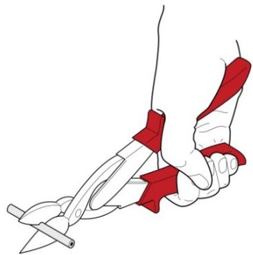
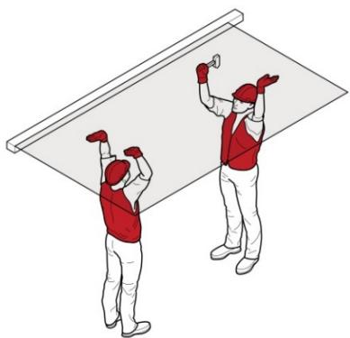
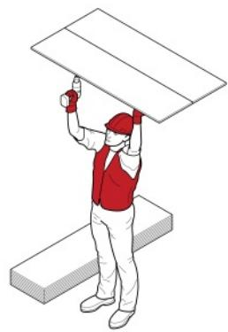
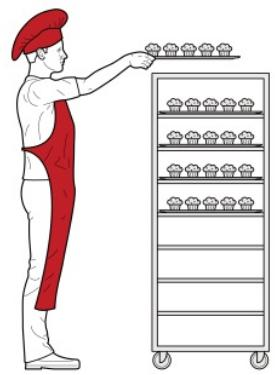
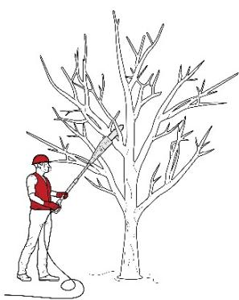
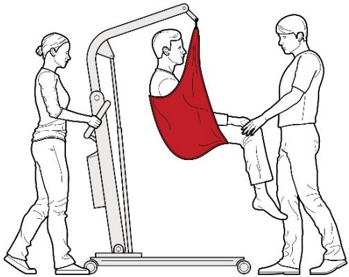
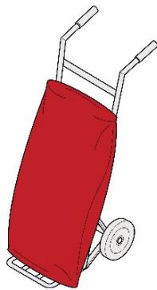

# Hazardous manual tasks

Code of Practice

# Disclaimer

Safe Work Australia is an Australian Government statutory agency established in 2009. Safe Work Australia includes Members from the Commonwealth, and each state and territory, Members representing the interests of workers and Members representing the interests of employers.

Safe Work Australia works with the Commonwealth, state and territory governments to improve work health and safety and workers' compensation arrangements. Safe Work Australia is a national policy body, not a regulator of work health and safety. The Commonwealth, states and territories have responsibility for regulating and enforcing work health and safety laws in their jurisdiction.

ISBN 978- 0- 642- 33307- 0 (PDF)  ISBN 978- 0- 642- 33308- 7 (DOCX)

# Creative Commons

This copyright work is licensed under a Creative Commons Attribution- Noncommercial 4.0 International licence. To view a copy of this licence, visit creativecommons.org/licenses. In essence, you are free to copy, communicate and adapt the work for noncommercial purposes, as long as you attribute the work to Safe Work Australia and abide by the other licence terms.

# Contact information

Safe Work Australia | info@swa.gov.au | www.swa.gov.au

# Contents

Foreword 4

1. Introduction 5

1.1. What is a musculoskeletal disorder (MSD)? 5  1.2. What is a hazardous manual task? 5  1.3. Who has health and safety duties in relation to hazardous manual tasks? 6  1.4. What is involved in managing the risk of musculoskeletal disorders? 7

2. Identifying hazardous manual tasks 11

2.1. How to identify hazardous manual tasks 11  2.2. Characteristics of hazardous manual tasks 12

# 3. Assessing the risks 19

3.1. When should a risk assessment be conducted? 19  3.2. How to do a risk assessment for hazardous manual tasks 19  3.3. What are the risk factors? 20  3.4. What are the sources of the risk? 27

# 4. Controlling the risks 31

4.1. The hierarchy of control measures 31  4.2. Purchasing to eliminate or minimise risks 33  4.3. Changing the design or layout of work areas 34  4.4. Changing the nature, size, weight or number of items handled 36  4.5. Changing the system of work 42  4.6. Changing the work environment 44  4.7. Using administrative control measures 46  4.8. Implementing control measures 47

5. Reviewing control measures 49

6. Role of designers, manufacturers, importers and suppliers 51

6.1. Designers 51  6.2. Manufacturers, importers and suppliers 52

# Appendix A—Glossary 55

Appendix B—Examples of controlling MSD risks through design 57  Appendix C—The risk management process for manual tasks 59  Appendix D—Hazardous manual task identification worksheet 60  Appendix E—Discomfort survey 61  Appendix F—Risk assessment worksheet 62  Appendix G—References for further risk assessment methods 69  Amendments 71

# Foreword

This Code of Practice on how to manage the risks associated with hazardous manual tasks and control the risks of workers being affected by musculoskeletal disorders is an approved code of practice under section 274 of the Work Health and Safety Act (the WHS Act).

An approved code of practice provides practical guidance on how to achieve the standards of work health and safety required under the WHS Act and the Work Health and Safety Regulations (the WHS Regulations) and effective ways to identify and manage risks.

A code of practice can assist anyone who has a duty of care in the circumstances described in the code of practice. Following an approved code of practice will assist the duty holder to achieve compliance with the health and safety duties in the WHS Act and WHS Regulations, in relation to the subject matter of the code of practice. Like regulations, codes of practice deal with particular issues and may not cover all relevant hazards or risks. The health and safety duties require duty holders to consider all risks associated with work, not only those for which regulations and codes of practice exist.

Codes of practice are admissible in court proceedings under the WHS Act and WHS Regulations. Courts may regard a code of practice as evidence of what is known about a hazard, risk, risk assessment or risk control and may rely on the code in determining what is reasonably practicable in the circumstances to which the code of practice relates. For further information see the Interpretive Guideline: The meaning of 'reasonably practicable'.

Compliance with the WHs Act and WHS Regulations may be achieved by following another method if it provides an equivalent or higher standard of work health and safety than the code.

An inspector may refer to an approved code of practice when issuing an improvement or prohibition notice.

# Scope and application

This Code is intended to be read by a person conducting a business or undertaking (PCBU). It provides practical guidance to PCBUs on how to manage health and safety risks associated with musculoskeletal disorders arising from hazardous manual tasks in the workplace.

This Code may be a useful reference for other persons interested in the duties under the WHS Act and WHS Regulations.

This Code applies to all workplaces covered by the WHS Act where hazardous manual tasks are carried out.

# How to use this Code of Practice

This Code includes references to the legal requirements under the WHS Act and WHS Regulations. These are included for convenience only and should not be relied on in place of the full text of the WHS Act or WHS Regulations. The words 'must', 'requires' or 'mandatory' indicate a legal requirement exists and must be complied with.

The word 'should' is used in this Code to indicate a recommended course of action, while 'may' is used to indicate an optional course of action.

# 1. Introduction

Most jobs involve carrying out some type of manual task using the body to move or hold objects, people or animals. Manual tasks cover a wide range of activities including stacking shelves, working on a conveyor line and entering data into a computer.

Some manual tasks are hazardous and may cause musculoskeletal disorders (MSD). These are the most common workplace injuries across Australia.

# 1.1. What is a musculoskeletal disorder (MSD)?

The term MSD' refers to an injury to, or a disease of, the musculoskeletal system, whether occurring suddenly or over time. It does not include an injury caused by crushing, entrapment or cutting resulting from the mechanical operation of plant.

An MSD may include:

sprains and strains of muscles, ligaments and tendons back injuries, including damage to the muscles, tendons, ligaments, spinal discs, nerves, joints and bones joint and bone injuries or degeneration, including injuries to the shoulder, elbow, wrist, hip, knee, ankle, hands and feet nerve injuries or compression, for example carpal tunnel syndrome muscular and vascular disorders as a result of hand- arm vibration soft tissue injuries including hernias, and chronic pain.

An MSD can occur in two ways:

gradual wear and tear to joints, ligaments, muscles and inter- vertebral discs caused by repeated or continuous use of the same body parts, including static body positions, or sudden damage caused by strenuous activity, or unexpected movements such as when loads being handled move or change position suddenly.

Injuries can also occur due to a combination of the above mechanisms.

# 1.2. What is a hazardous manual task?

A hazardous manual task is a task requiring a person to lift, lower, push, pull, carry or otherwise move, hold or restrain any person, animal or thing involving one or more of the following:

repetitive or sustained force high or sudden force repetitive movement sustained or awkward posture, or exposure to vibration.

These hazards directly stress the body and can lead to an injury.

# 1.3. Who has health and safety duties in relation to hazardous manual tasks?

Duty holders who have a role in managing the risks of hazardous manual tasks include:

persons conducting a business or undertaking (PCBUs) designers, manufacturers, importers, suppliers and installers of plant, substances or structures, and officers.

Workers and other persons at the workplace also have duties under the WHs Act, such as the duty to take reasonable care for their own health and safety at the workplace. A person can have many more than one duty and more than one person can have the same duty at the same time. Early consultation and identification of risks can allow for more options to eliminate or minimise risks and reduce the associated costs.

# Person conducting a business or undertaking

# WHS Act section 19

Primary duty of care

A PCBU must eliminate risks arising from hazardous manual tasks, or if that is not reasonably practicable, minimise the risks so far as is reasonably practicable.

The WHS Regulations include more specific requirements for PCBUs to manage the risks of a musculoskeletal disorder associated with a hazardous manual task.

PCBUs have a duty to consult workers about work health and safety and may also have duties to consult, cooperate and coordinate with other duty holders.

Designers, manufacturers, importers, installers and suppliers of plant, substances and structures

# WHS Act Part 2 Division 3

Further duties of persons conducting businesses or undertakings

Designers, manufacturers, importers, installers and suppliers of plant, substances and structures that are likely to be handled or used during or as part of a manual task have an important role in eliminating or minimising the risks of MSDs, which are often associated with the poor design and layout of work areas as well as the design of equipment, tools, packaging and materials. They have duties related to ensuring, so far as is reasonably practicable, the plant or structure they design, manufacture, import or supply is without risks to health and safety. See Chapter 6 of this Code for further guidance. This duty includes carrying out testing and analysis as well as providing specific information about the plant or structure.

To assist in meeting these duties, the WHS Regulations require:

designers and manufacturers to provide information to each person who is provided with the design, plant or structure about the features of the plant or structure that eliminate or minimise the need for any hazardous manual task importers and suppliers to take all reasonable steps to obtain that information, and

- importers and suppliers to give that information to any person to whom they supply the plant or structure.

# Officers

# WHS Act section 27

Duty of officers

Officers, for example company directors, have a duty to exercise due diligence to ensure the PCBU complies with the WHS Act and WHS Regulations. This includes taking reasonable steps to ensure that the business or undertaking has and uses appropriate resources and processes to eliminate or minimise risks from hazardous manual tasks. Further information on who is an officer and their duties is available in the Interpretive Guideline: The health and safety duty of an officer under section 27.

# Workers

# WHS Act section 28

Duties of workers

Workers have a duty to take reasonable care for their own health and safety and to not adversely affect the health and safety of other persons. Workers must comply with any reasonable instructions, as far as they are reasonably able, and cooperate with any reasonable health and safety policies or procedures that have been notified to workers. If personal protective equipment (PPE) is provided by the business or undertaking, the worker must, so far as they are reasonably able, use or wear it in accordance with the information and instruction and training provided.

Other persons at the workplace

# WHS Act section 29

Duties of other persons at the workplace

Other persons at the workplace, like visitors, must take reasonable care for their own health and safety and must take care not to adversely affect other people's health and safety. They must comply, so far as they are reasonably able, with reasonable instructions given by the PCBU to allow that person to comply with the WHS Act.

# 1.4. What is involved in managing the risk of musculoskeletal disorders?

# WHS Regulation 60

Managing risks to health and safety

WHS Regulations Part 3.1

Managing Risks to Health and Safety

A PCBU must manage risks to health and safety relating to a musculoskeletal disorder associated with a hazardous manual task.

In order to manage risk under the WHS Regulations, a duty holder must:

- identify reasonably foreseeable hazards that could give rise to the risk- eliminate the risk, so far as is reasonably practicable- if it is not reasonably practicable to eliminate the risk 
- minimise the risk so far as is reasonably practicable by implementing control measures in accordance with the hierarchy of control measures- maintain the implemented control measure so it remains effective, and- review, and if necessary revise, risk control measures so as to maintain, so far as is reasonably practicable, a work environment that is without risks to health and safety.

This Code provides guidance on how to manage the risks associated with hazardous manual tasks that have the potential to cause an MSD in the workplace using the following systematic process:

- Identify hazardous manual tasks--find out what could cause harm.- Assess risks, if necessary--understand the nature of the harm that could be caused by the hazard, how serious the harm could be and the likelihood of it happening. This step may not be necessary if you are dealing with a known risk with known controls.- Eliminate risks so far as is reasonably practicable.- Control risks--if it is not reasonably practicable to eliminate the risk, implement the most effective control measures that are reasonably practicable in the circumstances in accordance with the hierarchy of control measures, and ensure they remain effective over time.- Review control measures to ensure they are working as planned.

A summary of this process in relation to manual tasks is at Appendix C. Further guidance on the risk management process is available in the Code of Practice: How to manage work health and safety risks.

# Consulting workers

# WHS Act section 47

Duty to consult workers

# WHS Act section 48

Nature of consultations

A PCBU must consult, so far as is reasonably practicable, with workers who carry out work for the business or undertaking and who are (or are likely to be) directly affected by a work health and safety matter.

This duty to consult is based on the recognition that worker input and participation improves decision- making about health and safety matters and assists in reducing work- related injuries and disease.

The broad definition of a 'worker' under the WHS Act means a PCBU must consult, so far as is reasonably practicable, with contractors and subcontractors and their employees, on- hire workers, outworkers, apprentices, trainees, work experience students, volunteers and other people who are working for the PCBU and who are, or are likely to be, directly affected by a health and safety matter.

Workers are entitled to take part in consultations and to be represented by a health and safety representative who has been elected to represent their work group.

Consultation involves sharing of information, giving workers a reasonable opportunity to express views and contribute to the decision- making process, taking those views into account before making decisions on health and safety matters, and advising workers of the outcome.

Consultation with workers and their health and safety representatives is necessary at each step of the risk management process. Your workers know which tools and activities contribute to their discomfort and may have practical suggestions or potential solutions.

It is important to consult your workers as early as possible when planning to:

introduce new tasks or change existing tasks select new equipment refurbish, renovate or redesign existing workplaces, or carry out work in new environments.

Consultation should include encouraging workers to share their knowledge and experience of techniques and technologies which may better manage risks.

You should also encourage your workers to report problems with manual tasks and signs of discomfort immediately so that risks can be managed before an injury occurs.

Consulting, cooperating and coordinating activities with other duty holders

# WHS Act section 46

Duty to consult with other duty holders

The WHS Act requires a PCBU to consult, cooperate and coordinate activities with all other persons who have a work health or safety duty in relation to the same matter, so far as is reasonably practicable.

Sometimes you may share responsibility for a health and safety matter with other business operators who may be involved in the same activities or who share the same workplace. In these situations each duty holder must, so far as is reasonably practicable, exchange information to find out who is doing what and work together in a cooperative and coordinated way so that risks are eliminated or minimised.

For example, if a supplier visits your workplace to deliver goods, you must consult so far as is reasonably practicable with the supplier about health and safety issues for both your workers and the supplier's workers. For example, you may need to discuss how the goods will be handled at your workplace, whether there are any environmental or other factors that may increase the risk, like using a flight of stairs while handling large boxes, and what you will each do to control any risk of injury.

Further guidance is available in the Code of Practice: Work health and safety consultation, cooperation and coordination.

Information, training, instruction and supervision

# WHS Act section 19

Primary duty of care

# WHS Regulation 39

Provision of information, training and instruction

The WHS Act requires that a PCBU ensure, so far as is reasonably practicable, the provision of any information, training, instruction or supervision that is necessary to protect all persons from risks to their health and safety arising from work carried out as part of the conduct of the business or undertaking.

The PCBU must ensure that information, training or instruction provided to a worker is suitable and adequate having regard to:

- the nature of the work carried out by the worker- the nature of the risks associated with the work at the time of the information, training and instruction, and- the control measures implemented.

The PCBU must also ensure, so far as is reasonably practicable, that the information, training and instruction are provided in a way that is readily understandable for the person to whom it is provided.

Workers must be trained and have the appropriate skills to carry out a particular task safely. Training should be provided to workers by a competent person.

Information, training and instruction provided to workers who carry out hazardous manual tasks must include the proper use, wearing, storage and maintenance of PPE.

In addition to the PCBU's general duty to provide any supervision necessary to protect all persons from work health and safety risks, the WHS Regulations also impose specific duties to provide supervision necessary to protect a worker from risks to health and safety in certain circumstances.

# 2. Identifying hazardous manual tasks

The first step in the risk management process is to identify all hazardous manual tasks. This involves finding all relevant things and situations that may contribute to an MSD. Hazards generally arise from the following aspects of work and their interaction:

work tasks and how they are performed work design and management the tools, equipment and objects handled, or physical work environment

Hazards may be identified by looking at the workplace and how work is carried out. It is also useful to talk to workers, manufacturers, suppliers and health and safety specialists and review relevant information, records and incident reports.

# 2.1. How to identify hazardous manual tasks

# Consult your workers

As a person conducting a business or undertaking (PCBU), you must consult with your workers when identifying hazards to health and safety arising from the work they carry out or are going to carry out. Workers who perform manual tasks can provide valuable information about discomfort or muscular aches and pains they experience in performing particular tasks. This information can signal potential hazards. Consultation with workers, and their health and safety representatives, allows you to draw on the experience of all workers. For example, you could ask workers to identify tasks that:

are difficult to do or complete, appearing harder than they should be cause muscle fatigue, increasing the risk of injury and reducing work capacity involve awkward positions or movements or difficulty in controlling the load, or cause discomfort.

A discomfort survey that may be used is at Appendix E.

# Review available information

Records of workplace injuries and incidents, inspection reports, sick leave, worker complaints and any workers compensation claims made for an MSD should be reviewed to help identify which manual tasks may cause harm. However, not all hazardous manual tasks will be associated with reported incidents, so it is important to gather additional information.

Information and advice about hazardous manual tasks and risks relevant to particular industries and work activities are available from regulators, industry associations, unions, technical specialists, similar workplaces and safety consultants.

Information from designers, manufacturers, importers and suppliers of plant or structures can provide information about safety precautions which may help to eliminate or minimise risks.

# Look for trends

Look for trendsYou may be able to identify trends from the information you collect. Trends may show certain tasks have more hazards associated with them, or some hazards are more common in certain jobs. Trends may show workers in a particular location are exposed to more

hazardous manual tasks than in other areas, which may indicate a problem with the design and layout of that work area or the way work is carried out there.These trends may help in deciding which manual tasks should be addressed as a priority.

These trends may help in deciding which manual tasks should be addressed as a priority.

# Observe manual tasks

Hazardous manual tasks can also be identified by looking at how people actually work. A manual task is hazardous if it involves any of the following characteristics, described further in section 2.2 below:

repetitive or sustained force high or sudden force repetitive movement sustained and/or awkward posture, or exposure to vibration.

Things to look out for include:

any changes resulting in new manual tasks or a changed environment tasks involving tools, machinery or equipment that does not work properly or is difficult to use, and tasks where workers have made improvisations to avoid discomfort, like stacking mats or flattened cartons to stand on.

When hazards interact the associated risk can change. You should consider the cumulative effect of all hazards a worker is exposed to. For example, static posture combined with repetitive movement could increase the risk of a musculoskeletal injury.

The hazard identification worksheet in Appendix D may be used to record your findings.

# 2.2. Characteristics of hazardous manual tasks

# Forces

The term 'force' is used here to describe the amount of muscular effort required to perform a movement or task. Forceful muscular exertions overload muscles, tendons, joints and discs and are associated with most MSDs.

Repetitive force- - using force repeatedly over a period of time

Examples of repetitive force include:

lifting and stacking goods onto a pallet gripping and handling bricks when bricklaying (Figure 1) repetitively pressing components with the thumbs or other part of the hand to assemble an item cleaning and preparing surgical equipment prolonged application of therapeutic massage treatments, and removing splinting material from patients using shears.

  
Figure 1

Sustained force- - occurs when force is applied continually over a period of time

Examples of sustained force include:

pushing or pulling a trolley around hospital wards (Figure 2) holding down a trigger to operate a power tool supporting a plaster sheet while fixing it to a ceiling carrying objects over long distances, and supporting, positioning or stabilising a patient's limb during surgery or when applying splinting or casting material.

  
Figure 2

High force- - occurs when increased muscle effort is required in response to a task. It may be from the back, arm or leg muscles or by the hands and fingers.High

High force occurs in any task that:

a worker describes as very demanding physically a worker needs help to complete because a greater force is required requires a stronger person or two people to complete.

Examples of high force include:

lifting, lowering or carrying a heavy object lifting, lowering or carrying an object that cannot be positioned close to the body pushing or pulling an object that is hard to move or stop (Figure 3) applying uneven, fast or jerky forces during lifting, carrying, pushing or pulling applying sudden or unexpected forces, and restraining a person or animal.

  
Figure 3

Examples of high force using the hands and fingers include:

- using a finger-grip, a pinch-grip or an open-handed grip to handle a heavy or large load- operating hand tools with tight squeeze grips (Figure 4)- needing to use two hands to operate a tool, and- gripping small instruments with high force, for example by a dental hygienist cleaning teeth.

  
Figure 4

Sudden force—jerky or unexpected movements while handling an item or load. These movements are particularly hazardous because the body must suddenly adapt to the changing force.

Tasks where force is applied suddenly and with speed also generate high force.

Examples of sudden force include:

- impact recoil of a large nail gun- throwing or catching objects (Figure 5)- cutting reinforcement steel with large bolt cutters- carrying an unbalanced or unstable load, such as bagged stock feed pellets, that suddenly moves- handling frightened or resistant animals, and- handling patients who suddenly resist or no longer assist during the handling procedure.

  
Figure 5

# Movement

Repetitive movement- - using the same parts of the body to repeat similar movements over a period of time

Examples of repetitive movement include:

painting lifting goods from a conveyor belt and packing them in a carton typing and other keyboard tasks (Figure 6) repeatedly reaching for and assembling components in electronics manufacturing, and using a socket and ratchet or spanner to unscrew long bolts.

  
Figure 6

# Posture

An ideal posture is one where the body is in a neutral position (Figure 7) with the:

- trunk and head upright and forward facing- arms by the side of the body- forearms either hanging straight or at right angles to the upper arm, and- hands in the handshake position.

Postures that are both awkward and sustained are particularly hazardous.

Note: no one posture is suitable for all tasks or positions.

  
Figure 7

Sustained posture—where part of or the whole body is kept in the same position for a prolonged period

Examples of sustained posture include:

- supporting plasterboard sheeting while it is nailed into place (Figure 8)- continually standing with weight mainly on one leg while operating a power press with foot pedal controls, and- prolonged sitting at a workstation.

  
Figure 8

Awkward posture—where any part of the body is in an uncomfortable or unnatural position, for example:

- unbalanced or asymmetrical postures, or- postures requiring extreme joint angles or bending and twisting.

Examples of awkward posture include:

- squatting while servicing plant or a vehicle- working with arms overhead- bending over a desk or table- using a hand tool that causes the wrist to be bent to the side- kneeling while trowelling concrete or laying carpet, and- bending the neck or back to the side to see around bulky items pushed on a trolley (Figure 9).

  
Figure 9

# Vibration

Whole body vibration occurs when vibration is transmitted through the whole body, usually via a supporting surface, such as a seat or the floor in heavy vehicles or machinery. This may result in lower back pain, degeneration of the lumbar vertebrae and disc herniation.

Examples of whole body vibration include:

- operating mobile plant such as heavy earthmoving machinery, and- driving a vehicle over rough terrain (Figure 10).

  
Figure 10

Hand- arm vibration occurs when vibration is transferred through a vibrating tool, steering wheel or controls in heavy machinery to the hand and arm. This can disrupt blood circulation in the hand and forearm and damage nerves and tendons. Localised vibration contributes to 'vibration- induced white finger' and 'carpal tunnel syndrome' through the gripping force needed to hold the vibrating tools (the tighter the grip, the more vibration is absorbed) and the repetitive shock loads of some tools.

Examples of hand- arm vibration include:

- using impact wrenches, chainsaws, jackhammers, grinders, drills or vibrating compacting plates (Figures 11 and 12), and- using needle guns in de-rusting metal.

  
Figure 11

  
Figure 12

# 3. Assessing the risks

A risk assessment involves considering what could happen if someone is exposed to a hazard and the likelihood of it happening. For hazardous manual tasks this means examining in detail the hazards associated with the task to assess the likelihood of the forces, movements and postures giving rise to an MSD. A risk assessment can help you determine:

how severe a risk is whether any existing control measures are effective what action you should take to control the risk, and how urgently the action needs to be taken.

Hazards have the potential to cause different types and severities of harm, ranging from minor discomfort to a serious injury.

Many hazards and their associated risks are well known and have well established and accepted control measures. In these situations, the second step in the process identified in section 1.4 of this Code (to formally assess the risk) is not required. If after identifying a hazard you already know the risk and how to control it effectively, you may simply implement the controls.

In some circumstances, a risk assessment will assist to:

identify which workers are at risk of exposure determine what sources and processes are causing the risk identify if and what kind of control measures should be implemented, and check the effectiveness of existing control measures.

Further guidance on the risk management process and the hierarchy of control measures is available in the Code of Practice: How to manage work health and safety risks.

# 3.1. When should a risk assessment be conducted?

You should carry out a risk assessment, in consultation with workers, for any manual tasks that you have identified as being hazardous, unless the risk is well known and you know how to control it. A risk assessment can help you determine:

which postures, movements and forces of the task pose a risk where during the task they pose a risk why they are occurring, and what needs to be fixed.

# 3.2. How to do a risk assessment for hazardous manual tasks

The first step in completing a risk assessment is to identify who should participate in the assessment—for example, the workers who do the task, their health and safety representative, and management who have control over how the task is done.

You should describe the task and area where the manual task is performed, note which body parts are likely to be at risk of injury, and then work through the assessment together to determine which risk factors pose a risk and why the risk exists.

The whole task should be examined, although it may help to look at the task in stages to identify all of the risk factors. For example, the task of putting office supplies away in a storage cabinet may involve the following steps:

- collecting boxes of office supplies from the delivery dock-handling boxes that are bulky may increase the risks associated with this task- transporting office supplies to the storage area-using a trolley with poorly maintained wheels may increase effort-unpacking boxes of office supplies-unpacking boxes from the floor may increase awkward postures, and- placing supplies on storage shelves-shelving heights that are too high or too low may increase awkward postures.

Looking at each of the steps identifies the different sources of risk and which things should be changed to control the risks.

For some complex situations, expert or specialist advice may be useful when conducting a risk assessment. A range of risk assessment tools is listed in Appendix G.

# Assessing similar tasks

If a number of your workers carry out similar hazardous manual tasks, you may assess these tasks as a group instead of assessing each task individually. However, you should only assess tasks as a group if the tasks are sufficiently similar and this approach does not leave a worker exposed to risks that would have been addressed by individual assessments. Risk assessments should be reviewed if you are uncertain of the risk or if a worker requests it.

# 3.3. What are the risk factors?

Working through the following questions will assist in determining which postures, movements and forces of the task pose a risk. The Risk Assessment Worksheet at Appendix F may be used to record your findings.

A task involves a risk of an MSD developing if you answer 'yes' to any of the following.

Tasks relating to each of these questions are outlined below. Working through these questions will assist in determining which postures, movements and forces of the task pose a risk. The Risk Assessment Worksheet at Appendix F may be used to record your findings.

It is important to note that a task may involve more than one risk factor. Where a number of risk factors are present and interact, the risk of an MSD developing increases significantly.

# Question 1: Does the task involve any of the following:

repetitive movement sustained or awkward postures, or repetitive or sustained forces?

As a general guideline, 'repetitive' means a movement or force is performed more than twice a minute; 'sustained' means a posture or force is held for more than 30 seconds at a time.

The risk increases as the degree of bending and twisting increases. The risk is greatest when the postures and movements are extreme, that is, towards the end of the movement range, and when they feel uncomfortable for the worker. The risk also increases as the magnitude of the force, the frequency of actions and the speed of actions increase.

If you have assessed a task as involving postures, movements or forces that are also repetitive or sustained, you should consider the duration of the task. The longer the task is performed, the more hazardous it is likely to be.

When considering the duration of a task, you should think about whether the worker is performing a range of tasks that use the same parts of the body to repeat similar movements. This will assist in determining the duration of a manual task undertaken and your ability to assess the overall risk.

As a general guideline, long duration means the task is done for more than a total of 2 hours over a whole shift or continuously for more than 30 minutes at a time. Examples of postures and movements posing a greater risk if they are repetitive or sustained are shown in Table 1.

Table 1: Postures and movements

# Postures and movements

Bending the back or head forwards or sideways more than 20 degrees

  
Figure 13

  
Figure 14

Bending the back or head backwards more than 5 degrees or looking up

  
Figure 15

Twisting the back or neck more than 20 degrees

  
Figure 16

  
Figure 17

Working with one or both hands above shoulder height

  
Figure 18

Reaching forwards or sideways more than 30 cm from the body

  
Figure 19

  
Figure 20

Reaching behind the body

  
Figure 21

Standing with most of the body's weight on one leg

  
Figure 22

Twisting, turning, grabbing, picking or wringing actions with the fingers, hands or arms that include excessive bending of the wrist

  
Figure 23

Working with the fingers close together or wide apart

  
Figure 24

Squatting, kneeling, crawling, lying, semi- lying or jumping

  
Figure 25

Very fast movements, for example packing tins from a fast- moving process line

  
Figure 26

# Question 2: Does the task involve high or sudden force?

High or sudden forces can cause an MSD even if they are not repetitive or sustained. This means a task involving high force may be a risk, even if it is only done occasionally or for short periods. The longer and more often force is applied and the higher the force, the greater the risk.

The risk in tasks involving high or sudden force is related to:

- the intensity of the force needed--forceful muscular exertions place high stress on the muscles, tendons, joints, ligaments and vertebral discs- the speed involved--fast movements, particularly if repeated, can injure muscles, tendons and ligaments. The rapid or sudden speed changes caused by sudden or unexpected movements are high risk- whether the force is jerky or sudden--forces suddenly applied or stopped can overload the muscles, tendons, joints, ligaments and vertebral discs. This can occur when throwing or catching loads, or when the load or item worked on moves unexpectedly. For example, when pulling up a fence post that suddenly comes free, or assisting and holding a walking patient who suddenly falls.High and sudden forces are commonly associated with the handling of live people or animals and loads that are unstable, unbalanced or difficult to hold.

High and sudden forces are commonly associated with the handling of live people or animals and loads that are unstable, unbalanced or difficult to hold.

# Question 3: Does the task involve exposure to vibration?

Prolonged exposure to vibration increases the risk of an MSD and other health problems developing. The degree of risk increases as the duration of exposure increases and when the amplitude of vibration is high.

Some examples of sources of vibration are:

- driving, particularly on rough roads- frequent or prolonged use of hand powered tools- use of machines or tools where the manufacturer's handbook warns of vibration- workers being jolted or continuously shaken, and- use of a vehicle or tool not suitable for the environment or task.

# Question 4: Is there a risk?

The task involves a risk of an MSD developing if you have answered 'yes' to any of the following:

Table 2: Is there a risk

# Is there a risk?

<table><tr><td>Question 1</td><td>The task involves:
- repetitive movement
- sustained or awkward posture, or
- repetitive or sustained force.</td></tr><tr><td>Question 2</td><td>The task involves high force or sudden force.</td></tr><tr><td>Question 3</td><td>The task involves vibration.</td></tr></table>

It is important to note that a task may involve more than one risk factor. Where a number of risk factors are present and interact, the risk of an MSD developing increases significantly.

# 3.4. What are the sources of the risk?

When conducting a risk assessment, think about the sources of any risks present in the task. These will be the things you may be able to change to eliminate or reduce the likelihood of an MSD. For example:

poor postures and movements may be due to the layout of the workplace high mental strain may be due to high job demands high forces may be due to the loads being handled, and the frequency and duration of the task may be due to the work organisation, limited staff numbers or increased work pace to meet tight deadlines.

For each risk factor identified, you should ask:

where in the task is it occurring, and why is this action occurring- what is the source of the risk?

The answers to these questions will provide the information required to fix the source of the risk and control the risk of an MSD.

Some sources of risk to consider are:

work area design and layout the nature, size, weight or number of things handled in performing the manual task systems of work, and the environment in which the manual task is performed.

Each of these sources of risk is considered in more detail below.

To determine whether a weight is safe for workers in your workplace to lift, you should assess all the risks present. There is no safe weight set for all workers in all circumstances because there are too many factors contributing to the risk, not just the weight of the item.

# Consider the work area design and layout

A work area may include workbenches, conveyors, furniture, fittings and the equipment used by workers. The positioning of elements of a work area to each other and to the worker is important because of its effect on working posture.

A work area designed without consideration of the risks arising from hazardous manual tasks may require workers undertaking manual tasks to take on awkward postures. For example, bent and twisted positions with shoulders raised, reaching for items or carrying loads over long distances.

Consider the nature, size, weight or number of persons, animals or things handled

# Loads

Loads can be a source of risk due to the amount of muscular effort needed to handle them. The harder the grip needed to control a person, animal or thing, the greater the force required to handle it.

The risk can arise from:

- the size, shape and weight of a load, for example a large, bulky or heavy load that cannot be held close to the body, has asymmetrical sides or puts an uneven force on the spine  
- loads that are difficult to grip because of unsuitable handles, handholds or surface textures  
- unstable or unwieldy loads which may create sudden or high muscle force  
- maintaining an awkward posture while carrying a load for a sustained period of time, increasing the muscular effort to undertake a task, or  
- handling people or animals—both the physical and behavioural nature of people and animals can be a source of risk, for example due to unpredictable movements requiring sudden forces to control, or that present other injury risks like being struck, bitten or grabbed.

# Tools

Using unsuitable tools for the task can increase the force required or promote sustained or awkward postures. Risk can be increased due to:

- Weight—heavy hand tools, particularly if held for long periods of time, increase the force and effort required to perform a task, for example a 3 kg power drill used unsupported on an assembly line.  
- Balance—if the heaviest part of the tool is in front of the wrist, the force required to grip the tool and stop it tilting forwards increases.  
- Handle design—if the handle diameter is too large or too small, the grip span of the hand will create awkward postures and greater force will be required to control the tool. A handle that is too short or has prominent edges can result in damaging compression of the palm.  
- Handle orientation—if the handle design does not place the wrist in a handshake position, the worker will need to use an awkward posture to operate the tool. Tools that cannot be adapted for use by both hands or are designed for right-handed use only can result in awkward postures and increased force.

Shock loading and impact- - tools that deliver impacts such as hammers, hammer drills, and nail guns transmit impact forces to various ligaments and can require the use of a firmer grip to maintain control. They are a particular source of risk if used repetitively and for long periods.

Prolonged use- - continued use of any hand tool, even tools well suited to the user and designed for the task, without adequate time to recover will increase risk of injury due to the sustained force to support it. In particular, vibrating tools increase risk.

Maintenance- - poorly maintained or irregular service of tools and equipment may increase the effort needed to use them. For example, an unsharpened knife increases the force required to bone and slice meat.

# Consider the systems of work

Systems of work, or the way work is organised, can influence the physical and mental demands that a manual task places on a worker. Physical and mental fatigue and strain can bring on physiological responses. For example, increased muscular tension can affect the function of muscles, nerves and blood vessels, increasing the risk of the worker developing an MSD.

The sources of risk arising from systems of work may include:

time constraints pace and flow of work across the working day or shift ability for workers to influence workload or work methods and changes in the workplace the level of resources and guidance consultation processes work roles and performance requirements or processes for dealing with conflicts staffing levels, skill mix and shift arrangements, and inadequate workplace training.

Remember workers will also have different physical and psychological characteristics and these individual factors may increase the risk, for example:

Skills and experience- - a worker who has inadequate skills and experience for the task is likely to be at higher risk. Physical characteristics- - an overload situation may result from a mismatch between the worker and the task. Unaccustomed work- - workers who are new, have transferred from another job or are returning from extended leave and whose muscles are not conditioned to the work. Cumulative effects- - for example body tissue that has been weakened by cumulative damage may be more vulnerable to injury.

# Consider the workplace environment

Sources of risk arising from the work environment include:

Cold environments- - for example cool rooms, freezers, cold stores or working outside in cold or wet weather can lower body and hand temperature and make handling and gripping objects more difficult. Increased grip force can also result from reduced sensitivity in cold hands or from wearing gloves. Cold can significantly increase the risk of hand- arm vibration. Working in a cold environment requires thick or heavy protective clothing that restricts movement, which can increase the risk of an MSD. It can also cause overheating of the body as the clothing does not allow heat or sweat to dissipate and may decrease the blood flow to muscles, increasing fatigue.

High temperatures- - including radiant heat, for example in foundries, laundries, bakeries, kitchens, or working in hot weather can make handling and gripping objects

more difficult. Workers may have difficulty grasping objects due to perspiration on the hands or there may be sudden or unexpected forces due to loads slipping.

- Humid environments—caused by processes such as steam cleaning, cooking or the weather can create condensation, making objects wet or damp, thereby increasing the force a worker needs to exert to handle them. If an object slips this may put sudden, unexpected forces on the worker. Humidity may also increase discomfort and fatigue.

- Wind—may increase the force required to handle items and reduce control while handling large objects, especially those that are flexible and have a large surface area. Sudden gusts of wind may put sudden, unexpected forces on workers. Wind chill can significantly affect the apparent air temperature. Working in low temperatures that are also windy may lower a worker's body temperature further.

- Slippery and uneven floor surfaces—may increase the exertion required to perform manual tasks due to difficulty maintaining stability. Unsuitable floor coverings, for example carpet, may increase friction when moving objects like trolleys.

- Obstructions—caused by poor housekeeping and cleaning can lead to awkward postures for example when reaching or bending over obstacles.

- Lighting—low or high levels of lighting, glare or reflection may lead to awkward or sustained postures to improve vision or to avoid glare.

# 4. Controlling the risks

Now you, as a person conducting a business or undertaking (PCBU), know which risk factors are present, where they are present and why they are present (sources of the risk), you are in a position to know what must be controlled and work out how to do it.

# WHS Regulation 60(2)

Managing risks to health and safety

When managing risks from hazardous manual tasks you must have regard to all relevant matters that may contribute to an MSD, including:

- postures, movements, forces and vibration- the duration and frequency of the task- workplace environmental conditions- design of the work area- layout of the workplace- systems of work used, and- nature, size, weight or number of persons, animals or things handled.

# 4.1. The hierarchy of control measures

The WHS Regulations require duty holders to work through the hierarchy of control measures when managing certain risks, including risks from hazardous manual tasks; however, the hierarchy can be applied to any risk. The hierarchy ranks control measures from the highest level of protection and reliability to the lowest. Further guidance on the risk management process and the hierarchy of control measures is in the Code of Practice: How to manage work health and safety risks.

# Eliminating the risk

You must always aim to eliminate the risk. If eliminating the hazards and associated risks is not reasonably practicable, you must minimise the risk by one or more of the following:

Substitution- - minimise the risk by substituting or replacing a hazard or hazardous work practice with something that gives rise to a lesser risk.- Isolation- - minimise the risk by isolating or separating the hazard or hazardous work practice from any person exposed to it.- Engineering controls- - engineering controls are physical control measures to minimise risk. Control measures should be aimed at eliminating or minimising the frequency, magnitude and duration of movements, forces and postures by changing:

the work area tool load environment method of handling, or the way work is organised.

If risk remains, it must be minimised by implementing administrative controls, so far as is reasonably practicable.

Any remaining risk must be minimised with suitable personal protective equipment (PPE).

Administrative control measures and PPE do not control the hazard at the source. They rely on human behaviour and supervision and used on their own tend to be the least effective in minimising risks.

Some examples of control measures under the hierarchy of control measures are listed in Table 2.

# Elimination

You must always aim first to eliminate risks to health and safety associated with a hazardous manual task, as this is the most effective control measure. The best way to do this is by, firstly, not introducing the hazard into the workplace.

Eliminating risks is often cheaper and more practical to achieve at the planning or design stage of an item, process or workplace, although this is not the only time elimination is possible. In these early phases, there is greater scope to design out hazards or incorporate risk control measures compatible with the original design and functional requirements.

The Handbook Principles of Good Work Design provides further guidance.

It may not be reasonably practicable to eliminate a risk if doing so means you cannot make the end product or deliver the service. If it is not reasonably practicable to eliminate the risk, then you must minimise it so far as is reasonably practicable.

# Substitution, isolation and engineering controls

If it is not reasonably practicable to eliminate the risk, then you must minimise it, so far as is reasonably practicable, by using one or more of the following approaches:

- substitute the hazard wholly or partly with something safer- isolate the hazard from people, or- implement engineering controls.

# Administrative controls

If there is a remaining risk, it must be minimised so far as is reasonably practicable with administrative controls. Administrative controls and PPE tend to be least effective in minimising risks because they rely on human behaviour and supervision. They should only be used when there are no other reasonably practicable control measures available, as an interim measure until a more effective way of controlling the risk can be used or to supplement higher level control measures.

Administrative controls can include work methods or policies and procedures designed to minimise exposure to a hazard. For example, implementing lifting procedures.

# Personal protective equipment (PPE)

Any remaining risks must be minimised, so far as is reasonably practicable, with the provision and use of suitable PPE.

# Examples of control measures

Table 2 The hierarchy of control measures  

<table><tr><td colspan="2">Hierarchy of control measures</td><td>Examples of control measures</td></tr><tr><td>Level 1</td><td>Elimination</td><td>- Automate the manual task, for example by using robotics.
- Deliver goods directly to the point of use to eliminate multiple handling.</td></tr><tr><td rowspan="3">Level 2</td><td>Substitution</td><td>- Replace heavy items with lighter, smaller or easier to handle items; be aware of the risk of increased repetition.
- Replace hand tools with power tools to reduce the level of force required to do the task.
- Coordinate with suppliers to replace packaging with packaging designed to allow goods to be handled using powered plant.
- Handle items mechanically to reduce the risk to the worker.</td></tr><tr><td>Isolation</td><td>- Isolate vibrating machinery from the user.
- Enclose the machinery or the personnel, creating an isolating barrier between the hazard and the person at risk.
- Redesign the workplace to minimise distractions from the task performed.</td></tr><tr><td>Engineering</td><td>- Use mechanical lifting aids and trolleys.
- Design the workplace to minimise the need to lift and move things.
- Provide workstations that are height adjustable.</td></tr><tr><td>Level 3</td><td>Administrative</td><td>- Rotate workers between different tasks.
- Develop lifting procedures including what devices should be used, how many workers are required to operate them and what training those workers need.</td></tr><tr><td>Level 4</td><td>Personal protective equipment</td><td>- Heat-resistant gloves for handling hot items.
- Shock-absorbent shoes for work on hard concrete floors.</td></tr></table>

# 4.2. Purchasing to eliminate or minimise risks

Before purchasing equipment, like tools, containers, workstations, machinery and vehicles, identify hazards and any control measures required. You should always check whether the item has been designed so it can be used safely and best matches the needs of your workers. Where possible, you should:

brief designers and engineers so consideration can be given to the design implications on the manual tasks performed review information given to you by the designer, manufacturer, importer or supplier about the features of the plant or structure to either eliminate or minimise the need for hazardous manual tasks

- liaise with manufacturers and suppliers about handling, delivery and storage requirements- consult workers along with their health and safety representative (HSR) to ensure the item is appropriate for the work being undertaken- compare what is used in similar workplaces and review industry guidelines- trial equipment before purchasing if possible- purchase ergonomically designed tools and equipment that suit the work and the physical characteristics of the workers, and- check any vibration specifications.

# 4.3. Changing the design or layout of work areas

A well- designed work area will assist in eliminating or minimising the risk factors associated with a hazardous manual task, for example the degree of reaching, twisting or bending.

# Workstation design

Workstations should be designed to allow workers to work in an upright position, shoulders in a neutral position, not elevated, and upper arms close to the trunk most of the time without large reaches to perform the task. Work surfaces should be easily adjustable to suit a range of workers and the tasks they perform.

Where it is not possible to provide adjustable workstations consider altering the design so:

- the workstation height suits the widest range of physical characteristics of workers- reaching distances sut shorter workers, and- knee and leg clearances sut larger workers.

# Office workstations

The core components of an office workstation are a desk, a chair, and equipment to perform office tasks. The workstation should be designed to suit the range of workers who may use it, the types of tasks performed, and the types of equipment used by the workers. It should be flexible, large enough to accommodate the range of tasks performed and easily adjustable. The adjustment mechanisms should not create a hazardous manual task.

# Working heights

Tasks with high visual demands should be performed above elbow height and work surfaces may need to be tilted, for example for tasks involving delicate or precise manipulation.

Tasks where the hands make a narrow range of movements and can rest on the work surface should be performed at, or just above, elbow height. A sloping surface may reduce the amount of neck flexion required to perform desk- based tasks, such as drafting.

Light manipulative tasks or tasks involving the use of a keyboard should be performed at just below elbow height.

Tasks incorporating a range of arm movements using the shoulder should be performed at between hip and shoulder height, for example taking items from a stack and placing them on a conveyor.

Tasks requiring considerable muscular effort or use of the body for leverage, for example drilling at a workbench, should be performed at hip height and no higher.

Where possible, place items used in manual tasks so they are:

- in front of the worker

between waist and shoulder height close to the middle of the worker's body, facing towards the worker and balanced on the worker's preferred side within comfortable reaching distance, and positioned to avoid double handling and to avoid moving loads manually over long distances.

Displays and controls should be positioned to encourage comfortable head and neck postures, comfortable hand and arm reach and efficient use. You should:

- place frequently used displays and controls, including keyboards and other input devices, directly in front of the worker- position controls at comfortable elbow height- select electronic or foot controls rather than hand controls if high force is required, and- place pedals so workers can operate them from a comfortable seated position.

# Working position

Workers should not remain in a seated, standing or otherwise static posture for prolonged periods. Design the workstation to provide opportunities for workers performing seated or standing tasks to vary their postures and movements.

For seated tasks, seating should have the following features:

- adjustable seat height and angle- a contoured backrest with a lumbar curve, except where the backrest would interfere with the actions to be performed- a swivel action to prevent the worker from twisting to reach workstation components- rounded seat edges- a five-point base with castors to allow movement on carpet, and gliders fitted to the base for low-resistance flooring, where access to work items located beyond normal reach is required or other risks identified, and- a footrest or foot ring fitted to a chair to support the feet if required following a workplace assessment.

A seated work position is best for:

- work requiring fine manipulation, accurate control or placement of small objects- close visual work requiring prolonged attention, and- work involving operating a foot pedal.

Workers carrying out standing tasks should be provided with:

- a chair, stool or support so they can alternate between sitting and standing- a footrest (large enough for the whole foot) to allow the worker to stand with either foot raised, and- where possible, suitable floor covering to cushion concrete and other hard floors.

A standing work position is best when:

- large, heavy or bulky loads are handled- forceful movements are required- reaching is required- movements away from the working position are frequent- there is no knee room, or- there is limited space.

# Work space

Work spaceWork areas should have enough space to accommodate the number of workers and other people involved in the task, any equipment required, and space to operate the equipment safely. For example, workers in an aged care facility assisting a client to the bathroom need space to manoeuvre a person in a hoist over the toilet and bath or into a shower area. The bathroom needs to be of an appropriate size to accommodate two workers, the client and mobility equipment. If required, allow space to accommodate the needs of bariatric patients.

# 4.4. Changing the nature, size, weight or number of items handled

# Handling loads

Examples of control measures you should consider to minimise the risks to workers when handling loads include:

- purchasing products in smaller loads for manual handling or arranging for larger loads to be shifted mechanically- reducing the size or capacity of containers- using handheld hooks or suction pads to move loads like sheet materials, and- using grip devices adapted to the particular object to be carried (Figure 27).

  
Figure 27 Use handling grip devices adapted to the particular object to be carried

# Tools and equipment

Hand tools should be designed and selected to:

- be held in a neutral wrist or handshake position (Figures 28-30)- allow the hand to retain a comfortable grip span- be light and well-balanced, with the heaviest part of the tool behind the wrist- be suitable for use by either hand- provide a good grip surface, and- prevent a worker from adopting a pinch grip with high force or for prolonged periods.

  
Figure 28 Select tools that can be held with a neutral wrist or in a handshake position with the hand adopting a comfortable, not too open or too closed, grip. Orient jigs and fixtures holding the work piece so the wrist does not have to bend.

  
Figure 29 Excessive bending of the wrist is required to use this tool

  
Figure 30 Modifying the tool eliminates the awkward wrist posture

You can minimise the level of muscular effort, particularly of the shoulder and wrist, needed to use hand tools by:

- selecting tools suited to the task (Figure 31)- using power tools where possible- suspending or supporting heavy tools where they are used repetitively and in the same place (Figures 32-33)- counterbalancing heavy tools that are used repetitively and need to be kept away from the body- using trigger locks where the grip has to be sustained for more than 30 seconds- holding the work piece in place with either jigs or fixtures- selecting tools that produce minimal vibration- reducing impact shocks, and- limiting torque or 'kick back' reactions.

Tools and equipment should be well maintained by carrying out regular inspections and servicing in accordance with the manufacturer's specifications. Poorly maintained or irregularly serviced tools and equipment may increase the effort needed to use them. For example, an unsharpened knife will increase the force required to bone and slice meat.

  
Figure 31 Select tools suited to the task: using a long-handled saw when pruning trees

  
Figure 32 Weight supported by a harness; heaviest part of the brush cutter located behind the wrists

  
Figure 33 Forces required to iron reduced by overhead suspension system

# Using mechanical aids

Mechanical equipment may eliminate or reduce the need for workers to lift, carry or support items, animals or people. A wide range of mechanical aids are available for various industries, for example (Figures 34- 38):

- conveyors: roller conveyors, elevating conveyors, belt conveyors, screw conveyors, chutes, monorails or trolley conveyors- cranes: overhead travelling cranes, gantry cranes or jib cranes, stacker cranes, industrial manipulators and articulating arms; for example using an overhead crane to lift and move very heavy objects eliminates the need to apply high force (Figure 36)- lifting hoists- loading dock levellers- turntables- springs or gas struts, mechanical devices: hand winches, hydraulic pumps, battery powered motors

- forklifts, platforms trucks, tractor-trailer trains, tugs, pallet trucks- lift tables, mechanical and hand stackers, lift trolleys, two-wheel elevating hand trucks, vacuum or magnet assisted lifters- glass panel, duct and plaster lifters.

  
Figure 34 Example of lift table

  
Figure 35 Mechanical lifter hand to lift people

  
Figure 36 Using mechanical equipment, such as overhead cranes to lift and move very heavy objects eliminates the need to apply high force.

  
Figure 37 Vacuum operated lifting devices can reduce the forces, awkward postures, and movements required to manually load products onto pallets.

  
Figure 38 Self-adjusting base in laundry tubs reduces the need for bending, twisting and reaching during unloading.

Mechanical aids should be:

- designed to suit the load and the work being done- adequately rated for the load- as light as their function will allow- adjustable to accommodate a range of users- easy to use- suited to the environment in which the task is performed- located close to the work area so they are readily available but do not cause an obstruction- supported by a maintenance program to ensure they are safe and the required effort to use them is kept at the lowest possible level, and- introduced with suitable instruction and training in their use.

When you introduce a mechanical aid into the workplace, you must ensure, so far as is reasonably practicable, workers are given adequate information, training, instruction and supervision to ensure the new arrangements do not introduce any additional risks.

# Pushing and pulling loads

Pushing loads is preferable to pulling because it involves less work by the muscles of the lower back, allows maximum use of body weight, less awkward postures and generally allows workers to adopt a forward facing posture, providing better vision in the direction of travel.

You can reduce the effort required to start the load in motion by:

using motorised push/pull equipment such as tugs or electric pallet jacks using slide sheets or air- assisted transfer mats to reduce friction when moving patients, objects or equipment reviewing castor types, sizes and arrangements positioning trolleys with wheels in the direction of travel, and using large power muscles of the legs and whole body momentum to initiate the push or pull of a load.

You can reduce the effort to keep the load moving by:

using motorised hand trucks and trolleys that are easy to operate ensuring hand trucks and trolleys are well maintained and adjustable to accommodate the range of users ensuring the hand truck or trolley is correctly designed for the load, and treating surfaces to reduce resistance when sliding loads.

You can reduce the effort needed to stop the load by:

indicating the exact place where loads need to be delivered planning the flow of work encouraging workers to slow down gradually, and fitting brakes and speed limiters so speed can be controlled, particularly if there is a need to stop quickly to avoid other traffic.

A trolley can eliminate many of the risks involved in manual handling (Figure 39). However, the load still needs to be manoeuvred onto the trolley and through the workplace.

  
Figure 39 Workplace trolley

# Handling people and animals

# Handling people

No worker should fully lift a person, other than a small infant, unaided. This task should be assisted with mechanical aids, assistive devices or assistance from another worker. All people- handling activities are a potential source of injury and you must eliminate or minimise the risks associated with this hazardous manual task so far as is reasonably practicable, in accordance with the hierarchy of control measures.

The health and safety of the person being handled needs to be considered as well as the health and safety of the workers involved in the task. This involves assessing the physical condition and characteristics of the person being handled as well as their non- physical characteristics. For example, how the activity is undertaken and the risks involved may be affected by the ability of the person being moved to:

- understand and communicate and their behaviour, and- assist workers moving them.

If it is necessary for people to be handled, the controls you select in accordance with the hierarchy of control measures should take into account all sources of risk. Controls may include the following:

- a mobility risk assessment: maximise the person's ability to assist in the move through the use of appropriate instruction, mechanical and/or assistive devices- moving the person to a place that does not constrain the movement of the worker performing the task, for example using a shower trolley to bathe a patient- where handling is required, assessing the needs of the task or person being handled including the specific type of mechanical aids and personnel needed, and planning it in a manner that avoids the hazardous manual task- where using a mechanical device that is designed to be operated by two or more people, providing adequate supervision and resources so workers under time pressure do not attempt the task on their own- planning how to handle a person attached to medical or other equipment- ensuring there is easy access to the location and storage of mechanical aids and assistive devices- ensuring adequate and appropriate manual handling aids and assistive devices are available, and- providing training, instruction and supervision for the safe use of mechanical aids and assistive devices.

# Handling animals

Animals should only be supported or restrained by people with the necessary skills and experience. When animals are being handled consider the following control measures:

- using mechanical devices or other restraining aids for lifting, transporting or restraining animals- moving the animal to a place that constrains or minimises the movement of the animal before commencing the task- where handling is required, assessing the needs of the task including the specific type of mechanical aids and personnel, and planning it to avoid double handling, and- where a mechanical aid or assistive device is designed to be operated by two or more people, provide adequate supervision and resources so workers under time pressure don't attempt the task on their own.

# 4.5. Changing the system of work

# Workload and pace of work

The workload and pace of work should accommodate the physical demands of the manual task. Where possible, work should be organised to minimise multiple handling and improve the flow of work. For example, you can improve workflow by:

- having raw materials delivered, located or transferred mechanically to the location or work area where they will be used. For example, building supplies can be delivered by truck or crane to the on-site location where they will be used or to the external lift, rather than being delivered to the front gate- using mobile plant to deliver materials, tools and items, for example roller pallets or wheeled cages- processing and packaging items in the same location or on the same workbench- locating storage areas close to distribution areas

- distributing work across the day or week to avoid high peak workloads- using systems that minimise the need for storage and additional handling, and- asking suppliers to deliver items in a way that allows them to be used without the need for additional handling. For example, flat packs delivered on a vertical frame or tabletops facing the right way up for use.

Workers should not have to work at a rate that is at the limit of their ability. When you establish a work rate, you should consult with the workers affected and their health and safety representatives. Some examples of how to set realistic work rates include:

- allowing workers to control the pace for critical or physically demanding tasks- providing adjustability in the line speed, for example reducing the speed when conditions are altered, such as when new products are introduced or poor quality materials are used- providing buffers to allow material to be taken off-line. Note, if this increases the handling of the products it has the potential to create additional risk, or- ensuring the structure of remuneration does not incentivise workers to exceed their capacity to work safely or avoid taking breaks when required.

  
Figure 40 The work rate for high volume production and processing should not extend workers to their physical limits.

# Design tasks for the working population

Task design should take account of the range of human dimensions and capabilities such as height, reach and weight. You should adapt work systems to accommodate the health and fitness of the worker. If this is not reasonably practicable, you can allocate the worker to other tasks. In designing work systems, consider:

- the capacity of workers who have not reached physical maturity for physically demanding work- the possibility older workers may have a decreased physical capacity for physically demanding or fast work- the need for gradual adjustment to physically demanding work activities during recovery from injury or illness, and- pregnancy increases the risk of back pain because of the changing shape of the body.

You can provide transition arrangements for workers undertaking unaccustomed work by:

- reducing the pace of work or workloads- providing more frequent breaks, and- job rotation.

# Providing workers with resources and support

When introducing risk control measures involving plant, tools or equipment, you should ensure:

the equipment is suitable for the task there is sufficient, available equipment, and plant, tools and equipment are checked and maintained on a regular basis.

To allow for adequate recovery time and to reduce exposure to risks of an MSD, you should arrange to have the right staffing levels, skill mix and shift arrangements, considering:

shift lengths the levels of overtime placement of rostered days off, and the numbers of workers during peak periods.

You should communicate and consult with workers about the way work is organised and allow workers to seek assistance from another person when necessary.

# 4.6. Changing the work environment

Further information on the work environment can be found in the Code of Practice: Managing the work environment and facilities.

# Vibration

Whole- body vibration- - the design of vibration damped equipment and engine mountings is generally the most effective method of controlling vibration exposure. Other strategies to reduce exposure include:

improving vehicle suspension and installing operator seats mounted on suspension systems which incorporate spring and damper elements ensuring equipment and control measures implemented to reduce vibration are well maintained ensuring workers adjust their seats appropriately and equipment is operated within the speed suggested by the manufacturer or to a speed that reduces vibration levels, and training workers about the risks associated with whole- body vibration, the controls you have implemented and how they should be used.

Hand- arm vibration- - you can substitute alternative manufacturing methods or processes to eliminate the need for vibrating equipment. Where this is not possible, the best strategy is generally to purchase tools and equipment that produce less vibration.

For further information on vibration see Workplace vibration guidance material.

# Cold conditions

To control exposure to cold conditions you should:

- relocate work inside or away from cold environments like refrigerated areas- provide heaters where appropriate- ensure your workers take regular rest breaks in a warm place- ensure your workers wear non-slip footwear and clothing that is fitted and not too bulky or restrictive, and

- provide PPE suitable for the task, for example gloves to provide protection from the cold and also allow a good grip of the objects being handled.

# Heat and humidity

For workers in hot and humid conditions, you can reduce temperature and humidity during manual tasks where possible by:

- relocating work away from sources of heat- providing fans or air-conditioning- using screens, awnings and clothing to shield workers from radiant heat sources such as ovens, furnaces and the sun- enclosing hot processes and increasing ventilation- altering work schedules so work is done at cooler times- allowing workers regular short breaks out of the heat- providing a cool, well-ventilated area where workers can take rest breaks- ensuring work requirements allow for the work to be undertaken at an appropriate pace for the conditions, and- providing a supply of cool drinking water.Further information is available in the Guide for managing the risks of working in heat.

Further information is available in the Guide for managing the risks of working in heat.

# Windy conditions

You can consider minimising the risk of exposure to windy conditions by:

planning the route of work through protected pathways using vehicles to transport items outdoors, and scheduling tasks to occur during periods of low wind.

# Floors and surfaces

You should keep work areas clean, tidy and free of clutter or obstacles to prevent workers adopting awkward postures and to avoid the exertion required to reach over or around obstacles. Clean, smooth and flat surfaces can reduce forces required to push and pull objects and prevent slips, trips and falls.

# Lighting

You should select lighting to suit the task. You can prevent awkward or sustained postures arising from low or excessive levels of lighting, glare or reflection, by:

- providing additional lighting, such as a lamp on a movable arm- improving the layout of existing lights by lowering or raising them or changing their position in the work area- increasing or decreasing the number of lights- changing the diffusers or reflectors on existing lights- changing lights to improve light levels or improve colour perception- changing the orientation or position of the item to avoid shadows, glare or reflections- cleaning lights and light fittings regularly- using screens, visors, shields, hoods, curtains, blinds or external louvres to reduce reflections, shadows and glare, and- controlling natural light sources, particularly bright sunshine, on work pieces, screens and work surfaces by orienting them 90 degrees to the light source or by providing screening and louvres.

# 4.7. Using administrative control measures

Administrative control measures do not address the risk factors or source of the risk- - they only attempt to reduce risk by reducing workers' exposure.

Administrative controls include work methods or procedures designed to minimise exposure to a hazard.

# Job rotation

Job rotationThe risk of an MSD may be minimised by rotating staff between different tasks to increase task variety. Job rotation requires the tasks to be sufficiently different to ensure different muscle groups are used in different ways so they have a chance to recover. To increase task variety, you should consider combining two or more tasks to be done by one worker. Alter the workstation and items used accordingly.

# Rest breaks

Regular rest breaks provide opportunities for workers to prevent the build- up of, or recover from the effects of, fatigue in muscle groups used during hazardous manual tasks that involve:

repetitive awkward postures or sustained postures application of high force vibration long duration high levels of mental demand or monotony combined with hazardous manual tasks, for example inspection work.

The frequency and duration of rest breaks will be dependent on the nature of the task. Generally, the greater the force required, or the longer a posture is sustained, the greater the recovery time needed.

More frequent and shorter rest breaks are better for rest and recovery than fewer, longer breaks. You should build in short breaks where work is of a similar nature, for example process production or hand tool use. Micro- pauses, very short intermittent breaks, in physical activity are also beneficial. Build these into the design of tasks and methods of work, for example:

workers putting down hand tools or releasing them (suspension) between operations keyboard operators removing hands from keyboards during natural keying breaks, or staggering manual tasks over the full work shift.

# Team handling

Team handling'Team handling' is manual handling of a load by two or more workers. Team handling brings its own risks and requires coordination. It should only be used until a more effective control can be implemented or for tasks that are undertaken rarely. You should redesign manual tasks to allow the use of mechanical equipment, or eliminate the need to lift, if there is a regular need for team handling. Team handling can increase the risk of an MSD in circumstances such as when:

the load is not shared equally workers do not exert force simultaneously workers need to make foot or hand adjustments to accommodate other team members, reducing the force each can exert

performed on steps or a slope where most of the weight will be borne by handlers at the lower end, or individual workers unexpectedly lose their grip, increasing or changing the balance of the load on other team members.

Whenever team handling is used it is important to match workers, and to coordinate and carefully plan the lift. You should ensure:

the number of workers in the team is in proportion to the weight of the load and the difficulty of the lift one person is appointed to plan and take charge of the operation enough space is available for the handlers to manoeuvre as a group team members are matched by height and capability, where possible team members know their responsibilities during the lift training in team lifting has been provided and the lift rehearsed, including what to do if something goes wrong, and aids to assist with handling are used where possible and training is provided in their use, for example a stretcher, slings, straps, lifting bars, lifting tongs, trolleys and hoists.

# 4.8. Implementing control measures

Risk control may initially involve using short- term, interim measures while a long- term solution is developed. For example, temporarily raising a bench until it can be replaced or altered permanently, or rotating employees through a production line to reduce the time spent working at a low bench until it can be changed.

To implement the most effective risk controls, you should:

communicate the reasons for the change to workers and others encourage workers to participate in the process develop work procedures to ensure controls are understood and responsibilities are clear provide training to ensure workers can implement the risk controls for the task competently allow workers to trial solutions before decisions are made to make the solution permanent ensure any equipment used in the manual task is properly maintained review controls after an initial testing period, as they may need modification.

You should not make final decisions on the effectiveness of the control measures you have implemented until enough time has passed for your workers to adjust to the changes. Workers should be given a chance to practise using the new workstation, tool, mechanical device or new work method. Some modifications may require workers to use new muscle groups or different parts of the body and they may initially feel some discomfort. At this stage, you should frequently check with your workers on how they feel the improvements are working and supervise workers to ensure controls are implemented effectively.

# Training

Training in the type of control measures implemented should be provided during induction into a new job and as part of an ongoing manual task risk control program. Training should be provided to:

workers required to carry out, supervise or manage hazardous manual tasks in- house designers, engineers and officers responsible for the selection and maintenance of plant and/or the design and organisation of the job/task, and

any health and safety representatives.

The training should include information on:

manual task risk management, including the hazards associated with hazardous manual tasks specific manual task risks and the measures in place to control them how to perform manual tasks safely, including the use of mechanical aids, tools, equipment and safe work procedures, and how to report a problem or maintenance issue.

You should review your training program regularly and also when there is change to work processes or systems, plant or equipment, implementation of new control measures, relevant legislation or other issues affecting the way the task is performed.

You should keep records of induction and training given to your workers. The records can include information such as the date of the session, the topics dealt with, the name and signature of the trainer and each of the workers who attended the session.

# 5. Reviewing control measures

# WHS Regulation 38

Review of control measures

Control measures must be maintained so they remain fit for purpose, suitable for the nature and duration of work and be installed, set up and used correctly.

The control measures put in place to protect health and safety should be regularly reviewed to make sure they are effective. If the control measure is not working effectively it must be revised to ensure it is effective in controlling the risk.

As a person conducting a business or undertaking (PCBU), you must review and as necessary revise control measures implemented to manage risks to health and safety related to MSDs associated with hazardous manual tasks so as to maintain, so far as is reasonably practicable, a work environment without health and safety risks. For example:

when the control measure does not minimise the risk so far as is reasonably practicable before a change at the workplace that is likely to give rise to a new or different risk to health and safety that the measure may not effectively control when a new or relevant hazard or risk is identified when the results of consultation indicate that a review is necessary, or when a health and safety representative requests a review if that person reasonably believes that: a circumstance in any of the above points affects, or may affect, the health and safety of a member of the work group represented by the health and safety representative, and the control measure has not been adequately reviewed in response to the circumstance.

Common review methods include workplace inspection, consultation, testing and analysing records and data.

You can use the same methods as in the initial hazard identification step to check control measures. You must also consult your workers and their health and safety representatives and consider the following questions:

- Are the control measures working effectively in both their design and operation, without creating new risks?- Have the control measures introduced new problems?- Have all hazards been identified?- Are workers actively involved in the risk management process?- Are they openly raising health and safety concerns and reporting problems promptly?- Have new work methods or new equipment reduced physical strain or difficulty?- Are safety procedures being followed?- Have instruction and training provided to workers on hazardous manual tasks and the implemented control measures been successful?- Is the frequency and severity of MSDs reducing over time?- Is an alteration planned to any structure, plant or process that is likely to result in a worker being exposed to a hazardous manual task?- Has an incident occurred as a result of a worker being exposed to a hazardous manual task?

If new information becomes available, does it indicate current controls may no longer be the most effective?

If problems are found, go back through the risk management steps, review your information and make further decisions about risk control.

# 6. Role of designers, manufacturers, importers and suppliers

The best time to eliminate or minimise the risk of an MSD is in the design and planning stage, when hazards and risks can be 'designed out' before they are introduced into a workplace.

Designers, manufacturers, importers and suppliers of plant or structures have duties under the WHs Act to ensure, so far as is reasonably practicable, that these plant or structures are without risks to health and safety when used for a purpose for which they were designed or manufactured. They also have additional duties under the WHs Regulations as outlined below.

# 6.1. Designers

# WHS Regulation 61

Duties of designers, manufacturers, importers and suppliers of plant or structures

As a designer of plant or structures used for work, under this regulation you must:

ensure the plant or structure is designed to eliminate the need to carry out a hazardous manual task in connection with the plant or structure where this is not reasonably practicable, minimise the need to carry out a hazardous manual task in connection with the plant or structure so far as is reasonably practicable, and give each person who is provided with the design for the purpose of giving effect to it adequate information about the features of the plant or structure that eliminate or minimise the need for any hazardous manual task to be carried out.

Ergonomic principles should be applied in the design stage. This means that a manual task should be designed to fit the people doing the task, not the opposite where the worker has to make adjustments to fit the task. Ergonomics involves consideration of the variability in human capability and an understanding of how people interact with the work environment, tools and equipment.

If you provide your design to another person for the purpose of giving effect to it, for example a manufacturer, you should also provide information, about:

the purpose for which the plant or structure was designed how your design has dealt with hazards that may affect manual tasks, and whether there are any residual risks how to handle the plant or structure safely, including during its transportation, installation, operation, maintenance and disposal.

Quality assurance processes can be used to check that the plant or structure effectively minimises the risk of an MSD. When modifying a design, take into account feedback from purchasers and users of your plant or structure.

# Design of workplaces

Designs of workplacesDesigners of buildings used as workplaces should consider the manual tasks that may be performed throughout the lifecycle of the building, from construction through to use, maintenance, refurbishment and potential demolition. For example:

using building materials that are strong yet lightweight equipping large structural components with suitable lifting points to enable lifting by crane designing spaces large enough to accommodate or incorporate mechanical devices incorporating minimal distances for pushing, pulling, lifting or carrying loads designing materials handling devices into the building, such as lifts and chutes specifying floor surfaces to enable wheeled equipment to be pushed or pulled easily.

Some types of workplaces, such as hospitals, nursing homes, warehouses and distribution centres that carry out a high level of manual tasks will have particular design needs to eliminate or minimise the risk of MSDs.

# Design of plant

The safe design of plant can play a critical role in reducing the risk of an MSD for workers. When designing plant, you should consider all phases of its life, including manufacture, cleaning and servicing.

If practicable, you should trial a prototype in a range of operating conditions and think about how the plant will be used. As a result of the prototyping, you could change any aspects of the design that increase the risk of injury, for example by:

eliminating or reducing the number of repetitive actions, postures and movements required to operate the plant designing handles on tools and controls to allow normal wrist postures reducing the forces required to operate the plant providing instructions, signs or symbols to help people use the plant properly taking into account the range of physical characteristics, such as size and strength, of those who use the plant ensuring the plant operates at a speed or rate that would suit most users, and ensuring regular maintenance points are easily accessible.

Appendix B lists some examples of design- related MSD risks for plant, and shows how to control the risks through safe design.

# 6.2. Manufacturers, importers and suppliers

# WHS Regulation 61

Duties of designers, manufacturers, importers and suppliers of plant or structures

Manufacturers of plant or structures must:

ensure the plant or structure is manufactured to eliminate the need to carry out a hazardous manual task in connection with the plant or structure where this is not reasonably practicable, ensure that the plant or structure is manufactured to minimise the need to carry out a hazardous manual task in connection with the plant or structure so far as is reasonably practicable, and

give each person to whom the manufacturer provides the plant or structure adequate information about the features of the plant or structure that eliminate or minimise the need for any hazardous manual task to be carried out.

Importers and suppliers must take all reasonable steps to obtain that information the designer or manufacture is required to give and provide it to any person to whom the plant or structure is supplied.

Manufacturers, importers and suppliers should consider the way their plant or structures are packaged and delivered to workplaces to eliminate or minimise the risk of an MSD, for example by:

providing lifting aids or lifting points so mechanical aids can be used providing two handles or handholds to prevent one- handed lifting, particularly where the load is heavy or needs to be moved frequently repackaging the load into a different weight, size or shape:

large and bulky loads are difficult to handle, promote awkward postures, increased muscular exertion and are difficult to hold close to the body heavy loads generally require greater force to handle, and loads that are unwieldy, unstable or move unpredictably increase risk by creating sudden high forces.

labelling loads to indicate any MSD risks, and where appropriate, any necessary precautions when handling the load delivering goods in sturdy boxes or containers with handles or handholds. Handholds on cardboard boxes should be reinforced so they do not rip when the box is picked up.

Packaged items should be arranged so the package is well balanced and the contents will not shift unexpectedly while being handled, for example:

use slings or other aids to maintain effective control when handling non- rigid loads filling containers holding liquids or free- moving powder so there is only a small amount of free space at the top of individual containers using baffles, dividers or packing materials to keep the contents stable in partly- filled packages securing loads that may move during handling, for example animals in slings, fertiliser bags inside sturdy boxes, and shrink- wrapping loads on pallets.

# Providing information

Manufacturers, importers and suppliers must provide adequate information about the plant or structure to each other and to the person being supplied with the plant or structure. The information provided should include safety considerations during its transportation, operation and maintenance. This information may be provided in user manuals, brochures or on the plant or structure itself, for example by labelling cartons. The information should be accurate, clear and easy to understand.

Loads should be labelled to indicate any MSD risks, and where appropriate, any necessary precautions when handling the load. This information should indicate:

the heaviest side of an off- centred load, for example with an arrow drawn on the packing carton the weight of the load whether the load is fragile the stability of the load, for example a label saying the contents of a package may move while being transported or handled, and

any specific handling or unpacking instructions.

Information provided by the designer to the manufacturer should be passed on to the supplier and then to the purchaser. Importers should obtain the information from their suppliers. Where this is not possible, you should attempt to obtain the information from other sources or develop it yourself.

# Appendix A-Glossary

<table><tr><td>Term</td><td>Description</td></tr><tr><td>Control measure</td><td>An action taken to eliminate or minimise health and safety risks so far as is reasonably practicable. A hierarchy of control measures is set out in the WHS Regulations to assist duty holders to select the highest control measures reasonably practicable.
Note: The WHS Regulations also refer to a control measure as a risk control measure or a risk control. In this Code, control measure is used throughout.</td></tr><tr><td>Duty holder</td><td>Any person who owes a work health and safety duty under the WHS Act including a person conducting a business or undertaking, a designer, manufacturer, importer, supplier, installer of products or plant used at work (upstream duty holder), officer or a worker.</td></tr><tr><td>Hazard</td><td>A situation or thing that has the potential to harm a person. Hazards at work may include: noisy machinery, a moving forklift, chemicals, electricity, working at heights, a repetitive job, bullying and violence at the workplace.</td></tr><tr><td>Hazardous manual task</td><td>A task requiring a person to lift, lower, push, pull, carry or otherwise move, hold or restrain any person, animal or thing involving one or more of the following:
- repetitive or sustained force
- high or sudden force
- repetitive movement
- sustained or awkward posture, or
- exposure to vibration.
These hazards directly stress the body and can lead to an injury.</td></tr><tr><td>Health and safety representative (HSR)</td><td>A worker who has been elected by their work group under the WHS Act to represent them on health and safety matters.</td></tr><tr><td>Managing risk</td><td>This is a process set out in the WHS Regulations to eliminate health and safety risks so far as is reasonably practicable, or if this is not reasonably practicable, minimise the risks so far as is reasonably practicable.
It includes identifying hazards, assessing and implementing control measures, and reviewing and maintaining the control measures to ensure their ongoing effectiveness.</td></tr><tr><td>May</td><td>&#x27;May&#x27; indicates an optional course of action.</td></tr><tr><td>Musculoskeletal disorder (MSD)</td><td>An injury to, or a disease of, the musculoskeletal system, whether occurring suddenly or over time. It does not include an injury caused by crushing, entrapment or cutting resulting from the mechanical operation of plant.</td></tr></table>

<table><tr><td>Term</td><td>Description</td></tr><tr><td>Must</td><td>&#x27;Must&#x27; indicates a legal requirement exists that must be complied with.</td></tr><tr><td>Officer</td><td>An officer under the model WHS Act includes:
– an officer under section 9 of the Corporations Act 2011 (Cth)
– an officer of the Crown within the meaning of section 247 of the WHS Act, and
– an officer of a public authority within the meaning of section 252 of the WHS Act.
A partner in a partnership or an elected member of a local authority is not an officer while acting in that capacity.</td></tr><tr><td>Person conducting a business or undertaking (PCBU)</td><td>PCBU is an umbrella concept which intends to capture all types of working arrangements or structures.
A PCBU includes a:
– company
– unincorporated body or association
– sole trader or self-employed person.
Individuals who are in a partnership that is conducting a business will individually and collectively be a PCBU.
A volunteer association (defined under the WHS Act, see below) or elected members of a local authority will not be a PCBU.</td></tr><tr><td>Risk</td><td>The possibility harm (death, injury or illness) might occur when exposed to a hazard.</td></tr><tr><td>Should</td><td>&#x27;Should&#x27; indicates a recommended course of action.</td></tr><tr><td>Volunteer association</td><td>A group of volunteers working together for one or more community purposes where none of the volunteers, whether alone or jointly with any other volunteers, employs any person to carry out work for the volunteer association.</td></tr><tr><td>Worker</td><td>Any person who carries out work for a person conducting a business or undertaking, including work as an employee, contractor or subcontractor (or their employee), self-employed person, outworker, apprentice or trainee, work experience student, employee of a labour hire company placed with a &#x27;host employer&#x27; or a volunteer.</td></tr><tr><td>Workplace</td><td>Any place where work is carried out for a business or undertaking and includes any place where a worker goes, or is likely to be, while at work. This may include offices, factories, shops, construction sites, vehicles, ships, aircraft or other mobile structures on land or water.</td></tr></table>

# Appendix B-Examples of controlling

<table><tr><td colspan="3">MSD risks through design</td></tr><tr><td>Type of plant</td><td>MSD risk</td><td>Possible design solution</td></tr><tr><td>Road-making machinery</td><td>Repetitive or sustained twisting of the neck and body while reversing. This is caused by the seat being fixed in a forward-facing position.</td><td>Design a swivel seat-mount together with two sets of controls, or controls that move with seat rotation.</td></tr><tr><td>Forklifts</td><td>Sustained exposure to whole-body vibration transferred through the seat. 
Repetitive or sustained bending of the neck and back to see the work properly (for example continually looking up to place loads on high shelves).</td><td>Install damping mechanisms in the seat, cabin and vehicle suspension. 
Install visual aids such as mirrors or a video camera and screen.</td></tr><tr><td>Wrapping machines on process lines</td><td>Strain on the lower back when handling heavy rolls of plastic wrapping in awkward and twisted postures, often above shoulder height. This is caused by inappropriate design and positioning of the roll spindle and by restricted access.</td><td>Design the spindle to be adjustable. This allows the rolls to be loaded at a suitable height and orientation, and eliminates the need to lift them. 
Design equipment to help workers load rolls. 
Locate the spindle in an accessible place on the plant. 
Provide information about how to install the plant in a way that allows adequate access.</td></tr><tr><td>Power drills</td><td>Prolonged use of the forearm muscles and wrist caused by a heavy or poorly balanced drill. 
Exposure to vibration or impact shock recoil from hammer drills. 
Excessive force needed to grip and control the tool to counter the effect of vibration and impact shocks.</td><td>Design drills to be as light as possible. 
Design drills with the handle under the drill&#x27;s centre of gravity. 
Design plant to reduce shock and vibration. 
Provide a suitable way of holding the tool with both hands.</td></tr><tr><td>Pliers</td><td>Pressure to the palm of the hand caused by handles that are too short. 
Prolonged use of the forearm muscles and compression of the wrist caused by using pliers with straight handles.</td><td>Design pliers with handles that extend beyond the palm. 
Design pliers with bent handles so that the user can maintain a straight wrist.</td></tr><tr><td>Crimping, clamping</td><td>Excessive force with outstretched fingers required to grip handles that are too wide apart.</td><td>Design handles with a grip span of 10 cm or less.</td></tr></table>

<table><tr><td>Type of plant</td><td>MSD risk</td><td>Possible design solution</td></tr><tr><td>and cutting tools</td><td></td><td></td></tr><tr><td>Chainsaws</td><td>Excessive vibration.
High force required to handle the chainsaw.</td><td>Design to reduce vibration.
Design the chainsaw to be as light as possible, and provide well-placed handles.</td></tr><tr><td>Chairs</td><td>Poorly designed chairs that cannot be adjusted provide little back support and cause workers to adopt poor postures and movements.</td><td>Follow existing design guidelines for chairs, and consider how the chair will be used in the workplace.</td></tr><tr><td>Work-benches, workstations and other work surfaces</td><td>Workstations that cannot be adjusted result in unnecessary reaching, bending and exertion of force.</td><td>Design workstations to be adjustable.
Alternatively, dimensions should suit as many workers as possible.</td></tr></table>

# Appendix C-The risk management process for manual tasks

Risk management process for manual tasks

# WHAT IS THE MANUAL TASK?

Using the body to lift, lower, push. Pull, carry or otherwise move, hold or restrain any person, animal or thing.

# IS THE MANUAL TASK HAZARDOUS?

<table><tr><td>Application of force:
- repetitive
- sustained
- high
- sudden</td><td>Posture:
- sustained
- awkward</td><td>Movement:
- repetitive</td><td>Exposure to vibration</td></tr></table>

# WHAT IS THE RISK OF MSD?

How often and how long are specific postures, movements or forces performed or held? What is the duration of the task? Does the task involve high or sudden force? Does the task involve vibration?

# WHAT IS THE SOURCE OF RISK?

<table><tr><td>Work area design and layout</td><td>Systems of work</td><td>Nature, size, weight and number of persons, animals or things handled</td><td>Work environment</td></tr></table>

Is the task necessary? Can the source of risk (work area layout, environment etc.) be changed? Can mechanical aids be used to perform the task? What training is needed to support the control measures?

When the control measure is no longer effective Before a change at the workplace that is likely to give rise to a new or different health and safety risk that the control measure may not effectively control If the new hazard or risk is identified If the results of consultation indicate that a review is necessary, or If a health and safety representative at the workplace requests a review.

# Appendix D-Hazardous manual task identification worksheet

Appendix D—Hazardous manual task identification worksheetWork area: Click or tap here to enter text.Management representative: Click or tap here to enter text.Health and safety representative and workers taking part: Click or tap here to enter text.Date: Click or tap here to enter text.

Does the task have any of the characteristics of a hazardous manual task? (tick any of the following that apply)  

<table><tr><td>Task</td><td>Repetitive or sustained force</td><td>High or sudden force</td><td>Sustained or awkward postures</td><td>Repetitive movement</td><td>Exposure to vibration</td></tr><tr><td>Click or tap here to enter text.</td><td>□</td><td>□</td><td>□</td><td>□</td><td>□</td></tr><tr><td>Click or tap here to enter text.</td><td>□</td><td>□</td><td>□</td><td>□</td><td>□</td></tr><tr><td>Click or tap here to enter text.</td><td>□</td><td>□</td><td>□</td><td>□</td><td>□</td></tr><tr><td>Click or tap here to enter text.</td><td>□</td><td>□</td><td>□</td><td>□</td><td>□</td></tr><tr><td>Click or tap here to enter text.</td><td>□</td><td>□</td><td>□</td><td>□</td><td>□</td></tr></table>

If you ticked any boxes for a particular task, you should do a risk assessment of that task.

# Appendix E—Discomfort survey

A discomfort survey can help identify hazardous manual tasks. Early reporting of symptoms can lead to risk controls being put in place before injury occurs.

The survey sheet below will help you identify and record instances where workers experience discomfort that:

- persists  
- recurs the next day, or  
- persists after rostered days off.

Encourage workers to report pain or discomfort at work or at any other time. Follow up the reasons for the problem. Even if only one worker reports problems, assess the presence of a risk factor.

Name (optional)  Date  Job work location  Tasks involved  Time on this job Less than 2 mths 3 mths to 1 yr 1 yr to 5 yrs  Supervisor

1. Do you suffer from swelling, numbness, tingling, 'pins and needles', stiffness, aches and pains in any part of the body? Indicate in the diagrams where the problem occurs.

2. Rate the level of discomfort/pain

1 2 3 4 5  Just noticeable Moderate Unbearable

What do you think caused the problem?

  
Hazardous manual tasks  Code of Practice

# Appendix F--Risk assessment worksheet

<table><tr><td>Location of task:</td><td>Management rep:</td></tr><tr><td>Description of hazardous manual task:</td><td>Health and Safety rep:</td></tr><tr><td>Date of assessment:</td><td>Others (workers/consultants):</td></tr></table>

Reason for identification

<table><tr><td>□Existing task</td><td>□Report of musculoskeletal disorder (MSD)</td><td>□Change in task, object or tool</td></tr><tr><td>□New task</td><td>□New information</td><td></td></tr></table>

Step 1- Does the task involve repetitive or sustained movements, postures or forces?

As a guide:

repetitive means the movement or force is performed more than twice a minute, and sustained means the posture or force is held for more than 30 seconds at a time.

Tick 'yes' each time you observe repetitive movement or sustained posture:

<table><tr><td colspan="2">Postures and Movements</td><td>Yes 
√</td><td>This action happens when ...</td><td>because ... 
(describe why)</td><td>If any boxes are ticked, what are possible controls to reduce the risk?</td></tr><tr><td colspan="6">BACK</td></tr><tr><td rowspan="3">Bending or twisting more than 20 degrees</td><td>Forwards</td><td>□</td><td></td><td></td><td></td></tr><tr><td>Sideways</td><td>□</td><td></td><td></td><td></td></tr><tr><td>Twisting</td><td>□</td><td></td><td></td><td></td></tr></table>

<table><tr><td colspan="2">Postures and Movements</td><td>Yes 
✓</td><td>This action happens when ...</td><td>because ... 
describe why)</td><td>If any boxes are ticked, what are possible controls to reduce the risk?</td></tr><tr><td>Bending more than 5 degrees</td><td>Backwards</td><td>□</td><td></td><td></td><td></td></tr><tr><td colspan="6">NECK OR HEAD</td></tr><tr><td rowspan="3">Bending or twisting more than 20 degrees</td><td>Forwards</td><td>□</td><td></td><td></td><td></td></tr><tr><td>Sideways</td><td>□</td><td></td><td></td><td></td></tr><tr><td>Twisting</td><td>□</td><td></td><td></td><td></td></tr><tr><td>Bending more than 5 degrees</td><td>Backwards</td><td>□</td><td></td><td></td><td></td></tr><tr><td colspan="6">ARMS/HANDS</td></tr><tr><td colspan="2">Working with one or both hands above shoulder height</td><td>□</td><td></td><td></td><td></td></tr><tr><td colspan="2">Reaching forwards or sideways more than 30 cm from the body</td><td>□</td><td></td><td></td><td></td></tr><tr><td colspan="2">Reaching behind the body</td><td>□</td><td></td><td></td><td></td></tr><tr><td colspan="2">Excessive bending of the wrist</td><td>□</td><td></td><td></td><td></td></tr><tr><td colspan="2">Twisting, turning, grabbing, picking or wringing actions with the fingers, hands or arms</td><td>□</td><td></td><td></td><td></td></tr><tr><td colspan="6">LEGS</td></tr><tr><td colspan="2">Squatting, kneeling, crawling, lying, semi-lying or jumping</td><td>□</td><td></td><td></td><td></td></tr><tr><td colspan="2">Standing with most of the body&#x27;s weight on one leg</td><td>□</td><td></td><td></td><td></td></tr><tr><td colspan="6">VERY FAST MOVEMENTS</td></tr><tr><td colspan="2">Lifting or lowering</td><td>□</td><td></td><td></td><td></td></tr><tr><td colspan="2">Carrying with one hand or one side of the body</td><td>□</td><td></td><td></td><td></td></tr></table>

<table><tr><td>Postures and Movements</td><td>Yes
✓</td><td>This action happens when ...</td><td>because ... 
describe why)</td><td>If any boxes are ticked, what are possible controls to reduce the risk?</td></tr><tr><td>Exerting force with one hand or one side of the body</td><td>□</td><td></td><td></td><td></td></tr><tr><td>Pushing, pulling or dragging</td><td>□</td><td></td><td></td><td></td></tr><tr><td>Very fast actions</td><td>□</td><td></td><td></td><td></td></tr><tr><td>Working with the fingers close together or wide apart</td><td>□</td><td></td><td></td><td></td></tr><tr><td>Applying uneven, fast or jerky forces</td><td>□</td><td></td><td></td><td></td></tr><tr><td>Holding, supporting or restraining anything (including a person, animal or tool)</td><td>□</td><td></td><td></td><td></td></tr><tr><td colspan="5">If you ticked yes to any of the above, you should consider the duration of the task. The longer the task is performed the more hazardous it can be.
As a general guideline, long duration means the task is done for more than a total of 2 hours over a whole shift or continuously for more than 30 minutes at a time.</td></tr><tr><td>Duration</td><td>Yes
✓</td><td colspan="3">Comments</td></tr><tr><td>More than 2 hours over a whole shift</td><td>□</td><td colspan="3"></td></tr><tr><td>Continually for more than 30 minutes at a time</td><td>□</td><td colspan="3"></td></tr></table>

# Step 2-Does the task involve high or sudden force?

Tick 'yes' if the task involves any of the following high or sudden forces, even if the force is applied only once:

<table><tr><td>Forces</td><td>Yes 
✓</td><td>This action happens when ...</td><td>because ... 
(describe why)</td><td>If any boxes are ticked, what are possible controls to reduce the risk?</td></tr><tr><td>Lifting, lowering or carrying heavy loads</td><td>□</td><td></td><td></td><td></td></tr><tr><td>Throwing or catching</td><td>□</td><td></td><td></td><td></td></tr><tr><td>Hitting or kicking or jumping</td><td>□</td><td></td><td></td><td></td></tr><tr><td>Applying a sudden or unexpected force including:
- handling a live person or animal or
- applying uneven, fast or jerky forces during lifting, carrying, pushing or pulling, or
- pushing or pulling objects that are hard to move or stop e.g. a trolley.</td><td>□</td><td></td><td></td><td></td></tr><tr><td>Exerting force while in a bent, twisted or awkward posture including:
- supporting items with hands above shoulder height or
- moving items when legs are in an awkward posture, working with fingers pinched together or held wide apart, or
- using a finger grip or pinch grip or an open handed grip.</td><td>□</td><td></td><td></td><td></td></tr><tr><td>Exerting a force with the non-preferred hand</td><td>□</td><td></td><td></td><td></td></tr><tr><td>Needing to use two hands to operate a tool designed for one hand</td><td>□</td><td></td><td></td><td></td></tr><tr><td>The task can only be done for short periods of time</td><td>□</td><td></td><td></td><td></td></tr><tr><td>Two or more people need to be assigned to handle a heavy, awkward or bulky load</td><td>□</td><td></td><td></td><td></td></tr><tr><td>Workers report pain or significant discomfort during or after the task</td><td>□</td><td></td><td></td><td></td></tr><tr><td>Stronger workers assigned to do the task</td><td>□</td><td></td><td></td><td></td></tr></table>

# Step 3-Is there hand, arm or whole body vibration?

Tick 'yes' if any of the following environmental factors are present in the task:

<table><tr><td>Environmental factors</td><td>YES</td></tr><tr><td>Driving for long periods</td><td>□</td></tr><tr><td>Driving on rough roads</td><td>□</td></tr><tr><td>Frequent use of hand powered tools or use for long periods</td><td>□</td></tr><tr><td>Using high grip forces or awkward postures when using power tools</td><td>□</td></tr><tr><td>Use of machines or tools where the manufacturer&#x27;s handbook warns of vibration</td><td>□</td></tr><tr><td>Workers being jolted or continuously shaken</td><td>□</td></tr><tr><td>Use of a vehicle or tool not suitable for the environment or task</td><td>□</td></tr></table>

# Step 4-Is there a risk?

Did you answer yes in step 1? The task is a risk. Risk control is required.

Did you answer yes in step 2? The task is a risk. Risk control is required.

Did you answer yes in step 3? This task requires further investigation

To aid prioritisation of timing and resourcing risk controls you may also need to consider:

Number of ticks or risk factors. Additional factors such as injuries associated with the task. These items capture degree and likelihood of harm. You wil also need to consider the availaility and suitabilit of risk controls for the task.

# RISK CONTROL

What needs to be fixed to control the risk? (Refer to Chapter 4 of this Code.)

You may need to use a combination of risk controls to eliminate or minimise the risk as far as reasonably practicable.

Use the following flowchart to help you carry out your risk assessment.

# Appendix G-References for further risk assessment methods

<table><tr><td>Method</td><td>More information</td></tr><tr><td>3D Static Strength Prediction ProgramTM 
(computer software)</td><td>University of Michigan Center for Ergonomics.
https://c4e.engin.umich.edu/tools-services/3dspp-software/
Relevant for slow movement only.</td></tr><tr><td>Rapid Entire Body Assessment (REBA)</td><td>Hignett, S, McAtamney, L. 2000. &#x27;Rapid Entire Body Assessment (REBA)&#x27;. Applied Ergonomics 31: 201-205.
Middlesworth, M. Rapid Entire Body Assessment (REBA): A step-by-step guide.
https://ergo-plus.com/reba-software/</td></tr><tr><td>Posture, Activity, Tools, Handling (PATH)</td><td>Buchholz, B, Paquet, V, Punnett, L, Lee, D, Moir, S. &#x27;PATH: A work sampling-based approach to ergonomic job analysis for construction and other non-repetitive work&#x27;. 1996. Applied Ergonomics 27, no. 3: 177-187.
https://www.sciencedirect.com/science/article/pii/00368709500078X</td></tr><tr><td>Manual Tasks Risk Assessment Tool (ManTRA)</td><td>University of Queensland, Workplace Health and Safety Queensland, Curtin University of Technology.
https://www.worksafe.qld.gov.au/injury-prevention-safety/hazardous-manual-tasks/mantra</td></tr><tr><td>Participative Ergonomics for Manual Tasks—PErforM</td><td>WorkCover Queensland.
https://www.worksafe.qld.gov.au/injury-prevention-safety/hazardous-manual-tasks/participative-ergonomics-for-manual-tasks-perform</td></tr><tr><td>OCRA System</td><td>Colombini, D, Occhipinti, E, Grieco, A. (2013). The revised OCRA Checklist method. Editorial Factors Humans.
http://www.ergonomicsite.be/documenten/repetiti
ef/Revised-OCRA-Checklist-Book.pdf</td></tr></table>

<table><tr><td>Method</td><td>More information</td></tr><tr><td>The Work Organisation Assessment Questionnaire (WOAQ)</td><td>EEF. (2004). Work Organisation Assessment Questionnaire: A tool for the risk management of stress. London: EEF.
https://oem.bmj.com/content/63/10/669</td></tr><tr><td>Hazardous Manual Tasks Risk Management Worksheet</td><td>WorkCover Queensland.
https://www.worksafe.ald.gov.au/injury-prevention-safety/hazardous-manual-tasks/identifying-and-assessing-hazardous-manual-tasks</td></tr></table>

# Amendments

The Code of Practice: Hazardous manual tasks has been amended since its publication in December 2011, including a number of amendments agreed to in 2018 as part of a technical and usability review of the model Code. The current version, dated October 2018, incorporates all of those amendments.