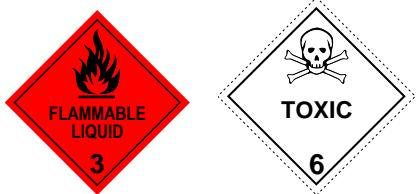

# Labelling of workplace hazardous chemicals

Code of Practice

# Disclaimer

Safe Work Australia is an Australian Government statutory agency established in 2009. Safe Work Australia includes Members from the Commonwealth, and each state and territory, Members representing the interests of workers and Members representing the interests of employees.

Safe Work Australia works with the Commonwealth, state and territory governments to improve work health and safety and workers' compensation arrangements. Safe Work Australia is a national policy body, not a regulator of work health and safety. The Commonwealth, states and territories have responsibility for regulating and enforcing work health and safety laws in their jurisdiction.

ISBN 978- 0- 642- 33309- 4 (PDF)  ISBN 978- 0- 642- 33310- 0 (DOCX)

# Creative Commons

This copyright work is licensed under a Creative Commons Attribution- Noncommercial 4.0 International licence. To view a copy of this licence, visit creativecommons.org/licenses In essence, you are free to copy, communicate and adapt the work for non- commercial purposes, as long as you attribute the work to Safe Work Australia and abide by the other licence terms.

Safe Work Australia | info@swa.gov.au | www.swa.gov.au

# Contents

Foreword 5

1. Introduction 6

1.1. When is a label under the WHS Regulations not required? 6  1.2. Who has duties in relation to labelling hazardous chemicals? 8

2. Labelling hazardous chemicals - general information 11

2.1. What information must be included on a label? 11  2.2. Product identifier 12  2.3. Disclosure of ingredients 12  2.4. Manufacturer/importer information 14  2.5. Label elements 14  2.6. Expiry date 16  2.7. Pipe work 17

# 3. Special labelling situations 18

3.1. Small containers 18  3.2. Research chemicals or samples for analysis 19  3.3. Decanted or transferred hazardous chemicals 20  3.4. Chemicals with known hazards that are not supplied to another workplace 21  3.5. Hazardous waste products 22  3.6. Duplication of labelling elements 23  3.7. Hazardous chemicals classified in the explosives hazard class 23  3.8. Hazardous chemicals that are dangerous goods packaged for transport 24  3.9. Consumer products 25  3.10. Agricultural or veterinary chemical products 26  3.11. Products containing nanomaterials 27  3.12. Labelling of products which pose hazard a but do not meet definition 27

# 4. Labelling design and layout 28

4.1. Grouping information 28  4.2. Orientation and size of label elements 28  4.3. Placement 29

# 5. Other labelling duties 30

5.1. Containers found without correct labelling 30  5.2. Reviewing and updating information on labels 30

# Appendix A—Glossary 32

Appendix B—Checklist for preparing a label 38

Appendix C—Guide for selecting generic names 40

Establishing the generic name 40

# Appendix D--Application of label elements. 52

Appendix D—Application of label elements. 52D1. Structure of hazard statement text. 52D2. Structure of precautionary statement text. 52D3. Tables of label elements from the GHS. 53D4. Additional non- GHS hazard statements. 111Appendix E—Precedence rules for label elements. 113Multiple hazards and precedence of hazard information. 113Appendix F—Hazard pictograms. 119Appendix G—Comparison of hazard pictograms with ADG class labels. 121Appendix H—Example labels. 124Amendments. 136

# Foreword

This Code of Practice on labelling hazardous chemicals is an approved code of practice under section 274 of the Work Health and Safety Act (the WHS Act).

An approved code of practice provides practical guidance on how to achieve the standards of work health and safety required under the WHS Act and the Work Health and Safety Regulations (the WHS Regulations) and effective ways to identify and manage risks.

A code of practice can assist anyone who has a duty of care in the circumstances described in the code of practice. Following an approved code of practice will assist the duty holder to achieve compliance with the health and safety duties in the WHS Act and WHS Regulations, in relation to the subject matter of the code of practice. Like regulations, codes of practice deal with particular issues and may not cover all relevant hazards or risks. The health and safety duties require duty holders to consider all risks associated with work, not only those for which regulations and codes of practice exist.

Codes of practice are admissible in court proceedings under the WHS Act and WHS Regulations. Courts may regard a code of practice as evidence of what is known about a hazard, risk, risk assessment or risk control and may rely on the code in determining what is reasonably practicable in the circumstances to which the code of practice relates. For further information see the Interpretive Guideline: The meaning of 'reasonably practicable'.

Compliance with the WHS Act and WHS Regulations may be achieved by following another method if it provides an equivalent or higher standard of work health and safety than the code.

An inspector may refer to an approved code of practice when issuing an improvement or prohibition notice.

# Scope and application

This Code is intended to be read by a person conducting a business or undertaking (PCBU). It provides practical guidance to PCBUs on how to label hazardous chemicals that are being manufactured or imported for use, handling or storage in Australia.

This Code may be a useful reference for other persons interested in the duties under the WHS Act and WHS Regulations.

This Code applies to a person conducting a business or undertaking involved in the manufacture or import of hazardous chemicals that will be used, or could reasonably be expected to be used, in workplaces covered by the WHS Act.

# How to use this Code of Practice

This Code includes references to the legal requirements under the WHS Act and WHS Regulations. These are included for convenience only and should not be relied on in place of the full text of the WHS Act or WHS Regulations. The words 'must', 'requires' or 'mandatory' indicate a legal requirement exists that must be complied with.

The word 'should' is used in this Code to indicate a recommended course of action, while 'may' is used to indicate an optional course of action.

# 1. Introduction

1. IntroductionThis Code describes the type of information that is needed on labels for various hazardous chemicals so that users of these chemicals in workplaces can identify any hazards associated with the correct classification of the chemical and take appropriate steps to eliminate or minimise the risks.

# 1.1. When is a label under the WHs Regulations not required?

In general, a label is required for any substance, mixture or article classified as a hazardous chemical under the WHs Regulations. However, there are several types of hazardous chemical that are excluded from the labelling provisions under Regulation 335 of the WHS regulations or exempted from coverage from all provisions in Part 7.1 of the WHS Regulations.

# Chemicals labelled under the National Code of Practice for the Labelling of Workplace Substances

# WHS Regulation 341

Labelling hazardous chemicals- general requirement

The 1994 National Code of Practice for the Labelling of Workplace Substances [NOHSC: 2012 (1994)] was used to label workplace hazardous chemicals prior to 2017. Chemicals do not need to be labelled in accordance with the WHS Regulations if they were manufactured or imported before 1 January 2017, labelled in accordance with the 1994 National Code of Practice at that time and retain that label.

# Food and beverages

# WHS Regulation 328

Application of Part 7.1

Food and beverage products that are packaged in a form intended for consumption do not require labelling under the WHS Regulations. However, large quantities must be labelled to meet workplace requirements. For example, a  $100~\mathrm{L}$  container of flammable alcoholic spirits must be labelled to meet WHS requirements, while a  $750~\mathrm{mL}$  bottle of the same spirits does not.

# Therapeutic goods

# WHS Regulation 328

Application of Part 7.1

Therapeutic goods are regarded as correctly labelled under the WHs Regulations when labelled in accordance with Therapeutic Goods Administration (TGA) requirements and in a form:

intended for human consumption for intake or administration to or by a patient or consumer, or intended for use for therapeutic purposes.

When not in a form intended for intake or administration to or by a patient or consumer, or for therapeutic purposes, workplace labelling must be used.

For example, a pharmacist repacks a 1 kg container of formulated tablets in smaller containers for dispensing to patients. The 1 kg container must comply with TGA labelling requirements. However, a 1 kg container of the same material in powdered form used by a pharmacist in manufacturing or formulating products must be labelled according to workplace labelling requirements.

For more information about the labelling and packaging of therapeutic goods you should refer to the information published by the Therapeutic Goods Administration (www.tga.gov.au).

# Agricultural and veterinary chemical products

# WHS Regulation 335

Labelling hazardous chemicals

Agricultural and veterinary (agvet) chemicals must meet the labelling requirements of the Agricultural and Veterinary Chemicals Code Act 1994. Where an agvet chemical is also a workplace hazardous chemical, additional workplace labelling requirements apply under the WHS Regulations. The workplace labelling requirements for agvet chemicals are set out in section 3.10 of this Code.

Veterinary chemical products are not required to meet the additional workplace labelling requirements if they are:

a veterinary chemical product within the meaning of the Agricultural and Veterinary Chemicals Code Act 1994, and listed in the Poisons Standard, Part 4 of Schedule 4, and packaged and supplied in a form intended for the direct administration to an animal for therapeutic purposes, or listed in the Poisons Standard, Part 4 of Schedule 8.

The labelling of agvet chemicals is regulated by the Australian Pesticides and Veterinary Medicines Authority (the APVMA), who should be consulted for more information about labelling agvet chemicals (www.apvma.gov.au).

# Cosmetics and toiletries

# WHS Regulation 335

Labelling hazardous chemicals

Under the WHS Regulations, cosmetics and toiletries packaged for consumer use are exempt from workplace labelling requirements. This includes sample bottles of cosmetics at retail stores and toiletries being used at a workplace.

However, when cosmetics or toiletries that are hazardous chemicals are stored, handled or used in the workplace and not packaged for consumer use, they must be labelled in accordance with workplace labelling requirements.

This includes cosmetics and toiletries in quantities that need to be repackaged, and any chemical intermediates and ingredients being used to manufacture cosmetics and toiletries.

# Hazardous chemicals in transit

# WHS Regulation 335

Labelling hazardous chemicals

A chemical is in transit if it is:

supplied to, or stored at, a workplace in containers that are not opened at the workplace not used at the workplace, and kept at the workplace for not more than five consecutive days.

Hazardous chemicals that are in transit do not require labelling under WHS laws. The requirements for packaging and labelling of chemicals in transit are set out in various Australian transport laws and codes, including:

the Australian Code for the Transport of Dangerous Goods by Road and Rail the Australian Code for the Transport of Explosives by Road and Rail the International Maritime Dangerous Goods Code, and the Civil Aviation Safety Regulations.

# 1.2. Who has duties in relation to labelling hazardous chemicals?

The WHS Regulations apply specific duties to various persons in relation to the correct labelling of workplace hazardous chemicals.

Where a chemical is regulated under more than one set of laws it will need to meet the labelling requirements placed upon it by all sets of laws. For example, workplace hazardous chemicals that are also agricultural and veterinary chemicals as defined in the Commonwealth's Agricultural and Veterinary Chemicals Code Act 1994 must meet the requirements of both sets of laws.

Note that under the WHS Regulations, manufacturers and importers of a substance, mixture or article have an obligation to correctly classify that substance, mixture or article. To prepare a correct and accurate label for a hazardous chemical, you need to know the correct classification of the hazardous chemical.

The duties in relation to labelling hazardous chemicals are summarised below.

Manufacturers and importers of hazardous chemicals

# WHS Regulation 335

Labelling hazardous chemicals

The manufacturer or importer of a workplace hazardous chemical must ensure that the chemical is correctly labelled as soon as practicable after manufacturing or importing the hazardous chemical.

This means that the hazardous chemical must be labelled in accordance with the GHS and with Schedule 9 of the WHS Regulations.

A hazardous chemical is also labelled correctly if the label includes content that complies with another labelling requirement imposed by the WHS Regulations or by another law of a state/territory or of the Commonwealth and the content is the same, or substantially the same, as the content that is required by the WHS Regulations.

More information about correct labelling of hazardous chemicals is given throughout this Code.

# Suppliers of hazardous chemicals

# WHS Regulation 338

Supplier labelling hazardous chemicals

A supplier must not supply a hazardous chemical to a workplace if the supplier knows, or ought reasonably to know, that the chemical is not correctly labelled in accordance with regulation 335 of the WHS Regulations.

Persons conducting a business or undertaking that uses, handles or stores hazardous chemicals

# WHS Regulations Part 7.1 Subdivision 3

Obligations of persons conducting a business or undertaking

A PCBU that uses, handles or stores hazardous chemicals must ensure that any hazardous chemical that is used, handled or stored at the workplace is correctly labelled in accordance with regulation 335 of the WHS Regulations.

Additionally, they must ensure:

- a hazardous chemical is correctly labelled if the chemical is manufactured at the workplace; or transferred or decanted from the chemical's original container at the workplace. 
- so far as reasonably practicable, that containers are correctly labelled in accordance with regulation 335 of the WHS regulations while holding a hazardous chemical, and 
- containers that are labelled for holding a hazardous chemical are used only for the use, handling or storage of the hazardous chemical.

The three duties directly above do not apply if the hazardous chemical is used immediately after being put into the container and the container is thoroughly cleaned after the chemical has been used, handled or stored so it is in a condition it would be in if the container had never contained the chemical.

A PCBU must also ensure, so far as is reasonably practicable, that a hazardous chemical in pipe work is identified by a label, sign or another way on or near the pipe work.

Note: a person who packages or re- labels a hazardous chemical with their own product name is considered to be a manufacturer and therefore will have the same obligations as the manufacturer or importer under the WHS Regulations to correctly label.

# 1.3. Transition to GHS 7

The Globally Harmonized System of Classification and Labelling of Chemicals (GHS) is a global method of classifying chemicals and preparing labels and safety data sheets (SDS). The GHS is the basis of the system used for preparing labels and SDS in Australia, and also sets out the criteria used to determine if a chemical is hazardous.

The 3rd revised edition of the GHS (GHS 3) was implemented in Australia on 1 January 2012. On 1 January 2021, Australia will begin a 2- year transition to the 7th revised edition of the GHS (GHS 7). During the transition manufacturers and importers may use either GHS 3 or GHS 7 to prepare classifications, labels and safety data sheets for hazardous chemicals. From 1 January 2023, only GHS 7 may be used.

During the transition, suppliers and users of hazardous chemicals may continue to supply and use chemicals classified and labelled under GHS 3. However, suppliers and users of hazardous chemicals should not supply or receive stock manufactured or imported after 31 December 2022 if it does not have an up to date labels or SDS under GHS 7.

More information about the transition can be found on the Safe Work Australia website.

# 2. Labelling hazardous chemicals - general information

2. Labelling hazardous chemicals – general informationThis chapter deals with the complete set of labelling elements that should be included on a container. A checklist for the preparation of a label is provided in Appendix B. In some situations it is not possible or reasonably practicable to legibly include the complete set of labelling elements on a label. Reduced label requirements are permitted in such situations. Guidance on the label requirements for these and other special situations is provided in Chapter 3 of this Code.

# 2.1. What information must be included on a label?

# WHS Regulations Schedule 9

Classification, packaging and labelling requirements

A hazardous chemical is correctly labelled if the chemical is packed in a container that includes the following:

- is written in English- the product identifier- the name, Australian address and business telephone number of either the manufacturer or importer- the identity and proportion disclosed, in accordance with Schedule 8 of the WHS Regulations, for each chemical ingredient- any hazard pictogram(s) consistent with the correct classification(s) of the chemical- any hazard statement(s), signal word and precautionary statement(s) that is consistent with the correct classification(s) of the chemical- any information about the hazards, first aid and emergency procedures relevant to the chemical, which are not otherwise included in the hazard statement or precautionary statement, and- the expiry date of the chemical, if applicable.

As a person conducting a business or undertaking (PCBU), you may include any information on the label that does not contradict or cast doubt on any other information that is required on the label.

The following additional information should also be included on the label, where available:

- an emergency phone number for specific poisons or treatment advice- the overseas name, address and telephone number of the manufacturer or supplier- a valid website or internet address- reference to the safety data sheet, for example a statement on the label that says: 'Additional information is listed in the safety data sheet'.

If an emergency information service or Poisons Information Centre phone number is provided on the label, this arrangement should be confirmed with the service beforehand and copies of the SDS should be provided to them.

# 2.2. Product identifier

A product identifier is a unique name or number by which the chemical is to be known, and which allows the product users to identify the hazardous chemical. The product identifier must be the same as that listed in the safety data sheet, and may be identical to the trade name.

The product identifier and details of ingredients should be grouped together and located at the most prominent position on the label, for example at the top or centre of the label, or on a front panel.

# 2.3. Disclosure of ingredients

# WHS Regulation Schedule 8

Disclosure of ingredients in safety data sheet

The chemical identity of an ingredient must be disclosed on the label in accordance with Schedule 8 of the WHS Regulations (Disclosure of ingredients). In some cases, a generic name may be used.

Disclosure of ingredient names is not required by the WHs Regulations for those ingredients that meet only physical and/or environmental hazard classifications, or for non- hazardous ingredients.

The identity of ingredients for the following GHS health hazard categories do not need to be disclosed because they are outside the scope of the WHS Regulations:

acute toxicity- Category 5 (oral, dermal and inhalation) skin corrosion/irritation- Category 3 aspiration hazard- Category 2 aquatic toxicity (all categories) flammable gases- Category 2, and ozone depletion.

# Use of generic names

A generic name may be used to identify an ingredient if the identity of an ingredient is genuinely commercially confidential, and if:

the ingredient is in any of the following health hazard categories:

acute toxicity- Category 4 (oral, dermal, inhalation) aspiration hazard- Category 1 serious eye damage/eye irritation- Category 2 skin corrosion/irritation- Category 2, or specific target organ toxicity (single exposure)- Category 3.

the ingredient does not cause the correct classification of the hazardous chemical to include any other hazard class or category within table 8.1 of the WHS Regulations, and an exposure standard for the ingredient has not been established.

A guide for selecting generic names for ingredients is included in Appendix C of this Code.

# Unknown or variable composition mixtures and complex reaction products

It may be difficult to identify the ingredients of certain complex mixtures. These include naturally occurring gases and oils, and complex reaction products. These products may contain several hundred unique ingredients and their composition may vary between batches.

A single technical name may be given to such chemicals, though as much ingredient information should be included on the label as is reasonably practicable. This may include the chemical families and subfamilies present in the hazardous chemical, and the ranges in which they are expected to be present.

# Disclosing proportions of ingredients

For multiple ingredients, proportions should be listed in descending order by mass or volume. Ingredients not contributing to the hazard classification should also be listed, and where included, should be listed after the ingredients contributing to the hazard classification.

However, where the exact concentration of an ingredient is commercially confidential, the concentration of the ingredient can be disclosed using the following ranges:

-  $< 10\%$  
-  $10 - < 30\%$  
-  $30 - 60\%$  
-  $>60\%$

The proportion of an ingredient should normally be disclosed using a narrower range, for example, for an ingredient present at  $35\%$  , a range of  $30 - 40\%$  should be used instead of  $30 - 60\%$

Where possible, the percentage composition should add up to or indicate a total of  $100\%$  even if an estimate of non- hazardous ingredients needs to be provided.

Where the chemical identity or generic name of an ingredient that makes up a hazardous chemical is disclosed, the proportions of the ingredients must also be disclosed in an SDS.

Example of how ingredients can be represented on a label

Flammable Liquid A contains the following ingredients:

- Toluene  $55\%$  
- Ethyl methyl ketone  $40\%$  
- Methanol  $3.5\%$  
- 2-butanol  $1\%$  
- Xylene  $0.5\%$

As both xylene and 2- butanol are not hazardous to health at these concentrations, they are not required to be disclosed in the ingredients section of the label. However, as they both have exposure standards it is good practice to disclose them both on the label.

The ingredients and their proportions may be disclosed on the label using the exact proportions:

Flammable Liquid A contains:

- Toluene  $55\%$  
- Ethyl methyl ketone  $40\%$  
- Methanol  $3.5\%$

Non- hazardous ingredients  $1.5\%$

If the ingredient proportions are commercial- in- confidence, they may be disclosed on the label using a range:

Flammable Liquid A contains:

Toluene  $30 - 60\%$  Ethyl methyl ketone  $30 - 60\%$  Methanol  $< 10\%$

# 2.4. Manufacturer/importer information

The label must include the Australian contact details of the manufacturer or importer. The required contact details include the manufacturer or importer's name, Australian address and business telephone number.

Additional information, including details of an overseas manufacturer or supplier- - for example a website or internet address- - may be included on the label.

The manufacturer or importer identification may be provided in a less prominent position on the label, for example the back portion of the label. It should be grouped with the expiry date, where applicable.

# 2.5. Label elements

The combination of label elements required on the label of a hazardous chemical is directly linked to its hazard classification. Label elements apply to hazard categories and must be determined as specified in the GHS.

Appendix D includes tables listing all the elements that apply to each hazard class and category or division.

The signal word, hazard pictograms and hazard statements should be grouped together in a prominent position on the label, and located either immediately following or adjacent to the product identifier and chemical ingredients.

Some non- hazardous chemicals may still pose a risk to people or the environment, for example dry ice (solid carbon dioxide). These chemicals will not have hazard pictograms, hazard statements, signal words or precautionary statements; however, their labels for these products should include information on their hazards and safety precautions. For example, the label for dry ice should include information on the asphyxiation hazard and precautions for handling to avoid cryogenic burns.

Labels should be suitably durable to remain clear and legible throughout the expected life of the product, and to minimise the risk of labels being eroded by the contents of the container.

# Signal words

Signal words are used to indicate the relative level of severity of a hazard. The GHS uses 'Danger' and 'Warning' as signal words. 'Danger' is used for a more severe or significant hazard, while 'Warning' is used for the less severe hazards.

Only one signal word should be present on any one label. If the signal word 'Danger' applies, then the signal word 'Warning' should not appear on the label.

Signal words should be represented in bold and upper- case text.

# Hazard statements

Hazard statements describe the nature of a hazard, including the degree of hazard, where appropriate. A unique hazard statement is assigned to each hazard class and category. The hazard statements and corresponding hazard class and category are provided in Appendix D. All relevant hazard statements must appear on the label. Where a hazard classification results in hazard statements with duplicate information, the information should only appear once, in line with the rules of precedence outlined in Appendix E.

Additionally, Appendix D lists 12 non- GHS hazard statements that should be included on the label, where relevant.

A unique hazard statement code is assigned to each hazard statement. The hazard statement code is intended to be used for reference purposes only. It is not part of the hazard statement and should not be used to replace it or be included on the label.

Hazard statements should be represented in bold and sentence case text.

# Precautionary statements

Precautionary statements describe the recommended measures that should be taken to minimise or prevent adverse effects resulting from exposure to, or improper storage or handling of, a hazardous chemical. Precautionary statements are assigned to each hazard class and category.

Precautionary statements are separated into five categories:

Prevention statements refer to precautions to be taken to prevent an accident or exposure. Response statements refer to instructions in case of an accident. Storage statements refer to instructions for safe storage of the chemical. Disposal statements refer to appropriate disposal instructions. General statements are for use as appropriate.

The precautionary statements that correspond to each hazard class and category are provided in Appendix D. Not all precautionary statements relating to a particular hazard classification need to be used on the label. As a guide, a maximum of between six and ten precautionary statements should appear on the label, depending on the nature and severity of the hazards.

Where a hazard classification results in duplicate precautionary statements, the information should only appear once in line with the rules of precedence outlined in Appendix E.

A combination of precautionary statements may be used to save label space, improve readability and to provide flexibility in the application of precautionary phrases.

Related precautionary statements should be grouped together on a label to allow for ease of location. Precautionary statements should be printed in sentence case text.

A unique precautionary statement code is assigned to each precautionary statement. The precautionary statement code is intended to be used for reference purposes only. It is not part of the precautionary statement and should not be used to replace it or be included on the label.

The general precautionary statements refer to general precautionary measures to be taken, for example:

If medical advice is needed, have product container or label at hand. Keep out of reach of children. Read carefully and follow all instructions.

Unlike other precautionary statements, general precautionary statements are not linked to particular hazard classes or categories and their inclusion on labels of workplace hazardous chemicals is not mandatory.

Where general precautionary statements are used, they should be located in a prominent position on the label, for example adjacent to the product identifier. General precautionary statements should be printed in sentence case text.

# Hazard pictograms

The GHS specifies nine hazard pictograms, having regard to physical, health and environmental hazards. These are provided in Appendix E of this Code.

Hazard pictograms must be included on the label in most cases. In some circumstances however, pictograms may be omitted from the label in line with the rules of precedence outlined in Appendix E. In all other cases, where pictograms are required, all the relevant hazard pictograms must be included on the label.

Hazard pictograms should be in the shape of a square set at an angle of  $45^{\circ}$  (i.e. diamond- shaped) on its point. The hazard pictograms should have a black symbol on a white background with a red border or frame of sufficient width to be clearly visible. Pictograms with a black border may also be used.

Class labels required for the transport of dangerous goods as per the Australian Code for the Transport of Dangerous Goods by Road and Rail (the ADG Code) may be used instead of the relevant hazard pictograms specified in the GHS, where they are consistent. A comparison of the hazard pictograms as specified in the GHS and the ADG Code class labels is provided in Appendix G1.

# 2.6. Expiry date

If a chemical has an expiry date it must be provided on the label. For example, where degradation or decomposition of the chemical may occur over time, with the result that the hazard classification of the chemical changes, or where the chemical is no longer within acceptable specifications for potency and stability. For example ethers may form explosive peroxides over time.

An expiry date may be provided in a less prominent position of the label, for example the back portion of the label. It should be grouped with any manufacturer or importer identification information. An expiry date should be represented in sentence case text.

# 2.7. Pipe work

# WHS Regulation 343

Labelling hazardous chemicals- pipe work

You must ensure, so far as is reasonably practicable, that a hazardous chemical in pipe work is identified by a label, sign or another way on or near the pipe work.

The identification used should communicate information relevant to the identity of the chemical, its hazards and any necessary precautions to be observed.

Methods for identifying hazardous chemicals in pipe work may include:

- signs adjacent to pipe work- markings on the pipe work, for example colour coding (refer to AS 1345-1995: Identification of the contents of pipes, conduits and ducts for guidance)- schematic layouts displayed prominently.

# 3. Special labelling situations

This chapter outlines requirements and guidelines for labelling hazardous chemicals in special situations where the full requirements do not apply. As a person conducting a business or undertaking (PCBU), you should always aim to provide as much information on the hazards and safe use of the chemical on the label as possible.

Note that the information contained in this chapter may not be suitable for chemicals that are regulated under more than one set of laws (for example workplace hazardous chemicals that are also agricultural and veterinary chemicals as defined in the Commonwealth's Agricultural and Veterinary Chemicals Code Act 1994 must meet the requirements of both sets of laws). The manufacturer or importer must ensure that the chemical is correctly labelled with respect to all applicable laws.

Under the WHs Regulations, reduced labelling is permitted for hazardous chemicals that are:

supplied in small containers research chemicals or samples for analysis decanted or transferred not supplied to another workplace, and where the hazards are known to the workers using the chemical hazardous wastes classified into the explosives hazard class and are not explosive articles agricultural and veterinary chemicals.

This chapter also provides guidance on the acceptability of labels prepared in accordance with other labelling systems and handled in a workplace, specifically:

hazardous chemicals classified in the explosives hazard class and labelled in compliance with the Australian Code for the Transport of Explosives by Road and Rail dangerous goods labelled in compliance with transport requirements2 consumer products agricultural or veterinary chemical products that are labelled in accordance with the requirements of the Australian Pesticides and Veterinary Medicines Authority.

# 3.1. Small containers

# WHS Regulations Schedule 9

Classification, packaging and labelling requirements

Where a hazardous chemical is packaged in a container that is too small to attach a label with all the information that is required of hazardous chemical labels, then the label must be written in English and include the following:

the product identifier the name, Australian address and business telephone number of either the manufacturer or importer

- a hazard pictogram or hazard statement that is consistent with the correct classification of the chemical, and- any other information required for hazardous chemicals labels in general that is reasonably practicable to include.

Priority should be given to the inclusion of those labelling elements relating to the most significant hazards of the hazardous chemical.

The most significant hazard will vary from chemical to chemical, and will be dependent upon, for example, likely routes of exposure based on its physical state (i.e. whether it is a gas, liquid or solid), its packaging and its intended use.

# Examples of 'the most significant hazard'

The information relating to a hazardous chemical's inhalation hazard properties may be considered most significant for a paint that is intended for application using a spray gun, but not where it is intended for application using a brush.

The information relating to dermal toxicity may be considered most significant for a chemical that is packaged in an ampoule (i.e. where spillage could occur during opening), but not where the chemical is packaged in a ready- to- use syringe.

For hazardous chemicals with multiple hazard categories, the most stringent set of precautionary statements should be selected. This is appropriate for situations where rapid action or response may be crucial following accidental exposure, and therefore information relating to these actions should be included in preference to non- critical information.

Example of 'the most stringent set of precautionary statements'

If a chemical can cause long- term systemic effects, and is also acutely toxic, then the first aid measures for acute toxicity will normally take precedence over those for longer term effects. However, medical attention for the delayed health effects may take precedence in some cases, even if it is not associated with immediate symptoms of exposure.

Where certain hazard or other information has been omitted from the label, it is recommended that alternative means for communicating the information should be used. The complete set of hazard and other information may be included on an outer box (for example for a box containing several very small ampoules), a swing tag, insert or leaflet inside a box.

Examples of acceptable labels for small containers are provided in Appendix H.

# 3.2. Research chemicals or samples for analysis

A research chemical is a substance or mixture that is manufactured in a laboratory for the purposes of genuine research and not for use or supply to others for a purpose other than genuine analysis or research. A chemical that is supplied commercially to another workplace is not included under the meaning of 'research chemical or samples for analysis' under any circumstances.

# WHS Regulations Schedule 9

Classification, packaging and labelling requirements

If a hazardous chemical is a research chemical or sample for analysis, the label must, at a minimum, be written in English and include the product identifier and a hazard pictogram or hazard statement that is consistent with the correct classification of the chemical.

A research chemical or sample for analysis must be correctly classified and the identity of the substance or mixture must be determined.

The product identifier of a research chemical or sample for analysis may be:

the actual name of the chemical a recognised abbreviation or acronym a chemical formula, structure or reaction components.

When the identity of a research chemical or sample for analysis is not known this should be indicated clearly on the label. Labels for research chemicals or samples for analysis should include as much hazard information as possible, based on the identity and the known or suspected hazards.

Where labelling the actual laboratory container is impractical due to its size or the conditions under which it is used, other methods of providing the information can be used, for example a secure swing tag, a sign attached to supporting apparatus or labelling an outer container.

For example, for a rack of test tubes, rather than label each individual test tube containing the same hazardous chemical, you may attach a label to the rack using a swing tag.

# 3.3. Decanted or transferred hazardous chemicals

# WHS Regulations Schedule 9

Classification, packaging and labelling requirements

If a hazardous chemical is decanted or transferred from the container in which it was packed and it will not be used immediately or it is supplied to someone else, the label must, at a minimum, be written in English and include the following:

the product identifier, and a hazard pictogram or hazard statement consistent with the correct classification of the chemical.

Note: Chemicals regulated under more than one set of laws may have additional labelling requirements when decanted or transferred to another container. For example, agvet chemicals typically require a label under the Agricultural and Veterinary Chemicals Code Act 1994 when transferred to another container for supply, and authorisation may be required for this activity. For more advice refer to the relevant regulatory authority.

For the purposes of this Code, decant means to transfer a hazardous chemical from a correctly labelled container to another container within a workplace. Such a container may range from a small flask in a research laboratory to a large vessel that is used to contain reaction components prior to use in a mixing or reaction process. Decant does not include rebottling or repacking a chemical for supply to another workplace.

Where the entire amount of a decanted hazardous chemical will be used immediately, labelling of its container is not required.

A decanted hazardous chemical can only be considered to be used immediately in situations where:

- it is not left unattended by the person who decanted it- it is used only by a person present at the decanting process- the container is subsequently rendered free from any hazardous chemical immediately after use, so the container is in the condition it would be in if it had never contained the chemical.

# Examples

Example 1: the hazardous chemical is considered to be used immediately:

- A sample of hydrocarbon solvent is dispensed from a bulk container into a 15 L container by Worker A. All of the decanted hydrocarbon solvent in the 15 L container is then used immediately by Worker A in the same shift. No hydrocarbon solvent is left in the 15 L container (as though it had never contained the chemical). The container with the dispensed solvent is not left unattended by Worker A before it is used.

Example 2: the hazardous chemical is not considered to be used immediately:

- A sample of hydrocarbon solvent is dispensed from a bulk container into a 15 L container by Worker A. The solvent in the 15 L container is not completely used up by Worker A at the end of his/her work shift. Worker A has not left the container with the dispensed solvent unattended during the shift. The remainder of the solvent is left for Worker B.

Where a container is repeatedly used for decanting as part of normal work procedures or processes, a permanent label should be attached to the container. Permanently labelled containers must not be used to contain any other substances or mixtures than those specified on the label.

# 3.4. Chemicals with known hazards that are not supplied to another workplace

# WHS Regulations Schedule 9

Classification, packaging and labelling requirements

If a hazardous chemical is not being supplied to another workplace and the hazards associated with the chemical are known to the workers involved in using, handling or storing the chemical, then the label must, at a minimum, be written in English and include the following:

- the product identifier, and- a hazard pictogram or hazard statement that are consistent with the correct classification of the chemical.

Where a hazardous chemical will not be supplied to another workplace, and your workers involved in its handling have sufficient knowledge of the associated hazards, then you may omit some of the information normally required in a label. The label should communicate enough information on the hazards as necessary to ensure its safe use.

# Examples of labelling chemicals that are not supplied to another workplace

# Example 1:

Example 1:- Hazardous Chemical A is manufactured at Site A. Batch samples of Hazardous Chemical A are routinely sent to a laboratory at the same manufacturing site for analysis. Samples of Hazardous Chemical A are handled on a regular basis at the on- site laboratory, and the hazards are well known by the workers. Reduced labelling is permitted for the batch samples.

# Example 2:

Example 2:- Active Constituent A is manufactured at Site A and then later formulated into an end- use product, Agricultural Chemical Product A. The end- use product is formulated at the same facility, Site A, where the active ingredient is manufactured, and the workers undertaking the formulation step are aware of the hazards. In this case, the reduced labelling is permitted for Active Constituent A. However, Agricultural Chemical Product A must be labelled with all requisite labelling information.

# Example 3:

Example 3:- If Active Constituent A from Example 2 is transported to a different facility, Site B, for formulation into the end- use product Agricultural Chemical Product A, even where both facilities are owned and operated by the same company, Active Constituent A must be labelled with all requisite labelling information.

# 3.5. Hazardous waste products

Hazardous waste products must be identified and correctly classified so far as is reasonably practicable. Where it is not reasonably practicable to classify waste material, the hazard classification should be estimated using a precautionary approach based on the known or likely constituents of the waste.

# WHS Regulations Schedule 9

Classification, packaging and labelling requirements

If it is reasonably likely that a waste product is a hazardous chemical, then the label on the container of the hazardous waste must be written in English and at a minimum, include the following:

the product identifier the name, Australian address and business telephone number of either the manufacturer or the importer, and a hazard pictogram and hazard statement that are consistent with the correct classification of the chemical.

The product identifier should reflect the nature of the waste as closely as possible and may depend on the extent of knowledge about the components of the waste. Examples of product identifiers may include:

chlorinated solvent waste- flammable waste- chromium VI waste- heavy metal waste.

Labels for hazardous wastes should include as much hazard information as reasonably practicable based on what is known about its identity and any suspected hazards. The label of any hazardous wastes should also include, where possible, the following information:

the identity of any known or likely hazardous constituents or impurities and their proportions (for example 'contains chromium VI,  $5\%$  or 'may contain trace levels of organic peroxides') relevant precautionary statements relevant first aid and safety directions any other information that may assist identification of the hazardous waste and its associated hazards.

If you have made every reasonable attempt to identify and classify the chemical waste and have been unsuccessful, you should clearly indicate this on the label.

# 3.6. Duplication of labelling elements

# WHS Regulation 335

Labelling hazardous chemicals

A hazardous chemical is correctly labelled if:

the selection and use of label elements is in accordance with the GHS and it complies with Part 3 of Schedule 9 of the WHS Regulations, or the label includes content that complies with another labelling requirement of the WHS Regulations or required by another law [of this State or] of the Commonwealth and the content is the same, or substantially the same, as the content that is required by Part 3 of Schedule 9.

If a hazardous chemical is correctly labelled in accordance with other laws that apply to the chemical, then GHS statements are not required providing the label already contains content that is the same, or substantially the same, as the content that is required by Part 3 of Schedule 9.

For example, if the label on a hazardous chemical that is correctly labelled in accordance with another Commonwealth law contains the hazard statement 'Repeated exposure may cause allergic disorders', the GHS statement 'May cause an allergic skin reaction' would not be required because the two statements are sufficiently similar.

Similarly, it is possible to have redundant GHS label elements where a hazardous chemical meets the criteria for more than two similar hazard classes in the GHS. Redundant information should not be included on a label. Rules of precedence of certain label elements, and general guidance that should be used to determine when elements may be omitted from a label, are provided in Appendix E.

# 3.7. Hazardous chemicals classified in the explosives hazard class

# WHS Regulations Schedule 9

Classification, packaging and labelling requirements

If a hazardous chemical is classified in the explosives hazard class, it must be packed in a container that has a label in English that complies with the Australian Code for the Transport of Explosives by Road and Rail and includes the following:

the proper shipping name and UN number of the chemical, and any hazard pictogram, any hazard statement and any precautionary statement consistent with the correct classification of the chemical in relation to health hazards.

The Australian Code for the Transport of Explosives by Road and Rail (Explosives Code) outlines requirements for labelling of explosives. This labelling regime is designed primarily for the communication of physical hazards of explosives during their transport.

# 3.8. Hazardous chemicals that are dangerous goods packaged for transport

Where a hazardous chemical has been packaged and labelled in accordance with dangerous goods transport requirements and is in transit, the hazardous chemical is not subject to workplace labelling requirements. Where workplace hazardous chemicals are not in transit, they must have all of the required labelling information.

Hazardous chemicals that are classified as dangerous goods and transported by road or rail must comply with the labelling or marking requirements that are specified in the Australian Code for the Transport of Dangerous Goods by Road and Rail (the ADG Code). Transport markings and class labels of the ADG Code are designed primarily to assist emergency services personnel in case of an accident or emergency.

Note: The ADG Code refers to dangerous goods pictograms as Class or Division labels. Other information required on a package or container is referred to as 'markings'. The size and colour of labels and markings required for transport are specified in the ADG Code.

The ADG Code recognises the GHS as an appropriate labelling system for inner packages of dangerous goods during transport. As this code describes GHS- compliant labelling, labels prepared in accordance with this code should meet the inner package labelling requirements prescribed in the ADG Code for dangerous goods during transport.

To meet both workplace and transport labelling requirements, additional health and safety information may be required on some transport containers. The additional information would generally relate to chronic health hazards, which are not regulated for transport purposes.

For outer packaging of transport containers used within the workplace, workplace labelling requirements may be met by attaching to the container a supplementary panel or label that includes the additional information. The additional information should be clearly distinguishable from the information required to meet transport laws.

# Combined labelling with ADG Class labels

Pictograms from the GHS may be substituted with correct ADG Code class labels where both represent the same hazard. A label for a workplace hazardous chemical that is a dangerous good for transport may include a mixture of GHS pictograms and ADG class labels for separate hazards, but should not include a class label and pictogram for the same hazard. For example, an ADG Flammable Liquid Class label can replace a GHS Flame pictogram, but both the Flame pictogram and the flammable liquid class label should not be included on the same label for a workplace chemical.

Where a GHS pictogram appears on the same container as a transport label, the GHS pictogram should be used as part of a complete GHS label.

The ADG Code prescribes minimum sizes for ADG class labels. When preparing labels to meet both workplace and transport requirements the requirements of the ADG Code must be met.

Examples of combined ADG and GHS labels can be found in Appendix H.

Labelling of chemicals stored or transported in multiple layers of packaged

Chemicals may be stored, handled or transported in multiple layers of packaging. This most commonly occurs when chemicals are packaged for transport.

GHS labelling must be applied to the innermost layer of packaging to provide information to the user when the chemical is used. If GHS labelling is not applied to the innermost layer of packaging the chemical will be incorrectly labelled when removed from its intermediate or outer packaging.

The outer layer of packaging (often referred to as an overpack) can be labelled in accordance with the ADG Code for transport without GHS labelling being required. However, if the chemical is expected to be used, handled or stored in the outer or intermediate layers of packaging then GHS information should also be provided on those layers to ensure it is available for workers.

Examples of the arrangement of GHS labels for multiple layers of packaging can be found in Annex 7 of the GHS.

# 3.9. Consumer products

# WHS Regulation 335

Labelling hazardous chemicals

A hazardous chemical does not need to meet the labelling requirements under the WHS Regulations if the chemical is a consumer product labelled in accordance with the Standard for the Uniform Scheduling of Medicines and Poisons November 2016 (the Poisons Standard), with the original label on its container and if it is reasonably foreseeable that the hazardous chemical will be used in the workplace only:

- in a quantity that is consistent with consumer household use- in a way that is consistent with consumer household use, and- in a way that is incidental to the nature of the work carried out by a worker using the chemical.

The following example shows how to distinguish between a consumer product and a workplace hazardous chemical.

Toilet cleaner is sold in  $750~\mathrm{ml}$  bottles for domestic use and is sold in  $20~\mathrm{L}$  containers to commercial cleaning businesses. The  $750~\mathrm{ml}$  bottle is intended for domestic use and does not need to be labelled in accordance with the WHS Regulations.

However, it is reasonably foreseeable that, due to the package size of the  $20~\mathrm{L}$  product, it would be used in a workplace rather than in a domestic situation. Therefore, the  $20~\mathrm{L}$  product must be labelled according to workplace labelling requirements.

# Dual use products

Some hazardous chemicals may be intended for supply to both the consumer household markets and workplaces in identical containers and packaging. These products are sometimes referred to as dual use products. A dual use product label may need to comply with the Poisons Standard labelling requirements, the workplace labelling requirements or both.

Workplace labelling requirements apply if the manufacturer or importer determines that the use, handling and storage of the product are predominantly related to a work activity.

Poisons Standard labelling requirements apply to all poisons unless they are packed and sold solely for industrial, manufacturing, laboratory or dispensary use.

Where a hazardous chemical is also a poison intended for predominantly but not solely workplace use, both labelling requirements apply.

Examples of combined WHS and Poisons Standard labelling can be found in Appendix H.

# 3.10. Agricultural or veterinary chemical products

# WHS Regulations Schedule 9

Classification, packaging and labelling requirements

Agricultural and veterinary chemicals must have a label in English that complies with the requirements of the Agricultural and Veterinary Chemicals Code Act 1994 and also includes the following:

- any hazard statement that is consistent with the correct classification of the chemical, and- any precautionary statement that is consistent with the correct classification of the chemical.

'Agricultural or veterinary chemical' refers to any agricultural chemical product or veterinary chemical product as defined in the Agricultural and Veterinary Chemicals Code Act 1994 (Cth).

The Australian Pesticides and Veterinary Medicines Authority (APYMA) labelling codes for agricultural and veterinary chemical products are the Ag Labelling Code and the Veterinary Labelling Code, respectively. You may omit the hazard pictogram and signal word from the labels of these chemicals. However, the label must contain hazard statements and precautionary statements for all of the intrinsic hazards of the product.

GHS statements are not required where the agvet chemical label already contains content that is the same, or substantially the same, as the GHS statements.

The APVMA labelling codes require that GHS information be placed in a separate box on the label. For more information about labelling of agricultural or veterinary chemical products please refer to the labelling codes published by the APVMA.

# 3.11. Products containing nanomaterials

For engineered or manufactured nanomaterials or chemicals containing engineered or manufactured nanomaterials, it is recommended that labels be prepared in accordance with this Code unless there is evidence that the nanomaterials are not hazardous.

The following label statements are recommended for products containing nanomaterials when the hazards are not fully characterised:

- Contains engineered/manufactured nanomaterials. Caution: Hazards unknown.- Contains engineered/manufactured nanomaterials. Caution: Hazards not fully characterised.

These phrases are for use on an interim basis, as the manufacturer/importer has an ongoing duty to correctly classify the chemical and include information on known hazards on the label in accordance with the WHs Regulations. They should review any new or significant information in relation to any hazardous chemicals they import or manufacture. A review of the literature and other relevant sources of information should be undertaken on a regular basis.

# 3.12. Labelling of products which pose a hazard but do not meet 'hazardous chemical' definition

Some products have hazards consistent with GHS hazard classes and categories, but do not meet the definition of a hazardous chemical because they are not substances, mixtures or articles. For example, products where the active ingredient is a live bacterium. Other products may have hazards that are not classified under the GHS, such as radioactive materials.

The requirements for labelling hazardous chemicals do not apply to such products, however you must still identify, communicate and manage risks as far as reasonably practicable, in accordance with the WHs Act. GHS label elements should not be used if the product is not classifiable under the GHS.

# 4. Labelling design and layout

The label must be written in English.

The size of a label should be:

large enough to contain all of the relevant hazard and other information in a size and style that is easily visible and legible in the workplace, and appropriate to the size of the container, with larger labels present on larger containers.

The information on a label may be presented using one or more panels, or sections, dependent on the size and shape of the container. The label should be firmly secured to the outside of the container and should be visible in the normal storage position. The label should be sufficiently durable so as to remain legible and firmly attached to the container for the foreseeable lifetime of the product under normal storage and handling conditions.

# 4.1. Grouping information

4.1. Grouping informationA label should group specific information together so that hazard or precautionary information can be easily located.

# 4.2. Orientation and size of label elements

The text, hazard pictograms and other information on a label should be of a size and style that is easily legible and is appropriate to the size of the label and container.

The following table is provided as a guide for the minimum dimensions for hazard pictograms and sizes of text on containers of various capacities. The dimensions are intended to be measured along the edges of the pictograms. They are suggested sizes only and are not mandatory.

Table 1 Recommended sizes for label elements  

<table><tr><td>Container capacity</td><td>Minimum hazard pictogram dimensions</td><td>Minimum text size</td></tr><tr><td>≤ 500 mL</td><td>15 x 15 mm</td><td>2.5 mm</td></tr><tr><td>&amp;gt; 500 mL and ≤ 5 L</td><td>20 x 20 mm</td><td>3 mm</td></tr><tr><td>&amp;gt; 5 L and ≤ 25 L</td><td>50 x 50 mm</td><td>5 mm</td></tr><tr><td>≥ 25 L</td><td>100 x 100 mm</td><td>7 mm</td></tr></table>

Refer to the ADG Code for marking requirements for dangerous goods being transported.

# 4.3. Placement

The label should be placed on the body of the container and be clearly visible to the user. Unless it is unavoidable, labels should always be placed on the container, not the lid. This is to avoid confusion if lids are swapped or removed.

The information and hazard pictograms on any label should be printed in a colour or colours that provide a distinct contrast to the background colour.

# 5. Other labelling duties

# WHS Regulation 342

Labelling hazardous chemicals- containers

As a person conducting a business or undertaking (PCBU) who manufactures hazardous chemicals at the workplace or decants or transfers a hazardous chemical from its original container, you must ensure that the container is correctly labelled in accordance with WHS regulation 335. - You must also ensure, so far as is reasonably practicable, that a container that stores a hazardous chemical is correctly labelled in accordance with WHS Regulation 335 while the container contains the hazardous chemical. The PCBU at the workplace must also ensure that a container labelled for a hazardous chemical is used only for the use, handling or storage of that hazardous chemical.

These requirements do not apply if the hazardous chemical is used immediately after it is put into the container and the container is thoroughly cleaned immediately after the hazardous chemical is used, handled or stored to the condition it would be in if it had never contained the hazardous chemical.

# 5.1. Containers found without correct labelling

If you find that a container of a hazardous chemical is not correctly labelled in accordance with the WHS Regulations, you should attach the product identifier to the container. You should not use a hazardous chemical that is not correctly labelled. Store it in isolation until it is appropriately labelled.

If the product identifier of an unlabelled chemical is not known, this should be clearly marked on the container, for example by attaching a label to the container with the statement:

# Caution-Do Not Use-Unknown Substance.

You should take steps to identify and correctly label the unknown chemical substance. Where the chemical cannot be identified and labelled correctly, the contents should be disposed of in accordance with relevant environmental regulations and, where necessary, in consultation with the relevant waste management authority.

# 5.2. Reviewing and updating information on labels

From time to time, the hazard classification of a hazardous chemical may change, for example where new information becomes available. Where the hazard classification of a hazardous chemical changes, the label must be reviewed and, if necessary, revised to reflect any required changes.

Importers, manufacturers and suppliers should review any new or significant information in relation to any hazardous chemicals they import, manufacture or supply. A review of the literature and other relevant sources of information should be undertaken on a regular basis.

It is good practice to review the label information of a hazardous chemical at the same time as the safety data sheet (SDS) is updated. SDSs are updated:

when any new information about the hazardous chemical is known or received to ensure the SDS contains correct, current information at least once every five years.

If you have a duty to label a workplace hazardous chemical, then you must ensure that the label contains correct information at the time it is affixed to the container of the hazardous chemical.

# Appendix A-Glossary

<table><tr><td>Term</td><td>Description</td></tr><tr><td>ADG Code</td><td>The Australian Code for the Transport of Dangerous Goods by Road and Rail, as in force or remade from time to time, approved by the Transport and Infrastructure Council. The ADG Code is accessible at the National Transport Commission website (www.ntc.gov.au).</td></tr><tr><td>Article</td><td>A manufactured item, other than a fluid or particle, that is formed into a particular shape or design during manufacture and has hazard properties and a function that are wholly or partly dependent on the shape or design.</td></tr><tr><td>Chemical identity</td><td>A name, in accordance with the nomenclature systems of the International Union of Pure and Applied Chemistry or the Chemical Abstracts Service, or a technical name, that gives a chemical a unique identity.</td></tr><tr><td>Class (of dangerous goods)</td><td>The number assigned to the goods in the ADG Code indicating the hazard, or most predominant hazard, exhibited by the goods.</td></tr><tr><td>Class label</td><td>A pictogram described in the ADG Code for a class, or division of a class, of dangerous goods.</td></tr><tr><td>Consumer product</td><td>A thing that:
- is packed or repacked primarily for use by a household consumer or for use in an office
- if the thing is packed or repacked primarily for use by a household consumer—is packed in the way and quantity in which it is intended to be used by a household consumer
- if the thing is packed or repacked primarily for use in an office—is packed in the way and quantity in which it is intended to be used for office work.</td></tr><tr><td>Decant</td><td>To transfer a chemical from a correctly labelled container to another container within a workplace. Decant does not include rebottling or repacking a chemical for supply to another workplace.</td></tr><tr><td>Division (of dangerous goods)</td><td>A number, in a class of dangerous goods, to which the dangerous goods are assigned in the ADG Code.</td></tr><tr><td>Duty holder</td><td>Any person who owes a work health and safety duty under the WHS Act including a person conducting a business or undertaking, a designer, manufacturer, importer, supplier, installer of products or plant used at work (upstream duty holder), officer or a worker.</td></tr><tr><td>Exposure standard</td><td>An exposure standard published by Safe Work Australia in the Workplace Exposure Standards for Airborne Contaminants.</td></tr></table>

<table><tr><td>Term</td><td>Description</td></tr><tr><td>Generic name</td><td>A name applied to a group of chemicals having similar structures and properties.</td></tr><tr><td>Genuine research</td><td>Systematic investigative or experimental activities that are carried out for either acquiring new knowledge (whether or not the knowledge will have a specific practical application) or creating new or improved materials, products, devices, processes or services.</td></tr><tr><td>GHS</td><td>The Globally Harmonized System of Classification and Labelling of Chemicals, 7th revised edition, published by the UNECE.</td></tr><tr><td>Hazard</td><td>A situation or thing that has the potential to harm a person. Hazards at work may include: noisy machinery, a moving forklift, chemicals, electricity, working at heights, a repetitive job, bullying and violence at the workplace.</td></tr><tr><td>Hazard category</td><td>A division of criteria within a hazard class in the GHS.</td></tr><tr><td>Hazard class</td><td>The nature of a physical, health or environmental hazard under the GHS, including a class of dangerous goods.</td></tr><tr><td>Hazardous chemical</td><td>Any substance, mixture or article that satisfies the criteria for any one or more hazard classes in the GHS (including a classification referred to in Schedule 6 of the WHS Regulations), unless the only hazard class or classes for which the substance, mixture or article satisfies the criteria are any one or more of the following:
- acute toxicity—oral—category 5
- acute toxicity—dermal—category 5
- acute toxicity—inhalation—category 5
- skin corrosion/irritation—category 3
- aspiration hazard—category 2
- flammable gases—category 2
- acute hazard to the aquatic environment—category 1, 2 or 3
- chronic hazard to the aquatic environment—category 1, 2, 3 or 4
- hazardous to the ozone layer.
Note: The Schedule 6 tables replace some tables in the GHS.</td></tr><tr><td>Hazardous ingredient</td><td>An ingredient of a mixture which is, in its pure form, a hazardous chemical.</td></tr><tr><td>Hazard pictogram</td><td>A graphical composition, including a symbol plus other graphical elements, that is assigned in the GHS to a hazard class or hazard category.</td></tr><tr><td>Hazard statement</td><td>A statement assigned in the GHS to a hazard class or hazard category describing the nature of the hazards of a hazardous chemical including, if appropriate, the degree of hazard.</td></tr></table>

<table><tr><td>Term</td><td>Description</td></tr><tr><td>Health and safety committee</td><td>A consultative body established under the WHS Act. The committee&#x27;s functions include facilitating cooperation between workers and the person conducting a business or undertaking to ensure workers&#x27; health and safety at work, and assisting to develop work health and safety standards, rules and procedures for the workplace.</td></tr><tr><td>Health and safety representative</td><td>A worker who has been elected by their work group under the WHS Act to represent them on health and safety matters.</td></tr><tr><td>Import</td><td>Bring into the jurisdiction from outside Australia.</td></tr><tr><td>Importer (of a hazardous chemical)</td><td>A person who conducts a business or undertaking that imports a substance that is a hazardous chemical that is to be used, or could reasonably be expected to be used, at a workplace.</td></tr><tr><td>Ingredient</td><td>Any component of a mixture.</td></tr><tr><td>In transit</td><td>A thing is in transit if the thing:
- is supplied to, or stored at, a workplace in containers that are not opened at the workplace, and
- is not used at the workplace, and
- is kept at the workplace for not more than five consecutive days.</td></tr><tr><td>Label element</td><td>A type of information used on a label. For example: a pictogram, signal word, hazard statement.</td></tr><tr><td>Laboratory</td><td>A building or room equipped for analysis, genuine research or practical teaching, and which is not used for production purposes.</td></tr><tr><td>Manufacture (of a hazardous chemical)</td><td>The activities of packing, repacking, formulating, blending, mixing, making, remaking and synthesising of the chemical.</td></tr><tr><td>Manufacturer (of a hazardous chemical)</td><td>A person who conducts a business or undertaking that manufactures a substance that is a hazardous chemical that is to be used, or could reasonably be expected to be used, at a workplace.</td></tr><tr><td>May</td><td>&#x27;May&#x27; indicates an optional course of action.</td></tr><tr><td>Mixture</td><td>A combination of or a solution composed of two or more substances that do not react with each other.</td></tr><tr><td>Must</td><td>&#x27;Must&#x27; indicates a legal requirement exists that must be complied with.</td></tr><tr><td>Officer</td><td>An officer under the WHS Act includes:
- an officer under section 9 of the Corporations Act 2001 (Cth)</td></tr></table>

<table><tr><td>Term</td><td>Description</td></tr><tr><td></td><td>- an officer of the Crown within the meaning of section 247 of the WHS Act, and
- an officer of a public authority within the meaning of section 252 of the WHS Act.
A partner in a partnership or an elected member of a local authority is not an officer while acting in that capacity.</td></tr><tr><td>Person conducting a business or undertaking (PCBU)</td><td>PCBU is an umbrella concept which intends to capture all types of working arrangements or relationships.
A PCBU includes a:
- company
- unincorporated body or association, and
- sole trader or self-employed person.
Individuals who are in a partnership that is conducting a business will individually and collectively be a PCBU.
A volunteer association (defined under the WHS Act, see below) or elected members of a local authority will not be a PCBU.</td></tr><tr><td>Poisons Standard</td><td>The Standard for the Uniform Scheduling of Medicines and Poisons November 2016 (SUSMP), published by the Commonwealth as in force or remade from time to time.</td></tr><tr><td>Precautionary statement</td><td>A phrase prescribed by the GHS that describes recommended measures to be taken to prevent or minimise the adverse effects of exposure to a hazardous chemical or the improper handling of a hazardous chemical.</td></tr><tr><td>Product Identifier</td><td>The name or number used to identify a product on a label and in an SDS.</td></tr><tr><td>Proper shipping name</td><td>A proper shipping name under the ADG Code.</td></tr><tr><td>Research chemical</td><td>A substance or mixture that is manufactured in a laboratory for genuine research and is not for use or supply for a purpose other than analysis or genuine research.</td></tr><tr><td>Risk</td><td>The possibility harm (death, injury or illness) might occur when exposed to a hazard.</td></tr><tr><td>Should</td><td>&#x27;Should&#x27; indicates a recommended course of action.</td></tr><tr><td>Safety Data Sheet (SDS)</td><td>A document that describes the identity, properties (chemical and physical properties and health hazard and environmental hazard information), uses, precautions for use, safe handling procedures and safe disposal procedures of a hazardous chemical.</td></tr></table>

<table><tr><td>Term</td><td>Description</td></tr><tr><td>Signal Word</td><td>The word Danger or Warning used on a label to indicate to a label reader the relative severity level of a hazard, and to alert the reader to a potential hazard, as classified under the GHS.</td></tr><tr><td>Substance</td><td>A chemical element or compound in its natural state or obtained or generated by a process:
- including any additive necessary to preserve the stability of the element or compound and any impurities deriving from the process but
- excluding any solvent that may be separated without affecting the stability of the element or compound, or changing its composition.</td></tr><tr><td>Supply</td><td>Selling or transferring ownership or responsibility (for a chemical).</td></tr><tr><td>Technical name</td><td>A name that is:
- ordinarily used in commerce, regulations and codes to identify a substance or mixture, other than an International Union of Pure and Applied Chemistry or Chemical Abstracts Service name
- recognised by the scientific community.</td></tr><tr><td>Transfer</td><td>The pumping, dispensing or decanting from one container into another or from one place to another.</td></tr><tr><td>United Nations (UN) Number</td><td>A number assigned to dangerous goods by the United Nations Subcommittee of Experts on the Transport of Dangerous Goods.3</td></tr><tr><td>Volunteer association</td><td>A group of volunteers working together for one or more community purposes where none of the volunteers, whether alone or jointly with any other volunteers, employs any person to carry out work for the volunteer association.</td></tr><tr><td>Work group</td><td>A group of workers established to facilitate the representation of workers by one or more health and safety representatives. A work group may be all workers at a workplace but it may also be appropriate to split a workplace into multiple work groups where workers share similar work conditions or are exposed to similar risks and hazards. For example all workers on night shift.</td></tr><tr><td>Worker</td><td>Any person who carries out work for a person conducting a business or undertaking, including work as an employee, contractor or subcontractor (or their employee), self-employed person, outworker, apprentice or trainee, work experience student, employee of a labour hire company placed with a &#x27;host employer&#x27; or a volunteer.</td></tr><tr><td>Workplace</td><td>Any place where work is carried out for a business or undertaking and includes any place where a worker goes, or is likely to be, while at work.</td></tr></table>

# Term

# Description

This may include offices, factories, shops, construction sites, vehicles, ships, aircraft or other mobile structures on land or water.

# Appendix B-Checklist for preparing a label

The following table lists the steps that are recommended for the preparation of a label for a hazardous chemical. The information is intended for use as a quick reference guide. It may not apply to all situations. The relevant sections of this Code should be referred to for full details.

Much of the information required on the label of a hazardous chemical is also included in the chemical's safety data sheet (SDS). For example, the product identifier on the label must be consistent with the product identifier used in the SDS. If an SDS is available for the hazardous chemical it can be used as the basis for much of the label information.

Table 2 Labelling checklist  

<table><tr><td>Step Number</td><td>Step</td><td>Comments</td></tr><tr><td>1</td><td>Select the suitable product identifier.</td><td>Refer to section 2.2 of this Code.</td></tr><tr><td>2</td><td>Determine which ingredients require disclosure.</td><td>Refer to section 2.3 of this Code for ingredient disclosure requirements.</td></tr><tr><td>3</td><td>Select the label elements which apply to the hazard categories, in accordance with correct hazard classification.</td><td>Label elements applicable to all hazard categories are tabulated in Appendix D.</td></tr><tr><td>4</td><td>Combine all applicable elements, and then determine which elements may be omitted from the label to avoid duplication or redundancy.</td><td>Refer to Appendix E for precedence rules and hierarchy of elements.</td></tr><tr><td>5</td><td>Determine which label elements may be omitted where a special labelling situation may apply.</td><td>Refer to Chapter 3.</td></tr><tr><td>6</td><td>Determine whether other relevant health and safety information may be required.</td><td>Particularly important for hazard endpoints not covered by the GHS but where there are health and safety concerns.</td></tr><tr><td>7</td><td>Select the appropriate supplier details to be included.</td><td>Other information, for example web address or emergency contact phone number, may be included.</td></tr><tr><td>8</td><td>Determine whether an expiry date is required.</td><td>Expiry date is required if degradation over time could change the hazard classification. For example, if a highly toxic impurity is formed.</td></tr></table>

<table><tr><td>Step Number</td><td>Step</td><td>Comments</td></tr><tr><td>9</td><td>Identify any other relevant information that may be required.</td><td>For example, reference to SDS or product use information.</td></tr><tr><td>10</td><td>Design the label layout and grouping of information.</td><td>Refer to Chapter 4.</td></tr></table>

# Appendix C-Guide for selecting generic names

This appendix describes:

- a procedure for naming hazardous chemicals, and- the division of substances into families.

Section 2.3 of this Code explains when generic names may be used.

The families of substances are defined in the following manner:

- inorganic or organic substances whose properties are identified by having a common chemical element as their chief characteristic. The family name is derived from the name of the chemical element. These families are identified in Table 6 below by the atomic number of the chemical element (Family No. 001 to 103)- organic substances whose properties are identified by having a common functional group as their chief characteristic.  
- the family name is derived from the functional group name  
- these families are identified by the number convention found in Table 6 below (Family No. 601 to 650).

Sub- families bringing together substances with a common specific character have been added in certain cases.

# Establishing the generic name

# General principles

In selecting a generic name, the most specific generic name must be chosen. The following approach should be adopted:

- identify the functional groups and chemical elements present in the molecule- determine the most important functional groups and chemical elements that contribute to its properties.

The identified functional groups and elements taken into account are the names of the families and sub- families set out in Table 6 below in the form of a (non- restrictive) list.

# Practical application

After having conducted a search to see if the substance belongs to one or more families or sub- families on the list in Table 6 below, the generic name can be established in the following way:

- If the name of a family or sub-family is sufficient to characterise the chemical elements or important functional groups, this name will be chosen as the generic name. Table 3 shows some examples.

Table 3 Family or sub-family name sufficient to establish generic name  

<table><tr><td rowspan="2">Name</td><td>Family</td><td rowspan="2">Generic name</td></tr><tr><td>- Sub-family</td></tr><tr><td>1,4-dihydoxybenzene</td><td>604: Phenols and derivatives</td><td>Phenol derivative</td></tr><tr><td rowspan="2">Butanols</td><td>603: Alcohols and derivatives</td><td rowspan="2">Aliphatic alcohol</td></tr><tr><td>- Aliphatic alcohols</td></tr><tr><td rowspan="2">2-isopropoxyethanol</td><td>603: Alcohols and derivatives</td><td rowspan="2">Glycolether</td></tr><tr><td>Glycolethers</td></tr><tr><td rowspan="2">Methacrylate</td><td>607: Organic acids and derivatives</td><td rowspan="2">Methacrylate</td></tr><tr><td>- Methacrylate</td></tr></table>

If the name of a family or sub- family is not sufficient to characterise the chemical elements of important functional groups, the generic name should be a combination of the corresponding different family or sub- family names. Table 4 shows some examples.

Table 4 Family and sub-family names combined to establish generic name  

<table><tr><td rowspan="2">Name</td><td>Family</td><td rowspan="2">Generic name</td></tr><tr><td>- sub-family</td></tr><tr><td rowspan="3">Lead hexafluorosilicate</td><td>009: Fluorine compounds</td><td rowspan="3">Inorganic lead fluoride</td></tr><tr><td>- Inorganic fluorides</td></tr><tr><td>082: Lead compounds</td></tr><tr><td rowspan="3">Chlorobenzene</td><td>602: Halogenated hydrocarbons</td><td rowspan="3">Chlorinated aromatic hydrocarbon</td></tr><tr><td>- Halogenated aromatic hydrocarbons</td></tr><tr><td>017: Chlorine compounds</td></tr><tr><td rowspan="3">2,3,6-Trichlorophenylacetic acid</td><td>607: Organic acids and derivatives</td><td rowspan="3">Chlorinated aromatic acid</td></tr><tr><td>- Halogenated aromatic acids</td></tr><tr><td>017: Chlorine compounds</td></tr><tr><td rowspan="3">1-Chloro-1-nitropropane</td><td>610: Chloronitrated compounds</td><td rowspan="3">Chloronitrated aliphatic hydrocarbon</td></tr><tr><td>601: Hydrocarbons</td></tr><tr><td>- Aliphatic hydrocarbons</td></tr></table>

Note: In the case of certain elements, notably metals, the name of the family or sub- family may be indicated by the words 'organic' or 'inorganic'. Table 5 shows some examples.

<table><tr><td rowspan="2">Name</td><td>Family</td><td rowspan="2">Generic name</td></tr><tr><td>- sub-family</td></tr><tr><td rowspan="3">Tetrapropyl dithiopyrophosphate</td><td>015: Phosphorus compounds</td><td rowspan="3">Thiophosphoric ester</td></tr><tr><td>- Phosphoric esters</td></tr><tr><td>016: Sulphur compounds</td></tr></table>

Table 5 Family or sub-family name indicated by 'organic' or 'inorganic' to establish generic name  

<table><tr><td rowspan="2">Name</td><td>Family</td><td rowspan="2">Generic name</td></tr><tr><td>- sub-family</td></tr><tr><td>Dimercury dichloride</td><td>080: Mercury compounds</td><td>Inorganic mercury compound</td></tr><tr><td>Barium acetate</td><td>056: Barium compounds</td><td>Organic barium compound</td></tr><tr><td rowspan="2">Ethyl nitrite</td><td>007: Nitrogen compounds</td><td rowspan="2">Organic nitrite</td></tr><tr><td>- Nitrites</td></tr><tr><td>Sodium hydrosulphite</td><td>016: Sulphur compounds</td><td>Inorganic sulphur compound</td></tr></table>

Table 6 Division of substances into families and sub-families  

<table><tr><td rowspan="2">Family no.</td><td>Families</td></tr><tr><td>- Sub-Families</td></tr><tr><td rowspan="2">001</td><td>Hydrogen compounds</td></tr><tr><td>- Hydrides</td></tr><tr><td>003</td><td>Lithium compounds</td></tr><tr><td>004</td><td>Beryllium compounds</td></tr><tr><td rowspan="3">005</td><td>Boron compounds</td></tr><tr><td>- Boranes</td></tr><tr><td>- Borates</td></tr></table>

# Family no. Families

# - Sub-Families

006

Carbon compounds

- Carbamates- Inorganic carbon compounds- Salts of hydrogen cyanide- Urea and derivatives

007

Nitrogen compounds

- Quaternary ammonium compounds- Acid nitrogen compounds- Nitrates- Nitrites

008

Oxygen compounds

009

- Fluorine compounds- Inorganic fluorides

011

Sodium compounds

012

- Magnesium compounds- Organometallic magnesium derivatives

013

- Aluminium compounds- Organometallic aluminium derivatives

014

- Silicon compounds

- Silicones- Silicates

015

- Phosphorus compounds

- Acid phosphorus compounds- Phosphonium compounds- Phosphoric esters

- Phosphates

- Phosphites

- Phosphoramides and derivatives

# Family no. Families

# - Sub-Families

016

Sulphur compounds- Acid sulphur compoundsMercaptans- Sulphates- Sulphites

017

Chlorine compounds- Chlorates- Perchlorates

018

Argon compounds

019

Potassium compounds

020

Calcium compounds

021

Scandium compounds

022

Titanium compounds

023

Vanadium compounds

024

Chromium compounds- Chromium VI compounds

025

Manganese compounds

026

Iron compounds

027

Cobalt compounds

028

Nickel compounds

029

Copper compounds

030

Zinc compounds- Organometallic zinc derivatives

031

Gallium compounds

Family no. Families - Sub- Families

<table><tr><td>032</td><td>Germanium compounds</td></tr><tr><td>033</td><td>Arsenic compounds</td></tr><tr><td>034</td><td>Selenium compounds</td></tr><tr><td>035</td><td>Bromine compounds</td></tr><tr><td>036</td><td>Krypton compounds</td></tr><tr><td>037</td><td>Rubidium compounds</td></tr><tr><td>038</td><td>Strontium compounds</td></tr><tr><td>039</td><td>Yttrium compounds</td></tr><tr><td>040</td><td>Zirconium compounds</td></tr><tr><td>041</td><td>Niobium compounds</td></tr><tr><td>042</td><td>Molybdenum compounds</td></tr><tr><td>043</td><td>Technetium compounds</td></tr><tr><td>044</td><td>Ruthenium compounds</td></tr><tr><td>045</td><td>Rhodium compounds</td></tr><tr><td>046</td><td>Palladium compounds</td></tr><tr><td>047</td><td>Silver compounds</td></tr><tr><td>048</td><td>Cadmium compounds</td></tr><tr><td>049</td><td>Indium compounds</td></tr><tr><td>050</td><td>Tin compounds
- Organometallic tin derivatives</td></tr></table>

<table><tr><td>Family no.</td><td>Families
– Sub-Families</td></tr><tr><td>051</td><td>Antimony compounds</td></tr><tr><td>052</td><td>Tellurium compounds</td></tr><tr><td>053</td><td>Iodine compounds</td></tr><tr><td>054</td><td>Xenon compounds</td></tr><tr><td>055</td><td>Caesium compounds</td></tr><tr><td>056</td><td>Barium compounds</td></tr><tr><td>057</td><td>Lanthanum</td></tr><tr><td>058</td><td>Cerium compounds</td></tr><tr><td>059</td><td>Praseodymium compounds</td></tr><tr><td>060</td><td>Neodymium compounds</td></tr><tr><td>061</td><td>Promethium compounds</td></tr><tr><td>062</td><td>Samarium compounds</td></tr><tr><td>063</td><td>Europium compounds</td></tr><tr><td>064</td><td>Gadolinium compounds</td></tr><tr><td>065</td><td>Terbium compounds</td></tr><tr><td>066</td><td>Dysprosium compounds</td></tr><tr><td>067</td><td>Holmium compounds</td></tr><tr><td>068</td><td>Erbium compounds</td></tr><tr><td>069</td><td>Thulium compounds</td></tr><tr><td>070</td><td>Ytterbium compounds</td></tr></table>

<table><tr><td>Family no.</td><td>Families
– Sub-Families</td></tr><tr><td>071</td><td>Lutetium compounds</td></tr><tr><td>072</td><td>Hafnium compounds</td></tr><tr><td>073</td><td>Tantalum compounds</td></tr><tr><td>074</td><td>Tungsten compounds</td></tr><tr><td>075</td><td>Rhenium compounds</td></tr><tr><td>076</td><td>Osmium compounds</td></tr><tr><td>077</td><td>Iridium compounds</td></tr><tr><td>078</td><td>Platinum compounds</td></tr><tr><td>079</td><td>Gold compounds</td></tr><tr><td>080</td><td>Mercury compounds
– Organometallic mercury derivatives</td></tr><tr><td>081</td><td>Thallium compounds</td></tr><tr><td>082</td><td>Lead compounds
– Organometallic lead derivatives</td></tr><tr><td>083</td><td>Bismuth compounds</td></tr><tr><td>084</td><td>Polonium compounds</td></tr><tr><td>085</td><td>Astatine compounds</td></tr><tr><td>086</td><td>Radon compounds</td></tr><tr><td>087</td><td>Francium compounds</td></tr><tr><td>088</td><td>Radium compounds</td></tr><tr><td>089</td><td>Actinium compounds</td></tr></table>

Family no. Families

# - Sub-Families

090

Thorium compounds

091

Protactinium compounds

092

Uranium compounds

093

Neptunium compounds

094

Plutonium compounds

095

Americium compounds

096

Curium compounds

097

Berkelium compounds

098

Californium compounds

099

Einsteinium compounds

100

Fermium compounds

101

Mendelevium compounds

102

Nobelium compounds

103

Lawrencium compounds

601

Aliphatic hydrocarbons

Aromatic hydrocarbons

Alicyclic hydrocarbons

Polycyclic aromatic hydrocarbons (PAH)

602

Halogenated hydrocarbons\*

Halogenated aliphatic hydrocarbons\* Halogenated aromatic hydrocarbons\* Halogenated alicyclic hydrocarbons\*

\* Specify according to family corresponding to halogen.

# Family no. Families

# - Sub-Families

603 Alcohols and derivatives

- Aliphatic alcohols- Aromatic alcohols- Alicyclic alcohols- Alcanolamines- Epoxy derivatives- Ethers- Glycol ethers- Glycols and polyols

604 Phenols and derivatives

- Halogenated phenol derivatives*

* Specify according to the family corresponding to halogen.

605 Aldehydes and derivatives

- Aliphatic aldehydes- Aromatic aldehydes- Alicyclic aldehydes- Aliphatic acetals- Aromatic acetals- Alicyclic acetals

606 Ketones and derivatives

- Aliphatic Ketones- Aromatic Ketones*- Alicyclic Ketones

* Quinones included

# Family no. Families

# - Sub-Families

607

Organic acids and derivatives

- Aliphatic acids- Halogenated aliphatic acids*- Aromatic acids

Halogenated aromatic acids\*

- Alicyclic acids- Halogenated alicyclic acids*- Aliphatic acid anhydrides- Halogenated aliphatic acid anhydrides*- Aromatic acid anhydrides- Halogenated aromatic acid anhydrides*- Alicyclic acid anhydrides- Halogenated alicyclic acid anhydrides*- Salts of aliphatic acid- Salts of halogenated aliphatic acid*- Salts of aromatic acid- Salts of halogenated aromatic acid*- Salts of allicyclic acid- Salts of halogenated alicyclic acid*- Esters of aliphatic acid- Esters of halogenated alicyclic acid*- Esters of aromatic acid- Esters of halogenated aromatic acid*- Esters of allicyclic acid- Esters of halogenated alicyclic acid*- Esters of glycol ether- Acrylates- Methacrylates- Lactones- Acyl halides* Specify according to the family corresponding to halogen.

* Specify according to the family corresponding to halogen.

608

Nitriles and derivatives

609

Nitro compounds

610

Chloronitrated compounds

611

Azoxy and azo compounds

612

Amine compounds

- Aliphatic amines and derivatives- Alicyclic amines and derivatives- Aromatic amines and derivatives- Aniline and derivatives- Benzidine and derivatives

# Family no. Families

# - Sub-Families

613

Heterocyclic bases and derivatives

Benzimidazole and derivatives Imidazol and derivatives

Pyrethrinoids

Quinoline and derivatives Triazine and derivatives Triazole and derivatives

614

Glycosides and alkaloids Alkaloid and derivatives Glycosides and derivatives

615

Cyanates and isocyanates

Cyanates Isocyanates

616

Amides and derivatives Acetamide and derivatives Anilides

617

Organic Peroxides

650

Various substances Do not use this family. Instead, use the families or sub- families mentioned above.

# Appendix D--Application of label elements

Appendix D—Application of label elementsThis appendix is intended to provide guidance for the application of the appropriate signal word, hazard pictograms, hazard statements and precautionary statements to a label. The tables (section D4) specify the signal word, hazard pictograms, hazard statements, precautionary statements that apply to each hazard class and category.

# D1. Structure of hazard statement text

All of the hazard statement text that appears in bold in the tables (section D3) should appear on the label, except as otherwise specified.

Text in italics indicates additional information that should appear as part of the hazard statement, where applicable. The text in italics should not appear on the label.

The hazard statement codes shown in the tables are intended to be used for reference purposes only. They are not part of the hazard statement text and should not be used on a label.

# D2. Structure of precautionary statement text

There are five types of precautionary statement: general, prevention, response (in case of accidental spillage or exposure, emergency response and first aid), storage and disposal.

All of the precautionary statement text that appears in bold in the tables (section D3) should appear on the label, except as otherwise specified.

To provide flexibility in the application of precautionary phrases, a combination of statements may be used to save label space and improve the readability of phrases. A combination of phrases can also be useful for different types of hazard where the precautionary behaviour is similar.

When a forward- slash or diagonal mark  $[ / ]$  appears in a precautionary statement text, it indicates that a choice has to be made between the phrases they separate

When an ellipsis (three full stops) [...] appears in a precautionary statement text, it indicates that all applicable conditions are not listed.

When text in the precautionary statement text appears in italics, this indicates that specific conditions apply to the use or allocation of the precautionary statement. This may relate to conditions attaching to either the general use of a precautionary statement or its use for a particular hazard class and/or hazard category. The text in italics is not intended to be present on a label.

The precautionary statements included in the following tables cover general emergency response and first- aid information. For some specific chemicals, supplementary first aid, treatment measures or specific antidotes or cleansing materials may be required. Poisons Centres and/or medical practitioners or specialist advice should be sought in such situations and this direction included on labels where appropriate.

The precautionary statement codes that are used in the tables are intended to be used for reference purposes only. They are not part of the precautionary statement text and should not be used on a label.

# Examples of precautionary statements

Precautionary statement formed from a combination of phrases:

-  $\mathsf{P}210 + \mathsf{P}403$  'Keep away from heat, hot surfaces, sparks, open flame and other ignition sources. Store in a well-ventilated place'.

Precautionary Statement that Contains a Forward- Slash [/:

-  $\mathsf{P}280$  'Wear protective gloves/protective clothing/eye protection/face protection/hearing protection/...' should read: 'Wear eye protection' where the hazard classification does not warrant the additional personal protective equipment.

Precautionary Statement that Contains Three Full Stops [...]:

-  $\mathsf{P}241$  'Use explosion-proof [electrical/ventilating/lighting/...] equipment', the use of square brackets and '...' ... allows for the specific equipment to be specified if necessary and appropriate.

# General precautionary statements

General precautionary statements are not aligned with any particular hazard category and, according to the GHS principles, these statements are required for consumer products only. Manufacturers of hazardous chemicals may choose to include these on workplace labels, particularly where it is foreseeable that the chemical may be used in a non- workplace situation. The general precautionary statements are:

-  $\mathsf{P}101$  If medical advice is needed, have product container or label at hand-  $\mathsf{P}102$  Keep out of reach of children-  $\mathsf{P}103$  Read carefully and follow all instructions.

# Tables of label elements from the GHS

The tables below provide the following information for each hazard class and hazard category of the GHS:

- hazard category- the assigned signal word- the assigned hazard statement and code- the assigned GHS symbol- the assigned precautionary statements, by precautionary statement type and code.

# Explosives

<table><tr><td>Hazard category</td><td>Signal word</td><td>Hazard statement</td><td>Symbol</td></tr><tr><td>Unstable Explosive</td><td>Danger</td><td>H200 Unstable Explosive</td><td>Exploding bomb</td></tr></table>

# Precautionary statements

<table><tr><td>Prevention</td><td>Response</td><td>Storage</td><td>Disposal</td></tr><tr><td>P201
Obtain special instructions before use.
P250
Do not subject to grinding/shock/friction/...</td><td>P370 + P372 + P380 + P373
In case of fire: Explosion risk. 
Evaluate area. DO NOT light fire when fire reaches explosives.</td><td>P401
Store in accordance with ...
...manufacturer/supplier or the competent authority to specify local/regional/ national/international regulations as applicable.</td><td>P503
Refer to manufacturer/supplier/...for information on disposal/recovery/recycling.
...manufacturer/supplier or the competent authority to specify appropriate source of information in accordance with local/regional/ national/international regulations as applicable.</td></tr><tr><td>...manufacturer/supplier or the competent authority to specify applicable rough handling.
— if the explosive is mechanically sensitive.
P280
Wear protective gloves/protective clothing/eye protection/face protection/hearing protection/...</td><td>Manufacturer/supplier or the competent authority to specify the appropriate personal protective equipment.</td><td></td><td></td></tr></table>

# Explosives

<table><tr><td>Hazard category</td><td>Signal word</td><td>Hazard statement</td><td>Symbol</td></tr><tr><td>Division 1.1</td><td>Danger</td><td>H201 Explosive; mass explosion hazard</td><td rowspan="3">Exploding bomb</td></tr><tr><td>Division 1.2</td><td>Danger</td><td>H202 Explosive; severe projection hazard</td></tr><tr><td>Division 1.3</td><td>Danger</td><td>H203 Explosive; fire, blast or projection hazard</td></tr></table>

# Precautionary statements

<table><tr><td>Prevention</td><td>Response</td><td>Storage</td><td>Disposal</td></tr><tr><td>P210
Keep away from heat, hot surfaces, sparks, open flames and other ignition sources. No smoking.
P230
Keep wetted with... 
...Manufacturer/ supplier or the competent authority to specify appropriate material.
-for substances and mixtures which are wetted, diluted, dissolved or suspended with a phlegmatizer in order to reduce or suppress their explosive properties (desensitised explosives).
P234
Keep only in original packaging.
P240
Ground and bond container and receiving equipment.
— if the explosive is electrostatically sensitive.
P250
Do not subject to grinding/shock/friction/... 
... manufacturer/supplier or the competent authority to specify applicable rough handling.
— if the explosive is mechanically sensitive.
P280
Use protective gloves /protective clothing/eye protection/face protection/hearing protection/... 
... manufacturer/supplier or the competent Authority to specify the appropriate personal protective equipment.</td><td>P370 + P372 + P380 + P373
In case of fire: Explosion risk. Evacuate area. DO NOT fight fire when fire reaches explosives.</td><td>P401
Store in accordance with ...
...manufacturer/supplier or the competent authority to specify local/regional/ national/international regulations as applicable.</td><td>P503
Refer to manufacturer/supplier/ for information on disposal/recovery/recy cling.
...manufacturer/supplier or the competent authority to specify appropriate source of information in accordance with local/regional/ national/international regulations as applicable.</td></tr></table>

# Explosives

<table><tr><td>Hazard category</td><td>Signal word</td><td>Hazard statement</td><td>Symbol</td></tr><tr><td>Division 1.4</td><td>Warning</td><td>H204 Fire or projection hazard</td><td>Exploding bomb</td></tr></table>

# Precautionary statements

<table><tr><td>Prevention</td><td>Response</td><td>Storage</td><td>Disposal</td></tr><tr><td>P210
Keep away from heat, hot surfaces, sparks, open flames and other ignition sources. No smoking.
P234
Keep only in original packaging.
P240
Ground and bond container and receiving equipment.
— if the explosive is electrostatically sensitive.
P250
Do not subject to grinding/shock/friction/... 
... manufacturer/supplier or the competent authority to specify applicable rough handling.
— if the explosive is mechanically sensitive.
P280
Wear protective gloves/protective clothing/eye protection/face protection/hearing protection/... 
Manufacturer/supplier or the competent authority to specify the appropriate personal protective equipment.</td><td>P370 + P372 + P380 + P373
In case of fire:
Explosion risk.
Evacuate area. DO NOT fight fire when fire reaches explosives.
P370 + P380 + P375
In case of fire:
Evacuate area. Fight fire
Remotely due to the risk of explosion.
— for explosives of division 1.4 (compatibility group S) in transport packaging.</td><td>P401
Store in accordance with... 
... Manufacturer/supplier or the competent authority to specify local/regional/national/international regulations as applicable.</td><td>P503
Refer to manufacturer/supplier...for information on disposal/recovery/recycling 
... Manufacturer/supplier or the competent authority to specify appropriate source of information in accordance with local/regional/national/international regulations as applicable.</td></tr></table>

# Explosives

<table><tr><td>Hazard category</td><td>Signal word</td><td>Hazard statement</td><td>Symbol*</td></tr><tr><td>Division 1.5</td><td>Danger</td><td>H205 May mass explode in fire</td><td>1.5 EXPLOSIVE</td></tr></table>

# Precautionary statements

<table><tr><td>Prevention</td><td>Response</td><td>Storage</td><td>Disposal</td></tr><tr><td>P210
Keep away from heat, hot surfaces, sparks, open flames and other ignition sources. No smoking.
P230
Keep wetted with... 
Manufacturer/supplier or the competent authority to specify appropriate material.
— for substances and mixtures which are wetted, diluted, dissolved or suspended with a phlegmatizer in order to reduce or suppress their explosive properties (desensitised explosives).
P234
Keep only in original packaging.
P240
Ground and bond container and receiving equipment.
— if the explosive is electrostatically sensitive.
P250
Do not subject to grinding/shock/friction/... 
Manufacturer/supplier or the competent authority to specify applicable rough handling.
— if the explosive is mechanically sensitive.
P280
Use protective gloves /protective clothing/eye protection/face protection/hearing protection... 
Manufacturer/supplier or the competent Authority to specify the appropriate personal protective equipment.</td><td>P370 + P372 + P380 + P373
In case of fire: Explosion risk. Evacuate area. DO NOT fight fire when fire reaches explosives.</td><td>P401
Store in accordance with ... 
...manufacturer/suppli er or the competent authority to specify local/regional/ national/international regulations as applicable.</td><td>P503
Refer to manufacturer/suppli er/...for information on disposal/recovery/re cycling. 
... 
manufacturer/supplier or the competent authority to specify appropriate source of information in accordance with local/regional/ national/international regulations as applicable.</td></tr></table>

# Explosives

<table><tr><td>Hazard category</td><td>Signal word</td><td>Hazard statement</td><td>Symbol*</td></tr><tr><td>Division 1.6</td><td>No signal word</td><td>No hazard statement</td><td>1.6</td></tr></table>

# Precautionary statements

<table><tr><td>Prevention</td><td>Response</td><td>Storage</td><td>Disposal</td></tr><tr><td>No precautionary statements</td><td>No precautionary statements</td><td>No precautionary statements</td><td>No precautionary statements</td></tr></table>

\*Note: Symbol for Explosive Division 1.6 is the symbol used according to the ADG Code for the Transport of Dangerous Goods

# Flammable gases

<table><tr><td>Hazard category</td><td>Signal word</td><td>Hazard statement</td><td>Symbol</td></tr><tr><td>1A</td><td>Danger</td><td>H220 Extremely flammable gas</td><td rowspan="2">Flame</td></tr><tr><td>1B</td><td>Danger</td><td>H221 Flammable gas</td></tr></table>

# Precautionary statements

<table><tr><td>Prevention</td><td>Response</td><td>Storage</td><td>Disposal</td></tr><tr><td>P210 Keep away from heat, hot surfaces, sparks, open flames and other ignition sources. No smoking.</td><td>P377 Leaking gas fire: Do not extinguish, unless leak can be stopped safely. P381 In case of leakage, eliminate all ignition sources.</td><td>P403 Store in well-ventilated place.</td><td></td></tr></table>

# Flammable gases (pyrophoric gases)

<table><tr><td>Hazard category</td><td>Signal word</td><td>Hazard statement</td><td>Symbol</td></tr><tr><td>1A, Pyrophoric gas</td><td>Danger</td><td>H220 Extremely flammable gas; and 
H232 May ignite spontaneously if exposed to air</td><td>Flame</td></tr></table>

# Precautionary statements

<table><tr><td>Prevention</td><td>Response</td><td>Storage</td><td>Disposal</td></tr><tr><td>P210</td><td>P377</td><td>P403</td><td></td></tr><tr><td>Keep away from heat, hot surfaces, sparks, open flames and other ignition sources. No smoking.</td><td>Leaking gas fire: 
Do not extinguish, unless leak can be stopped safely. P381</td><td>Store in well-ventilated place.</td><td></td></tr><tr><td>P222</td><td>In case of leakage, eliminate all ignition sources.</td><td></td><td></td></tr><tr><td>Do not allow contact with air</td><td>— if emphasis of the hazard statement is deemed necessary.</td><td></td><td></td></tr><tr><td>P280</td><td></td><td></td><td></td></tr><tr><td>Wear protective gloves/protective clothing/eye protection/face protection/hearing protection/...</td><td></td><td></td><td></td></tr><tr><td>Manufacturer/supplier or the competent authority to specify the appropriate personal protective equipment</td><td></td><td></td><td></td></tr></table>

Note: This table lists only precautionary statements that are assigned due to the flammability and the pyrophoricity of the gas. For other precautionary statements that are assigned based on chemical instability see the respective table for chemically unstable gases A and B.

# Flammable gases (chemically unstable gases)

<table><tr><td>Hazard category</td><td>Signal word</td><td>Hazard statement</td><td>Symbol</td></tr><tr><td>1A, chemically unstable has A</td><td>Danger</td><td>H220 Extremely flammable gas; and
H230 May react explosively even in the absence of air</td><td rowspan="2">Flame</td></tr><tr><td>1A, chemically unstable gas B</td><td>Danger</td><td>H220 Extremely flammable gas; and
H230 May react explosively even in the absence of air at elevated pressure and/or temperature</td></tr></table>

# Precautionary statements

<table><tr><td>Prevention</td><td>Response</td><td>Storage</td><td>Disposal</td></tr><tr><td>P202
Do not handle until all safety precautions have been read and understood.
P210
Keep away from heat, hot surfaces, sparks, open flames and other ignition sources. No smoking.</td><td>P377
Leaking gas fire:
Do not extinguish, unless leak can be stopped safely.
P381
In case of leakage, eliminate all ignition sources.</td><td>P403
Store in well-ventilated place.</td><td></td></tr></table>

Note: This table lists only precautionary statements that are assigned due to the flammability and the chemical instability of the gas. For other precautionary statements that are assigned based on the pyrophoricity see the respective table for pyrophoric gases.

# Aerosols

<table><tr><td>Hazard category</td><td>Signal word</td><td>Hazard statement</td><td>Symbol</td></tr><tr><td>1</td><td>Danger</td><td>H222 Extremely flammable aerosol; and
H229 Pressurized container: may burst if heated</td><td rowspan="2">Flame</td></tr><tr><td>2</td><td>Warning</td><td>H223 Flammable aerosol; and
H229 Pressurized container: may burst if heated</td></tr></table>

# Precautionary statements

<table><tr><td>Prevention</td><td>Response</td><td>Storage</td><td>Disposal</td></tr><tr><td>P210
Keep away from heat, hot surfaces, sparks, open flames and other ignition sources. No smoking.
P211
Do not spray on an open flame or other ignition source.
P251
Do not pierce or burn, even after use.</td><td></td><td>P410 + P412
Protect from sunlight.
Do not expose to temperatures exceeding 50°C/122°F.
Manufacturer/supplier or the competent authority to use applicable temperature scale.</td><td></td></tr></table>

# Aerosols

<table><tr><td>Hazard category</td><td>Signal word</td><td>Hazard statement</td><td>Symbol</td></tr><tr><td>3</td><td>Warning</td><td>H229 Pressurized container: may burst if heated</td><td>No symbol</td></tr></table>

# Precautionary statements

<table><tr><td>Prevention</td><td>Response</td><td>Storage</td><td>Disposal</td></tr><tr><td>P210
Keep away from heat, hot surfaces, sparks, open flames and other ignition sources. No smoking.
P251
Do not pierce or burn, even after use.</td><td></td><td>P410 + P412
Protect from sunlight.
Do not expose to temperatures exceeding 50°C/122°F.
Manufacturer/supplier or the competent authority to use applicable temperature scale.</td><td></td></tr></table>

# Oxidising gases

<table><tr><td>Hazard category</td><td>Signal word</td><td>Hazard statement</td><td>Symbol</td></tr><tr><td>1</td><td>Danger</td><td>H270 May cause or intensify fire; oxidiser</td><td>Flame over circle</td></tr></table>

# Precautionary statements

<table><tr><td>Prevention</td><td>Response</td><td>Storage</td><td>Disposal</td></tr><tr><td>P220
Keep away from clothing and other combustible materials.
P244
Keep valves and fittings free from grease and oil.</td><td>P370 + P376
In case of fire: Stop leak if safe to do so.</td><td>P403
Store in well-ventilated place.</td><td></td></tr></table>

Gases under pressure (compressed, liquefied and dissolved gases)  

<table><tr><td>Hazard category</td><td>Signal word</td><td>Hazard statement</td><td>Symbol</td></tr><tr><td>Compressed gas</td><td>Warning</td><td>H280 Contains gas under pressure; may explode if heated</td><td rowspan="3">Gas cylinder</td></tr><tr><td>Liquefied gas</td><td>Warning</td><td>H280 Contains gas under pressure; may explode if heated</td></tr><tr><td>Dissolved gas</td><td>Warning</td><td>H280 Contains gas under pressure; may explode if heated</td></tr></table>

# Precautionary statements

<table><tr><td>Prevention</td><td>Response</td><td>Storage</td><td>Disposal</td></tr><tr><td></td><td></td><td>P410 + P403
Protect from sunlight. Store in a well-ventilated place.
— P410 may be omitted for gases filled in transportable gas cylinders in accordance with packing instruction P200 of the UN Recommendations on the Transport of Dangerous Goods, Model Regulations, unless those gases are subject to (slow) decomposition or polymerisation, or the competent authority provides otherwise.</td><td></td></tr></table>

# Gases under pressure (refrigerated liquefied gases)

<table><tr><td>Hazard category</td><td>Signal word</td><td>Hazard statement</td><td>Symbol</td></tr><tr><td>Refrigerated liquefied gas</td><td>Warning</td><td>H281 Contains refrigerated gas; may cause cryogenic burns or injury</td><td>Gas cylinder</td></tr></table>

# Precautionary statements

<table><tr><td>Prevention</td><td>Response</td><td>Storage</td><td>Disposal</td></tr><tr><td>P282
Wear cold insulating gloves and either face shield or eye protection.</td><td>P336 + P315
Thaw frosted parts with lukewarm water. Do not rub affected area. Get immediate medical advice/attention
Manufacturer/supplier or the competent authority to select medical advice or attention as appropriate.</td><td>P403
Store in well-ventilated place.</td><td></td></tr></table>

# Flammable liquids

<table><tr><td>Hazard category</td><td>Signal word</td><td>Hazard statement</td><td>Symbol</td></tr><tr><td>1</td><td>Danger</td><td>H224 Extremely flammable liquid and vapour</td><td rowspan="3">Flame</td></tr><tr><td>2</td><td>Danger</td><td>H225 Highly flammable liquid and vapour</td></tr><tr><td>3</td><td>Danger</td><td>H226 Flammable liquid and vapour</td></tr></table>

# Precautionary statements

<table><tr><td>Prevention</td><td>Response</td><td>Storage</td><td>Disposal</td></tr><tr><td>P210
Keep away from heat, hot surfaces, sparks, open flames and other ignition sources. No smoking.
P233
Keep container tightly closed.
— if the liquid is volatile and may generate an explosive atmosphere.
P240
Ground and bond container and receiving equipment
— if the liquids is volatile and may generate an explosive atmosphere.
P241
Use explosion-proof 
[electrical/ventilating/lighting/...] equipment.
— if the liquid is volatile and may generate an explosive atmosphere.
— text in square brackets may be used to specify specific electrical, ventilating, lighting or other equipment if necessary and as appropriate.
— precautionary statement may be omitted where local or national legislation introduces more specific provisions
P242
Use non-sparking tools.
P243
Take action to prevent static discharges.
— if the liquid is volatile and may generate an explosive atmosphere
— may be omitted where .local or national legislation introduces more specific provisions.
P280
Wear protective gloves/protective clothing/eye protection/face protection/hearing protection/... 
— manufacturer/supplier or the competent authority to specify the appropriate personal protective equipment.</td><td>P303 + P361 + P353
IF ON SKIN (or hair): Take off immediately all contaminated clothing. Rinse skin with water [or shower].
—text in square brackets to be included where the manufacturer /supplier or the competent authority considers it appropriate for the specific chemical
P370 + P378
In case of fire: Use ... to extinguish.
... 
Manufacturer/supplier or the competent authority to specify appropriate media.
— if water increases risk.</td><td>P403 + P235
Store in a well-ventilated place. Keep cool.
— for flammable liquids category 1 and other flammable liquids that are volatile and may generate an explosive atmosphere.</td><td>P501
Dispose of contents/container to...
... in accordance with local/ regional/ national/ international Regulations (to be specified).
Manufacturer/supplier or the competent authority to specify whether disposal requirements apply to contents, container or both.</td></tr></table>

# Flammable liquids

<table><tr><td>Hazard category</td><td>Signal word</td><td>Hazard statement</td><td>Symbol</td></tr><tr><td>4</td><td>Warning</td><td>H227 Combustible liquid</td><td>No symbol</td></tr></table>

# Precautionary statements

<table><tr><td>Prevention</td><td>Response</td><td>Storage</td><td>Disposal</td></tr><tr><td>P210
Keep away from heat, hot surfaces, sparks, open flames and other ignition sources. No smoking.
P280
Wear protective gloves/protective clothing/eye protection/face protection/hearing protection/...</td><td rowspan="2">P370 + P378
In case of fire: Use ... to extinguish.
... Manufacturer/supplier or the competent authority to specify appropriate media.
--if water increases risk.</td><td rowspan="2">P403
Store in a well-ventilated place.
--for flammable liquids Category 1 and other flammable liquids that are volatile and may generate an explosive atmosphere.</td><td rowspan="2">P501
Dispose of contents/container to... 
... in accordance with local/regional/national/international Regulations (to be specified).
Manufacturer/supplier or the competent authority to specify whether disposal requirements apply to contents, container or both.</td></tr><tr><td>Manufacturer/supplier or the competent authority to specify type of equipment.</td></tr></table>

# Flammable solids

<table><tr><td>Hazard category</td><td>Signal word</td><td>Hazard statement</td><td>Symbol</td></tr><tr><td>1</td><td>Danger</td><td>H228 Flammable solid</td><td rowspan="2">Flame</td></tr><tr><td>2</td><td>Warning</td><td>H228 Flammable solid</td></tr></table>

# Precautionary statements

<table><tr><td>Prevention</td><td>Response</td><td>Storage</td><td>Disposal</td></tr><tr><td>P210
Keep away from heat, hot surfaces, sparks, open flames and other ignition sources. No smoking.
P240
Ground and bond container and receiving equipment.
— if the solid is electrostatically sensitive.
P241
Use explosion-proof [electrical/ventilating/lighting/...] equipment.
— if dust clouds can occur.
—text in square brackets may be used to specify specific electrical, ventilating, lighting or other equipment if necessary and as appropriate.
—precautionary statement may be omitted where local or national legislation introduces more specific provisions
P280
Wear protective gloves/protective clothing/eye protection/face protection/hearing protection/... 
Manufacturer/supplier or the competent authority to specify type of equipment.</td><td>P370 + P378
In case of fire: Use ... to extinguish ...Manufacturer/supplier or the competent authority to specify appropriate media.
— if water increases risk.</td><td></td><td></td></tr></table>

# Self-reactive substances and mixtures

<table><tr><td>Hazard category</td><td>Signal word</td><td>Hazard statement</td><td>Symbol</td></tr><tr><td>Type A</td><td>Danger</td><td>H240 Heating may cause an explosion</td><td>Exploding bomb</td></tr></table>

# Precautionary statements

<table><tr><td>Prevention</td><td>Response</td><td>Storage</td><td>Disposal</td></tr><tr><td>P210
Keep away from heat, hot surfaces, sparks, open flames and other ignition sources. No smoking.
P234
Keep only in original packaging.
P235
Keep cool.
— may be omitted if P411 is given on the label.
P240
Ground and bond container and receiving equipment.
— if electrostatically sensitive and able to generate an explosive atmosphere.
P280
Wear protective gloves/protective clothing/eye protection/face protection/hearing protection/... 
Manufacturer/supplier or the competent authority to specify the appropriate personal protective equipment.</td><td>P370 + P372 + P380 + P373
In case of fire: Explosion risk. Evacuate area. DO NOT light fire when fire reaches explosives.</td><td>P403
Store in a well-ventilated place.
— except for temperature controlled self- reactive substances and mixtures or organic peroxides because condensation and consequent freezing may take place.
P411
Store at temperatures not exceeding ...°C/...°F.
— if temperature control is required (according to section 2.8.2.3 or 2.15.2.3 of the GHS) or if otherwise deemed necessary.
... Manufacturer/supplier or the competent authority to specify temperature using applicable temperature scale.
P420
Store separately.</td><td>P501
Dispose of contents/container to... 
... in accordance with local/regional/national/international Regulations (to be specified). Manufacturer/supplier or the competent authority to specify whether disposal requirements apply to contents, container or both.</td></tr></table>

# Self-reactive substances and mixtures

<table><tr><td>Hazard category</td><td>Signal word</td><td>Hazard statement</td><td>Symbol</td></tr><tr><td>Type B</td><td>Danger</td><td>H241 Heating may cause a fire or explosion</td><td>Explooding bomb and Flame</td></tr></table>

# Precautionary statements

<table><tr><td>Prevention</td><td>Response</td><td>Storage</td><td>Disposal</td></tr><tr><td>P210
Keep away from heat, hot surfaces, sparks, open flames and other ignition sources. No smoking.
P234
Keep only in original packaging.
P235
Keep cool 
... may be omitted if P411 is given on the label.
P240
Ground and bond container and receiving equipment.
... if electrostatically sensitive and able to generate an explosive atmosphere.
P280
Wear protective gloves/protective clothing/eye protection/face protection/hearing protection/... 
Manufacturer/supplier or the competent authority to specify the appropriate personal protective equipment.</td><td>P370 + P380 + P375 [+ P378]
In case of fire:
Evacuate area. Fight fire remotely due to the risk of explosion.
[Use...to extinguish]
... text in square brackets to be included if water increases risk.
... Manufacturer/supplier or the competent authority to specify appropriate media.</td><td>P403
Store in a well-ventilated place.
— except for temperature controlled self- reactive substances and mixtures or organic peroxides because condensation and consequent freezing may take place.
P411
Store at temperatures not exceeding ...°C/...°F.
— if temperature control is required (according to section 2.8.2.3 or 2.15.2.3 of the GHS) or if otherwise deemed necessary.
... Manufacturer/supplier or the competent authority to specify temperature using applicable temperature scale.
P420
Store separately.</td><td>P501
Dispose of contents/container to... 
...in accordance with local/ regional/ national/ international Regulations (to be specified).
Manufacturer/supplier or the competent authority to specify whether disposal requirements apply to contents, container or both.</td></tr></table>

# Self-reactive substances and mixtures

<table><tr><td>Hazard category</td><td>Signal word</td><td>Hazard statement</td><td>Symbol</td></tr><tr><td>Type C</td><td>Danger</td><td>H242 Heating may cause a fire</td><td rowspan="4">Flame</td></tr><tr><td>Type D</td><td>Danger</td><td>H242 Heating may cause a fire</td></tr><tr><td>Type E</td><td>Danger</td><td>H242 Heating may cause a fire</td></tr><tr><td>Type F</td><td>Danger</td><td>H242 Heating may cause a fire</td></tr></table>

# Precautionary statements

<table><tr><td>Prevention</td><td>Response</td><td>Storage</td><td>Disposal</td></tr><tr><td>P210
Keep away from heat, hot surfaces, sparks, open flames and other ignition sources. No smoking.
P234
Keep only in original packaging.
P235
Keep cool
— may be omitted if P411 is given on the label
P240
Ground and bond container and receiving equipment.
— if electrostatically sensitive and able to generate an explosive atmosphere.
P280
Wear protective gloves/protective clothing/eye protection/face protection/hearing protection/... 
Manufacturer/supplier or the competent authority to specify the appropriate personal protective equipment.</td><td>P370 + P378
In case of fire: Use ... to extinguish.
... Manufacturer/ supplier or the competent authority to specify appropriate media.
— if water increases risk.</td><td>P403
Store in a well-ventilated place.
— except for temperature controlled self- reactive substances and mixtures or organic peroxides because condensation and consequent freezing may take place.
P411
Store at temperatures not exceeding ...°C/...°F.
— if temperature control is required (according to section 2.8.2.3 or 2.15.2.3 of the GHS) or if otherwise deemed necessary.
...Manufacturer/supplier or the competent authority to specify temperature using applicable temperature scale.
P420
Store separately.</td><td>P501
Dispose of contents/ container to... 
...in accordance with local/regional/national/ international Regulations (to be specified).
Manufacturer/supplier or the competent authority to specify whether disposal requirements apply to contents, container or both.</td></tr></table>

Note: Hazard category Type G: There are no label elements allocated to this hazard category

# Pyrophoric liquids

<table><tr><td>Hazard category</td><td>Signal word</td><td>Hazard statement</td><td>Symbol</td></tr><tr><td>1</td><td>Danger</td><td>H250 Catches fire spontaneously if exposed to air</td><td>Flame</td></tr></table>

# Precautionary statements

<table><tr><td>Prevention</td><td>Response</td><td>Storage</td><td>Disposal</td></tr><tr><td>P210
Keep away from heat, hot surfaces, sparks, open flames and other ignition sources. No smoking.
P222
Do not allow contact with air.
— if emphasis of the hazard statement is deemed necessary.
P233
Keep container tightly closed.
P280
Wear protective gloves/protective clothing/eye protection/face protection/hearing protection/... 
Manufacturer/supplier or the competent authority to specify the appropriate personal protective equipment.</td><td>P302 + P334
IF ON SKIN: Immerse in cool water or wrap in wet bandages.
P370 + P378
In case of fire: Use ... to extinguish.
... Manufacturer/ supplier or the competent authority to specify appropriate media.
— if water increases risk.</td><td></td><td></td></tr></table>

# Pyrophoric solids

<table><tr><td>Hazard category</td><td>Signal word</td><td>Hazard statement</td><td>Symbol</td></tr><tr><td>1</td><td>Danger</td><td>H250 Catches fire spontaneously if exposed to air</td><td>Flame</td></tr></table>

# Precautionary statements

<table><tr><td>Prevention</td><td>Response</td><td>Storage</td><td>Disposal</td></tr><tr><td>P210
Keep away from heat, hot surfaces, sparks, open flames and other ignition sources. No smoking.
P222
Do not allow contact with air.
— if emphasis of the hazard statement is deemed necessary.
P233
Keep container tightly closed.
P280
Wear protective gloves/protective clothing/eye protection/face protection/hearing protection/... 
Manufacturer/supplier or the competent authority to specify the appropriate personal protective equipment.</td><td>P302 + P335 + P334
IF ON SKIN: Brush off loose particles from skin. Immerse in cool water or wrap in wet bandages.
P370 + P378
In case of fire: Use ... to extinguish.
... Manufacturer/ supplier or the competent authority to specify appropriate media.
— if water increases risk.</td><td></td><td></td></tr></table>

# Self-heating substances and mixtures

<table><tr><td>Hazard category</td><td>Signal word</td><td>Hazard statement</td><td>Symbol</td></tr><tr><td>1</td><td>Danger</td><td>H251 Self-heating; may catch fire</td><td rowspan="2">Flame</td></tr><tr><td>2</td><td>Warning</td><td>H252 Self-heating in large quantities; may catch fire</td></tr></table>

# Precautionary statements

<table><tr><td>Prevention</td><td>Response</td><td>Storage</td><td>Disposal</td></tr><tr><td>P235
Keep cool.
— may be omitted if P413 is given on the label.
P280
Wear protective gloves/protective clothing/eye protection/face protection/hearing protection/... Manufacturer/supplier or the competent authority to specify the appropriate personal protective equipment.</td><td></td><td>P407
Maintain air gap between stacks or pallets.
P410
Protect from sunlight
P413
Store bulk masses greater than ... kg/...lbs at temperatures not exceeding ...°C/...°F. ... Manufacturer/supplier or the competent authority to specify mass and temperature using applicable scale.
P420
Store separately.</td><td></td></tr></table>

# Substances and mixtures which, in contact with water, emit flammable gases

<table><tr><td>Hazard category</td><td>Signal word</td><td>Hazard statement</td><td>Symbol</td></tr><tr><td>1</td><td>Danger</td><td>H260 in contact with water releases flammable gases, which may ignite spontaneously</td><td rowspan="2">Flame</td></tr><tr><td>2</td><td>Danger</td><td>H261 In contact with water releases flammable gases</td></tr></table>

# Precautionary statements

<table><tr><td>Prevention</td><td>Response</td><td>Storage</td><td>Disposal</td></tr><tr><td>P223
Do not allow contact with water.
— if emphasis of the hazard statement is deemed necessary.
P231 + P232
Handle and store contents under inert gas/...Protect from moisture.
— if the substance or mixture reacts readily with moisture in air.
...Manufacturer/supplier or the competent authority to specify appropriate liquid or gas if &quot;inert gas&quot; is not appropriate.
P280
Wear protective gloves/protective clothing/eye protection/face protection/hearing protection/... 
Manufacturer/supplier or the competent authority to specify the appropriate personal protective equipment.</td><td>P302 + P335 + P334
IF ON SKIN: Brush off loose particles from skin and immerse in cool water.
P370 + P378
In case of fire: Use ... to extinguish.
... Manufacturer/supplier or the competent authority to specify appropriate media.
— if water increases risk.</td><td>P402 + P404
Store in a dry place.
Store in a closed container.</td><td>P501
Dispose of contents/ container to... 
...in accordance with local/regional/national/ international Regulations (to be specified).
Manufacturer/supplier or the competent authority to specify whether disposal requirements apply to contents, container or both.</td></tr></table>

# Substances and mixtures which, in contact with water, emit flammable gases

<table><tr><td>Hazard category</td><td>Signal word</td><td>Hazard statement</td><td>Symbol</td></tr><tr><td>3</td><td>Danger</td><td>H261 In contact with water releases flammable gases</td><td>Flame</td></tr></table>

# Precautionary statements

<table><tr><td>Prevention</td><td>Response</td><td>Storage</td><td>Disposal</td></tr><tr><td>P231 + P232 Handle and store contents under inert gas/... Protect from moisture.
— if the substance or mixture reacts readily with moisture in air.
... Manufacturer/supplier or the competent authority to specify appropriate liquid or gas if &quot;inert gas&quot; is not appropriate.</td><td>P370 + P378
In case of fire: Use ... to extinguish.
... Manufacturer/ supplier or the competent authority to specify appropriate media.
— if water increases risk.</td><td>P402 + P404
Store in a dry place.
Store in a closed container.</td><td>P501
Dispose of contents/ container to...
... in accordance with local/regional/ national/ international Regulations (to be specified).
Manufacturer/supplier or the competent authority to specify whether disposal requirements apply to contents, container or both.</td></tr><tr><td>P280 Wear protective gloves/protective clothing/eye protection/face protection/hearing protection/... Manufacturer/supplier or the competent authority to specify the appropriate personal protective equipment.</td><td></td><td></td><td></td></tr></table>

# Oxidising liquids

<table><tr><td>Hazard category</td><td>Signal word</td><td>Hazard statement</td><td>Symbol</td></tr><tr><td>1</td><td>Danger</td><td>H271 May cause fire or explosion; strong oxidiser</td><td>Flame over circle</td></tr></table>

# Precautionary statements

<table><tr><td>Prevention</td><td>Response</td><td>Storage</td><td>Disposal</td></tr><tr><td>P210
Keep away from heat, hot surfaces, sparks, open flames and other ignition sources. No smoking.
P220
Keep away from clothing and other combustible materials.
P280
Wear protective gloves/protective clothing/eye protection/face protection/hearing protection/... Manufacturer/supplier or the competent authority to specify the appropriate personal protective equipment.
P283
Wear fire resistant or flame retardant clothing.</td><td>P306 + P360
IF ON CLOTHING:
Rinse immediately contaminated clothing and skin with plenty of water before removing clothes.
P371 + P380 + P375
In case of major fire and large quantities: Evacuate area. Fight fire remotely due to the risk of explosion.
P370 + P378
In case of fire: Use ... to extinguish.
... Manufacturer/ supplier or the competent authority to specify appropriate media.
— if water increases risk.</td><td>P420
Store separately.</td><td>P501
Dispose of contents/container to... 
...in accordance with local/regional/national/international Regulations (to be specified).
Manufacturer/supplier or the competent authority to specify whether disposal requirements apply to contents, container or both.</td></tr></table>

# Oxidising liquids

<table><tr><td>Hazard category</td><td>Signal word</td><td>Hazard statement</td><td>Symbol</td></tr><tr><td>2</td><td>Danger</td><td>H272 May intensify fire; oxidiser</td><td rowspan="2">Flame over circle</td></tr><tr><td>3</td><td>Warning</td><td>H272 May intensify fire; oxidiser</td></tr></table>

# Precautionary statements

<table><tr><td>Prevention</td><td>Response</td><td>Storage</td><td>Disposal</td></tr><tr><td>P210
Keep away from heat, hot surfaces, sparks, open flames and other ignition sources. No smoking.
P220
Keep away from clothing and other combustible materials.
P280
Wear protective gloves/protective clothing/eye protection/face protection/hearing protection/... 
Manufacturer/supplier or the competent authority to specify the appropriate personal protective equipment.</td><td>P370 + P378
In case of fire: Use ... to extinguish.
... Manufacturer/ supplier or the competent authority to specify appropriate media.
— if water increases risk.</td><td></td><td>P501
Dispose of contents/ container to... 
...in accordance with local/regional/national/international Regulations (to be specified).
Manufacturer/supplier or the competent authority to specify whether disposal requirements apply to contents, container or both.</td></tr></table>

# Oxidising solids

<table><tr><td>Hazard category</td><td>Signal word</td><td>Hazard statement</td><td>Symbol</td></tr><tr><td>1</td><td>Danger</td><td>H271 May cause fire or explosion; strong oxidiser</td><td>Flame over circle</td></tr></table>

# Precautionary statements

<table><tr><td>Prevention</td><td>Response</td><td>Storage</td><td>Disposal</td></tr><tr><td>P210</td><td>P306 + P360</td><td>P420</td><td>P501</td></tr><tr><td>Keep away from heat, hot surfaces, sparks, open flames and other ignition sources. No smoking.</td><td>IF ON CLOTHING: 
Rinse immediately contaminated clothing and skin with plenty of water before removing clothes.</td><td>Store separately.</td><td>Dispose of contents/ container to...</td></tr><tr><td>P220</td><td>P371 + P380 + P375</td><td></td><td>...in accordance with local/ regional/ national/ international Regulations (to be specified).</td></tr><tr><td>Keep away from clothing and other combustible materials.</td><td>In case of major fire and large quantities: 
Evacuate area. Fight fire remotely due to the risk of explosion.</td><td></td><td>Manufacturer/supplier or the competent authority to specify whether disposal requirements apply to contents, container or both.</td></tr><tr><td>P280</td><td>P370 + P378</td><td></td><td></td></tr><tr><td>Wear protective gloves/protective clothing/eye protection/face protection/hearing protection/...</td><td>In case of fire: Use ... to extinguish. 
... Manufacturer/ supplier or the competent authority to specify appropriate media. 
— if water increases risk.</td><td></td><td></td></tr><tr><td>Manufacturer/supplier or the competent authority to specify the appropriate personal protective equipment.</td><td></td><td></td><td></td></tr><tr><td>P283</td><td></td><td></td><td></td></tr><tr><td>Wear fire resistant or flame retardant clothing.</td><td></td><td></td><td></td></tr></table>

# Oxidising solids

<table><tr><td>Hazard category</td><td>Signal word</td><td>Hazard statement</td><td>Symbol</td></tr><tr><td>2</td><td>Danger</td><td>H272 May intensify fire; oxidiser</td><td rowspan="2">Flame over circle</td></tr><tr><td>3</td><td>Warning</td><td>H272 May intensify fire; oxidiser</td></tr></table>

# Precautionary statements

<table><tr><td>Prevention</td><td>Response</td><td>Storage</td><td>Disposal</td></tr><tr><td>P210</td><td>P370 + P378</td><td></td><td>P501</td></tr><tr><td>Keep away from heat, hot surfaces, sparks, open flames and other ignition sources. No smoking.</td><td>In case of fire: Use ... to extinguish.
... Manufacturer/ supplier or the competent authority to specify</td><td>Dispose of contents/ container to... 
...in accordance with local/regional/ national/ international Regulations (to be specified). Manufacturer/supplier or the competent authority to specify whether disposal requirements apply to contents, container or both.</td><td></td></tr><tr><td>P220</td><td>appropriate media.</td><td></td><td></td></tr><tr><td>Keep away from clothing and other combustible materials.</td><td>- if water increases risk.</td><td></td><td></td></tr><tr><td>P280</td><td></td><td></td><td></td></tr><tr><td>Wear protective gloves/protective clothing/eye protection/face protection/hearing protection/...</td><td></td><td></td><td></td></tr><tr><td>Manufacturer/supplier or the competent authority to specify the appropriate personal protective equipment.</td><td></td><td></td><td></td></tr></table>

# Organic peroxides

<table><tr><td>Hazard category</td><td>Signal word</td><td>Hazard statement</td><td>Symbol</td></tr><tr><td>Type A</td><td>Danger</td><td>H240 Heating may cause an explosion</td><td>Exploding bomb</td></tr></table>

# Precautionary statements

<table><tr><td>Prevention</td><td>Response</td><td>Storage</td><td>Disposal</td></tr><tr><td>P210
Keep away from heat, hot surfaces, sparks, open flames and other ignition sources. No smoking.
P234
Keep only in original packaging.
P235
Keep cool.
— may be omitted if P411 is given on the label.
P240
Ground and bond container and receiving equipment.
— if electrostatically sensitive and able to generate an explosive atmosphere.
P280
Wear protective gloves/protective clothing/eye protection/face protection/hearing protection/... 
Manufacturer/supplier or the competent authority to specify the appropriate personal protective equipment.</td><td>P370 + P372 + P380 + P373
In case of fire: Explosion risk. Evacuate area. DO NOT light fire when fire reaches explosives.</td><td>P403
Store in a well-ventilated place.
— except for temperature controlled self- reactive substances and mixtures or organic peroxides because condensation and consequent freezing may take place
P410
Protect from sunlight.
P411
Store at temperatures not exceeding -°C/...°F.
— if temperature control is required (according to section 2.8.2.3 or 2.15.2.3 of the GHS) or if otherwise deemed necessary.
... Manufacturer/supplier or the competent authority to specify temperature using applicable temperature scale
P420
Store separately.</td><td>P501
Dispose of contents/container to... 
... in accordance with local/regional/national/international Regulations (to be specified). Manufacturer/supplier or the competent authority to specify whether disposal requirements apply to contents, container or both.</td></tr></table>

# Organic peroxides

<table><tr><td>Hazard category</td><td>Signal word</td><td>Hazard statement</td><td>Symbol</td></tr><tr><td>Type B</td><td>Danger</td><td>H241 Heating may cause a fire or explosion</td><td>Exploding bomb and Flame</td></tr></table>

# Precautionary statements

<table><tr><td>Prevention</td><td>Response</td><td>Storage</td><td>Disposal</td></tr><tr><td>P210
Keep away from heat, hot surfaces, sparks, open flames and other ignition sources. No smoking.
P234
Keep only in original packaging.
P235
Keep cool.
— may be omitted if P411 is given on the label.
P240
Ground and bond container and receiving equipment.
— if electrostatically sensitive and able to generate an explosive atmosphere.
P280
Wear protective gloves/protective clothing/eye protection/face protection/hearing protection/... 
Manufacturer/supplier or the competent authority to specify the appropriate personal protective equipment.</td><td>P370 + P380 + P375 [+ P378]
In case of fire: 
Evacuate area. Fight fire remotely due to the risk of explosion.
[Use...to extinguish]
— text in square brackets to be used if water increases risk.
... Manufacturer/supplier or the competent authority to specify appropriate media.</td><td>P403
Store in a well-ventilated place.
— except for temperature controlled self-reactive substances and mixtures or organic peroxides because condensation and consequent freezing may take place.
P410
Protect from sunlight.
P411
Store at temperatures not exceeding ...°C/...°F.
— if temperature control is required (according to section 2.8.2.3 or 2.15.2.3 of the GHS) or if otherwise deemed necessary.
... Manufacturer/supplier or the competent authority to specify temperature using applicable temperature scale
P420
Store separately.</td><td>P501
Dispose of contents/container to... 
... in accordance with local/regional/national/international Regulations (to be specified).
Manufacturer/supplier or the competent authority to specify whether disposal requirements apply to contents, container or both.</td></tr></table>

# Organic peroxides

<table><tr><td>Hazard category</td><td>Signal word</td><td>Hazard statement</td><td>Symbol</td></tr><tr><td>Type C</td><td>Danger</td><td>H242 Heating may cause a fire</td><td rowspan="4">Flame</td></tr><tr><td>Type D</td><td>Danger</td><td>H242 Heating may cause a fire</td></tr><tr><td>Type E</td><td>Warning</td><td>H242 Heating may cause a fire</td></tr><tr><td>Type F</td><td>Warning</td><td>H242 Heating may cause a fire</td></tr></table>

# Precautionary statements

<table><tr><td>Prevention</td><td>Response</td><td>Storage</td><td>Disposal</td></tr><tr><td>P210
Keep away from heat, hot surfaces, sparks, open flames and other ignition sources. No smoking.
P234
Keep only in original packaging.
P235
Keep cool.
— may be omitted if P411 is given on the label.
P240
Ground and bond container and receiving equipment.
— if electrostatically sensitive and able to generate an explosive atmosphere.
P280
Wear protective gloves/protective clothing/eye protection/face protection/hearing protection/... 
Manufacturer/supplier or the competent authority to specify the appropriate personal protective equipment.</td><td>P370 + P378
In case of fire: Use ... to extinguish.
— if water increases risk.
... Manufacturer/supplier or the competent authority to specify appropriate media.</td><td>P403
Store in a well-ventilated place.
— except for temperature controlled self-reactive substances and mixtures or organic peroxides because condensation and consequent freezing may take place.
P410
Protect from sunlight.
P411
Store at temperatures not exceeding ...°C/...°F.
— if temperature control is required (according to section 2.8.2.3 or 2.15.2.3 of the GHS) or if otherwise deemed necessary.
... 
Manufacturer/supplier or the competent authority to specify temperature using applicable temperature scale
P420
Store separately.</td><td>P501
Dispose of contents/ container to...
... in accordance with local/regulation/national/international regulations (to be specified). Manufacturer/supplier or the competent authority to specify whether disposal requirements apply to contents, container or both.</td></tr></table>

Note: Hazard category Type G: There are no label elements allocated to this hazard category

# Corrosive to metals

<table><tr><td>Hazard category</td><td>Signal word</td><td>Hazard statement</td><td>Symbol</td></tr><tr><td>1</td><td>Warning</td><td>H290 May be corrosive to metals</td><td>Corrosion</td></tr></table>

# Precautionary statements

<table><tr><td>Prevention</td><td>Response</td><td>Storage</td><td>Disposal</td></tr><tr><td>P234 
Keep only in original packaging..</td><td>P390 
Apsorb spillage to prevent material damage.</td><td>P406 
Store in corrosive resistant/ ... container with a resistant inner liner. 
— may be omitted if P234 is given on the label 
... Manufacturer/ supplier or the competent authority to specify other compatible materials.</td><td></td></tr></table>

# Desensitized Explosives

<table><tr><td>Hazard category</td><td>Signal word</td><td>Hazard statement</td><td>Symbol</td></tr><tr><td>1</td><td>Danger</td><td>H206 Fire, blast or projection hazard; increased risk of explosion if desensitizing agent is reduced</td><td rowspan="3">Flame</td></tr><tr><td>2</td><td>Danger</td><td>H207 Fire or projection hazard; increased risk of explosion if desensitizing agent is reduced</td></tr><tr><td>3</td><td>Warning</td><td>H207 Fire or projection hazard; increased risk of explosion if desensitizing agent is reduced</td></tr></table>

# Precautionary statements

<table><tr><td>Prevention</td><td>Response</td><td>Storage</td><td>Disposal</td></tr><tr><td>P210
Keep away from heat, hot surfaces, sparks, open flames and other ignition sources. No smoking. P212
Avoid heating under confinement or reduction of the desensitizing agent. P230
Keep wetted with... ...Manufacturer/supplier or the competent authority to specify appropriate material. P233
Keep container tightly closed.
P280
Wear protective gloves/protective clothing/eye protection/face protection/hearing protection/... Manufacturer/supplier or the competent authority to specify the appropriate personal protective equipment.</td><td>P370+P380+P375
In case of fire: 
Evaluate area. 
Fight fire remotely due to the risk of explosion.</td><td>P401
Store in accordance with... 
...Manufacturer/supplier or the competent authority to specify local/regional/national/regional regulations as applicable.</td><td>P501
Dispose of contents/containers to... 
...in accordance with local/regional/national/regional regulations (to be specified). 
Manufacturer/supplier or the competent authority to specify whether disposal requirements apply to contents, container or both.</td></tr></table>

# Desensitized Explosives

<table><tr><td>Hazard category</td><td>Signal word</td><td>Hazard statement</td><td>Symbol</td></tr><tr><td>4</td><td>Warning</td><td>H208 Fire hazard; increased risk of explosion if desensitizing agent is reduced</td><td>Flame</td></tr></table>

# Precautionary statements

<table><tr><td>Prevention</td><td>Response</td><td>Storage</td><td>Disposal</td></tr><tr><td>P210
Keep away from heat, hot surfaces, sparks, open flames and other ignition sources. No smoking. P212
Avoid heating under confinement or reduction of the desensitizing agent. P230
Keep wetted with...</td><td>P371+P380+P375
In case of major fire and large quantities:
Evacuate area.
Fight fire remotely due to the risk of explosion.</td><td>P401
Store in accordance with... 
...Manufacturer/supplier or the competent authority to specify local/regional/national/international regulations as applicable.</td><td>P501
Dispose of contents/containers to... 
...in accordance with local/regional/national/international regulations (to be specified).
Manufacturer/supplier or the competent authority to specify whether disposal requirements apply to contents, container or both.</td></tr><tr><td>...Manufacturer/supplier or the competent authority to specify appropriate material. P233
Keep container tightly closed. P280
Wear protective gloves/protective clothing/eye protection/face protection/hearing protection/...</td><td>Manufacturer/supplier or the competent authority to specify the appropriate personal protective equipment.</td><td></td><td></td></tr></table>

# Acute toxicity—oral

<table><tr><td>Hazard category</td><td>Signal word</td><td>Hazard statement</td><td>Symbol</td></tr><tr><td>1</td><td>Danger</td><td>H300 Fatal if swallowed</td><td></td></tr><tr><td>2</td><td>Danger</td><td>H300 Fatal if swallowed</td><td rowspan="2">Skull and crossbones</td></tr><tr><td>3</td><td>Danger</td><td>H301 Toxic if swallowed</td></tr></table>

# Precautionary statements

<table><tr><td>Prevention</td><td>Response</td><td>Storage</td><td>Disposal</td></tr><tr><td rowspan="2">P264
Wash...thoroughly after handling.
...Manufacturer/supplier or the competent authority to specify parts of the body to be washed after handling.
P270
Do not eat, drink or smoke when using this product.</td><td>P301 + P310
IF SWALLOWED:
Immediately call a POISON
CENTER/doctor/...</td><td rowspan="2">P405
Store locked up.</td><td>P501
Dispose of contents/container to...</td></tr><tr><td>...Manufacturer/supplier or the competent authority to specify the appropriate source of emergency medical advice.
P321
Specific treatment (see ... on this label)
...if immediate administration of antidote is required.
...Reference to supplemental first aid instruction
P330
 Rinse mouth.</td><td>...in accordance with local/regional/national/international Regulations (to be specified).
Manufacturer/supplier or the competent authority to specify whether disposal requirements apply to contents, container or both.</td></tr></table>

# Acute toxicity—oral

<table><tr><td>Hazard category</td><td>Signal word</td><td>Hazard statement</td><td>Symbol</td></tr><tr><td>4</td><td>Warning</td><td>H302 Harmful if swallowed</td><td>Exclamation mark</td></tr></table>

# Precautionary statements

<table><tr><td>Prevention</td><td>Response</td><td>Storage</td><td>Disposal</td></tr><tr><td>P264</td><td>P301 + P312</td><td></td><td>P501</td></tr><tr><td>Wash...thoroughly after handling. 
... Manufacturer/ supplier or the competent authority to specify parts of the body to be washed after handling. 
P270</td><td>IF SWALLOWED: Call a POISON CENTER/doctor...if you feel unwell. 
... Manufacturer/supplier of the competent authority to specify the appropriate source of emergency medical advice.</td><td></td><td>Dispose of contents/container to... 
... in accordance with local/regional/national/international Regulations (to be specified). 
Manufacturer/supplier or the competent authority to specify whether disposal requirements apply to contents, container or both.</td></tr><tr><td>Do not eat, drink or smoke when using this product.</td><td>P330 
Rinse mouth.</td><td></td><td></td></tr></table>

# Acute toxicity—dermal

<table><tr><td>Hazard category</td><td>Signal word</td><td>Hazard statement</td><td>Symbol</td></tr><tr><td>1</td><td>Danger</td><td>H310 Fatal in contact with skin</td><td></td></tr><tr><td>2</td><td>Danger</td><td>H310 Fatal in contact with skin</td><td>Skull and crossbones</td></tr></table>

# Precautionary statements

<table><tr><td>Prevention</td><td>Response</td><td>Storage</td><td>Disposal</td></tr><tr><td>P262
Do not get in eyes, on skin, or on clothing.
P264
Wash...thoroughly after handling.
... Manufacturer/supplier or the competent authority to specify parts of the body to be washed after handling.
P270
Do not eat, drink or smoke when using this product.
P280
Wear protective gloves/protective clothing.
Manufacturer/supplier or the competent authority may further specify type of equipment where appropriate.</td><td>P302 + P352
IF ON SKIN: Wash with plenty of water/... 
... Manufacturer/supplier or the competent authority may specify a cleansing agent if appropriate, or may recommend an alternative agent in exceptional cases if water is clearly inappropriate.
P310
Immediately call a POISON
CENTER/doctor/... 
... Manufacturer/supplier or the competent authority to specify the appropriate source of emergency medical advice.
P321
Specific treatment (see ... on this label)
— if immediate measures such as specific cleansing agent is advised.
... Reference to supplemental first aid
P361+ P364
Take off immediately all contaminated clothing and wash it before reuse.</td><td>P405
Store locked up.</td><td>P501
Dispose of contents/container to... 
... in accordance with local/regional/national/international Regulations (to be specified).
Manufacturer/supplier or the competent authority to specify whether disposal requirements apply to contents, container or both.</td></tr></table>

# Acute toxicity—dermal

<table><tr><td>Hazard category</td><td>Signal word</td><td>Hazard statement</td><td>Symbol</td></tr><tr><td>3</td><td>Danger</td><td>H311 Toxic in contact with skin</td><td>Skull and crossbones</td></tr></table>

# Precautionary statements

<table><tr><td>Prevention</td><td>Response</td><td>Storage</td><td>Disposal</td></tr><tr><td>P280
Wear protective gloves/ protective clothing.
Manufacturer/supplier or the competent authority may further specify type of equipment where appropriate.</td><td>P302 + P352
IF ON SKIN: Wash with plenty of water/... 
... Manufacturer/supplier or the competent authority may specify a cleansing agent if appropriate, or may recommend an alternative agent in exceptional cases if water is clearly inappropriate.
P312
Call a POISON
CENTER/doctor/...if you feel unwell.
... Manufacturer/supplier or the competent authority to specify the appropriate source of emergency medical advice.
P321
Specific treatment (see ... on this label)
— if immediate measures such as specific cleansing agent is advised.
... Reference to supplemental first aid instruction.
P361 + P364
Take off immediately all contaminated clothing and wash it before reuse.</td><td>P405
Store locked up.</td><td>P501
Dispose of contents/ container to... 
... in accordance with local/regional/national/international Regulations (to be specified).
Manufacturer/supplier or the competent authority to specify whether disposal requirements apply to contents, container or both.</td></tr></table>

# Acute toxicity—dermal

<table><tr><td>Hazard category</td><td>Signal word</td><td>Hazard statement</td><td>Symbol</td></tr><tr><td>4</td><td>Warning</td><td>H312 Harmful in contact with skin</td><td>Exclamation mark</td></tr></table>

# Precautionary statements

<table><tr><td>Prevention</td><td>Response</td><td>Storage</td><td>Disposal</td></tr><tr><td>P280
Wear protective gloves/protective clothing. Manufacturer/supplier or the competent authority may further specify type of equipment where appropriate.</td><td>P302 + P352
IF ON SKIN: Wash with plenty of water/... 
... Manufacturer/supplier or the competent authority may specify a cleansing agent if appropriate, or may recommend an alternative agent in exceptional cases if water is clearly inappropriate.
P312
Call a POISON 
ENTER/doctor/...if you feel unwell.
... Manufacturer/supplier or the competent authority to specify the appropriate source of emergency medical advice.
P321
Specific treatment (see ... on this label)
-- if immediate measures such as specific cleansing agent is advised.
... Reference to supplemental first aid instruction.
P362 + P364
Take off contaminated clothing and wash it before reuse.</td><td>P501
Dispose of contents/container to... 
... in accordance with local/regional/national/international Regulations (to be specified).
Manufacturer/supplier or the competent authority to specify whether disposal requirements apply to contents, container or both.</td><td></td></tr></table>

# Acute toxicity—inhalation

<table><tr><td>Hazard category</td><td>Signal word</td><td>Hazard statement</td><td>Symbol</td></tr><tr><td>1</td><td>Danger</td><td>H330 Fatal if inhaled</td><td rowspan="2">Skull and crossbones</td></tr><tr><td>2</td><td>Danger</td><td>H330 Fatal if inhaled</td></tr></table>

# Precautionary statements

<table><tr><td>Prevention</td><td>Response</td><td>Storage</td><td>Disposal</td></tr><tr><td rowspan="2">P260
Do not breathe dust/fume/gas/mist/vapours/spray.
Manufacturer/supplier or the competent authority to specify applicable conditions.
P271
Use only outdoors or in a well-ventilated area.
P284
[In case of inadequate ventilation] wear respiratory protection.
— text in square brackets may be used if additional information is provided with the chemical at the point of use that explains what type of ventilation would be adequate for safe use.
Manufacturer/supplier or the competent authority to specify equipment.</td><td>P304 + P340
IF INHALED: Remove person to fresh air and keep comfortable for breathing.
P310
Immediately call a POISON
CENTIER/doctor/...</td><td rowspan="2">P403 + P233
Store in a well-ventilated place. Keep container tightly closed.
— if the chemical is volatile and may generate a hazardous atmosphere.
P405
Store locked up.</td><td rowspan="2">P501
Dispose of contents/container to... 
... in accordance with local/regional/national/international Regulations (to be specified).
Manufacturer/supplier or the competent authority to specify whether disposal requirements apply to contents, container or both.</td></tr><tr><td>... Manufacturer/supplier or the competent authority to specify the appropriate source of emergency medical advice.
P320
Specific treatment is urgent (see ... on this label)
— if immediate administration of antidote is required.
... Reference to supplemental first aid instruction.</td></tr></table>

# Acute toxicity—inhalation

<table><tr><td>Hazard category</td><td>Signal word</td><td>Hazard statement</td><td>Symbol</td></tr><tr><td>3</td><td>Danger</td><td>H331 Toxic if inhaled</td><td>Skull and crossbones</td></tr></table>

# Precautionary statements

<table><tr><td>Prevention</td><td>Response</td><td>Storage</td><td>Disposal</td></tr><tr><td>P261
Avoid breathing dust/fume/gas/mist/vapours/spray.
— may be omitted if P260 is given on the label
Manufacturer/supplier of the competent authority to specify applicable conditions.
P271
Use only outdoors or in a well-ventilated area.</td><td>P304 + P340
IF INHALED: Remove person to fresh air and keep comfortable for breathing.
P311
Call a POISON
CENTER/doctor...
...Manufacturer/supplier of the competent authority to specify the appropriate source of emergency medical advice.
P321
Specific treatment (see ... on this label)
— if immediate specific measures are required.
... Reference to supplemental first aid instruction.</td><td>P403 + P233
Store in a well-ventilated place. Keep container tightly closed.
— if the chemical is volatile and may generate a hazardous atmosphere.
P405
Store locked up.</td><td>P501
Dispose of content/container to...
...in accordance with local/regional/national/international Regulations (to be specified).
Manufacturer/supplier of the competent authority to specify whether disposal requirements apply to contents, container or both.</td></tr></table>

# Acute toxicity—inhalation

<table><tr><td>Hazard category</td><td>Signal word</td><td>Hazard statement</td><td>Symbol</td></tr><tr><td>4</td><td>Warning</td><td>H332 Harmful if inhaled</td><td>Exclamation mark</td></tr></table>

# Precautionary statements

<table><tr><td>Prevention</td><td>Response</td><td>Storage</td><td>Disposal</td></tr><tr><td>P261
Avoid breathing dust/
fume/gas/mist/
vapours/spray.
— may be omitted if
P260 is given on the
label
Manufacturer/supplier or
the competent authority
to specify applicable
conditions.
P271
Use only outdoors or in
a well-ventilated area.</td><td>P304 + P340
IF INHALED: Remove
person to fresh air and
keep comfortable for
breathing.
P312
Call a POISON
CENTER/doctor/...if
you feel unwell.
...Manufacturer/supplier
or the competent
authority to specify the
appropriate source of
emergency medical
advice.</td><td></td><td></td></tr></table>

# Skin corrosion/irritation

<table><tr><td>Hazard category</td><td>Signal word</td><td>Hazard statement</td><td>Symbol</td></tr><tr><td>1A to 1C</td><td>Danger</td><td>H314 Causes severe skin burns and eye damage</td><td>Corrosion</td></tr></table>

# Precautionary statements

<table><tr><td>Prevention</td><td>Response</td><td>Storage</td><td>Disposal</td></tr><tr><td>P260
Do not breathe dusts or mists.
— if inhalable particles of dusts or mists may occur during use.
P264
Wash ...thoroughly after handling.
...Manufacturer/ supplier or the competent authority to specify parts of the body to be washed after handling.
P280
Wear protective gloves/ protective clothing/ eye protection/face protection.
Manufacturer/supplier or the competent authority may further specify type of equipment where appropriate.</td><td>P301 + P330 + P331
IF SWALLOWED: Rinse mouth. Do NOT induce vomiting.
P303 + P361 + P353
IF ON SKIN (or hair): Take off immediately all contaminated clothing. Rinse skin with water [or shower].
— text in square brackets to be included where the manufacturer/supplier or the competent authority considers it appropriate for the specific chemical.
P363
Wash contaminated clothing before reuse.
P304 + P340
IF INHALED: Remove person to fresh air and keep comfortable for breathing.
P310
Immediately call a POISON CENTER/doctor/... 
...Manufacturer/supplier or the competent authority to specify the appropriate source of emergency medical advice.
P321
Specific treatment (see ... on this label)
— Reference to supplemental first aid instruction.
Manufacturer/supplier or the competent authority may specify a cleansing agent if appropriate.
P305 + P351 + P338
IF IN EYES: Rinse cautiously with water for several minutes. Remove contact lenses, if present and easy to do. Continue rinsing.</td><td>P405
Store locked up.</td><td>P501
Dispose of contents/ container to... 
...in accordance with local/ regional/ national/ international Regulations (to be specified). Manufacturer/supplier or the competent authority to specify whether disposal requirements apply to contents, container or both.</td></tr></table>

# Skin corrosion/irritation

<table><tr><td>Hazard category</td><td>Signal word</td><td>Hazard statement</td><td>Symbol</td></tr><tr><td>2</td><td>Warning</td><td>H315 Causes skin irritation</td><td>Exclamation mark</td></tr></table>

# Precautionary statements

<table><tr><td>Prevention</td><td>Response</td><td>Storage</td><td>Disposal</td></tr><tr><td>P264
Wash...thoroughly after handling.
... Manufacturer/ supplier or the competent authority to specify parts of the body to be washed after handling.
P280
Wear protective gloves.
Manufacturer/supplier or the competent authority may further specify type of equipment where appropriate.</td><td>P302 + P352
IF ON SKIN: Wash with plenty water!...
... Manufacturer/supplier or the competent authority may specify a cleansing agent if appropriate, or may recommend an alternative agent in exceptional cases if water is clearly inappropriate.
P321
Specific treatment (see ... on this label)
... Reference to supplemental first aid instruction.
Manufacturer/supplier or the competent authority may specify a cleansing agent if appropriate.
P332 + P313
If skin irritation occurs: Get medical advice/attention.
... may be omitted when P333+P313 appears on the label.
Manufacturer/supplier or the competent authority to select medical advice or attention as appropriate.
P362 + P364
Take off contaminated clothing and wash it before reuse.</td><td></td><td></td></tr></table>

# Eye damage/irritation

<table><tr><td>Hazard category</td><td>Signal word</td><td>Hazard statement</td><td>Symbol</td></tr><tr><td>1</td><td>Danger</td><td>H318 Causes serious eye damage</td><td>Corrosion</td></tr></table>

# Precautionary statements

<table><tr><td>Prevention</td><td>Response</td><td>Storage</td><td>Disposal</td></tr><tr><td>P280
Wear eye protection/face protection.
Manufacturer/supplier or the competent authority may further specify type of equipment where appropriate.</td><td>P305 + P351 + P338
IF IN EYES: Rinse cautiously with water for several minutes.
Remove contact lenses, if present and easy to do. Continue rinsing.
P310
Immediately call a POISON
CENTER/doctor/... 
... Manufacturer/supplier
... the competent authority to specify the appropriate source of emergency medical advice.</td><td></td><td></td></tr></table>

# Eye damage/irritation

<table><tr><td>Hazard category</td><td>Signal word</td><td>Hazard statement</td><td>Symbol</td></tr><tr><td>2A</td><td>Warning</td><td>H319 Causes serious eye irritation</td><td>Exclamation mark</td></tr></table>

# Precautionary statements

<table><tr><td>Prevention</td><td>Response</td><td>Storage</td><td>Disposal</td></tr><tr><td>P264
Wash...thoroughly after handling.
... Manufacturer/supplier or the competent authority to specify parts of the body to be washed after handling.
P280
Wear eye protection/face protection.
Manufacturer/supplier or the competent authority may further specify type of equipment where appropriate.</td><td>P305 + P351 + P338
IF IN EYES: Rinse cautiously with water for several minutes. Remove contact lenses, if present and easy to do. Continue rinsing.
P337 + P313
If eye irritation persists: Get medical advice/attention.
Manufacturer/supplier or the competent authority to select medical advice or attention as appropriate.</td><td></td><td></td></tr></table>

# Eye damage/irritation

<table><tr><td>Hazard category</td><td>Signal word</td><td>Hazard statement</td><td>Symbol</td></tr><tr><td>2B</td><td>Warning</td><td>H320 Causes eye irritation</td><td>No symbol</td></tr></table>

# Precautionary statements

<table><tr><td>Prevention</td><td>Response</td><td>Storage</td><td>Disposal</td></tr><tr><td>P264
Wash ... thoroughly after handling.
... Manufacturer/supplier or the competent authority to specify parts of the body to be washed after handling.</td><td>P305 + P351 + P338
IF IN EYES: Rinse cautiously with water for several minutes. Remove contact lenses, if present and easy to do. Continue rinsing.
P337 + P313
If eye irritation persists: Get medical advice/attention.
Manufacturer/supplier or the competent authority to select medical advice or attention as appropriate.</td><td></td><td></td></tr></table>

# Sensitisation—respiratory

<table><tr><td>Hazard category</td><td>Signal word</td><td>Hazard statement</td><td>Symbol</td></tr><tr><td>1, 1A, 1B</td><td>Danger</td><td>H334 May cause allergy or asthma symptoms or breathing difficulties if inhaled</td><td>Health hazard</td></tr></table>

# Precautionary statements

<table><tr><td>Prevention</td><td>Response</td><td>Storage</td><td>Disposal</td></tr><tr><td>P261
Avoid breathing dust/fume/gas/mist/vapours/spray.
- may be omitted if P260 is given on the label
Manufacturer/supplier or the competent authority to specify applicable conditions.
P284
[In case of inadequate ventilation] wear respiratory protection.
- text in square brackets may be used if additional information is provided with the chemical at the point of use that explains what type of ventilation would be adequate for safe use.
Manufacturer/supplier or the competent authority to specify equipment.</td><td>P304 + P340
IF INHALED: remove person to fresh air and keep comfortable for breathing.
P342 + P311
If experiencing respiratory symptoms: Call a POISON CENTER/doctor/... 
... Manufacturer/supplier or the competent authority to specify the appropriate source of emergency medical advice.</td><td>P501
Dispose of contents/container to... 
... in accordance with local/regional/national/international Regulations (to be specified).
Manufacturer/supplier or the competent authority to specify whether disposal requirements apply to contents, container or both.</td><td></td></tr></table>

# Sensitisation—skin

<table><tr><td>Hazard category</td><td>Signal word</td><td>Hazard statement</td><td>Symbol</td></tr><tr><td>1, 1A, 1B</td><td>Warning</td><td>H317 May cause an allergic skin reaction</td><td>Exclamation mark</td></tr></table>

# Precautionary statements

<table><tr><td>Prevention</td><td>Response</td><td>Storage</td><td>Disposal</td></tr><tr><td>P261
Avoid breathing dust/
fume/gas/mist/
vapours/spray.
— may be omitted if
P260 is given on the
label
Manufacturer/supplier or
the competent authority
to specify applicable
conditions.
P272
Contaminated work
clothing should not be
allowed out of the
workplace.
P280
Wear protective gloves.
Manufacturer/supplier or
the competent authority
may further specify type
of equipment where
appropriate.</td><td>P302 + P352
IR ON SKIN: Wash with
plenty of water/... 
... Manufacturer/supplier
or the competent
authority may specify a
cleansing agent if
appropriate, or may
recommend an
alternative agent in
exceptional cases if
water is clearly
inappropriate.
P333 + P313
If skin irritation or rash
occurs: Get medical
advice/attention.
Manufacturer/supplier or
the competent authority
to select medical advice
or attention as
appropriate.
P321
Specific treatment (see
... on this label)
... Reference to
supplemental first aid
instruction.
Manufacturer/supplier or
the competent authority
may specify a cleansing
agent if appropriate.
P362 + P364
Take off contaminated
clothing and wash it
before reuse.</td><td>P501
Dispose of contents/
container to... 
... in accordance with
local/ regional/ national/
international Regulations
(to be specified).
Manufacturer/supplier or
the competent authority
to specify whether
disposal requirements
apply to contents,
container or both.</td><td></td></tr></table>

# Germ cell mutagenicity

<table><tr><td>Hazard category</td><td>Signal word</td><td>Hazard statement</td><td>Symbol</td></tr><tr><td>1A, 1B</td><td>Danger</td><td>H340 May cause genetic defects &amp;lt;...&amp;gt;</td><td rowspan="2">Health hazard</td></tr><tr><td>2</td><td>Warning</td><td>H341 Suspected of causing genetic defects &amp;lt;...&amp;gt; 
&amp;lt;...&amp;gt; (state route of exposure if it is conclusively proven that no other routes of exposure cause the hazard)</td></tr></table>

# Precautionary statements

<table><tr><td>Prevention</td><td>Response</td><td>Storage</td><td>Disposal</td></tr><tr><td>P201
Obtain special instructions before use.
— omit for consumer products where P202 is used
P202
Do not handle until all safety precautions have been read and understood.
P280
Wear protective gloves/protective clothing/eye protection/face protection/hearing protection/...</td><td>P308 + P313
IF exposed or concerned: Get medical advice/attention.
Manufacturer/supplier or the competent authority to select medical advice or attention as appropriate.</td><td>P405
Store locked up.</td><td>P501
Dispose of contents/container to... 
... in accordance with local/regional/national/international Regulations (to be specified).
Manufacturer/supplier or the competent authority to specify whether disposal requirements apply to contents, container or both.</td></tr><tr><td>Manufacturer/supplier or the competent authority to specify the appropriate personal protective equipment.</td><td></td><td></td><td></td></tr></table>

# Carcinogenicity

<table><tr><td>Hazard category</td><td>Signal word</td><td>Hazard statement</td><td>Symbol</td></tr><tr><td>1A, 1B</td><td>Danger</td><td>H350 May cause cancer &amp;lt;...&amp;gt;</td><td rowspan="3">Health hazard</td></tr><tr><td rowspan="2">2</td><td rowspan="2">Warning</td><td>H351 Suspected of causing cancer &amp;lt;...&amp;gt;</td></tr><tr><td>&amp;lt;...&amp;gt; (state route of exposure if it is conclusively proven that no other routes of exposure cause the hazard).</td></tr></table>

# Precautionary statements

<table><tr><td>Prevention</td><td>Response</td><td>Storage</td><td>Disposal</td></tr><tr><td>P201
Obtain special instructions before use.
— omit for consumer products where P202 is used
P202
Do not handle until all safety precautions have been read and understood.
P280
Wear protective gloves/protective clothing/eye protection/face protection/hearing protection/... 
Manufacturer/supplier or the competent authority to specify the appropriate personal protective equipment.</td><td>P308 + P313
IF exposed or concerned: Get medical advice/attention.
Manufacturer/supplier or the competent authority to select medical advice or attention as appropriate.</td><td>P405
Store locked up.</td><td>P501
Dispose of contents/container to... 
...in accordance with local/regional/national/international Regulations (to be specified).
Manufacturer/supplier or the competent authority to specify whether disposal requirements apply to contents, container or both.</td></tr></table>

# Reproductive Toxicity

<table><tr><td>Hazard category</td><td>Signal word</td><td>Hazard statement</td><td>Symbol</td></tr><tr><td>1A, 1B</td><td>Danger</td><td>H360 May damage fertility or the unborn child &amp;lt;...&amp;gt;</td><td>Health</td></tr><tr><td rowspan="2">2</td><td rowspan="2">Warning</td><td>&amp;lt;...&amp;gt; H361 Suspected of damaging fertility or the unborn child &amp;lt;...&amp;gt; &amp;lt;...&amp;gt; &amp;lt;...&amp;gt; (state specific effect if known)</td><td rowspan="2"></td></tr><tr><td>&amp;lt;...&amp;gt; (state route of exposure if it is conclusively proven that no other routes of exposure cause the hazard)</td></tr></table>

# Precautionary statements

<table><tr><td>Prevention</td><td>Response</td><td>Storage</td><td>Disposal</td></tr><tr><td>P201
Obtain special instructions before use.
— omit for consumer products where P202 is used
P202
Do not handle until all safety precautions have been read and understood.
P280
Wear protective gloves/protective clothing/eye protection/face protection/hearing protection/...</td><td>P308 + P313
IR exposed or concerned: Get medical advice/attention.
Manufacturer/supplier or the competent authority to select medical advice or attention as appropriate.</td><td>P405
Store locked up.</td><td>P501
Dispose of contents/container to... 
...in accordance with local/regional/national/international Regulations (to be specified).
Manufacturer/supplier or the competent authority to specify whether disposal requirements apply to contents, container or both.</td></tr><tr><td>Manufacturer/supplier or the competent authority to specify the appropriate personal protective equipment.</td><td></td><td></td><td></td></tr></table>

# Reproductive Toxicity (effects on or via lactation)

<table><tr><td>Hazard category</td><td>Signal word</td><td>Hazard statement</td><td>Symbol</td></tr><tr><td>(additional)</td><td>No signal word</td><td>H362 May cause harm to breast-fed children</td><td>No symbol</td></tr></table>

# Precautionary statements

<table><tr><td>Prevention</td><td>Response</td><td>Storage</td><td>Disposal</td></tr><tr><td>P201
Obtain special instructions before use.
— omit for consumer products where P202 is used
P202
Do not handle until all safety precautions have been read and understood.
P260
Do not breathe dusts or mists.
— if inhalable particles of dusts or mists may occur during use.
P263
Avoid contact during pregnancy and while nursing.
P264
Wash ... thoroughly after handling.
...Manufacturer/supplier or the competent authority to specify parts of the body to be washed after handling.
P270
Do not eat, drink or smoke when using this product.</td><td>P308 + P313
IR exposed or concerned: Get medical advice/attention.
Manufacturer/supplier or the competent authority to select medical advice or attention as appropriate.</td><td></td><td></td></tr></table>

# Specific target organ toxicity (single exposure)

<table><tr><td>Hazard category</td><td>Signal word</td><td>Hazard statement</td><td>Symbol</td></tr><tr><td>1</td><td>Danger</td><td>H370 Causes damage to organs &amp;lt;...&amp;gt; &amp;lt;...&amp;gt; &amp;lt;...&amp;gt; (or state all organs affected if known) &amp;lt;...&amp;gt; (state route of exposure if it is conclusively proven that no other routes of exposure cause the hazard)</td><td>Health hazard</td></tr></table>

# Precautionary statements

<table><tr><td>Prevention</td><td>Response</td><td>Storage</td><td>Disposal</td></tr><tr><td>P260
Do not breathe dust/fume/gas/mist/vapours/spray.
Manufacturer/supplier or the competent authority to specify applicable conditions.
P264
Wash ...thoroughly after handling.
... Manufacturer/supplier or the competent authority to specify parts of the body to be washed after handling.
P270
Do not eat, drink or smoke when using this product.</td><td>P308 + P311
IF exposed or concerned: Call a POISON CENTER/doctor/... 
... Manufacturer/supplier or the competent authority to specify the appropriate source of emergency medical advice.
P321
Specific treatment (see ... on this label)
... if immediate measures are required.
... Reference to supplemental first aid instruction.</td><td>P405
Store locked up.</td><td>P501
Dispose of contents/container to... 
... in accordance with local/regional/national/international Regulations (to be specified).
Manufacturer/supplier or the competent authority to specify whether disposal requirements apply to contents, container or both.</td></tr></table>

# Specific target organ toxicity (single exposure)

<table><tr><td>Hazard category</td><td>Signal word</td><td>Hazard statement</td><td>Symbol</td></tr><tr><td rowspan="3">2</td><td rowspan="3">Warning</td><td>H371 May cause damage to organs &amp;lt;... &amp;gt;</td><td rowspan="3">Health hazard</td></tr><tr><td>&amp;lt;...&amp;gt; (or state all organs affected, if known)</td></tr><tr><td>&amp;lt;...&amp;gt; (state route of exposure if it is conclusively proven that no other routes of exposure cause the hazard)</td></tr></table>

# Precautionary statements

<table><tr><td>Prevention</td><td>Response</td><td>Storage</td><td>Disposal</td></tr><tr><td>P260
Do not breathe dust/fume/gas/mist/vapours/spray.
Manufacturer/supplier or the competent authority to specify applicable conditions.
P264
Wash...thoroughly after handling.
... Manufacturer/supplier or the competent authority to specify parts of the body to be washed after handling.
P270
Do not eat, drink or smoke when using this product.</td><td>P308 + P311
IF exposed or concerned: Call a POISON CENTER/doctor/... 
... Manufacturer/supplier or the competent authority to specify the appropriate source of emergency medical advice.</td><td>P405
Store locked up.</td><td>P501
Dispose of contents/container to... 
... in accordance with local/regional/national/international Regulations (to be specified).
Manufacturer/supplier or the competent authority to specify whether disposal requirements apply to contents, container or both.</td></tr></table>

# Specific target organ toxicity (single exposure)

<table><tr><td>Hazard category</td><td>Signal word</td><td>Hazard statement</td><td>Symbol</td></tr><tr><td>3</td><td>Warning</td><td>H335 May cause respiratory irritation; or
H336 May cause drowsiness or dizziness</td><td>Exclamation mark</td></tr></table>

# Precautionary statements

<table><tr><td>Prevention</td><td>Response</td><td>Storage</td><td>Disposal</td></tr><tr><td>P261
Avoid breathing dust/fume/gas/mist/vapours/spray.
— may be omitted if P260 is given on the label
Manufacturer/supplier or the competent authority to specify applicable conditions.
P271
Use only outdoors or in a well-ventilated area.</td><td>P304 + P340
IF INHALED: Remove person to fresh air and keep comfortable for breathing.
P312
Call a POISON CENTER/doctor...if you feel unwell.
...Manufacturer/supplier or the competent authority to specify the appropriate source of emergency medical advice.</td><td>P403 + P233
Store in a well-ventilated place. Keep container tightly closed.
— if the chemical is volatile and may generate a hazardous atmosphere.
P405
Store locked up.</td><td>P501
Dispose of contents/container to... 
...in accordance with local/regional/national/international Regulations (to be specified).
Manufacturer/supplier or the competent authority to specify whether disposal requirements apply to contents, container or both.</td></tr></table>

# Specific target organ toxicity (repeated exposure)

<table><tr><td>Hazard category</td><td>Signal word</td><td>Hazard statement</td><td>Symbol</td></tr><tr><td>1</td><td>Danger</td><td>H372 Causes damage to organs &amp;lt;...&amp;gt; through prolonged or repeated exposure &amp;lt;...&amp;gt; &amp;lt;...&amp;gt; (state all organs affected, if known) &amp;lt;...&amp;gt; (state route of exposure if it is conclusively proven that no other routes of exposure cause the hazard)</td><td>Health hazard</td></tr></table>

# Precautionary statements

<table><tr><td>Prevention</td><td>Response</td><td>Storage</td><td>Disposal</td></tr><tr><td>P260
Do not breathe dust/fume/gas/mist/vapours/spray.
Manufacturer/supplier or the competent authority to specify applicable conditions.
P264
Wash ... thoroughly after handling.
...Manufacturer/supplier or the competent authority to specify parts of the body to be washed after handling.
P270
Do not eat, drink or smoke when using this product.</td><td>P314
Get medical advice/attention if you feel unwell.
Manufacturer/supplier or the competent authority to select medical advice or attention as appropriate.</td><td></td><td>P501
Dispose of contents/container to... 
...in accordance with local/regional/national/international Regulations (to be specified).
Manufacturer/supplier or the competent authority to specify whether disposal requirements apply to contents, container or both.</td></tr></table>

# Specific target organ toxicity (repeated exposure)

<table><tr><td>Hazard category</td><td>Signal word</td><td>Hazard statement</td><td>Symbol</td></tr><tr><td>2</td><td>Warning</td><td>H373 May cause damage to organs &amp;lt;...&gt; through prolonged or repeated exposure &amp;lt;...&amp;gt; &amp;lt;...&amp;gt; (state all organs affected, if known) &amp;lt;...&amp;gt; (state route of exposure if it is conclusively proven that no other routes of exposure cause the hazard)</td><td>Health hazard</td></tr></table>

# Precautionary statements

<table><tr><td>Prevention</td><td>Response</td><td>Storage</td><td>Disposal</td></tr><tr><td>P260
Do not breathe dust/fume/gas/mist/vapours/spray.
Manufacturer/supplier or the competent authority to specify applicable conditions.</td><td>P314
Get medical advice/attention if you feel unwell.
Manufacturer/supplier or the competent authority to select medical advice or attention as appropriate.</td><td></td><td>P501
Dispose of contents/container to... 
...in accordance with local/regional/national/international Regulations (to be specified).
Manufacturer/supplier or the competent authority to specify whether disposal requirements apply to contents, container or both.</td></tr></table>

# Aspiration hazard

<table><tr><td>Hazard category</td><td>Signal word</td><td>Hazard statement</td><td>Symbol</td></tr><tr><td>1</td><td>Danger</td><td>H304 May be fatal if swallowed and enters airways</td><td>Health hazard</td></tr></table>

# Precautionary statements

<table><tr><td>Prevention</td><td>Response</td><td>Storage</td><td>Disposal</td></tr><tr><td></td><td>P301 + P310
IF SWALLOWED:
Immediately call a POISON CENTER/
doctor/... 
...Manufacturer/supplier
or the competent authority to specify the appropriate source of emergency medical advice.
P331
Do NOT induce vomiting.</td><td>P405
Store locked up.</td><td>P501
Dispose of contents/container to... 
...in accordance with local/regional/national/international Regulations (to be specified).
Manufacturer/supplier or the competent authority to specify whether disposal requirements apply to contents, container or both.</td></tr></table>

# D4. Additional non-GHS hazard statements

There are 12 non- GHS hazard statements recognised in Australia. These statements are not mandatory, and do not result in a chemical being considered a hazardous chemical under the WHS Regulations.

However, it is recommended that manufacturers and importers of hazardous chemicals include them on labels and in SDS where applicable to ensure that complete hazard information is provided to chemical users.

On their own these statements do not result in pictograms or signal words appearing on the label.

# Physical hazard statements

# AUH001: Explosive when dry

For explosive substances and mixtures placed on the market wetted with water or alcohols or diluted with other chemicals to suppress their explosive properties.

# AUH006: Explosive with or without contact with air

For substances and mixtures which are unstable at ambient temperatures, such as acetylene.

# AUH014: Reacts violently with water

For substances and mixtures which react violently with water, such as acetyl chloride, alkali metals and titanium tetrachloride.

# AUH018: In use, may form flammable/explosive vapour/air mixture

For substances and mixtures not classified as flammable themselves, but which may form flammable/explosive vapour- air mixtures. For substances this might be the case for halogenated hydrocarbons; and for mixtures this might be the case due to a volatile flammable component or due to the loss of a volatile non- flammable component.

# AUH019: May form explosive peroxides

For substances and mixtures which may form explosive peroxides during storage, such as diethyl ether, 1,4- dioxan.

# AUH044: Risk of explosion if heated under confinement

For substances and mixtures not classified as explosive but which may nevertheless display explosive properties in practice if heated under sufficient confinement, in particular substances and mixtures that decompose explosively if heated in a steel drum do not show this effect if heated in less- strong containers.

# Human health hazard statements

# AUH029: Contact with water liberates toxic gas

For substances and mixtures which in contact with water or damp air, evolve gases classified for acute toxicity in category 1, 2 or 3 in potentially dangerous amounts, such as aluminium phosphide and phosphorus pentasulphide.

# AUH031: Contact with acid liberates toxic gas

For substances and mixtures which react with acids to evolve gases classified for acute toxicity in category 3 in dangerous amounts, such as sodium hypochlorite, barium polysulphide.

# AUH032: Contact with acid liberates very toxic gas

AUH032: Contact with acid liberates very toxic gasFor substances and mixtures which react with acids to evolve gases classified for acute toxicity in category 1 or 2 in dangerous amounts; such as salts of hydrogen cyanide and sodium azide.

# AUH066: Repeated exposure may cause skin dryness or cracking

For substances and mixtures which may cause concern as a result of skin dryness, flaking or cracking but which do not meet the criteria for skin irritancy, based on either practical observations or relevant evidence concerning their predicted effects on the skin.

# AUH070:Toxic by eye contact

AUH070: Toxic by eye contactFor substances or mixtures where an eye irritation test has resulted in overt signs of systemic toxicity or mortality among the animals tested, which is likely to be attributed to absorption of the substance or mixture through the mucous membranes of the eye. The statement should also be applied if there is evidence in humans for systemic toxicity after eye contact. The statement should also be applied where a substance or a mixture contains another substance labelled for this effect, if the concentration of this substance is equal to, or greater than  $0.1\%$ .

# AUH071: Corrosive to the respiratory tract

For substances and mixtures in addition to classification for inhalation toxicity, if data is available that indicate the mechanism of toxicity was corrosivity.

In addition to an appropriate acute toxicity symbol, a 'corrosion' symbol (similar to the 'corrosion' symbol used for skin and eye corrosivity) should be added along with the hazard statement 'Corrosive to the respiratory tract'.

For substances and mixtures in addition to classification for skin corrosivity, if no acute inhalation test data is available and which may be inhaled.

# Appendix E-Precedence rules for label elements

This appendix provides information on the rules of precedence of certain label elements, and general guidance for when redundant elements may be omitted from a label.

Duplication or redundancy of label elements may occur where a hazardous chemical meets the criteria for more than one hazard class or category. Duplication of an element may occur where:

a specific precautionary statement applies to several hazard categories into which a particular chemical is classified an element may become redundant because a more stringent control applies to another hazard category (for example, the type of PPE required).

Duplicate or redundant information should not be included on a label.

# Multiple hazards and precedence of hazard information

# Hazard pictograms

The following rules apply for the use of hazard pictograms on a label:

where a transport of dangerous goods class label (pictogram) is required on the container to meet transport regulations, the equivalent hazard pictogram, as specified in the GHS, should not appear if the skull and crossbones hazard pictogram applies, the exclamation mark hazard pictogram should not appear if the corrosive hazard pictogram applies, the exclamation mark hazard pictogram should not appear if it is used to communicate skin or eye irritation if the health hazard pictogram appears for respiratory sensitisation, the exclamation mark hazard pictogram should not appear if it is used to communicate skin sensitisation, or for skin or eye irritation.

# Hazard statements

Where hazard statements are required to be present on a label, then all of the assigned hazard statements must appear on the label except where:

the statement duplicates or conflicts with another statement or other hazard information that is required on the label omission of the statement would not decrease the level of protection or information in relation to the hazards.

# Signal words

Where the signal word 'Danger' applies, the signal word 'Warning' should not appear concomitantly.

# Precautionary statements

Where precautionary statements are required to be present on a label, then normally not more than six to ten precautionary statements are required, unless necessary to reflect the nature and the severity of the hazards. For example, precautionary statements can be omitted if:

the statement duplicates or conflicts with another statement or other hazard information that is required on the label, and omission of the statement would not decrease the level of protection or information in relation to the hazards.

Any conflict that arises between precautionary statements that are present on labels may be resolved by modifying the statements. However, the new statement(s) must give equivalent levels of information or protection.

It is not mandatory to include information relating to environmental hazard categories on the label of a workplace hazardous chemical. However, this information should be included if a fully GHS- compliant label is desired.

# Example of where the omission of a precautionary statement is acceptable

An example where the omission of a precautionary statement on the label may be acceptable (and recommended) is where the use of personal protective equipment applies to different hazard categories for the same hazardous chemical.

For example, where the precautionary statements 'Wear face protection' and 'Wear gloves and face protection' are specified, then only the latter statement should appear on the label as it relates to the more stringent protective measures.

# Example: applying precedence rules

In the following example, the chemical meets the criteria for both Flammable liquids (Category 2) and Skin Sensitisation (Category 1) as specified in the GHS. Table 7 shows all of the elements required for a label to meet the criteria for a substance or mixture that is classified as a flammable liquid (Category 2) and skin sensitiser (Category 1). No precedence rules are applied.

Table 7 Example of hazard communication elements without precedence rules  

<table><tr><td></td><td>Flammable liquids 
(Category 2)</td><td>Skin Sensitisation 
(Category 1)</td></tr><tr><td>Signal word</td><td>Danger</td><td>Warning</td></tr><tr><td>Hazard statement</td><td>Highly flammable liquid and vapour</td><td>May cause an allergic skin reaction</td></tr><tr><td>Hazard Pictogram</td><td></td><td>!</td></tr></table>

# Flammable liquids

# (Category 2)

# Skin Sensitisation

# (Category 1)

Precautionary Keep away from heat, hot surfaces, Sparks, open flames and other ignitionsources.No smoking.

Keep container tightly closed.

- if the liquid is volatile and may generate an explosive atmosphere.

Ground and bond container and receiving equipment

- if the liquids is volatile and may generate an explosive atmosphere.

Use explosion- proof [electrical/ventilating/lighting/...] equipment.

- if the liquid is volatile and may generate an explosive atmosphere.

- text in square brackets may be used to specify specific electrical, ventilating, lighting or other equipment if necessary and as appropriate.

- precautionary statement may be omitted where local or national legislation introduces more specific provisions

Use non- sparking tools.

Take action to prevent static discharges.

- if the liquid is volatile and may generate an explosive atmosphere

- may be omitted where local or national legislation introduces more specific provisions

Wear protective gloves/protective clothing/eye protection/face protection/hearing protection/...

Manufacturer/supplier or the competent authority to specify the appropriate personal protective equipment.

IF ON SKIN (or hair): Take off immediately all contaminated clothing. Rinse skin with water [or shower].

- text in square brackets to be included where the manufacturer/supplier or the competent authority considers it appropriate for the specific chemical.

In case of fire: Use ... to extinguish.

... Manufacturer/supplier or the competent

Avoid breathing dust/ fume/ gas/ mist/ vapours/ spray.

- may be omitted if P260 is given on the label

Manufacturer/ supplier or the competent authority to specify applicable conditions.

Contaminated work clothing should not be allowed out of the workplace.

Wear protective gloves.

Manufacturer/supplier or the competent authority may further specify type of equipment where appropriate

IF ON SKIN: Wash with plenty of water/...

...Manufacturer/supplier or the competent authority may specify a cleansing agent if appropriate, or may recommend an alternative agent in exceptional cases if water is clearly inappropriate.

If skin irritation or rash occurs: Get medical advice/ attention.

Manufacturer/supplier or the competent authority to select medical advice or attention as appropriate.

Specific treatment (see ... on this label)

... Reference to supplemental first aid instruction. Manufacturer/supplier or the competent authority may specify a cleansing agent if appropriate.

Take off contaminated clothing and wash it before reuse.

Dispose of contents/ container to...

... in accordance with local/ regional/ national/ international Regulations (to be specified).

Manufacturer/supplier or the competent authority to specify whether disposal requirements apply to contents, container or both.

<table><tr><td>Flammable liquids 
(Category 2)</td><td>Skin Sensitisation 
(Category 1)</td></tr><tr><td colspan="2">authority to specify appropriate media.
— if water increases risk.
Store in a well-ventilated place.
Keep cool.
— for flammable liquids category 1
and other flammable liquids that are
volatile and may generate an
explosive atmosphere.
Dispose of contents/container
to... 
... in accordance with local/ regional/
national/ international Regulations (to be
specified).
Manufacturer/supplier or the competent
authority to specify whether disposal
requirements apply to contents, container or
both.</td></tr></table>

According to the precedence rules described above, the following elements should be omitted from the label:

- The signal word 'Warning' because 'Danger' applies.- The precautionary statement 'Wear protective gloves...' because the statement 'Wear protective gloves/protective clothing/eye protection/face protection/hearing protection/... also applies and provides for all relevant PPE including gloves.- The statement 'Dispose of contents/container to...' as this is duplicated and should only appear on the label once.

The following precautionary statements refer to similar controls and may be combined to aid comprehensibility and to save label space:

- IF ON SKIN (or hair): Take off immediately all contaminated clothing. Rinse skin with water [or shower].- IF ON SKIN: Wash with plenty of water/...

These statements could be combined to read:

- IF ON SKIN (or hair): Take off immediately all contaminated clothing and wash skin (or hair) with plenty of water.

Table 8 shows the label elements that apply to a substance or mixture classified for (Flammable liquids (Category 2) and Skin sensitisation (Category 1) with the precedence rules applied.

Table 8 Example of combined hazard communication elements with precedence rules.

<table><tr><td></td><td>Combined hazard communication</td></tr><tr><td>Signal word</td><td>Danger</td></tr><tr><td>Hazard statement</td><td>Highly flammable liquid and vapour 
May cause an allergic skin reaction</td></tr><tr><td>Hazard pictogram</td><td></td></tr></table>

Precautionary Keep away from heat, hot surfaces, sparks, open flames and other ignition statements sources. No smoking.

Keep container tightly closed.

- if the liquid is volatile and may generate an explosive atmosphere.

Ground and bond container and receiving equipment

- if the liquids is volatile and may generate an explosive atmosphere.

Use explosion- proof [electrical/ventilating/lighting/...] equipment.

- if the liquid is volatile and may generate an explosive atmosphere.

- text in square brackets may be used to specify specific electrical, ventilating, lighting or other equipment if necessary and as appropriate.

- precautionary statement may be omitted where local or national legislation introduces more specific provisions

Use non- sparking tools.

Take action to prevent static discharges.

- if the liquid is volatile and may generate an explosive atmosphere

- may be omitted where local or national legislation introduces more specific provisions.

Wear protective gloves/protective clothing/eye protection/face protection/hearing protection/...

Manufacturer/supplier or the competent authority to specify the appropriate personal protective equipment.

Avoid breathing dust/ fume/ gas/ mist/ vapours/ spray.

- may be omitted if P260 is given on the label

Manufacturer/ supplier or the competent authority to specify applicable conditions.

# Combined hazard communication

Contaminated work clothing should not be allowed out of the workplace.

IF ON SKIN (or hair): Take off immediately all contaminated clothing and wash skin (or hair) with plenty of water.

In case of fire: Use ... to extinguish.

... Manufacturer/supplier or the competent authority to specify appropriate media.

- if water increases risk.

If skin irritation or rash occurs: Get medical advice/ attention.

Manufacturer/supplier or the competent authority to select medical advice or attention as appropriate.

Specific treatment (see ... on this label)

... Reference to supplemental first aid instruction. Manufacturer/supplier or the competent authority may specify a cleansing agent if appropriate.

Take off contaminated clothing and wash it before reuse.

Store in a well- ventilated place. Keep cool.

- for flammable liquids category I and other flammable liquids that are volatile and may generate an explosive atmosphere.

Dispose of contents/ container to...

... in accordance with local/ regional/ national/ international Regulations (to be specified).

Manufacturer/supplier or the competent authority to specify whether disposal requirements apply to contents, container or both.

# Appendix F-Hazard pictograms

The nine hazard pictograms that are representative of the physical, health and/or environmental hazards are shown below.

Table 9 GHS Hazard pictograms  

<table><tr><td>Pictogram</td><td>Hazard</td></tr><tr><td></td><td>Explosive</td></tr><tr><td></td><td>Gases under pressure</td></tr><tr><td></td><td>Flammable</td></tr><tr><td></td><td>Corrosive</td></tr><tr><td></td><td>Oxidising</td></tr><tr><td></td><td>Toxic (acute toxicity)</td></tr><tr><td></td><td>Chronic health hazards</td></tr></table>

<table><tr><td>Pictogram</td><td>Hazard</td></tr><tr><td></td><td>Other health hazards</td></tr><tr><td></td><td>Environmental hazards</td></tr></table>

Chronic health hazards include carcinogens, reproductive toxins, mutagens, specific target organ toxicants, and aspiration toxicants.

Other health hazards include skin, eye and respiratory irritation, allergic skin reactions, drowsiness and dizziness.

# Appendix G—Comparison of hazard pictograms with ADG class labels

Table 10 Comparison of GHS hazard pictograms with their corresponding ADG class labels

<table><tr><td>Hazard pictogram</td><td>GHS Hazard classes</td><td>Dangerous Goods class label (pictogram)</td><td>Dangerous Goods classes</td></tr><tr><td>No equivalent hazard pictogram</td><td>Not covered within the scope of workplace hazardous chemicals requirements</td><td>Infectious</td><td></td></tr><tr><td>No equivalent hazard pictogram</td><td>Not covered within the scope of workplace hazardous chemicals requirements</td><td>Radioactive</td><td></td></tr></table>

# Appendix H-Example labels

This appendix contains example labels that have been produced in accordance with the labelling system described in this Code (in some cases they have been reduced in size for the purpose of presentation in this document.

Examples 1- 4 are prepared for a hypothetical hazardous mixture, Flammosol. Flammosol contains  $95\%$  aliphatic hydrocarbons and  $5\%$  toxicole and is classified as Flammable liquids (Category 2), acute toxicity- oral (Category 3) and skin corrosion/irritation (Category 2).

Note: it is assumed that 'toxicole' is an acceptable technical name.

Additional examples are available in annex 7 to the GHS, which can be accessed from the UNECE website.

Example 1: Flammosol label containing the full set of workplace labelling information

The general precautionary statements 'Read label before use' and 'Keep out of reach of children' have been included. Inclusion of these statements is not mandatory. In accordance with precedence rules described in Appendix E, the exclamation mark hazard pictogram and 'Warning' signal word have been omitted and duplicate precautionary statements have not been included.

Read label before use. Keep out of reach of children

# Flammosol FLAMMABLE LIQUID, TOXIC N.O.S. (aliphatic hydrocarbons, toxicole) UN 1992

Contains: Aliphatic hydrocarbons  $95\%$  Toxicole  $5\%$

4L

DANGER

Highly flammable liquid and vapour Toxic if swallowed Causes skin irritation

IF ON SKIN (or hair): Take off immediately all contaminated clothing. Wash skin (or hair) with plenty of water.

In case of fire: Use powder to extinguish.

<table><tr><td>Take of contaminated clothing and wash it before reuse.</td><td>Keep away from heat, hot surfaces, sparks, open flames and other ignition sources. No smoking.</td></tr><tr><td>If skin irritation occurs: Get medical advice/attention.</td><td>Keep container tightly closed.</td></tr><tr><td>IF SWALLOWED: Immediately call a POISON CENTRE or doctor.</td><td>Ground and bond container and receiving equipment.</td></tr><tr><td>Rinse mouth.</td><td>Use explosion-proof electrical equipment.</td></tr><tr><td>Wash hands thoroughly after handling.</td><td>Use only non-sparking tools.</td></tr><tr><td>Do not eat, drink or smoke when using this product.</td><td>Take action to prevent static discharge.</td></tr><tr><td>Store in a well-ventilated place. Keep cool.</td><td>Wear protective gloves and eye and face protection.</td></tr><tr><td>Dispose of contents/container in accordance with Jurisdictional regulations.</td><td></td></tr><tr><td>Madeup Chemical Company, 999 Chemical Street, Chemical Town, My State. Telephone: 1300 000 000</td><td></td></tr><tr><td>www.madeup-chemical-company.com.au</td><td></td></tr></table>

Example 2: Flammosol label containing the full set of workplace labelling information using 2 separate panels

# Front Panel

Read label before use. Keep out of reach of childrenFlammosolFLAMMABLE LIQUID, TOXIC N.O.S. (aliphatic hydrocarbons, toxicole)UN 1992Contains:Aliphatic hydrocarbons 95%Toxicole 5%

# DANGER

Highly flammable liquid and vapourToxic if swallowedCauses skin irritation

Madeup Chemical Company, 999 Chemical Street, Chemical Town, My State. Telephone: 1300 000 000www.madeup- chemical- company.com.au

# Back Panel

Keep away from heat, hot surfaces, sparks, open flames and other ignition sources. No smoking.

Ground and bond container and receiving equipment.

Use explosion- proof electrical equipment.

Use only non- sparking tools.

Take action to prevent static discharge.

Wear protective gloves and eye and face protection.

Do not eat, drink or smoke when using this product.

In case of fire: Use powder to extinguish.

IF ON SKIN (or hair): Take off immediately all contaminated clothing. Wash skin (or hair) with plenty of water.

Take of contaminated clothing and wash it before reuse.

If skin irritation occurs: Get medical advice/attention.

IF SWALLOWED: Immediately call a POISON CENTRE or doctor.

Rinse mouth.

Wash hands thoroughly after handling.

Store in a well- ventilated place. Keep cool.

Keep container tightly closed.

Dispose of contents/container in accordance with Jurisdictional regulations.

# Example 3: Flammosol label that meets both transport and workplace labelling requirements (single container)

The equivalent dangerous goods (transport) classification for Flammosol is a class 3 (flammable liquid, packing group II) and a class 6.1 (oral toxicity, packing group III). The transport markings should be in the most prominent position on the container and should be clearly distinguishable from the workplace labelling. Hazard pictograms are not included on the workplace label panel as the equivalent class labels appear on the transport panel.

Transport markings label portion (to comply with transport Regulations)

Madeup Chemical Company, 999 Chemical Street, Chemical Town, My State.

# Workplace information label panel

# Flammosol

Contains: Aliphatic hydrocarbon 95% Toxicole 5%

# DANGER

Highly flammable liquid and vapour Toxic if swallowed Causes skin irritation

# 4 L

Keep away from heat, hot surfaces, sparks, open flames and other ignition sources. No smoking. Ground and bond container and receiving equipment. Use explosion- proof electrical equipment. Use only non- sparking tools. Take action to prevent static discharge. Wear protective gloves and eye and face protection. Do not eat, drink or smoke when using this product.

In case of fire: Use powder to extinguish. IF ON SKIN (or hair): Take off immediately all contaminated clothing. Wash skin (or hair) with plenty of water. Take of contaminated clothing and wash it before reuse. If skin irritation occurs: Get medical advice/attention. IF SWALLOWED: Immediately call a POISON CENTRE or doctor. Rinse mouth. Wash hands thoroughly after handling.

Store in a well- ventilated place. Keep cool. Keep container tightly closed.

Madeup Chemical Company, 999 Chemical Street, Chemical Town, My State. Telephone: 1300 000 000 www.madeup- chemical- company.com.au

# Example 4: Flammosol labels appropriate for small containers

The amount of information included on the label of a small container will vary. It will be dependent on the size and shape of the container and the number of label elements to be included, particularly where the hazardous chemical meets the criteria for multiple hazard classes. As a mandatory minimum, small containers must be labelled with the product identifier, manufacturer or importer information and hazard pictograms or hazard statements. Labels for small containers or packages must include as much labelling information as reasonably practicable

This example contains the minimum labelling information permitted and a reference to the safety data sheet.

This label has sufficient room to include additional labelling information. Following the guidance provided in Appendix E, hazard statements, the identity and proportions of the hazardous ingredients, critical first aid instructions and reference to the safety data sheet have been included.

# Example 5: Examples of labels for hazardous waste

Hazardous Waste label that meets both transport and workplace labelling requirements (single container)

Selected precautionary statements relating to first aid instructions, accident prevention and personal protective equipment and disposal advice have been included. Hazard pictograms have not been included as the corresponding transport class labels already appear. The generic type of waste solvent is expected to be known e.g. alcohols, esters, ketones, aliphatic hydrocarbons, aromatic hydrocarbons or chlorinated hydrocarbons.

Flammable Toxic Waste—Batch 1 FLAMMABLE LIQUID, TOXIC N.O.S. (hydrocarbons, organotin compound) UN 1992

Contains:

Mixed aromatic and aliphatic hydrocarbons  $(90\%)$  Alkyl tin  $(5\%)$

Flammable liquid and vapour

Toxic if swallowed

IF SWALLOWED: Immediately call a POISON CENTRE or doctor.

Keep away from heat, hot surfaces, sparks, open flames and other ignition sources. No smoking.

In case of fire: Use powder to extinguish. Wear protective gloves, eye and face protection.

Dispose of contents in accordance with Jurisdictional Regulations

Madeup Chemical Company, 999 Chemical Street, Chemical Town, My State. Telephone: 1300 000 000 www.madeup- chemical- company.com.au

- Hazardous Waste label that meets workplace labelling requirements and transport inner packaging requirements

The main differences between this and the previous example are that hazard pictograms are used and the proper shipping name and UN number are not included.

# Flammable Toxic Waste—Batch 1

Contains:

Mixed aromatic and aliphatic hydrocarbons  $(90\%)$  Alkyl tin  $(5\%)$

# Flammable liquid and vapour

Toxic if swallowed

IF SWALLOWED: Immediately call a POISON CENTRE or doctor.

Keep away from heat, hot surfaces, sparks, open flames and other ignition sources. No smoking.

In case of fire: Use powder to extinguish.

Wear protective gloves, eye and face protection.

Dispose of contents in accordance with Jurisdictional Regulations

Madeup Chemical Company, 999 Chemical Street, Chemical Town, My State. Telephone: 1300 000 000

www.madeup- chemical- company.com.au

Labelling of hydrochloric acid waste that meets workplace labelling requirements and transport inner packaging requirements

# Hydrochloric acid waste

May be corrosive to metals Causes serious eye damage

May be corrosive to metalsCauses serious eye damageWear eye or face protectionIF IN EYES: Rinse cautiously with water for several minutes.Remove contact lenses, if present and easy to do so. Continue rinsing.Immediately call a POISON CENTRE or doctor.

Madeup Chemical Company, 999 Chemical Street, Chemical Town, My State. Telephone: 1300 000 000http://www.madeup- chemical- company.com.au/

# Example 6: Example labels for research chemicals or samples for analysis

In this example, the chemical identity and some of the hazardous properties are known, and are therefore included on the label.

In this example, the identity of the chemical is known. However, the hazardous properties have not been determined.

Note: For the two examples above, a generic name in accordance with Appendix C should be used, as chemical structures are difficult to communicate in the event of an incident.

- In the following example, neither the identity nor the hazardous properties of the substance are known.

<table><tr><td>ABR14b</td><td>CAUTION</td></tr><tr><td>(Uncharacterised substance)</td><td>Unknown properties</td></tr></table>

Example 7: Example labels for a substance not otherwise classifiable under the GHS

The following two example labels are for carbon dioxide (dry ice). Dry ice does not meet any of the hazard categories of the GHS, and therefore cannot be assigned any label elements. However, there are health and safety issues associated with the handling, use and storage of dry ice and information on these hazards should be included on labels.

- The following label meets road transport labelling requirements. It also meets workplace labelling requirements as it includes other health and safety information applicable to its workplace storage, handling and use.

# CARBON DIOXIDE, SOLID (dry ice)

# UN 1845

# 2.5 kg net

Asphyxiation hazard: Use only in well- ventilated area Wear gloves and eye protection

Madeup Chemical Company, 999 Chemical Street, Chemical Town, My State. Telephone: 1300 000 000

The following label meets workplace labelling requirements and road transport inner packaging requirements. No hazard pictograms or class labels are present. However, health and safety information relating to storage, handling and use in the workplace is included.

# Dry Ice (solid CO₂)

# 2 kg net

Asphyxiation hazard: Use only in well- ventilated area Wear gloves and eye protection

Madeup Chemical Company, 999 Chemical Street, Chemical Town, My State. Telephone: 1300 000 000

# Example 8: Example label for Poisons Standard, WHS and transport labelling

Note: Poisons Standard and transport marking may need to meet minimum size requirements to comply with their respective requirements.

# POISON

KEEP OUT OF REACH OF CHILDREN READ SAFETY DIRECTIONS

# Flammosol FLAMMABLE LIQUID, TOXIC N.O.S.

(aliphatic hydrocarbons, toxicole)

# UN 1992

Contains: Aliphatic hydrocarbons  $95\%$  Toxicole  $5\%$

# 1 L

# DANGER

Highly flammable liquid and vapour Toxic if swallowed Causes skin irritation

# FIRST AID

IF ON SKIN (or hair): Take off immediately all contaminated clothing.Wash skin (or hair) with plenty of water.

Take of contaminated clothing and wash it before reuse.

If skin irritation occurs: Get medical advice/attention.

IF SWALLOWED: Immediately call a POISON CENTRE or doctor.

Rinse mouth.

Wash hands thoroughly after handling.

Dispose of contents/container in accordance with Jurisdictional regulations.

# SAFETY DIRECTIONS

Keep away from heat, hot surfaces, sparks, open flames and other ignition sources.No smoking.

In case of fire: Use powder to extinguish.

Ground and bond container and receiving equipment.

Use explosion- proof electrical equipment.

Use only non- sparking tools.

Take action to prevent static discharge.

Wear protective gloves and eye and face protection.

Do not eat, drink or smoke when using this product.

Store in a well- ventilated place. Keep cool. Keep container tightly closed.

Madeup Chemical Company, 999 Chemical Street, Chemical Town, My State. Telephone: 1300 000 000 www.madeup- chemical- company.com.au

# Appendix I—Other relevant information

Guidance on the Classification of Hazardous Chemicals under the Work Health and Safety (WHS) Regulations https://www.safeworkaustralia.gov.au/doc/guidance- classification- hazardous- chemicals- under- work- health- and- safety- whs- regulations

ADG Code (7th Edition) for download http://www.ntc.gov.au/heavy- vehicles/safety/australian- dangerous- goods- code/

Code of Practice: Preparation of Safety Data Sheets for hazardous chemicals https://www.safeworkaustralia.gov.au/doc/model- code- practice- preparation- safety- data- sheets- hazardous- chemicals

GHS hazard pictograms for download www.unece.org/trans/danger/publi/ghs/pictograms.html

GHS revision 7—Official text and corrigenda: http://www.unece.org/trans/danger/publi/ghs/ghs_rev07/07files_e.html

Labelling of Agricultural and Veterinary chemicals https://apvma.gov.au/registrations- and- permits/labelling- codes

The Poisons Standard (the SUSMP) http://www.tqa.gov.au/industry/scheduling- poisons- standard.htm

UN Model Regulations for the Transport of Dangerous Goods http://www.unece.org/index.php?id=46066&L=0

# Amendments

The model Code of Practice: Labelling of workplace hazardous chemicals has been amended since its publication in September 2015, including a number of amendments agreed to in 2018 as part of a technical and usability review of the model Code. The current version, dated October 2018, incorporates all of those amendments.

Additional amendments were made to this model Code of Practice in July 2020 to reflect the adoption of the  $7^{\text{th}}$  revised edition of the GHS.