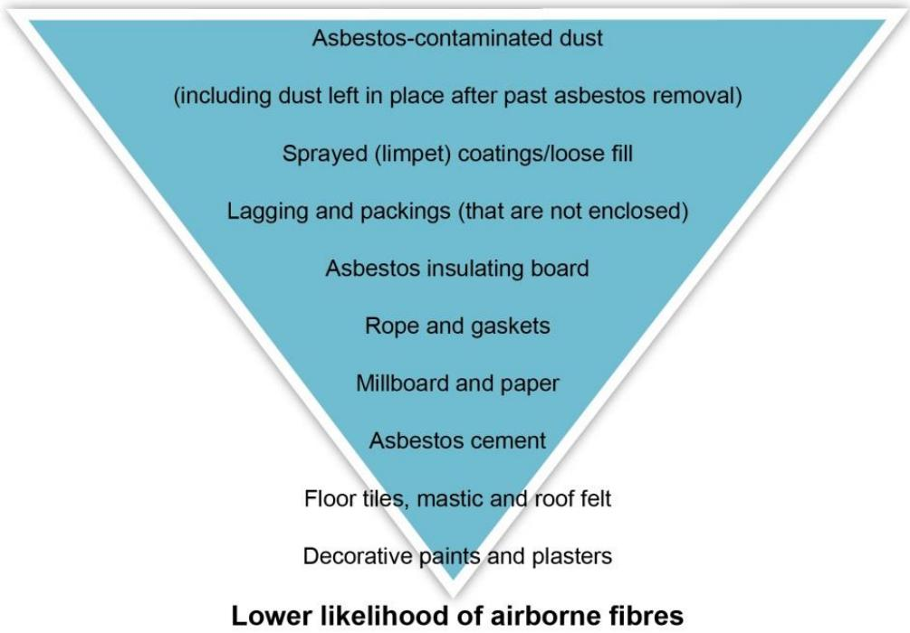
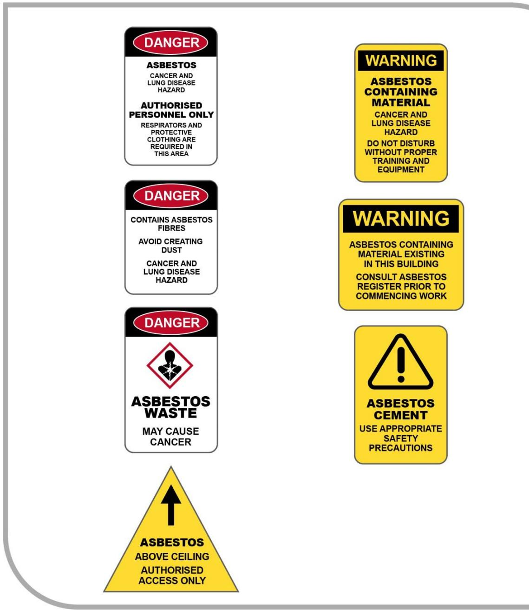

# How to manage and control asbestos in the workplace

Code of Practice

# Disclaimer

Safe Work Australia is an Australian Government statutory agency established in 2009. Safe Work Australia includes Members from the Commonwealth, and each state and territory, Members representing the interests of workers and Members representing the interests of employers.

Representing the interests of employers.

Safe Work Australia works with the Commonwealth, state and territory governments to improve work health and safety and workers' compensation arrangements. Safe Work Australia is a national policy body, not a regulator of work health and safety. The Commonwealth, states and territories have responsibility for regulating and enforcing work health and safety laws in their jurisdiction.

ISBN 978- 0- 642- 33315- 5 (PDF)  ISBN 978- 0- 642- 33316- 2 (DOCX)

# Creative Commons

This copyright work is licensed under a Creative Commons Attribution- Noncommercial 4.0 International licence. To view a copy of this licence, visit creativecommons.org/licenses. In essence, you are free to copy, communicate and adapt the work for noncommercial purposes, as long as you attribute the work to Safe Work Australia and abide by the other licence terms.

Safe Work Australia | info@swa.gov.au | www.swa.gov.au

# Contents

Foreword 5

1. Introduction 7

1.1. What are the prohibitions on asbestos in the workplace? 7  1.2. Who has health and safety duties in relation to managing and controlling asbestos or ACM? 8

2. Managing risks associated with asbestos and ACM 11

2.1. What is involved in managing risks? 11  2.2. Identifying if asbestos or ACM is at the workplace 13  2.3. Assuming asbestos or ACM is present 17  2.4. Arranging a sample to identify asbestos 18  2.5. Indicating the presence of asbestos in the workplace 19  2.6. Assessing the risk of exposure 20

3. Asbestos register 22

3.1. What is an asbestos register? 22  3.2. Reviewing and revising an asbestos register 23  3.3. Accessing an asbestos register 24  3.4. Transferring an asbestos register 24

4. Asbestos management plan 25

4.1. What is an asbestos management plan? 25  4.2. Reviewing an asbestos management plan 26  4.3. Accessing an asbestos management plan 26

5. Managing other asbestos-related risks 27

5.1. Naturally occurring asbestos (NOA) 27  5.2. Contaminated sites 28  5.3. Demolition and refurbishment work 29  5.4. Asbestos- related work 32  5.5. Disposing of asbestos or ACM 37

6. Managing exposure to asbestos or ACM 38

6.1. Measuring exposure to asbestos fibres 38  6.2. Health monitoring 39  6.3. Training workers about asbestos or ACM 41  6.4. Limited use of equipment 42

7. Controlling the risks 43

7.1. Applying the hierarchy of control measures 43  7.2. Removing asbestos 43  7.3. Enclosing asbestos 44  7.4. Encapsulating and sealing asbestos 45

7.5. Tools and equipment. 467.6. Safe work practices. 477.7. Personal protective equipment. 477.8. Laundering clothing. 497.9. Cleaning up. 49Appendix A—Glossary. 51Appendix B—Sampling process. 55Step 1—Preparation. 55Step 2—Taking the sample. 55Step 3—Cleaning up. 55Appendix C—Examples of warning signs and labels. 57Appendix D—Template of an asbestos register. 58Appendix E—Example of an asbestos register. 59Appendix F—Example of asbestos- related work. 60Working with asbestos friction materials. 60Appendix G—Recommended safe working practices. 63Safe work practice 1—Drilling of ACM. 64Safe work practice 2—Sealing, painting, coating and cleaning of asbestos- cement products. 67Safe work practice 3—Cleaning leaf litter from gutters of asbestos- cement roofs. 70Safe work practice 4—Replacing cabling in asbestos- cement conduits or boxes. 72Safe work practice 5—Working on electrical mounting boards (switchboards) containing asbestos. 75Safe work practice 6—Inspection of asbestos friction materials. 78Amendments. 81

# Foreword

This Code of Practice on how to manage and control asbestos in the workplace is an approved code of practice under section 274 of the Work Health and Safety Act (the WHS Act).

An approved code of practice provides practical guidance on how to achieve the standards of work health and safety required under the WHS Act and the Work Health and Safety Regulations (the WHS Regulations) and effective ways to identify and manage risks.

A code of practice can assist anyone who has a duty of care in the circumstances described in the code of practice. Following an approved code of practice will assist the duty holder to achieve compliance with the health and safety duties in the WHS Act and WHS Regulations, in relation to the subject matter of the code of practice. Like regulations, codes of practice deal with particular issues and may not cover all relevant hazards or risks. The health and safety duties require duty holders to consider all risks associated with work, not only those for which regulations and codes of practice exist.

Codes of practice are admissible in court proceedings under the WHS Act and WHS Regulations. Courts may regard a code of practice as evidence of what is known about a hazard, risk, risk assessment or risk control and may rely on the code in determining what is reasonably practicable in the circumstances to which the code relates. For further information see the Interpretive Guideline: The meaning of 'reasonably practicable'.

Compliance with the WHS Act and WHS Regulations may be achieved by following another method, if it provides an equivalent or higher standard of work health and safety than the code.

An inspector may refer to an approved code of practice when issuing an improvement or prohibition notice.

# Scope and application

This Code is intended to be read by a person conducting a business or undertaking (PCBU). It provides practical guidance to PCBUs on how to manage risks associated with asbestos, asbestos containing material (ACM) and asbestos- contaminated dust or debris (ACD) at the workplace and thereby minimise the incidence of asbestos- related diseases such as mesothelioma, asbestosis and lung cancer.

This Code provides information on how to identify the presence of asbestos at the workplace (including where work is being carried out by a PCBU at a residential premise) and how to implement measures to eliminate or minimise the risk of exposure to airborne asbestos fibres.

It is recommended that other duty holders—for example a PCBU who commissions asbestos removal work at a workplace (PCBU who commissions removal work)—should read this Code to ensure they are aware of mandatory requirements.

This Code may be used by workers and their health and safety representatives and other people affected by asbestos- related work. This Code may also be a useful reference for other persons interested in the duties under the WHS Act and WHS Regulations.

In some cases, the most appropriate control measure determined may be to remove the asbestos. The Code of Practice: How to safely remove asbestos provides further guidance for asbestos removalists so asbestos can be removed while eliminating, or where this is not possible, minimising the exposure of workers and other persons to airborne asbestos.

Other laws relating to matters such as environmental protection, public health, building and construction and local government regulation may apply in addition to the WHS Act and WHS Regulations.

This Code applies to all workplaces covered by the WHS Act where asbestos is present and where products and equipment containing asbestos are used and stored.

Some chapters of this Code will apply to asbestos that is present in residential premises when the premises become a workplace.

# How to use this Code of Practice

This Code includes references to the legal requirements under the WHS Act and WHS Regulations. These are included for convenience only and should not be relied on in place of the full text of the WHS Act or WHS Regulations. The words 'must', 'requires' or 'mandatory' indicate a legal requirement exists that must be complied with.

The word 'should' is used in this Code to indicate a recommended course of action, while 'may' is used to indicate an optional course of action.

# 1. Introduction

# 1.1. What are the prohibitions on asbestos in the workplace?

# WHS Regulation 419

Work involving asbestos or ACM- - prohibitions and exceptions

A person conducting a business or undertaking (PCBU) must not carry out or direct or allow a worker to carry out work involving asbestos if that work involves manufacturing, supplying, transporting, storing, removing, using, installing, handling, treating, disposing of or disturbing asbestos or asbestos- containing materials (ACM), except in prescribed circumstances.

Note: The prohibition on the supply of asbestos also prohibits the sale of asbestos or ACM.

On 31 December 2003, a national ban on all forms of asbestos came into effect, including a prohibition on work involving asbestos or ACM in workplaces. This prohibition does not apply if the work involving asbestos is any of the following:

- genuine research and analysis  
- sampling and identification in accordance with the WHS Regulations  
- maintenance of, or service work on, non-friable asbestos or ACM, fixed or installed before 31 December 2003, in accordance with the WHS Regulations  
- removal or disposal of asbestos or ACM, including demolition, in accordance with the WHS Regulations  
- transport and disposal of asbestos and asbestos waste in accordance with jurisdictional legislation  
- demonstrations, education or practical training in relation to asbestos or ACM  
- display, or preparation or maintenance for display, of an artefact or thing that is, or includes, asbestos or ACM  
- management in accordance with the WHS Regulations of in situ asbestos that was installed or fixed before 31 December 2003  
- work that disturbs asbestos during mining operations that involve the extraction of or exploration for a mineral other than asbestos  
- laundering asbestos-contaminated clothing in accordance with the WHS Regulations, or  
- where the regulator approves the method adopted for managing risk associated with asbestos, or  
- work that is being carried out in accordance with a prohibited asbestos notice issued under section 197B of the Act.

Work involving asbestos- contaminated soil is not prohibited as long as a competent person has determined the soil does not:

- contain any visible ACM or friable asbestos, or  
- if friable asbestos is visible, it does not contain more than trace levels of asbestos determined in accordance with AS 4964-2004: Method for the qualitative identification of asbestos in bulk samples.

The management of naturally occurring asbestos (NOA) that stays in its natural state is not prohibited if managed in accordance with an asbestos management plan (see section 5.1 for more information on the management of NOA).

Although the ultimate goal of this prohibition is for all workplaces to be free of asbestos, it is only when these materials are being replaced or where they present a health risk that non- asbestos alternatives must be used. Caution needs to be taken when working with buildings constructed before 1990, however, new buildings may have used recycled or stockpiled materials and may have reinstated plant or equipment made before 31 December 2003 containing ACM gaskets and/or linings. Caution also needs to be taken when using building products or replacing vehicle gaskets, brake pads and other components manufactured in countries which still use asbestos.

In addition to the prohibition, there is also a restriction on who can remove asbestos. Asbestos removalists and their workers must be competent to carry out asbestos removal work and, except in limited circumstances, must be licensed. Further details on who can remove asbestos can be found in the WHS Regulations and the Code of Practice: How to safely remove asbestos.

# Prohibitions on the import of plant and other materials that contain asbestos

The importation of all types of asbestos and materials containing asbestos into Australia is generally prohibited under the Customs (Prohibited Imports) Regulations 1956 except in limited circumstances. This complements the ban on the use of asbestos or ACM in workplaces. The ban on the importation of all forms of asbestos and asbestos- containing products came into effect on 31 December 2003.

If plant or other materials are imported from countries where asbestos is not yet prohibited, a quality assurance system should be put in place to ensure they do not contain asbestos prior to being imported, supplied or used in Australian workplaces.

Further information on complying with the prohibition on importing goods that contain asbestos or ACM is available on the Department of Home Affairs website.

# 1.2. Who has health and safety duties in relation to managing and controlling asbestos or ACM?

Duty holders who have a role in managing and controlling the risks asbestos or ACM at the workplace include:

- persons conducting a business or undertaking (PCBUs)- designers, manufacturers, importers, suppliers and installers of plant, substances or structures, and- officers.

Workers and other persons at the workplace also have duties under the WHS Act, such as the duty to take reasonable care for their own health and safety at the workplace.

A person can have more than one duty and more than one person can have the same duty at the same time.

Early consultation and identification of risks can allow for more options to eliminate or minimise risks and reduce the associated costs.

# Person conducting a business or undertaking

# WHS Act section 19

Primary duty of care

A PCBU must eliminate risks arising from managing and controlling asbestos, or if that is not reasonably practicable, minimise the risks so far as is reasonably practicable.

The WHS Regulations include more specific requirements for PCBUs to manage the risks of hazardous chemicals, airborne contaminants and plant, as well as other hazards associated with the workplace.

PCBUs have a duty to consult workers about work health and safety and may also have duties to consult, cooperate and coordinate with other duty holders.

# WHS Act section 20

Duty of persons conducting businesses or undertakings involving management or control of workplaces

The WHS Act creates an additional duty for PCBUs with the management or control of the workplace. A person with management or control of a workplace must ensure, so far as is reasonably practicable, that the workplace, the means of entering and exiting the workplace (such as the entries to and exits from the workplace), and anything arising from the workplace are without risks to the health and safety of any person.

# WHS Regulations Part 8.2

General Duty

# WHS Regulation 420

Exposure to airborne asbestos at workplace

The PCBU must ensure that exposure of people at the workplace to airborne asbestos is eliminated so far as is reasonably practicable. If it is not reasonably practicable to eliminate exposure, the PCBU must ensure that the exposure is minimised so far as is reasonably practicable.

The PCBU must also ensure that the exposure standard for asbestos is not exceeded.

The exposure standard for asbestos is a respirable fibre level of 0.1 fibres/mL of air measured in a person's breathing zone and expressed as a time weighted average fibre concentration calculated over an eight- hour working day.

Part 6.1 of this code provides information on measuring exposure to asbestos fibres.

# WHS Regulations Chapter 8

Asbestos

The WHS Regulations include specific obligations for a number of duty holders in relation to managing asbestos. These duties are described in the following chapters of this Code.

# Designers, manufacturers, importers, suppliers and installers of plant, substances or structures

# WHS Act Part 2 Division 3

Further duties of persons conducting businesses or undertakings

Designers, manufacturers, importers, suppliers and installers of plant, substances or structures must ensure, so far as is reasonably practicable, the plant, substance or structure they design, manufacture, import or supply is without risks to health and safety. This duty includes carrying out testing and analysis as well as providing specific information about the plant, substance or structure.

# Officers

# WHS Act section 27

Duty of officers

Officers, for example company directors, have a duty to exercise due diligence to ensure that the business or undertaking complies with the WHS Act and WHS Regulations. This includes taking reasonable steps to ensure that the PCBU has and uses appropriate resources and processes to eliminate or minimise risks that arise from work involving asbestos, including asbestos management, at the workplace. Further information on who is an officer and their duties is available in the Interpretive Guideline: The health and safety duty of an officer under section 27.

# Workers

# WHS Act section 28

Duties of workers

Workers have a duty to take reasonable care for their own health and safety and to not adversely affect the health and safety of other persons. Workers must comply with reasonable instructions, as far as they are reasonably able, and cooperate with reasonable health and safety policies or procedures that have been notified to worker.

Other persons at the workplace

# WHS Act section 29

Duties of other persons at the workplace

Other persons at the workplace, like visitors, must take reasonable care for their own health and safety and must take reasonable care not to adversely affect other people's health and safety. They must comply, so far as they are reasonably able, with reasonable instructions given by the PCBU to allow that person to comply with the WHS Act.

# 2. Managing risks associated with asbestos and ACM

# 2.1. What is involved in managing risks?

# WHS Regulations Part 8.3

Management of Asbestos and Associated Risks

This Code provides guidance on how to manage the risks associated with asbestos and ACM using the following systematic process:

- Identify hazards--for asbestos this means identifying asbestos and ACM at the workplace and recording it in the asbestos register (see Chapter 3). When conducting asbestos-related work, a person conducting a business or undertaking (PCBU) is also required to find out what else could cause harm.- Assess risks, if necessary--for asbestos and ACM this means assessing the risk of exposure to airborne asbestos. A PCBU is also required to understand the nature of the harm that could be caused by other hazards, how serious the harm could be and the likelihood of it happening. This step may not be necessary if you are dealing with a known risk with known controls.- Eliminate risks so far as is reasonably practicable.- Control risks--if it is not reasonably practicable to eliminate the risk, implement the most effective control measures that are reasonably practicable in the circumstances in accordance with the hierarchy of control measures, and ensure they remain effective over time.- Review control measures to ensure they are working as planned.

# WHS Regulation 420

Exposure to airborne asbestos at workplace

As a PCBU, you must ensure that exposure of a person at the workplace to airborne asbestos is eliminated so far as is reasonably practicable. If this is not reasonably practicable, you must ensure the exposure is minimised so far as is reasonably practicable.

As a PCBU you must ensure the exposure standard for asbestos is not exceeded at the workplace.

# Hierarchy of control measures

The WHS Regulations require duty holders to work through the hierarchy of control measures when managing certain risks; however, the hierarchy of control measures can also be applied to managing other risks, such as those arising from asbestos- related work.

The hierarchy ranks control measures from the highest level of protection and reliability to the lowest.

When choosing the most appropriate control measures for managing risks associated with asbestos, the following hierarchy of controls should be considered:

First, eliminate risks by eliminating hazards (for example, removing the asbestos); this is the most effective control measure. If eliminating the risk is not reasonably practicable, then substitute hazards with something safer, isolate hazards from people and/or use engineering controls to minimise any risks that have not been eliminated (for example enclosing, encapsulating, or sealing asbestos or using certain tools). Use administrative controls to minimise any remaining risks (for example, safe work practices), so far as is reasonably practicable. Use personal protective equipment (PPE) to minimise any risks that remain.

Administrative control measures and PPE do not control the hazard at the source. They rely on human behaviour and supervision and used on their own tend to be the least effective in minimising risks.

A combination of these controls may be required in order to adequately manage and control risks associated with asbestos or ACM. Chapter 7 of this Code provides more information on the different control measures that can be used.

The control measures you apply may change the way work is carried out. In these situations, you must consult your workers and develop safe work procedures, and provide your workers with training, instruction, information and supervision on the changes.

Further guidance on the risk management process and the hierarchy of control measures is available in the Code of Practice: How to manage work health and safety risks.

# Consulting workers

# WHS Act section 47

Duty to consult workers

As a PCBU, you must consult, so far as is reasonably practicable, with workers who carry out work for the business or undertaking who are (or are likely to be) directly affected by a work health and safety matter.

This duty to consult is based on the recognition that worker input and participation improves decision- making about health and safety matters and assists in reducing work- related injuries and disease.

The broad definition of a 'worker' under the WHS Act means a PCBU must consult, so far as is reasonably practicable, with contractors and subcontractors and their employees, on- hire workers, outworkers, apprentices, trainees, work experience students, volunteers and other people who are working for the PCBU and who are, or are likely to be, directly affected by a health and safety matter.

Workers are entitled to take part in consultations and to be represented in consultations by a health and safety representative who has been elected to represent their work group.

# WHS Act section 48

Nature of consultation

If the workers are represented by a health and safety representative, the consultation must involve that representative.

Consultation with workers and their health and safety representatives is a critical part of managing work health and safety risks.

Consulting with and involving workers in the identification and safe handling of asbestos can assist in ensuring that safety instructions and safe work practices are complied with.

Health and safety representatives must have access to relevant information on matters that can affect the health and safety of workers, for example asbestos exposure data and the asbestos register.

# Consulting, cooperating and coordinating activities with other duty holders

# WHS Act section 46

Duty to consult with other duty holders

The WHS Act requires that you, as a PCBU, consult, cooperate and coordinate activities with all other persons who have a work health or safety duty in relation to the same matter, so far as is reasonably practicable.

There is often more than one business or undertaking involved when asbestos- related work is being carried out, who may each have responsibility for the same health and safety matters, either because they are involved in the same activities or share the same workplace.

In these situations, each duty holder should exchange information to find out who is doing what and work together in a cooperative and coordinated way so risks are eliminated or minimised so far as is reasonably practicable.

For example, the owner of an arcade is renovating one of the shops for a new tenant to move into. The building owner has engaged a number of contractors to carry out the renovation work including demolishing a wall. In this example:

the building owner has management and control over the workplace and is responsible for ensuring the current asbestos register is updated due to the work that is being carried out the building owner consults other tenants that may be impacted by the renovation work on the: identification of asbestos, and what will need to be done if asbestos is disturbed, and as the work begins, the building owner, contractors and tenants all cooperate with each other and coordinate their activities to protect any persons from potential exposure to asbestos.

Further guidance on consultation is available in the Code of Practice: Work health and safety consultation, cooperation and coordination.

# 2.2. Identifying if asbestos or ACM is at the workplace

This section does not apply to naturally occurring asbestos (NOA).

# WHS Regulation 422

Asbestos to be identified or assumed at workplace

A person with management or control of a workplace must ensure, so far as is reasonably practicable, that all asbestos or ACM at the workplace is identified by a competent person.

Identifying asbestos or ACM is the first step in managing the risk of exposure to asbestos in the workplace. As there may be more than one person in the workplace responsible for this duty, it is important that all duty holders consult, cooperate and coordinate with each other as well as consulting with workers and health and safety representatives. For example, the person with control of the workplace may carry out the task of identifying asbestos with the person who has day- to- day management of the workplace to ensure it has been done accurately.

If the person with management or control of the workplace assumes that asbestos or ACM is present, or if they have reasonable grounds to believe that asbestos is not present, a competent person does not need to be engaged to make this decision.

Who can be a competent person?

# WHS Regulation 5

Definitions: (see competent person

The WHS Regulations define a competent person to be someone who has acquired knowledge and skills to carry out the task through training, a qualification or experience. This may mean that the competent person who can identify asbestos is:

trained to handle and take asbestos samples, have the knowledge and experience to identity suspected asbestos and be able to determine risk and control measures familiar with building and construction practices to determine where asbestos is likely to be present, and/or able to determine that material may be friable or non- friable asbestos and evaluate its condition.

There may be a person within the business who is competent to identify asbestos. If there is not, an external competent person should be engaged. Persons who may be considered to be competent in the identification of asbestos if they meet the criteria outlined above include:

occupational hygienists who have experience with asbestos licensed asbestos assessors asbestos removal supervisors individuals who have a statement of attainment in the unit competency for asbestos assessors, or a person working for an organisation accredited by NATA under AS/NZS ISO/IEC 17020:2013: Conformity assessment - Requirements for the operation of various types of bodies performing inspection.

A 'competent person' for the purpose of clearance inspections for asbestos removal needs to have different skills and experience.

# Factors to consider when identifying asbestos

The person who is carrying out the task of identifying asbestos should have all relevant information so they can correctly identify where asbestos is located in the workplace. For example, this might mean obtaining information on the products used in making the building, structure or plant, including building plans, design specifications, and correspondence with builders and plant manufacturers. The person carrying out the task might also collect relevant information by consulting workers in the workplace.

There are a number of factors that may be taken into account to identify or assume that asbestos is present in a workplace. These include:

Table 1 Factors to consider when identifying asbestos  

<table><tr><td colspan="2">Factors to consider when identifying asbestos</td></tr><tr><td>When was the building constructed?</td><td>Asbestos was widely used as construction and insulation material in buildings until the late 1980s when bans on its manufacture and use were put in place. However, the use of asbestos was only completely prohibited on 31 December 2003. As the bans were not absolute prior to 2003 and building materials may have been stockpiled, stored, or recycled and used, it is possible that asbestos may be present in buildings that were constructed before 31 December 2003 and possibly later.</td></tr><tr><td>Were there any refurbishments or additions to the building prior to 31 December 2003?</td><td>Any refurbishment or extensions to the original building prior to 1990 and potentially before 31 December 2003 may have involved the use of asbestos. Even if the original parts of the building did not contain asbestos, it should not be assumed that subsequent additions have no asbestos. Some building products supplied to Australian workplaces are manufactured in countries where asbestos is still used. While the importation of products containing asbestos was prohibited on 31 December 2003, the importer or supplier should be contacted to confirm if products have been tested to ensure they do not contain asbestos and a test certificate should be obtained.</td></tr><tr><td>What type of material was used to construct the building?</td><td>The main construction materials used are made from timber, brick, steel and cement sheet. If cement sheet is present and was installed up until 1990, it is likely to contain asbestos bonded to the cement particles. For example, a roof made from corrugated cement sheeting is likely to contain asbestos. Areas of buildings that are prone to wet conditions may contain asbestos in the walls and floors due to its hardness and waterproofing qualities compared to other materials. For example, bathrooms, toilets and laundries may have asbestos sheeting or vinyl tiles. Likewise, pipes throughout the building that carry water and sewage may also contain asbestos.</td></tr><tr><td>Talk to designers, manufacturers or suppliers of plant, or refer to design plans</td><td>Asbestos may be present in specific parts of plant, like gaskets, insulation and friction brake products, installed in workplaces before 31 December 2003. However, time limited exemptions were allowed where asbestos was used for specific applications, including:
- gaskets for use with saturated steam, superheated steam, or with substances classified as dangerous goods and as being toxic or very toxic (31 December 2004)
- gaskets for use in liquid chlorine plant designed to operate at 45 degrees Celsius and 1500 kPa pressure (31 December 2006)</td></tr></table>

# Factors to consider when identifying asbestos

- vanes for rotary vacuum pumps or compressors (31 December 2007)- split face seals used to prevent leaks from cooling water pumps in coal-fired power stations (31 December 2007)- diaphragms used in electrolytic cells in existing NaCl electrolysis plants, also known as chlor-alkali plants (31 December 2006), and- mission-critical defence components (31 December 2010).

If there is plant in the workplace that was designed, built and installed before 31 December 2003 the supplier, manufacturer or designer of the plant should be consulted to find out if asbestos is present and, if possible, obtain this advice in writing. If this is not possible, review the design plans and seek advice from an experienced engineer or plant designer.

Some components, including friction materials, supplied to Australian workplaces are manufactured in countries where asbestos is still used. While importation of products containing asbestos was prohibited on 31 December 2003, the importer or supplier should be contacted to confirm if products have been tested to ensure they do not contain asbestos and a test certificate should be obtained.

Quality assurance systems or checks should be in place to confirm whether asbestos is present.

Talk to workers who have worked at the workplace for a long time

Speaking with experienced workers will assist in the identification process as they may be aware of the history of the building, including its age, construction, renovation or repairs, and may know where asbestos is located in the workplace.

Visually inspect the workplace to identify asbestos, ACM and inaccessible areas

A thorough inspection of all areas of the workplace must be conducted, including all buildings, structures, ceiling spaces, cellars, shafts, storage areas and wall cavities.

Material needs to be considered to contain asbestos unless proven otherwise if:

- it cannot be identified- there is uncertainty as to whether it contains asbestos, and- it is inaccessible.

The design plans for a building, structure, ship or plant may assist in identifying inaccessible areas, as would discussion with builders, architects, manufacturers of plant and maintenance workers. Knowledge of materials used in the construction of the building or experience and findings from inspections of similar sections of the building (or similar buildings) may also assist.

Take notes and photographs

Taking notes and photographs while the inspection is being conducted can assist in producing the asbestos register.

# 2.3. Assuming asbestos or ACM is present

This section does not apply to naturally occurring asbestos (NOA).

# WHS Regulation 422

Asbestos to be identified or assumed at workplace

A person with management or control of a workplace must:

assume material is asbestos or ACM if it cannot be identified but a competent person reasonably believes it is asbestos or ACM, and assume asbestos is present if part of the workplace is inaccessible (that is, cannot be accessed during normal daily activities or routine maintenance) and it is likely to contain asbestos or ACM.

It is not necessary to engage a competent person to identify asbestos if:

the person with management or control of the workplace assumes that asbestos is present, or that person has reasonable grounds to believe that asbestos is not present.

If there is uncertainty as to whether asbestos is present in any part of a structure or plant, the person with management or control of the workplace can either assume asbestos is present and treat it with appropriate caution based on the level of risk or have a sample analysed. If it is assumed to be asbestos, there is no need to take a sample for analysis. This means the suspect material can remain undisturbed and the time and cost of sampling and analysis is avoided.

The person with management or control of a workplace can assume asbestos or ACM is not present as long as this assumption is based on reasonable grounds, which may include:

a workplace is constructed post- 1990 and there is no plant or equipment made before 31 December 2003 buildings constructed after 31 December 2003 where the building is constructed (including the roof) wholly of metal, brick or concrete, and has no internal walls that are made of fibro, gyprock or similar cladding, for instance a corrugated iron shed or a Colorbond® type warehouse building constructed of double brick with bare brick internally. Flooring (vinyl tiles), switchboards and under- eaves lining should also be considered where a register indicates that all the identified and assumed asbestos has been removed.

Once the presence and location of asbestos has been assumed:

all requirements for managing asbestos must be followed until the material is removed or testing has confirmed that it is not or does not contain asbestos the workplace asbestos register must include all the presumptions made about materials in the workplace with a simple, generic statement such as, 'Roof sheeting is presumed to contain asbestos' or 'All underground conduits are presumed to contain asbestos.'

# Inaccessible areas

If there are inaccessible areas in the workplace that a competent person has identified as likely to have asbestos or ACM, it must be assumed they contain asbestos until they are accessed and it is determined whether asbestos is present or not.

As a general rule, an inaccessible area is an area that cannot be accessed during normal daily activities or routine maintenance. The following areas are not regarded as 'inaccessible areas' and must be inspected or assumed to contain asbestos:

locked rooms crawl spaces basement and cellars storage areas ceiling spaces fire doors locked security safes.

Examples of inaccessible areas that may contain asbestos or ACM are:

a cavity in a building that is completely (or almost completely) enclosed and suspected of containing asbestos (based on where asbestos is located elsewhere in the building) where access is only possible through destruction of part of the walls of the cavity the inner lining of an old boiler pressure vessel (information on this type of vessel suggests it contains asbestos) which is not accessible due to the design and operation of the boiler and access can only be via partial destruction of the outer layer vinyl tiles that may contain asbestos, which have had a number of layers of non- ACM placed over them and secured, where the layers above it have been well secured and require some form of destruction in order to access the vinyl that may contain asbestos enclosed riser shafts in multistorey buildings containing cables that may be insulated with ACM air- conditioning ducts that may contain asbestos gaskets and linings.

Accessing fire door and security safe cores to determine whether they contain asbestos may create a risk, for example drilling can result in the release of airborne asbestos. If this is the case, cores should not be accessed and must be assumed to contain asbestos until otherwise proven (for instance during maintenance when access is obtained) or information is obtained from the supplier. Fire doors may have a compliance tag on the door jamb stating the fire rating and a compliance date. This can provide an indication of whether the door is likely to contain asbestos.

# 2.4. Arranging a sample to identify asbestos

This section does not apply to naturally occurring asbestos (NOA).

# WHS Regulation 423

Analysis of sample

A person with management or control of a workplace may identify asbestos or ACM by arranging for a sample of material at the workplace to be analysed for the presence of asbestos or ACM.

A sample must only be analysed by:

a NATA- accredited laboratory accredited for the relevant test method a laboratory approved by the regulator, or a laboratory operated by the regulator.

It can be difficult to tell whether a material contains asbestos simply by looking at it, unless it is labelled. If a material has been imported from overseas, it may not be labelled as

containing asbestos. Therefore, a sample should be taken and analysed unless the decision was made to assume the material contains asbestos.

Only a competent person may take the samples for analysis because of the increased health risk of fibres being released during the process. If the sampling process is conducted incorrectly, it can be more hazardous than leaving the material alone. All asbestos samples must be analysed by a NATA- accredited laboratory or one that is approved or operated by the relevant regulator. Any sample taken should be sealed within a container, or double bagged using heavy duty plastic (200  $\mu$ m thickness polyethylene) bags, and appropriately labelled.

Once the results of the sampling are known, the person with management or control of the workplace must ensure the asbestos register is updated to indicate that the material is asbestos or is assumed to be.

If asbestos is stable, non- friable and will not be disturbed, it should be left alone. Only material that is damaged or will be disturbed should be sampled. If the material may contain asbestos and it is decided not to take samples, an assumption must be made that the material contains asbestos.

Appendix B provides a procedure that a competent person can follow when undertaking sampling.

# 2.5. Indicating the presence of asbestos in the workplace

This section does not apply to naturally occurring asbestos (NOA).

# WHS Regulation 424

Presence and location of asbestos to be indicated

A person with management or control of a workplace must ensure the presence and location of:

- all asbestos or ACM identified at the workplace is clearly indicated, and- all asbestos or ACM assumed to be at the workplace, including where the asbestos is inaccessible, is clearly indicated.

If reasonably practicable, the presence and location of the asbestos or ACM must be indicated by a label. However, it may be more appropriate to use signs. Examples of labels or signs that can be used to indicate the presence and location of asbestos or ACM are shown at Appendix C. These examples provide an indication of the words that may be used—these words are not mandatory.

# Labels

If a person with management or control of a workplace uses labels to identify the presence and location of asbestos or ACM, they may seek advice from a competent person on the number and positions of labels required. The location of labels should be consistent with the location listed in the asbestos register.

If a risk assessment suggests asbestos may be disturbed or people are likely to be exposed and it is not reasonably practicable to label asbestos directly, a prominent warning sign should be posted in its immediate vicinity. For example, if floor tiles have been identified as containing asbestos, an appropriate warning sign may be displayed on an adjacent wall.

# Warning signs

All warning signs should comply with AS 1319- 1994: Safety signs for the occupational environment.

Any areas of a workplace that contain asbestos, including plant, equipment and components, should be signposted with warning signs to ensure the asbestos is not unknowingly disturbed without the correct precautions being taken. These signs should be weatherproof, constructed of lightweight material and adequately secured. Signs should be placed at all the main entrances to the work areas where asbestos is present.

Where it is not reasonably practicable to use labels or warning signs to indicate the presence and location of asbestos or ACM, ensuring workers such as plumbers, electricians and carpenters are informed about the presence and location of asbestos before they commence work may be achieved by implementing a permit- to- work system. The presence and location of the asbestos should be entered on site plans and the asbestos register and be accessible to all workers to ensure they are aware of the presence of asbestos.

# 2.6. Assessing the risk of exposure

This section does not apply to naturally occurring asbestos (NOA).

If asbestos or ACM is in good condition and left undisturbed, it is unlikely that airborne asbestos will be released into the air and the risk to health is extremely low. It is usually safer to leave it and review its condition over time. However, if the asbestos or ACM has deteriorated, has been disturbed, or if asbestos- contaminated dust is present, the likelihood that airborne asbestos will be released into the air is increased.

The type of material that binds asbestos fibres will influence the potential for airborne asbestos to be released into the air from different asbestos or ACM. For example, a loosely bound sprayed (or limpet) coating is more likely to release fibres when disturbed than asbestos cement in which fibres are firmly bound.

The following list ranks different types of asbestos according to the likelihood that airborne asbestos can be released into the air if it has deteriorated or been disturbed. The potential risk to health is greater for items higher up the list if people are exposed to airborne asbestos, but any of the materials listed can produce asbestos fibres if they are disturbed.

  
Figure 1 List ranking the different types of asbestos according to the likelihood that airborne asbestos can be released into the air if it has deteriorated or been disturbed

When deciding if there is a risk to health from asbestos, consider whether the asbestos or ACM is:

- in poor condition- likely to be further damaged or to deteriorate- likely to be disturbed due to work practices carried out in the workplace (for example routine and maintenance activities and their frequency), or- in an area where workers are exposed to the material.

A visual inspection of the material, its location and an understanding of the work practices at the workplace will assist this decision.

Asbestos- related work activities (including maintenance) plus unusual and infrequent activities (such as emergency activities) need to be considered. Also take into account the proximity of the asbestos or ACM to where employees work, as this can affect the potential for exposure if asbestos fibres become airborne.

The following are examples of activities that could pose a risk to health:

- following are examples of activities that could pose a risk to health:- forklifts driving adjacent to asbestos cement (AC) sheet walls may damage these sheets from accidental impacts during the course of work- plumbers working on a long pipe that does not have asbestos insulation where the work is being done may cause disturbance to asbestos-containing insulation on the pipe some metres away- electricians wiring in a ceiling space sprayed with material containing friable asbestos may disturb this material, and- acid fumes from an acid bath located next to an asbestos-cement wall or below an asbestos cement roof may cause deterioration of the asbestos material over time.

# 3. Asbestos register

This chapter does not apply to residential premises or naturally occurring asbestos (NOA).

# WHS Regulation 425

Asbestos register

A person with management or control of a workplace must ensure an asbestos register is prepared and kept at the workplace. The asbestos register must be maintained to ensure the information in the register is up to date.

Note: An asbestos register is not required to be prepared when:

the workplace is a building that was constructed after 31 December 2003, and no asbestos has been identified at the workplace, and no asbestos is likely to be present at the workplace from time to time.

However, if asbestos is identified, a person with management or control of a workplace must ensure a register is prepared for the workplace.

# 3.1. What is an asbestos register?

The asbestos register is a document that lists all identified (or assumed) asbestos in a workplace. The asbestos register is intended to ensure workers and others in the workplace do not accidently disturb asbestos. The asbestos register must:

record any asbestos or ACM that has been identified or is likely to be present at the workplace from time to time. This would include: the date on which the asbestos or ACM was identified (or assumed) the location, type and condition of the asbestos; or state that no asbestos or ACM has been identified at the workplace if the person knows that: asbestos or ACM has not been identified (or assumed) to be present at the workplace, and asbestos or ACM is not likely to be present from time to time at the workplace.

Appendix D provides a template of an asbestos register, while Appendix E provides an example of how it should be completed.

A comprehensive asbestos register may also include:

details of any asbestos assumed to be in the workplace results of any analysis that confirms a material at the workplace is or is not asbestos dates when the identification was carried out details of inaccessible areas, and details of any past asbestos removal work.

It may also be useful to attach photographs or drawings to visually show the location of the asbestos or ACM in the workplace.

# What if an asbestos register already exists at the workplace?

If an asbestos register already exists at the workplace there is no need to create another one. The existing register must be reviewed and revised if necessary (see section 3.2) and must be readily accessible (see section 3.3).

Persons conducting a business or undertaking (PCBUs) who are carrying out or intend to carry out work at a workplace should obtain the current asbestos register and identify any asbestos or ACM that they have management or control of (for example asbestos in items of plant). The person with management or control of the workplace should be advised if asbestos or ACM is identified or could be assumed to be present and it is not included in the asbestos register for the workplace.

If workers consider that the work they are about to do will disturb asbestos, they should talk to the person with management or control of the workplace or their health and safety representative.

# Where asbestos is only temporarily in the workplace

In some cases it may not be necessary to include information in the asbestos register on asbestos or ACM that is only temporarily present in the workplace. For example, if plant that contains asbestos is being repaired at the workplace but it is only there for a short period while being repaired, it does not need to be recorded in the asbestos register. However, if plant is often at the workplace (for example where the company specialises in repairing plant that typically contains asbestos) the PCBU must include this in the asbestos register.

# Where there is no asbestos register at the workplace

An asbestos register is not required if a workplace has been constructed after 31 December 2003 and if no asbestos has been identified or will be at the workplace from time to time.

If there is no asbestos register at the workplace but asbestos is identified during the course of any work being carried out, the person with management or control of the workplace should be advised. When a person with management or control of the workplace has been advised about the possible identification of asbestos or ACM in the workplace, they must arrange for a competent person to identify it. If asbestos is identified by the competent person (or the person with management or control of the workplace assumes asbestos or ACM is present), the person with management or control of the workplace must ensure an asbestos register is prepared and kept at the workplace.

As there is no requirement for an asbestos register to be kept at residential premises, the PCBU must advise the homeowner or landlord if asbestos is identified and take appropriate action in managing asbestos risks.

# 3.2. Reviewing and revising an asbestos register

# WHS Regulation 426

Review of asbestos register

A person with management or control of a workplace must ensure an asbestos register is reviewed and where necessary revised by the PCBU (or a competent person engaged by the PCBU) if:

the asbestos management plan is reviewed

- further asbestos or ACM is identified at the workplace- asbestos is removed from or disturbed, sealed or enclosed at the workplace, or- refurbishment or demolition work is to be undertaken.

The register should be reviewed at least once every five years to ensure it is kept up to date.

When reviewing the asbestos register, the person with management or control of the workplace should carry out a visual inspection of the asbestos and ACM listed to determine its condition and revise the asbestos register as appropriate. Previous asbestos registers and records relating to asbestos removal jobs, for instance clearance certificates, can assist in identifying all asbestos and ACM in the workplace.

# 3.3. Accessing an asbestos register

# WHS Regulation 427

Access to asbestos register

The person with management or control of the workplace must ensure that if an asbestos register must be kept at the workplace that it is readily accessible to:

- a worker who has carried out, carries out or intends to carry out work at the workplace- health and safety representatives who represent workers that carry out or intend to carry out work at the workplace- a PCBU who has carried out, carries out or intends to carry out work at the workplace, and- a PCBU who has required, requires or intends to require work to be carried out at the workplace.

Where work is being carried out or is about to be carried out at the workplace by a PCBU and that work involves a risk of exposure to airborne asbestos, the person with management or control of the workplace must provide a copy of the asbestos register to that person.

# 3.4. Transferring an asbestos register

# WHS Regulation 428

Transfer of asbestos register by person relinquishing management or control

If the person with management or control of a workplace plans to relinquish management or control of the workplace (for instance when selling the workplace or the business or undertaking), they must ensure, so far as is reasonably practicable, that a copy of the asbestos register is given to the person who is assuming management or control of the workplace.

# 4. Asbestos management plan

This chapter does not apply to residential premises.

# WHS Regulation 429

Asbestos management plan

A person with management or control of a workplace must ensure a written asbestos management plan is prepared for the workplace if asbestos or ACM has been identified or assumed present, or is likely to be present from time to time at the workplace.

The person with management or control of a workplace must ensure the asbestos management plan is maintained to ensure the information is up to date.

# 4.1. What is an asbestos management plan?

An asbestos management plan sets out how asbestos or ACM that is identified at the workplace will be managed, for example what, when and how it is going to be done.

An asbestos management plan must include information about the following:

the identification of asbestos and ACM, for example a reference or link to the asbestos register for the workplace, and the locations of signs and labels decisions, and reasons for the decisions, about the management of asbestos at the workplace, for example safe work procedures and control measures procedures for detailing accidents, incidents or emergencies involving asbestos at the workplace, and workers carrying out work involving asbestos, for example consultation, information and training responsibilities.

Other information that may be included in the asbestos management plan is:

an outline of how asbestos risks will be controlled, including consideration of appropriate control measures a timetable for managing risks of exposure, for example priorities and dates for any reviews, circumstances and activities that could affect the timing of action identification of each person with responsibilities under the asbestos management plan and the person's responsibilities procedures, including a timetable for reviewing and, if necessary, revising the asbestos management plan and asbestos register, and air monitoring procedures at the workplace, if required.

# 4.2. Reviewing an asbestos management plan

# WHS Regulation 430

Review of asbestos management plan

The person with management or control of the workplace must ensure the asbestos management plan is reviewed and, if necessary, revised at least once every five years or when:

there is a review of the asbestos register or a control measure asbestos is removed from or disturbed, sealed or enclosed at the workplace the plan is no longer adequate for managing asbestos or ACM at the workplace, or a health and safety representative requests a review on the basis that they reasonably believe that any of the matters listed in the above points affects or may affect the health and safety of a member of their work group and the asbestos management plan was not adequately reviewed in response to the matter.

# 4.3. Accessing an asbestos management plan

# WHS Regulation 429

Asbestos management plan

The person with management or control of the workplace must ensure the asbestos management plan is readily accessible to:

a worker who has carried out, carries out or intends to carry out work at the workplace health and safety representatives who represent workers who carry out or intend to carry out work at the workplace a person conducting a business or undertaking (PCBU) who has carried out, carries out or intends to carry out work at the workplace, and a PCBU who has required, requires or intends to require work to be carried out at the workplace.

The asbestos management plan should be kept at the workplace to ensure it is accessible.

# 5. Managing other asbestos-related risks

# 5.1. Naturally occurring asbestos

# WHS Regulations Part 8.4

Management of naturally occurring asbestos

A person with management or control of a workplace must manage the risks associated with naturally occurring asbestos (NOA) at the workplace.

NOA is defined in the WHs Regulations as the natural geological occurrence of asbestos minerals found in association with geological deposits including rock, sediment or soil.

If NOA is identified at the workplace or is likely to be present at the workplace, a written asbestos management plan must be prepared and maintained to ensure the information is up to date.

# What is NOA?

In the majority of workplaces, the asbestos that is encountered and poses a risk to health and safety will be found in manufactured products. However, some workplaces may have to deal with asbestos in its natural state. NOA may be encountered in road building, site and construction work, and other excavation activities. Asbestos may occur in veins within rock formations.

# Requirements to manage NOA

Due to the difficulties in fully describing the location and extent of a NOA deposit in an asbestos register, there is no requirement for NOA be listed in an asbestos register. However, any NOA identified or assumed at a workplace must be included on the asbestos management plan for the workplace or be the subject of a new asbestos management plan. This is to ensure steps are put in place, as with all other asbestos encountered in workplaces, to ensure that risks of exposure from NOA are assessed and managed.

# Preparing an asbestos management plan

Information on the contents, review and accessibility of asbestos management plans can be found in Chapter 4 of this Code.

When preparing an asbestos management plan for NOA, the following should be considered:

- isolating the workplace or part of the workplace until controls are in place- deviating excavation to ensure avoidance of the deposit, where possible- using sealed excavation or mining equipment (air-conditioned cabins with filtered air)- maintaining regular surveillance of the rock by a competent person to ensure minimal disturbance of suspected fibrous minerals- developing procedures for the safe disposal of asbestos waste, if required, and- educating workers in safe work practices.

# Managing NOA

Ongoing management of NOA may be determined with the aid of an air monitoring program to assess asbestos exposure levels and the effectiveness of specific risk control measures.

The person with management or control of the workplace must ensure the risks to health and safety associated with NOA- - i.e. the release of airborne asbestos- - are minimised using the hierarchy of control measures. This can be done by:

wetting surfaces to reduce the dust levels suppressing, containing and extracting dust in processing operations (water sprays or local exhaust at transfer points and vibrating screens). using wet drilling or other approved in- hole dust suppression preventing the spread of contamination by using wash down facilities providing information to and training and supervision of all workers potentially at risk, and ensuring PPE is used where required.

# Training of workers

Training of workersTraining on the hazards and risks associated with NOA must be provided to workers who carry out work where NOA is found. Section 6.3 of this Code provides further information on training workers about asbestos.

# 5.2. Contaminated sites

# WHS Regulation 425

Asbestos register

# WHS Regulation 429

Asbestos management plan

Sites contaminated with asbestos become a workplace when work is carried out there. The WHS Regulations require that, where asbestos is identified by a competent person as contaminating a workplace, an asbestos register (see Chapter 3) and an asbestos management plan (see Chapter 4) must be created for the site.

The management and remediation of sites contaminated with asbestos from illegal dumping and demolition is a specialised task. In some instances, site remediation may entail removal of asbestos and ACM from the site; in other cases this may not be practicable, and other management strategies should be used. The need to engage specialists, who may include licensed asbestos removalists, will depend on the type and quantity of asbestos, ACM or ACD identified at the site. It is highly recommended that specialists are engaged for all but the most minor of non- friable contaminations.

The Code of Practice: How to safely remove asbestos provides detailed guidance on appropriate work methods and extra controls for the removal of asbestos.

The National Environment Protection Council's National Environmental Protection (Assessment of Site Contamination) Measure (NEPM) sets out the general principles for assessment and remediation of sites contaminated with a number of hazardous materials including asbestos. It is recommended that a PCBU who has a workplace that is, or is suspected of being, contaminated with asbestos should engage specialists with the appropriate competencies and experience described in the NEPM Schedule B9- Guideline on competencies & acceptance of environmental auditors.

# 5.3. Demolition and refurbishment work

This section applies to the demolition or refurbishment of a structure or plant constructed or installed before 31 December 2003.

# WHS Regulations Part 8.6

Demolition and Refurbishment

Prior to any demolition or refurbishment work being carried out, a person with management or control of a workplace must:

review the asbestos register- if the register is considered inadequate for the proposed demolition then it must be revised provide a copy of the asbestos register to the PCBU carrying out the demolition or refurbishment work, and ensure asbestos or ACM that is likely to be disturbed is identified and, so far as is reasonably practicable, removed before the demolition or refurbishment commences.

The requirement to identify and remove asbestos or ACM prior to demolition does not apply to certain emergency situations where a structure or plant is structurally unsound, or collapse of the plant or structure is imminent. Further, asbestos or ACM does not need to be removed prior to demolition work if the purpose of the demolition is to gain access to the asbestos or ACM.

The PCBU who will carry out demolition or refurbishment at a workplace must obtain a copy of the asbestos register before they commence the work.

Examples of demolition may include:

complete dismantling of a decommissioned industrial plant total destruction of a building or part of a building, including those damaged by fire, an accident or by a natural disaster where an emergency circumstance does not exist total destruction of an old boiler for the purpose of disposal.

Examples of refurbishment may include the partial dismantling of:

a boiler for the purpose of cleaning and repairing large plant in order to access and remove asbestos- containing gaskets for the purpose of replacement with non- asbestos- containing gaskets a building by removing sections of an asbestos cement roof part of a building for the purpose of renovation.

Demolition and refurbishment work does not include minor routine maintenance work or other minor work.

Minor maintenance work includes routine work that is small scale, often short in duration and may be unscheduled. This work may require the partial dismantling of a structure or plant and may include the removal of asbestos or ACM such as gaskets or brake components, for example dismantling a piece of plant to remove an asbestoscontaining gasket, a passenger lift or press machine to remove an asbestos- containing brake component, or a piece of plant for the purpose of cleaning or repair.

Minor work includes small tasks that are of short duration, such as cutting a small hole or hand- drilling up to a few holes in an asbestos- containing (AC) sheet. It is not routine or regular work such as planned maintenance. It is incidental work that can be done quickly and safely using control measures, such as on- tool extraction or shadow vacuuming to capture very small amounts of debris which might contain asbestos and appropriate PPE. Examples of minor work include cutting a small hole into an asbestos

containing eave to install a cable, removal of an asbestos- containing vinyl tile to install a plumbing fixture, or hand- drilling a few holes into an AC sheet to attach a fitting.

# Reviewing the asbestos register

When reviewing the asbestos register, the person with management or control of the workplace or plant should consider the following questions:

- Where is the asbestos located in relation to the proposed demolition or refurbishment?- Are there any inaccessible areas that are likely to contain asbestos and that will be disturbed as a result of the demolition or refurbishment?- What is the type and condition of the asbestos?- What is the quantity of asbestos?- What is the method of demolition or refurbishment and how will it affect the ACM?- If the asbestos will be disturbed during the demolition or refurbishment, can it be removed safely before work commences and how can this be done?

A typical workplace asbestos register is developed to manage the risk of asbestos during normal use of the workplace or plant. The asbestos register is intended to ensure workers and others in the workplace do not accidently disturb asbestos. Asbestos registers might not identify all asbestos at the workplace or plant. The person with management or control of the workplace or plant must ensure that asbestos that is likely to be disturbed is identified and, so far as is reasonably practicable, removed prior to demolition or refurbishment commencing.

# Demolition or refurbishment survey

A 'demolition or refurbishment survey' may be undertaken, including extensive sampling and testing of materials for asbestos, because parts of buildings or plant, including those which might normally be inaccessible, are likely to be disturbed by the demolition or refurbishment work. The demolition or refurbishment survey could also be used to identify other hazardous workplace chemicals, for example lead or polychlorinated biphenyls which were used widely in some electrical equipment.

A demolition or refurbishment survey could help ensure that:

- workers or others in the workplace will not be exposed to asbestos during demolition or refurbishment work- work will be conducted in an appropriate manner—i.e. where work involves asbestos it will be conducted in accordance with the WHS Regulations- cost variations are reduced, for example by minimising the likelihood of identifying asbestos unexpectedly during demolition or refurbishment- costs are minimised, for example by reducing the need for specific measures to reduce exposures to asbestos because the test results for samples of materials previously assumed to be asbestos indicate that there is no asbestos present.

# What to do if the asbestos register indicates that asbestos is present

If the asbestos register identifies that asbestos or ACM is present, the person with management or control of the workplace must ensure all asbestos likely to be disturbed is identified and removed, so far as is reasonably practicable, before the demolition or refurbishment work starts.

The WHS Regulations allow for the demolition of part of a structure or plant in order to access in situ asbestos so it can be removed. For example, part of a wall may be demolished to access asbestos located in the wall cavity so it can be removed prior to further demolition.

# Emergency procedures

# WHS Regulation 454

Emergency procedure

For demolition work if an emergency occurs, the person with management or control of the workplace must ensure a procedure is developed that will, so far as is reasonably practicable, reduce the risk of exposure to asbestos of workers and persons in the vicinity of the demolition site to a level below the exposure standard before the demolition work starts. In developing the procedure, the asbestos register for the workplace must be considered, so far as is reasonably practicable. The person must also provide the regulator with written notice of the emergency immediately after they become aware of the emergency and before the demolition starts.

Note: An emergency can occur if a building, structure or plant is structurally unsound or the collapse of a building, structure or plant is imminent.

# If there is no asbestos register at the workplace

If there is no asbestos register for the workplace, the PCBU who is carrying out the demolition or refurbishment work must not carry out the work until a competent person determines whether asbestos or ACM is fixed to or installed in the structure or plant.

If a competent person has reasonable grounds to be uncertain as to whether or not asbestos is present, the PCBU carrying out the work must assume it is present before commencing demolition or refurbishment work. If asbestos is determined or assumed to be present, the PCBU carrying out the work must inform the occupier or owner of the premises (if it is residential premises) or, in any other case, the person with management or control of the workplace.

# Demolition

Once the person with management or control of the workplace or plant has been notified that asbestos is present and demolition work is to occur, they must decide whether the asbestos is likely to be disturbed by the work. If it is likely to be disturbed they must ensure, so far as is reasonably practicable, that the asbestos is removed before the work commences.

# Refurbishment

Once the person with management or control of the workplace or plant has been notified that asbestos is present and refurbishment work is to occur, they must decide whether the asbestos is likely to be disturbed by the work. If it is likely to be disturbed they must ensure, so far as is reasonably practicable, that the asbestos is removed. Where reasonably practicable, asbestos should be removed prior to refurbishment, renovation or maintenance rather than implementing other control measures, such as enclosure or sealing.

# Demolition and refurbishment at residential premises

# WHS Regulation 453

Identification and removal of asbestos before demolition of residential premises

# WHS Regulation 455

Emergency procedure- - residential premises

# WHS Regulation 457

Refurbishment of residential premises

When a PCBU has been engaged to conduct demolition or refurbishment at a residential premise, it becomes the workplace of that PCBU. Consequently, that PCBU must identify and remove asbestos or ACM if it is likely to be disturbed by the demolition or refurbishment before the work commences. As residential premises are not required to have asbestos registers, a pre- demolition or pre- refurbishment survey should be undertaken by a competent person to identify if asbestos or ACM is present. The WHS Regulations place no duties on the homeowner.

# Demolition

A PCBU who is engaged to conduct demolition work at a house (which has become their workplace) must identify asbestos under their management or control that is likely to be disturbed by the demolition work. They must ensure, so far as is reasonably practicable, that the asbestos is removed before the work commences.

If an emergency occurs, the PCBU carrying out the demolition work at the residential premises must ensure, so far as is reasonably practicable, that before the demolition work starts a procedure is developed that will, so far as is reasonably practicable, reduce the risk of exposure of workers and persons in the vicinity of the demolition site to asbestos to a level below the exposure standard. The PCBU must also provide the regulator with written notice of the emergency immediately after they become aware of the emergency and before the demolition starts.

# Refurbishment

A PCBU who is engaged to conduct refurbishment work at a house (which has become their workplace) must identify asbestos under their management or control that is likely to be disturbed by the refurbishment work. They must ensure, so far as is reasonably practicable, that the asbestos is removed before refurbishment commences.

# 5.4. Asbestos-related work

# WHS Regulation 419

Work involving asbestos or ACM- - prohibitions and exceptions

# WHS Regulations Part 8.9

Asbestos- Related Work

While work involving asbestos is generally prohibited, some work involving asbestos can occur in certain circumstances: these exceptions are defined in the WHS Regulations as asbestos- related work.

Under the WHS Regulations, asbestos- related work includes:

- genuine research and analysis- sampling and identification in accordance with the WHS Regulations- maintenance of, or service work on, non-friable asbestos or ACM, fixed or installed before 31 December 2003, in accordance with the WHS Regulations- the transport and disposal of asbestos and asbestos waste in accordance with jurisdictional legislation- demonstrations, education or practical training in relation to asbestos or ACM- display, or preparation or maintenance for display, of an artefact or thing that is, or includes, asbestos or ACM- managing in situ asbestos, fixed or installed before 31 December 2003, in accordance with the WHS Regulations- work that disturbs asbestos during mining operations that involve the extraction of or exploration for a mineral other than asbestos- laundering asbestos-contaminated clothing in accordance with the WHS Regulations- managing risks associated with asbestos if the regulator approves the method to be used where the work would otherwise be prohibited- work involving soil that a competent person has determined:

does not contain any visible ACM or friable asbestos if friable asbestos is present- does not contain more than trace levels of asbestos determined in accordance with AS 4964- 2004: Method for the qualitative identification of asbestos in bulk samples.

- naturally occurring asbestos (NOA) managed in accordance with an asbestos management plan.

When undertaking asbestos- related work activities, the PCBU must ensure that the work is only performed in accordance with the following requirements:

- any worker undertaking asbestos-related work must be informed of the health risks of exposure to asbestos and that they will need to undergo health monitoring. Further information can be found in the Safe Work Australia guide Health monitoring for exposure to hazardous chemicals-Guide for persons conducting a business or undertaking- a competent person carries out air monitoring of the work area where asbestos-related work is being carried out if there is uncertainty as to whether the exposure standard is likely to be exceeded- any asbestos that may be encountered by workers undertaking asbestos-related work must be identified, and if it is not possible to identify, it must be assumed asbestos is present- the area in which asbestos-related work is undertaken is separate from the rest of the workplace, so far as is possible- the asbestos work area must be signed and barricaded to ensure that other workers do not enter the area- facilities must be provided to allow for the decontamination of workers, equipment and the items worked upon- anything removed from the work area must be decontaminated before it is removed from the work area- if material contaminated with asbestos is to be removed from the work area, it must be sealed within a container, which is decontaminated and labelled in accordance with the UNECE Globally Harmonized System of Classification and Labelling of Chemicals, 7th revised edition (GHS) to indicate the presence of the asbestos and disposed of at a licensed waste disposal facility as soon as is practicable

- if PPE used in asbestos-related work is to be removed from the work area for disposal, it also must be sealed within a container, which is decontaminated and labelled in accordance with the GHS to indicate the presence of the asbestos and disposed of at a licensed waste disposal facility as soon as reasonably practicable. See section 7.7 of this Code.

Appendix F provides an example of asbestos- related work.

# Managing risks associated with asbestos-related work

If there is uncertainty as to whether asbestos is present or used in a certain activity at the workplace, the PCBO must assume asbestos is present and treat the activity as asbestosrelated work or arrange for a sample to be analysed to determine if asbestos is present. A competent person should collect samples for testing.

If asbestos is identified or assumed to be present, it is essential that the asbestos register be obtained and a decision made as to whether work can be done without disturbing the asbestos, for example:

- instead of drilling a hole through an asbestos-contaminated sheeting wall to install electrical wiring, the wiring might be able to be routed over the wall- if a ventilation flue or pipe has to be installed in an asbestos-contaminated ceiling or roof, an alternative option may be to run the flue or pipe through a non-asbestos wall.

It is also essential to ensure all people carrying out the work have the appropriate training (refer to Section 6.3 of this Code), correct tools (refer to Section 6.4 of this Code), PPE including clothing, decontamination materials, labels and signs ready at the workplace before any work commences that may disturb the asbestos and to minimise the number of people in the area. For example:

Consultation and training- Consultation with a person who may be affected by any maintenance and service work that might disturb asbestos should occur. People performing the work must receive all necessary training and access to the asbestos register, and the work should be documented and supervised. Access to the asbestos work area- The asbestos work area should be isolated and access restricted to only those people carrying out the asbestos work. Barriers and warning signs should be used. PPE- PPE needs to be selected to prevent the contamination of clothing and provide adequate respiratory protection. Replacing asbestos- Under the asbestos prohibition, wherever an asbestos component requires replacement, the replacement product must be non- asbestos. It is illegal to reinstall or reuse any asbestos. Where an access hatch or panel that contains non- friable asbestos in good condition is moved in order to gain access, it may be replaced into its original position without modification. Disposing of asbestos- All asbestos must be disposed of correctly. Single- use PPE used during maintenance and service work must also be disposed of. The Code of Practice. How to safely remove asbestos provides further information on disposing of asbestos.

Before commencing any asbestos- related work, plastic sheeting may need to be placed on the floor and any other surfaces that may become contaminated with asbestos dust. At a minimum, heavy- duty  $200\mu m$  (micron) thick plastic sheeting should be used for this purpose.

# Control measures for asbestos-related work

Managing the risks arising from asbestos- related work can be done in a way that is consistent with the hierarchy of control measures, which ranks control measures from the

highest level of protection and reliability to the lowest (see section 2.1 of this Code). Whatever the control method used, it should be effective in making all workers aware of the presence of asbestos and prevent any work activity that might expose them, or others nearby, to airborne asbestos. Particular attention should be paid to controlling work activities that affect inaccessible areas listed in the asbestos register, such as wall cavities and ceiling spaces.

When choosing the most appropriate control measures for managing risks arising from asbestos- related work, the hierarchy of control measures should be applied.

Eliminate the risk, for example by not conducting the work.

If it is not reasonably practicable to eliminate the risk, minimise the risk, so far as is reasonably practicable, by using either an isolation control (physical separation from the hazard), an engineering control or a combination of these.

- An example of isolation by barrier is applying a small amount of substance, such as silicon or paste, to the surface of an asbestos cement sheet where a hole will be drilled. When the drill bit is drilled through the paste into the sheet and is removed, any loose fibres are collected in the paste, preventing them from becoming airborne. After drilling, the paste can be wiped clean with a rag and disposed of as asbestos waste.

- An example of isolation by distance is used in the automotive industry for the removal of asbestos-containing brake mechanisms from vehicles. A designated area in the workshop is isolated by distance from other work areas. Signs and barriers are used to communicate that access to the area is restricted during the activity. The activity also requires safe work procedures, but the isolation control ensures that other workers are not at risk due to their distance from the activity. All workers must be provided with instruction and training so they understand the reason for the control measure and the relevant procedures.

- An example of engineering control is the use of a mini-enclosure to isolate the source of asbestos fibres combined with the use of extraction to capture and remove airborne fibres from the air in the work environment. This approach could be used for the task of removing and replacing the lock mechanisms from an asbestos-containing fire door. A purpose-built adjustable perspex box is fitted to the door surrounding the lock and handles on both sides of the door. Adjustments can be made to ensure a secure fit to the door and adhesive (cloth or duct) tape used to seal any possible gaps between the enclosure and the door. The box has access points for the operator's arms to enable work to be done on the lock, as well as an entry point for a vacuum hose. A high efficiency particulate air (HEPA) filtered H-Class industrial vacuum cleaner can create a negative pressure inside the enclosure to prevent fibres from escaping and can also be held directly at the source to capture any fibres that become airborne as the lock is removed from the door. At completion of the task, the vacuum cleaner is used to clean and decontaminate the enclosure as well as the operator's arms, before removing the from the enclosure.

- In some cases, mini-enclosures or isolation controls cannot be used when non-friable asbestos sheeting needs to be drilled. In these cases asbestos fibres could be captured at the source using a shadow vacuuming (or drilling cowl) attachment connected to a HEPA filtered H-Class industrial vacuum cleaner.

If the risk remains, administrative controls can be implemented. Administrative controls include work methods or procedures that are designed to minimise exposure to asbestos fibres as well as the information, training and instruction needed to ensure workers can work safely. For instance, develop procedures on how to operate machinery safely, provide training and support to managers and workers to identify and manage health and safety risks, limit exposure time to a hazardous task, and/or use signs to warn people of a hazard.

For some activities, administrative controls (in combination with appropriate PPE) are the only practicable controls that can be implemented. An example of an administrative control for asbestos- related work is a procedure for collecting samples of ACM for the purpose of analysis. Collecting the samples may involve breaking or dislodging ACM, which can lead to the release of airborne asbestos fibres and consequently a risk to health.

A safe work procedure for this task would include actions such as:

isolating the area where the sample is to be collected assessing if the area is safe to enter minimising dust wearing suitable PPE sealing the samples, and storing and transporting them in a safe, secure manner.

For the administrative control measure to be effective and reduce risk, the person conducting the sampling must understand the risk and implement all of the procedure. If the procedure is not followed, the health of the person conducting the sampling and others in the workplace may be at risk.

If a risk to health still remains after the higher order control measures have been implemented, PPE must be used to supplement higher order controls.

Although PPE can be effective in controlling the risk from airborne asbestos fibres, the successful implementation and maintenance of this control measure requires further action and resources, including:

the correct selection of appropriate PPE, including respirator, cartridge and coveralls the issuing of PPE to each individual training and supervision- - all employees who are required to conduct asbestos- related activities and wear PPE must be given adequate training and supervision to enable them to fit and use the equipment correctly and conduct the task in a safe manner maintenance of PPE- non- disposable respirators must be checked before and after use to ensure the components are in good working order and are not damaged employee compliance and support for the system- it is essential that employees use PPE when it is required. An understanding of the risk to health from asbestos, the higher order control measures already in place and the need to use PPE to further reduce the risk to health all contribute to employees' willingness to use PPE.

Disposable coveralls need to be of a suitable standard to prevent penetration of asbestos fibres, so far as is practicable. Disposable coveralls rated type 5, category 3 (ISO 13982- 1) or the equivalent would meet this standard. Any clothing worn under coveralls must be disposed of or suitably bagged for laundering as asbestos- contaminated clothing.

Administrative controls and PPE are the least effective at minimising risk because they do not control the hazard at the source and rely on human behaviour and supervision. These control measures should only be used:

to supplement higher level control measures (as a back- up) as a short term interim measure until a more effective way of controlling the risk can be used, or when there are no other practical control measures available (as a last resort).

A combination of these controls may be required in order to adequately manage and control risks associated with asbestos- related work. Chapter 7 provides more information on the different control measures that can be used.

Appendix G outlines examples of recommended safe work practices and control measures that eliminate or minimise exposure to airborne asbestos when carrying out service and maintenance tasks that are likely to disturb asbestos.

# 5.5. Disposing of asbestos or ACM

There are extra responsibilities related to the removal and disposal of asbestos, for example competency and licensing requirements, which are detailed in the Code of Practice: How to safely remove asbestos.

Individual components and wiping rags should be placed in plastic disposal bags. Disposal bags need to be made of heavy duty plastic (200  $\mu$ m polyethylene, also known as polythene) and marked with the label 'Danger Asbestos - Do not open or damage bag. Do not inhale dust'. Each bag should be sealed with adhesive (cloth or duct) tape separately prior to placing it in a second plastic asbestos disposal bag. Cloth tape is preferred when sealing asbestos waste or when building enclosures as it is more durable compared to duct tape, which does not have a very long life span before it starts to shrink or fail. Asbestos waste awaiting disposal must be stored in closed containers (for example 60 or 200 litre steel drums with removable lids, which should be lined with heavy duty plastic, or a sealed skip).

Asbestos waste must be transported and disposed of in accordance with the relevant state or territory Environment Protection Authority (EPA) requirements. Asbestos waste can only be disposed of at a site licensed by the EPA and it must never be disposed of in the general waste system.

# 6. Managing exposure to asbestos or ACM

# 6.1. Measuring exposure to asbestos fibres

# WHS Regulation 420

Exposure to airborne asbestos at workplace

# WHS Regulation 482

Air monitoring

A person conducting a business or undertaking (PCBU) at a workplace must ensure that exposure of people at the workplace to airborne asbestos is eliminated so far as is reasonably practicable. If it is not reasonably practicable to eliminate exposure, the PCBU must ensure that the exposure is minimised so far as is reasonably practicable.

The PCBU must also ensure that the exposure standard for asbestos is not exceeded.

Airborne respirable fibre concentrations can be estimated using available data (for example monitoring reports, data from scientific literature) or past experience (for example monitoring reports) of the process in question.

If the PCBU at a workplace is uncertain as to whether the exposure standard is likely to be exceeded, air monitoring must be carried out by a competent person. A competent person may include a licensed asbestos assessor or a person who has undertaken the endorsed unit of competency for licensed asbestos assessors. An occupational hygienist who has experience in asbestos exposure monitoring may also undertake air monitoring.

The Guidance Note on the Membrane Filter Method for Estimating Airborne Asbestos Fibres—2nd Edition [NOHSC: 3003 (2005)] sets out the procedure to be used for measuring the levels of respirable asbestos fibres in the breathing zone of a worker while work is being undertaken.

Where exposure monitoring is carried out, it is good practice to stop work and investigate the cause if the level of respirable asbestos fibres in the breathing zone reaches half the exposure standard. This may help ensure that the exposure standard for asbestos is not exceeded in the workplace.

Although the need for air monitoring will depend on the particular circumstances, the results may assist in assessing risks associated with asbestos.

Other forms of air monitoring that are relevant to asbestos work are discussed in more detail in the Code of Practice: How to safely remove asbestos. These include:

- control monitoring—for ensuring that an enclosure or other controls used during asbestos removal are effective at preventing fibres from being found outside the work area, and- clearance monitoring—to ensure that the work area is free of asbestos fibres prior to being certified for reoccupation.

# 6.2. Health monitoring

# WHS Regulations Part 8.5 Division 1

Health monitoring

A PCBU must ensure health monitoring is provided to a worker if they are at risk of exposure to asbestos when carrying out:

licensed asbestos removal work other ongoing (unlicensed) asbestos removal work, or asbestos- related work.

Examples of ongoing (unlicensed) asbestos removal work or asbestos- related work can include undertaking maintenance work on ACM regularly as part of another job (for instance electricians or building maintenance staff in older buildings).

Health monitoring includes a medical examination to provide an initial baseline medical assessment. Health monitoring must include the following:

consideration of the worker's demographic, medical and occupational history consideration of records of the worker's personal exposure a physical examination of the worker with emphasis on the respiratory system, including standardised respiratory function tests, unless another form of health monitoring is recommended by a registered medical practitioner.

Workers must be informed of any health monitoring requirements before they carry out work that may expose them to asbestos.

# When should health monitoring occur?

The need for health monitoring for workers at risk of exposure to asbestos should be determined on the basis of:

the potential for exposure the frequency of potential exposure, and the duration of the work being undertaken.

If a worker is carrying out licensed asbestos removal work, the health monitoring must be conducted prior to the worker commencing the work. Health monitoring should also be provided to the worker at regular intervals (at least once every two years) after the worker commences the asbestos- related work.

# Who can carry out health monitoring?

Health monitoring must be carried out under the supervision of a registered medical practitioner with experience in health monitoring. Prior to deciding who the registered medical practitioner will be, the PCBU must consult the worker.

# Who pays for health monitoring?

The PCBU must pay all expenses relating to health monitoring.

If two or more PCBUs have a duty to provide health monitoring to a worker, they may choose one PCBU to organise health monitoring (known as the PCBU who commissions the health monitoring). The costs must be shared equally between each PCBU unless they agree otherwise.

# What information must be provided to the registered medical practitioner?

The PCBU who commissions health monitoring must provide the following information to the registered medical practitioner:

their name and address the name and date of birth of the worker a description of the work the worker is, or will be, carrying out that has triggered the requirement for health monitoring, and whether the worker has started the work or, if the worker has commenced, carrying out the work, how long this has been for.

# Health monitoring report

A PCBU who commissions health monitoring must take all reasonable steps to obtain a report from the registered medical practitioner as soon as practicable after the monitoring is carried out.

The health monitoring report must include the following information:

the name and date of birth of the worker the name and registration number of the registered medical practitioner the name and address of the PCBU who commissioned the health monitoring the date of the health monitoring any advice that test results indicate the worker may have contracted a disease, injury or illness as a result of carrying out the work that triggered the need for health monitoring any recommended remedial measures, including whether the worker can continue to carry out the work, and whether medical counselling is required for the worker .

The PCBU who commissions health monitoring must also give a copy of the report, as soon as reasonably practicable after obtaining it from the medical practitioner, to:

the worker the regulator, if the report contains:

any test results that indicate the worker may have contracted a disease, injury or illness as a result of the work that triggered the need for health monitoring any recommended remedial measures, including whether the worker can continue to carry out the work, and all other PCBUs who have a duty to provide health monitoring for that worker.

Reports must be kept as a confidential record for at least 40 years after the record is made and identified as a formal record for the particular worker. The report and results must not be disclosed to anyone without the worker's written consent unless required under the WHS Regulations.

# 6.3. Training workers about asbestos or ACM

# WHS Regulation 39

Provision of information, training and instruction

A PCBU must ensure that information, training and instruction provided to a worker is suitable and adequate, having regard to:

the nature of the work carried out by the worker the nature of the risks associated with the work at the time the information, training or instruction is provided, and the control measures implemented.

The PCBU must ensure, so far as is reasonably practicable, ensure the information, training and instruction is provided in a way that is readily understandable by any person to whom it is provided.

# WHS Regulation 445

Duty to train workers about asbestos

A PCBU must ensure workers who they reasonably believe may be involved in asbestos removal work in the workplace or the carrying out of asbestos- related work are trained in the identification, safe handling and suitable control measures for asbestos and ACM.

This training may include the following topics:

purpose of the training health risks of asbestos types, uses and likely presence of asbestos in the workplace the PCBU's and the worker's roles and responsibilities under the asbestos management plan where the asbestos register is located, how it can be accessed and how to understand the information contained in it processes and safe work procedures to be followed to prevent exposure, including exposure from any accidental release of airborne asbestos where applicable, the correct use of PPE including respiratory protective equipment (RPE) the implementation of control measures and safe work methods to eliminate or minimise the risks associated with asbestos to limit the exposure to workers and other persons, for example the use of safe work practices for minor work that workers may carry out exposure standard and control levels for asbestos, and purpose of any exposure monitoring or health monitoring that may occur.

This training is more general than the training that a worker undertaking asbestos removal work would receive. Workers who are undertaking licensed asbestos removal work are required to complete specific units of competency. Further information on these specific training requirements is available in the Code of Practice: How to safely remove asbestos.

Records of all training must be kept while the worker is carrying out the work and for five years after the day the worker stops carrying out the work. These records must also be available for inspection by the regulator.

# 6.4. Limited use of equipment

# WHS Regulation 446

Duty to limit use of equipment

A PCBU must not use, or direct or allow a worker to use, specific equipment on asbestos or ACM unless the use of the equipment is controlled.

- High-pressure water spray and compressed air must not be used on asbestos or ACM. However, high-pressure water spray can be used for firefighting or fire protection.

- Power tools, brooms and any other equipment or tool that may release airborne asbestos in the workplace may only be used if the release of airborne asbestos is controlled by the equipment or tool being:

- enclosed during its use- designed to capture or suppress airborne asbestos and it is used in accordance with its design, or- used in a way that is designed to safely capture or suppress airborne asbestos.

A combination of these controls may be required to ensure that airborne asbestos is not released in to workplace.

Refer to section 7.5 of this Code for further information on the use of tools and equipment.

# 7. Controlling the risks

# 7.1. The hierarchy of control measures

# WHS Regulation 36

Hierarchy of control measures

There are a number of ways to control the risks associated with asbestos or ACM in the workplace. Some control measures are more effective than others. Control measures can be ranked from the highest level of protection and reliability to the lowest. This ranking is known as the hierarchy of control.

A person conducting a business or undertaking (PCBU) must always aim to eliminate a hazard and associated risk first, for example by removing the asbestos.

If this is not reasonably practicable, the risk must be minimised by using one or more of the following approaches:

substitution isolation, or implementing engineering controls.

Examples of these controls include enclosing, encapsulating, or sealing asbestos or ACM, or using certain tools when carrying out asbestos- related work.

If a risk remains, it must be minimised by implementing administrative controls, for example safe work practices, so far as is reasonably practicable.

Any remaining risk must be minimised with suitable PPE.

Administrative controls and PPE are least effective at minimising risk because they do not control the hazard at the source and rely on human behaviour and supervision. A combination of these controls may be required in order to adequately manage and control asbestos or ACM.

# 7.2. Removing asbestos

The ultimate goal is to have a workplace free from asbestos. Removal may be the most appropriate way to achieve this. For example:

Friable asbestos- If a decision has been made to remove friable asbestos, it must be removed by a Class A licensed removalist as soon as is reasonably practicable. Instances where removal should be of the highest priority would include friable asbestos that is in poor condition and is located in an area where it poses a significant risk of exposure. Non- friable asbestos- If a decision has been made to remove more than  $10m^2$  of nonfriable asbestos, it must be removed by a licensed asbestos removalist as soon as is reasonably practicable. If a decision has been made to remove less than  $10m^2$  of nonfriable asbestos, the removal does not need to be undertaken by a licensed removalist. Where it is not reasonably practicable to remove the asbestos, control measures must be put in place to eliminate any exposure, so far as is reasonably practicable, or to

minimise exposure so far as is reasonably practicable, but always ensuring the exposure standard is not exceeded.

Specific instances where removal may be the best control measure include:

asbestos lagging on pipes asbestos in plant asbestos- contaminated dust (ACD) loose fibre insulation, and cracked or damaged fibreboard containing asbestos.

The Code of Practice: How to safely remove asbestos provides detailed guidance on appropriate work methods and extra controls for the removal of asbestos.

If it is not reasonably practicable to remove asbestos, then other control measures must be implemented to ensure people are not exposed to airborne asbestos, including either enclosing or sealing the asbestos.

# 7.3. Enclosing asbestos

Where it is not reasonably practicable to remove asbestos, the preferred alternative control measure is enclosure.

This may be determined during the risk assessment by reviewing a range of issues including productivity, the condition of the asbestos, the risk it poses to health, and cost. This is an interim control measure and should be supported through regular inspections by a competent person to identify if the asbestos requires removal due to damage or deterioration.

# What is enclosure?

Enclosure is the creation of a structure built around the asbestos so that it is completely covered to prevent exposure of the asbestos to air and other substances. Enclosure creates a separate physical barrier that prevents access to the asbestos and therefore minimises the potential for exposure to airborne fibres. Enclosure should only be used on non- friable asbestos where removal is not reasonably practical and where the asbestos is at risk of damage from work activities. Consideration must be given when designing the enclosure for the need to provide access to the asbestos for regular inspection of its condition.

# Example of enclosure of asbestos as a control measure

A large dockside warehouse used for temporarily storing quantities of grain and stockfeed has walls made from a variety of materials, including asbestos cement (AC) sheet. Apart from the driver of a large front- end loader, who drives briefly into the warehouse to load or unload the feed, there are no other workers who work in the warehouse. An inspection of the AC sheet identifies that it is in good condition and noted that areas of previous minor damage (broken sheets) have been repaired appropriately and there is minimal risk of fibre release. However, it is decided there is a chance the sheets may be damaged again and if so, a risk to health may occur if fibres are released. A solid false wall is constructed to enclose the AC sheet and bollards are erected in front of the new wall to prevent collisions that may occur when the front- end loader is operating inside the warehouse. These changes are included in the asbestos register. The condition of the AC sheet is also monitored as well as the newly installed control measure.

# 7.4. Encapsulating and sealing asbestos

7.4. Encapsulating and sealing asbestosIf the asbestos cannot be removed or enclosed, encapsulation or sealing is the next preferred control measure. For example, if the asbestos is weathered, damaged or broken, is subject to planned work where it is likely to be disturbed or deteriorate, it should be removed.

# What is encapsulation?

Asbestos that is encapsulated in a resilient matrix, for example in reinforced plastics, vinyls, resins, mastics, bitumen, flexible plasters and cements has little opportunity to release airborne asbestos unless the matrix is damaged.

This type of encapsulation will seal any loose fibres into place and should be used only when the original asbestos bond is still intact. Although encapsulation has limited application and can create a health risk for workers undertaking the activity, it is used when it would create a greater risk to remove the asbestos.

Encapsulation helps protect the asbestos from mechanical damage, increases the length of serviceability of the product and may also be used to prevent the release of airborne asbestos during the removal process.

If encapsulation is recommended, the person carrying out the work should:

be trained and experienced in working with asbestos isolate the area use suitable RPE that complies with AS/NzS 1716:2012: Respiratory protective devices wear suitable protective clothing such as disposable overalls follow a safe system of work that reduces the risk of creating airborne asbestos, and follow a decontamination procedure upon completion of the task.

# What is sealing?

Sealing is the process of covering the surface of the material with a protective coating over the asbestos to prevent exposure to airborne asbestos. Sealing asbestos is the least effective method for controlling the release of airborne asbestos. It should only be considered as an interim control while a more effective control such as removing or enclosing can be implemented. It is commonly used for pipe, furnace and boiler insulation. The process either coats the material, reducing fibre release, or binds the fibres together. Asbestos should be sealed, coated or painted to protect it. Sealing is inappropriate where the sealed material is likely to suffer mechanical damage (for example, drilling or sanding).

It is important to select coating that is appropriate to the material to be sealed and has the required fire resistance, thermal insulation and ultraviolet (UV) properties necessary for it to be an effective control. The coating will deteriorate if it is exposed to chemicals, extreme heat or cold, wet or dry conditions or physical impacts. For example, epoxy- based paints offer better durability and strength than other paints.

Under no circumstances should asbestos be water blasted or dry sanded in preparation for painting, coating or sealing, as there is no system of use that can effectively capture or suppress asbestos fibres in such circumstances. To treat asbestos, a method should be used that does not disturb the asbestos.

The surface on which the sealant is to be applied should be cleaned with a HEPA filtered HClass industrial vacuum cleaner. This will help capture any loose dust or debris from the surface and ensure good adhesion of the sealant. The surface during application should not be disturbed as this releases asbestos dust.

An airless sprayer at low pressure is preferred to rollers or brushes on exposed (or unsealed) asbestos, as rollers and brushes may cause abrasion/damage and result in fibres being released from the surface of the material. When using a spray brush, never use a high- pressure spray to apply the paint. You should apply it with a dry airless spray using a low pressure to avoid generating high levels of asbestos dust. Several coatings may be needed for full protection.

The use of sealants of a different colour to the asbestos being sprayed is helpful in identifying its condition over time and when conducting reviews of the asbestos register. A date- stamped photograph of the sealed surface is also a good way of assisting in recording its condition.

# Example of sealing asbestos as a control measure

The extensive water pipe system in a large industrial workplace consists of AC piping and conduits. Some of the pipes are located underground, some within inaccessible areas such as walls, and others run aboveground throughout the workplace and are exposed. Connected to some of these pipes in the workplace are control valves that need to be accessed occasionally. Over time, as some of the AC pipes have deteriorated or been damaged, and where practicable to do so, sections of pipe have been removed to reduce the risk. Where a risk still remained, the pipes are enclosed so far as is reasonably practicable to reduce the risk further. Where control valves were connected and the AC pipe was in good condition, it was determined that it was not practicable to remove the asbestos due to lack of available replacement parts, nor was it practicable to enclose the asbestos because access was occasionally required. In this case, sealing the surface of the AC pipes near control valves with an epoxy- based paint to protect the material from deterioration and reduce the risk of airborne asbestos fibres was an appropriate option.

# 7.5. Tools and equipment

As mentioned in Section 6.4 of this Code, certain equipment must not be used on asbestos. It is important to select the correct equipment to minimise the generation of airborne asbestos. The use of high- pressure water and compressed air is prohibited under the WHS Regulations as they can cause asbestos to become friable. Alternatives to high- pressure water and compressed air for cleaning asbestos are described at Appendix G.

Manually operated (non- powered) hand tools should be used whenever possible. If they are not suitable for the task or will not provide sufficient physical force to perform the required operation, low- speed, battery- powered tools that are able to be used in conjunction with wet methods for dust control are preferred.

Battery- powered tools should be fitted with a Local Exhaust Ventilation (LEV) dust control hood wherever possible. If an LEV dust control hood cannot be attached then shadow vacuuming techniques should be used. Where this is unsuitable, pastes and gels should be used.

Where power tools with dust suppression/extraction are used, exposure monitoring should be carried out to ensure the controls used are effective in reducing the generation of fibres. It is good practice to ensure that the levels of airborne fibres do not exceed one half of the exposure standard (0.1 fibres/mL). If more than half the exposure standard is exceeded, work should be stopped and improvements made to the controls being used.

# Asbestos vacuum cleaners

Asbestos vacuum cleanersHEPA filtered H- Class industrial vacuum cleaners should be used for asbestos- related work and should comply with the requirements in AS/NZS 60335.2.69:2017: Household and similar electrical appliances - Safety: Particular requirements for wet and dry vacuum cleaners, including power brush, for commercial use (IEC 60335- 2- 69 Ed 5 MOD). They should also undergo annual filtration efficiency testing.

Household vacuum cleaners must never be used where asbestos is or may be present, even if they have a HEPA filter.

More comprehensive information about asbestos vacuum cleaners is provided in the Code of Practice: How to safely remove asbestos.

# 7.6. Safe work practices

It is important that safe work practices are in place when carrying out asbestos removal work or asbestos- related work. Wherever possible, dry asbestos should not be worked on. Techniques that prevent or minimise the generation of airborne asbestos fibres include:

the wetting of asbestos using surfactants or wetting agents, such as detergent water the use of thickened substances, pastes and gels, including hair gel and shaving cream, to cover the surfaces of asbestos being worked on (these substances should be compatible with the conditions of use, including the temperature, and should not pose a risk to health) the use of shadow vacuuming, and performing the task in a controlled environment (for instance, a ventilated enclosure).

When selecting the best technique, the work should first be assessed for any electrical hazards that might result from the use of water or other liquids. If an electrical hazard exists, primary consideration should be given to removing the asbestos, rather than relying on dry work methods.

The use of high- speed abrasive power and pneumatic tools, including angle grinders, sanders and saws, and high- speed drills, is prohibited except where used with dust suppression/extraction controls. These controls include local exhaust ventilation (LEV) dust control hoods that attach to the tool and isolate the area being worked on (drilled, sanded etc.) from the environment, ensuring that the dust is captured.

Appendix G outlines examples of safe work practices for certain tasks that are likely to disturb asbestos, and control measures that have been implemented to eliminate or minimise exposure to airborne asbestos.

# 7.7. Personal protective equipment

PPE will need to be used, in combination with other effective control measures, when working with asbestos. The selection and use of PPE should be based on a risk assessment.

If work with asbestos requires the use of other chemicals that are themselves hazardous chemicals, a further risk assessment must be performed. Safety data sheets (SDS) must be referred to for information on appropriate PPE to use and any other precautions to take when using the chemicals (the manufacturer or importer of a hazardous chemical must supply an SDS on request).

The ease of decontamination should be one of the factors considered when choosing PPE. PPE that is not clothing and cannot be disposed of, must be decontaminated and kept in a sealed container until it is reused for the purposes of asbestos- related work.

Further information on decontamination and asbestos waste disposal is available in the Code of Practice: How to safely remove asbestos.

# Coveralls

Protective clothing should be made from material capable of providing adequate protection against fibre penetration. When selecting protective clothing, other hazards- including heat stress, fire and electrical hazards- should also be considered. Disposable coveralls with fitted hoods and cuffs should be worn. Coveralls with open pockets and/or velcro fastenings should not be used, because these features can be contaminated and are difficult to decontaminate. Fitted hoods should always be worn over the straps of respirators and loose cuffs should be sealed with tape. Disposable coveralls need to be of a suitable standard to prevent penetration of asbestos fibres so far as is practicable. Disposable coveralls rated type 5, category 3 (EN ISO 13982- 1) or equivalent would meet this standard. To prevent asbestos fibres from being transported outside the asbestos work area, coveralls must be decontaminated. Depending on the level of contamination and risk, this may be done by thoroughly vacuuming the coveralls using a HEPA filtered H- Class industrial vacuum cleaner or by using a water spray bottle or damp cloths. Disposable coveralls need to be of a suitable standard to prevent penetration of asbestos fibres so far as is practicable. Disposable coveralls rated type 5, category 3 (EN ISO 13982- - 1) or the equivalent would meet this standard. Non- disposable coveralls are not recommended and would require specialist laundering if used.

Any clothing worn under coveralls must be disposed of or suitably bagged for laundering as asbestos- contaminated clothing.

# Footwear and gloves

Laced boots should be avoided as they can be difficult to clean and asbestos dust can gather in the laces and eyelets. Laceless boots such as gumboots are preferred where practicable. If boot covers are worn, they should be of a type that has anti- slip soles to reduce the risk of slipping. Safety footwear must be decontaminated before being removed from the asbestos work area or sealed in double bags, the exterior of which is decontaminated, for use only on the next asbestos maintenance task. Alternatively, work boots that cannot be effectively decontaminated should be disposed of as asbestos waste at the end of the work. The use of protective gloves should be determined by a risk assessment. If significant amounts of asbestos fibres may be present, disposable gloves should be worn. Protective gloves can be unsuitable if dexterity is required. Personal decontamination including hand and fingernail washing should be carried out each time workers leave the asbestos work area and at the completion of asbestos maintenance and service work. Any gloves used must be disposed of as asbestos waste.

# Respiratory protective equipment (RPE)

In general, the selection of suitable RPE depends on the nature of the asbestos work, the probable maximum concentrations of asbestos fibres that would be encountered in

this work and any personal characteristics of the wearer that may affect the facial fit of the respirator (for example facial hair and glasses).

- A competent person should determine the most efficient respirator for the task.  
- RPE should comply with AS/NZS 1716:2012: Respiratory protective devices and should be selected, used and maintained in accordance with AS/NZS 1715:2009: Selection, use and maintenance of respiratory protective equipment. RPE should always be worn under fitted hoods. Face pieces should be cleaned and disinfected.  
- RPE should be used until all contaminated disposable coveralls and clothing have been vacuum cleaned and/or removed and bagged for disposal and personal washing has been completed. RPE should be properly stored when not in use.  - More comprehensive advice on RPE is provided in the Code of Practice: How to safely remove asbestos.

# 7.8. Laundering clothing

Disposable coveralls should be used as protective clothing unless it is not reasonably practicable to do so. When non- disposable protective clothing is used, the contaminated clothing must be laundered in a suitable laundering facility that is equipped to launder asbestos- contaminated clothing. Contaminated protective clothing must not be laundered in homes. Any clothing worn under coveralls must be disposed of or suitably bagged for laundering as asbestos- contaminated clothing.

The laundering facility that is equipped to launder asbestos- contaminated clothing:

- should be informed of the asbestos contamination  
- should have a management plan in place to control the release of respirable fibres  
- should be constructed of smooth surfaces that are able to be lined with polyethylene sheeting or easily wiped clean  
- may use conventional washing machines provided they are not used for other clothing  
- may need to have a laundry room that is under negative pressure to eliminate or minimise the release of airborne asbestos fibres during the laundering process; this can be determined during the risk assessment, and  
- should have procedures established for cleaning up spills and for the prevention of flooding of neighbouring areas.

The contaminated clothing should:

- be removed damp and thoroughly wet, then placed in impermeable containers or bags the outside of which are decontaminated and labelled to indicate the presence of asbestos before being sent to the commercial laundering facility  
- not be allowed to dry out before washing.

At the laundry facility:

- the containers and bags holding the asbestos-contaminated clothing should be opened in the washing machine while being further saturated; as a minimum, P1 respiratory protection must be worn while unloading clothes into the washing machine, and  
- the empty containers or bags should be disposed of as asbestos waste. Waste water must be filtered and the filtering medium disposed of as asbestos waste.

# 7.9. Cleaning up

Following any asbestos work being carried out, there are requirements to ensure the work area, tools and workers are decontaminated and asbestos waste is disposed of properly. In

addition to this, for licensed removal work a clearance certificate will be required before the work area can be reoccupied for ordinary use.

The Code of Practice: How to safely remove asbestos provides details on decontamination and waste disposal.

# Appendix A-Glossary

Table 2 The meaning of key terms  

<table><tr><td>Key terms</td><td>Meaning</td></tr><tr><td>Airborne asbestos</td><td>Any fibres of asbestos small enough to be made airborne. For the purposes of monitoring airborne asbestos fibres, only respirable fibres are counted.</td></tr><tr><td>Asbestos</td><td>The asbestiform varieties of mineral silicates belonging to the serpentine or amphibole groups of rock-forming minerals, including actinolite asbestos, grunerite (or amosite) asbestos (brown), anthophyllite asbestos, chrysotile asbestos (white), crocidolite asbestos (blue) and tremolite asbestos, or a mixture that contains one or more of these.</td></tr><tr><td>Asbestos containing material (ACM)</td><td>Any material or thing that, as part of its design, contains asbestos.</td></tr><tr><td>Asbestos-contaminated dust or debris (ACD)</td><td>Dust or debris that has settled within a workplace and is (or is assumed to be) contaminated with asbestos.</td></tr><tr><td>Asbestos-related work</td><td>Work involving asbestos (other than asbestos removal work to which Part 8.7 of the WHS Regulations applies) that is permitted under the exceptions set out in regulation 419(3), (4) and (5).</td></tr><tr><td>Asbestos removalist</td><td>A person conducting a business or undertaking who carries out asbestos removal work.</td></tr><tr><td>Asbestos removal work</td><td>Work involving the removal of asbestos or ACM.
Class A asbestos removal work or Class B asbestos removal work as outlined in Part 8.10 of the WHS Regulations.</td></tr><tr><td>Competent person</td><td>In relation to carrying out clearance inspections under WHS Regulation 473—a person who has acquired through training or experience the knowledge and skills of relevant asbestos removal industry practice and holds:
  – a certification in relation to the specified VET course for asbestos assessor work, or
  – a tertiary qualification in occupational health and safety, occupational hygiene, science, building, construction or environmental health.
For all other purposes—a person who has acquired through training, qualification or experience, the knowledge and skills to carry out the task.</td></tr><tr><td>Duty holder</td><td>Any person who owes a work health and safety duty under the WHS Act including a person conducting a business or undertaking, a designer,</td></tr></table>

<table><tr><td>Key terms</td><td>Meaning</td></tr><tr><td></td><td>manufacturer, importer, supplier, installer of products or plant used at work (upstream), officer or a worker.</td></tr><tr><td>Exposure standard</td><td>For asbestos is a respirable fibre level of 0.1 fibres/mL of air measured in a person&#x27;s breathing zone and expressed as a time-weighted average fibre concentration calculated over an eight-hour working day and measured over a minimum period of four hours in accordance with:
- the Membrane Filter Method
- a method determined by the relevant regulator.</td></tr><tr><td>Friable asbestos</td><td>Material that is in a powder form or that can be crumbled, pulverised or reduced to a powder by hand pressure when dry, and contains asbestos.</td></tr><tr><td>GHS</td><td>The UNECE Globally Harmonized System of Classification and Labelling of Chemicals, 7th revised edition, as modified by Schedule 6 to the WHS Regulations.</td></tr><tr><td>Hazard</td><td>A situation or thing that has the potential to harm a person. Hazards at work may include: noisy machinery, a moving forklift, chemicals, electricity, working at heights, a repetitive job, bullying and violence at the workplace.</td></tr><tr><td>Health and safety representative</td><td>A worker who has been elected by their work group under the WHS Act to represent them on health and safety matters.</td></tr><tr><td>In situ asbestos</td><td>Asbestos or ACM fixed or installed in a structure, equipment or plant but does not include naturally occurring asbestos.</td></tr><tr><td>Label</td><td>Written, printed or graphical information elements concerning a hazardous chemical that is affixed to, printed on or attached to the container of a hazardous chemical.</td></tr><tr><td>May</td><td>&#x27;May&#x27; indicates an optional course of action.</td></tr><tr><td>Must</td><td>&#x27;Must&#x27; indicates a legal requirement exists that must be complied with.</td></tr><tr><td>NATA-accredited laboratory</td><td>A testing laboratory accredited by the National Association of Testing Authorities (NATA), Australia, or recognised by NATA either solely or with someone else.</td></tr><tr><td>Naturally occurring asbestos (NOA)</td><td>The natural geological occurrence of asbestos minerals found in association with geological deposits including rock, sediment or soil.</td></tr><tr><td>Non-friable asbestos</td><td>Material containing asbestos that is not friable asbestos, including material containing asbestos fibres reinforced with a bonding compound.</td></tr></table>

<table><tr><td>Key terms</td><td>Meaning</td></tr><tr><td>Officer</td><td>An officer under the WHS Act includes:
- an officer under section 9 of the Corporations Act 2001 (Cth)
- an officer of the Crown within the meaning of section 247 of the WHS Act, and
- an officer of a public authority within the meaning of section 252 of the WHS Act.
A partner in a partnership or an elected member of a local authority is not an officer while acting in that capacity.</td></tr><tr><td>Person conducting a business or undertaking (PCBU)</td><td>A PCBU is an umbrella concept which intends to capture all types of working arrangements or relationships. A PCBU includes a:
- company
- unincorporated body or association, and
- sole trader or self-employed person.
Individuals who are in a partnership that is conducting a business will individually and collectively be a PCBU.
A volunteer association (defined under the WHS Act) or elected members of a local authority will not be a PCBU.</td></tr><tr><td>Person with management or control of a workplace</td><td>A person conducting a business or undertaking to the extent that the business or undertaking involves the management or control, in whole or in part, of the workplace.
A person with management or control of a workplace does not include:
- the occupier of a residence, unless the residence is occupied for the purposes of, or as part of, the conduct of a business or undertaking, or
- a prescribed person.</td></tr><tr><td>Respirable asbestos</td><td>An asbestos fibre that:
- is less than 3 microns (μm) wide, and
- is more than 5 microns (μm) long, and
- has a length to width ratio of more than 3:1.</td></tr><tr><td>Risk</td><td>The possibility harm (death, injury or illness) might occur when exposed to a hazard.</td></tr><tr><td>Should</td><td>&#x27;Should&#x27; indicates a recommended course of action.</td></tr><tr><td>Work group</td><td>A group of workers established to facilitate the representation of workers by one or more health and safety representatives. A work group may be all workers at a workplace but it may also be appropriate to split a workplace into multiple work groups where workers share similar work conditions or are exposed to similar risks and hazards. For example all workers on night shift.</td></tr><tr><td>Worker</td><td>Any person who carries out work for a person conducting a business or undertaking, including work as an employee, contractor or subcontractor</td></tr></table>

<table><tr><td>Key terms</td><td>Meaning</td></tr><tr><td></td><td>(or their employee), self-employed person, outworker, apprentice or trainee, work experience student, employee of a labour hire company placed with a &#x27;host employer&#x27; or a volunteer.</td></tr><tr><td>Workplace</td><td>Any place where work is carried out for a business or undertaking and includes any place where a worker goes, or is likely to be, while at work. This may include offices, factories, shops, construction sites, vehicles, ships, aircraft or other mobile structures on land or water.</td></tr></table>

# Appendix B-Sampling process

A competent person should take the following steps to carry out sampling

# Step 1-Preparation

Make sure no one else is in the vicinity when sampling is done. Shut down any heating or cooling systems to minimise the spread of any released fibres. Turn off any fans if you're inside. If outside, then sample on a non- windy day. Do not disturb the material any more than is needed to take a small sample. Collect the equipment you will need for sampling, including:

- pliers, resealable plastic bags, disposable coveralls, waterproof sealant, plastic drop sheet, water spray bottle, labelled heavy duty plastic (  $200\mu m$  polyethylene) asbestos waste disposal bags P2 respirator, rubber gloves.

# Step 2-Taking the sample

- Wear disposable gloves.  
- Put on respiratory protective equipment (RPE).  
- Wear a pair of disposable coveralls.  
- Lay down a plastic drop sheet to catch any loose material that may fall off while sampling.  
- Wet the material using a fine mist of water containing a few drops of detergent before taking the sample. The water/detergent mist will reduce the release of asbestos fibres.  
- Carefully cut a thumbnail piece from the entire depth of the material using the pliers.  
- For fibre cement sheeting, take the sample from a corner edge or along an existing hole or crack.  
- Place the small piece into the resealable plastic bag.  
- Double bag the sample, include the date and location and an asbestos caution warning.  
- Tightly seal the container after the sample is in it.  
- Use a damp paper towel or rag to clean up any material on the outside of the container or around the area sampled.  
- Patch the sampled area with the smallest possible piece of duct tape to prevent fibre release.  
- Send the sample to a NATA-accredited laboratory or one that is either approved or operated by the relevant regulator.

# Step 3-Cleaning up

- Seal the edges with waterproof sealant where the sample was taken.  
- Carefully wrap up the plastic drop sheet with adhesive (cloth or duct) tape and then put this into a labelled heavy duty plastic asbestos waste disposal bag.  
- Wipe down the tools and equipment with a dampened rag.  
- Place disposable gloves and coveralls into labelled heavy duty plastic asbestos waste disposal bag, along with the damp rag and drop sheet.

- Seal the plastic bag and then place it in another labelled heavy duty plastic asbestos waste disposal bag (i.e. double bag).- Wash hands.- Keep RPE on until clean-up is completed.- Follow a decontamination procedure (personal washing) and wash RPE upon completion of the task.- Store non-disposable RPE in a sealed and labelled container or dispose of the RPE as asbestos waste.- Dispose of asbestos materials according to state or territory and local procedures.

# Appendix C-Examples of warning signs and labels

  
Figure 2 Examples of warning signs for asbestos

# Appendix D—Template of an asbestos register

# Asbestos register

<table><tr><td>Workplace address:</td><td colspan="2">Click here to enter text.</td><td>Name of competent person:</td><td colspan="2">Click here to enter text.</td></tr><tr><td>Date asbestos was identified or assumed to be in the workplace</td><td>Type of material (identified/assumed)</td><td>Is it friable or non-friable?</td><td>Condition of asbestos</td><td>Specific location of identified or assumed asbestos</td><td>Is this an inaccessible area?</td></tr><tr><td>Click here to enter text.</td><td>Click here to enter text.</td><td>Click here to enter text.</td><td>Click here to enter text.</td><td>Click here to enter text.</td><td>Click here to enter text.</td></tr><tr><td>Click here to enter text.</td><td>Click here to enter text.</td><td>Click here to enter text.</td><td>Click here to enter text.</td><td>Click here to enter text.</td><td>Click here to enter text.</td></tr><tr><td>Click here to enter text.</td><td>Click here to enter text.</td><td>Click here to enter text.</td><td>Click here to enter text.</td><td>Click here</td><td>Click here to enter text.</td></tr><tr><td>Click here to enter text.</td><td>Click here to enter text.</td><td>Click here to enter text.</td><td>Click here to enter text.</td><td>Click here</td><td>Click here to enter text.</td></tr><tr><td>Click here to enter text.</td><td>Click here to enter text.</td><td>Click here to enter text.</td><td>Click here to enter text.&lt;fset&gt;Click here to enter text.</td><td>Click here to enter text.</td><td></td></tr><tr><td>Click here to enter text.</td><td>Click here to enter text.</td><td>Click here to enter text.</td><td>Click here to enter text.</td><td>Click here</td><td>Click here to enter text.</td></tr><tr><td>Click here to enter text.</td><td>Click here to enter text.</td><td>Click here to enter text.</td><td>C1ck here to enter text.</td><td>Click here</td><td>Click here to enter text.</td></tr><tr><td>Click here to enter text.</td><td>Click here to enter text.</td><td>Click here to enter text.</td><td>Click here to enter text.</td><td>Click here</td><td>Click here to enter text.</td></tr><tr><td>Click here to enter text.</td><td>Click here to enter text.</td><td>Click here to enter text</td><td>Click here to enter text.</td><td>Click here</td><td>Click here to enter text.</td></tr><tr><td>Click here to enter text.</td><td>Click here to enter text.</td><td>Click here to enter text.</td><td>Click here to enter text.</td><td>Click here</td><td>Click here to enter text.</td></tr><tr><td>Click here to enter text.</td><td>Click here to enter text.</td><td>Click here</td><td>Click here to enter text.</td><td>Click here</td><td>Click here to enter text.</td></tr><tr><td>Click here to enter text.</td><td>Click here to enter text.</td><td>Click here</td><td>Click here to enter text.</td><td>Click here</td><td>Click here to enter text.</td></tr><tr><td>Click here to enter text.</td><td>Click here to enter text.</td><td>Click here</td><td>Click how to enter text.</td><td>Click here</td><td>Click here to enter text.</td></tr><tr><td>Click here to enter text.</td><td>Click here to enter text.</td><td>Click here</td><td>Click here to enter text.</td><td>Click here</td><td>Click here to enter text.</td></tr><tr><td>Click here to enter text.</td><td>Click here to enter text.</td><td>Click here</td><td>Click here to enter text</td><td>Click here</td><td>Click here to enter text.</td></tr><tr><td>Click here to enter text.</td><td>Click here to enter text.</td><td>Click here</td><td>Click here to enter text</td><td>Click here</td><td>Click here to enter text.</td></tr><tr><td>Click here to enter text.</td><td>Click here to enter text.</td><td>Click here</td><td>Click here to enter text</td><td>Click here&lt;ffcel&gt;Click here to enter text.</td><td></td></tr><tr><td>Click here to enter text.</td><td>Click here to enter text.</td><td>Click here</td><td>Click here to enter text</td><td>Click here&lt;ffcel&gt;Click here to enter text.</td><td></td></tr><tr><td>Click here to enter text.</td><td>Click here to enter text.</td><td>Click here</td><td>Click here to enter text</td><td>Click here&lt;ffcel&gt;Click how to enter text.</td><td></td></tr><tr><td>Click here to enter text.</td><td>Click here to enter text.</td><td>Click here</td><td>Click here to enter text</td><td>Click here&lt;ffcel&gt;Click how to enter text.</td><td></td></tr><tr><td>Click here to enter text.</td><td>Click here to enter text.</td><td>Click here</td><td>Click here to enter text</td><td>Click here&lt;ffcel&gt;Click how to enter text</td><td></td></tr><tr><td>Click here to enter text.</td><td>Click here to enter text.</td><td>Click here</td><td>Click here to enter text</td><td>Click here&lt;ffcel&gt;Click how to enter text</td><td></td></tr><tr><td>Click here to enter text.</td><td>Click here to enter text.</td><td>Click here</td><td>Click here to enter text</td><td>Click here&lt;ffcel&gt;Click how to enter text</td><td></td></tr><tr><td>&lt;fcel&gt;</td><td>&lt;fcel&gt;</td><td>&lt;fcel&gt;</td><td>&lt;ecel&gt;</td><td></td><td></td></tr><tr><td>&lt;fcel&gt;</td><td>&lt;fcel&gt;</td><td>&lt;fcel&gt;</td><td>&lt;fcel&gt;</td><td>&lt;ecel&gt;</td><td></td></tr><tr><td>&lt;fcel&gt;</td><td>&lt;fcel&gt;</td><td>&lt;fcel&gt;</td><td>&lt;fcel&gt;</td><td>&lt;fcel&gt;</td><td>&lt;nl&gt;</td></tr><tr><td>&lt;fcel&gt;</td><td>&lt;fcel&gt;</td><td>&lt;fcel&gt;</td><td>&lt;fcel&gt;</td><td>&lt;fcel&gt;</td><td>&lt;nl&gt;</td></tr><tr><td>&lt;fcel&gt;</td><td>&lt;fcel&gt;</td><td>&lt;fcel&gt;</td><td>&lt;fcel&gt;</td><td>&lt;fcel&gt;</td><td>&lt;nl&gt;</td></tr><tr><td>&lt;fcel&gt;</td><td>&lt;fcel&gt;</td><td>&lt;fcel&gt;</td><td>&lt;fcel&gt;</td><td>&lt;fcel&gt;</td><td>&lt;nl&gt;</td></tr><tr><td>&lt;fcel&gt;</td><td>&lt;fcel&gt;</td><td>&lt;fcel&gt;</td><td>&lt;fcel&gt;</td><td>&lt;fcel&gt;</td><td>&lt;nl&gt;</td></tr><tr><td>&lt;fcel&gt;</td><td>&lt;fcel&gt;</td><td>&lt;fcel&gt;</td><td>&lt;fcel&gt;</td><td>&lt;fcel&gt;</td><td>&lt;nl&gt;</td></tr><tr><td>&lt;fcel&gt;</td><td>&lt;fcel&gt;</td><td>&lt;fcel&gt;</td><td>&lt;fcel&gt;</td><td>&lt;fcel&gt;</td><td>&lt;nl&gt;</td></tr><tr><td>&lt;fcel&gt;</td><td>&lt;fcel&gt;</td><td>&lt;fcel&gt;</td><td>&lt;fcel&gt;</td><td>&lt;ecel&gt;</td><td></td></tr><tr><td>&lt;fcel&gt;</td><td>&lt;fcel&gt;</td><td>&lt;fcel&gt;</td><td>&lt;fcel&gt;</td><td>&lt;fcel&gt;</td><td>&lt;nl&gt;</td></tr><tr><td>&lt;fcel&gt;</td><td>&lt;fcel&gt;</td><td>&lt;fcel&gt;</td><td>&lt;fcel&gt;</td><td>&lt;fcel&gt;</td><td>&lt;nl&gt;</td></tr><tr><td>&lt;fcel&gt;</td><td>&lt;fcel&gt;</td><td>&lt;fcel&gt;</td><td>&lt;fcel&gt;</td><td>&lt;fcel&gt;</td><td>&lt;nl&gt;</td></tr><tr><td>&lt;fcel&gt;</td><td>&lt;fcel&gt;</td><td>&lt;fcel&gt;</td><td>&lt;fcel&gt;</td><td>&lt;fcel&gt;</td><td>&lt;nl&gt;</td></tr><tr><td>&lt;fcel&gt;</td><td>&lt;fcel&gt;</td><td>&lt;fcel&gt;</td><td>&lt;fcel&gt;</td><td>&lt;fcel&gt;</td><td>&lt;nl&gt;</td></tr><tr><td>&lt;fcel&gt;</td><td>&lt;fcel&gt;</td><td>&lt;fcel&gt;</td><td>&lt;fcel&gt;</td><td>&lt;fcel&gt;</td><td>&lt;nl&gt;</td></tr><tr><td>&lt;fcel&gt;</td><td>&lt;fcel&gt;</td><td>&lt;fcel&gt;</td><td>&lt;fcel&gt;</td><td>&lt;fcel&gt;</td><td>&lt;nl&gt;</td></tr></table>

# Appendix E—Example of an asbestos register

# Asbestos register

<table><tr><td>Workplace address:</td><td colspan="2">XYZ Manufacturing Unit 3A, Trading Estate West, Anytown 9001</td><td>Name of competent person:</td><td>Jim Smith, Site OHS manager (01) 3293 4012</td><td></td></tr><tr><td>Date asbestos was identified or assumed to be in the workplace</td><td>Type of material (identified/assumed)</td><td>Is it friable or non-friable?</td><td>Condition of asbestos</td><td>Specific location of identified or assumed asbestos</td><td>Is this an inaccessible area?</td></tr><tr><td>1/2/2011</td><td>AC roof sheeting (assumed)</td><td>Non-friable</td><td>Good, minor deterioration on western end</td><td>Whole roof to main building</td><td>Not routinely accessed</td></tr><tr><td>1/2/2011</td><td>Fibro wall cladding (assumed)</td><td>Non-friable</td><td>Sound condition structurally, paint lifting in some places</td><td>Exterior of main building</td><td>Accessible. Unlikely to be damaged.</td></tr><tr><td>1/2/2011</td><td>Pipe insulation (assumed)</td><td>Friable</td><td>Cracked at bends in pipe</td><td>Plant room: behind boiler for water system</td><td>Only accessed by maintenance staff</td></tr><tr><td>1/2/2011</td><td>Cement flue (identified)</td><td>Non-friable</td><td>Good condition, coated</td><td>Plant room: on top of boiler</td><td>Only accessed by maintenance staff</td></tr><tr><td>1/2/2011</td><td>Floor tiles (identified and confirmed by testing)</td><td>Non-friable</td><td>Good condition, tiles under filling cabinet starting to lift</td><td>Main office: asbestos-backed vinyl floor tiles</td><td>Inaccessible</td></tr></table>

# Appendix F—Example of asbestos-related work

# Working with asbestos friction materials

There may be a risk of exposure to significant amounts of dust that contains asbestos fibres while removing and repairing brakes, clutches and high- temperature gaskets on motor vehicles.

If the following simple controls are applied carefully, it generally should not be necessary to carry out air monitoring in the workshop while servicing vehicle brakes, clutches and cylinder head/exhaust gaskets.

A HEPA filtered H- Class industrial vacuum cleaner should be certified by the manufacturer as fit for removal work and can be used to clean all asbestos dust from components and other parts in the immediate vicinity. It may be necessary to purchase or fabricate special hose nozzles to reach difficult areas to ensure components are effectively cleaned of asbestos. Any remaining dust needs to be removed with a wet rag.

A fine spray of water on the dust will dampen it and prevent it being dispersed. The component and parts in the immediate vicinity can then be wiped down with a wet rag. The rag can only be used once. It then needs to be placed in a heavy duty plastic  $(200\mu m$  polyethylene) bag and into an appropriately labelled asbestos waste disposal bin. Any spillage onto the workshop floor needs to be wiped up and disposed of in the same way. It is important that only a gentle misting spray is used as a coarse spray will disperse the asbestos fibres into the air.

A respirator certified by the manufacturer as suitable for asbestos dust (for example, a P1 or P2 disposable respirator) needs to be worn during the above cleaning processes.

The use of high- pressure water spray and compressed air on asbestos or ACM is prohibited for asbestos- related work. Compressed air, water hoses and aerosol cans must not be used to clean asbestos dust off components in the open workshop as they will disperse large numbers of fibres into the air.

Personal decontamination should be carried out in accordance with the WHS Regulations and this Code.

# Dedicated asbestos handling area

To minimise risks to other people, the area where asbestos components are cleaned and removed needs to be segregated and in a location where wind or cooling fans etc. will not disturb any dust. All workers must be provided with information and training on asbestos hazards, its presence and the safety procedures that must be followed.

For all removal:

- segregate the vehicle from surrounding work areas. Try to have at least three metres separation and avoid windy locations and cooling fans etc.- use portable signs to indicate that asbestos removal is going on- wear a P1 or P2 disposable respirator- wear disposable coveralls, and

- carry out personal decontamination in accordance with the WHS Regulations and this Code.

# Brake assembly repairs--vacuum method

- Use a HEPA filtered H-Class industrial vacuum cleaner to clean the wheel prior to undoing the wheel nuts.- Remove the wheel and vacuum any remaining dust on the wheel.- Vacuum all dust off the brake assembly.- Use a wet rag to wipe down all parts and remove final traces of dust.- Vacuum any extra dust that is exposed during disassembly.- Place the component and rags etc. into a heavy duty plastic bag, tie it or seal it using adhesive (cloth or duct) tape and then place it into an appropriately labelled plastic-lined disposal bin or skip.- Carry out personal decontamination in accordance with the WHS Regulations and this Code.

# Brake assembly removal--wet method

- Place a tray or tape plastic sheeting on the floor under the removal area to catch spillage and assist in the clean-up.- Use a saturated rag to wet down the wheel and wipe off dust prior to removing the wheel nuts.- Remove the wheel and clean off any remaining dust with the wet rag.- Use a saturated rag and gentle water mist to thoroughly damp down any dust on the brake assembly.- Carry out personal decontamination in accordance with the WHS Regulations and this Code.

# Brake disc pads

- Use a saturated rag to wipe off exposed dust and dust exposed during disassembly. Wipe up any spillage on the floor.- Place the component and rags etc. into a heavy duty plastic bag, tie it or seal it using adhesive (cloth or duct) tape.- The heavy duty plastic bag must be decontaminated before it is removed from the asbestos removal work area. It should immediately be double bagged and then placed into an appropriately labelled plastic-lined disposal bin or skip.- Carry out personal decontamination in accordance with the WHS Regulations and this Code.

# Clutch removal and repairs

- After separating the gearbox from the engine, vacuum/wet-wipe inside the bell housing and around the pressure plate.- On removal of the pressure plate and clutch plate, vacuum/wet-wipe the flywheel, housing and components; place used rags and removed components in a heavy duty plastic bag and tie the bag or seal it using adhesive (cloth or duct) tape.- Place this plastic bag into an appropriately labelled plastic-lined disposal bin or skip.- Carry out personal decontamination in accordance with the WHS Regulations and this Code.

# Cylinder head and exhaust gaskets

- If the gasket is damaged during separation of the components, wet it with water to control asbestos fibres.- Keep the gasket wet and carefully remove it without using power tools.- Wipe down the joint faces and the immediate area with a wet rag.

- Place the gasket and rag into a heavy duty plastic bag and tie it or seal it using adhesive (cloth or duct) tape.- Place this plastic bag into an appropriately labelled plastic-lined disposal bin or skip.- Carry out personal decontamination in accordance with the WHS Regulations and this Code.

# Brake shoe and clutch linings

The process of removing asbestos- containing linings from brake shoes and clutch parts has the potential to release large quantities of asbestos fibres. All work involving power tools should be carried out within an enclosure that is fitted with an effective dust extraction and filtration system that will eliminate or minimise the release of airborne asbestos fibres. If components are to be hand- worked, carry out the following procedure.

- Undertake the work in a separate area away from other workers, preferably in a purpose-built enclosure.- Thoroughly wet down the component to control dust/fibres.- Wear PPE and RPE.- Use local extraction to minimise the spread of dust/fibres.- Control air monitoring must be carried out to determine respirable asbestos fibre exposure levels and the suitability of PPE.- Clean up after removal with a HEPA filtered H-Class industrial vacuum cleaner and wet rag.- Place waste asbestos into a heavy duty plastic bag and tie it or seal it using adhesive (cloth or duct) tape.- Place this plastic bag into an appropriately labelled heavy plastic disposal bag, tie or seal it and place the bag into an appropriately labelled plastic-lined disposal bin or skip (see disposal section below).- Used respirators and overalls should not be worn away from the removal work area and need to be disposed of in the same way as asbestos waste.- Carry out personal decontamination in accordance with the WHS Regulations and this Code.

# Appendix G-Recommended safe working practices

As a first priority, planning for the maintenance of asbestos at the workplace must include consideration of the removal of the asbestos, as removing the hazard will eliminate the risk of exposure to airborne asbestos. Where products containing asbestos are removed, they must be replaced with products that do not contain asbestos. Removal of asbestos products must be done in accordance with the Code of Practice: How to safely remove asbestos.

Below are some recommended safe working methods that demonstrate how control measures can be used when asbestos is present at the workplace:

- Safe work practice 1-Drilling of ACM- Safe work practice 2-Sealing, painting, coating and cleaning of asbestos-cement products- Safe work practice 3-Cleaning leaf litter from gutters of asbestos cement roofs- Safe work practice 4-Replacing cabling in asbestos cement conduits or boxes- Safe work practice 5-Working on electrical mounting boards (switchboards) containing asbestos- Safe work practice 6-Inspection of asbestos friction materials.

# Safe work practice 1—Drilling of ACM

Table 3 Safe work practice 1

# Safe work practice 1 - Drilling of ACM

<table><tr><td>Equipment that may be required prior to starting work (in addition to what is needed for the task)</td><td>- A non-powered hand drill or a low-speed battery-powered drill or drilling equipment. Battery-powered drills should be fitted with a local exhaust ventilation (LEV) dust control hood wherever possible. If an LEV dust control hood cannot be attached then shadow vacuuming techniques should be used. If this is not possible, other dust control methods such as pastes and gels should be used.
- Disposable cleaning rags
- A bucket of water, or more as appropriate, and/or a misting spray bottle
- Adhesive (cloth or duct) tape
- Sealant
- Spare PPE
- A thickened substance such as wallpaper paste, shaving cream or hair gel
- Heavy duty plastic (200 μm polyethylene) sheeting
- A suitable asbestos waste container (e.g. heavy duty plastic bags or a drum, bin or skip lined with heavy duty plastic sheeting)
- Warning signs and/or PVC barrier tape
- A HEPA filtered H-Class industrial vacuum cleaner
- A sturdy paper, foam or thin metal cup, or similar (for work on overhead surfaces only)</td></tr><tr><td>PPE</td><td>- Protective clothing and RPE (see AS/NZS 1715:2009: Selection, use and maintenance of respiratory protective equipment and AS/NZS 1716:2012: Respiratory protective devices). It is likely that a class P1 or P2 half face respirator will be adequate for this task, provided the recommended safe work procedure is followed.</td></tr><tr><td>Preparing the asbestos work area</td><td>- If the work is to be carried out at height, appropriate precautions must be taken to prevent falls.
- Ensure appropriately labelled heavy duty plastic asbestos waste disposal bags are available.
- Carry out the work with as few people present as possible.
- Segregate the asbestos work area to ensure unauthorised personnel are restricted from entry (e.g. close door and/or use warning signs and/or barrier tape at all entry points). The distance for segregation should be determined by a risk assessment.
- If drilling a roof from outside, segregate the area below.
- If access is available to the rear of the asbestos cement, segregate this area as well as above.</td></tr></table>

# Safe work practice 1 - Drilling of ACM

- If possible, use heavy-duty plastic sheeting, secured with adhesive (cloth or duct) tape, to cover any surface within the asbestos work area that could become contaminated.- Ensure there is adequate lighting.- Avoid working in windy environments where asbestos fibres can be redistributed.- If using a bucket of water, do not resoak used rags in the bucket, as this will contaminate the water. Instead, either fold the rag so a clean surface is exposed or use another rag.

# Drilling vertical surfaces

- Tape both the point to be drilled and the exit point, if accessible, with a strong adhesive (cloth or duct) tape to prevent the edges crumbling.- If possible, use local exhaust ventilation or shadow vacuuming techniques to capture the small amounts of debris created during drilling. If this is not possible, cover the drill entry and exit points (if accessible) on the asbestos with a generous amount of thickened substance.- Drill through the tape.- Use damp rags to clean off paste (if used) and debris from the wall and drill bit.- Dispose of the rags as asbestos waste as they will contain asbestos dust and fibres.- Seal the cut edges with sealant.- If a cable is to be passed through, insert a sleeve to protect the inner edge of the hole.

# Drilling overhead horizontal surfaces

- Mark the point to be drilled.- Drill a hole through the bottom of the cup.- Fill or line the inside of the cup with shaving cream, gel or a similar thickened substance.- Put the drill bit through the hole in the cup so that the cup encloses the drill bit, and make sure the drill bit extends beyond the lip of the cup.- Align the drill bit with the marked point.- Ensure the cup is firmly held against the surface to be drilled.- Drill through the surface.- Remove the drill bit from the cup, ensuring that the cup remains firmly against the surface.- Remove the cup from the surface.- Use damp rags to clean off the paste and debris from the drill bit.- Dispose of the rags as asbestos waste, as they will contain asbestos dust and fibres.- Seal the cut edges with sealant.- If a cable is to be passed through, insert a sleeve to protect the inner edge of the hole.

# Decontaminating the asbestos work area and equipment

- Use damp rags to clean the equipment.- Carefully roll or fold any plastic sheeting used to cover any surface within the asbestos work area, so as not to spill any dust or debris that has been collected.- If necessary, use damp rags and/or a HEPA filtered H-Class industrial vacuum cleaner to clean any remaining visibly contaminated sections of the asbestos work area.

# Safe work practice 1 - Drilling of ACM

Personal decontamination should be carried out in a designated area

- Place debris, used rags, plastic sheeting and other waste in appropriately labelled heavy duty plastic asbestos waste disposal bags or wrap it in a double layer of heavy duty plastic which is then sealed using adhesive (cloth or duct) tape and appropriately labelled as asbestos waste.- Wet wipe the external surfaces of the asbestos waste disposal bags or wrapping to remove any adhering dust before they are removed from the asbestos work area.

- If disposable coveralls are worn, clean the coveralls while still wearing RPE using a HEPA filtered H-Class industrial vacuum cleaner, damp rag or fine-water spray. RPE can be cleaned with a wet rag or cloth.- While still wearing RPE, remove coveralls, turning them inside-out to entrap any remaining contamination and then place them into appropriately labelled asbestos waste disposal bags or wrap them in a double layer of heavy duty plastic which is then sealed using adhesive (cloth or duct) tape and appropriately labelled as asbestos waste.- Remove RPE. If non-disposable, inspect it to ensure it is free from contamination, clean it with a wet rag and store in a clean container. If disposable, cleaning is not required but RPE should be placed in an appropriately labelled heavy duty plastic asbestos waste disposal bag or wrap it in a double layer of heavy duty plastic which is then sealed using adhesive (cloth or duct) tape and appropriately labelled as asbestos waste.

Refer to the Code of Practice: How to safely remove asbestos for more information.

# Clearance procedure

- Visually inspect the asbestos work area to make sure it has been properly cleaned.- Clearance air monitoring is not normally required for this task.- Ensure asbestos waste is transported and disposed of in accordance with the relevant state or territory Environment Protection Authority (EPA) requirements at a site licensed by the EPA.

Refer to the Code of Practice: How to safely remove asbestos for more information.

# Safe work practice 2—Sealing, painting, coating and cleaning of asbestos cement products

Table 4 Safe work practice 2

# Safe work practice 2 - Sealing, painting, coating and cleaning of asbestos cement products

These tasks should only to be carried out on asbestos cement products that are in good condition. For this reason, the ACM should be thoroughly inspected before starting the work. There is a risk to health if the surface of asbestos cement sheeting is disturbed (e.g. from hail storms and cyclones) or if it has deteriorated as a result of aggressive environmental factors such as pollution. If it is so weathered that its surface is cracked or broken, the asbestos- cement matrix may be eroded, increasing the likelihood that asbestos fibres will be released.

If treatment is considered essential, a method that does not disturb the matrix should be used. Under no circumstances should asbestos- cement products be water blasted or dry sanded in preparation for painting, coating or sealing.

Equipment that may be required prior to starting work (in addition to what is needed for the task)

- Disposable cleaning rags- A bucket of water, or more as appropriate, and/or a misting spray bottle- Sealant- Spare PPE- Heavy duty plastic (200  $\mu$ m polyethylene) sheeting- A suitable asbestos waste container (e.g. heavy duty plastic bags or a drum, bin or skip lined with heavy duty plastic sheeting)- Warning signs and/or PVC barrier tape.

# PPE

- Protective clothing and RPE (see AS/NZS 1715:2009: Selection, use and maintenance of respiratory protective equipment and AS/NZS 1716:2012: Respiratory protective devices). It is likely that a class P1 or P2 half face respirator will be adequate for this task, provided the recommended safe work procedure is followed. Where paint is to be applied, appropriate respiratory protection to control the paint vapours/mist must also be considered.

# Preparing the asbestos work area

- If work is being carried out at height, precautions must be taken to prevent falls.- Before starting, assess the asbestos-cement for damage.- Ensure appropriately marked asbestos waste disposal bags are available.- Carry out the work with as few people present as possible.- Segregate the asbestos work area to ensure unauthorised personnel are restricted from entry (e.g. close door and/or use warning signs and/or barrier tape at all entry points). The distance for segregation should be determined by a risk assessment.- If working at height, segregate the area below.- If possible, use heavy duty plastic sheeting secured with adhesive (cloth or duct) tape to cover any floor surface within the asbestos work

# Safe work practice 2 - Sealing, painting, coating and cleaning of asbestos cement products

<table><tr><td></td><td>area which could become contaminated. This will help to contain any runoff from wet sanding methods.
- Ensure there is adequate lighting.
- If using a bucket of water, do not resoak used rags in the bucket, as this will contaminate the water. Instead, either fold the rag so a clean surface is exposed or use another rag.
- Never use high-pressure water cleaning methods.
- Never prepare surfaces using dry sanding methods. Where sanding is required, you should consider removing the asbestos and replacing it with a non-asbestos product.
- Wet sanding methods may be used to prepare the asbestos, provided precautions are taken to ensure all the runoff is captured and filtered, where possible.
- Wipe dusty surfaces with a damp cloth.</td></tr><tr><td>Painting and sealing</td><td>- When using a spray brush, never use a high-pressure spray to apply the paint.
- When using a roller, use it lightly to avoid abrasion or other damage.</td></tr><tr><td>Decontaminating the asbestos work area and equipment</td><td>- Use damp rags to clean the equipment.
- If required, use damp rags and/or a HEPA filtered H-Class industrial vacuum cleaner to clean the asbestos work area.
- Place debris, used rags, plastic sheeting and other waste in appropriately labelled heavy duty plastic asbestos waste disposal bags or wrap it in a double layer of heavy duty plastic which is then sealed using adhesive (cloth or duct) tape and appropriately labelled as asbestos waste.
- Wet wipe the external surfaces of the asbestos waste bags/container to remove any adhering dust before they are removed from the asbestos work area.</td></tr><tr><td>Personal decontamination should be carried out in a designated area</td><td>- If disposable coveralls are worn, clean the coveralls while still wearing RPE using a HEPA filtered H-Class industrial vacuum cleaner, damp rag or fine-water spray. RPE can be cleaned with a wet rag or cloth.
- While still wearing RPE, remove coveralls, turning them inside-out to entrap any remaining contamination and then place them into appropriately labelled heavy duty plastic asbestos waste disposal bags or wrap them in a double layer of heavy duty plastic which is then sealed using adhesive (cloth or duct) tape and appropriately labelled as asbestos waste.
- Remove RPE. If non-disposable, inspect it to ensure it is free from contamination, clean it with a wet rag and store in a clean container. If disposable, cleaning is not required but RPE should be placed in an appropriately labelled heavy duty plastic asbestos waste disposal bag or wrapped in a double layer of heavy duty plastic which is then sealed using adhesive (cloth or duct) tape and appropriately labelled as asbestos waste.</td></tr></table>

# Safe work practice 2 - Sealing, painting, coating and cleaning of asbestos cement products

# Clearance procedure

- Visually inspect the asbestos work area to make sure it has been properly cleaned.- Clearance air monitoring is not normally required for this task.- Entsure asbestos waste is transported and disposed of in accordance with the relevant state or territory Environment Protection Authority (EPA) requirements at a site licensed by the EPA

Refer to the Code of Practice: How to safely remove asbestos for more information.

# Safe work practice 3—Cleaning leaf litter from gutters of asbestos cement roofs

Table 5 Safe work practice 3  

<table><tr><td></td><td colspan="2">Safe work practice 3 – Cleaning leaf litter from gutters of asbestos cement roofs</td></tr><tr><td>Equipment that may be required prior to starting work (in addition to what is needed for the task)</td><td colspan="2">- A bucket of water, or more as appropriate, and detergent
- A watering can or garden sprayer
- A hand trowel or scoop
- Disposable cleaning rags
- Heavy-duty plastic (200 μm polyethylene) sheeting
- A suitable asbestos waste container (e.g. heavy-duty plastic bags or a drum, bin or skip lined with heavy-duty plastic sheeting)
- Warning signs and/or barrier tape
- A HEPA filtered H-Class industrial vacuum cleaner.</td></tr><tr><td>PPE</td><td colspan="2">- Protective clothing and RPE (see AS/NZS 1715:2009: Selection, use and maintenance of respiratory protective equipment and AS/NZS 1716:2012: Respiratory protective devices). It is likely that a class P1 or P2 half face respirator will be adequate for this task, provided the recommended safe work procedure is followed.</td></tr><tr><td>Preparing the asbestos work area</td><td colspan="2">- Since the work is to be carried out at height, appropriate precautions must be taken to prevent the risk of falls.
- Ensure appropriately marked asbestos waste disposal containers are available.
- Segregate the asbestos work area to ensure unauthorised personnel are restricted from entry (e.g. use warning signs and/or barrier tape at all entry points). The distance for segregation should be determined by a risk assessment.
- Segregate the area below.
- Avoid working in windy environments where asbestos fibres can be redistributed.
- If using a bucket of water, do not resoak used rags in the bucket as this will contaminate the water. Instead, either fold the rag so a clean surface is exposed or use another rag.</td></tr><tr><td>Gutter cleaning</td><td colspan="2">- Disconnect or re-route the downpipes to prevent any entry of contaminated water into the waste water system and ensure there is a suitable container to collect contaminated runoff. Contaminated water must be disposed of as asbestos waste.
- Mix the water and detergent.
- Using the watering can or garden sprayer, pour the water and detergent mixture into the gutter but avoid over-wetting as this will create a slurry.
- Remove the debris using a scoop or trowel. Do not allow debris or slurry to enter the water system.
- Wet the debris again if dry material is uncovered.
- Place the removed debris straight into appropriately labelled heavy duty plastic asbestos waste disposal bags or wrap it in a double layer</td></tr></table>

<table><tr><td colspan="2">Safe work practice 3 – Cleaning leaf litter from gutters of asbestos cement roofs</td></tr><tr><td></td><td>of heavy duty plastic which is then sealed using duct tape and appropriately labelled as asbestos waste.</td></tr><tr><td>Decontaminating the asbestos work area and equipment</td><td>- Use damp rags to wipe down all equipment used.
- Use damp rags to wipe down the guttering.
- Where practicable, and if necessary, use a HEPA filtered H-Class industrial vacuum cleaner to vacuum the area below.
- Place debris, used rags and other waste in appropriately labelled heavy duty plastic asbestos waste disposal bags or wrap it in a double layer of heavy duty plastic which is then sealed using duct tape and appropriately labelled as asbestos waste.
- Wet wipe the external surfaces of the asbestos waste container to remove any adhering dust before it is removed from the asbestos work area.</td></tr><tr><td>Personal decontamination should be carried out in a designated area</td><td>- If disposable coveralls are worn, clean the coveralls while still wearing RPE using a HEPA filtered H-Class industrial vacuum cleaner, damp rag or fine-water spray. RPE can be cleaned with a wet rag or cloth.
- While still wearing RPE, remove coveralls, turning them inside-out to entrap any remaining contamination and then place them into appropriately labelled heavy duty plastic asbestos waste disposal bags or wrap them in a double layer of heavy duty plastic which is then sealed using duct tape and appropriately labelled as asbestos waste.
- Remove RPE. If non-disposable, inspect it to ensure it is free from contamination, clean it with a wet rag and store in a clean container. If disposable, cleaning is not required but RPE should be placed in appropriately labelled heavy duty plastic asbestos waste disposal bags or wrapped in a double layer of heavy duty plastic which is then sealed using duct tape and appropriately labelled as asbestos waste.</td></tr><tr><td></td><td>Refer to the Code of Practice: How to safely remove asbestos for more information.</td></tr><tr><td>Clearance procedure</td><td>- Visually inspect the asbestos work area to make sure it has been properly cleaned.
- Clearance air monitoring is not normally required for this task.
- Ensure asbestos waste is transported and disposed of in accordance with the relevant state or territory Environment Protection Authority (EPA) requirements at a site licensed by the EPA.
Refer to the Code of Practice: How to safely remove asbestos for more information.</td></tr></table>

# Safe work practice 4—Replacing cabling in asbestos cement conduits or boxes

Table 5 Safe work practice 4  

<table><tr><td colspan="2">Safe work practice 4 – Replace cabling in asbestos cement conduits or boxes</td></tr><tr><td>Equipment that may be required prior to starting the work (in addition to what is required for the task)</td><td>- Disposable cleaning rags
- A bucket of water, or more as appropriate, and/or a misting spray bottle
- Heavy duty plastic (200 μm polyethylene) sheeting
- Cable slipping compound
- Appropriately labelled heavy duty plastic asbestos waste disposal bags
- Spare PPE
- Duct tape
- Warning signs and/or barrier tape
- A HEPA filtered H-Class industrial vacuum cleaner</td></tr><tr><td>PPE</td><td>- Protective clothing and RPE (see AS/NZS 1715:2009: Selection, use and maintenance of respiratory protective equipment and AS/NZS 1716:2012: Respiratory protective devices). It is likely that a class P1 or P2 half face respirator will be adequate for this task, provided the recommended safe work procedure is followed.</td></tr><tr><td>Preparing the asbestos work area</td><td>- If the work will be carried out in a confined space, appropriate precautions must be taken to prevent the risk of asphyxiation. Refer to the Code of Practice: Confined Spaces for more information.
- Ensure appropriately marked asbestos waste disposal bags are available.
- Carry out the work with as few people present as possible.
- Segregate the asbestos work area to ensure unauthorised personnel are restricted from entry (e.g. use warning signs and/or barrier tape at all entry points). The distance for segregation should be determined by a risk assessment.
- Use heavy duty plastic sheeting secured with duct tape to cover any surface within the asbestos work area which could become contaminated.
- Place plastic sheeting below any conduits before pulling any cables through.
- Ensure there is adequate lighting.
- Avoid working in windy environments where asbestos fibres can be redistributed.
- If using a bucket of water, do not resoak used rags in the bucket as this will contaminate the water. Instead, either fold the rag so a clean surface is exposed or use another rag.</td></tr></table>

# Safe work practice 4 - Replace cabling in asbestos cement conduits or boxes

# Replacement or installation of cables

Wet down the equipment and apply adequate cable slipping compound to the conduits/ducts throughout the process. Clean all ropes, rods or snakes used to pull cables after use. Cleaning should be undertaken close to the point(s) where the cables exit from the conduits/ducts. Ropes used for cable pulling should have a smooth surface that can easily be cleaned. Do not use metal stockings when pulling cables through asbestoscement conduits. Do not use compressed air darts to pull cables through asbestoscement conduits/ducts.

# Decontaminating the asbestos work area and equipment

Use damp rags to clean the equipment. Wet wipe around the end of the conduit, sections of exposed cable and the pulling eye at the completion of the cable pulling operation. If the rope or cable passes through any rollers, these must also be wet wiped after use. Wet wipe the external surface of excess cable pulled through the conduit/duct, as close as possible to the exit point from the conduit, before it is removed from the work site. Carefully roll or fold any plastic sheeting used to cover any surface within the asbestos work area, so as not to spill any dust or debris that has been collected. If required, use damp rags or a HEPA filtered H- Class industrial vacuum cleaner to clean any remaining visibly contaminated sections of the asbestos work area. Place all debris, used rags, plastic sheeting and other waste in appropriately labelled heavy- duty plastic asbestos waste disposal bags or wrap it in a double layer of heavy- duty plastic which is then sealed using duct tape and appropriately labelled as asbestos waste. Wet wipe the external surfaces of the asbestos waste bags/container to remove any adhering dust before they are removed from the asbestos work area.

# Personal decontamination should be carried out in a designated area

If disposable coveralls are worn, clean the coveralls while still wearing RPE using a HEPA filtered H- Class industrial vacuum cleaner, damp rag or fine- water spray. RPE can be cleaned with a wet rag or cloth. While still wearing RPE, remove coveralls, turning them inside- out to entrap any remaining contamination and then place them into an appropriately labelled asbestos waste disposal bag or wrap them in a double layer of heavy- duty plastic which is then sealed using duct tape and appropriately labelled as asbestos waste. Remove RPE. If non- disposable, inspect it to ensure it is free from contamination, clean it with a wet rag and store in a clean container. If disposable, cleaning is not required but RPE should be placed in appropriately labelled heavy duty plastic asbestos waste disposal bags or wrapped in a double layer of heavy duty plastic which is then sealed using duct tape and appropriately labelled as asbestos waste.

Refer to the Code of Practice: How to safely remove asbestos for more information.

# Safe work practice 4 - Replace cabling in asbestos cement conduits or boxes

# Clearance procedure

- Visually inspect the asbestos work area to make sure it has been properly cleaned.- Clearance air monitoring is not normally required for this task.- Entsure asbestos waste is transported and disposed of in accordance with the relevant state or territory Environment Protection Authority (EPA) requirements at a site licensed by the EPA.Rfer to the Code of Practice: How to safely remove asbestos for more information.

# Safe work practice 5—Working on electrical mounting boards (switchboards) containing asbestos

Table 6 Safe work practice 5

<table><tr><td colspan="2">Safe work practice 5 –Working on electrical mounting boards containing asbestos</td></tr><tr><td>Equipment that may be required prior to starting the work (in addition to what is required for the task)</td><td>– A non-powered hand drill or a low-speed battery-powered drill or drilling equipment. Battery-powered drills should be fitted with a LEV dust control hood wherever possible. If a LEV dust control hood cannot be attached then shadow vacuuming techniques should be used. If this is not possible other dust control methods, such as pastes and gels, should be used
  – Adhesive (cloth or duct) tape
  – Warning signs and/or barrier tape
  – Disposable cleaning rags
  – A plastic bucket of water and/or a misting spray bottle
  – Spare PPE
  – A suitable asbestos waste container (e.g. heavy duty plastic (200 μm polyethylene) bags or a drum, bin or skip lined with heavy duty plastic sheeting)
  – Heavy duty plastic sheeting
  – A HEPA filtered H-Class industrial vacuum cleaner</td></tr><tr><td>PPE</td><td>– Protective clothing and RPE (see AS/NZS 1715:2009: Selection, use and maintenance of respiratory protective equipment and AS/NZS 1716:2012: Respiratory protective devices). It is likely that a class P1 or P2 half face respirator will be adequate for this task, provided the recommended safe work procedure is followed.</td></tr><tr><td>Preparing the asbestos work area</td><td>– As the work area will involve electrical hazards, precautions must be taken to prevent electrocution.
  – Ensure appropriately marked asbestos waste disposal bags are available.
  – Carry out the work with as few people present as possible.
  – Segregate the asbestos work area to ensure unauthorised personnel are restricted from entry (e.g. use warning signs and/or barrier tape at all entry points). The distance for segregation should be determined by a risk assessment.
  – Use heavy duty plastic sheeting secured with duct tape to cover any surface within the asbestos work area which could become contaminated.
  – Ensure there is adequate lighting.</td></tr></table>

# Safe work practice 5 -Working on electrical mounting boards containing asbestos

- Avoid working in windy environments where asbestos fibres can be redistributed.- If using a bucket of water, do not resoak used rags in the bucket as this will contaminate the water. Instead, either fold the rag so a clean surface is exposed or use another rag.

# Work on electrical mounting panels

Providing the panel is not friable, maintenance and service work may include:

- replacing asbestos-containing equipment on the electrical panel with non-asbestos equipment- operate main switches and individual circuit devices- pull/insert service and circuit fuses- bridge supplies at meter bases- use testing equipment- access the neutral link- install new components/equipment.

# Decontaminating the asbestos work area and equipment

- Use damp rags to clean the equipment.

- Carefully roll or fold any plastic sheeting used to cover any surface within the asbestos work area so as not to spill any dust or debris that has been collected.

- If there is an electrical hazard, use a HEPA filtered H-Class industrial vacuum cleaner to remove any dust from the mounting panel and other visibly contaminated sections of the asbestos work area- If there is no electrical hazard, wet wipe with a damp rag to remove minor amounts of dust.

- Place debris, used rags, plastic sheeting and other waste in appropriately labelled heavy duty plastic asbestos waste disposal bags or wrap it in a double layer of heavy duty plastic which is then sealed using adhesive (cloth or duct) tape and appropriately labelled as asbestos waste.

- Wet wipe the external surfaces of the asbestos waste bags/container to remove any adhering dust before they are removed from the asbestos work area.

# Personal decontamination should be carried out in a designated area

- If disposable coveralls are worn, clean the coveralls while still wearing RPE using a HEPA filtered H-Class industrial vacuum cleaner, damp rag or fine-water spray. RPE can be cleaned with a wet rag or cloth.- While still wearing RPE, remove coveralls, turning them inside-out to entrap any remaining contamination and then place them into an appropriately labelled asbestos waste bag or wrap them in a double layer of heavy-duty plastic which is then sealed using adhesive (cloth or duct) tape and appropriately labelled as asbestos waste.- Remove RPE. If non-disposable, inspect it to ensure it is free from contamination, clean it with a wet rag and store in a clean container. If disposable, cleaning is not required but RPE should be placed in appropriately labelled heavy duty plastic asbestos waste disposal bags or wrapped in a double layer of heavy duty plastic which is then sealed using adhesive (cloth or duct) tape and appropriately labelled as asbestos waste.

<table><tr><td rowspan="2"></td><td>Safe work practice 5 –Working on electrical mounting boards containing asbestos</td></tr><tr><td>Refer to the Code of Practice: How to safely remove asbestos for more information.</td></tr><tr><td>Clearance procedure</td><td>- Visually inspect the asbestos work area to make sure it has been properly cleaned.
- Clearance air monitoring is not normally required for this task.
- Dispose of all waste as asbestos waste. Ensure asbestos waste is transported and disposed of in accordance with the relevant state or territory Environment Protection Authority (EPA) requirements at a site licensed by the EPA
Refer to the Code of Practice: How to safely remove asbestos for more information.</td></tr></table>

# Safe work practice 6—Inspection of asbestos friction materials

Table 7 Safe work practice 6

<table><tr><td colspan="2">Safe work practice 6 – Inspection of asbestos friction materials</td></tr><tr><td colspan="2">This guide may be used when friction ACM (e.g. brake assemblies or clutch housings) need to be inspected or housings need to be cleaned. Compressed air must not be used to clean dust from a brake assembly.</td></tr><tr><td>Equipment that may be required prior to starting the work (in addition to what is required for the task)</td><td>- A misting spray bottle
- Adhesive (cloth or duct) tape
- Warning signs and/or barrier tape
- Disposable cleaning rags
- A bucket of water and detergent
- Spare PPE
- A suitable asbestos waste container
- A catch tray or similar container (e.g. heavy duty plastic (200 μm polyethylene) bags or a drum, bin or skip lined with heavy duty plastic sheeting)
- A HEPA filtered H-Class industrial vacuum cleaner.</td></tr><tr><td>PPE</td><td>- Protective clothing and RPE (see AS/NZS 1715:2009. Selection; use and maintenance of respiratory protective equipment and AS/NZS 1716:2012: Respiratory protective devices). It is likely that a class P1 or P2 half face respirator will be adequate for this task, provided the recommended safe work procedure is followed.</td></tr><tr><td>Preparing the asbestos work area</td><td>- Ensure appropriately marked asbestos waste disposal bags are available.
- Carry out the work with as few people present as possible.
- Determine whether to segregate the asbestos work area
- Ensure unauthorised personnel are restricted from entry by using barrier tape and/or warning signs.
- Place a catch tray or similar container below where the work will be carried out to collect any debris/ runoff.
- Ensure there is adequate lighting.
- Avoid working in windy environments where asbestos fibres can be redistributed.
- If using a bucket of water, do not reseak used rags in the bucket as this will contaminate the water. Instead, either fold the rag so a clean surface is exposed or use another rag.</td></tr><tr><td>Inspection of asbestos friction materials</td><td>- A misting spray bottle should be used to wet down any dust. If spray equipment disturbs asbestos, use alternative wetting agents e.g. a water-miscible degreaser or a water/detergent mixture.
- Use the wet method, but if this is not possible the dry method may then be used.
Wet method:</td></tr></table>

# Safe work practice 6 - Inspection of asbestos friction materials

- Use the misting spray bottle to wet down any visible dust.- Use a damp rag to wipe down the wheel or automobile part before removal. Ensure the dust is kept wet to prevent atmospheric contamination.- Use hand tools rather than power tools to reduce the generation of airborne fibres.- Partially open the housing and softly spray the inside with water using the misting spray bottle. Any spillage of dust, debris or water must be controlled (e.g. capturing any runoff in a catch tray or similar container) and either filtered or disposed of as asbestos waste.- Open the housing and clean all asbestos parts using a damp rag, ensuring all runoff water is caught in an appropriately labelled asbestos waste container.

# Dry method:

- Place a catch tray or similar container under the components to catch dust or debris spilling from the housing or components during the inspection, and dispose of any material as asbestos waste.- Use a HEPA filtered H-Class industrial vacuum cleaner to remove asbestos from the brakes and rims or other materials before carrying out the inspection.

# Decontaminating the asbestos work area and equipment

- Use damp rags to clean the equipment, including the catch tray.- If necessary, use damp rags or a HEPA filtered H-Class industrial vacuum cleaner to clean any remaining visibly contaminated sections of the asbestos work area.- Place debris, used rags and other waste in appropriately labelled heavy-duty plastic asbestos waste disposal bags or wrap it in a double layer of heavy-duty plastic which is then sealed using adhesive (cloth or duct) tape and appropriately labelled as asbestos waste.- Wet wipe the external surfaces of the asbestos waste bags/container to remove any adhering dust before removing them from the asbestos work area.

# Personal decontamination should be carried out in a designated area

- If disposable coveralls are worn, clean the coveralls and RPE while still wearing them using a HEPA filtered H-Class industrial vacuum cleaner, damp rag or fine-water spray. RPE can be cleaned with a wet rag/cloth.- While still wearing RPE, remove coveralls, turning them inside-out to entrap any remaining contamination and then place them into an appropriately labelled asbestos waste bag or wrap them in a double layer of heavy-duty plastic which is then sealed using adhesive (cloth or duct tape) and appropriately labelled as asbestos waste.- Remove RPE. If non-disposable, inspect it to ensure it is free from contamination, clean it with a wet rag and store in a clean container. If disposable, cleaning is not required but RPE should be placed in an appropriately labelled heavy-duty plastic asbestos waste disposal bags or wrapped in a double layer of heavy duty plastic which is then sealed using adhesive (cloth or duct tape) and appropriately labelled as asbestos waste.

Refer to the Code of Practice: How to safely remove asbestos for more information.

# Safe work practice 6 - Inspection of asbestos friction materials

# Clearance procedure

- Visually inspect the asbestos work area to make sure it has been properly cleaned.- Clearance air monitoring is not normally required for this task.- Ensure asbestos waste is transported and disposed of in accordance with the relevant state or territory Environmental Protection Authority (EPA) requirements at a site licensed by the EPA.Refer to the Code of Practice: How to safely remove asbestos for more information.

# Amendments

The model Code of Practice: How to manage and control asbestos in the workplace has been amended since its publication in February 2016, including a number of amendments agreed to in 2018 as part of a technical and usability review of the model Code. The current version, dated October 2018, incorporates all of those amendments.

An additional amendment was made to section 1.1 of this model Code of Practice in March 2020 to reflect amendments to the model WHS Act. This amendment relates to prohibited asbestos notices issued under section 197B of the Act.

Additional amendments were made to this model Code of Practice in July 2020 to reflect the adoption of the 7th revised edition of the GHS.