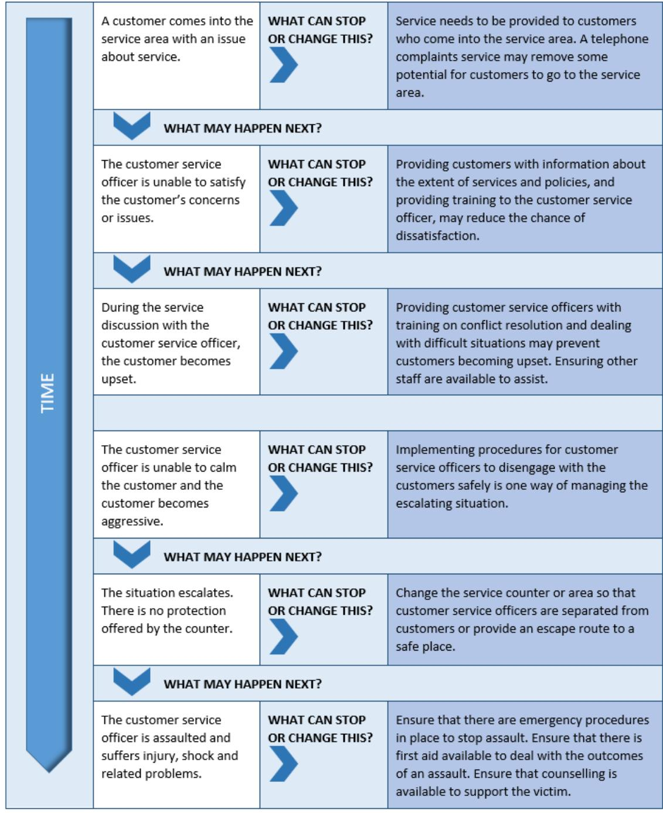

# How to manage work health and safety risks

Code of Practice

# Disclaimer

Safe Work Australia is an Australian Government statutory agency established in 2009. Safe Work Australia includes Members from the Commonwealth, and each state and territory, Members representing the interests of workers and Members representing the interests of employers.

Representing the interests of employers.

Safe Work Australia works with the Commonwealth, state and territory governments to improve work health and safety and workers' compensation arrangements. Safe Work Australia is a national policy body, not a regulator of work health and safety. The Commonwealth, states and territories have responsibility for regulating and enforcing work health and safety laws in their jurisdiction.

ISBN 978- 0- 642- 33301- 8 (PDF)  ISBN 978- 0- 642- 33302- 5 (DOCX)

# Creative Commons

This copyright work is licensed under a Creative Commons Attribution- Noncommercial 4.0 International licence. To view a copy of this licence, visit creativecommons.org/licenses In essence, you are free to copy, communicate and adapt the work for non- commercial purposes, as long as you attribute the work to Safe Work Australia and abide by the other licence terms.

Safe Work Australia | info@swa.gov.au | www.swa.gov.au

# Contents

Foreword 4

1. Introduction 5

1.1. Who has duties for managing work health and safety risks? 5  
1.2. What is involved in managing risks? 7  
1.3. When should a risk management approach be used? 10

2. Step 1—How to identify hazards 11

2.1. How to find hazards 12

3. Step 2—How to assess risks 14

3.1. When should a risk assessment be carried out? 14  
3.2. How to do a risk assessment 15

4. Step 3—How to control risks 18

4.1. The hierarchy of control measures 18  
4.2. How to develop and implement control options 21  
4.3. How to ensure controls remain effective 23

5. Step 4—How to review controls 24

6. Keeping records 25

Appendix A—Glossary 26

Appendix B—Examples of the risk management process 28

Example 1 28 Example 2 31 Example 3 34

Appendix C—Assessing how things can go wrong 37

Appendix D—Risk register 38

Amendments 39

# Foreword

This Code of Practice on how to manage work health and safety risks is an approved code of practice under section 274 of the Work Health and Safety Act (the WHS Act).

An approved code of practice provides practical guidance on how to achieve the standards of work health and safety required under the WHS Act and the Work Health and Safety Regulations (the WHS Regulations) and effective ways to identify and manage risks.

A code of practice can assist anyone who has a duty of care in the circumstances described in the code of practice. Following an approved code of practice will assist the duty holder to achieve compliance with the health and safety duties in the WHS Act and WHS Regulations, in relation to the subject matter of the code of practice. Like regulations, codes of practice deal with particular issues and may not cover all relevant hazards or risks. The health and safety duties require duty holders to consider all risks associated with work, not only those for which regulations and codes of practice exist.

Codes of practice are admissible in court proceedings under the WHS Act and WHS Regulations. Courts may regard a code of practice as evidence of what is known about a hazard, risk, risk assessment or risk control and may rely on the code in determining what is reasonably practicable in the circumstances to which the code of practice relates. For further information see the Interpretive Guideline: The meaning of 'reasonably practicable'.

Compliance with the WHS Act and WHS Regulations may be achieved by following another method if it provides an equivalent or higher standard of work health and safety than the code.

An inspector may refer to an approved code of practice when issuing an improvement or prohibition notice.

# Scope and application

This Code is intended to be read by a person conducting a business or undertaking (PCBU). It provides practical guidance to PCBUs on how to manage risks to health and safety. Other approved codes of practice should be referenced for guidance on managing the risk of specific hazards.

This Code may be a useful reference for other persons interested in the duties under the WHS Act and WHS Regulations.

This Code applies to all types of work and all workplaces covered by the WHS Act.

# How to use this Code of Practice

This Code includes various references to the legal requirements under the WHS Act and WHS Regulations. These are included for convenience only and should not be relied on in the place of the full text of the WHS Act or WHS Regulations. The words 'must', 'requires' or 'mandatory' indicate a legal requirement exists that must be complied with.

The word 'should' is used in this Code to indicate a recommended course of action, while 'may' is used to indicate an optional course of action.

# 1. Introduction

# 1.1. Who has duties for managing work health and safety risks?

Duty holders who have a role in managing work health and safety risks include:

persons conducting a business or undertaking (PCBUs) designers, manufacturers, importers, suppliers and installers of plant, substances or structures, and officers.

Workers and other persons at the workplace also have duties under the WHS Act, such as the duty to take reasonable care for their own health and safety at the workplace.

A person can have more than one duty and more than one person can have the same duty at the same time.

# Person conducting a business or undertaking

# WHS Act section 19

Primary duty of care

A PCBU must eliminate risks in the workplace, or if that is not reasonably practicable, minimise the risks so far as is reasonably practicable.

The WHS Regulations include more specific requirements for PCBUs to manage the risks of hazardous chemicals, airborne contaminants and plant, as well as other hazards associated with the workplace.

PCBUs have a duty to consult workers about work health and safety and may also have duties to consult, cooperate and coordinate with other duty holders.

Examples of where a PCBU will have a health and safety duty include when:

the PCBU engages workers to carry out work the PCBU directs or influences workers in carrying out work other people may be put at risk from work carried in their business or undertaking, and the PCBU manages or controls a workplace or fixtures, fittings or plant at the workplace.

# Officers

# WHS Act section 27

Duty of officers

Officers, such as company directors, have a duty to exercise due diligence to ensure the PCBU complies with the WHS Act and WHS Regulations. This includes taking reasonable steps to gain an understanding of the hazards and risks associated with the operations of

the business or undertaking, and ensure the business or undertaking has and uses appropriate resources and processes to eliminate or minimise risks to health and safety.

Further information on who is an officer and their duties is available in the Interpretive Guideline: The health and safety duty of an officer under section 27.

Designers, manufacturers, importers and suppliers of plant, substances or structures

# WHS Act Part 2 Division 3

Further duties of persons conducting businesses or undertakings

Designers, manufacturers, importers and suppliers of plant, substances or structures must ensure, so far as is reasonably practicable, the plant, substance or structure they design, manufacture, import or supply is without risks to health and safety. This duty includes carrying out testing and analysis as well as providing specific information about the plant, substance or structure.

The WHS Regulations include a number of specific requirements for consultation and information sharing to assist in meeting these duties, for example:

- manufacturers to consult with designers of plant- importers to consult with designers and manufacturers of plant, and- the person who commissions construction work to consult with the designer of the structure.

# Workers

# WHS Act section 28

Duties of workers

Workers have a duty to take reasonable care for their own health and safety and to not adversely affect the health and safety of other persons. Workers must comply with reasonable instructions, as far as they are reasonably able, and cooperate with reasonable health and safety policies or procedures that have been notified to workers. If personal protective equipment (PPE) is provided by the business or undertaking, the worker must so far as they are reasonably able, use or wear it in accordance with the information and instruction and training provided.

# Other persons at the workplace

# WHS Act section 29

Duties of other persons at the workplace

Other persons at the workplace, like visitors, must take reasonable care for their own health and safety and must take reasonable care not to adversely affect other people's health and safety. They must comply, so far as they are reasonably able, with reasonable instructions given by the PCBU to allow that person to comply with the WHS Act.

# 1.2. What is involved in managing risks?

# Management commitment

Effective risk management starts with a commitment to health and safety from those who operate and manage the business or undertaking. You also need the involvement and cooperation of your workers, supply chain partners, and other businesses you work with. Management commitment is about demonstrating you are serious about health and safety and influencing other duty holders in the workplace.

To demonstrate your commitment, you should:

get involved in health and safety issues so that you understand the hazards and risk associated with your operations consult workers and other duty holders on the hazards and risk, and how to control them invest time and money in health and safety ensure you and your workers clearly understand health and safety responsibilities and have the knowledge and skill to do tasks safely, and apply health and safety values and behaviours to your own work practices.

# A step-by-step process

A safe and healthy workplace does not happen by chance or guesswork. You have to think about what could go wrong at your workplace and what the consequences could be. Then you must do whatever you can (in other words, whatever is 'reasonably practicable') to eliminate or minimise health and safety risks arising from your business or undertaking.

This process is known as risk management and involves the four steps set out in this Code (see Figure 1 below):

Identify hazards- find out what could cause harm. Assess risks, if necessary- understand the nature of the harm that could be caused by the hazard, how serious the harm could be and the likelihood of it happening. This step may not be necessary if you are dealing with a known risk with known controls. Control risks - implement the most effective control measure that is reasonably practicable in the circumstances and ensure it remains effective over time. Review hazards and control measures to ensure they are working as planned.

This process will be implemented in different ways depending on the size and nature of your business or undertaking. Larger businesses and those in sectors where workers are exposed to more or higher risks are likely to need more complex, sophisticated risk management processes.

Examples demonstrating how to manage work health and safety risks in consultation with workers are at Appendix B.

# Determining what is 'reasonably practicable'

Deciding what is 'reasonably practicable' to protect people from harm requires taking into account and weighing up all relevant matters, including:

the likelihood of the hazard or risk concerned occurring the degree of harm that might result from the hazard or risk knowledge about the hazard or risk, and ways of eliminating or minimising the risk the availability and suitability of ways to eliminate or minimise the risk, and after assessing the extent of the risk and the available ways of eliminating or minimising the risk, the cost associated with available ways of eliminating or minimising the risk, including whether the cost is grossly disproportionate to the risk.

Further information is available in the Interpretive Guideline: The meaning of 'reasonably practicable'. The process of managing risk described in this Code will help you decide what is reasonably practicable in particular situations so that you can meet your duty of care under the WHS laws.

  
Figure 1 The risk management process

Many hazards and their associated risks are well known and have well established and accepted control measures. In these situations, the second step to formally assess the risk is unnecessary. If, after identifying a hazard, you already know the risk and how to control it effectively, you can implement the controls without undertaking a risk assessment.

Risk management is a proactive process that helps you respond to change and facilitate continuous improvement in your business. It should be planned, systematic and cover all reasonably foreseeable hazards and associated risks.

# Consulting workers

WHS Act section 47Duty to consult workersWHS Act section 48Nature of Consultation

A PCBU must consult, so far as is reasonably practicable, with workers who carry out work for the business or undertaking and who are (or are likely to be) directly affected by a health and safety matter.

This duty to consult is based on the recognition that worker input and participation improves decision- making about health and safety matters and assists in reducing work- related injuries and disease.

The broad definition of a 'worker' under the WHS Act means a PCBU must consult, so far as is reasonably practicable, with contractors and sub- contractors and their employees, on- hire workers, outworkers, apprentices, trainees, work experience students, volunteers and other people who are working for the PCBU and who are, or are likely to be, directly affected by a health and safety matter.

Workers are entitled to take part in consultations and to be represented in consultations by a health and safety representative who has been elected to represent their work group.

Consultation with workers and their health and safety representatives is required at each step of the risk management process. By drawing on the experience, knowledge and ideas of your workers you are more likely to identify all hazards and choose effective control measures.

You should encourage your workers to report any hazards and health and safety problems immediately so that risks can be managed before an incident occurs.

If you have a health and safety committee, you should engage the committee in the risk management process as well.

Consulting, cooperating and coordinating activities with other duty holders

# WHS Act section 46

Duty to consult with other duty holders

The WHS Act requires that a PCBU to consult, cooperate and coordinate activities with all other persons who have a work health or safety duty in relation to the same matter, so far as is reasonably practicable.

There is often more than one business or undertaking involved in the same activities or who share the same workplace who may each have responsibility for the same health and safety matters, either because they are involved in the same activities or share the same workplace.

In these situations, each duty holder should exchange information to find out who is doing what and work together in a cooperative and coordinated way so risks are eliminated or minimised so far as is reasonably practicable.

For example, if you engage labour hire workers as part of your workforce you share a duty of care to these workers with the business that provides them. In these situations, you must discuss the hazards and risks associated with the work and what precautions will be taken with the labour hire firm.

Never assume that someone else is taking care of a health and safety matter. Find out who is doing what and work together with other duty holders in a cooperative and coordinated way so risks are eliminated or minimised as far as reasonably practicable.

When entering into contracts you should communicate your safety requirements and policies, review the job to be undertaken, discuss any safety issues that may arise and how they will be dealt with. Remember that you cannot transfer your responsibilities to another person.

Further guidance on WHS consultation is available in the Code of Practice: Work health and safety consultation, cooperation and coordination.

# 1.3. When should a risk management approach be used?

Managing work health and safety risks is an ongoing process that needs attention over time, but particularly when any changes affect your work activities. Examples of when you should work through the steps in this Code include:

starting a new business expanding or purchasing an existing business changing work practices, procedures or the work environment changing organisational structure or job roles introducing new workers or returning workers to the workplace purchasing new or used equipment or using new substances working with a new supplier or new commissioner of your services planning to improve productivity or reduce costs new information about workplace risks becomes available responding to workplace incidents (even if they have caused no injury) responding to concerns raised by workers, health and safety representatives or others at the workplace, or required by the WHs regulations for specific hazards.

It is also important to use the risk management approach when designing and planning products, processes or places used for work, because it is often easier and more effective to eliminate hazards before they are introduced into a workplace by incorporating safety features at the design stage.

The risk management process outlined in this Code should be applied to both physical and psychological risks. Further guidance specific to psychological risks is available in the Guide: Integrated approach to work- related psychosocial health and safety and the Guide for preventing and responding to workplace bullying.

# 2. Step 1--How to identify hazards

Identifying hazards in the workplace involves finding things and situations that could potentially cause harm to people. Hazards generally arise from the following aspects of work and their interaction:

physical work environment equipment, materials and substances used work tasks and how they are performed, and work design and management.

Table 1 below lists some common types of workplace hazards. Some hazards are part of the work process, such as mechanical hazards, noise or toxic properties of substances. Other hazards result from equipment or machine failures and misuse, chemical spills and structural failures, or where work demands exceed a worker's ability to cope.

A piece of plant, substance or a work process may have many different hazards. Each of these hazards needs to be identified. For example, a production line may have dangerous moving parts, noise, hazards associated with manual tasks and psychosocial hazards due to the pace of work.

Table 1 Examples of common hazards  

<table><tr><td>Hazard</td><td>Example</td><td>Potential harm</td></tr><tr><td>Manual tasks</td><td>Tasks involving sustained or awkward postures, high or sudden force, repetitive movements or vibration</td><td>Musculoskeletal disorders such as damage to joints, ligaments and muscles</td></tr><tr><td>Gravity</td><td>Falling objects, falls, slips and trips of people</td><td>Fractures, bruises, lacerations, dislocations, concussion, permanent injuries or death</td></tr><tr><td>Psychosocial</td><td>Excessive time pressure, bullying, violence and work-related fatigue</td><td>Psychological or physical injury or illness</td></tr><tr><td>Electricity</td><td>Exposure to live electrical wires</td><td>Shock, burns, damage to organs and nerves leading to permanent injuries or death</td></tr><tr><td>Machinery and equipment</td><td>Being hit by moving vehicles, or being caught in moving parts of machinery</td><td>Fractures, bruises, lacerations, dislocations, permanent injuries or death</td></tr><tr><td>Hazardous chemicals</td><td>Acids, hydrocarbons, heavy metals, asbestos and silica</td><td>Respiratory illnesses, cancers or dermatitis</td></tr><tr><td>Extreme temperatures</td><td>Heat and cold</td><td>Heat can cause burns and heat stroke or injuries due to fatigue 
Cold can cause hypothermia or frost bite</td></tr><tr><td>Noise</td><td>Exposure to loud noise</td><td>Permanent hearing damage</td></tr><tr><td>Radiation</td><td>Ultra violet, welding arc flashes, micro waves and lasers</td><td>Burns, cancer or blindness</td></tr></table>

<table><tr><td>Hazard</td><td>Example</td><td>Potential harm</td></tr><tr><td>Biological</td><td>Micro-organisms</td><td>Hepatitis, legionnaires&#x27; disease, Q fever, HIV/AIDS or allergies</td></tr></table>

# 2.1. How to find hazards

# Inspect the workplace

As a person conducting a business or undertaking (PCBU), regularly walking around the workplace and observing how things are done can help you predict what could or might go wrong. Look at how people actually work, how plant and equipment are used, what chemicals are around and what they are used for, what safe or unsafe work practices exist as well as the general state of housekeeping.

Things to look out for include the following:

Does the work environment enable workers to carry out work without risks to health and safety (for example, space for unobstructed movement, adequate ventilation, lighting)? How is work performed, including the physical, mental and emotional demands of the tasks and activities? How suitable are the tools and equipment for the task and how well are they maintained? How do workers, managers, supervisors and others interact and how are inappropriate behaviours or conflicts dealt with? Have any changes occurred in the workplace which may affect health and safety?

Hazards are not always obvious. Some hazards can affect health over a long period of time or may result in stress (such as bullying) or fatigue (such as shiftwork). Also think about hazards that you may bring into your workplace with new, used or hired goods (for example, worn insulation on a hired welding set).

As you walk around, you may spot straightforward problems and action should be taken on these immediately, for example cleaning up a spill. If you find a situation where there is immediate or significant danger to people, move those persons to a safer location first and attend to the hazard urgently. Follow up on why the situation occurred to identify additional hazards and risks.

Make a list of the hazards you find, including the ones you know are already being dealt with, to ensure that nothing is missed. This list can be kept and updated next time you do an inspection. You may use a checklist designed to suit your workplace to help you find and make a note of hazards.

# Good work design and safe design

The best chance to find ways to eliminate hazards and minimise risks is during the design phase.

Effective design of 'good work' considers the work tasks, work systems, the physical working environment, and the workers and others in the workplace. For more information on good work design principles, see Principles of good work design: A work health and safety handbook.

Safe design of buildings, structures, equipment and vehicles accounts for the hazards and risks present at all stages of the product's lifecycle. For more information on safe design principles and how to achieve safe design, see Guidance on the principles of safe design for work and the Code of Practice: Safe design of structures.

# Consult your workers

Ask your workers about any health and safety problems they have encountered in doing their work and any near misses or incidents that have not been reported.

Worker surveys may also be undertaken to obtain information about matters such as workplace bullying, as well as muscular aches and pains that can signal potential hazards.

# Consult your supply chains and networks

Talk with your suppliers or those commissioning your services to understand each other's needs and identify any hazards and risks. For example, hazards may relate to frequent pressure to deliver services in very tight timeframes or to delay service delivery for long periods which reduce workers' opportunities to rest. Other hazards may relate to packaging products in ways that increase workers' risks of musculoskeletal injury or exposure to hazardous chemicals.

When people within a supply chain act cooperatively they can exert greater influence on health and safety than when acting alone.

# Review available information

Information and advice about hazards and risks relevant to particular industries and types of work is available from regulators, industry associations, unions, technical specialists and safety consultants.

Manufacturers and suppliers can also provide information about hazards and safety precautions for specific substances (safety data sheets), plant or processes (instruction manuals).

Analyse your records of health monitoring, workplace incidents, near misses, worker complaints, sick leave and the results of any inspections and investigations to identify hazards. If someone has been harmed doing a particular task, then a hazard exists that could hurt someone else. These incidents need to be investigated to find the hazard that caused the injury or illness.

# 3. Step 2-How to assess risks

A risk assessment involves considering what could happen if someone is exposed to a hazard and the likelihood of it happening. A risk assessment can help you, as a person conducting a business or undertaking (PCBU), to determine:

how severe a risk is whether any existing control measures are effective what action you should take to control the risk, and how urgently the action needs to be taken.

Many hazards and their associated risks are well known and have well established and accepted control measures. In these situations, the second step to formally assess the risk is not required. If after identifying a hazard you already know the risk and how to control it effectively, you may simply implement the controls.

A risk assessment can be undertaken with varying degrees of detail depending on the type of hazard and the information, data and resources that you have available. It can be as simple as a discussion with your workers or involve specific risk analysis tools and techniques developed for specific risks or recommended by safety professionals. For some complex situations, expert or specialist advice may be useful when conducting a risk assessment.

# 3.1. When should a risk assessment be carried out?

A risk assessment should be done when:

there is uncertainty about how a hazard may result in injury or illness the work activity involves a number of different hazards and there is a lack of understanding about how the hazards may interact with each other to produce new or greater risks, or changes at the workplace occur that may impact on the effectiveness of control measures.

In some circumstances, a risk assessment will assist to:

identify which workers are at risk of exposure determine what sources and processes are causing the risk identify if and what kind of control measures should be implemented, and check the effectiveness of existing control measures.

A risk assessment is mandatory under the WHs Regulations for certain activities that are high risk such as, but not limited to, entry into confined spaces, diving work and live electrical work.

Some hazards that have exposure standards, such as noise and airborne contaminants, may require scientific testing or measurement by a competent person to accurately assess the risk and to check that the relevant exposure standard is not being exceeded (for example, by using noise meters to measure noise levels and using gas detectors to analyse oxygen levels in confined spaces).

A risk assessment is not required when legislation requires a hazard or risk to be controlled in a specific way- - these requirements must be complied with.

A detailed risk assessment may not be required in the following situations:

A code of practice or other guidance sets out a way of controlling a hazard or risk that is applicable to your situation. There are well- known and effective controls that are in use in the particular industry that are suited to the circumstances in your workplace.

In these situations, you may be able to simply implement these control measures.

A risk assessment may be appropriate to reuse in situations where all the hazards, tasks, things, workers or circumstances are the same and no worker or other person will be exposed to greater, additional or different risks. However, as stated above, if there are any changes at the workplace, a new risk assessment should be performed.

# 3.2. How to do a risk assessment

Hazards have the potential to cause different types and severities of harm, ranging from minor discomfort to a serious injury or death.

For example, heavy liquefied petroleum gas (LPG) cylinders can cause muscular strain when they are handled manually. However, if the cylinder is damaged causing gas to leak, which is then ignited, a fire could result in serious burns. If that leak occurs in a storeroom or similar enclosed space, it could result in an explosion that could destroy the building and kill or injure anyone nearby. Each of the outcomes involves a different type of harm with a range of severities, and each has a different likelihood of occurrence.

The risk will increase as the severity and likelihood of harm increases.

# Work out how hazards may cause harm

In most cases, incidents occur as a result of a chain of events and a failure of one or more links in that chain. If one or more of the events can be stopped or changed, the risk may be eliminated or reduced.

One way of working out the chain of events is to determine the starting point where things begin to go wrong and then consider: 'If this happens, what may happen next?' This will provide a list of events that sooner or later cause harm. See the example in Appendix C.

In thinking about how each hazard may cause harm, you should consider:

- the effectiveness of existing control measures and whether they control all types of harm- how work is actually done, rather than relying on written manuals and procedures, and- infrequent or abnormal situations, as well as how things are normally meant to occur.

Consider how harm could be caused during maintenance and cleaning, as well as breakdowns of equipment and failures of health and safety controls.

# Work out how severe the harm could be

To estimate the severity of harm that could result from each hazard you should consider the following questions:

- What type of harm could occur (for example muscular strain, injuries due to fatigue, psychological injury, burns, laceration)? How severe is the harm? Could the hazard cause death, serious injuries, illness or only minor injuries requiring first aid?- What factors could influence the severity of harm that occurs? For example, the distance someone might fall or the concentration of a particular substance will determine the level of harm that is possible. The harm may occur immediately if something goes wrong (for

example injury from a fall) or it may take time for it to become apparent (for example illness from long- term exposure to a substance or to excessive work demands). Do you need to use specific tools or processes to assess how severe the harm could be? This could include sending samples to a lab for testing or arranging noise exposure level testing. How many people are exposed to the hazard and how many could be harmed in and outside your workplace? For example, a mobile crane collapse on a busy construction site has the potential to kill or injure a large number of people. Could one failure lead to other failures? For example, could the failure of your electrical supply make any control measures that rely on electricity ineffective? Could a small event escalate to a much larger event with more serious consequences? For example, a minor fire can get out of control quickly in the presence of large amounts of combustible materials.

# Work out the likelihood of harm occurring

The likelihood that someone will be harmed can be estimated by considering the following:

How often is the task done? Does this make the harm more or less likely? How often are people near the hazard? How close do people get to it? Has it ever happened before, either in your workplace or somewhere else? How often?

Table 2 contains further questions that can help you estimate likelihood.

You can rate the likelihood as one of the following:

Certain to occur- - expected to occur in most circumstances Very likely- - will probably occur in most circumstances Possible- - might occur occasionally Unlikely- - could happen at some time Rare- - may happen only in exceptional circumstances.

Table 2 Questions to help estimate likelihood of harm occurring  

<table><tr><td>Questions</td><td>Explanation and examples</td></tr><tr><td>How often are people exposed to the hazard?</td><td>A hazard may exist all of the time or it may only exist occasionally. The more often a hazard is present, the greater the likelihood it will result in harm.
For example:
- Meshing gears in an enclosed gearbox can cause crushing only if the gearbox is open during maintenance, and therefore the potential for harm will not occur very often.
- Continuously lifting heavy boxes has the potential to cause harm whenever the work is done.</td></tr><tr><td>How long might people be exposed to the hazard?</td><td>The longer that someone is exposed to a hazard, the greater the likelihood that harm may result.
For example:
- The longer a person is exposed to noisy work, the more likely it is that they will suffer hearing loss.</td></tr></table>

<table><tr><td>Questions</td><td>Explanation and examples</td></tr><tr><td>How effective are current controls in reducing risk?</td><td>In most cases the risks being assessed will already be subject to some control measures. The likelihood of harm resulting from the risk will depend upon how adequate and effective the current measures are. For example:
- Traffic management controls have been implemented in a warehouse to separate moving forklifts from pedestrians by using signs and painted lines on the floor. These controls may need to be upgraded to include physical barriers.</td></tr><tr><td>Could any changes in your organisation increase the likelihood?</td><td>The demand for goods or services in many organisations varies throughout the year. Changes in demand may be seasonal, depend on environmental conditions or be affected by market fluctuations that are driven by a range of events. Meeting increased demand may cause unusual loads on people, plant and equipment and systems of work. Failures may be more likely.
For example:
- Inner city restaurants and bistros are very busy in the period prior to Christmas, placing extra demands on kitchen and serving staff. The increase in volume of food to be prepared and serving a larger number of patrons increases the potential for human error and the likelihood of harm.</td></tr><tr><td>Are hazards more likely to cause harm because of the working environment?</td><td>Examples of situations where the risk of injury or illness may become more likely:
- Environmental conditions change. For example, work performed in high temperatures in a small space increases the potential for mistakes because workers become fatigued more quickly; wet conditions make walkways and other things slippery.
- People are required to work quickly. The rate at which work is done (e.g. number of repetitions) can over-stress a person&#x27;s body or make it more likely that mistakes will be made.
- There is insufficient light or poor ventilation.</td></tr><tr><td>Could the way people act and behave affect the likelihood of a hazard causing harm?</td><td>The possibility that people may make mistakes, misuse items, become distracted or panic in particular situations needs to be taken into account. The effects of fatigue or stress may make it more likely that harm will occur.</td></tr><tr><td>Do the differences between individuals in the workplace make it more likely for harm to occur?</td><td>Workers are not all the same and individual variability should be considered, for example:
- People respond to stress at work in different ways, which means some workers are more susceptible to harm.
- People with disabilities may be more likely to suffer harm if the workplace or process is not designed for their needs.
- New or young workers may be more likely to suffer harm because of inexperience.
- People who do not normally work at the workplace will have less knowledge than employees who normally work there, and may be more likely to suffer harm. These people include contractors, visitors or members of the public.</td></tr></table>

# 4. Step 3-How to control risks

The most important step in managing risks involves eliminating them so far as is reasonably practicable, or if that is not reasonably practicable, minimising the risks so far as is reasonably practicable.

In deciding how to control risks, as a person conducting a business or undertaking (PCBU), you must consult your workers and their representatives who will be directly affected by this decision. Their experience will help you choose appropriate control measures and their involvement will increase the level of acceptance of any changes that may be needed to the way they do their job.

There are many ways to control risks. Some control measures are more effective than others.

You must consider various control options and choose the control that most effectively eliminates the hazard or minimises the risk in the circumstances. This may involve a single control measure or a combination of different controls that together provide the highest level of protection that is reasonably practicable.

Some problems can be fixed easily and should be done straight away, while others will need more effort and planning to resolve. Of those requiring more effort, you should prioritise areas for action, focusing first on those hazards with the highest level of risk.

# 4.1. The hierarchy of control measures

The ways of controlling risks are ranked from the highest level of protection and reliability to the lowest as shown in Figure 2. This ranking is known as the hierarchy of control measures.

The hierarchy of control measures can be applied in relation to any risk. The WHS Regulations make it mandatory for duty holders to work through this hierarchy when managing certain risks.

  
Figure 2 The hierarchy of control measures

You must always aim to eliminate the risk, which is the most effective control. If this is not reasonably practicable, you must minimise the risk by working through the other alternatives in the hierarchy.

The lower levels in the hierarchy are less effective because controls that change the hazard or minimise exposure to the hazard can only minimise the risk. You cannot eliminate the risk without eliminating the hazard.

Administrative controls and personal protective equipment (PPE) are the least effective at minimising risk because they do not control the hazard at the source and rely on human behaviour and supervision. These control measures should only be used:

to supplement higher level control measures (as a back- up) as a short- term interim measure until a more effective way of controlling the risk can be used, or when there are no other practical control measures available (as a last resort).

# Elimination

The most effective control measure involves eliminating the hazard and associated risk. The best way to do this is by, firstly, not introducing the hazard into the workplace. For example, you can eliminate the risk of a fall from height by doing the work at ground level.

Eliminating hazards is often cheaper and more practical to achieve at the design or planning stage of a product, process or place used for work. In these early phases, there is greater scope to design out hazards or incorporate risk control measures that are compatible with the original design and functional requirements. For example, not using a noisy machine will be more effective than providing workers with personal hearing protectors.

You can also eliminate risks by removing an existing hazard, for example, by removing trip hazards on the floor, disposing of unwanted chemicals, or not working in an isolated or remote area.

It may not be reasonably practicable to eliminate a hazard if doing so means that you cannot make the end product or deliver the service. If you cannot eliminate the hazard, then you must minimise as many of the risks associated with the hazard as reasonably practicable.

# Substitution, isolation and engineering controls

If it is not reasonably practicable to eliminate the hazards and associated risks, you must minimise the risks using one or more of the following approaches, so far as is reasonably practicable.

# Substitute the hazard with something safer

For instance, replace solvent- based paints with water- based ones or allow workers to have more control of line speed instead of pacing line work by computer.

# Isolate the hazard from people

This involves physically separating the source of harm from people by distance or using barriers. For instance, install guardrails around exposed edges and holes in floors; use remote control systems to operate machinery; store chemicals in a fume cabinet; place barriers between workers and customers where there is a risk of assault.

# Use engineering controls

An engineering control is a control measure that is physical in nature, including a mechanical device or process. For instance, use mechanical devices such as trolleys or hoists to move heavy loads; place guards around moving parts of machinery; install residual current devices (electrical safety switches); set work rates on a production line to reduce fatigue; install sound dampening measures to reduce exposure to unpleasant or hazardous noise.

# Administrative controls

If risks remain, they must be minimised by implementing administrative controls, so far as is reasonably practicable. Administrative controls include work methods or procedures that are designed to minimise exposure to a hazard as well as the information, training and instruction needed to ensure workers can work safely. For instance, develop procedures on how to operate machinery safely, provide training and support to managers and workers to identify and manage health and safety risks, implement anti- bullying policies, limit exposure time to a hazardous task, and/or use signs to warn people of a hazard.

Some administrative measures will be necessary to ensure substitution, isolation and engineering controls are implemented effectively, for example, following safe work procedures when using equipment. See section 4.2 below for information on implementing control measures.

# Personal protective equipment

Any remaining risks must be minimised with suitable PPE. Examples of PPE include ear muffs, respirators, face masks, hard hats, gloves, aprons and protective eyewear. PPE limits exposure to the harmful effects of a hazard but only if workers wear and use the PPE correctly.

# WHS Regulation 44

Provision to workers and use of personal protective equipment

If PPE is to be used at the workplace, you must ensure the equipment is:

selected to minimise risk to health and safety, including by ensuring that the equipment is suitable for the nature of the work and any hazard associated with the work and is of suitable size and fit and reasonably comfortable for the worker who is to use or wear it

maintained, repaired and replaced so that it continues to minimise risk to the worker who uses it, including by ensuring that the equipment is clean and hygienic, and in good working order.

If you direct the carrying out of work, you must provide the worker with information, training and instruction in the proper use and wearing of PPE, and the storage and maintenance of PPE.

A worker must, so far as reasonably able, use or wear the PPE in accordance with any information, training or reasonable instruction and must not intentionally misuse or damage the equipment.

# 4.2. How to develop and implement control options

Information about suitable controls for many common hazards and risks can be obtained from:

- codes of practice and guidance material- manufacturers and suppliers of plant, substances and equipment used in your workplace, or- industry associations and unions.

In some cases, published information will provide guidance on the whole work process. In other cases, the guidance may relate to individual items of plant or how to safely use specific substances. You may use the recommended control options if they suit your situation and eliminate or minimise the risk.

# Developing specific control measures

You may need to develop specific control measures if the available information is not relevant to the hazards and risks or circumstances at your workplace. This can be done by referring to the chain of events that were recorded during the risk assessment.

For each of the events in the sequence, ask: 'What can be done to stop or change the event occurring?' An example of this approach is shown in Appendix C.

Working through the events in the sequence will give you ideas about possible ways to eliminate or minimise the risk. There may be more than one solution for each of the events. The control option you choose should be:

- one or more controls that provide the highest level of protection for people and is the most reliable—that is, controls located towards the top of the hierarchy in Figure 2- available—that is, it can be purchased, made to suit or be put in place, and- suitable for the circumstance in your workplace—that is, it will work properly given the workplace conditions, work process and your workers.

Where the hazard or risk has the potential to cause death, serious injury or illness, more emphasis should be given to those controls that eliminate or reduce the level of harm, than those that reduce the likelihood of harm occurring.

Make sure that your chosen solution does not introduce new hazards. If this is not possible, any new hazards or risks introduced will also need to be managed.

You may prepare a risk register that identifies the hazards, what action needs to be taken, who will be responsible for taking the action and by when. An example is provided at Appendix D.

# Cost of control measures

All risks can be controlled and it is always possible to do something, such as stopping the activity or providing instructions to those exposed to the risk. There will normally be a number of different options between these two extremes. Cost (in terms of time and effort as well as money) is just one factor to consider when determining the best control option.

The cost of controlling risk may be taken into account in determining what is reasonably practicable, but cannot be used as a reason for doing nothing.

The greater the likelihood of harm occurring or the greater the extent of that harm, the less weight should be given to the cost of controlling the hazard or risk.

If two control measures provide the same level of protection and are equally reliable, you can adopt the less expensive option.

Cost cannot be used as a reason for adopting controls that rely exclusively on changing people's behaviour or actions when there are more effective controls available that can change the risk through substitution, engineering or isolation.

For further information, see the Interpretive Guideline: The meaning of 'reasonably practicable'.

# Implementing controls

Implementing controlsThe control measures you put into operation will usually require changes to the way work is carried out, for example, working with new or modified equipment or processes, new or different chemicals or new personal protective equipment. In these situations, it is necessary to support the control measures with the following.

# Work procedures

Work proceduresDevelop a safe work procedure that describes the task, identifies the hazards and documents how the task is to be performed to minimise the risks.

# Training, instruction and information

Train your workers in the work procedure to ensure that they are able to perform the task safely. Training must cover the nature of the work, the associated risks and the control measures to be implemented.

Training should require workers to demonstrate that they are competent in performing the task according to the procedure. It is insufficient to simply give a worker the procedure and ask them to acknowledge that they understand and are able to perform it. Training, instruction and information must be provided in a form that can be understood by all workers.

Information and instruction may also need to be provided to others who enter the workplace, such as customers or visitors.

# Supervision

SupervisionThe level of supervision required will depend on the level of risk and the experience of the workers involved. High levels of supervision are necessary where inexperienced workers are expected to follow new procedures or carry out difficult and critical tasks.

# Maintenance

Control measures need regular monitoring and maintenance to ensure they remain effective. You should decide what is required when you implement the control and establish a schedule for routine checks and maintenance appropriate to the controls.

You may prepare a risk register identifying the hazards, what action needs to be taken, who will be responsible for taking the action and by when. An example is provided at Appendix D.

# 4.3. How to ensure controls remain effective

An important part of controlling risk is ensuring that your chosen control measures are maintained after their initial implementation. The following actions may help you monitor the control measures you have implemented and ensure that they remain effective.

# Accountability for health and safety

Managers and supervisors should be provided with the authority and resources to implement and maintain control measures effectively. Accountability should be clearly allocated to ensure procedures are followed and maintained.

# Maintenance of plant and equipment

This will involve scheduling and performing regular inspection and testing, repair or replacement of damaged or worn plant and equipment. It includes checking that any control measures are suitable for the nature and duration of work, are set up and used correctly.

Further information on maintaining plant and equipment is available in the Code of Practice: Managing the risks of plant in the workplace.

# Up-to-date training and competency

Most control measures depend on workers and supervisors having the appropriate competencies to do the job safely. Training must be provided to maintain competencies and to ensure new workers are capable of working safely.

# Up-to-date hazard information

Information about hazards, such as plant and substances, may be updated by manufacturers and suppliers and should be checked to make sure controls are still relevant. New technology may provide more effective solutions than were previously available. Changes to operating conditions or the way activities are carried out may also mean that control measures need to be updated.

# Regular review and consultation

Control measures are more effective where there is regular review of work procedures and consultation with your workers and their representatives.

If maintenance processes reveal new hazards, or existing hazards that are not being addressed, you will need to perform a review of your control measures.

# 5. Step 4-How to review controls

The control measures you, as a person conducting a business or undertaking (PCBU), put in place should be reviewed regularly to make sure they work as planned. Don't wait until something goes wrong.

The WHs Regulations require a risk management process for specific risks. That process includes circumstances where you must review your control measures for those risks and, if necessary, change them. A review is required:

when the control measure is not effective in controlling the risk before a change at the workplace that is likely to give rise to a new or different health and safety risk that the control measure may not effectively control if a new hazard or risk is identified if the results of consultation indicate that a review is necessary, or if a health and safety representative requests a review.

In any case, as part of your ongoing duties as a PCBU, you should regularly review your control measures, including in the above circumstances. Managing work health and safety risks is an ongoing process that needs attention over time, but particularly when any changes affect your work activities.

You may use the same methods as in the initial hazard identification step (Chapter 2- How to identify hazards) to check controls. Consult your workers and their health and safety representatives and consider the following questions:

Are the control measures working effectively in both their design and operation? Have the control measures introduced new problems? Have all hazards been identified? Have new work methods, new equipment or chemicals made the job safer? Are safety procedures being followed? Have the instruction and training provided to workers on how to work safely been successful? Are workers actively involved in identifying hazards and possible control measures? Are they openly raising health and safety concerns and reporting problems promptly? Are the frequency and severity of health and safety incidents reducing over time? If new legislation or new information becomes available, does it indicate current controls may no longer be the most effective?

If problems are found, go back through the risk management steps (Chapter 4- How to control risks), review your information and make further decisions about risk control. Priority for review should be based on the level of risk. Control measures for high risks should be reviewed more frequently.

If you design, manufacture or supply products used for work, quality assurance processes may be used to check the product effectively minimises health and safety risks. Obtain feedback from users of the product to determine whether any improvements can be made to make it safer.

# 6. Keeping records

Keeping records of the risk management process demonstrates what you have done to comply with the WHs Act and WHS Regulations. It also helps when undertaking subsequent risk management activities, including reviewing your control measures.

Keeping records of the risk management process has the following benefits. It:

allows you to demonstrate how decisions about controlling risks were made - assists in targeting training at key hazards - provides a basis for preparing safe work procedures - allows you to more easily review risks following any changes to legislation or business activities, and demonstrates to others (regulators, investors, shareholders, customers) that work health and safety risks are being managed.

The detail and extent of recording will depend on the size of your workplace and the potential for major work health and safety issues. It is useful to keep information on:

the identified hazards, assessed risks and chosen control measures (including any hazard checklists, worksheets and assessment tools used in working through the risk management process) how and when the control measures were implemented, monitored and reviewed who you consulted with relevant training records, and any plans for changes.

There are specific record- keeping requirements in the WHs Regulations for some hazards, such as hazardous chemicals, plant and equipment. If such hazards have been identified at your workplace, you must keep the relevant records for the time specified.

You should ensure that everyone in your workplace is aware of record- keeping requirements, including which records are accessible and where they are kept.

# Appendix A-Glossary

<table><tr><td>Term</td><td>Description</td></tr><tr><td>Control measure</td><td>An action taken to eliminate or minimise health and safety risks so far as is reasonably practicable. A hierarchy of control measures is set out in the WHS Regulations to assist duty holders to select the highest control measures reasonably practicable.
Note: The WHS Regulations also refer to a control measure as a risk control measure or a risk control. In this Code, control measure is used throughout.</td></tr><tr><td>Duty holder</td><td>Any person who owes a work health and safety duty under the WHS Act including a person conducting a business or undertaking, a designer, manufacturer, importer, supplier, installer of products or plant used at work (upstream duty holder), officer or a worker.</td></tr><tr><td>Hazard</td><td>A situation or thing that has the potential to harm a person. Hazards at work may include: noisy machinery, a moving forklift, chemicals, electricity, working at heights, a repetitive job, bullying and violence at the workplace.</td></tr><tr><td>Health</td><td>Health includes both physical and psychological health.</td></tr><tr><td>Health and safety committee</td><td>A consultative body established under the WHS Act. The committee&#x27;s functions include facilitating cooperation between workers and the person conducting a business or undertaking to ensure workers&#x27; health and safety at work, and assisting to develop work health and safety standards, rules and procedures for the workplace.</td></tr><tr><td>Health and safety representative</td><td>A worker who has been elected by their work group under the WHS Act to represent them on health and safety matters.</td></tr><tr><td>Managing risk</td><td>This is a process set out in the WHS Regulations to eliminate health and safety risks so far as is reasonably practicable, or if this is not reasonably practicable, minimise the risks so far as is reasonably practicable.
It includes identifying hazards, assessing and implementing control measures, and reviewing and maintaining the control measures to ensure their ongoing effectiveness.</td></tr><tr><td>May</td><td>&#x27;May&#x27; indicates an optional course of action.</td></tr><tr><td>Must</td><td>&#x27;Must&#x27; indicates a legal requirement exists that must be complied with.</td></tr><tr><td>Officer</td><td>An officer under the WHS Act includes:</td></tr></table>

<table><tr><td>Term</td><td>Description</td></tr><tr><td></td><td>- an officer under section 9 of the Corporations Act 2001 (Cth)
- an officer of the Crown within the meaning of section 247 of the WHS Act, and
- an officer of a public authority within the meaning of section 252 of the WHS Act.
A partner in a partnership or an elected member of a local authority is not an officer while acting in that capacity.</td></tr><tr><td>Person conducting a business or undertaking (PCBU)</td><td>A PCBU is an umbrella concept which intends to capture all types of working arrangements or relationships.
A PCBU includes a:
- company
- unincorporated body or association
- sole trader or self-employed person.
Individuals who are in a partnership that is conducting a business will individually and collectively be a PCBU.
A volunteer association (defined under the WHS Act, see below) or elected members of a local authority will not be a PCBU.</td></tr><tr><td>Risk</td><td>The possibility harm (death, injury or illness) might occur when exposed to a hazard.</td></tr><tr><td>Should</td><td>&#x27;Should&#x27; indicates a recommended course of action.</td></tr><tr><td>Volunteer association</td><td>A group of volunteers working together for one or more community purposes where none of the volunteers, whether alone or jointly with any other volunteers, employs any person to carry out work for the volunteer association.</td></tr><tr><td>Work group</td><td>A group of workers established to facilitate the representation of workers by one or more health and safety representatives. A work group may be all workers at a workplace but it may also be appropriate to split a workplace into multiple work groups where workers share similar work conditions or are exposed to similar risks and hazards. For example all workers on night shift.</td></tr><tr><td>Worker</td><td>Any person who carries out work for a person conducting a business or undertaking, including work as an employee, contractor or subcontractor (or their employee), self-employed person, outworker, apprentice or trainee, work experience student, employee of a labour hire company placed with a &#x27;host employer&#x27; or a volunteer.</td></tr><tr><td>Workplace</td><td>Any place where work is carried out for a business or undertaking and includes any place where a worker goes, or is likely to be, while at work. This may include offices, factories, shops, construction sites, vehicles, ships, aircraft or other mobile structures on land or water.</td></tr></table>

# Appendix B—Examples of the risk management process

# Example 1

Two years ago, the Burbs Municipal Council implemented a number of written health and safety procedures used to train workers how to carry out particular tasks safely. As these procedures had not been reviewed since their implementation, the Safety Manager implemented a new approach to not only review these procedures but also promote health and safety more widely across the organisation by encouraging staff involvement and cooperation.

To do this, the Safety Manager established and facilitated safety workshops each Friday for an hour where a team would review a particular task and its procedures to identify hazards, assess risks and consider options to control these. The team included management, council workers, the respective health and safety representative and any contractors engaged to carry out the work.

The Safety Manager's approach was to facilitate the workshops but then hand this role over to the relevant team supervisor, who would then facilitate future meetings to review other tasks conducted by the workers. The written health and safety procedures were not used in the workshops as the Safety Manager wanted to learn more about the hazards, risks and controls from the workers without prompting. However, any changes discussed and agreed during the meeting would be included in the revised written safety procedures.

The first safety workshop was conducted in the Parks and Gardens Branch and involved management, workers, their health and safety representatives and a representative from the maintenance shop that supplied the Parks and Gardens Branch with a variety of vehicles and equipment. The task is outlined in Table 3.

Table 3 Example 1: Safety workshop-20 August 2010  

<table><tr><td colspan="2">Safety workshop—20 August 2017</td></tr><tr><td>Team</td><td>Parks and Gardens Branch</td></tr><tr><td>Task being reviewed</td><td>Cleaning of the toilets in the council&#x27;s parks</td></tr><tr><td>Description of task</td><td>Undertaken each Monday morning by two workers in a Council truck who would clean the eight toilet blocks across the municipality</td></tr><tr><td>What does the task involve?</td><td>At the depot:
  Load the truck with the compressor and pressure hose along with cleaning chemicals and materials.
At the park:
  - Open toilet block
  - Clean toilets
  - Unload compressor and pressure hose, place them in toilet block and attach to tap, turn on compressor and hose walls and floors
  - Put compressor and pressure hose along with cleaning gear back on truck
  - Dry out toilet block floor by sweeping
  - Leave park and go to next one.</td></tr></table>

In order to gather advice and information from the team, the Safety Manager asked questions and shared the responses by writing them on a whiteboard or butchers paper, as shown in Table 4.

Table 4 Example 1: Questions asked by the Safety Manager and responses  

<table><tr><td></td><td>What hazards are encountered when doing the task?</td><td>What risks do these pose to health and safety?</td><td>How are these risks currently controlled?</td></tr><tr><td>Plant</td><td>- Truck
- Compressor and pressure hose</td><td>- Truck—faulty truck could cause accident and cause injuries to workers and others
- Compressor and pressure hose—faulty fuel line in compressor could cause burns and injuries through fire or explosion</td><td>- Truck and compressor have maintenance schedule
- Checklist for visual inspection for plant before it leaves depot
- Reporting and tagging system for defective plant</td></tr><tr><td>Manual handling</td><td>- Loading and unloading the compressor
- Carrying the compressor to and from the toilet block
- Sweeping water to dry the floor</td><td>- Heavy load, awkward, sustained postures and repetitive actions can cause sprains, strains, back injuries or fractures and cuts if dropped on foot</td><td>- Compressor has handles fitted to assist in lifting and carrying
- Two persons required to lift and carry compressor
- Only workers who have been trained able to lift and carry compressor
- Floor sweeping roster</td></tr><tr><td>Chemical</td><td>- Cleaning agents used to clean toilets and basins</td><td>- Skin irritation, rashes and illness caused by exposure to chemicals and their vapours in confined space</td><td>- Only non-toxic cleaning agents used
- Gloves provided to avoid skin contact</td></tr><tr><td>Infection at work</td><td>- Communicable disease
- Non-communicable infection</td><td>- Contracting an infectious disease such as hepatitis
- Contracting a bacterial infection</td><td>- Universal precautions plus specific protection for the route of exposure</td></tr><tr><td>Noise</td><td>- Operating the compressor in a closed space with hard surfaces</td><td>- Hearing loss from prolonged exposure to the noise levels generated by the compressor</td><td>- Hearing protection provided for wearing when hosing out the toilet block</td></tr><tr><td>Slips, trips and falls</td><td>- Wet floor when hosing out the toilet block</td><td>- Fractures or strains caused by slipping on wet surface</td><td>- Safety boots provided with slip-resistant soles</td></tr></table>

Many staff present at the workshop indicated it was a waste of time as everything discussed was covered by the health and safety procedure, which they knew backwards. The Safety Manager acknowledged this concern but then asked the team whether the way the task was being conducted could be changed to improve health and safety.

One staff member raised concerns about lugging the compressor around 16 times every Monday morning and that doing this tempted them to call in sick. The Safety Manager was curious about this and asked why it was necessary to take the compressor off the truck and place it in the toilet. The workers explained that the length of the hose on the pressure spray was short and could only be operated with the compressor in the toilet block.

After hearing this, the representative from the maintenance shop who supplied the compressor mentioned that they could attach a 10- metre hose to the compressor, which would mean the compressor would not have to be taken off the truck. The team agreed this was a good idea and would eliminate the manual handling risks associated with lifting and carrying the compressor. The Safety Manager asked what other impacts this would have. The team agreed this would also reduce the noise as the compressor would now be outside the toilet block, but that there could be new risks associated with handling and storing a 10- metre long hose. The team agreed to trial the new hose. It was then installed with a hose handling system.

Following the workshop, the Safety Manager asked the supervisor to ensure the modifications were made within two weeks and to revise the procedures and have them checked by the health and safety representative and workers.

# Example 2

Jane Smith had been working at the local grocery store for the last 12 months. She had recently taken on a new role as the bakery supervisor and was eager to review the work activities and safety procedures. In preparing for the review, Jane considered how she would conduct the review and who she should speak with.

As a first step, Jane identified the different activities and tasks that were carried out by the workers. These included:

preparing a number of different products such as bread, cakes, slices and doughnuts cleaning items used in product preparation, and general housekeeping.

The next step was to analyse what was involved in each activity. Jane spent three mornings that week with the four bakers who worked in the bakery department. She talked to them about the work activities and what they thought could be changed to improve the safety of the workplace. One of the bakers had been working in the store for over 10 years, while another had been working for over 25 years. The other two bakers were apprentices and had only been working with the store for around six months.

From these discussions, Jane identified a number of key tasks the bakers carried out every day when preparing the baked products:

moving the ingredients from their storage locations to the area of use mixing the ingredients together using specialised mixers transferring the mixture to the container for baking putting them in the oven and removing them from the oven slicing and decorating, and packaging the products.

During an inspection of the bakery, Jane and the bakers identified a number of hazards, including the following:

the doughnut mixer was not guarded and the mixing bowl could be accessed when the machine was operating the concrete floors were slippery in the mixing room and flour was spilt where the bakers walked low lighting in the food preparation area, and there was narrow access and restricted movement in the storage area where the flour bags were kept.

Jane and the bakers discussed the risks associated with each of the hazards and what could be done to control these risks. In relation to the unguarded mixer, one of the bakers suggested purchasing or hiring a new model with an interlocking guard. After considering the ideas of the bakers, Jane completed the risk register shown in Table 5.

Table 5 Example 2: risk register  

<table><tr><td></td><td>Risk register: XYZ Grocery Store Pty Ltd</td></tr><tr><td>Work area</td><td>Bakery department</td></tr><tr><td>Form completed by</td><td>Jane Smith (Bakery supervisor)</td></tr><tr><td>Date form completed</td><td>05/11/2017</td></tr><tr><td>Hazard identification</td><td>Doughnut mixer not guarded and mixing bowl can be accessed when machine is operating.</td></tr><tr><td>Risk assessment</td><td>What is the harm the hazard could cause: The person operating the mixer could be entangled in and injured by the moving parts if their hand slipped in while the machine was operating. Harm could include cuts or crush injuries such as broken bones, potentially resulting in amputation or fatality.
What is the likelihood of this happening: This machine is used several times a day. Two of the workers have not been working in the bakery for a long time and are not very experienced in using the equipment.
Persons at risk: The four bakers who operate the machine.
Existing control measure: Staff follow policy and operating instructions to use the mixer safely—not very effective because it relies on staff keeping hands away from the dangerous parts.
Consequence: Serious injuries
Likelihood: Very likely
Outcome: High risk— the mixer must not be used again until the risk has been controlled.</td></tr><tr><td>Control measures</td><td></td></tr><tr><td>Possible control options</td><td>Elimination—Eliminating the use of the mixer completely will mean the business cannot continue to sell baked products as the dough cannot be mixed. Business revenue will suffer.
Substitution—Use of the mixer could be substituted by hand-mixing the dough. One day&#x27;s production will be lost in the changeover. This method can only be considered an interim option as it is not sustainable for more than a day or two with present staff. However, part-time staff could be hired to mix the dough. Business income would be reduced and impact on revenue. Alternatively, the mixer could be replaced by purchasing a new, safer machine with a built-in guard.
Engineering—The mixer could be modified by adding an interlocking guard. A mixer could be hired for the period the old mixer is in for repairs. One day&#x27;s production will be lost in this option. The modifications are estimated to cost $1600. Other costs included are: one day lost in production plus hire of substitute machine for approximately 10 days and transport. Estimated cost is less than $6000.
Administrative or PPE—Staff told to keep hands away from the mixing</td></tr></table>

<table><tr><td></td><td>Risk register: XYZ Grocery Store Pty Ltd</td></tr><tr><td></td><td>bowl while it is in use. Only the more experienced bakers are to operate the mixer.</td></tr><tr><td>Preferred control option</td><td>Purchase a new mixer, which would not cost much more than having the old one modified. Control measures have been planned to manage the health and safety risks of mixing by hand while waiting for replacement mixer to arrive. The costs involved are outweighed by worker safety and this option eliminates the risk of injury.</td></tr><tr><td>Implementation</td><td>-</td></tr><tr><td>Associated activities</td><td>- New mixer to be purchased. Mixing to be done by hand while waiting for new mixer. May require staff working more hours
Resources required: Less than $6000
Person(s) responsible: Jane Smith—Bakery supervisor
Sign off and date: J Smith 9/11/17</td></tr><tr><td>Associated activities</td><td>- Develop new work procedures
-Provide training to bakers on using the new machine
Resources required: 3 hours
Person(s) responsible: Jane Smith—Bakery supervisor
Sign off and date: J Smith 20/12/17</td></tr></table>

Jane repeated these steps for each hazard that she identified. The review of the work activities and the implemented control measures improved the safety in the bakery department at the grocery store.

<table><tr><td colspan="2">Review</td></tr><tr><td>Scheduled review date</td><td>31 January 2020</td></tr><tr><td>Are the control measures in place?</td><td>Yes— the new machine has an interlocking guard and bakers have been provided with training on how to use the machine in accordance with the manufacturer&#x27;s instructions.</td></tr><tr><td>Are the controls eliminating or minimising the risk?</td><td>Yes— the interlocking guard prevents people from putting their hand in the mixing bowl.</td></tr><tr><td>Are there any new problems with the risk?</td><td>No.</td></tr></table>

# Example 3

Kim Lee is the manager of a busy restaurant that serves meals and coffees from 7 am to  $10\text{pm}$  . The owners recently began using an external online ordering and delivery service. This service allows the business to focus on preparing meals without having to manage the delivery process, as the service arranges for a delivery person to pick up and deliver the order.

At the weekly staff meeting, one cook raised concerns about several tense exchanges between serving staff and the delivery service personnel, which has led to increased pressure on kitchen staff when fulfilling online orders. Kim is concerned these conflicts could impact the health and safety of staff and the quality of service they are providing to their customers. The popularity of the online ordering means these conflicts could occur multiple times a day. Kim talked with the kitchen staff and serving staff about what could be done to improve their safety and work organisation.

Together Kim and the staff identified that the delivery persons were usually upset when the order was not ready for pick- up when they arrived. One of the waiters noted the deliverers often appeared to be under considerable pressure to deliver on time. The kitchen staff noted they prepare orders as they are received, which can delay online orders if made during periods where high numbers of orders are received in a short time.

After considering this discussion, Kim consulted the restaurant's Workplace Behaviour Policy and decided to discuss the safety issues with the online delivery service and with individual deliverers to work with them to identify ways to eliminate or minimise the conflict. But Kim decided, in advance of any solution they might propose, to implement immediately some of the control measures discussed at the staff meeting to deal with the time pressures. Kim wrote down the summary shown in Table 6 for the owners.

Table 6 Example 3: WHS risk assessment report for owners  

<table><tr><td></td><td>Example 3 Busy Restaurant Pty Ltd—WHS Risk Assessment as at 18 February 2018</td></tr><tr><td>Hazards identified</td><td>1. Conflict between restaurant staff and online order deliverers.
2. Time pressures caused by popularity of online orders.</td></tr><tr><td>Risk assessment</td><td></td></tr><tr><td>What is the harm the hazard could cause?</td><td>Conflict could escalate to harassment and unreasonable behaviour, including violence, which can cause physical and psychological injury. Long-term exposure increases risk of anxiety and depression. More frequent exposure can also increase severity of harm.
Increased time pressure can lead to rushing and fatigue, causing burns, cuts, slips and trips within the restaurant.</td></tr><tr><td>What is the likelihood of this happening?</td><td>Very likely. This conflict could happen multiple times a day because online orders are taken every day from 7.30 am to 9.30 pm. Orders are more likely to be delayed during very busy periods where time pressure is increased, between 11.30 am and 2.00 pm, 6.00 and 9.00 pm.</td></tr><tr><td>Who is at risk?</td><td>All of our staff who prepare or serve meals. External delivery personnel.</td></tr></table>

<table><tr><td colspan="2">Example 3 Busy Restaurant Pty Ltd—WHS Risk Assessment as at 18 February 2018</td></tr><tr><td>What existing control measures are being applied?</td><td>Staff are effectively applying their training and the Workplace Behaviour Policy to address the conflicts. Staff have appropriately reported the repeated tense exchanges. The next step under the policy is for management to contact and work cooperatively with the online delivery service and with individual deliverers to resolve issues.
Existing controls are not adequately addressing the increased time pressures. These controls include preparing as much as possible in advance, such as sauces and par-cooked vegetables, and reducing repetitive actions by using suitable kitchen equipment such as food processors. Further controls are needed to address time pressures associated with the online orders.</td></tr><tr><td>What are the consequences?</td><td>Serious psychological and physical harm to our staff and delivery personnel.</td></tr><tr><td>Initial assessment</td><td>High risk—immediate action is required to reduce the risk.</td></tr><tr><td colspan="2">Control measures</td></tr><tr><td>What additional controls could be implemented to eliminate or minimise the risk?</td><td>Elimination—Stop offering online order and delivery services. This would eliminate the hazards but also remove an income stream.
Substitution—Use only in-house delivery person. Would require managing delivery process and additional delivery staff. Other controls would still be required, as this would only substitute the line of control, not the inherent risks. This may also increase the time pressure on staff dealing with the online orders.
Substitution—Reduce the menu items available for delivery. At the moment the whole menu is available online. Records show that less than half of all food items have been ordered online. Staff could focus their preparation better if there were fewer items available for delivery. Substituting the menu would not significantly affect delivery sales.
Engineering—Improve ordering system so that it automatically rearranges orders so the kitchen staff prepare online orders in time for pick-up, ahead of less urgent orders. One day of accepting online orders will be lost with this option while the changes are engineered. The modifications are estimated to cost approximately $200. All kitchen staff will need to be trained in the new order preparation procedure.
Administrative—Increase expected delivery timeframes from 20 to 30 minutes on the ordering website so staff have more time to prepare orders for delivery. This administrative change may cause a minor reduction to order numbers, but will better manage customer expectations.</td></tr><tr><td>Preferred controls</td><td>The benefits of reducing risks associated with the conflict and time pressure are far greater than the cost of implementing the following preferred controls:
Immediately consult with online delivery service to improve understanding of our respective needs and to identify solutions for the restaurant and for the delivery personnel.
At the same time, reduce the online menu and increase the expected</td></tr></table>

<table><tr><td rowspan="2"></td><td>Example 3 Busy Restaurant Pty Ltd—WHS Risk Assessment as at 18 February 2018</td></tr><tr><td>delivery timeframes on ordering website to 30 minutes.
Implement changes to the order system within one month.
To support these changes, the manager and staff will be provided with information and training on the new menu and delivery timeframes, the changes to the order system, and the outcomes of consulting with the online delivery service and individual deliverers.</td></tr><tr><td>Maintenance</td><td>Use existing weekly meeting to plan and communicate when agreed changes will happen, and to get staff feedback on new safety measures.</td></tr></table>

# Appendix C-Assessing how things can go wrong

It may be helpful to think through work processes or situations to identify what could go wrong. Note any hazards, risks and control measures identified as you go.

Once completed, you should consider the hazards and risks you identified and implement control measures in line with the hierarchy of control measures in order to eliminate or minimise the risks, so far as is reasonably practicable.

  
Figure 3 Assessing how things can go wrong

# Appendix D—Risk register

Location: Click here to enter a date.  Date: Click here to enter text.

<table><tr><td>Hazard</td><td>What is the harm that the hazard could cause?</td><td>What is the likelihood that the harm would occur?</td><td>What is the level of risk?</td><td>How effective are the current controls?</td><td>What further controls are required?</td><td>Actioned by</td><td>Date Due</td><td>Date Complete</td><td>Maintenance and review</td><td></td><td></td><td></td><td></td><td></td><td></td><td></td><td></td><td></td><td></td></tr><tr><td>Click here to enter text.</td><td>Click here to enter text.</td><td>Click here to enter text.</td><td>Click here to enter text.</td><td>Click here to enter text.</td><td>Click here to enter text.</td><td>Click here to enter text.</td><td>Click here to enter a date.</td><td>Click here to enter a date.</td><td>Click here to enter text.</td><td></td><td></td><td></td><td></td><td></td><td></td><td></td><td></td><td></td><td></td></tr><tr><td>Click here to enter text.</td><td>Click here to enter text.</td><td>Click here to enter text.</td><td>Click here to enter text.</td><td>Click here to enter text.</td><td>Click here to enter text.</td><td>Click here to enter text.</td><td>Click here to enter a date.</td><td>Click here to enter a date.</td><td>Click here to enter text.</td><td></td><td></td><td></td><td></td><td></td><td></td><td></td><td></td><td></td><td></td></tr><tr><td>Click here to enter text.</td><td>Click here to enter text.</td><td>Click here to enter text.</td><td>Click here to enter text.</td><td>Click here to enter text.</td><td>Click here to enter text.</td><td>Click here to enter text.</td><td>Click here to enter a date.</td><td>Click here to enter a date.</td><td>Click here to enter text.</td><td></td><td></td><td></td><td></td><td></td><td></td><td></td><td></td><td></td><td></td></tr><tr><td>Click here to enter text.</td><td></td><td></td><td></td><td></td><td></td><td></td><td></td><td></td><td></td><td></td><td></td><td></td><td></td><td></td><td></td><td></td><td></td><td></td><td></td></tr><tr><td>Click here to enter text.</td><td>Click here to enter text.</td><td>Click here to enter text.</td><td>Click here to enter text.</td><td>Click here to enter text.</td><td>Click here to enter text.</td><td>Click here to enter text.</td><td>Click here to enter a date.</td><td>Click here to enter a date.</td><td>Click here to enter text.</td><td></td><td></td><td></td><td></td><td></td><td></td><td></td><td></td><td></td><td></td></tr><tr><td>Check here to enter text.</td><td rowspan="2">Click here to enter text.</td><td rowspan="2">Click here to enter text.</td><td rowspan="2">Click here to enter text.</td><td rowspan="2">Click here to enter text.</td><td rowspan="2">Click here to enter text.</td><td rowspan="2">Click here to enter text.</td><td rowspan="2">Click here to enter a date.</td><td rowspan="2">Click here to enter a date.</td><td rowspan="2">Click here to enter text.</td><td></td><td></td><td></td><td></td><td></td><td></td><td></td><td></td><td></td><td></td></tr><tr><td>Click here to enter text.</td><td></td><td></td><td></td><td></td><td></td><td></td><td></td><td></td><td></td><td></td></tr><tr><td>Click here to enter text.</td><td>Click here to enter text.</td><td>Click here to enter text.</td><td>Click here to enter text.</td><td>Click here to enter text.</td><td>Click here to enter text.</td><td>Click here to enter text.</td><td>Click here to enter a date.</td><td>Click here to enter a date.</td><td>Click here to enter text.</td><td></td><td></td><td></td><td></td><td></td><td></td><td></td><td></td><td></td><td></td></tr><tr><td>&lt;fcel&gt;</td><td>&lt;fcel&gt;</td><td>&lt;fcel&gt;</td><td>&lt;fcel&gt;</td><td>&lt;fcel&gt;</td><td>&lt;fcel&gt;</td><td>&lt;fcel&gt;</td><td>&lt;fcel&gt;</td><td>&lt;ecel&gt;</td><td></td><td></td><td></td><td></td><td></td><td></td><td></td><td></td><td></td><td></td><td></td></tr><tr><td>&lt;fcel&gt;</td><td>&lt;fcel&gt;</td><td>&lt;fcel&gt;</td><td>&lt;fcel&gt;</td><td>&lt;fcel&gt;</td><td>&lt;fcel&gt;</td><td>&lt;fcel&gt;</td><td>&lt;fcel&gt;</td><td>&lt;fcel&gt;</td><td>&lt;ecel&gt;</td><td></td><td></td><td></td><td></td><td></td><td></td><td></td><td></td><td></td><td></td></tr><tr><td>&lt;fcel&gt;</td><td>&lt;fcel&gt;</td><td>&lt;fcel&gt;</td><td>&lt;fcel&gt;</td><td>&lt;fcel&gt;</td><td>&lt;fcel&gt;</td><td>&lt;fcel&gt;</td><td>&lt;fcel&gt;</td><td>&lt;fcel&gt;</td><td>&lt;ecel&gt;</td><td></td><td></td><td></td><td></td><td></td><td></td><td></td><td></td><td></td><td></td></tr><tr><td>&lt;fcel&gt;</td><td>&lt;ecel&gt;</td><td></td><td></td><td></td><td></td><td></td><td></td><td></td><td></td><td></td><td></td><td></td><td></td><td></td><td></td><td></td><td></td><td></td><td></td></tr><tr><td>&lt;fcel&gt;</td><td>&lt;ecel&gt;</td><td></td><td></td><td></td><td></td><td></td><td></td><td></td><td></td><td></td><td></td><td></td><td></td><td></td><td></td><td></td><td></td><td></td><td></td></tr><tr><td>&lt;fcel&gt;</td><td>&lt;ecel&gt;</td><td></td><td></td><td></td><td></td><td></td><td></td><td></td><td></td><td></td><td></td><td></td><td></td><td></td><td></td><td></td><td></td><td></td><td></td></tr><tr><td>&lt;ecel&gt;</td><td></td><td></td><td></td><td></td><td></td><td></td><td></td><td></td><td></td><td></td><td></td><td></td><td></td><td></td><td></td><td></td><td></td><td></td><td></td></tr><tr><td>&lt;ecel&gt;</td><td></td><td></td><td></td><td></td><td></td><td></td><td></td><td></td><td></td><td></td><td></td><td></td><td></td><td></td><td></td><td></td><td></td><td></td><td></td></tr><tr><td>&lt;ecel&gt;</td><td></td><td></td><td></td><td></td><td></td><td></td><td></td><td></td><td></td><td>&lt;ecel&gt;</td><td></td><td></td><td></td><td></td><td></td><td></td><td></td><td></td><td></td></tr><tr><td>&lt;ecel&gt;</td><td></td><td></td><td></td><td></td><td></td><td></td><td></td><td></td><td></td><td></td><td></td><td></td><td></td><td></td><td></td><td></td><td></td><td></td><td></td></tr><tr><td>&lt;ecel&gt;</td><td></td><td></td><td></td><td></td><td>&lt;fcel&gt;</td><td>&lt;fcel&gt;</td><td>&lt;fcel&gt;</td><td>&lt;fcel&gt;</td><td>&lt;ecel&gt;</td><td></td><td></td><td></td><td></td><td></td><td></td><td></td><td></td><td></td><td></td></tr><tr><td>&lt;ecel&gt;</td><td></td><td></td><td></td><td></td><td>&lt;fcel&gt;</td><td>&lt;fcel&gt;</td><td>&lt;fcel&gt;</td><td>&lt;fcel&gt;</td><td>&lt;ecel&gt;</td><td></td><td></td><td></td><td></td><td></td><td></td><td></td><td></td><td></td><td></td></tr><tr><td>&lt;ecel&gt;</td><td></td><td></td><td></td><td></td><td>&lt;fcel&gt;</td><td>&lt;fcel&gt;</td><td>&lt;fcel&gt;</td><td>&lt;fcel&gt;</td><td>&lt;ecel&gt;</td><td></td><td></td><td></td><td></td><td></td><td></td><td></td><td></td><td></td><td></td></tr><tr><td>&lt;ecel&gt;</td><td></td><td></td><td></td><td></td><td>&lt;fcel&gt;</td><td>&lt;fcel&gt;</td><td>&lt;fcel&gt;</td><td>&lt;fcel&gt;</td><td>&lt;ecel&gt;</td><td></td><td></td><td></td><td></td><td></td><td></td><td></td><td></td><td></td><td></td></tr><tr><td>&lt;ecel&gt;</td><td></td><td></td><td></td><td></td><td>&lt;fcel&gt;</td><td>&lt;fcel&gt;</td><td>&lt;fcel&gt;</td><td>&lt;fcel&gt;</td><td>&lt;ecel&gt;</td><td></td><td></td><td></td><td></td><td></td><td></td><td></td><td></td><td></td><td></td></tr><tr><td>&lt;ecel&gt;</td><td></td><td></td><td></td><td></td><td></td><td></td><td></td><td></td><td></td><td></td><td></td><td></td><td></td><td></td><td></td><td></td><td></td><td></td><td></td></tr><tr><td>&lt;ecel&gt;</td><td></td><td></td><td></td><td></td><td></td><td></td><td></td><td></td><td></td><td></td><td></td><td></td><td></td><td></td><td></td><td></td><td></td><td></td><td></td></tr><tr><td>&lt;ecel&gt;</td><td></td><td></td><td></td><td></td><td></td><td></td><td></td><td></td><td></td><td></td><td></td><td></td><td></td><td></td><td></td><td></td><td></td><td></td><td></td></tr><tr><td>&lt;ecel&gt;</td><td></td><td></td><td>&lt;fcel&gt;</td><td>&lt;fcel&gt;</td><td>&lt;fcel&gt;</td><td>&lt;fcel&gt;</td><td>&lt;fcel&gt;</td><td>&lt;fcel&gt;</td><td>&lt;ecel&gt;</td><td></td><td></td><td></td><td></td><td></td><td></td><td></td><td></td><td></td><td></td></tr><tr><td>&lt;ecel&gt;</td><td></td><td></td><td></td><td></td><td></td><td></td><td></td><td></td><td></td><td></td><td></td><td></td><td></td><td></td><td></td><td></td><td></td><td></td><td></td></tr><tr><td>&lt;ecel&gt;</td><td></td><td></td><td></td><td></td><td></td><td></td><td></td><td></td><td>&lt;ecel&gt;</td><td></td><td></td><td></td><td></td><td></td><td></td><td></td><td></td><td></td><td></td></tr><tr><td>&lt;ecel&gt;</td><td></td><td></td><td></td><td></td><td></td><td></td><td></td><td></td><td>&lt;ecel&gt;</td><td></td><td></td><td></td><td></td><td></td><td></td><td></td><td></td><td></td><td></td></tr><tr><td>&lt;ecel&gt;</td><td></td><td></td><td></td><td></td><td></td><td></td><td></td><td></td><td>&lt;ecel&gt;</td><td></td><td></td><td></td><td></td><td></td><td></td><td></td><td></td><td></td><td></td></tr><tr><td>&lt;ecel&gt;</td><td></td><td></td><td></td><td></td><td></td><td></td><td></td><td></td><td>&lt;ecel&gt;</td><td></td><td></td><td></td><td></td><td></td><td></td><td></td><td></td><td></td><td></td></tr><tr><td>&lt;ecel&gt;</td><td></td><td></td><td></td><td></td><td></td><td></td><td></td><td></td><td>&lt;ecel&gt;</td><td></td><td></td><td></td><td></td><td></td><td></td><td></td><td></td><td></td><td></td></tr><tr><td>&lt;fcel&gt;</td><td>&lt;ecel&gt;</td><td></td><td></td><td></td><td>&lt;fcel&gt;</td><td>&lt;fcel&gt;</td><td>&lt;fcel&gt;</td><td>&lt;fcel&gt;</td><td>&lt;ecel&gt;</td><td></td><td></td><td></td><td></td><td></td><td></td><td></td><td></td><td></td><td></td></tr><tr><td>&lt;fcel&gt;</td><td>&lt;ecel&gt;</td><td></td><td></td><td></td><td>&lt;fcel&gt;</td><td>&lt;fcel&gt;</td><td>&lt;fcel&gt;</td><td>&lt;fcel&gt;</td><td>&lt;ecel&gt;</td><td></td><td></td><td></td><td></td><td></td><td></td><td></td><td></td><td></td><td></td></tr><tr><td>&lt;fcel&gt;</td><td>&lt;ecel&gt;</td><td></td><td></td><td></td><td>&lt;fcel&gt;</td><td>&lt;fcel&gt;</td><td>&lt;fcel&gt;</td><td>&lt;fcel&gt;</td><td>&lt;ecel&gt;</td><td></td><td></td><td></td><td></td><td></td><td></td><td></td><td></td><td></td><td></td></tr><tr><td>&lt;fcel&gt;</td><td colspan="9">&lt;lcel&gt;</td><td></td><td></td><td></td><td></td><td></td><td></td><td></td><td></td><td></td><td></td></tr></table>

# Amendments

The model Code of Practice: How to manage work health and safety risks has been amended since its publication in December 2011, including a number of amendments agreed to in 2017 as part of a technical and usability review of the model Code. The current version, dated May 2018, incorporates all of those amendments.