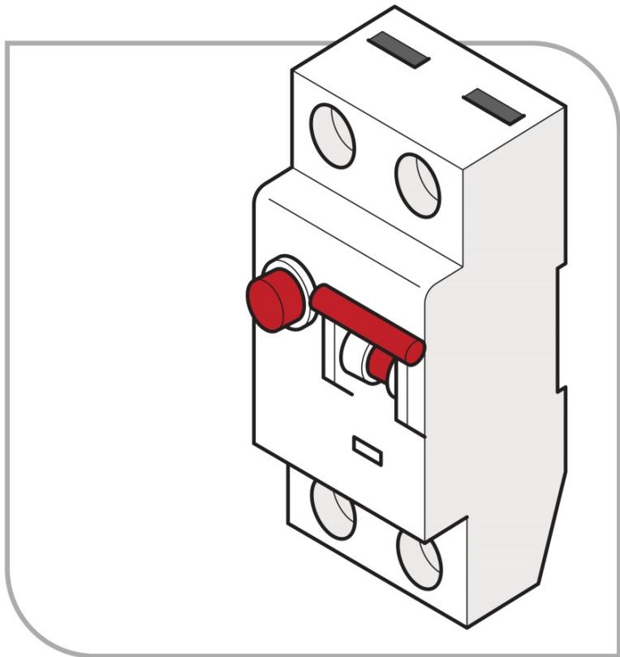
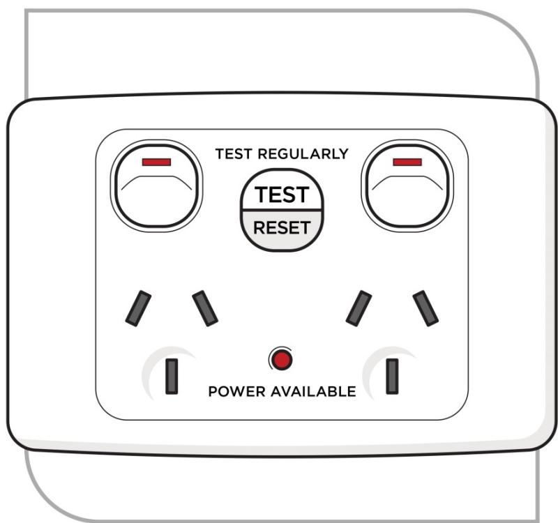
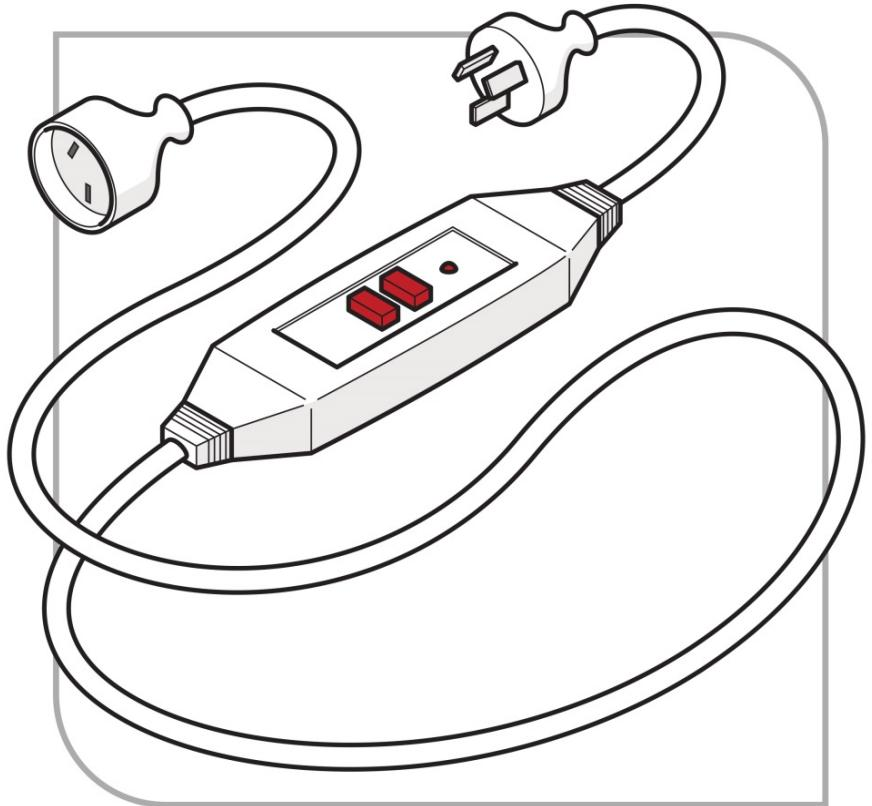
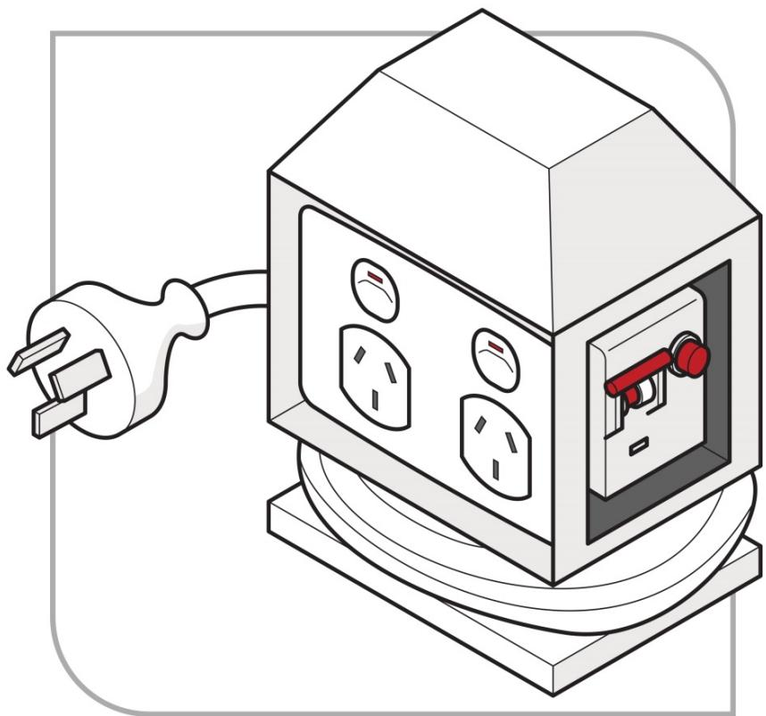
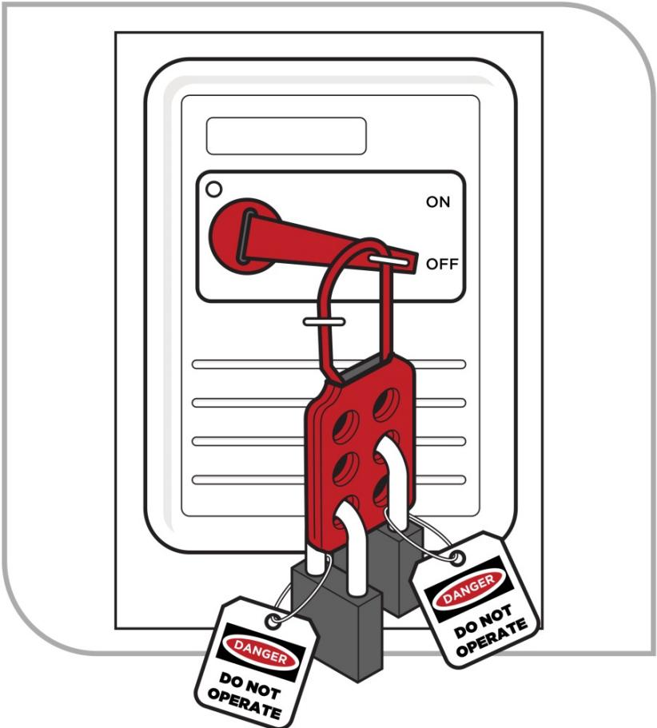
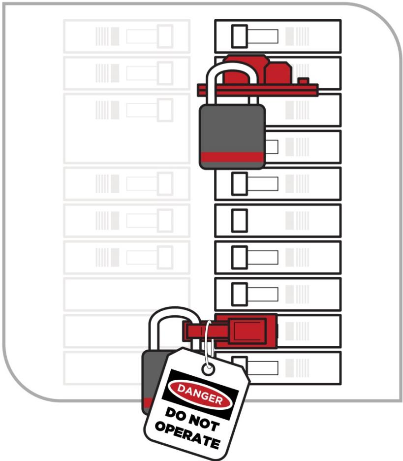
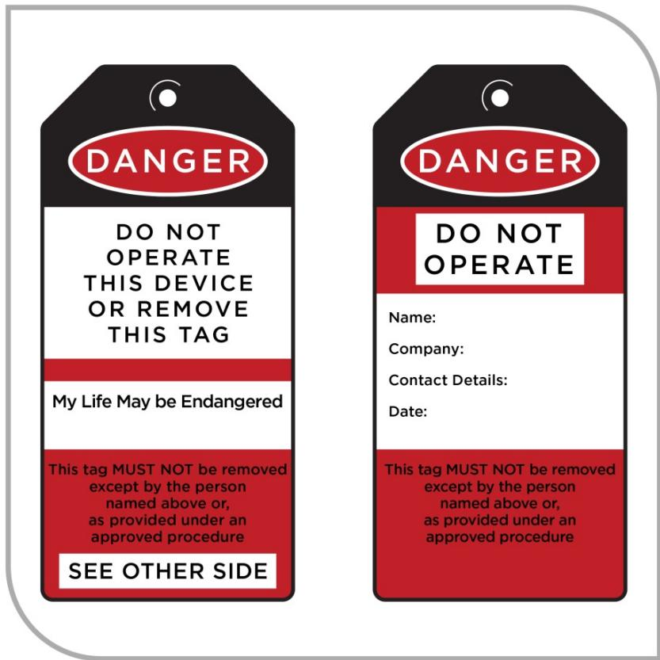
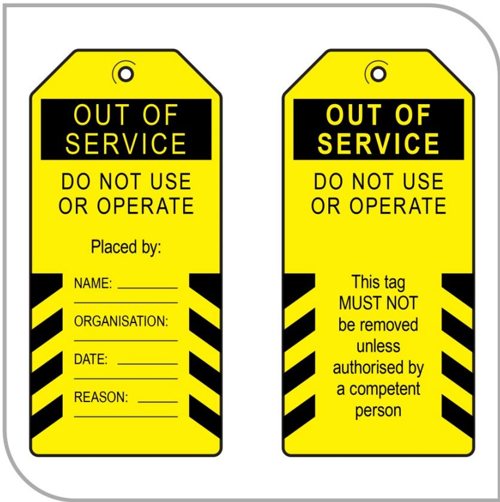

# Managing electrical risks in the workplace

Code of Practice

# Disclaimer

Safe Work Australia is an Australian Government statutory agency established in 2009. Safe Work Australia includes Members from the Commonwealth, and each state and territory, Members representing the interests of workers and Members representing the interests of employers.

Safe Work Australia works with the Commonwealth, state and territory governments to improve work health and safety and workers' compensation arrangements. Safe Work Australia is a national policy body, not a regulator of work health and safety. The Commonwealth, states and territories have responsibility for regulating and enforcing work health and safety laws in their jurisdiction.

ISBN 978- 0- 642- 78329- 5 (PDF)  ISBN 978- 0- 642- 78330- 1 (DOCX)

# Creative Commons

This copyright work is licensed under a Creative Commons Attribution- Noncommercial 4.0 International licence. To view a copy of this licence, visit creativecommons.org/licenses In essence, you are free to copy, communicate and adapt the work for non- commercial purposes, as long as you attribute the work to Safe Work Australia and abide by the other licence terms.

# Contact information

Safe Work Australia | info@swa.gov.au | www.swa.gov.au

# Contents

Foreword 5

1. Introduction 7

1.1. What are electrical risks? 7  1.2. What is electrical work? 7  1.3. Who has health and safety duties in relation to electrical risks? 8  1.4. What is involved in managing electrical risks at the workplace? 11

2. The risk management process 14

2.1. Identifying the hazards 14  2.2. Assessing the risks. 15  2.3. Controlling the risks. 17  2.4. Maintaining and reviewing control measures. 18

# 3. Specific hazards and control measures 20

3.1. Unsafe electrical equipment and electrical installations at the workplace 20  3.2. Inspecting and testing electrical equipment. 21  3.3. Inspecting and testing equipment—construction and demolition sites 25  3.4. Residual current devices. 25

4. Working de-energised. 32

4.1. General principles—verification of de-energised electrical equipment 32  4.2. Work on cables (including cutting cables). 33

5. Isolation, locking off and access 34

5.1. Securing the isolation. 35  5.2. Altering isolation for testing, fault finding and re-energising. 40  5.3. Restoring power. 40  5.4. Leaving unfinished work. 41

# 6. Energised electrical work 42

6.1. Prohibition on energised electrical work. 42  6.2. Planning and preparation. 43  6.3. Carrying out energised electrical work. 44  6.4. Particular energised electrical work—testing and fault finding. 50

7. Working near energised electrical parts. 51

7.1. Planning and preparation. 51  7.2. Carrying out work near energised electrical parts. 52

8. Tools and equipment 54

8.1. Maintenance and inspection. 54  8.2. Ladders, scaffolds and similar equipment. 54  8.3. Insulating barriers and insulating mats. 55

8.4. Test instruments. 55  8.5. Personal protective equipment. 57  8.6. First Aid. 57  9. High voltage electrical work. 59  9.1. Additional risks associated with high voltage. 59  9.2. Planning for high voltage installation work. 59  Appendix A—Glossary. 60  Appendix B—Advantages and disadvantages of non- portable and portable RCDs. 63  Non- portable RCDs. 63  Non- portable RCDs installed at the main switchboard. 63  Non- portable RCDs installed at a socket outlet. 63  Portable RCDs. 64  Portable RCDs—portable plug type. 65  Portable RCDs—portable stand- alone unit. 65  Appendix C—Risks associated with electrical work. 66  Appendix D—Preventative actions checklist. 72  Amendments. 75

# Foreword

This Code of Practice on how to manage electrical risks in workplaces is an approved code of practice under section 274 of the Work Health and Safety Act (the WHS Act).

An approved code of practice provides practical guidance on how to achieve the standards of work health and safety required under the WHS Act and the Work Health and Safety Regulations (the WHS Regulations) and effective ways to identify and manage risks.

A code of practice can assist anyone who has a duty of care in the circumstances described in the code of practice. Following an approved code of practice will assist the duty holder to achieve compliance with the health and safety duties in the WHS Act and WHS Regulations, in relation to the subject matter of the code of practice. Like regulations, codes of practice deal with particular issues and may not cover all relevant hazards or risks. The health and safety duties require duty holders to consider all risks associated with work, not only those for which regulations and codes of practice exist.

Codes of practice are admissible in court proceedings under the WHS Act and WHS Regulations. Courts may regard a code of practice as evidence of what is known about a hazard, risk, risk assessment or risk control and may rely on the code in determining what is reasonably practicable in the circumstances to which the code of practice relates. For further information see the Interpretive Guideline: The meaning of 'reasonably practicable'.

Compliance with the WHS Act and WHS Regulations may be achieved by following another method if it provides an equivalent or higher standard of work health and safety than the code.

An inspector may refer to an approved code of practice when issuing an improvement or prohibition notice.

# Scope and application

This Code is intended to be read by a person conducting a business or undertaking (PCBU). It provides practical guidance to PCBUs on managing electrical risks in the workplace. It applies to all workplaces where a PCBU:

has management or control of electrical equipment, including electrical installations, or carries out electrical work on or near energised electrical equipment, including electrical installations.

This Code may be a useful reference for other persons interested in the duties under the WHS Act and WHS Regulations.

This Code applies to construction and demolition sites, except if a requirement of the Code is dealt with in AS/NZS 3012:2010: Electrical installations - Construction and demolition sites. In that case you must comply with AS/NZS 3012:2010. Further information about construction work can be found in the Code of Practice: Construction work.

This Code does not apply to:

electrical work on extra- low voltage electrical equipment, including extra- low voltage electrical installations electrical work on high voltage equipment after switching, isolation, short circuiting and earthing, subject to summary guidance in Chapter 9 of this Code the manufacture of electrical equipment automotive electrical work

Managing electrical risks in the workplace Code of Practice

work that is not electrical work carried out on telephone, communication and data systems work carried out by or on behalf of an electricity supply authority on the electrical equipment controlled or operated by the authority to generate, transform, transmit or supply electricity, and repair of consumer electrical equipment when unplugged from any electrical socket outlet.

'Extra- low voltage' means voltage that does not exceed 50 volts alternating current (50 V a.c.) or 120 volts ripple- free direct current (120 V ripple free d.c.).

# How to use this Code of Practice

This Code includes references to the legal requirements under the WHS Act and WHS Regulations. These are included for convenience only and should not be relied on in place of the full text of the WHS Act or WHS Regulations. The words 'must', 'requires' or 'mandatory' indicate a legal requirement exists that must be complied with.

The word 'should' is used in this Code to indicate a recommended course of action, while 'may' is used to indicate an optional course of action.

# 1. Introduction

# 1.1. What are electrical risks?

Electrical risks are risks of death, shock or other injury caused directly or indirectly by electricity. The most common electrical risks and causes of injury are:

electric shock causing injury or death. The electric shock may be received by direct or indirect contact, tracking through or across a medium, or by arcing. For example, electric shock may result from indirect contact where a conductive part that is not normally energised (such as a metal toaster body or a fence) becomes energised due to a fault fire (such as fire resulting from an electrical fault), arcing or explosion causing burns. These injuries are often suffered because arcing or explosion or both occur when high fault currents are present electric shock from 'step- and- touch' potentials, and toxic gases causing illness or death. Burning and arcing associated with electrical equipment may release various gases and contaminants.

Even the briefest contact with electricity at 50 volts for alternating current (V a.c.) or 120 volts for direct current (V d.c.) can have serious consequences for a person's health and safety. High voltage shocks (involving more than  $1000V$  a.c. or 1500 V d.c.) can cause contact burns and damage to internal organs.

Electric shocks may also lead to other injuries, including falls from ladders, scaffolds or other elevated work platforms. Other injuries or illnesses may include muscle spasms, palpitations, nausea, vomiting, collapse and unconsciousness.

Workers using electricity may not be the only ones at risk- - faulty electrical equipment and poor electrical installations can lead to fires that may also cause death or injury to others.

# 1.2. What is electrical work?

# WHS Regulation 146

Meaning of electrical work

Electrical work means:

connecting electricity supply wiring to electrical equipment or disconnecting electricity supply wiring from electrical equipment installing, removing, adding, testing, replacing, repairing, altering or maintaining electrical equipment or an electrical installation.

Electrical work does not include:

work that involves connecting electrical equipment to an electricity supply by means of a flexible cord plug and socket outlet work on a non- electrical component of electrical equipment if the person carrying out the work is not exposed to an electrical risk replacing electrical equipment or a component of electrical equipment if that task can be safely performed by a person who does not have expertise in carrying out electrical work (for example, replacing domestic fuses or light bulbs)

assembling, making, modifying or repairing electrical equipment as part of a manufacturing process building or repairing ducts, conduits or troughs where electrical wiring is or will be installed if:

the ducts, conduits or troughs are not intended to be earthed the wiring is not energised, and the work is supervised by a licensed or registered electrical worker.

locating or mounting electrical equipment, or fixing electrical equipment in place, if this task is not performed in relation to the connection of electrical equipment to an electricity supply assisting a licensed or registered electrician to carry out electrical work if:

the assistant is directly supervised by the licensed or registered electrician, and the assistance does not involve physical contact with any energised electrical equipment.

- assisting a person acquire through training, qualification or experience the knowledge and skills to carry out the work- carrying out electrical work, other than work on energised electrical equipment, in order to meet eligibility requirements in relation to becoming a licensed or registered electrician.

Electrical work does not include work on electrical equipment that is operated by electricity at extra- low voltage except electrical equipment that:

- is part of an electrical installation located in an area in which the atmosphere presents a risk to health and safety from fire or explosion, or- is, or is part of an active impressed current cathodic protection system within the meaning of AS 2832.1:2015: Cathodic protection of metals – Pipes and cables.

# Electrical licensing laws

The WHS Regulations do not modify or otherwise change licensing or registration requirements (whichever applies) under state or territory electrical licensing laws.

For more information about the applicable electrical licensing or registration laws contact the local regulator in the relevant jurisdiction.

# 1.3. Who has health and safety duties in relation to electrical risks?

There are a number of duty holders who have a role in managing electrical risks. These include:

persons conducting a business or undertaking (PCBUs) designers, manufacturers, importers and suppliers of plant, substances or structures, and officers.

Workers and other persons at the workplace also have duties under the WHS Act, such as the duty to take reasonable care for their own health and safety at the workplace.

A person can have more than one duty and more than one person can have the same duty at the same time.

Early consultation and identification of risks can allow for more options to eliminate or minimise risks and reduce the associated costs.

# Person conducting a business or undertaking

WHS Act section 19Primary duty of careWHS Regulation 147Risk management

A PCBU must eliminate electrical risks or, if that is not reasonably practicable, minimise the risks so far as is reasonably practicable.

The WHS Regulations include more specific requirements for PCBUs to manage the risks of hazards associated with electrical risks at the workplace. PCBUs at a workplace have a duty to ensure effective residual current devices (RCDs) are used, so far as is reasonably practicable, in certain high- risk environments as defined in the WHS Regulations.

PCBUs carrying out electrical work must comply with the prohibition on electrical work on energised electrical equipment subject to the defined exceptions. PCBUs may also have duties under local electrical safety laws. PCBUs should ensure electrical installation work is carried out by qualified persons and testing and compliance requirements are met.

PCBUs have a duty to consult workers about work health and safety and may also have duties to consult, cooperate and coordinate with other duty holders.

Designers, manufacturers, importers, suppliers and installers

# WHS Act section 22

Further duties of persons conducting businesses or undertakings that design plant, substances or structures

# WHS Act section 23

Duties of persons conducting businesses or undertakings that manufacture plant, substances or structures

# WHS Act section 24

Duties of persons conducting businesses or undertakings that import plant, substances or structures

# WHS Act section 25

Duties of persons conducting businesses or undertakings that supply plant, substances or structures

# WHS Act section 26

Duties of persons conducting businesses or undertakings that install, construct or commission plant or structures

Designers of electrical equipment and installations must ensure, so far as is reasonably practicable, that they are designed to be without risks to health and safety of people at or in the vicinity of a workplace.

Manufacturers of electrical equipment and installation must ensure, so far as is reasonably practicable, that they are manufactured to be without risks to health and safety of people at or in the vicinity of a workplace.

Importers of electrical equipment and installations must ensure, so far as is reasonably practicable, that they are without risks to health and safety of people at or near the vicinity of a workplace.

Suppliers of electrical equipment and installations must ensure, so far as is reasonably practicable, that they are without risks to health and safety of people at or in the vicinity of a workplace.

Installers of electrical equipment and installations must ensure, so far as is reasonably practicable, that they are without risks to health and safety of people at or in the vicinity of a workplace.

# Officers

# WHS Act section 27

Duty of officers

Officers, for example company directors, have a duty to exercise due diligence to ensure the PCBU complies with the WHS Act and WHS Regulations. This includes taking reasonable steps to ensure that the business or undertaking has and uses appropriate resources and processes to eliminate or minimise electrical risks at the workplace. Further information on who is an officer and their duties is available in the Interpretive Guideline: The health and safety duty of an officer under section 27.

# Workers

# WHS Act section 28

Duties of workers

Workers have a duty to take reasonable care for their own health and safety and to not adversely affect the health and safety of other persons. Workers must comply with reasonable instructions, as far as they are reasonably able, and cooperate with reasonable health and safety policies or procedures that have been notified to workers. This means that if electrical equipment or personal protective equipment (PPE) is provided by the PCBU, the worker must use it, so far as they are reasonably able, in accordance with the information, instruction and training provided about its use.

# Other persons in the workplace

# WHS Act section 29

Duties of other persons at the workplace

Other persons at the workplace, like visitors, must take reasonable care for their own health and safety and must take care not to adversely affect other people's health and safety. They must comply, so far as they are reasonably able, with reasonable instructions given by the PCBU to allow that person to comply with the WHS Act.

Duty holders may also have other legal obligations under Commonwealth, state or territory electrical safety legislation.

# 1.4. What is involved in managing electrical risks at the workplace?

WHS Regulation 34Duty to identify hazardsWHS Regulation 35Managing risks to health and safetyWHS Regulation 36Hierarchy of control measuresWHS Regulation 37Maintenance of control measuresWHS Regulation 38Review of control measures

This Code provides guidance on how to manage electrical risks in the workplace using the following systematic process:

Identify hazards- - find out what could cause harm. Assess risks, if necessary- - understand the nature of the harm that could be caused by the hazard, how serious the harm could be and the likelihood of it happening. This step may not be necessary if you are dealing with a known risk with known controls. Eliminate risks so far as is reasonably practicable. Control risks- - if it is not reasonably practicable to eliminate the risk, implement the most effective control measures that are reasonably practicable in the circumstances in accordance with the hierarchy of control measures, and ensure they remain effective over time. Review control measures to ensure they are working as planned.

Further guidance on the general risk management process is in the Code of Practice: How to manage work health and safety risks.

# Consulting workers

# WHS Act section 47

Duty to consult workers

# WHS Act section 48

Nature of consultation

A PCBU must consult, so far as is reasonably practicable, with workers who carry out work for the business or undertaking who are (or are likely to be) directly affected by a health and safety matter.

This duty to consult is based on the recognition that worker input and participation improves decision- making about health and safety matters and assists in reducing work- related injuries and disease.

The broad definition of a 'worker' under the WHS Act means a PCBU must consult, so far as is reasonably practicable, with employees, contractors and subcontractors and their employees, on- hire workers, outworkers, apprentices, trainees, work experience students, volunteers and other people who are working for the PCBU and who are, or are likely to be, directly affected by a health and safety matter.

Workers are entitled to take part in consultations and to be represented in consultations by a health and safety representative who has been elected to represent their work group.

Consulting, cooperating and coordinating activities with other duty holders

# WHS Act section 46

Duty to consult with other duty holders

The WHS Act requires a PCBU to consult, cooperate and coordinate activities with all other persons who have a work health or safety duty in relation to the same matter, so far as is reasonably practicable.

There is often more than one PCBU involved in a workplace, who may each have responsibility for the same health and safety matters, either because they are involved in the same activities or share the same workplace.

In these situations, each duty holder should exchange information to find out who is doing what and work together in a cooperative and coordinated way so risks are eliminated or minimised so far as is reasonably practicable.

For example, if you engage an electrical contractor to carry out electrical work at your workplace you should consult with the contractor on how in general the work is to be carried out and in particular how risks to their health and safety and that of others at the workplace are to be managed while the work is carried out. You should also cooperate with the electrical contractor (for example, instructing on and ensuring compliance with 'no go' zones) to ensure the electrical safety of everyone at the workplace.

Further guidance on consultation is available in the Code of Practice: Work health and safety consultation, cooperation and coordination.

Information, training, instruction and supervision

# WHS Act section 19

Primary duty of care

# WHS Regulation 39

Provision of information, training and instruction

The WHS Act requires a PCBU to, so far as is reasonably practicable, provide information, training, instruction or supervision that is necessary to protect all persons from risks to their health and safety arising from work carried out as part of the conduct of the business or undertaking.

The PCBU must ensure that information, training and instruction provided to a worker are suitable and adequate having regard to:

the nature of the work carried out by the worker the nature of the risks associated with the work at the time of the information, training and instruction, and the control measures implemented.

The PCBU must also ensure, so far as is reasonably practicable, that the information, training and instruction are provided in a way that is readily understood by the people to whom it is provided.

Workers must be trained and have the appropriate skills to carry out a particular task safely. Training should be provided to workers by a competent person. Formal or on- the- job training may be required or appropriate, depending on the circumstances.

Examples of training are:

- induction training-to ensure new starters or workers new to a job are trained on safe systems of work and other relevant health and safety matters 
- supervisor and management training-to ensure that safety issues are appropriately managed at the workplace 
- work-specific training-to ensure that workers carrying out particular work are trained on any electrical and other risks specific to the work, as appropriate 
- ongoing or refresher training-to ensure that any training on work health and safety matters is repeated as appropriate on a periodic basis 
- emergency procedure training-to ensure workers know what to do in the event of an emergency, for example, procedures to follow if a person receives an electric shock 
- first aid training-to ensure appropriate procedures are followed for administering first aid, for example, proper treatment for electric shock, and 
- electrical rescue and resuscitation training for safety observers.

Special needs of workers should be taken into account in deciding the structure, content and delivery of training, including literacy levels, work experience and specific skills required to carry out the work.

# 2. The risk management process

# 2.1. Identifying the hazards

# WHS Regulation 34

Duty to identify hazards

The first step in the risk management process is to identify all hazards involved with electrical work. This involves finding things and situations that could potentially cause harm to people. Hazards generally arise from the following aspects of work and their interaction:

physical work environment equipment, materials and substances used work tasks and how they are performed, and work design and management.

Hazards may be identified by looking at the workplace and how work is carried out. It is also useful to talk to workers, manufacturers, suppliers and health and safety specialists and review relevant information, records and incident reports.

Hazards associated with electrical equipment or installations may arise from:

- the design, construction, installation, maintenance and testing of electrical equipment or electrical installations- design change or modification- inadequate or inactive electrical protection- where and how electrical equipment is used. Electrical equipment may be subject to operating conditions that are likely to result in damage to the equipment or a reduction in its expected life span. For example, equipment may be at greater risk of damage if used outdoors or in a factory or workshop environment- electrical equipment being used in an area in which the atmosphere presents a risk to health and safety from fire or explosion, for example confined spaces- the type of electrical equipment. For example, 'plug in' electrical equipment that is moved around from site to site, including extension leads, is particularly liable to damage- the age of electrical equipment and electrical installations- work carried out on or near electrical equipment or electrical installations, including electric overhead lines or underground electric services, for example work carried out in a confined space connected to plant or services.

Exposure to high electromagnetic fields may also present a potential hazard for workers with some medical conditions, for example, pacemakers. You must inform workers and other persons at the workplace of any potential electromagnetic hazards at the workplace that may affect a medical condition. You must also manage risks to health and safety arising out of electromagnetic hazards, including eliminating the risk so far as is reasonably practicable. If that is not reasonably practicable you must minimise the risk so far as is reasonably practicable.

You can identify potential electrical hazards in a number of different ways including:

- talking to workers and observing where and how electrical equipment is used- regularly inspecting and testing electrical equipment and electrical installations as appropriate- reading product labels and manufacturers' instruction manuals- talking to manufacturers, suppliers, industry associations, and health and safety specialists, and- reviewing incident reports.

# 2.2. Assessing the risks

A risk assessment involves considering what could happen if someone is exposed to a hazard and the likelihood of it happening. A risk assessment can help you determine:

- how severe a risk is- whether any existing control measures are effective- what action you should take to control the risk, and- how urgently the action needs to be taken.

Hazards have the potential to cause different types and severities of harm, ranging from minor discomfort to a serious injury or death.

Many hazards and their associated risks are well known and have well established and accepted effective control measures. In these situations, the second step in the process identified in section 1.4 of this Code (to formally assess the risk) is not required. If after identifying a hazard you already know the risk and how to control it effectively, you may simply implement the controls.

In some circumstances, a risk assessment will assist to:

- identify which workers are at risk of exposure- determine what sources and processes are causing the risk- identify if and what kind of control measures should be implemented, and- check the effectiveness of existing control measures.

It may be possible to re- use a risk assessment in situations where all the hazards, tasks, things or circumstances are the same as for a previous risk assessment, and no worker or other person will be exposed to greater, additional or different risks.

To assess the nature and severity of risks associated with electrical hazards consider:

- What is the potential impact of the hazard?- How severe could the electrical hazard be? For example, direct contact causing electrocution, fire or explosion causing serious burns or death.- How many people are exposed to the hazard?- How likely is the hazard to cause harm?- Could it happen at any time or would it be a rare event?- How frequently are workers exposed to the hazard?

Factors to consider when assessing the risks associated with electrical work are:

- the sources of electrical risks, including energy levels at the workplace- the properties of electricity; electricity is particularly hazardous because electrical currents are not visible and do not have any smell or sound

work practices and procedures and the nature of the electrical work to be carried out. For example isolation to carry out maintenance the competence, skill and experience of the person(s) carrying out the electrical work potential or actual high fault current levels (i.e. risks associated with arc flash) availability of isolation points the type of plant, machinery and equipment to be used availability of suitable test instruments availability of properly rated personal protective equipment (PPE) the workplace and working environment, for example:

in and around trenches, pits and underground ducts ladders, scaffolds, portable pole platforms, elevating work platforms, poles and towers confined spaces or atmospheres that present a risk to health and safety from fire or explosion the conditions, for example wet weather ability to safely rescue people.

Also consider individual workers' needs, for example:

Is the worker experienced in, and have they been properly trained for the working conditions? Is the worker physically fit for the proposed work, for example are they able to climb to heights to work on an overhead conductor; are they mentally alert and not fatigued? Does the worker have a visual or hearing impairment, for example do they have a visual colour deficiency or hearing loss? Does the worker take medication that may increase their vulnerability when working in electrical environments? Is the worker working excessively long hours? Does the worker suffer from claustrophobia?

Appendix C may be used to assist with identifying hazards and assessing risks in carrying out electrical work.

Further guidance on the risk management process and the hierarchy of control measures is available in the Code of Practice: How to manage work health and safety risks.

Risk assessment and working on energised equipment

# WHS Regulation 161

How the work is to be carried out

For work on energised electrical equipment, as a PCBU you must ensure that a risk assessment is conducted by a competent person and recorded prior to work commencing. For more information about energised electrical work see Chapter 3 of this Code.

# 2.3. Controlling the risks

# WHS Regulation 36

Hierarchy of control measures

Once hazards have been identified and the risks assessed, appropriate control measures must be put in place.

# Hierarchy of control measures

Hierarchy of control measuresThe WHS Regulations require duty holders to work through the hierarchy of control measures when managing certain risks; however, it can be applied to any risk. The hierarchy ranks control measures from the highest level of protection and reliability to the lowest. Further guidance on the risk management process and the hierarchy of control measures is in the Code of Practice: How to manage work health and safety risks.

# Eliminating the risk

You must always aim to eliminate the risk. For example, you can eliminate significant electrical risks by designing- in or designing- out certain features to eliminate hazards and working de- energised rather than energised. That is why the WHS Regulations prohibit energised electrical work subject to certain exceptions.

If eliminating the hazards and associated risks is not reasonably practicable, you must minimise the risk by one or more of the following:

Substitution- minimise the risk by substituting or replacing a hazard or hazardous work practice with something that gives rise to a lesser risk. For example, it may be reasonably practicable to use extra- low voltage electrical equipment such as a batterye. operated tool rather than a tool that is plugged in to mains electricity. Isolation- minimise the risk by isolating or separating the hazard or hazardous work practice from any person exposed to it. For example, it may not be reasonably practicable to eliminate energised electrical work altogether; however, even if it is necessary (for one of the legally permissible reasons) to work on an energised electrical part, it may be possible to de- energise the surrounding parts. Engineering controls- engineering controls are physical control measures to minimise risk. For example, insulation, guarding, and installing RCDs to prevent electric shock.

If risk remains, it must be minimised by implementing administrative controls, so far as is reasonably practicable. Administrative controls involve the use of safe work practices to control the risk, for example by providing suitable and adequate training; establishing exclusion zones; and use of permits and warning signs.

Any remaining risk must be minimised with suitable PPE, for example protective eyewear, insulated gloves, hard hats, aprons and breathing protection. The PPE should be rated for the work to be done. If working on energised equipment, the PPE must be able to protect the user from the maximum expected energy available at the work site.

Administrative control measures and PPE do not control the hazard at the source. They rely on human behaviour and supervision and used on their own tend to be the least effective in minimising risks. Reliance on administrative controls and PPE should only occur where other measures are not reasonably practicable or as an interim control while the preferred control measure is being implemented.

However, administrative controls such as procurement and personnel policies and procedures are important in relation to electrical risks, as they will help to ensure that electrical work is carried out by a qualified electrician as required by law.

You should check that your chosen control measure does not introduce new hazards. The control measures you apply may change the way work is carried out. In these situations, you must consult your workers and develop safe work procedures, and provide your workers with training, instruction, information and supervision on the changes.

Chapters 3- 5 of this Code provide information on control measures when working de- energised, and Chapters 6- 7 on energised electrical work.

# 2.4. Maintaining and reviewing control measures

# WHS Regulation 38

Review of control measures

Control measures must be maintained so they remain fit for purpose, suitable for the nature and duration of work, and installed, set up and used correctly.

The control measures put in place to protect health and safety should be regularly reviewed to make sure they are effective. If the control measure is not working effectively it must be revised to ensure it is effective in controlling the risk.

You must review and as necessary revise a control measure so as to maintain, so far as is reasonably practicable, a work environment that is without risks to health or safety. For example:

when the control measure does not control the risk so far as is reasonably practicable before a change at the workplace that is likely to give rise to a new or different risk to health or safety that the measure may not effectively control when a new relevant hazard or risk is identified when the results of consultation indicate that a review is necessary, or when a health and safety representative requests a review if that person reasonably believes that: a circumstance in any of the above points affects or may affect the health and safety of a member of the work group represented by the health and safety representative the control measure has not been adequately reviewed in response to the circumstance.

Common review methods include workplace inspection, consultation, testing and analysing records and data.

You can use the same methods as in the initial hazard identification step to check control measures. You must also consult your workers and their health and safety representatives The following questions will help you evaluate how well you are currently managing electrical risks in your workplace:

Do you talk to your workers about electrical safety? Do any relevant new work methods or equipment have the potential to make work safer in your workplace? Are procedures for identifying electrical hazards in the workplace effective? Are electrical safety procedures followed? Do you encourage your workers to report electrical hazards?

Managing electrical risks in the workplace Code of Practice

Do you regularly inspect and maintain your electrical equipment to identify safety problems? Do you fix or rectify identified electrical hazards in a timely manner?

If problems are found, go back through the risk management steps, review your information and make further decisions about risk control.

# 3. Specific hazards and control measures

As a person conducting a business or undertaking (PCBU) there is a range of things you should do to manage the risks to health and safety associated with electrical risks at the workplace. These include:

- ensure power circuits are protected by the appropriate rated fuse or circuit breaker to prevent overloading- if the circuit keeps overloading, do not increase the fuse rating as this creates a fire risk due to overheating; instead, ensure the circuit is not re-energised until the reason for the overload has been determined by a competent person- arrange electrical leads so they will not be damaged. So far as is reasonably practicable, avoid running leads across the floor or ground, through doorways and over sharp edges, and use lead stands or insulated cable hangers to keep leads off the ground. In many heavy industries, cable protection ramps are used to protect cables- do not use leads and tools in damp or wet conditions unless they are specially designed for those conditions- ensure circuits where portable electrical equipment can be connected are protected by appropriately rated residual current devices (RCDs) (as required by the WHS Regulations) that are properly tested and maintained- if RCDs, circuit breakers or other over current protective devices including fuses are triggered into operation, ensure circuits are not re-energised until the reason for the operation has been determined by a competent person, and- ensure RCDs provide an effective control by regularly testing them.

# 3.1. Unsafe electrical equipment and electrical installations at the workplace

# WHS Regulation 149

Unsafe electrical equipment

As a PCBU at a workplace, you must ensure that any unsafe electrical equipment at the workplace is disconnected or isolated from its electricity supply and, once disconnected, is not reconnected until it is repaired or tested by a competent person and found to be safe, or is replaced or permanently removed from use.

Electrical equipment is unsafe if there are reasonable grounds for believing it to be unsafe.

You should implement a safe system of work to deal with potentially unsafe electrical equipment at the workplace. This may include:

- requiring workers, if competent to do so, to undertake a check of the physical condition of the electrical equipment, including the lead and plug connections, prior to use- taking the electrical equipment out of service if in doubt as to its safe condition, including at any time during use- putting reporting arrangements in place to ensure, so far as is reasonably practicable, that supervisors or line managers are advised if a worker takes electrical equipment out of service for safety reasons.

Unsafe electrical equipment should be labelled indicating it is unsafe and must not be used. This is to prevent inadvertent use before the electrical equipment has been tested, repaired or replaced.

# 3.2. Inspecting and testing electrical equipment

# WHS Regulation 150

Inspection and testing of electrical equipment

Inspecting and testing electrical equipment helps determine whether it is electrically safe.

Regular visual inspection can identify obvious damage, wear or other conditions that might make electrical equipment unsafe. Many electrical defects are detectable by visual inspection.

Regular testing can detect electrical faults and deterioration that cannot be detected by visual inspection.

The nature and frequency of inspection and testing will vary depending on the nature of the workplace, its environment and the risks associated with the electrical equipment.

A key source of information on dealing with the inspection and testing of electrical equipment is the manufacturer's recommendations.

In this section a reference to 'inspection' or 'testing' excludes repair of electrical equipment.

# Inspecting and testing electrical equipment--other than equipment used in specified higher risk operating environments

Electrical items used in higher risk operating environments need to be inspected and tested under regulation 150. See the next section for requirements for electrical items used in higher risk operating environments.

Lower- risk workplaces include those workplaces that are dry, clean, well- organised and free of conditions that are likely to result in damage to electrical equipment, for example an office, retail shop, telecommunications centre or classroom. Electrical equipment commonly used in these types of workplaces includes computers, printers and stationary or fixed electrical equipment. Electrical equipment used in lower- risk workplaces may still need inspection and testing, on a less frequent basis, to ensure that it is safe for continued use.

Guidance on inspecting and testing electrical equipment in lower- risk operating environments is included in AS/NZS 3760:2010: In- service safety inspection and testing of electrical equipment and may also be included in the manufacturer's recommendations.

AS/NZS 3760:2010 sets out indicative inspection and testing intervals for certain electrical equipment, including RCDs, used in a variety of different operating environments.

In addition to regular testing, electrical equipment should also be tested:

- after a repair or servicing that could affect the electrical safety of the equipment (i.e. undertaken by the person carrying out the repair or servicing before return to service)- before its first use if bought second-hand.

Inspection and testing of electrical equipment may involve, in part:

Inspection and testing of electrical equipment may involve, in part:- looking for obvious damage, defects or modifications to the electrical equipment, including accessories, connectors, plugs or cord extension sockets- looking for discolouration that may indicate exposure to excessive heat, chemicals or moisture- checking the integrity of protective earth and insulation resistance- checking that flexible cords are effectively anchored to equipment, plugs, connectors and cord extension sockets- looking for damage to flexible cords- checking that operating controls are in good working order i.e. they are secure, aligned and appropriately identified- checking that covers, guards, etc are secured and working in the manner intended by the manufacturer or supplier- checking that ventilation inlets and exhausts are unobstructed, and- checking that the current rating of the plug matches the current rating of the associated electrical equipment.

Note that AS/NZS 3760:2010 specifically excludes medical devices and electrical devices in patient care areas. For more information on these see AS/NZS 3551:2012: Management programs for medical equipment or AS/NZS 3003:2018: Electrical Installations - patient areas.

# New equipment

Brand new electrical equipment that has never been put into use (i.e. other than second- hand equipment) does not have to be tested before first use. It should, however, still be visually inspected to ensure that no damage occurred during transport, delivery, installation or commissioning.

If the electrical equipment is required to be tested regularly for safety, take the necessary steps to ensure that it does not miss required tests.

The date the electrical equipment was placed into service should be recorded, for example on the record of installation. The electrical equipment may also be fitted with a tag stating:

that the equipment is 'new to service' the date of entry into service the date when the first electrical safety test is due, and that the equipment has not been tested.

Fitting a 'new- to- service' tag is an administrative task that can be carried out by an appropriately trained in- house person.

Alternatively, a different system may be put into place to ensure the electrical equipment is properly inspected and tested as required (for example, the new electrical equipment can be included in the next round of electrical testing carried out at the workplace).

# Inspecting and testing equipment— regulatory requirements for specified higher risk operating environments other than construction or demolition sites

# WHS Regulation 150(1)

Inspection and testing of electrical equipment

This section deals with higher risk operating environments other than construction and demolition sites. For inspection and testing requirements in relation to construction and demolition sites see section 3.3 of this Code.

As a PCBU at a workplace, you must ensure that the electrical equipment is regularly inspected and tested by a competent person if the electrical equipment is:

supplied with electricity through an electrical socket outlet (plug in' equipment), and used in an environment in which its normal use exposes the equipment to operating conditions that are likely to result in damage to the equipment or a reduction in its expected life span. This includes conditions that involve exposing the electrical equipment to moisture, heat, vibration, mechanical damage, corrosive chemicals or dust.

Some operating environments have the potential to seriously affect the safe operation of electrical equipment. Examples of higher risk operating environments include wet or dusty areas, outdoors, workplaces that use corrosive substances, commercial kitchens and manufacturing environments.

A risk assessment can help determine whether electrical equipment is being used in any of these operating environments at a particular workplace.

As a general rule electrical equipment used in higher risk operating environments should be tested at least once every 12 months. More frequent testing may be prudent, for example, in relation to:

electrical equipment used in manufacturing and workshop environments (for example at least once every 6 months) commercial cleaning equipment (for example at least once every 6 months) hire equipment (for example at least once every 3 months).

You must ensure, so far as is reasonably practicable, that electrical equipment is not used if it is required to be tested under WHS Regulation 150, but testing has not occurred. Possible actions may include storing the equipment in locked areas to prevent use, or using 'lock out' labels and tags.

For guidance on appropriate inspection and testing intervals, seek the advice of a competent person, as defined in the next section. Further guidance may be found in AS/NZS 3760:2010: In- service safety inspection and testing of electrical equipment and the manufacturer's recommendations.

# Hire equipment

If you are hiring out electrical equipment you should ensure the equipment is inspected at the start of each hire and tested every three months.

The PCBU using the electrical equipment hired out should ensure that, for the period of the hire, the equipment meets all applicable inspection and testing requirements under the WHS Regulations and this Code.

# Competency requirements for those carrying out inspection and testing of electrical equipment

Inspection and testing of electrical equipment must be carried out by a competent person.

For the purposes of the testing described in WHS Regulation 150, a competent person includes a person who is licensed or registered to perform electrical work under a law relating to electrical safety or occupational licensing.

The person carrying out any testing of electrical equipment should also be competent to interpret the test results of any equipment they use.

Depending on Commonwealth, state or territory electrical safety laws a person carrying out testing under AS/NZS 3760:2010: In- service safety inspection and testing of electrical equipment could be required to be:

- a licensed or registered electrician (whichever applies), or- in some jurisdictions, a licensed electrical inspector, or- a person who has successfully completed a structured training course and been deemed competent in the use of a pass-fail type portable appliance tester and the visual inspection of electrical equipment.

The training described in the third point above should be designed to ensure, so far as is reasonably practicable, that on completion successful participants:

- can use the relevant test equipment safely and effectively- understand electrical risks and appreciate the role that inspection and testing play in ensuring electrical safety- understand AS/NZS 3760:2010 and AS/NZS 3012:2010: Electrical installations - Construction and demolition sites (if testing equipment for construction or demolition sites)- understand the legal requirements relevant to the work.

Some kinds of electrical testing must only be carried out by a licensed electrician or electrical inspector under Commonwealth, state and territory electrical safety laws. For example, there may be the requirement that testing requiring the dismantling of electrical equipment only be carried out by a licensed electrician.

Additional or different competencies may be required for more complex kinds of testing outside the scope of AS/NZS 3760:2010.

If in doubt over who is qualified to inspect or test equipment, advice should be obtained from a person qualified and experienced in electrical equipment testing, for example an electrician, electrical contractor, electrical inspector, specialist testing provider or relevant regulator.

# Recording results of testing

# WHS Regulation 150(3)

Inspection and testing of electrical equipment

As a PCBU at a workplace, you must ensure that a record of testing carried out on electrical equipment at the workplace is kept until the electrical equipment is next tested, permanently removed from the workplace, or disposed of. A record of testing must specify the following:

- the name of the person who carried out the testing- the date of the testing

the outcome of the testing, and the date on which the next testing must be carried out.

The record may be in the form of a tag attached to the electrical equipment tested.

# Logbook or other similar form of record

The record of testing may take the form of a logbook, database, register or a similar kind of record, or a tag. Logbooks and similar records have the advantage of:

ensuring there is a permanent record of inspection and testing (for example, as a backup if tags are damaged or removed) facilitating internal audits, and allowing more detailed information to be recorded.

# Tag

If the record of testing is a tag, it should be durable, water resistant, non- metallic, self- adhesive or well secured, incapable of re- use, and have a bright, distinctive surface.

The tag may also be colour coded to identify the month in which the testing was carried out.

A tag may not include all of the required information. In that case, the rest of the required information must be recorded elsewhere and kept for the relevant period of time.

If a tag is not used you should ensure that tested electrical equipment is marked or labelled so that records of testing can clearly identify the relevant equipment.

# 3.3. Inspecting and testing equipmentconstruction and demolition sites

# WHS Regulations Division 5

Electrical equipment and installations and construction work- - additional duties

# WHS Regulation 163

Duty of person conducting business or undertaking

A PCBU carrying out construction work must comply with AS/NZS 3012:2010: Electrical installations - Construction and demolition sites.

Any term that is defined in both AS/NZS 3012:2010 and the WHS Act or WHS Regulations has the meaning as defined in the WHS Act or WHS Regulations.

If AS/NZS 3012:2010 deals with the same matter as a requirement under Part 4.7 of the WHS Regulations (General Electrical Safety in Workplaces and Energised Electrical Work) then it is sufficient to comply with the standard.

# 3.4. Residual current devices

Electric shock often results from people making contact with unprotected energised parts of electrical equipment and earth. Contact with energised parts may occur by touching:

- bare conductors- internal parts of electrical equipment

- external parts of electrical equipment that have become energised because of an internal fault- metallic or other conductive equipment that has inadvertently become live.

Contact with earth occurs through normal body contact with the ground or earthed metal parts.

Serious injuries and fatalities may be prevented by the use of properly installed and maintained residual current devices (RCDs), commonly referred to as 'safety switches'. An RCD is an electrical safety device designed to immediately switch off the supply of electricity when electricity 'leaking' to earth is detected at harmful levels. RCDs offer high levels of personal protection from electric shock.

RCDs work by continuously comparing the current flow in both the active (supply) and neutral (return) conductors of an electrical circuit. If the current flow becomes sufficiently unbalanced, some of the current in the active conductor is not returning through the neutral conductor and is leaking to earth. RCDs are designed to quickly disconnect the electricity supply when they sense harmful leakage, typically when it reaches 30 milliamps or a lesser amount.

This ensures an electrical leak is detected and the electricity supply is disconnected before it can cause serious injury or damage.

While RCDs significantly reduce the risk of electric shock they do not provide protection in all circumstances. For example, an RCD will not trigger the switching off of electricity supply if a person contacts both active and neutral conductors while handling faulty plugs or electrical equipment and electricity flows through the person's body, unless there is also a current flow to earth.

# When RCDs must be provided for use in workplaces

# WHS Regulation 164

Use of socket outlets in hostile operating environment

In certain higher risk or hostile operating environments, as outlined below, you must ensure, so far as is reasonably practicable, that any electrical risk associated with the supply of electricity to 'plug in' electrical equipment (such as using socket outlets) is minimised by the use of an appropriate RCD.

Subject to the exceptions outlined below, the requirement to use an appropriate RCD applies when electrical equipment is:

- used in an environment in which the normal use of electrical equipment exposes the equipment to operating conditions that are likely to result in damage to the equipment or a reduction in its expected life span, including conditions that involve exposure to moisture, heat, vibration, mechanical damage, corrosive chemicals or dust- moved between different locations in circumstances where damage to the equipment or to a flexible electricity supply cord is reasonably likely- frequently moved during its normal use- forms part of, or is used in connection with, an amusement device.

The exceptions to this requirement are if the supply of electricity to the electrical equipment:

does not exceed 50 V a.c., or- is direct current, or- is provided through an isolating transformer that provides at least an equivalent level of protection, or- is provided from a non- earthed socket outlet supplied by an isolated winding portable generator that provides at least an equivalent level of protection.

# Requirement for 'appropriate' RCDs

In the situations outlined above and subject to the exceptions listed, you must ensure, so far as is reasonably practicable, that any electrical risk associated with the supply of electricity to the electrical equipment through a socket outlet is minimised by the use of an appropriate RCD.

Where an RCD is required, it must have a tripping current that does not exceed 30 milliamps if electricity is supplied to the equipment through a socket outlet not exceeding 20 amps.

The WHs Regulations do not prescribe whether RCDs must be non- portable or portable. The most 'appropriate' RCD will depend on the workplace environment.

You may need to seek technical advice from a competent person about the kinds of RCDs that are appropriate for your workplace.

Common examples of electrical equipment requiring an RCD include:

hand- held electrical equipment, for example drills, saws, hair dryers, curling wands and electric knives electrical equipment that is moved while in operation, including jackhammers, electric lawn mowers, floor polishers and extension cords electrical equipment that is moved between jobs in ways that could result in damage to the equipment, for example electric welders, electric cement mixers, portable bench saws and extension cords.

# Non-portable (fixed') and portable RCDs

Non- portable ('fixed') RCDs are RCDs that are installed at either the switchboard (see Figure 1) or a fixed socket outlet (see Figure 2).

Non- portable RCDs installed at the main switchboard protect the wiring connected to the RCD and electrical equipment plugged into the protected circuit.

Non- portable RCDs installed at a fixed socket outlet provide protection to electrical equipment plugged into the outlet.

  
Figure 1: Switchboard RCD unit

  
Figure 2: Fixed socket outlet RCD unit

Portable RCDs (Figures 3 and 4) are generally plugged into a socket outlet and, depending on design, may protect one or more items of electrical equipment.

  
Figure 3: Portable RCD fitted directly to power cable

  
Figure 4: Portable RCD protected power board

To assist with proper selection, further information about the advantages and disadvantages of different kinds of non- portable and portable RCDs is included in Appendix B—Advantages and disadvantages of non- portable and portable RCDs.

# Classes of RCDs

RCDs are classified in AS/NZS 3190:2016: Approval and test specification - Residual current devices (current- operated earth- leakage devices).

The two relevant types of RCD are described in Table 1 below.

Table 1 Classes of RCDs-type, description and general guidance for use  

<table><tr><td>Type</td><td>Description</td><td>General Guidance – Use</td></tr><tr><td>Type I</td><td>Type I RCDs have a residual current rating not exceeding 10 milliamps and a tripping time within 30 milliseconds.</td><td>Type I RCDs are the most sensitive and are required for electrical equipment that is directly connected to people, for example patients in hospitals or dental practices.</td></tr><tr><td>Type II</td><td>Type II RCDs have a residual current rating greater than 10 milliamps but not exceeding 30 milliamps and a tripping time within 300 milliseconds.</td><td>Type II RCDs are most suitable for personal protection against injury including electric shock.</td></tr></table>

# Construction and demolition sites

For construction and demolition sites you must comply with AS/NZS 3012:2010: Electrical installations - Construction and demolition sites.

# Other legal requirements

Additional requirements for the installation of non- portable RCDs may also apply under local building and electrical safety laws as set out in AS/NZS 3000:2007: Electrical installations (known as the Australian/New Zealand Wiring Rules).

# Inspecting and testing RCDs

# WHS Regulation 165

Testing of residual current devices

A person with management or control of a workplace must take all reasonable steps to ensure that RCDs used at the workplace are tested regularly by a competent person to ensure the devices are working effectively. This requirement covers RCDs used in all operating environments including non- portable ('fixed') RCDs.

A record of testing (other than daily testing) must be kept until the device is next tested or disposed of.

If an RCD is tested and found to be faulty it must be taken out of service and replaced as soon as possible.

Requirements for inspecting and testing electrical equipment used in certain higher risk workplaces which could, for example, include portable RCDs, are explained in section 3.2 of this Code.

AS/NZS 3012:2010/Amdt 1:2015: Electrical installations – Construction and demolition sites applies in relation to construction and demolition sites.

For guidance on approval and test specifications, see AS/NZS 3190:2016: Approval and test specification – Residual current devices (current- operated earth- leakage devices).

# Testing new portable RCDs

A new portable RCD unit should be tested by pressing the 'trip test' button to ensure the RCD is effective.

# 4. Working de-energised

Electrical work, whether energised or de- energised, must only be carried out by appropriately licensed or registered electrical workers.

For more information about the applicable electrical licensing or registration laws, contact the local regulator in the relevant jurisdiction.

# 4.1. General principles—verification of de-energised electrical equipment

# WHS Regulations Part 4.7 Division 4

Electrical work on energised electrical equipment

WHS Regulation 152

Application of Division 4

WHS Regulation 153

Persons conducting a business or undertaking to which this Division applies

WHS Regulation 154

Electrical work on energised electrical equipment—prohibited

WHS Regulation 155

Duty to determine whether equipment is energised

WHS Regulation 156

De- energised equipment must not be inadvertently re- energised

As a person conducting a business or undertaking (PCBU), you must ensure that electrical work is not carried out on electrical equipment while the equipment is energised, subject to the prescribed exceptions discussed in section 6.1 of this Code.

These provisions do not apply to work carried out by or on behalf of electricity supply authorities on the electrical equipment, including electric line- associated equipment, controlled or operated by the authority to generate, transform, transmit or supply electricity. This exemption does not extend to the electricity generation sector.

# Testing whether equipment is energised

You must ensure that, before electrical work is carried out on electrical equipment, the equipment is tested by a competent person to determine whether or not it is energised.

You must ensure that:

- each exposed part is treated as energised until it is isolated and determined not to be energised, and- each high voltage exposed part is earthed after being de-energised.

You must ensure that electrical equipment that has been de- energised to allow for electrical work to be carried out cannot be inadvertently re- energised.

In short, apply the principle 'TEST FOR 'DEAD' BEFORE YOU TOUCH' at all times (i.e. test the tester on a known live source, test the equipment to be worked on, and then confirm the tester is still functional by retesting the tester on a known live source).

Even if the electricity supply is believed to have been isolated, it must be assumed that all conductors and electrical components are energised until they have been proven to have been de- energised.

Testing for 'dead' must be undertaken each time before electrical work is carried out. Testing is undertaken prior to touching, taking into account all relevant factors including the nature of the conductor, nature of the isolation, nature of work, if there has been a change or if the area has been left idle (unattended) for a period.

The testing method, including the tester used, must be safe and effective. The electrical worker carrying out the testing must understand testing procedures and be competent in the use of the tester.

Panel voltmeters should not be used as the only method of determining whether an electrical part is de- energised.

If voltage testers are used they should be tested for correct operation immediately before use and again after use to confirm that the instrument is still working. This check should be considered to be part of the 'TEST FOR 'DEAD' BEFORE YOU TOUCH' safe work principle.

If there are any exposed conductors in the immediate work area they should be separated by design or segregated and protected with insulated barricades, insulated shrouding or insulated material to prevent against inadvertent or direct contact.

For more information about testing instruments see section 8.4 of this Code.

# 4.2. Work on cables (including cutting cables)

Where work is to be carried out on a cable, the cable should be de- energised and the isolation point secured by tagging and locking out.

Cables must be treated as energised and the procedures for working on energised electrical equipment must be followed, including testing by a competent person to determine whether or not they are energised (see section 4.1 above).

If the cable's connections are exposed, the connections and attached live parts should be proved to be de- energised and identified before work starts.

Cutting cables presents particular risks. Both ends of the cable should be checked for isolation prior to cutting. Schematic diagrams or 'as built' diagrams should be checked carefully to establish secondary or metering circuits in multi- cored cables prior to cutting.

Additional precautions should be taken to ensure insulated or covered cables are de- energised, whether the cables are low voltage, high voltage or control cables. For example, the action of cutting a multi- core control cable is likely to create a risk if secondary current from a current transformer is present. This risk may not be initially apparent; that is, the cable cutters may not be damaged when the cable is cut. A high voltage may develop across the open- circuited secondary winding causing an electric shock, arcing or a fault at a later stage. Depending on the situation, alternative precautions may include:

- using a cable spiking or stabbing device that is fit for purpose, or- a combination of proving it is de-energised and physically tracing the cable.

# 5. Isolation, locking off and access

To ensure electrical equipment or circuits remain de- energised while working, the electrical equipment or circuits should be effectively isolated from all relevant sources of electricity supply. This may be done using opening switches, removing fuses or links, opening circuit breakers or removing circuit connections.

The standard steps for isolation are:

# Consultation

Consultation- Consult with the person with management or control of the workplace (for example in relation to the timing of the work) and notify any other affected persons as appropriate.

# Isolation

Isolation- Identify the circuit(s) requiring isolation.- Disconnect active conductors from the relevant source(s), noting there may be multiple sources and stand- by systems, generators or photovoltaic systems as well as auxiliary supplies from other boards.- If a removable or rack out circuit breaker or combined fuse switch is used it should, if reasonably practicable, be racked out or removed and then locked open and danger tagged.

# Securing the isolation

Lock the isolating switch(es) where practicable or remove and tie back relevant conductors to protect the person(s) carrying out the electrical work.

# Tagging

Tagging- Tag the switching points where possible to provide general information to people at the workplace.

# Testing

Testing- Test to confirm the relevant circuits and any other relevant conductors in the work area have been de- energised.

# Re-testing as necessary

For example, if the person carrying out the work temporarily leaves the immediate area, tests must be carried out on their return to ensure that the electrical equipment being worked on is still not energised, to safeguard against inadvertent reconnection by another person. For example, to see if a wire has changed its status when cut, which can occur because it is lifted from earth.

The effectiveness of isolation procedures relies on:

The effectiveness of isolation procedures relies on:- Isolation points being readily available, accessible and being suitable for the type of isolation (switching) being conducted- the necessary hardware- having isolation procedures documented and accessible to electrical workers in the workplace- the provision of instruction, information and training of electrical workers involved with the electrical equipment, and- appropriate supervision to ensure safe work procedures, including the isolation procedures, are followed.

Safe isolation procedures, including the use of locks and tags as discussed below, should be developed in consultation with relevant workers. If the workers are represented by a health and safety representative, the consultation must involve that representative.

# 5.1. Securing the isolation

# WHS Regulation 155

Duty to determine whether equipment is energised

# WHS Regulation 156

De- energised equipment must not be inadvertently re- energised

As a person conducting a business or undertaking (PCBU), you must ensure that

each exposed part is treated as energised until it is isolated and determined not to be energised, and each high- voltage exposed part is earthed after being de- energised.

You must also ensure that electrical equipment that has been de- energised to allow electrical work to be carried out on it is not inadvertently re- energised while the work is being carried out.

For work on electrical equipment or circuits, ensure:

that the correct point of isolation is identified an appropriate means of isolation is used, and the supply cannot be inadvertently re- energised while the work is carried out.

It is fundamental that the point of isolation should be under the control of the person who is carrying out the work on the isolated conductors.

Tagging systems should also be used at the point(s) of isolation, where possible, to provide general information.

The isolation should be secured by locking off and tagging the electrical equipment as outlined below.

# Instruction, information, training and supervision

You must ensure instruction, information, training and supervision are provided, so far as is reasonably practicable, to ensure that electrical equipment that has been de- energised to allow electrical work to be carried out is not inadvertently re- energised. This includes appropriate instruction, information and training on isolation procedures.

# Locking off

Isolation points should be fitted with control mechanisms that prevent the electrical equipment from being inadvertently re- energised. The control mechanism should require a deliberate action to engage or disengage the device. It should be able to withstand conditions that could lead to the isolation failing, for example vibration. This may include switches with a built- in lock, and lock- outs for switches, circuit breakers, fuses and safety lock- out jaws (sometimes called 'hasps').

All circuit breakers, switches and combined fuse switch units should be locked off to secure the isolation where possible. See Figures 5 and 6 below for examples of locking- off methods incorporating danger tags.

Alternative controls may include an additional component, for example a clip, screw, bolt or pin that can be inserted to prevent a switch from being operated. These types of controls should be used in conjunction with additional control measures, such as danger tags and permit systems.

If more than one person is working on the same de- energised electrical installation, individuals should ensure their own personal lock is applied to the isolation point, otherwise the principles of tagging apply (see below).

No- one should operate an isolator or knowingly use equipment where the isolator has a control mechanism attached.

In situations where isolation points are accessible by other persons at the workplace, you should ensure, so far as is reasonably practicable, that the isolation method or system is not able to be inadvertently or easily compromised.

  
Figure 5 Locking off methods incorporating danger tags—danger tagged locking-off hasp

  
Figure 6 Locking off methods incorporating danger tags—danger tagged circuit breaker locking-off devices

# Tagging systems

# Danger tags

Isolation involves using suitable warning or safety signs as well as locks or other controls to secure the isolation.

Where possible, a tag should be attached to normal locks (as shown in Figure 5) at all points of isolation used to de- energise electrical equipment from its electricity supply.

A tag does not, by itself, perform the isolation function.

Danger tags are not required when using dedicated personal isolation locks.

Danger tags (see Figure 7) are used for the duration of the electrical work to warn persons at the workplace that:

- the electrical equipment is isolated or out of service- the electricity supply must not be switched back on or reconnected- reconnecting electricity may endanger the life of the electrical worker(s) working on the equipment.

The danger tag should:

- be durable and securely fixed to the isolator- clearly state the warning, including any warning about specific hazards relating to the isolation (for example, multiple points of supply)

- be dated and signed by the worker or workers involved in carrying out the work or, where appropriate, by the supervisor in charge of the workers- be attached in a prominent position on each isolation point (i.e. the point or one of many points used to isolate electrical parts) or device- only be removed by the signatories to the tag. If unavailable and unable to return, measures must be put in place to manage risks associated with removing the lock or tag (for example thorough investigation to ensure all workers and others at the workplace are safe).

If the work is incomplete, for example at a change of shift, the last person removes their danger tag or lock and replaces it with a warning tag, for example out- of- service or caution tag.

When work is resumed, the person in charge of the work removes the warning (out- of- service or caution) tag and each person then applies their danger tag and/or lock.

When work is finally completed, each person removes their danger tag and/or lock.

Where a formal permit system is used, all reasonable steps should be taken to ensure that the designated sign- on and tagging procedures are followed.

# Out-of-service tags

Out- of- service or caution tags (see Figure 8) are used to identify electrical equipment that is not safe to use or fit for purpose. The out- of- service or caution tag should:

- be durable and securely attached- clearly state the nature of the defect or reason why the electrical equipment is unsafe- be attached on a prominent position on each isolation point, and- only be removed by a competent person after fixing or rectifying the defect and making the electrical equipment safe, or replacing with a danger tag in preparation to work on the equipment.

  
Figure 7: Example of a danger tag

  
Figure 8: Example of an out-of-service tag

# Testing

Testing of electrical equipment must be carried out to confirm:

the relevant circuits have been de- energised, and the status of any other relevant conductors in the work area.

# Bonding conductors

Bonding conductorsFor guidance on bonding conductors if electrical equipment is isolated at a remote location or there is a risk of induced voltage being present, see AS/NZS 4836:2011: Safe working on or near low- voltage electrical installations and equipment.

# 5.2. Altering isolation for testing, fault finding and re-energising

It may be necessary to change an isolation point to allow for testing or fault finding on energised parts. For example, testing may be required before returning electrical equipment to service and commissioning new electrical equipment.

Any testing or fault finding on energised parts must be carried out in accordance with requirements for energised electrical work, which are discussed in section 6 of this Code.

If electricity supply is restored to part of the circuit then safe procedures for restoring electricity supply must be followed, as described in the next section.

# 5.3. Restoring power

You must ensure, so far as is reasonably practicable, that restoring electricity supply following isolation does not pose risks to health and safety at the workplace. For example:

- appropriately terminate all conductors- carry out appropriate testing on any new, altered or repaired electrical equipment, for example, tests for insulation resistance, earth continuity, polarity, correct connection and function testing- remove safeguards, including temporary bonds and short-circuiting devices- notify all workers working on the electrical equipment and other affected workers at the workplace that electricity is to be restored- take precautions as appropriate to ensure that other electrical equipment is not inadvertently energised- follow procedures for removing any locks or other control mechanisms, tags, notices and safety signs, and- carry out a visual inspection to ensure that all tools, surplus material and waste have been removed from the workplace.

When electricity is restored, tests should be carried out to confirm that polarity is correct, actives are switched and, where applicable, phase sequences are correct before electrical equipment is used. For further information refer to AS/NZS 3017:2007: Electrical installations - Verification guidelines.

# 5.4. Leaving unfinished work

If work is left unfinished, you must ensure that the workplace is left in a safe state, so far as is reasonably practicable. For example:

If work is left unfinished, you must ensure that the workplace is left in a safe state, so far as is reasonably practicable. For example:- terminate any exposed conductors- physically secure any exposed conductors or surrounding metal work- tag and tape off the electrical equipment and the workplace area- inform affected persons at the workplace the work is not complete and advise of potential hazards- take any necessary precautions to ensure that electrical equipment cannot become inadvertently re- energised- ensure that the status of switchboards and electrical equipment are clearly and correctly labelled, and- hand over adequate information to workers taking up the unfinished work to allow them to continue the work safely.

# 6. Energised electrical work

# 6.1. Prohibition on energised electrical work

# WHS Regulation 152

Application of Division 4

# WHS Regulation 155

Duty to determine whether equipment is energised

# WHS Regulation 157

Electrical work on energised electrical equipment- - when permitted

Energised electrical work is electrical work carried out in circumstances where the part of electrical equipment being worked on is connected to electricity or 'energised'.

Energised electrical work is generally prohibited unless one or more of the exceptions under the WHS Regulations (as outlined below) applies and the work is carried out in accordance with the WHS Regulations.

As a person conducting a business or undertaking (PCBU), you must ensure that electrical work is not carried out on energised electrical equipment unless:

it is necessary in the interests of health and safety that the electrical work is carried out while the equipment is energised (for example, it may be necessary for life- saving equipment to remain energised and operating while electrical work is carried out on the equipment), or it is necessary that the electrical equipment to be worked on is energised in order for the work to be carried out properly, or it is necessary for the purposes of testing to ensure the equipment is de- energised as required by regulation 155, or there is no reasonable alternative means of carrying out the work.

These requirements in relation to energised electrical work do not apply to work carried out by or on behalf of electricity supply authorities on the electrical equipment, including electric lineassociated equipment, controlled or operated by the authority to transform, transmit or supply electricity. These authorities may be covered by separate electrical safety requirements.

Electrical work must not be carried out on electrical equipment while energised for the reason of it being merely more convenient for the electrical equipment to stay energised while the work is being carried out.

Energised electrical work must not be carried out unless the safety risk to those persons directly affected by a supply interruption is higher than the risk to the licensed or registered electrical workers proposed to carry out the energised electrical work. Only in extremely rare circumstances would it be possible to justify that it is not practicable to have a short break in supply. Most electrical installations suffer no harm through unplanned interruptions of this kind to the network supply. In some cases a short break may allow for the insertion (and removal) of insulated barriers.

A PCBU requiring electrical work to be carried out may provide to the person they are seeking to do the work operational reasons appearing to justify energised electrical work. Requiring electrical work to be carried out while the equipment is energised when it could be avoided places an onerous responsibility on the business or undertaking carrying out the work

to minimise the risks. If an incident occurs as a result of carrying out energised electrical work, the business or undertaking carrying out the work is at risk of being found not to have provided a safe workplace.

# 6.2. Planning and preparation

# WHS Regulation 158

Preliminary steps

You must ensure the following before electrical work on energised electrical equipment is started:

- a risk assessment is conducted by a competent person in relation to the proposed work and is recorded- the area where the electrical work is to be carried out is clear of obstructions so as to allow for easy access and exit- the point at which the electrical equipment can be disconnected or isolated from its electricity supply is:  
- clearly marked or labelled, and  
- cleared of obstructions so as to allow for easy access and exit by the worker who is to carry out the electrical work or any other competent person, and  
- capable of being operated quickly.- the person authorises the electrical work after consulting with the person with management or control of the workplace.

The third dot point does not apply to work on electrical equipment if:

- the work is to be carried out on the supply side of the main switch on the main switchboard for the equipment, and- the point at which the equipment can be disconnected from its electricity supply is not reasonably accessible from the work location.

# Risk assessments

See section 2.2 of this Code for information on assessing the risks.

In addition to the considerations listed in section 2.2, the assessment should be designed to check compliance with the legislative requirements described above from WHS Regulation 158.

For energised electrical work, any significant findings should be recorded, reviewed from time to time and revised if necessary. See section 2.4 of this Code for a description of triggers for review.

# Consultation between duty holders

When electrical work is being carried out at a workplace all PCBUs at the workplace- - not just those carrying out the electrical work- - have a duty to manage electrical risks.

Electrical work will often be carried out at a place that is not under the management or control of the PCBU carrying out the electrical work. For example, the place where work is carried out may be under the management or control of:

if the place is a permanent workplace- - the PCBU from that workplace if the place is a public place- - the relevant local or state authority.

These persons will also have duties in relation to the health and safety of the electrical worker(s) and other persons at the place where the electrical work is being carried out.

If duty holders have a duty in relation to the same matter under the WHs Act, all duty holders must, so far as is reasonably practicable, consult, cooperate and coordinate activities with each other in relation to this matter.

In addition to the general duty to consult, the PCBU carrying out the electrical work must ensure the electrical work is only authorised (among other things) after consulting with the person with management or control of the workplace.

Consultation should ensure that all relevant persons are aware of any scheduled electrical work to be carried out and also of any relevant risks to health and safety arising from that work.

Arrangements should also be put in place to ensure, so far as is reasonably practicable, that all persons at the workplace receive suitable and adequate information and instruction, for example about the need to comply with warning or safety signs and to stay out of any 'no go' zones.

# Residential premises

Residential premisesOccupiers of residential premises must take reasonable care that their acts or omissions do not adversely affect the health or safety of other persons while work is being performed at the premises. This includes electrical workers at their premises.

# 6.3. Carrying out energised electrical work

# WHS Regulation 159

Unauthorised access to equipment being worked on

# WHS Regulation 160

Contact with equipment being worked on

# WHS Regulation 161

How the work is to be carried out

You must ensure that electrical work on energised electrical equipment is carried out:

by a competent person who has tools, testing equipment and PPE that are suitable for the work, have been properly tested and are maintained in good working order in accordance with a safe work method statement prepared for the work (see the following section), and

subject to the exception explained below- - with a safety observer present who is competent:

to implement control measures in an emergency to rescue and resuscitate the worker who is carrying out the work if necessary, and has been assessed in the previous 12 months as competent to rescue and resuscitate a person.

A safety observer is not required if the work consists only of testing and the risk assessment shows there is no serious risk associated with the proposed work.

You must ensure, so far as is reasonably practicable, that the person who carries out the electrical work uses the tools, testing equipment and PPE properly.

Additionally, you:

must provide workers carrying out the electrical work with suitable and adequate information, instruction and training, for example in:

planning and preparation requirements for the carrying out of energised electrical work safe work procedures, particularly those documented in safe work method statements, and proper use of the relevant tools, testing equipment and PPE.

must ensure there are first aid facilities provided at the workplace and each worker has access to the equipment should ensure emergency contact numbers are available at the workplace should ensure fire fighting equipment that is suitable for electrical fires is accessible must ensure the person with management or control of the workplace is consulted before the electrical work is authorised should ensure energised conductors are insulated where necessary to prevent inadvertent contact or flashovers, and should ensure unauthorised persons are prevented from entering the work area, for example through the use of barriers and signage.

Many of these requirements and recommendations require consultation, cooperation and coordination between multiple duty holders at the workplace.

# Safe work method statements

# WHS Regulation 161

How the work is to be carried out

# WHS Regulation 302

Review of safe work method statement

# WHS Regulation 303

Safe work method statement must be kept

You must ensure that electrical work on energised electrical equipment is carried out in accordance with a safe work method statement (SWMS).

SWMS document a process for identifying and controlling health and safety hazards and risks. They may also incorporate a risk assessment.

SWMS are required in relation to prescribed 'high risk construction work' which includes construction work carried out on or near energised electrical installations or services.

SWMS must be developed in consultation with relevant workers. If the workers are represented by a health and safety representative, the consultation must involve that representative.

SWMS prepared for energised electrical work should describe consultation arrangements with the person with management or control of the workplace, including any authorisation procedures and position descriptions.

SWMS must:

identify the electrical work specify the hazards associated with that electrical work and risks to health and safety associated with those hazards describe the measures to be implemented to control the risks describe how the control measures are to be implemented, monitored and reviewed, and may include the risk assessment prepared for the relevant work.

SWMS must be written in a way that is readily understandable by the workers who are to use them.

A copy must be readily accessible to any worker who is to carry out the electrical work covered by the statement.

You must ensure that SwMS are reviewed and, as necessary, revised if relevant control measures are revised under the WHs Regulations. They must, for example, be revised if a decision is made to change relevant safe work procedures at the workplace.

Appendix D- Preventative actions checklist may help you to identify hazards associated with electrical work and assist you to develop safe work methods.

If the electrical work falls within the description of high risk construction work then the construction regulations in the WHS Regulations will apply. For more information about safe work method statements for high risk construction work see the Code of Practice: Construction work.

# Record keeping requirements

# WHS Regulation 162

Record keeping

As a PCBU carrying out electrical work you must keep:

a copy of the risk assessment required for energised electrical work under WHS Regulation 158 (see section 6.2 above) until at least 28 days after the work to which it relates is completed, and a copy of the safe work method statement required under WHS Regulation 161 (see section above) until the work to which it relates is completed.

If a 'notifiable incident' under Part 3 of the WHS Act occurs in connection with the work to which the assessment or statement relates you must keep the assessment or statement (as the case requires) for at least two years after the incident occurs.

You must ensure that, for the period for which the assessment or statement must be kept under the WHS Regulations, a copy is readily accessible to any worker you engage to carry out electrical work to which the assessment or statement relates, and a copy is available for inspection.

# Safety observers

# WHS Regulation 161

How the work is to be carried out

A competent safety observer must be present when work is carried out on energised electrical equipment, unless the work consists only of testing and a risk assessment shows that there is no serious risk associated with the proposed work.

The role of the safety observer should be clearly communicated and understood. The safety observer must:

be competent to implement the control measures in an emergency be competent to rescue and resuscitate the worker who is carrying out the work if necessary, and must have been assessed in the previous 12 months as competent to rescue and resuscitate a person.

The safety observer should:

not carry out any other work or function that compromises their role, for example they should not be required to observe more than one task at a time not be situated in the work basket of the elevating work platform from which the electrical work is being carried out be able to communicate quickly and effectively with the electrical worker(s) carrying out the work, specialist equipment may be necessary if there is a barrier to communication, and not have any known temporary or permanent disabilities that would adversely affect their role and performance.

# Hazards indirectly caused by electricity--conductive materials

Persons can be exposed to electrical risks, including risks of electric shock, arcing and explosion, without directly contacting exposed energised parts of electrical equipment. Other conductive materials can provide current paths for the electric shock, fault current or both.

All materials should be regarded as conductive unless proved otherwise. Gases and liquids should be regarded as conductive. Particular care should be taken when exposed energised parts are near earthed situations.

The electric shock path to earth can be via conductive materials such as concrete, timber with a high moisture content, or water. For example, ladders that are damp or dirty may become conductive and create a potential hazard.

When working near exposed energised parts or working energised, use tools and equipment that are non- conductive or insulated. This applies, for example, to:

torches telescopic devices rulers and tape measures insulated hand tools, for example, screwdrivers, pliers, cable cutters, spanners and crimpers, and electrical or hydraulic powered tools.

Metallic personal items including watches and watchbands should not be worn by workers carrying out work near exposed energised parts. Metal objects worn on or close to the body

increase the risk of electric shock. Electrical burns can be more serious because these objects retain heat and provide contact points for current to flow.

Other examples of metallic personal items include jewellery, body piercings and metal spectacle frames.

# Tools and equipment

All workers should be competent in the safe use of their tools and equipment, including PPE. For more information about maintaining and inspecting tools and equipment, including testing and fault- finding instruments, see section 8 of this Code.

# Work position

You must ensure that, while electrical work is being carried out on energised electrical equipment, all persons are prevented from inadvertently making contact with an exposed energised component of the equipment. Electrical work should be carried out from a position that minimises the risk of inadvertent contact with exposed energised parts and also the risk of an electric shock path being created. For example, safe work method statements should require, so far as is reasonably practicable, that electrical workers position themselves so that:

an involuntary action like sneezing would not cause them to touch exposed energised parts no electric shock path can be created due to working in an awkward position, for example, testing components towards the rear of a washing machine via the front panel no electric shock path can be created when carrying out phase sequencing or rotation testing on overhead mains or at an underground pillar.

# Safety barriers and signs

Barriers and signs may be designed, erected or installed to:

protect electrical workers from inadvertently contacting energised exposed parts ensure that access to and egress from the work location of live work allows for clear, unobstructed passage, and warn others and direct people away from dangerous work areas.

Different kinds of safety barriers may be required for different purposes. For example:

to protect electrical workers from inadvertently contacting energised exposed parts, a physical safety barrier should consist of a non- conductive material such as wood or plastic or, alternatively, correctly earthed steel. It should be strong enough to withstand the impact of falling objects or loose material to exclude persons generally from a work area where there is a risk of energised exposed parts, secure housings, enclosures, doors and rooms may provide appropriate safety barriers.

A risk assessment should be carried out by a competent person to advise on whether a barrier is appropriate to address the relevant risks, including whether it is of appropriate design and correct materials.

You must ensure, so far as is reasonably practicable, that the barrier is erected safely. This may require switching off or isolating the electricity supply while the barrier is installed.

A barrier may be temporary or permanent and, if applicable, should clearly designate the safe work area by defining the approach path to the relevant piece of equipment.

# Emergency planning

# WHS Regulation 43

Duty to prepare, maintain and implement emergency plan

You must ensure that an emergency plan for the workplace is prepared, maintained so that it remains effective, and implemented in the event of an emergency.

For the purpose of preparing and maintaining the plan, you must consider all relevant matters, including:

the nature of the work being carried out at the workplace the nature of the hazards at the workplace the size and location of the workplace the number and composition of the workers, and other persons at the workplace.

Quick action after an electrical incident that has caused injury can save a life or significantly reduce the severity of the injury. Any person who is involved in an electrical incident involving an electric shock should receive medical attention.

Even if an electrical incident does not appear to have caused injury at the time, there may be delayed effects.

A well prepared emergency response will assist in managing the severity of the injury where an incident has occurred, while also taking into account the health and safety of those required to respond to the incident. For example, in an exposed energised high voltage situation, the plan may include isolating the electricity supply and proving it is de- energised before carrying out a rescue.

Special consideration must also be given in relation to other higher risk workplaces including confined spaces, working at heights, use of elevating work platforms, workplaces with hazardous atmospheres which present a risk to health or safety from fire or explosion, and trenches, shafts and tunnels.

You must ensure that the regulator is notified immediately after you become aware of any incident arising out of the business or undertaking that has exposed a worker or any other person to a serious risk from an immediate or imminent exposure to electric shock. This may also be separately notifiable to an electrical safety regulator.

# 6.4. Particular energised electrical work-- testing and fault finding

De- energised testing methods should be used before energised testing methods

Fault finding should first be attempted in a de- energised environment using de- energised testing methods. If unsuccessful, energised testing methods may be used subject to meeting the requirements of the WHs Regulations for working energised.

# Planning and preparation

Before starting any testing or fault finding in an energised environment:

identify exposed conductive parts that could become energised while using test instruments install temporary or fixed barriers to prevent electrical workers from inadvertently contacting exposed conductive parts carry out checks to ensure that the test instruments to be used are appropriate and functioning correctly ensure that only authorised persons may enter the immediate area where the work is to be carried out.

When testing or fault finding in an energised environment:

use only appropriate insulated and rated tools, test instruments and test probes use only appropriately rated PPE use a safety observer, if required by the risk assessment conducted for the work carry out a regular review of the work situation to ensure that no new hazards are created during the process.

When testing or fault finding is completed, restore circuits and equipment to a safe condition. For example, disconnected conductors should be reconnected and left in a safe state with covers replaced and accessories and equipment properly secured.

Coordination procedures, such as procedures for switching circuits or equipment on and off during the fault- finding or testing process, should be implemented and maintained at all times.

# Safe work procedures-hazardous atmospheres

See AS/NZS 3000:2018: Electrical installations (known as the Australian/New Zealand Wiring Rules) for guidance on electrical testing and fault finding in hazardous atmospheres that present a risk to health and safety from fire or explosion.

# 7. Working near energised electrical parts

Electrical work on any installation, equipment, machinery, plant or appliance may pose a risk of direct or indirect contact with nearby exposed energised electrical parts (for example, installing or testing circuits on a switchboard adjacent to exposed live electrical parts).

In some circumstances the risks associated with undertaking electrical work near exposed live parts can be equivalent to those associated with live electrical work. Risks to be considered, but not limited to, are those arising from:

- energised parts- exposed high temperature parts, and- moisture entering the electrical equipment.

The Code of Practice: How to manage work health and safety risks provides further assistance in identifying and assessing risks, and developing control measures for developing safe work practices.

# 7.1. Planning and preparation

If there is a safety risk associated with working near energised electrical parts a written risk assessment should be made to help determine the risk level and decide on appropriate control measures.

Risks include:

- electric shock if exposed energised parts are touched- explosion, for example, if a metal tool is dropped onto busbars causing a short circuit- exposed high-temperature parts causing burns to bare skin, and- electrical fires induced, for example when moisture or dust enter electrical equipment.

The following factors may be taken into account in assessing risks:

- type of work carried out and tools or equipment used- proximity of the work to energised parts- the types of tools and equipment used in the work, for example the conductive properties of tools- environmental conditions such as confined spaces, wet surfaces or unfavourable weather- assessing the need to repair equipment while it remains energised, for example cleaning a low voltage switch room, and- work that may impose additional risks, for example welding or grinding that could damage adjacent electrical lines or equipment.

# 7.2. Carrying out work near energised electrical parts

# Hierarchy of control measures

You must work through the hierarchy of controls to choose the control that most effectively eliminates or minimises the risk of working near energised electrical parts, so far as is reasonably practicable. See section 2.3 for information on the hierarchy of control measures.

Some examples of control measures for working near energised electrical parts are below.

# Elimination

- To eliminate the hazard, before starting work electrically isolate the nearby electrical equipment or installation. When disconnecting the equipment or installation from supply, apply a method to ensure it is not reconnected while the work is carried out (for example place the plug in a lockable enclosure). If equipment is connected to supply by fixed wiring, use other suitable means of isolation as discussed in Chapter 5 of this Code. Clearly document the isolation process so that everyone involved knows exactly what to do. 
- Redesign equipment or work processes so there are no energised parts near the work area.

# Substitution, isolation and engineering controls

Replace a hazardous process or material with one that is less hazardous - for example replace instead of repairing a faulty part. This could mean shorter downtime and not having to work live, thereby lessening or eliminating the risk of exposure Erect a physical barrier made of a non- conductive material such as wood or plastic or, alternatively, correctly earthed metal. Before any barriers are erected, a risk assessment must be carried out by a competent person to ensure the appropriate design and correct materials are used. The barrier must be erected safely. This may require isolating the electricity supply while the barrier is installed. The barrier must be strong enough to withstand any impact from falling objects or loose materials. Install residual current devices to prevent electric shock.

# Administrative controls

- Provide suitable and adequate training. 
- Establish exclusion zones. 
- Use permits and warning signs.

# Personal protective equipment (PPE)

- PPE (for example protective eyewear, insulated gloves, hard hats, aprons and breathing protection) should be rated for the work to be done. If working on or near energised equipment, the PPE must be able to protect the user from the maximum expected energy available at the work site.

# Implementing control measures

In implementing control measures, you may develop a SwMs that:

- specifies the determined control measures 
- sets out the steps that need to be taken to implement the control measures 
- identifies and allocates the resources necessary to implement the control measures (i.e. time and expenses)

allocates responsibilities and accountabilities (for example who does what and when), and sets a date for reviewing the control measures.

A SWMS must be prepared for construction work that is carried out on or near energised electrical installations or services and if the electrical work falls within the description of 'high risk construction work' in the WHS Regulations. Further information about these requirements is available in the Code of Practice: Construction work.

# Reviewing control measures

See section 2.4 of this Code.

# 8. Tools and equipment

# 8.1. Maintenance and inspection

Tools, instruments and equipment that are poorly maintained, inappropriately used or not fit for purpose can cause injuries. Examples of these include:

inadequately insulated tools and test instruments, and incorrectly rated instruments.

Unrestrained tools may fall into energised switchboards and compromise the integrity and safety of the equipment. The use of lanyards around wrists, tool holders, and restraints such as tool pouches and baskets may be used to address these risks.

The tools, instruments and equipment used by electrical workers often have special design characteristics, for example many are insulated. All insulated tools and equipment should be suitable for the work and be maintained in good working order, including regular maintenance, inspection and testing. Inadequate maintenance may lead to serious electrical risks, for example an insulating medium might conceal a mechanical defect that could cause an open circuit in a testing device.

Where any doubt exists about the adequacy of the insulation of tools and equipment they should not be used.

Maintenance and inspection should be carried out according to the manufacturer's instructions.

# 8.2. Ladders, scaffolds and similar equipment

Consider eliminating the use of metallic, wire reinforced or otherwise conductive ladders. These types of ladders should be avoided for any kind of electrical work and should not be used in close proximity to equipment where an electrical hazard may result from their use.

Metallic or wire reinforced ladders and scaffolds are conductive and may create an electric shock path, for example:

a ladder slipping while work is being carried out on it, causing the worker on the ladder to touch exposed energised parts, for example grabbing a mains box a gust of wind blowing an extension ladder into nearby overhead powerlines in switchrooms and switchyards- conductive devices such as aluminium ladders and scaffolds creating electric shock paths and current paths to earth, for example a metal wire reinforced ladder causing a fault to ground if the ladder touches a live  $33kV$  busbar, and in cases where lines are carrying large currents, conductive scaffolds may become subject to induction.

Also consider the electrical risks posed when using ladders, scaffolds and similar equipment, including that:

workers are more likely to touch open wiring such as overhead lines, and portable scaffolds may damage insulation when moved if the scaffold strikes conductors or leads.

Other effective control measures may include:

identify if there are exposed energised parts nearby and consider control measures such as de- energising, fitting covers, using a safety observer, or a combination of these employ safe work practices, including:

in switchyards and switchrooms if long devices need moving, use two or more people to carry the device in a position below shoulder height in windy conditions use two people to handle extension ladders use head ropes or footropes or both to restrain ladders if practicable use a platform- style step ladder.

if conductive scaffolding is used within high voltage enclosures or in situations where there is induction, bond the structure to the earthing system. Depending on the construction of the scaffold, a number of sections may need to be bonded to ensure an equipotential state.

# 8.3. Insulating barriers and insulating mats

Insulating covers and mats used for electrical safety purposes should comply with AS/NZS 2978:1995: Insulating mats for electrical purposes.

Insulated barriers should be of suitable material to effectively separate electrical workers from adjacent energised equipment.

Insulated covers and mats should be visually inspected for possible defects before and after each use.

# 8.4. Test instruments

# WHS Regulation 161

How the work is to be carried out

As a person conducting a business or undertaking (PCBU), you must ensure that the person carrying out energised electrical work has tools, testing equipment and PPE that are suitable for work, that have been properly tested and that are maintained in good working order.

Workers carrying out electrical testing must be appropriately trained and competent in test procedures and in the use of testing instruments and equipment. This includes:

being able to use the device safely and in the manner for which it was intended being able to determine, by inspection, that the device is safe for use, for example, the device is not damaged and is fit for purpose understanding the limitations of the equipment, for example, when testing to prove an alternating current circuit is de- energised- - whether the device indicates the presence of hazardous levels of direct current being aware of the electrical safety implications for others when the device is being used, for example, whether the device causes the electric potential of the earthing system to rise to a hazardous level, and knowing what to do to ensure electrical safety when an inconclusive or incorrect result is obtained.

# Checks carried out on test instruments

Test instruments that are to be used or connected to electrical equipment should meet the following conditions:

- be suitable for the work in terms of their function, operating range and accuracy- be in good condition and working order, clean and have no cracked or broken insulation. Particular care must be taken regarding the condition of the insulation on leads, probes and clips of test equipment- pose no danger of electrocution to workers or damage to the electrical equipment during testing- have suitably insulated leads and connection probes that enable connection or contact with energised parts to be made with minimal risk to the electrical worker, and- provide suitable protection against hazards arising from over-voltages that may arise from or during the testing or measurement process.

AS 61010.1- 2003: Safety requirements for electrical equipment for measurement, control and laboratory use - General requirements provides a classification for instruments on the basis of their immunity to over- voltage, which may be experienced in different parts of electrical equipment. Instruments should be rated as Category III or IV to enable their use on all parts of the equipment.

Test probes and other equipment should be designed and selected so that they cannot inadvertently short circuit between live conductors or live conductors and earth. The terminals of test equipment should be shrouded and all other test sockets on measuring instruments should be designed to prevent inadvertent contact with any live test socket or conductor when equipment is in use. Where appropriate, test leads and testing devices need to be provided with suitable fuse protection. Testing equipment, where used in hazardous flammable areas, should be designed and clearly marked as being suitable for use in these conditions.

Testing equipment used for detecting an energised source should be trialled first to prove that it is functioning correctly immediately before and after the test has taken place. The standard test regime is to test a known source of energy, test the de- energised circuit for zero volts, and then test the known source again. A faulty indicator will always read zero so must be proved before and after the test.

# Proximity voltage testers

To confirm a positive indication and to establish the circuit voltage, the use of an alternative test instrument that incorporates a visual display should be used before starting electrical work on the equipment.

Testers for detecting an electric field surrounding an energised conductor may not be suitable for testing cables that are surrounded by a metallic screen, enclosed in a metallic pipe or duct, carrying direct current, and some other circumstances.

Proximity voltage testers are not reliable in proving that equipment is de- energised and should only be treated as an indicator. To confirm that the instrument is working correctly, a proximity voltage tester should be tested for correct operation immediately before use and again immediately after use, particularly if the test result indicates zero voltage.

# 8.5. Personal protective equipment

# WHS Regulation 44

Provision to workers and use of personal protective equipment

You must ensure that Personal Protective Equipment (PPE) for electrical work, including testing and fault finding, is selected to minimise risks to health and safety; maintained, repaired or replaced so that it continues to do so; and used or worn by the worker, so far as is reasonably practicable. The PPE must be able to withstand the energy at the point of work when working energised.

A PCBU who directs the carrying out of work must provide the workers with information, training and instruction on the proper use and wearing of the PPE.

Depending on the type of work and the risks involved, the following PPE should be considered.

# Face Protection

Face ProtectionUse of a suitably arc rated full face shield may be appropriate when working where there is potential for high current and arcing.

# Eye Protection

Eye ProtectionMetal spectacle frames should not be worn.

# Gloves

GlovesUse gloves insulated to the highest potential voltage expected for the work being undertaken. Leather work gloves may be considered for de- energised electrical work.

# Clothing

ClothingUse non- synthetic, flame resistant clothing of non- fusible material. Clothing made from conductive material or containing metal threads should not be worn.

# Footwear

FootwearUse non- conductive footwear, for example steel toe cap boots or shoes manufactured to a suitable standard.

# Safety Belt/Harness

Safety belt and harnesses should be checked and inspected each time before use with particular attention being paid to buckles, rings, hooks, clips and webbing.

# 8.6. First Aid

# WHS Regulation 42

Duty to provide first aid

All PCBUs must ensure the provision of first aid for the workplace, and that each worker at the workplace has access to the facilities and equipment for the administration of first aid.

You must ensure that an adequate number of workers are trained to administer first aid at the workplace or workers have access to an adequate number of other persons who have been trained to administer first aid.

Special requirements for safety observers apply in relation to certain energised electrical work. See section 6.3 of this Code.

For further guidance on how to provide first aid refer to the Code of Practice: First aid in the workplace.

# 9. High voltage electrical work

Requirements for electrical work on high voltage equipment after switching, isolation, short circuiting and earthing are specialised requirements. Only competent electrical workers who have received appropriate training in high voltage electrical work are permitted to work on high voltage electrical equipment.

For more information you should seek further advice about working on or near high voltage electrical installations from a specialist electrical contractor or the local electricity supply authority.

# 9.1. Additional risks associated with high voltage

The electrical risks and consequences of an electrical incident involving high voltage may be significantly higher than with low voltage. Under fault conditions, the higher voltages (potentials) and fault current levels release massive quantities of energy.

# 9.2. Planning for high voltage installation work

A person conducting a business or undertaking (PCBU) that has a high voltage electrical installation should prepare an installation safety management plan for their workplace. The plan should address the risks associated with the operation and maintenance of the high voltage installation. This may include:

- a single line diagram for the installation, showing all switches and circuit breakers and their identifying labels or numbers- site-specific operating rules covering all aspects of operating the high voltage installation, including procedures for arranging isolation of the installation from the local electricity network- procedures for identifying hazardous areas including any confined spaces associated with the installation- competency requirements for persons who may be permitted to operate or work on the high voltage installation, including appropriate requirements for re-training, re-testing and re-accreditation- induction procedures for new contractors- regular inspection and maintenance programs to ensure the installation remains serviceable and safe- procedures for ensuring there is no extension or alteration of the installation without permission from the local electricity supply authority- procedures for the safe handling of insulating oils and other substances that may be required for maintenance or repair, and- procedures including warning signs for ensuring that no parts of the high voltage installation (for example underground cables and high voltage overhead powerlines) are damaged by heavy vehicles or other mobile plant, for example mobile cranes.

# Appendix A-Glossary

Term Description

# Competent person

Competent person- For electrical work on energised electrical equipment or energised electrical installations (other than testing referred to in WHS Regulations 150 and 165), a licensed or registered electrician or any other person permitted to carry out electrical work under relevant Commonwealth, state or territory legislation (for example, electrical engineer, electrical apprentice) (special provisions apply for members of the Australian Defence Force).- For any other case mentioned in this Code of Practice, a person who has acquired through training, qualification or experience, the knowledge and skills to carry out the task.

# Duty holder

Duty holderAny person who owes a work health and safety duty under the WHS Act including a person conducting a business or undertaking, a designer, manufacturer, importer, supplier, installer of products or plant used at work (upstream duty holder), officer or a worker.

# De-energised

De- energisedSeparated from all sources of supply but not necessarily isolated, earthed, discharged or out of commission.

# Electrical equipment

Any apparatus, appliance, cable, conductor, fitting, insulator, material, meter or wire that:

is used for controlling, generating, supplying, transforming or transmitting electricity at a voltage greater than extra- low voltage is operated by electricity at a voltage greater than extra- low voltage is part of an electrical installation located in an area in which the atmosphere presents a risk to health and safety from fire or explosion, or is, or is part of, an active impressed current cathodic protection system within the meaning of AS 2832.1- 2015: Cathodic protection of metals- Pipes and cables

Electrical equipment does not include any apparatus, appliance, cable, conductor, fitting, insulator, material, meter or wire that is part of a motor car or motorcycle if:

the equipment is part of a unit of the vehicle that provides propulsion for the vehicle the electricity source for the equipment is a unit of the vehicle that provides propulsion for the vehicle.

# Electrical installation

A group of items of electrical equipment that:

are permanently electrically connected together, and can be supplied with electricity from the works of an electricity supply authority or from a generating source.

<table><tr><td>Term</td><td>Description</td></tr><tr><td>Energised (live)</td><td>Connected to a source of electrical supply or subject to hazardous induced or capacitive voltages.</td></tr><tr><td>Hazard</td><td>A situation or thing that has the potential to harm a person. Hazards at work may include: noisy machinery, a moving forklift, chemicals, electricity, working at heights, a repetitive job, bullying and violence at the workplace.</td></tr><tr><td>Health and safety representative</td><td>A worker who has been elected by their work group under the WHS Act to represent them on health and safety matters.</td></tr><tr><td>Isolated</td><td>Disconnected from all possible sources of electricity supply and thereby rendered incapable of being made energised without premeditated and deliberate action.</td></tr><tr><td>May</td><td>&#x27;May&#x27; indicates an optional course of action.</td></tr><tr><td>Must</td><td>&#x27;Must&#x27; indicates a legal requirement exists that must be complied with.</td></tr><tr><td>Officer</td><td>An officer under the WHS Act includes:
– an officer under section 9 of the Corporations Act 2001 (Cth)
– an officer of the Crown within the meaning of section 247 of the WHS Act, and
– an officer of a public authority within the meaning of section 252 of the WHS Act.
A partner in a partnership or an elected member of a local authority is not an officer while acting in that capacity.</td></tr><tr><td>Person conducting a business or undertaking (PCBU)</td><td>A PCBU is an umbrella concept which intends to capture all types of working arrangements or relationships. A PCBU includes a:
– company
– unincorporated body or association, and
– sole trader or self-employed person.
Individuals who are in a partnership that is conducting a business will individually and collectively be a PCBU.
A volunteer association (defined under the WHS Act, see below) or elected members of a local authority will not be a PCBU.</td></tr><tr><td>Residual current device (RCD)</td><td>A device intended to isolate supply to protected circuits, socket outlets or electrical equipment in the event of a current flow to earth that exceeds a predetermined value. The RCD may be fixed or portable.</td></tr><tr><td>Risk</td><td>The possibility harm (death, injury or illness) might occur when exposed to a hazard.</td></tr></table>

<table><tr><td>Term</td><td>Description</td></tr><tr><td>Should</td><td>&#x27;Should&#x27; indicates a recommended course of action.</td></tr><tr><td>Socket outlet</td><td>A device for detachably connecting electrically operated equipment to a power supply. The term &#x27;socket outlet&#x27; includes a cord-extension socket attached to a flexible cord that is permanently connected to installation wiring.</td></tr><tr><td>Voltage</td><td>- Extra-low voltage means voltage that does not exceed 50 volts alternating current (50 V a.c.) or 120 volts ripple-free direct current (120 V ripple-free d.c.).
- Low voltage means voltage that exceeds extra-low voltage and does not exceed 1000 volts alternating current (1000 V a.c.) or 1500 volts direct current (1500 V d.c).
- High voltage means voltage that exceeds low voltage.</td></tr><tr><td>Volunteer association</td><td>A group of volunteers working together for one or more community purposes where none of the volunteers, whether alone or jointly with any other volunteers, employs any person to carry out work for the volunteer association.</td></tr><tr><td>Work group</td><td>A group of workers established to facilitate the representation of workers by one or more health and safety representatives. A work group may be all workers at a workplace but it may also be appropriate to split a workplace into multiple work groups where workers share similar work conditions or are exposed to similar risks and hazards. For example, all workers on night shift.</td></tr><tr><td>Worker</td><td>Any person who carries out work for a person conducting a business or undertaking, including work as an employee, contractor or subcontractor (or their employee), self-employed person, outworker, apprentice or trainee, work experience student, employee of a labour hire company placed with a &#x27;host employer&#x27; or a volunteer.</td></tr><tr><td>Workplace</td><td>Any place where work is carried out for a business or undertaking and includes any place where a worker goes, or is likely to be, while at work. This may include offices, factories, shops, construction sites, vehicles, ships, aircraft or other mobile structures on land or water.</td></tr></table>

# Appendix B—Advantages and disadvantages of non-portable and portable RCDs

# Non-portable RCDs

Non- portable (or 'fixed') RCDs are installed at either the switchboard or a fixed socket outlet.

# Non-portable RCDs installed at the main switchboard

Non- portable RCDs will protect all the wiring and electrical equipment plugged into the relevant circuit(s).

# Advantages

- Provide permanent and secure protection against electrical faults, including protection against fixed-wiring faults as well as electrical equipment faults.- Are more secure as they are usually inaccessible except to any person who holds the key to the switchboard.- May be cost-effective if the existing switchboard can accept the installation without major modification and RCD protection is required on circuits supplied from the main switchboard.- Are usually adaptable as these RCDs can be installed in new, modified or existing electrical installations.

# Disadvantages

- A fault in one piece of equipment may unnecessarily shut down entire operations. In some cases this could create greater risks associated with uncontrolled cessation of a work process.- Fault detection and isolation may be complex because the RCD protects all sockets past the point where it is installed and may be tripped at any point.- Installation may be costly if the pre-existing switchboard requires modification.

# Non-portable RCDs installed at a socket outlet

These non- portable RCDs are installed at selected locations and provide protection to electrical equipment plugged into the outlet.

Socket outlets protected by non- portable RCDs should be labelled, for example, by stating 'RCD Protected' or similar. This will indicate to the person using the socket outlet that a non- portable RCD is fitted.

# Advantages

Advantages- Protection against electrical shock is permanent.- Suitable for areas where the work environment is used in many different ways or difficult to control, including public places.- Readily accessible for testing and re- setting. This can be a safe and cost- effective alternative if the switchboard option is not reasonably practical.- Adaptable, as these RCDs can be installed at any fixed socket outlet where the electrical equipment requiring RCD protection is used.- Potentially the most cost- effective option because it is permanent, protects everything plugged into it and is easily identified by the user.

# Disadvantages

Disadvantages- Fixed- wiring protection only applies to wiring past that socket on the circuit.- Fault detection and isolation might be complicated as the RCD may be tripped by a fault at any point past the RCD on the circuit.- Damage to the socket outlet will require the RCD to be replaced.

# Relevant considerations in deciding between options for nonportable devices

In deciding between options for non- portable RCDs, you should consider the size of the building or site, its use, and any plans to refurbish, refit or rewire the building.

It may be safer and more cost- effective to ensure all circuits are protected by one or more RCDs rather than selectively installing individual RCDs at some socket outlets to accommodate your current workplace needs, which may change.

Commonwealth, state or territory building and electrical safety laws may apply when you install new circuits or modify pre- existing circuits - for example protecting those circuits with an RCD consistent with AS/NZS 3000:2007: Electrical installations (known as the Australian/New Zealand Wiring Rules), which is subject to some exemptions.

# Portable RCDs

These RCDs protect the electrical equipment that is plugged into them.

In some circumstances the most appropriate RCDs may be portable RCDs, particularly to protect mobile workers who do not have fixed places of work and whose person conducting the business or undertaking (PCBU), may have little control over electrical installations where they work.

Workers using hand- held or portable electrical equipment should be advised as to whether the outlets they use are adequately protected by RCDs. If in doubt you should ensure that portable RCDs are provided to these workers and you should take all reasonable steps to ensure they are used.

The use of a portable RCD in a circuit already protected by a non- portable RCD has no detrimental effect on the operation of either RCD.

# Portable RCDs-portable plug type

Portable plug- type RCDs can be plugged into a socket outlet to protect a single piece of equipment.

They can be incorporated into a power cable or can be the RCD unit alone, without a cord.

# Advantages

Provide RCD protection for electrical equipment used in workplaces where users may be unsure as to whether there is RCD protection. Can be allocated to users rather than to all electrical equipment. Can be plugged into existing installations where the electrical equipment requiring protection is to be used.

# Disadvantages

Provide no protection from faults in fixed- wiring. May be subject to abuse, so frequent testing is required. If not incorporated into a single appliance's power cord, will require additional administrative controls to ensure that workers use them. May be very difficult to test if plug- type RCDs are installed directly onto electrical equipment connection cords. For this reason they are not generally recommended.

# Portable RCDs-portable stand-alone unit

Portable stand- alone units are RCDs incorporated into a power board. They provide multiple protected socket outlets and can provide RCD protection to multiple items of electrical equipment from one power board.

# Advantages

Provide RCD protection for electrical equipment used in workplaces where users may be unsure as to whether there is RCD protection. Can be allocated to users rather than to all electrical equipment. Provide a number of protected socket outlets from the one RCD unit. Can be plugged into existing installations where the electrical equipment requiring protection is to be used.

# Disadvantages

Provide no protection from faults in fixed- wiring. May be subject to abuse, so frequent testing is required. Rely on administrative controls to ensure that workers use the stand- alone units. Can be less economical if many items of electrical equipment require protection.

# Appendix C-Risks associated with electrical work

# Activity

# Risks

# Isolation and access

- Correctly isolating supply but not discharging residual energy, for example a capacitive charge may be present in power supplies, single-phase motors or high power factor fluorescent fittings. Insulation and equipment failing or partially breaking down. Earth connection failing to stop an electric shock in earthed conductive parts when step and touch potentials exist. Carrying out the task causes a person, something a person may be handling or something a person is in contact with to intrude into minimum safe approach distances. A power system conducting fault current or being subject to high inrush currents. Instructions or markings on the parts being inadequate, incorrect or both. Using equipment not designed for, or incapable of, an operation, for example opening a 'no load – bus tie' under load conditions or relying on an open circuit breaker as an isolation point. Another person energising circuits while a worker is working on them, or a vehicle hitting a pole. Natural elements (for example lightning or wind) causing static charges, overhead mains to clash or a high voltage circuit to fall onto a low-voltage circuit. The inter-core capacitive effects of long multi-phase cables. Changes to wiring not being reflected in drawings i.e. the drawings are not 'as built', for example a live control or supervision circuit being present though the drawing indicates otherwise. If there has been an error in wiring, opening the isolator may not de-energise the switchboard, for example if incorrect connection (incorrect polarity) occurred in the service to an installation, opening the main switch will open the neutral circuit rather than the active circuit. Intentionally disabling an interlock to perform a task, for example opening the shutter of a 'rackable' circuit breaker for testing to prove it has been de-energised in the office. Inadvertently disabling an interlock while performing a task, for example in a switchboard with an integrated circuit breaker, isolator and earth switch, the operator accidentally moving the isolator into the earthed position. Poor direction and insufficient knowledge. For example a worker is instructed to apply a set of earths and short circuits at a Ring Main Unit (RMU). The worker correctly observes the isolator is open, however, they assume the earth switch can be closed because the isolator is open. As most RMUs are configured so the earth switch earths the cable, not the busbar, the worker could be earthing and short-circuiting a live circuit. When applying a set of portable earths and short-circuits, accidental or inadvertent contact is made with live parts. If this occurs, the worker is using a device that is conducting fault current.

# Activity Risks

# Working near sources of arcing, explosion or fires

The threshold value (lowest level of indication or reading) of a test device causing a misleading interpretation of a test to prove it is deenergised. Depending on the device used, an indication that parts are not energised in a high voltage situation does not mean that low- voltage and direct current voltages are absent. Application of earthing and short- circuiting devices that depend on a conductive path through a fuse or circuit breaker that is not fit for purpose. ineffective connection to the general mass of the earth, for example the electrode, grid or temporary electrode that the earth and short circuits relies upon in a situation where a single phase becomes energised. Application of the short circuit portion of portable earthing devices prior to the earth tail being connected to the earth. Arcing and splattering associated with the application of earths and short circuits. The arcing or splattering may result from using the device in situations that range from energised conductors to residual energy such as capacitance. If the parts are energised, the worker can draw the arc from one phase to the other, causing a phase- to- phase fault. A potential electric shock path existing once the earth tail is connected to earth. A worker may touch another live part and the earthed connector at the same time, for example, in a Common Multiple Earthed Neutral (CMEN) area. Even when working on high voltage, contact between the earthed connector and a low- voltage phase can cause an electric shock.

Arcs, explosions and electrical faults can cause burns. Workers should be protected from the effects of burns. Examples of situations where arcs, explosions and electrical faults can cause burns include:

materials providing a conductive path between sources of potential, for example uninsulated tools falling across busbars abnormal conditions on circuits such as:

lightning striking mains circuits of different voltages touching each other, for example high voltage contacting low- voltage circuits high voltage in the secondary circuit of a current transformer if an open circuit occurs when current is flowing in the primary circuit.

abnormally high voltages when synchronising different supplies. For example if the waveforms are  $180^{\circ}$  out of phase, twice the peak- to- peak voltage may be imposed. voltage multiplication effects, including:

ferro- resonance where the capacitive and inductive components of underground cables and transformers can significantly increase voltages when single- phasing occurs re- strike can occur if capacitors are energised, de- energised and re- energised in rapid succession.

leakage or electrical discharge causing insulation to be compromised, for example a combination of a build- up of

Activity Risks

contaminants on insulators, wet weather or tracking through air voids in pitch filled insulating chambers. failure of insulating mediums.

# Working in unsafe atmospheres

After faults and fires, often in emergencies, electrical workers may be exposed to unsafe atmospheres. Toxic gases and lack of oxygen can cause illness and death. General workplace health and safety control measures should be used in these situations.

The method of extinguishing fires should be addressed. Typically, carbon dioxide or powder type devices are used against electrical fires. Extinguishers including water, foam and wet chemical should not be used as they significantly increase the risk of electric shock.

# Modifying or repairing existing low-voltage electrical installations

Electrical drawings/tables not reflecting 'as installed' installations. More than one source of supply or energised circuit available on the premises or at the equipment. The supply becoming energised during the work. Machinery starting automatically after supply is restored. Managing metallic shavings (swarf) ingress into conductive parts of equipment. A conductor considered to be de- energised is found to be energised. Old installations (for example where several modifications have been made, circuits have not been identified, or insulation has deteriorated). Voltages on disconnected conductors, particularly neutrals. The rise in the earth potential due to a high impedance return path to the distribution neutral in installations where the Multiple Earthed Neutral (MEN) system is used, Lack of information about isolation, sources of supply or the location of electrical conductors. Lack of clear safe access to locate electric cables (other hazards may be present such as exposed conductors). Damage to conductors in metallic conduits where earthing continuity of the conduit has not been maintained. Equipment located in hazardous areas, which includes bolt- on or screw- on covers, can be dangerous if opened without obtaining specialist advice. Working alone on energised equipment. Drilling into switchboards/electrical enclosures. Contact with cables in walls, floors or roof spaces. Contact with cables during excavation work or cutting/drilling concrete. Exposure to asbestos material/switchboards. Variable frequency devices. Multiple circuits located within the one conduit. Use of conductive/flammable cleaning solvents creating an explosive atmosphere.

# Activity Risks

# Testing and fault finding low-voltage equipment and installations

Risks arise as it is difficult to find faults or malfunctions in electrical equipment when the circuits are not energised or when the equipment is not operating, especially if feedback circuits or sensors are involved. Risks can include:

electrical drawings/tables not reflecting 'as installed' installations exposed energised terminals or conductors terminals or conductors being energised under different conditions of operation of the equipment loose or disconnected test leads or wiring becoming energised test equipment and leads bringing electrical hazards closer to the worker test equipment inappropriate for the task (particularly test probes) inadequate test points inadvertent attempts by other people to start machinery incorrect or poorly maintained testing instruments inadequate knowledge of equipment or causes of faults lack of information about circuits or equipment equipment located in hazardous areas, which includes bolt- on or screw- on covers, can be dangerous if opened without obtaining specialist advice testing or fault finding alone on energised equipment testing or fault finding in cramped or restricted work situations rotating or moving machinery (crush hazards) overriding interlocks or forcing control equipment re- setting protective devices in energised switchboards, and electrical installations where unauthorised electrical work has been undertaken.

# High fault currents -working, testing or fault finding energised

When working, testing or fault finding on energised electrical equipment, a fault current of up to 20 times the rated current of the supply transformer can flow for a short duration during fault conditions.

Arcs can have the energy to cause an explosion and/or melt metallic switchboard cubicles and equipment. Arcs may cause severe burns to the skin and flash burns to the face and eyes. Inhaled hot gases and molten particles can cause serious internal burns to the throat and lungs. Injury can also occur through the impact from flying debris and dislodged components. Circuit protection devices may not operate in such circumstances.

# Testing, fault finding or working on or near low voltage equipment

Voltages between phases and between phases and neutral. Voltages between phases and earth. Voltages across open switch contacts, for example voltage across a light switch on an incandescent lighting circuit or the voltage across a bus tie where one side is de- energised. Voltages on disconnected conductors (particularly neutrals). Voltages from sources near the work being performed, for example:

working on a remote area power supply where both a.c. and d.c. voltages may be present repairing lights on a shop fascia when overhead powerlines are nearby working on transducer circuits when other a.c. and d.c. circuits are present

working on a power system with multiple circuits that may be of multiple potentials.

Voltages on the circuit being worked on from other sources including:

illegal connections or reconnections Uninterruptible Power Supplies (UPS) and backup supplies motor generators or alternators d.c.on a.c.circuits or a.c.on d.c.circuits harmonics, for example 3rd harmonic  $150\mathrm{Hz}$  in neutrals and earths where there is a large fluorescent light load and switch mode power supplies back Electromotive Forces (EMF) from collapsing magnetic fields or rotating machinery solar panels or photovoltaic.

Voltages across undischarged capacitors. Voltages across the secondary terminals of transformers, including current transformers. Voltages caused by static electricity, leakage or discharge, or lightning. Voltages between energised exposed conductors and the surrounding environment (including metalwork, damp situations, other conductive surfaces and persons nearby). Voltages between parts, or open- circuited parts of one earth system, or voltages between different earthing systems. Induced voltages from sources other than the circuit being worked on, for example nearby circuits or radio frequency transmitters. Multiple supply sources (more than one source of supply or energised circuit may be available on the premises), for example 'essential services' on a switchboard, emergency backup generators or UPS. Electrical testing or operating equipment with open enclosures in hazardous areas, as defined by AS/NZS 3000:2007: Electrical installations (known as the Australian/New Zealand Wiring Rules). The potential (voltage) between parts of the earth in MEN systems can change, sometimes causing electric shocks. The changing earth potential can be due to a number of causes including a high impedance return path to the low- voltage distribution neutral, faults on other parts of the power system or lightning strikes. Incorrect wiring connections, for example transposing active and neutral, commonly referred to as incorrect polarity. Switched off circuits becoming energised. Faulty equipment, for example the frame of faulty equipment becoming energised. Step and touch potentials and transferred earth potentials. Transferred earth potentials often result from system faults. Hygroscopic materials that become conductive, for example fertiliser dust.

# Other hazards

- Working at heights and danger of falling objects.- Removal of cover plates near energised equipment, for example escutcheon plates.- Confined spaces (where there may be a hazardous atmosphere).- Inadequate light to work safely.- Lack of ventilation leading to uncomfortable, hot and humid working conditions.- Excessive worker fatigue (for example due to pressure of deadlines or other factors).- Obstacles to getting the equipment switched off.- Using a gas flame near exposed electrical conductors (a flame is a conductor).- Using conductive or flammable cleaning solvents.- Temperature rise as a result of combustion.- Cramped working conditions, including cable trenches and cable pits.- Explosive atmospheres.- Use of conductive tools and equipment, for example metallic tape measures and rulers.- Electric tools and equipment (for example hand lamps, drills, saws, torches and test instruments).- Personal effects (for example rings, jewellery, watches, pens, cigarette lighters, matches, hearing aids, mobile phones and pagers, transistor radios and similar).- General work activities (for example welding, cutting, brazing, using hand saws, drilling of all types, hammering and chiselling).- Hot metal surfaces due to drilling, grinding or welding.- Excavation associated with electrical work.- Molten metal from arcs.- Asbestos material/switchboards.- Polychlorinated biphenyl (PCB) in transformers, capacitors, electric motors.

# Appendix D-Preventative actions checklist

This checklist will help you to identify hazards associated with electrical work and to develop safe work methods.

If you answer 'NO' to any question you are not following best practice and may be in breach of your WHS duties.

<table><tr><td colspan="2">Part 1: Initial assessment</td><td>Yes</td><td>No</td></tr><tr><td colspan="2">Can the work be undertaken while the electrical equipment is de-energised?</td><td>□</td><td>□</td></tr><tr><td colspan="2">If Yes, go to Part 2. If No, is it:
  - necessary in the interests of health and safety that the electrical work is carried out on the equipment while the equipment is energised?</td><td>□</td><td></td></tr><tr><td colspan="2">Or
  - necessary that the electrical equipment to be worked on is energised in order for the work to be carried out properly?</td><td>□</td><td></td></tr><tr><td colspan="2">Or
  - is it necessary for the purposes of electrical testing required under WHS Regulation 155?</td><td>□</td><td></td></tr><tr><td colspan="2">Or
  - are there no reasonable alternative means of carrying out the work?</td><td>□</td><td></td></tr><tr><td colspan="4">If your answer to any of these is &#x27;yes&#x27; go to Part 3 after considering whether part of the installation or equipment may be de-energised while the work is carried out.
If you cannot answer &#x27;yes&#x27; to any of these go to Part 2—you must work de-energised.</td></tr></table>

<table><tr><td>Part 2: Work de-energised</td><td>Yes</td><td>No</td></tr><tr><td>Do you have approved test instruments suitable for the task?</td><td>□</td><td>□</td></tr><tr><td>Have you checked that the test instruments are functioning correctly?</td><td>□</td><td>□</td></tr><tr><td>Have you isolated the supply, for example by switching off?</td><td>□</td><td>□</td></tr><tr><td>Have you conclusively tested that the equipment is de-energised?</td><td>□</td><td>□</td></tr></table>

When a safe work method statement is required for the work, you must ensure the work is carried out in accordance with the safe work method statement.Go to Part 4.

Go to Part 4.

<table><tr><td>Part 3: Work on or near energised equipment</td><td>Yes</td><td>No</td></tr><tr><td>Has a risk assessment been conducted by a competent person which identifies all electrical hazards and non-electrical hazards, both actual and potential?</td><td>□</td><td>□</td></tr><tr><td>Is the work area clear of obstructions to allow for easy access and exit?</td><td>□</td><td>□</td></tr><tr><td>Is the isolation point clearly marked or labelled, clear of obstructions so as to allow for easy access, and capable of being operated quickly?</td><td>□</td><td>□</td></tr><tr><td>Has the person with management or control of the workplace been consulted about the proposed electrical work?</td><td>□</td><td>□</td></tr><tr><td>Do you have a safe work method statement for the task at hand? This should state the control measures required to eliminate or minimise the risks.</td><td>□</td><td>□</td></tr><tr><td>Have you ensured the person carrying out the work is a competent person?</td><td>□</td><td>□</td></tr><tr><td>Have you ensured that the person carrying out the work has tools that are suitable for the work, properly tested and maintained in good working order?</td><td>□</td><td>□</td></tr><tr><td>Have you ensured that the person carrying out the work has testing equipment that is suitable for the work, properly tested, and maintained in good working order?</td><td>□</td><td>□</td></tr><tr><td>Have you ensured that the person carrying out the work has PPE that is suitable for the work, properly tested and in good working order? (For example safety helmet and boots, insulating gloves).</td><td>□</td><td>□</td></tr><tr><td>Do you have the appropriate insulating mats and sheeting?</td><td>□</td><td>□</td></tr><tr><td>Is a safety observer present?</td><td>□</td><td>□</td></tr><tr><td colspan="3">Note: a safety observer is not required for electrical work if it only involves testing and the risk assessment shows that there is no serious risk associated with the work.</td></tr></table>

<table><tr><td>Part 3: Work on or near energised equipment</td><td>Yes</td><td>No</td></tr><tr><td>Are the necessary first aid facilities provided and accessible and are unauthorised persons prevented from entering the work area?</td><td>□</td><td>□</td></tr></table>

# Remember:

Remember:- Do the work very carefully.- Follow the safe work procedures.- Assume all exposed conductors are energised.- Be aware of the voltage to earth of all exposed conductors.

<table><tr><td>Part 4: After completing the work</td><td>Yes</td><td>No</td></tr><tr><td>Have the installations/circuits/equipment been restored to a safe and operable condition?</td><td>□</td><td>□</td></tr><tr><td>Have all tags and locking-off devices been removed?</td><td>□</td><td>□</td></tr></table>

# Amendments

The model Code of Practice: Managing electrical risks in the workplace has been amended since its publication in February 2016, including a number of amendments agreed to in 2018 as part of a technical and usability review of the model Code. The current version, dated October 2018, incorporates all of those amendments.