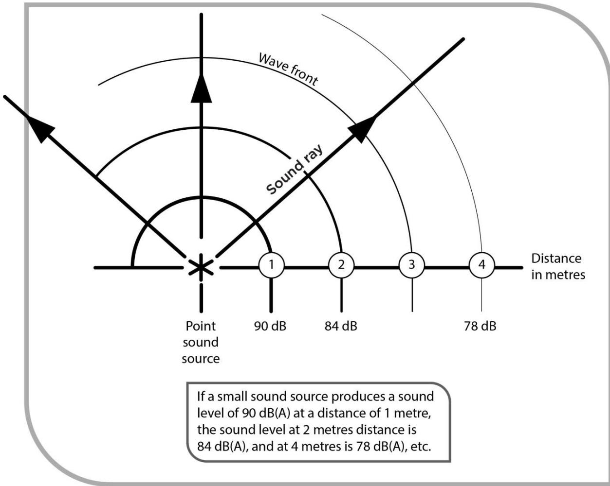
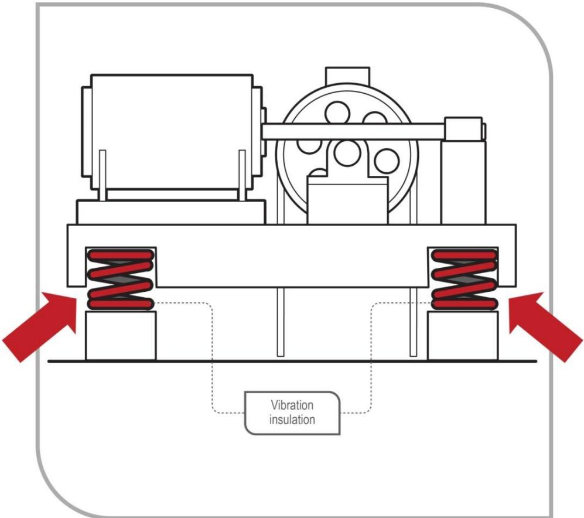
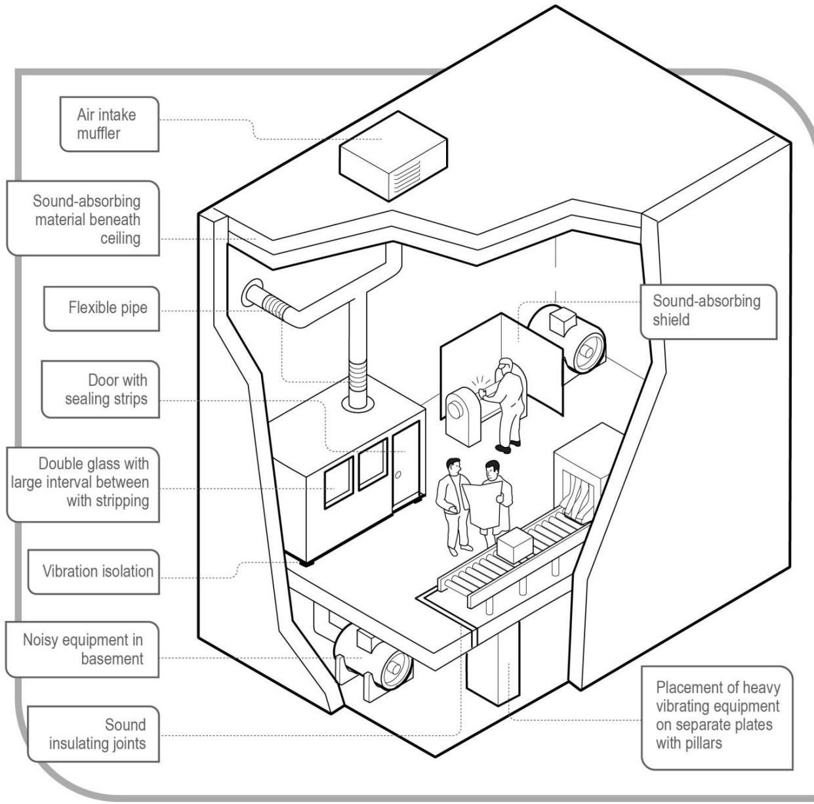
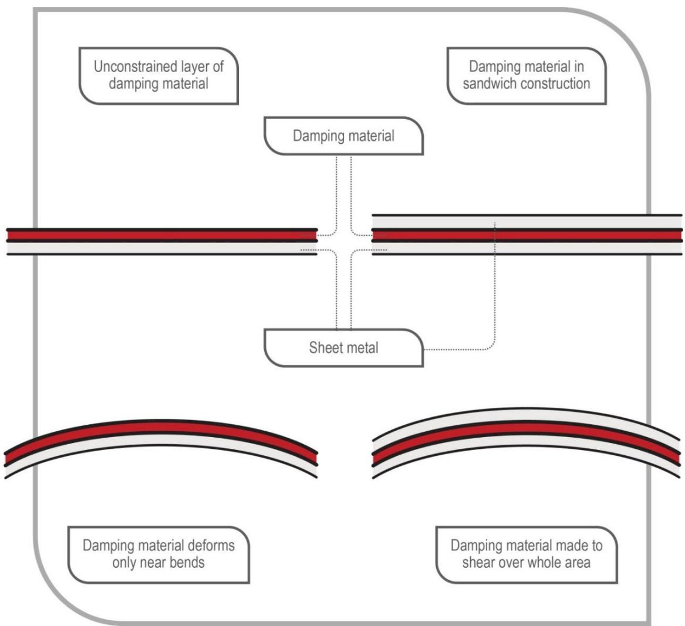
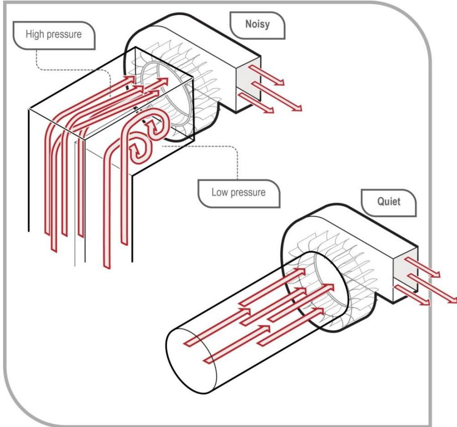
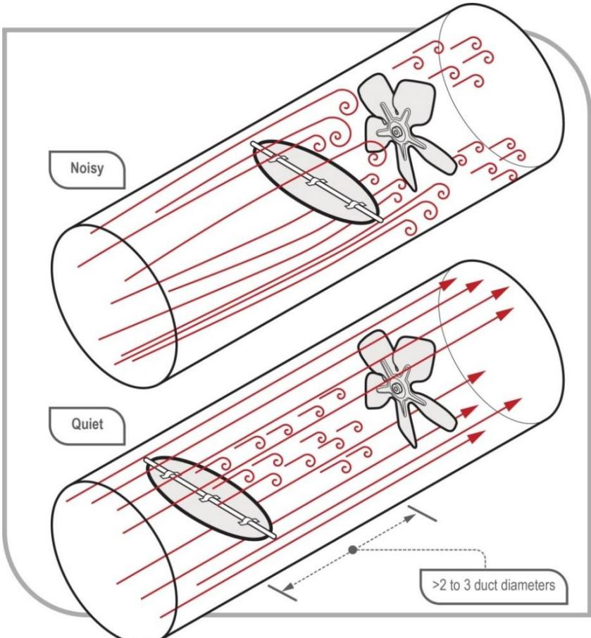
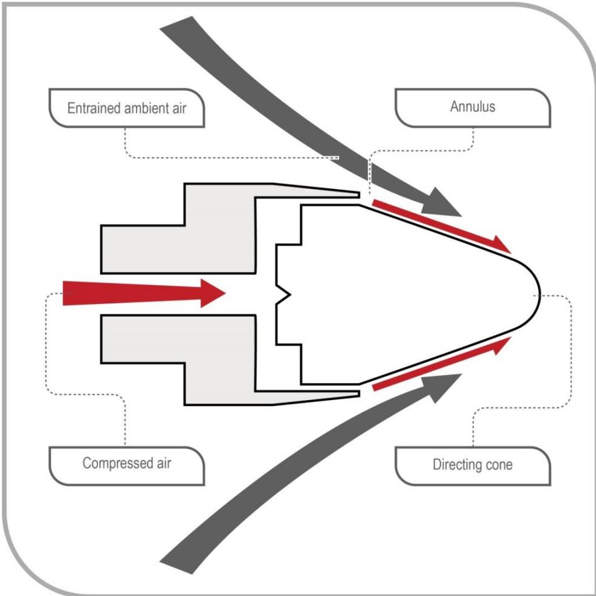
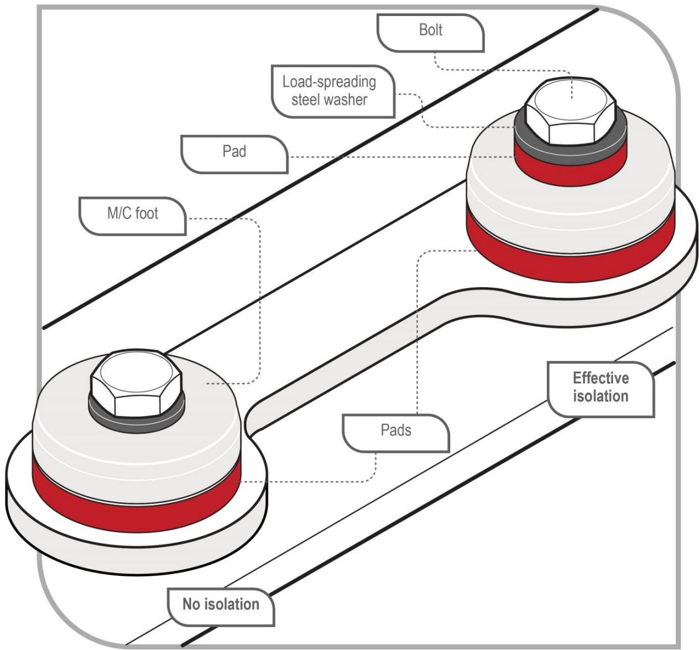

# Managing noise and preventing hearing loss at work

Code of Practice

# Disclaimer

Safe Work Australia is an Australian Government statutory agency established in 2009. Safe Work Australia includes Members from the Commonwealth, and each state and territory, Members representing the interests of workers and Members representing the interests of employers.

Safe Work Australia works with the Commonwealth, state and territory governments to improve work health and safety and workers' compensation arrangements. Safe Work Australia is a national policy body, not a regulator of work health and safety. The Commonwealth, states and territories have responsibility for regulating and enforcing work health and safety laws in their jurisdiction.

ISBN 978- 0- 642- 33305- 6 (PDF)  ISBN 978- 0- 642- 33306- 3 (DOCX)

# Creative Commons

This copyright work is licensed under a Creative Commons Attribution- Noncommercial 4.0 International licence. To view a copy of this licence, visit creativecommons.org/licenses. In essence, you are free to copy, communicate and adapt the work for noncommercial purposes, as long as you attribute the work to Safe Work Australia and abide by the other licence terms.

# Contact information

Safe Work Australia | info@swa.gov.au | www.swa.gov.au

# Contents

Foreword 5

1. Introduction 6

1.1. Who has health and safety duties in relation to noise? 6  1.2. What is involved in managing noise and preventing hearing loss? 8  1.3. Information, training, instruction and supervision 10

2. Noise and its effects on health and safety 11

2.1. How does hearing loss occur? 11  2.2. How much noise is too much? 12  2.3. Other effects of noise 13  2.4. Working safely in ambient noise 13

# 3. The risk management process 14

3.1. Identifying the hazards 14  3.2. How to find noise hazards 14  3.3. Dealing with noise hazards 16

# 4. Assessing the risks 17

4.1. When should a risk assessment be conducted? 17  4.2. Who can do a noise assessment? 17  4.3. How should a noise assessment be done? 18  4.4. What information should be included in a noise assessment report? 19

# 5. Controlling the risks 20

5.1. Hierarchy of control measures 20  5.2. Maintaining and reviewing control measures 23  5.3. Personal protective equipment (PPE) 24  5.4. Audiometric testing 26

# 6. Role of designers, manufacturers, importers, suppliers and installers of plant, substances or structures 29

6.1. Designers 29  6.2. Manufacturers, importers, suppliers and installers of plant, substances or structures 32  6.3. What information should be provided to potential users? 33

Appendix A—Glossary 35

Appendix B—Other causes of hearing loss in the workplace 38

Vibration 38  Ototoxic substances 39  Acoustic shock 40

# Appendix C—Noise hazard identification checklist 44

Appendix D—Ready reckoner 45

# Appendix E—Content of a noise assessment report 50

# Appendix F—Engineering control measures 52

Damping. 52 Fans 53 Ductwork. 55 Pneumatic exhausts. 55 Pneumatic nozzles. 56 Vibration isolation pads. 57 Existing machine guards. 58 Chain and timing belt drives. 58 Electric motors. 58

Amendments 59

# Foreword

This Code of Practice on managing noise and preventing hearing loss at work is an approved code of practice under section 274 of the Work Health and Safety Act (the WHS Act).

An approved code of practice provides practical guidance on how to achieve the standards of work health and safety required under the WHS Act and the Work Health and Safety Regulations (the WHS Regulations) and effective ways to identify and manage risks.

A code of practice can assist anyone who has a duty of care in the circumstances described in the code of practice. Following an approved code of practice will assist the duty holder to achieve compliance with the health and safety duties in the WHS Act and WHS Regulations, in relation to the subject matter of the code of practice. Like regulations, codes of practice deal with particular issues and may not cover all relevant hazards or risks. The health and safety duties require duty holders to consider all risks associated with work, not only those for which regulations and codes of practice exist.

Codes of practice are admissible in court proceedings under the WHS Act and WHS Regulations. Courts may regard a code of practice as evidence of what is known about a hazard, risk, risk assessment or risk control and may rely on the code in determining what is reasonably practicable in the circumstances to which the code of practice relates. For further information see the Interpretive Guideline: The meaning of reasonably practicable.

Compliance with the WHs Act and WHS Regulations may be achieved by following another method if it provides an equivalent or higher standard of work health and safety than the code.

An inspector may refer to an approved code of practice when issuing an improvement or prohibition notice.

# Scope and application

This Code is intended to be read by a person conducting a business or undertaking (PCBU). It provides practical guidance to PCBUs on how to manage health and safety risks associated with workplace noise.

This Code may be a useful reference for other persons interested in the duties under the WHS Act and WHS Regulations.

This Code applies to all workplaces covered by the WHS Act where exposure to hazardous noise may occur.

Although the WHS Regulations for noise are limited to managing the risks of hearing loss, the duties in the WHS Act extend to all health and safety risks arising from the conduct of a business or undertaking and therefore this Code also includes information about other agents that may contribute to hearing loss in Appendix B—Other causes of hearing loss in the workplace.

# How to use this Code of Practice

This Code includes references to the legal requirements under the WHS Act and WHS Regulations. These are included for convenience only and should not be relied on in place of the full text of the WHS Act or WHS Regulations. The words 'must', 'requires' or 'mandatory' indicate a legal requirement exists that must be complied with.

The word 'should' is used in this Code to indicate a recommended course of action, while 'may' is used to indicate an optional course of action.

# 1. Introduction

Hazardous noise can destroy the ability to hear clearly and can also make it more difficult to hear the sounds necessary for working safely, such as instructions or warning signals.

Managing the risks related to noise will assist in:

protecting workers from hearing loss and disabling tinnitus (ringing in the ears or head) improving the conditions for communication and hearing warning sounds, and creating a less stressful and more productive work environment.

# 1.1. Who has health and safety duties in relation to noise?

Duty holders who have a role in managing the risks of noise include:

persons conducting a business or undertaking (PCBUs) designers, manufacturers, importers, suppliers and installers of plant, substances or structures, and officers.

Workers and other persons at the workplace also have duties under the WHS Act, such as the duty to take reasonable care for their own health and safety at the workplace.

A person can have more than one duty and more than one person can have the same duty at the same time.

Early consultation and identification of risks can allow for more options to eliminate or minimise risks and reduce the associated costs.

Person conducting a business or undertaking

# WHS Act section 19

Primary duty of care

A PCBU must eliminate risks arising from hazardous noise, or if that is not reasonably practicable, minimise the risks so far as is reasonably practicable.

The WHS Regulations include more specific requirements for PCBUs to manage the risks of noise, hazardous chemicals, airborne contaminants and plant.

PCBUs have a duty to consult workers about work health and safety and may also have duties to consult, cooperate and coordinate with other duty holders.

WHS Regulations Part 4.1 Regulations 56- 58 Noise

The WHS Regulations specify the exposure standard for noise, in relation to a person, as:

- LAeq,8h of 85 dB(A), or- LC,peak of 140 dB(C)2.

PCBUs must manage risks to health and safety relating to hearing loss associated with noise and they have a duty to ensure that the noise a worker is exposed to at the workplace does not exceed the exposure standard.

Audiometric testing is required for workers who are frequently required to use personal protective equipment (PPE) to protect them from the risk of hearing loss associated with noise that exceeds the exposure standard.

Designers, manufacturers, importers and suppliers of plant, substances or structures

# WHS Act Part 2 Division 3

Further duties of persons conducting businesses or undertakings

Designers, manufacturers, importers and suppliers of plant or substances must ensure, so far as is reasonably practicable, the plant or substance they design, manufacture, import or supply is without risks to health and safety. This duty includes carrying out testing and analysis as well as providing specific information about the plant or substance.

To assist in meeting these duties, the WHS Regulations require:

- manufacturers to consult with designers of the plant- importers to consult with designers and manufacturers of plant, and- the person who commissions construction work to consult with the designer of the structure.

# WHS Regulations Part 4.1 Regulation 59

Duties of designers, manufacturers, importers and suppliers of plant

Designers, manufacturers, importers and suppliers of plant have specific duties in relation to noise emissions. Further information about these duties can be found in Chapter 6 of this model Code.

# Officers

# WHS Act section 27

Duty of officers

Officers, for example company directors, have a duty to exercise due diligence to ensure the PCBU complies with the WHS Act and WHS Regulations. This includes taking reasonable steps to ensure the business or undertaking has and uses appropriate resources and processes to eliminate or minimise risks from hazardous noise. Further information on who

is an officer and their duties is available in the Interpretive Guideline: The health and safety duty of an officer under section 27.

# Workers

# WHS Act section 28

Duties of workers

Workers have a duty to take reasonable care for their own health and safety and to not adversely affect the health and safety of other persons. Workers must comply with reasonable instructions, as far as they are reasonably able, and cooperate with reasonable health and safety policies or procedures that have been notified to workers. If PPE is provided by the business or undertaking, the worker must so far as they are reasonably able, use or wear it in accordance with the information and instruction and training provided.

# Other persons in the workplace

# WHS Act section 29

Duties of other persons at the workplace

Other persons at the workplace, like visitors, must take reasonable care for their own health and safety and must take care not to adversely affect other people's health and safety. They must comply, so far as they are reasonably able, with reasonable instructions given by the PCBU to allow that person to comply with the WHS Act.

# 1.2. What is involved in managing noise and preventing hearing loss?

# WHS Regulations Part 3.1

Managing Risks to Health and Safety

This Code provides guidance on how to manage the risks associated with hazardous noise in the workplace using the following systematic process:

Identify hazards- find out what could cause harm. Assess risks, if necessary- understand the nature of the harm that could be caused by the hazard, how serious the harm could be and the likelihood of it happening. This step may not be necessary if you are dealing with a known risk with known controls. Eliminate risks so far as is reasonably practicable Control risks- if it is not reasonably practicable to eliminate the risk, implement the most effective control measures that are reasonably practicable in the circumstances in accordance with the hierarchy of control measures, and ensure they remain effective over time. Review control measures to ensure they are working as planned.

Further guidance on the risk management process is available in the Code of Practice: How to manage work health and safety risks.

# Consulting workers

# WHS Act section 47

Duty to consult workers

A PCBU must consult, so far as is reasonably practicable, with workers who carry out work for the business or undertaking and who are (or are likely to be) directly affected by a health and safety matter.

This duty to consult is based on the recognition that worker input and participation improves decision- making about health and safety matters and assists in reducing work- related injuries and disease.

The broad definition of a 'worker' under the WHS Act means a PCBU must consult, so far as is reasonably practicable, with employees, contractors and subcontractors and their employees, on- hire workers, outworkers, apprentices, trainees, work experience students, volunteers and other people who are working for the PCBU and who are, or are likely to be, directly affected by a health and safety matter.

Workers are entitled to take part in consultations and to be represented in consultations by a health and safety representative who has been elected to represent their work group.

Health and safety representatives must have access to relevant information such as noise exposure and emission data and potential control options. If you have a health and safety committee, you should engage the committee in the process as well.

Consulting, cooperating and coordinating activities with other duty holders

# WHS Act section 46

Duty to consult with other duty holders

The WHS Act requires a PCBU to consult, cooperate and coordinate activities with all other persons who have a work health or safety duty in relation to the same matter, so far as is reasonably practicable.

There is often more than one business or undertaking involved in managing the risks of hazardous noise, who may each have responsibility for the same health and safety matters, either because they are involved in the same activities or share the same workplace.

In these situations, each duty holder should exchange information to find out who is doing what and work together in a cooperative and coordinated way so risks are eliminated or minimised so far as is reasonably practicable.

Further guidance on consultation is available in the Code of Practice: Work health and safety consultation, cooperation and coordination.

# 1.3. Information, training, instruction and supervision

# WHS Act section 19

Primary duty of care

# WHS Regulation 39

Provision of information, training and instruction

The WHS Act requires that a PCBU ensure, so far as reasonably practicable, the provision of any information, training, instruction or supervision that is necessary to protect all persons from risks to their health and safety arising from work carried out as part of the conduct of the business or undertaking.

The PCBU must ensure that information, training or instruction provided to a worker is suitable and adequate having regard to:

the nature of the work carried out by the worker the nature of the risks associated with the work at the time of the information, training and instruction, and the control measures implemented.

The PCBU must also ensure, so far as is reasonably practicable, that the information, training and instruction are provided in a way that is readily understandable for the person to whom it is provided.

Workers must be trained and have the appropriate skills to carry out a particular task safely. Training should be provided to workers by a competent person.

Information, training and instruction provided to workers who may be exposed to hazardous noise should include:

the health and safety responsibilities of each party at the workplace how hearing can be affected by exposure to noise the detrimental effects hearing loss and tinnitus have on the quality of life, both at work and socially the tasks at the workplace that have the potential to give rise to hearing loss and the likely noise exposure level how to use noise control measures how to select, fit, wear, maintain and store personal protective equipment and personal hearing protectors how to report defects in hearing protectors and noise control equipment or raise any concerns regarding hazardous noise, and the purpose and nature of audiometric testing.

In addition to the PCBU's general duty to provide any supervision necessary to protect all persons from work health and safety risks, the WHS Regulations also impose specific duties to provide supervision necessary to protect a worker from risks to health and safety in certain circumstances, for example where the worker:

uses, generates or handles hazardous chemicals operates, tests, maintains, repairs or decommissions a storage or handling system for a hazardous chemical, or is likely to be exposed to a hazardous chemical.

# 2. Noise and its effects on health and safety

# 2.1. How does hearing loss occur?

Hazardous noise affects the functioning of the inner ear, which may cause temporary hearing loss. After a period of time away from noise, hearing may be restored. With further exposure to hazardous noise, the ear will gradually lose its ability to recover and the hearing loss will become permanent.

Permanent hearing loss can also occur suddenly if a person is exposed to very loud impact or explosive sounds. This type of damage is known as acoustic trauma.

Permanent hearing loss results from the destruction of hair cells in the inner ear. These cells cannot be replaced or repaired by any presently known medical treatments or technology.

Usually, hazardous noise first affects the ability to hear high- frequency (high- pitched) sounds. This means that even though a person can still hear some sounds, conversation will start to sound 'muffled' and a person may find it difficult to understand what is being said.

Communication difficulties occur especially when there are competing background noises. Modern hearing aids may improve the ability to hear speech but they are unable to completely restore the clarity of the full hearing function.

Workers exposed to hazardous noise may also experience tinnitus, which could become permanent. When severe, it can disrupt sleep, reduce concentration, make people extremely irritable and lead to depression.

The degree of hearing loss that occurs is dependent on how loud the noise is, how long someone is exposed to it and, to some extent, individual susceptibility. The frequency or pitch can also have some effect on hearing loss, since high- pitched sounds are more damaging than low- pitched ones.

Exposure to a number of common industrial chemicals and some medications can also cause hearing loss or exacerbate (make worse) the effects of noise on hearing. These substances are called ototoxic substances.

Otoxic substances absorbed into the bloodstream may damage the cochlea in the inner ear and/or the auditory pathways to the brain, leading to hearing loss and tinnitus. Hearing loss is more likely if exposure is to a combination of substances or a combination of the substance and noise.

There is also evidence that exposure to hand- arm vibration (HAV) and whole body vibration (WBV) exacerbates the effects of noise on hearing.

Further information on these other causes of hearing loss is provided in Appendix B—Other causes of hearing loss in the workplace.

# 2.2. How much noise is too much?

Whether the exposure standard (85 dB(A) averaged over eight hours) is exceeded depends on the level of noise involved and how long workers are exposed to it.

Peak noise levels greater than 140 dB(C) usually occur with impact or explosive noise such as sledge- hammering or a gun shot. Any exposure above this peak can cause almost instant damage to hearing.

Decibels (dB) are not like normal numbers. They can't be added or subtracted in the normal way. The decibel scale is logarithmic. On this scale, an increase of 3 dB represents a doubling of sound energy. This means that every 3 dB increase in noise level can cause the same damage in half the time.

Table 1 provides examples of the length of time a person without hearing protection can be exposed before the standard  $(\mathsf{L}_{\mathsf{Aeq},8h} = 85\mathsf{dB}(\mathsf{A}))$  is exceeded.

Table 1 Equivalent noise exposures  

<table><tr><td>Noise level dB(A)</td><td>Exposure time before standard is exceeded</td></tr><tr><td>80</td><td>16 hours 3</td></tr><tr><td>82</td><td>12 hours 4</td></tr><tr><td>85</td><td>8 hours</td></tr><tr><td>88</td><td>4 hours</td></tr><tr><td>91</td><td>2 hours</td></tr><tr><td>94</td><td>1 hour</td></tr><tr><td>97</td><td>30 minutes</td></tr><tr><td>100</td><td>15 minutes</td></tr><tr><td>103</td><td>7.5 minutes</td></tr><tr><td>106</td><td>3.8 minutes</td></tr><tr><td>109</td><td>1.9 minutes</td></tr><tr><td>112</td><td>57 seconds</td></tr><tr><td>115</td><td>28.8 seconds</td></tr><tr><td>118</td><td>14.4 seconds</td></tr><tr><td>121</td><td>7.2 seconds</td></tr><tr><td>124</td><td>3.6 seconds</td></tr><tr><td>127</td><td>1.8 seconds</td></tr></table>

<table><tr><td>Noise level dB(A)</td><td>Exposure time before standard is exceeded</td></tr><tr><td>130</td><td>0.9 seconds</td></tr></table>

Essentially, a worker who is exposed to 85 dB(A) for eight hours receives the same noise energy as someone exposed to 88 dB(A) for four hours, with the balance of the day in a very quiet environment. In both cases the exposure standard is not being exceeded. However, being exposed to 88 dB(A) for more than four hours would mean that the standard is exceeded. Similarly, if a worker is exposed to 121 dB(A) then the exposure standard would be exceeded after only 7.2 seconds.

There is a wide range in different people's susceptibility to hearing loss from noise. Research shows that  $\mathsf{L}_{\mathsf{Aeq},8h}$  below 75 dB(A) or instantaneous peak noise levels below 130 dB(C) are unlikely to cause hearing loss. With progressively increasing levels, the risk becomes greater.

The WHS Regulations set the exposure standard for noise at an  $\mathsf{L}_{\mathsf{Aeq},8h}$  of 85 dB(A) and a peak noise level at 140 dB(C), which protects most but not all people. Therefore, workplace noise should be kept lower than the exposure standard for noise if reasonably practicable.

# 2.3.Other effects of noise

Noise at levels that do not damage hearing can have other adverse health effects. This can arise when noise chronically interferes with concentration and communication. Persistent noise stress can increase the risk of fatigue and cardiovascular disorders including high blood pressure and heart disease.

Although safe levels to guard against these effects have not yet been fully determined, as a guide, the risk of adverse health effects can be minimised by keeping noise levels below:

50 dB(A) where work is being carried out that requires high concentration or effortless conversation, and 70 dB(A) where more routine work is being carried out that requires speed or attentiveness or where it is important to carry on conversations.

These levels include the noise from other work being carried out within the workplace.

# 2.4.Working safely in ambient noise

To work safely, workers must be able to hear warning signals above any other noise (ambient noise) at the workplace. For reversing alarms on mobile plant, the guidance in ISO 9533:2010: Earth- moving machinery - Machine- mounted audible travel alarms and forward horns - Test methods and performance criteria should be followed. This recommends the noise level of the alarm at potential reception points to be at least as high as the noise from the engine under high idle.

For other situations, the levels needed are higher- - at least 65 dB(A) and more than 15 dB(A) greater than the ambient noise level at any position in the signal reception area. More detailed guidance on assessing the audibility of warning signals can be found in ISO 7731:2003: Ergonomics - - Danger signals for public and work areas - - Auditory danger signals.

# 3. The risk management process

A risk assessment is not mandatory for hazardous noise under the WHS Regulations. However, in many circumstances it will be the best way to determine the measures that should be implemented to control risks. It will help to:

identify which workers are at risk of exposure determine what sources and processes are causing that risk identify if and what kind of control measures should be implemented, and check the effectiveness of existing control measures.

Risk management is a systematic process to eliminate or minimise the potential for harm to people.

# 3.1.Identifying the hazards

The first step in the risk management process is to identify all hazards associated with hazardous noise. This involves finding things and situations which could potentially cause harm to people. Hazards generally arise from the following aspects of work and their interaction:

physical work environment equipment, materials and substances used work tasks and how they are performed, and work design and management.

Hazards may be identified by looking at the workplace and how work is carried out. It is also useful to talk to workers, manufacturers, suppliers and health and safety specialists and review relevant information, records and incident reports.

The potential for noise to be hazardous is not always obvious. Hazard identification is a way of finding out which work activities have the potential to contribute to hearing loss or other harm caused by noise.

Exposure to noise is cumulative and a worker may perform a number of noisy work activities over time which, in combination, may expose the worker to hazardous noise.

# 3.2.How to find noise hazards

As the person conducting the business or undertaking (PCBU), you may not need specialist skills to identify sources of hazardous noise, but you must undertake the hazard identification process in consultation with your workers and their health and safety representatives. As a guide, if you need to raise your voice to communicate with someone about one metre away, the noise is likely to be hazardous to hearing.

Potential hazards may be identified in a number of different ways including:

conducting a walk- through assessment of the workplace observing the work; talking to workers about how work is carried out and asking about any problems they may have inspecting the plant and equipment used during work activities observing plant and equipment when in use

- talking to manufacturers, suppliers, industry associations, health and safety specialists and professionals, and- reviewing incident and monitoring reports.

A noise hazard identification checklist is provided in Appendix C—Noise hazard identification checklist to help you further with this process.

# Inspect the workplace

Inspect the workplaceRegularly walking around the workplace, talking to workers and observing how things are done can help you identify hazards that may expose workers to hearing loss. You can find out where noise is coming from, which tasks or processes produce noise or may contribute to the risk of hearing loss, for example exposure to vibration or ototoxic substances. As the PCBU, you should take immediate action to control noise where this is possible, for example fix loose panels that are vibrating and rattling during machine operation.

# Review available information

Designers, manufacturers, importers and suppliers have duties to provide information about the noise emission of plant and you should obtain this information from them.

Information and advice about hazards and risks relevant to particular industries and work activities is also available from regulators, industry associations, unions, technical specialists and safety consultants.

You should check whether any workers compensation claims have been made for hearing loss and if any hearing loss or tinnitus has been found during repeat audiometric testing. If a worker's hearing has been affected and has been attributed to a particular task, then a hazard may exist that could affect other workers.

Table 2 lists common noise sources and their typical sound levels. It can be used to compare noise in the workplace with sounds that are as loud as or louder than 85 dB(A).

Table 2 Common noise sources and their typical sound levels  

<table><tr><td>Typical sound level in dB(A)</td><td>Sound source</td></tr><tr><td>140</td><td>Jet engine at 30 m</td></tr><tr><td>130</td><td>Rivet hammer (pain can be felt at this threshold)</td></tr><tr><td>120</td><td>Rock drill</td></tr><tr><td>110</td><td>Chainsaw</td></tr><tr><td>100</td><td>Sheet-metal workshop</td></tr><tr><td>90</td><td>Lawnmower</td></tr><tr><td>85</td><td>Front-end loader</td></tr><tr><td>80</td><td>Kerbside: Heavy traffic</td></tr><tr><td></td><td>Lathe</td></tr></table>

<table><tr><td>Typical sound level in dB(A)</td><td>Sound source</td></tr><tr><td>70</td><td>Loud conversation</td></tr><tr><td>60</td><td>Normal conversation</td></tr><tr><td>40</td><td>Quiet radio music</td></tr><tr><td>30</td><td>Whispering</td></tr><tr><td>0</td><td>Hearing threshold</td></tr></table>

# 3.3. Dealing with noise hazards

In consultation with your workers and health and safety representatives, make a list of all noisy activities that may pose a risk to the health and safety of persons at the workplace. If you have answered 'yes' to any of the questions in Appendix C— Noise hazard identification checklist, it is likely that hazardous noise exists in your workplace and it is possible that your workers are being exposed to hazardous noise levels. If you are unsure about the level of exposure or how to eliminate or minimise the risks effectively, you should take the next step to assess the risks of hearing loss.

# 4. Assessing the risks

# 4.1. When should a risk assessment be conducted?

A risk assessment involves considering what could happen if someone is exposed to a hazard and the likelihood of it happening. A risk assessment can help you determine:

how severe a risk is whether any existing control measures are effective what action you should take to control the risk, and how urgently the action needs to be taken.

Hazards have the potential to cause different types and severities of harm, ranging from minor discomfort to a serious injury or death.

Many hazards and their associated risks are well known and have well established and accepted control measures. In these situations, the second step in the identification process outlined in section 1.2 of this Code (to formally assess the risk) is unnecessary. If after identifying a hazard you already know the risk and how to control it effectively, you may simply implement the controls.

If, as a person conducting a business or undertaking (PCBU), you have identified any hazardous noise, then you should assess the risks by carrying out a noise assessment, unless the exposures can be reduced to below the standard immediately.

A noise assessment will help you:

identify which workers are at risk of hearing loss determine what noise sources and processes are causing that risk identify if and what kind of noise control measures could be implemented, and check the effectiveness of existing control measures.

A noise assessment may not always need measurement of the noise level. For example, if only one activity at the workplace- - the use of a single machine- - involves noise above 85 dB(A) and the manufacturer has provided information about the machine's noise levels when it is operated in particular ways, then a sufficient assessment can be made without measurement. More complex situations may require noise level measurement to accurately determine a worker's exposure to noise, such as workplaces with variable noise levels over a shift and jobs where workers move in and out of noisy areas.

# 4.2. Who can do a noise assessment?

A noise assessment should be done by a competent person and in accordance with procedures in AS/NZS 1269.1:2005: Occupational noise management - Measurement and assessment of noise impression and exposure. The more complex the situation, the more knowledgeable and experienced the person should be.

A competent person is one capable of demonstrating a thorough understanding of:

the objectives of the assessment the basic physics of sound

- the correct usage and limitations of sound-measuring instruments required to gather data for noise assessments- the information needed and methods used to determine occupational noise exposures- how to record results and explain them to people in the workplace- the method for evaluating personal hearing protectors- when to advise that someone with more specialised knowledge on noise measurement or noise control is required, and- the relevant statutory requirements, codes of practice and standards used in Australia.A competent person should also have a basic understanding of the:  
- mechanisms of hearing  
- harmful effects of noise, and  
- principles of engineering noise control and noise management measures.

A competent person should also have a basic understanding of the:

- mechanisms of hearing- harmful effects of noise, and- principles of engineering noise control and noise management measures.

# 4.3. How should a noise assessment be done?

A noise assessment will depend upon:

- the type of workplace- the number of persons potentially at risk from exposure to hazardous noise, and- the information already available on noise at the workplace.

A noise assessment should be done during a typical working shift and should determine:

- the noise levels produced during various tasks carried out during the shift, and- how long your workers are exposed to noise during each of these tasks.

An assessment should take into account:

- plant, equipment and other sources of noise in operation at the workplace- how work activities are carried out- the length of the shift, and- environmental factors (e.g. types of walls, surfaces, layout of workstations).

Adequate information about the tasks and their frequency is needed, so consultation with workers and their supervisors is essential during this process.

Noise measurements should be taken at 10 to 20 centimetres from the worker's ear canal entrance over a period of time that is representative of the noise produced during the tasks.

In most situations the use of a hand- held integrating sound level meter will produce the most useful information for choosing appropriate noise control measures. In situations where workers are highly mobile or access for the person taking the measurement is difficult or unsafe, it may be more appropriate to use personal sound exposure meters (noise dosimeters).

Noise measurements should include the combined noise levels of all the tools, machines and processes present as well as the background noise from plant such as ventilation systems, cooling compressors and circulation pumps. To identify which noise sources contribute most to workers' exposures, the noise from each source or work activity should also be measured separately.

The Ready Reckoner in Appendix D may be used to work out the total LAeq,8h for combinations of noise levels and exposure duration for each work activity and the relative importance of each.

If a group of workers is exposed to identical sources of noise and their exposure is likely to be the same, then you do not need a separate assessment for each worker. A representative assessment can be done for one or more of the workers.

# Extended work shifts

Shift durations of 10 hours or longer involve a degree of risk greater than that indicated by the eight hour measurement  $\mathsf{L}_{\mathsf{Aeq},8\mathsf{h}}$ . This increase in risk arises because of the additional damaging effect of continuous exposure to noise after 10 hours. The risk may be further increased if there is reduced recovery time between successive shifts.

If workers work shifts of 10 hours or more, the adjustment factor for extended shifts as set out in AS/NZS 1269.1:2005 (see Table 3) should be added to the measured  $\mathsf{L}_{\mathsf{Aeq},8\mathsf{h}}$  before comparing it with the 85 dB(A) exposure standard for noise.

Table 3 Adjustments to  $\mathsf{L}_{\mathsf{Aeq},\mathsf{8h}}$  for extended work shifts  

<table><tr><td>Shift length</td><td>Adjustment added to measured LAeq,8h dB(A)</td></tr><tr><td>10 hrs or more to less than 14 hrs</td><td>+ 1</td></tr><tr><td>14 hrs or more to less than 20 hrs</td><td>+ 2</td></tr><tr><td>20 hrs or more</td><td>+ 3</td></tr></table>

For example, if a worker works 12 hour shifts and the typical  $\mathsf{L}_{\mathsf{Aeq},8\mathsf{h}}$  has been determined to be 93 dB(A), an additional one decibel is added to give an adjusted  $\mathsf{L}_{\mathsf{Aeq},8\mathsf{h}}$  of 94 dB(A). Hence the worker's  $\mathsf{L}_{\mathsf{Aeq},8\mathsf{h}}$  exceeds the exposure standard for noise by 9 dB(A). A fully- worked example is included at Appendix D—Ready Reckoner.

If workers work more than five days per week, you should use the weekly averaging procedure in AS/NZS 1269.1:2005.

# 4.4. What information should be included in a noise assessment report?

Noise assessment reports should show that the assessment was done properly and that all factors were taken into account. An assessment report should contain all the information shown in Appendix E—Content of a noise assessment report. Noise assessment reports should be used to select appropriate control measures and the main findings should be included in training for all workers. The reports should be made available to managers, health and safety representatives and regulators.

# 5. Controlling the risks

# 5.1.Hierarchy of control measures

The WHS Regulations require duty holders to work through the hierarchy of control measures when managing certain risks; however, the hierarchy can be applied to any risk. The hierarchy ranks control measures from the highest level of protection and reliability to the lowest. Further guidance on the risk management process and the hierarchy of control measures is in the Code of Practice: How to manage work health and safety risks.

# Eliminating the risk

As the person conducting the business or undertaking (PCBU), you must always aim to eliminate the risk. The most effective control measure is to eliminate the source of noise completely, for example by ceasing to use a noisy machine, changing the way work is carried out so hazardous noise is not produced, or by not introducing the hazard into the workplace.

If eliminating the hazards and associated risks is not reasonably practicable, you must minimise the risk by one or more of the following:

Substitution- - minimise the risk by substituting or replacing a hazard or hazardous work practice with something that gives rise to a lesser risk. For example, substitute plant or processes that are quieter, replace ototoxic substances with other less harmful products Isolation- - minimise the risk by isolating or separating the hazard or hazardous work practice from any person exposed to it. For example:

isolating the source of noise from people by using distance, barriers, enclosures and sound- absorbing surfaces building enclosures or soundproof covers around noise sources using barriers or screens to block the direct path of sound locating noise sources further away from workers (see Figure 1), and using remote controls to operate noisy plant from a distance.

Engineering controls- - engineering controls are physical control measures to minimise risk. For example, modify plant and processes to reduce the noise.

If risk remains, it must be minimised by implementing administrative controls, so far as is reasonably practicable. Any remaining risk must be minimised with suitable personal protective equipment (PPE).

Administrative control measures and PPE do not control the hazard at the source. They rely on human behaviour and supervision and used on their own tend to be the least effective in minimising risks.

# Substituting plant or processes to reduce noise

# Buy 'quiet'

One of the most cost- effective and long- term ways of reducing noise at work is to introduce a purchasing and hiring policy to choose the quietest plant for the job. This can be done by obtaining information on noise emission from the manufacturer, importer or supplier of plant and comparing it to determine the quietest plant. For example, data on sound power level or sound pressure level at the operator position.

Ask the suppliers about the likely noise emission under the particular conditions in which you will operate the machinery, as well as under standard test conditions. If you ask the same

question to all suppliers you can compare information. Sound power level data will only ever be a guide as many factors affect the actual noise levels experienced by your workers, but it will help you buy quieter machines.

You should purchase or hire only from suppliers who can demonstrate a low noise design, with noise control as a standard part of the machine, not as an optional extra.

# Change the way you do the job

A different way of doing the job may provide the same result with a lot less noise. For example:

- bending metal in a vice or a press is quieter than hammering it into shape- welding is generally quieter than riveting- gluing is quieter than hammering in nails- clipping is quieter than stapling, and- lowering materials in a controlled manner is quieter than dropping them on hard surfaces.

When working outdoors, you should avoid locating noisy work activities in reverberant environments so far as is reasonably practicable.

# Isolation

  
Figure 1 Sound is reduced by about 6 dB for each doubling of its distance from the source

Figure 1 shows measurements of sound spreading in an open space away from a reflecting surface. The sound level is reduced by about 6 dB for each doubling of the distance from the source. If a small sound source produces a sound level of 90 dB(A) at a distance of one

metre, the sound level at two metres distance is 84 dB(A), and at four metres is 78 dB(A), etc. Sound is reduced less when spreading inside an enclosed space.

# Using engineering controls

A good understanding of the operation of the plant or process is necessary when considering ways of minimising noise at its source.

Examples of engineering control measures include:

eliminating impacts between hard objects or surfaces through cushioning or separation minimising the drop height of objects or the angle that they fall onto hard surfaces using absorbent lining on surfaces to cushion the fall or impact of objects fitting exhaust mufflers on internal combustion engines fitting silencers to compressed air exhausts and blowing nozzles ensuring gears mesh together better fixing damping materials (such as rubber) or stiffening to panels to reduce vibration fitting sound- absorbing materials to hard reflective surfaces changing fan speeds or the speeds of particular components changing the material the equipment or its parts are made of (for example change metal components to plastic components) selecting tyre types that are suitable for the ground surface or terrain, and installing vibration- minimising seats on mobile plant.

Further information on using engineering controls is at Appendix F—Engineering control measures.

# Maintenance of plant

It is essential that you maintain plant and equipment regularly as it will deteriorate with age and can become noisier. Check for changes in noise levels—badly worn bearings and gears, poor lubrication, blunt blades, loose parts, unbalanced rotating parts and steam or air leaks all create noise that can be reduced with good maintenance. Engineering controls such as vibration mountings, impact absorbers, gaskets, seals, silencers, barriers and other equipment should be regularly inspected and maintained.

Where relevant, regularly inspect and maintain workplace roadways, vehicle suspensions and tyres to reduce exposure to whole body vibration (WBV).

# Using administrative controls

Administrative noise control measures reduce the amount of noise to which a person is exposed by reducing the time they are exposed to it. Examples include:

organising schedules so that noisy work is done when only a few workers are present notifying workers and others in advance of noisy work so they can limit their exposure to it keeping workers out of noisy areas if their work does not require them to be there providing quiet areas for rest breaks for workers exposed to noisy work using job rotation to limit the time workers spend in noisy areas by moving them to quiet work before their daily noise exposure levels exceed the exposure standard.

If you rely on administrative controls, you should conduct regular checks to ensure that they are being complied with.

# 5.2. Maintaining and reviewing control measures

Control measures must be maintained so they remain fit for purpose, suitable for the nature and duration of work and be installed, set up and used correctly.

The control measures put in place to protect health and safety should be regularly reviewed to make sure they are effective. If the control measure is not working effectively it must be revised to ensure it is effective in controlling the risk.

As the PCBU, you must review and as necessary revise control measures so as to maintain, so far as is reasonably practicable, a work environment that is without risks to health or safety. For example:

when the control measure does not control the risk so far as is reasonably practicable before a change at the workplace that is likely to give rise to a new or different risk to health and safety that the measure may not effectively control a new or relevant hazard or risk is identified the results of consultation indicate a review is necessary, or a health and safety representative requests a review if that person reasonably believes that: a circumstance in any of the above points affects or may affect the health and safety of a member of the work group represented by the health and safety representative the control measure has not been adequately reviewed in response to the circumstance.

Common review methods include workplace inspection, consultation, testing and analysing records and data.

You can use the same methods as in the initial hazard identification step to check control measures. You must also consult your workers and their health and safety representatives and consider the following:

Are the control measures working effectively in both their design and operation? How accurate is the risk assessment process? Are all noisy activities being identified? Have new work methods or new plant made the work quieter? Have instruction and training provided to workers been successful? Have new requirements or information indicated that current controls are no longer the most effective? Is an alteration planned to any structure, plant or process that is likely to result in a worker being exposed to hazardous noise? Has an incident occurred as a result of a worker being exposed to hazardous noise? Have any audiometric tests revealed changes in hearing threshold levels?

You should decide on the time interval between noise assessments by consulting with your workers. Assessment should be repeated whenever there is:

Installation or removal of machinery or other noise sources likely to cause a significant change in noise levels a change in workload or equipment operating conditions likely to cause a significant change in noise levels or exposure times a change in building structure likely to affect noise levels, or a change to working arrangements affecting the length of time workers spend in noisy work areas.

If you design, manufacture or supply products used for work you should check that the product effectively eliminates or minimises exposure to noise by obtaining feedback from

PCBUs and other users. This can help in determining whether any improvements can be made.

If problems are found, go back through the risk management steps, review your information and make further decisions about risk control.

An occupational noise management plan may help implement the chosen noise control measures effectively. It should identify what action needs to be taken, who will be responsible for taking the action and by when.

The plan should be based on the results of any noise assessment and should also include:

- measuring noise levels to confirm that control measures are achieving expected attenuation- specifications for purchasing or hiring plant- a description of any training and supervision that may be needed- control measures for temporary work areas and situations, and- timeframes for reviewing noise assessments and control measures.

# 5.3. Personal protective equipment (PPE)

# WHS Regulation 44

Provision to workers and use of personal protective equipment

If PPE is to be used at the workplace, as the PCBU you must ensure, so far as is reasonably practicable, the equipment is selected to minimise risks to health and safety, including by ensuring that the equipment is:

- suitable for the nature of the work and any hazard associated with the work- suitable size and fit and reasonably comfortable for the worker who is to use or wear it, and- maintained, repaired and replaced so that it continues to minimise risk to the worker who uses it, including by ensuring that the equipment is clean and hygienic, and in good working order.

If you direct the carrying out of work, you must provide the worker with information, training and instruction in the proper use and wearing of PPE, and the storage and maintenance of PPE.

A worker must, so far as reasonably able, use or wear the PPE in accordance with any information, training or reasonable instruction and must not intentionally misuse or damage the equipment.

Personal hearing protectors, such as ear- muffs or earplugs, should be used in the following circumstances:

- when the risks arising from exposure to noise cannot be eliminated or minimised by other more effective control measures- as an interim measure until other control measures are implemented, and- where extra protection is needed above what has been achieved using other noise control measures.

If the use of personal hearing protectors is necessary, it is important that the hearing protectors are worn throughout the period of exposure to noise. Removing personal hearing protectors for even short periods significantly reduces the effective attenuation (noise reduction) and might provide inadequate protection. For example, a worker wearing a hearing protector for a full eight- hour day will receive the 30 dB maximum protection level.

However, one hour without wearing the hearing protector causes the maximum protection level to fall to 9 dB.

Due to the risk of immediate hearing loss in work situations that involve exposure to peak noise levels that exceed 140 dB(C), and notwithstanding any higher level controls used, PCBUs should select hearing protectors required for firearms as detailed in Appendix B of AS/NZS 1269.3:2005, which advises:

- hearing protectors having a classification of five shall be used for exposure to impulse noise from impacts, small-calibre weapons or tools, and- well fitted earplugs having a classification of at least three, in combination with ear-muffs of any classification, shall be worn for exposure to impulse noise from large-calibre weapons and blasting.

Areas where people may be exposed to hazardous noise should be sign- posted as hearing protector areas and the boundaries of these areas should be clearly defined. Workers and other persons, including managers and visitors, should not enter these areas without wearing appropriate personal hearing protectors, regardless of how short the time they stay in the hearing protector area.

Where sign- posting is not practicable, you should make other arrangements to ensure that workers and others know when personal hearing protectors are required. For example:

- attach prominent warning notices to tools and equipment indicating that personal hearing protectors must be worn when operating them- provide written and verbal instructions on how to recognise circumstances in which personal hearing protectors are needed, and- ensure effective supervision of identified hazardous tasks.

# Selection of personal hearing protectors

Personal hearing protectors should be selected and maintained in accordance with AS/NZS 1269.3:2005: Occupational noise management - Hearing protector program. You should involve your workers in the selection process and offer a reasonable choice from a range of types.

Suppliers of hearing protectors should provide the full information on the attenuation likely to be provided including the SLC80 ratings, class and octave band attenuation values. The attenuation values should be derived from attenuation measurements made in accordance with AS/NZS 1270:2002: Acoustics - Hearing protectors.

When selecting personal hearing protectors, as the PCBU you should consider:

- the degree of attenuation required in the worker's environment (see Table 4); do not provide protectors that overprotect by cutting out too much sound as this can cause difficulties hearing verbal instructions and other sounds needed to work safely- the suitability for the type of working environment and the work tasks; for example earplugs are difficult to use hygienically for work that requires them to be inserted with dirty hands and in these circumstances ear-muffs are more appropriate, but ear-muffs can be uncomfortable to wear in hot environments and can make it difficult for the wearer to enter restricted space or to wear a helmet, and- the comfort, weight and clamping force of the personal hearing protector.

Table 4 Recommended class of hearing protector for specific noise levels (dB(A))  

<table><tr><td>Measured exposure LAeq,sh dB(A)</td><td>Class</td></tr><tr><td>Less than 90</td><td>1</td></tr><tr><td>90 to less than 95</td><td>2</td></tr><tr><td>95 to less than 100</td><td>3</td></tr><tr><td>100 to less than 105</td><td>4</td></tr><tr><td>105 to less than 110</td><td>5</td></tr></table>

Individual fit of personal hearing protectors is critical for optimum protection. Several devices are available to assist with this. Wearing work equipment- - such as hard hats, dust masks and eye protection- - may affect the performance of the protector. The fit of hearing protectors should be checked while the user is wearing regular work equipment. Workers wearing spectacles should be fitted with hearing protectors while wearing the spectacles.

# Maintenance

Personal hearing protectors must be regularly inspected and maintained to ensure they remain in good, clean condition. The inspections should check that:

ear- muff seals are undamaged the tension of headbands is not reduced there are no unofficial modifications, and compressible earplugs are soft, pliable and clean.

If disposable earplugs are used, they should only be worn once.

You must provide your workers with training, information and instruction in the proper use, fit, care and maintenance of personal hearing protectors. You should also:

include the need to wear hearing protectors in your safety procedures place someone in charge of issuing and making sure replacements are readily available carry out spot checks to ensure that workers are wearing their hearing protectors when required and are using them correctly, and ensure all managers and supervisors set a good example and wear personal hearing protectors at all times when in hearing protector areas.

# 5.4.Audiometric testing

# WHS Regulation 58

Audiometric testing

A PCBU must provide audiometric testing for a worker who is carrying out work for the business or undertaking if the worker is required to frequently use personal hearing protectors as a control measure for noise that exceeds the exposure standard.

Audiometric testing must be provided within three months of the worker commencing work where hearing protectors is required. Starting the audiometric testing before people are exposed to hazardous noise (such as new starters or those changing jobs) provides a baseline as a reference for future audiometric test results. Regular follow- up tests must be carried out at least every two years. These should be undertaken well into the work shift so that any temporary hearing loss can be picked up.

More frequent audiometric testing may be needed if exposures are at a high LAeq,8h, which is equal to or greater than 100 dB(A).

Before introducing an audiometric testing program, as the PCBU, you must consult with your workers and their health and safety representatives. It is important that your workers understand that the aim of the testing is to evaluate the effectiveness of control measures to protect their hearing.

Audiometric testing and assessment of audiograms should be carried out by competent persons in accordance with the procedures in AS/NZS 1269.4:2014: Occupational noise management - Auditory assessment.

Workers should be given the results of audiometric testing accompanied by a written explanation of the meaning and implications. You can only provide the results of an individual worker's results to other parties with the consent of the worker. Unidentifiable individual results and group data should be made available to health and safety representatives of the workers' work group.

The reasons for any changes in hearing levels over time should be thoroughly investigated.

When temporary or permanent threshold shifts are revealed through audiometric assessments or a worker reports a recent diagnosis of tinnitus, you must review your control measures to determine whether more effective control measures can be implemented so that your workers do not have to rely on personal hearing protectors.

If the worker is to continue using personal hearing protectors, you should:

- verify that the nominal performance of the worker's personal hearing protector is adequate for the level of exposure to noise- examine the protector carefully and ensure it is not damaged- check the protector fits the worker closely with no leakage paths for noise- ask the worker if they have any difficulty using the protector, and- check the worker uses the protector correctly and consistently while performing their work.

If workers are found to have sufficient hearing loss to interfere with the safe performance of their work, all reasonably practicable steps should be taken to modify the work environment. This may include providing:

- volume control on equipment such as telephones- acoustically treated meeting areas with low noise and low sound reflections- supplementary visual warning signals, or- alternative work for the worker if other measures do not remedy the situation.

Monitoring hearing with regular audiometric testing is recommended in situations where:

- workers are exposed to any of the ototoxic substances listed in Appendix B—Other causes of hearing loss in the workplace where the airborne exposure is greater than 50 per cent of the workplace exposure standard for the substance (without regard to respiratory protection worn), regardless of the noise level

- ototoxic substances at any level and noise with  $\mathsf{L}_{\mathsf{Aeq},8h}$  greater than 80 dB(A) or  $\mathsf{L}_{\mathsf{C},\mathsf{peak}}$  greater than 135 dB(C), and- hand-arm vibration at any level and noise with  $\mathsf{L}_{\mathsf{Aeq},8h}$  greater than 80 dB(A) or  $\mathsf{L}_{\mathsf{C},\mathsf{peak}}$  greater than 135 dB(C).

# 6. Role of designers, manufacturers, importers, suppliers and installers of plant, substances or structures

Eliminating or minimising noise in the early stages of product planning (at the source) is more effective and usually cheaper than making changes after noise hazards are introduced into the workplace.

# 6.1.Designers

Designers of plant or structures used for work must ensure so far as is reasonably practicable that the plant or structure is designed to be without risks to the health and safety of persons.

# Design of plant

# WHS Regulation 59

Duties of designers, manufacturers, importers and suppliers of plant

Designers must provide information on the noise emission values of the plant (for example data on sound power level or sound pressure level), the operating conditions of the plant when the noise emission is measured, and the methods used to measure the noise emission. They must also provide information on any conditions required for safe use.

The designer must provide the information to each person provided with the design for the purpose of giving effect to it. If you design plant you should consider:

preventing or reducing the impact between machine parts replacing metal parts with quieter plastic parts combining machine guards with acoustic treatment enclosing particularly noisy machine parts selecting power transmission which permits the quietest speed regulation, for example rotation- speed- controlled electric motors isolating vibration- related noise sources within machines good seals for doors for machines machines with effective cooling flanges that reduce the need for air jet cooling quieter types of fans or placing mufflers in the ducts of ventilation systems quiet electric motors and transmissions pipelines for low flow speeds (maximum  $5m / sec)$  ,and ventilation ducts with fan inlet mufflers and other mufflers to prevent noise transfer in the duct between noisy and quiet rooms.

Methods of maintenance and servicing should be taken into account in noise control design.

# Design of buildings and structures

Designs of buildings and structures must take noise control into account from the beginning of the planning process and minimise the noise transmitted through the structure to the lowest level that is reasonably practicable.6

For new buildings or structures designers should consider:

- the effect on noise levels of building reverberation- the building layout and location of workstations relative to any plant- selecting the frame, floor and machine bases so that all sources of disturbance can be provided with effective vibration isolation. Heavy, noisy equipment requires rigid, heavy bases. It is also possible to isolate machine bases from direct contact with the rest of the building frame (see Figure 2Error! Reference source not found.)- isolating noise sources such as plant rooms- designing acoustic treatments for noisy areas, for example cover ceilings (and walls in the case of very high ceilings) with sound-absorbing material, use floating floors- using flexible construction joints as building elements- designing walls, floors, windows and doors to provide the necessary sound transmission loss, and- covering floors of office areas with carpet.

  
Figure 2 The vibrations of an elevator drive are isolated from the building structure

# Sound-insulating separate rooms

With automation of processes, remote control from a separate room may be possible. Some control measures may include:

designing control rooms with materials having adequate transmission loss providing good sealing around doors and windows, and providing openings for ventilation with passages for cables and piping equipped with good seals.

Control rooms should be adequately ventilated with air- conditioning in hot working areas. Otherwise, there is a risk that the doors will be opened for ventilation, which would spoil the effectiveness of the room in reducing the noise level.

  
Figure 3 Examples of noise control measures in an industrial building

# 6.2. Manufacturers, importers, suppliers and installers of plant, substances or structures

# WHS Act Sections 23-25

Duties of persons conducting businesses or undertakings that manufacture, import, supply, install, construct or commission plant, substances or structures

# WHS Act Section 26

Duties of persons conducting businesses or undertakings that install, construct or commission plant or structures

# WHS Regulation 59

Duties of designers, manufacturers, importers and suppliers of plant

# Manufacturers

Manufacturers of plant or structures used for work must ensure, so far as is reasonably practicable, that the plant or structure is manufactured without risks to the health and safety of persons.

If noise cannot be eliminated, manufacturers must ensure the plant is manufactured so that its noise emission is as low as reasonably practicable and that the manufacturing process does not introduce new or additional noise hazards.

Manufacturers should manufacture plant:

using and testing the safety measures specified by the designer, and using materials and techniques that minimise the risk of hearing loss by reducing noise to the lowest level reasonably practicable.

Manufacturers must provide information to an importer or supplier on the noise emission values of the plant, the operating conditions of the plant when the noise emission is measured and the methods used to measure the noise emission. They must also provide information on any conditions required for safe use.

# Importers and suppliers

Suppliers or importers must ensure so far as is reasonably practicable that the plant is without risks to the health and safety of persons at the time of supply.

Suppliers and importers must take all reasonable steps to obtain the information that the manufacturer is required to provide on noise emission values and provide it to any person to whom the plant is supplied.

Suppliers and importers should:

- provide all noise control measures with the product as per the set-up recorded on the noise test results, and 
- provide maintenance information to ensure safe use and operation.

# Installers

A person conducting a business or undertaking (PCBU) that installs, constructs or commissions plant or a structure that is to be used as or at a workplace must ensure so far as is reasonably practicable that the plant or structure is installed in such a way that it is

without risks to the health and safety of persons. For example, installers should ensure that the installation is undertaken according to the designer's specifications. Isolating vibrating sources of noise may involve installing large heavy machines on separate bases or in such a way that they do not directly contact the remainder of the building structure.

Installers should also provide information to potential users about the conditions required for safe use, including maintenance requirements.

# 6.3. What information should be provided to potential users?

Designers, manufacturers, suppliers and importers must give purchasers and other potential users the information they need to safely use the plant, including the results of any calculations, analysis or testing carried out.

Information must include the noise emission values of the plant, the operating conditions of the plant when the noise emission is measured and the methods used to measure the noise emission. This information will help purchasers choose plant with low noise levels.

The testing information that should be supplied to the purchaser is listed in Table 5. Where relevant information on test procedures is contained in a test standard or a test report, reference to the standard or the report should be included. Information should be provided on peak noise levels and, where relevant, on continuous noise levels.

Where there is a selection of noise measurement results available, the preferred measurement is the sound pressure level at the operator's position.

Instructions for safe use should be communicated in a way that can be easily understood by users.

Table 5 Minimum noise testing information  

<table><tr><td colspan="2">Example information to be supplied</td></tr><tr><td>Supplier&#x27;s details</td><td>- name
- local address
- telephone and/or facsimile number
- email</td></tr><tr><td>Manufacturer&#x27;s details</td><td>- name
- address
- telephone and/or facsimile number
- email</td></tr><tr><td>Details of the plant tested</td><td>- noise controls
- make
- model
- serial number
- relevant capacity/rating</td></tr></table>

# Title or number of specific test standard or code followed

Details of any departures from the standard, for example if a machine needs to be mounted differently to the method given in the standard, the alternative mounting should be described.

<table><tr><td colspan="2">Example information to be supplied</td></tr><tr><td>Details of operating conditions</td><td>If not specified in the standard, or if no specific test standard is available for the type of plant being tested:
  - test machine load
  - speed
  - type of material processed
  - details of installation and mounting of test machine
  - details of test environment
  - description of measurement instrumentation and procedure</td></tr></table>

<table><tr><td>&lt;fcel&gt;</td><td>&lt;nl&gt;</td></tr><tr><td>&lt;fcel&gt;</td><td>&lt;nl&gt;</td></tr><tr><td>&lt;fcel&gt;</td><td>&lt;nl&gt;</td></tr><tr><td>&lt;fcel&gt;</td><td>&lt;nl&gt;</td></tr><tr><td>&lt;ecel&gt;</td><td></td></tr><tr><td>&lt;fcel&gt;</td><td>&lt;nl&gt;</td></tr><tr><td>&lt;fcel&gt;</td><td>&lt;nl&gt;</td></tr><tr><td>&lt;ecel&gt;</td><td></td></tr></table>

# Appendix A—Glossary

<table><tr><td>Term</td><td>Description</td></tr><tr><td>Competent person</td><td>A person who has acquired through training, qualification or experience the knowledge and skills to carry out the task.</td></tr><tr><td>Decibel (dB)</td><td>The unit for measuring sound levels.</td></tr><tr><td>Duty holder</td><td>Any person who owes a work health and safety duty under the WHS Act including a person conducting a business or undertaking, a designer, manufacturer, importer, supplier, installer of products or plant used at work (upstream duty holder), officer or a worker.</td></tr><tr><td>Exposure Standard for Noise</td><td>The exposure standard for noise is defined in the WHS Regulations as an LAeq,8h of 85 dB(A) or an LC,peak of 140 dB(C). There are two parts to the exposure standard for noise because noise can either cause gradual hearing loss over a period of time or be so loud that it causes immediate hearing loss.
LAeq,8h means the eight-hour equivalent continuous A-weighted sound pressure level in decibels, referenced to 20 micropascals, determined in accordance with AS/NZS 1269.1. This is related to the total amount of noise energy a person is exposed to in the course of their working day. It takes account of both the noise level and the length of time the person is exposed to it. An unacceptable risk of hearing loss occurs at LAeq,8h values above 85 dB(A).
LC,peak means the C-weighted peak sound pressure level in decibels, referenced to 20 micropascals, determined in accordance with AS/NZS 1269.1. It usually relates to loud, sudden impact or explosive noise such as a gunshot or hammering. LC,peak values above 140 dB(C) can cause immediate damage to hearing.</td></tr><tr><td>Hazard</td><td>A situation or thing that has the potential to harm a person. Hazards at work may include: noisy machinery, a moving forklift, chemicals, electricity, working at heights, a repetitive job, bullying and violence at the workplace.</td></tr><tr><td>Hazardous chemical</td><td>Any substance, mixture or article that satisfies the criteria for a hazard class in the GHS (including a classification referred to in Schedule 6 of the WHS Regulations), but does not include a substance, mixture or article that satisfies the criteria solely for one or more of the following hazard classes:
- acute toxicity—oral—category 5
- acute toxicity—dermal—category 5
- acute toxicity—inhalation—category 5
- skin corrosion/irritation—category 3
- aspiration hazard—category 2
- flammable gas—category 2
- acute hazard to the aquatic environment—category 1, 2 or 3
- chronic hazard to the aquatic environment—category 1, 2, 3 or 4</td></tr></table>

<table><tr><td>Term</td><td>Description</td></tr><tr><td></td><td>- hazardous to the ozone layer.
Note: The Schedule 6 tables replace some tables in the GHS.</td></tr><tr><td>Hazardous noise</td><td>In relation to hearing loss means noise that exceeds the exposure standard for noise in the workplace.</td></tr><tr><td>Health and safety committee</td><td>A consultative body established under the WHS Act. The committee&#x27;s functions include facilitating cooperation between workers and the person conducting a business or undertaking to ensure workers&#x27; health and safety at work, and assisting to develop work health and safety standards, rules and procedures for the workplace.</td></tr><tr><td>Health and safety representative</td><td>A worker who has been elected by their work group under the WHS Act to represent them on health and safety matters.</td></tr><tr><td>May</td><td>&#x27;May&#x27; indicates an optional course of action.</td></tr><tr><td>Must</td><td>&#x27;Must&#x27; indicates a legal requirement exists that must be complied with.</td></tr><tr><td>Officer</td><td>An officer under the WHS Act includes:
- an officer under section 9 of the Corporations Act 2001 (Cth)
- an officer of the Crown within the meaning of section 247 of the WHS Act, and
- an officer of a public authority within the meaning of section 252 of the WHS Act.
A partner in a partnership or an elected member of a local authority is not an officer while acting in that capacity.</td></tr><tr><td>Person conducting a business or undertaking (PCBU)</td><td>PCBU is an umbrella concept which intends to capture all types of working arrangements or relationships. A PCBU includes a:
- company
- unincorporated body or association, and
- sole trader or self-employed person.
Individuals who are in a partnership that is conducting a business will individually and collectively be a PCBU.
A volunteer association (defined under the WHS Act, see below) or elected members of a local authority will not be a PCBU.</td></tr><tr><td>Plant</td><td>Plant includes machinery, equipment, appliance, container, implement and tool components or anything fitted or connected to those things. Plant includes items as diverse as lifts, cranes, computers, machinery, conveyors, forklifts, vehicles, power tools, quad bikes, mobile plant and amusement devices.
Plant that relies exclusively on manual power for its operation and is designed to be primarily supported by hand, for example a screwdriver, is not covered by the WHS Regulations. The general duty of care under the WHS Act applies to this type of plant.</td></tr></table>

<table><tr><td>Term</td><td>Description</td></tr><tr><td></td><td>Certain kinds of plant, for example forklifts, cranes and some pressure equipment, require a licence from the regulator to operate and some high-risk plant must also be registered with the regulator</td></tr><tr><td>Risk</td><td>The possibility harm (death, injury or illness) might occur when exposed to a hazard.</td></tr><tr><td>Risk control</td><td>Taking action to eliminate health and safety risks so far as is reasonably practicable, and if that is not possible, minimising the risks so far as is reasonably practicable. Eliminating a hazard will also eliminate any risks associated with that hazard.</td></tr><tr><td>Should</td><td>&#x27;Should&#x27; indicates a recommended course of action.</td></tr><tr><td>Substance</td><td>A chemical element or compound in its natural state or obtained or generated by a process:
- including any additive necessary to preserve the stability of the element or compound and any impurities deriving from the process, but
- excluding any solvent that may be separated without affecting the stability of the element or compound, or changing its composition.</td></tr><tr><td>Volunteer association</td><td>A group of volunteers working together for one or more community purposes where none of the volunteers, whether alone or jointly with any other volunteers, employs any person to carry out work for the volunteer association.</td></tr><tr><td>Work group</td><td>A group of workers established to facilitate the representation of workers by one or more health and safety representatives. A work group may be all workers at a workplace but it may also be appropriate to split a workplace into multiple work groups where workers share similar work conditions or are exposed to similar risks and hazards. For example all workers on right shift.</td></tr><tr><td>Worker</td><td>Any person who carries out work for a person conducting a business or undertaking, including work as an employee, contractor or subcontractor (or their employee), self-employed person, outworker, apprentice or trainee, work experience student, employee of a labour hire company placed with a &#x27;host employer&#x27; or a volunteer.</td></tr><tr><td>Workplace</td><td>Any place where work is carried out for a business or undertaking and includes any place where a worker goes, or is likely to be, while at work. This may include offices, factories, shops, construction sites, vehicles, ships, aircraft or other mobile structures on land or water.</td></tr></table>

# Appendix B—Other causes of hearing loss in the workplace

# Vibration

# Hand-arm Vibration (HAV)

Studies have indicated that there is a link between exposure to hand- arm vibration and hearing loss. Workers who use equipment such as chainsaws that subject the worker to both hand- arm vibrations and to noise may be more likely to suffer from hearing loss. Tools that may expose workers to both noise and hand- arm vibration include:

- pneumatic and electrical rotary tools such as concrete breakers, grinders, sanders and drills- percussive tools such as chippers and riveters, and- petrol-powered tools such as lawnmowers, brush-cutters and chainsaws.

Control measures to reduce exposure to hand- arm vibration may involve finding alternative ways to do the work that eliminate the need to use vibrating equipment, or to purchase tools that produce less vibration.

# Whole-body vibration (WBV)

Whole- body vibration (WBV) is vibration transmitted to the whole body by the surface supporting it, for example through a seat or the floor. It is commonly experienced by drivers, operators and passengers in mobile plant when travelling over uneven surfaces. WBV may also be experienced while standing, for example standing on platforms attached to concrete crushing plant. WBV includes sharp impacts like shocks and jolts.

Exposure to WBV mainly occurs in vehicles used off- road or on unsealed roads, for example on farms and construction, mine and quarry sites. It can also occur in other places like in small, fast boats and in helicopters.

There is evidence workers who use vibrating plant and are exposed to noise at the same time are more likely to suffer hearing loss than workers exposed to the same level of noise alone. Exposure to both vibration and noise is also understood to increase musculoskeletal problems.

Measures to eliminate or minimise exposure to WBV should be considered (in the following order):

- at the source of vibration- along the paths of the vibration, and- at the position where the vibration enters the worker.

Consider if hazards from using vibrating plant can be completely removed from the workplace, for example by introducing remotely controlled mobile plant rather than plant driven by workers.

# Ototoxic substances

Exposure to some chemicals can result in hearing loss. These chemicals are known as ototoxic substances. Hearing loss is more likely to occur if a worker is exposed to both noise and ototoxic substances than if exposure is just to noise or ototoxic substances alone.

There are three major classes of ototoxic substance:

solvents heavy metals, and asphyxiants.

Work activities that commonly combine noise and ototoxic substances include:

painting printing boat building construction furniture making fuelling vehicles and aircraft manufacturing, particularly of metal, leather and petroleum products degreasing firefighting, and weapons firing.

Some medications have also been identified as ototoxic substances. These include some anti- cancer, anti- inflammatory, anti- thrombotic, anti- malarial, anti- rheumatic and antibiotic drugs. Quinine and salicylic acids (such as aspirin) are also considered to be ototoxic substances.

Table 6 below lists those ototoxic substances most commonly used in workplaces. Some of these can be absorbed through the skin and are considered particularly hazardous.

Exposure standards for chemicals and noise do not take account of the increased risk to hearing caused by ototoxic substances. Until revised standards are established, it is recommended that the noise exposure of workers (based on a daily shift) exposed to any of the substances listed in Table 6 be reduced to 80 dB(A) or below. They should also undergo audiometric testing and be given information on ototoxic substances.

Control measures such as substitution, isolation and local ventilation should be implemented to eliminate or reduce chemical exposures. Personal protective equipment should be used to prevent skin and respiratory absorption when other controls are insufficient.

Table 6 Some common ototoxic substances7

\*Denotes the ototoxic substances listed in Schedule 10 to the WHS Regulations (Prohibited carcinogens, restricted carcinogens and restricted hazardous chemicals).

<table><tr><td>Type</td><td>Name</td><td>Risk of skin absorption</td></tr><tr><td rowspan="2">Solvent</td><td>Butanol</td><td>✓</td></tr><tr><td>Carbon disulphide*</td><td>✓</td></tr></table>

7 Morata TC. 2007. Promoting hearing health and the combined risk of noise-induced hearing loss and ototoxicity'.Audiological Medicine 5, no.1:33-40.

<table><tr><td>Type</td><td>Name</td><td>Risk of skin absorption</td></tr><tr><td rowspan="10"></td><td>Ethanol</td><td></td></tr><tr><td>Ethyl benzene</td><td></td></tr><tr><td>n-heptane</td><td></td></tr><tr><td>n-hexane</td><td></td></tr><tr><td>Perchloroethylene</td><td></td></tr><tr><td>Solvent mixtures and fuels, Stoddard solvent (white spirits)</td><td>✓</td></tr><tr><td>Styrene</td><td></td></tr><tr><td>Toluene</td><td>✓</td></tr><tr><td>Trichloroethylene</td><td>✓</td></tr><tr><td>Xylenes</td><td></td></tr><tr><td rowspan="5">Metal</td><td>Arsenic*</td><td></td></tr><tr><td>Lead*</td><td></td></tr><tr><td>Manganese</td><td></td></tr><tr><td>Mercury</td><td>✓</td></tr><tr><td>Organic tin*</td><td>✓</td></tr><tr><td rowspan="5">Other</td><td>Acrylonitrile*</td><td>✓</td></tr><tr><td>Carbon monoxide</td><td></td></tr><tr><td>Hydrogen cyanide</td><td>✓</td></tr><tr><td>Organophosphates</td><td>✓</td></tr><tr><td>Paraquat</td><td></td></tr></table>

# Acoustic shock

Acoustic incidents are sudden, unexpected loud noises occurring during telephone headset use, including crackles, hisses, whistles, shrieks or high- pitched noises. Acoustic shock is not caused by the loudness of a telephone, as all phone noise is electronically limited to a peak noise level of 123 decibels, but by a sudden rise in noise levels.

The noises can come from a wide variety of sources, either within the transmission system or from the customer end. Sources of acoustic incidents include those outlined in Table 7.

Table 7 Sources of acoustic incidents  

<table><tr><td>Sources within the transmission system</td><td>Sources from the customer end</td></tr><tr><td>- faulty or damaged networks, telephones and headset equipment
- broadband and narrowband interference
- mobile phones or fax machines used in call centres</td><td>- feedback oscillation from some cordless phones
- alarm signals
- phone receivers slammed down or dropped
- tones from misdirected facsimiles and modems
- noises made close to the receiver (e.g. whistling)</td></tr></table>

Although acoustic incidents occur in workplaces (mainly call centres), only a very small proportion cause the symptoms known as 'acoustic shock' in workers.

High background noise levels at the workplace can increase the risk of acoustic shock occurring from an acoustic incident. For example, operators may raise the volume in their headsets to improve hearing thereby increasing the impact of any sudden, loud telephone noise. When an acoustic incident occurs, the operator's automatic reaction may be to remove the headset or receiver as quickly as possible and, in some cases, this may help prevent or reduce the effects of acoustic shock.

Other factors, such as a middle ear inflammation and feelings of tension, may increase the likelihood of an acoustic shock resulting from an acoustic incident.

# Acoustic shock symptoms

The effect on individuals can vary greatly for the same increase in sound level. Only a small number of people develop symptoms from an acoustic incident. Why a person experiences symptoms after an acoustic incident is not known with certainty and is still being researched.

Some researchers believe that a combination of stress and sudden loud noise causes excessive contraction of the middle ear muscles, triggering the acoustic shock symptoms.

Audiologists have grouped symptoms into three categories:

Primary (immediate) symptoms, which include but are not limited to:

a feeling of fullness in the ear burning sensations or sharp pain around or in the ear numbness, tingling or soreness down the side of face, neck or shoulder nausea or vomiting dizziness, and tinnitus and other head noises such as eardrum fluttering.

Secondary symptoms, which include but are not limited to:

headaches fatigue a feeling of being off- balance, and anxiety.

Tertiary symptoms, which include but are not limited to:

hypersensitivity (sensitivity to previously tolerated sounds such as loud voices, television and radio), and hypervigilance i.e. being overly alert.

People experiencing such symptoms will respond in different ways. As with other workplace injuries and ill health, some may experience further effects, including anger, anxiety, social isolation and other psychological problems.

Few people suffer hearing loss from acoustic shock. To assist in the diagnosis where this may occur, consideration should be given to a specialist conducting audiometric testing of all operators' hearing when they commence work to establish their baseline hearing ability.

# Control measures

Control measures to eliminate or minimise the risk of acoustic shock include:

- providing high quality headsets with acoustic shock protection devices- giving prompt attention to damaged equipment and network faults (the equipment or network supplier or an acoustic specialist should be contacted if necessary)- ensuring the proper fitting, use and maintenance of headsets- reducing background noise in the room- providing information and training on how to detect warning sounds, for example cordless phones being used too close to the base station at the customer end- training on warning sounds should also prepare operators to know when to remove headsets as quickly as possible, where necessary- with hot-desking work, ensuring workers turn the headset volume down as soon as possible after a changeover- considering work organisation issues, such as unreasonable or unrealistic performance pressures or demands, which may cause tension and distress, and- preventing mobile phones from being used in call centres.

# Control of background noise in call centres

Possible control measures to implement include:

reviewing the design and layout of the room and workstations:

reducing external and building service noise reducing reverberation within the room by using sound- absorbing materials placing acoustic barriers around/between workstations and other call centre areas.

encouraging people to not talk loudly or hold discussions near operators locating fax machines, photocopiers and printers away from operators controlling radio noise and use of mobile telephones with hot- desking, ensuring changeovers are smoothly managed and quiet, and providing sufficient room for workers to move around at changeover times without crowding.

# Managing acoustic incidents

After an acoustic incident, the worker should:

remove the headset immediately in some circumstances, move to the 'break out' area report the incident and any symptoms to the supervisor, and discuss with the supervisor their ability to continue work and, where appropriate, relocate to another workstation.

After an acoustic incident, you should:

ensure the event is recorded and logged discuss the incident and ability to continue work with the worker

where symptoms are persistent or severe, refer the worker to a general practitioner and/or an audiologist for assessment and treatment of possible injury- enquire into the cause of the noise, including whether it is from an internal or external source- ensure the headset and other equipment are checked for clarity of sound and possible damage and faults- remove damaged or faulty equipment from service, and- review the adequacy of the noise control measures and general working environment.

# Appendix C-Noise hazard identification checklist

Description of work location: Click here to enter text.

Activities at workstation: Click here to enter text.

Assessed by: Click here to enter text.

Date: Click here to enter text.

'Yes' to any of the following indicates the need to carry out a noise assessment if exposure to the noise cannot be immediately controlled.

Table 8 Noise hazard identification checklist  

<table><tr><td>Hazard identification questions</td><td>Yes</td><td>No</td></tr><tr><td>1. Is a raised voice needed to communicate with someone about one metre away?</td><td>□</td><td>□</td></tr><tr><td>2. Do your workers notice a reduction in hearing over the course of the day? 
(This may only become noticeable after work, for example needing to turn up the radio on the way home.)</td><td>□</td><td>□</td></tr><tr><td>3. Are your workers using noisy powered tools or machinery?</td><td>□</td><td>□</td></tr><tr><td>4. Are there noises due to impacts (such as hammering, pneumatic impact tools) or explosive sources (such as explosive powered tools, detonators)?</td><td>□</td><td>□</td></tr><tr><td>5. Are personal hearing protectors used for some work?</td><td>□</td><td>□</td></tr><tr><td>6. Do your workers complain that there is too much noise or that they can&#x27;t clearly hear instructions or warning signals?</td><td>□</td><td>□</td></tr><tr><td>7. Do your workers experience ringing in the ears or a noise sounding different in each ear?</td><td>□</td><td>□</td></tr><tr><td>8. Do any long-term workers appear to be hard of hearing?</td><td>□</td><td>□</td></tr><tr><td>9. Have there been any workers compensation claims for noise-induced hearing loss?</td><td>□</td><td>□</td></tr><tr><td>10. Does any equipment have manufacturer&#x27;s information (including labels) indicating noise levels equal or greater than any of the following:</td><td></td><td></td></tr><tr><td>- 80 dB(A) LAeq,T (T = time period over which noise is measured)</td><td>□</td><td>□</td></tr><tr><td>- 130 dB(C) peak noise level</td><td>□</td><td>□</td></tr><tr><td>- 88 dB(A) sound power level</td><td>□</td><td>□</td></tr><tr><td>11. Do the results of audiometry tests indicate that past or present workers have hearing loss?</td><td>□</td><td>□</td></tr><tr><td>12. Are any workers exposed to noise and ototoxins in the workplace?</td><td>□</td><td>□</td></tr><tr><td>13. Are any workers exposed to noise AND either hand-arm vibration (HAV) or whole-body vibration (WBV)?</td><td>□</td><td>□</td></tr></table>

# Appendix D-Ready reckoner

The tables below provide a simple way of working out a worker's LAeq,8h (eight- hour equivalent continuous sound pressure level) if you know the noise level and duration of each of the noisy tasks carried out by the worker during the work shift. $^8$

The tables allow you read off the number of 'noise exposure points' that correspond to a particular task's noise level and exposure duration. Table 9 is for noise levels between 75 and 105 dB(A) for durations between 15 minutes and 12 hours, and Table 10 is for noise levels between 95 and 125 dB(A) for durations between 5 seconds and 10 minutes.

For example, a task producing a noise level at the worker's ear of 93 dB(A) that is done for two lots of 30 minutes in a shift (i.e. one hour total) produces 80 noise exposure points. Another task with a noise level of 120 dB(A) for one minute during the shift produces 670 points.

These points can be added (in the normal arithmetic way) to give the total exposure points for the shift. Table 11 is then used to convert the total points to the LAeq,8h.

In the example above, if these were the only noisy tasks carried out by the worker, the points total is 750 and (from Table 11, rounding to the nearest whole decibel) the LAeq,8h for the worker is 94 dB(A).

This calculated LAeq,8h value can be compared with the exposure standard for noise i.e. LAeq,8h = 85 dB(A). Additionally, noise exposure points can be used to prioritise the noise control program by showing which tasks make the greatest contribution to the total noise exposure.

In the example above the worker's LAeq,8h is greater than the standard, so noise control action is needed. Although it only lasts for one minute, the 120 dB(A) task contributes more than eight times as much as the other task to the total exposure and so should be the first one addressed.

In this scheme the exposure standard for noise (LAeq,8h of 85 dB(A)) is 100 points.

# Notes:

- If there is only one source of noise exposure, a quick glance at the background colour of the table cell corresponding to the sound level and duration of exposure will tell you if the worker is:  - above the LAeq,8h 85 dB(A) exposure standard Red  - well below the LAeq,8h 85 dB(A) standard Green  - marginal (between LAeq,8h 80 and 85 dB(A)) Yellow  
- For durations of exposure not listed in Tables 9 and 10, add together the points from two durations that together give the required duration. For example, for five hours at 95 dB(A), using Table 9, add together the points for four hours at 95 dB(A) and one hour at 95 dB(A), i.e. 510 + 130, giving a total of 640 points.  
- The tables can be extended to include both higher and lower sound levels. A change of 10 dB(A) results in a tenfold change in the points. For example, using Table 9, one hour exposure at 108 dB(A) will give 10 times the points for one hour at 98 dB(A), that is, 2500 points.

For shift lengths of 10 hours or more (marked with an asterisk (\*) in Table 9), the adjustments listed in Table 3 should be added to the calculated LAeq,8h before comparing it with the exposure standard for noise.

Table 9 Exposure points for 75-105 dB(A)/15 minutes-12 hours  

<table><tr><td colspan="9">Duration of exposure per shift</td></tr><tr><td>Sound level LAeq,T dB(A)</td><td>15 min</td><td>30 min</td><td>1 h</td><td>2 h</td><td>4 h</td><td>8 h</td><td>10 h*</td><td>12 h*</td></tr><tr><td>105</td><td>320</td><td>640</td><td>1270</td><td>2530</td><td>5060</td><td>10120</td><td>12650</td><td>15180</td></tr><tr><td>104</td><td>290</td><td>500</td><td>1600</td><td>2010</td><td>4020</td><td>8040</td><td>10050</td><td>12660</td></tr><tr><td>103</td><td>200</td><td>400</td><td>800</td><td>1600</td><td>3200</td><td>6400</td><td>8000</td><td>9600</td></tr><tr><td>102</td><td>160</td><td>320</td><td>640</td><td>1270</td><td>2540</td><td>5070</td><td>6340</td><td>7600</td></tr><tr><td>101</td><td>130</td><td>250</td><td>500</td><td>1010</td><td>2010</td><td>4030</td><td>5040</td><td>6040</td></tr><tr><td>100</td><td>100</td><td>200</td><td>400</td><td>800</td><td>1600</td><td>3200</td><td>4000</td><td>4800</td></tr><tr><td>99</td><td>80</td><td>160</td><td>320</td><td>640</td><td>1270</td><td>2540</td><td>3180</td><td>3810</td></tr><tr><td>98</td><td>63</td><td>130</td><td>250</td><td>500</td><td>1010</td><td>2020</td><td>2520</td><td>3030</td></tr><tr><td>97</td><td>50</td><td>100</td><td>200</td><td>400</td><td>800</td><td>1600</td><td>2000</td><td>2410</td></tr><tr><td>96</td><td>40</td><td>80</td><td>160</td><td>320</td><td>640</td><td>1270</td><td>1590</td><td>1910</td></tr><tr><td>95</td><td>32</td><td>63</td><td>130</td><td>250</td><td>510</td><td>1010</td><td>1260</td><td>1520</td></tr><tr><td>94</td><td>25</td><td>50</td><td>100</td><td>200</td><td>400</td><td>800</td><td>1000</td><td>1210</td></tr><tr><td>93</td><td>20</td><td>40</td><td>80</td><td>160</td><td>320</td><td>640</td><td>800</td><td>960</td></tr><tr><td>92</td><td>16</td><td>32</td><td>63</td><td>130</td><td>250</td><td>510</td><td>630</td><td>760</td></tr><tr><td>91</td><td>13</td><td>25</td><td>50</td><td>100</td><td>200</td><td>400</td><td>500</td><td>600</td></tr><tr><td>90</td><td>10</td><td>20</td><td>40</td><td>80</td><td>160</td><td>320</td><td>400</td><td>480</td></tr><tr><td>89</td><td>7.9</td><td>16</td><td>32</td><td>64</td><td>130</td><td>250</td><td>320</td><td>380</td></tr><tr><td>88</td><td>6.3</td><td>13</td><td>25</td><td>50</td><td>100</td><td>200</td><td>250</td><td>300</td></tr><tr><td>87</td><td>5.0</td><td>10</td><td>20</td><td>40</td><td>80</td><td>160</td><td>200</td><td>240</td></tr><tr><td>86</td><td>4.0</td><td>8.0</td><td>16</td><td>32</td><td>64</td><td>130</td><td>160</td><td>190</td></tr><tr><td>85</td><td>3.2</td><td>6.3</td><td>13</td><td>25</td><td>50</td><td>100</td><td>130</td><td>150</td></tr><tr><td>84</td><td>2.5</td><td>5.0</td><td>10</td><td>20</td><td>40</td><td>80</td><td>100</td><td>120</td></tr><tr><td>83</td><td>2.0</td><td>4.0</td><td>8.0</td><td>16</td><td>32</td><td>64</td><td>80</td><td>96</td></tr><tr><td>82</td><td>1.6</td><td>3.2</td><td>6.3</td><td>13</td><td>25</td><td>51</td><td>63</td><td>76</td></tr><tr><td>81</td><td>1.3</td><td>2.5</td><td>5.0</td><td>10</td><td>20</td><td>40</td><td>50</td><td>60</td></tr><tr><td>80</td><td>1.0</td><td>2.5</td><td>4.0</td><td>8.0</td><td>16</td><td>32</td><td>40</td><td>48</td></tr><tr><td>79</td><td>0.8</td><td>1.6</td><td>3.2</td><td>6.4</td><td>13</td><td>25</td><td>32</td><td>38</td></tr><tr><td>78</td><td>0.6</td><td>1.3</td><td>2.5</td><td>5.0</td><td>10</td><td>20</td><td>25</td><td>30</td></tr><tr><td>77</td><td>0.5</td><td>1.0</td><td>2.0</td><td>4.0</td><td>8.0</td><td>16</td><td>20</td><td>24</td></tr><tr><td>76</td><td>0.4</td><td>0.8</td><td>1.6</td><td>3.2</td><td>6.4</td><td>13</td><td>16</td><td>19</td></tr><tr><td>75</td><td>0.3</td><td>0.6</td><td>1.3</td><td>2.5</td><td>5.1</td><td>10</td><td>13</td><td>15</td></tr></table>

\* These values do not take into account the shift adjustment figure (see Table 3), which is applied after calculating the LAeq,8h in Table 11.

Table 10 Exposure points for 95-125 dB(A)/5 seconds-10 minutes  

<table><tr><td colspan="10">Duration of exposure per shift</td></tr><tr><td>Sound level LAeq,T dB(A)</td><td>5 sec</td><td>10 sec</td><td>15 sec</td><td>30 sec</td><td>1 min</td><td>2 min</td><td>5 min</td><td>10 min</td><td></td></tr><tr><td>125</td><td>180</td><td>360</td><td>530</td><td>1050</td><td>2110</td><td>4220</td><td>10540</td><td>21080</td><td></td></tr><tr><td>124</td><td>140</td><td>280</td><td>420</td><td>840</td><td>1680</td><td>3350</td><td>8370</td><td>16750</td><td></td></tr><tr><td>123</td><td>110</td><td>220</td><td>330</td><td>670</td><td>1330</td><td>2660</td><td>6650</td><td>13300</td><td></td></tr><tr><td>122</td><td>90</td><td>180</td><td>260</td><td>530</td><td>1060</td><td>2110</td><td>5280</td><td>10570</td><td></td></tr><tr><td>121</td><td>70</td><td>140</td><td>240</td><td>420</td><td>840</td><td>1680</td><td>4200</td><td>8300</td><td></td></tr><tr><td>120</td><td>56</td><td>110</td><td>170</td><td>330</td><td>670</td><td>1330</td><td>3330</td><td>6670</td><td></td></tr><tr><td>119</td><td>44</td><td>88</td><td>130</td><td>270</td><td>530</td><td>1060</td><td>2650</td><td>5300</td><td></td></tr><tr><td>118</td><td>35</td><td>70</td><td>110</td><td>210</td><td>420</td><td>840</td><td>2100</td><td>4210</td><td></td></tr><tr><td>117</td><td>28</td><td>56</td><td>84</td><td>170</td><td>330</td><td>670</td><td>1670</td><td>3340</td><td></td></tr><tr><td>116</td><td>22</td><td>44</td><td>66</td><td>130</td><td>270</td><td>530</td><td>1330</td><td>2650</td><td></td></tr><tr><td>115</td><td>18</td><td>35</td><td>53</td><td>110</td><td>210</td><td>420</td><td>1050</td><td>2110</td><td></td></tr><tr><td>114</td><td>14</td><td>28</td><td>42</td><td>84</td><td>170</td><td>330</td><td>840</td><td>1680</td><td></td></tr><tr><td>113</td><td>11</td><td>22</td><td>33</td><td>67</td><td>130</td><td>270</td><td>670</td><td>1330</td><td></td></tr><tr><td>112</td><td>8.8</td><td>18</td><td>26</td><td>53</td><td>110</td><td>210</td><td>530</td><td>1060</td><td></td></tr><tr><td>111</td><td>7.0</td><td>14</td><td>21</td><td>42</td><td>84</td><td>170</td><td>420</td><td>840</td><td></td></tr><tr><td>110</td><td>5.6</td><td>11</td><td>17</td><td>33</td><td>67</td><td>130</td><td>330</td><td>670</td><td></td></tr><tr><td>109</td><td>4.4</td><td>8.8</td><td>13</td><td>26</td><td>53</td><td>110</td><td>270</td><td>530</td><td></td></tr><tr><td>108</td><td>3.5</td><td>7.0</td><td>11</td><td>21</td><td>42</td><td>84</td><td>210</td><td>420</td><td></td></tr><tr><td>107</td><td>2.8</td><td>5.6</td><td>8.4</td><td>17</td><td>33</td><td>67</td><td>170</td><td>330</td><td></td></tr><tr><td>106</td><td>2.2</td><td>4.4</td><td>6.6</td><td>13</td><td>27</td><td>53</td><td>130</td><td>270</td><td></td></tr><tr><td>105</td><td>1.8</td><td>3.5</td><td>5.3</td><td>11</td><td>21</td><td>42</td><td>110</td><td>210</td><td></td></tr><tr><td>104</td><td>1.4</td><td>2.8</td><td>4.2</td><td>8.4</td><td>17</td><td>33</td><td>84</td><td>170</td><td></td></tr><tr><td>103</td><td>1.1</td><td>2.2</td><td>3.3</td><td>6.7</td><td>13</td><td>27</td><td>67</td><td>130</td><td></td></tr><tr><td>102</td><td>0.9</td><td>1.8</td><td>2.6</td><td>5.3</td><td>11</td><td>21</td><td>53</td><td>110</td><td></td></tr><tr><td>101</td><td>0.7</td><td>1.4</td><td>2.1</td><td>4.2</td><td>8.4</td><td>17</td><td>42</td><td>84</td><td></td></tr><tr><td>100</td><td>0.6</td><td>1.1</td><td>1.7</td><td>3.3</td><td>6.7</td><td>13</td><td>33</td><td>67</td><td></td></tr><tr><td>99</td><td>0.5</td><td>0.9</td><td>1.3</td><td>2.7</td><td>5.3</td><td>11</td><td>27</td><td>53</td><td></td></tr><tr><td>98</td><td>0.4</td><td>0.7</td><td>1.1</td><td>2.1</td><td>4.2</td><td>8.4</td><td>21</td><td>42</td><td></td></tr><tr><td>97</td><td>0.3</td><td>0.6</td><td>0.8</td><td>1.7</td><td>3.3</td><td>6.7</td><td>17</td><td>33</td><td></td></tr><tr><td>96</td><td>0.2</td><td>0.5</td><td>0.7</td><td>1.3</td><td>2.7</td><td>5.3</td><td>13</td><td>27</td><td></td></tr><tr><td>95</td><td>0.2</td><td>0.4</td><td>0.5</td><td>1.1</td><td>2.1</td><td>4.2</td><td>11</td><td>21</td><td></td></tr></table>

Table 11 Conversion table  

<table><tr><td>Total exposure points</td><td>LAeq,8h dB(A)</td></tr><tr><td>32000</td><td>110</td></tr><tr><td>25420</td><td>109</td></tr><tr><td>20190</td><td>108</td></tr><tr><td>16040</td><td>107</td></tr><tr><td>12740</td><td>106</td></tr><tr><td>10120</td><td>105</td></tr><tr><td>8040</td><td>104</td></tr><tr><td>6400</td><td>103</td></tr><tr><td>5070</td><td>102</td></tr><tr><td>4030</td><td>101</td></tr><tr><td>3200</td><td>100</td></tr><tr><td>2540</td><td>99</td></tr><tr><td>2020</td><td>98</td></tr><tr><td>1600</td><td>97</td></tr><tr><td>1270</td><td>96</td></tr><tr><td>1010</td><td>95</td></tr><tr><td>800</td><td>94</td></tr><tr><td>640</td><td>93</td></tr><tr><td>510</td><td>92</td></tr><tr><td>400</td><td>91</td></tr><tr><td>320</td><td>90</td></tr><tr><td>250</td><td>89</td></tr><tr><td>200</td><td>88</td></tr><tr><td>160</td><td>87</td></tr><tr><td>130</td><td>86</td></tr><tr><td>100</td><td>85</td></tr><tr><td>80</td><td>84</td></tr><tr><td>64</td><td>83</td></tr><tr><td>51</td><td>82</td></tr><tr><td>40</td><td>81</td></tr><tr><td>32</td><td>80</td></tr><tr><td>25</td><td>79</td></tr><tr><td>20</td><td>78</td></tr><tr><td>16</td><td>77</td></tr><tr><td>13</td><td>76</td></tr><tr><td>10</td><td>75</td></tr></table>

# Worked example: Carpenter working a 10.5-hour shift using tools and machines

Table 12 Measurements  

<table><tr><td>Machine/Process</td><td>Measured sound level LAeq,T dB(A)</td><td>Duration per shift</td></tr><tr><td>Circular saw—cutting hardwood</td><td>94</td><td>2 hours</td></tr><tr><td>Planer—planing hardwood</td><td>100</td><td>3 hours</td></tr><tr><td>Power drill—drilling hardwood</td><td>87</td><td>4 hours</td></tr><tr><td>Hammering nails into wood</td><td>98</td><td>10 minutes</td></tr><tr><td>Background</td><td>70</td><td>1 hour 20 minutes</td></tr></table>

If you want to just quickly see if the carpenter is exposed above the  $\mathsf{L}_{\mathsf{Aeq},8\mathsf{h}} = 85\mathsf{dB}(\mathsf{A})$  noise standard, look up points for 94 dB(A) and  $2h$  in Table 9. You will see that the cell is red, so you know without going any further that the carpenter is exposed to noise above the standard.

If you want to actually work out the carpenter's 8- hour equivalent continuous noise level, LAeq,8h, then use Tables 9, 10 and 11 as below.

Table 13 Calculations  

<table><tr><td>Machine/process</td><td>Sound level LAeq,T dB(A)</td><td>Duration per shift</td><td>Points</td></tr><tr><td>Circular saw—cutting hardwood</td><td>94</td><td>2 hours</td><td>200</td></tr><tr><td>Planer—planing hardwood</td><td>100</td><td>3 hours</td><td>2 hours: 800
1 hour: 400</td></tr><tr><td>Power drill—drilling hardwood</td><td>87</td><td>4 hours</td><td>80</td></tr><tr><td>Hammering nails into wood</td><td>98</td><td>10 minutes</td><td>42</td></tr><tr><td>Background</td><td>70</td><td>1 hour 20 minutes</td><td>1 hour: 0.4
20 min: 0.1</td></tr><tr><td></td><td></td><td>Total 10.5 hours</td><td>Total 1522.5</td></tr></table>

From Table 11,  $\mathsf{L}_{\mathsf{Aeq},8\mathsf{h}} = 97\mathsf{dB}(\mathsf{A})$  , but as the shift is 10.5 hours, from Table 3 an adjustment of  $+1$  dB(A) is needed, hence the adjusted  $\mathsf{L}_{\mathsf{Aeq},8\mathsf{h}} = 98\mathsf{dB}(\mathsf{A})$

# Appendix E—Content of a noise assessment report

Table 14 Content of a noise assessment report

<table><tr><td>Checklist: What should be included in a noise assessment report?</td><td>If present</td></tr><tr><td>When</td><td></td></tr><tr><td>Date of assessment</td><td>□</td></tr><tr><td>Who</td><td></td></tr><tr><td>Name of assessor</td><td>□</td></tr><tr><td>Information (background/qualifications) of assessor</td><td>□</td></tr><tr><td>Equipment used</td><td></td></tr><tr><td>Type of equipment used to take measurements</td><td>□</td></tr><tr><td>Calibration details for equipment</td><td>□</td></tr><tr><td>How the noise measurements were taken</td><td></td></tr><tr><td>Where measurements were taken (general area or operator ear position)</td><td>□</td></tr><tr><td>Period of time over which the measurements were taken</td><td>□</td></tr><tr><td>What was assessed</td><td></td></tr><tr><td>The area, plant, process, activity and workers that were assessed</td><td>□</td></tr><tr><td>Source of noise</td><td></td></tr><tr><td>The sources (plant/process/jobs) of the noise</td><td>□</td></tr><tr><td>Whether all the noise sources that may be operating at the time were taken into account</td><td>□</td></tr><tr><td>Any significant noise sources that were not operating during the assessment</td><td>□</td></tr><tr><td>Systems of work</td><td></td></tr><tr><td>Brief description of the work activity (how it&#x27;s done; plant/process/activity/operating conditions/duration of process etc.)</td><td>□</td></tr><tr><td>Hours of work shift (e.g. 8-hour or 12-hour shift)</td><td>□</td></tr><tr><td>Whether assessment is for a normal/typical day or for a worst case scenario</td><td>□</td></tr><tr><td>Results</td><td></td></tr><tr><td>The results of measurements in terms of levels and durations</td><td>□</td></tr></table>

<table><tr><td>Checklist: What should be included in a noise assessment report?</td><td>If present</td></tr><tr><td>Interpretation of the results (i.e. compared to exposure standards; what do the results mean etc.; ranking of noise sources)</td><td>□</td></tr><tr><td>Action required</td><td></td></tr><tr><td>Any obvious noise controls that could be implemented, or the need for more detailed noise control study</td><td>□</td></tr><tr><td>Other relevant factors</td><td></td></tr><tr><td>Information on and adequacy of any control measures already in place and hearing protectors used during the assessment</td><td>□</td></tr><tr><td>Where relevant, information about the environment (types of walls, surfaces, buildings, operational state of machinery etc.)</td><td>□</td></tr></table>

# Appendix F-Engineering control measures

The following simple noise control techniques have wide application across industry. In many cases they will produce substantial noise reductions quickly and cheaply, with little or no effect on normal operation or use of plant.9

# Damping

# Typical applications:

chutes hoppers machine guards panels conveyors, and tanks.

# Technique

There are two basic techniques:

unconstrained layer damping- a layer of bitumastic (or similar) high damping sealant material is stuck to the surface, and constrained layer damping- a laminate is constructed.

Constrained layer damping is more rugged and generally more effective. You can either remanufacture guards, panels or other components from commercially available sound deadened steel or buy self- adhesive steel sheet. The latter can simply be stuck on to existing components (inside or outside) covering about 80 per cent of the flat surface area to give a 5 to 25 dB reduction in the noise radiated (use a thickness that is 40 per cent to 100 per cent of the thickness of the panel to be treated).

# Limitations

The efficiency falls off for thicker sheets; above about 3 mm sheet thickness it becomes increasingly difficult to achieve a substantial noise reduction.

  
Figure 4 Damping

# Fans

Typical applications:

axial flow, or centrifugal fans.

Fan installations

# Technique

Maximum fan efficiency coincides with minimum noise. Any fan installation feature that tends to reduce fan efficiency is therefore likely to increase noise. Two of the most common examples are bends close to the fan (intake side in particular) and dampers close to the fan intake or exhaust.

Ideally, for maximum fan efficiency and minimum noise, make sure there are at least two to three duct diameters of straight duct between any feature that may disturb the flow and the fan itself.

Noise reductions of 3 to 12 dB are often possible.

  
Figure 5 High pressure and low air pressure combine to cause noise

  
Figure 6 Damper further from fan is quieter

# Fan speed

# Typical applications:

axial or centrifugal flow fans.

# Technique

Fan noise is roughly proportional to the 5th power of fan speed. So in many cases it is possible to achieve a large noise reduction from a small drop in fan speed by changing control systems or pulley sizes and re- setting dampers. The following table provides a guide to the trade- off that can be expected.

Table 15 Fan speed reduction with an estimated reduction in decibels.  

<table><tr><td>Fan speed reduction (%)</td><td>Noise reduction (dB)</td></tr><tr><td>10</td><td>2</td></tr><tr><td>20</td><td>5</td></tr><tr><td>30</td><td>8</td></tr><tr><td>40</td><td>11</td></tr><tr><td>50</td><td>15</td></tr></table>

# Ductwork

# Typical applications:

extraction ventilation cooling, and openings in walls and enclosures.

# Technique

Instead of fitting silencers, it is often possible to achieve a 10 to 20 dB reduction in airborne noise from a duct or opening by lining the last bend in the ductwork with acoustic absorbent (foam or rockwool/fibreglass). Alternatively, construct a simple absorbent lined right- angled bend to fit on the opening. Ideally, either side of the bend should be lined along a length equivalent to twice the duct diameter. Where flow velocities are high  $(>3m / s)$ , consider using cloth- faced absorbent. Duct vibration can usually be treated by damping.

# Pneumatic exhausts

It is almost always possible to reduce pneumatic exhaust noise permanently by 10 to 30 dB by fitting effective silencers. The practical points that can make the difference between success and failure are:

back pressure: fit a larger coupling and silencer clogging: fit a straight- through silencer that cannot clog (and has no back pressure), and

multiple exhausts: manifold them into a single, larger diameter pipe fitted with the rear silencer from virtually any make of car (from your local tyre and exhaust fitter); typically 25 dB reduction.

Note: a well- designed silencer will not increase system back pressure.

# Pneumatic nozzles

Typical applications:

cooling drying, and blowing.

# Technique

In most cases, it is possible to replace existing nozzles (usually simple copper pipe outlets) with quiet, high efficiency units. These not only reduce noise levels by up to 10 dB, but also use less compressed air. The types of nozzle to look out for are entraining units from various manufacturers, available in a variety of sizes.

  
Figure 7 Example of a pneumatic nozzle (entraining unit)

# Vibration isolation pads

# Typical applications:

machine feet pumps, and mezzanine installations.

# Technique

Mounting motors, pumps, gearboxes and other items of plant on rubber bonded cork (or similar) pads can be a very effective way of reducing transmission of vibration and therefore noise radiated by the rest of the structure. This is particularly the case where vibrating units are bolted to steel supports or floors. However, a common error with the use of these pads is for the bolt to short- circuit the pad, resulting in no isolation. Additional pads should be fitted under the bolt heads as shown in Figure 8.

  
Figure 8 Effective and ineffective isolation

There are many types of off- the- shelf anti- vibration mounts available, for example rubber/neoprene or spring types. The type of isolator that is most appropriate will depend on, among other factors, the mass of the plant and the frequency of vibration to be isolated. Any supplier of anti- vibration mounts will be able to provide advice.

# Existing machine guards

The existing guards on many machines can often be improved to provide a significant noise reduction. The two principles involved, which must be used in combination, are:

1. Minimise gaps—reducing by half the 'gap' open area in a set of guards can reduce the noise by 3 dB; if you can reduce the openings (flexible seals, additional close-fitting panels etc.) by 90 per cent, then a 10 dB noise reduction is possible.  
2. Acoustic absorbent—lining a significant proportion of the inside of the guards with acoustic absorbent (foam, rockwool/fibreglass) will reduce the noise 'trapped' by the guards.  Consequently, less noise will escape through any gaps. Failure to line the inside of the guards could result in an increase in noise at the operator's position if only point 1 is followed.

In most cases, both sets of modifications can be tested in mock- up form using cardboard (and wide tape) to extend the guarding and temporarily fitting areas of acoustic foam inside. Not only does this process help with the practical aspects (access, visibility etc.), but it usually also provides a very good indication of the noise reduction that can be expected. Guard vibration radiated as noise can also be treated via damping.

# Chain and timing belt drives

Noisy chain drives can often be replaced directly with quieter timing belts. Within the range of timing belts available, there are also quiet designs that use different tooth profiles to minimise noise. There is also a design of belt for applications where noise is critical which uses a chevron tooth pattern to provide very quiet running. Noise reductions in the range of 6 to 20 dB are often possible using this approach.

# Electric motors

Most companies have large numbers of electric motors used on anything from fans to pumps to machine tools. However, it is not very common knowledge that general duty motors are available (at little or no cost premium) that are up to 10 dB(A) or more quieter than typical units as direct replacements. The best approach is to feed these motors into the system over a period of time so that all replacement motors are quiet motors.

# Amendments

The Code of Practice: Managing noise and preventing hearing loss at work has been amended since its publication in September 2015, including a number of amendments agreed to in 2018 as part of a technical and usability review of the model Code. The current version, dated October 2018, incorporates all of those amendments.

Additional amendments were made to this model Code of Practice in July 2020 to reflect the adoption of the  $7^{\text{th}}$  revised edition of the GHS.