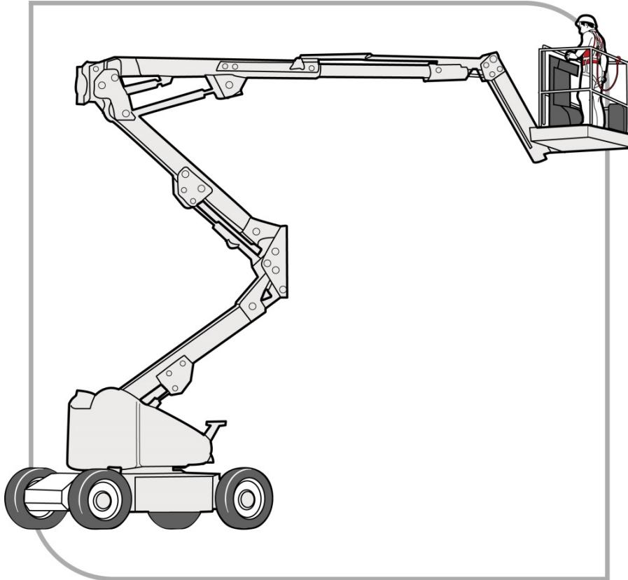
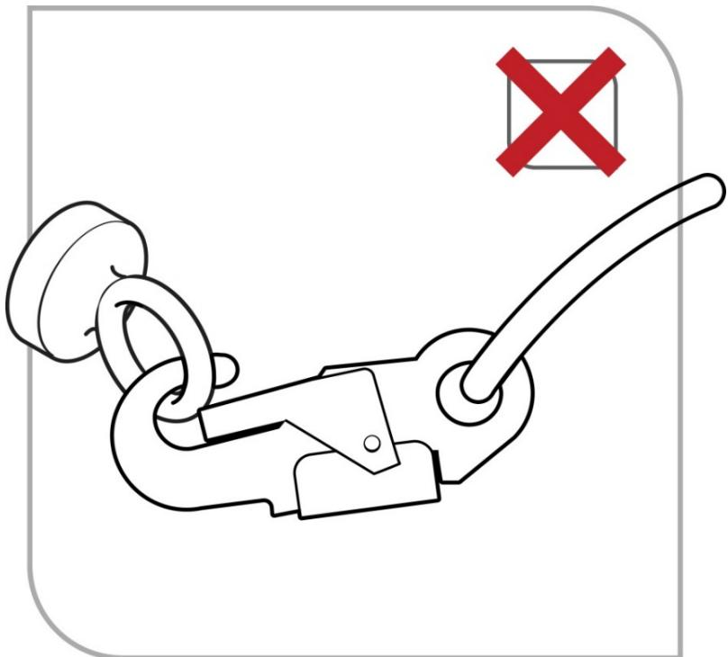

# Managing the risk of falls at workplaces

Code of Practice

# Disclaimer

Safe Work Australia is an Australian Government statutory agency established in 2009. Safe Work Australia includes Members from the Commonwealth, and each state and territory, Members representing the interests of workers and Members representing the interests of employers.

Safe Work Australia works with the Commonwealth, state and territory governments to improve work health and safety and workers' compensation arrangements. Safe Work Australia is a national policy body, not a regulator of work health and safety. The Commonwealth, states and territories have responsibility for regulating and enforcing work health and safety laws in their jurisdiction.

ISBN 978- 0- 642- 33297- 4 (PDF)  ISBN 978- 0- 642- 33298- 1 (DOCX)

# Creative Commons

This copyright work is licensed under a Creative Commons Attribution- Noncommercial 4.0 International licence. To view a copy of this licence, visit creativecommons.org/licenses In essence, you are free to copy, communicate and adapt the work for non- commercial purposes, as long as you attribute the work to Safe Work Australia and abide by the other licence terms.

# Contact information

Safe Work Australia | info@swa.gov.au | www.swa.gov.au

# Contents

# Foreword 5

# 1. Introduction 6

1.1. Who has health and safety duties in relation to falls? 6  1.2. What is involved in managing the risk of falls? 8  1.3. Information, training, instruction and supervision 10

# 2. The role of designers of plant and structures 12

2.1. Eliminating or minimising the risk of falls at the design stage 12  2.2. Plant 13  2.3. Buildings and structures 13

# 3. The risk management process 15

3.1. The risk management process 15  3.2. Identifying the hazards 15  3.3. Assessing the risks 16  3.4. Controlling the risks 17

# 4. Work on the ground or on a solid construction 20

4.1. Work on the ground 20  4.2. Work on a solid construction 21

# 5. Fall prevention devices 27

5.1. Temporary work platforms 27  5.2. Perimeter guardrails 39  5.3. Safety mesh 41

# 6. Work positioning systems 42

6.1. Restraint technique 42  6.2. Industrial rope access systems 43

# 7. Fall arrest systems 46

7.1. Catch platforms 46  7.2. Safety nets 47  7.3. Individual fall arrest systems 47  7.4. Vertical anchorage lines or rails 52  7.5. Double lanyards 53

# 8. Administrative controls 55

8.1. No go areas 55  8.2. Permit systems 56  8.3. Organising and sequencing of work 56

# 9. Ladders 57

9.1. Portable ladders 57

9.2. Fixed ladders. 619.3. Ladder maintenance. 6210. Emergency procedures for falls. 6310.1. Suspension intolerance. 6510.2. Training for rescues. 65Appendix A—Glossary. 66Appendix B—References and other information sources. 70Amendments. 72

# Foreword

This Code of Practice on how to manage the risk of falls at workplaces is an approved code of practice under section 274 of the Work Health and Safety Act (the WHs Act).

An approved code of practice provides practical guidance on how to achieve the standards of work health and safety required under the WHS Act and the Work Health and Safety Regulations (the WHS Regulations) and effective ways to identify and manage risks.

A code of practice can assist anyone who has a duty of care in the circumstances described in the code of practice. Following an approved code of practice will assist the duty holder to achieve compliance with the health and safety duties in the WHS Act and WHS Regulations, in relation to the subject matter of the code of practice. Like regulations, codes of practice deal with particular issues and may not cover all relevant hazards or risks. The health and safety duties require duty holders to consider all risks associated with work, not only those for which regulations and codes of practice exist.

Codes of practice are admissible in court proceedings under the WHS Act and WHS Regulations. Courts may regard a code of practice as evidence of what is known about a hazard, risk, risk assessment or risk control and may rely on the code in determining what is reasonably practicable in the circumstances to which the code of practice relates. For further information see the Interpretive Guideline: The meaning of 'reasonably practicable'.

Compliance with the WHS Act and WHS Regulations may be achieved by following another method if it provides an equivalent or higher standard of work health and safety than the code.

An inspector may refer to an approved code of practice when issuing an improvement or prohibition notice.

# Scope and application

This Code is intended to be read by a person conducting a business or undertaking (PCBU). It provides practical guidance for PCBUs, including those persons who design, construct, import, supply or install plant or structures, on how to eliminate, or if that is not possible, minimise the risk of falls from height in workplaces.

This Code applies to all types of work and all workplaces covered by the WHS Act and WHS Regulations where there is a risk of a fall by a person from one level to another that is reasonably likely to cause injury.

This Code may be a useful reference for other persons interested in the duties under the WHS Act and WHS Regulations.

# How to use this Code of Practice

This Code includes references to the legal requirements under the WHS Act and WHS Regulations. These are included for convenience only and should not be relied on in place of the full text of the WHS Act or WHS Regulations. The words 'must', 'requires' or 'mandatory' indicate a legal requirement exists that must be complied with.

The word 'should' is used in this Code to indicate a recommended course of action, while 'may' is used to indicate an optional course of action.

# 1. Introduction

1. IntroductionFalls are a major cause of death and serious injury in Australian workplaces. Fall hazards are found in many workplaces where work is carried out at height, for example stacking shelves in warehouses and retail outlets, working on a roof, unloading a large truck or accessing silos. Falls can also occur at ground level into holes, for example trenches or service pits.

# 1.1. Who has health and safety duties in relation to falls?

There are a number of duty holders who have a role in managing the risk of falls in the workplace. These include:

persons conducting a business or undertaking (PCBUs) designers, manufacturers, importers, suppliers and installers of plant, substances or structures, and officers.

Workers and other persons at the workplace also have duties under the WHS Act, such as the duty to take reasonable care for their own health and safety at the workplace.

A person can have more than one duty and more than one person can have the same duty at the same time.

Early consultation and identification of risks can allow for more options to eliminate risks and reduce the associated costs.

# Person conducting a business or undertaking

# WHS Act section 19

Primary duty of care

A PCBU must eliminate the risk of falls in the workplace, or if that is not reasonably practicable, minimise those risks so far as is reasonably practicable.

A PCBU has more specific obligations under the WHS Regulations to manage the risk of a fall by a person from one level to another, including requirements to:

ensure, so far as is reasonably practicable, that any work involving the risk of a fall by a person from one level to another is carried out on the ground or on a solid construction provide safe means of access to and exit from the workplace and an area from which a person could fall, such as a platform or scaffolding, and if it is not reasonably practicable to eliminate the risk of a fall, minimise the risk of falls so far as is reasonably practicable by providing adequate protection against the risk, including by providing a fall prevention device if it reasonably practicable to do so, or if not, a work positioning system if it is reasonably practicable to do so, or if not, a fall arrest system.

A combination of the controls that are reasonably practicable to provide adequate protection against the risk may be used if a single control is not sufficient for the purpose.

The WHS Regulations classify a number of activities as 'high risk construction work' for which a Safe Work Method Statement (SWMS) must be prepared before the work starts. High risk construction work includes work that involves a risk of a person falling more than 2 metres. Further information on developing a SWMS can be found in the Code of Practice: Construction work.

PCBUs have a duty to consult workers about work health and safety and may also have duties to consult, cooperate and coordinate with other duty holders.

Designers, manufacturers, importers and suppliers of plant, substances or structures

# WHS Act Part 2 Division 3

Further duties of persons conducting businesses or undertakings

Designers, manufacturers, importers, suppliers and installers of plant, substances or structures that are to be used or could reasonably be expected to be used for work must ensure, so far as is reasonably practicable, that the plant or structure is without risks to health and safety.

This duty includes carrying out testing and analysis as well as providing specific information about the plant or structure.

To assist in meeting these duties, the WHS Regulations require:

- manufacturers to consult with designers of plant- importers to consult with designers and manufacturers of plant, and the person who commissions construction work to consult with the designer of the structure.

Designers of plant or structures have an important role in eliminating and minimising the risk of falls in the design stage—see Chapter 2.

# Officers

# WHS Act section 27

Duty of officers

Officers, such as company directors, have a duty to exercise due diligence to ensure that the PCBU complies with the WHS Act and WHS Regulations. This includes taking reasonable steps to:

- gain an understanding of the hazards and risks associated with the operations of the business or undertaking, and- ensure the business or undertaking has and uses appropriate resources and processes to eliminate or minimise risks of falls from one level to another that are likely to cause injury.

Further information on who is an officer and their duties is available in the Interpretive Guideline: The health and safety duty of an officer under section 27.

# Workers

# WHS Act section 28

Duties of workers

WorkersDuties of workersWorkers have a duty to take reasonable care for their own health and safety and to not adversely affect the health and safety of other persons. Workers must comply with reasonable instructions, as far as they are reasonably able, and cooperate with reasonable health and safety policies or procedures that have been notified to workers. If personal protective equipment (PPE) is provided by the business or undertaking, the worker must so far as they are reasonably able, use or wear it in accordance with the information and instruction and training provided.

# Other persons at the workplace

# WHS Act section 29

Duties of other persons at the workplace

Other persons at the workplaceDuties of other persons at the workplaceOther persons at the workplace, like visitors, must take reasonable care for their own health and safety and must take care not to adversely affect other people's health and safety. They must comply, so far as they are reasonably able, with reasonable instructions given by the PCBU to allow that person to comply with the WHS Act.

# 1.2. What is involved in managing the risk of falls?

# WHS Regulation 34

Duty to identify hazards

# WHS Regulation 35

Managing risks to health and safety

# WHS Regulation 36

Hierarchy of control measures

# WHS Regulation 37

Maintenance of control measures

# WHS Regulation 38

Review of control measures

This Code provides guidance on how to manage the risks of falls in the workplace using the following systematic process:

Identify hazards- - find out what could cause harm. Assess risks, if necessary- - understand the nature of the harm that could be caused by the hazard, how serious the harm could be and the likelihood of it happening. This step may not be necessary if you are dealing with a known risk with known controls. Eliminate risks so far as is reasonable practicable. Control risks- - if it is not reasonably practicable to eliminate the risk, implement the most effective control measures that are reasonably practicable in the circumstances in

Managing the risk of falls at workplaces Code of Practice

accordance with the hierarchy of control measures, and ensure they remain effective over time.

Review control measures to ensure they are working as planned.

Further guidance on the risk management process is available in the Code of Practice: How to manage work health and safety risks.

Guidance on the preparation of a SWMS is available in the Safe work method statement for high risk construction work - information sheet.

# Consulting workers

Consultation involves sharing information, giving workers a reasonable opportunity to express views and taking those views into account before making decisions on health and safety matters.

# WHS Act section 47

Duty to consult workers

A PCBU must consult, so far as is reasonably practicable, with workers who carry out work for the business or undertaking and who are (or are likely to be) directly affected by a health and safety matter.

This duty to consult is based on the recognition that worker input and participation improves decision- making about health and safety matters and assists in reducing work- related injuries and disease.

The broad definition of a worker' under the WHS Act means a PCBU must consult, so far as is reasonably practicable, with employees, contractors and subcontractors and their employees, on- hire workers, outworkers, apprentices, trainees, work experience students, volunteers and other people who are working for the PCBU and who are, or are likely to be, directly affected by a health and safety matter.

Workers are entitled to take part in consultations and to be represented in consultations by a health and safety representative who has been elected to represent their work group.

By drawing on the experience, knowledge and ideas of workers, fall hazards are more likely to be identified and effective control measures implemented.

Consulting, cooperating and coordinating activities with other duty holders

# WHS Act section 46

Duty to consult with other duty holders

The WHS Act requires a PCBU to consult, cooperate and coordinate activities with all other persons who have a work health or safety duty in relation to the same matter, so far as is reasonably practicable.

There is often more than one business or undertaking at a workplace, which may each have responsibility for the same health and safety matters, either because they are involved in the same activities or share the same workplace.

In these situations, each duty holder should exchange information to find out who is doing what and work together in a cooperative and coordinated way so risks are eliminated or minimised so far as is reasonably practicable.

For example, the owner of a transport company with large trucks should consult the goods suppliers as well as the businesses having the goods delivered about how the risk of falls will be controlled during loading and unloading. This may include checking whether equipment is available at each site so that workers do not have to climb on top of loads on the truck and be at risk of falling.Further information is available in the Code of Practice: Work health and safety consultation, cooperation and coordination

Further information is available in the Code of Practice: Work health and safety consultation, cooperation and coordination

# 1.3. Information, training, instruction and supervision

# WHS Act section 19

Primary duty of care

# WHS Regulation 39

Provision of information, training and instruction

The WHS Act requires PCBUs to ensure, so far as is reasonably practicable, the provision of any information, instruction, training or supervision necessary to protect all persons from risks to their health and safety arising from work carried out as part of the conduct of that business or undertaking.

The PCBU must ensure that information, training or instruction provided to a worker is suitable and adequate having regard to:

the nature of the work carried out by the worker the nature of the risks associated with the work at the time of the information, training and instruction, and the control measures implemented.

The PCBU must also ensure, so far as is reasonably practicable, that the information, training and instruction are provided in a way that is readily understandable for the person to whom it is provided.

Workers must be trained and have the appropriate skills to carry out a particular task safely. Training should be provided to workers by a competent person.

Information, training, instruction provided to workers exposed to potential falls from working at any height should include:

the proper use, wearing, storage and maintenance of PPE the hazards and risks associated with work performed at these heights how to follow health and safety procedures associated with this work, including the contents of any SwMS, and the reasons fall protection measures have been put in place and how to use them properly.

Those supervising the work should also receive training. The amount and type of information, training and instruction required will depend on the nature of the work and the risk involved, as well as the type of fall protection measures used.

The information, training and instruction provided to workers should also include:

procedures for emergency and rescue procedures for reporting fall hazards and incidents

the correct selection, fitting, use, care, inspection, maintenance and storage of fall arrest and restraint equipment, if this equipment is to be used the correct use of tools and equipment used in the work, for example using a tool belt instead of carrying tools, and control measures for other potential hazards, for example electrical hazards and crushing or entanglement from the use of plant like elevating work platforms (EWPs).

Workers exposed to a risk of a fall should also be adequately supervised by a competent person, especially if they are undergoing training or are unfamiliar with the working environment. As a PCBU, you should check that:

only workers who have received training and instruction in relation to the system of work are authorised to carry out the work, and workers use fall control measures in the correct manner.

# WHS Regulation 317

Duty to ensure worker has been trained

You must not direct or allow a worker to carry out construction work unless the worker has successfully completed general construction induction training. You must also ensure the worker holds a general construction induction training card or a general construction induction training certification.

Further information on construction induction training is available in the Workplace induction for construction workplaces — Information sheet.

# 2. The role of designers of plant and structures

# 2.1. Eliminating or minimising the risk of falls at the design stage

The design, manufacture or modification of any plant or structure can significantly affect the risk of falls. Thoughtful design and the early consideration of the potential risk of falls can result in the elimination of such risks. The design stage should consider the whole life cycle of the plant or structure, from manufacture and use through to demolition and disposal.

Safety considerations that may eliminate or minimise risks at the design stage should include:

safer building design including:

- low-level mounting of roof vents- locating air conditioning and similar plant at ground level- locating air conditioning units and other roof-mounted plant like satellite dishes away from edges- specifying non-fragile material for the roof- using permanent safety mesh- having safer gutters, for example by installing large volume gutters and downpipes to minimise the need to access the roof for cleaning; locating the gutters at ground level or away from edges; or the removal of gutters altogether, with a smooth transition from the roof to the walls with the gutters at ground level.

- safe entry to and exit from work areas, including scaffolding

- designing permanent guardrails or other forms of edge protection, like parapet walls for permanent fall prevention on roofs

- future maintenance requirements, for example in relation to air-conditioning units, sloping building exteriors and windows, to ensure maintenance can be carried out safely

- specifying the strength of roof members and other points to which guardrails or anchor points for work positioning systems will be fixed

- designing the prefabrication of structures on the ground before they are lifted into position, and

- specific safety requirements for particular workers doing subsequent installation, maintenance or repair work. These groups include:

- people installing and maintaining antennae and satellite dishes- contractors servicing air-conditioning equipment on the roof, and- window and gutter cleaners and repairers.

# 2.2. Plant

Safety considerations that may eliminate or minimise risks at the plant design stage could include:

providing steps and handrails on vehicles (see Figure 1) incorporating one or more systems designed to prevent falls in silos and overhead conveyors ensuring workers who will be maintaining, repairing or cleaning the plant are able to do so safely, including safe access to and exit from the plant, and considering the safety of passengers.

  
Figure 1 Steps and handrails on dump trucks

# 2.3. Buildings and structures

Designers or constructors of buildings or structures must ensure, so far as is reasonably practicable, that workers involved with the construction, use or subsequent maintenance are not exposed to the risks associated with work at height. Therefore, at the design and planning stage, it is important to consider providing one or more systems designed to prevent falls as part of the building or structure.

As it is unlikely that all design work on larger projects will be carried out by one designer, consultation, cooperation and coordination should occur between the builder and other designers to ensure the safe interaction of the different design aspects.

When risks remain in the design work, information must be included with the design to alert others to the risks. Providing information about safety issues is a key component to ensure proper, adequate and suitable design and installation.

Safety considerations that may eliminate or minimise risks at the construction stage should include:

reducing the risk for those working at heights, for example installing guardrails to perimeter structural members before erection reducing the time spent working at heights by pre- fabricating modules on the ground, before lifting them into position sequencing of the work to be carried out at heights locating access roads to enable a crane to place building materials in the most accessible location rather than the materials being moved manually preparing the ground or floor below the work area- it should be compacted and level to support plant or equipment like cranes and elevating work platforms (EwPs) identifying underground services including drainage, for example for the safe setting up of cranes, and providing permanent safety mesh.

# Planning for building maintenance

During the planning stage, consideration should also be given to the methods by which maintenance, repairs or cleaning will be carried out on a building or structure, for example:

designing window cleaning bays or gangways integrated into the structural frame, and designing permanent anchorage and hoisting points into structures where maintenance needs to be carried out at height.

# Planning the site layout

Factors to be considered when planning the site layout include:

preparing firm, level surfaces below work areas for the support of plant and equipment like EwPs or mobile scaffolds the site and condition of access roads to enable plant to place material in and pick it up from the most favourable positions, reducing the need for manual handling at height the safe access to and exit from work areas and amenities including the provision and placement of stairways, ladders, catwalks, guardrails and barriers, and the need for a direct and unobstructed means of escape and rescue in the event of an emergency.

# 3. The risk management process

# 3.1. The risk management process

A risk assessment is not mandatory under the WHs Regulations. However, in many circumstances it will be the best way to determine the measures that should be implemented to control risks. It will help to:

identify which workers are at risk of exposure determine what sources and processes are causing that risk identify if and what kind of control measures should be implemented, and check the effectiveness of existing control measures.

Risk management is a systematic process to eliminate or minimise the potential for harm to people.

# 3.2. Identifying the hazards

The first step in the risk management process is to identify all fall hazards in the workplace. This involves finding things and situations which could potentially cause harm to people. Hazards generally arise from the following aspects of work and their interaction:

physical work environment equipment, materials and substances used work tasks and how they are performed, and work design and management.

As a person conducting a business or undertaking (PCBU), you must identify all locations and work tasks that are reasonably likely to cause injury due to a fall. This includes access to and exit from the areas where work is to be carried out.

# Inspect the workplace

Hazards may be identified by looking at the workplace and how work is carried out.

Walk around the workplace and talk to your workers to find out where work is carried out that could result in falls. A checklist may be useful in this process. Key things to look for include:

edges- requiring protection for open edges of floors, working platforms, walkways, walls or roofs holes, openings or excavations- requiring guarding surfaces, including:

their stability, fragility or brittleness their strength or capability to support loads the potential to slip, for example where surfaces are wet, polished or glazed the safe movement of workers where surfaces change, and the slope of work surfaces.

levels- where levels change and workers may be exposed to a fall from one level to another structures- the stability of temporary or permanent structures the ground- the evenness and stability of the ground for safe support of a scaffold or work platform

- the working area—whether it is crowded or cluttered- safe means of access to and exit from the workplace and working area, and- hand grip—places where hand grip may be lost.

Particular attention should also be given to work tasks that are carried out:

- near an unprotected open edge, for example near incomplete stairwells or leading formwork edges- using equipment to work at the elevated level, for example when using elevating work platforms (EwPs) or portable ladders- on any structure or plant being constructed or installed, demolished or dismantled, inspected, tested, repaired or cleaned- on or alongside a fragile surface, for example cement sheeting roofs, rusty metal roofs, fibreglass sheeting roofs and skylights- on a potentially unstable surface, for example areas where there is potential for ground collapse- on a sloping or slippery surface where it is difficult for people to maintain their balance, such as on glazed tiles or wet surfaces, and- near a hole, shaft or pit into which a worker could fall such as trenches, lift shafts, service pits or floor and column penetrations.

You may also need to talk to manufacturers, suppliers and health and safety specialists. In some situations, you may need to seek advice from technical specialists like structural engineers to check the stability or load- bearing capacity of structures.

# Review available information including incident records

Records of previous workplace incidents (injuries and near misses) and worker complaints related to falls should be checked.

Information and advice about fall hazards and risks relevant to particular industries and work activities are also available from regulators, industry associations, unions, technical specialists and safety consultants.

Manufacturers and suppliers can also provide information about hazards and safety precautions for specific plant or processes (information manuals).

# 3.3. Assessing the risks

A risk assessment involves considering what could happen if someone is exposed to a hazard and the likelihood of it happening. A risk assessment can help you determine:

- how severe a risk is- whether any existing control measures are effective- what action you should take to control the risk, and- how urgently the action needs to be taken.

Hazards have the potential to cause different types and severities of harm, ranging from minor discomfort to a serious injury or death.

Many hazards and their associated risks are well known and have well established and accepted effective control measures. In these situations, the second step in the process outlined in section 1.2 of this Code (to formally assess the risk) is not required. If after identifying a hazard you already know the risk and how to control it effectively, you may simply implement the controls.

In some circumstances, a risk assessment will assist to:

identify which workers are at risk of exposure determine what sources and processes are causing the risk identify if and what kind of control measures should be implemented, and check the effectiveness of existing control measures.

When assessing the risks of each fall hazard the following should be considered:

What could happen if a fall did occur and how likely it is to happen. The design and layout of elevated work areas including the distance of a potential fall. The number and movement of people at the workplace. The proximity of workers to unsafe areas where loads are placed on elevated working areas, for example loading docks, and where work is to be carried out above people and there is a risk of falling objects. The adequacy of inspection and maintenance of plant and equipment, for example scaffolds. The adequacy of lighting for clear vision. Weather conditions including the presence of rain, wind, extreme heat or cold which can cause slippery or unstable conditions. The suitability of footwear and clothing for the conditions. The suitability and condition of ladders including where and how they are being used. The adequacy of current knowledge and training to carry out work safely, for example young, new or inexperienced workers may be unfamiliar with the work. The adequacy of procedures for potential emergency situations- - including effective procedures for response and evacuation, the provision of medical treatment and assistance (for example ensuring appropriate first aid is provided immediately and ambulances are called for when necessary), and effective communication. The adequacy of current testing and training of the emergency procedures.

# Generic risk assessment

If you are responsible for a number of different work areas or workplaces and the fall hazards are the same, you may complete a single- or generic- risk assessment. However, a generic risk assessment must be reviewed if there is any likelihood a person may be exposed to greater, additional or different risks at the specific work area or workplace.

# 3.4. Controlling the risks

# Hierarchy of control measures

The WHs Regulations require duty holders to work through the hierarchy of control measures when managing certain risks; however, the hierarchy can be applied to any risk. The hierarchy ranks control measures from the highest level of protection and reliability to the lowest.

Further guidance on the risk management process and the hierarchy of control measures is available in the Code of Practice: How to manage work health and safety risks.

# Managing the risk of falls

# WHS Regulation 78

Management of risk of fall

In managing the risk of falls, the WHs Regulations require specific control measures to be implemented, where it is reasonably practicable to do so.

As a PCBU, you must manage risks to health and safety associated with a fall by a person from one level to another that is reasonably likely to cause injury to the person or any other person.

You must ensure, so far as is reasonably practicable, that any work involving a risk of a fall is carried out on the ground or on a solid construction (see Chapter 4).

You must also provide safe means of access to and exit from the workplace or any area within the workplace from or through which a person could fall, such as a platform or scaffolding.

Carrying out work on the ground or on a solid construction and providing a safe means of access to and exit from a workplace are intended to, as far as is reasonably practicable, eliminate the fall hazard and associated risk of a fall.

# WHS Regulation 79

Specific requirements to minimise risk of fall

If it is not reasonably practicable for you to eliminate the risk of a fall by working on the ground or on a solid construction, you must minimise the risk of a fall by providing adequate protection against the risk.

Adequate protection against the risk is provided if you provide and maintain a safe system of work, including by:

providing a fall prevention device if it is reasonably practicable to do so (see Chapter 5), or if it is not reasonably practicable to provide a fall prevention device, providing a work positioning system (see Chapter 6), or if it not reasonably practicable to provide a fall prevention device or work positioning system, providing a fall arrest system, so far as is reasonably practicable (see Chapter 7).

If a risk remains after considering all of the control measures mentioned above, you must minimise the remaining risk, so far as is reasonably practicable, by implementing administrative controls (see Chapter 8).

Administrative controls may also be used to support other control measures. However, the exclusive use of administrative controls to minimise the risk of falls is only appropriate when it is not reasonably practicable to use a higher order control.

# Combining control measures

A combination of control measures may be used to minimise risks, so far as is reasonably practicable, if a single control is not sufficient for the purpose. In most cases, a combination of the control measures will provide the best solution to minimise the risk to the lowest level reasonably practicable.

You should also ensure that the control measures you select do not create new hazards, for example electrical risks from contact with overhead powerlines or crushing and entanglement from plant like EwPs. If any new hazards are created they must also be controlled.

# Maintaining and reviewing control measures

# WHS Regulation 37

Maintenance of control measures

Control measures must be maintained so they remain fit for purpose, suitable for the nature and duration of the work and installed, set up and used correctly.

To allow the chosen control measures to operate effectively, you should develop work procedures on how to correctly install, use and maintain the control measures. The procedures should include a planned program of inspections and maintenance for the control measures. The inspection regime should include details of:

the equipment to be inspected including its unique identification the frequency and type of inspection, for example pre- use checks, detailed inspections action to be taken on finding defective equipment means of recording the inspections training of users, and the system of monitoring the inspection regime to verify inspections are carried out appropriately.

The manufacturer or supplier of the equipment should be consulted for product specific requirements. If signs of excessive wear or other defects are found during the inspection the defective equipment must be withdrawn from use.

# WHS Regulation 38

Review of control measures

You must review and as necessary revise fall control measures in the following circumstances:

when the control measure does not control the risk so far as is reasonably practicable before a change at the workplace that is likely to give rise to a new or different risk to health and safety that the control measure may not effectively control a new relevant hazard or risk is identified the results of consultation indicate that a review is necessary, or a health and safety representative requests a review if that person reasonably believes that:

a circumstance in any of the above points affects or may affect the health and safety of a member of the work group represented by the health and safety representative the control measure has not been adequately reviewed in response to the circumstance.

# 4. Work on the ground or on a solid construction

4. Work on the ground or on a solid constructionThe most effective control measure is to eliminate the risk of a fall, so far as is reasonably practicable. This can be achieved by working on the ground or from a solid construction. A person conducting a business or undertaking (PCBU) can only take steps to minimise the risk of a fall if it is not reasonably practicable to eliminate that risk.

# 4.1. Work on the ground

Eliminating the need to work at height is the most effective way of protecting workers from the risk of falls. Examples of tasks that may be carried out on the ground to eliminate the risk of falls are:

- prefabricating roofs at ground level- prefabricating wall frames horizontally then standing them up- installing air-conditioning units at ground level- using mechanical tarp spreaders to cover loads on trucks from the ground- reducing shelving heights so workers can access items from ground level- using tools with extendable handles, for example paint rollers—however, the risk of musculoskeletal disorders will need to be considered when deciding whether to use such tools- lowering a concert hall chandelier to repair it, and- fitting outlets, inlets and controls of large tanks and silos near the ground—see Figure 2.

  
Figure 2 Silo with sight glass and ground delivery tube

# 4.2. Work on a solid construction

Working on a solid construction provides an environment where the likelihood of a fall may be eliminated. 'Solid construction' means an area:

with a surface that is structurally capable of supporting workers, materials and any other loads applied to it provided with barriers around its perimeter and around any openings from or through which a person could fall with an even and readily negotiable surface and gradient, and with a safe means of entry and exit.

# Structural strength

Different types of work involve different loads on the supporting surface. The surface and its supports must be able to safely carry the expected loads, including workers, materials, tools and equipment. When in doubt, have a structural engineer determine the safe load capacity before use.

# Barriers

Barriers to prevent a person falling over edges and into holes must be provided on relevant parts of a solid construction. These include:

- the perimeters of buildings or other structures- floors, including mezzanine floors—see Figure 3- openings in floors, and- the open edge of a stair, landing, platform or shaft opening—see Figure 4.

  
Figure 3 Mezzanine floor barrier

  
Figure 4 Silos with platform and guard rails

The barrier must be designed and constructed to withstand the force of someone falling against it.

Barriers should consist of guardrails, solid balustrades or other structural components, for example wire mesh supported by posts and provided with a reinforced top edge. The top of the guardrail or component should be between  $900mm$  and  $1100mm$  above the working surface. If a guardrail system is used, it should also have mid- rails and toe- boards or wire mesh infill panels.

If access is required to equipment, for example a hoist, it should be protected with gates or other means to prevent a person falling.

# Protection around holes, penetrations and openings

A fall prevention device (for example a secure fence, edge protection, work platform or cover) must be used to provide and maintain a safe system of work where persons are working near and around holes, penetrations and openings through which a person could fall, if it is reasonably practicable to do so.

Holes, penetrations and openings must be made safe immediately after being formed, for example with covers, barricading or by embedded mesh—see Figure 5. When mesh is used, an additional cover should be used to prevent things falling through the mesh.

  
Figure 5 Mesh embedded in a concrete floor

If a cover is used as a control measure it must be made of a material strong enough to prevent people or objects falling through the hole, penetration or opening and should be securely fixed to prevent dislodgement or accidental removal.

Covers over penetrations should be designed to safely withstand a point load of at least 2 kilonewtons—that is, 200 kilograms.

Plywood covers on their own are not preferred because:

- the cover may be indistinguishable from other pieces of plywood- it may be difficult to determine if the plywood is properly secured, and- secured plywood covers can be unsecured to gain access and not be re-secured.

The cover should also include signage indicating its purpose as a cover, for example 'DANGER HOLE BENEATH'—see Figure 6.

  
Figure 6 Cover danger sign

# Surface and gradient

Surfaces of a solid construction must be non- slip, free from trip hazards and should generally not exceed 7 degrees—1 in 8 gradient. Cleated surfaces, which provide greater slip- resistance, should not be steeper than 20 degrees—1 in 3 gradient.

If grid mesh or checker plate flooring is used for walkways and working platforms you should, ensure:

flooring panels are securely fixed and assembled in accordance with the manufacturer's specifications where possible, the flooring is fitted to the structure before being lifted into permanent position each panel is fixed securely before the next panel is placed in position during installation, this type of flooring is secured by tack welding, panel grips or other means to prevent movement before being fixed permanently, and if panels of grid mesh or checker plate flooring are removed, edge protection is provided and the gaps left due to removed panels are protected.

# Entry and exit

The solid construction must have a safe means for people to enter and exit and to move around the work area, for example permanently installed platforms, ramps, stairways or fixed ladders.

Further information on fixed walkways, stairways and ladders is in AS 1657- 2013: Fixed platforms, walkways, stairways and ladders - Design, construction and installation. Other safety considerations for entrances and exits in a solid construction include:

exposure of access systems to the weather, for example rain can make surfaces slippery and strong winds can cause loss of hand grip

Managing the risk of falls at workplaces Code of Practice

- providing natural or artificial lighting to access ways, and- clearing obstructions so people are able to move easily to and from the workplace.

Portable stepladders and trestle ladders should not be used for entries or exits and single or extension ladders should only be used where the use of safer systems is not reasonably practicable.

# 5. Fall prevention devices

When work cannot be performed on the ground or from a solid construction, you, as a person conducting a business or undertaking (PCBU), must minimise the risk of a fall by providing a fall prevention device, if it is reasonably practicable to do so.

A 'fall prevention device' is material or equipment—or a combination of both—designed to prevent a fall for temporary work at heights, that once in place after initial installation does not require any ongoing adjustment, alteration or operation by any person to ensure its integrity. Fall prevention devices include secure fencing, edge protection, working platforms and covers.

# 5.1. Temporary work platforms

5.1. Temporary work platformsA 'temporary work platform' is a working platform, other than a permanently installed fixed platform, used to provide a working area for the duration of the work. The design of the platform prevents workers from falling. Temporary work platforms include scaffolds, elevating work platforms (EwPs), mast climbers, workboxes, building maintenance units, portable or mobile fabricated platforms or any other platform that provides a working area designed to prevent a fall.

# Scaffolds

ScaffoldsScaffolds can be very effective protection in preventing falls. Specific requirements apply to some types of scaffold under the WHS Regulations.

# WHS Regulation 225

Scaffolds

A person with management or control of a scaffold must not allow the use of a scaffold from which a person or object could fall more than 4 metres unless a competent person, who has inspected the scaffold, provides written confirmation that the scaffold has been completed.

The person with management or control of a scaffold must also ensure that:

the scaffold and its supporting structure are inspected by a competent person:

before use of the scaffold is resumed after an incident occurs that may reasonably be expected to affect the stability of the scaffold (such as a severe storm or impact by mobile plant) before use of the scaffold is resumed after any repairs, and at least every 30 days.

if an inspection indicates that a scaffold or its supporting structure creates a risk to health or safety, that any repairs, alterations and additions are made or carried out and the scaffold and its supporting structure are inspected again by a competent person before use is resumed, and unauthorised access is prevented on scaffolding that is incomplete and left unattended, for example by attaching danger tags and warning signs at appropriate locations.

The WHS Regulations also require that the design of certain types of plant, such as prefabricated scaffolding, must be registered before the plant is used in the workplace. Further information on design registration is available in the Code of Practice: Managing risks of plant in the workplace.

Scaffolding work platforms are generally rated as light, medium or heavy duty:

Light duty- up to  $225kg$  per bay. Examples include painting, electrical work, many carpentry tasks and other light tasks. Platforms should be at least two planks wide (approximately  $450mm$  Medium duty- up to  $450kg$  per bay. This is suitable for general trades work. Platforms should be at least four planks wide (approximately  $900mm$  Heavy duty- up to 675 kg per bay. This is what is needed for moklaying, concreting, demolition work and most other work tasks involving heavy loads or heavy impact forces. Platforms should be at least five planks wide (approximately  $1000mm$  Special duty- has a designated allowable load as designed.

These safe load limits include the weight of people plus the weight of any materials, tools and debris on the working platform. For example, a properly constructed mobile scaffold with a light duty platform holding up to  $225kg$  per bay can safely support one  $80kg$  worker and  $145kg$  of tools and material, or two  $80kg$  workers and  $65kg$  of tools and materials.

Safety considerations when using scaffolds should include:

Scaffolding conforms to AS/NZS 4576:1995: Guidelines for scaffolding and the AS/NZS 1576 Scaffolding (set)'. Scaffolding is erected, altered and dismantled by competent people. Scaffolds from which a person or object could fall more than 4 metres must be erected, altered and dismantled by a person who holds a scaffolding high risk work licence, or is enrolled in a training course to obtain a scaffolding high risk work licence and is under the direct supervision of a licensed scaffolder. Prefabricated scaffolds are of the same type and not mixed components, unless the mixing of components has been approved by the manufacturer. Safe access to and exit from the scaffold is provided. Edge protection like handrails, mid- rails and toe- boards is provided at every open edge of a work platform- see Figure 7.

Where work is carried out from a scaffold, workers must be provided with information, training and instruction on the nature of the scaffolding work, the risks associated with scaffolding and the control measures implemented to reduce that risk. This may include information, training and instruction on:

emergency response procedures what loads the scaffold can safely take (Safe Working Load (SwL)) not to make unauthorised alterations to the scaffold, such as removing guardrails, planks, ties, toe- boards and braces keeping working platforms clear of debris and obstructions along their length never accessing incomplete or defective scaffolds immediately reporting defects, if they occur isolating electrical leads from the metal frame of the scaffold with plastic lead hooks or an insulated rubber material where reasonably practicable (to prevent damage to the leads or electrifying the scaffold) the requirement for a written safe work method statement (SwMS) to be developed for any work carried out at or above 2 metres, and complying with any electrical permit to work' requirements issued by the electricity supply authority for work conducted from a scaffold that has been erected within the powerline 'no go' zone.

Where mobile scaffolds are used, workers should be trained in their use, including on how to ensure the scaffold:

remains level and plumb is kept well clear of powerlines, open floor edges and penetrations is not accessed until the castors are locked to prevent movement is not moved while anyone is on it, and is accessed using an internal ladder (see Figure 8), except for low height platforms where this is not reasonably practicable.

  
Figure 7 Perimeter scaffold with fully decked working platform, guardrails, mid-rails and toe-boards

  
Figure 8 Mobile scaffold with access ladder and trapdoor

# Suspended (swing stage) scaffold

A suspended scaffold incorporates a suspended platform capable of being raised or lowered when in use. Other terms often used are 'suspended cradle' and 'swing stage' scaffold. They are typically prefabricated modular units (see Figure 9) or permanently fabricated units, although they can be assembled from scaffolding.

Common types of suspended scaffold include:

swing stages with cradles supported by a single row of suspension ropes double rope scaffolds with cradles supported by two rows of suspension ropes work cages which are small cradles supported by one suspension rope only, and false cars which are specialised forms of suspended scaffold and are often used in the construction of lifts before lift cars are installed.

In managing the risks of using swing stage scaffolds, you should ensure that:

the working load and specifications are in accordance with AS 1576.4- 1991: Scaffolding - Suspended scaffolding workers operating suspended scaffolds are trained in their safe operation workers installing or servicing a suspended scaffold must either:

- hold an advanced rigging or advanced scaffolding high risk work licence, or- be enrolled in a training course to obtain an advanced rigging or advanced scaffolding high risk work licence and be supervised by the holder of an advanced rigging or advanced scaffolding high risk work licence.

- all occupants of the swing stage should wear a fall arrest harness attached to a suitable anchorage point in the swing stage, and- the platform remains horizontal when it moves up or down.

Further information on the safe design, erection and use of scaffolding, including suspended scaffolds, is available in the Guide to scaffolds and scaffolding.

  
Figure 9 Suspended (swing-stage) scaffold – cradle (suspended) end

# Elevating work platforms (EwPs)

EWP's include boom- type EwPs (see Figure 10) and scissor lifts (see Figure 11). Some are designed for hard flat surfaces only while others are designed to be operated on rough terrain. Some types are designed for indoor use and are not suitable for windy conditions outdoors.

If using an EwP at the workplace, you must identify the hazards associated with the use of the EwP and implement control measures to eliminate or minimise those risks so far as is reasonably practicable. The main hazards related to the use of EwPs are contact with electric lines, overturning the machine, falling from the work platform, and potential crushing hazards when elevating the platform or moving laterally.

Relevant risk control measures when using EwPs should include:

training and instructing workers in the safe operating procedures for the particular brand and type of EwP, as well as safe work procedures to avoid crushing and electrical hazards training and instructing workers in the safe use of fall arrest equipment and emergency rescue procedures

ensuring the EWP is only used as a working platform and not as a means of entering and exiting a work area unless the conditions set out in AS 2550.10- 2006: Cranes, hoists and winches - - Safe use - - Mobile elevating work platforms are met ensuring the EWP is only used on a solid level surface, unless it is designed for use on rough terrain, and checking the surface area to make sure there are no penetrations or obstructions that could cause uncontrolled movement or overturning of the EWP.

In addition to the above, you must ensure:

where it is not reasonably practicable to use a fall prevention device or a work positioning system to adequately protect against the risk of a fall, workers working in travel towers, boom lifts or cherry pickers wear a properly anchored fall arrest harness. The lanyard should be as short as possible and should be attached directly to the designated anchor point on the EWP, not to the handrail (unless the handrail is the manufacturer's specified anchor point), and workers operating boom- type EwPs with a boom length of 11 metres or more either: hold a boom- type EWP high risk work licence, or are enrolled in a training course to obtain a boom- type EWP high risk work licence and are supervised by the holder of a boom- type EWP high risk work licence.

  
Figure 10 Boom-type elevating work platform

  
Figure 11 Scissor-lift elevating work platform

# Mast climbing work platforms

Mast climbing work platforms are hoists with a working platform that is used to raise workers and material to a temporary working position (see Figure 12). They use a drive system mounted on an extendable mast which may need to be tied to a building under circumstances prescribed by the manufacturer.

Mast climbing work platforms can be set up in either single- mast or multi- mast configurations. They are generally not suitable for use if the profile of a structure changes at different elevations, for example if the upper floors of a building step back or balconies protrude from the building.

The erection and dismantling of mast climbing work platforms must be carried out by workers who:

- hold a basic rigging or intermediate scaffolding high risk work licence, or- are enrolled in a training course to obtain a basic rigging or intermediate scaffolding high risk work licence and are being supervised by the holder of a basic rigging or intermediate scaffolding high risk work licence.

Further information on mast climbing work platforms is in AS 2550.16- 1997: Cranes - Safe Use - Mast climbing work platforms.

  
Figure 12 An example of a typical mast climbing work platform

# Workboxes and Work platforms

Workboxes and work platforms consist of a platform surrounded by edge protection, designed to provide an elevated work area for people working from the box. Workboxes are designed to be supported from above by a crane, hoist, or other mechanical device whereas work platforms are designed to be supported from underneath or the side by forklifts or other mechanical devices.

Where reasonably practicable, other working platforms like EwPs or scaffolds should be used as an alternative to a workbox or work platform.

Certain safety precautions should be observed when using a workbox or work platform to provide an elevated work area. These include ensuring the workbox or work platform:

- is designed for the task and securely attached to the crane, hoist, forklift truck or other mechanical device, and- is not suspended over people.

You should also ensure:

- there is an effective means of communication between any person in the workbox or work platform and the operator- the operator remains at the controls of the crane, hoist, forklift truck or other mechanical device at all times, and- lifting attachments and records are checked by a competent person before use.

# Workboxes designed to be suspended from cranes

The WHS Regulations require workboxes designed to be suspended from cranes to be 'design registered' before they are used in the workplace.

When using crane workboxes as an elevated work area, you should ensure that:

the workbox is designed in accordance with AS 1418.17- 1996: Cranes (including hoists and winches) - Design and construction of workboxes the workbox is fitted with an anchorage capable of withstanding the fall forces specified in AS/NzS 1891.4:2009: Industrial fall- arrest systems and devices - Selection, use and maintenance where there is a risk of a person falling from height, the person must be attached to the anchorage by a lanyard and harness unless the workbox is fully enclosed workers remain within the workbox while they are being lifted or suspended except in an emergency, workers do not enter or leave the workbox when it is elevated unless the conditions set out in section 6.19.3 of AS 2550.1- 2011: Cranes, hoists and winches - Safe use - General requirements are met, and directions to the crane operator should be provided from the workbox by a person holding a dogging or rigging licence.

A crane used to elevate a workbox should:

be fitted with the means to safely lower the workbox in an emergency or a power supply failure be suitably stabilised while the workbox is used, and have 'drive up' and 'drive down' controls on both the hoisting and luffing motions and those controls should be used. No declutching allowing free fall is to be used while a workbox is in use.

Further specifications for cranes used to lift workboxes and requirements relating to the use of crane workboxes is in AS 2550.1- 2011: Cranes, hoists and winches - Safe use - General requirements.

# Work platforms supported by forklifts

Work platforms used on forklifts to elevate people to work at height should be engineer- designed and constructed in accordance with AS 2359.1- 2015: Powered Industrial Trucks - General requirements (see Figure 13).

The work platform should be securely attached to the forklift carriage to prevent it from sliding off the forks.

In managing the risks of using a work platform to provide an elevated work area you should ensure that:

workers are only raised by a forklift when in a compliant work platform workers remain within the work platform when it is elevated or being raised or lowered no other device such as a ladder or pallet is used to gain additional height (see Figure 14 and Figure 15), and the safety gate is self- closing and kept shut when in the elevated position.

Further information on the use of work platforms with forklifts is in AS 2359.2- 2013: Powered industrial trucks - Operations.

Forklifts used to elevate people in a work platform should comply with the requirements of AS 2359.1- 2015: Powered industrial trucks - General requirements.

  
Figure 13 An engineer-designed work platform correctly positioned on tynes

  
Figure 14 Using a forklift as a working platform or to gain extra height by standing on the tynes or a pallet is an unacceptable practice

  
Figure 15 Unacceptable practice with ladder on forklift

# Building maintenance units

Building maintenance unitsA building maintenance unit is a power- operated suspended working platform that is fixed permanently to a building or structure. It is used for access for building maintenance or window cleaning (see Figure 16).

  
Figure 16 Building maintenance unit with harness and anchor rail

When using a building maintenance unit you should ensure that:

When using a building maintenance unit you should ensure that:- the unit is designed in accordance with AS 1418.13- 1996: Cranes (including hoists and winches) - Building maintenance units- the unit has clearly designated fall arrest harness anchorage points designed to withstand the forces caused by a fall of a person located anywhere on the platform- the unit is operated by competent people in accordance with AS 2550.13- 1997: Cranes - Safe Use - Building maintenance units, and- operators possess a suitable attitude for working at height, including a responsible attitude to safety.

# Platforms supported by trestle ladders

Trestle scaffolds are generally not suitable for working at heights of 2 metres or above. If they are used at heights greater than 2 metres, guardrailing and toe- boards should be used to prevent people and material from falling off the open side or end of the work platform.

Working platforms on trestle scaffolds should have a width of at least  $450mm$  (two planks). The use of plank locking devices will extend plank spans and reduce plank whip when walking along the platform. The system (including planks) should be assembled according to the manufacturer's specifications using only compatible components.

Except where the working platform is at or below 2 metres in height, if there is no guardrail or mid- rail provided adjacent to the working face of the structure, the distance between the platform edge and the working face of the structure should not be greater than one plank width  $(225mm)$ .

When adjusting the height of a brick layer's trestle scaffold, make sure that only the purpose- designed pins are used. Do not use nails or pieces of reinforcing bar. Pins should be attached to the trestle by a chain to prevent loss.

Some trestle ladder scaffolds include outriggers to increase stability (see Figure 17). Most trestle ladder scaffolds are only suited to light duty work like painting and rendering. Work should only be carried out between the trestles.

As a person conducting a business or undertaking (PCBU) you must always consider what is reasonably practicable to maintain a safe system of work in the circumstances. It may be that a trestle scaffold is not the most appropriate means of minimising the risk of a fall in the circumstances. Therefore, alternative types of temporary work platforms should be considered, for example EwPs like small scissor lifts and other types of fall prevention devices like light duty aluminium mobile scaffolds and modular scaffolding.

  
Figure 17 Trestle ladder scaffold with guard rails and outriggers for stability

# 5.2. Perimeter guardrails

Guardrails may be used to provide effective fall prevention:

- at the edges of roofs- at the edges of mezzanine floors, walkways, stairways, ramps and landings- on top of plant and structures where access is required (see Figure 18)- around openings in floor and roof structures, and- at the edges of shafts, pits and other excavations.

Guardrails should incorporate a top rail 900 mm to 1100 mm above the working surface, a mid- rail and a toe- board.

The guardrail system, method of attachment and the supporting structure should be capable of withstanding the loads that will be applied.

The required load resistance will depend on the momentum of a falling person. For example, the momentum of a person falling from a pitched roof will increase as the pitch, that is, the angle, of the roof increases.

Further information is contained in AS/NZS 4994 (set) $^{2}$ : Temporary edge protection.

  
Figure 18 Guardrails installed on top of a tanker to enable safe access to tank hatches

# Guardrails for trenching work

Where trenching works present a risk of a person falling into the trench, any such risk should be controlled by the provision of:

- guardrailing, including guardrails fitted to the top edges of trench shields, or 
- a barrier approximately 1.5 metres back from the excavation, to prevent persons approaching the trench.

# 5.3. Safety mesh

Safety mesh is designed to prevent internal falls through a roof. If securely fixed, safety mesh provides fall protection for roof installers and offers long- term protection against falling for maintenance and repair workers.

Safety mesh does not prevent falls from the edge of a roof or through holes in a roof so it should always be used in conjunction with other types of fall prevention devices such as edge protection (e.g. guardrails), or other control measures such as fall arrest systems.

Safety mesh should comply with AS/NZS 4389:2015: Roof safety mesh, which specifies the minimum requirements for the design, construction, testing and installation of safety mesh for use in domestic, commercial and industrial building applications.

The mesh should be formed from  $2mm$  diameter wire, welded into a mesh with the longitudinal wires not more than  $150mm$  apart and the cross wires not more than  $300mm$  apart. Transverse wires should have a 450 MPa minimum tensile strength and longitudinal wires a 500 MPa minimum tensile strength.

Safety mesh should be installed by competent people in accordance with the manufacturer's instructions. Workers installing roof safety mesh must be protected against the risk of falling by using control measures like scaffolding, EwPs or fall arrest systems. The appropriate control measure will depend on what is reasonably practicable in the circumstances.

Particular care is required to ensure that the mesh is securely connected to the structure and the overlap between adjacent sections of mesh is sufficient to generate the necessary strength to resist the force of a person falling onto it. The safety mesh should be covered by the roof cladding as soon as is reasonably practicable after it has been installed.

# 6. Work positioning systems

A 'work positioning system' includes any plant or structure, other than a temporary work platform, that enables a person to be positioned and safely supported at a location in such a way that a fall is prevented.

The use of work positioning systems must only be considered if it is not reasonably practicable to carry out work on the ground or on a solid construction, or by providing a fall prevention device as detailed in Chapter 5, for example an elevating work platform (EWP).

Work positioning systems require a high level of competency on the part of the user and supervisors to ensure safe use. Users, including supervisors, should undertake a relevant competency based course of training before using a work positioning system.

Users should be competent in the technique and possess a suitable attitude for working at height, including a responsible attitude to safety.

Operators should be fit to perform the work and not be affected by alcohol or drugs including prescribed medication which may affect or impair their ability to work at height.

# 6.1. Restraint technique

A restraint technique controls a person's movement by physically preventing the person from reaching a position at which there is a risk of a fall. It consists of a harness that is connected by a lanyard to an anchorage or horizontal lifeline. It must be set up to prevent the wearer from reaching an unprotected edge—see Figure 19.

  
Figure 19 Restraint technique options

A restraint technique is suitable for use where:

the user can maintain secure footing without having to tension the restraint line and without the aid of another handhold or lateral support. When deciding whether secure footing can be maintained, consider:

the slope of the surface the supporting material type the texture of the surface and whether it is likely to be wet, oily or otherwise slippery.

Restraint techniques must only be used if it is not reasonably practicable to prevent falls by carrying out work on the ground or on a solid construction, or by minimising the risk using a fall prevention device, such as providing a physical barrier, for example a guardrail.

A restraint system should be installed by a competent person in accordance with the manufacturer's instructions. Restraint anchorage should be designed for fall arrest loading.

A purpose- designed roof anchor, when used in accordance with the designer's or manufacturer's/supplier's instructions, may be used as part of the restraint technique on metal deck or tiled roofs.

Where it is not reasonably practicable to provide a work positioning system such as a restraint technique, as a person conducting a business or undertaking (PCBU), you must provide a fall arrest system, so far as is reasonable practicable. Situations where it may not be reasonably practicable to use a restraint technique include when:

The user can reach a position where a fall is possible. The user has a restraint line that can be adjusted in length so that a free fall position can be reached. There is a danger the user may fall through the surface, for example fragile roofing material. The slope is over 15 degrees. There is any other reasonably likely use or misuse of the system that could lead to a free fall.

In these circumstances it may be more appropriate to use an individual fall arrest system.

# 6.2. Industrial rope access systems

Industrial rope access systems are used for gaining access to and working at a workface, usually by means of vertically suspended ropes. Although fall arrest components are used in the industrial rope access system, the main purpose of the system is to gain access to a work area rather than to provide backup fall protection (see Figure 20).

Other methods of accessing a workface, for example EwPs or building maintenance units, must be considered before industrial rope access systems.

Before using an industrial rope access system, a risk assessment should be carried out that, amongst other things, considers the location of the work and any associated special features of the structure, anchor points, emergency access and weather conditions.

The use of industrial rope access systems is considered high risk construction work if it involves construction work where there is a risk of a person falling more than 2 metres. The WHS Regulations require that high risk construction work must not be carried out unless a safe work method statement (SwMS) is prepared for the work. Some of the information contained within the risk assessment can be used in the SwMS.

Guidance on the preparation of a SwMS is available in the Safe work method statement for high risk construction work - Information sheet.

Where it is necessary for industrial rope access systems to be used, you should ensure:

Where it is necessary for industrial rope access systems to be used, you should ensure:- rope access work is properly supervised—supervisors of rope access work should have the necessary experience and competence to supervise the rope access work and any potential rescue for each rope access project under their supervision- operators are competent in the technique and possess a suitable attitude for working at height, including a responsible attitude to safety- operators should be fit to perform the work and not affected by alcohol or drugs including prescribed medication which may affect or impair their ability to work at height- operators do not work alone in case they require assistance in an emergency, and- when using an industrial rope access system, personal protective equipment (PPE) appropriate for the tasks being undertaken is used, for example helmets, gloves, hearing protection, goggles or masks.

Where industrial rope access systems are used, you should also ensure:

Where industrial rope access systems are used, you should also ensure:- industrial rope access systems are installed in a location where it is possible to provide prompt assistance or rescue if required (see Chapter 10)- equipment is checked regularly by a competent person- fixed anchorage points are checked by a competent person before attaching the rope access lines- a back- up system is used to protect the operator, for example use two independently anchored ropes for each person- a person within 3 metres of an unguarded edge is adequately secured- operators wear a full body or work positioning sit harness with shoulder straps- supervisors can communicate with workers, and- exclusion zones that exclude and alert the public that industrial rope access systems are in use are established and enforced on access areas below the working area and anchorage locations.

Further information on industrial rope access systems is available in AS/NZS 4488: (set) $^{3}$ : Industrial rope access systems.

  
Figure 20 Operator using a descender in an industrial rope access system

# 7. Fall arrest systems

Fall arrest systems, such as catch platforms, safety nets and individual fall arrest systems (including anchorage lines or rails), are intended to safely stop a worker falling an uncontrolled distance and reduce the impact of the fall. These systems must only be used if it is not reasonably practicable to use a fall prevention device or work positioning system or if these higher level controls might not be fully effective in preventing a fall on their own.

Equipment used for individual fall arrest systems should be designed, manufactured, selected and used in compliance with AS/NZS 1891(set): Industrial fall- arrest systems and devices.

When using fall arrest systems, the following key safety measures should be observed:

Fall arrest equipment is selected, installed and used correctly. Workers should be trained in the use of fall arrest equipment. The equipment and anchorages are designed, manufactured and installed to be capable of withstanding the force applied to them as a result of a person's fall. The system is designed and installed so that the person travels the shortest possible distance before having the fall stopped

# 7.1. Catch platforms

A catch platform is a temporary platform located below a work area to catch a worker in a fall. The platform should be of robust construction and designed to withstand the maximum potential impact load. Scaffolding components may be used to construct fixed and mobile catch platforms.

Catch platforms that include the use of a cantilevered, spur or tube and coupler scaffolding system must be installed by people who:

hold a high risk work licence for intermediate or advanced scaffolding, or are enrolled in a training course to obtain an intermediate or advanced scaffolding high risk work licence and are being supervised by the holder of an intermediate or advanced scaffolding high risk work licence.

Catch platforms installed on prefabricated scaffolding systems from which a person or object could fall more than 4 metres must be installed by people who:

hold a high risk work licence for basic scaffolding, or are enrolled in a training course to obtain a basic scaffolding high risk work licence and are being supervised by the holder of a basic scaffolding high risk work licence.

Catch platforms should:

- incorporate a fully planked-out deck 
- be positioned so the deck extends at least 2 metres beyond unprotected edges of the work area, except where extended guardrailing is fitted to the catch platform 
- be positioned as close as possible to the underside of the work area--the distance a person could fall before landing on the catch platform should be no more than 1 metre

always be used with edge protection.

# 7.2. Safety nets

Safety nets can provide a satisfactory means of protection while allowing workers maximum freedom of movement. They should not be used to enter or exit a work area or as a working platform.

Safety nets used in conjunction with basic rigging or scaffolding work must be erected and serviced by people who:

hold a high risk work licence for Basic Rigging or Basic Scaffolding, or are enrolled in a training course to obtain a Basic Rigging or Basic Scaffolding high risk work licence and are supervised by the holder of a Basic Rigging or Basic Scaffolding high risk work licence.

When safety nets are used they should be:

constructed of material strong enough to catch a falling person or thing securely anchored before work starts hung as close as is practicable to the underside of the working area, but no more than 2 metres below the working area sufficiently tensioned and have clearance to prevent a falling person contacting any surface or structure below the net inspected, particularly after installation, relocation or repair, and stored correctly in dry, shaded areas with good air circulation.

Other precautions when using safety nets include:

no hot work like welding, oxy cutting, or any other work that may damage the safety net, should be performed above safety nets, and material and other refuse should not be allowed to accumulate in safety nets.

# 7.3. Individual fall arrest systems

Individual fall arrest systems consist of some or all of the following components:

anchorages including rail system lifelines, lanyard, shock absorber and inertia reel rope and wire grabs harness snap hooks and karabiners- double or triple action to prevent rollout, and rescue equipment.

Individual fall arrest systems rely on workers wearing and using them correctly, therefore workers who will use such a system must be trained in its safe use. Users of individual fall arrest systems should possess a suitable attitude for working at height, including a responsible attitude to safety.

Workers using a fall arrest system should wear appropriate head protection to protect them in a fall.

If the equipment has been used to arrest a fall, it should not be used again until it has been inspected and certified by a competent person as safe to use.

Individual fall arrest systems must only be used where it is not reasonably practicable to use higher level control measures.

Individual fall arrest equipment should be permanently marked or labelled with relevant information aimed at reducing misuse of the equipment.

Fall arrest lines can fail if they come into contact with an edge. Fall arrest lines that can come into contact with edges such as concrete or steel beam edges should be of a type that has been shown to not fail during such use.

# Anchorage points

Each anchorage point should comply with the anchor strength specified in AS/NZS 1891:4:2009: Industrial fall- arrest systems and devices - Selection, use and maintenance.

Insert- type anchors, that is anchors installed in partial depth holes in concrete or other masonry, including friction, chemical and screw type anchors, should not be used for fall arrest anchors where the potential loading is a direct pull- out load.

Anchorages should be tested and approved by a competent person before use. For inserttype anchors this should include pull- out testing as the grip on the concrete below the surface cannot be assessed by a visual inspection

Each anchorage point should be located so that a lanyard of the system can be attached to it before the person using the system moves into a position where they could fall.

# Inspecting the system components

Each component of the individual fall arrest system should be inspected by a competent person:

after it is installed but before it is used at regular intervals, and immediately after it has been used to arrest a fall.

Inspection of components should be conducted in accordance with the manufacturer's specifications and the relevant standards. If signs of excessive wear or other defects are found during the inspection those components should be withdrawn from use.

# Limiting free fall distance

Harness- based fall arrest systems should be installed so that the maximum distance a person would free fall before the fall arrest system takes effect is 2 metres, although a lesser free fall distance is preferable. There should be sufficient distance between the work surface and any surface below to enable the system, including the action of any shock absorber, to fully deploy (see Figure 21). To work out whether there is enough distance available you should take into account:

the worker's height the height and position of the anchorage point the length of the lanyard any slack in the horizontal lifeline any stretching of the lanyard or horizontal lifeline when extended by a fall, and the length of the energy absorber when extended by a fall.

  
Figure 21 Total fall distance before this particular configuration would be effective in arresting a fall is  $6.5 \text{m}$

Do not use lanyards in conjunction with inertia reels as this can result in an excessive amount of free fall before the fall is arrested.

# Harnesses

Full body harness should be worn and must be correctly fitted. Workers should connect the fall arrest line to the attachment point on their harness—dorsal attachment point or the chest connection—that will provide the best protection for the situation. Consideration should be given to the potential fall distance, potential impact with the structure, body position after a fall and the need to interact with equipment like rope- grabs.

# Maintaining a minimum of slack in fall arrest lanyard

There should be a minimum of slack in the fall arrest lanyard between the user and the attachment. The anchorage point should be as high as the equipment permits. Work should be avoided above the anchor point, as this will increase the free fall distance in a fall, resulting in higher forces on the body and greater likelihood of the lanyard snagging on obstructions.

# Use inertia reels correctly

The use of inertia reels may not be effective in certain situations. For example, if a worker falls down the inclined surface of a steeply pitched roof, the inertia reel line may keep extending from the reel as it may not lock.

Inertia reels should not be used as working supports (by locking the system and allowing it to support the user) during normal work as they are not designed for continuous support.

Inertia reels can be used as a control measure in connection with work carried out from bosun's chairs and ladders. Where such lines are used, only one person may be attached to one line.

# Using compatible components

The use of non- compatible components may lead to 'roll- out' with some hook and karabiner configurations, resulting in injury or death to the user. The hazard cannot always be avoided by using components produced by the same manufacturer under the one brand name. If you are unsure whether components of a fall arrest system are compatible you should contact the manufacturer for further information.

Snap hooks should be the double action type that requires at least two consecutive deliberate actions to open. Snap hooks should not be connected to each other as this could prevent the safe operation of the snap hook, for example roll- out may occur. Some double action hooks are susceptible to roll- out. Hex nut connectors may be appropriate for semipermanent connections.

Further information is in AS/NZS 1891 (set): Industrial fall- arrest systems and devices (details above).

  
Figure 22 Roll-out on a small diameter eyebolt

# Ensuring prompt rescue in event of fall

A PCBU who implements a fall arrest system as a control measure must establish emergency and rescue procedures. The emergency and rescue procedures must be tested to ensure that they are effective, and workers must be provided with suitable and adequate information, training and instruction in relation to the emergency procedures.

The rescue of a worker who is suspended in a full body harness should occur promptly to prevent suspension intolerance and to treat any injuries sustained during the fall and fall arrest.

A worker should not use a fall arrest system unless there is at least one other person on the site who can rescue them if they fall.

# Individual fall arrest system: hazards

If a person using an individual fall arrest system falls, the system may act as a pendulum, and in some situations the user may hit the ground, which is called 'swing down' (see Figure 23), or swing back into the building or structure, which is called 'swing back' (see Figure 24).

'Swing down' can occur if the lanyard slides back along the perimeter edge of the roof until it is vertical. When this happens the person may hit the ground or the lanyard may break as a result of its contact with the edge of the roof. Measures to address the risk of 'swing down' include:

the installation of guardrails placing the anchorage point at a right angle to the position of the lanyard at the perimeter edge, for example by using a mobile anchorage, and the installation of a second anchorage point and belay devices- intermediate anchorages.

  
Figure 23 'Swing down': the length of the lanyard and positioning of the anchor allow contact with the ground

  
Figure 24 During 'swing back' the length of the lanyard and positioning of the anchor may allow the worker to hit the structure

# 7.4. Vertical anchorage lines or rails

Vertical anchorage lines or rails are temporary or permanent fall arrest systems which can be installed to provide continuous fall protection for workers using ladders or climbing towers. These can be used on plant like tower cranes as well as on buildings and structures.

With an anchorage line system, the person climbing has continuous fall protection by being attached to the anchorage line and harness.

Safety precautions when using vertical anchorage lines or rails include ensuring:

- systems comply with AS/NZS 1891 (set): Industrial fall-arrest systems and devices, including a suitable harness for the task and checking that the use by date has not passed- the locking device is attached to the frontal attachment point of the harness and the lanyard assembly is a maximum of 300 mm length- the point of connection onto the anchorage system is near the base of the ladder to allow the connection to be made before beginning to ascend and also to provide continuous connection to the disconnecting point when at a safe higher level- free fall is limited to a maximum of 600 mm, and- permanent systems are of wire or rail construction and are installed according to the manufacturer's instructions.

After a fall, you should remove the system from service and have it inspected by a competent person before it is used again.

  
Figure 25 Anchorage line system

# 7.5. Double lanyards

An alternative to anchorage lines or rails is the use of a double lanyard- - also known as a twin tail or 'Y' lanyard. Double lanyards should include double action connectors to prevent unintentional opening during use. Figure 26 shows how the use of a double lanyard means that the person climbing can always be connected to the ladder or structure.

However, double lanyards are easy to misuse- - there should be no back hooking; they should not be wrapped around the body or passed between the legs; the chest connection should never be higher than the highest attachment point; they are not suitable for frequent use because of possible misuse or muscle injury; and the ladder or structure points must be capable of arresting forces generated by a fall with the double lanyard. Training should also be provided on their use.

  
Figure 26 An example of a double lanyard

It is noted that in the application shown in Figure 26 the connectors will slide down to the lowest point on the rail and likely be subject to side loading. Side loading can be controlled by using soft connections like slings or the use of hooks rated to withstand side loading.

# 8. Administrative controls

Administrative controls may be used to support other control measures and may include 'no go' areas, permit systems and the sequencing of work. You must not use administrative controls exclusively to minimise the risk of falls unless it is not reasonably practicable to use a higher order control.

If relying on administrative controls, it may be necessary to provide a high level of supervision to ensure that they are being adhered to.

# 8.1. No go areas

No go areas can be an effective method of making sure people are not exposed to hazards like falls or being hit by a falling object. They require clear signs warning people not to access the hazardous area. They can be used to highlight the risks of entry to an area where there is an unguarded hazard, or to areas where work is being carried out overhead and there is a risk of falling objects.

Information and instruction should be provided about no go areas, with supervision to ensure that no unauthorised worker enters the no go area.

Barriers should be used in conjunction with signs to cordon off areas where there is a risk of falling or being hit by falling objects. They should be highly visible and securely fixed to prevent displacement.

  
Figure 27 No go area sign

# 8.2. Permit systems

Permit systems allow only competent people trained in the use of relevant control measures to work in an area where there is a hazard. Examples include:

- tagging access points to a scaffold with 'only licensed scaffolders permitted on an incomplete scaffold' to restrict unauthorised access during erection and dismantling- requiring permits for access to areas where restraint systems or fall arrest systems are to be used.

# 8.3. Organising and sequencing of work

Work should be organised so that people do not interfere with other workers or increase the risk to themselves or others. For example, you can sequence jobs so that different trades are not working above or below each other at the same time. Plan so the work is not carried out for extended periods from a ladder, or so that work at height is minimised in extremely hot or cold weather.

# 9. Ladders

9. LaddersFalls from ladders have resulted in a significant number of serious and fatal injuries, even when working at relatively low heights. While ladders are often considered to be the first option when working at heights, they should only be considered after safer alternatives, for example elevating work platforms (EwPs) or scaffolding, have been considered first and found to be not reasonably practicable.

# 9.1. Portable ladders

Extension or single ladders should only be used as a means of access to or exit from a work area or for short duration light work that can be carried out safely from the ladder.

# Selecting ladders

Ladders should be selected to suit the work to be carried out. In doing this, you should consider the duration of the work, the physical surroundings of where the work is to be carried out and the prevailing weather conditions.

Depending on the specific task and how it is carried out, step platforms (see Figure 28) should provide an improved level of fall protection over traditional step or single ladders as they include a small working platform and a partial handrail.

Ladders should have a load rating of at least  $120kg$  and be manufactured for industrial use. Domestic or 'homemade' ladders should not be selected for industrial use or for use on construction sites.

  
Figure 28 A step platform can provide a stable work surface

# Using ladders safely

Workers must be provided with information and training on how to use ladders safely. You should only use a ladder if you have been trained in how to inspect, set up and use ladders correctly.

# Positioning and setting up ladders

Positioning and setting up laddersBefore setting up a ladder, it should be inspected for visible damage or faults, for example broken rungs, stiles and footings. Faulty or damaged ladders must be removed from service.

When setting up a ladder you should check that:

- the ladder is the correct height for the work to avoid over-reaching or stretching- locking devices on the ladder are secure, and- the ladder is not placed so that the weight of the ladder and any person using the ladder is supported by the rungs.

Ladders used at a workplace should be set up on a solid and stable surface, and to prevent the ladder from slipping. Single and extension ladders can be prevented from slipping by:

- ensuring the ladder has non-slip feet- placing ladders at a slope of 4:1 (the distance between the ladder base and the supporting structure should be about 1 metre for every 4 metres of working ladder height), and- securing ladders at the top or bottom, or if necessary, at both ends (see Figure 29).

Stepladders should be set up in the fully opened position and may require a second person to 'foot' the ladder for added stability.

  
Figure 29 Examples effectively securing a ladder

  
Figure 30 Example of acceptable ladder use

# Safe use of ladders

When using a ladder:

always maintain 'three points of contact' as follows: when going up or down a ladder, always have two feet and one hand, or one foot and two hands, on the ladder when working from a ladder, have two feet and one other point of contact with the ladder, such as a hand or thighs leaning against the ladder. use a tool belt or side pouch so that materials or tools are not carried in the hands while climbing the ladder ensure only light duty work is carried out while on the ladder, where tools can be operated safely with one hand make sure that no- one works underneath the ladder do not allow anyone else on the ladder at the same time do not straddle the ladder, and wear slip- resistant footwear.

When using ladders it is not safe to:

use metal or metal reinforced ladders when working on live electrical installations, or carry out 'hot' work like arc welding or oxy cutting.

Except where additional fall protection equipment is used in conjunction with the ladder, it is not safe to:

use a stepladder near the edge of an open floor, penetration or beside a railing Managing the risk of falls at workplaces Code of Practice

- over-reach--the centre of the torso should be within the ladder stiles throughout the work- use power or hand tools requiring two hands to operate, for example concrete cutting saws and circular saws- use tools that require a high degree of leverage force which, if released, may cause the user to over-balance or fall from the ladder, for example stillsons or pinch bars- face away from the ladder when going up or down, or when working from it- stand on a rung closer than  $900~\mathrm{mm}$  to the top of a single or extension ladder, or- stand higher than the second tread below the top plate of a stepladder with the exception of three-rung stepladders, unless working through an overhead opening of the building or structure that provides appropriate additional support above the ladder.

  
Figure 31 Examples of unsafe ladder use

Ladder use in the following situations should only be carried out with additional safety precautions in place:

- in access areas or doorways--if necessary, erect a barrier or lock the door shut- next to powerlines, unless the worker is trained and authorised and the correct ladder for the work is being used- in very wet or windy conditions, and- next to traffic areas, unless the working area is barricaded.

Where single or extension ladders are used for entry and exit, you should check that:

there is a firm, stable work platform, free from obstructions, to step onto from the ladder the ladder is securely fixed the ladder extends at least 1 metre above the stepping- off point on the working platform, and fall protection is provided at the stepping- off point where people access the working platform.

As an alternative to using ladders as a means of access in stairwells, you should consider having the staircase installed as soon as possible.

Further information on the selection, safe use and care of portable ladders is set out in AS/NZS 1892 (set)5: Portable ladders.

The ladder manufacturer's recommendations on safe use should also be followed.

# 9.2. Fixed ladders

Fixed ladders should be installed in accordance with AS 1657- 2018: Fixed platforms, walkways, stairways and ladders - Design, construction and installation.

Ladder cages on vertical fixed ladders, that is, over 75 degrees to the horizontal, do not stop a fall but simply funnel a fall and, in some cases, more injuries can occur from striking the protective backguards on the way down. The cages may also hinder rescues. Therefore, fixed ladders with angles exceeding 75 degrees to the horizontal should be fitted with a permanent or temporary fall arrest system using anchorage lines or rails.

The ladder's angle of slope should not be less than 70 degrees to the horizontal and not greater than 75 degrees to the horizontal. In no case should the ladder overhang the person climbing the ladder. If the angle is more than 75 degrees, a safe system of work to prevent falls should be provided, for example a permanent fall arrest system or a full body harness with double lanyard.

A specifically designed rescue procedure should be developed for use in ladder cage situations. Training in rescue procedures should occur before using the fixed ladder.

  
Figure 32 Fixed ladder with ladder cage

# 9.3. Ladder maintenance

Ladders should be regularly inspected by a competent person in accordance with the manufacturer's recommendations. Ladders with any of the following faults should be replaced or repaired:

- fibreglass stiles cracked, chipped or severely faded with fibres exposed- timber stiles warped, splintered, cracked or bruised- metal stiles twisted, bent, kinked, crushed or with cracked welds- rungs, steps, treads or top plates that are missing, worn, damaged or loose- tie rods missing, broken or loose- ropes, braces or brackets that are missing, broken or worn- timber members that are covered with opaque paint or other treatment that could disguise faults in the timber- missing, loose, bent or worn fasteners, that is rivets, bolts and pins, and/or- worn or damaged feet including non-slip material.

# 10. Emergency procedures for falls

10. Emergency procedures for fallsWhenever there are risks from working at height, emergency procedures must be established and first aid equipment provided. Typical injuries from falls can include unconsciousness, blocked airway, impalement, serious head or abdominal injuries and fractures. A person using a fall arrest system could also suffer suspension intolerance as a result of being suspended in a harness after a fall.

# WHS Regulation 80

Emergency and rescue procedures

A person conducting a business or undertaking (PCBU) who provides a fall arrest system as a measure to control risk must establish emergency and rescue procedures.

The procedures must be tested so that they are effective. Workers must be provided with suitable and adequate information, instruction and training in relation to the emergency procedures.

When developing emergency procedures the different types of emergency and rescue scenarios that might arise should be considered. Information from the risk assessment will help in this task.

# WHS Regulation 42

Duty to provide first aid

You must ensure that workers have access to first aid equipment and facilities for the administration of first aid. You must also ensure that workers are trained to administer first aid or that workers have access to people who are trained in first aid.

Further information is contained in the Code of Practice: First aid in the workplace.

The emergency procedures for falls should be incorporated into the emergency plan required for the workplace under the WHS Regulations.

Table 1 lists a number of considerations when establishing emergency procedures for falls.

Table 1 Considerations when establishing emergency procedures for falls  

<table><tr><td>Relevant consideration</td><td>Questions</td></tr><tr><td>Location of the work area</td><td>Is the work at height being carried out in a remote or isolated place? How accessible is it in an emergency and how far away is it from medical facilities?
Can the rescue of a person after an arrested fall be provided immediately, without relying on emergency services?</td></tr><tr><td>Communications</td><td>How can workers working at height communicate in an emergency?</td></tr><tr><td>Rescue equipment</td><td>What kinds of emergencies may arise? The provision of suitable rescue equipment will depend on the nature of the work and the control measures used, for example an emergency rapid response kit with man-made fibre rope, according to AS/NZS 4142.3: 1993: Fibre ropes—Man-made fibre rope for static life rescue lines.
Selected rescue equipment should be kept in close proximity to the work area so that it can be used immediately.</td></tr><tr><td>Capabilities of rescuers</td><td>Are rescuers properly trained, sufficiently fit to carry out their task and capable of using equipment provided for rescue, for example breathing apparatus, lifelines and firefighting equipment?
Have emergency procedures been tested to demonstrate that they are effective?</td></tr><tr><td>First aid</td><td>Is first aid available for injuries associated with falls?
Are trained first aid officers available to make proper use of necessary first aid equipment?</td></tr><tr><td>Local emergency services— if they are to be relied on for rescue</td><td>How will the local emergency services, like ambulance, be notified of an incident? What is the likely response time?</td></tr></table>

# 10.1. Suspension intolerance

Suspension intolerance can occur with a fall arrest system when a person has an arrested fall and is suspended in an upright, vertical position. The capacity of the lower legs to store large amounts of blood reduces the return of blood to the heart, slowing the heart rate, which can cause the person to faint. This may lead to renal failure and eventually death, depending on a person's susceptibility. This condition may be worsened by heat and dehydration.

The quick rescue of a person suspended in a harness, as soon as possible, is vital. For this reason, workers should be capable of conducting a rescue of a fallen worker and be familiar with on- site rescue equipment and procedures.

Relevant workers must be trained in the rescue procedures. It is important for workers to be able to recognise the risks of suspension intolerance and act quickly in the rescue of a person.

# Preventing suspension intolerance

To prevent suspension intolerance occurring as a result of an arrested fall, you should ensure that:

- workers never work alone when using a harness as fall protection- workers use a harness, which allows legs to be kept horizontal- where the rescue is likely to take more than five minutes the harness and connection point used should allow the suspended worker to raise their legs to near horizontal, or the worker should carry straps to provide footholds- workers are trained to do the following when they are hanging in their harness after a fall:  
- move their legs in the harness and push against any footholds, where these movements are possible. In some instances, the harness design and any injuries received may prevent this movement- move their legs or legs and body to a near horizontal position, where these movements are possible.

# 10.2. Training for rescues

The training for rescuing workers who have fallen should address the following factors:

the rescue process should start immediately training frequency should take into account the worker's competence and their ability to retain competence through regular exposure to the equipment and skills needed to perform a rescue workers should not put themselves at risk during a rescue.

# Appendix A-Glossary

<table><tr><td>Term</td><td>Description</td></tr><tr><td>Anchorage</td><td>A secure point for attaching a lanyard, lifeline or other component of a travel restraint system technique or fall arrest system. Anchorages require specific load and impact capacities for their intended use.</td></tr><tr><td>Competent person</td><td>A person who has acquired through training, qualification or experience the knowledge and skills to carry out the task.</td></tr><tr><td>Double or triple action device</td><td>A self-closing hook or karabiner with a keeper latch which will automatically close and remain closed until manually opened. These units have a minimum of at least two distinct and deliberate consecutive actions to manually open them.</td></tr><tr><td>Duty holder</td><td>Any person who owes a work health and safety duty under the WHS Act including a person conducting a business or undertaking, a designer, manufacturer, importer, supplier, installer of products or plant used at work (upstream duty holder), officer or a worker.</td></tr><tr><td>Energy absorber</td><td>A device that reduces the deceleration force imposed when a fall is suddenly arrested, and correspondingly reduces the loadings on the anchorage and the person&#x27;s body. The energy absorber may either be a separate item or manufactured as part of the lanyard.</td></tr><tr><td>Fall</td><td>A fall by a person from one level to another.</td></tr><tr><td>Fall arrest system</td><td>Plant or material designed to arrest a fall.</td></tr><tr><td>Free fall</td><td>Any fall or part of a fall where the person falling is under the unrestrained influence of gravity over any fall distance, either vertically or on a slope on which it is not possible to walk without the assistance of a handrail or hand line.</td></tr><tr><td>Hazard</td><td>A situation or thing that has the potential to harm a person. Hazards at work may include: noisy machinery, a moving forklift, chemicals, electricity, working at heights, a repetitive job, bullying and violence at the workplace.</td></tr><tr><td>Health and safety committee</td><td>A consultative body established under the WHS Act. The committee&#x27;s functions include facilitating cooperation between workers and the person conducting a business or undertaking to ensure workers&#x27; health and safety at work, and assisting to develop work health and safety standards, rules and procedures for the workplace.</td></tr></table>

<table><tr><td>Term</td><td>Description</td></tr><tr><td>Health and safety representative</td><td>A worker who has been elected by their work group under the WHS Act to represent them on health and safety matters.</td></tr><tr><td>Inertia reel</td><td>A type 2 or 3 fall arrest device, as classified in AS/NZS 1891.3, that arrests a fall by stopping the payout of the anchor line. Also known as a self-retracting lanyard or fall arrest block.</td></tr><tr><td>Karabiners</td><td>Usually a &#x27;D&#x27;-shaped or oblong metal ring, with a spring-hinged opening on one side, used as a connector between components of a fall arrest system. They come in a variety of sizes, shapes and locking mechanisms to suit various applications. They should be self-closing and self- or manual-locking and capable of being opened only by at least two consecutive deliberate manual actions.</td></tr><tr><td>Lanyard</td><td>An assembly consisting of a line and components which will enable connection between a harness and an anchorage point and will absorb energy in the event of a fall.</td></tr><tr><td>May</td><td>&#x27;May&#x27; indicates an optional course of action.</td></tr><tr><td>Must</td><td>&#x27;Must&#x27; indicates a legal requirement exists that must be complied with.</td></tr><tr><td>Officer</td><td>An officer under the WHS Act includes:
- an officer under section 9 of the Corporations Act 2001 (Cth)
- an officer of the Crown within the meaning of section 247 of the WHS Act, and
- an officer of a public authority within the meaning of section 252 of the WHS Act.
A partner in a partnership or an elected member of a local authority is not an officer while acting in that capacity.</td></tr><tr><td>Person conducting a business or undertaking (PCBU)</td><td>PCBU is an umbrella concept which intends to capture all types of working arrangements or relationships. A PCBU includes a:
- company
- unincorporated body or association, and
- sole trader or self-employed person.
Individuals who are in a partnership that is conducting a business will individually and collectively be a PCBU.
A volunteer association (defined under the WHS Act, see below) or elected members of a local authority will not be a PCBU.</td></tr><tr><td>Restraint line</td><td>The line securing workers to a point of anchorage which is used to prevent a person from reaching a point from which he or she could fall.</td></tr></table>

<table><tr><td>Term</td><td>Description</td></tr><tr><td>Risk</td><td>The possibility harm (death, injury or illness) might occur when exposed to a hazard.</td></tr><tr><td>Risk control</td><td>Taking action to eliminate health and safety risks so far as is reasonably practicable, and if that is not possible, minimising the risks so far as is reasonably practicable. Eliminating a hazard will also eliminate any risks associated with that hazard.</td></tr><tr><td>Risk of a fall</td><td>A circumstance that exposes a worker while at work, or other person while at or in the vicinity of a workplace, to a risk of a fall that is reasonably likely to cause injury to the worker or other person. This includes circumstances in which the worker or other person is:
  - in or on plant or a structure that is at an elevated level
  - in or on plant that is being used to gain access to an elevated level
  - in the vicinity of an opening through which a person could fall
  - in the vicinity of an edge over which a person could fall
  - on or in the vicinity of a surface through which a person could fall
  - on or near the vicinity of a slippery, sloping or unstable surface.</td></tr><tr><td>Scaffold</td><td>A temporary structure specifically erected to support access or working platforms.</td></tr><tr><td>Scaffolding</td><td>The individual components, for example tubes, couplers or frames and materials, that when assembled form a scaffold.</td></tr><tr><td>Scaffolding work</td><td>Erecting, altering or dismantling a temporary structure that is or has been erected to support a platform and from which a person or object could fall more than 4 metres from the platform or the structure.</td></tr><tr><td>Should</td><td>&#x27;Should&#x27; indicates a recommended course of action.</td></tr><tr><td>Solid construction</td><td>An area that has:
  - a surface that is structurally capable of supporting all people and things that may be located or placed on it
  - barriers around its perimeter and any openings to prevent a fall
  - an even and readily negotiable surface and gradient, and
  - a safe means of entry and exit.</td></tr><tr><td>Static line</td><td>A horizontal or substantially horizontal line to which a lanyard may be attached and which is designed to arrest a free fall.</td></tr><tr><td>Total fall distance</td><td>The total distance a person is likely to fall during both the free and restrained parts of a fall and includes the maximum dynamic extension of all supporting components.</td></tr><tr><td>Volunteer association</td><td>A group of volunteers working together for one or more community purposes where none of the volunteers, whether alone or jointly with any other volunteers, employs any person to carry out work for the volunteer association.</td></tr></table>

<table><tr><td>Term</td><td>Description</td></tr><tr><td>Work group</td><td>A group of workers established to facilitate the representation of workers by one or more health and safety representatives. A work group may be all workers at a workplace but it may also be appropriate to split a workplace into multiple work groups where workers share similar work conditions or are exposed to similar risks and hazards. For example all workers on night shift.</td></tr><tr><td>Worker</td><td>Any person who carries out work for a person conducting a business or undertaking, including work as an employee, contractor or subcontractor (or their employee), self-employed person, outworker, apprentice or trainee, work experience student, employee of a labour hire company placed with a &#x27;host employer&#x27; or a volunteer.</td></tr><tr><td>Workplace</td><td>Any place where work is carried out for a business or undertaking and includes any place where a worker goes, or is likely to be, while at work. This may include offices, factories, shops, construction sites, vehicles, ships, aircraft or other mobile structures on land or water.</td></tr><tr><td>Work positioning system</td><td>Any plant or structure, other than a temporary work platform, that enables a person to be positioned and safely supported at a location for the duration of the relevant work being carried out.</td></tr></table>

# Appendix B-References and other information sources

Australian Standards and Australian/New Zealand Standards

AS 1418.13- 1996: Cranes (including hoists and winches) - Building maintenance units AS 1418.17- 1996: Cranes (including hoists and winches) - Design and construction of workboxes

AS/NZS 1576 (set): Scaffolding including:

AS/NZS 1576.1:2010: Scaffolding - General requirements AS/NZS 1576.2:2016: Scaffolding - Couplers and accessories AS/NZS 1576.3:1995: Prefabricated and tube- and- coupler scaffolding AS/NZS 1576.4:2013: Scaffolding - Suspended scaffolding AS/NZS 1576.5:1995: Scaffolding - Prefabricated splitheads and trestles AS/NZS 1576.6:2000: Scaffolding - Metal tube- and- coupler scaffolding - Deemed to comply with AS/NZS 1576.3

AS/NZS 1657:2018: Fixed platforms, walkways, stairways and ladders - Design, construction and installation

AS/NZS 1891.1:2007: Industrial fall- arrest systems and devices - Harnesses and ancillary equipment

AS/NZS 1891.2 Supp 1:2001: Industrial fall- arrest systems and devices - Horizontal lifeline and rail systems - Prescribed configurations for horizontal lifelines

AS/NZS 1891.3:1997: Industrial fall- arrest systems and devices - Fall- arrest devices

AS/NZS 1891.4:2009: Industrial fall- arrest systems and devices - Selection, use and maintenance

AS/NZS 1892 (set): Portable ladders including:

AS/NZS 1892.1:1996: Portable ladders - Metal AS 1892.2- 1992: Portable ladders - Timber AS/NZS 1892.3:1996: Portable ladders - Reinforced plastic AS/NZS 1892.5:2000: Portable ladders - Selection, safe use and care

AS 2550.16- 1997: Cranes - Safe Use - Mast climbing work platforms

AS 4142.3- 1993: Fibre ropes - Man- made fibre rope for static life rescue lines

AS/NZS 4389:2015: Roof safety mesh

AS/NZS 4488 (set): Industrial rope access systems including:

AS/NZS 4488.1:1997: Industrial rope access systems - Specifications AS/NZS 4488.1:1997/Amdt 1:1999: Industrial rope access systems - Specifications AS/NZS 4488.2:1997: Industrial rope access systems - Selection, use and maintenance

AS/NZS 4576:1995: Guidelines for scaffolding

AS/NZS 4994 (set): Temporary edge protection including:

AS/NZS 4994.1:2009: Temporary edge protection - General requirements AS/NZS 4994.2:2009: Temporary edge protection - Roof edge protection - Installation and dismantling

- AS/NZS 4994.3:2010: Temporary edge protection 
- Installation and dismantling for edges other than roof edges- AS/NZS 4994.4:2018: Temporary edge protection 
- Perimeter protection screens

# Available from:

SAI Global LimitedTel: 131 242Email: sales@saiglobal.comWebsite: https://www.saiglobal.comOther information sourcesCode of Practice: Managing the risk of falls in housing constructionCode of Practice: Construction WorkNational Construction Code of Australia, published by the Australian Building Codes Board

# Amendments

The model Code of Practice: Managing the risk of falls at workplaces has been amended since its publication in March 2015, including a number of amendments agreed to in 2018 as part of a technical and usability review of the model Code. The current version, dated October 2018, incorporates all of those amendments.