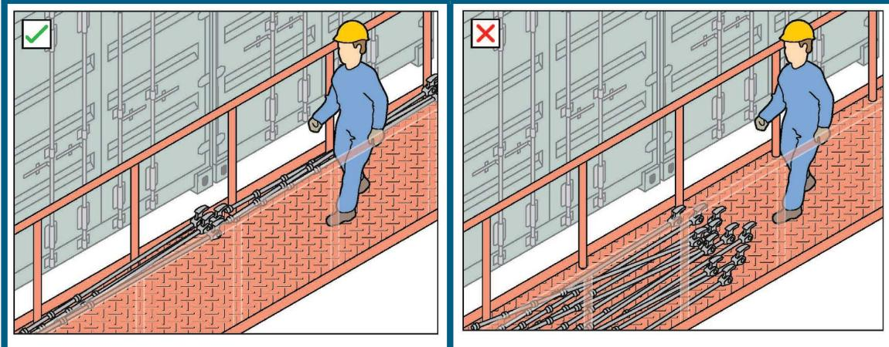
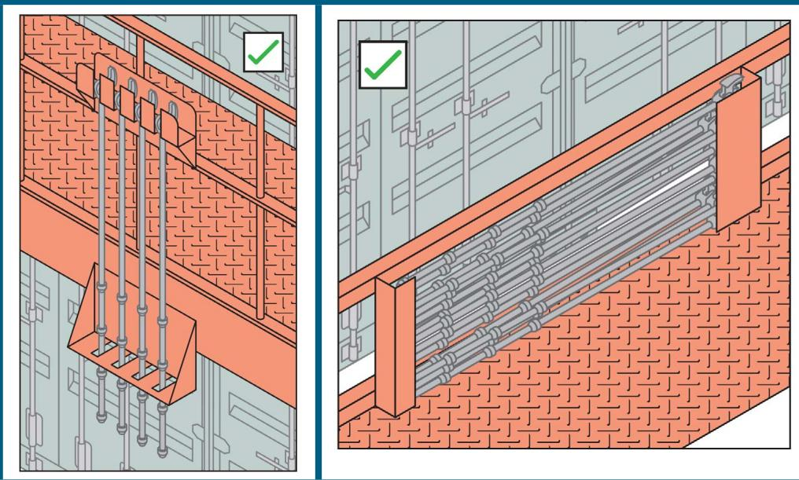

# MANAGING RISKS IN STEVEDORING

Code of Practice

DECEMBER 2016

Safe Work Australia is an Australian Government statutory agency established in 2009. Safe Work Australia consists of representatives of the Commonwealth, state and territory governments, the Australian Council of Trade Unions, the Australian Chamber of Commerce and Industry and the Australian Industry Group.

Safe Work Australia works with the Commonwealth, state and territory governments to improve work health and safety and workers' compensation arrangements. Safe Work Australia is a national policy body, not a regulator of work health and safety. The Commonwealth, states and territories have responsibility for regulating and enforcing work health and safety laws in their jurisdiction.

ISBN 978- 1- 76028- 907- 2 [PDF]  ISBN 978- 1- 76028- 908- 9 [DOCX]

# Creative Commons

Except for the logos of Safe Work Australia, SafeWork SA, WorkSafe Tasmania, WorkSafe WA, Workplace Health and Safety QLD, NT WorkSafe, Worksafe NSW, Comcare and WorkSafe ACT, this copyright work is licensed under a Creative Commons Attribution- Noncommercial 3.0 Australia licence. To view a copy of this licence, visit creativecommons.org/licenses

In essence, you are free to copy, communicate and adapt the work for non commercial purposes, as long as you attribute the work to Safe Work Australia and abide by the other licence terms.

# Contact information

Safe Work Australia  Phone: 1300 551 832  Email: info@swa.gov.au  Website: safeworkaustralia.gov.au

# FOREWORD 2

1. INTRODUCTION 41. What is stevedoring? 41.2 Who has health and safety duties for stevedoring? 41.3 What is required to manage risks associated with stevedoring operations? 51.4 Information, training, instruction and supervision 7

# 2. RISK MANAGEMENT 10

2.1 Identifying the hazards 102.2 Assessing the risks 122.3 Controlling the risks 122.4 Maintaining and reviewing control measures 13

# 3. PLANNING

3.1 Pre- arrival planning 153.2 Emergency planning 15

# 4. INSPECTIONS 17

4.1 Vessel inspections 174.2 Plant inspections 18

# 5. THE WORKING ENVIRONMENT 19

5.1 Gangways 195.2 Housekeeping 195.3 Lighting 205.4 Air quality 205.5 Weather conditions 215.6 Traffic management 215.7 Managing the risk of falls and falling objects 255.8 Noise 265.9 Managing fatigue 27

# 6. HANDLING LOADS AND CARGO

6.1 Suspended loads 286.2 Lashing and unlashing containers 296.3 Working in ships' holds 326.4 Types of cargo 336.5 Storage, storage and securing of cargo 35

# 7. PLANT AND EQUIPMENT 37

7.1 Powered mobile plant 37

7.2 Cranes 38

7.2.1 Ship- based cranes 38

7.2.2 Shore- based cranes 39

7.2.3 Crane personnel cradles or work boxes 40

7.3 Other lifting equipment 42

# APPENDIX A: Key terms 43

# APPENDIX B: Example of managing risks in stevedoring 45

APPENDIX C: Example checklist for vessel inspection - Container operations 47

APPENDIX D: Example checklist for vessel inspection - Bulk and general operations 49

This Code of Practice on managing health and safety risks in stevedoring is an approved code of practice under section 274 of the Work Health and Safety Act (the WHS Act).

An approved code of practice is a practical guide to achieving the standards of health, safety and welfare required under the WHS Act and the Work Health and Safety Regulations (the WHS Regulations).

A code of practice applies to anyone who has a duty of care in the circumstances described in the code. In most cases, following an approved code of practice would achieve compliance with the health and safety duties in the WHS Act, in relation to the subject matter of the code. Like regulations, codes of practice deal with particular issues and do not cover all hazards or risks which may arise. The health and safety duties require duty holders to consider all risks associated with work, not only those for which regulations and codes of practice exist.

Codes of practice are admissible in court proceedings under the WHS Act and Regulations. Courts may regard a code of practice as evidence of what is known about a hazard, risk or control and may rely on the code in determining what is reasonably practicable in the circumstances to which the code relates.

Compliance with the WHS Act and Regulations may be achieved by following another method, such as a technical or an industry standard, if it provides an equivalent or higher standard of work health and safety than the code.

An inspector may refer to an approved code of practice when issuing an improvement or prohibition notice.

This Code of Practice has been developed by Safe Work Australia as a model code of practice under the Council of Australian Governments' Inter- Governmental Agreement for Regulatory and Operational Reform in Occupational Health and Safety for adoption by the Commonwealth, state and territory governments.

# SCOPE AND APPLICATION

This Code provides practical guidance for persons conducting a business or undertaking on how to manage health and safety risks associated with stevedoring. This Code has been developed to support the WHS Act and Regulations and applies to all workplaces where stevedoring operations are carried out. This Code covers the loading and unloading of vessel cargo, stacking and storing on the wharf, as well as receival and delivery of cargo within a terminal or facility.

This Code should be used in conjunction with relevant Marine Orders, including Marine Order 21: Safety of navigation and emergency procedures, Marine Order 32: Cargo handling equipment, Marine Order 42: Cargo stowage and securing, Marine Order 44: Safe containers and any relevant port specific regulation like harbour master's directions.

This Code should also be read in conjunction with other codes of practice on specific hazards and control measures relevant to the stevedoring industry including:

- Code of Practice: How to manage work health and safety risks- Code of Practice: Work health and safety consultation, co-operation and co-ordination- Code of Practice: Hazardous manual tasks- Code of Practice: Managing the risk of falls at workplaces

- Code of Practice: Managing noise and preventing hearing loss at work- Code of Practice: Managing the work environment and facilities- Code of Practice: First aid in the workplace- Code of Practice: Managing risks of plant in the workplace- Code of Practice: Managing risks of hazardous chemicals in the workplace- Code of Practice: Managing electrical risks at the workplace

The International Labour Organisation (ILO) Code of Practice: Safety and Health in Ports, provides detailed information on port operations. It may be used as guidance to assist duty holders understand risks in stevedoring operations and how these risks can be managed.

# HOW TO USE THIS CODE OF PRACTICE

In providing guidance, the word 'should' is used in this Code to indicate a recommended course of action, while 'may' is used to indicate an optional course of action.

This Code also includes various references to provisions of the WHS Act and Regulations to provide context with legal requirements. These references are not exhaustive. The words 'must', 'requires' or 'mandatory' indicate legal requirements exist which must be complied with.

# 1. INTRODUCTION

# 1.1 What is stevedoring?

Stevedoring involves all activities directly connected with:

loading or unloading of vessel cargo stacking and storing on the wharf, and receiving and delivering cargo within the terminal or facility.

Stevedoring operations are diverse, comprising container terminals, bulk and general stevedoring facilities. The following table provides examples of the different type of stevedoring operations.

Table 1 Different types of stevedoring operations  

<table><tr><td>Stevedoring operations</td><td>Details</td></tr><tr><td>Containers</td><td>Loading and unloading of container cargo.</td></tr><tr><td>Roll on/roll off (RoRo)</td><td>Loading and unloading of cargo via ramp to vessel e.g. cars and bulldozers.</td></tr><tr><td>Pure car carriers (PCC)</td><td>Loading and unloading of cars only.</td></tr><tr><td>Break bulk</td><td>Loading and unloading of non-containerised cargo transported as individual pieces due to it being oversized and overweight e.g. construction equipment, oil and gas equipment, wind towers and steel</td></tr><tr><td>Bulk</td><td>A product not separately packaged but rather is loaded in bulk onto a ship e.g. grain, liquids, iron ore and coal.</td></tr><tr><td>Passenger vessels</td><td>Primary function is to carry passengers.</td></tr></table>

A list of key terms used in this Code is in Appendix A.

# 1.2 Who has health and safety duties for stevedoring?

Everyone involved in stevedoring operations has health and safety duties when carrying out the work.

A person conducting a business or undertaking (PCBU) has the primary duty under the WHS Act to ensure, so far as is reasonably practicable, that workers and other people are not exposed to health and safety risks arising from the business or undertaking. This duty includes providing and maintaining a work environment that is without risks to health and safety. In stevedoring this duty means that a PCBU must eliminate risks arising from stevedoring, or if that is not reasonably practicable, minimise the risks so far as is reasonably practicable.

In addition to the primary duty of care, the WHS Regulations include specific requirements to manage risks in areas relevant to stevedoring operations including noise, hazardous manual tasks, falls, hazardous chemicals and plant.

Duty holders include those who operate a business involved in stevedoring operations and those who have management or control of a workplace where stevedoring operations are carried out, for example ship owners and port authorities.

Designers, manufacturers, importers, suppliers and installers of plant or structures used in stevedoring operations must ensure, so far as is reasonably practicable, that the plant or structure is designed, manufactured, imported, supplied or installed without risks to health and safety.

Further guidance is available in the Guide: Safe design, manufacture, import and supply of plant.

Officers, including company directors, have a duty to exercise due diligence to ensure the business or undertaking complies with the WHs Act and Regulations. This includes taking reasonable steps to ensure the business or undertaking has and uses appropriate resources and processes to eliminate or minimise risks arising from stevedoring operations.

Workers have a duty to take reasonable care for their own health and safety and must not adversely affect the health and safety of other persons. Workers must comply with any reasonable instruction and co- operate with any reasonable policy or procedure relating to health and safety at the workplace. If personal protective equipment (PPE) is provided by the business or undertaking, workers must use it in accordance with the information, instruction and training provided.

Other people at the workplace including visitors must take reasonable care for their own health and safety and must not adversely affect the health and safety of others. They must comply, so far as they are reasonably able, with any reasonable instruction given by the PCBU to allow that person to comply with the WHs Act.

# 1.3 What is required to manage risks associated with stevedoring operations?

The WHs Regulations require a PCBU to manage risks associated with specific hazards including noise, hazardous manual tasks, falls, confined spaces, plant and electricity.

Section 2 provides guidance on how to manage the risks associated with stevedoring operations by following a systematic process involving:

identifying hazards if necessary, assessing the risks associated with these hazards implementing and maintaining risk control measures, and reviewing risk control measures.

Further guidance on the general risk management process is in the Code of Practice: How to manage work health and safety risks.

# CONSULTING WORKERS

# Section 47

A PCBU must consult, so far as is reasonably practicable, with workers who carry out work for them who are (or are likely to be) directly affected by a work health and safety matter.

# Section 48

If workers are represented by a health and safety representative, the consultation must involve that representative.

# Section 49

Consultation is required in relation to the following health and safety matters:

- when identifying hazards and assessing risks to health and safety arising from the work carried out or to be carried out by the business or undertaking;- when making decisions about ways to eliminate or minimise those risks;- when making decisions about the adequacy of facilities for the welfare of workers;- when proposing changes that may affect the health or safety of workers;- when making decisions about the procedures for  
- consulting with workers  
- resolving work health or safety issues at the workplace  
- monitoring the health of workers  
- monitoring the conditions at any workplace under the management or control of the person conducting the business or undertaking, or  
- providing information and training for workers- when carrying out any other activity prescribed by the regulations for the purposes of this section.

Consultation involves sharing of information, giving workers a reasonable opportunity to express views and taking those views into account before making decisions on health and safety matters.

Workers are entitled to take part in consultation arrangements and to be represented on work health and safety matters by a health and safety representative who has been elected to represent their work group.

In deciding how to control risks, you must consult with workers who will be affected by this decision, either directly or through their health and safety representative. Their experience may help you identify hazards and choose practical and effective control measures.

Consultation may occur through:

- general or workplace induction processes- toolbox talks- WHS committee meetings- participative risk assessment processes- phone, email or fax, and- sessions or events called for a specific purpose.

Toolbox talks can be used to provide information to and receive feedback from your workers as well as assist in raising the awareness of how stevedoring operations can be carried out in a safe and healthy manner. For example, toolbox talks may include discussions on:

- changes to the work environment that may impact on health and safety- safe working instructions for particular tasks, and- recent incidents including 'near misses' and key lessons to prevent a reoccurrence.

When using toolbox talks it is good practice to:

- keep a written record of the topic covered, attendees and feedback received- organise a program of toolbox talks to ensure workers are given sufficient opportunity to provide input into how risks should be controlled and- review the effectiveness of toolbox talks and the level of worker understanding in the discussions.

# CONSULTING, CO-OPERATING AND CO-ORDINATING ACTIVITIES WITH OTHER DUTY HOLDERS

Section 46

The WHs Act requires that where more than one person has a duty in relation to the same matter, each person with the duty must, so far as is reasonably practicable, consult, co- operate and co- ordinate activities with all other persons who have a work health and safety duty in relation to the same matter.

Stevedoring operations can involve more than one business or undertaking, each with health and safety duties. Duty holders are required to consult, co- operate and co- ordinate activities with each other. Duty holders should exchange information on planned activities and consider who is best placed to minimise or eliminate the risks.

The outcome of consulting, co- operating and co- ordinating activities with other duty holders is each duty holder understands how their activities may impact on health and safety and the actions they each take to control risks are complementary.

For example, pre- planning is completed before a vessel arriving at a terminal or facility. The stevedoring company may provide safety information and vessel inspection checklists to the ship before undertaking stevedoring operations. This gives the vessel master or their nominated representative an opportunity to co- operate with the stevedoring company to ensure the area of work is safe for the stevedores to work in and provide stevedores with information regarding safe work procedures for the ship. The stevedoring company conducts a vessel inspection upon the ship's arrival. Any safety issues are communicated to the vessel master or officer in charge. In the case of any outstanding issues, the stevedoring company or their nominated representative may meet and work with the vessel master or its nominated representative to try and resolve the issue. If the issues remain unresolved, then the stevedoring company contacts local agent or the shipping line or vessel operator to try and resolve the issue.

Further guidance on consultation is in the Code of Practice: Work health and safety, consultation, co- operation and co- ordination.

# 1.4 Information, training, instruction and supervision

The WHs Act requires a PCBU to provide relevant information, instruction, training and supervision necessary to protect all persons from risks to their health and safety arising from work carried out.

# PROVISION OF INFORMATION TO WORKERS

The information provided to workers including contractors undertaking stevedoring operations should include:

results of any relevant risk assessment information on relevant safe work procedures, and manufacturer's instructions on the safe use of plant and equipment where available.

Procedures should be in place so all workers including contractors and sub- contractors are informed of the hazards and risks involved in the activities they are about to carry out, in particular at the change of shift.

# TRAINING

Training in work health and safety helps to provide workers with the knowledge and skills to perform work activities safely and to identify hazards. Training should be provided to all workers undertaking work on the site including contractors, particularly as they may be unfamiliar with the working environment, organisational policies and work procedures.

# Training delivery plan

Workers must be consulted when making decisions about the procedures for providing work health and safety information and training. A training delivery plan may assist with the consultation process, with identification of knowledge and skills needed and timely delivery of training to address skills gaps.

If developed, a training plan should address who is to be trained, particular competencies needed, how the training will be delivered and the measures used to ensure workers have developed the necessary skills or competencies.

# Training topics

Training should be provided by a competent person. The content and methods of presenting training material should be tailored to meet the specific needs of each group. Stevedoring specific training should be relevant to the work being carried out and include:

the work health and safety duties of everyone involved in stevedoring operations the nature and extent of stevedoring hazards and risks including risk associated with the dynamic nature of the work hazard and incident reporting systems systems for reporting defects in plant or equipment used for stevedoring operations consultation arrangements safety documents, policies, procedures and plans safe work procedures including instruction on: specific cargo management use of communication systems operation of vehicles, other types of plant and associated equipment emergency and first aid procedures when and how to use PPE including the selection, fitting, proper care and maintenance of PPE other control measures

accessing health and safety information, and access, egress and security.

Workplace specific training may be delivered in a variety of ways including:

toolbox talks pre- start meetings on- the- job training one- off sessions or events for a specific purpose, and training courses.

# Training records

Training records should be kept to assist a PCBU check what training has been provided, what extra training is needed and to demonstrate compliance with WHS legislative requirements.

Training records may include training needs analysis documents, training plans, workers who have successfully completed training programs and the dates of completion, details of competency- based training completed, and copies of licences, certificates or other qualifications.

# Review of training

Training should be reviewed and where necessary updated to reflect changes associated with the nature of hazards and risks, changes to work practices or risk control measures.

Reviewing training is important in stevedoring where the workforce may change frequently and may only be employed for short periods.

# SUPERVISION

In addition to ensuring workers receive appropriate training, adequate supervision must also be provided to ensure workers, including contractors, can carry out their tasks safely. Supervisors should have the information, training and authority to competently direct and control their team's work and ensure work is done safely.

The level of supervision will depend on the nature of the hazards and risks, the experience and competence of workers and the effectiveness of existing risk control measures. High- risk or complex activities may have greater supervision requirements.

New starters or others with special needs may require more direct supervision and ongoing instructions until they can demonstrate they have the skills to perform the work safely.

# LICENCES

Some work activities, like dogging, rigging, the operation of reach stackers, forklifts and some types of cranes, require workers to hold a relevant high risk work licence under the WHS Regulations. The licence is issued by the regulator.

# Regulation 85

A PCBU must not direct or allow a worker to carry out high risk work for which a licence is required unless the person sees written evidence provided by the worker that the worker has the relevant licence for that work, or is undertaking a course of training for the licence, or has applied for the relevant licence and is awaiting a decision on that application.

# 2. RISK MANAGEMENT

Risk management is a systematic process to eliminate or minimise the potential for harm to people.

An example of the risk management process is at Appendix B.

# 2.1 Identifying the hazards

The first step in managing stevedoring risks is to find out what could potentially cause harm to people. This may be done by:

inspecting the working environment and talking to workers about how work is carried out inspecting equipment and materials used during stevedoring reading product labels and manufacturer's instruction manuals talking to manufacturers, suppliers, industry associations and health and safety specialists, and reviewing reports of incidents, injuries and dangerous occurrences.

Table 2 lists common hazards found in stevedoring workplaces, examples of when they could occur and the potential harm they can cause. Health and safety duties require a duty holder to consider all risks associated with work, not only those mentioned in this Code.

Table 2: Hazards associated with stevedoring operations  

<table><tr><td>Hazard</td><td>Examples of tasks</td><td>Potential harm</td></tr><tr><td>Hazardous manual tasks</td><td>Lashing and unlashing
Fitting or removing twist locks
Working above shoulder height</td><td>Strains and sprains
Cuts and abrasions</td></tr><tr><td>Working at height</td><td>Working near an open hatch
Accessing cargo
Climbing ladders</td><td>Falls causing disabling injury or fatality</td></tr><tr><td>Working in restricted or enclosed spaces</td><td>Working in holds
Working in between cargo</td><td>Crush injuries
Respiratory conditions
Fatalities</td></tr><tr><td>Falling objects</td><td>Working with suspended cargo or unsecured loads</td><td>Crush injuries
Fractures
Fatalities</td></tr><tr><td>Plant and equipment</td><td>Working in and around mobile plant e.g. straddle carriers, internal transfer vehicles (ITVs), reach stackers, rubber tyres, gantries (RTGs) and forklifts damaged or poorly maintained equipment like damaged ladders, electrical cables, ropes, stretched chains and defective hooks</td><td>Crush injuries
Disabling injuries
Fatalities</td></tr></table>

<table><tr><td>Hazard</td><td>Examples of tasks</td><td>Potential harm</td></tr><tr><td>Working environment</td><td>Working in extreme weather conditions
Working in holds and on deck
Working near refrigerated containers</td><td>Sunburn and skin cancer
Heat stress, strains and sprains due to slips and trips
Fumes or atmospheric contaminants</td></tr><tr><td>Electricity</td><td>Lashing next to refrigerated containers
Jump starting vehicles
Isolating equipment</td><td>Electric shock
Burns
Fatalities (electrocution)</td></tr><tr><td>Stored energy</td><td>Pressurised liquids and gases
Tensioned cable or ropes</td><td>Disabling injuries
Fatalities</td></tr><tr><td>Noise</td><td>Using noisy machinery or power tools</td><td>Hearing loss</td></tr><tr><td>Hazardous chemicals including dangerous goods</td><td>Loading and unloading hazardous cargo
Exposure to chemicals used to fumigate ship&#x27;s holds</td><td>Respiratory conditions
Burns
Skin conditions
Fatalities</td></tr><tr><td>Fire</td><td>Hot works e.g. welding or oxy-cutting
Handling combustible cargo</td><td>Burns
Smoke inhalation
Fatalities</td></tr><tr><td>Lighting</td><td>Working in inadequate light for instance in holds or at night</td><td>Slips, trips and falls</td></tr><tr><td>Failure to follow safety procedures</td><td>Using incorrect lifting gear
Not verifying safe working load
Not checking service history where required</td><td>Crush injuries
Fatalities</td></tr></table>

A number of hazards may co- exist in the workplace, for example stevedoring operations may involve being near moving parts and performing hazardous manual tasks in the presence of high noise levels.

Hazards may also change as work is carried out, for example entries and exits may become blocked preventing escape in emergencies.

# 2.2 Assessing the risks

A risk assessment involves considering what could happen if someone was exposed to a hazard- the consequence- and the likelihood of this happening. A risk assessment can help you determine:

if there is further action you should take to control the risk, and how urgently the action needs to be taken.

If you already know the risk and how to control it effectively, a risk assessment may be unnecessary. However, if circumstances or conditions change then the risk needs to be re- assessed.

Factors to consider when assessing risks from stevedoring operations include:

the type of work being performed how many people are exposed communication methods and effectiveness the suitability of vehicles and equipment for the activity e.g. ropes and lifting gear time of day and hours of work the training, experience and competence of workers the work environment, and fatigue management.

# 2.3 Controlling the risks

2.3 Controlling the risksThe ways of controlling work health and safety risks are ranked from the highest level of protection and reliability to the lowest. This ranking is known as the hierarchy of risk control. The highest level and most effective control is elimination where the hazard is completely removed. You must always aim to eliminate a hazard. If this is not reasonably practicable, you must minimise the risk by working through the other alternatives in the hierarchy.

Table 3 The hierarchy of control measures  

<table><tr><td>Level</td><td>Control</td></tr><tr><td>Level 1</td><td>Elimination - the most effective control measure is to remove the hazard or hazardous work practice. For example, eliminate the need for workers to carry out work at heights by replacing manual twist locks with automatic twist locks.
If elimination is not reasonably practicable, you must minimise the risk by following the control measures in the hierarchy below.</td></tr><tr><td rowspan="2">Level 2</td><td>Substitution - substitute the work practice or equipment with something safer. For example, substitute a hazardous chemical with a less hazardous chemical.</td></tr><tr><td>Isolation - physically separate the source of harm from people by distance or by using barriers. For example, use physical barriers to separate pedestrians from mobile plant.</td></tr></table>

<table><tr><td></td><td>Engineering controls – are physical control measures including mechanical devices or processes. For example, install guards on conveyor systems or speed limiters on forklifts.</td></tr><tr><td rowspan="2">Level 3</td><td>Administrative controls – if a risk remains, it must be minimised with administrative controls like training workers to use safe work procedures, using warning signs or arranging work to minimise the time spent near noisy machinery.</td></tr><tr><td>PPE – any remaining risk must be minimised with suitable PPE, for example by providing workers with high visibility clothing, gloves, non-slip footwear, and hearing and eye protection.</td></tr></table>

Administrative control measures and PPE do not control the hazard at the source. They rely on human behaviour and should only be used:

when there are no other practical control measures available- so as a last resort as an interim measure until a more effective way of controlling the risk can be used, and to supplement higher level control measures- as a back- up.

In many cases a combination of control measures provides the best solution.

When selecting and implementing a combination of control measures it is important to consider whether new risks might be introduced as a result and, if so, whether the combination of the control measures should be reviewed.

# 2.4 Maintaining and reviewing control measures

# Regulation 37

Control measures must be maintained so that they continue to protect workers and other people from the hazards associated with plant. The control measures must be:

fit for purpose suitable for the nature and duration of the work, and installed, set up and used correctly.

# Regulation 38

A PCBU must review and as necessary revise control measures:

when the control measure is not effective in controlling the risk before a change at the workplace that is likely to give rise to a new or different health and safety risk that the control measure may not effectively control if a new hazard or risk is identified if the results of consultation indicate that a review is necessary, and if a health and safety representative requests a review.

Reviewing the hazard and the risk controls is an important part of the risk management process. The aim is to ensure:

the implemented controls are effective and working there are no risks previously not identified

circumstances or practices have not changed that have introduced other hazards, and opportunities may now exist to manage the risk with a higher level of control.

A review can be done by using the same methods as the initial hazard identification process. Common methods include workplace inspection, consultation, and testing and analysing records and data. Reviewing the control measures also involves considering whether a higher order control measure is now reasonably practicable.

You should consult your workers and health and safety representatives as part of the review process and consider the following questions:

Are all foreseeable hazards being identified? Are the control measures working effectively in both their design and operation? Have the control measures introduced new problems? Has instruction and training provided to workers been successful? Is the frequency and severity of health and safety incidents reducing over time? If new legislation or new information has become available, does it indicate the current controls may no longer be the most effective? Have changes occurred affecting health and safety, for example has new plant or equipment been introduced? Are new procedures required?

If areas are identified for a change or improvement, review your information and make further decisions about risk control.

# 3.1 Pre-arrival planning

Stevedoring operations should be planned before the cargo arrives to identify potential hazards, assess risks and determine appropriate control measures in consultation with relevant parties. This may include the port authority, shipping agents or companies, transport companies and other duty holders in the supply chain.

In the planning stage you should consider:

- load and discharge sequences--the order of work- pre-work inspections- vessel type, cargo type e.g. heavy lifts and presentation- the length of time required to do the work- allocation of resources e.g. people, plant and skills, and- weather conditions, time of day, tide levels and surge impact.

# 3.2 Emergency planning

# EMERGENCY PLANS

# Regulation 43

A PCBU must ensure that an emergency plan is prepared for the workplace that provides for:

- emergency procedures, including:- an effective response to an emergency- evacuation procedures- notification of emergency services at the earliest opportunity- medical treatment and assistance; and- effective communication between the person authorised by the person conducting the business or undertaking to co-ordinate the emergency response and all persons at the workplace.- testing of the emergency procedures, including how often they should be tested, and- information, training and instruction to relevant workers in relation to implementing the emergency procedures.

Emergency plans should be site- specific, covered in induction training and made known to visitors.

Ship emergency plans affecting stevedoring operations should be checked during the vessel inspection and followed in an emergency. Assembly points where people can safely go in an emergency should be identified during the inspection.

Shore emergency plans should include:

- allocation of roles and responsibilities for specific actions in an emergency to people with appropriate skills, for example appointment of area wardens- access and exit for retrieval and escape including a contingency plan for alternative access and exit

safe and timely evacuation procedures e.g. evacuation checklists and procedures for assisting injured people warning systems and what to do when they activate shutting down of equipment e.g. cranes planning for drills e.g. to ensure alarms are audible to everyone fire risks and provision of firefighting and rescue equipment at appropriate locations the establishment of a reliable means of communication between workers to ensure effective evacuation of danger areas including a backup communication system in case of a failure of the primary system a readily accessible communication system to contact necessary emergency services the display of evacuation procedures in appropriate locations, and access for emergency services like ambulances.

Regular refresher training should be provided to workers and procedures established and maintained to ensure there is effective communication between ship- the vessel master- and shore- stevedores. Further information on emergency plans is in the Code of Practice: Managing the work environment and facilities. See section 7.2.2 for information on emergency procedures for cranes.

# FIRST AID ARRANGEMENTS

# Regulation 42

A PCBU must:

provide first aid equipment and ensure each worker at the workplace has access to the equipment ensure access to facilities for the administration of first aid, and ensure that an adequate number of workers are trained to administer first aid at the workplace or that workers have access to an adequate number of other people who have been trained to administer first aid.

First aid kits must be accessible at the workplace.

Further guidance on providing first aid and the contents of first aid kits is in the Code of Practice: First aid in the workplace.

# 4.1 Vessel inspections

The vessel type and condition of its equipment and gear may impact on safety.

Before commencing stevedoring operations a vessel inspection should be carried out to identify potential risks for stevedoring operations. The condition of the work area should be assessed before starting work and then monitored throughout the loading and discharge process.

Some points to consider when conducting a vessel inspection include:

working environment including access and egress cargo presentation, and condition of the ship's lifting equipment if it will be used during the work.

The use of checklists can assist in identifying hazards. Examples of checklists for container operations and bulk and general operations are provided at Appendix C and Appendix D.

Health and safety representatives and other personnel like the vessel master or their delegated representative may participate in vessel inspections.

# Section 68(2)(a)

A health and safety representative may inspect the workplace or any area where work is carried out by a worker in the work group:

at any time after giving reasonable notice to the person conducting the business or undertaking, and at any time without notice in the event of an incident or any situation involving a serious risk to health or safety emanating from an immediate or imminent exposure to a hazard.

Work procedures should support the implementation of inspections and ensure relevant follow- up actions are taken. There should be a process for dealing with unresolved issues.

# ACCESS ON BOARD SHIPS

Access routes should be checked during the vessel inspection and any issues addressed in consultation with the vessel master.

Some points to check include:

access routes are tidy, adequately illuminated and clear of obstructions hinged and pontoon hatch covers are secured to prevent them from accidentally closing during access there is sufficient space between containers to accommodate work being carried out safely, and there are two means of access where work will be carried out in a cargo space.

The ILO Code of Practice: Safety and health in ports provides detailed guidance on access on board ships.

# WORKING AREA

The vessel inspection should check housekeeping practices on the vessel including:

suitable storage areas for tools and equipment including lashing bars are identified and used loose items that may create a hazard from potential vessel movement are secured, and reefer cables have been secured before unloading to ensure no snagging of loose hanging cables.

Before lashing and unlashing, check for the following:

equipment faults including any which may affect the integrity of the fall restraint safety system, for example jagged metal on railings or containers lashing gear is undamaged and in serviceable condition outboard cells are provided with safety rails sufficient to prevent a person falling overboard railing- taut and mid- rail- is provided around open hatches and outboard cells including safety chains. Where rails are made of rope or wire ensure they are taut and in good condition, and electrical cables are stowed away from walkways wet areas, and power is disconnected in proximity to lashing activities.

# CARGO PRESENTATION

Working conditions and circumstances may change significantly during transit. The inspection should check cargo in the work area has not moved during the voyage and that lashing is secure for cargo adjacent to the work area not being discharged. Identified changes in the condition of cargo should be rectified where reasonably practicable or communicated to relevant people in other ports.

# 4.2 Plant inspections

There are specific requirements under the WHs Regulations for the inspection of plant including cargo gear and cranes- see section 7.

# Regulation 213

A person with management or control of plant at a workplace must ensure that maintenance, inspection, and if necessary testing, of plant is carried out by a competent person in accordance with manufacturer's recommendations, or if manufacturers' recommendations aren't available, in accordance with recommendations of a competent person. If it is not reasonably practicable to comply with the manufacturer's recommendations or the recommendations of a competent person, the inspection and testing must occur annually.

The inspection of plant should identify problems that may compromise its safe operation, for example wear and tear, corrosion and damaged parts.

Further information is available in the Code of Practice: Managing risks of plant in the workplace.

# 5. THE WORKING ENVIRONMENT

# Regulation 40

A PCBU must ensure, so far as is reasonably practicable, that:

the layout of the workplace allows, and is maintained to allow, persons to enter and exit the workplace and move within it safely, both under normal working conditions and in an emergency- work areas have space for work to be carried out safely- floors and other surfaces are designed, installed and maintained to allow work to be carried out safely- lighting enables each worker to carry out work safely, persons to move around safely and safe evacuation in an emergency- ventilation enables workers to carry out their work without risk to their health and safety- workers exposed to extremes of heat or cold are able to carry out work without risk to their health and safety, and- work in relation to or near essential services (such as gas, electricity, water, sewerage and telecommunications) do not affect the health and safety of persons at the workplace.

Guidance on safe access and exit for shore operations is available in the Code of Practice: Managing the work environment and facilities.

# 5.1 Gangways

Under Marine Order 21: Safety of navigation and emergency procedures the master of a ship in port must ensure there are safe means of access to the ship.

The means of access from the wharf to a vessel's deck may be provided by the vessel or the shore terminal. Gangways and walkways for access between the shore and the ship should be placed:

- so no loads pass over them- where access to it won't be obstructed, and- where it can't be struck by moving traffic on a crane track, railway track, or other route.

If this is not practical during stevedoring operations then the means of access should be supervised to ensure the above conditions are met while they are in use.

Gangways, walkways and hand rails should be in good condition and free from obstructions and residue build- up. They should remain rigged during loading and unloading.

# 5.2 Housekeeping

Housekeeping practices should be implemented to control risks on shore and on vessels. Designated storage areas should be provided for loose items, for example twist lock bins, to ensure these are correctly stored.

Goods and materials not in containers or vehicles should be kept in stable and orderly stacks or piles on firm and level surfaces.

More information about housekeeping procedures on shore is in the Code of Practice: Managing the work environment and facilities.

# 5.3 Lighting

Adequate lighting must be provided and maintained to ensure stevedoring operations can be carried out safely. Examples of lighting include external lighting towers, portable lights and crane lights.

Suitable deck and under- deck lighting on vessels should be provided for the task being carried out particularly for:

access routes including access to lifting equipment ladders providing access to the ship, and working areas on board and adjacent to the ship.

Lighting levels should provide sufficient light for night time operations as well as enabling good visibility in cargo holds, taking into account glare, reflections or shadows. If portable lighting is used on vessels, electrical cables should be protected from accidental damage and positioned to prevent trip hazards.

# 5.4 Air quality

Emissions from plant and substances in ships' holds and storage areas may create hazardous atmospheres. Where there is a likelihood of reduced air quality that may affect health and safety, for example contaminated, oxygen- deficient or explosive atmospheres, a risk assessment should be carried out and relevant control measures implemented. Control measures may include:

providing measures for detecting hazardous atmospheres providing natural or mechanical ventilation to prevent accumulation of harmful concentrations of gases, fumes, vapours and fumigants eliminating use of combustion- powered plant or equipment in poorly ventilated spaces e.g.by using electric forklift trucks managing the length of time plant is used e.g. switching off engines when not in use or limiting the number of vehicles allowed to run at one time providing access to safety data sheets (SDS) for hazardous chemicals training workers in emergency response related to hazardous atmospheres, and providing appropriate PPE like respiratory equipment and ensuring these are properly fitted, worn and maintained.

Where fumigation has been carried out, control measures include checking workers do not enter fumigated areas until these areas have been ventilated and are assessed as safe to enter.

Further guidance on managing the risks associated with contaminated or oxygen- deficient atmosphere is in the Code of Practice: Managing the risks of hazardous chemicals in the workplace.

In some circumstances a ship's hold may meet the definition of a confined space under the WHs Regulations, for example where there is a risk to health and safety from harmful concentrations of an airborne contaminant. Information on working in confined spaces is in the Code of Practice: Confined spaces.

# 5.5 Weather conditions

A risk assessment should consider how changes in weather may impact safe working practices, for example:

when operating in proximity to reefers in wet conditions in high winds or when lightning is present stability of container stacks in high winds when conditions create poor visibility in periods of extreme low or high temperatures, and during periods of high solar ultra- violet (UV) radiation.

Control measures may include:

using weather forecasts to plan activities fitting equipment and infrastructure with devices to manage the risk of lightning strike using wind speed measuring devices e.g. anemometers on plant like cranes and ceasing activities when safe levels are exceeded stacking containers so they are stable providing drinking water, appropriate breaks and shelter in extreme heat, and providing suitable PPE like wet weather gear and sun protection like a wide brim hat, long sleeved shirt, long pants, sunglasses and sunscreen.

Information about managing cranes in adverse weather conditions is in section 7.2 Cranes.

Further information about managing the risks associated with working in extremes of heat and cold is in the Code of Practice: Managing the work environment and facilities.

# 5.6 Traffic management

There is a risk of death and injury in workplaces where vehicles, mobile plant and people share the same work areas.

# Regulation 215

Persons with management or control of powered mobile plant must ensure that the risk of powered mobile plant colliding with pedestrians or other plant is controlled, so far as is reasonably practicable. If there is a possibility of collision, the powered mobile plant must have a warning device that will warn persons who may be at risk from the movement of the powered mobile plant and measures must be taken to eliminate or minimise the risk.

# VESSEL AND LANDSIDE

Where reasonably practicable the work environment should be designed so vehicles and powered mobile plant are separated from pedestrians.

When managing traffic risks in ports you should consider:

vehicle and pedestrian movements on the wharf on and off ships on decks and in cargo storage, receival and delivery areas within the terminal or facility during truck loading and unloading, reversing, queueing and parking activities controlling contractor and visitor movement at the site, and the condition of travel surfaces.

# TRAFFIC MANAGEMENT PLANS

The development of a traffic management plan assists in managing risks and communicating information about control measures.

A traffic management plan should be developed in consultation with workers. It can provide details about:

the desired flow of pedestrian and vehicle movements the expected frequency of interaction of mobile plant, vehicles and pedestrians traffic controls for each expected interaction including illustrations of the layout of barriers, walkways, signs and general arrangements to warn and guide traffic around, past, or through a work site or temporary hazard exclusion zones roles and responsibilities of people in the workplace for traffic management, and instructions or procedures associated with the control of traffic including in an emergency.

Traffic management plans should be updated to address changes in traffic movements.

More information about how to manage traffic at a workplace is in the General guide for workplace traffic management.

# COMMON USER FACILITIES

In managing common user facilities, particularly when more than one business or undertaking may be working in the same area, traffic routes for neighbouring operations should be considered to ensure different activities can be safely carried out without increasing the risk.

The common user operator should develop a traffic management plan in consultation with the relevant stakeholders working onsite. Each stevedoring company should develop its own traffic management plan.

# ROLL ON/ROLL OFF AND PURE CAR CARRIERS

A traffic management plan should be implemented to control vehicle and pedestrian movements for each entrance and exit ramp and for ramps within the vessel. Where the ramp design prevents physical separation other control measures should be used to prevent the simultaneous use of the ramp by vehicles and pedestrians.

Workers involved in the operations should be kept informed of this plan and of changes to it.

When preparing a traffic management plan for RoRo or PCC you should consider using:

traffic configurations speed limits co- ordination of RoRo activities across multiple decks management of pedestrian movement including separating pedestrians from vehicles on ramps by using separate walkways or separate access times, and management of multi- use roadways.

Before the start of RoRo operations hazardous routes or areas that could be mistaken for normal drive- on drive- off routes should be identified. These routes should then be clearly marked and barricaded. Suitable warning notices should be posted on the ramp.

A nominated person—a competent signaller or guide—should direct all vehicles being reversed or manoeuvred into stowage positions on deck.

A safe system of work should be implemented to manage the movement of vehicles on decks. This should consider vehicle speeds, restricted driver visibility, safe stowage or positioning, and whether other activities are being carried out at the same time.

A person guiding a vehicle into a final position on the vessel should wear high visibility clothing and ensure they are always visible to the driver either directly or via vehicle mirrors. Where this is not possible they must position themselves clear of the vehicle and trailer movement and away from the risk of being trapped or crushed. Before signalling a driver to proceed they must ensure it is safe to do so.

Signals for guiding drivers, like using a hand signal to indicate an emergency stop, should be agreed and understood before starting work. Only authorised people should be on deck while loading or discharging operations are being carried out and everyone should be provided with high- visibility clothing.

# TRAFFIC MOVEMENT WITHIN A TERMINAL OR FACILITY

Truck routes and loading and unloading points should be marked out or otherwise indicated.

Loading and unloading areas should be clear of other traffic, pedestrians and people not involved in the activity.

Trucks should not be loaded or unloaded in any other position without permission of the supervisor or foreman. Truck ranking should not be allowed inside the loading and unloading areas and the vehicle twist locks should be released after entry and locked before exit from the site.

Truck drivers should follow site safety rules and traffic management plans including being aware of exclusion or no- go zones when loading or unloading. Traffic management includes designating safe zones for the driver to exit the cab to allow for the release of twist locks. If there are no site rules a risk assessment should be carried out to determine the safest location for the driver and other workers.

# Movement of vehicles in cargo storage areas

Movement of vehicles in cargo storage areasWhere vehicles are used to handle cargo the area should be kept separate from pedestrians and other operations, where practicable. Barriers should be used where pedestrian routes are adjacent to stacking areas to prevent collision between equipment and people. Signs should be displayed warning unauthorised entry to the area is prohibited.

# Reversing vehicles

Where practicable, design the flow of traffic to minimise reversing. Where it is necessary to reverse vehicles, for example in RoRo activities, control measures may include:

helping drivers detect movement around the vehicle through mirrors, reversing cameras, sensors and alarms using visual warning devices like flashing lights having high- visibility markings for powered mobile plant, and ensuring the provision and use of effective communication systems e.g.between signallers and drivers and between plant operators including straddle carriers and trucks.

# Vehicles queuing and parking

Work areas should have clearly visible speed limit signs and lines showing truck queuing and vehicle parking areas. In order to control unexpected truck queuing and congestion a truck marshalling area can be used.

Private vehicles should be kept separate from stevedoring operations.

# LANDSIDE -STRADDLE CARRIERS

Straddle carriers often operate in proximity to other vehicles and pedestrians. Where straddle carriers are used you should ensure:

a straddle carrier grid is maintained for the safe movement of vehicles and loading and unloading operations, and safe areas are designated within the grid to allow safe manoeuvring of straddle carriers, other vehicles and movement of workers.

A safe system of work for the loading and unloading of trucks should be part of the traffic management plan.

# Grids

GridsLoading and unloading containers from road vehicles should be carried out on identified straddle carrier exchange grids. Grids provided for straddle carriers to load or unload containers from road vehicles should be clearly marked and not used as general waiting areas for road vehicles.

Where possible a straddle carrier should:

approach a road vehicle from the rear during loading or unloading and then leave the vehicle by moving away from the vehicle's rear, and approach a grid slot from the opposite direction of road vehicles.

Ample space should be provided for road vehicles to reverse into a slot on a grid safely if this manoeuvre is necessary. Any oversize container or problem container that cannot be handled safely at the grid should be moved to a suitable designated area where it can then be handled.

# Safe areas - vehicle drivers

A designated safe area where drivers of road vehicles can stand while containers are being lifted onto or off their vehicles should be provided and clearly marked. The safe area should be located so people in it are clearly visible to drivers of straddle carriers as they approach If the area is located between slots the size of the area should be determined for the grid layout, the width of the straddle carriers and other relevant operational factors.

When loading or unloading a road vehicle the driver should leave the cab of the vehicle and stand in a clearly marked area before the approach of a straddle carrier. This area should be forward of the cab of the vehicle, a safe distance from the vehicle and visible to the straddle carrier operator. The driver should remain in the marked area throughout the loading or unloading operation and not return to the cab until the straddle carrier has left the grid. The straddle carrier operator should not approach the grid if the driver of the truck cannot be seen.

# 5.7 Managing the risk of falls and falling objects

Working at height including accessing the hold of a ship or working on top of containers involves the risk of a fall.

# Regulation 78

A PCBU must manage the risk of a fall from one level to another that is reasonably likely to cause injury to the person or another person. Wherever reasonably practicable, the risk of a fall must be eliminated by working on the ground or on a solid construction. In this case ensure the area has:

a surface structurally capable of supporting people, material and any other loads on it barriers erected around any open penetrations an even and readily negotiable surface and gradient, and a safe means of access and egress.

# Regulation 79

If it is not reasonably practicable to work on the ground or on solid construction, a safe system of work must be provided using the following control measures in order of priority:

fall prevention devices (for example, temporary work platforms and guard railing) using a work positioning system that ensures workers work within a safe area, and implementing fall arrest systems to minimise any distance of a fall (e.g. within hold of vessel or when securing tops of containers).

Stevedoring operations where control measures for fall prevention are required include when:

accessing the ship's decks, hatchways and holds using ladders, stairs, ramps, landing stages and gangways working in the vicinity of holes or cavities on board ship e.g. near hatchways or on top of cargo where voids are created during discharge and loading working on top of containers working on equipment at an elevated height, and accessing crane cabins.

For example, if it is necessary to access the top of a container safe means of access including a work box or personnel cradle should be provided and used in accordance with section 7.2.3. If this equipment is not available, fall arrest equipment must be worn.

More information about how to manage the risks of working at heights is in the Code of Practice. Managing the risk of falls at workplaces.

# SHIP MOVEMENT AND RAMPS

Pontoons supporting shore ramps or passenger walkways should be as steady as practicable in all weather and tide conditions. They should be capable of withstanding the maximum forces to which they may be subjected during mooring. This should include likely ramp movement resulting from the local tidal movements, and ranging and drifting of the ship or pontoon at its moorings. Walkways should be designed to tolerate forces in all three planes and torsional forces. Transitional flaps at their ends should be included if necessary.

# FALLING OBJECTS

# Regulation 54

A PCBU at a workplace must manage risks to health and safety associated with an object falling on a person if the falling object is reasonably likely to injure the person.

# Regulation 55

If it is not reasonably practicable to eliminate the risk referred to in regulation 54 the person conducting the business or undertaking at a workplace must minimise the risk of an object falling on a person by providing adequate protection against the risk.

The person provides adequate protection against the risk if the person provides and maintains a safe system of work, including:

- preventing an object from falling freely, so far as is reasonably practicable, or- if it is not reasonably practicable to prevent an object from falling freely-providing, so far as is reasonably practicable, a system to arrest the fall of a falling object.

Falling objects pose a significant risk when carrying out stevedoring operations. Control measures may include:

- using the appropriate equipment to raise and lower cargo including ensuring that safe working load (SWL) is not exceeded-see section 7- stacking containers and other cargo so they are stable- providing overhead protective structures on mobile plant to protect plant operators, and- establishing exclusion zones where loads are being lifted overhead.

# 5.8 Noise

# Regulation 57

A PCBU at a workplace must manage risks to health and safety relating to hearing loss associated with noise and ensure that the noise that a worker is exposed to at the workplace does not exceed the exposure standard for noise.

# Regulation 58

A PCBU must provide audiometric testing for a worker who is carrying out work for the business or undertaking if the worker is required to frequently use personal hearing protectors as a control measure for noise that exceeds the exposure standard.

Noise monitoring provides a means of assessing noise levels and length of exposure and the data obtained can be used to determine suitable control measures to minimise the risk of hearing loss.

Noise from vehicles, engines and transmission equipment used in an enclosed space like a ship's hold may be hazardous to operators in the vicinity.

Further guidance on the noise exposure standard, control measures and audiometric testing is in the Code of Practice: Managing noise and preventing hearing loss at work.

# 5.9 Managing fatigue

Fatigue is more than feeling tired and drowsy. In a work context, fatigue is a state of mental and/or physical exhaustion which reduces a person's ability to perform work safely and effectively.

Fatigue increases the chance of workplace injuries and if prolonged can negatively affect a person's health and wellbeing.

Control measures for managing fatigue include providing workers with adequate breaks between shifts.

A fatigue management plan may be developed to help control the risks of fatigue. It may include procedures for managing:

- hours of work or shift rostering are designed to minimise fatigue, and- environmental conditions e.g. working in adverse weather contributes to fatigue and individual factors.

Workers must also co- operate with any reasonable policy or procedure relating to fatigue at the workplace, for example policies on fitness for work or second jobs.

Workers' duties in relation to fatigue do not mean they must never work extra hours. However, they should talk to their manager or supervisor to let them know when they are fatigued. They should also avoid working extra hours and undertaking safety critical tasks when they know it is likely they are fatigued.

Further information is in the Guide for managing the risk of fatigue at work.

# 6. HANDLING LOADS AND CARGO

There should be safe work procedures for loading and unloading. If the procedures do not address the hazards of the work to be carried out, then a risk assessment should be done.

# 6.1 Suspended loads

# Regulation 219

The person with management or control of plant at a workplace must ensure, so far as is reasonably practicable, that plant that is used to lift or suspend persons or things is specifically designed to lift or suspend the load. If it is not reasonably practicable to use plant that is specifically designed to lift or suspend the load, the person must ensure that the plant does not cause a greater risk to health and safety than if specifically designed plant were used.

The person must ensure that the lifting and suspending is carried out with lifting attachments that are suitable for the load being lifted or suspended, and within the safe working limits of the plant.

The person must ensure, so far as is reasonably practicable:

that no loads are suspended or travel over a person unless the plant is specifically designed for that purpose. that loads are lifted or suspended in a way that ensures that the load remains under control during the activity, and that no load is lifted simultaneously by more than 1 item of plant unless the method of lifting ensures that the load placed on each item of plant does not exceed the design capacity of the plant.

Handling suspended loads is a high risk activity and involves various plant including mobile, vessel and gantry cranes, forklifts and other specialised cargo handling equipment. A risk assessment should be carried out. Control measures for handling suspended loads may include:

implementing exclusion zones to ensure workers are clear of the active arc of suspended travel while suspended loads are being lifted or lowered, and prohibiting working or walking under suspended loads.

# COMMUNICATION

A reliable way for the crane operator and any person directing the load to communicate is essential for safe crane operation. Failure to implement reliable communication may lead to unsafe crane operations and contribute to injury to or death of people from:

dropped loads, and collision with other plant and structures.

Only one person should give signals at one time. Signals may be visual, audible or a combination of both. When more than one person is involved in directing a lift each person should understand when responsibility for their part of the lifting operation should be handed over to the other person.

Effective communication is particularly important where the crane operator cannot:

- see the load- see the load's landing area- see the path of travel of the load or the crane- make an accurate judgement of distance, and- see if the crane or the load may contact overhead electric lines.

People using communication equipment should be familiar with the manufacturer's operating instructions. When using radios a dedicated frequency should be selected for the duration of the crane operations to prevent interference with other radio equipment being used in the vicinity of the crane. Work should stop immediately if there is a loss of communication.

Further information on doggers and riggers is in section 6.4.

# PRE-SLUNG LOADS

Extra caution should be applied when working with pre- slung loads as the condition of the load and equipment may be uncertain. For example, gear may have been certified but damage may have occurred and be concealed under the load. If a ship cannot produce the required certificate your own lifting gear should be used.

The following control measures should be considered for work involving pre- slung loads:

- maintaining and documenting a system of inspection--inspection should be done by qualified personnel and completed before all gear is used- removing and appropriately tagging out of service damaged gear- implementing exclusion zones in the vicinity of the lift- providing workers with information, training and instruction to select the right gear- supplying information before a ship's arrival and including pre-operational inspections and checks as part of the general inspection regime- implementing an auditable system of certification of the SWL of gear used, and- using gear only with reference to actual marked SWL and not basing selection on colour coding.

# 6.2 Lashing and unlashing containers

Marine Order 42: Cargo stowage and securing sets out requirements for vessel masters to ensure cargo is adequately secured.

The workers who will be performing the lashing or unlashing should be provided with information and instruction, for example at a pre- shift tool box talk or a planning meeting. This may include the lashing plan. Workers who are required to work on or near the vessel must be made aware of the exclusion zone protocols.

The safety of lashing positions on ships carrying containers should be assessed during vessel inspection. Lashing activities should not be carried out if lashing positions do not provide adequate protection against falls- - see section 5.7. Any concerns should be recorded on the vessel inspection sheet and addressed before work commences.

# DURING LASHING AND UNLASHING

Workers lashing and unlashing should never work alone. If there are teams working near each other, for example one lashing and one loading, ensure effective communication is maintained between the teams, supervisors, managers and ship's crew so each team is aware what the other is doing and safe areas of work are identified. Toolbox talks can be used to inform workers at the change of shift about safety issues related to the work and reminding workers of relevant safe work procedures.

Issues to be considered in planning and undertaking lashing include the weight and length of lashing bars, obstructions, working around raised hatch lids, container size and ship configuration.

Control measures for lashing and unlashing activities may include:

- having a system of inspections- working from a stable, level base- positioning the body to keep out of reach of lashback- ensuring hatchway access covers can be pinned back- maintaining an awareness of other operations in the area including crane movements and not working within exclusion zones- ensuring at least one worker maintains control over the lashing gear when it is elevated- ensuring lashing rods are never left hanging- eliminating the practice of leaning lashing bars against containers during lashing work, where practical- using PPE suitable for the task, and- eliminating, or if not reasonably practicable, minimising double handling of lashing bars and equipment to minimise manual handling risk.

Where lashing equipment is to be re- used in the same work area it should be stored safely on the side of a walkway to minimise the risk of a trip hazard, as shown at Figure 1.

  
Figure 1 Safe storage of lashing bars to be reused

# WORKING ON TOP OF CONTAINERS

When work is carried out on top of containers this can create a risk of falls. Further information about risks of falls is in section 5.7.

When work on container tops cannot be avoided safe means of access should be provided. Wherever possible this access should be part of the ship's permanent superstructure like lashing platforms.

When such access is not possible, safe access should be provided by the use of a crane and purpose built work box or personnel cradle. Further information on crane personnel cradles or work boxes is in 7.2.3.

When work has to be carried out on container tops, suitable fall prevention or fall arrest systems of work should be devised and used in order to eliminate or control the risk of falling. Fall prevention systems include working from inside a work box or personnel cradle, or secured to a short lanyard that prevents falls from open sides of containers.

When a work box or personnel cradle is used it can be moved slowly across the top of each tier of containers while workers in it place or remove twistlocks. Communication with the crane operator should be maintained at all times to ensure safety of the workers in the work box or personnel cradle.

It may be necessary at times for workers to leave a work box or personnel cradle to go to the corners of the containers carrying equipment like twistlocks, bridging pieces or locking poles. Where this is necessary they should wear a full body harness and be connected to a secure anchorage point by lanyards, safety lines or inertia reel fall arrest equipment.

Work on top of containers should cease in highwind conditions.

# BEFORE SHIP DEPARTURE

Once lashing and unlashing activities have finished excess lashing gear should be safely secured in designated stowage compartments, where available, in accordance with the vessel master's requirements—see Figure 2 below.

  
Figure 2 Preferred storage methods for lashing bars

# 6.3 Working in ships' holds

Management of the risks associated with ships' holds includes the management of the atmosphere in a hold- see section 5.4- and the prevention of falls- see section 5.7. Workers should be provided with the relevant information, instruction and training to handle the relevant cargo safely. The work environment should be safe for plant to operate and clear of obstructions and risks of falling cargo. There should be a system to identify safe zones for workers, taking into account mobile plant that may be operating in the hold and crane operations.

This section provides further details on control measures for hatches and openings, ladders and for monitoring cargo operations in holds.

# WORKING WITH HATCHES AND OPENINGS

Hatches and openings that provide access to holds should be checked to ensure:

they are protected by coamings there is adequate clear space around the coamings to allow easy access hinged and pontoon hatch covers are secured, or removed if not adequately secured, to prevent them from accidentally closing during access approaches to a hold and an access hatch are kept unobstructed to reduce the risk of falls and to enable holds to be evacuated quickly in an emergency hatch covers are closed when the hatch is not in use to eliminate the risk of falls, and means of access includes a ladder which is clear of the hatchway through which cargo is loaded or unloaded.

Where hatch covers are raised, temporary fencing can be used as a control measure to prevent falls. Temporary fencing should be made up of:

at least two parallel rails, ropes or chains the top rail, rope or chain is at least 1 metre above the walking surface the mid rail approximately half way between the top rail and the walking surface if made of rope or chain it should be kept as taught as practicable, and fencing uprights should be no more than 2.5 metres apart.

Further information is in the Code of Practice: Managing the risk of falls at workplaces.

# Mechanically operated hatch covers

Mechanical, hydraulic or electrically powered hatch covers should only be operated by designated members of the ship's crew or other authorised people. When operating these types of hatch covers:

warn people in the vicinity of the hatch cover before the hatch is opened or closed and instruct them to move to a safe area clear people and objects from the hatch cover before it is opened, and position preventer chains or other securing devices before permitting people on top of a retracted hatch cover.

# WORKING WITH LADDERS

The ship's permanent access should be the primary means of accessing cargo holds.

Where a portable ladder is in use in a hatchway, no cargo may be loaded or unloaded through that hatchway. When using portable ladders in holds they should be:

not more than 6.5 metres long, non- extendable and in good condition placed on a firm and secure surface at an angle of between 70 and 80 degrees to the horizontal, and secured at their upper resting position which must be at least one metre below the top of the ladder or held steady while being used.

Guidance on the use of ladders for shore operations is in the Code of Practice: Managing the risk of falls at workplaces.

# MONITORING CARGO OPERATIONS

Loading or unloading by means of a crane or derrick should not be carried out unless:

the operator has an unrestricted view of the load at all times during loading or unloading, or a hatchman is employed for each crane or set of derricks who is clearly visible to the operator.

Where people are in a cargo space in connection with loading or unloading, whether or not a crane or derrick is being used, there should be a lookout who:

has a good view of the space is able to see potential hazards to the people in the space is able to communicate with the people in the space, and is tasked with warning people in the space of any perceived hazard.

The cargo space lookout may be a person with other duties, like a hatchman or the crane operator, provided the person is capable of performing the duties assigned effectively.

Loading or unloading should not be carried out in a cargo space where two or more cranes or sets of derricks are working simultaneously and separately unless:

a separate hatchman is provided for each crane or set of derricks where work is to be carried out at different levels, a net or other equivalent protection is rigged to prevent people and cargo falling from the upper level, and each hatchman is provided with a safe operating area on deck at a location that provides adequate visibility for the hatchman to carry out their function.

Further information on the use of cranes is in section 7.

# 6.4 Types of cargo

# WORKING WITH GENERAL CARGO

When handling cargo, the inspection of wires, ropes, chains and lifting gear should be carried out.

# Regulation 219 (4)(b)

The person with management or control of plant at a workplace must ensure lifting and suspending is carried out within the safe working limits of the plant.

Cargo must be handled within safe working load (SwL) limits for the plant to ensure this:

establish cargo weights and consider these when determining lifting method and equipment to be used, and identify the SwL and make sure the plant or crane operator knows the weight of the load.

A licensed dogger is required when undertaking lifts requiring judgement or where the load is not always within view of the plant operator. The dogger should assess the load before discharging and loading. Workers must hold a Dogging High Risk Work (HRW) licence to carry out dogging work.

Note: Licensed riggers have completed the Dogging unit of competency as a prerequisite to get their rigging HRW licence and are therefore able to legally carry out dogging work.

Slinging loads where judgment is not required and the load is lifted within the view of the plant operator at all times is not defined as dogging work under the WHS Regulations and a dogger is not required.

The dogger or rigger is responsible for the safe slinging and movement of the load and providing accurate directions to the crane operator on load movement to ensure crane and load stability. This includes:

communicating the weight of the load to the crane operator to help ensure the rated capacity of the crane and lifting attachments is not exceeded calculating the safe working loads of the ropes, slings, chains and other lifting accessories to be used in the lift providing the crane operator with clear and accurate directions and communicating with other people in the crane working area, and taking precautions when directing a pick- and- carry crane across rough surfaces and checking the area for other hazards.

Provisions for monitoring cargo operations are in section 6.3.

# WORKING WITH DRY BULK

Dry bulk is cargo shipped in large unpackaged amounts, for example fertilisers, grain, gravel, sand, salt, concentrates, wood chips, coal and mineral ores.

Before loading or discharge, dry bulk should be assessed for dangerous and hazardous substances. Dry bulk may consist of materials that emit dangerous gases, spontaneously combust, liquefy, develop hot spots, develop biological hazards or become unstable. Safety Data Sheets (SDSs) should be used in assessing the risks of hazardous substances.

Dust levels, wind speed and direction should be monitored to prevent risk from exposure, for example to the public, in utilities rooms and to other vessel operations. Dust types include explosive, toxic and nuisance dust. Fire risks should be identified and adequate trained personnel and equipment provided at the workplace in response.

Where access to the hold is required for unloading bulk cargo a means of escape in case of emergency is needed. Where people and mobile plant are both working in the hold they should be kept separate.

Ensure plant and equipment used for loading and unloading dry bulk, including conveyors, are fit for purpose, maintained and inspected as required.

Marine Order 33: Cargo and cargo handling - grain, Marine Order 34: Solid bulk cargoes and Marine Order 35: Additional safety measures for bulk carriers provide extra information on bulk cargo properties.

# WORKING WITH LIQUID BULK

For further information about bulk cargo including liquid bulk is in Marine Order 17: Liquefied gas carriers and chemical tankers.

# ROLL ON ROLL OFF ACTIVITIES

RoRo activities involve the loading, unloading, lashing and unlashing of wheeled cargo. Critical areas for control in RoRo operations are the management of vehicle movements and of manual tasks. Information on traffic management for RoRo is also included in section 5.6.

Whenever multiple gangs are working in the same area or at the same time, like a gang lashing and one unparking controls should be in place so one gang does not adversely impact the safety of another.

# MANUAL TASKS IN ROLL ON/ROLL OFF ACTIVITIES

# Regulation 60

A PCB/ must manage the risk of a musculoskeletal disorder associated with hazardous manual tasks.

Control measures for managing manual tasks for RoRo may include:

- using levers, ratchet binders, extension bars- having appropriate power units to jump start vehicles- using correct techniques for lashing and unlashing- rotating tasks to reduce exposure to highly repetitive manual tasks, and- ensuring lashing straps under cars are reasonably easy to get on and off.

Further guidance about managing the risks associated with hazardous manual tasks is in the Code of Practice: Hazardous manual tasks.

# LIVESTOCK

Information on loading and stowage of livestock is in Marine Order 43: Livestock cargoes.

# 6.5 Storage, stowage and securing of cargo

Cargo not in containers, for example coils, pipes and beams, should be stored or stowed in stable stacks. Cargo may be moved repeatedly during loading, discharging and storage. This may create new risks or change already identified risks. Ongoing risk management is required to ensure these risks are eliminated or minimised.

Ensure there is a plan for stacking cargo which takes into account the:

- floor capacity of the storage area- type, dimensions and weight of cargo and method of storage- potential for stored energy due to stacking arrangements

safe access and egress for workers mechanical handling equipment and ability to operate it safely exclusion zones to separate mobile plant and people storage or separation requirements of hazardous chemicals or dangerous goods length of time the goods or material will be kept, and stability and securing devices for different types of cargo.

Control measures for safe storage include:

ensuring stacks of goods remain stable- the maximum height of the stack is determined by the need to ensure the stability ensuring coils: are used with end stops in the vicinity of pedestrian walkways are supported by coil collapse arrest systems when in the vicinity of amenities or offices using racking systems where appropriate using jersey curbs using dunnage correctly including: using means other than hands to place dunnage under loads avoiding placing hands or limbs under loads during glutting using correct choking methods like: fixed chocks at the end of walkways materials used for choking and dunnage are fit for purpose and sufficient to withstand the weight of the load using bolsters at the end of walkways identifying and communicating the load bearing capacity of floors, and maintaining exclusion zones where identified.

# 7. PLANT AND EQUIPMENT

The WHs Regulations include specific duties for a PCBU with management or control of plant to manage health and safety risks associated with the plant, as well as requirements for powered mobile plant and plant that lifts or suspends loads. Information on how to meet these duties is in the Code of Practice: Managing risks of plant in the workplace.

The person conducting the business or undertaking should ensure an up- to- date register of the items of plant requiring regular inspection and maintenance is kept. It should include information on:

allocated responsibilities for people dealing with inspections standards against which plant should be inspected the frequency of inspections critical safety instructions to be followed during inspection e.g. the isolation procedure the procedures for particular types of inspections specific tests repaired or modified plant, and variations from normal operation or dangerous occurrences and any trends that may be occurring.

If maintenance or repair work is required during loading or unloading assess risks associated with the work and eliminate, or if this is not reasonably practicable, minimise these risks so far as is reasonably practicable. The risk assessment should take into account:

the safety of people who may be affected by maintenance or repair work not just those carrying out this work dangerous substances, for example noxious gases, fumes or dust noise from the repair work or that workers carrying out repairs will be exposed to, and whether the repair work is likely to obstruct, interfere with or distract workers involved in loading or unloading.

# 7.1 Powered mobile plant

Stevedoring operations include the use of powered mobile plant like mobile cranes, reach stackers, straddle carriers and forklifts.

The person with management or control of powered mobile plant at a workplace must manage risks to health and safety associated with the following:

the plant overturning things falling on the operator of the plant the operator being ejected from the plant, and the plant colliding with any person or thing mechanical failure of pressurised elements of plant that may release fluids that pose a risk to health and safety.

# 7.2 Cranes

Inspections, tests and preventative maintenance must be carried out according to the manufacturer's instructions or those of a competent person to control the risk of structural or mechanical failure, collapse and decreased safety in crane operations.

Lifting procedures should be developed to help define roles and responsibilities and ensure the crane operation is approached in a systematic way, particularly in the following situations:

heavy lifts lifting work boxes, and tandem or dual lifts.

Procedures should be implemented to enable workers to report signs of damage or defect associated with the crane.

# TANDEM OR DUAL LIFTS

# Regulation 219(7)

The person with management or control of plant at a workplace must ensure, so far as is reasonably practicable, that no load is lifted simultaneously by more than 1 item of plant unless the method of lifting ensures that the load placed on each item of plant does not exceed the design capacity of the plant.

Lifting a load with two or more cranes requires more detailed planning and supervision to control the risks. This is because the effects of the relative movement between the cranes may create extra loading on the cranes, the load and the lifting gear. Further information is in the General Guide for Cranes.

# 7.2.1 Ship-based cranes

A pre- operational inspection should be carried out for ship based cranes to check:

crane brakes, limiting devices and emergency controls are fully operational for obstructions impairing safe operation e.g. oil, debris or structures like cable trench, rollers and rail tracks the ship's gear register to ensure the gear is in compliance with Marine Orders the safety of crane access ladders or stairs including surfaces and lighting, and emergency escape provisions are provided and suitable.

For rail- mounted cranes, inspections should include ensuring:

track wheels at deck level are fitted with foot guards collision prevention devices are fitted where more than one crane is located on the same track, and locking devices on overside extensions are engaged.

Information on monitoring cargo operations during loading and unloading is in section 6.3.

# 7.2.2 Shore-based cranes

The inspection regime for shore- based cranes includes:

annual inspections routine inspections and maintenance, and pre- operational inspections.

Further guidance is in the Guide to inspecting and maintaining cranes.

# WEATHER CONDITIONS

Adverse weather conditions in which lifting operations may need to be reassessed include:

high winds lightning poor visibility due to rain, snow and fog, and significant vessel movement.

Crane operators should base their decision to make a lift on the information provided by the crane manufacturer, advice provided by competent people like a rigger or engineer and their experience as a crane operator.

Decisions may include ceasing crane operations if there is a serious risk arising from exposure to an immediate or imminent hazard, for example the possibility of the crane being struck by lightning. Any crane struck by lightning must be thoroughly examined before being returned to service.

# Securing devices

Brakes should be maintained in a safe and serviceable condition and able to prevent unpredictable movement in high wind. For example, the crane's slewing brake should be capable of holding the jib stationary, with the maximum SWL suspended at its maximum radius when a maximum in- service wind acts in the most adverse direction.

When high wind speeds are expected, secure cranes in their appropriate out- of- service condition. If this requires the raising or lowering of a jib, have a planned procedure in place to ensure there is adequate time and space to do so. Cranes secured at picket points should be travelled against the wind to the nearest picket position and the storm anchor inserted.

Rail- mounted cranes taken out- of- service in high winds should be secured using securing devices designed for the purpose, for example storm pins or bolts that can be inserted into a socket in the quay surface, rail clamps, wheel scotches and chains.

# EMERGENCY PROCEDURES

The workplace where the crane will operate must have an emergency plan with an effective response to evacuate people from the vicinity of the crane in a controlled manner. Section 3.2 has further information about emergency plans.

A reliable and effective means of communication should be established between all workers in the vicinity of the crane to permit and ensure effective evacuation from danger areas.

Contact numbers for emergency services should be prominently displayed.

Emergency procedures should be communicated to relevant workers and include information about:

- using warning systems and what to do when they sound- shutting down the crane safely- evacuating the crane and the area nearby in a controlled way- accessing and providing first aid treatment, and- using firefighting and rescue equipment and where to find it.

# 7.2.3 Crane personnel cradles or work boxes

Regulation 219(1) and (2)

Regulation 220

The person with management or control of plant at a workplace must ensure, so far as is reasonably practicable, that the plant used to lift or suspend a person or thing is specifically designed to lift or suspend the load.

Plant not specifically designed to lift or suspend a person

The person with management or control of the plant at a workplace must ensure that:

- the persons are lifted or suspended in a work box that is securely attached to the plant- the persons in the work box remain substantially within the work box while they are being lifted or suspended- if there is a risk of a person falling from a height, a safety harness is provided and worn by the person in order to prevent, so far as is reasonably practicable, injury to the person as a result of the fall, and- means are provided by which the persons being lifted or suspended can safely exit from the plant in the event of a failure in its normal operation.

Crane work boxes or personnel cradles should have:

- the SWL, bare mass, maximum number of occupants and design registration number marked on the work box or personnel cradle- gates that are inward opening only, self-closing and provided with a latch to prevent unintentional opening- fall-arrest anchorage points, and- sides not less than one metre high.

When using a crane work box or personnel cradle the crane should:

- be equipped with a secondary back-up system to prevent the load from falling if the primary lifting device fails- have a minimum rated capacity of at least twice the total load of the work box or personnel cradle and its contents- have levers and foot pedals fitted with a constant pressure system that stops the crane's motions when the operator removes pressure from the controls, and

if fitted with a free fall facility have the free fall function positively locked out to prevent inadvertent activation.

In addition to the above the service history of the crane work box or personnel cradle should be checked to ensure it is has been maintained and is safe to use.

The crane should be fitted with an emergency stop device which:

removes the energy supply to the crane and brings the crane to a complete stop when activated- is readily visible and coloured red- is easily accessible and located so the operator will not be exposed to other hazards when activating the device, and- locks in the stop position when activated and requires a manual reset.

Further information on emergency stops is in the Code of Practice: Managing risks of plant in the workplace

The braking efficiency of the hoisting drive train should be tested before the first use of a work box or personnel cradle each day by hoisting and holding a load not less than twice the maximum hoisted load of the loaded work box or personnel cradle.

When working from a work box or personnel cradle procedures should be in place to ensure:

the rated capacity of the work box or personnel cradle is not exceeded the work box or personnel cradle is not suspended over people the work box or personnel cradle is designed for the task and securely attached to the crane the work box or personnel cradle, lifting attachments and records have been inspected by a competent person and deemed safe prior to use the work box or personnel cradle is only used to lift workers and materials necessary to carry out the work the crane is suitably stabilised while the work box or personnel cradle is used the crane is not used to simultaneously raise, lower or suspend another load while the work box or personnel cradle is suspended from it the crane operator remains at the controls of the crane there is direct visual communication or other equally effective method of communication between the crane operator and personnel in work box or personnel cradle movements of the work box or personnel cradle are at slow speeds with minimum acceleration and deceleration flammable liquids and oxygen and acetylene cylinders are correctly secured and no more than the minimum quantities sufficient to carry out the work are carried if flammable liquids or gases are carried a suitable fire extinguisher is also carried workers are attached to the anchorage by a lanyard and harness unless the work box or personnel cradle is fully enclosed the work box or personnel cradle is not used in high winds or other adverse weather conditions, like electrical storms, which could affect the safety of workers personnel do not enter or leave the work box or personnel cradle when elevated except in an emergency unless:

a risk analysis shows this means of access is safer than all other alternative means the structural adequacy of the landing area has been established and the landing area is clear an appropriate work procedure has been developed and implemented for the operation

where the landing is on the edge of a structure the:

maximum gap between the work box or personnel cradle and landing does not exceed 100 mm work box or personnel cradle is secured to a suitable point on the landing, and access and egress does not take place unless a fall arrest harness is properly worn and attached to a suitable anchorage on the structure.

Information on crane work boxes is provided in the Information Sheet: Crane- lifted work boxes and the Code of Practice: Managing the risks of falls at workplaces.

# 7.3 Other lifting equipment

Lifting equipment like spreaders, slings and hooks used on shore and on board vessels to raise, suspend and lower loads should be well maintained and regularly inspected and tested. Shipboard crane maintenance records should be checked and any issues with the lifting equipment corrected before they are used.

# LOOSE GEAR FOR LIFTING

Ensure that the lifting equipment like spreader bars and beams, slings, chains and hooks is:

in serviceable condition suitable for the task and of adequate capacity for the load being lifted with an appropriate safety factor, and appropriately certified.

Developing a lifting plan which documents the control measures may assist in minimising the risk of incorrect equipment or methods being used. A rigging chart may be developed to ensure appropriate lifting techniques are used with the safest lift angles. Consider all securing methods, for example single or double wrap and chains. Specific lifting or slinging methods may be necessary to eliminate or minimise the risk of a load slipping, for example double wrap or single choke with sliding ring. Take into account the condition of equipment, including age and wear.

It is important to check the gear register and certificates relating to lifting gear, but not to rely solely on paperwork as it may be inaccurate or inadequate.

Lifting gear should be inspected by a suitably qualified person, certified and tagged.

Regular visual inspection of lifting equipment should be carried out during operation by a suitably qualified person, for example a rigger. Slings should be protected from sharp edges.

Access hatch (man- hatch) provides access for people into and out of a hold.

Break bulk means non- containerised cargo transported as individual pieces due to it being oversized and overweight e.g. construction equipment, oil and gas equipment, wind towers and steel.

Bulk means a product not separately packaged but rather is loaded in bulk onto a ship e.g. grain, liquids, iron ore and coal.

Common user means a facility where multiple operators share the same wharf, apron or vessel.

Cargo space for a vessel, means a space intended for the carriage of cargo including a trunkway or hatchway to the space.

Container operations means the loading and unloading of container cargo.

Derrick means a ship's derrick having a boom which may be raised, powered and slewed transversely while supporting a load by means of winches which either form an integral part of the arrangement or are used primarily with it.

Dogging work means work involving either the application of slinging techniques, including the selection and inspection of lifting gear, to safely sling a load; or the directing of a plant operator in the movement of a load when the load is out of the operator's view.

Dogger means someone who carries out dogging work.

Dunnage means loose wood, matting or similar material used to keep a cargo in position in a ship's hold.

Facility means a workplace where stevedoring operations are carried out including common user sites.

General cargo means cargo susceptible for loading in general, non- specialized stowage areas or standard shipping containers e.g. boxes, barrels, bales, crates, packages, bundles and pallets.

Grid means part of a container terminal to which access by road vehicles is permitted in order to deliver and collect containers from container- stacking areas. Also referred to as an interchange area.

Hatch or hatchway means an opening that provides access to a cargo space for loading or unloading.

Hatch cover means a mechanical device which allow hatches to be opened and closed.

Jersey curbs means a modular concrete barrier.

Lashing secures cargo preventing movement during transport.

Pure car carriers (PCC) means a vessel that transports cars only.

Personnel cradle means a device attached to a lifting appliance or crane for the purpose of lifting people (see also work box).

Roll on/roll off (RoRo) means loading and unloading of cargo via a ramp e.g. cars and bulldozers.

Safe Working Load (SWL) means the maximum gross load that may be safely lifted by a lifting appliance or item of loose gear in a given condition. Note: SWL may also be called 'rated load' or 'working load limit (WLL)'.

Straddle carrier means a tall, wheeled, frame type of mobile plant, wide enough to move astride a container and lift it by means of a suspended spreader, used for stacking and transferring containers.

Terminal means a maritime container terminal where containerised cargo is moved between different transport mediums for onward transportation. A typical container terminal consists of the water- side berth for docking the ships, a large paved yard for the short- term storage of containers, specialised cranes, tractors and other plant and equipment for handling the containers, and a secured gatehouse to control entry and exit of vehicles and containers.

Twist lock means a standardised rotating connector for securing shipping containers. They are primarily used for locking a container into place on a container ship, semi- trailer truck or railway container train and when lifting containers.

Work box means a personnel carrying device designed to be suspended from a crane to provide a working area for a person elevated by and working from the work box (see also personnel cradle).

Workplace means a place where work is carried out for a business or undertaking. It includes any place where a worker goes, or is likely to be, while at work. A workplace includes:

- a vehicle, vessel, aircraft or other mobile structure, and- any waters and any installation on land, on the bed of any waters or floating on any waters.

# APPENDIX B - EXAMPLE OF MANAGING RISKS IN STEVEDORING

# Example:

A general cargo vessel arrives for discharge, the vessel has pre- slung steel pipe in the hatch. The pipe is stacked approximately  $6m$  high in the hatch.

<table><tr><td></td><td>What hazards are encountered when doing the task?</td><td>What risks do these pose to the health and safety?</td><td>How are these hazards and risks controlled?</td></tr><tr><td>Handling loads</td><td>Suspended loads
Broken crane wires
Damaged slings
Damaged pre-slung wires</td><td>Crane - damaged crane wires or slings could cause cargo to fall, causing a serious injury or fatality</td><td>An assessment of the lift has been completed and the lift method and equipment has been checked by a competent person
Crane has a pre-operational inspection
Vessel to have pre-vessel inspection completed
The weight of the load is known and less than SWL of the lifting equipment
Exclusion zones established to prevent people and forklifts interacting
Pre-slung wires, lift certificates are provided
Operators of powered lifting devices are trained and competent for the equipment
Clear communication methods are maintained between ship and shore personnel</td></tr><tr><td>Manual handling</td><td>Attaching or detaching cargo to hook</td><td>Heavy chains can cause injury when attaching or detaching to crane hook</td><td>Manual handling training provided to reinforce safe lifting methods
Workers to assist each other when attaching wires and chains to crane hook</td></tr><tr><td>Working at heights</td><td>Working on top of cargo</td><td>Fall from height</td><td>Workers must be trained in working at heights procedures
Working at heights gear must be checked before use
Anchor points are checked to withstand and capable meeting the load</td></tr></table>

<table><tr><td></td><td>What hazards are encountered when doing the task?</td><td>What risks do these pose to the health and safety?</td><td>How are these hazards and risks controlled?</td></tr><tr><td>Mobile equipment</td><td>Collision mobile equipment and pedestrians</td><td>Forklift colliding with workers, causing serious injury or fatality
Trucks, moving cargo colliding with workers</td><td>Pre-operational checks are completed before equipment is operated
Equipment is only operated by licensed and competent personnel
Drivers do not use mobile phones or unauthorised electronic equipment whilst driving</td></tr><tr><td>Pedestrians</td><td>Integration with mobile plant and equipment</td><td>Forklift colliding with pedestrians
Visitors and contractors on site</td><td>Pedestrians must use marked walkways
Exclusion zones implemented on site to prevent pedestrians entering operational areas
Traffic management plans developed on site, to ensure that all stakeholders are clear on requirements on site
PPE is worn in operational areas</td></tr></table>

# APPENDIX C - EXAMPLE CHECKLIST FOR VESSEL INSPECTION - CONTAINER OPERATIONS

Vessel:

Date and time:

Inspection conducted by:

Vessel representative.

Terminal representative.

<table><tr><td>Inspection areas</td><td>Yes</td><td>No</td><td>N/A</td><td>Comments</td></tr><tr><td>1. Access and egress</td><td></td><td></td><td></td><td></td></tr><tr><td>Gangway in a suitable position, secured and netted</td><td></td><td></td><td></td><td></td></tr><tr><td>Gangway kept clear of quay cranes and not impede crane travel</td><td></td><td></td><td></td><td></td></tr><tr><td>Gangway signage in place and secure at the wharf side access point</td><td></td><td></td><td></td><td></td></tr><tr><td>Gangway kept fully lowered</td><td></td><td></td><td></td><td></td></tr><tr><td>Hatchway covers above ladders in place &amp;amp; can be secured</td><td></td><td></td><td></td><td></td></tr><tr><td>Handgrips present at top of ladder</td><td></td><td></td><td></td><td></td></tr><tr><td>Access hatches are of suitable size to access freely</td><td></td><td></td><td></td><td></td></tr><tr><td>Working space is clear of obstructions</td><td></td><td></td><td></td><td></td></tr><tr><td>Walkways are in good condition and free of obstructions, with excess lashing gear suitably stacked to remove slip and trip hazards</td><td></td><td></td><td></td><td></td></tr><tr><td>Lashing points accessible</td><td></td><td></td><td></td><td></td></tr><tr><td>Vertical ladders &amp;gt;3 m have safety hoops—bottom hoop is at least 2 m from the base of the ladder</td><td></td><td></td><td></td><td></td></tr><tr><td>Provision of safe access and egress to under deck stows</td><td></td><td></td><td></td><td></td></tr><tr><td>2. Edge protection</td><td></td><td></td><td></td><td></td></tr><tr><td>Outboard cells are provided with safety rails sufficient to prevent a person falling overboard</td><td></td><td></td><td></td><td></td></tr><tr><td>Provision of 2 parallel railings—top and mid-rail—around open hatches and outboard cells including safety chains</td><td></td><td></td><td></td><td></td></tr><tr><td>Continuous rails—rope or wire—are taut and in good condition</td><td></td><td></td><td></td><td></td></tr><tr><td>Metal stanchions are 1 m in height and no more than 2.5 m apart and secured in position</td><td></td><td></td><td></td><td></td></tr><tr><td>3. Housekeeping</td><td></td><td></td><td></td><td></td></tr><tr><td>Lifebuoy accessible and visible</td><td></td><td></td><td></td><td></td></tr><tr><td>Hazardous substance containers checked for leaks</td><td></td><td></td><td></td><td></td></tr><tr><td>Fire and emergency equipment including warning alarms functional and in suitable positions</td><td></td><td></td><td></td><td></td></tr><tr><td>4. Lashing and twistlocks</td><td></td><td></td><td></td><td></td></tr><tr><td>Lashing gear, unlashing poles, bars, spanners etc are accessible and appear to be in serviceable condition</td><td></td><td></td><td></td><td></td></tr></table>

<table><tr><td>Inspection areas</td><td>Yes</td><td>No</td><td>N/A</td><td>Comments</td></tr><tr><td>High lashing bars can be handled using appropriate manual handling technique</td><td></td><td></td><td></td><td></td></tr><tr><td>Are lashings and twistlocks of a consistent type and style</td><td></td><td></td><td></td><td></td></tr><tr><td>Are twistlocks compatible with plant and equipment</td><td></td><td></td><td></td><td></td></tr><tr><td>Bins and racks for stowage of lashing gear are provided and accessible at point of work</td><td></td><td></td><td></td><td></td></tr><tr><td>Walkways are clear of excess lashings, loose gear and other trip hazards</td><td></td><td></td><td></td><td></td></tr><tr><td>Cell guides in good condition</td><td></td><td></td><td></td><td></td></tr><tr><td>Do the 20&#x27; containers loaded on deck need to be lashed in the centres</td><td></td><td></td><td></td><td></td></tr><tr><td>Does the vessel&#x27;s container stowage and configuration—20&#x27;/40&#x27;—cause a change in the lashing and fall protection on the outboard cells regarding protective fencing</td><td></td><td></td><td></td><td></td></tr><tr><td>5. Lighting</td><td></td><td></td><td></td><td></td></tr><tr><td>Adequate lighting is provided at points of work for lashing and unloading and cargo operations</td><td></td><td></td><td></td><td></td></tr><tr><td>6. Ships gear and cranes</td><td></td><td></td><td></td><td></td></tr><tr><td>Inspection and maintenance logs kept and available for wires and lifting gear, only where applicable e.g. chains, slings</td><td></td><td></td><td></td><td></td></tr><tr><td>Ships crane stowed to waterside and boom below the top of crane pedestal—only where required</td><td></td><td></td><td></td><td></td></tr><tr><td>Slings for pre slung cargo are accessible with SWL displayed</td><td></td><td></td><td></td><td></td></tr><tr><td>7. Reefers</td><td></td><td></td><td></td><td></td></tr><tr><td>Cables are stowed away clear of walkways and work areas</td><td></td><td></td><td></td><td></td></tr><tr><td>Power can be isolated at the board in vicinity to lashing activities</td><td></td><td></td><td></td><td></td></tr><tr><td>Reefer cables of import boxes are unplugged &amp;amp; rolled up by crew and placed in storage compartment of container before discharge</td><td></td><td></td><td></td><td></td></tr><tr><td>8. Notice of deficiency</td><td></td><td></td><td></td><td></td></tr><tr><td>Outstanding Notice of Deficiencies—attach copy</td><td></td><td></td><td></td><td></td></tr></table>

# APPENDIX D - EXAMPLE CHECKLIST FOR VESSEL INSPECTION - BULK AND GENERAL OPERATIONS

<table><tr><td colspan="4">Facility Name:</td></tr><tr><td>Vessel Name:</td><td>Date:</td><td>Time:</td><td></td></tr><tr><td colspan="4">Name of Person Responsible for Inspection:</td></tr><tr><td colspan="4">Signature:</td></tr></table>

<table><tr><td>Item</td><td></td><td>Yes</td><td>No</td><td>Comment</td></tr><tr><td>1</td><td>Safe access from wharf to vessel</td><td>□</td><td>□</td><td></td></tr><tr><td>2</td><td>Safe onboard access, clear alleyways to and from work areas</td><td>□</td><td>□</td><td></td></tr><tr><td>3</td><td>Safe access to cargo gear operating areas</td><td>□</td><td>□</td><td></td></tr><tr><td>4</td><td>Safety rails rigged in work areas and lashing platforms</td><td>□</td><td>□</td><td></td></tr><tr><td>5</td><td>Confirmation ships gear conforms with Marine Orders</td><td>□</td><td>□</td><td>a) Date last four or five yearly: 
(Indicate four or five as applicable) Surveying Authority:
b) Date Last Annual:
c) Random Gear Item Check</td></tr><tr><td>6</td><td>Are fire hoses and firefighting equipment on board and ready with international shore connection</td><td>□</td><td>□</td><td></td></tr><tr><td>7</td><td>Work spaces are adequately ventilated and atmosphere is safe</td><td>□</td><td>□</td><td></td></tr><tr><td>8</td><td>Information has been provided on hazardous or dangerous goods cargos and confirmation this cargo is intact with no flammable or toxic spillage</td><td>□</td><td>□</td><td></td></tr><tr><td>9</td><td>Confirmation an adequate mooring watch will be maintained</td><td>□</td><td>□</td><td></td></tr><tr><td>10</td><td>Confirmation of emergency procedures</td><td>□</td><td>□</td><td></td></tr><tr><td>11</td><td>Vessel and wharf operational areas adequately lit</td><td>□</td><td>□</td><td></td></tr><tr><td>12</td><td>Agreement regarding order of load, discharge and cargo placement</td><td>□</td><td>□</td><td></td></tr><tr><td>13</td><td>Specific advice regarding abnormal stow conditions or special requirements e.g. lashing, tomming off, dunnaging, glutting, securing requirements</td><td>□</td><td>□</td><td></td></tr></table>

<table><tr><td>Item</td><td></td><td>Yes</td><td>No</td><td>Comment</td></tr><tr><td>14</td><td>Vessel advised of person responsible for stevedoring operations, contact numbers, structure and allocation of workforce</td><td>□</td><td>□</td><td></td></tr><tr><td>15</td><td>Start with and maintain a clear and uncluttered wharf face operational area</td><td>□</td><td>□</td><td></td></tr><tr><td>16</td><td>Confirm machinery to be used onboard and on wharf for practicality and suitability</td><td>□</td><td>□</td><td></td></tr><tr><td>17</td><td>Stevedoring equipment to be used, with specific consideration given to suitability, condition and SWL of skings and rigs. This includes consideration of ship and shore gear SWL in regard of lifts to be taken</td><td>□</td><td>□</td><td></td></tr><tr><td>18</td><td>Establish traffic flow patterns to deliver cargo, or remove cargo from the wharf landing area—under hook. Crossing of machinery paths shall be minimised and controlled. Ensure traffics way are clear and unobstructed</td><td>□</td><td>□</td><td></td></tr><tr><td>19</td><td>Wharf landing area—under hook—prepared with appropriate gluts, landing platforms or safe means by which cargo is positioned before slinging or unslinging</td><td>□</td><td>□</td><td></td></tr><tr><td>20</td><td>Stevedoring personnel equipped with the skills necessary to carry out the intended operation and fitted out with the appropriate PPE</td><td>□</td><td>□</td><td></td></tr><tr><td>21</td><td>Stevedoring personnel have a clear understanding of gear and rigs to be used and how cargo is slung or unslung</td><td>□</td><td>□</td><td></td></tr><tr><td>22</td><td>In the case of bulk cargoes, wharf face personnel will have clear instructions regarding cargo received e.g. backing trucks loaded with coal into dump bins before lifting on board or delivery e.g. operating a hopper to load product into a truck</td><td>□</td><td>□</td><td></td></tr><tr><td>23</td><td>Have wharf face operations been assessed and barricades established separating operational aspects to maintain safe work areas</td><td>□</td><td>□</td><td></td></tr></table>

THIS CODE OF PRACTICE PROVIDES PRACTICAL GUIDANCE FOR PERSONS CONDUCTING A BUSINESS OR UNDERTAKING ON HOW TO MANAGE HEALTH AND SAFETY RISKS ASSOCIATED WITH STEVEDORING.