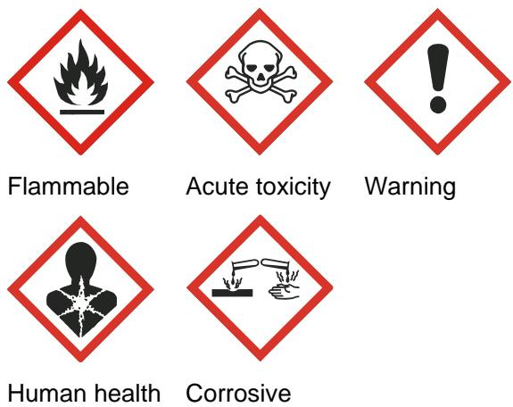
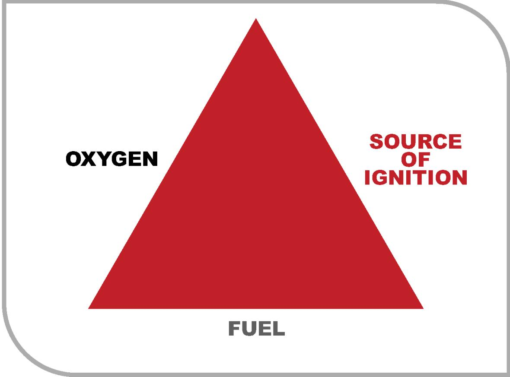
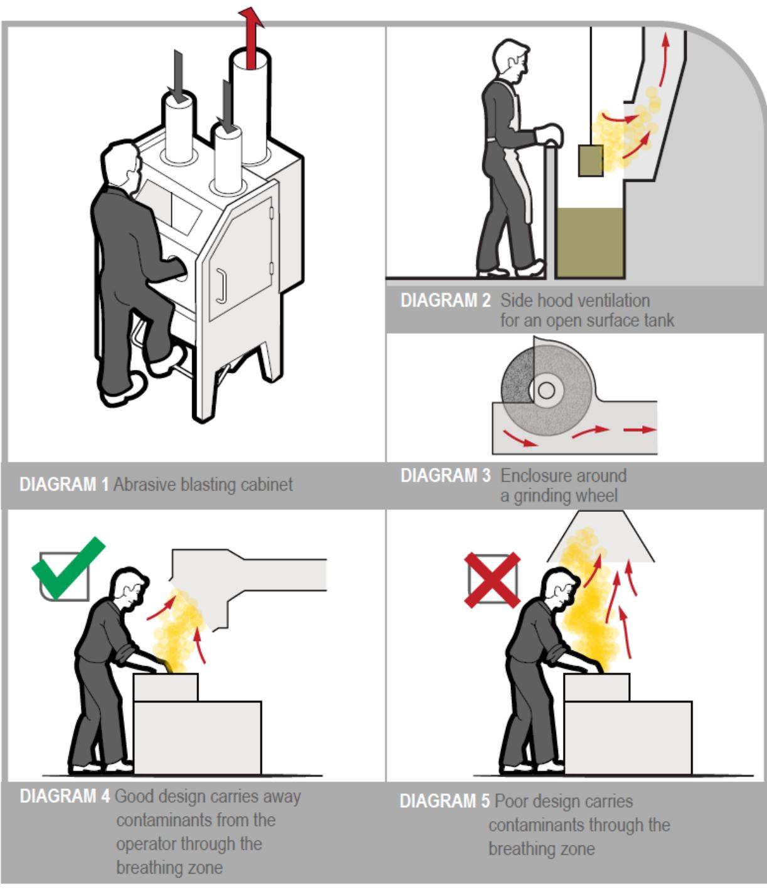
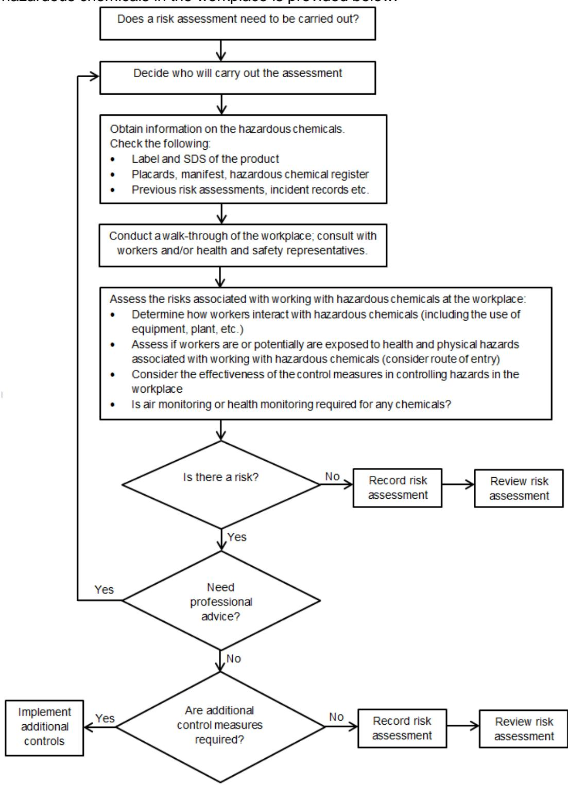

# Managing risks of hazardous chemicals in the workplace

Code of Practice

# Disclaimer

Safe Work Australia is an Australian Government statutory body established in 2009. Safe Work Australia includes Members from the Commonwealth, and each state and territory, Members representing the interests of workers and Members representing the interests of employers.

Representing the interests of employers.

Safe Work Australia works with the Commonwealth, state and territory governments to improve work health and safety and workers' compensation arrangements. Safe Work Australia is a national policy body, not a regulator of work health and safety. The Commonwealth, states and territories have responsibility for regulating and enforcing work health and safety laws in their jurisdiction.

ISBN 978- 0- 642- 78335- 6 (PDF)  ISBN 978- 0- 642- 78336- 3 (DOCX)

# Creative Commons

This copyright work is licensed under a Creative Commons Attribution- Noncommercial 4.0 International licence. To view a copy of this licence, visit creativecommons.org/licenses In essence, you are free to copy, communicate and adapt the work for non- commercial purposes, as long as you attribute the work to Safe Work Australia and abide by the other licence terms.

Safe Work Australia | info@swa.gov.au | www.swa.gov.au

# Contents

# Foreword 5

# 1. Introduction 7

1.1. What are hazardous chemicals? 7  1.2. Who has health and safety duties in relation to hazardous chemicals? 8  1.3. What is required to manage the risks associated with hazardous chemicals? 10  1.4. Prohibited and restricted hazardous chemicals 12  1.5. Exposure standards 12  1.6. Preparing a register and manifest of hazardous chemicals 13

# 2. Identifying hazards. 15

2.1. How to identify which chemicals are hazardous 15  2.2. Safety Data Sheets (SDS) 16  2.3. Labels 19  2.4. Other sources of information 20

# 3. The risk management process. 21

3.1. Decide who should do the assessment 21  3.2. Decide what sort of risk assessment is appropriate 22  3.3. Things to consider in assessing health risks 24  3.4. How to assess physical risks 27

# 4. Controlling risks. 34

4.1. The hierarchy of control measures 34  4.2. Specific control measures 41  4.3. Maintaining control measures 46  4.4. Providing information, training, instruction and supervision 48

# 5. Monitoring and review. 50

5.1. Health monitoring 50  5.2. Reviewing control measures 51

# 6. Emergency preparedness. 53

6.1. Emergency plan 53  6.2. Emergency equipment and safety equipment 55  6.3. Fire protection systems 56  6.4. Monitors and alarms 57  6.5. Automatic sprinkler systems 57  6.6. Water supply 58

# Appendix A—Glossary. 59

Appendix B—Comparison of hazard classes and categories under the ADG Code and the GHS 63

Appendix C—Prohibited carcinogens, restricted carcinogens and restricted hazardous chemicals. 66Appendix D—Placard and manifest quantities. 70Appendix E—Requirements for health monitoring. 78Appendix F—Overview of a risk assessment process. 81Appendix G—Risk assessment checklist. 82Appendix H—Examples of common fuel and oxygen sources. 84Appendix I—Fire and explosion risks. 86Appendix J—Practical examples of control measures. 90Appendix K—Case studies. 97Amendments. 114

# Foreword

This Code of Practice on how to manage the risks associated with hazardous chemicals in the workplace is an approved code of practice under section 274 of the Work Health and Safety Act (the WHS Act).

An approved code of practice provides practical guidance on how to achieve the standards of work health and safety required under the WHS Act and the Work Health and Safety Regulations (the WHS Regulations) and effective ways to identify and manage risks.

A code of practice can assist anyone who has a duty of care in the circumstances described in the code of practice. Following an approved code of practice will assist the duty holder to achieve compliance with the health and safety duties in the WHS Act and WHS Regulations, in relation to the subject matter of the code of practice. Like regulations, codes of practice deal with particular issues and may not cover all relevant hazards or risks. The health and safety duties require duty holders to consider all risks associated with work, not only those for which regulations and codes of practice exist.

Codes of practice are admissible in court proceedings under the WHS Act and WHS Regulations. Courts may regard a code of practice as evidence of what is known about a hazard, risk, risk assessment or risk control and may rely on the code in determining what is reasonably practicable in the circumstances to which the code of practice relates. For further information see the Interpretive Guideline: The meaning of 'reasonably practicable'.

Compliance with the WHS Act and WHS Regulations may be achieved by following another method if it provides an equivalent or higher standard of work health and safety than the code.

An inspector may refer to an approved code of practice when issuing an improvement or prohibition notice.

# Scope and application

This Code is intended to be read by a person conducting a business or undertaking (PCBU). It provides practical guidance to PCBUs on how to manage health and safety risks associated with hazardous chemicals used in their workplace.

A PCBU can be a manufacturer, importer or supplier of hazardous chemicals, or a business owner who uses, handles, generates or stores hazardous chemicals at their workplace. They may also be more than one of these things.

This Code may be a useful reference for other persons interested in the duties under the WHS Act and WHS Regulations.

This Code applies to all types of work and all workplaces covered by the WHS Act.

This Code applies to:

- substances, mixtures and articles used, handled, generated or stored at the workplace which are defined as hazardous chemicals under the WHS Regulations- the generation of hazardous chemicals from work processes, for example toxic fumes released during welding.

This Code does not apply to the transportation of dangerous goods or explosives which are subject to state and territory laws based on the requirements under the Australian Code for the Transport of Dangerous Goods by Road and Rail (ADG Code) and the Australian Code for the Transport of Explosives by Road and Rail 3rd edition. Most substances and mixtures that are dangerous goods under the ADG Code are also hazardous chemicals. Any person

conducting a business or undertaking (PCBU) has a responsibility under WHS laws to manage the risks from hazardous chemicals, including those that are also dangerous goods.

Manufacturers, importers or suppliers of hazardous chemicals that are used, or are likely to be used, in workplaces should refer to the following Codes of practice:

- Preparation of safety data sheets (SDS) for hazardous chemicals, and- Labelling of workplace hazardous chemicals.

A PCBU who uses, handles or stores hazardous chemicals listed in Schedule 14 of the WHS Regulations should also refer to the Safe Work Australia Guidance materials for health monitoring.

A PCBU who operates a licensed major hazard facility or uses, handles or stores hazardous chemicals at or above 10 per cent of the prescribed threshold quantities in Schedule 15 of the WHS Regulations should also refer to the Safe Work Australia Guidance materials for major hazard facilities.

Guidance for work involving asbestos or asbestos- containing materials is available in the following Codes of practice:

- How to manage and control asbestos in the workplace, and- How to safely remove asbestos.

Implementation of the Globally Harmonized System of Classification and Labelling of Chemicals (GHS)

The WHS Regulations implement a system of chemical hazard classification, labelling and SDS requirements based on the 7th revised edition of the Globally Harmonized System of Classification and Labelling of Chemicals (GHS). Transition to the GHS occurred over a five- year period from 1 January 2012 until 31 December 2016.

How to use this Code of Practice

This Code includes references to the legal requirements under the WHS Act and WHS Regulations. These are included for convenience only and should not be relied on in place of the full text of the WHS Act or WHS Regulations. The words 'must', 'requires' or 'mandatory' indicate a legal requirement exists that must be complied with.

The word 'should' is used in this Code to indicate a recommended course of action, while 'may' is used to indicate an optional course of action.

# 1. Introduction

# 1.1. What are hazardous chemicals?

Under the WHs Regulations, a hazardous chemical is any substance, mixture or article that satisfies the criteria of one or more hazard classes in the Globally Harmonized System of Classification and Labelling of Chemicals (GHS), as modified by Schedule 6 of the WHS Regulations. However, some hazard classes and categories of the GHS are excluded by the WHS Regulations. See Appendix A for the definition of hazardous chemical' and other terms used in this Code.

Most substances, mixtures, and articles that are dangerous goods under the Australian Code for the Transport of Dangerous Goods by Road and Rail (ADG Code) are hazardous chemicals, except those that have only radioactive hazards (class 7 dangerous goods), infectious substances (division 6.2) and most class 9 (miscellaneous) dangerous goods.

A comparison of dangerous goods classifications under the ADG Code with those under the GHS is provided in Appendix B.

In relation to chemicals, a hazard is a set of intrinsic properties of the substance, mixture, article or process that may cause adverse effects to organisms or the environment. There are two broad types of hazards associated with hazardous chemicals which may present an immediate or long- term injury or illness to people. These are:

Health hazards- These are properties of a chemical that cause adverse health effects. Exposure usually occurs through inhalation, skin contact or ingestion. Adverse health effects can be acute (short term) or chronic (long term). Typical acute health effects include headaches, nausea or vomiting and skin corrosion, while chronic health effects include asthma, dermatitis, nerve damage or cancer. Examples of chemicals with health hazards include toxic chemicals (poisons), carcinogens (cancer- causing chemicals) and reproductive toxins (chemicals which may cause infertility or birth defects). Physical hazards- These are properties of a chemical that can result in immediate injury to people or damage to property. They arise through inappropriate handling or use and can often result in injury to people and/or damage to property as a result of the intrinsic physical hazard. Examples of physical hazards include flammable, corrosive, explosive, chemically- reactive and oxidising chemicals.

Many chemicals have properties that make them both health and physical hazards.

# 1.2. Who has health and safety duties in relation to hazardous chemicals?

Duty holders who have a role in managing the risks of hazardous chemicals include:

persons conducting a business or undertaking (PCBUs) designers, manufacturers, importers, suppliers and installers of plant, substances or structures, and officers.

Workers and other persons at the workplace also have duties under the WHs Act, such as the duty to take reasonable care for their own health and safety at the workplace.

A person can have more than one duty and more than one person can have the same duty at the same time.

Early consultation and identification of risks can allow for more options to eliminate or minimise risks and reduce the associated costs.

# Person conducting a business or undertaking

# WHS Act Section 19

Primary duty of care

Under the WHS Act, a person conducting a business or undertaking (PCBU) has the primary duty to ensure, so far as is reasonably practicable, that the health and safety of workers and other persons are not put at risk from work carried out as part of the conduct of the business or undertaking. This includes ensuring the safe use, handling and storage of substances.

A PCBU must eliminate risks arising from hazardous chemicals in the workplace, or if that is not reasonably practicable, minimise the risks so far as is reasonably practicable.

PCBUs have a duty to consult workers about work health and safety and may also have duties to consult, cooperate and coordinate with other duty holders.

# WHS Regulations Part 7.1

Hazardous Chemicals

The WHS Regulations include a number of specific duties for a PCBU to manage the risks to health and safety associated with using, handling, generating and storing hazardous chemicals at a workplace. The duties include:

correct labelling of containers and pipework, using warning placards and outer warning placards and displaying of safety signs maintaining a register and manifest (where relevant) of hazardous chemicals and providing notification to the regulator of manifest quantities if required identifying risk of physical or chemical reaction of hazardous chemicals and ensuring the stability of hazardous chemicals ensuring that exposure standards are not exceeded provision of health monitoring to workers provision of information, training, instruction and supervision to workers provision of spill containment system for hazardous chemicals if necessary obtaining the current safety data sheet (SDS) from the manufacturer, importer or supplier of the chemical and making the SDS readily available to workers

controlling ignition sources and accumulation of flammable and combustible substances provision and availability of fire protection, firefighting equipment, emergency equipment and safety equipment preparing an emergency plan, and if the quantity of a class of hazardous chemical at a workplace exceeds the manifest quantity for that hazardous chemical, providing a copy of the emergency plan to the primary service organisation stability and support of containers for bulk hazardous chemicals including pipework and attachments decommissioning of underground storage and handling systems notifying the regulator as soon as practicable of abandoned tanks in certain circumstances.

These duties under the WHs Regulations do not apply to some hazardous chemicals at the workplace in certain circumstances. These circumstances are listed in regulation 328 of the WHS Regulations, and include:

hazardous chemicals and explosives being transported if the transport is regulated under another safety law hazardous chemicals in batteries when incorporated in plant hazardous chemicals in portable firefighting or medical equipment for use in a workplace potable liquids that are consumer products at retail premises food and beverages within the meaning of the Food Standards Australia New Zealand Food Standards Code that are in a package and form intended for human consumption tobacco or products made of tobacco therapeutic goods within the meaning of the Therapeutic Goods Act 1989 (Commonwealth) at the point of intentional intake by or administration to humans veterinary chemical products within the meaning of the Agricultural and Veterinary Chemicals Code Act at the point of intentional administration to animals.

The WHs Regulations contain prohibitions or restrictions on certain hazardous chemicals (for example certain carcinogens) except in specified circumstances and a restriction on the age of a person who can supply hazardous chemicals.

There are also duties relating to the building, operation and management of pipelines used for the transfer of hazardous chemicals.

Designers, manufacturers, importers and suppliers of hazardous chemicals

# WHS Act Part 2 Division 3

Further duties of persons conducting businesses or undertakings

Designers, manufacturers, importers and suppliers of substances must also ensure, so far as is reasonably practicable, that the substance they design, manufacture, import or supply is without risks to health and safety. This duty includes carrying out testing and analysis as well as providing specific information about the substance. Under the WHS Regulations, manufacturers and importers must correctly classify hazardous chemicals.

# WHS Regulations Part 7.1 Division 2

Obligations relating to safety data sheets and other matters

The WHs Regulations also impose duties on importers, manufacturers and suppliers relating to the preparation of SDS, the disclosure of ingredients, packing, labelling and supply of hazardous chemicals.

# Officers

# WHS Act section 27

Duty of officers

Officers, for example company directors, have a duty to exercise due diligence to ensure the PCBU complies with the WHs Act and WHS Regulations. This includes taking reasonable steps to ensure the business or undertaking has and uses appropriate resources and processes to eliminate or minimise risks that arise from hazardous chemicals at the workplace. Further information on who is an officer and their duties is available in the Interpretive Guideline: The health and safety duty of an officer under section 27.

# Workers

# WHS Act section 28

Duties of workers

Workers have a duty to take reasonable care for their own health and safety and to not adversely affect the health and safety of other persons. Workers must comply with reasonable instructions, as far as they are reasonably able, and cooperate with reasonable health and safety policies or procedures that have been notified to workers. If personal protective equipment (PPE) is provided by the business or undertaking, the worker must so far as they are reasonably able, use or wear it in accordance with the information and instruction and training provided.

# Other persons at the workplace

# WHS Act Section 29

Duties of other persons at the workplace

Other persons at the workplace, like visitors, must take reasonable care for their own health and safety and must take reasonable care not to adversely affect other people's health and safety. They must comply, so far as they are reasonably able, with reasonable instructions given by the PCBU to allow that person to comply with the WHS Act.

# 1.3. What is required to manage the risks associated with hazardous chemicals?

This Code provides guidance on how to manage the risks associated with hazardous chemicals in the workplace using the following systematic process:

Identify hazards- find out what could cause harm

Assess risks, if necessary- understand the nature of the harm that could be caused by the hazard, how serious the harm could be and the likelihood of it happening. This step may not be necessary if you are dealing with a known risk with known controls Eliminate risks so far as is reasonably practicable Control risks- if it is not reasonably practicable to eliminate the risk, implement the most effective control measures that are reasonably practicable in the circumstances in accordance with the hierarchy of control measures, and ensure they remain effective over time Review control measures to ensure they are working as planned.

# Hierarchy of control measures

The WHs Regulations require duty holders to work through the hierarchy of control measures when managing certain risks; however, it can be applied to any risk. The hierarchy ranks control measures from the highest level of protection and reliability to the lowest. You must, so far as is reasonably practicable:

first, eliminate risks by eliminating hazards; this is the most effective control measure then substitute hazards with something safer, isolate hazards from people and/or use engineering controls to minimise any risks that have not been eliminated then use administrative controls to minimise any remaining risks, and then use personal protective equipment (PPE) to minimise any risks that remain.

The control measures you apply may change the way work is carried out. In these situations, you must consult your workers and develop safe work procedures, and provide your workers with training, instruction, information and supervision on the changes.

Further guidance on the risk management process and the hierarchy or control measures is in the Code of Practice: How to manage work Health and safety risks.

# Consulting with workers

# WHS Act section 47

Duty to consult workers

A PCBU must consult, so far as is reasonably practicable, with workers who carry out work for the business or undertaking and who are (or are likely to be) directly affected by a health and safety matter.

This duty to consult is based on the recognition that worker input and participation improves decision- making about health and safety matters and assists in reducing work- related injuries and disease.

The broad definition of a 'worker' under the WHS Act means a PCBU must consult, so far as is reasonably practicable, with contractors and subcontractors and their employees, on- hire workers, outworkers, apprentices, trainees, work experience students, volunteers and other people who are working for the PCBU and who are, or are likely to be, directly affected by a health and safety matter.

Workers are entitled to take part in consultations and to be represented in consultations by a health and safety representative who has been elected to represent their work group.

Consulting, cooperating and coordinating activities with other duty holders

# WHS Act section 46

Duty to consult with other duty holders

The WHs Act requires a PCBU to consult, cooperate and coordinate activities with all other persons who have a work health or safety duty in relation to the same matter, so far as is reasonably practicable.

There is often more than one business or undertaking involved when working with hazardous chemicals, that may each have responsibility for the same health and safety matters, either because they are involved in the same activities or share the same workplace.

In these situations, each duty holder should exchange information to find out who is doing what and work together in a cooperative and coordinated way so risks are eliminated or minimised so far as is reasonably practicable.

For example if you engage a contractor to carry out work that involves the use of hazardous chemicals you should consult with other duty holders on site to ensure they are aware of the chemical use and cooperate with each other to ensure that each of their activities do not create risks for workers on the site.

Further guidance on consultation is available in the Code of Practice: Work health and safety consultation, cooperation and coordination.

# 1.4. Prohibited and restricted hazardous chemicals

1.4. Prohibited and restricted hazardous chemicalsThe WHs Regulations prohibit or restrict the use, storage or handling of certain hazardous chemicals in certain situations. For example, substances containing arsenic must not be used in spray painting or abrasive blasting, while a number of carcinogens such as 4- nitro diphenyls are prohibited from all uses except for genuine research or analysis authorised by the regulator. Certain chemicals can be used, handled or stored in the workplace after receiving approval from the regulator. Schedule 10 of the WHS Regulations provides further information on the hazardous chemicals that are restricted or prohibited for use (see Appendix C of this Code).

# 1.5. Exposure standards

# WHS Regulation 49

Ensuring exposure standards for substances and mixtures not exceeded

A PCBU must ensure that no person at the workplace is exposed to a substance or mixture in an airborne concentration that exceeds the relevant exposure standard for the substance or mixture.

Exposure standards represent the airborne concentration of a particular substance or mixture that must not be exceeded. There are three types of exposure standard:

8- hour time- weighted average: the average airborne concentration of a particular substance permitted over an eight- hour working day and a five- day working week, peak limitation: a maximum or peak airborne concentration of a particular substance determined over the shortest analytically practicable period of time which does not exceed 15 minutes, and

short term exposure limit: the time- weighted maximum average airborne concentration of a particular substance permitted over a 15- minute period.

Exposure standards are based on the airborne concentrations of individual substances that, according to current knowledge, should neither impair the health of, nor cause undue discomfort to, nearly all workers. They do not represent a fine dividing line between a healthy and unhealthy work environment.

Chemicals with workplace exposure standards are listed in the Workplace Exposure Standards for Airborne Contaminants. These exposure standards are also available from the Hazardous Chemical Information System (HCIS) on the Safe Work Australia (SWA) website. The HCIS database contains additional information and guidance for many substances. Although exposure standards may also be listed in Section 8 of the SDS, you should always check the Workplace Exposure Standards for Airborne Contaminants or HCIS to be certain.

Guidance on interpreting exposure standards is available in the Guidance on the Interpretation of Workplace Exposure Standards for Airborne Contaminants.

To comply with the WHs Regulations, monitoring of workplace contaminant levels for chemicals with exposure standards may need to be carried out.

# 1.6. Preparing a register and manifest of hazardous chemicals

# WHS Regulation 346

Hazardous chemicals register

A PCBU must ensure that a register of hazardous chemicals at the workplace is prepared and kept up to date. The register must be readily accessible to workers involved in using, handling or storing hazardous chemicals and to anyone else who is likely to be affected by a hazardous chemical at the workplace.

The register is a list of the product names of all hazardous chemicals used, handled or stored at the workplace accompanied by the current SDS for each hazardous chemical listed. It must be updated as new hazardous chemicals are introduced to the workplace or when the use of a particular hazardous chemical is discontinued.

More information about hazardous chemical registers can be found in the Hazardous Chemical Register Fact Sheet.

# Manifest of Schedule 11 hazardous chemicals

# WHS Regulation 347

Manifest of hazardous chemicals

A PCBU must prepare a manifest of Schedule 11 hazardous chemicals at the workplace.

A manifest is different from a register. A manifest is a written summary of specific types of hazardous chemicals with physical hazards, acute toxicity or skin corrosion that are used, handled or stored at a workplace. A manifest is only required where the quantities of those hazardous chemicals exceed prescribed threshold amounts. It contains more detailed information than a register of hazardous chemicals as its primary purpose is to provide the emergency services organisations with information on the quantity, classification and

location of hazardous chemicals at the workplace. It also contains information such as site plans and emergency contact details.

The manifest must comply with the requirements of Schedule 12 of the WHS Regulations and it must be updated as soon as practicable after any change to the amount or types of chemicals being used, stored, handled or generated at the workplace.

A manifest quantity is the quantity referred to in Schedule 11 of the WHS Regulations, table 11.1, column 5 for that hazardous chemical (reproduced in Appendix II of this Code).

# 2. Identifying hazards

# 2.1. How to identify which chemicals are hazardous

The first step in managing risks involves identifying all the chemicals that are or are likely to be used, handled, stored or generated at your workplace in consultation with workers. The identity of chemicals in the workplace can usually be determined by looking at the label and the SDS, and reading what ingredients are in each chemical or product. In some cases, a chemical may not have a label or an SDS, for example where fumes are generated in the workplace from an activity such as welding.

A manufacturer or importer must determine the hazards of a chemical against specified criteria. This process is known as classification, and it is the hazard classification of a chemical that determines what information must be included on labels and SDS, including the type of label elements, hazard statements and pictograms. Manufacturers and importers are required to prepare labels and SDS, and must regularly review the information on them to ensure it is correct and up to date; for example, new information on a chemical may lead to a change in its hazard classification. Specific guidance on what a manufacturer or importer must include in an SDS and label can be found in:

Code of Practice: Preparation of safety data sheets for hazardous chemicals, and Code of Practice: Labelling of workplace hazardous chemicals.

As a person conducting a business or undertaking (PCBU), you should always read the label in conjunction with the SDS to make sure all chemical hazards are identified. In cases where an SDS or label is not required, for example with welding rods, product specification sheets may provide information on the types of hazardous chemicals generated during a process. You may also need to research other sources such as codes of practice or guidance documents on the process.

The manufacturer, importer or supplier may provide further information about the hazardous chemical. Information on chemicals can also be found in the HCIS database.

Hazardous chemicals that are contained in plant forming part of a manufacturing process, such as a piping system, must also be identified. This is to ensure controls can be implemented in the event of an accidental rupture or spill or when maintenance or cleaning is required.

# Hazardous chemicals generated in the workplace

Some processes will produce hazardous chemicals as by- products or waste. These hazards may not be easily identified when generated at the workplace, for example hydrogen sulphide in a sewer or diesel exhaust fume from truck engines. Information on by- products may be available from an SDS, but not always. You should find out what hazardous chemicals may be produced from work activities, for example: use of welding rods may liberate toxic fumes and vapours, grinding metals may release toxic metal dust or fumes, offgassing of solvent vapours from glues used to manufacture timber products such as Medium Density Fibreboard (MDF), and dusts released from machining timbers are hazardous to health or can present a dust explosion risk.

If you generate hazardous chemicals in the workplace, you must manage the risks associated with those chemicals.

# 2.2. Safety Data Sheets (SDS)

# WHS Regulations Part 7.1 Division 2

Obligations relating to safety data sheets and other matters

The manufacturer or importer must prepare a safety data sheet (SDS) for the hazardous chemical before first manufacturing or importing the hazardous chemical or as soon as practicable after the first manufacturing or importing and before first supplying it to a workplace.

The manufacturer or importer of the hazardous chemical must provide the current SDS for the hazardous chemical to any person, if the person:

is likely to be affected by the hazardous chemical, and asks for the SDS.

The supplier must provide the current SDS for the hazardous chemical:

when the chemical is first supplied to the workplace, and if the SDS is amended, when the hazardous chemical is first supplied to the workplace after the SDS is amended.

As a PCBU, you must obtain the SDS (and any amended version) for a hazardous chemical from the manufacturer, importer or supplier no later than when the chemical is first supplied at the workplace or as soon as practicable after it is first supplied, but before it is used at the workplace.

You may obtain a third party SDS, that is, an SDS produced by someone other than the Australian manufacturer or importer. However, by itself a third party SDS is not sufficient to meet your duty to obtain a safety data sheet- - the Australian manufacturer or importer's SDS must be obtained.

An SDS provides critical information about hazardous chemicals. For example, an SDS includes information on:

the chemical's identity and ingredients health and physical hazards safe handling and storage procedures emergency procedures, and disposal considerations.

If the SDS for a hazardous chemical is not supplied, you must contact either the manufacturer, importer or supplier to obtain one before the chemical is used at the workplace.

Important hazard information to note from the SDS is listed in Table 1.

Table 1 Important hazard information to note from the SDS

<table><tr><td colspan="2">Important hazard information to note from the SDS</td></tr><tr><td>Hazard classification</td><td>This information will be present on the SDS in the form of hazard statements, for example &#x27;may cause cancer&#x27; or &#x27;flammable liquid&#x27;.</td></tr></table>

<table><tr><td colspan="2">Important hazard information to note from the SDS</td></tr><tr><td>The route of entry</td><td>This information is important as it lets you assess the health risks to your workers. Routes of entry can include inhalation (breathing it in), skin contact, ingestion (swallowing it), eye contact and injection through high pressure equipment.
Depending on the substance, the severity of the harm could range from minor to major, for example, from minor skin irritation to chronic respiratory disease. Some chemicals may not be hazardous by all routes of entry. For example, silica is hazardous only by inhalation so the risk assessment needs to consider how inhalation could occur in the workplace.</td></tr><tr><td>Advice or warnings for at-risk workers</td><td>The SDS may also include summaries of toxicological data, or advice or warnings for people that might be at risk, such as:
  - people who are sensitised to particular chemicals
  - warnings for pregnant women
  - people with existing medical conditions such as asthma.</td></tr><tr><td>Instructions on storage</td><td>This may include advice on certain materials that are incompatible when storing the chemical, or advice on potential hazardous degradation products.
Examples include—storage of acids and bases; storage of ether for extended periods to avoid formation of explosive peroxides.</td></tr><tr><td>Physical properties</td><td>Physical properties can have a significant effect on the hazard. Some key properties to note include:
  - physical state: is it solid, liquid or gas?
  - if solid—what is the potential for dust explosion?
  - if liquid—is it mobile/viscous/volatile/miscible?
  - if gas (and vapours)—is it lighter/heavier than air?
  - flashpoint, fire point and explosive limits
  - viscosity
  - density
  - particle size
  - vapour pressure
  - solubility and pH
  - reactivity
  - boiling and/or freezing point or range
  - electrical and/or heat conductivity
  - the nature and concentration of combustion products.</td></tr></table>

<table><tr><td colspan="2">Important hazard information to note from the SDS</td></tr><tr><td>Situations that may generate hazardous chemicals</td><td>Examples may include:
– use of welding rods which may liberate hazardous fumes and vapours
– directions for use of chlorine bleach, warning that harmful levels of chlorine gas may be generated if the substance is mixed with incompatible chemicals
– warnings that some metals, including alkali metals, in contact with water or acids, liberate flammable gas
– information on by-products or breakdown products like formation of explosive peroxides in ether.</td></tr><tr><td>Environmental hazards</td><td>The SDS should contain information on environmental hazards and risks. An awareness of this information will assist you to meet any environmental laws in your state or territory.</td></tr></table>

If you are using a consumer or domestic chemical for its usual purpose (for example, washing dishes in the lunchroom) you will not need to obtain an SDS. However, chemicals which are generally for domestic use and considered safe in the home may present greater risks in the workplace depending on the manner and quantities in which they are used. This is particularly relevant, for example, where domestic cleaning chemicals are purchased from a supermarket and used at a workplace in a way or quantity which is not consistent with home use.

If you are using a domestic chemical in a manner different to normal household use, you should obtain the SDS in order to determine the level of risk to workers and the appropriate controls. The SDS should contain more detailed information on hazards and risks, for example on incompatibilities with other chemicals and risks from use in enclosed areas.

# Providing access to SDS in the workplace

# WHS Regulation 344

Person conducting business or undertaking to obtain and give access to safety data sheets

You must ensure the current SDS is readily accessible to workers involved in using, handling or storing the hazardous chemical at the workplace and emergency service workers, or anyone else who is likely to be exposed to the hazardous chemical.

The SDS should be kept in a location near the work area where the substance is used- this may be as hard copy or in another format, including electronically. You must ensure that all workers likely to be exposed to the hazardous chemical know how to find the SDS.

In some cases it may be practicable to provide workers with access to SDS via an electronic database, for example in universities where potentially thousands of chemicals may be used, stored or handled at the site. However, the electronic database should be readily available to workers, workers should know how to use it, and a backup means of providing the SDS should also be provided, for example as hard copies in a filing system.

This requirement does not apply to hazardous chemicals and consumer products in certain circumstances. For more information refer to the Hazardous Chemicals Register Fact Sheet.

# 2.3. Labels

# WHS Regulations Part 7.1 Division 2

Obligations relating to safety data sheets and other matters

The manufacturer and importer of a hazardous chemical must ensure it is correctly labelled as soon as practicable after manufacturing or importing the hazardous chemical.

The supplier of a hazardous chemical must not supply the chemical to another workplace if they know or ought reasonably to know that the hazardous chemical is not correctly labelled.

As a PCBU, you must ensure that hazardous chemicals, the containers of hazardous chemicals or hazardous chemicals in pipe work are correctly labelled.

Some labels do not contain all hazard information, for example, on some consumer product labels, some agricultural and veterinary chemical products, where the label is too small to fit all relevant hazard information, or when hazardous chemicals that are dangerous goods are labelled to meet transport requirements. You should refer to the SDS when reading a label to ensure all chemical hazards are identified.

Table 2 below shows examples of elements on a label that indicate the type of hazard and the severity of the hazard.

Table 2 Examples of hazard information on a label  

<table><tr><td>Label element</td><td>Examples</td></tr><tr><td>Signal words</td><td>- Danger or Warning</td></tr><tr><td>These provide an immediate warning to the reader</td><td></td></tr><tr><td>Hazard statements</td><td rowspan="2">- May cause cancer
- Fatal if inhaled
- Flammable liquid and vapour
- Causes severe skin burns and eye damage
- May cause respiratory irritation</td></tr><tr><td>These describe the nature and severity of the chemical hazard based on a chemical&#x27;s classification</td></tr></table>

# Pictograms

These provide a pictorial representation of the type of hazard that can be easily recognised at a glance

# Incorrectly labelled or unlabelled containers

If you find a container that does not have a label or is incorrectly labelled, action must be taken to correctly label the container. Containers that have had chemicals transferred into them (decanted) in the workplace, and containers of chemical wastes must be labelled correctly.

If the contents of the container are not known, this should be clearly marked on the container, for example, 'Caution- do not use: unknown substance'. Such a container should be stored in isolation until its contents can be identified and, if it is then found to be hazardous, the container can be appropriately labelled. If the contents cannot be identified, they should be disposed of in accordance with relevant local waste management requirements.

# 2.4. Other sources of information

Additional information regarding hazards and risks associated with the use, handling, generation and storage of hazardous chemicals can be obtained from the following sources:

- incident records- previous risk assessments- Australian Code for the Transport of Dangerous Goods by Road and Rail- The Standard for the Uniform Scheduling of Medicines and Poisons (SUSMP)- National Industrial Chemical Notification and Assessment Scheme (NICNAS)- European Chemicals Agency (ECHA)- regulatory authorities- trade unions and employer associations- work health and safety consultants- internet searches of authoritative websites, such as those of international work health and safety agencies like the US Occupational Safety and Health Administration (OSHA), or the European Commission Joint Research Centre's Institute for Health and Consumer Protection.

# 3. The risk management process

A risk assessment is not mandatory for hazardous chemicals under the WHS Regulations. However, in many circumstances it will be the best way for you, as a person conducting a business or undertaking (PCBU), to determine the measures that should be implemented to control risks. It will help you too:

identify which workers are at risk of exposure determine what sources and processes are causing that risk identify if and what kind of control measures should be implemented, and check the effectiveness of existing control measures.

Where the hazards and associated risks are well - known and have well established and accepted control measures, it may not be necessary to undertake a risk assessment, for example, where there are a small number of chemicals in a workplace and the hazards and risks are well understood. If after identifying a hazard you already know the risk and how to control it effectively, you may simply implement the controls.

Your risk assessment should also consider foreseeable failures of plant and equipment, as well as any control measures, for example:

A power failure may impact on the operation of a mechanical ventilation system at the workplace. Accidental spills have the potential to corrode or impact on nearby plant or equipment.

Documenting risk assessments is not mandatory, but may help when reviewing where improvements can be made and risks controlled more effectively.

Appendix F provides an overview and Appendix G provides a checklist of the risk assessment process.

Further guidance on the risk management process and the hierarchy of control measures is available in the Code of Practice: How to manage work health and safety risks.

# 3.1. Decide who should do the assessment

Assessments are based on a thorough understanding of what happens, or might happen, in the workplace and should be carried out by a person or persons who have:

a practical understanding of the WHS laws, codes of practice and relevant guidance materials an understanding of the work processes involved at the workplace, and enough resources to gather information, consult the appropriate people, review existing records and examine the workplace.

The person or persons should also have abilities to:

interpret the information on the label and SDS of the hazardous chemical observe the conditions of work, and to foresee potential problems communicate effectively and where appropriate consult with manufacturers, importers, suppliers, managers, technical specialists and workers including contract workers draw all the information together in a systematic way to form valid conclusions about exposures and risks, and accurately report the findings to all parties concerned.

A single person such as a supervisor may be suitably competent to perform simple assessments. In more complex cases, several persons representing a variety of skills may need to be involved in collecting and assessing the information. Whether a single person or multiple people undertake the assessment, they should consult with workers and their health and safety representatives.

# Seeking external assistance

In some cases, it may be necessary to seek external professional assistance to assist or undertake risk assessments. External assistance may be required to:

- design an air-monitoring strategy- collect and analyse samples, and/or- interpret monitoring and testing results.

External professional assistance may also be required in the design, installation and maintenance of control measures, such as ventilation systems or fire protection systems.

# 3.2. Decide what sort of risk assessment is appropriate

The type of risk assessment that should be conducted will depend on the nature of the work being performed.

A basic assessment consists of:

reviewing the labels and the SDS of the hazardous chemicals and assessing the risks involved in their use, and deciding whether the hazardous chemicals in the workplace are already controlled with existing control measures, as recommended in the SDS or other reliable sources, or whether further control measures are needed.

For example, the SDS and label might report that a cleaning agent has potential skin irritation effects and may liberate a toxic gas when in contact with certain other chemicals, while it in itself is non- volatile. A basic assessment might indicate that you should, as part of your duties to manage risks to health and safety associated with using, handling, generating or storing a hazardous chemical at a workplace, implement control measures such as requiring the use of protective clothing and gloves, and requiring the chemical to be kept away from incompatible materials.

In a generic assessment, an assessment is made of a particular workplace, area, job or task and the assessment is then applied to similar work activities that involve the use of the chemical being assessed.

For example, a business or industry association might do a generic assessment for a number of workplaces that use, handle, generate or store identical chemicals (such as service stations or dry cleaners). When conducting a generic assessment, it is important that the workplace, tasks and hazardous chemicals being assessed are identical in characteristics, properties, potential hazards and risks. Generic assessments are not appropriate for very high risk chemicals such as carcinogens.

A detailed assessment may be needed when there is a significant risk to health and for very high risk chemicals such as carcinogens, mutagens, reproductive toxicants or sensitisation agents in the case of health hazards. Information on the label and SDS will allow you to determine whether the chemical has these hazards. Schedule 10 of the WHS Regulations provides further information on the hazardous chemicals that are restricted or

prohibited for use (see Appendix C of this Code). A more detailed assessment may also be required when there is uncertainty as to the risk of exposure or health.

In order to complete a detailed assessment, further information may be sought and decisions taken to:

eliminate the uncertainty of any risks select appropriate control measures ensure that control measures are properly used and maintained, and determine if air monitoring or health monitoring are required.

It may be necessary to engage external professional assistance to undertake a more detailed assessment.

# Structuring risk assessments

Risk assessments can be simplified by evaluating the nature of the work in smaller, more manageable parts. You do not need to do a risk assessment covering each work activity in the whole workplace. Instead, evaluate the nature of the work by:

Dividing up the workplace- If it is not practicable for the workplace to be assessed as a whole, divide it into smaller units (locations/areas or processes) to make risk assessment more manageable. Walking through the workplace and looking at floor plans or process plans will help you decide how to divide up the workplace. Grouping similar work- Workers performing similar work or using similar substances may be grouped together if it has been established that their exposures are representative of their group. They are referred to as 'similarly exposed groups'. In doing this you can avoid having to repeat exposure assessments for each and every worker.

Grouping similar chemicals- If the work involves a large number of different hazardous chemicals, they may be grouped on the basis of their form, properties and the way they are used or handled. This kind of grouping may be appropriate for example, where:

a range of solvent- based paints containing a number of different solvents and additives are used in the same or similar way (for example, sprayed, brushed or applied with a roller) solvent- based liquid pesticides are used in the same or similar way (for example, decanted, mixed or sprayed).

Examining work practices and conditions- Once you have divided the workplace into manageable units, you should observe and consult with workers to find out how the job is actually done. Workers may sometimes not adhere strictly to standard operating procedures for certain tasks. This could be because they have devised a more efficient and/or safer method for performing that task, or because the control measures or personal protective equipment (PPE) provided make it cumbersome and difficult. Workers should be encouraged to share their views and concerns on working practices and be involved in discussions on how to improve working methods. Also, it is good practice to find out what changes in workplace activities occur during cleaning, maintenance, breakdowns and during staff absences or shortages.

Sourcing other information- You should take account of any information about incidents, fires, spills, illnesses or diseases that may be related to the use of the hazardous chemical. Check your accident/incident records. Ask those doing the work if they have experienced symptoms listed on the SDS. This information will help you to determine if exposure has been significant.

# Considering both health and physical risks

Hazardous chemicals may present an immediate or long- term risk to human health through their toxicological properties (health hazards), or a risk to safety of persons and property as a result of their physical hazards. In some cases, chemicals may present both health and physical hazards, for example solvents such as benzene, toluene and xylene.

There are many common elements to assessing risks from health and physical hazards, but also several key differences in the way these risks are assessed. As a consequence, the assessment of health and physical risks are discussed separately in this chapter.

# 3.3. Things to consider in assessing health risks

The assessment of health risks from hazardous chemicals involves gaining an understanding of the situations where people can be exposed to, or come into contact with the chemicals, including the extent of exposure and how often this can occur. Health risk depends on hazard severity and level of exposure, and thus depends on both the type of chemical and also the nature of the work itself.

As with all risk assessments, the assessment of chemical hazards needs to consider all workers potentially at risk, including those not directly involved in a work activity, as well as other people such as visitors to the workplace.

# The routes of entry by which the chemical can affect your health

The type of hazard (for example, hazard classifications of carcinogenicity, sensitisation, acute toxicity) and relevant routes of exposure (for example, inhalation, ingestion, skin contact) should be known from the hazard identification step (see Chapter 2). This information is needed in the risk assessment to understand the level of risk from likely or potential exposure scenarios in your workplace.

For particulates in air, the primary health concern is effects on the lungs due to inhalation exposure. For example, crystalline silica is considered hazardous principally because of the long- term, irreversible lung effects (such as silicosis) that may arise from prolonged or repeated exposure to excessive concentrations. Its hazardous properties are associated with inhalation, so the evaluation of risk should be based on the potential for breathing in the crystalline silica dust rather than other routes of exposure (for example, contact with the skin). In the case of crystalline silica, it is the respirable fraction of the dust that presents the greatest risk to workers as this fraction contains the smallest particles which can reach further into the lungs causing the most damage.

In contrast, even brief exposures to high concentrations of sodium hydroxide may lead to immediate effects which include irritation and burning of the skin, eyes and respiratory tract and blindness. Its hazardous properties relate to exposure via skin or eye contact and inhalation. Evaluation of risks to health for sodium hydroxide (caustic soda) should therefore consider the potential exposure through all of these routes.

Some chemicals may exhibit ototoxic effects. That is, they may cause hearing loss or exacerbate the effects of noise. Evaluating the use of these chemicals should be carried out in conjunction with the Code of Practice: Managing noise and preventing hearing loss at work.

# The physical form and concentration

Some substances may be virtually harmless in some forms (such as a block of metal, a piece of wood or granulated solid chemicals) but may be very hazardous in another form

(such as fine dust particles or fumes that can be readily inhaled, or solutions that may be splashed and readily absorbed through skin). This is also an important consideration in assessing risks from physical hazards.

The concentration of hazardous ingredients is also an important factor in the overall risk. Concentrates or pure substances may be extremely hazardous, while dilute solutions of the same chemical may not be hazardous at all.

The chemical and physical properties of the substance Gases or liquids with low boiling points or high vapour pressures can give rise to high airborne concentrations in most circumstances, whereas high boiling point liquids such as oils are only likely to create a hazardous airborne concentration if they are heated or sprayed. Chemicals with a very low or high pH (for instance, strong acids and caustics respectively) are corrosive to the skin and eyes.

Some substances give off distinctive odours which can alert workers to the presence of a hazardous chemical. For example, hydrogen cyanide has a smell of bitter almonds. However, not everyone can smell hydrogen cyanide and higher concentrations of hydrogen cyanide can also overload nasal receptors resulting in workers being unable to detect it. Thus, odour should not be relied on as a means of detecting the presence of hazardous chemical.

The chemical and physical properties of a substance are also important in assessing risks from physical hazards, described in Section 3.4: How to assess physical risks.

Determining who could be exposed, and when this could occur Workers can come in contact with a hazardous chemical and any waste, intermediate or product generated from the use of the substance if they:

work with it directly are in the vicinity of where it is used or likely to be generated enter an enclosed space where it might be present disturb deposits of the substance on surfaces (for example, during cleaning) and make them airborne, and/or come into contact with contaminated surfaces.

You should consider all people at the workplace, including those who may not be directly involved in using, handling, storing or generating a hazardous chemical, such as:

ancillary or support/services workers (be aware that cleaners, maintenance and laboratory staff are often exposed to both the hazardous chemicals they use in the course of their work, such as cleaning products, and the hazardous chemicals used in the workplace by other workers) contractors visitors, and supervisors and managers.

You should consider:

how specific tasks or processes are actually carried out in the workplace (for example, decanting, spraying, heating). By observing and consulting workers you can find out if they are not adhering strictly to standard procedures or if procedures are not adequately providing protection to workers the quantity of the chemicals being used. Use of larger quantities could result in greater potential for exposure

the risk controls in place and their effectiveness. For example, a ventilation system may be in use but when poorly designed, installed or maintained it may not achieve the correct level of protection (such as if filters are not regularly cleaned) whether each worker's work technique has a significant bearing on their level of exposure—poor techniques can lead to greater exposure, and workers who may be working alone with hazardous chemicals and if any additional precautions or checks may be necessary in case they become incapacitated.

# How often is exposure likely to occur and for how long?

The total dose (amount) of a hazardous chemical a worker is likely to receive increases with an increase in the duration or frequency of exposure. Estimations of the duration and frequency of exposure can be based on observation, knowledge and experience of the work. Seek information from your workers and their health and safety representatives to find out:

- Which work activities involve routine and frequent exposure to hazardous chemicals (for example, daily exposure, including during end-of-shift cleaning) and who are the people performing these activities?- What happens when non-routine work, production of one-off items or isolated batches, trials, maintenance or repair operations are performed?- What happens when there are changes to work practices in events such as cleaning, breakdowns, changes in volume of production, adverse weather conditions?- Are there differences between workers within a group? Anyone whose work habits or personal hygiene (for example, washing before eating, drinking or smoking) are significantly different should be considered separately.

# Estimating the level of exposure to hazardous chemicals

Once you have investigated the hazardous chemicals, the following information should then be used to estimate the level of exposure:

- the quantities used- the frequency and duration of exposure- the effectiveness of the controls already in place, and- whether workers are working directly with the substance.

An estimation of the amount of exposure to hazardous chemicals can be obtained by a number of methods:

- Personal sampling—This can determine inhalation exposure.- Static area sampling—This can determine the level of airborne concentrations of chemicals; however this method is not acceptable for determining compliance with exposure standards.- Air monitoring—This should be carried out by a person such as an occupational hygienist with skills to carry out the monitoring according to the appropriate standard and to interpret the results. Results from air monitoring indicate how effective your workplace controls are, for example whether ventilation systems are operating as intended. Records of air monitoring for airborne contaminants with exposure standards must be kept for a minimum of 30 years, and must be available to workers who are exposed.- Observation—For example, you might look for evidence of fine deposits on people and surfaces, or the presence of dusts, mists or fumes visible in the air (for example, in light beams), or the presence of odours.- Simple tests such as indicator tubes or dust lamps. However, in most cases the amount of exposure may vary throughout the day, so such tests may not establish workers' exposure with confidence and it may be necessary to undertake detailed air

monitoring. For chemicals that present a significant hazard you should consider undertaking air monitoring to determine the level of exposure.

# Complying with exposure standards

# WHS Regulation 49

Ensuring exposure standards for substances and mixtures not exceeded

As described in Section 1.5 of this Code, you must ensure that no person at the workplace is exposed to a substance or mixture in an airborne concentration that exceeds the exposure standard for the substance or mixture. Air monitoring may be necessary to ensure that workers are not exposed to airborne concentrations above the chemical's exposure standard.

Some chemicals with exposure standards can also be absorbed through the skin- - these are given a notation of 'Sk' in the publication Workplace Exposure Standards for Airborne Contaminants.

Biological monitoring may be a helpful means of assessing a worker's overall exposure to a hazardous chemical that can be absorbed through the skin as well as inhaled. Further information on biological monitoring is available in the Guidance material for health monitoring.

Where results of monitoring show concentrations of airborne contaminants approaching (for example reaching greater than half of) the exposure standard, you should review your control measures. Even if monitoring indicates that exposure is below an exposure standard, sensitive workers may still be at risk. Exposure standards do not represent a 'no- effect' level which makes exposure at that level safe for all workers, therefore you should ensure that exposure to any hazardous chemical is kept as low reasonably practicable. This includes exposure to hazardous chemicals that do not have exposure standards, as they may still pose a risk to workers.

Some chemicals, such as isocyanates, are known to be sensitisers and can induce an adverse reaction in workers at levels well below the exposure standard once sensitisation has occurred. If a worker becomes sensitised to a chemical, the exposure standard for that chemical is no longer relevant and control measures such as improving engineering controls or job rotation to remove the affected worker from potential exposure to the chemical should be implemented.

For more information on how to interpret exposure standards and comply with the WHS Regulations, refer to Safe Work Australia's Workplace Exposure Standards for Airborne Contaminants and Guidance on the Interpretation of Workplace Exposure Standards for Airborne Contaminants.

# 3.4. How to assess physical risks

The assessment of physical risks in the workplace is different in many respects from that needed when assessing health risks. Whereas health risks arise from interaction of people with the chemical, physical risks arise mainly from hazardous chemicals where they come into contact with other things such as ignition sources.

# Fire and explosion

WHS Regulations Part 3.2: Division 8

As a PCBU, you must manage the risk to health and safety associated with a hazardous atmosphere or an ignition source in a hazardous atmosphere at the workplace.

Fire and explosion can result in catastrophic consequences, causing serious injuries or death of workers, as well as significant damage to property. They occur when the following three primary elements come together (commonly referred to as the fire triangle—see Figure 1):

- a source of fuel (a flammable or combustible substance)- a source of oxygen (usually in the air), and- an ignition source (a source of energy sufficient to cause ignition).

  
Figure 1 Fire triangle

When identifying hazards you should have identified all of the sources of fuel in your workplace that could contribute to fire and explosion risks. Fuels that present the highest risk are:

- those hazardous chemicals that are flammable (for example, flammable solids, liquids or gases, including their vapours and fumes)- other fire-risk substances in other hazard classes (for example, pyrophoric solids, liquids and gases that ignite spontaneously in contact with air, substances that react with water to emit flammable gases), and- other materials that are not hazardous chemicals, like wood, paper and leaves, and other combustible materials that contribute to the fire load.

You should also identify sources of oxygen, such as oxygen gas and compressed air in cylinders, chemical oxidisers and peroxides. Oxygen is always present in the air. Common fuel and oxygen sources are listed in Appendix H.

Note: Chemical reactions and other processes which generate gases can also cause explosions through an increase in the pressure in the container in which the chemical is stored if the gas cannot escape, even if that gas does not itself ignite.

# Identifying ignition sources

Ignition sources can be any energy source that has the potential to ignite a fuel. They can be categorised into three broad types: flames, sparks and heat. Some common examples of ignition sources are provided in Table .

Table 3 Common examples of ignition sources  

<table><tr><td>Type of ignition source</td><td>Examples</td></tr><tr><td>Flames</td><td>- Welding flames, gas heaters, pilot lights</td></tr><tr><td>Sparks</td><td>- Welding arcs, starters for fluorescent lighting, electric motors, electrical equipment like power points, cigarette lighters, switches and telephones
- Static electricity including from friction sources
- Lightning
- Friction from drilling, grinding, scraping of metal on concrete</td></tr><tr><td>Heat</td><td>- Hot surfaces including light bulbs, ovens, radiators or heaters, flue pipes, vehicle engines and exhaust systems, pumps and generators
- Exothermic chemical reactions (those which generate heat)</td></tr></table>

Some electrical equipment may also be a source of ignition. However, not all electrical equipment is an ignition source if it is specifically designed so that it does not create sparks. This type of equipment is referred to as 'intrinsically safe'.

You must identify any ignition source in your workplace that has the potential to ignite flammable or combustible material. You should also consider sources of ignition that are adjacent to your workplace or may periodically come into your workplace, for example delivery vehicles (with hot engine and exhaust systems), visitors, or portable items like cordless power tools, radios and fans.

# Other factors affecting fire and explosion risks

The following physical and chemical characteristics of materials can influence the level of risk of a fire or explosion occurring.

# Form and physical state

The form or physical state of chemicals, substances or other materials can have a significant influence on the level of risk of a fire or explosion. The physical state of a material is generally considered as being solid, liquid or gas. However, materials can be further categorised as aerosolised droplets, vapours, fumes, mists, powders, dusts or fibres.

Bulk materials in solid, liquid and gas forms behave differently and present different risks. Liquids spread readily compared to solids and have a greater risk of coming into contact with an ignition source if spilled. Gases present a greater risk as concentrations in air are

generally higher than for liquids (and their vapours) and can spread more rapidly. Depending on the vapour density, some gases can flow across surfaces in a similar way to liquids, rather than dissipating quickly. For example, vapours which have a density greater than air can move along the floor and spread to adjacent work areas where ignition sources may be present, thereby creating a significant risk in those areas.

# Temperature and pressure

Changes in temperature and pressure can affect the properties of a chemical.

The explosive range of a chemical (for instance, its lower and upper explosive limits) can change with temperature. At higher temperatures, the lower explosive limit is usually lower, meaning that the substance is more likely to ignite at lower concentrations in air. Heating solid or liquid combustible substances can also increase the vapour pressure (for instance, the concentration of vapours emitted) of the substance making it more likely to ignite.

Handling chemicals under pressure increases the risk in several ways. Any loss of containment will occur more rapidly than under normal atmospheric pressure so that more hazardous chemical is released. Increasing pressure generally increases the temperature of the material, and some chemicals also become unstable at higher temperatures and pressures causing an uncontrolled decomposition or reaction.

# Confinement

The effects of an explosion can be exacerbated where the fuel and air mixture is contained, for example in a tank, duct or pipework, as well as in larger structures like silos, rooms or buildings. Explosions can be more violent than when unconfined, and flying debris (such as from the container or building) can cause serious injuries or death.

# Fire and explosion risks involving chemical oxidisers

Chemical oxidisers can react violently and unexpectedly with many chemicals such as organic material (for example, wood, paper, cellulose products), hydrocarbon solvents (for example, mineral turpentine, petrol, diesel) and other organic (carbon- based) chemicals (for example, ethanol, mineral oils).

You should assess any situation where an oxidiser could come into contact with these types of materials. This includes any containers and other equipment used in handling or transferring the chemicals. Oxidisers should be handled in compatible containers and with compatible equipment to avoid a dangerous reaction occurring.

It is important to note that, since oxidisers provide oxygen through the chemical reaction, rather than air being the oxygen source, a risk of fire or explosion can still exist even if these materials are handled under an inert atmosphere like nitrogen.

# Fire and explosion risks from other chemical reactions

Fires and explosions can occur as a result of chemical reactions. Many chemical reactions are exothermic—that is, they give off heat during the reaction—and this heat can act as an ignition source igniting any fuels present. Pressure can build up in enclosed systems (for example, containers, flasks, pressure vessels) causing the container to rupture or even explode.

You should assess any situation where incompatible chemicals could interact and cause a dangerous or uncontrolled violent reaction.

# Dust explosion risks

Dust explosions present a significant risk in some workplaces, however they are often overlooked. Dust explosions usually occur where combustible dusts (or fibres, for example from paper, grain, finely divided organic compounds and metals) have accumulated and are then disturbed and released into the air, coming into contact with an ignition source. Common ways in which dusts can be disturbed include from wind when opening doors or

windows, during cleaning or sweeping up of waste or using compressed air to blow out material accumulated in crevices, gaps or in machinery.

Dusts may also be generated when transferring materials, such as filling the hold of a ship or a silo with grain (liberating grain dust).

When the dust cloud comes into contact with an ignition source such as a flame, hot surface or spark, ignition can occur causing an explosion. Dust- air mixtures can be classified as hazardous atmospheres in the same way as other flammable materials like vapours from flammable liquids and gases.

Dust clouds can also be generated when the pressure of an explosion disturbs dust accumulated in other areas. These new dust clouds may also ignite, causing further dust explosions.

# Effect of particle size on dust explosion risk

The size of particles in dust can have a significant impact on the explosion risk. Smaller particles have a greater surface- to- mass ratio and present a greater risk, for example a block of metal such as a metal ingot may be practically inert but could be extremely reactive when in the form of filings or shavings, dust or powder. Similarly, the risk from an aerosol form of flammable liquid (for instance, fine droplets in air) is much greater than for the bulk liquid. Processes that generate fine particles, like grinding and milling of flour and nanomaterials can present significant risks. Special control measures may be needed for handling such materials.

The classification of dust hazardous atmospheres is complex and depends on many factors, including the rate of dust dispersion, sedimentation characteristics and particle size. Further information is contained in the following Australian Standards:

- AS/NZS 4745: Code of Practice for handling combustible dusts, and- AS/NZS 60079.10.2: Explosive atmospheres—Classification of areas—Explosive dust atmospheres.

Common examples of the types of industries and processes that have a potential for presenting a fire, explosion or implosion risk are listed in Appendix I.

# Off-site risks

Some activities, systems of work, structures and equipment that are not directly involved with the use, storage and handling of hazardous chemicals in the workplace may create a hazard that you need to be aware of when undertaking your risk assessment. These include:

- Hazardous chemicals on adjacent or nearby premises that could be ignited by activities at your workplace, and other substances and materials that are not hazardous chemicals but that could add to the overall fire load, such as wooden pallets, paper, combustible liquids or other combustible materials.- Activities and installations on adjacent premises, such as the operation of plant, equipment and vehicles, deliveries of hazardous chemicals, personnel movements in normal and emergency situations, visitor access and the trial of site emergency procedures.- The proximity of sensitive facilities which may be put at risk by the presence of hazardous chemicals and during an emergency, such as schools, hospitals, child and aged care facilities, theatres, shopping centres and residences. These may require special consideration when planning for emergencies.- The presence of incompatible materials, either other chemicals or the materials that plant, equipment, storage and handling systems are made of which could react with the chemicals being stored or handled.- Foreseeable failures of plant, equipment, storage systems, as well as natural disasters

or extreme weather events such as temperature extremes, wind, lightning or rainfall, including the potential for flooding.

Other failures which could occur and events which may give rise to new hazards or greater risk. Any examination should be systematic, and include consideration of the possibility of human error in the system's operation.

# Risks from corrosive substances

Hazardous chemicals that are corrosive to metals can cause damage to plant and equipment, such as containers, pipes, fixtures and fittings. Corrosion can lead to leaks or complete failure and loss of containment of the chemical, resulting in serious damage to property, exposure of workers to the hazardous chemicals and potential injury and death.

# Compressed gases

Compressed and liquefied gases are used as fuel, a source of oxygen or as shielding gases in certain types of welding. The hazards associated with compressed and liquefied gases include fire, explosion, toxicity, asphyxiation, oxidation and uncontrolled release of pressure. Gas leakage is one of the greatest hazards.

Cylinders contain large volumes of gas under high pressure and precautions need to be taken when storing, handling and using cylinders.

# Asphyxiation hazards

Asphyxia is a condition that occurs where there is lack of oxygen. This can occur either through:

consumption of oxygen in the air (burning of fuel, or oxidation processes such as microbial activity or rusting) an accumulation of gases displacing oxygen in air, or inhalation of a chemical affecting the ability of the body to use oxygen (for example, hydrogen cyanide can asphyxiate a person by binding to haemoglobin in the blood following inhalation).

All gases, including fuel gases (for example, hydrogen, acetylene and liquid petroleum gas) and inert gases (for example, argon, helium and nitrogen) are an asphyxiation hazard in high concentrations.

Too little oxygen in the air that we breathe can cause fatigue and in extreme cases death. Using compressed and liquefied gases can result in dangerously low levels of oxygen. For example, gases that are heavier than air can accumulate in low- lying areas such as pits, wells and cellars, and gases that are lighter than air can accumulate in high areas such as roof spaces and lofts. Working in an enclosed or confined space with inadequate ventilation, where hazardous vapours can accumulate, is a potential asphyxiation hazard.

You should identify possible causes of asphyxiation in your workplace. In welding and allied processes, asphyxiation can occur from gas slowly leaking in a work area. If asphyxiation hazards are due to working in a confined space, see the Code of Practice: Confined spaces for further guidance.

# Compressed air

Compressed air can be hazardous and should be handled carefully by workers. For example, the sudden release of gas can cause hearing damage or even rupture an eardrum. Compressed air can also deeply penetrate the skin, resulting in an air bubble in the blood stream known as an embolism. Even a small quantity of air or other gas in the blood can be fatal.

Ensuring workers are trained to handle compressed air properly can eliminate many of the associated risks. Training and work procedures should emphasise the safe use of air tools and safeguard against the deliberate misuse of compressed air. Also, maintaining air receivers properly prevents the potential for an explosive rupture.

# 4. Controlling risks

# 4.1. The hierarchy of control measures

There are a number of ways to control the risks associated with hazardous chemicals. Some control measures are more effective than others. Control measures can be ranked from the highest level of protection and reliability to the lowest. This ranking is known as the hierarchy of control.

As a person conducting a business or undertaking (PCBU), you must always aim to eliminate a hazard and associated risk first. If this is not reasonably practicable, the risk must be minimised by using one or more of the following approaches:

substitution isolation implementing engineering controls.

If a risk then remains, it must be minimised by implementing administrative controls, so far as is reasonably practicable. Any remaining risk must be minimised with suitable personal protective equipment (PPE).

Administrative control measures and PPE do not control the hazard at the source. They rely on human behaviour and supervision and when used on their own, tend to be the least effective ways of minimising risks.

# Eliminating the hazard

This means removing the hazard or hazardous work practice from the workplace. This is the most effective control measure and must always be considered before other control measures. You may choose to not use a hazardous chemical (for example using nails instead of using chemical- based adhesives) or eliminate exposure (for example eliminating a handling activity and potential worker exposure by purchasing pre- mixed or diluted chemicals instead of manually mixing or diluting chemicals at the workplace).

# Substitution

Substitution is the replacement of a hazardous chemical with a chemical that is less hazardous and presents lower risks, for example:

substituting a less volatile material to control a vapour hazard (which may cost less than the installation and maintenance of a mechanical ventilation system) substituting a highly flammable liquid with one that is less flammable or combustible using hazardous chemicals with a single hazard class rather than those with multiple hazards substituting high hazard chemicals like carcinogens, mutagens, reproductive toxicants and sensitisers with less hazardous chemicals using diluted acids and alkalis rather than concentrates using a product in either paste or pellet form rather than as a dust or powder.

Note: The elimination and substitution of hazardous chemicals can be supported by implementing a purchasing policy that promotes the purchase of non- hazardous and less hazardous chemicals.

# Isolation

IsolationIsolation involves separating people from the chemicals or hazards by distance or barriers to prevent or minimise exposure. Examples of isolation include isolating workers from chemicals, and segregation of chemicals.

# Isolate workers from chemicals

This can be achieved through methods such as:

use of closed systems such as those used during the processing and transfer of flammable liquids in petroleum refineries, or the use of glove boxes or glove bags placing a process, or a part of it, within an enclosure which may also be fitted with exhaust extraction to remove contaminants isolating operations in one room with access restricted to properly protected personnel placing operators in a positive pressure cabin that prevents airborne contaminants entering distancing workers from hazardous chemicals and any potential hazards generated by their use.

# Isolate chemicals from other chemicals (segregation of chemicals)

Hazardous chemicals should be physically separated from any chemicals or other things that may be incompatible. This is achieved by distance, barriers, or a combination of both barriers and distance.

Isolation as a control measure is usually used to control physical hazards because of the greater consequences when incompatible materials interact. However, it is also important to consider isolation from other hazardous chemicals. The choice of isolation measure used will depend on a range of factors, including:

the quantity of hazardous chemicals stored and handled in the work area the type of installation involved, and the processes applied to the hazardous chemicals in the work area and their associated hazards all other activities in the work area which may increase the risks, and any other control measures in place that will minimise the risks.

If possible, separation distances should be applied in a way that would not require additional control measures. If this is not possible, barriers may be required.

When choosing to use a barrier, you should consider:

the effect that climatic elements may have on a barrier and its effectiveness the level of fire resistance provided by the barrier the structural capability which may be required to withstand weather, and overpressure resulting from internal or external incidents.

When storing chemicals on shelving or other storage systems, hazardous chemicals should not be stored above or below other chemicals or other things which may be incompatible, potentially interact or contaminate. Hazardous chemicals should never be stored where they could contaminate food, food packaging and other items like personal use products, cosmetics, cigarettes, medication and toiletries.

Information on safely storing and segregating flammable liquids is available in AS 1940: The storage and handling of flammable and combustible liquids.

# Engineering controls

Engineering controls are physical in nature, including mechanical devices or processes that eliminate or minimise the generation of chemicals, suppress or contain chemicals, or limit the area of contamination in the event of spills and leaks. They often involve partial enclosure, use of exhaust ventilation or automation of processes. Examples of engineering controls include:

using intrinsically safe electrical equipment in hazardous areas using robots to minimise operator exposure, for example, spraying in coating operations partially enclosed and ventilated spray booths or fume cupboards fully enclosed ventilation booths (see diagram 1 in Figure below), or local exhaust ventilation to capture airborne contaminants close to their point of release (see diagrams 2 and 3 in Figure below).

# Ventilation

Ventilation is a major engineering control. Correct design is essential to ensure that ventilation is effective. There are a range of different ventilation systems, and the most appropriate form needs to be used.

# Design considerations for ventilation systems

Ventilation is a means of maintaining a safe atmosphere by the introduction or recirculation of air; by natural, forced or mechanical means. Maintaining a safe atmosphere in the storage and handling area of hazardous chemicals is an important control measure. Recirculation should be avoided unless precautions are taken to detect and avoid harmful contamination, and prevent accumulation of airborne contaminants. Recirculation should only be used where temperature control is required.

A ventilation system should operate exclusively for the particular building, room or space. Where this is not practicable, the system may be linked to another area provided that this does not increase the risk to exposure of hazardous chemicals, for example by recirculating hazardous or flammable vapours or spreading them into other areas where that chemical is not being used.

Ventilation systems should be suitable for the types of hazardous chemicals on the premises. For example, if a hazardous chemical has vapours which are denser than air, these will accumulate in low- lying areas. In this case, extraction of vapours should be from the lowest point and fresh air introduced from above.

Exhaust systems and ducting should be resistant to the vapours, mists or dusts being extracted. The risk of fire propagation can be reduced by installing self- closing fire dampers, for example in laboratory fume cupboards. Extraction ducting should not be linked to multiple items of plant if there is any risk of fire spreading through the ducting. Provision against flashback, for example by installing flame arresters, may be necessary.

Exhaust gases and air should be discharged where they will not cause other hazards. For example, fume cupboard extraction systems should not exhaust close to air intakes and should be in compliance with any local building or environmental protection requirements. Exhaust systems can also be fitted with means to reduce airborne contaminants which may be harmful to the environment or people prior to discharge to the atmosphere. This might include particulate filters, absorbents and adsorbents (for example carbon), catalysts, scrubbers or burners.

Regular checks of these systems should be included in planned maintenance schedules to ensure that vents remain unobstructed.

To ensure the effectiveness of ventilation systems, they should be designed in accordance with appropriate technical standards, and installed and maintained by qualified or experienced persons, such as engineers or occupational hygienists.

Further information on the design of ventilation systems can be found in:

- AS 1940: The storage and handling of flammable and combustible liquids- AS/NZS 60079.10.1: Explosive atmospheres—Classification of areas—Explosive gas atmospheres [IEC 60079-10-1, Ed 1.0 MOD]- HSG258 Controlling airborne contaminants at work: A guide to local exhaust ventilation (LEV),  $3^{\text{rd}}$  edition 2017, Health and Safety Executive (UK), and- Industrial Ventilation: A Manual of Recommended Practice for Design,  $28^{\text{th}}$  edition, American Conference of Governmental Industrial Hygienists (ACGIH).

  
Figure 2 Diagram 1 shows an abrasive blasting cabinet; Diagram 2 shows side hood ventilation for an open surface tank; Diagram 3 shows an enclosure around a grinding wheel; Diagram 4 shows good design carrying away contaminants from the operator's breathing zone; Diagram 5 shows poor design carrying contaminants through the operator's breathing zone

# Mechanical ventilation

Inlet and outlet vents located on opposite sides of the storage area at low levels provide airflow across the floor. Where both inlet and outlet are mechanically assisted, capacities and rates should be adjusted to ensure that the pressure inside the store or room never exceeds that outside and airflow into any adjoining work areas and offices is prevented.

# Local exhaust ventilation

Local exhaust ventilation is used to remove airborne contaminants before they reach the breathing zone of workers in the area. It is used for effective control of more highly toxic

contaminants created in large quantities and is applied close to the source of generation. It is more effective than increasing general ventilation to try to dilute toxic contaminants.

Local exhaust ventilation is designed to capture airborne contaminants close to the source of generation. This prevents them from contaminating the working environment. The ventilation should be arranged to prevent contaminants from entering the breathing zone of the operator. In Figure 2, the exhaust extraction shown in diagram 4 is well- designed, while that shown in diagram 5 is poorly designed as it carries contaminants directly through a person's breathing zone.

# Natural ventilation

Natural ventilation can be used to control small amounts of relatively low toxicity contaminants including dusts, fumes, gases and vapours which have low and steady rates of generation. It requires a large building space for dilution and relatively large capacity for airflow through open doors, windows or ceiling exits. For solvent storage or handling areas, where vapours heavier than air may accumulate in lower regions (for example, near floor level) with a subsequent build- up of hazardous concentrations, vents should be provided at a level immediately above any spill containment, on the opposite sides of the room or space, to provide for airflow across the area. High level ventilation may also be necessary for temperature control (for example, roof vents to allow the escape of warm air).

As natural ventilation does not capture or filter out airborne contaminants it should not be used where it may cause a hazard in surrounding areas, for example when high levels of chemicals are present and would accumulate outside.

Note: Vents in a screen wall may negate any fire protection or vapour barriers.

# Administrative controls

Administrative controls should only be considered when other higher order control measures are not practicable, or to supplement other control measures. For carcinogens, administrative controls should only be used to provide additional protection.

Administrative controls should also be considered for emergencies when other control measures fail, such as for managing spills and leaks, and are particularly important for those workers who are required to clean up spills, or who carry out regular cleaning and maintenance work. Examples of administrative controls include:

- written rules and policies for using, handling or storing hazardous chemicals--for example, having a written clean-up procedure for spills- a job rotation schedule--so that the same workers are not continually exposed to chemicals with chronic health effects- a purchasing policy--this may include just-in-time ordering so that large quantities of chemical do not need to be stored on site, or preferential purchasing of premixed chemicals so that workers do not need to manually mix hazardous chemicals- restricted area policies--so that only staff who are involved in the use, handling, storage or generation of hazardous chemicals are allowed access to high risk areas where there may be a greater risk of exposure- implementing procedures to prevent introduction of ignition sources in hazardous areas- using a work method that minimises the time that mixers, reactors or ovens are open to the environment (both during and after use)--this limits the period of time in which a chemical could escape into the work area- having a cleaning schedule for work areas and a maintenance schedule for engineered controls- requiring staff to use vacuuming or wet sweeping methods to suppress dust that may be generated during dry sweeping

- prohibiting eating, drinking and smoking in areas where hazardous chemicals are used, stored or handled, and- providing washing facilities for rinsing off chemicals (such as hand washing, showers, laundering of clothes).

Training and supervision should always be provided to ensure administrative controls are implemented effectively.

# Personal protective equipment (PPE)

# WHS Regulation 44

Provision to workers and use of personal protective equipment

PPE is anything used or worn by a person to minimise risk to the person's health and safety. PPE includes overalls, aprons, footwear, gloves, chemical resistant glasses, face shields, respirators and air- supplied respiratory equipment.

If PPE is to be used at the workplace, you must ensure that the equipment is:

- selected to minimise risk to health and safety, including by ensuring that the equipment is suitable for the nature of the work and any hazard associated with the work and is of suitable size and fit and reasonably comfortable for the worker who is to use or wear it- maintained, repaired and replaced so that it continues to minimise risk to the worker who uses it, including by ensuring that the equipment is clean and hygienic, and in good working order.

If you direct the carrying out of work, you must provide the worker with information, training and instruction in the proper use and wearing of PPE, and the storage and maintenance of PPE.

A worker must, so far as reasonably able, use or wear the PPE in accordance with any information, training or reasonable instruction and must not intentionally misuse or damage the equipment.

In most circumstances, PPE should not be relied as a control measure. It should be used only as a last resort when all other reasonably practicable control measures have been used and the risk has not been eliminated, or as interim protection until higher level controls are implemented.

For some high risk activities, such as spray- painting, abrasive blasting and some emergency response actions, PPE should always be used to supplement higher level control measures.

The effectiveness of PPE relies heavily on workers following instructions and procedures correctly, as well as fit, maintenance, and cleaning. Workers might avoid using PPE if it must be used for long periods, if dexterity and clear vision are needed for the task, or if they have not been adequately trained on how to fit and use it properly.

The best way to determine this is to observe workers performing the task. If they discard the PPE or do not use it, this may indicate that it does not fit, is uncomfortable or is a hindrance to the work. You should also observe workers after the task is complete to ensure that the PPE they have used is stored and maintained correctly.

PPE must be suitable for the task being performed. Examples include:

- Choosing appropriate chemical-resistant gloves, offering the best resistance to the chemical being used. Some gloves may be resistant to some solvents but not to others.

Using a full- face, air- fed respirator rather than a half- face respirator during spray- painting operations to reduce exposure to hazardous chemicals like isocyanates, which can cause skin and respiratory allergic reactions.

# 4.2. Specific control measures

This section includes information on key control measures that should be considered when managing risks from hazardous chemicals in the workplace. The information provided here is general in nature and aims to provide an understanding of the principles involved in managing the risks.

Information on control of risks may be included on SDS and labels. Table 4 shows some examples.

Table 4 Examples of information on control of risks  

<table><tr><td>Type of information on SDS and labels</td><td>Specific control measures included</td></tr><tr><td>Instructions on use</td><td>Some products may have defined uses, e.g. agricultural and veterinary chemicals, and some consumer chemicals. It may be illegal to use some chemicals contrary to label directions.</td></tr><tr><td>Instructions on storage</td><td>This may include advice on not to store with certain incompatible materials, or advice on potential hazardous degradation products.
Examples include—storage of acids and bases; storage instructions to avoid formation of explosive peroxides in ether during extended storage.</td></tr><tr><td>Personal protective equipment (PPE)</td><td>This may include specific types of PPE to be used, e.g. use of nitrile gloves to protect from exposure to hydrocarbon solvents; use of a specific type of respiratory protection.</td></tr></table>

Labels provide precautionary statements such as:

- Use explosion proof electrical equipment- Use only outdoors or in a well ventilated area.

Appendix J contains specific information on managing risks in particular situations or for particular types of hazardous chemicals.

# Fire and explosion risks

# WHS Regulation 355

Specific control—fire and explosion

As a PCBU you must, if there is a possibility of fire or explosion in a hazardous area being caused by an ignition source being introduced into the area, ensure the ignition source is not introduced into the area (from outside or within the space).

Section 3.4 of this Code identified the factors that should be considered when assessing risks from fire and explosion. Key control measures for managing these risks include:

Section 3.4 of this Code identified the factors that should be considered when assessing risks from fire and explosion. Key control measures for managing these risks include:- designing buildings and plant to relieve and redirect pressure and flame in the event that an explosion occurs- installing systems to detect leaks of flammable gases or vapours- using intrinsically safe equipment- installing ventilation to avoid creation of a hazardous atmosphere- substituting flammable materials for ones that are less flammable or combustible- ensuring incompatible materials are separated or segregated- reducing quantities of flammable and combustible materials, including items that contribute to the fire load but that are not hazardous chemicals themselves (for example, wooden pallets)- eliminating ignition sources from hazardous areas (this may include establishing a hot work permit system, detailed below)- ensuring equipment used in handling hazardous chemicals is maintained in accordance with the manufacturer's instructions, and- cleaning to minimise accumulation of combustible dusts.

# Hot work

Hot work is any process involving grinding, welding, brazing, oxycutting, heat treatment or any other similar process that generates heat or continuous streams of sparks. Undertaking hot work in areas where flammable or combustible chemicals or other materials are present creates a significant risk of fire or explosion. Conducting hot work on containers such as drums, tanks and pipes that have not been properly decontaminated is a common ignition scenario resulting in fatalities. A hot work permit system is a system designed to eliminate or minimise risks from these activities, by controlling when and how hot work is undertaken in these areas.

Further information on hot work permit systems is available in the following Australian Standards:

AS 1940: The storage and handling of flammable and combustible liquids- AS 2865: Confined spaces: Appendix F, and- AS 1674.1: Safety in welding and allied processes—Fire precautions.

Oxidising agents can contribute to fire and explosion risks. Information on working with oxidising agents can be found in AS 4326: The storage and handling of oxidising agents.

# Eliminating ignition sources

Some common ignition sources are included in Table 3 of Section 3.4 of this Code. Ignition sources must be eliminated from any hazardous areas. This may be achieved by:

use of intrinsically safe electrical equipment (which will not act as an ignition source). Consider whether the hazardous chemicals can generate flammable or explosive atmospheres, and ensure that any equipment being used, like stirrers, is intrinsically safe ensuring electrical equipment is effectively maintained. Poorly maintained electrical equipment can present a significant risk (for example, through worn brushes) ensuring electrical equipment is properly earthed, and implementing administrative controls such as permit systems preventing hot work (for example, welding) in these areas.

Static electricity can be created from a range of activities including the transfer of hazardous chemicals. Information on control of static electricity can be found in AS 1020: The control of undesirable static electricity.

The auto- ignition temperature of the hazardous chemical should be considered as some hazardous chemicals may ignite spontaneously above certain temperatures.

The WHS Regulations define a hazardous area as an area in which:

an explosible gas is present in the atmosphere in quantity that requires special precautions to be taken for the construction, installation and use of plant, or a combustible dust is present or could reasonably be expected to be present in the atmosphere in a quantity that requires special precautions to be taken for the construction, installation and use of plant.

Hazardous areas generally exist around flammable or combustible materials, for example, those present in tanks, drums or containers.

Further information on hazardous areas can be obtained from the following Australian Standards:

- AS/NZS 60079.10.1: Explosive atmospheres—Classification of areas—Explosive gas atmospheres (IEC 60079-10-1, Ed.1.0 MOD)- AS/NZS 60079.10.2: Explosive atmospheres—Classification of areas—Combustible dust atmospheres.

# Reducing vapour emissions

Accumulation of vapours creates the potential for a hazardous area to exist. Vapour emissions resulting from transfer can be minimised by:

the use of enclosed transfer systems and vapour recovery connections keeping lids open only for the minimum period required for transfer minimising exposed surface areas avoidance of splash filling. minimising the temperature of liquids being transferred, and providing extraction ventilation for all sources of vapour.

When heated, the vapour pressure of flammable and combustible materials may increase, resulting in higher vapour emissions. Containers of hazardous chemicals should therefore be stored away from sources of heat (for example heaters or other heating appliances). Heat may also deteriorate packaging and increase the risk of failure of the container.

# Keeping hazardous chemicals stable

# WHS Regulation 356

Keeping hazardous chemicals stable

As a PCBU, you must ensure, so far as is reasonably practicable, that hazardous chemicals do not become unstable, decompose or change so as to:

create a hazard different to the hazard originally created by the hazardous chemical, or significantly increase the risk associated with any hazard in relation to the hazardous chemical.

Some hazardous chemicals are inherently unstable or highly reactive, or can become unstable under certain conditions.

The WHS Regulations require that a PCBU must:

maintain the recommended proportions of ingredients, and other components that constitute the hazardous chemicals, for example, phlegmatizers, diluents, solvents, wetting agents, desensitisers, inhibitors and/or other adulterants, and

keep the hazardous chemicals within any control temperature range where necessary.

To keep hazardous chemicals stable, you should also follow the manufacturer's instructions or instructions on the SDS including:

using a stabilising ingredient where appropriate, and keeping the hazardous chemical and the packaging dry, unless the packages themselves are impervious to moisture.

These requirements do not apply where:

the hazardous chemical is changed or allowed to become unstable without a risk to health or safety, as part of a deliberate process or activity, or the hazardous chemical undergoes a chemical reaction in a manifesting process or other deliberate process.

Some hazardous chemicals may provide an expiry date on the label and SDS. Where a chemical has passed its expiry date it should not be used, but be disposed of in accordance with the manufacturer's instructions and local laws.

# Impact protection-containers, structures and plant

To prevent damage from the movement of the structure or plant, including any attached pipe work or equipment, you should ensure that structures or plant used for the storage or handling of hazardous chemicals are appropriately located and fixed to stable foundations.

Measures required for preventing or controlling impact normally depend on the nature of potential risks. Impact protection measures may be necessary for:

structures containing large quantities of hazardous chemicals plant and equipment including storage and process vessels, associated pipe work, pumps and controls storage areas (including transit storage) for packages, intermediate bulk containers (IBCs) and associated shelves and racks, and exposed parts of the fire protection systems.

The most effective ways to protect containers, pipe work, pumps and attachments from impact is to locate the containers away from trafficable areas or prevent vehicle access. Installation of crash protection measures, such as bollards and guardrails, is an alternative means of impact protection. These should be designed to absorb the energy of any reasonably foreseeable impact and minimise the likelihood of injury to anyone involved in the incident.

# Containing spills

# WHS Regulation 357

Containing and managing spills

As a PCBU you must ensure, so far as is reasonably practicable, that where there is a risk of a spill or leak of a hazardous chemical in a solid or liquid form, provision is made in each part of the workplace where the hazardous chemical is used, handled, stored or generated for a spill containment system that contains within the workplace any spill or leak of the hazardous chemical and any resulting effluent.

When a spill, leak or accidental release of hazardous chemicals occurs, appropriate actions must be taken to contain the hazardous chemicals within the workplace.

The spill containment system must describe how to contain, clean up and dispose of the spill or leak and any resulting effluent. The system must not create a hazard by bringing together different hazardous chemicals that are not compatible or that would react together to cause a fire, explosion, harmful reaction or evolution of flammable, toxic or corrosive vapour.

Leaving containers open when not in use is one of the main causes of spills and can also lead to generating hazardous atmospheres and fire risks. Procedures, training and supervision should ensure containers are sealed when not in use.

Any spill containment system should be large enough to ensure that all spills can be held safely until cleaned up. Factors you should consider when designing a spill containment system include:

the nature of the hazardous chemicals (whether liquid or solid) the quantity of the hazardous chemicals the size of the largest container or reasonably foreseeable largest spill the potential impact if the hazardous chemicals escape to the environment whether it is necessary to provide for the management of firefighting water at an incident separate spill containment for incompatible goods the materials used to construct the containment system, as well as any materials used for absorption, are compatible with the hazardous chemicals other materials in the vicinity that will prevent contamination of groundwater or soil, and how the system's integrity will be maintained in any reasonably foreseeable incident.

For large quantities of hazardous chemicals, bunding may be required. Bundling should be designed and constructed in accordance with the relevant Australian Standard specific to the type of hazardous chemical, for example AS 1940: The storage and handling of flammable and combustible liquids, and in consultation with the emergency services authority.

# Transfer of hazardous chemicals

Transferring hazardous chemicals generally presents a far greater risk than static storage. Unconfined transfer of hazardous chemicals should be eliminated where possible, or, if that is not possible, steps should be taken to manage the risks of an unconfined transfer. Common methods for eliminating or reducing risks during transfer operations include:

avoiding spillage or overflow, including overflow protection on equipment and receiving vessels providing emergency shut- offs to limit the amount of hazardous chemical released during a loss of containment providing a spill containment system reducing static electricity and vapour generation. This is particularly important for fire risk hazardous chemicals such as flammable liquids ensuring transfer fittings are compatible avoiding sources of ignition installing flow and pressure regulators on pipe work or pumps installing interlocking of valves and switches, and implementing systems for detecting losses from pipe work and fittings, such as static pressure loss detectors, measurement to determine losses in transfer, or external sensors.

Plumbed eye wash stations and safety showers should be installed in areas where workers may be exposed in the event of a spill during transfer operations.

# Controlling risks from compressed gases

Key considerations for sale storage and handling of gas cylinders include:

maintaining and regularly checking cylinders, regulators, hoses and pipes to cylinders to ensure that there are no leaks or dents storing cylinders in an upright position to ensure the safety device functions correctly securing cylinders to prevent dislodgement transport cylinders with appropriate equipment such as trolleys or gas cages keep the cylinder valve closed when the cylinder is not being used keep all sources of heat and ignition away from gas cylinders, even if the cylinders do not contain flammable material, and store cylinders outdoors or in very well ventilated areas.

Gas cylinders should be fitted with a bursting disc safety device and liquid petroleum gas (LPG) cylinders should have an operational spring- loaded pressure relief valve.

If a small leak occurs, the cylinder valve should be closed, if it is safe to do so. Appropriate PPE should be put on before attempting to locate the leak point. For toxic gases, selfcontained breathing apparatus may be required for emergency use. The area should be well ventilated and air- conditioning systems should be turned off to avoid spreading gas. However, if a large amount of gas escapes, the area should be evacuated. If it is safe to do so, before evacuating, ventilate the area and remove or isolate ignition sources. Contact the gas supplier for advice, or in an emergency, contact the emergency services authority.

Potential risks associated with the transport and storage of small gas cylinders (for example, acetylene and LPG) in vehicles must also be managed appropriately.

A range of Australian Standards provide further information relating to controlling risks from compressed and liquefied gases, such as AS/NZS 1596: The storage and handling of LP gas, and AS 4332: The storage and handling of gases in cylinders.

# Asphyxiation hazards

Key considerations in minimising the risk of asphyxiation include:

Asphyxiation hazardsKey considerations in minimising the risk of asphyxiation include:- avoiding working in oxygen- depleted (under 19 per cent) atmospheres—air monitoring may need to be undertaken to determine if the atmosphere is safe- keeping the work area well- ventilated, particularly in low- lying areas and roof spaces where gases can accumulate—this could be done by ensuring windows are open where necessary and ventilation and extraction systems are on and are fully functional- purging contaminants from the atmosphere or the space where work is being carried out- using an air- supplied respirator, particularly in confined spaces (see the Code of Practice: Confined spaces for further information), and- checking cylinders, cylinder fittings, hoses and connections to ensure that they are not damaged or in poor condition—this might include checking fittings and hoses for signs of corrosion or degradation or spraying them with a small amount of detergent solution or leak- detection spray and looking for bubble formations which may indicate the presence of a gas leak.

# 4.3. Maintaining control measures

# WHS Regulation 37

As a PCBU, you must ensure that the implemented control measures remain effective. This includes checking that the control measures are fit for purpose; suitable for the nature and duration of the work and are installed and used correctly.

Maintenance of control measures may involve the following:

- regular inspections of control measures- supervision to ensure workers are using the control measures properly- preventative maintenance and testing programs for chemical storage and handling systems, and- periodic air monitoring to ensure that engineering and administrative controls remain effective.

Maintenance procedures should include mechanisms for workers to report defective control measures as soon as they are identified so that prompt remedial action can be taken.

# Preventative maintenance and integrity testing

# WHS Regulation 363

Control of risks from storage or handling systems

You must ensure, so far as is reasonably practicable, that a system used at the workplace for the use, handling or storage of hazardous chemicals is used only for the purpose for which it was designed, manufactured, modified, supplied or installed and is operated, tested, maintained, installed, repaired and decommissioned having regard to the safety of workers and other persons at the workplace.

Systems for the storage and handling of hazardous chemicals generally require ongoing maintenance and testing to ensure that they continue to be safe for the intended use and that they maintain their operational integrity. Such systems include, but are not limited to, reaction vessels, chemical transfer lines, pumps, spill bunding, storage tanks and filters.

To ensure that the integrity of chemical handling systems are preserved, planned maintenance programs should be designed and carried out at regular intervals, consistent with the manufacturer's instructions or advice provided by other competent persons. If this is not reasonably practicable, inspections and maintenance should be carried out annually.

Examples of preventative maintenance and integrity testing might include:

- Inspection of glass linings on steel or metal alloy reaction vessels to ensure there are no cracks or holes which might allow contact of incompatible materials with the metal vessel.- Regular checking of bursting (rupture) discs and pressure-relief systems on pressure vessels to ensure they have not 'blown' and are of the correct pressure rating for the work being performed. Bursting or rupture discs are safety features of cylinders that prevent damage or injury from over-pressurisation.- Checking spill bunding walls for cracks or other signs of wear to ensure that, in the event of a spill, the bunding will not leak or fail.- Checking for signs of corrosion or degradation on tanks, pipe work and compressed gas fittings.

If preventative maintenance checks show that the integrity of any chemical handling system is in doubt or not performing as it is intended, repair or replacement of the faulty system should be carried out as soon as practicable and before its next use.

# 4.4. Providing information, training, instruction and supervision

# WHS Act section 19

Primary duty of care

# WHS Regulation 39

Provision of information, training and instruction

The WHS Act requires that a PCBU ensure, so far as reasonably practicable, the provision of any information, training, instruction or supervision that is necessary to protect all persons from risks to their health and safety arising from work carried out as part of the conduct of the business or undertaking.

As a PCBU you must ensure that information, training or instruction provided to a worker is suitable and adequate having regard to:

the nature of the work carried out by the worker the nature of the risks associated with the work at the time the information, training or instruction is provided, and the control measures implemented.

You must also ensure, so far as is reasonably practicable, that the information, training and instruction are provided in a way that is readily understandable for the worker to whom it is provided.

Workers must be trained and have the appropriate skills to carry out a particular task safely. Training should be provided to workers by a competent person.

# WHS Regulation 379

Duty to provide supervision

In addition to your general duty to provide any supervision necessary to protect all persons from work health and safety risks, the WHS Regulations also impose specific duties to provide supervision necessary to protect a worker from risks to health and safety where the worker:

uses, handles, generates or stores a hazardous chemical operates, tests, maintains, repairs or decommissions a storage or handling system for a hazardous chemical, or is likely to be exposed to a hazardous chemical.

Information, training, instruction and supervision must be provided not only to workers but to other persons at the workplace such as visitors.

Information, training and instruction should include the following:

the nature of the hazardous chemicals involved and the risks to the worker the control measures implemented, how to use and maintain them correctly, for example how and when to clean or replace filters on a spray- painting booth the arrangements in place to deal with emergencies, including evacuation procedures, containing and cleaning up spills and first aid instructions the selection, use, maintenance and storage of any PPE required to control risks and the limitations of the PPE

- any health monitoring which may be required and the worker's rights and obligations- the labelling of containers of hazardous chemicals, the information that each part of the label provides and why the information is being provided- the availability of SDS for all hazardous chemicals, how to access the SDS, and the information that each part of the SDS provides, and- the work practices and procedures to be followed in the use, handling, processing, storage, transportation, cleaning up and disposal of hazardous chemicals.

The WHs Regulations also include specific requirements to provide information, training and instruction regarding:

the proper use, wearing, storage and maintenance of PPE undertaking work in confined spaces emergency procedures, and storage and handling systems for hazardous chemicals.

Information, training and instruction must be provided in such a way that it is easily understood. The amount of detail and extent of training will depend on the nature of the hazards and the complexity of the work procedures and control measures required to minimise the risks.

Records of training provided to workers should be kept, documenting who was trained, when and on what.

# 5. Monitoring and review

# 5.1. Health monitoring

# WHS Regulation 368

Duty to provide health monitoring

As a person conducting a business or undertaking (PCBU), you must ensure health monitoring is provided to a worker carrying out work for the business or undertaking if:

the worker is carrying out ongoing work using, handling, generating or storing hazardous chemicals and there is a significant risk to the worker's health because of exposure to a hazardous chemical referred to in Schedule 14, table 14.1 of the WHS Regulations, and the person identifies that because of ongoing work carried out by a worker using, handling, generating or storing hazardous chemicals there is a significant risk that the worker will be exposed to a hazardous chemical (other than a hazardous chemical referred to in Schedule 14, table 14.1 of the WHS Regulations) and either: valid techniques are available to detect the effect on the worker's health, or a valid way of determining biological exposure to the hazardous chemical is available and it is uncertain, on reasonable grounds, whether the exposure to the hazardous chemical has resulted in the biological exposure standard being exceeded.

Health monitoring of a worker means monitoring the worker to identify changes in their health status because of exposure to certain substances. It involves the collection of data to measure exposure or evaluate the effects of exposure and to determine whether or not the absorbed dose is within safe levels.

Health monitoring allows decisions to be made about implementing ways to eliminate or minimise the worker's risk of exposure, for example reassigning a worker to other duties that involve less exposure, or improving control measures.

Schedule 14, table 14.1 (reproduced at Appendix E of this Code) includes the type of health monitoring that must be carried out for each hazardous chemical listed, unless:

an equal or better type of health monitoring is available, and the use of that other type of monitoring is recommended by a registered medical practitioner with experience in health monitoring.

Health monitoring is not an alternative to implementing control measures. Health monitoring is a way of identifying if control measures are effective. If the results of health monitoring indicate that a worker is experiencing adverse health effects or signs of exposure to a hazardous chemical, the control measures must be reviewed and if necessary revised.

You must:

- inform workers and prospective workers about health monitoring requirements- ensure health monitoring is carried out by or under the supervision of a registered medical practitioner with experience in health monitoring- consult workers in relation to the selection of the registered medical practitioner- pay all expenses relating to health monitoring- provide certain information about a worker to the registered medical practitioner

- take all reasonable steps to obtain a report from the registered medical practitioner as soon as practicable after the monitoring has been carried out- provide a copy of the report to the worker as soon as practicable after obtaining the report- provide a copy of the report to the regulator if the report contains test result that indicate the worker may have contracted a disease, injury or illness or recommends remedial measures should be taken as a result of the work that triggered the requirement for health monitoring- provide the report to all other persons conducting a business or undertaking who have a duty to provide health monitoring for the worker as soon as reasonably practicable after obtaining the report- keep reports as confidential records for at least 30 years after the record is made (40 years for reports relating to asbestos exposure), and- not disclose the report to anyone without the worker's written consent unless required under the WHS Regulations.The WHS Regulations also contain specific requirements relating to health monitoring for lead and asbestos. Further information on health monitoring can be found in SWA's Health monitoring for exposure to hazardous chemicals – guide for persons conducting a business or undertaking.

The WHS Regulations also contain specific requirements relating to health monitoring for lead and asbestos. Further information on health monitoring can be found in SwA's Health monitoring for exposure to hazardous chemicals - guide for persons conducting a business or undertaking.

# 5.2. Reviewing control measures

# WHS Regulation 38

Review of control measures

You must review and, as necessary, revise control measures so as to maintain, so far as is reasonably practicable, a work environment that is without risks to health or safety.

# WHS Regulation 352

Review of control measures

You must also ensure that any measures implemented to control risks in relation to a hazardous chemical at the workplace are reviewed and as necessary revised.

Control measures must be reviewed (and revised if necessary) in the following circumstances:

- when the control measure does not control the risk it was implemented to control so far as is reasonably practicable- before a change at the workplace that is likely to give rise to a new or different risk to health and safety that the measure may not effectively control- a new relevant hazard or risk is identified- the results of consultation indicate that a review is necessary- a health and safety representative requests a review if that person reasonably believes that:  
- a circumstance in any of the above points affects or may affect the health and safety of a member of the work group represented by the health and safety representative  
- the control measure has not been adequately reviewed in response to the circumstance.

if an SDS or register of hazardous chemicals is changed if a health monitoring report for a worker contains: test results that the worker has been exposed to a hazardous chemical and has an elevated level of the chemical or metabolites for that hazardous chemical in their body any advice that test results indicate the worker may have contracted a disease, injury or illness as a result of carrying out the work that triggered the need for health monitoring any recommendation that the PCBU take remedial measures, including whether the worker can continue to carry out the type of work that triggered the requirement for health monitoring. if atmospheric monitoring indicates that the airborne concentration of a hazardous chemical at the workplace exceeds the relevant exposure standard, and at least once every five years.

A change at the workplace includes:

a change to the workplace itself or any aspect of the work environment, and a change to a system of work, a process or a procedure.

Common review methods include workplace inspection, consultation, testing and analysing records and data.

You can use the same methods as in the initial hazard identification step to check control measures. When reviewing the control measures, consultation must occur with workers and their health and safety representatives. The following questions should be considered when undertaking the review:

- Are the control measures working effectively in both their design and operation? Have the control measures introduced new problems? Have all hazards been identified? Have new work methods, new equipment or chemicals made the job safer? Are safety procedures being followed? Has the instruction and training provided to workers on how to work safely been successful? Are workers actively involved in identifying hazards and possible control measures? Are they openly raising health and safety concerns and reporting problems promptly? Are the frequency and severity of health and safety incidents reducing over time? If new legislation or new information becomes available, does it indicate current controls may no longer be the most effective?

If problems are found, go back through the risk management steps, review your information and make further decisions about risk control.

# 6. Emergency preparedness

Regardless of controls put in place to prevent incidents occurring in your workplace, they can still occur. For example, people can be exposed to chemicals and require immediate medical treatment, a fire can start, or a loss of containment can occur. It is therefore necessary to be prepared for any foreseeable incident.

# 6.1. Emergency plan

# WHS Regulation 43

Duty to prepare, maintain and implement emergency plan

As a person conducting a business or undertaking (PCBU), you must prepare an effective emergency plan for the workplace.

# WHS Regulation 361

Emergency plans

An emergency plan must be prepared and provided to the emergency services organisation if the quantity of Schedule 11 hazardous chemicals used, handled or stored at a workplace exceeds the manifest quantity for that hazardous chemical. You must revise the plan in accordance with any recommendations the primary emergency services organisation provides about its effectiveness.

The purpose of the emergency plan is to plan for, and thus minimise the effects of, any dangerous occurrence or near miss at a workplace resulting from handling of hazardous chemicals.

When developing an emergency plan, consideration must be given to the following factors:

the nature of the work being carried out at the workplace the nature of the hazards at the workplace the size and location of the workplace, and the number of workers and other persons at the workplace.

For workplaces that use, store or handle large quantities of hazardous chemicals, providing a copy of emergency plans and details of actions to be taken in the event of an alarm or emergency situation to neighbouring sites may assist in coordinating responses in the event of an emergency.

Additional information regarding emergency management associated with the storage and handling of flammable hazardous chemicals is available in AS 1940: The storage and handling of flammable and combustible liquids.

More information about emergency plans can be found in SwA's Emergency Plans Fact Sheet, and information about emergency plans for major hazard facilities can be found in SWA's Guide for Major Hazard Facilities- Emergency plans.

Content of emergency plan The emergency plan must provide for:

emergency procedures that include:

an effective response to an emergency evacuation procedures notification procedures to advise emergency services organisations at the earliest opportunity medical treatment and assistance communication procedures between the person coordinating the emergency response and all persons at the workplace. the testing procedures and how often they will be done how relevant workers will be provided with information, training and instruction about implementing the emergency procedures.

A comprehensive emergency plan should also include:

- a site map that indicates where hazardous chemicals are stored- responsibilities of key persons in managing emergencies- circumstances to activate the plan- systems for raising the alarm- estimating the extent of the emergency- alerting emergency services organisations to the emergency or if it has the potential to become a dangerous occurrence- procedures that account for all people at the workplace- isolation of the emergency area to prevent entry by non-essential personnel- roles of on-site emergency response teams (including First Aid Officers, Emergency Wardens)- containment of any spillage- the requirement for firefighting water retention to ensure that contaminated firefighting water cannot enter waterways, drains or groundwater- disconnection of power supplies and other energy sources except when required to maintain safety of a critical operation or to run emergency equipment such as fire booster pumps- prevention of hazardous chemicals or contaminated material of any kind from entering drains or waterways- provision of relevant information and assistance to the emergency services authority, both in anticipation of emergencies and when they occur- maintenance of site security throughout the emergency- provision for dealing with the public and the press, and- site rehabilitation requirements.

# Emergency procedures

The extent of emergency procedures required will depend on the size and complexity of the workplace, types and quantities of hazardous chemicals and the processes involved when the goods are in use. As a minimum, emergency procedures should include instructions on:

- how to raise the alarm, including how to contact the appropriate emergency services organisation- any actions to be taken by workers in an emergency to ensure the safety and health of all persons at the workplace to minimise risks, damage to property as well as the environment, and- any actions to be taken by prescribed persons such as fire wardens, for example how to evacuate the workplace or use fire extinguishers.

To be effective, workers need to be appropriately trained, and any procedures tested. Workers should be consulted and ideally directly involved in the development of emergency procedures.

An example of an effective emergency procedure is a simple one- page document in point form, suitable for display on signs or to be carried by workers or visitors as a pocket card, detailing evacuation procedures, assembly areas, identifying first aid officers and emergency wardens at the workplace, contact numbers of emergency services organisations (such as fire brigade, police, ambulance, local hospital and regulatory authorities).

# Consultation and communication

The emergency plan must be developed in consultation with your workers, the primary emergency services organisation and neighbouring premises. The emergency services organisation should also be consulted when developing and designing fire protection systems used in the workplace.

# Off-site considerations

Where any foreseeable incident may have effects beyond the boundary of the workplace, the emergency plan should also address managing the off- site effects. Where off- site effects are possible, the plan should contain information on necessary warnings or communications with neighbouring premises.

Where the emergency plan includes activities that involve persons who reside or work adjacent to the workplace, the relevant parts of the plan should be communicated to those persons.

# Implementation and testing

The emergency plan should be tested when first devised and after each modification.

Throughout the year, at suitable intervals, practice drills and simulated emergencies should be undertaken and involve all workers and the emergency services authority. These drills should be focused on familiarising anyone who would be involved in an incident related to the storage and handling of hazardous chemicals with the workplace procedures.

# Reviewing the emergency plan The emergency plan should be reviewed:

within five years of its development in intervals of no more than five years if there is a change of risk at or in the proximity of the workplace when updated information becomes available, or if a possible deficiency is identified, for example through regular testing.

Emergency plans should be readily available in hard copy form at all times. The location of the emergency plan should be easily located by all workers and should be discussed with the emergency services organisation when it is updated or reviewed.

# 6.2. Emergency equipment and safety equipment

# WHS Regulations Part 7.1 Division 5: Subdivision 3

Emergency plans and safety equipment

As a PCBU that uses, handles, generates or stores hazardous chemicals you must ensure that equipment is always available at the workplace for use in an emergency.

The type of emergency equipment required to respond to an emergency, contain and clean up spills and assist workers in conducting emergency procedures safely will vary depending on the type and quantities of hazardous chemicals at the workplace.

Equipment must be located so it is readily accessible for all workers if an emergency arises. If safety equipment is needed to respond to an emergency, you must ensure that it is provided, maintained and readily accessible at the workplace. Safety equipment for use with hazardous chemicals should be compatible with the hazardous chemicals they may come in contact with. For example, water fire extinguishers must not be used on oil fires.

Examples of emergency equipment that may be required in your workplace include:

Examples of emergency equipment that may be required in your workplace include:- over packs such as oversized drums for containing leaking containers- absorbent material suitable for the chemical likely to be spilled- booms, plates and/or flexible sheeting for preventing spillage from entering drains and waterways- fire extinguishers- neutralising agents such as lime and soda ash- suitable pumps and hoses for removing spilled material- first aid kits (including antidotes for specific chemical exposures such as cyanide)- emergency showers and eye wash stations- hand tools such as mops, buckets, squeegees and bins, and- suitable protective clothing and equipment to protect the safety and health of personnel involved in the clean- up.

# 6.3. Fire protection systems

# WHS Regulation 359

Fire protection and firefighting equipment

As a PCBU, you must ensure that fire protection and firefighting equipment:

- is designed and built for the types of hazardous chemicals at the workplace in the quantities in which they are used, handled, generated or stored at the workplace and the conditions under which they are used, handled, generated or stored- is compatible with firefighting equipment used by the primary emergency service organisation- is properly installed, tested and maintained, and- has its latest testing date recorded and test results are kept until the next test is conducted.

Where large quantities of hazardous chemicals are used, handled, generated or stored in your workplace simple fire extinguishers may not be sufficient to deal with a fire. In these cases you need to consider installing a fire protection system that is designed for the types and quantities of hazardous chemicals used, handled, generated or stored in your workplace.

When installing a fire protection system you must have regard to:

- the fire load of the hazardous chemicals and from other sources- the compatibility of the hazardous chemicals with other substances or mixtures at the workplace, and- the compatibility of the equipment with equipment used by the primary emergency service organisation.

You should also consider the proximity of the workplace to other workplaces or premises and any requirements under the Building Code of Australia.

The fire protection system should have the capacity to quickly control and extinguish any fire that occurs involving the hazardous chemicals. It should also effectively protect the hazardous chemicals stored within the workplace from any fire in adjacent properties.

If at any stage the fire protection or firefighting equipment becomes ineffective or inoperable, you must assess the implications of having an unserviceable or inoperative system and must control the risk with alternative measures. In these circumstances you should make sure that alternative arrangements are made immediately. If alternative resources cannot be obtained to provide the required level of protection, it may be necessary to cease operating until effective fire protection can be restored. You must ensure that the fire protection and firefighting equipment are returned to full operation as soon as possible.

# 6.4. Monitors and alarms

Monitors and alarms can be critical to controlling an emergency situation as they allow the emergency or dangerous situation to be identified early and response actions initiated quickly. Effective alarm systems should:

activate automatically and be capable of being operated manually through the use of clearly identified alarm activators at convenient and safe locations, that are easily accessible to work areas utilise alarm signals that are distinguishable from any other signal and are clearly audible throughout the premises contain a visual component (for example, flashing lights) in situations where there are high noise levels or the use of protective clothing may prevent the recognition of an alarm signal, and remain operable if the main power supply fails.

Monitors and alarms should be installed in accordance with manufacturers' specifications. Fire alarms should be installed where fire control may require the direction of large quantities of firefighting water (or equivalent) at a fixed installation, with minimum exposure to risks for fire fighters. Where large quantities of hazardous chemicals are involved, it is recommended that this be done in consultation with the relevant emergency services authority.

To ensure that monitors and alarms remain effective, they should be tested regularly.

# 6.5. Automatic sprinkler systems

Depending on the level of risk, you may choose to install an automatic sprinkler system. Automatic sprinkler systems may allow the fire to be controlled almost immediately after it starts. However, they may not be suitable in all workplaces, for example where use of water as the extinguishing agent is not appropriate because of the presence of chemicals that react with water. Automatic sprinkler systems may comprise:

individual- actuation sprinklers deluge sprinklers foam sprinklers, or a combination of any of the above.

# 6.6. Water supply

A reliable water supply is required to ensure that the protection system remains operable in case of an emergency. The supply should be sufficient to supply both the internal fire protection equipment and additional equipment used by the emergency services organisation controlling a fire at the premises.

Where sufficient supply is not available from the main water supply, it may be necessary to supplement this with additional water storage and/or pumps. If the local authorities permit it, water may be obtained from reliable alternative sources such as close- by rivers and dams, using whatever resources are suitable.

The emergency services organisation that is attending a fire at the workplace should be requested to conduct regular checks on the adequacy of the local water supply and water pressure within the workplace.

# Appendix A—Glossary

Table 5 The meaning of key terms  

<table><tr><td>Key terms</td><td>Meaning</td></tr><tr><td>ADG Code</td><td>The Australian Code for the Transport of Dangerous Goods by Road and Rail, as in force or remade from time to time, approved by the Transport and Infrastructure Council. The ADG Code is accessible at the National Transport Commission website www.ntc.gov.au</td></tr><tr><td>Article</td><td>A manufactured item, other than a fluid or particle, that is formed into a particular shape or design during manufacture and has hazard properties and a function that are wholly or partly dependent on the shape or design.</td></tr><tr><td>Biological monitoring</td><td>The measurement and evaluation of a substance, or its metabolites, in the body tissue, fluids or exhaled air of a person exposed to that substance, such as blood lead level monitoring.</td></tr><tr><td>Combustible substance</td><td>A substance that is combustible and includes dust, fibres, fumes, mists or vapours produced by the substance.</td></tr><tr><td>Container</td><td>Anything in or by which a hazardous chemical is, or has been, wholly or partly covered, enclosed or packed, including anything necessary for the container to perform its function as a container.</td></tr><tr><td>Correct classification</td><td>The set of hazard classes and hazard categories assigned to a hazardous chemical when it is correctly classified.
Note: Part 1 of Schedule 9 of the WHS Regulations sets out when a hazardous chemical is correctly classified.</td></tr><tr><td>Duty holder</td><td>Any person who owes a work health and safety duty under the WHS Act including a person conducting a business or undertaking, a designer, manufacturer, importer, supplier, installer of products or plant used at work (upstream duty holder), officer or a worker.</td></tr><tr><td>Exposure standard</td><td>An exposure standard published by Safe Work Australia in the Workplace Exposure Standards for Airborne Contaminants.</td></tr><tr><td>Flash point</td><td>The lowest temperature (corrected to a standard pressure of 101.3 kPa) at which the application of an ignition source causes the vapours of a liquid to ignite under specified test conditions.</td></tr><tr><td>GHs</td><td>The Globally Harmonized System of Classification and Labelling of Chemicals, 7th Revised Edition, published by the United Nations as modified by Schedule 6 to the WHS Regulations.</td></tr></table>

<table><tr><td>Key terms</td><td>Meaning</td></tr><tr><td>Hazard</td><td>A situation or thing that has the potential to harm a person. Hazards at work may include: noisy machinery, a moving forklift, chemicals, electricity, working at heights, a repetitive job, bullying and violence at the workplace.</td></tr><tr><td>Hazard category</td><td>A division of criteria within a hazard class in the GHS.</td></tr><tr><td>Hazard class</td><td>The nature of a physical, health or environmental hazard under the GHS. Note: This includes dangerous goods.</td></tr><tr><td>Hazardous area</td><td>An area in which:
– an explosible gas is present in the atmosphere in a quantity that requires special precautions to be taken for the construction, installation and use of plant, or
– a combustible dust is present or could reasonably be expected to be present in the atmosphere in a quantity that requires special precautions to be taken for the construction, installation and use of plant.</td></tr><tr><td>Hazardous chemical</td><td>Any substance, mixture or article that satisfies the criteria for any one or more hazard classes in the GHS (including a classification referred to in Schedule 6 of the WHS Regulations), unless the only hazard class or classes for which the substance, mixture or article satisfies the criteria are any one or more of the following:
– acute toxicity—oral—category 5
– acute toxicity—dermal—category 5
– acute toxicity—inhalation—category 5
– skin corrosion/irritation—category 3
– aspiration hazard—category 2
– flammable gas—category 2
– acute hazard to the aquatic environment—category 1, 2 or 3
– chronic hazard to the aquatic environment—category 1, 2, 3 or 4
– hazardous to the ozone layer.
Note: The Schedule 6 tables replace some tables in the GHS.</td></tr><tr><td>Hazard pictogram</td><td>A graphical composition, including a symbol plus other graphical elements, that is assigned in the GHS to a hazard class or hazard category.</td></tr><tr><td>Hazard statement</td><td>A statement assigned in the GHS to a hazard class or hazard category describing the nature of the hazards of a hazardous chemical including, if appropriate, the degree of hazard.</td></tr><tr><td>Health and safety committee</td><td>A consultative body established under the WHS Act. The committee&#x27;s functions include facilitating cooperation between workers and the person conducting a business or undertaking to ensure workers&#x27; health and safety at work, and assisting to develop work health and safety standards, rules and procedures for the workplace.</td></tr></table>

<table><tr><td>Key terms</td><td>Meaning</td></tr><tr><td>Health and safety representative</td><td>A worker who has been elected by their work group under the WHS Act to represent them on health and safety matters.</td></tr><tr><td>Label</td><td>Written, printed or graphical information elements concerning a hazardous chemical that is affixed to, printed on, or attached to the container of a hazardous chemical.</td></tr><tr><td>Manufacture</td><td>The activities of packing, repacking, formulating, blending, mixing, making, remaking and synthesising of the chemical.</td></tr><tr><td>May</td><td>&#x27;May&#x27; indicates an optional course of action.</td></tr><tr><td>Mixture</td><td>A combination of, or a solution composed of, two or more substances that do not react with each other.</td></tr><tr><td>Must</td><td>&#x27;Must&#x27; indicates a legal requirement exists that must be complied with.</td></tr><tr><td>Officer</td><td>An officer under the WHS Act includes:
- an officer within the meaning of section 9 of the Corporations Act 2001 (Commonwealth)
- an officer of the Crown within the meaning of section 247 of the WHS Act, and
- an officer of a public authority within the meaning of section 252 of the WHS Act.
A partner in a partnership or an elected member of a local authority is not an officer while acting in that capacity.</td></tr><tr><td>Person conducting a business or undertaking (PCBU)</td><td>A PCBU is an umbrella concept which intends to capture all types of working arrangements or relationships.
A PCBU includes a:
- company
- unincorporated body or association
- sole trader or self-employed person.
Individuals who are in a partnership that is conducting a business will individually and collectively be a PCBU.
A volunteer association (defined under the WHS Act, see below) or elected members of a local authority will not be a PCBU.</td></tr><tr><td>Placard</td><td>A sign or notice displayed or intended for display in a prominent place, or next to a container or storage area for hazardous chemicals at a workplace, that contains information about the hazardous chemical stored in the container or storage area.</td></tr><tr><td>Placard quantity</td><td>The quantity referred to in Schedule 11 of the WHS Regulations, table 11.1, column 4 for that hazardous chemical.
Note: This schedule has been replicated in Appendix D of this Code.</td></tr></table>

<table><tr><td>Key terms</td><td>Meaning</td></tr><tr><td>Precautionary Statement</td><td>A phrase prescribed by the GHS that describes measures that are recommended to be taken to prevent or minimise the adverse effects of exposure to a hazardous chemical or the improper handling of a hazardous chemical.</td></tr><tr><td>Risk</td><td>The possibility harm (death, injury or illness) might occur when exposed to a hazard.</td></tr><tr><td>Should</td><td>&#x27;Should&#x27; indicates a recommended course of action.</td></tr><tr><td>Substance</td><td>A chemical element or compound in its natural state or obtained or generated by a process:
    – including any additive necessary to preserve the stability of the element or compound and any impurities deriving from the process, but
    – excluding any solvent that may be separated without affecting the stability of the element or compound, or changing its composition.</td></tr><tr><td>Supply</td><td>Selling or transferring ownership or responsibility for a chemical.</td></tr><tr><td>Volunteer association</td><td>A group of volunteers working together for one or more community purposes where none of the volunteers, whether alone or jointly with any other volunteers, employs any person to carry out work for the volunteer association.</td></tr><tr><td>Work group</td><td>A group of workers established to facilitate the representation of workers by one or more health and safety representatives. A work group may be all workers at a workplace but it may also be appropriate to split a workplace into multiple work groups where workers share similar work conditions or are exposed to similar risks and hazards. For example all workers on night shift.</td></tr><tr><td>Worker</td><td>Any person who carries out work for a person conducting a business or undertaking, including work as an employee, contractor or subcontractor (or their employee), self-employed person, outworker, apprentice or trainee, work experience student, employee of a labour hire company placed with a &#x27;host employer&#x27; or a volunteer.</td></tr><tr><td>Workplace</td><td>Any place where work is carried out for a business or undertaking and includes any place where a worker goes, or is likely to be, while at work. This may include offices, factories, shops, construction sites, vehicles, ships, aircraft or other mobile structures on land or water.</td></tr></table>

# Appendix B—Comparison of hazard classes and categories under the ADG Code and the GHS1

ADG class/category, Equivalent GHS class and category as classified under the WHS packing group Regulations

# Class 1 Explosives

Unstable explosives (Goods too dangerous to be transported)

Division 1.1 Division 1.2 Division 1.3 Division 1.4 Division 1.5 Division 1.6

# Class 2 Gases

Gases under pressure

NOTE: The GHS has 4 categories which correspond to the transport condition under the ADG Code. They are:

Gas under pressure—Compressed gas- Gas under pressure—Liquefied gas- Gas under pressure—Refrigerated liquefied gas- Gas under pressure—Dissolved gas.

# Division 2.1

Flammable gases category 1, 1A and 1B including Pyrophoric Gases, and Chemicals Unstable Gases.

Aerosols category 1 and category 2

# Division 2.2

Oxidising gases category 1

Aerosols category 3

Gases under pressure not otherwise specified

# Division 2.32

Acute toxicity: Inhalation categories 1–4 (Note: category 4 only up to  $\mathsf{LC}_{50}$  of 5000 ppmV)

Skin corrosion/irritation categories 1A–C

# Class 3 PG I

Flammable liquids category 1

<table><tr><td>ADG class/category, packing group</td><td>Equivalent GHS class and category as classified under the WHS Regulations</td></tr><tr><td>Class 3 PG II</td><td>Flammable liquids category 2</td></tr><tr><td>Class 3 PG III</td><td>Flammable liquids category 3</td></tr><tr><td>Division 4.1 Self-reactive substances types A-G¹</td><td>Self-reactive substances types A-F
ADG Code Type G self-reactive substances are not classified under WHS Regulations as hazardous chemicals.</td></tr><tr><td>Division 4.1 PG II</td><td>Flammable solids category 1</td></tr><tr><td>Division 4.1 PG III</td><td>Flammable solids category 2</td></tr><tr><td>Division 4.2 PG 1</td><td>Pyrophoric liquids category 1
Pyrophoric solids category 1</td></tr><tr><td>Division 4.2 PG II</td><td>Self-heating substances category 1</td></tr><tr><td>Division 4.2 PG III</td><td>Self-heating substances category 2</td></tr><tr><td>Division 4.3 PG I</td><td>Substances and mixtures which in contact with water emit flammable gases, category 1</td></tr><tr><td>Division 4.3 PG II</td><td>Substances and mixtures which in contact with water emit flammable gases, category 2</td></tr><tr><td>Division 4.3 PG III</td><td>Substances and mixtures which in contact with water emit flammable gases, category 3</td></tr><tr><td>Division 5.1 PG I</td><td>Oxidising solids, oxidising liquids, category 1</td></tr><tr><td>Division 5.1 PG II</td><td>Oxidising solids, oxidising liquids, category 2</td></tr><tr><td>Division 5.1 PG III</td><td>Oxidising solids, oxidising liquids, category 3</td></tr></table>

<table><tr><td>ADG class/category, packing group</td><td>Equivalent GHS class and category as classified under the WHS Regulations</td></tr><tr><td>Division 5.2 Organic Peroxides types A-G¹</td><td>Organic peroxides types A–F
ADG Code Type G organic peroxides are not classified under WHS Regulations as hazardous chemicals.</td></tr><tr><td>Division 6.1 PG I</td><td>Acute toxicity: Oral category 1
Acute toxicity: Dermal category 1
Acute toxicity: Inhalation category 1 (dusts, mists, vapours)</td></tr><tr><td>Division 6.1 PG II</td><td>Acute toxicity: Oral category 2
Acute toxicity: Dermal category 2
Acute toxicity: Inhalation category 2 (dusts, mists, vapours)</td></tr><tr><td>Division 6.1 PG III</td><td>Acute toxicity: Oral category 3
Acute toxicity: Dermal category 3
Acute toxicity: Inhalation category 3 (dusts, mists, vapours)</td></tr><tr><td>Division 6.2</td><td>No equivalent GHS class and not classified under WHS Regulations as hazardous chemicals.</td></tr><tr><td>Division 7</td><td>No equivalent GHS class and not classified under WHS Regulations as hazardous chemicals.</td></tr><tr><td>Class 8 PG I</td><td>Skin corrosion category 1A</td></tr><tr><td>Class 8 PG II</td><td>Skin corrosion category 1B</td></tr><tr><td>Class 8 PG III</td><td>Skin corrosion category 1C
Corrosive to metals category 1</td></tr><tr><td>Class 9⁴</td><td>Not classified under the WHS Regulations.</td></tr><tr><td>Goods too dangerous to be transported</td><td>Self-reactive substances type A¹
Organic peroxides type A¹
Unstable explosives</td></tr><tr><td>C1 combustible liquids (flash point 60–150°C)</td><td>Flammable liquids category 4 (flash point 60–93°C)</td></tr></table>

# Appendix C--Prohibited carcinogens, restricted carcinogens and restricted hazardous chemicals

The table below shows prohibited carcinogens, restricted carcinogens and restricted hazardous chemicals, as specified in the WHS Regulations (Schedule 10) and WHS Regulations 340 and 380- 384.

The prohibition of the use of carcinogens listed in Table 6 column 2 and the restriction of the use of carcinogens listed in Table 7 column 2 apply to the pure substance and where the substance is present in a mixture at a concentration greater than  $0.1\%$  , unless otherwise specified.

Table 6 Prohibited carcinogens  

<table><tr><td>Column 1</td><td>Column 2</td></tr><tr><td>Item</td><td>Prohibited carcinogen [CAS number]</td></tr><tr><td>1</td><td>2-Acetylaminofluorene [53-96-3]</td></tr><tr><td>2</td><td>Aflatoxins</td></tr><tr><td>3</td><td>4-Aminodiphenyl [92-67-1]</td></tr><tr><td>4</td><td>Benzidine [92-87-5] and its salts (including benzidine dihydrochloride [531-85-1])</td></tr><tr><td>5</td><td>bis(Chloromethyl) ether [542-88-1]</td></tr><tr><td>6</td><td>Chloromethyl methyl ether [107-30-2] (technical grade which contains bis(chloromethyl) ether)</td></tr><tr><td>7</td><td>4-Dimethylaminoazobenzene [60-11-7] (Dimethyl Yellow)</td></tr><tr><td>8</td><td>2-Naphthylamine [91-59-8] and its salts</td></tr><tr><td>9</td><td>4-Nitrodiphenyl [92-93-3]</td></tr></table>

Table 7 Restricted carcinogens  

<table><tr><td>Column 1 Item</td><td>Column 2 Restricted carcinogen [CAS Number]</td><td>Column 3 Restricted use</td></tr><tr><td>1</td><td>Acrylonitrile [107-13-1]</td><td>All</td></tr></table>

Table 8 Restricted hazardous chemicals  

<table><tr><td>Column 1 Item</td><td>Column 2 Restricted carcinogen [CAS Number]</td><td>Column 3 Restricted use</td></tr><tr><td>2</td><td>Benzene [71-43-2]</td><td>All uses involving benzene as a feedstock containing more than 50% of benzene by volume
Genuine research or analysis</td></tr><tr><td>3</td><td>Cyclophosphamide [50-18-0]</td><td>When used in preparation for therapeutic use in hospitals and oncological treatment facilities, and in manufacturing operations
Genuine research or analysis</td></tr><tr><td>4</td><td>3,3&#x27;-Dichlorobenzidine [91-94-1] and its salts (including 3,3&#x27;-Dichlorobenzidine dihydrochloride [612-83-9])</td><td>All</td></tr><tr><td>5</td><td>Diethyl sulfate [64-67-5]</td><td>All</td></tr><tr><td>6</td><td>Dimethyl sulfate [77-78-1]</td><td>All</td></tr><tr><td>7</td><td>Ethylene dibromide [106-93-4]</td><td>When used as a fumigant
Genuine research or analysis</td></tr><tr><td>8</td><td>4,4&#x27;-Methylene bis(2-chloroaniline) [101-14-4] MOCA</td><td>All</td></tr><tr><td>9</td><td>3-Propiolactone [57-57-8] (Beta-propiolactone)</td><td>All</td></tr><tr><td>10</td><td>o-Toluidine [95-53-4] and o-Toluidine hydrochloride [636-21-5]</td><td>All</td></tr><tr><td>11</td><td>Vinyl chloride monomer [75-01-4]</td><td>All</td></tr></table>

<table><tr><td>Column 1 Item</td><td>Column 2 Restricted hazardous chemical</td><td>Column 3 Restricted use</td></tr><tr><td>1</td><td>Antimony and its compounds</td><td>For abrasive blasting at a concentration of greater than 0.1% as antimony</td></tr></table>

<table><tr><td>Column 1 Item</td><td>Column 2 Restricted hazardous chemical</td><td>Column 3 Restricted use</td></tr><tr><td>2</td><td>Arsenic and its compounds</td><td>For abrasive blasting at a concentration of greater than 0.1% as arsenic
For spray painting</td></tr><tr><td>3</td><td>Benzene (benzol), if the substance contains more than 1% by volume</td><td>For spray painting</td></tr><tr><td>4</td><td>Beryllium and its compounds</td><td>For abrasive blasting at a concentration of greater than 0.1% as beryllium</td></tr><tr><td>5</td><td>Cadmium and its compounds</td><td>For abrasive blasting at a concentration of greater than 0.1% as cadmium</td></tr><tr><td>6</td><td>Carbon disulphide (carbon bisulphide)</td><td>For spray painting</td></tr><tr><td>7</td><td>Chromate</td><td>For wet abrasive blasting</td></tr><tr><td>8</td><td>Chromium and its compounds</td><td>For abrasive blasting at a concentration of greater than 0.5% (except as specified for wet blasting) as chromium</td></tr><tr><td>9</td><td>Cobalt and its compounds</td><td>For abrasive blasting at a concentration of greater than 0.1% as cobalt</td></tr><tr><td>10</td><td>Free silica (crystalline silicon dioxide)</td><td>For abrasive blasting at a concentration of greater than 1%</td></tr><tr><td>11</td><td>Lead and compounds</td><td>For abrasive blasting at a concentration of greater than 0.1% as lead or which would expose the operator to levels in excess of those set in the WHS regulations covering lead</td></tr><tr><td>12</td><td>Lead carbonate</td><td>For spray painting</td></tr><tr><td>13</td><td>Methanol (methyl alcohol), if the substance contains more than 1% by volume</td><td>For spray painting</td></tr><tr><td>14</td><td>Nickel and its compounds</td><td>For abrasive blasting at a concentration of greater than 0.1% as nickel</td></tr><tr><td>15</td><td>Nitrates</td><td>For wet abrasive blasting</td></tr></table>

<table><tr><td>Column 1 Item</td><td>Column 2 Restricted hazardous chemical</td><td>Column 3 Restricted use</td></tr><tr><td>16</td><td>Nitrites</td><td>For wet abrasive blasting</td></tr><tr><td>17</td><td>Radioactive substance of any kind where the level of radiation exceeds 1 Bq/g</td><td>For abrasive blasting, so far as is reasonably practicable</td></tr><tr><td>18</td><td>Tetrachloroethane</td><td>For spray painting</td></tr><tr><td>19</td><td>Tetrachloromethane (carbon tetrachloride)</td><td>For spray painting</td></tr><tr><td>20</td><td>Tin and its compounds</td><td>For abrasive blasting at a concentration of greater than 0.1% as tin</td></tr><tr><td>21</td><td>Tributyl tin</td><td>For spray painting</td></tr></table>

Note:Regulation 382 deals with polychlorinated biphenyls (PCBs).

# Appendix D--Placard and manifest quantities

The table below shows placard and manifest quantities of hazardous chemicals, as specified in the WHS Regulations Schedule 11. The final column of this table shows the link between the GHS classes and categories and the equivalent classes and categories of dangerous goods under the ADG Code.

Note: Where the WHS Regulations (Schedule 13) require a placard, the relevant dangerous goods class label (pictogram) must be displayed on the placard, rather than the corresponding GHS pictogram.

<table><tr><td>Column 1</td><td>Column 2</td><td>Column 3</td><td>Column 4</td><td>Column 5</td><td>ADG Code Classification</td></tr><tr><td rowspan="2">Item</td><td>Description of hazardous chemical</td><td>Description of hazardous chemical</td><td>Placard quantity</td><td>Mariest quantity</td><td></td></tr><tr><td>Hazard Class</td><td>Hazard Category</td><td></td><td></td><td></td></tr><tr><td>1</td><td>Flammable gases</td><td>Category 1A, category 1B or any combination of categories 1A and 1B</td><td>200L</td><td>5000L</td><td>2.1</td></tr><tr><td>2</td><td>Gases under pressure</td><td>With acute toxicity, categories 1, 2, 3 or 4
Note—Category 4 only up to LC50 of 5000 ppmV</td><td>50L</td><td>500L</td><td>2.3</td></tr><tr><td>3</td><td></td><td>With skin corrosion categories 1A, 1B or 1C</td><td>50L</td><td>500L</td><td>2.3</td></tr><tr><td>4</td><td></td><td>Not specified elsewhere in this table</td><td>1000L</td><td>10 000L</td><td>2.2</td></tr><tr><td>5</td><td>Aerosols</td><td>Category 1, category 2, category 3 or any combination of these categories</td><td>5000L</td><td>10 000L</td><td>2.1 or 2.2</td></tr></table>

<table><tr><td>Column 1</td><td>Column 2</td><td>Column 3</td><td>Column 4</td><td>Column 5</td><td>ADG Code Classification</td></tr><tr><td rowspan="2">Item</td><td>Description of hazardous chemical</td><td>Description of hazardous chemical</td><td>Placard quantity</td><td>Manifest quantity</td><td></td></tr><tr><td>Hazard Class</td><td>Hazard Category</td><td></td><td></td><td></td></tr><tr><td>6</td><td>Flammable liquids</td><td>Category 1</td><td>50L</td><td>500L</td><td>3 (PG I)</td></tr><tr><td>7</td><td></td><td>Category 2</td><td>250L</td><td>2500L</td><td>3 (PG II)</td></tr><tr><td>8</td><td></td><td>Category 3</td><td>1000L</td><td>10 000L</td><td>3 (PG III)</td></tr><tr><td>9</td><td></td><td>Any mix of chemicals from Items 6 to 8 where none of the items exceeds the quantities in columns 4 or 5 on their own</td><td>1000L</td><td>10 000L</td><td></td></tr><tr><td>10</td><td></td><td>Category 4</td><td>10 000L</td><td>100 000L</td><td>Note 3</td></tr><tr><td>11</td><td>Self-reactive substances</td><td>Type A</td><td>5kg or 5L</td><td>50kg or 50L</td><td>GTDTBT—Note 4</td></tr><tr><td>12</td><td></td><td>Type B</td><td>50kg or 50L</td><td>500kg or 500L</td><td>4.1 (Type B)</td></tr><tr><td>13</td><td></td><td>Type C to F</td><td>250kg or 250L</td><td>2500kg or 2500L</td><td>4.1 (Type C-F)</td></tr></table>

<table><tr><td>Column 1</td><td>Column 2</td><td>Column 3</td><td>Column 4</td><td>Column 5</td><td>ADG Code Classification</td></tr><tr><td rowspan="2">Item</td><td>Description of hazardous chemical</td><td>Description of hazardous chemical</td><td>Placard quantity</td><td>Manifest quantity</td><td></td></tr><tr><td>Hazard Class</td><td>Hazard Category</td><td></td><td></td><td></td></tr><tr><td>14</td><td>Flammable solids</td><td>Category 1</td><td>250kg</td><td>2500kg</td><td>4.1 (PG II)</td></tr><tr><td>15</td><td></td><td>Category 2</td><td>1000kg</td><td>10 000kg</td><td>4.1 (PG III)</td></tr><tr><td>16</td><td></td><td>Any combination of chemicals from Items 12 to 15 where none of the items exceeds the quantities in columns 4 or 5 on their own</td><td>1000kg or 1000L</td><td>10 000kg or 10 000L</td><td></td></tr><tr><td>17</td><td>Pyrophoric liquids and pyrophoric solids</td><td>Category 1</td><td>50kg or 50L</td><td>500kg or 500L</td><td>4.2 (PG I)</td></tr><tr><td>18</td><td>Self-heating substances and mixtures</td><td>Category 1</td><td>250kg or 250L</td><td>2500kg or 2500L</td><td>4.2 (PG II)</td></tr><tr><td>19</td><td></td><td>Category 2</td><td>1000kg or 1000L</td><td>10 000kg or 10 000L</td><td>4.2 (PG III)</td></tr><tr><td>20</td><td></td><td>Any combination of chemicals from Items 17 to 19 where none of the items exceeds the quantities in columns 4 or 5 on their own</td><td>1000kg or 1000L</td><td>10 000kg or 10 000L</td><td></td></tr></table>

<table><tr><td>Column 1</td><td>Column 2</td><td>Column 3</td><td>Column 4</td><td>Column 5</td><td>ADG Code Classification</td></tr><tr><td rowspan="2">Item</td><td>Description of hazardous chemical</td><td>Description of hazardous chemical</td><td>Placard quantity</td><td>Manifest quantity</td><td></td></tr><tr><td>Hazard Class</td><td>Hazard Category</td><td></td><td></td><td></td></tr><tr><td>21</td><td>Substances which in contact with water emit flammable gas</td><td>Category 1</td><td>50kg or 50L</td><td>500kg or 500L</td><td>4.3 (PG I)</td></tr><tr><td>22</td><td></td><td>Category 2</td><td>250kg or 250L</td><td>2500kg or 2500L</td><td>4.3 (PG II)</td></tr><tr><td>23</td><td></td><td>Category 3</td><td>1000kg or 1000L</td><td>10 000kg or 10 000L</td><td>4.3 (PG III)</td></tr><tr><td>24</td><td></td><td>Any combination of chemicals from Items 21 to 23 where none of the items exceeds the quantities in columns 4 or 5 on their own</td><td>1000kg or 1000L</td><td>10 000kg or 10 000L</td><td></td></tr></table>

<table><tr><td>Column 1</td><td>Column 2</td><td>Column 3</td><td>Column 4</td><td>Column 5</td><td>ADG Code Classification</td></tr><tr><td rowspan="2">Item</td><td>Description of hazardous chemical</td><td>Description of hazardous chemical</td><td>Placard quantity</td><td>Manifest quantity</td><td></td></tr><tr><td>Hazard Class</td><td>Hazard Category</td><td></td><td></td><td></td></tr><tr><td>25</td><td>Oxidising liquids and oxidising solids</td><td>Category 1</td><td>50kg or 50L</td><td>500kg or 500L</td><td>5.1 (PG I)</td></tr><tr><td>26</td><td></td><td>Category 2</td><td>250kg or 250L</td><td>2500kg or 2500L</td><td>5.1 (PG II)</td></tr><tr><td>27</td><td></td><td>Category 3</td><td>1000kg or 1000L</td><td>10 000kg or 10 000L</td><td>5.1 (PG III)</td></tr><tr><td>28</td><td></td><td>Any combination of chemicals from Items 25 to 27 where none of the items exceeds the quantities in columns 4 or 5 on their own</td><td>1000kg or 1000L</td><td>10 000kg or 10 000L</td><td></td></tr></table>

<table><tr><td>Column 1</td><td>Column 2</td><td>Column 3</td><td>Column 4</td><td>Column 5</td><td>ADG Code Classification</td></tr><tr><td rowspan="2">Item</td><td>Description of hazardous chemical</td><td>Description of hazardous chemical</td><td>Placard quantity</td><td>Manifest quantity</td><td></td></tr><tr><td>Hazard Class</td><td>Hazard Category</td><td></td><td></td><td></td></tr><tr><td>29</td><td>Organic peroxides</td><td>Type A</td><td>5kg or 5L</td><td>50kg or 50L</td><td>GTD/TBT—Note 4</td></tr><tr><td>30</td><td></td><td>Type B</td><td>50kg or 50L</td><td>500kg or 500L</td><td>5.2 (Type B)</td></tr><tr><td>31</td><td></td><td>Type C to F</td><td>250kg or 250L</td><td>2500kg or 2500L</td><td>5.2 (Type C-F)</td></tr><tr><td>32</td><td></td><td>Any combination of chemicals from Items 30 and 31 where none of the items exceeds the quantities in columns 4 or 5 on their own</td><td>250kg or 250L</td><td>2500kg or 2500L</td><td></td></tr></table>

<table><tr><td>Column 1</td><td>Column 2</td><td>Column 3</td><td>Column 4</td><td>Column 5</td><td>ADG Code Classification</td></tr><tr><td rowspan="2">Item</td><td>Description of hazardous chemical</td><td>Description of hazardous chemical</td><td>Placard quantity</td><td>Manifest quantity</td><td></td></tr><tr><td>Hazard Class</td><td>Hazard Category</td><td></td><td></td><td></td></tr><tr><td>33</td><td>Acute toxicity</td><td>Category 1</td><td>50kg or 50L</td><td>500kg or 500L</td><td>6.1 (PG I)—Note 5</td></tr><tr><td>34</td><td></td><td>Category 2</td><td>250kg or 250L</td><td>2500kg or 2500L</td><td>6.1 (PG II)</td></tr><tr><td>35</td><td></td><td>Category 3</td><td>1000kg or 1000L</td><td>10 000kg or 10 000L</td><td>6.1 (PG III)</td></tr><tr><td>36</td><td></td><td>Any combination of chemicals from Items 33 to 35 where none of the items exceeds the quantities in columns 4 or 5 on their own</td><td>1000kg or 1000L</td><td>10 000kg or 10 000L</td><td></td></tr><tr><td>37</td><td>Skin corrosion</td><td>Category 1A</td><td>50kg or 50L</td><td>500kg or 500L</td><td>8 (PG I)</td></tr><tr><td>38</td><td></td><td>Category 1B</td><td>250kg or 250L</td><td>2500kg or 2500L</td><td>8 (PG II)</td></tr><tr><td>39</td><td></td><td>Category 1C</td><td>1000kg or 1000L</td><td>10 000kg or 10 000L</td><td>8 (PG III)</td></tr></table>

<table><tr><td>Column 1</td><td>Column 2</td><td>Column 3</td><td>Column 4</td><td>Column 5</td><td>ADG Code Classification</td></tr><tr><td rowspan="2">Item</td><td>Description of hazardous chemical</td><td>Description of hazardous chemical</td><td>Placard quantity</td><td>Manifest quantity</td><td></td></tr><tr><td>Hazard Class</td><td>Hazard Category</td><td></td><td></td><td></td></tr><tr><td>40</td><td>Corrosive to metals</td><td>Category 1</td><td>1000kg or 1000L</td><td>10 000kg or 10 000L</td><td>8 (PG III)</td></tr><tr><td>41</td><td></td><td>Any combination of chemicals from Items 37 to 40 where none of the items exceeds the quantities in columns 4 or 5 on their own</td><td>1000kg or 1000L</td><td>10 000kg or 10 000L</td><td></td></tr><tr><td>42</td><td>Unstable explosives</td><td></td><td>5kg or 5L</td><td>50kg or 50L</td><td>GTD/TBT—Note 4</td></tr><tr><td>43</td><td>Unstable chemicals</td><td>Any combination of chemicals from Items 11, 29 and 42 where none of the items exceeds the quantities in columns 4 or 5 on their own</td><td>5kg or 5L</td><td>50kg or 50L</td><td></td></tr></table>

(1) For the p  t 123, the t q   t   t   t   t   t   t   t   t   t   t   t   t   t   t   t   t   t   t   t   t   t   t   t   t   t   t   t   t   t   t   t   t   t   t   t   t   t   t   t   t   t   t   t   t   t   t   t   t   t   t   s   s   s   s   s   s   s   s   s   s   s   s   s   s   s   s   s   s   s   s   s   s   s   s   s   s   s   s   s   s   s   s   s   s   s   s   s   s   s   s   s   s   s   s   s   s   s   s   s   s   e   s   s   s   s   s   s   s   s   s   s   s   s   s   s   s   s   s   s   s   s   s   s   s   s   s   s   s   s   s   s   s   s   s   s   s   s   s   s   s   s   s   s   s   s   s   s   s   s   s   S   s   s   s   s   s   s   s   s   s   s   s   s   s   s   s   s   s   s   s   s   s   s   s   s   s   s   s   s   s   s   s   s   s   s   s   s   s   s   s   s   s   s   s   s   s   s   s   s   s   t   t   t   t   t   t   t   t   t   t   t   t   t   t   t   t   t   t   t   t   t   t   t   t   t   t   t   t   t   t   t   t   t   t   t   t   t   t   t   t   t   t   t   t   t   t   t   t   t   h   s   s   s   s   s   s   s   s   s   s   s   s   s   s   s   s   s   s   s   s   s   s   s   s   s   s   s   s   s   s   s   s   s   s   s   s   s   s   s   s   s   s   s   s   s   s   s   s   s   o   s   s   s   s   s   s   s   s   s   s   s   s   s   s   s   s   s   s   s   s   s   s   s   s   s   s   s   s   s   s   s   s   s   s   s   s   s   s   s   s   s   s   s   s   s   s   s   s   s   a   s   s   s   s   s   s   s   s   s   s   s   s   s   s   s   s   s   s   s   s   s   s   s   s   s   s   s   s   s   s   s   s   s   s   s   s   s   s   s   s   s   s   s   s   s   s   s   s   s   f   t   t   t   t   t   t   t   t   t   t   t   t   t   t   t   t   t   t   t   t   t   t   t   t   t   t   t   t   t   t   t   t   t   t   t   t   t   t   t   t   t   t   t   t   t   t   t   t   t   w   t   t   t   t   t   t   t   t   t   t   t   t   t   t   t   t   t   t   t   t   t   t   t   t   t   t   t   t   t   t   t   t   t   t   t   t   t   t   t   t   t   t   t   t   t   t   t   t   t   o   t   t   t   t   t   t   t   t   t   t   t   t   t   t   t   t   t   t   t   t   t   t   t   t   t   t   t   t   t   t   t   t   t   t   t   t   t   t   t   t   t   t   t   t   t   t   t   t   t   u   t   t   t   t   t   t   t   t   t   t   t   t   t   t   t   t   t   t   t   t   t   t   t   t   t   t   t   t   t   t   t   t   t   t   t   t   t   t   t   t   t   t   t   t   t   t   t   t   t   e   s   s   s   s   s   s   s   s   s   s   s   s   s   s   s   s   s   s   s   s   s   s   s   s   s   s   s   s   s   s   s   s   s   s   s   s   s   s   s   s   s   s   s   s   s   s   s   s   e   t   t   t   t   t   t   t   t   t   t   t   t   t   t   t   t   t   t   t   t   t   t   t   t   t   t   t   t   t   t   t   t   t   t   t   t   t   t   t   t   t   t   t   t   t   t   t   t   t   f   t   t   t   t   t   t   t   t   t   t   t   t   t   t   t   t   t   t   t   t   t   t   t   t   t   t   t   t   t   t   t   t   t   t   t   t   t   t   t   t   t   t   t   t   t   t   t   t   h   t   t   t   t   t   t   t   t   t   t   t   t   t   t   t   t   t   t   t   t   t   t   t   t   t   t   t   t   t   t   t   t   t   t   t   t   t   t   t   t   t   t   t   t   t   t   t   t   t   c   t   t   t   t   t   t   t   t   t   t   t   t   t   t   t   t   t   t   t   t   t   t   t   t   t   t   t   t   t   t   t   t   t   t   t   t   t   t   t   t   t   t   t   t   t   t   t   t   t   b   t   t   t   t   t   t   t   t   t   t   t   t   t   t   t   t   t   t   t   t   t   t   t   t   t   t   t   t   t   t   t   t   t   t   t   t   t   t   t   t   t   t   t   t   t   t   t   t   t   a   t   t   t   t   t   t   t   t   t   t   t   t   t   t   t   t   t   t   t   t   t   t   t   t   t   t   t   t   t   t   t   t   t   t   t   t   t   t   t   t   t   t   t   t   t   t   t   t   t   i   t   t   t   t   t   t   t   t   t   t   t   t   t   t   t   t   t   t   t   t   t   t   t   t   t   t   t   t   t   t   t   t   t   t   t   t   t   t   t   t   t   t   t   t   t   t   t   t   t   d   t   t   t   t   t   t   t   t   t   t   t   t   t   t   t   t   t   t   t   t   t   t   t   t   t   t   t   t   t   t   t   t   t   t   t   t   t   t   t   t   t   t   t   t   t   t   t   t   t   n   t   t   t   t   t   t   t   t   t   t   t   t   t   t   t   t   t   t   t   t   t   t   t   t   t   t   t   t   t   t   t   t   t   t   t   t   t   t   t   t   t   t   t   t   t   t   t   t   t   m   t   t   t   t   t   t   t   t   t   t   t   t   t   t   t   t   t   t   t   t   t   t   t   t   t   t   t   t   t   t   t   t   t   t   t   t   t   t   t   t   t   t   t   t   t   t   t   t   t   r   t   t   t   t   t   t   t   t   t   t   t   t   t   t   t   t   t   t   t   t   t   t   t   t   t   t   t   t   t   t   t   t   t   t   t   t   t   t   t   t   t   t   t   t   t   t   t   t   t   g   t   t   t   t   t   t   t   t   t   t   t   t   t   t   t   t   t   t   t   t   t   t   t   t   t   t   t   t   t   t   t   t   t   t   t   t   t   t   t   t   t   t   t   t   t   t   t   t   t   y   t   t   t   t   t   t   t   t   t   t   t   t   t   t   t   t   t   t   t   t   t   t   t   t   t   t   t   t   t   t   t   t   t   t   t   t   t   t   t   t   t   t   t   t   t   t   t   t   t   z   t   t   t   t   t   t   t   t   t   t   t   t   t   t   t   t   t   t   t   t   t   t   t   t   t   t   t   t   t   t   t   t   t   t   t   t   t   t   t   t   t   t   t   t   t   t   t   t   t   k   t   t   t   t   t   t   t   t   t   t   t   t   t   t   t   t   t   t   t   t   t   t   t   t   t   t   t   t   t   t   t   t   t   t   t   t   t   t   t   t   t   t   t   t   t   t   t   t   t   p   t   t   t   t   t   t   t   t   t   t   t   t   t   t   t   t   t   t   t   t   t   t   t   t   t   t   t   t   t   t   t   t   t   t   t   t   t   t   t   t   t   t   t   t   t   t   t   t   t   q   t   t   t   t   t   t   t   t   t   t   t   t   t   t   t   t   t   t   t   t   t   t   t   t   t   t   t   t   t   t   t   t   t   t   t   t   t   t   t   t   t   t   t   t   t   t   t   t   t    t   t   t   t   t   t   t   t   t   t   t   t   t   t   t   t   t   t   t   t   t   t   t   t   t   t   t   t   t   t   t   t   t   t   t   t   t   t   t   t   t   t   t   t   t   t   t   t   t   t    h   t   t   t   t   t   t   t   t   t   t   t   t   t   t   t   t   t   t   t   t   t   t   t   t   t   t   t   t   t   t   t   t   t   t   t   t   t   t   t   t   t   t   t   t   t   t   t   t   t    y   t   t   t   t   t   t   t   t   t   t   t   t   t   t   t   t   t   t   t   t   t   t   t   t   t   t   t   t   t   t   t   t   t   t   t   t   t   t   t   t   t   t   t   t   t   t   t   t   t    z   t   t   t   t   t   t   t   t   t   t   t   t   t   t   t   t   t   t   t   t   t   t   t   t   t   t   t   t   t   t   t   t   t   t   t   t   t   t   t   t   t   t   t   t   t   t   t   t   t    e   t   t   t   t   t   t   t   t   t   t   t   t   t   t   t   t   t   t   t   t   t   t   t   t   t   t   t   t   t   t   t   t   t   t   t   t   t   t   t   t   t   t   t   t   t   t   t   t   t    o   t   t   t   t   t   t   t   t   t   t   t   t   t   t   t   t   t   t   t   t   t   t   t   t   t   t   t   t   t   t   t   t   t   t   t   t   t   t   t   t   t   t   t   t   t   t   t   t   t    p   t   t   t   t   t   t   t   t   t   t   t   t   t   t   t   t   t   t   t   t   t   t   t   t   t   t   t   t   t   t   t   t   t   t   t   t   t   t   t   t   t   t   t   t   t   t   t   t   t    q   t   t   t   t   t   t   t   t   t   t   t   t   t   t   t   t   t   t   t   t   t   t   t   t   t   t   t   t   t   t   t   t   t   t   t   t   t   t   t   t   t   t   t   t   t   t   t   t   t

(2) For item 2 in the table, Gases under pressure with acute toxicity, category 4 only applies up to a LC50 of 5000 ppmV. This is equivalent to Division 2.3 dangerous goods under the ADG Code.

(3) Only flammable liquids with a flash point of up to  $93^{\circ}C$  are classified as hazardous chemicals under the WHS Regulations and the GHS. C1 combustible liquids with flash points between  $93^{\circ}C$  and  $150^{\circ}C$  are not classified as hazardous workplace chemicals.

(4) GTDTBT means goods too dangerous to be transported.

(5) Division 2.3 under the ADG Code includes gases and vapours classified as acutely toxic (categories 1, 2 and 3) and gases which are corrosive to skin (category 1).

# Appendix E-Requirements for health monitoring

The table below shows the requirements for health monitoring, as specified in the WHS Regulations (Schedule 14).

Table 9 Requirements for health monitoring  

<table><tr><td>Column 1 Item</td><td>Column 2 Hazardous Chemical</td><td>Column 3 Type of health monitoring</td></tr><tr><td>1</td><td>Acrylonitrile</td><td>- Demographic, medical and occupational history
- Records of personal exposure
- Physical examination</td></tr><tr><td>2</td><td>Arsenic (inorganic)</td><td>- Demographic, medical and occupational history
- Records of personal exposure
- Physical examination with emphasis on the peripheral nervous system and skin
- Urinary inorganic arsenic</td></tr><tr><td>3</td><td>Benzene</td><td>- Demographic, medical and occupational history
- Records of personal exposure
- Physical examination
- Baseline blood sample for haematological profile</td></tr><tr><td>4</td><td>Cadmium</td><td>- Demographic, medical and occupational history
- Records of personal exposure
- Physical examination with emphasis on the respiratory system
- Standard respiratory questionnaire to be completed
- Standardised respiratory function tests including for example, FEV1, FVC and FEV1/FVC
- Urinary cadmium and β2-microglobulin
- Health advice, including counselling on the effect of smoking on cadmium exposure</td></tr><tr><td>5</td><td>Chromium (inorganic)</td><td>- Demographic, medical and occupational history
- Physical examination with emphasis on the respiratory system and skin
- Weekly skin inspection of hands and forearms by a competent person</td></tr></table>

<table><tr><td>Column 1 Item</td><td>Column 2 Hazardous Chemical</td><td>Column 3 Type of health monitoring</td></tr><tr><td>6</td><td>Creosote</td><td>- Demographic, medical and occupational history
- Health advice, including recognition of photosensitivity and skin changes
- Physical examination with emphasis on the neurological system and skin, noting any abnormal lesions and evidence of skin sensitisation
- Records of personal exposure, including photosensitivity</td></tr><tr><td>7</td><td>Crystalline silica</td><td>- Demographic, medical and occupational history
- Records of personal exposure
- Standardised respiratory questionnaire to be completed
- Standardised respiratory function test, for example, FEV1, FVC and FEV1/FVC
- Chest X-ray full size PA view</td></tr><tr><td>8</td><td>Isocyanates</td><td>- Demographic, medical and occupational history
- Completion of a standardised respiratory questionnaire
- Physical examination of the respiratory system and skin
- Standardised respiratory function tests, for example, FEV1, FVC and FEV1/FVC</td></tr><tr><td>9</td><td>Mercury (inorganic)</td><td>- Demographic, medical and occupational history
- Physical examination with emphasis on dermatological, gastrointestinal, neurological and renal systems
- Urinary inorganic mercury</td></tr><tr><td>10</td><td>4,4&#x27;-Methylene bis (2-chloroaniline) (MOCA)</td><td>- Demographic, medical and occupational history
- Physical examination
- Urinary total MOCA
- Dipstick analysis of urine for haematuria
- Urine cytology</td></tr><tr><td>11</td><td>Organophosphate pesticides</td><td>- Demographic, medical and occupational history including pattern of use
- Physical examination
- Baseline estimation of red cell and plasma cholinesterase activity levels by the Ellman or equivalent method
- Estimation of red cell and plasma cholinesterase activity towards the end of the working day on which organophosphate pesticides have been used</td></tr></table>

<table><tr><td>Column 1 Item</td><td>Column 2 Hazardous Chemical</td><td>Column 3 Type of health monitoring</td></tr><tr><td>12</td><td>Pentachlorophenol (PCP)</td><td>- Demographic, medical and occupational history
- Records of personal exposure
- Physical examination with emphasis on the skin, noting any abnormal lesions or effects of irritancy
- Urinary total pentachlorophenol
- Dipstick urinalysis for haematuria and proteinuria</td></tr><tr><td>13</td><td>Polycyclic aromatic hydrocarbons (PAH)</td><td>- Demographic, medical and occupational history
- Physical examination
- Records of personal exposure, including photosensitivity
- Health advice, including recognition of photosensitivity and skin changes</td></tr><tr><td>14</td><td>Thallium</td><td>- Demographic, medical and occupational history
- Physical examination
- Urinary thallium</td></tr><tr><td>15</td><td>Vinyl chloride</td><td>- Demographic, medical and occupational history
- Physical examination
- Records of personal exposure</td></tr></table>

# Appendix F-Overview of a risk assessment process

An overview of the process for the assessment of health risks arising from the use of hazardous chemicals in the workplace is provided below.

  
Figure 2 Overview of the process for the assessment of health risks arising from the use of hazardous chemicals in the workplace

# Appendix G-Risk assessment checklist

Table 10 Risk assessment checklist  

<table><tr><td>Questions</td><td>Yes</td><td>No</td></tr><tr><td>1. Does a risk assessment need to be carried out?</td><td>□</td><td>□</td></tr><tr><td>2. Has it been decided who should carry out the risk assessment?</td><td>□</td><td>□</td></tr><tr><td>3. Have all the hazardous chemicals in the workplace been identified? 
Has a hazardous chemical register been produced?</td><td>□</td><td>□</td></tr><tr><td>4. Has information about the hazardous chemicals been gathered? (refer to labels, SDS, placards and relevant Australian Standards for the type of hazardous chemical)</td><td>□</td><td>□</td></tr></table>

Q. 5-9 should be answered for each hazardous chemical or each process where hazardous chemicals are used in the workplace

5. Have you checked other records associated with the hazardous chemical?

(consider previous assessments, monitoring records, injury or incident records, induction training, task- specific training etc)

If 'Yes', are there any hazardous chemical risks previously assessed as 'high' or as 'significant risk'? Specify the risk(s).

6. Does the chemical have health hazards? (consider potential acute/chronic health effects and likely route of entry)

7. Does the hazardous chemical have physical hazards?

8. Does the hazardous chemical have an exposure standard? (refer to the Workplace Exposure Standards for Airborne Contaminants)

9. Do workers using the hazardous chemical require health monitoring? (refer to Part 7.1, Division 6 and Schedule 14 of the WHS Regulations)

If 'Yes', air monitoring may be required.

<table><tr><td>Questions</td><td>Yes</td><td>No</td></tr></table>

10. Are workers, or can workers be potentially, exposed to hazardous chemicals at the workplace, including by-products and waste?

For each hazardous chemical or group of hazardous chemicals in the work unit, find out:

Is the substance released or emitted into the work area? Are persons exposed to the chemical? How much are the persons exposed to and for how long? Air monitoring may be required to determine exposure. Are there any risks associated with the storage and transport of the chemical?

11. Are control measures currently in the workplace well maintained and effective in controlling the hazards?

If 'No', take appropriate action.

12. What are the conclusions about risk? Only answer 'Yes' to one conclusion.

Conclusion 1: Risks are not significant Conclusion 2: Risks are significant but effectively controlled

If you answer 'Yes' to conclusion 1 or 2, go to Q.14.

Conclusion 3: Risks are significant and not adequately controlled Conclusion 4: Uncertain about risks

If you answer 'Yes' to conclusion 3 or 4, go to Q.13.

13. Have actions resulting from conclusion about risks been identified?

Seek expert advice Requires appropriate control measure Requires induction training Requires ongoing monitoring Requires health monitoring Requires emergency procedures and first aid

14. Has the assessment been recorded?

# Appendix H-Examples of common fuel and oxygen sources

Table 11 Examples of fuel types and label elements  

<table><tr><td>Fuel type</td><td>Examples*</td><td>Workplace label</td><td>Transport label</td></tr><tr><td>Flammable gases</td><td>Liquefied petroleum gas (LPG), natural gas, hydrogen, acetylene, hydrogen sulphide, carbon monoxide</td><td>—</td><td>—</td></tr><tr><td>Flammable and combustible liquids</td><td>Petrol, mineral turpentine, lighter fluid or &#x27;shellite&#x27;, kerosene, methylated spirits, acetone, ether, ethanol, hexane, pentane, naphtha, some solvent-based paints, diesel including biodiesel, petroleum-based oils, some oil-based paints, cottonseed, linseed and eucalyptus oils</td><td>(flammable liquids categories 1–3 only)</td><td>—</td></tr><tr><td>Flammable and combustible solids</td><td>Bitumen, asphalt, fats and greases, waxes, shellac, acetate and nitrocellulose films, timber and timber products, paper, cardboard, dry grasses, hay, straw, plastics, silk, granulated rubber, metal shavings, filings</td><td>(flammable solids only)</td><td>—</td></tr><tr><td>Other fire risk chemicals**</td><td>Pyrophoric substances like some barium and calcium alloys, iron sulphide and celluloid scrap</td><td>—</td><td>—</td></tr><tr><td>Dusts</td><td>Any dusts that are generated through other processes, such as metal grinding, filing etc</td><td>none</td><td>none</td></tr><tr><td>Chemical reactions***</td><td>Water-reactive chemicals like calcium carbide, sodium hydride, and some aluminium, lithium, magnesium or zinc powders (which liberate flammable gases like hydrogen on contact with water or acids)</td><td>—</td><td>—</td></tr></table>

# Notes:

* The form of the substance or material can significantly affect the risk. In general, the smaller the particle size the greater the risk. For example, fine shavings or powders of metals present a much greater risk than metals in the bulk or massive form.

** Pyrophoric substances can react spontaneously in contact with air.

*** Chemical reactions which generate gases can also cause explosions through an increase in the pressure in the container in which the chemical is stored if the gas cannot escape, even if that gas does not itself ignite.

Table 12 Examples of oxygen sources and label elements  

<table><tr><td>Examples of oxygen sources</td><td>Workplace Label</td><td>Transport Label</td></tr><tr><td rowspan="2">Oxygen and air cylinders in welding equipment, hospitals for treatment of patients, reticulated gas supplies in a laboratory, air tanks in self-contained breathing apparatus (SCBA) equipment</td><td rowspan="2">Oxygen</td><td>Oxygen</td></tr><tr><td>2</td></tr><tr><td rowspan="2">Nitric acid, nitrates, nitrous oxide, sodium hypochlorite, chlorates, perchlorates, hydrogen peroxide and organic peroxides, potassium permanganate</td><td rowspan="2">Oxygen</td><td>Oxygen</td></tr><tr><td>51</td></tr></table>

Note: While oxygen is present in the air, the presence of additional oxygen sources will cause a fire to burn with more intensity and at a higher temperature. In oxygen enriched atmospheres (greater than around  $23\%$ ) some substances that are not normally flammable can even self- ignite.

# Appendix I--Fire and explosion risks

Table 13 Fire and explosion risks  

<table><tr><td>Industry</td><td>Process</td><td>Hazards</td></tr><tr><td rowspan="8">Agriculture</td><td>Handling grain at silos or with auger loaders</td><td>Combustible particles in the form of husks and fine dusts, dust explosions</td></tr><tr><td>Chaff and hay processing and storage</td><td>Combustible particles and dusts and spontaneous combustion of haystacks</td></tr><tr><td>Milling grains, sugars, cellulose or fibres—cotton, linen, polyesters, possible peroxide powders</td><td>Flammable and combustible materials, dusts and fibres, possible static build-up, oxidising agents</td></tr><tr><td>Processing oil and oil seeds—cottonseed, linseed, other vegetable oils, canola, olives</td><td>Combustible oils with possible combustible wastes</td></tr><tr><td>Viticulture and alcoholic spirit manufacture</td><td>Flammable and combustible materials and vats of tanks containing flammable vapours</td></tr><tr><td>Drying and processing grains and vegetables for example, tobacco drying, vegetable preparation</td><td>Cellulose fibres, dusts, and other combustible material; rotting vegetable matter produces methane gas</td></tr><tr><td>Using flammable or combustible pesticides</td><td>Some pesticides contain flammable or combustible carrier liquids</td></tr><tr><td>Using liquid and gaseous ammonia for nitrogen fixing in soils</td><td>Flammable gas, toxic gas, corrosive</td></tr></table>

<table><tr><td>Industry</td><td>Process</td><td>Hazards</td></tr><tr><td rowspan="4">Automotive industry</td><td>Manufacture</td><td>Fuels, oils, spray-painting, electrical</td></tr><tr><td>Motor mechanics</td><td>Fuels, oils, solvents, oxy-acetylene</td></tr><tr><td>Auto electrical</td><td>Battery charging, oils, sparks</td></tr><tr><td>Upholstery—vinyls, plastics, glues and solvents, wadding</td><td>Flammable and combustible materials</td></tr><tr><td>Bakeries</td><td>Transferring and pouring flour</td><td>Grain flour dusts, heat generation</td></tr><tr><td>Battery industry</td><td>Recharging wet cells</td><td>Hydrogen gas generation and sparks</td></tr><tr><td>Bootmaker / Shoe repairs</td><td>Gluing, grinding and buffing rubber, leather and plastics</td><td>Flammable glues and vapours</td></tr><tr><td rowspan="2">Chemical industry (manufacturing)</td><td>Bulk storage, mixing, blending, aerosol cans
Acetone, ether, polishes, oils, waxes, matches, fire lighters, cigarettes etc.</td><td>Flammable gases, flammable liquids, flammable or combustible solids and other hydrocarbons, sulphur</td></tr><tr><td>Plastics manufacture and rotomoulding</td><td>Flammable and combustible solids, powders, oxidation, heat, static sparks</td></tr><tr><td>Construction industry</td><td>Curing agents</td><td>Flammable</td></tr><tr><td>Drycleaners</td><td>Solvent cleaners</td><td>Flammable liquids and vapours</td></tr><tr><td>Electrical industry</td><td>Power generation, transformers and transmission lines</td><td>Combustible oils, high temperatures and heat, sparks, fires</td></tr><tr><td>Explosives industry</td><td>Manufacturing, storage, mixing/blending, loading, including auger loaders, nitrates, explosive powders, oxidising agents</td><td>Potentially explosive metal powders and dusts, mechanical attrition milling, temperature and pressure, flames, heat, incompatible materials</td></tr></table>

<table><tr><td>Industry</td><td>Process</td><td>Hazards</td></tr><tr><td>Fibreglass work</td><td>Catalysts and resins used contain styrenes and organic peroxides, also use of solvents such as acetone and Methyl ethyl ketones (MEK)</td><td>Flammable liquids, oxidising substances and exothermic heat generation capable of causing combustion in other flammable or combustible materials</td></tr><tr><td>Film industry</td><td>Acetate and nitrocellulose films as well as solvents</td><td>Highly flammable and may be liable to spontaneous combustion when exposed to air</td></tr><tr><td>Food industry</td><td>Grains, flours, sugars, fermentation gases, alcohols</td><td>Combustible particles in the form of husks and fine dusts, flammable or combustible gases, and liquids</td></tr><tr><td>Gas industry</td><td>Manufacturing, storage, transmission, pumping and transport</td><td>LPG, methane, hydrogen, acetylene, gas accumulation in tanks, pipes and tankers</td></tr><tr><td>Laboratories</td><td>Mixing, blending, storage, heating, reactions, acids, alkalis, oxides and peroxides, use of Bunsen burners</td><td>Flammable and combustible gases, liquids, solids, dusts, exothermic heat, flames, oxidising agents</td></tr><tr><td>Metal production and manufacturing, iron, steel and foundry work, product manufacture</td><td>Melting, casting, milling, grinding, welding, electroplating</td><td>Molten metals and heat, mechanical attrition milling, metal dusts, shavings, filings, welding gases and sparks Flammable solvents and electrolysis can produce hydrogen gas bubbles</td></tr><tr><td rowspan="2">Mining</td><td>Coal mining</td><td>Coal dust, methane gas, hydrogen gas, sulphur powder</td></tr><tr><td>Metaliferous mines</td><td>Iron, aluminium, magnesium, zinc Metal powders and dusts</td></tr><tr><td>Paint industry</td><td>Oil and solvent-based paints, spray-painting</td><td>Flammable and combustible aerosolised particles, mists vapours, fumes</td></tr><tr><td>Paper and cardboard manufacturing</td><td>Paper and cardboard processes bleaching fibres and paper—use of peroxides, fibreboard box manufacture</td><td>Combustible particles in the form of fibres and dusts, flammable or combustible materials and articles, oxidising agents</td></tr></table>

<table><tr><td>Industry</td><td>Process</td><td>Hazards</td></tr><tr><td>Petroleum industry and other chemical manufacturing</td><td>Crude oil and other petroleum products such as petroleum gases, petroleum fuels and oils including diesel and biodiesel, bitumen, kerosene etc</td><td>Generation of flammable and combustible hydrocarbons in the form of flammable gases</td></tr><tr><td>Pharmaceutical</td><td>Bulk storage, mixing and blending</td><td>Flammable and combustible materials and articles</td></tr><tr><td>Plastics manufacture</td><td>Plastics including vinyls, ethylene, styrene, vinyl chloride</td><td>Flammable and combustible solids, powders, oxidation, heat, static sparks</td></tr><tr><td>Printing industry</td><td>Inks, dyes, solvents, paper and cardboard</td><td>Flammable and combustible materials and articles, for example paper &amp;amp; cardboard</td></tr><tr><td>Road works</td><td>Asphalt and bitumen, LPG heating, kerosene, solvents</td><td>Flammable and combustible materials and articles</td></tr><tr><td>Sewage treatment</td><td>Organic waste treatment</td><td>Generation of methane and hydrogen sulphide gases</td></tr><tr><td>Textile industry</td><td>Cotton, linen, silk, synthetics</td><td>Fibres</td></tr><tr><td>Tyre manufacture</td><td>Hot rubber moulding, gluing and grinding rubber</td><td>Heat, flammable and combustible glues, combustible dusts and solids</td></tr><tr><td>Underground car parks and cellars</td><td>Accumulation of heavier than air gases, carbon monoxide</td><td>Flammable gas and asphyxiant</td></tr><tr><td>Woodworking</td><td>Milling and processing, furniture and cabinet-making glues, thinners, oils, waxes, plastics, rubber, shellac</td><td>Sawdust, fine wood dusts, flammable and combustible solvents</td></tr></table>

# Appendix J-Practical examples of control measures

The following table illustrates some situations involving risks from hazardous chemicals that may be encountered in the workplace, and provides some examples of controls that may be considered to eliminate or minimise the risks. The conclusions you make in your assessment should be supported by clear and valid evidence.

Table 14 Examples of risks from hazardous chemicals in the workplace  

<table><tr><td>Examples of risks</td><td>Examples of controls</td></tr><tr><td>Use of petrol-driven vehicles in poorly ventilated work areas</td><td>Ensure adequate ventilation. Consider use of electric or diesel vehicles.</td></tr><tr><td>Activities which involve prolonged skin contact with hazardous chemicals that are either readily absorbed through the skin or that can directly affect the skin</td><td>Change work practices to avoid skin contact, or select and use appropriate PPE to control exposure.</td></tr><tr><td>Handling of caustic or acidic chemicals where there is a potential for splashes onto the skin or eyes</td><td>Consider installing automated systems to dispense or transfer chemicals between containers. Use eye protection. Provide an emergency eye wash facility.</td></tr><tr><td>Dry sweeping of fine particulates</td><td>Use vacuum cleaning as an alternative, or wet cleaning methods.</td></tr><tr><td>Manually cleaning printing screens or large printing rollers with large quantities of volatile solvents</td><td>Automate or enclose the process and ensure adequate ventilation. Use non-volatile solvents or detergent/water-based cleaning solutions.</td></tr><tr><td>Processes for which monitoring results approach or exceed exposure standards</td><td>Upgrade ventilation systems so that monitoring results are well below the exposure standard. More efficient ventilation systems may avoid the need for expensive air monitoring in some situations.</td></tr><tr><td>Evidence of significant quantities of fine deposits on workers and surfaces, or processes that generate fine mists or solid particulates (including fumes) within the breathing zones of workers</td><td>Review control measures of the process to minimise release of particles at the source. Examples may include enclosing the process or installing ventilation systems. Review and revise housekeeping procedures to remove dust build-up more frequently.</td></tr><tr><td>Application of volatile chemicals over large surface areas</td><td>Substitute less volatile and hazardous solvents.</td></tr></table>

# Safe management of higher hazard chemicals

The following information provides more specific guidance and recommendations on managing the risks for particular types of hazardous chemicals, primarily those hazardous chemicals that have physical hazards. It gives in more detail some precautions that you should consider to assist in the safe management of higher hazard chemicals like gases under pressure, flammable liquids and solids, self- reactive and oxidising substances as well as advice on how to manage the risks during the abandonment or removal of underground storage tanks.

Gas cylinders (gases under pressure) Used or empty cylinders should be treated with the same precautions as for full cylinders, since residual hazards remain.

# Testing and maintenance of gas cylinders

Gas cylinders need to be tested periodically to ensure that they remain safe to use. A poorly maintained gas cylinder can leak, exposing workers to harmful or potentially explosive vapours, or fail catastrophically. In- built safety features may also become inoperable over time. Details of inspection and testing for gas cylinders are provided in AS 2030.1: Gas cylinders—General requirements.

As a guide, gas cylinders should be tested every 10 years for dry gases and more frequently for damp or corrosive gases—check with the gas supplier if you need advice. The last test date will be stamped on the cylinder near the valve or on the collar, or on the foot ring of some small cylinders. If the test period has expired, the cylinder may be unsafe to use and it should not be refilled until it is re- tested (and receives a new date stamp). However, it is permissible to use up the cylinder's contents after its test date has expired, prior to testing. Alternatively it could be replaced with a new cylinder. Testing stations can give advice on disposal of a used cylinder if you wish to replace it. Owners of cylinders should keep records of testing and test dates.

Storage and handling of gas cylindersCylinders may be stored safely by following these steps:

- any cap provided for use with a cylinder is kept in place on the cylinder at all times when the cylinder is not being filled and not connected for use- the cylinder valve is kept securely closed when not in use, including when empty (unless the cylinder is connected by permanent piping to a consuming device)- any removable valve protection cap or valve outlet gas tight cap or plug is kept in place on the cylinder at all times (unless the cylinder is being filled or connected for use)- keep the cylinder secured against unintended movement by installing chains preventing the cylinder from falling- do not lubricate valves or attempt repair of leaks—if the valve is not closing properly, immediately remove the cylinder to a safe area outdoors and seek expert assistance- have a water hose or fire extinguisher handy to put out any small fire close to the cylinder—a water spray can also be used to keep the cylinder cool in the event of a fire.

To ensure the in- built safety features of a cylinder function correctly, cylinders of liquefied flammable gas need to be positioned so that the safety relief device is in direct contact with the vapour space within the cylinder. Keep the cylinder upright, unless the design permits other positions—this depends on the position and operation of the relief device. If in doubt check the manufacturer's or supplier's instructions.

For further guidance on safe storage and handling of gas cylinders, refer to AS 4332: The storage and handling of gases in cylinders.

Further advice on storage and handling of specific gases is available from the following Australian Standards:

- AS/NZS 2022: Anhydrous ammonia—Storage and handling- AS 1894: The storage and handling of non-flammable cryogenic and refrigerated liquids- AS/NZS 2927: The storage and handling of liquefied chlorine gas- AS 3961: The storage and handling of liquefied natural gas- AS/NZS 1596: The storage and handling of LP gas- AS 4839: The safe use of portable and mobile oxy fuel gas systems for welding, cutting, heating and allied processes- AS 4289: Oxygen and acetylene gas reticulation systems.

Unodourised liquefied petroleum gas (LP gas) or dimethyl ether Although the sense of smell should not be relied upon to detect gas leaks and hazardous chemicals, it can often provide some level of warning to nearby workers in some instances. Unodourised LP gas can be particularly hazardous and, due to the absence of any discernible odour, it cannot be detected by the sense of smell. Dimethyl ether (DME), a highly flammable gas, is often used as a propellant for LP gas.

The risks from storing and using unodourised LP gas can be reduced by using the following control measures:

- Keep the storage and handling of unodourised LP gas or DME to a minimum, and restrict uses to those for which no less hazardous alternative is available (for example, aerosol propellant).- The area where it is stored and handled should be well ventilated, or in a room designed for that purpose fitted with explosion ventilation, or in the open. Access to these areas should be restricted to essential personnel.- Gas detection equipment should be installed to detect gas where an explosive atmosphere could develop. The gas detector should provide an automatic alarm before dangerous levels of gas are reached so that immediate action may be taken. The gas detector should emit an audible sound and have a visual display.

# Flammable liquids in packages and in bulk

Australian Standard AS 1940: The storage and handling of flammable and combustible liquids provides guidance on the safe storage and handling of flammable and combustible liquids, including aspects such as package stores, bulk storage, tank design, pipe work and valves.

# Abandoning or removing underground tanks of flammable liquids

The WHs Regulations require notification to the regulator when an underground, partially underground or fully mounded tank containing flammable liquids or flammable gases is to be abandoned. When the container no longer contains hazardous chemicals, placards and signs should be removed.

Any work on existing or abandoned underground tanks or associated pipe work is potentially dangerous where residual levels of the flammable gases, liquids and vapours are present. Introducing an ignition source may cause an explosion or other dangerous occurrence unless suitable procedures are adopted.

Tar- like deposits and sludge may have accumulated in the tank and pipe work. Flushing with water may not remove them and vapour testing may not detect this. Exposure of these

deposits to air and sunlight under normal temperatures, or work involving heat (for example, use of grinders or oxy- acetylene cutting), may release vapours creating a potential explosion hazard.

By following the steps listed below, the likelihood of dangerous occurrences can be minimised or even eliminated:

- Remove the tank from the ground and transport to a disposal area and arrange for the tank to be decommissioned.- Fill the tank with an inert solid material like concrete or sand.- If it is intended that the tank be used again (within two years), you can fill the tank with water and a corrosion inhibitor.

Further information on removal and disposal of underground tanks is available in Australian Standards, for example AS 4976: The removal and disposal of underground petroleum storage tanks.

Self- reactive substances, flammable solids, pyrophoric liquids and solids, self- heating substances and mixtures and substances which in contact with water emit flammable gas There are a number of key considerations for controlling the fire risks from storing and handling the above types of hazardous chemicals. These include:

ensuring non- combustible materials are used in the construction of buildings and storage areas installing and maintaining appropriate fire protection systems - utilising separation distances (or barriers such as fire resistant screen walls) ensuring ignition and heating sources are controlled within the storage and handling areas, for example, electrical equipment used in these areas is intrinsically safe ensuring adequate ventilation and/or extraction is provided to avoid creation of a hazardous atmosphere or hazardous area installation of explosion doors or vents if there is the potential that flammable gases or vapour could be formed or there is the potential to form combustible dusts ensuring that the storage area is moisture free and protected from the elements ensuring that measures are taken to protect light or temperature sensitive materials, for example, by installing temperature controls or protecting from direct sunlight.

Tanks to be used for storing or handling these hazardous chemicals should be designed and operated to ensure that:

moisture cannot enter the tanks valves and fittings are readily accessible, easily operated and operate as designed if practicable, remote operation for primary shut off valves at the tank is provided.

# Flammable solids

Nitrocellulose film and other nitrocellulose products- - handling and storage Nitrocellulose film and products containing nitrocellulose can represent a significant explosion hazard if the risks are not properly controlled. Risks can be minimised by:

reducing the amount of material stored or handled in the work area at any one time ensuring the storage and handling area is constructed from non- combustible materials ensuring there is sufficient means of escape in the event of an emergency. For example, use of outward opening doors, and removing all non- essential furniture and equipment from the work area to allow unimpeded access to the emergency exit eliminating all ignition sources, including

using intrinsically safe electrical wiring and equipment suitable for use in hazardous areas guard or enclose heating elements and other electrical equipment to prevent ignition or decomposition of any nitrocellulose products keeping the temperature of any surfaces and equipment (including enclosures) to a suitably safe temperature for the material being used.

installation of an automatic sprinkler system preventing accumulations of excessive amounts of waste materials displaying suitable signs warning of hazards and precautions (for example, 'No smoking').

# Oxidising agents

Oxidising substances are hazardous chemicals that are reactive and can support combustion. They can react and are incompatible with a range of other substances including organic materials (wood, paper) and hydrocarbon solvents. You should always refer to the SDS to check for any incompatibilities with the materials you are using, storing or handling.

Unintended dangerous reactions of oxidising agents can be avoided by observing the following precautions:

keep away from combustible or readily oxidisable materials, including fuel containers, sulphur and powdered metal and any other incompatible materials. Stores of oxidisers should be a reasonable distance away (for example, at least  $5\mathrm{m}$  - place packages and containers on clean pallets, racks or shelving to allow easier detection of leaks and to prevent contact with other substances. Some oxidising chemicals can ignite on contact with timber, therefore old and weathered pallets should not be used eliminate sources of heat if practicable. If this is not practicable, ensure that heat sources do not allow the oxidising agents to be heated to within about  $15^{\circ}C$  of their decomposition temperature keep packages closed when not in use to avoid spillage do not park or drive any vehicles (for example, forklifts) nearby because heat from the engine or fuel or oil leaks may cause a dangerous occurrence do not store any liquids above oxidising agents in case leaks cause incompatible materials to spill onto the oxidising substance do not allow accumulation of dust and keep surfaces clean in areas where oxidising substances are handed in the workplace clean up spillages immediately and dispose of waste in accordance with your local regulations. Do not mix substances in the waste bin because they might react or cause a fire.

# Solid (dry) pool chlorine

If your workplace keeps large quantities of solid (dry) pool chlorine on the premises, avoid dangerous reactions by observing the precautions listed above for Oxidising agents. You should also ensure that the pool chlorine is kept a safe distance away (for example, at least  $10m$  from any ammonium salt like ammonium sulfate, or be separated from it by suitable bunding.

# Organic peroxides

Organic peroxides are capable of self- reaction and stabilisers are usually necessary. Some are classified as 'Goods too dangerous to be transported' and extreme caution is needed when storing or handling these materials.

Like oxidising agents, organic peroxides can be highly reactive with incompatible materials and precautions are necessary to avoid unintended reactions occurring. Risks can be eliminated or minimised by observing the following precautions:

- keep packages in a specifically designated and designed cabinet, room or external storage building containing explosion vents and/or doors to limit the effects in the event of an explosion- keep a suitable safety zone (for example,  $5 \text{m}$ ) opposite the cabinet or storeroom doors and blow out panels- use cabinet doors with friction or magnetic catches to allow any pressure build-up to escape more easily- keep nothing else in the organic peroxides store. If this is not practicable, then measures should be taken to ensure that incompatible materials cannot come into contact with the organic peroxides- keep the storage area free of waste, dirt, dust or metal filings (these could react with spillages) or any combustible materials- eliminate ignition sources inside, or outside within a suitable exclusion zone (for example,  $3 \text{m}$ ) of the storage area or entrance to the store- keep packages on sealed or laminated hardwood or coated metal shelves free from rust or corrosion to avoid a harmful reaction in the event of a spill- keep a space of at least  $100 \text{mm}$  between the packages and the floor, ceiling or walls. Fitting a guarding system or raised shelving can assist with this- keep suitable spill containment equipment close to the store which can be accessed quickly and used in the event of a spillage- if opening packages, take them at least  $3 \text{m}$  clear of the store. Reseal all packages before returning them to the store.

Temperature controls can be important in the safe handling and storage of organic peroxides. To avoid harmful reactions or decomposition of the organic peroxides due to temperature:

- determine any critical temperatures including any recommended maximum temperature. The label and SDS may provide this information. Otherwise, other sources should be consulted. Keep the store within the recommended temperature range for the different types of organic peroxides present and keep organic peroxides out of direct sunlight- do not permit heating to be installed in the storage area.

If cooling or refrigeration is required to maintain the desired temperature in the storage area, expert advice should be obtained because air conditioners and unmodified refrigerators are potential ignition sources.

Further information on storage and handling of organic peroxides can be obtained from AS 2714: The storage and handling of organic peroxides.

# Corrosives

Corrosive substances and mixtures can be either alkaline or acidic and these two categories are incompatible. Acids should never be stored with alkaline chemicals due to the potential for harmful reactions. Some reactions of acids and alkaline chemicals can be highly exothermic and rapidly generate large amounts of gas, causing an explosion risk.

Risks associated with storage and handling of corrosive substances and mixtures can be eliminated or minimised by observing the guidance in the following Australian Standards:

- AS 3780: The storage and handling of corrosive substances- AS 1940: The storage and handling of flammable and combustible liquids (where the corrosive substance or mixture is also a flammable liquid or has a dangerous goods Subsidiary Risk of Class 3 (flammable liquid)

- AS/NZS 3833: The storage and handling of mixed classes of dangerous goods, in packages and intermediate bulk containers.

Eyewash and safety showers should be readily accessible where corrosives are handled or transferred.

# Appendix K-Case studies

Appendix K—Case studiesA number of examples illustrating the process of risk assessment and control are presented in this section. They do not cover all the possible hazards, risks and control options for the particular situations described. Their purpose is to demonstrate the different ways in which the process can be carried out, and the steps involved in making decisions—particularly about the risk and the controls to be put in place. As these case studies show, the complexity of the process depends on the substance(s) used and the nature of the work.

# Case study 1: Motor vehicle finishing workshop

A spray- painting shop uses isocyanate spray paints and organic solvents for equipment cleaning and paint thinning.

One of the spray- painters reported symptoms of skin rash and light- headedness, which often occur at the end of his shift. The reported symptoms are consistent with exposure to isocyanates. It was decided to assess the processes undertaken at the shop to see if any measures could be taken to reduce exposure to the chemicals being used.

The team at the spray- painting shop were not experienced in carrying out risk assessments so engaged the services of a professional occupational hygienist.

The occupational hygienist worked with the team to assess the working environment and found significant risk of exposure to isocyanates and organic solvents in the four main tasks carried out at the premises.

Mixing: Paints are mixed manually in a small room with no mechanical ventilation. According to the SDS, most of the isocyanate in the paint hardener (HDI) was present in a non- volatile form and as such would not be released into the air. Given the nature of the task, inhalation exposure to HDI vapour or aerosol during mixing was low. However, there remained a significant risk to health due to potential skin exposure because gloves are not generally worn. The mixing takes around 15 minutes to complete and is performed as required.

Colour matching: This is carried out in the same area as the mixing and involves spraying a test panel until the required colour is achieved. It was concluded that there is a significant risk of short- term inhalation exposure to isocyanate- containing aerosol and vapour because respiratory equipment is not routinely worn for this task and there is no ventilation. There is also a risk to health through skin exposure to isocyanates because suitable PPE is not generally worn. The colour matching takes approximately five minutes and is undertaken no more than twice in any given day.

Spray- painting: A brand- name two pack paint system is used for spray- painting vehicles. This is carried out in a ventilated down- flow booth that complied with AS/NZS 4114.1- 1995: Spray painting booths—Design, construction and testing but had not been maintained properly for some years. The spray painter wears a half- face combined particulate/vapour respirator while performing this task and no other protective equipment other than standard cotton overalls. It was concluded that there was significant inhalation risk to the spray painter as the respiratory equipment was not suitable for the task. There was also a risk of skin contact because suitable PPE, such as gloves, was not worn. The spray painter spends up to six hours per day spraying.

Cleaning: This task is also carried out in the same area as the mixing and colour matching operations. Used equipment is soaked in an open vessel containing organic solvent. Solvent- soaked rags used for cleaning were placed in an open bin beside the mixing table for disposal. According to the SDS, the solvent is flammable. Equipment

cleaning takes around 30 minutes and is performed at the end of the day. The solvent is stored in a flame- proof, lockable cabinet when not in use.

The assessment also considered the potential for a fire or explosion resulting from the use of the flammable solvent. The assessment indicated that the use of solvents was not extensive and only small quantities were kept on the premises at any one time. Solvents were stored in a lockable, flame- proof cabinet. Paints were thinned and mixed when required in a dedicated work area and no ignition sources were present in that area. When solvents were used to clean equipment, this took place in the same area. Although there was electrical equipment in the area it was rated as intrinsically safe in accordance with the relevant Australian Standards.

The following main actions from the assessment are recommended:

regular maintenance and testing of ventilation rates and the clearance time of the spray booth regular replacement/cleaning of filters in the spray booth provision of suitable PPE including respiratory protection against solvent vapours and airborne isocyanates during spray- painting regular air monitoring of solvent vapours and isocyanates health monitoring (including biological monitoring) for determining isocyanate exposure be considered appropriate training of workers.

The tables below contain a summary of the assessment and actions to be taken.

Table 15 Case study 1:Process of risk assessment and control  

<table><tr><td>Task</td><td>Route of exposure</td><td>Controls already in place?</td><td>Risk</td><td>Risk to health? Yes/No/Not sure</td><td>Actions to be taken</td></tr><tr><td rowspan="3">Mixing</td><td>Skin</td><td>No specific controls are used</td><td>Yes</td><td>SDS states that isocyanate and thinning solvent exposure can cause skin irritation. The risk of exposure is high because protective clothing is generally not worn.</td><td>Gloves and overalls should be worn as stipulated on SDS</td></tr><tr><td>Inhalation</td><td>No; the area used for this task is not mechanically ventilated</td><td>Yes</td><td>SDS of pre-polymer indicates only 0.4% content of volatile HDI. Given the nature and duration of the task, the risk of exposure from inhalation is not considered significant.
There is risk to health from inhalation of solvents used for thinning paints.</td><td>Air monitoring should be considered to assess levels of solvents used for thinning paints.
Due to low levels of volatile HDI in paint, the risk is low, however, it may still be worth considering air monitoring for isocyanates too.</td></tr><tr><td>Ingestion</td><td>No eating, drinking or smoking permitted in the area</td><td>No</td><td>Procedures are followed.</td><td>N/A</td></tr></table>

<table><tr><td>Task</td><td>Route of exposure</td><td>Controls already in place?</td><td>Risk</td><td>Risk to health? Yes/No/Not sure</td><td>Actions to be taken</td></tr><tr><td rowspan="3">Colour matching</td><td>Skin</td><td>No specific controls are used</td><td>Yes</td><td>The risk of skin exposure is high because gloves and suitable overalls are not worn for this task. Isocyanates are skin irritants and sensitisers.</td><td>Gloves and overalls should be worn as per SDS to prevent skin contact.</td></tr><tr><td>Inhalation</td><td>No specific controls are used</td><td>Yes</td><td>Short-term inhalation exposure to isocyanate aerosol and vapor is high during spraying because no respiratory protection is worn. Exposure standard may be exceeded during this task. Isocyanates are respiratory irritants and sensitisers.</td><td>This task should be performed wearing an air-fed, full-face respirator to prevent inhalation.
Perform task in down-flow spray booth. Immediately service down-flow booth to ensure it is working as designed and installed.
Air monitoring for isocyanates is recommended unless process moved to ventilated area.</td></tr><tr><td>Ingestion</td><td>No eating, drinking or smoking is permitted in the area</td><td>No</td><td>Procedures are followed</td><td>N/A</td></tr></table>

<table><tr><td>Task</td><td>Route of exposure</td><td>Controls already in place?</td><td>Risk</td><td>Risk to health? Yes/No/Not sure</td><td>Actions to be taken</td></tr><tr><td rowspan="3">Spray painting</td><td>Skin</td><td>No specific controls are used</td><td>Yes</td><td>The risk of skin contact is high because isocyanate-based paint is sprayed without protective clothing being worn.
The respirator only covers half the face of operator so skin on face and head at risk of exposure.</td><td>Protective gloves and overalls should be worn as per SDS to prevent skin contact. Air-fed, full-face respirator should be worn.</td></tr><tr><td>Inhalation</td><td>A combination particulate/vapour respirator is used. This respirator only covers half of the face.</td><td>Yes</td><td>This task is performed in a down-flow booth which has not been maintained properly for some years. Furthermore, the respiratory equipment is inadequate; particulate/vapour respirators are not particularly suitable for spray-painting. Health effects from inhalation of isocyanates are serious and can be irreversible. The task is long in duration and the exposure standard is very low. This is a high risk activity.</td><td>Down-flow booth should be immediately serviced and tested to ensure it is working effectively. A regular maintenance program needs to be put into place.
Spray-painting should be undertaken using a full-face, air-fed respirator. Health monitoring should be considered to ensure controls are adequate.</td></tr><tr><td>Ingestion</td><td>No eating, drinking or smoking is permitted in the area</td><td>No</td><td>Procedures are followed</td><td>N/A</td></tr></table>

<table><tr><td>Task</td><td>Route of exposure</td><td>Controls already in place?</td><td>Risk</td><td>Risk to health? Yes/No/Not sure</td><td>Actions to be taken</td></tr><tr><td rowspan="3">Cleaning</td><td>Skin</td><td>No specific controls are used</td><td>Yes</td><td>Gloves and overalls are generally not worn. Although the task is relatively short, the solvent is highly flammable and a skin irritant. The risk of skin exposure is high due to no gloves being used. SDS states that prolonged skin contact with the solvent may lead to dermatitis.</td><td>Consider automated spray-gun washing up unit
Use gloves and overalls as per SDS</td></tr><tr><td>Inhalation</td><td>No specific controls are used</td><td>Yes</td><td>The solvent is volatile and represents an inhalation risk.
Cleaning is performed in an open vessel and soiled rags stored in an open bin with low ventilation in the room, which can allow solvent vapour to build up.</td><td>Install wash-up units fitted with LEV.
Use respirator fitted with organic vapour cartridge.
Use a closed vessel to minimise evaporation and perform cleaning in area with better ventilation.
Store solvent-soiled rags in a suitable, sealed container prior to disposal.</td></tr><tr><td>Ingestion</td><td>No eating, drinking or smoking is permitted in the area</td><td>No</td><td>Procedures are followed</td><td>N/A</td></tr></table>

Table 16 Case study 1: Example of a risk assessment summary sheet  

<table><tr><td>Questions</td><td>Responses</td></tr><tr><td>Are there any reported health effects?</td><td>A spray painter has reported skin irritation and light-headedness after spray-painting. These symptoms are consistent with exposure to isocyanates. Immediate action is necessary.
The affected employee should be moved on to different duties and immediately assessed by a medical practitioner and should not return to spray-painting until cleared to do so.</td></tr><tr><td>Physical hazards</td><td>Flammable solvents are used in the workshop however quantities are small. The solvent being used is highly flammable. It is stored overnight, along with any generated waste, in a lockable, flame-proof cabinet prior to disposal by a local waste company. There have been no reported spillages in the past 12 months and no fires have occurred. Smoking is prohibited and the procedure strictly adhered to and there are no other sources of ignition close to the storage or mixing areas. The equipment in the spraying work area is rated as intrinsically safe.
The overall risk of fire is not significant if current procedures are maintained.</td></tr><tr><td>Other comments</td><td>The workshop has strong chemical odours. The filters servicing the spray booth should be cleaned and/or replaced at the end of each working day to prevent the build-up of ignitable vapours from spraying operations.
Spray booth has not been serviced for some time and airflow does not meet AS requirements.
It is recommended all spray painters undergo regular health monitoring checks to ensure the integrity of controls in place.
A detailed report* is attached (*report not provided for the purpose of this example)</td></tr><tr><td>Actions arising</td><td>See above assessment matrix for action in light of the assessed processes.
Particular attention should also be paid to the following to ensure that controls maintain their integrity and protect employees:
- Scheduled testing of the down-flow ventilation system
- Regular replacement/cleaning of filters in the spray booth
- Regular assessment of PPE to check for any signs of wear and tear (refer to manufacturer&#x27;s instructions)
- Supervision and training of personnel in the use of PPE and other controls
- Filters for air supply to be cleaned or changed at regular intervals and according to the manufacturer&#x27;s instructions
- Regular air monitoring should be considered for operations where employees are exposed to solvent vapour or isocyanates.</td></tr></table>

<table><tr><td>Questions</td><td>Responses</td></tr><tr><td>Assessment result and recommendations by (person responsible):</td><td>Occupational Hygiene Consultant Pty Ltd.</td></tr><tr><td>Actions due by and re-inspection date</td><td>1 March 2012</td></tr><tr><td>Approved by/name</td><td>General Manager</td></tr><tr><td>Signature</td><td></td></tr><tr><td>Date</td><td>2/1/2012</td></tr><tr><td>Assessor&#x27;s name</td><td>Occupational Hygiene Consultant Pty Ltd</td></tr><tr><td>Signature</td><td></td></tr><tr><td>Date</td><td>2/1/2012</td></tr></table>

# Case study 2: Vapour Degreasing Operation

# Job description

Job descriptionSmall metal components are produced on an automated press that uses oil as a lubricant for the cutting tool. The components are collected in a metal basket and then manually transferred into the solvent vapour- degreasing unit to remove the oil. Trichloroethylene is used as the degreasing solvent. One operator runs the press and the degreasing unit.

Information about the chemical classificationManufacturer's SDS and label indicate that trichloroethylene (a volatile solvent) is a hazardous chemical. The oil is not classified as a hazardous chemical.

# Health effects for the different routes of exposure

The SDS indicates that exposure through inhalation can affect the central nervous system and organs such as the liver, lungs and kidneys. Skin and eye irritation can also occur on contact.

# Physical hazards of the chemical

The following information was obtained by reviewing the SDS and label of trichloroethylene:

Stable at normal conditions, and stable under recommended storage conditions. Flammability- substance is not flammable. However, it decomposes in a fire giving off toxic fumes: hydrogen chloride gas. Conditions to avoid: Keep away from open flames, hot surfaces and sources of ignition Materials to avoid: Incompatible with strong bases and oxidising agents, alkaline metals / alkaline earth metals.

# Exposure standard

The exposure standard for trichloroethylene is 10 ppm (parts per million) in air averaged over an 8- hour period. Trichloroethylene also has a short- term exposure limit (STEL) of 40 ppm averaged over a 15- minute period.

# Controls already in place

Task: normal operation

The degreaser is fitted with a cooling coil to prevent escape of the hot vapour. The baskets are lowered into, and raised out of, the degreaser at a pre- set controlled rate (slow speed) using a winch to minimise vapours being dragged out of the unit.

Task: cleaning out the sludge

Before the operator enters the degreaser to clean out the sludge, the solvent is drained out of the unit. A half- face respirator and gloves are worn. This task is carried out approximately three times a year.

Task: storage areas

The chemical is stored away from incompatible materials.

# Routes of exposure

Considering the nature of the hazardous chemical and the task during normal operation, the main route of exposure is inhalation. There is very little potential for skin and eye contact

during normal operation because of the way the components are handled and the solvent readily evaporates. This would also apply to ingestion.

When cleaning out the sludge at the bottom of the degreaser, there is the potential for significant skin and eye exposure in addition to inhalation.

# Evaluation of risk to health

It was determined that there is a risk to health for the following reasons:

Evaluation of risk to healthIt was determined that there is a risk to health for the following reasons:- The degreaser is quite old and poorly maintained.- A very strong solvent odour can be detected in the vicinity of the degreaser, particularly when hitting the basket out. This is because the components trap the condensing solvent vapour. In this case, stacking the components in the basket in a different way would not overcome this problem.- The operator has reported symptoms of eye irritation and light- headedness.- The operator would be exposed to a very high level of trichloroethylene vapour whenever the build- up of sludge is cleaned from the bottom of the degreaser. Although this task is only performed occasionally, it requires the operator to get into the degreaser. The degreaser is a confined space under the WHS Regulations, and trichloroethylene vapour may accumulate inside. Exposure to the substance in this confined space poses a serious risk to health (possibly death) particularly through inhalation of trichloroethylene vapour. The PPE used provides inadequate protection.

# Evaluation of risks from physical hazards

Since the chemical is stored away from incompatible materials, the risk of hazardous reactions occurring during storage is minimal.

# Controls to be put in place

The sole purpose of the vapour degreasing operation is to remove the fine coating of oil and supply the client with a clean product. Discussion with the client indicated they prefer the components to be coated with oil as it protects against corrosion while the components are stored on their premises. Therefore it was decided that the use of trichloroethylene be eliminated.

# Case study 3: Cleaning offices

Risk Assessment Report Date 20 June 2011

Assessor(s) Management and health and safety representative

# Job description

Job descriptionProducts used by cleaners of several office blocks include a disinfectant, a toilet cleaner and a glass cleaner. The toilet and glass cleaners are used as supplied. The disinfectant is diluted with two parts of water and sprayed and wiped onto surfaces. Dilution (mixing) of the disinfectant (Zap) takes place in a central storeroom.

# Hazardous chemical

Hazardous chemicalThe SDS for Zap indicated that the product is classified as hazardous. Manufacturers of the other products confirmed that their products were not hazardous according to the WHS Regulations.

# Form

Water- based concentrate

Active ingredient Sodium hypochlorite  $(15\%)$

Health effects Skin, eye and respiratory irritant; prolonged skin contact may cause dermatitis

# Routes of exposure

Routes of exposureSkin, eyes and inhalation (particularly spray mist). Exposure through ingestion is not considered to present a risk to health because of the nature of the tasks and the controls in place (see below).

# Physical hazards

Physical hazardsMay decompose above  $40^{\circ}\mathrm{C}$ , in sunlight or in contact with acids. Also reacts with oxidisable materials, heavy metals (which act as catalysts), reducing agents, ammonia solutions, ether, and many organic and inorganic chemicals such as paint, kerosene, paint thinners, shellac, grease and oils. May liberate chlorine gas on decomposition.

# Who is exposed

All cleaners are involved in the mixing and application of Zap.

# Frequency and duration of exposure

Mixing (dilution) is done once at the start of each shift. It takes approximately a minute to perform this task. Workers use the working strength solution for 4 hours a day, 5 days a week.

# Controls already in place:

Controls already in place:- Cleaners are provided with training on the hazards of using the chemicals, including correct storage locations.- Cleaners are provided with rubber gloves.- There is good general ventilation in the storeroom.- Eating, smoking and drinking are prohibited in the storeroom. Signs to this effect are displayed.- Washing facilities are available in the storeroom and in the areas where Zap is used.- Only non- metallic plastic containers are used for mixing and it is stored indoors away from direct sunlight.

Table 17 Case study 3: Risk Assessment Worksheet  

<table><tr><td>Task</td><td>Routes of exposure</td><td>Risk to health? (Yes/No/Not sure)</td></tr><tr><td rowspan="2">Mixing</td><td>Skin/eyes</td><td>Yes:
- Handling of the concentrate presents the greater risk—particularly to skin and eyes.
- Splashes to the skin and face have occurred occasionally when decanting concentrate.
- Gloves provided are not always worn.
- Goggles or a face shield are not provided.</td></tr><tr><td>Inhalation</td><td>No:
- Exposure through inhalation does not present a risk to health due to the short duration of the task.
- Adequate general ventilation.
- Potential for generating fine spray mist during this task is negligible.</td></tr><tr><td rowspan="2">Spray and wipe</td><td>Skin</td><td>Yes:
- Gloves provided are not worn very often.
- SDS indicates that prolonged contact even with the diluted substance may cause skin irritation and possibly dermatitis.</td></tr><tr><td>Inhalation</td><td>Yes:
- When working in small, poorly ventilated areas.
- Fine spray mist generated by spray applicator.</td></tr></table>

# Risk control actions:

Risk control actions:- Purchase the concentrate in containers fitted with a dispenser (tap) to minimise the potential for spills and splashes during decanting. Hang a small plastic container under the tap dispenser to contain any drips. Alternatively, an automatic dilution and dispensing system may be installed to avoid contact with the concentrate.- Use a more dilute working strength solution. The directions for use on the label recommend a concentration of  $1 - 2\%$  for this type of application. Cleaners have been using a more hazardous  $5\%$  working strength solution. The reason for this is not known.- Use a coarse spray applicator to reduce the potential for exposure through inhalation.

Make further enquiries about alternative products by contacting manufacturers. Consider purchasing a ready- to- use  $(1 - 2\%)$  solution of the product to eliminate mixing, or consider a less hazardous product. Rubber gloves must still be worn during application of the dilute solution, in order to avoid prolonged contact. Information and training to be provided on the nature of the hazards, risks and the need to wear the gloves.

# Case study 4: Pesticide spraying

Assessor(s)  Manager; health and safety representative; spray operator

Hazardous chemical  Product name: Chlorpyrifos 500 EC

# Form

Solvent- based concentrate containing 500 grams per litre of Chlorpyrifos in a hydrocarbon solvent

Active ingredient  Chlorpyrifos (an organophosphorus insecticide)

Health effects  Nervous system (cholinesterase inhibition)

# Major routes of exposure

Inhalation (spray mist and solvent) and skin absorption (Chlorpyrifos is readily absorbed through intact skin). Chlorpyrifos is an insecticide used on vineyards. Sometimes other liquid organophosphates are also used, following the same mixing and spraying techniques. Therefore this assessment would also cover their use.

500 ml of the concentrate is poured (decanted) from a 20 litre drum into a plastic jug. Before pouring this into the spray tank of a tractor- drawn air blast sprayer, water is added to the tank to dilute the concentrate to a concentration of 0.25 grams per litre (2000 times dilution).

The tractor- drawn airblast sprayer can generate a large quantity of fine spray mist.

Chlorpyrifos is sprayed two to three times a week on several vineyards from about October to February.

One operator, who has completed the Farm Chemical Users Course, does all the mixing, spraying and the cleaning up of the equipment used.

Others who may be exposed to some Chlorpyrifos are those involved in thinning, pruning or repairing spray equipment. They are not considered to be at risk (refer to report).

# Physical hazards

Chemical is a flammable liquid category 4 (flash point  $68^{\circ}C$ ).

Table 18 Case study 4:Job description  

<table><tr><td>Task</td><td>Route of exposure</td><td>Controls already in place?</td><td>Risk</td><td>Risk to health? Yes/No/Not sure</td><td>Actions to be taken</td></tr><tr><td rowspan="3">Mixing</td><td>Skin</td><td>Geuntlet rubber gloves, PVC apron, gumboots and face shield worn. Measuring jug is rinsed immediately after use. Tap available for washing.</td><td>Yes</td><td>Spills and splashes have occurred. Chlorpyrifos is very toxic. It is handled in concentrated form. The SDS indicates it is easily absorbed through skin. If protective equipment is not worn or properly maintained there would be a serious risk to health.</td><td rowspan="3">Consider ways of eliminating or reducing the use of the pesticide. Consider using a less hazardous pesticide. Investigate the use of suitable dispensers to minimise spills. A dispenser would mean that less PPE would be required.</td></tr><tr><td>Inhalation</td><td>Mixed in well-ventilated area.</td><td>No</td><td>The SDS indicates that Chlorpyrifos is not very volatile. The solvent is volatile but mixing only takes a few minutes and is done in a well-ventilated area.</td></tr><tr><td>Ingestion</td><td>No eating, drinking or smoking when handling the pesticide. Washing facilities are provided.</td><td>No</td><td>Procedures followed. Operator has attended training course. Supervision provided.</td></tr></table>

<table><tr><td>Task</td><td>Route of exposure</td><td>Controls already in place?</td><td>Risk</td><td>Risk to health? Yes/No/Not sure</td><td>Actions to be taken</td></tr><tr><td rowspan="3">Spraying</td><td>Skin</td><td>No specific controls besides a cotton hat, long sleeve cotton overalls and leather work boots are worn.</td><td>Yes</td><td>The operator may be exposed to spray drift although the pesticide is not as concentrated as when it is mixed. The airblast sprayer can generate a large quantity of fine spray mist.</td><td rowspan="3">Consider the use of a tractor cabin to control the risk.
If the use of a tractor cabin is not practicable, consider application techniques that reduce spray drift.</td></tr><tr><td>Inhalation</td><td>As above</td><td>Yes</td><td>As above</td></tr><tr><td>Ingestion</td><td>No eating, drinking or smoking when handling the pesticide. Washing facilities provided.</td><td>No</td><td>Procedures followed</td></tr><tr><td>Thinning Pruning Picking</td><td>Skin, Inhalation, Ingestion</td><td>Recommended re-entry periods are observed. People doing these jobs also know when the vineyard was sprayed and the pesticide used. Jobs on the vineyard are coordinated so that people not involved in spraying are kept well away from the areas where Chlorpyrifos 500 EC is sprayed. These people are told when spraying is being done and where.</td><td>No</td><td>Refer to &#x27;CONTROLS ALREADY&#x27; IN PLACE&#x27;. Note: where re-entry periods are not given, operators doing these jobs do not enter the orchard for at least 24 hours so that the spray mist has settled.</td><td>None. Current controls are adequate. Ensure existing controls are maintained.</td></tr></table>

<table><tr><td>Task</td><td>Route of exposure</td><td>Controls already in place?</td><td>Risk</td><td>Risk to health? Yes/No/Not sure</td><td>Actions to be taken</td></tr><tr><td rowspan="2">Cleaning, service and repair of equipment</td><td rowspan="2">Skin, Inhalation, Ingestion</td><td>After spraying, the empty tank is rinsed and the nozzles flushed. Where the tank is not empty the remaining contents are disposed of in accordance with label instructions, including use of appropriate PPE.</td><td>No</td><td>Where the spray tank is empty following spraying, the pesticide is further diluted during cleaning and the task is such that there is no likelihood of skin contact with the diluted pesticide/rinsing water.</td><td>None</td></tr><tr><td>The spray equipment, including the tractor, is also hosed down. This process is repeated for the tank and the nozzles if the equipment is to be repaired or serviced externally.</td><td>Yes</td><td>Where the tank is not empty after spraying, skin contact and inhalation may occur during emptying. Risks are minimised by following label directions and wearing appropriate PPE.</td><td></td></tr><tr><td>Storage and mixing</td><td>Fire risks</td><td>Storage and mixing operations involving the flammable concentrate are in a dedicated work area away from ignition sources and incompatible materials like oxidisers (hypochlorite bleach). 
Recommendations in AS 1940: Storage and handling of flammable and combustible liquids have been followed. 
Workers are provided with training and advised of the fire risks.</td><td>No</td><td>Procedures in place and followed including not smoking in storage and mixing areas or while mixing.</td><td>None</td></tr></table>

periods are observed and spraying is not carried out near them when they are working.

# Amendments

The model Code of Practice: Managing the risks of hazardous chemicals in the workplace has been amended since its publication in July 2012, including a number of amendments agreed to in 2017 as part of a technical and usability review of the model Code. The current version, dated May 2018, incorporates all of those amendments.

Additional amendments were made to this model Code of Practice in July 2020 to reflect the adoption of the 7th revised edition of the GHS.