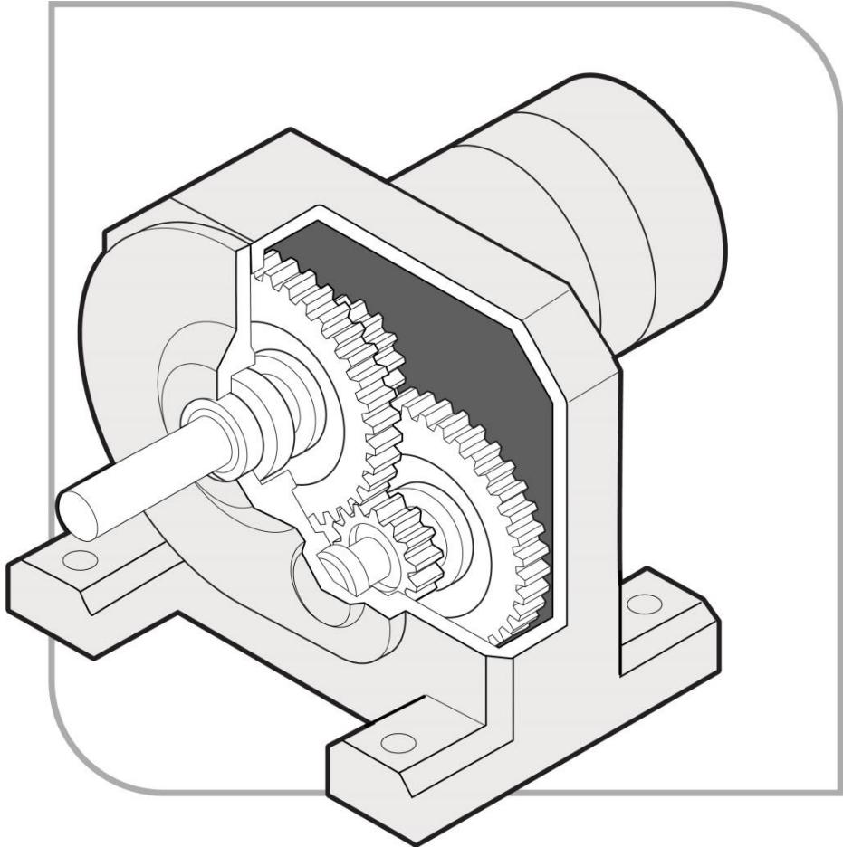
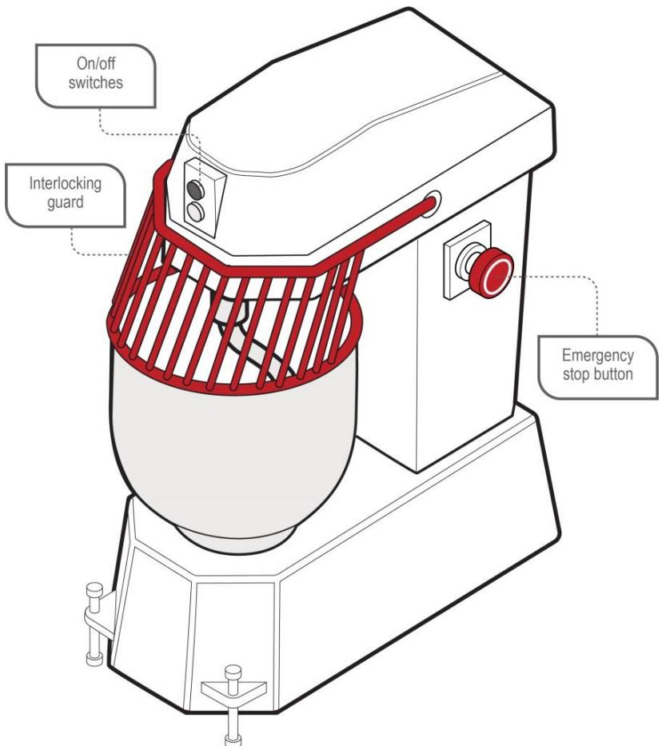
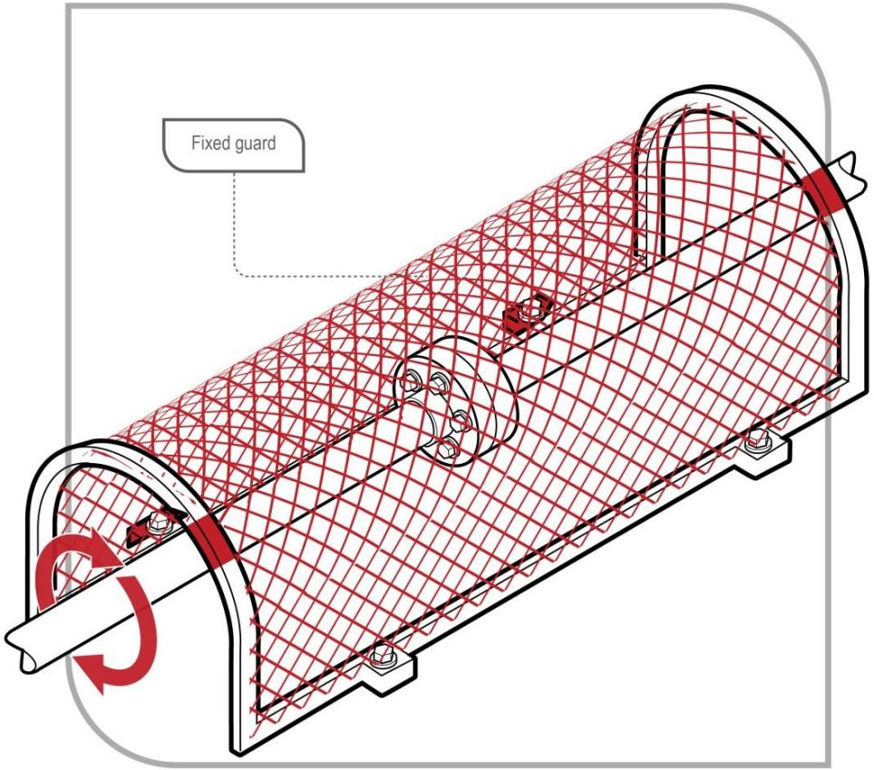
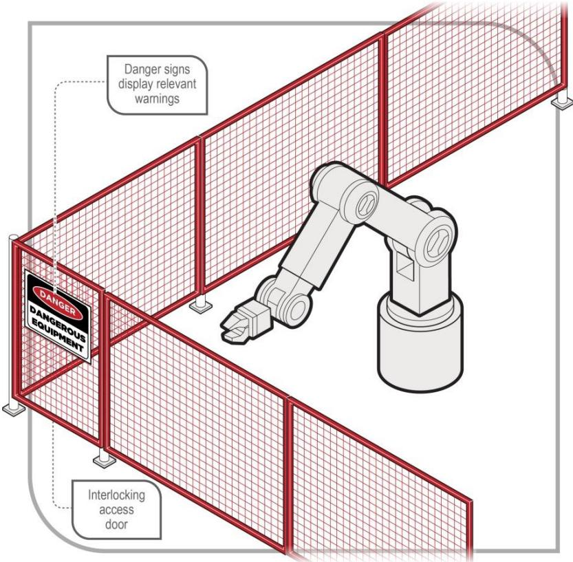
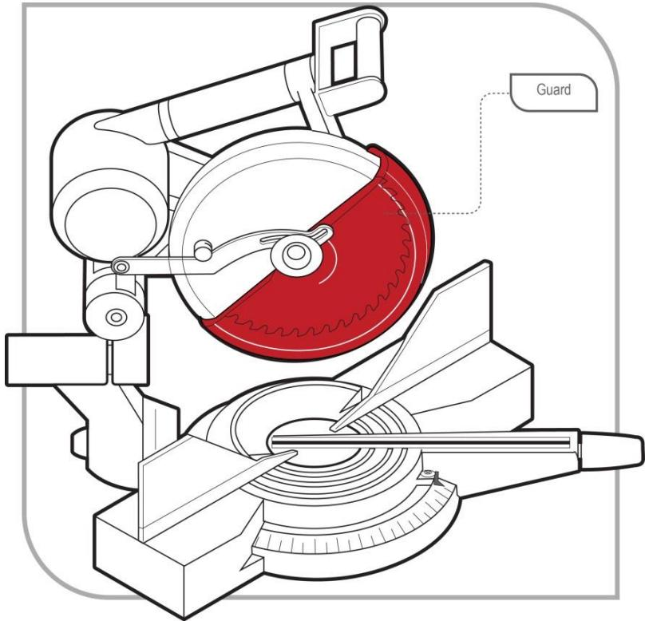
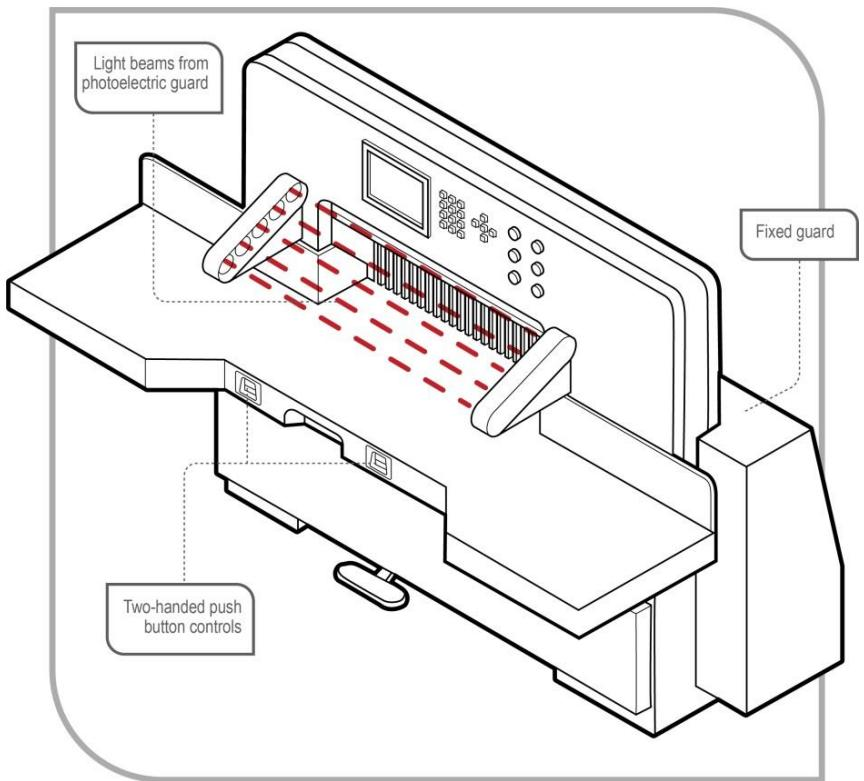
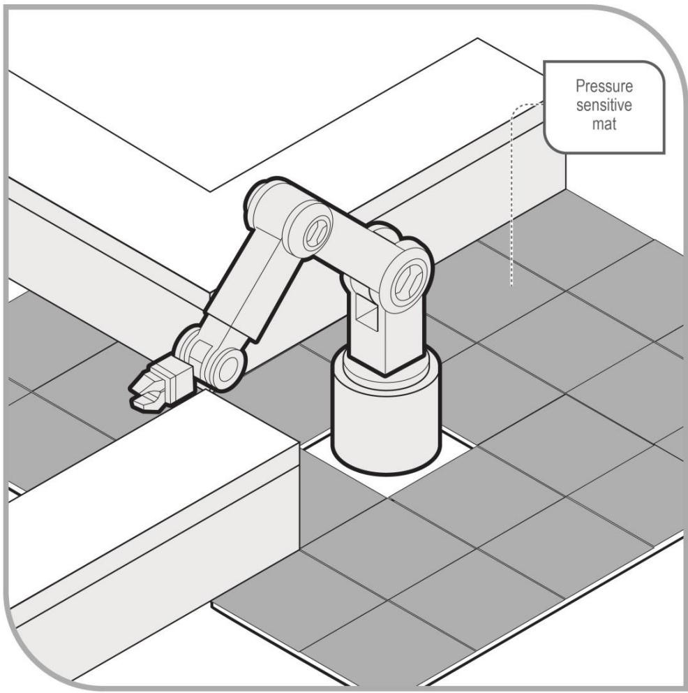
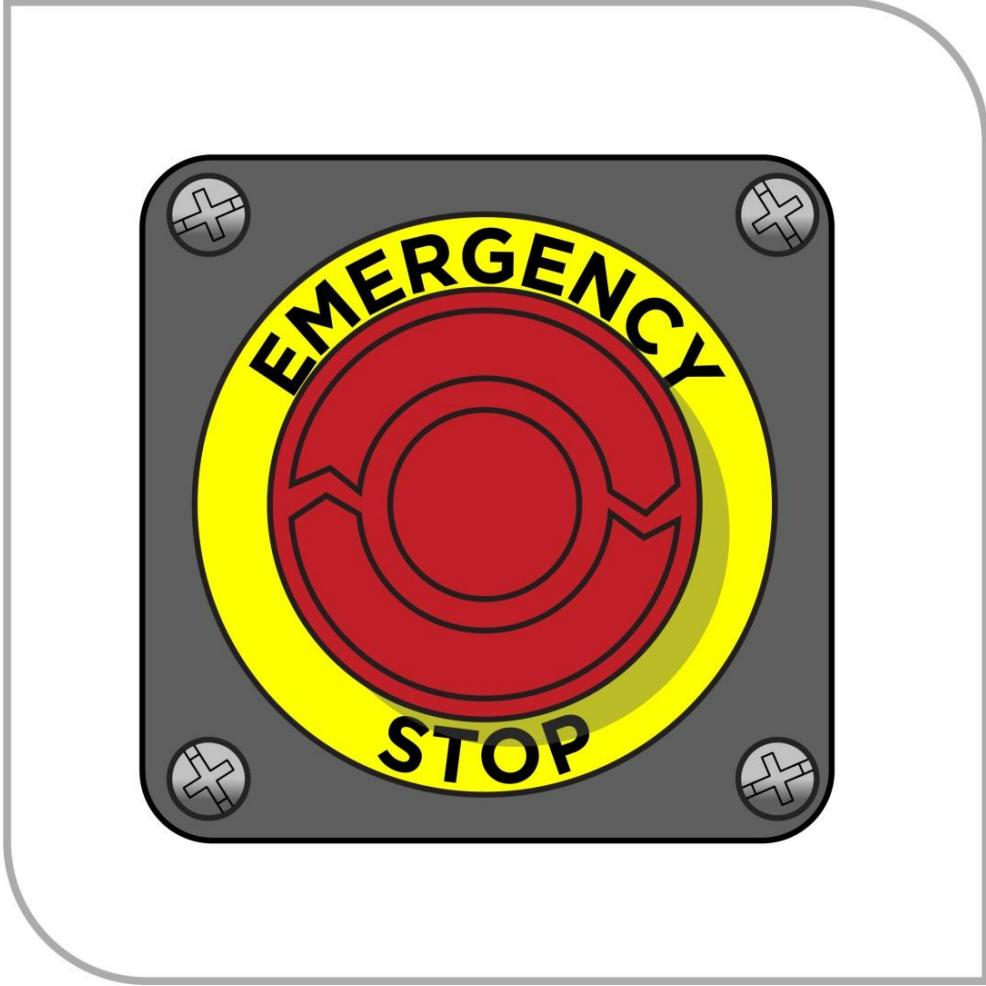
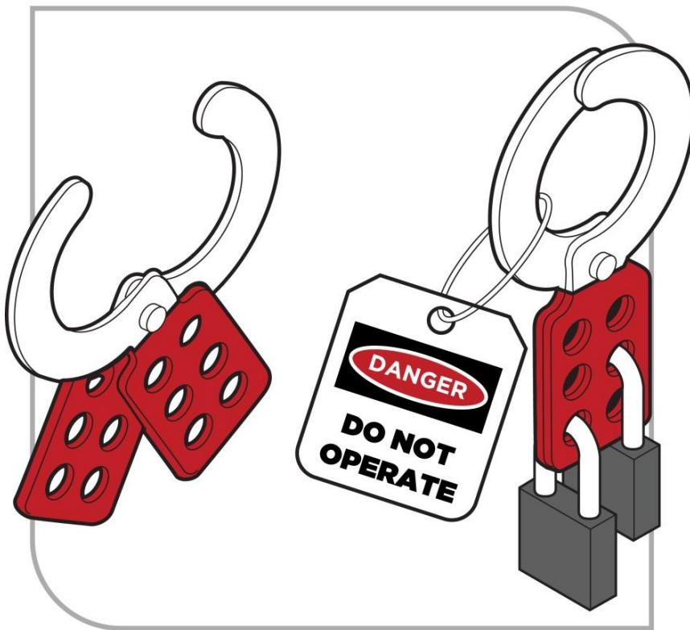

# Managing the risks of plant in the workplace

Code of Practice

# Disclaimer

Safe Work Australia is an Australian Government statutory body established in 2009. Safe Work Australia includes Members from the Commonwealth, and each state and territory, Members representing the interests of workers and Members representing the interests of employers.

Safe Work Australia works with the Commonwealth, state and territory governments to improve work health and safety and workers' compensation arrangements. Safe Work Australia is a national policy body, not a regulator of work health and safety. The Commonwealth, states and territories have responsibility for regulating and enforcing work health and safety laws in their jurisdiction.

ISBN 978- 0- 642- 33349- 0 (PDF)  ISBN 978- 0- 642- 33350- 6 (DOCX)

# Creative Commons

This copyright work is licensed under a Creative Commons Attribution- Noncommercial 4.0 International licence. To view a copy of this licence, visit creativecommons.org/licenses In essence, you are free to copy, communicate and adapt the work for non- commercial purposes, as long as you attribute the work to Safe Work Australia and abide by the other licence terms.

# Contact information

Safe Work Australia | info@swa.gov.au | www.swa.gov.au

# Contents

Foreword 4

1. Introduction 5

1.1. What is 'plant'? 5  1.2. Who has health and safety duties for plant at the workplace? 5  1.3. What is involved in managing risks associated with plant? 8  1.4. Information, training, instruction and supervision 11  1.5. Registering plant 12

2. The risk management process 13

2.1. Identifying the hazards 13  2.2. Assessing the risks 15  2.3. Controlling the risks 16  2.4. Maintaining and reviewing control measures 19

# 3. Controlling risks: from purchase to disposal 20

3.1. Purchasing and hiring plant 20  3.2. Installation and commissioning of plant 23  3.3. Using plant in the workplace 25  3.4. Making changes 26  3.5. Inspecting plant 27  3.6. Maintenance, repair and cleaning of plant 28  3.7. Storing plant 29  3.8. Decommissioning, dismantling and disposing of plant 31

# 4. Specific control measures 32

4.1. Guarding plant 32  4.2. Operational controls 39  4.3. Emergency stops 39  4.4. Warning devices 41  4.5. Isolating energy sources 42

# 5. Plant registration 45

5.1. Design and altered design registration 45  5.2. Item registration 46

# 6. Keeping records 48

6.1. Record keeping—plant 48

Appendix A—Glossary 49

Appendix B—Registrable plant designs and items of plant 52

Appendix C—Hazard checklist 54

Appendix D—Examples of technical standards 57

Amendments 65

# Foreword

This Code of Practice on how to manage risks of plant in the workplace is an approved code of practice under section 274 of the Work Health and Safety Act (the WHS Act).

An approved code of practice provides practical guidance on how to achieve the standards of work health and safety required under the WHS Act and the Work Health and Safety Regulations (the WHS Regulations) and effective ways to identify and manage risks.

A code of practice can assist anyone who has a duty of care in the circumstances described in the code of practice. Following an approved code of practice will assist the duty holder to achieve compliance with the health and safety duties in the WHS Act and WHS Regulations, in relation to the subject matter of the code of practice. Like regulations, codes of practice deal with particular issues and may not cover all relevant hazards or risks. The health and safety duties require duty holders to consider all risks associated with work, not only those for which regulations and codes of practice exist.

Codes of practice are admissible in court proceedings under the WHS Act and WHS Regulations. Courts may regard a code of practice as evidence of what is known about a hazard, risk, risk assessment or risk control and may rely on the code in determining what is reasonably practicable in the circumstances to which the code of practice relates. For further information see the Interpretive Guideline: The meaning of 'reasonably practicable'.

Compliance with the WHS Act and WHS Regulations may be achieved by following another method if it provides an equivalent or higher standard of work health and safety than the code.

An inspector may refer to an approved code of practice when issuing an improvement or prohibition notice.

# Scope and application

This Code is intended to be read by a person conducting a business or undertaking (PCBU). It provides practical guidance to PCBUs on how to manage health and safety risks associated with managing risks of plant in the workplace.

This Code may be a useful reference for other persons interested in the duties under the WHS Act and WHS Regulations.

This Code applies to all workplaces covered by the WHS Act and WHS Regulations where plant is operated and where plant equipment is used or stored.

Further information is available in Safe Work Australia's Guidance material for the safe design, manufacture, import and supply of plant.

# How to use this Code of Practice

This Code includes references to the legal requirements under the WHS Act and WHS Regulations. These are included for convenience only and should not be relied on in place of the full text of the WHS Act or WHS Regulations. The words 'must', 'requires' or 'mandatory' indicate a legal requirement exists that must be complied with.

The word 'should' is used in this Code to indicate a recommended course of action, while 'may' is used to indicate an optional course of action.

# Introduction

# 1.1. What is 'plant'?

Plant includes machinery, equipment, appliances, containers, implements and tools and any components or anything fitted or connected to those things. Plant includes items as diverse as lifts, cranes, computers, machinery, conveyors, forklifts, vehicles, power tools, quad bikes, mobile plant and amusement devices.

The general duty of care under the WHS Act applies to this type of plant. Plant that relies exclusively on manual power for its operation and is designed to be primarily supported by hand, for example a screwdriver, is not covered by the WHS Regulations.

Plant is a major cause of work- related death and injury in Australian workplaces. There are significant risks associated with using plant and severe injuries can result from the unsafe use of plant including:

limbs amputated by unguarded moving parts of machines being crushed by mobile plant sustaining fractures from falls while accessing, operating or maintaining plant being crushed by a quad bike rollover electric shock from plant that is not adequately protected or isolated, and burns or scalds due to contact with hot surfaces, or exposure to flames or hot fluids.

Other risks include hearing loss due to noisy plant and musculoskeletal disorders caused by manually handling or operating poorly designed plant.

# 1.2. Who has health and safety duties for plant at the workplace?

There are a number of duty holders who have a role in managing the risks of plant in the workplace. These include:

persons conducting a business or undertaking (PCBUs) PCBU involving the management or control of fixtures, fittings or plant designers, manufacturers, importers and suppliers of plant, substances or structures installers, and officers.

Workers and other persons at the workplace also have duties under the WHS Act, such as the duty to take reasonable care for their own health and safety at the workplace.

A person can have more than one duty and more than one person can have the same duty at the same time.

Early consultation and identification of risks can allow for more options to eliminate or minimise risks and reduce the associated costs.

# Person conducting a business or undertaking

# WHS Act section 19

Primary duty of care

A PCBU must eliminate risks arising from plant in the workplace, or if that is not reasonably practicable, minimise the risks so far as is reasonably practicable.

The WHS Regulations include more specific requirements for PCBUs to manage the risks of hazardous chemicals, airborne contaminants and plant, as well as other hazards associated with the workplace.

This duty includes ensuring, so far as is reasonably practicable:

the provision and maintenance of safe plant, and the safe use, handling, storage and transport of plant.

PCBUs have a duty to consult workers about work health and safety and may also have duties to consult, cooperate and coordinate with other duty holders.

# Persons who conduct a business or undertaking involving the management or control of fixtures, fittings or plant

Persons who conduct a business or undertaking involving the management or control of fixtures, fittings or plantWHS Regulation 203Management of risks to health and safetyWHS Regulation 204Control of risks arising from installation or commissioningWHS Regulation 205Preventing unauthorised alterations to or interference with plantWHS Regulation 206Proper use of plant and controlsWHS Regulation 207Plant not in useWHS Regulation 208GuardingWHS Regulation 209Guarding and insulation from heat and coldWHS Regulation 210Operational controlsWHS Regulation 211Emergency stopsWHS Regulation 212Warning devicesWHS Regulation 213Maintenance and inspection of plant

# Multiple duties

The WHs Regulations include specific duties for PCBUs involving the management or control of plant including requirements to:

manage the health and safety risks associated with plant prevent unauthorised alterations to or interference with plant, and use plant only for the purpose for which it was designed unless the proposed use does not increase the risk to health or safety.

There are generally a number of people involved with plant during its lifecycle. For example, different people will be involved from its design through to its use and eventual disposal, and throughout this process a person can have more than one duty and more than one person can have the same duty at the same time.

For example, if you own and operate plant in your workplace and you decide to modify it yourself, you will have the duties of a designer and manufacturer as well as a person with management or control of plant at the workplace.

Further information is available in SwA's Guidance material for the safe design, manufacture, import and supply of plant.

# Designers, manufacturers, importers and suppliers of plant, substances or structures

# WHS Act section 22

Duties of persons conducting businesses or undertakings that design plant, substances or structures

# WHS Act section 23

Duties of persons conducting business or undertakings that manufacture plant, substances or structures

# WHS Act section 24

Duties of persons conducting businesses or undertakings that import plant, substances or structures

# WHS Act section 25

Duties of persons conducting businesses or undertakings that supply plant, substances or structures

# WHS Act section 26

Duties of persons conducting businesses or undertakings that install, construct or commission plant or structures

Designers, manufacturers, importers and suppliers of plant, substances or structures must ensure, so far as is reasonably practicable, the plant, substances or structure they design, manufacture, import or supply is without risks to health and safety. This duty includes carrying out testing and analysis as well as providing specific information about the plant or substance.

To assist in meeting these duties, the WHs Regulations require:

manufacturers to consult with designers of the plant importers to consult with designers and manufacturers of plant, and the person who commissions construction work to consult with the designer of the structure.

# Officers

# WHS Act section 27

Duty of officers

Officers, for example company directors, have a duty to exercise due diligence to ensure the PCBU complies with the WHS Act and WHS Regulations. This includes taking reasonable steps to ensure the business or undertaking has and uses appropriate resources and processes to eliminate or minimise risks to health and safety. Further information on who is an officer and their duties is available in the Interpretive Guideline: The health and safety duty of an officer under section 27.

# Workers

# WHS Act section 28

Duties of workers

Workers have a duty to take reasonable care for their own health and safety and to not adversely affect the health and safety of other persons. Workers must comply with reasonable instructions, as far as they are reasonably able, and cooperate with reasonable health and safety policies or procedures that have been notified to workers. If personal protective equipment (PPE) is provided by the business or undertaking, the worker must so far as they are reasonably able, use or wear it in accordance with the information and instruction and training provided.

# Other persons at the workplace

# WHS Act section 29

Duties of other persons at the workplace

Other persons at the workplace, like visitors, must take reasonable care for their own health and safety and must take care not to adversely affect other people's health and safety. They must comply, so far as they are reasonably able, with reasonable instructions given by the PCBU to allow that person to comply with the WHS Act.

# 1.3. What is involved in managing risks associated with plant?

# WHS Regulations Part 3.1 Regulations 32-38

Managing risks to health and safety

# WHS Regulation 203

Management of risks to health and safety

This Code provides guidance on how to manage the risks associated with plant in the workplace using the following systematic process:

Identify hazards- find out what could cause harm.

Assess risks, if necessary- understand the nature of the harm that could be caused by the hazard, how serious the harm could be and the likelihood of it happening. This step may not be necessary if you are dealing with a known risk with known controls. Eliminate risks so far as is reasonably practicable Control risks- if it is not reasonably practicable to eliminate the risk, implement the most effective control measures that are reasonably practicable in the circumstances in accordance with the hierarchy of control measures, and ensure they remain effective over time. Review control measures to ensure they are working as planned.

Chapter 2 of this Code provides guidance on how to manage the risks associated with managing plant in the workplace by following the hierarchy of control.

Further guidance on the risk management process is in the Code of Practice: How to manage work health and safety risks.

# Providing and obtaining information

Designers, manufacturers, importers and suppliers have duties to provide information about the plant to enable other duty holders to fulfil the responsibilities they have in managing the risks associated with it. This information must be given to each person to whom the plant or its design is provided. Information must be passed on from the designer through to the manufacturer and supplier to the end user. This information includes:

the purpose for which plant was designed or manufactured the results of calculations, analysis, testing or examination, and conditions necessary for the safe use of the plant.

# Consulting workers

# WHS Act section 47

Duty to consult workers

# WHS Act section 48

Nature of consultation

A PCBU must consult, so far as is reasonably practicable, with workers who carry out work for the business or undertaking and who are (or are likely to be) directly affected by a health and safety matter.

This duty to consult is based on the recognition that worker input and participation improves decision- making about health and safety matters and assists in reducing work- related injuries and disease.

The broad definition of a 'worker' under the WHS Act means a PCBU must consult, so far as is reasonably practicable, with contractors and subcontractors and their employees, on- hire workers, outworkers, apprentices, trainees, work experience students, volunteers and other people who are working for the PCBU and who are, or are likely to be, directly affected by a health and safety matter.

Workers are entitled to take part in consultations and to be represented in consultations by a health and safety representative who has been elected to represent their work group.

Workers usually know the hazards and risks associated with the plant they use. By drawing on the experience, knowledge and ideas of workers it is more likely hazards will be identified so that effective control measures can be implemented.

Workers should be encouraged to report hazards and health and safety problems immediately so the risks can be managed before an incident occurs.

It is important to consult workers as early as possible when planning to introduce new plant or change the way plant is used.

Consultation requires that:

relevant work health and safety information is shared with workers - workers are given a reasonable opportunity to express their views and to raise health or safety issues - workers are given a reasonable opportunity to contribute to the decision- making process relating to the health and safety matter the views of workers are taken into account - workers are advised of the outcome of any consultation in a timely manner and if the workers are represented by a health and safety representative, consultation must include that representative.

Management commitment and open communication between managers and workers is important in achieving effective consultation. Workers are more likely to engage in consultation when their knowledge and ideas are actively sought and concerns about health and safety are taken seriously.

Consultation does not mean telling workers about a health and safety decision or action after it has been taken. Workers should be encouraged to:

ask questions about health and safety raise concerns and report problems make safety recommendations, and be part of the problem- solving process.

While consultation may not always result in agreement, agreement should be the objective as it will make it more likely the decisions are effective and actively supported.

# Consulting, cooperating and coordinating activities with other duty holders

# WHS Act section 46

Duty to consult with other duty holders

The WHS Act requires a PCBU to consult, cooperate and coordinate activities with all other persons who have a work health or safety duty in relation to the same matter, so far as is reasonably practicable.

There is often more than one business or undertaking involved in managing risks of plant in the workplace, that may each have responsibility for the same health and safety matters, either because they are involved in the same activities or share the same workplace.

In these situations, each duty holder should exchange information to find out who is doing what and work together in a cooperative and coordinated way so risks are eliminated or minimised so far as is reasonably practicable.

Examples of where a PCBU will have a health and safety duty include where:

the PCBU engages workers to carry out work the PCBU directs or influences workers in carrying out work other persons may be put at risk from work carried out in their business or undertaking

the PBCU manages or controls a workplace or the fixtures, fittings or plant at a workplace the PBCU's business or undertaking involves designing, manufacturing, importing or supplying plant, substances or structures for use at a workplace the PBCU's business or undertaking involves installing, constructing or commissioning plant or structures at a workplace.

For example, if the owner or manager of an on- hire business has workers carry out work at other workplaces then the owner or manager should exchange information with the host business to determine:

if workers could be exposed to hazardous plant, and what each party will do to control associated risks.

If using plant, for example a crane, at a workplace shared with other businesses the plant owner or manager should talk to those businesses about the risks the plant could cause them and work together in a cooperative and coordinated way to manage the risks.

Further guidance on consultation requirements is available in the Code of Practice: Work health and safety consultation, cooperation and coordination.

# 1.4. Information, training, instruction and supervision

# WHS Act section 19

Primary duty of care

# WHS Regulation 39

Provision of information, training and instruction

The WHS Act requires that a PCBU ensure, so far as reasonably practicable, the provision of any information, training, instruction or supervision that is necessary to protect all persons from risks to their health and safety arising from work carried out as part of the conduct of the business or undertaking.

The PCBU must ensure that information, training or instruction provided to a worker are suitable and adequate having regard to:

the nature of the work carried out by the worker the nature of the risks associated with the work at the time of the information, training and instruction, and the control measures implemented.

The PCBU must also ensure, so far as is reasonably practicable, that the information, training and instruction are provided in a way that is readily understandable for the person to whom it is provided.

Workers must be trained and have the appropriate skills to carry out a particular task safely. Training should be provided to workers by a competent person.

Before a PCBU's workers or other persons use the plant in a workplace, a PCBU must, as far as is reasonably practicable, provide them with information, training, instruction and organise ongoing supervision as necessary to protect them from risks arising from the use of the plant.

As a PCBU you must also provide the necessary safety information to persons who are involved in installing, commissioning, testing, maintaining or repairing plant, as well as decommissioning, dismantling or disposing of plant. This should include information on the types of hazards and risks the plant may pose to the person when they are carrying out these activities.

This information may be supported with safe work procedures including instructions on:

- the correct use of guarding and other control measures- how to safely access and operate the plant- who may use an item of plant. For example, only authorised or licensed operators- how to carry out inspections, shut-down, cleaning, repair and maintenance- traffic rules, rights of way, clearances and no-go areas for mobile plant- procedures when plant malfunctions- emergency procedures, and- the proper use, wearing, storage and maintenance of personal protective equipment (PPE).

Emergency instructions relating to an item of plant should be clearly displayed on or near it.

Training programs should be practical and 'hands on' and take into account the particular needs of workers. For example, literacy levels, work experience and specific skills required for safe use of the plant should all be taken into account.

Supervisors should take action to correct unsafe work practices associated with plant as soon as possible. Otherwise workers may think unsafe work practices are acceptable.

# 1.5. Registering plant

Certain items of plant and types of plant designs must be registered. A list of registrable plant designs and registrable items of plant is provided at Appendix B. Registrable plant designs must be design registered prior to being supplied.

Registrable items of plant must be item registered prior to being commissioned for use by a PCBU.

# Design registration

Design registration is the registering of a completed design, from which any number of individual items can be manufactured. The original designer or a person with management or control of the item of plant may apply for design registration.

# Item registration

Plant item registration applies to a specific item of plant. Each item requires registration. The purpose of registering an item of plant is to ensure it is inspected by a competent person and is safe to operate. A person with management or control of plant should obtain a copy of the design registration from the supplier of the plant to ensure all registrable plant items are registered.

Further information on registering plant is provided in Chapter 5 of this Code.

# The risk management process

The risk management processWHS Regulation 34Duty to identify hazardsWHS Regulation 35Managing risks to health and safetyWHS Regulation 36Hierarchy of control measuresWHS Regulation 37Maintenance of control measuresWHS Regulation 38Review of control measuresWHS Regulation 297Management of risks to health and safetyWHS Regulation 299Safe work method statement required for high risk construction work.

# 1.6. Identifying the hazards

The first step in the risk management process is to identify all hazards associated with plant in the workplace. This involves finding things and situations that could potentially cause harm to people. Hazards generally arise from the following aspects of work and their interaction:

physical work environment equipment, materials and substances used work tasks and how they are performed, and work design and management.

Hazards may be identified by looking at the workplace and how work is carried out. It is also useful to talk to workers, manufacturers, suppliers and health and safety specialists and review relevant information, records and incident reports.

Typical hazards found in managing risks of plant in the workplace can include:

The plant itself. For example, hazards associated with a bridge and gantry crane include hazards relating to worn or damaged mechanical components; background noise causing problems with communication; lighting; and multiple cranes on the same runway Traffic movements in the workplace. For example, vehicles including powered mobile plant moving in and around a workplace, reversing, loading and unloading are frequently linked with death and injuries to workers and members of the public The environment in which the plant is used. For example, there may be hazards associated with using a tower crane as a result of structural failure, collapse or contact or collision with other plant and structures.

Further information on identifying these types of hazards is in SWA's Workplace traffic management guidance material.

When plant is being used to lift or suspend persons or things, the person with management or control of plant at a workplace must ensure, so far as is reasonably practicable, that the plant used is specifically designed to lift or suspend the load.

If it is not reasonably practicable to use plant that is specifically designed to lift or suspend the load, the person must ensure that:

- the plant does not cause a greater risk to health and safety than if specifically designed plant were used, and- if the plant is lifting or suspending persons, the use of the plant complies with WHS Regulation 220: Exception—Plant not specifically designed to lift or suspend a person.

The person must ensure that the lifting and suspending is carried out:

- with lifting attachments that are suitable for the load being lifted or suspended, and- within the safe working limits of the plant.

The person must ensure, so far as reasonably practicable, that:

- no loads are suspended or travel over a person unless the plant is specifically designed for that purpose- loads are lifted or suspended in a way that ensures that the load remains under control during the activity, and- no load is lifted simultaneously by more than one item of plant unless the method of lifting ensures that the load placed on each item of plant does not exceed the design capacity of the plant.

# Inspect the plant

A person with management or control of plant at a workplace must review safety information and inspect each item of plant in the workplace and observe how it is used. Talk to your workers and their health and safety representatives to find out what their experience is with the plant they operate, inspect or maintain. You should also review the manufacturer's and the supplier's instruction for safe set- up and use of the plant.

If you have hired or leased plant, you should also consult the person who owns the plant about potential hazards, because you both have responsibility for ensuring, so far as is reasonably practicable, the plant is safe and without risk to health and safety.

When identifying hazards you should think about all the activities that may be carried out during the life of the plant at your workplace, for example installation, commissioning, operation, inspection, maintenance, repair, transport, storage and dismantling. For each of these activities, you should consider whether the plant could:

- cause injury due to entanglement, falling, crushing, trapping, cutting, puncturing, shearing, abrasion or tearing- create hazardous conditions due to harmful emissions, fluids or gas under pressure, electricity, noise, radiation, friction, vibration, fire, explosion, moisture, dust, ice, hot or cold parts, cleaning, and undisclosed asbestos-containing materials- cause injury when an operator responds to common failure modes. For example, machine jams cause injury due to poor ergonomic design; if operator controls are difficult to reach or require high force to operate.

Other factors to consider include:

- the condition of the plant, for example its age, maintenance history and how frequently the plant is used

the suitability of the plant, for example is it actually being used for its intended purpose? Has it been modified from its intended use? the location of the plant, for example what is its impact on the design and layout of the workplace and are workers able to access the plant without risk of slips, trips or falls? abnormal situations, for example what abnormal situations, misuse or fluctuation in operating conditions can you foresee?

A checklist to assist in identifying hazards associated with plant is at Appendix C.

# Review safety information

Information about hazards, risks and control measures relating to plant in your workplace can be obtained from:

- manufacturers, importers or suppliers of the plant- maintenance technicians or specialists, for example engineers- your workers- regulators, unions and other organisations- businesses or undertakings similar to your own, and- Australian, International or other technical standards.

# Review incident records and data

Check your records of workplace injuries and illness, dangerous incidents, plant inspection reports and maintenance logs, workers compensation records and the results of investigations to collect information about plant hazards.

# 1.7. Assessing the risks

A risk assessment involves considering what could happen if someone is exposed to a hazard and the likelihood of it happening. A risk assessment can help you determine:

- how severe a risk is- whether existing control measures are effective- what action you should take to control the risk, and- how urgently the action needs to be taken.

Hazards have the potential to cause different types and severities of harm, ranging from minor discomfort to a serious injury or death.

Many hazards and their associated risks are well known and have well established and accepted control measures. In these situations, the second step to formally assess the risk is not required. If after identifying a hazard you already know the risk and how to control it effectively, you may simply implement the controls.

In some circumstances, a risk assessment will assist to:

- identify which workers are at risk of exposure- determine what sources and processes are causing the risk- identify if and what kind of control measures should be implemented, and- check the effectiveness of existing control measures.

The nature and severity of risks will depend on various factors.

To assess the risk associated with plant hazards you have identified, you should consider the following.

# What is the potential impact of the hazard?

How severe could an injury or illness be? For example, lacerations, amputation, serious or fatal crush injury, burns or loss of hearing What is the worst possible harm the plant hazard could cause? For example, a crane could overturn or collapse causing harm to the operator, workers and others below.

# How likely is the hazard to cause harm?

How likely is the hazard to cause harm?- How frequently are workers exposed to the hazard?- What condition is the plant used in? For example, in a confined space, muddy or dusty environment- What is the condition of the plant? For example, is it old and missing safety features found on new plant? Is it reliable or often needing emergency maintenance?- If there are other people or items of plant in the vicinity, what effect do they have on the likelihood or consequence?- Where and when is access required during the installation, operation or maintenance of plant and in an emergency?- What work practices and procedures exist for plant safety? For example, is isolation required to carry out maintenance?- What kinds of information, training, instruction and supervision are provided to workers and other persons who may be exposed to plant?- Does the plant's safety depend on the competency of its operators?- How is work organised? For example, consider:

the speed of the process line pedestrian and vehicular traffic around the plant time spent on repetitive tasks shiftwork arrangements, and production incentives that may affect health and safety.

# 1.8. Controlling the risks

The WHs Regulations require duty holders to work through a hierarchy of control measures when managing risks to health and safety associated with plant.

Specific controls are required under the WHs Regulations for certain types of plant, including:

powered mobile plant plant that lifts or suspends loads plant used in connection with tree lopping industrial robots lasers pressure equipment scaffolds, and plant with presence- sensing safeguarding systems.

# Hierarchy of control measures

Hierarchy of control measuresThe WHS Regulations require duty holders to work through the hierarchy of control measures when managing certain risks; however, it can be applied to any risk. The hierarchy ranks control measures from the highest level of protection and reliability to the lowest. Further guidance on the risk management process and the hierarchy of control measures is in the Code of Practice: How to manage work health and safety risks.

# Eliminating the risk

You must always aim to eliminate the risk. For example, you may design items of a size, shape and weight so they can be delivered, handled or assembled at the location where they will be used without the need for a crane.

If eliminating the hazards and associated risks is not reasonably practicable, you must minimise the risk by one or more of the following:

Substitution- - minimise the risk by substituting or replacing a hazard or hazardous work practice with something that gives rise to a lesser risk. For example, installing a conveyor system to replace forklifts will eliminate the risks associated with moving plant but will introduce other risks associated with conveyors. The new system should reduce the overall risks of transporting material. Isolation- - minimise the risk by isolating or separating the hazard or hazardous work practice from any person exposed to it. For example, use concrete barriers to separate mobile plant from workers

Engineering controls- - engineering controls are physical control measures to minimise risk. For example:

emergency brakes in a lift that are applied automatically when the lift exceeds its maximum speed an automatically applied control system that prevents tower cranes from colliding while sharing the same air space interlocked guards on machinery operator protective devices (OPDs) on quad bikes that protect riders in the event of a rollover.

If risk remains, it must be minimised by implementing administrative controls, so far as is reasonably practicable. For example, a tag- out system could be used to ensure the plant is isolated from its power source and is not operated while maintenance of cleaning work is being done.

Any remaining risk must be minimised with suitable personal protective equipment (PPE). For example, providing workers with breathing protection, hard hats, gloves, aprons and protective eyewear.

Administrative control measures and PPE do not control the hazard at the source. They rely on human behaviour and supervision and used on their own tend to be the least effective in minimising risks.

The control measures you apply may change the way work is carried out. In these situations, you must consult your workers and develop safe work procedures, and provide your workers with training, instruction, information and supervision on the changes.

# Combining control measures

In most cases, a combination of the control measures will provide the best solution to minimise the risk to the lowest level reasonably practicable. For example, protecting workers from flying debris when using a concrete cutting saw may involve guarding the blade, isolating the work area and using PPE such as a face shield.

You should check whether your chosen control measures introduce new hazards. For example, hiring a forklift to control hazardous manual tasks introduces risks involving moving plant that also need to be controlled.

# Working near overhead and underground electric lines

# WHS Regulation 166

As a person conducting a business or undertaking (PCBU) at a workplace, you must ensure, so far as is reasonably practicable, that no person, plant or thing at the workplace comes within an unsafe distance of an overhead or underground electric line.

If it is not reasonably practicable to ensure the safe distance, you must ensure that a risk assessment is conducted for the proposed work and control measures implemented are consistent with the risk assessment and the requirements of an electricity supply authority where it is responsible for the electric line.

Electric lines pose significant risks, including electrocution, arcing, explosion, fire causing burns, unpredictable cable whiplash and electrifying other objects including signs, poles, trees or branches. Whether energised overhead or underground electric lines are carrying voltage of 400,000V or 230V, contact with these lines can be fatal. It is not necessary to touch an overhead electric line to be electrocuted. A 'flashover' or 'arc' can electrocute a person close to a line conductor.

The following should be considered:

- Are workers or plant likely to go near electric lines? If so, how high are the electric lines and the plant?- Are overhead electric lines hard to see in the sky or are they hidden by trees?- Have underground electric lines been accurately located?- Is a safety observer in place to watch plant when it is operating close to electric lines?- Has the relevant state or territory electricity supply authority been contacted for information about specific requirements when working near electric lines, including the qualifications required for those people working near electric lines?- Have emergency rescue procedures been established, including calling the electricity supply authority to isolate the electricity supply before trying to rescue a person receiving an electric shock?

Most risks can be addressed by observing safe working distances for people and plant near electric lines. Safe working distances will depend on the type of work being carried out and the voltage of the electric lines. You should contact the relevant electricity supply authority to determine unsafe distances and the type of control measures needed. This may include isolating the line.

Further information about electrical safety can be obtained from your Electricity Regulator.

# 1.9. Maintaining and reviewing control measures

# WHS Regulation 37

Maintenance of control measures

# WHS Regulation 38

Review of control measures

Control measures must be maintained so they remain fit for purpose, suitable for the nature and duration of work and are installed, set up and used correctly.

The control measures put in place to protect health and safety should be regularly reviewed to make sure they are effective. If the control measure is not working effectively it must be revised to ensure it is effective in controlling the risk.

You must review and as necessary revise control measures so as to maintain, so far as is reasonably practicable, a work environment that is without risks to health or safety. For example:

when the control measure does not control the risk so far as is reasonably practicable before a change at the workplace that is likely to give rise to a new or different health and safety risk that the measure may not effectively control a new or relevant hazard or risk is identified the results of consultation indicate that a review is necessary, or a health and safety representative requests a review if that person reasonably believes that:

a circumstance in any of the above points affects or may affect the health and safety of a member of the work group represented by the health and safety representative the control measure has not been adequately reviewed in response to the circumstance.

Common review methods include workplace inspection, consultation, testing and analysing records and data.

You can use the same methods as in the initial hazard identification step to check control measures. You must also consult your workers and their health and safety representatives.

If problems are found, go back through the risk management steps, review your information and make further decisions about control measures.

# Controlling risks: from purchase to disposal

# 1.10. Purchasing and hiring plant

Many injuries and illnesses associated with plant occur due to a failure to select the right equipment for the job. Before you purchase plant, check it is suitable for the intended use including the environment it will be used in and the workers using it. Discuss your needs with the plant supplier, who must provide you with information about:

the purpose for which the plant was designed or manufactured the results of calculations, analysis, testing or examination carried out to determine that the plant, so far as is reasonably practicable, is without risk to health and safety conditions necessary for the safe use of the plant, and alterations or modifications made to the plant.

Before purchasing, hiring or leasing plant you should also determine:

the hazards and risks associated with installation, commissioning, operation, inspection, maintenance, repair, transport, storage and dismantling of the plant control measures needed to minimise these hazards and risks the manufacturer's recommendations for the frequency and type of inspection and maintenance needed special skills required for people who operate the plant or carry out inspection and maintenance, including preventative maintenance special conditions or equipment required to protect the health and safety of people carrying out activities. For example, installation, operation and maintenance, and alterations or modifications to be made to the plant.

You should check whether the plant includes some or all of the following controls:

contact with or access to dangerous parts is prevented. For example, by using guards and protective structures it is of sturdy construction and has tamper- proof design there are no obstructions to the plant operator it has fail- safe operation it is easy to inspect and maintain it does not introduce other hazards, for example manual handling problems or excessive noise, into your workplace, and it incorporates measures to minimise risks during use, for example low noise.

# Duties of suppliers and purchasers of second-hand plant

Second- hand plant

# WHS Act section 25

Duties of persons conducting businesses or undertakings that supply plant, substances or structures

# WHS Regulation 198

Information to be obtained and provided by supplier

# WHS Regulation 199

Supply of second- hand plant- - duties of supplier

# WHS Regulation 200

Second- hand plant to be used for scrap or spare parts

Suppliers' duties apply whether the plant is new, second- hand or hired out. There are also some additional duties that apply when the plant is second- hand. Some examples of suppliers of second- hand plant include a person conducting a business or undertaking (PCBU) who:

sells second- hand plant at a retail outlet or directly sells their own second- hand plant imports second- hand plant for on- sale, and auctions second- hand plant, excepting certain clearing sales (see below).

A supplier of plant must:

A supplier of plant must:- take all reasonable steps to obtain the information required to be provided by the manufacturer under sections 23(4)(a), (b) and (c) of the WHS Act, and- when the plant is supplied, ensure the person to whom the plant is supplied is given the information obtained by the supplier.

A supplier of second- hand plant must ensure, so far as is reasonably practicable, that any faults in the plant are identified.

Before plant is supplied, the supplier of second- hand plant must ensure that the person to whom the plant is supplied is given written notice:

of the condition of the plant of any faults identified, and if appropriate, that the plant should not be used until the faults are rectified.

A supply of a thing does not include the supply of a thing by a person who does not control the supply and has no authority to make decisions about the supply, for example an auctioneer without possession of the thing or a real estate agent acting in their capacity as a real estate agent.

Suppliers' duties apply to a PCBU whether the sale is a one- off sale or forms part of the business's day- to- day operations.

# Duty to supply safe plant

Suppliers of second- hand plant must ensure, so far as is reasonably practicable, the plant is without risks to the health and safety of persons who are at or in the vicinity of a workplace.

This includes, so far as is reasonably practicable, identifying faults in the plant.

Suppliers of second- hand plant, other than scrap or spare parts, must give written notice to a person to whom the plant is supplied stating:

the condition of the plant, including identified faults, and if appropriate, that the plant should not be used until the faults are rectified.

Suppliers of second- hand plant must also take all reasonable steps to obtain information about how to use the plant correctly and safely from the manufacturer or original supplier.

Suppliers of second- hand plant must give the buyer:

this information, and all available records of the plant kept by the previous owner.

The information may include data sheets, test certificates, operations and service manuals, reports and a safety manual.

Out- dated or non- existent safety features of second- hand plant Second- hand plant is more likely to have out- dated or missing safety features.

In these circumstances suppliers of second- hand plant must do what is reasonably practicable to supply equipment safe for use at work.

The degree of risk posed by the plant must be weighed up against the cost of implementing measures to minimise it. Suppliers of second- hand plant should consider:

if it is reasonably practicable to retrofit or modify the plant to improve its safety having regard to improvements to that type of plant since its manufacture what information needs to be given to the buyer about relevant matters including the purpose for which the plant was designed or manufactured and conditions necessary to ensure the plant is without risks to health and safety when properly used, and their duty to ensure the plant is safe and has all the required safety features before bringing it into service.

# Adequate information to be provided about the condition of second-hand plant

Adequate information must be given to the buyer about the purpose for which the plant was designed or manufactured and conditions necessary to ensure its safe use.

Information about using second- hand plant safely, including its condition, may be obtained from:

the previous owner of the plant, or a 'competent person' engaged to assess the plant and develop this information.

Without this kind of information, suppliers of second- hand plant have no way of knowing whether they have met their suppliers' duties under the WHS Act.

# Suppliers' duties and agents or auctioneers selling used plant at clearing sales

Suppliers' duties apply to sellers' agents like auctioneers, unless the agent does not take control of the supply and has no authority to make decisions about the supply.

Agents selling used plant at clearing sales usually do not take possession of the plant and have no authority to make decisions about the supply and are not considered to be suppliers.

In these limited circumstances the suppliers' duties will only apply to the seller- not their agent.

# Supplying scrap and spare parts

Plant sold for scrap or spare parts is usually not intended to be used at a workplace so does not need to be made safe or supplied with instructions for use.

However, the supplier must tell prospective buyers that the plant is being supplied for scrap or spare parts only and that it cannot be used safely in its current form for other purposes.

This must be done in writing or by marking the item of plant.

# Hiring plant

When you hire plant, both you and the person you have hired it from must ensure, so far as is reasonably practicable, the plant is safe to use. During the time the plant is in your possession you will have control over the way the plant is used in the workplace.

Before you hire the plant you should assess whether the plant is suitable for its intended use. You should also check the plant has been inspected and maintained by the supplier according to the manufacturer's specifications. This may involve checking the logbook or maintenance manual. You should also ensure the supplier provides you with the manufacturer's information about the purpose of the plant and its proper use.

A person who hires or leases plant to others will have duties as a supplier of plant and as a person with management or control of plant. This means they must ensure, so far as is reasonably practicable, the plant is safe to use and properly maintained. They must also provide specific information with the plant about how to operate it safely.

In most cases the supplier will be responsible for inspecting and maintaining the plant. However, if the plant is to be hired for an extended period of time, you and the supplier may develop arrangements to ensure the plant is properly inspected and maintained throughout the lease. This may involve the supplier coming to your workplace to maintain the plant, or you maintaining the plant while it is at your workplace.

The arrangements you make will depend on your ability to inspect and maintain the plant in accordance with the manufacturer's specifications. If you choose to maintain the plant yourself during the lease, you should provide all information and records about the maintenance to the hirer at the end of the lease.

# 1.11. Installation and commissioning of plant

# WHS Regulation 204

Control of risks arising from installation or commissioning

A person with management or control of plant at a workplace must:

- not commission the plant unless the person has established that the plant is, so far as reasonably practicable, without risks to the health and safety of any person- not decommission or dismantle the plant unless the decommissioning and dismantling can be carried out, so far as is reasonably practicable, without risks to the health and safety of any person- ensure that a person who installs, assembles, constructs, commissions, decommissions or dismantles the plant is a competent person, and is provided with all the information necessary to minimise risks to health and safety, and

- ensure that the processes for the installation, construction, commissioning, decommissioning and dismantling of plant include inspections that ensure, so far as is reasonably practicable, the risks associated with these activities are monitored.

# Installing plant

An installer should ensure:

plant is erected or installed having regard to the manufacturer's instructions including ensuring specialised tools, jigs and appliances necessary to minimise risk of injury during installation are used entry to and exit from plant complies with relevant standards plant is stable during installation the interaction of plant with people, work processes and other plant is considered environmental factors affecting installation and use, for example wet conditions, are considered, and electrical installations associated with plant comply with AS/NZS 3000, also known as the Australian/New Zealand Wiring Rules, as far as is relevant.

The installer should notify the designer, manufacturer, supplier and person with management or control of plant of new risks identified during the plant installation.

# Positioning plant in the workplace

Plant should be positioned so:

- risks from hot plant, for example, friction, molten material, hot gases, are controlled through restricted access, guarding or insulation- there is sufficient space (suggested  $600mm$ , the minimum width of a walkway) for safe access to the plant for operation, cleaning, maintenance, inspection and emergency evacuation- the plant does not obstruct doorways and emergency exits- the proximity to other plant does not have a negative effect on operation of the plant or work processes- the plant rests on a suitable foundation where required, for example on a floor or other support that ensures the plant is stable and secure- ventilation can deal with the nature and volume of emissions from the plant, and- workers and others are not exposed to noise levels greater than those stated in the exposure standard for noise under the WHS Regulation. Consideration could also be given to placing plant in areas with sound insulation or mounting to decrease reverberations which will decrease noise levels.

# Commissioning plant

Commissioning plant involves performing the necessary adjustments, tests and inspections to ensure plant is in full working order to specified requirements before the plant is used. Commissioning includes recommissioning.

The person who commissions plant should ensure:

- the commissioning sequence is in accordance with the design specifications, and- tests are carried out to check the plant will perform within the design specifications.

# 1.12. Using plant in the workplace

# WHS Regulation 205

Preventing unauthorised alterations to or interference with plant

# WHS Regulation 206

Proper use of plant and controls

A person with management or control of plant at a workplace must:

so far as is reasonably practicable, prevent alterations to or interference with the plant that they have not authorised take all reasonable steps to ensure the plant is only used for the purpose for which it is designed, unless they have assessed that the proposed use does not increase the risk to health and safety in determining whether or not the proposed use of plant increases the risk to health and safety, ensure that the risk associated with the proposed use is assessed by a competent person, and take all reasonable steps to ensure that all safety features, warning devices, guarding, operational controls, emergency stops are used in accordance with instructions and information that they have provided.

Workers who operate plant should be competent or suitably supervised during training so they do not put themselves or others at risk. It is important to retain all operating manuals and instructional material provided by the manufacturer in order to correctly operate and maintain the plant once it is in the workplace. The person with management or control of plant should also consider and address the risks that may arise from:

operator fitness for work, such as fatigue carrying out routine or repetitive tasks, and local conditions and working procedures.

# Work platforms and boxes

# WHS Regulation 219

Plant that lifts or suspends loads

# WHS Regulation 220

Exception- Plant not specifically designed to lift or suspend a person

If plant is being used to lift or suspend persons and it is not reasonably practicable to use plant that is specifically designed to lift or suspend them, the person with management or control of the plant must ensure:

the plant does not cause a greater risk to health and safety than if specifically designed plant were used the persons are lifted or suspended in a work box that is securely attached to the plant the persons in the work box remain substantially within the workbox while they are being lifted or suspended a safety harness is worn if there is a risk of a worker falling from a height, and means are provided by which the persons being lifted or suspended can safely exit from the plant in the event of a failure in its normal operation.

# High risk work licences

# WHS Regulation 85

Evidence of licence—duty of person conducting business or undertaking

As a PCBU, you must not direct or allow a worker to carry out high risk work for which a high risk work licence is required unless you see written evidence provided by the worker that the worker has the relevant high risk work licence for that work.

Certain types of work, for example operating industrial trucks and some cranes or scaffold and rigging work, require the worker to have a high risk work licence before they can operate the plant or undertake the work. Schedule 3 of the WHS Regulations sets out the classes of high risk work licences and the types of plant involved, and Schedule 4 sets out the competency requirements for a high risk work licence.

# 1.13. Making changes

If the person with management or control of the plant intends to alter the design of the plant, change the way the plant is used or change a system of work associated with the plant, the person should carry out the risk management process again.

If the person with management or control of the plant intends to use the plant in a different way or for a purpose it was not designed for, the person must ensure the risks associated with the new use are assessed by a competent person. For example, if an item of plant designed to cut wood is to be used to cut metal, all hazards associated with that use should be identified and controls implemented.

The competent person's assessment should:

include all aspects of the proposed task outline the reasons a purpose- designed item of plant cannot be used for the proposed task. For example, the impracticability of using it take into account the recommendations of the designer, manufacturer or supplier of the plant and ensure the proposed use is not outside its capabilities identify differences between the item of plant and one that is purpose- designed for the task, and describe the measures that will be used to control the risks the purposedesigned plant was designed to control, and amend relevant documentation. For example, operator and maintenance manuals and signage.

If a competent person decides the plant is not suitable for the proposed task, it must not be used for that task.

# Making alterations to plant

Before making alterations to plant, the person with management or control of the plant should consult with the designer and manufacturer to ensure all relevant safety issues have been considered. If the original designer and manufacturer of the plant design implement alterations, then relevant obligations imposed by the WHs Regulations still apply. If the person with management or control of the plant makes alterations to the plant then the person will also be a designer or manufacturer, and those obligations will apply to that person.

If the original designer or manufacturer cannot be contacted about older plant or imported plant, the alterations should be carried out by a competent person in accordance with the relevant technical standards. See Appendix D for examples of published technical standards.

If the plant is subject to design registration requirements, the altered design must be registered if the alteration may affect health and safety.

Plant should be isolated from power sources and be unable to be switched on or activated accidentally before alterations begin or while alterations are being carried out.

Before returning altered plant to service you should:

have control measures in place to eliminate or, where that is not reasonably practicable, minimise risks created by the alteration including providing information and training for users and supervisors about the changes, and inspect and test the plant, having regard to the altered design specifications and relevant technical standards.

# 1.14. Inspecting plant

# WHS Regulation 213

Maintenance and inspection of plant

The person with management or control of plant at a workplace must ensure that maintenance, inspection and, if necessary, testing of plant is carried out by a competent person.

The maintenance, inspection and testing must be carried out:

in accordance with the manufacturer's recommendations, if any if there are no manufacturer's recommendations, in accordance with the recommendations of a competent person, or in relation to inspection, if it is not reasonably practicable to comply with the above, annually.

Plant inspection should be conducted in accordance with a regular maintenance system to identify:

potential problems not anticipated during plant design or task analysis deficiencies in plant or the equipment associated with use of the plant, for example wear and tear, corrosion and damaged plant parts adverse effects of changes in processes or materials associated with plant, and inadequacies in control measures that have been previously implemented.

Inspecting associated work processes should be conducted regularly to identify:

- unsafe work practices associated with the use of plant- negative effects of changes in processes or materials associated with plant, and- inadequacies in control measures that have been previously implemented.

Regularly inspect hand- held powered plant and repair or replace when necessary, and replace damaged or worn parts, for example grinding wheels.

Control measures implemented, for example guards and warning devices, must be regularly inspected and tested to ensure they remain effective.

You should keep an up- to- date register of the items of plant requiring regular inspection and maintenance. It should include information on:

- allocated responsibilities for people dealing with inspections- standards against which plant should be inspected- the frequency of inspections- critical safety instructions to be followed during inspection. For example, the isolation procedure- the procedures for particular types of inspections including:  
- periodic inspections  
- specific tests, and  
- repaired or modified plant, and- variations from normal operation or dangerous occurrences and trends that may be occurring.

Reasonably practicable control measures must be implemented to ensure the health and safety of the person conducting the inspection. For example, you may need to ensure the plant is switched off and isolated from the energy source to avoid accidental re- energising of dangerous parts.

Guards that are removed must be replaced correctly to prevent access to the hazardous part of the plant when it is returned to use.

# 1.15. Maintenance, repair and cleaning of plant

Plant must be maintained and repaired according to the manufacturer's specifications. If you identify deficiencies in the specifications, you should contact the manufacturer. In the absence of a manufacturer's specifications, plant energy sources should be maintained in accordance with a competent person's recommendations. For example, ensure fluid levels and pressures are correct and ensure brakes are functioning properly.

Plant should usually be isolated before maintenance or cleaning starts.

Isolated or disengaged plant should:

- not hinder or interfere with other plant operation- have guards in place where a risk of injury is identified, and- not obstruct access.

A process should be put in place to enable effective communication and consultation with affected workers and other persons conducting a business or undertaking to prevent any risk to health and safety arising from restarting plant operation when plant has been shut down due to inspection, maintenance or cleaning.

Where plant cannot be isolated, methods to prevent accidental operation should be implemented. The work should be carried out under controlled procedures to allow for maintenance and cleaning without risk to the health and safety of the person performing the work.

# WHS Regulation 210

Operational controls

If plant needs to be operated while being maintained or cleaned, the person with management or control of the plant must ensure that the operator's controls:

- permit operation of the plant while a person is undertaking maintenance of cleaning of the plant- while the plant is being maintained or cleaned, either:

- cannot be operated by a person other than the person carrying out the maintenance or cleaning of the plant, or- if the plant must be operated by a person other than the person carrying out maintenance or cleaning, cannot be operated except by a person authorised by the person with management or control of the plant for that purpose, and

- allow the plant to be operated in such a way that eliminates risks or, if that is not reasonably practicable, minimises the risks so far as reasonably practicable.

Following maintenance or cleaning, all guarding must be replaced before plant is used.

Plant with damage that poses a risk to health and safety should be withdrawn from service until those risks have been controlled.

# 1.16. Storing plant

# WHS Regulation 207

Plant not in use

The person with management or control of plant at a workplace must ensure, so far as is reasonably practicable, that plant that is not in use is left in a state that does not create a risk to the health or safety of any person.

Plant not in use should be stored so it does not create a risk to workers or other people in the workplace. Where plant is to be placed in storage, you should:

- ensure relevant health and safety information supplied by the designer or manufacturer is provided to the person who is to dismantle or store the plant- implement control measures to eliminate, or if that is not reasonably practicable, minimise the risk to health and safety to people during storage. For example, release stored energy, lower moving parts that lower under gravity and provide support to prevent toppling- implement control measures to eliminate or, if that is not reasonably practicable, minimise the risks of damage to plant during storage. For example, risks may arise from corrosion as a result of exposure to residues of hazardous substances and deteriorating consumables.

Before plant is used after an extended period of storage, the plant should be recommissioned by carrying out the same level of testing and inspection as when it was first commissioned.

Plant that has been taken off- line is plant not in use. For example, an automatic robot on a welding line may be taken off- line due to a product design modification no longer requiring the use of the robot for the particular product. The robot is therefore still fully functional but is no longer in use. The robot must not be left in a state that presents a risk to health or safety. This may be done by isolating the workstation from the power supply, employing lock- out and tag- out systems, and providing physical stops to prevent movement if the plant is accidently powered. Further information on isolating energy sources is provided at section 4.5 of this Code.

# 1.17. Powered mobile plant

# WHS Regulation 214

Powered mobile plant- general control of risk

# WHS Regulation 215(2)

Powered mobile plant- specific control measures

The person with management or control of powered mobile plant must manage risks to health and safety associated with the following:

the plant overturning things falling on the operator of the plant the operator being ejected from the plant the plant colliding with any person or thing, and mechanical failure of pressurised elements of plant that may release fluids that pose a risk to health and safety.

A person with management or control of powered mobile plant at a workplace must ensure, so far as is reasonably practicable, that a suitable combination of OPDs for the plant is provided, maintained and used.

Powered mobile plant may present a risk to health or safety if measures are not taken to prevent the plant moving of its own accord, for example rolling down a sloping surface, or to prevent unauthorised operation. For example, an industrial lift truck at the end of or during a shift is plant that is frequently not in use and is unattended for short periods of time. The person with management or control should ensure the operator of the industrial lift truck understands the required safety procedures when leaving the industrial lift truck unattended. This would include ensuring the industrial lift truck has been parked on a firm, level surface with the handbrake applied, the motor switched off and rendered inoperable, for example by removing the key.

# Quad bikes

From 11 October 2021, all new general use quad bikes, and all imported second- hand general use quad bikes, must be fitted with an OPD. The person with management or control of the quad bike must not remove the OPD unless they replace it with something that would provide equivalent or greater operator protection from rollovers.

# 1.18. Decommissioning, dismantling and disposing of plant

# WHS Regulation 204

Control of risks arising from installation or commissioning

Section 3.2 of this Code provides an outline of obligations imposed on persons with management or control of plant in relation to controlling risks arising from installing and commissioning plant.

A person with management or control of plant at a workplace should follow the same procedures to identify any hazards inherent in the process of decommissioning and dismantling the plant, for example exposure to hazardous substances. The plant should be dismantled in accordance with the designer's and manufacturer's instructions.

Disposing of plant may include reselling, in full or part, scrapping, waste disposal or recycling. If the plant is to be resold, the seller will take on the duties of a person supplying the plant. The seller should ensure the plant is safe to load, transport, unload and store. Information relating to the plant design, registration, installation, operation and maintenance must be provided with the plant to the reseller or buyer.

The supplier must ensure, so far as reasonably practicable, the plant they import or supply is without risks to health and safety to people at or in the vicinity of a workplace.

If the plant is to be scrapped, you should consult with local recycling or local waste disposal authorities or organisations so the plant can be made safe to load, transport, unload and dispose of.

If the plant is to be used for scrap or spare parts, you must inform the person you are supplying the plant to that the plant is being supplied as scrap or spare parts and the plant in its current form is not to be used as plant. This must be done in writing or by marking the item of plant.

# Specific control measures

# 1.19. Guarding plant

A guard is a physical or other barrier that can perform several functions including:

preventing contact with moving parts or controlling access to dangerous areas of plant screening harmful emissions, for example radiation. minimising noise through applying sound- absorbing materials, and preventing ejected parts or off- cuts from striking people.

More than one type of guarding system may be required to ensure the safe operation of machinery or plant (see Figure 1).

# WHS Regulation 208

Guarding

If guarding is used, the person with management or control of the plant must ensure that one of the following is complied with:

If access to the area of plant requiring guarding is not necessary during operation, maintenance or cleaning of the plant, the guarding is a permanently fixed barrier, or if access to guarded areas is necessary during operation, maintenance or cleaning, the guarding is an interlocked physical barrier that allows access to the area being guarded at times when that area does not present a risk and prevents access to that area at any other time.

If it is not reasonably practicable to use a permanently fixed barrier or an interlocked physical barrier in accordance with the above dot points:

the guarding is a physical barrier that can only be altered or removed using a tool, or if it is also not reasonably practicable to use a physical barrier fixed in position, the guarding includes a presence- sensing safeguarding system that eliminates risk arising from the area of the plant requiring guarding when a person or any part of a person is in the area being guarded.

A person with management or control of the plant must ensure that the guarding:

is of solid construction and securely mounted so as to resist impact or shock makes by- passing or disabling the guarding, whether deliberate or accidental, as difficult as is reasonably practicable does not create a risk in itself. For example, it must not obstruct operator visibility, weaken the plant, cause discomfort to operators or introduce new hazards, such as pinch points, rough or sharp edges is properly maintained controls, so far as is reasonably practicable, any risk from potential broken or ejected parts and work pieces, and is able to be removed when the plant is not in normal operation to allow for maintenance and cleaning and, when the guarding is removed, that, so far as is reasonably practicable, the plant cannot be restarted unless the guard is replaced.

# Removal of guarding

Removal of guardingIf the guarding required by the WHS Act or WHS Regulations is removed for the purposes of maintenance or cleaning, it must be replaced before the plant is put back into normal operation. Where reasonably practicable, the plant should not be able to restart unless the guarding is in place. When removing guarding, eliminate the energy source by disconnecting the power supply or by locking out motive power sources.

# Permanently fixed physical barriers

Permanently fixed physical barriersPermanently fixed physical barriers are designed to be welded or incorporated into the body of the machine. In Figure 1, the plant's power transmission is not required to be accessed during normal operation, maintenance or cleaning. It is therefore practicable to have the gear arrangements enclosed in gearbox housing to prevent access to moving gears. This has eliminated the risk associated with entanglement.

  
Figure 1 Cut-away view of a fixed physical barrier encasing the gear assembly and electric motor

# Interlocked physical barriers

An interlock guard is connected to the plant's operational controls so the plant is prevented from operating until the guard is closed. The guard can either:

remain locked while the plant is in operation and, where it takes time for the dangerous parts to come to rest, incorporate a delay before it can be opened, or not be locked but stop the operation of the machine when opened.

In Figure 2, the hinged top guard on the food mixer has a positively operating insertion key which automatically cuts off the plant's power when the lid is opened or removed. This allows the blades to come to rest. If the moving parts do not stop immediately once the

power is cut off, then a guard should be designed to delay release of the locking mechanism until the moving parts have stopped.

  
Figure 2 Food mixer with interlocking guard.

# Physical barriers fixed in position

Physical barriers fixed in positionPhysical barriers securely fixed in position should be easy to remove and replace but only with the aid of a special tool, for example a spanner, Allen key or similar tool. They should only be opened when the machine is not in operation (see Figure 3). The special tool should not be the same as any tool issued to and used by the operator of the plant when the operator is performing their normal work. Devices that can be operated using fingers, for example wing nuts or wedge inserts, should not be used.

  
Figure 3 Fixed guard on rotating shaft or coupling

Physical barriers, for example perimeter fences securely fixed in position, may prevent access to dangerous areas. Any access points, for example gates and doors, should be secured with a lock and key or an interlocking system (see Figure 4). Isolation procedures may be necessary where there is a danger of machines activating while a person is inside the barrier. For example, when an interlocked door is accidentally closed the machine should not automatically restart.

  
Figure 4 Perimeter fence guard with fixed panels and interlocking access door

Adjustable guarding incorporates movable sections or panels of the guard to allow materials to be fed into the guarded area while still preventing physical contact (see Figure 5).

  
Figure 5 Self-adjusting guard for a drop saw

Physical barrier guarding should be strong enough to resist normal wear and shock that may arise from failure of the parts or processes being guarded, and to withstand prolonged use with a minimum of maintenance.

# Presence-sensing systems

# WHS Regulation 226

Plant with presence- sensing safeguarding system—records

The person with management or control of plant with a presence- sensing safeguarding system at a workplace must keep a record of safety integrity tests, inspections, maintenance, commissioning, decommissioning, dismantling and alterations of the plant

If physical guards are not reasonably practicable, then a presence- sensing system can be used to control the risks. These systems detect when a person or part of a person's body enters a defined area, and stop the machine before the person or part reaches the danger zone. Photoelectric light beams, laser scanners and foot pressure mats are examples of this type of guarding. They rely on sensitive trip mechanisms and the machine being able to stop quickly, which may be assisted by a brake (see Figures 6 and 7).

Effective presence- sensing safeguard systems require selecting a trip device appropriate for the work being done, and the correct location of beams with light- activated devices, taking into account speed of entry and machine stopping time.

  
Figure 6 Paper cutting guillotine with a combination of guards including a photoelectric light curtain

  
Figure 7 Pressure sensitive unit

# Environmental factors

When using a guard you should consider the environment in which it may be used. Some examples of poor guard selection include: guards on high frequency welders that become electrically charged; heating of guards in hot processes; and wire mesh guards on machines emitting splashes.

If a guard is likely to be exposed to corrosion, the person with management or control of the plant should consider corrosion- resistant materials or surface coatings.

# Colour coding

It is good practice for all guards to be painted the same colour. For example:

- use high visibility yellow or red, provided it is different to the plant's colour, so it can be clearly seen when a guard has been removed or when it is not in its proper place, and- paint the surfaces behind the guard a contrasting or bright colour so that when the guard is removed the exposed colour is clearly visible and it is easy to identify that the guard has been removed, alerting workers to possible danger.

For some types of plant, it may be necessary to choose colours that contrast with work pieces, where these are visible through the guarding.

# 1.20. Operational controls

# WHS Regulation 210

Operational controls

A person with management or control of plant at a workplace must ensure that any operator controls are:

identified on the plant to indicate their nature and function and direction of operation located so they can be readily and conveniently operated by each person using the plant located or guarded to prevent unintentional activation, and able to be locked into the 'off' position to enable disconnection from energy sources.

Poorly designed operator controls can lead to plant moving unexpectedly or not being able to be operated safely. For example, a control for setting the speed on a saw should not be a simple slider or rotary control that may be accidentally adjusted during operation. It should be graduated in fixed lockable steps.

Operational control devices should be designed:

to enable the plant to be 'fail safe', for example when hand pressure is released on a lever controlling up and down movement, the lever will return to the neutral position and movement will stop to be within easy access of the operator so the intended function can be easily read and understood, especially in the case of dials and gauges so the movement of the control is consistent with established convention, for example anticlockwise to open, clockwise to close so the desired effect can only occur by intentional control operation, for example providing a starting control to withstand the rigours of normal use, undue forces and environmental conditions so they are located outside danger zones so they are readily accessible for maintenance, and so they are positioned to maximise visibility of the whole plant.

# 1.21. Emergency stops

# WHS Regulation 211

Emergency stops

If the design of plant at a workplace includes an emergency stop control, the person with management or control of the plant must ensure that:

the stop control is prominent, clearly and durably marked and immediately accessible to each operator of the plant any handle, bar or push button associated with the stop control is coloured red, and the stop control cannot be adversely affected by electrical or electronic circuit malfunction.

Where the plant is designed to be operated or attended by more than one person and more than one emergency stop control is fitted, the person with management or control of the plant must ensure that the multiple controls are of the 'stop and lock- off' type so that the plant

cannot be restarted after an emergency stop control has been used unless each activated stop control is reset.

Emergency stop devices should not be the only method of controlling risks. They should be designed as a back- up to other control measures.

Once engaged, the emergency stop controls should remain that way. It should only be possible to disengage the emergency stop controls by a deliberate action. Disengaging the emergency stop control should not restart the plant. It should only allow the normal starting sequence to be activated.

In the case of plant or parts of plant designed to work together, stop controls, including the emergency stop control, should also stop all the equipment related to the plant's operation, where continuing to operate this related equipment may be dangerous.

  
Figure 8 Emergency stop button

# 1.22. Warning devices

# WHS Regulation 212

Warning devices

WHS Regulation 215

Powered mobile plant- - specific control measures

If the design of plant includes an emergency warning device or it is necessary to include one to minimise risk, the person with management or control of the plant must ensure that the device is positioned on the plant to ensure that the device will work to best effect.

If there is a possibility of the plant colliding with pedestrians or other powered mobile plant, the person with management or control of the plant must ensure that the plant has a warning device that will warn persons who may be at risk from the movement of the plant. There are a number of warning devices that can be fitted to moving plant to alert the operator and others in the workplace.

Warning devices should be fitted to fixed plant to warn workers of an impending risk. For example, these may warn of start- up movement or release of steam or overpressure.

# Automatic audible alarms

Automatic audible alarms are usually fitted to warn of forward or reversing movement. These alarms emit an intermittent sound which is activated when the gear or drive lever is engaged.

If automatic audible alarms are used, the sound should be distinct and clearly audible only in the hazard area. If several items of plant are using the same warning device it may be difficult for workers to be aware of which item of plant is moving or is about to move. It is also possible that workers will become desensitised to the sound. For this reason it may be more effective to combine audible alarms with other warning devices, for example flashing lights.

# Motion sensors

Motion sensors are used to activate an integrated or separately located alarm. Motion sensors also warn with sound. They are sensitive to movement and are activated by motion in the required direction. These devices are suitable for plant that moves suddenly in any direction, for example rollers, bulldozers, excavators, boom lifts or scissor lifts.

Motion sensor alarms usually deactivate after a short time. They should not be deactivated if the operator has restricted vision when reversing.

# Lights

Lights are usually used to warn of forward and reversing movement. These lights are wired to operate continuously or in hazard mode by flashing, usually when reversing. They generally work when the gear or drive lever is engaged.

It is important to choose the intensity and colour of lights appropriate to your workplace to ensure the moving plant can be seen. For example, an orange warning light may be suitable inside a warehouse but may not be seen in sunlight.

# Flashing lights

Rotary flashing lights are coloured revolving lights and are usually mounted in a prominent place, for example the top of a vehicle cabin. They can be wired to operate continuously or

can be activated by a switch. They are suitable to be used on any items of plant that move in the workplace, for example forklifts or skid steer loaders.

Flashing lights may not be suitable for plant that:

- is stationary for long periods of time, and- operates in restricted areas, for example trucks travelling on defined site roads.

# Percussion alarms

Percussion alarms are mechanical devices fitted to an axle or gearshift. When plant moves, a cam raises a hammer that drops repeatedly onto a bell or sounding plate. These alarms are relatively cheap to install. However, they require regular maintenance to ensure they continue functioning effectively.

# Radio sensing devices

Radio sensing devices Radio sensing devices activate when the operator selects reverse. A light and alarm sound inside the cabin to alert the operator if a pedestrian is within a predetermined distance from the rear of the plant.

# Air horns

Air hornsHorns are suitable for powered mobile plant with long braking distances, for example trucks. Some large workplace or sites may require a truck to 'stop and sound horn before continuing'.

# 1.23. Isolating energy sources

An isolation procedure is a set of predetermined steps that should be followed when workers are required to perform tasks, for example maintenance, repair, installation and cleaning of plant.

Isolation procedures involve isolating potentially hazardous energy so the plant does not move or start up accidentally. Isolating plant also ensures entry to a restricted area is controlled while the specific task is being carried out.

The lock- out process is the most effective isolation procedure. The process is as follows:

- shut down the machinery and equipment- identify all energy sources and other hazards- identify all isolation points- isolate all energy sources- control or de-energise all stored energy- lock out all isolation points- tag machinery controls, energy sources and other hazards, and- test by trying to reactivate the plant without exposing the tester or others to risk.

Failure to reactivate the plant may mean the main power has been isolated. However, it does not guarantee all stored energies have dissipated. Further measures to safely release these energies, for example hydraulic or pneumatic pressure, suspended weight or compressed springs, may be required.

In order for the isolation procedure to be effective, you should identify all energy sources likely to activate the plant or part of it and isolate or de- energise these to avoid the plant being inadvertently powered. Energy sources include:

- electricity (mains)

battery or capacitor banks solar panels fuels heat steam fluids or gases under pressure. For example water, air, steam or hydraulic oil stored energy. For example, compressed springs gravity radiation.

In order to isolate plant you should use a device that effectively locks out the isolation points. These devices include switches with built- in locks and lock- out circuit breakers, fuses and valves. Other devices include chains, safety lock- out jaws (also known as hasps) and safety padlocks.

When isolating an energy source you should, where possible, use a lock that allows one or more padlocks to be fitted. If more than one person is working on the plant at the same time, you should ensure each worker is able to attach a padlock to the device (see Figure 9). This will prevent access to the energy sources while the work is being carried out.

  
Figure 9 Example of lock-out with a tag and the padlocks of two workers

Another way to allow multiple locks to be used is to have one padlock on the isolation point, with the keys locked in a box that has been locked separately by each worker.

Each worker involved in the maintenance, cleaning or repair of the plant should have a lock, tag and key for each isolation point. There should be no duplicate key for any lock, except a master key that is kept in a secure location and which should only be used in an emergency.

If more than one energy source needs to be isolated to enable safe shut- down of the plant, the single key to each lock- out device should be held by the same person.

Tags should only be used as a means of providing information to others at the workplace. A tag should not be used on its own as an isolation device; only a lock is effective in isolating the energy source.

Tags and locks should only be removed by the person who applied them or by the supervisor after consultation with the signatory of the tag.

In the event that the person who applied the tag is unavailable, their tag or lock may only be removed in accordance with a management approved procedure.

# Plant registration

Schedule 5 of the WHS Regulations requires certain plant designs and items of plant to be registered (registrable plant). Schedule 5 is reproduced at Appendix B.

A person with management or control of plant in the workplace must not direct or allow a worker to use registrable plant in the workplace if it has not been registered.

# 1.24. Design and altered design registration

You must register the plant design if:

- it has not already been design registered, or- the person conducting the business or undertaking (PCBU) alters the plant design by modifying the plant and the alterations to the design may affect health and safety.

# Design registration

In order to register a plant design, the design must be verified by a design verifier who must provide a statement stating the design has been produced in accordance with published technical standards or engineering principles specified by the designer. Examples of published technical standards are provided at Appendix D.

A design can only be verified by a person who is eligible to be a design verifier under the WHS Regulations. The types of people who would be competent to verify the design of plant may include someone who:

- has educational or vocational qualifications in an engineering discipline relevant to the design to be verified- has knowledge of the technical standards relevant to the design to be verified- has the skills necessary to independently verify the design was produced in accordance with the published technical standards and engineering principles used in the design- is certified by a body accredited or approved by the Joint Accreditation System—Australia and New Zealand or an equivalent overseas body to undertake conformity assessments of the design against the relevant technical standards.

For example, this could include someone who is registered on the National Professional Engineers Register administered by the Institution of Engineers Australia and is determined by the Institution to be competent to design or inspect the relevant type of plant, or is a member of the Institution of Engineers Australia with the status of Chartered Professional Engineer.

When registering a plant design, the regulator will issue a plant design registration number. The person to whom this number is issued must give this number to the manufacturer, importer or supplier of plant manufactured to that design. These duty holders must ensure the design registration number is provided to the person with management or control of that plant at the workplace.

The person with management or control of plant at the workplace must then ensure the design registration number is kept readily accessible in the vicinity of the plant at all times. A reliable way to achieve this is to permanently mark the design registration number on the plant.

# Altered design registration

# WHS Regulation 244

Altered plant designs to be registered

# WHS Regulation 282

Changes to information

If a registered plant design is altered and the altered design may affect health and safety, the altered design must be registered. This is because altering a plant design may require the introduction of new risk control measures. The application for registration of the altered design must be made in the jurisdiction that registered the original design. If the original design was not registered before the specified date, the altered design must be registered as a new design.

# 1.25. Item registration

A person must not use a registrable item of plant in the workplace if it has not been registered.

A PCBU must not direct or allow a worker to use a registrable item of plant in the workplace if it has not been registered. Part 2 of Schedule 5 of the WHS Regulations lists registrable items of plant.

In order to have an item of plant registered, the item must be inspected and a statement provided by a competent person stating the plant is safe to operate. A person is competent to inspect an item of plant if the person has educational or vocational qualifications in an engineering discipline relevant to the plant, or knowledge of the technical standards relevant to the plant to be inspected.

If the design of the plant was also required to be registered, the design registration number must be included with the application.

# Registration duration

Registration of an item of plant applies for five years, and takes effect on the day the registration is granted.

# Once the item of plant is registered

When the item of plant is registered, the regulator will issue a registration document. This document will list the name of the registration holder, any associated business name, the registration number and the date of effect of the registration. The registration holder must keep this document and make it available for any inspection required under the Act.

If it is lost, stolen or destroyed, the registration holder will need to apply to the WHS regulator that registered the plant for a replacement document as soon as possible, outlining the reasons for needing a replacement.

The regulator may impose conditions on registering items of plant including conditions about the use and maintenance of the plant, record keeping or providing information to the regulator.

The registration holder must ensure the item registration number is marked on the item of plant. It will generally be a simple task to mark large items of plant with the item registration number by either etching the number in place or by fixing the number in place on a plate in a position that will not lead to damage or removal over time.

On some items, for example a tower crane comprising many parts assembled in a variable configuration to suit a particular site, it may not be feasible to mark each component of the plant. In such cases the item registration number should be marked on those components readily accessible and able to be seen when the crane is fully assembled.

# Registration renewal

Registration renewalRegistering the item of plant will expire exactly five years from the date registration is granted. To renew the registration for the item of plant the registration holder must apply to the regulator before the registration expires.

# Changes to item registration

If there is a change to the information provided at the time of item registration, or about the registration itself, the registration holder has 14 days to advise the regulator of the change. This must be done in writing. Without limiting this requirement, the registration holder must provide written notice to the regulator if:

the item of plant is altered to the extent it requires new risk control measures the item of plant is usually fixed and is relocated, or the registration holder no longer has management or control of the item of plant.

# Keeping records

# 1.26. Record keeping—plant

# WHS Regulation 237

Records of plant

# WHS Regulation 226

Plant with presence- sensing safeguarding system- records

The person with management or control of plant that is required to be registered at a workplace must keep a record of all tests, inspections, maintenance, commissioning, decommissioning, dismantling and alterations of the registered plant for the period that the plant is used or until the person relinquishes control of the plant.

The person with management or control of plant with a presence- sensing safeguarding system must keep a record of safety integrity tests, inspections, maintenance, commissioning, decommissioning, dismantling or alterations of the plant. The record must be kept for:

- five years or- the life of the plant or until the person relinquishes control of the plant if the plant is registered plant or has been altered.

It is also good practice to keep records for other types of plant in your workplace. Keeping records of the risk management process helps demonstrate compliance activities with the WHS Act and WHS Regulations. It also helps when undertaking subsequent risk assessments.

Records on items of plant that may be kept include:

Records on items of plant that may be kept include:- the unique plant identification number- plant design registration information- relevant data from commissioning- compliance statements and/or test certificates- manufacturer's specifications and user manuals- results of inspections- results of tests on the plant including safety devices, for example protective earth continuity tests, testing of mechanical guarding, stop time measurement- information on maintenance and major repairs carried out- information on alterations- information on use deviating from intended operating or design conditions- results of risk assessments carried out on plant- information, instruction and training provided to workers, and- competencies of operators.

# Appendix A-Glossary

Table 1 List of key terms used in this Code of Practice

<table><tr><td>Term</td><td>Description</td></tr><tr><td>Competent person</td><td>A person who has acquired through training, qualification or experience the knowledge and skills to carry out the task.
A competent person has a more specific meaning in the following circumstances:
- For design verification, the person must have the skills, qualifications, competence and experience to design the plant or verify the design.
- For inspecting plant for registration purposes the person must have:
  · educational or vocational qualifications in an engineering discipline relevant to the plant being inspected, or
  · knowledge of the technical standards relevant to the plant being inspected.
For inspecting mobile cranes, tower cranes, amusement devices and passenger ropeways the person must:
- have the skills, qualifications, competence and experience to inspect the plant, and be registered under a law that provides for the registration of professional engineers in jurisdictions where such a law exists, or
- be determined by the regulator to be a competent person.</td></tr><tr><td>Duty holder</td><td>Any person who owes a work health and safety duty under the WHS Act including a person conducting a business or undertaking, a designer, manufacturer, importer, supplier, installer of products or plant used at work (upstream duty holder), officer or a worker.</td></tr><tr><td>Fail safe</td><td>A state or condition where, if a component or function of the plant fails, a system exists to prevent an increase in the risks. For example, if the primary hoist brake fails on a crane lifting a person in a workbox, the secondary hoist brake will prevent uncontrolled dropping of the workbox. However, once the secondary brake is engaged, a lower level of safety has been reached. The situation must be made safe and the fault rectified so the fail-safe capability is re-established.</td></tr><tr><td>Health and safety committee</td><td>A consultative body established under the WHS Act. The committee&#x27;s functions include facilitating cooperation between workers and the person conducting a business or undertaking to ensure workers&#x27; health and safety at work, and assisting to develop work health and safety standards, rules and procedures for the workplace.</td></tr></table>

<table><tr><td>Term</td><td>Description</td></tr><tr><td>Health and safety representative</td><td>A worker who has been elected by their work group under the WHS Act to represent them on health and safety matters.</td></tr><tr><td>May</td><td>&#x27;May&#x27; indicates an optional course of action.</td></tr><tr><td>Must</td><td>&#x27;Must&#x27; indicates a legal requirement exists that must be complied with.</td></tr><tr><td>Officer</td><td>An officer under the WHS Act includes:
– an officer under section 9 of the Corporations Act 2001 (Cth)
– an officer of the Crown within the meaning of section 247 of the WHS Act, and
– an officer of a public authority within the meaning of section 252 of the WHS Act.
A partner in a partnership or an elected member of a local authority is not an officer while acting in that capacity</td></tr><tr><td>Person conducting a business or undertaking (PCBU)</td><td>A PCBU is an umbrella concept which intends to capture all types of working arrangements or relationships.
A PCBU includes a:
– company
– unincorporated body or association
– sole trader or self-employed person.
Individuals who are in a partnership that is conducting a business will individually and collectively be a PCBU.
A volunteer association (defined under the WHS Act, see below) or elected members of a local authority will not be a PCBU.</td></tr><tr><td>Plant</td><td>Plant includes machinery, equipment, appliance, container, implement and tool components or anything fitted or connected to those things. Plant includes items as diverse as lifts, cranes, computers, machinery, conveyors, forklifts, vehicles, power tools, quad bikes, mobile plant and amusement devices.
Plant that relies exclusively on manual power for its operation and is designed to be primarily supported by hand, for example a screwdriver, is not covered by the WHS Regulations. The general duty of care under the WHS Act applies to this type of plant.
Certain kinds of plant, for example forklifts, cranes and some pressure equipment, require a licence from the regulator to operate and some high-risk plant must also be registered with the regulator.</td></tr><tr><td>Should</td><td>&#x27;Should&#x27; indicates a recommended course of action.</td></tr><tr><td>Volunteer association</td><td>A group of volunteers working together for one or more community purposes where none of the volunteers, whether alone or jointly with any other volunteers, employs any person to carry out work for the volunteer association.</td></tr></table>

<table><tr><td>Term</td><td>Description</td></tr><tr><td>Work group</td><td>A group of workers established to facilitate the representation of workers by one or more health and safety representatives. A work group may be all workers at a workplace but it may also be appropriate to split a workplace into multiple work groups where workers share similar work conditions or are exposed to similar risks and hazards. For example all workers on right shift.</td></tr><tr><td>Worker</td><td>Any person who carries out work for a person conducting a business or undertaking, including work as an employee, contractor or subcontractor (or their employee), self-employed person, outworker, apprentice or trainee, work experience student, employee of a labour hire company placed with a &#x27;host employer&#x27; or a volunteer.</td></tr><tr><td>Workplace</td><td>Any place where work is carried out for a business or undertaking and includes any place where a worker goes, or is likely to be, while at work. This may include offices, factories, shops, construction sites, vehicles, ships, aircraft or other mobile structures on land or water.</td></tr></table>

# Appendix B—Registrable plant designs and items of plant

# Plant requiring registration of design in Schedule 5 (Part 1) of the WHS Regulations

- Pressure equipment, other than pressure piping, and categorised as hazard level A, B, C or D according to the criteria in section 2.1 of AS 4343-2005: Pressure equipment—hazard levels- Gas cylinders covered by section 1 of AS 2030.1-2009: Gas cylinders—General requirements- Tower cranes including self-erecting tower cranes- Lifts, escalators and moving walkways- Building maintenance units- Hoists with a platform movement exceeding 2.4 metres, designed to lift people- Work boxes designed to be suspended from cranes- Amusement devices classified by section 2.1 of AS 3533.1-2009: Amusement rides and devices—Design and construction except amusement devices noted below- Passenger ropeways- Concrete placing booms- Prefabricated scaffolding- Boom-type elevating work platforms- Gantry cranes with a safe working load greater than five tonnes or bridge cranes with a safe working load of greater than 10 tonnes, and any gantry crane or bridge crane which is designed to handle molten metal or Schedule 11 hazardous chemicals- Vehicle hoists- Mast climbing work platforms- Mobile cranes with a rated capacity of greater than 10 tonnes.

# Plant not requiring registration of design in Schedule 5 (Part 1) of the WHS Regulations

- A heritage boiler- Any pressure equipment (other than a gas cylinder) excluded from the scope of AS/NZS 1200-2000: Pressure equipment. See section A1 of Appendix A to AS/NZS 1200-2000- A manually powered crane or hoist- A reach stacker- An elevating work platform that is a scissor lift or a vertically moving platform- A tow truck- Amusement devices classified by section 2.1 of AS 3533.1-2009 (Amusement rides and devices—Design and construction) that are:

- class 1 devices- playground devices- water slides where water facilitates patrons to slide easily, predominantly under gravity, along a static structure

wave generators where patrons do not come into contact with the parts of machinery used for generating water waves, and inflatable devices, other than inflatable devices—continuously blown—with a platform height of three metres or more.

# Items of plant requiring registration in Schedule 5 (Part 2) of the WHS Regulations

- Boilers categorised as hazard level A, B or C according to criteria in section 2.1 of AS 4343-2005: Pressure equipment—hazard levels.- Pressure vessels categorised as hazard level A, B or C according to the criteria in section 2.1 of AS 4343-2005: Pressure equipment—hazard levels, except for gas cylinders; LP Gas fuel vessels for automotive use, and serially produced vessels- Tower cranes including self-erecting tower cranes.- Lifts, escalators and moving walkways- Building maintenance units- Amusement devices classified by section 2.1 of AS 3533.1-2009: Amusement rides and devices—Design and construction except amusement devices noted below- Concrete placing booms, and- Mobile cranes with a rated capacity of greater than 10 tonnes.

# Items of plant not requiring registration in Schedule 5 (Part 2) of the WHS Regulations

- Any pressure equipment (other than a gas cylinder) excluded from the scope of AS/NZS 1200-2000: Pressure equipment. See section A1 of Appendix A to AS/NZS 1200-2000- A manually powered crane or hoist- A reach stacker- Amusement devices classified by section 2.1 of AS 3533.1-2009: Amusement rides and devices—Design and construction that are:

class 1 devices playground devices water slides where water facilitates patrons to slide easily, predominantly under gravity, along a static structure wave generators where patrons do not come into contact with the parts of machinery used for generating water waves, and inflatable devices, other than inflatable devices- continuously blown- with a platform height of three metres or more.

# Appendix C—Hazard checklist

Plant description: Click here to enter text.

Activities for example use, cleaning and maintenance: Click here to enter text.

Assessed by: Click here to enter text.

Date: Click here to enter a date.

<table><tr><td colspan="3">“Yes” to any of the following indicates the need to implement control measures</td></tr><tr><td>Entanglement</td><td>Yes</td><td>No</td></tr><tr><td>Can a person&#x27;s hair, clothing, gloves, necktie, jewellery, cleaning brush or rag become entangled with moving parts of the plant?</td><td>□</td><td>□</td></tr><tr><td>Crushing</td><td>Yes</td><td>No</td></tr><tr><td>Can anyone be crushed due to:</td><td>□</td><td>□</td></tr><tr><td>- material falling off the plant?
- uncontrolled or unexpected movement of the plant?
- lack of capacity for the plant to be slowed, stopped or immobilised?
- the plant tipping or rolling over?
- parts of the plant collapsing?
- coming into contact with moving parts of the plant during testing, inspection, operation, maintenance, cleaning or repair?
- being thrown off or under plant?
- being trapped between the plant and materials or fixed structures?
- other factors not mentioned?</td><td></td><td></td></tr><tr><td>Cutting, Stabbing or Puncturing</td><td>Yes</td><td>No</td></tr><tr><td>Can anyone be stabbed or punctured due to:</td><td>□</td><td>□</td></tr><tr><td>- coming in contact with sharp or flying objects?
- coming in contact with moving parts during testing, inspection, operation, maintenance, cleaning or repair?
- the plant, parts of the plant or work pieces disintegrating?
- work pieces being ejected?
- the mobility of the plant?
- uncontrolled or unexpected movement of the plant?
- other factors not mentioned?</td><td></td><td></td></tr><tr><td>Shearing</td><td>Yes</td><td>No</td></tr><tr><td>Can anyone&#x27;s body parts be sheared between two parts of the plant, or between a part of the plant and a work piece or structure?</td><td>□</td><td>□</td></tr><tr><td>Striking</td><td>Yes</td><td>No</td></tr></table>

# 'Yes' to any of the following indicates the need to implement control measures

Can anyone be struck by moving objects due to:

uncontrolled or unexpected movement of the plant or material handled by the plant? the plant, parts of the plant or work pieces disintegrating? work pieces being ejected? mobility of the plant? other factors not mentioned?

# High Pressure Fluid

Yes No

Can anyone come into contact with fluids under high pressure, due to plant failure or misuse of the plant?

# Electrical

Yes No

Can anyone be injured by electrical shock or burnt due to:

the plant contacting live electrical conductors? the plant working in close proximity to electrical conductors? overload of electrical circuits? damaged or poorly maintained electrical leads and cables? damaged electrical switches? water near electrical equipment? lack of isolation procedures? other factors not mentioned?

# Explosion

Yes No

Can anyone be injured by explosion of gases, vapours, liquids, dusts or other substances, triggered by the operation of the plant or by material handled by the plant?

# Slipping, Tripping and Falling

Yes No

Can anyone using the plant, or in the vicinity of the plant, slip, trip or fall due to:

uneven or slippery work surfaces? poor housekeeping, for example offcuts, cables, hoses obstructing walkways, spills not cleaned up? obstacles being placed in the vicinity of the plant? other factors not mentioned?

# 'Yes' to any of the following indicates the need to implement control measures

Can anyone fall from a height due to:

- lack of a proper work platform?- lack of proper stairs or ladders?- lack of guardrails or other suitable edge protection?- unprotected holes, penetrations or gaps?- poor floor or walking surfaces, for example the lack of a slip-resistant surface?- steep walking surfaces?- collapse of the supporting structure?- other factors not mentioned?

# Ergonomic

Yes No

Can anyone be injured due to:

- poorly designed seating?- poorly designed operator controls?- high forces?- repetitive movements?- awkward body posture or the need for excessive effort?- vibration?- other factors not mentioned?

# Hazard combination

Yes No

Can anyone be injured due to unexpected start- up, unexpected over- run/over- speed or similar malfunction from:

- failure/disorder of the control system, for example a hydraulic system?- restoring energy supply after an interruption?- external influences on electrical equipment?- other environmental factors, for example gravity and wind?- errors in the software?- errors made by the operator?

# Other hazards

Yes No

Can anyone be injured due to:

- noise?- inadequate or poorly placed lighting?- entry into any confined spaces of the plant?- failure to select plant suitable for its intended use?- contact with hot or cold parts of plant?- exposure to hazardous chemicals, radiation or other emissions released by the plant?- lack of operator competency?- other factors not mentioned?

# Appendix D-Examples of technical standards

Appendix D—Examples of technical standardsThe following table is a list of published technical standards providing guidance on the design, manufacture and use of certain types of plant. These technical standards provide guidance only and compliance with them does not guarantee compliance with the WHS Act and WHS Regulations in all instances. This list is not exhaustive.

Table 2 List of published technical standards  

<table><tr><td>Plant Description</td><td>Reference Number</td><td>Standard Title</td><td>Design</td><td>Make</td><td>Use</td></tr><tr><td>Amusement structures</td><td>AS 3533 (series)</td><td>Amusement rides and devices</td><td>•</td><td>•</td><td>•</td></tr><tr><td rowspan="3">Cranes including hoists and winches</td><td>AS 1418 (series)</td><td>Cranes, hoists and winches</td><td>•</td><td>•</td><td></td></tr><tr><td>AS 4991–2004</td><td>Lifting devices</td><td>•</td><td>•</td><td>•</td></tr><tr><td>AS 2550 (series)</td><td>Cranes, hoists and winches—Safe use</td><td></td><td></td><td>•</td></tr><tr><td>Conveyers</td><td>AS/NZS 4024–2015 (series)</td><td>Safety of machinery conveyors</td><td>•</td><td>•</td><td>•</td></tr><tr><td rowspan="4">Earthmoving machinery</td><td>AS 2294.1</td><td>Earth-moving machinery—Protective structures—General</td><td>•</td><td>•</td><td></td></tr><tr><td>AS 2958.1</td><td>Earth-moving Machinery—Safety—Wheeled machines—Brakes</td><td>•</td><td>•</td><td>•</td></tr><tr><td>ISO 6165</td><td>Earth-moving machinery—Basic types—Identification and terms and definitions</td><td>•</td><td></td><td></td></tr><tr><td>ISO 6746–1</td><td>Earth-moving machinery—Definitions of dimensions and codes—Part 1: Base machine</td><td>•</td><td></td><td></td></tr></table>

<table><tr><td>Plant Description</td><td>Reference Number</td><td>Standard Title</td><td>Design</td><td>Make</td><td>Use</td></tr><tr><td rowspan="2"></td><td>ISO 6746-2</td><td>Earth-moving machinery—Definitions of dimensions and codes—Part 2: Equipment and attachments</td><td>•</td><td></td><td></td></tr><tr><td>ISO 7133</td><td>Earth-moving machinery—Scrapers—Terminology and commercial specifications</td><td>•</td><td></td><td></td></tr><tr><td>Electrical installation</td><td>AS/NZS 3000</td><td>Electrical installations (known as the Aust/NZ Wiring Rules)</td><td></td><td></td><td>•</td></tr><tr><td>Electrical installation within an industrial plant</td><td>AS 60204.1–2005 (IEC 60204.1)</td><td>Safety of machinery: 
Electrical equipment of machines—General requirements</td><td>•</td><td>•</td><td></td></tr><tr><td>Explosive Powered tools</td><td>AS/NZS 1873 (series)</td><td>Power-actuated (PA) hand-held fastening tools</td><td>•</td><td>•</td><td>•</td></tr><tr><td>Hand-held electric tools</td><td>AS/NZS 60745 (series)</td><td>Hand-held motor-operated electric tools—Safety</td><td>•</td><td>•</td><td>•</td></tr><tr><td rowspan="2">Fall arrest</td><td>AS/NZS 1891 (series)</td><td>Industrial fall-arrest systems and devices</td><td>•</td><td>•</td><td>•</td></tr><tr><td>BS EN 1263–1:2014</td><td>Temporary works equipment—Safety nets—Part 1: Safety requirements, test methods</td><td>•</td><td></td><td></td></tr><tr><td rowspan="4">Gas cylinders</td><td>AS 2030.1–2009</td><td>Gas cylinders—General requirements</td><td>•</td><td>•</td><td></td></tr><tr><td>AS 2030.5–2009</td><td>Gas cylinders—Filling, inspection and testing of refillable cylinders</td><td></td><td></td><td></td></tr><tr><td>AS 2337.2–2004</td><td>Gas cylinder test stations—LP Gas fuel vessels for automotive use</td><td></td><td></td><td>•</td></tr><tr><td>AS/NZS 3509</td><td>LP Gas fuel vessels for automotive use</td><td>•</td><td>•</td><td></td></tr></table>

<table><tr><td>Plant Description</td><td>Reference Number</td><td>Standard Title</td><td>Design</td><td>Make</td><td>Use</td></tr><tr><td>Industrial (forklift) trucks</td><td>AS 2359 (series)</td><td>Powered industrial trucks</td><td>·</td><td>·</td><td>·</td></tr><tr><td>Industrial rope access systems</td><td>AS 4488.2–1997</td><td>Industrial rope access systems—Selection, use and maintenance</td><td>·</td><td>·</td><td>·</td></tr><tr><td>Ladders</td><td>AS/NZS 1892 (series)</td><td>Portable ladders</td><td>·</td><td>·</td><td></td></tr><tr><td rowspan="3">Lasers</td><td>AS/NZS IEC 60825.1–2011</td><td>Safety of laser products—Equipment classification and requirements</td><td>·</td><td>·</td><td>·</td></tr><tr><td>AS/NZS IEC 60825.14–2011</td><td>Safety of laser products—A user&#x27;s guide</td><td></td><td></td><td></td></tr><tr><td>AS 2397</td><td>Safe use of lasers in the building and construction industry</td><td></td><td></td><td>·</td></tr><tr><td>Lifts</td><td>AS 1735 (series)</td><td>Lifts, escalators and moving walks (known as the SAA Lift Code)</td><td>·</td><td>·</td><td>·</td></tr><tr><td rowspan="5">Machinery</td><td>AS 4024 (series)</td><td>Safety of machinery</td><td>·</td><td>·</td><td>·</td></tr><tr><td>AS 1657</td><td>Fixed platforms, walkways, stairways and ladders—Design, construction and installation</td><td>·</td><td>·</td><td></td></tr><tr><td>AS 1788.2–1987</td><td>Abrasive wheels—Selection, care and use</td><td>·</td><td>·</td><td>·</td></tr><tr><td>AS/NZS IEC 60947.3–2015</td><td>Low-voltage switchgear and control gear—Switches, disconnectors, switch-disconnectors and fuse-combination units</td><td>·</td><td></td><td>·</td></tr><tr><td>AS 61508.6–2011</td><td>Functional safety of electrical / electronic / programmable electronic safety-related systems</td><td>·</td><td>·</td><td>·</td></tr></table>

<table><tr><td>Plant Description</td><td>Reference Number</td><td>Standard Title</td><td>Design</td><td>Make</td><td>Use</td></tr><tr><td rowspan="9"></td><td>AS/IEC 61511 (series)</td><td>Functional safety—Safety instrumented systems for the process industry sector</td><td>•</td><td>•</td><td>•</td></tr><tr><td>AS 62061</td><td>Safety of machinery: 
Functional safety of safety-related electrical, electronic and programmable electronic control systems</td><td>•</td><td>•</td><td>•</td></tr><tr><td>ISO 13849.1</td><td>Safety of machinery: Safety-related parts of control systems—Part 1 General principles for design</td><td>•</td><td>•</td><td>•</td></tr><tr><td>BS EN 61496-1:2013</td><td>Safety of machinery—Electro-sensitive protective equipment—Part 1: General requirements and tests</td><td>•</td><td></td><td>•</td></tr><tr><td>AS 1121.1-2007</td><td>Agricultural tractor power take-offs—Rear-mounted power take-off types 1, 2 and 3—General specifications, safety requirements, dimensions for master shield and clearance zone</td><td>•</td><td>•</td><td></td></tr><tr><td>AS 1636 (series)</td><td>Tractors—Roll-over protective structures—Criteria and tests</td><td>•</td><td>•</td><td></td></tr><tr><td>AS/NZS 2153.1-1997</td><td>Tractors and machinery for agriculture and forestry—Technical means for ensuring safety—General</td><td>•</td><td>•</td><td></td></tr><tr><td>SAE J 167-1992 (R2017)</td><td>Overhead protection for agricultural tractors—Test procedures and performance requirements</td><td>•</td><td>•</td><td></td></tr><tr><td>ILO Code of Practice</td><td>Safety and Health in the Use of Machinery</td><td></td><td></td><td></td></tr><tr><td>Machinery guarding</td><td>AS 4024 (series)</td><td>Safety of machinery</td><td>•</td><td>•</td><td>•</td></tr></table>

<table><tr><td>Plant Description</td><td>Reference Number</td><td>Standard Title</td><td>Design</td><td>Make</td><td>Use</td></tr><tr><td></td><td>ISO 12100:2010</td><td>Safety of machinery—General principles for design—Risk assessment and risk reduction</td><td>•</td><td>•</td><td>•</td></tr><tr><td rowspan="4">Miniature boilers</td><td>AMBSC Code—Part 1</td><td>Copper Boilers—Issue 7–2001</td><td>•</td><td>•</td><td></td></tr><tr><td>AMBSC Code—Part 2</td><td>Steel Boilers—Issue 5–12012</td><td>•</td><td>•</td><td></td></tr><tr><td>AMBSC Code—Part 3</td><td>Sub-Miniature Boilers—Issue 1–2006</td><td>•</td><td>•</td><td></td></tr><tr><td>AMBSC Code—Part 4</td><td>Duplex Boilers—Issue 1–2010</td><td>•</td><td>•</td><td></td></tr><tr><td>Passenger ropeways</td><td>AS 4722–2009</td><td>Passenger ropeways and passenger conveyors</td><td></td><td></td><td></td></tr><tr><td rowspan="9">Pressure equipment</td><td>AS/NZS 1200–2000</td><td>Pressure equipment</td><td>•</td><td>•</td><td>•</td></tr><tr><td>AS 2593–2004</td><td>Boilers—Safety management and supervision systems</td><td>•</td><td></td><td>•</td></tr><tr><td>AS 2971–2007</td><td>Serially produced pressure vessels</td><td>•</td><td>•</td><td></td></tr><tr><td>AS/NZS 3788–2006</td><td>Pressure equipment—In-service inspection</td><td></td><td></td><td>•</td></tr><tr><td>AS 3873–2001</td><td>Pressure equipment—Operation and maintenance</td><td></td><td></td><td>•</td></tr><tr><td>AS 3920–2015</td><td>Pressure equipment—Conformity assessment</td><td>•</td><td>•</td><td></td></tr><tr><td>AS 4343–2005</td><td>Pressure equipment—Hazard levels</td><td></td><td></td><td></td></tr><tr><td>ASME BPVC I</td><td>Rules for construction of power boilers</td><td>•</td><td>•</td><td></td></tr><tr><td>ASME BPVC II</td><td>Materials</td><td>•</td><td>•</td><td></td></tr></table>

<table><tr><td>Plant Description</td><td>Reference Number</td><td>Standard Title</td><td>Design</td><td>Make</td><td>Use</td></tr><tr><td rowspan="9"></td><td>ASME BPVC V</td><td>Non-destructive examination</td><td>•</td><td>•</td><td></td></tr><tr><td>ASME BPVC VIII-1</td><td>Rules for construction of pressure vessels</td><td>•</td><td>•</td><td></td></tr><tr><td>ASME BPVC VIII-2</td><td>Rules for construction of pressure vessels—Alternative rules</td><td>•</td><td>•</td><td></td></tr><tr><td>ASME BPVC VIII-3</td><td>Alternative rules for construction of high pressure vessels</td><td>•</td><td>•</td><td></td></tr><tr><td>ASME BPVC IX</td><td>Welding and brazing qualifications</td><td>•</td><td>•</td><td></td></tr><tr><td>ANSI NGV2-2000</td><td>Basic requirements for compressed natural gas vehicle fuel containers</td><td>•</td><td>•</td><td></td></tr><tr><td>CSA B51-14 Part 2</td><td>High pressure cylinders for the on-board storage of natural gas and hydrogen as fuels for automotive vehicles</td><td>•</td><td>•</td><td></td></tr><tr><td>ISO 11439:2013</td><td>Gas cylinders—High pressure cylinders for the on-board storage of natural gas as a fuel for automotive vehicles</td><td>•</td><td>•</td><td></td></tr><tr><td>ISO 21009-2:2006 (series)</td><td>Cryogenic vessels—Static vacuum insulated vessels—Part 2: Operational requirements</td><td>•</td><td>•</td><td>•</td></tr><tr><td>Pressure piping</td><td>AS 4041-2006</td><td>Pressure piping</td><td>•</td><td>•</td><td></td></tr><tr><td rowspan="3">Scaffolding</td><td>AS/NZS 1576.1-2010</td><td>Scaffolding—general requirements</td><td>•</td><td>•</td><td></td></tr><tr><td>AS 1577-2013</td><td>Scaffold decking components</td><td>•</td><td>•</td><td></td></tr><tr><td>AS/NZS 4576</td><td>Guidelines for scaffolding</td><td></td><td></td><td>•</td></tr></table>

<table><tr><td>Plant Description</td><td>Reference Number</td><td>Standard Title</td><td>Design</td><td>Make</td><td>Use</td></tr><tr><td rowspan="2">Spray painting</td><td>AS/NZS 4114.1-2003</td><td>Spray painting booths—Design, construction and testing</td><td>•</td><td>•</td><td>•</td></tr><tr><td>AS/NZS 4114.2-2003</td><td>Spray painting booths—Installation and maintenance</td><td></td><td></td><td>•</td></tr><tr><td rowspan="2">Steam turbines</td><td>BS EN 60953-2:1996</td><td>Rules for steam turbine thermal acceptance tests</td><td>•</td><td></td><td></td></tr><tr><td>API 612 (2014)</td><td>Petroleum, petrochemical and natural gas industries—Steam turbines—Special purpose applications</td><td>•</td><td></td><td></td></tr><tr><td>Ventilation</td><td>AS 1668.2-2012</td><td>The use of ventilation and air conditioning in buildings—Mechanical ventilation in buildings</td><td>•</td><td>•</td><td>•</td></tr><tr><td rowspan="3">Work boxes—crane lifted</td><td>AS 1418.17-1996</td><td>Cranes (including hoists and winches)—Design and construction of workboxes</td><td>•</td><td>•</td><td></td></tr><tr><td>AS 2550.1-2002</td><td>Cranes, hoists and winches—Safe use—General requirements</td><td></td><td></td><td>•</td></tr><tr><td>ISO 2374</td><td>Lifting appliances—Range of maximum capacities for basic models</td><td>•</td><td>•</td><td></td></tr></table>

Table 3 Key to abbreviations  

<table><tr><td>Key</td><td>Abbreviations name</td></tr><tr><td>AMBSC</td><td>Australian Miniature Boiler Safety Committee</td></tr><tr><td>ANSI</td><td>American National Standards Institute</td></tr><tr><td>API</td><td>American Petroleum Institute</td></tr><tr><td>AS</td><td>Australian Standard</td></tr><tr><td>ASME</td><td>American Society of Mechanical Engineers</td></tr><tr><td>AS/NZS</td><td>Australian Standard / New Zealand Standard</td></tr><tr><td>BS</td><td>British Standard</td></tr><tr><td>CSA</td><td>Canadian Standards Association</td></tr><tr><td>EN</td><td>Europaische Norm (European Standard)</td></tr><tr><td>IEC</td><td>International Electrochemical Commission</td></tr><tr><td>ISO</td><td>International Standards Organisation</td></tr><tr><td>NZS</td><td>New Zealand Standards</td></tr><tr><td>SAE</td><td>Society of Automotive Engineers</td></tr></table>

# Amendments

The model Code of Practice: Managing the risks of plant in the workplace has been amended since its publication in July 2012, including a number of amendments agreed to in 2017 as part of a technical and usability review of the model Code. The current version, dated May 2018, incorporates all of those amendments.