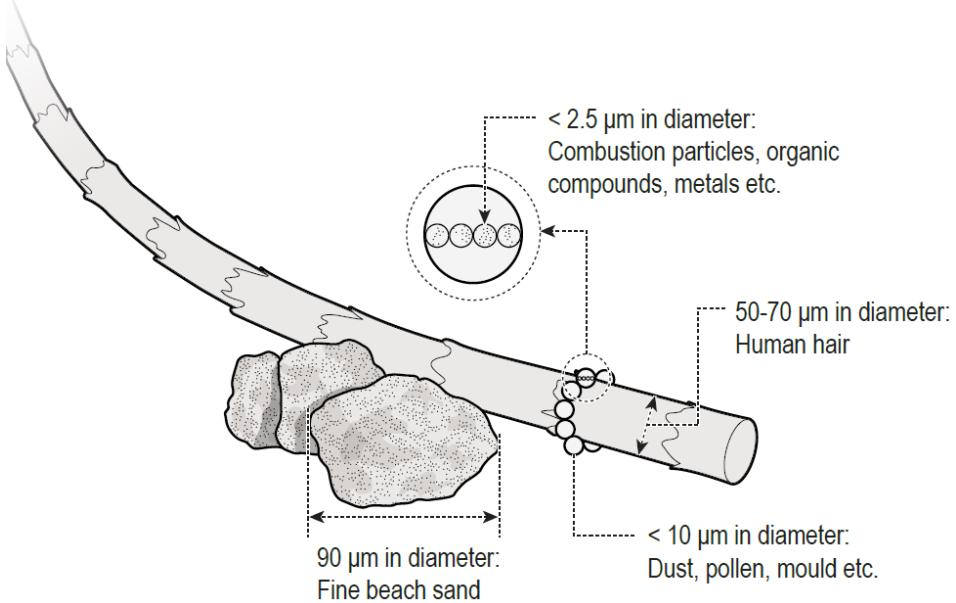
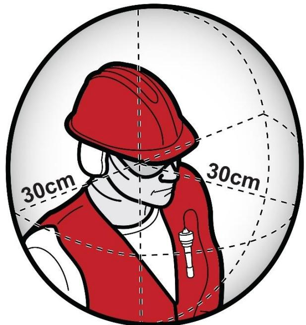
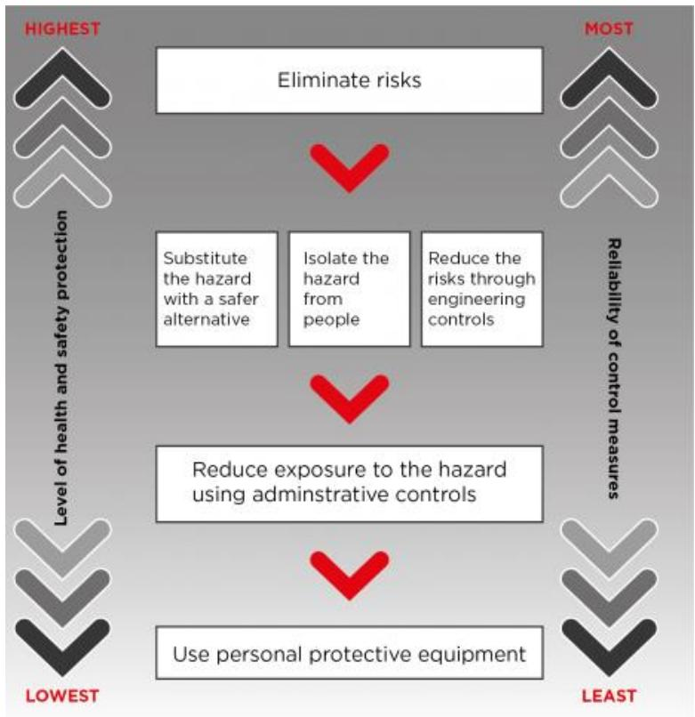
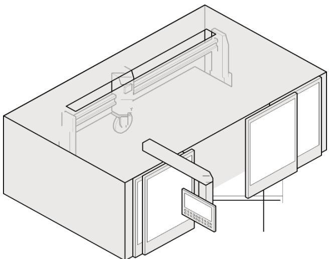
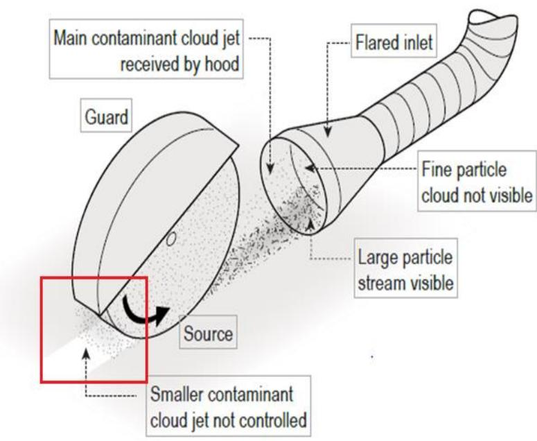
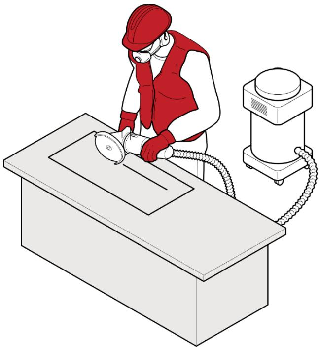
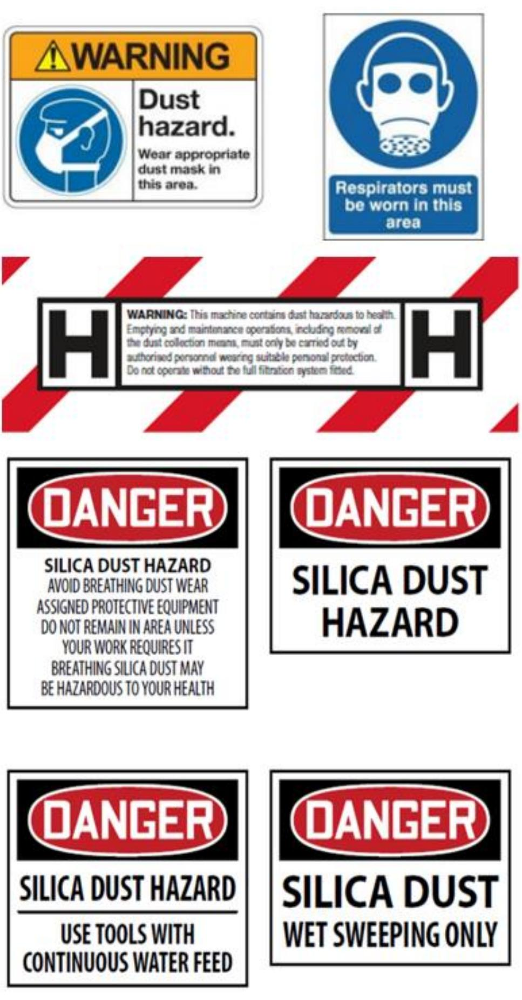
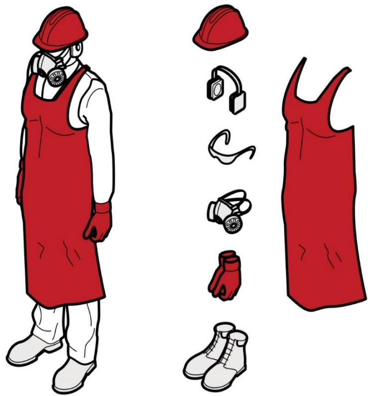

# Managing the risks of respirable crystalline silica from engineered stone in the workplace

Code of Practice

# Disclaimer

Safe Work Australia is an Australian Government statutory agency established in 2009. Safe Work Australia includes Members from the Commonwealth, and each state and territory, Members representing the interests of workers and Members representing the interests of employers.

Safe Work Australia works with the Commonwealth, state and territory governments to improve work health and safety and workers compensation arrangements. Safe Work Australia is a national policy body, not a regulator of work health and safety. The Commonwealth, states and territories have responsibility for regulating and enforcing work health and safety laws in their jurisdiction.

ISBN 978- 1- 76114- 105- 6(Online PDF)

ISBN 978- 1- 76114- 124- 9 (Online DOCX)

# Creative Commons

With the exception of the Safe Work Australia logo, this copyright work is licensed under a Creative Commons Attribution 4.0 International licence. To view a copy of this licence, visit creativecommons.org/licenses In essence, you are free to copy, communicate and adapt the work for non- commercial purposes, as long as you attribute the work to Safe Work Australia and abide by the other licence terms.

# Contact information

Safe Work Australia | info@swa.gov.au | www.swa.gov.au

# Contents

Contents 3

Foreword 4

1. Introduction 6

1. Introduction 61.1. What is engineered stone? 61.2. What is respirable crystalline silica? 71.3. Health effects of silica dust 81.4. Who has health and safety duties in relation to working with engineered stone? 91.5. Other relevant duties 121.6. Safe Work Method Statements (SWMS) 14

2. Role of designers, manufacturers, importers and suppliers 17

2.1. Duties of designers, manufacturers, importers and suppliers 17

3. Specific duties for working with engineered stone 19

3.1. Workplace exposure standard for respirable crystalline silica 193.2. Air monitoring 203.3. Health monitoring 23

4. How to manage and control the risks from working with engineered stone 28

4.1. Identifying the hazard 284.2. Assessing the risks 294.3. Silica dust control plan 304.4. Controlling the risks 31

5. Maintaining and reviewing control measures 45

5.1. Maintenance of control measures 455.2. Review of control measures 46

6. Clean-up and disposal of silica dust 48

6.1. Cleaning and housekeeping 486.2. Management of water and waste 49

7. Post-installation 51

7.1. Maintenance or refurbishment of engineered stone 517.2. Removal 51

Appendix A - Glossary 52

Appendix B - Silica dust control plan template 55

model Code of Practice: Managing the risks of respirable crystalline silica from engineered stone in the workplace

# Foreword

This model Code of Practice on managing the risks of respirable crystalline silica from engineered stone in the workplace (hereafter referred to as the Code) is an approved code of practice under section 274 of the Work Health and Safety Act (the WHS Act).

An approved code of practice provides practical guidance on how to achieve the standards of work health and safety required under the WHS Act and the Work Health and Safety Regulations (the WHS Regulations) and effective ways to identify and manage risks.

A code of practice can assist anyone who has a duty of care in the circumstances described in the code of practice to achieve compliance with the health and safety duties in the WHS Act and WHS Regulations, in relation to the subject matter of the code of practice. Like regulations, codes of practice deal with particular issues and may not cover all hazards or risks in the workplace. The health and safety duties require duty holders to consider all risks associated with work, not only those for which regulations and codes of practice exist.

Codes of practice are admissible in court proceedings under the WHS Act and WHS Regulations. Courts may regard a code of practice as evidence of what is known about a hazard, risk, risk assessment or risk control and may rely on the code in determining what is reasonably practicable in the circumstances to which the code of practice relates. For further information see the Interpretive Guideline: The meaning of 'reasonably practicable'.

Compliance with the WHS Act and WHS Regulations may be achieved by following another method if it provides an equivalent or higher standard of work health and safety than the code of practice.

An inspector may refer to an approved code of practice when issuing an improvement or prohibition notice.

In circumstances where equipment, or methods, for managing work health and safety (WHS) risks are used in the workplace, it is recommended that current Australian standards or recognised international standards are applied, where available.

# Scope and application

This Code is intended to be used by a range of duty holders to assist them in complying with the WHS Act and WHS Regulations. Duty holders include persons conducting a business or undertaking (PCBUs), workers and their health and safety representatives (HSR), manufacturers, importers and suppliers. It provides practical guidance on how to effectively manage risks associated with working with engineered stone and, subsequently, minimise the incidence of respirable crystalline silica related diseases, such as silicosis.

This Code provides guidance through the lifecycle of an engineered stone product including fabrication, installation, maintenance, removal and disposal.

Working with engineered stone carries a range of risks beyond those covered in this Code, such as manual handling. Safe Work Australia has published other relevant model Codes of Practice to help manage these risks including:

- Managing the work environment and facilities- Construction work, and- Hazardous manual tasks.

# How to use this Code of Practice

This Code includes references to legal requirements under the model WHS Act and WHS Regulations. These are included for convenience only and should not be relied upon in place

Managing the risks of respirable crystalline silica from engineered stone in the workplace Code of Practice Page 4 of 59

of the full text of the WHS Act or WHS Regulations. The words 'must', 'requires' or 'mandatory' indicate a legal requirement exists that must be complied with.

The word 'should' is used in this Code to indicate a recommended course of action, while 'may' is used to indicate an optional course of action.

model Code of Practice: Managing the risks of respirable crystalline silica from engineered stone in the workplace

Page 5 of 59

# 1. Introduction

Working with engineered stone can expose workers, and other persons, to the risks of respirable crystalline silica (silica dust). Exposure to silica dust can have serious health effects, including fatal lung disease.

# 1.1. What is engineered stone?

For the purpose of this Code, engineered stone' is an artificial product that:

a) is created by combining and heat curing natural stone materials that contain crystalline silica (such as quartz or stone aggregate) with chemical constituents (such as water, resins or pigments), and 
b) can be manipulated through mechanical processes to manufacture other products (such as kitchen benchtops).

Engineered stone does not include natural stone that has not been combined with other products or heat cured (for example granite and quartz in their natural state).

Engineered stone is also known as composite stone, manufactured stone, artificial stone, reconstituted stone or quartz conglomerate. The crystalline silica content in engineered stone varies widely but it can contain greater than 90 per cent crystalline silica, which is significantly greater than that found in natural stones.

Table 1 outlines the variation in silica content that can exist in different types of stone.

Table 1: Types of stone and the approximate amount of silica they contain.

<table><tr><td>Type</td><td>Amount of silica (%)</td></tr><tr><td>Marble</td><td>2</td></tr><tr><td>Limestone</td><td>2</td></tr><tr><td>Slate</td><td>20 to 40</td></tr><tr><td>Shale</td><td>22</td></tr><tr><td>Granite</td><td>20 to 45 (typically 30)</td></tr><tr><td>Natural sandstone</td><td>70 to 95</td></tr><tr><td>Engineered stone</td><td>up to 97</td></tr></table>

For the purposes of this Code, the term engineered stone covers the entire product lifecycle, including:

design and manufacture supply to a workplace for fabrication fabrication installation, and

- post-installation (maintenance, remodelling and removal).

# 1.2. What is respirable crystalline silica?

Crystalline silica is the crystalline form of silicon dioxide, a naturally occurring mineral that forms a major component of most rocks. It is found in natural stones like granite and sandstone and is used to create artificial products like engineered stone and tiles.

When dust is created through natural or artificial means it comes in a range of sizes, from very small (less than 10 micrometres  $[\mu \text{m} ]$  in diameter) to larger particles that can be seen with the naked eye. Dust that is less than  $10\mu \mathrm{m}$  in diameter (Figure 1) is known as respirable dust as, when inhaled, it travels deep into the lungs.

  
Figure 1: Dust particle sizes (original image from Mining and Quarrying Occupational Health and Safety Committee).

In its solid form, such as the slab supplied to a workplace for fabrication, engineered stone does not have hazardous properties; it is the dust that is generated from engineered stone that has the potential to cause harm when it is breathed in.

The fabrication stage involves using mechanical processes such as cutting, grinding, trimming, drilling, sanding and polishing of the engineered stone to create a specific product ready to be supplied for installation. For example, creating a kitchen benchtop to size and cutting holes for positioning a sink and tap.

Once the fabricated engineered stone product is installed, further mechanical processes may be required, for example, minor cutting to enable a custom fit, or for maintenance purposes.

Cutting, grinding, trimming, drilling, sanding and polishing engineered stone products generates respirable dust containing crystalline silica (silica dust). When breathed in over time, silica dust can cause fatal lung disease. The risks are much greater where the engineered stone contains high levels of crystalline silica.

Workers fabricating, processing, installing, maintaining or removing engineered stone products without appropriate control measures in place may be exposed to high levels of silica dust (for example through dust or mist clouds). Workers can also be exposed to silica model Code of Practice: Managing the risks of respirable crystalline silica from engineered stone in the workplace

dust from poor housekeeping methods that disturb accumulated dust, including dry sweeping, using compressed air or high- pressure water cleaners and general- purpose vacuum cleaners not designed for use with hazardous dusts.

# 1.3. Health effects of silica dust

Silica dust is a significant health hazard for workers. Very small particles of silica dust cannot be seen under normal lighting or with the naked eye and stay airborne for long periods of time. When airborne, workers can easily inhale the small silica dust particles deep into their lungs where it can lead to a range of respiratory diseases, including:

- silicosis- progressive massive fibrosis- chronic obstructive pulmonary disease- chronic bronchitis, and- lung cancer.

Silica dust also increases the risk of developing chronic kidney disease, autoimmune disorders (such as scleroderma and systemic lupus erythematosus) and other adverse health effects, including an increased risk of activating latent tuberculosis, eye irritation and eye damage.

# Silicosis

Silicosis is a serious, irreversible lung disease that causes permanent disability and can be fatal. Silica dust can be breathed deep into the lungs and, when silica dust comes into prolonged contact with the lung tissue, it causes inflammation and scarring and reduces the lungs' ability to take in oxygen. Silicosis may continue to progress even after a worker is removed from exposure to silica dust. As the disease progresses, a worker may experience shortness of breath, a severe cough or general weakness. There are three types of silicosis (Table 2).

Table 2.Types of silicosis.  

<table><tr><td>Silicosis type</td><td>Exposure type</td><td>Respiratory impact of exposure</td></tr><tr><td>Acute</td><td>Can develop after short-term and very high levels of silica dust (for example less than one year, and after a few weeks).</td><td>Causes severe inflammation and protein in the lung.</td></tr><tr><td>Accelerated</td><td>Results from short term exposure to large amounts of silica dust (1 to 10 years of exposure).</td><td>Causes inflammation, and protein and scarring in the lung (fibrotic nodules).</td></tr><tr><td>Chronic</td><td>Results from long term exposure (over 10 years of exposure) to low levels of silica dust.</td><td>Causes scarring of the lung and shortness of breath.</td></tr></table>

Damage to the lungs from silica dust and symptoms of disease (such as lung cancer, silicosis and progressive massive fibrosis) may not appear for many years. Workers may not model Code of Practice: Managing the risks of respirable crystalline silica from engineered stone in the workplace

show any symptoms, even at the point of initial diagnosis, which is why prevention and health monitoring are critical. Health monitoring requirements for workers who work with engineered stone are detailed in Part 3.3 of this Code.

There is no cure for silicosis. However, all silica dust- related diseases are preventable through using effective controls throughout the lifecycle of the product to eliminate or minimise exposure to silica dust at the workplace.

# 1.4. Who has health and safety duties in relation to working with engineered stone?

Duty holders with a role in managing the risks of silica dust when working with engineered stone include:

persons conducting businesses or undertakings (PCBUs) officers designers, manufacturers, importers, suppliers workers, and other persons in the workplace.

A person can have more than one duty and more than one person can have the same duty at the same time.

# Person conducting a business or undertaking (PCBU)

# WHS Act section 19

Primary duty of care

When working with engineered stone, a PCBU must eliminate risks arising from exposure to silica dust or, if that is not reasonably practicable, minimise the risks so far as is reasonably practicable to workers and other persons at their workplace.

The WHS Regulations include specific requirements for a PCBU to manage the risks associated with hazardous chemicals, including air monitoring and health monitoring (see Part 3 of this Code).

Respirable crystalline silica is classified as a hazardous chemical according to the Globally Harmonized System of Classification and Labelling of Chemicals (GHS) and has a workplace exposure standard.

More information about the classification of respirable crystalline silica can be found in the Hazardous Chemicals Information System (HCIS).

# Further duties of persons conducting businesses or undertakings

# WHS Act section 20

Duty of persons conducting businesses or undertakings involving management or control of workplaces

model Code of Practice: Managing the risks of respirable crystalline silica from engineered stone in the workplace

The person with management or control of a workplace must ensure, so far as is reasonably practicable, that the workplace, the means of entering and exiting the workplace and anything arising from the workplace are without risks to the health and safety of any person.

# WHS Act section 21

Duty of persons conducting businesses or undertakings involving management or control of fixtures, fittings or plant at workplaces

The person with management or control of fixtures, fittings or plant at a workplace, must ensure, so far as is reasonably practicable, that the fixtures, fittings and plant are without risks to the health and safety of any person.

# Officers

# WHS Act section 27

Duty of officers

Officers, for example company directors, have a duty to exercise due diligence to ensure the PCBU complies with the WHS Act and WHS Regulations. This includes taking reasonable steps to ensure that the PCBU has and uses appropriate resources and processes to eliminate or minimise risks that arise from working with engineered stone; namely exposure to silica dust. More information on who is an officer and their duties is in the Interpretive Guideline: The health and safety duty of an officer under section 27.

model Code of Practice: Managing the risks of respirable crystalline silica from engineered stone in the workplace

# Designers, manufacturers, importers and suppliers of plant, substances or structures

# WHS Act Part 2 Division 3

Further duties of persons conducting businesses or undertakings

# WHS Act section 22

Duties of persons conducting businesses or undertakings that design plant, substances or structures

# WHS Act section 23

Duties of persons conducting businesses or undertakings that manufacture plant, substances or structures

# WHS Act section 24

Duties of persons conducting businesses or undertakings that import plant, substances or structures

# WHS Act section 25

Duties of persons conducting businesses or undertakings that supply plant, substances or structures

Designers, manufacturers, importers and suppliers of engineered stone used at the workplace must ensure, so far as is reasonably practicable, the engineered stone they design, manufacture, import or supply is without risks to health and safety.

More information specifically for designers, manufacturers, importers and suppliers is in Part 2 of this Code.

# Workers

# WHS Act section 28

Duties of workers

As defined in the WHS Act, workers include employees, contractors and subcontractors and their employees, labour hire workers, outworkers, apprentices, trainees, work experience students and volunteers. Workers have a duty to take reasonable care for their own health and safety and they must take reasonable care that their acts or omissions do not adversely affect the health and safety of other persons. Workers must:

- comply with reasonable instructions, as far as they are reasonably able, and- cooperate with reasonable health and safety policies that have been notified to workers, including health monitoring, if they have been told about it beforehand.

model Code of Practice: Managing the risks of respirable crystalline silica from engineered stone in the workplace

# Other persons in the workplace

# WHS Act section 29

Duties of other persons at the workplace

Other persons at the workplace, like visitors, must take reasonable care for their own health and safety and must take care not to adversely affect other people's health and safety. They must comply, so far as they are reasonably able, with reasonable instructions given by the PCBU to allow that person to comply with the WHS Act. For example, if engineered stone is being installed at a customer's home by a PCBU, that home becomes a workplace. The homeowner and other people who enter the home while it is a workplace are other persons for the purposes of the WHS Act.

# 1.5. Other relevant duties

# Consultation

# WHS Act section 47

Duty to consult workers

# WHS Act section 48

Nature of consultation

A PCBU must consult, so far as is reasonably practicable, with workers who carry out work for the business or undertaking and the HSR (if any), who are (or are likely to be) directly affected by a work health and safety matter. Worker input and participation improves decision- making about health and safety matters and assists in reducing work- related injuries and disease.

Workers are entitled to be represented in consultations by a HSR who has been elected to represent their work group.

Workers who work with engineered stone and the HSR (if any) must be consulted on health and safety matters, including, but not limited to:

identifying the tasks and processes that may result in exposure to silica dust developing a silica dust control plan making changes to processes or procedures that generate silica dust making changes to controls to protect workers from silica dust proposing changes that may affect worker health and safety for example, positioning of work spaces, non- fabrication areas and ventilation systems monitoring the health of workers exposed to silica dust, including deciding on the medical practitioner to carry out health monitoring monitoring the conditions at the workplace resolving health and safety issues, and providing information and training for workers.

When discussing health and safety matters with workers, workers must be provided with reasonable opportunity to express views before any decisions are made.

model Code of Practice: Managing the risks of respirable crystalline silica from engineered stone in the workplace

# Consulting, cooperating and coordinating activities with other duty holders

# WHS Act section 46

Duty to consult with other duty holders

A PCBU must consult, cooperate and coordinate activities with all other persons who have a work health or safety duty in relation to the same matter, so far as is reasonably practicable.

Where there is more than one PCBU involved in work being carried out at the same location, each duty holder should exchange information to find out who is doing what task and work together in a cooperative and coordinated way, so risks are eliminated or minimised so far as is reasonably practicable.

An example of when multiple duty holders may need to consult, cooperate and coordinate is during installation of an engineered stone kitchen bench top in a home. During the installation, multiple PCBUs may carry out activities on the same site, such as electricians, plumbers, or cabinetmakers. They each have a duty to protect the health and safety of workers and other persons at the workplace and must therefore consult, cooperate and coordinate activities to ensure each person is made aware of what the others are doing, to identify the hazards and risks and decide who is best placed to take action to control the risks.

Duty holders' work activities may overlap and interact at times. When they share a duty, for example a duty in relation to the health and safety of the same worker or workers, or are involved in the same work, they will be required to consult, cooperate and coordinate activities with each other so far as is reasonably practicable.

See the model Code of Practice: Work health and safety consultation, cooperation and coordination for guidance on consultation.

Providing information, training, instruction and supervision

# WHS Act 19

Primary duty of care

# WHS Regulation 39

Provision of information, training and instruction

The WHS Act requires that a PCBU ensures, so far as is reasonably practicable, the provision of any information, training, instruction and supervision that is necessary to protect all persons from risks to their health and safety arising from work with engineered stone that is carried out as part of the conduct of the business or undertaking.

A PCBU must ensure that information, training and instruction provided to a worker are suitable and adequate and have regard to:

the nature of the work carried out by the worker the nature of the risks associated with the work at the time the information, training and instruction is provided, and the control measures implemented.

A PCBU must also ensure, so far as is reasonably practicable, that information, training and instruction are provided in a way that is readily understandable by any person to whom it is model Code of Practice: Managing the risks of respirable crystalline silica from engineered stone in the workplace

provided. A PCBU should consider any special requirements of the workers, for example, information, training and instruction may need to be provided in a language other than English. Other considerations include the specific skills or experience, disability, literacy or age of the worker.

Workers must be trained and have the appropriate skills to carry out tasks safely. Training should be provided to workers by a competent person. A competent person is a person who has acquired through training, qualification or experience the knowledge and skills to carry out the task.

A PCBU should obtain any information related to the health hazards of engineered stone and any instructions on safe work practices available from the suppliers of engineered stone for use in instruction and training activities.

Training should be practical, and where relevant, include hands- on sessions, for example:

- correctly setting up local exhaust ventilation (LEV), or- demonstrating to workers how to safely use tools, such as angle grinders, when working with engineered stone.

Information, training and instruction provided to workers who carry out work with engineered stone must include the proper use, wearing, storage and maintenance of personal protective equipment (PPE), and should also include information about, but not limited to:

- the risk management process- the information provided by the manufacturer or supplier about the type of engineered stone being used in the workplace- the hazards and risks associated with exposure to silica dust- the work practices and procedures that must be followed when working with engineered stone- the control measures implemented, including information on the correct use and maintenance of the controls, working off-site (for example, engineered stone installation), waste collection and disposal- emergency procedures, including any special decontamination procedures- first aid and incident reporting procedures in case of injury or illness- the purpose and results of air monitoring, and- any health monitoring that may be required.

A PCBU should review training regularly, particularly if there has been a change to the way in which work is performed, or a request is made by the HSR. For example:

- when there is a change to work processes, plant or equipment- when there is an incident, and- if new control measures are implemented.

# 1.6. Safe Work Method Statements (SWMS)

# WHS Regulation Part 6.3 Division 2

High risk construction work - safe work method statements

# High risk construction work

model Code of Practice: Managing the risks of respirable crystalline silica from engineered stone in the workplace

'Construction work' is defined in the WHS Regulations as any work carried out in connection with the construction, alteration, conversion, fitting- out, commissioning, renovation, repair, maintenance, refurbishment, demolition, decommissioning or dismantling of a structure.

Regulation 291 of the WHS Regulations sets out a list of construction work that is high risk for the purposes of the Regulations, and for which a safe work method statement (SWMS) is required. This includes work 'carried out in an area that may have a contaminated or flammable atmosphere'.

The on- site installation of engineered stone is considered high risk construction work if the processes used to install, modify or repair the engineered stone such as, cutting, grinding, trimming, drilling, sanding, or polishing generate silica dust and contaminate the work area.

A SWMS must be prepared before carrying out any on- site installation of engineered stone that involves any processing, modification or repair of the engineered stone that may generate silica dust.

A SWMS is required because it helps a PCBU clearly communicate to all workers at the construction site any health and safety risks and how they will be managed. A SWMS is not required for work undertaken during fabrication of the engineered stone at a workshop.

# Who is responsible for preparing a SwMs?

A PCBU must prepare a SWMS, or ensure a SWMS has been prepared, before installation of the engineered stone starts. The person responsible for carrying out the on- site installation of the engineered stone is often best placed to prepare the SWMS in consultation with workers who will be directly engaged in the installation of the engineered stone and HSRs, if any.

If more than one PCBU has the duty to ensure a SWMS is or has been prepared, they must consult and cooperate with each other to coordinate who will be responsible for preparing it.

There may be situations when different types of high- risk construction work occur at the same time at the same workplace. In this situation, one SWMS may be prepared to cover any high- risk construction work activities being carried out at the workplace.

Alternatively, a separate SWMS can be prepared for each type of high- risk construction work. If separate SWMS are prepared, consider how the different types of work activities may impact on each other and whether this may lead to inconsistencies between control measures.

The on- site installation of engineered stone will often be carried out in connection with a construction project. In this instance, the SWMS must consider the WHS management plan prepared by the principal contractor of the construction project.

A PCBU must provide the principal contractor with a copy of the SWMS before high risk construction work starts. If not made available, the principal contractor would need to take reasonable steps to obtain a copy of the SWMS before construction work commences.

More information on multiple and shared duties can be found in the model Code of Practice: Construction work.

# What should a SwMs include?

The content of a SWMS should provide clear direction on the control measures to be implemented. There should be no statements that require a decision to be made by supervisors or workers. For example, the statement 'use appropriate PPE' does not detail the control measures. The control measures should be clearly specified.

model Code of Practice: Managing the risks of respirable crystalline silica from engineered stone in the workplace

The SWMS must be accessible and understandable to any individual who needs to use it. It is important that those who need to carry out work in accordance with the SWMS understand the detail of the SWMS and what they are required to do to implement and maintain risk controls. For example, it should consider the literacy needs and the cultural or linguistically diverse backgrounds of the workers.

A SWMS must include the following information:

- identify the high-risk construction work activities to be carried out on-site- the hazards and risks to health and safety arising from these activities- the measures to be implemented to control the risks, and- how the control measures are to be implemented, monitored and reviewed.

# Complying with a SWMS

# WHS Regulation 300

Compliance with safe work method statement

If high risk construction work is not carried out in accordance with the SWMS for the work, the PCBU must ensure that the work is:

- stopped immediately or as soon as it is safe to do so, and- resumed only in accordance with the statement.

More information about a SWMS for high risk construction work and a SWMS template can be found in the model Code of Practice: Construction work.

model Code of Practice: Managing the risks of respirable crystalline silica from engineered stone in the workplace

# 2. Role of designers, manufacturers, importers and suppliers

Designers, manufacturers, importers and suppliers of engineered stone all play important roles in ensuring risks to workers and other persons are eliminated or minimised.

This is because in these early phases of the product lifecycle there is greater scope to:

minimise risks through design  $\bigcirc$  for example, reduce the amount of crystalline silica in the product and therefore reduce the risk of exposure to silica dust, and incorporate risk control measures that are compatible with the original design concept and functional requirements of the product  $\bigcirc$  for example, manufacturing a made- to- size product that can be installed with little to no need for cutting or grinding.

Providing information to downstream duty holders (like PCBUs who fabricate or install engineered stone products) is a key factor in assisting them to meet their duty to manage health and safety risks. Information should be passed on from the designer and/or manufacturer to the importer, supplier and the end user.

# 2.1. Duties of designers, manufacturers, importers and suppliers

Designers, manufacturers, importers and suppliers must ensure, so far as is reasonably practicable, that the engineered stone they design and manufacture, is without risks to the health and safety of persons at the workplace or within the vicinity of the workplace.

Designers, manufacturers, importers and suppliers must carry out, or arrange the carrying out of, any calculations, analysis, testing or examination that may be necessary to meet their duties.

Designers, manufacturers, importers and suppliers must give adequate information to downstream users of:

the intended purpose of the engineered stone the results of any calculations, analysis, testing or examination in relation to the engineered stone, including any hazardous properties  $\bigcirc$  for example, the amount of crystalline silica contained in the product, expressed as a percentage any conditions necessary to ensure the engineered stone is without risks to health and safety when used correctly for its intended purpose  $\bigcirc$  for example, appropriate controls for fabrication, installation, maintenance or removal of the engineered stone product.

This information can be provided in the form of a label, product information sheet or a safety data sheet.

Importers and suppliers can obtain information about the engineered stone products that they are importing or supplying from the designer or manufacturer.

model Code of Practice: Managing the risks of respirable crystalline silica from engineered stone in the workplace

Designers, manufacturers, importers and suppliers do not have a duty to provide this information as a safety data sheet for solid products that contain crystalline silica, such as engineered stone. However, safety data sheets are an effective way to communicate information downstream about the risks when working with engineered stone. It is considered good practice to make them available.

If requested, designers, manufacturers, importers and suppliers must, so far as is reasonably practicable, give relevant information to users, and provide any amendments or updates to this information.

More information about safety data sheets can be found on the Safe Work Australia website.

model Code of Practice: Managing the risks of respirable crystalline silica from engineered stone in the workplace

# 3. Specific duties for working with engineered stone

# 3.1. Workplace exposure standard for respirable crystalline silica

# WHS Regulation 49

Ensuring exposure standards for substances and mixtures not exceeded

An exposure standard represents the airborne concentration of a particular substance or mixture that must not be exceeded. It does not represent a line between a 'safe' and 'unsafe' concentration of an airborne substance or mixture. The exposure standard does not eliminate risk of disease and some people might experience adverse health effects below the exposure standard.

A PCBU at a workplace must ensure that no person at the workplace is exposed to a substance or mixture in an airborne concentration that exceeds the exposure standard for the substance or mixture. The duty to ensure the workplace exposure standard is not exceeded is absolute and not qualified by 'so far as is reasonably practicable'.

This means that a PCBU must ensure that no person at the workplace is exposed to a hazardous chemical, such as crystalline silica, at a concentration above the workplace exposure standard.

The workplace exposure standard for respirable crystalline silica is an eight hour time weighted average (TWA) of 0.05 milligrams per cubic metre  $(mg / m^3)$

# Adjustment of exposure standards for extended work shifts

A TWA is based on exposure that happens over an eight hour working day followed by 16 hours of no exposure, over a five day working week.

To comply with the WHS Regulations, it may be necessary for the PCBU to adjust the TWA to compensate for greater exposure during longer work shifts and decreased time between shifts. Situations where the TWA may need to be adjusted include where workers have:

- a working day longer than eight hours- for example, a worker's daily hours are 7 am to 5 pm with a one hour lunch break Monday to Friday- a working week longer than 40 hours- for example, a worker's weekly hours are 8 am to 3 pm Monday and Tuesday and 7 am to 6 pm Wednesday to Thursday with a one hour lunch break, or- work shift rotations in excess of either eight hours a day or 40 hours a week.

A competent person, such as a certified occupational hygienist, should be engaged to adjust the workplace exposure standard to account for shift variations or longer working weeks.

model Code of Practice: Managing the risks of respirable crystalline silica from engineered stone in the workplace

The workplace exposure standard must not be adjusted upwards, even for shifts less than eight hours.

More information can be found in the Guidance on interpretation of Workplace exposure standards for airborne contaminants.

# 3.2. Air monitoring

# WHS Regulation 50

Monitoring airborne contaminant levels

A PCBU must ensure that air monitoring is carried out to determine the airborne concentration of silica dust in a worker's breathing zone, if necessary, to determine:

whether there is a risk to a worker's health, or if the PCBU is not certain whether silica dust levels exceed the workplace exposure standard.

Air monitoring can also be used to:

- check the effectiveness of control measures, including any new control measures- inform workers of their pattern of exposure- determine the right level of respiratory protection, and- inform health monitoring requirements.

Air monitoring does not prevent disease and is not an alternative to implementing effective control measures.

A PCBU should ensure air monitoring is conducted by an independent, competent person. For example, a certified occupational hygienist or a person with recognised equivalent competency under an international certification scheme.

Air monitoring to determine a worker's exposure involves measuring the level of silica dust in the breathing zone of workers using a personal sampler during their usual shift activities, including routine breaks. Figure 2 shows an approximation of a worker's breathing zone.

model Code of Practice: Managing the risks of respirable crystalline silica from engineered stone in the workplace

  
Figure 2: Worker's breathing zone.

# When air monitoring is recommended

When commencing work with engineered stone, a PCBU should undertake baseline air monitoring to ensure that silica dust levels do not exceed the workplace exposure standard and that any risks to workers' health are minimised. Air monitoring should be repeated to ensure the air monitoring results are accurate and representative of the work being undertaken.

After a baseline is established, air monitoring should be undertaken:

- at least every 12 months, or- in response to the triggers outlined below.

Examples of triggers for undertaking additional air monitoring include:

- changes to work practices (for example, new equipment being commissioned), production, processes (for example, redesign of a work process), procedures or control measures which may reasonably be expected to result in new or additional exposure risks- a health monitoring report indicating an adverse result in circumstances where the baseline or previous monitoring reports for that worker did not indicate any abnormality- a HSR requests a review of control measures- the results of worker consultation indicate monitoring is required- for example, when a worker or their representative's concern is confirmed, or- lowering of the workplace exposure standard where previous air monitoring results indicate levels above the new workplace exposure standard.

There are certain roles that are likely to have a high exposure to silica dust. These include (but are not limited to):

- shapers- saw operators- finishers- machine operators

model Code of Practice: Managing the risks of respirable crystalline silica from engineered stone in the workplace

- polishers, and- labourers/ supervisors.

# Air monitoring report

An air monitoring report is prepared by a competent person, such as a certified occupational hygienist and should include:

the background and purpose of the air monitoring including the current workplace exposure standard for silica dust the task to be measured including work patterns and hazards involved with this task the control measures in place and their performance what sampling and measurements were taken (long and short- term) including information on the calibration of the sampling equipment specifics of how sampling was taken how and where the samples were analysed including information on the calibration of the analysis equipment details of the persons, or similarly exposed groups sampled any similar exposure groups that may potentially be exposed but were not sampled an interpretation of the results including:  $\bigcirc$  sources of exposure  $\bigcirc$  adequacy of current control measures  $\bigcirc$  an assessment of risk including identification of tasks not measured that are likely to be an exposure source and any workers that could be exposed but were not measured, and  $\bigcirc$  compliance with WHS laws recommendations, for example:  $\bigcirc$  a dust control action plan  $\bigcirc$  changing control measures and work practices  $\bigcirc$  increased worker training  $\bigcirc$  health monitoring, and  $\bigcirc$  further air monitoring.

The air monitoring report should be made available to a WHS inspector on request and to a registered medical practitioner carrying out or supervising health monitoring.

Additionally, a PCBU must ensure that the results of air monitoring carried out are:

- recorded in writing or electronically- kept for 30 years after the date the record is made, and- readily accessible to workers who may be exposed to silica dust and their representatives.

# Static air monitoring

Static or fixed position monitoring may be undertaken at fixed workplaces, such as fabrication workshops, to determine general background levels of respirable crystalline silica outside of a worker's breathing zone.

Static monitoring involves taking samples of air from fixed locations outside the area where the engineered stone is being processed.

Static monitoring can help in determining the design of risk controls or the effectiveness of existing risk controls, however it should not be used as an indicator of actual worker exposure to respirable crystalline silica.

model Code of Practice: Managing the risks of respirable crystalline silica from engineered stone in the workplace

# 3.3. Health monitoring

# WHS Regulations Part 7.1 Division 6

Health monitoring

Health monitoring is the monitoring of a person's health to identify changes in their health status as a result of exposure to certain substances. Health monitoring is important for workers who work with engineered stone because exposure to crystalline silica through silica dust poses a significant risk to their health.

Health monitoring for workers exposed to crystalline silica primarily involves screening the changes in a worker's body that may indicate the development of silica related- injury, illness or disease. Health monitoring is necessary to:

detect the early signs of adverse health effects help identify control measures that are not working effectively, and assist in protecting workers from the risk of exposure to silica dust.

More information about what 'significant risk' means can be found in the Health monitoring for persons conducting a business or undertaking guide.

# When to provide health monitoring

A PCBU must organise and pay for health monitoring if there is a significant risk to the health of their workers because of exposure to silica dust at the workplace.

This means that a PCBU must provide and pay for health monitoring for all workers involved in fabrication and installation of engineered stone. Examples of workers that the PCBU should provide health monitoring for include:

shapers machine operators including saw operators finishers polishers, and labourers and supervisors involved in the fabrication or installation of engineered stone.

A PCBU should also consider providing health monitoring to other workers who might be exposed to silica dust from these processes. This includes workers who are exposed to dust while cleaning work areas or equipment, maintenance workers, salespeople, or those who perform administrative work in the vicinity of fabrication and installation.

A PCBU should provide health monitoring before a worker starts work to establish a baseline from which changes can be detected (unless the worker has participated in health monitoring within the previous two years and the results of the tests are available). From the initial health monitoring date, a worker's health should then be monitored at least annually. At the end of a worker's time working with engineered stone, for example, before retirement or before the worker's duties change permanently, a final medical examination should be carried out by the registered medical practitioner carrying out or supervising the health monitoring.

Note: As workers may work for multiple PCBUs it is important to consider when they last participated in workplace health monitoring and consult with a registered medical practitioner to avoid them having excessive radiation.

model Code of Practice: Managing the risks of respirable crystalline silica from engineered stone in the workplace

# Participation in health monitoring

Some workers may be reluctant to participate in health monitoring. This may be due to anxiety about the testing and medical results or the impact the results may have on their job, or both.

Under the WHS Regulations, a PCBU has a duty to provide health monitoring to workers where they conduct ongoing work at a workplace generating silica dust and there is a significant risk to their health because of exposure to silica dust. If a worker refuses to participate in health monitoring, a PCBU should first try the steps outlined below. If the worker still refuses health monitoring, a PCBU may take action to meet their duties under the WHS laws by removing the worker from the task or role that involves exposure to silica dust.

When considering the removal of a worker from the task or role, the PCBU should seek appropriate advice to ensure any action taken is consistent with other workplace laws.

A PCBU should encourage workers to participate and provide them with information and training on the purpose of health monitoring. Early detection of health effects can lead to an early diagnosis or treatment and prevent more serious and life- threatening conditions from developing.

Supporting a worker in these circumstances can be achieved by:

ensuring they know how health monitoring will benefit them making the process easy for them to follow providing interpreters for workers where English is not their first language, and reminding them that their workplace, family and community want them to be as safe and healthy as possible.

Conversations with workers about their individual health monitoring should be held privately to maintain confidentiality.

A PCBU must also consult with their HSRs about health monitoring. They may also assist in this process and encourage workers to participate in health monitoring.

# Providing a health monitoring program

When providing health monitoring, a PCBU must:

When providing health monitoring, a PCBU must:- give information to workers prior to the commencement of work and to prospective workers about health monitoring requirements    - ensuring that this information is understandable by the worker, for example, consider literacy needs and cultural or linguistically diverse backgrounds- ensure health monitoring is carried out by or under the supervision of a registered medical practitioner with experience in health monitoring- consult workers about the selection of the registered medical practitioner- pay all expenses relating to health monitoring including time to attend appointments, tests and appointment fees- provide information about a worker to the registered medical practitioner as specified in the WHS Regulations- take all reasonable steps to obtain a report from the registered medical practitioner as soon as practicable after health monitoring has been carried out- provide a copy of the report to the worker and to all other PCBUs who have a duty to provide health monitoring for that worker, for example, where labour hire is used- provide the WHS regulator with a copy of the report if it contains adverse test results or recommendations that remedial measures should be taken- keep reports as confidential records for at least 30 years after the record is made, and model Code of Practice: Managing the risks of respirable crystalline silica from engineered stone in the workplace

- not disclose the report to anyone without the worker's written consent unless required or permitted by law, for example, WHS laws.

# Requirements for health monitoring

Under WHS laws, the minimum requirements for health monitoring for crystalline silica through exposure to silica dust are:

collection of demographic, medical and occupational history records of personal exposure standardised respiratory questionnaire standardised respiratory function tests, for example,  $\mathsf{FEV}_1$  (forced expiratory volume in one second), FVC (forced vital capacity) and  $\mathsf{FEV}_1 / \mathsf{FVC}$  (respiratory ratio, or Tiffeneau index), and chest X- Ray full posterior- anterior (PA) view.

All full- size PA chest X- rays should be taken in a specialist radiology practice or hospital department. The X- rays should be read by a radiologist who meets the reporting requirements and competencies of the Royal Australian and New Zealand College of Radiologists or is qualified as a 'B reader'. A B reader is a radiologist who has undertaken specialised training to detect dust lung diseases such as silicosis, coal workers pneumoconiosis, mixed dust pneumoconiosis and progressive massive fibrosis (PMF).

High- resolution computed tomography (HRCT) is more sensitive and effective than X- rays in the early detection of silicosis. A low dose HRCT scan of the chest (non- contrast) may be used by the registered medical practitioner supervising or carrying out the health monitoring, depending on the worker's history and levels of silica exposure. Given the high risks posed by working with engineered stone, low dose HRCT may be used instead of, or as an adjunct to, X- ray. Alternative imaging methods are being developed and may also be considered.

More information on health monitoring workers for exposure to crystalline silica can be found in the Health monitoring guide - crystalline silica.

# Selecting a suitable registered medical practitioner to carry out or supervise health monitoring

A registered medical practitioner with experience in health monitoring must undertake or supervise the health monitoring. The Royal Australasian College of Physicians website has a list of suitable practitioners. However, a PCBU may decide other doctors may have the necessary experience required to carry out or supervise health monitoring for their workers. A PCBU must consult their workers when selecting a registered medical practitioner and their preference should be considered if they request a particular doctor.

The following information must be supplied by the PCBU to the registered medical practitioner carrying out or supervising the health monitoring:

the name and address of the PCBU the name and date of birth of the worker a description of any of the worker's tasks that relate to exposure to silica dust, and if the worker has started that work, how long the worker has been carrying out that work.

A PCBU should also provide the registered medical practitioner with any available air monitoring reports and risk assessments to assist them with carrying out health monitoring.

# Health monitoring report

model Code of Practice: Managing the risks of respirable crystalline silica from engineered stone in the workplace

A PCBU must take all reasonable steps to obtain a health monitoring report from the registered medical practitioner who carried out or supervised the health monitoring. The health monitoring report should only contain information relating to the health monitoring that was commissioned by the PCBU.

The health monitoring report must include:

- the name and date of birth of the worker- the name and registration number of the registered medical practitioner- the name and address of the PCBU who commissioned the health monitoring- the date of the health monitoring- any test results that indicate whether the worker has been exposed to silica dust- any advice that test results indicate that the worker may have contracted an injury, illness or disease as a result of carrying out the work with engineered stone- any recommendation that the PCBU takes remedial measures, including whether the worker can continue to carry out the work with engineered stone, and- whether medical counselling is required for the worker.

After a PCBU has received the health monitoring report from the registered medical practitioner, they should act on the results, recommendations and advice contained in it.

After receiving the report, a PCBU must provide copies as soon as practicable to:

- the worker, even if they have left employment at the workplace- all other PCBUs who have a duty to provide health monitoring for the worker- for example, where labour hire is used, and- the WHS regulator, if the report contains:- any advice that test results indicate the worker may have contracted an injury, illness or disease as a result of carrying out the work using, handling, generating or storing engineered stone, or- any recommendation that a PCBU takes remedial measures, including whether the worker can continue to carry out the work with engineered stone.

Workers should provide their personal general practitioner (GP) with a copy of the health monitoring report and retain a personal copy along with any exposure history, particularly when the worker moves to other employment. This will assist a registered medical practitioner carrying out or supervising any further health monitoring to compare any previous results with new test and examination results.

The health monitoring report must not be disclosed to any person without the worker's written consent, unless disclosure is required under the WHS laws.

The control measures at the workplace must be reviewed and revised (if necessary) if the report indicates that a worker is experiencing adverse health effects or signs of illness as a result of exposure to silica dust.

A PCBU must ensure that health monitoring reports for a worker are:

- kept as a confidential record- identified as a record for that worker, and- retained for at least 30 years after the record is made.

Treatment programs for adverse health effects should only be discussed between the worker and the registered medical practitioner and should not be included in the health monitoring report that is provided to the PCBU. If the health monitoring report includes health information other than what is required to fulfil the duties, or for which consent has not been given by the worker, the PCBU should return the report to the registered medical practitioner, informing them of the error.

model Code of Practice: Managing the risks of respirable crystalline silica from engineered stone in the workplace

More information about health monitoring reports can be found in the *Health monitoring for PCBUs* guide.

# 4. How to manage and control the risks from working with engineered stone

# WHS Act section 17

Management of risks

Risks arising from working with engineered stone must be eliminated or minimised so far as is reasonably practicable to protect workers and other persons against harm.

Risk management is a proactive, systematic process that helps a PCBU plan and respond to potential hazards and their associated risks in the workplace. It involves four steps:

identifying the hazard assessing the risk, and controlling the risk, and reviewing control measures.

# 4.1. Identifying the hazard

A hazard is a situation or thing that has the potential to harm a person.

For engineered stone, the hazard is the silica dust generated through certain mechanical processes.

To identify the likely sources of silica dust, it is important for a PCBU to consider the following aspects of the workplace and their interactions:

the design and manufacture of the engineered stone, including the percentage of crystalline silica physical work environment o for example, the layout of a workshop equipment, materials and substances used o for example, using angle grinders work tasks and how they are performed o for example, grinding engineered stone which generates silica dust work design and management o for example, a lack of consideration of the product supply chain and lifecycle when designing good work practices and product risk management, and worker experience, knowledge and behaviours.

This may be achieved by:

- conducting a walk-through assessment of the workplace- observing the work and talking to workers and/or HSRs about how work is carried out- inspecting the plant and equipment that is used as part of the fabrication and other relevant processes  
- for example, hand-held tools may generate more silica dust than automated machinery

model Code of Practice: Managing the risks of respirable crystalline silica from engineered stone in the workplace

- undertaking air monitoring at the workplace- inspecting workplace surfaces for build-up of settled dust, and- reading product labels, safety data sheets and manufacturers' instruction manuals.

# 4.2. Assessing the risks

A risk assessment involves considering what could happen if a worker is exposed to a hazard and the likelihood of it happening.

Hazards have the potential to cause different types and severities of harm, ranging from minor discomfort to a serious injury, illness, disease or death. Exposure to silica dust can adversely affect a worker's health, including developing silicosis, progressive massive fibrosis, chronic obstructive pulmonary disease, chronic bronchitis and lung cancer.

Assessing the risks will help to:

- identify which workers are at risk of exposure to silica dust- determine what sources and processes are causing that risk- identify what kind of control measures should be implemented to control the risk- check the effectiveness of existing control measures to control the risk- determine the severity of the risk, and- determine how urgently action may need to be taken.

The nature and severity of risks will depend on various factors, including the:

- percentage of crystalline silica in the engineered stone    
- for example, some engineered stone can have over 90 per cent crystalline silica, while others may have a lower percentage    
- task being undertaken    
- for example, angle grinding can generate more silica dust than other tasks    
- equipment being used    
- for example, hand-held tools may generate more silica dust closer to the worker's breathing zone than automated machinery    
- conditions under which the work with engineered stone is carried out    
- for example, work undertaken in an isolation booth or in an open plan workshop, and    
- skills, competence and experience of the worker.

The potential of exposure of administrative workers to silica dust at fabrication workplaces should also be considered. These workers may be exposed if:

- adequate controls are not implemented, and subsequent background levels of silica dust are high, or- their roles mean they frequently access processing areas    
- for example, administrative workers that frequently walk through or perform tasks in areas near where the processing of engineered stone is undertaken may be exposed to high levels of silica dust.

A PCBU should review the information on the product labels, and any available safety data sheets, to assist in determining the type and severity of the harm. The following questions may help a PCBU to assess the risk:

- How much silica is in the products at the workplace?    
- How often, and for how long, might a worker be exposed to silica dust? model Code of Practice: Managing the risks of respirable crystalline silica from engineered stone in the workplace

What are the scenarios that may cause workers to be exposed to silica dust?  $\bigcirc$  for example, are they exposed to silica dust when it is freshly generated or during housekeeping tasks after dust has accumulated? Is there evidence of exposure to silica dust?  $\bigcirc$  for example, are dust clouds evident near workers when engineered stone is cut? What are the conditions under which the work is carried out?  $\bigcirc$  for example, is work on engineered stone carried out in an enclosed space that is isolated from workers?

What are the skills, level of competence and experience of workers?

# 4.3. Silica dust control plan

A silica dust control plan is a practical tool for a PCBU that is informed by a risk assessment. It can help a PCBU identify all potential tasks that may result in exposure, or possible exposure, to silica dust and the control measures to eliminate or minimise that exposure.

A silica dust control plan should consider ways to:

eliminate or minimise the amount of silica dust being generated and released into the air prevent silica dust being breathed in by workers clean up any silica dust, slurry or other waste produced, and decontaminate workers' clothing, footwear and protective equipment.

A silica dust control plan should include details on:

the percentage of crystalline silica in the product being used, as the higher the percentage the higher the level of silica in the dust and the greater the risk all sources of silica dust in the workplace the dust control measures implemented for each activity how dust control measures are integrated into daily shift routines, for example, tool box talks, pre- star checks and daily cleaning of work areas how air monitoring is used to assess whether the controls are working the systems in place to routinely inspect, maintain and monitor controls and equipment to ensure they are clean and functioning effectively ongoing monitoring and review strategies, particularly in response to incidents, control failure or where the workplace exposure standard is exceeded, and how risks, controls and any control failures, and where the workplace exposure standard is exceeded, are communicated and reported.

Where a PCBU has decided to develop a silica dust control plan, it must be developed in consultation with workers involved in carrying out the tasks and the HSR, where there is one.

A PCBU may also share the silica dust control plan with the registered medical practitioner carrying out or supervising health monitoring. This will allow the registered medical practitioner to identify any possible source of silica dust exposure, taking into account the control measures in place.

A template for a silica dust control plan is provided at Attachment B.

model Code of Practice: Managing the risks of respirable crystalline silica from engineered stone in the workplace

# 4.4. Controlling the risks

# Hierarchy of control measures

# WHS Regulation 36

Hierarchy of control measures

A PCBU must eliminate risks arising from exposure to silica dust, or if that is not reasonably practicable, minimise the risks so far as is reasonably practicable to workers and other persons at their workplace.

A good way to meet this duty is to apply the hierarchy of control measures (Figure 3). The hierarchy ranks control measures from the highest level of protection and reliability to the lowest.

Dry cutting, trimming, drilling, sanding, grinding or polishing engineered stone without effective controls generates very high levels of silica dust.

A PCBU must not direct or allow workers to undertake uncontrolled dry cutting or processing of engineered stone. This will expose workers and others to levels of silica dust that would be expected to exceed the workplace exposure standard and is a serious risk to health.

  
Figure 3: The hierarchy of control measures.

# Elimination

model Code of Practice: Managing the risks of respirable crystalline silica from engineered stone in the workplace

For the purposes of this Code, elimination means completely removing all exposure to silica dust at the workplace.

For example, a PCBU can:

- not use engineered stone, or- eliminate the need to cut, grind, trim, drill, sand or polish engineered stone during installation

Silica dust will not be generated if the engineered stone installation is completed without further cutting, grinding, trimming, drilling, sanding, or polishing on- site.

Engineered stone that has been completely fabricated in a workshop with no additional cutting or fabrication required on- site poses a minimal risk of exposure to silica dust.

Eliminate the need for cutting, grinding, trimming, drilling, sanding, or polishing during installation by:

- accurate measuring 
- whether by templates, diagrams or infrared measuring devices, eliminating measuring errors will eliminate the need for alterations- cutting sink, tap and stove top holes at the fabrication workshop 
- mark and cut the location and size of holes during the fabrication stage or obtain the sink to ensure it fits before installation- returning the slab to the fabrication workshop when alterations, other than minor modifications, are required, and- consulting and communicating with principal contractors and clients to prevent alterations on-site.

If elimination is not reasonably practicable, a PCBU should consider the following controls in the order set out below:

- substitute (wholly or partially) hazards with something safer, Isolate hazards from people and/or use engineering controls to minimise any risks that have not been eliminated- then, use administrative controls to minimise any remaining risks, and- then, use PPE to minimise any risks that still remain.

The control measures a PCBU applies may change the way work is carried out. In these situations, a PCBU must consult the workers and where applicable, their HSR, to develop safe work procedures and provide the workers with training, instruction, information and supervision on the changes.

Further guidance on the risk management process and the hierarchy of control measures is in the model Code of Practice: How to manage work Health and safety risks.

# Substitution

Substitution is where a different product, chemical or work process is used that is less hazardous and therefore has a lower risk than the engineered stone that was previously used.

Substitution can be an effective way of managing the risk of silica dust. For example, engineered stone can be substituted with a product that contains a lower percentage of crystalline silica such as, wood or laminate.

Care should be taken to ensure any new materials that are substituted do not introduce new hazards such as other hazardous chemicals.

# Isolation

model Code of Practice: Managing the risks of respirable crystalline silica from engineered stone in the workplace

Isolation is a way to separate the workers from silica dust. It is an effective control measure that can also be used in combination with engineering controls (see below) to reduce the number of workers potentially exposed to silica dust. For example, installing barriers between workers and machines that produce silica dust, both for workers generating the dust and workers nearby, such as those in adjacent offices.

Isolation can be achieved through:

isolating high dust generation work processes within an enclosed room with restricted access or an isolation booth (Figure 4) providing physical barriers and exclusion zones between different workers and workstations to prevent dust or water mist from moving into other work areas or towards other workers distancing a work process from other workers o for example, consider where other workers are working when powered hand tools are used, and designating a room or area for other tasks such as changing or eating, away from the work area.

  
Figure 4: An example of an isolation booth used for automated wet cutting.

# Engineering controls

Engineering controls use physical methods to change the characteristics of a task, including mechanical devices or processes that eliminate or minimise the generation of dust and minimise it becoming airborne. For example, a combination of engineering controls like LEV, on- tool extraction or water suppression may be required to minimise exposure from each dust generating process.

When considering and using engineering controls, be aware of other hazards that may be introduced. As many engineering controls are motorised, a PCBU should be aware of noise and vibration levels at their workplace and issue personal hearing protection as needed.

# Water suppression

Water suppression uses water at the point of dust generation to dampen down or suppress dust before it is released into the air. Powered hand tools and equipment fitted with water feeds are available, including grinders and polishers, and large machinery including bridge saws, routers or polishing machines.

The equipment or machinery used for water suppression should:

have an appropriate ingress protection (IP) rating for use with water suppression

model Code of Practice: Managing the risks of respirable crystalline silica from engineered stone in the workplace

have the water feed attached and an adequate number of water feeds directed at the material and/or tool to prevent dust being released during the process have a consistent water flow and adequate water pressure during operation (usually at least  $0.5\mathrm{L} / \min$  be fitted with guards, plastic flaps or brush guards designed to manage the water spray or mist containing silica dust, and be maintained according to manufacturer's instructions.

Note: Only tools and machinery that have been designed for use with water attachments should be used with water suppression. Handheld spray bottles, sponges or garden hoses are inadequate at suppressing silica dust. They are also dangerous if used with power tools that are not designed for use with water.

# Additional hazards when using water suppression

While water suppressed machinery and tools provide an effective means of reducing exposure to silica dust, their use needs to be controlled to ensure other hazards are not created. Potential hazards arising from the use of water suppression are electrical hazards, water mist hazards and recycled water hazards.

# Electrical hazards

A PCBU must eliminate electrical risks or, if that is not reasonably practicable, minimise the risks so far as is reasonably practicable. When working with water suppression machinery and tools, electrical hazards can be introduced. A PCBU should:

only use tools and machinery that are specifically designed for use with water attachments consider the current electrical equipment's IP rating if retrofitting or introducing water suppression into an existing process as a new control, and thoroughly check electrical equipment, including electrical cords, to ensure safety when undertaking wet cutting or other processing.

# Water mist hazards

As a consequence of applying water to power tools with rotating blades, contaminated water mist can be generated.

This water mist can expose workers to silica dust by:

breathing in contaminated water mist particle laden mist drying in the air and being breathed in, and particle laden mist depositing on surfaces, including clothing, and later drying, then becoming airborne again when disturbed.

# Recycled water hazards

If recycled water is used for water suppression, this may introduce an additional risk for workers. Without an appropriate filtration system, there is a risk that the continual recycling of water will increase the concentration of silica dust in the water over time, and subsequently the level of silica dust in the mist generated from water suppressed activities.

More information on managing the risks of recycled water can be found in section 6.2 of this model Code.

# Combining water suppression with other controls

Silica dust carried in the air or in water mist generated from water suppression can be further controlled through isolation controls such as guards, enclosures and barriers. In addition to model Code of Practice: Managing the risks of respirable crystalline silica from engineered stone in the workplace

those controls, administrative controls and respiratory protective equipment (RPE) should also be used. These controls include:

using guards, plastic flaps or brush guards around the rotating blade, tool or equipment to enclose the water spray providing distance between the work process and the worker o for example, operator positioning when using bridge saws or routers providing distance between workers using powered hand tools and other workers in the workplace, and providing physical barriers between different workers and workstations to prevent the water mist moving into other work areas or towards other workers, including office workers.

Routine maintenance and cleaning will help to ensure guards continue to work effectively.

# Local exhaust ventilation (LEV)

LEV is designed to remove airborne contaminants from the air before they reach the breathing zone of workers. It is the most effective control for large quantities of silica dust when it is applied close to the source of generation.

For drills, routers, saws and other equipment, an appropriately designed LEV should be fitted. The manufacturer of on- tool extraction and LEV equipment can provide information about how the equipment captures dust to determine its suitability for a particular workplace.

A simple LEV system most commonly comprises of:

an extraction hood to capture and remove contaminated air near the point of release ducting to connect to an air- cleaning system a fan to move the air through the system, and an exhaust stack outside the building to disperse the cleaned air.

While these controls may reduce background levels of silica dust, they are not as effective in reducing exposure to silica dust for workers performing high exposure tasks. High exposure tasks should be performed using on- tool controls that suppress or capture dust at the source, such as integrated water suppression or dust extraction.

If there is too much distance between an extraction unit and the dust generation point, the capture strength or velocity of extraction at the point of dust generation is too low to adequately capture the silica dust generated.

For extraction to be effective, the cutting point needs to be close to the extraction hood. The nature of the work may not allow this, or it may require the worker to constantly reposition the work piece or hood. For example, a stonemason cutting a sink hole into a stone benchtop is regularly moving and turning the tool, which generates dust in a range of directions and angles.

model Code of Practice: Managing the risks of respirable crystalline silica from engineered stone in the workplace

  
Figure 5: Operational view of local exhaust ventilation.

# On-tool LEV

On- tool LEV systems can include a shroud, an on- tool hose attachment and a vacuum extraction system. The dust or mist is collected within the shroud and is then drawn into the hose attachment to the vacuum, where it is extracted, filtered and discharged. When correctly designed and used a LEV system can both capture and contain dust or mist generated from engineered stone (Figure 6).

  
Figure 6: A worker cutting/grinding with on tool dust extraction.

model Code of Practice: Managing the risks of respirable crystalline silica from engineered stone in the workplace

Where the engineered stone slab can be lifted, a sacrificial backer- board or spoil- board should be placed under it during cutting or trimming. This prevents the release of dust below the slab and increases the effectiveness of on- tool dust extraction by LEV. Medium- density fibreboard or particleboard are suitable for this purpose.

Silica dust is very abrasive to LEV equipment. Regularly inspecting LEV equipment for damage will help ensure it is effective and fit for purpose.

# Natural ventilation

Improving the general ventilation to a room or building may help reduce the concentration of contaminants in the air. However, ventilation should not be relied on to ensure silica dust exposure is controlled. Other controls must also be used to prevent the release of silica dust into the air and adequately protect workers and others in the vicinity from exposure to silica dust.

The workplace should have an adequate supply of fresh air. For on- site installation, processes that generate silica dust may be undertaken outside, provided the contaminated dust does not travel in the direction of other workers or premises. When working indoors, windows and doors within a room or building should be open to provide general ventilation. Fans may support the movement of air, but it is important that air streams are directed appropriately. Fans should be arranged so that streams of clean air are drawn past workers and contaminated air streams are drawn away from workers and ensure contaminated air is not directed towards others, for example, workers or adjacent businesses.

Wet slurries should be cleaned up before fans are used to prevent them from drying and creating potential dust hazards.

More information about natural ventilation at the workplace can be found in the model Code of Practice: Managing the work environment and facilities.

# Administrative controls

Administrative controls are used to provide additional protection after implementing higher level controls such as substitution, isolation and engineering.

Administrative controls are work practices or procedures designed to minimise exposure to a hazard. For example, routinely cleaning the work area and vacuuming residual dust from clothing.

Due to the risks of silica dust when working with engineered stone, administrative controls on their own will not provide enough protection from exposure to silica dust. They should only be used in combination with and to support higher level control measures.

Administrative control measures rely on human behaviour and supervision to be effective.

# Workshop layout

The layout of engineered stone processing workshops needs to be designed to minimise exposure to and contamination from silica dust generated in neighbourhood work areas. For example, by including enough distance between workstations and positioning work areas for each stage of processing in sequence.

# Work practices

The way in which work is conducted can influence the generation of silica dust and worker exposure. While the use of higher order controls such as water suppression and LEV are critical to minimising worker exposure to silica dust, the following work practices may assist in reducing exposure:

model Code of Practice: Managing the risks of respirable crystalline silica from engineered stone in the workplace

organise for all cutting, grinding, trimming, drilling, sanding, or polishing of engineered stone to be completed at the fabrication workshop before on- site installation plan cutting of engineered stone to make the minimum number of cuts for each job implement policies that describe actions to be taken when working with engineered stone, for example: o wetting engineered stone before cutting, grinding, trimming, drilling, sanding, or polishing to remove dust and aid with water suppression, and o washing engineered stone prior to and after fabrication to remove any residual dust. implement maintenance schedules to ensure routine, or daily checks of critical controls o for example, guards, LEV and PPE implement shift rotations to make sure workers are not exposed to dust for extended periods of time excluding workers and others not involved with the cutting, grinding, trimming, drilling, sanding, or polishing task implement good housekeeping policies including regular cleaning of work areas, and ensure workers wash their hands and face thoroughly before eating, drinking or leaving the workplace.

# Safe work procedures

Workers' use of power tools, equipment and other machinery will influence the amount of silica dust that is generated.

Before plant or equipment is used in the workplace, workers and other persons who are to use it must be provided with the information, training, instruction and supervision necessary to protect them from silica dust and any other risks arising from its use.

Safe work procedures should be developed that include instructions on:

the correct use of silica dust control equipment how to operate the plant and equipment in a manner that reduces the generation of silica dust how to carry out inspections, shut- down, cleaning, repair and maintenance of plant and silica dust control equipment emergency procedures, and the use of PPE, such as protective footwear, eye wear, RPE and aprons.

In addition to safe work procedures, warning signs (Figure 7) must be used to communicate silica dust hazards or the required PPE, if such signs are required to control the risks of silica dust.

model Code of Practice: Managing the risks of respirable crystalline silica from engineered stone in the workplace

  
Figure 7: Dust warning signs model Code of Practice: Managing the risks of respirable crystalline silica from engineered stone in the workplace

# Personal Protective Equipment (PPE)

PPE refers to anything used or worn to minimise risk to workers health and safety, for example, protective footwear, eyewear and RPE such as powered air purifying respirators (PAPR).

If PPE is to be used to minimise the risk of exposure to silica dust, the PCBU must provide the appropriate PPE to workers at the workplace, unless this PPE has been provided by another PCBU.

PPE should only be considered after implementing substitution, isolation, engineering and administrative controls. It should only be used in combination with, and to supplement higher level control measures.

PPE should never be relied on as the sole means to protect workers from silica dust, as it does not control the hazard at the source and is the least effective at minimising risks when used on its own.

Using PPE relies on human behaviour and supervision to be effective.

# Respiratory protective equipment (RPE)

It is a good idea to establish a system to manage workers' use of RPE. The system should include:

selecting the most suitable RPE for the task fit testing a use, maintenance, storage and repair program a facial hair policy for tight- fitting respirators, and providing information, training and supervision for workers.

# Selecting suitable RPE for silica dust

A PCBU must ensure RPE is selected to minimise health and safety risks. This includes ensuring the RPE is:

suitable having regard to the nature of the work and hazards associated with the work a suitable size and fit and reasonably comfortable for the worker who is to use and wear it maintained, repaired or replaced so that it continues to minimise risk to the worker who uses it, including by ensuring it is clean and hygienic and in good working order, and used or worn by the worker, so far as is reasonably practicable.

When determining suitability, the protection factor assigned to the RPE must be sufficient to provide protection. The RPE filter must also be suitable for silica dust.

When using a tight- fitting respirator, it must have an effective face seal to ensure contaminated air does not leak into the respirator and is not breathed in by the worker. This means they should be clean- shaven or only have facial hair that does not interfere with the fitting surfaces or the respirator valve. As everyone's face is a different size and shape, there is no 'one size fits all' tight- fitting respirator. Fit testing each worker and their RPE before they commence dust- generating work will help ensure RPE is effective.

For workers who want to keep facial hair that may interfere with the operation or proper fit of a tight- fitting respirator (for example a closely trimmed beard), a PAPR with a loose hood may be suitable.

model Code of Practice: Managing the risks of respirable crystalline silica from engineered stone in the workplace

Workers using handheld equipment for grinding and polishing tasks, in combination with effective engineering controls, should wear respiratory protection.

The following questions should be considered when choosing RPE:

Does the RPE provide the required minimum protection factor? Is it clean and well maintained? Was fit testing successful? Is it comfortable for the worker to wear? Does the RPE introduce additional hazards such as heat, or obscured vision?

More information about PPE can be found on the Safe Work Australia website.

# Fit testing

Fit testing is essential to make sure the RPE works correctly and is comfortable to wear with other PPE that may be needed for the task. Fit testing measures the effectiveness of the seal between the respirator and the worker's face. If there is not a good seal contaminated air, potentially containing silica dust, could leak into the respirator and be breathed in by the worker.

There are two types of fit testing that can be carried out:

- Qualitative  
- a pass/fail test that relies on the wearer's ability to taste or smell a test agent, and  
- only used on half face respirators.- Quantitative  
- uses specialised equipment to measure how much air leaks into the respirator, and  
- used on half face respirators, full face respirators and PAPR.

Quantitative fit testing results are more objective than qualitative testing because some workers have difficulty with their ability to taste or smell. This can result in a 'false pass' and worker health not being adequately protected. Full face respirators and PAPR should be fit tested using the quantitative method.

All fit testing should be carried out by a competent person, manufacturer, supplier or consultant:

- before a worker wears a tight-fitting respirator for the first time  
- each time a new make or model of respirator is provided to a worker  
- whenever there is a change in the wearer's facial characteristics or features that may affect the seal  
- for example, large weight loss or gain, and  
- be repeated annually.

More information about who a competent person is can be found below.

For PPE to be effective, workers who are required to wear tight- fitting respirators should be clean shaven. If they cannot be clean shaven, ensure:

- there is no hair between their face and the seal of the respirator face piece as it can interfere with a proper fit. This is important as silica dust is smaller than facial hair.  
- facial hair does not interfere with the inhalation/exhalation valve operation.

It is also important to ensure clothing, makeup, dental fixtures and jewellery do not interfere with the respirator seal or inhalation/exhalation valve operation.

A written record of fit tests carried out for each worker should be kept and shared with the worker after fit testing is complete. The record should include the:

model Code of Practice: Managing the risks of respirable crystalline silica from engineered stone in the workplace

- type of test performed- make, model, style and size of respirator tested, and- date and result of the test.

Hood and head top type PAPRs do not require fit testing as they cover the whole head and do not rely on a tight seal.

# Competency of fit testers

Fit testers should be properly trained and proficient in the fit test method being used.

Relevant competencies of a fit tester may include:

- knowledge of the respirators being fit tested- knowledge of the fit test method- ability to set up all applicable equipment and monitor its function- ability to carry out the test and evaluate the results, and- ability to identify likely causes of fit test failure.

# Training workers on the correct use and maintenance of RPE

When issuing RPE, training must be provided to ensure that workers correctly use and maintain the RPE. Training can be carried out by:

- a health and safety consultant- a trained person in-house- a representative from an RPE manufacturer or supplier- an occupational hygienist, or- the holder of recognised qualifications in WHS with expertise or experience in this area.

Training in the use of RPE should cover the following:

- why RPE is required- when RPE is required to be worn- how RPE works- the limitations of RPE- how to correctly put on and take off RPE- how to conduct a fit check- how to clean and maintain RPE- when and how to replace filters and batteries (including rechargeable batteries), and- how and where to store RPE when not in use.

Ongoing training and supervision may be required to ensure workers correctly use RPE. Workers must also take reasonable care for their own health and safety, comply with any reasonable instruction, and cooperate with any reasonable policy or procedure of the PCBU relating to health or safety. This means a worker must use and wear RPE in accordance with any workplace policy and information, training or reasonable instruction given.

# Fit checking

Fit checking enables workers to take reasonable care of their own health and safety while working with engineered stone.

A fit check is a quick check to ensure a fit tested respirator is properly positioned on the face and there is a good seal between the respirator and face. Fit checks do not replace the need for a fit test. Workers should follow the respirator manufacturer's instructions on how to carry out a fit check.

model Code of Practice: Managing the risks of respirable crystalline silica from engineered stone in the workplace

Fit checking is the responsibility of the worker. Workers must be trained on how to carry out a fit check for their tight- fitting RPE. They should undertake a fit check every time they use a tight- fitting respirator to ensure they are using and wearing RPE in a way that will protect their health and safety.

# Other PPE

In addition to respirators, workers may need other PPE depending on the work task. A risk assessment should be conducted to decide the PPE required for workers.

The PCBU should assess the conditions likely to affect the health and safety of workers and ensure suitable PPE and appropriate training is provided before any work generating silica dust commences.

Other types of PPE that can be used to minimise exposure to silica dust include:

- eye protection- gloves- protective footwear such as rubber boots or gumboots, and- protective clothing such as waterproof overalls or an apron (Figure 9).

Appropriate protective footwear and clothing will protect workers' clothing from silica dust, including water and mists containing dusts. Note that the use of gloves could be an entanglement hazard when using high- speed power tools.

A hard hat and hearing protection will provide protection and may be recommended to manage other risks associated with the engineered stone fabrication process.

When selecting other types of PPE, it is important to ensure that the PPE does not interfere with the effectiveness of RPE.

  
Figure 9: Personal protective equipment.

model Code of Practice: Managing the risks of respirable crystalline silica from engineered stone in the workplace

# Use a combination of control measures

A combination of control measures should always be used to control the risk of silica dust when working with engineered stone.

This may include a combination of isolation, engineering controls, work practices and procedures and PPE. For example, a PCBU could consider a combination of water suppression, a LEV system, shift rotation and RPE. It is recommended that with any combination of controls to minimise silica dust, that RPE is provided and worn correctly for the full duration of the task to manage any residual dust.

If a PCBU relies solely on one control measure such as PPE or water suppression alone, there may be a significant risk to their workers' health and they may be breaching the WHS laws. It has been shown that solely relying on PPE or water suppression does not adequately protect workers from the risks of silica dust.

model Code of Practice: Managing the risks of respirable crystalline silica from engineered stone in the workplace

# 5. Maintaining and reviewing control measures

# 5.1.Maintenance of control measures

# WHS Regulation 37

Maintenance of control measures

All control measures must be maintained so they remain effective. This includes ensuring control measures are fit for purpose, suitable for the nature and duration of the work, and installed, set up and used correctly.

For example, a PCBU should conduct daily start up checks to ensure that:

machine and water mist guards and LEV are fitted correctly and are working effectively LEV filters are clean and replaced according to the manufacturer's instructions there is an adequate water supply for water suppression, and all RPE is in good, working condition and fit checked.

A PCBU should routinely monitor the workplace for signs of visible dust on work surfaces or clothing as that may be an indication that some controls are not working effectively.

# Plant inspection and maintenance

Silica dust is abrasive and can damage and wear plant, including engineering controls.

Plant must be routinely inspected, maintained and repaired according to the manufacturer's specifications or, in the absence of such specifications, in accordance with a competent person's recommendations.

Inspection of plant should identify any:

wear and tear, corrosion or damaged parts air leaks in pneumatic tools kinks, holes or leaks in water suppression, exhaust ventilation or dust extraction equipment filters in need of replacing, and damage to guards and flaps that contain water spray.

Hand- held powered tools should be regularly inspected, repaired or replaced when necessary, and any damaged or worn parts (such as grinding wheels) identified should be replaced.

A system of routine daily checks on plant and equipment designed to control dust should be implemented to ensure they are working effectively. Failures or problems identified should be rectified and workers should be encouraged to report concerns to the PCBU.

More information on plant inspection and maintenance can be found in the model Code of Practice: Managing risks of plant in the workplace.

model Code of Practice: Managing the risks of respirable crystalline silica from engineered stone in the workplace

# Maintenance of RPE

A PCBU must ensure that RPE is maintained, repaired or replaced so that it continues to be effective. A competent person should administer an RPE maintenance program in accordance with the manufacturer's instructions.

A maintenance program should include procedures for:

daily cleaning and inspection of RPE by the worker for wear, damage and flat batteries appropriate storage: o each worker should be provided with a dry, clean and sealed container to store their RPE.  $\bigcirc$  clean, dry RPE should be stored away from dust and out of direct sunlight, and  $\bigcirc$  face pieces should be stored so that they are not subject to distortion identification and repair or replacement of any worn or defective components of the equipment including filters (including availability of replacement parts) regular periodic inspection, maintenance and testing of RPE in accordance with the manufacturer's instructions record keeping, including:  $\bigcirc$  details of any issues, including the date  $\bigcirc$  user records including training provided  $\bigcirc$  fit testing records for each worker including: type of test performed make, model, style and size of respirator tested date of the test result of the test  $\bigcirc$  maintenance records including filter replacement and RPE maintenance schedules, and  $\bigcirc$  RPE program records, including procedures for use and audits or evaluations.

An RPE maintenance program should also consider the environmental conditions the RPE is being used or stored in (for example, hot work vehicles) as the rubber seals may deteriorate and require replacing more frequently.

# 5.2. Review of control measures

# WHS Regulation 38

Review of control measures

A PCBU must routinely review the control measures they have put in place to ensure they are effective and protect the health and safety of their workers.

Undertaking air monitoring to measure the airborne concentration of silica dust in the workplace is one way to check the effectiveness of controls.

If control measures are not working effectively, a PCBU must revise them to ensure effective risk control measures are implemented. A PCBU can use the same steps that were taken during the initial hazard identification to check control measures.

A PCBU must consult with their workers and, where applicable, their HSRs. They should consider:

model Code of Practice: Managing the risks of respirable crystalline silica from engineered stone in the workplace

- key triggers that may indicate when controls are not working to their designed specification or operation- the results of air monitoring, in particular whether the workplace exposure standard is being exceeded (see section 3.1)- any health monitoring reports that recommend reviewing the control measures (noting that health monitoring results must not be disclosed to any person without the worker's consent)- if and when workers have become or have reported feeling unwell- the outcomes of consultation with workers (or their representatives) and HSRs, or worker complaints- any new hazards the control measures have introduced- any new hazards proposed control measures could introduce- any other respirable dust hazards- if new work methods or new equipment have made the job safer- if safety procedures are being followed- whether the training and instruction provided to workers on how to work safely has been successful- whether workers are using the supplied PPE during relevant work tasks- whether there has been a reduction in the frequency and severity of incidents, and- if new legislation or new information has become available and whether it shows that the current controls may no longer be the most effective.If problems are identified, a PCBU should go back through the risk management steps, review information and make further decisions about risk control.More information on the risk management process and the hierarchy of control measures can be found in the model Code of Practice: How to manage work health and safety risks.

If problems are identified, a PCBU should go back through the risk management steps, review information and make further decisions about risk control.

More information on the risk management process and the hierarchy of control measures can be found in the model Code of Practice: How to manage work health and safety risks.

model Code of Practice: Managing the risks of respirable crystalline silica from engineered stone in the workplace

# 6. Clean-up and disposal of silica dust

6. Clean-up and disposal of silica dustThe proper clean-up of the workplace, including the decontamination of clothing and PPE, and the correct disposal of silica contaminated material, play an important role in further minimising exposure to silica dust for workers, or others in the vicinity of the workplace.

# 6.1. Cleaning and housekeeping

# General cleaning and housekeeping

Regular cleaning should be undertaken to prevent the build- up of dust on floors, walls, other surfaces and equipment. Cleaning should be conducted at least daily, ideally at the end of the working day. Workers should wear RPE and use good housekeeping practices when cleaning. The wearing of RPE throughout the cleaning process will reduce the risk of workers being exposed to silica dust or contaminated water mist.

To ensure good housekeeping practices:

implement daily and thorough housekeeping and cleaning procedures for wet slurry and settled dust to prevent dust build up on surfaces, or it becoming airborne, in areas where the stone is processed, for example:  $\bigcirc$  walls and building support structures such as girders and cross members, and  $\bigcirc$  wash engineered stone slabs prior to processing and again before sending out for installation - use low pressure water, wet sweeping or an M- or H- class rated vacuum cleaner to clean, tools, equipment, floors, walls and other surfaces regularly clean vehicle track or high use areas and keep it wet during the day prohibit the use of dry sweeping or compressed air to clean surfaces or clothing provide low pressure water from hoses for cleaning between tasks, and ensure all waste products are disposed of in a manner that minimises the risk of dust being redistributed over the workplace (for example covered, kept wet or bagged).

Note: Dry sweeping methods, such as using brooms, or using compressed air to clean up accumulated dust, should never be used. These methods can recirculate silica dust into the air. Household vacuum cleaners are not designed for use with hazardous dusts and should never be used where silica dust is or may be present, even if they have a HEPA filter.

# Decontamination of workers' clothing and PPE

Dusty clothing and PPE can expose workers and others to silica dust. PPE should be cleaned after use to ensure that silica dust does not accumulate. Information about maintaining and cleaning PPE should be sourced from the manufacturer or supplier.

Examples of how exposure to silica dust carried on PPE and work clothes can be minimised include:

using an industrial M- or H- class rated vacuum cleaner to remove dust from clothes and PPE  $\bigcirc$  by positioning these units at the exits of engineered stone processing areas, workers are encouraged to vacuum their clothes and PPE before leaving providing workers with access to an area to wash their arms, hands, faces and hair model Code of Practice: Managing the risks of respirable crystalline silica from engineered stone in the workplace

a low- pressure hose or tray of water may also be useful for cleaning the bottom of footwear to prevent tracking dust into other areas providing a laundry service for dusty work clothes and PPE so they are not taken home for washing. o if a commercial laundry is used, dampen the clothes and place them in a sealed, labelled plastic bag, and inform the laundry that the clothes are contaminated with crystalline silica requiring workers to change dusty clothing after each shift, or if they have just finished a very dusty task to change at their next break, and providing workers with rubber boots and aprons.

When working outdoors, the ground can be covered with plastic sheeting and remaining dust can be removed using the above methods.

More information about managing facilities at the workplace can be found in the model Code of Practice: Managing the work environment and facilities.

# 6.2. Management of water and waste

# Management of wet slurry

Wet slurry is the resultant waste from water suppression. This slurry has the potential to build up from continuous processing using water suppression on equipment and machinery. The slurry is not hazardous while wet. However, if it dries, the dust can become airborne when disturbed and expose workers and others.

Wet slurry can be managed by:

capturing or containing it through floor grading, grates, curbing and channelling keeping floors and surfaces wet, and regularly cleaning, including at the end of each day, to prevent wet slurry drying overnight.

Any wet slurry that is de- watered so that it is still wet, but of cake- like consistency, should be disposed of in a way that minimises the risk of dust being redistributed over the workplace. This may include covering the slurry, keeping it wet or bagging it before disposal.

# Recycled water

Water that is recycled on- site for use in water suppression should be effectively filtered to remove silica dust and prevent contaminated water continually passing through the system. Without an appropriate filtration system there is a risk that continual recycling of water will increase the concentration of silica dust in the water over time and subsequently the level of silica dust in the mist arising from the water suppression activities.

Water recycling systems can filter slurry so that silica and other dust particles are removed from the water before it is re- used. These systems can include:

a pit that collects slurry from drains a slurry collection tank and filter press that compacts silica and other particles into a solid block for disposal a slurry settlement tank and waste bag, where waste forms into a solid block, and a filtered water tank that recirculates clean water back into the water supply.

model Code of Practice: Managing the risks of respirable crystalline silica from engineered stone in the workplace

Some products, such as commercially available flocculants, promote the clumping of particles, and will consolidate silica dust in recycled water more effectively. Water that is recycled needs to be visually assessed to ensure it is clear. If the water has a cloudy or milky appearance this means it is likely to contain a high concentration of silica dust and may increase the risk that airborne particles or contaminated mist will be released in the workplace.

For further information on the management of recycled water, please refer to guidelines in your state or territory.

# Disposal of contaminated material

The PCBU must ensure that containers of waste produced or generated at a workplace from a hazardous substance, including silica dust, are labelled. The label needs to reflect the nature of the waste as closely as possible, for example the label should identify the substance as 'Silica dust hazard'.

Waste contaminated by silica dust can include any disposable clothing or PPE, rags used to clean the work area or tools or equipment that cannot be decontaminated or are no longer required.

Bags used for containing waste need to be strong enough to ensure they will not tear and release dust. To minimise the risk of a bag tearing or splitting, bags should not be filled more than half- full and excess air gently evacuated from the bag in a way that does not cause the release of dust.

The PCBU should have a waste management system in place that eliminates the risk of silica dust being released and becoming airborne.

model Code of Practice: Managing the risks of respirable crystalline silica from engineered stone in the workplace

# 7. Post-installation

# 7.1. Maintenance or refurbishment of engineered stone

Engineered stone that is already installed in the home or workplace is not a risk to health unless it is disturbed through mechanical processes such as cutting, sanding, grinding, drilling or polishing.

Workers undertaking maintenance or refurbishment of engineered stone using mechanical processes may be exposed to silica dust. This type of work should only be carried out by workers who have had suitable training.

The PCBU must manage risks to health and safety associated with the maintenance or refurbishment of engineered stone. One effective way to manage the risk is to conduct this work in a controlled exclusion zone with additional controls, as outlined in Part 4.4 of this Code.

# 7.2. Removal

When removing installed engineered stone in an area containing engineered stone, the PCBU should carefully plan before work commences so it can be carried out safely. Planning involves identifying hazards, assessing risks and determining appropriate control measures in consultation with all persons involved in the work.

The PCBU must consider not only the direct hazards that are associated with this work, but also those hazards related to the work activity and work environment.

When undertaking removal work, a risk assessment is often the best way to determine the measures that should be implemented to control risks. Refer to Part 4 of this model Code for information on how to manage and control the risks from working with engineered stone.

model Code of Practice: Managing the risks of respirable crystalline silica from engineered stone in the workplace

# Appendix A - Glossary

<table><tr><td>Key terms</td><td>Meaning</td></tr><tr><td>Crystalline silica</td><td>The crystalline form of the abundant naturally occurring mineral silica or silicon dioxide (SiO2). It is present in almost all types of rocks, sand, clays, shales and gravel and in construction materials such as concrete, tiles and bricks.</td></tr><tr><td>Duty holder</td><td>Any person who owes a work health and safety duty under the WHS Act including a person conducting a business or undertaking, a designer, manufacturer, importer, supplier, installer of products or plant used at work (upstream duty holder), officer or a worker.</td></tr><tr><td>Engineered stone</td><td>Engineered stone² is an artificial product that:
a) is created by combining and heat curing natural stone materials that contain crystalline silica (such as quartz or stone aggregate) with chemical constituents (such as water, resins or pigments), and
b) can be manipulated through mechanical processes to manufacture other products (such as kitchen benchtops).
Engineered stone does not include natural stone that has not been combined with other products or heat cured (for example granite and quartz in their natural state).</td></tr></table>

<table><tr><td>&lt;fcel&gt;</td><td>&lt;nl&gt;</td></tr><tr><td>&lt;fcel&gt;</td><td>&lt;nl&gt;</td></tr><tr><td>&lt;fcel&gt;</td><td>&lt;nl&gt;</td></tr><tr><td>&lt;fcel&gt;</td><td>&lt;nl&gt;</td></tr><tr><td>&lt;fcel&gt;</td><td>&lt;nl&gt;</td></tr><tr><td>&lt;fcel&gt;</td><td>&lt;nl&gt;</td></tr></table>

model Code of Practice: Managing the risks of respirable crystalline silica from engineered stone in the workplace

<table><tr><td>Officer</td><td>An officer under the WHS Act includes:
– an officer within the meaning of section 9 of the Corporations Act 2001 (Commonwealth)
– an officer of the Crown within the meaning of section 247 of the WHS Act, and
– an officer of a public authority within the meaning of section 252 of the WHS Act.
A partner in a partnership or an elected member of a local authority is not an officer while acting in that capacity.</td></tr><tr><td>Person Conducting a Business or Undertaking (PCBU)</td><td>A PCBU is an umbrella concept which intends to capture all types of working arrangements or relationships.
A PCBU includes a:
– company
– unincorporated body or association, and
– sole trader or self-employed person.
Individuals who are in a partnership that is conducting a business will individually and collectively be a PCBU.
A volunteer association or elected members of a local authority will not be a PCBU.</td></tr><tr><td>Personal protective equipment (PPE)</td><td>Anything used or worn by a person to minimise risk to the person&#x27;s health and safety.</td></tr><tr><td>Required minimum protection factor</td><td>Minimum reduction in exposure required to reduce the wearer&#x27;s exposure below the workplace exposure standard.</td></tr><tr><td>Respirable crystalline silica (RCS)</td><td>Respirable dust (less than and equal to 10 micrometres (μm)) in diameter of the following CAS numbers:
– Cristobalite 14464-46-1
– Quartz 14808-60-7
– Tridymite 15468-32-3, and
– Tripoli 1317-95-9.
Synonyms:
α quartz, crystallized silicon dioxide, silica, calcined diatomaceous earth.</td></tr><tr><td>Respiratory protective equipment (RPE)</td><td>A type of PPE designed to protect the worker from inhaling an airborne hazardous substance. RPE includes masks and respirators.</td></tr><tr><td>Risk</td><td>The possibility harm (death, injury or illness) might occur when exposed to a hazard.</td></tr><tr><td>Should</td><td>&#x27;Should&#x27; indicates a recommended course of action.</td></tr></table>

model Code of Practice: Managing the risks of respirable crystalline silica from engineered stone in the workplace

<table><tr><td>Worker</td><td>Any person who carries out work for a person conducting a business or undertaking, including work as an employee, contractor or subcontractor (or their employee), self-employed person, outworker, apprentice or trainee, work experience student, employee of a labour hire company placed with a &#x27;host employer&#x27; or a volunteer.</td></tr><tr><td>Workplace</td><td>Any place where work is carried out for a business or undertaking and includes any place where a worker goes, or is likely to be, while at work. This may include offices, factories, shops, construction sites, vehicles, ships, aircraft or other mobile structures on land or water.</td></tr></table>

model Code of Practice: Managing the risks of respirable crystalline silica from engineered stone in the workplace

# Appendix B -Silica dust control plan template

This templat wll help you to document the control measures used to manage the risks of exposure to respirable crystlline silica (silica dust) during the fabrication or processing of engineered stone products.

You wil ned to add details regarding the safe systems of work and practices specific to your workplace. The plan should be developed in consutt w  t  t  t  t  t  t  t  t  t  t  t  t  t  t  t  t  t  t  t  t  t  t  t  t  t  t  t  t  t  t  t  t  t  t  t  t  t  t  t  t  t  t  t  t  t  t  t  t  t  t  .

This silica dust control plan was prepared on [__/__/__] and will be reviewed on [__/__/__].

# Business Name

Click here to enter text.

# Address

Click here to enter text.

Person conducting a business or undertaking (PCBU) Click here to enter text.

# Contact details of PCBU

Click here to enter text.

Details of engineered stone product being used

<table><tr><td>Product name</td><td>Product supplier</td><td>Silica content (sourced from SDS or product information)</td><td>SDS or product information reference details</td></tr><tr><td></td><td></td><td></td><td></td></tr><tr><td></td><td></td><td></td><td></td></tr><tr><td></td><td></td><td></td><td></td></tr></table>

Controlling the risk of exposure to silica dust

<table><tr><td>Location</td><td>Task</td><td>Control measures</td><td>Work practices</td><td>Respiratory protection</td><td>How controls are integrated into daily activities</td></tr><tr><td>Example only
Fabrication workshop – cutting bench</td><td>Cutting engineered stone with a bridge saw</td><td>Wet suppression system using built in blade water feed nozzle
Water spray/mist guards</td><td>Ensure:
• cutting area is clearly marked on workshop floor
• water supply to the saw is turned on and operational before starting the saw
• water is flowing to the cutting area prior to blade making contact with the product
• spray guards are in place before commencing work, and
• regular cleaning of saw table and surrounding areas</td><td>Full face powered air purifying respirators (PAPR) with a P2 class filter</td><td>Tool box talks, pre-start checks and daily cleaning of work areas.
For example, daily checks of:
• water supply &amp;amp; flow
• safety and spray guards are in place
• equipment (including guards) have no visible damage or build-up of residue, no blockages
• work area is kept clean &amp;amp; slurry managed to prevent drying out
• PAPR (tight fitting) fit checked each time the respirator is worn
• PAPR filter check/replace
• PAPR performance check</td></tr><tr><td></td><td></td><td></td><td></td><td></td><td></td></tr></table>

model Code of Practice: Managing the risks of respirable crystalline silica from engineered stone in the workplace Page 56 of 59

<table><tr><td>Location</td><td>Task</td><td>Control measures</td><td>Work practices</td><td>Respiratory protection</td><td>How controls are integrated into daily activities</td></tr><tr><td></td><td></td><td></td><td></td><td></td><td></td></tr><tr><td></td><td></td><td></td><td></td><td></td><td></td></tr><tr><td></td><td></td><td></td><td></td><td></td><td></td></tr><tr><td></td><td></td><td></td><td></td><td></td><td></td></tr></table>

# Respiratory Protective Equipment (RPE) maintenance program

The PCBU must ensure that RPE is maintained, repaired or replaced so that it continues to be effective. A competent person should administer an RPE maintenance program in accordance with the manufacturer's instructions.

Supporting documents: [for example clean- shaven policy, user manuals]

<table><tr><td>Worker name</td><td>Respirator details 
(make, model, size)</td><td>RPE supply date</td><td>Fit test conducted 
[name &amp;amp; date]</td><td>Scheduled retest date</td><td>Training conducted by 
[name &amp;amp; date]</td><td>Maintenance schedule 
(as per manufacturer&#x27;s instructions)</td></tr><tr><td></td><td></td><td></td><td></td><td></td><td></td><td></td></tr><tr><td></td><td></td><td></td><td></td><td></td><td></td><td></td></tr><tr><td></td><td></td><td></td><td></td><td></td><td></td><td></td></tr></table>

# Air monitoring

The PCBU should undertake air monitoring at least every 12 months if:

they are uncertain whether the airborne concentration of silica dust exceeds the workplace exposure standard, or monitoring is necessary to determine whether there is a risk to the health of workers.

Air monitoring should be conducted by an independent, competent person. For example, a certified occupational hygienist, or a person with recognised equivalent competency under an international certification scheme.

<table><tr><td>Details</td><td>Task details</td><td>Actions arising from air monitoring report recommendations</td></tr><tr><td>Carried out by: [insert name of independent competent person]
On: [insert date]
In response to [insert specific trigger]</td><td></td><td></td></tr><tr><td></td><td></td><td></td></tr><tr><td></td><td></td><td></td></tr></table>

model Code of Practice: Managing the risks of respirable crystalline silica from engineered stone in the workplace Page 58 of 59

# Review of control measures

The PCBU must routinely review the control measures that have been put in place to ensure they are effective and protect the health and safety of workers.

<table><tr><td rowspan="2">Engineering control</td><td colspan="2">Date of review</td><td rowspan="2">Comments
For example: the review was scheduled, or in response to [insert specific trigger].</td></tr><tr><td>Scheduled</td><td>Completed</td></tr><tr><td></td><td></td><td></td><td></td></tr><tr><td></td><td></td><td></td><td></td></tr></table>