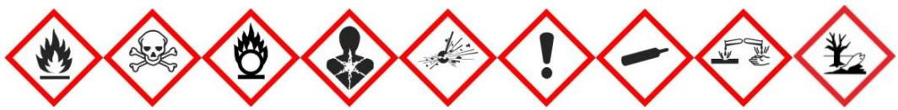

# Preparation of safety data sheets for hazardous chemicals

Code of Practice

# Disclaimer

Safe Work Australia is an Australian Government statutory body established in 2009. Safe Work Australia includes Members from the Commonwealth, and each state and territory, Members representing the interests of workers and Members representing the interests of employers.

Representing the interests of employers.

Safe Work Australia works with the Commonwealth, state and territory governments to improve work health and safety and workers' compensation arrangements. Safe Work Australia is a national policy body, not a regulator of work health and safety. The Commonwealth, states and territories have responsibility for regulating and enforcing work health and safety laws in their jurisdiction.

ISBN 978- 0- 642- 33311- 7 (PDF)  ISBN 978- 0- 642- 33312- 4 (DOCX)

# Creative Commons

This copyright work is licensed under a Creative Commons Attribution- Noncommercial 4.0 International licence. To view a copy of this licence, visit creativecommons.org/licenses In essence, you are free to copy, communicate and adapt the work for non- commercial purposes, as long as you attribute the work to Safe Work Australia and abide by the other licence terms.

Safe Work Australia | info@swa.gov.au | www.swa.gov.au

# ContentsContents 3

Foreword 5

# 1. Introduction 6

1.1. What is a safety data sheet? 6  1.2. What are the duties in relation to the preparation of safety data sheets? 6  1.3. When is it necessary to prepare a safety data sheet? 7  1.4. Chemicals that do not require a safety data sheet 8  1.5. Transition to GHS 7 9

# 2. Preparing, reviewing and amending safety data sheets. 10

2.1. What information is needed in an SDS? 10  2.2. Research chemicals, waste products or samples for analysis 11  2.3. Can an SDS prepared overseas be used? 12  2.4. Reviewing and amending an SDS 12

# 3. Content of the safety data sheet 13

3.1. Section 1—Identification 13  3.2. Section 2—Hazard(s) identification 14  3.3. Section 3—Composition and information on ingredients 15  3.4. Section 4—First aid measures 17  3.5. Section 5—Firefighting measures 18  3.6. Section 6—Accidental release measures 19  3.7. Section 7—Handling and storage 20  3.8. Section 8—Exposure controls and personal protection 21  3.9. Section 9—Physical and chemical properties 24  3.10. Section 10—Stability and reactivity 25  3.11. Section 11—Toxicological information 26  3.12. Section 12—Ecological information 29  3.13. Section 13—Disposal considerations 30  3.14. Section 14—Transport information 31  3.15. Section 15—Regulatory information 32  3.16. Section 16—Any other relevant information 32

# Appendix A—Glossary 33

# Appendix B—Header checklist 38

# Appendix C—GHS label elements for inclusion in the SDS 42

Structure of hazard statement text 42  Structure of precautionary statement text 42  General precautionary measures 43  Tables of label elements from the GHS 44  Additional non- GHS hazard statements 101

# Appendix D—Guide for selecting generic names 103

Establishing the generic name 103Division of substances into families and sub- families 105Appendix E—Other relevant information 115Other relevant codes of practice 115Hazard classification 115Standards applicable to classes of hazardous substances 115Amendments 122

# Foreword

This Code of Practice about the preparation of safety data sheets for hazardous chemicals is an approved code of practice under section 274 of the Work Health and Safety Act (the WHS Act).

An approved code of practice provides practical guidance on how to achieve the standards of work health and safety required under the WHS Act and the Work Health and Safety Regulations (the WHS Regulations).

A code of practice can assist anyone who has a duty of care in the circumstances described in the code of practice. Following an approved code of practice will assist the duty holder to achieve compliance with the health and safety duties in the WHS Act and WHS Regulations, in relation to the subject matter of the code of practice. Like regulations, codes of practice deal with particular issues and may not cover all relevant hazards or risks. The health and safety duties require duty holders to consider all risks associated with work, not only those for which regulations and codes of practice exist.

Codes of practice are admissible in court proceedings under the WHS Act and WHS Regulations. Courts may regard a code of practice as evidence of what is known about a hazard, risk, risk assessment or risk control and may rely on the code in determining what is reasonably practicable in the circumstances to which the code of practice relates. For further information see the Interpretive Guideline: The meaning of 'reasonably practicable'.

Compliance with the WHS Act and WHS Regulations may be achieved by following another method if it provides an equivalent or higher standard of work health and safety than the code.

An inspector may refer to an approved code of practice when issuing an improvement or prohibition notice.

# Scope and application

This Code is intended to be read by a person conducting a business or undertaking (PCBU). It provides practical guidance to PCBUs on how to prepare safety data sheets for hazardous chemicals that are being manufactured or imported for use, handling or storage in Australia.

This Code may be a useful reference for other persons interested in the duties under the WHS Act and WHS Regulations.

This Code applies to a person conducting a business or undertaking involved in the manufacture or import of hazardous chemicals that will be used, or could reasonably be expected to be used, in workplaces covered by the WHS Act.

# How to use this Code of Practice

This Code includes references to the legal requirements under the WHS Act and WHS Regulations. These are included for convenience only and should not be relied on in place of the full text of the WHS Act or WHS Regulations. The words 'must', 'requires' or 'mandatory' indicate a legal requirement exists that must be complied with.

The word 'should' is used in this Code to indicate a recommended course of action, while 'may' is used to indicate an optional course of action.

# 1. Introduction

# 1.1. What is a safety data sheet?

A safety data sheet (SDS), previously called a Material Safety Data Sheet (MSDS), is a document that provides critical information about hazardous chemicals. For example, an SDS includes information on:

the chemical's identity and ingredients health and physical hazards safe handling and storage procedures emergency procedures, and disposal considerations.

An SDS is an important tool for assessing and managing the risks associated with the use of hazardous chemicals in workplaces. See Appendix A for the definition of 'hazardous chemical' and other terms used in this Code.

# 1.2. What are the duties in relation to the preparation of safety data sheets?

# WHS Regulation 330

Manufacturer or importer to prepare and provide safety data sheets

A manufacturer or importer of a hazardous chemical must prepare an SDS for the hazardous chemical.

Manufacturers and importers of hazardous chemicals have duties under the WHS Regulations to provide current information about the hazardous chemical in the form of an SDS.

Under the WHS Regulations, manufacturers and importers of a substance, mixture or article have an obligation, before first supplying it to a workplace, to determine whether it is a hazardous chemical and, if so, to correctly classify that substance, mixture or article.

The manufacturer or importer of a hazardous chemical must prepare an SDS for the hazardous chemical before first manufacturing or importing the hazardous chemical or if that is not practicable, as soon as practicable after first manufacturing or importing the hazardous chemical and before first supplying it to a workplace.

The manufacturer or importer must review the SDS at least once every five years from the date of original preparation or the last revision of the SDS. The manufacturer or importer must amend the SDS whenever necessary to ensure that the SDS contains correct, current information, for example, whenever any new information about the hazardous chemical is known or received or when the formulation changes.

It is not necessary to review the SDS if the manufacturer or importer has not manufactured or imported the chemical in the last five years.

The manufacturer or importer must also provide the current SDS to any person if the person is likely to be affected by the hazardous chemical and asks for the SDS. The manufacturer or importer is not required to provide the SDS if they have not manufactured or imported the chemical in the last five years.

The person writing the SDS should have appropriate expertise and have access to the product formulation and information on its correct hazard classification

Note: a person conducting a business or undertaking (PCBU) who packages or relabels a hazardous chemical with their own product name is considered to be a manufacturer and therefore has the same obligations as a manufacturer under the WHs Regulations to prepare an SDS.

A PCBU may change an SDS if they are the manufacturer or importer and the changes are consistent with the duties of the importer or manufacturer. A PCBU who is not the manufacturer or importer may only change an SDS to attach a translation to the SDS and it must be clear that the attachment is not part of the original SDS.

# 1.3. When is it necessary to prepare a safety data sheet?

# WHS Regulation 330

Manufacturer or importer to prepare and provide safety data sheets

An SDS must be prepared before first manufacturing or importing a hazardous chemical, or if this is not possible, as soon as practicable after first manufacturing or importing the chemical and before first supplying it to a workplace.

Almost every hazardous chemical, as defined in the WHs Regulations, needs an SDS under the WHs Regulations. This includes hazardous chemicals that are intended for use as consumer products.

A chemical that is not hazardous does not require a safety data sheet, however if you intend to prepare an SDS for a non- hazardous chemical it should be prepared in accordance with this code so far as is reasonably practicable. The definition of hazardous chemical can be found in the glossary at Appendix A.

While this Code applies to hazardous chemicals as defined in the WHs Regulations, an SDS should also be provided for:

- any chemical that may adversely impact the health or safety of persons or the environment, but has insufficient information to allow it to be correctly classified. The SDS should reflect what is currently known about the chemical. a mixture which contains an ingredient that meets the criteria for respiratory and skin sensitisation, specific target organ toxicity, reproductive toxicity, carcinogenicity and mutagenicity. It is recommended that an SDS be prepared for that mixture, even if the mixture overall is not a hazardous chemical according to the WHs Regulations.

engineered or manufactured nanomaterials1 or chemicals containing engineered or manufactured nanomaterials. An SDS should be provided unless there is evidence that the nanomaterials are not hazardous.

Other information on hazard properties of a chemical not already captured within the SDS should be included, for example if the chemical has ototoxic properties.2

Some overseas authorities may require an SDS or information on an SDS for certain chemicals that are not hazardous chemicals under the WHS Regulations, for example substances that meet the criteria for a Globally Harmonized System of Classification and Labelling of Chemicals (GHS) hazard class or category that has been excluded from the definition of a hazardous chemical in Australia.

It is acceptable to prepare a single SDS for a group of substances, mixtures and articles where it is reasonable to assume that the group will have similar hazardous properties, provided the SDS contains all product identifiers.

# 1.4. Chemicals that do not require a safety data sheet

Preparing and providing an SDS is mandatory where a substance, mixture or article is a hazardous chemical. However, the WHS Regulations do not require an SDS to be prepared for hazardous chemicals in the following circumstances (although the duty of care requirements under the WHS Act still apply):

- chemicals in batteries while they are incorporated in plant- fuel, oils or coolants in a container that is fitted to a vehicle, vessel or aircraft, mobile plant, appliance or other device, where the fuel, oils or coolants are intended for use in its operation- fuel in the fuel container of a domestic or portable fuel burning appliance where the quantity of fuel does not exceed  $25 \text{kg}$  or 25 litres- hazardous chemicals in portable firefighting or medical equipment for use at a workplace- hazardous chemicals that form part of the integrated refrigeration system of refrigerated freight containers, or- potable liquids that are consumer products at retail premises.

The following things do not require an SDS:

- food and beverages within the meaning of the Food Standards Australia New Zealand Food Standards Code that are in a package and form intended for human consumption- therapeutic goods within the meaning of the Therapeutic Goods Act 1989 at the point of intentional intake by or administration to humans- veterinary chemical products within the meaning of the Agricultural and Veterinary Chemicals (AgVet) Code at the point of administration to animals, or

tobacco or products made of tobacco.

Note that the exemptions described above only apply in the circumstances described. For example, the exemption for therapeutic goods and veterinary chemical products only applies at the point of intentional intake or administration. SDS are required for these products at all other times, such as when they are being stored at a pharmacy or veterinary clinic.

# 1.5. Transition to GHS 7

The Globally Harmonized System of Classification and Labelling of Chemicals (GHS) is a global method of classifying chemicals and preparing labels and SDS. The GHS is the basis of the system used for preparing labels and SDS in Australia, and also sets out the criteria used to determine if a chemical is hazardous.

The 3rd revised edition of the GHS (GHS 3) was implemented in Australia on 1 January 2012. On 1 January 2021, Australia will begin a 2- year transition to the 7th revised edition of the GHS (GHS 7). During the transition manufacturers and importers may use either GHS 3 or GHS 7 to prepare classifications, labels and safety data sheets for hazardous chemicals. From 1 January 2023, only GHS 7 may be used.

During the transition, suppliers and users of hazardous chemicals may continue to supply and use chemicals classified and labelled under GHS 3. However, suppliers and users of hazardous chemicals should not supply or receive stock manufactured or imported after 31 December 2022 if it does not have an up to date labels or SDS under GHS 7.

More information about the transition can be found on the Safe Work Australia website.

# 2. Preparing, reviewing and amending safety data sheets

An SDS must be prepared and written to provide accurate information about:

the hazards of a chemical how to handle the chemical safely, including its storage and disposal the chemical's physical and chemical properties, and potential first aid and emergency response measures.

The SDS should also contain information about effects it may have on the environment.

# 2.1. What information is needed in an SDS?

# WHS Regulations Schedule 7(1)

Safety data sheets

A safety data sheet must:

- be in English- contain unit measures expressed in Australian legal units of measurement under the National Measurement Act 1960 (Cwlth)- state the date it was last reviewed, or if it has not been reviewed, the date it was prepared- state the name, Australian address and business telephone number of the manufacturer or the importer, and- state an Australian business telephone number from which information about the chemical can be obtained in an emergency.

The language used in an SDS should be simple, clear and precise, avoiding jargon, acronyms and abbreviations. Vague and misleading expressions should not be used. Phrases such as 'may be dangerous', 'no health effects', 'safe under most conditions of use' and 'harmless' are also not recommended. It may be that information on certain properties is of no significance or that it is technically impossible to provide detailed information, and if so, the reasons for this should be clearly stated under each heading. If it is stated that a particular hazard does not exist, the SDS should clearly differentiate between cases where no information is available to the classifier and cases where negative test results are available.

Other units of measurement, including the International System of Units (SI) or non- SI units may be used if they are in wide use in Australia. For example, mm Hg for vapour pressure or degrees Celsius  $(^{\circ}C)$  rather than Kelvin (K) for temperature can be used.

An SDS should include a version number, superseded date or some other indication of what version is replaced.

There is no limit in relation to the length of the document, but it should be proportionate to the hazard level of the chemical and the available information.

All pages of an SDS should be numbered and include an indication of the end of the SDS, for example, 'Page 1 of 3'. Alternatively, number each page and indicate whether there is a page following, for example, 'Continued on next page' or 'End of SDS'.

A safety data sheet for a hazardous chemical must state the following information about the chemical:

Section 1- Identification Section 2- Hazard(s) identification Section 3- Composition and information on ingredients Section 4- First aid measures Section 5- Firefighting measures Section 6- Accidental release measures Section 7- Handling and storage Section 8- Exposure controls and personal protection Section 9- Physical and chemical properties Section 10- Stability and reactivity Section 11- Toxicological information Section 12- Ecological information Section 13- Disposal considerations Section 14- Transport information Section 15- Regulatory information Section 16- Any other relevant information.

Chapter 3 of this Code contains further guidance about the information that should be included in the SDS, where relevant and available. A reasonable attempt should be made to obtain the information, however, when information is not available or lacking, this should be clearly stated. The SDS should not contain any blank spaces or abbreviations without a legend.

Any recommendation made by the National Industrial Chemicals Notification and Assessment Scheme (NICNAS) in a relevant NICNAS assessment report relating to the information required in an SDS should be reviewed and considered for inclusion.

Information to protect the health and safety of persons at the workplace may be included on the SDS for chemicals that do not meet the GHS classification criteria, for example some miscellaneous dangerous goods (identified in the Australian Code for the Transport of Dangerous Goods by Road and Rail (the ADG Code)). For example, the health and safety information in the SDS for dry ice could include recommendations within Section 7- Handling and Storage to use gloves while handling the hazardous chemical, instructions not to use it in enclosed spaces and to ensure that there is adequate ventilation.

# 2.2. Research chemicals, waste products or samples for analysis

# WHS Regulations Schedule 7(2)

Safety Data Sheets

Where it is not reasonably practicable to comply with the WHS Regulations to prepare an SDS for a chemical that is a research chemical, waste product or a sample for analysis because the hazard properties are not fully known, then an acceptable SDS is one that:

- is written in English

- states the name, Australian address and business telephone number of the manufacturer or importer- states that full identification or hazard information is not available for the chemical, and in the absence of such information a precautionary approach must be taken to handling or storing the chemical- states the chemical identity or structure of the chemical, or chemical composition, as far as is reasonably practicable- states any known or suspected hazards, and- states any precautions that must be taken in using, handling or storing the chemical, to the extent such precautions have been identified.

# 2.3. Can an SDS prepared overseas be used?

An SDS prepared by an overseas manufacturer or supplier is acceptable only if it is prepared in accordance with the WHs Regulations. Unless an SDS has been prepared specifically for use in Australia it is unlikely it will meet all the requirements of the WHS Regulations, which require information specific to the chemical's use in Australia. For example, the contact details of the Australian manufacturer or importer of the hazardous chemical.

If the overseas manufacturer's SDS does not comply with the requirements of the WHS Regulations, the importer will be responsible for preparing an SDS that does comply. Section 3.1 of this Code details what information is required to be included in an SDS for it to be is compliant with the WHs Regulations. The importer should check each section of the overseas manufacturer's SDS against the Australian requirements to ensure it is correct.

# 2.4. Reviewing and amending an SDS

The manufacturer or importer must review the SDS at least once every five years from the date of original preparation or the last revision of the SDS. The manufacturer or importer must amend the SDS whenever necessary to ensure that the SDS contains correct, current information, for example, whenever any new information about the hazardous chemical is known or received or when the formulation changes.

It is not necessary to review the SDS if the manufacturer or importer has not manufactured or imported the chemical in the last five years.

An SDS should still be made available after the hazardous chemical is withdrawn from sale as it may be required by workplaces at a later date.

It is acceptable to have a translation of the SDS attached to the original SDS, provided the appended information clearly states the translation is not part of the original SDS. The original SDS is the SDS prepared in accordance with the WHs Regulations.

# 3. Content of the safety data sheet

This chapter describes the type of information needed for each of the sections required in an SDS. A summary of this information is provided in a checklist at Appendix B.

# 3.1. Section 1-Identification

This section of the SDS provides information about the identification of the hazardous chemical, recommended uses and the contact details of the Australian manufacturer or importer, including an emergency contact.

Table 1 Content of Section 1 of the safety data sheet  

<table><tr><td colspan="2">Description</td></tr><tr><td>Product identifier</td><td>The SDS must include the product identifier of the hazardous chemical, exactly as found on the label. If one generic SDS is used to cover several minor variants of a hazardous chemical, all product identifiers must be listed on the SDS.</td></tr><tr><td>Other means of identification</td><td>The hazardous chemical must be identified by its product identifier or chemical identity. The SDS should include any company product codes, numbers or other unique identifiers, for example a Proper Shipping Name (as identified in the ADG Code), or a name specified in the Standard for the Uniform Scheduling of Medicines and Poisons (SUSMP). Other names or synonyms by which the hazardous chemical is labelled or commonly known should also be provided in this section.</td></tr><tr><td>Recommended use of the chemical and restrictions on use</td><td>The recommended or intended use of the hazardous chemical should be provided in this section. This includes a brief description of what the chemical does, for example a flame retardant or anti-oxidant. Restrictions on use should be stated as far as known, for example if the chemical is a prohibited carcinogen, an illicit drug precursor, or a chemical of security concern.
&#x27;Prohibited carcinogen&#x27; is defined in the WHS Regulations and listed in Schedule 10 of the WHS Regulations.
&#x27;Illicit drug precursors&#x27; are controlled under various state and territory governments&#x27; legislation. Please see the Code of Practice for Supply Dimension into Illicit Drug Manufacture published by Chemistry Australia.
&#x27;Chemical of security concern&#x27; means one of the chemicals listed in the National Code of Practice for chemicals of security concern published by Australian National Security.
Note that this is not a comprehensive list of the restrictions that may apply to a hazardous chemical.</td></tr><tr><td>Details of manufacturer or importer</td><td>The name, Australian address and business telephone number of the Australian manufacturer or importer must be included in the SDS.</td></tr></table>

# Emergency phone number

# Description

The SDS must include Australian emergency contact information. The emergency information available through this service should be available outside working hours.

If an emergency information service or poisons information centre phone number is provided in the SDS, this arrangement should be confirmed with the service beforehand and copies of the SDS should be provided to them. The poisons information centre may require additional information such as a full list of any ingredients not included in the SDS.

# 3.2. Section 2-Hazard(s) identification

This section of the SDS describes the hazards of the chemical and the appropriate warning information associated with the hazards. The information provided here must include a hazard classification statement explaining all the hazards of the hazardous chemical, as described below. Appendix C lists the GHS signal words, pictograms, hazard statements and precautionary statements that apply to each GHS hazard class and category.

# Classification of the hazardous chemical

If the hazardous chemical is classified in accordance with the GHS, the appropriate hazard class and category should be indicated, for example:

Flammable liquid- Category 1 Acute toxicity- oral- Category 3.

Although it is not mandatory under the WHS Regulations, an SDS may provide information on environmental hazards and other GHS hazard classes and categories, for example 'Acute toxicity- oral- Category 5', that are outside the scope of the WHS Regulations.

# Label elements, including precautionary statements

The following labelling elements should be included in accordance with the hazardous chemicals classification:

Signal word Hazard statement(s), and Precautionary statement(s).

Additionally, Appendix C includes 12 non- GHS hazard statements that should be included on the SDS, where relevant.

It is not mandatory to include pictograms (or hazard symbols) in an SDS. However, these symbols may be included in this section as graphical reproductions in black and white. This allows for the distribution of an SDS with ease via hard copy or through a database.

Persons preparing an SDS can download the GHS pictograms from the UNECE (United Nations Economic Commission for Europe) website. Pictograms should meet the size specification  $(>1\times 1cm^2$  and  $< 2\times 2cm)$  to avoid stretching or having oversized pictograms on the SDS.

The name of the pictogram should also be provided. These are defined in the tables in Appendix C (for example, flame, skull and crossbones).

Dangerous goods class labels may also be used. However, graphical elements do not need be duplicated.

# 3.3. Section 3-Composition and information on ingredients

The ingredient(s) of the hazardous chemical must be identified. This includes the identification of impurities and stabilising additives that contribute to the classification of the hazardous chemical.

# Disclosure of ingredient names

# WHS Regulations Schedule 8

Disclosure of ingredients in safety data sheet

The chemical identity of an ingredient must be disclosed on an SDS in accordance with Schedule 8 of the WHS Regulations. In some cases, a generic name may be used.

Ingredients that are not classified as hazardous but have an exposure standard and which constitute more than  $1\%$  of the mixture should be mentioned in the SDS if it is likely that they might be released under standard storage and application conditions.

Disclosure of ingredient names is not required by the WHS Regulations for those ingredients that meet only physical and/or environmental hazard classifications, or for non- hazardous ingredients.

There is no requirement to disclose the identity of ingredients for the following GHS health hazard categories because they fall outside the scope of the WHS Regulations:

- Acute toxicity—Category 5 (oral, dermal and inhalation)- Skin corrosion/irritation—Category 3- Aspiration hazard—Category 2- Aquatic toxicity (all categories)- Flammable gas—Category 2- Ozone depletion.

# Use of generic names

Generic names may be used in an SDS if the identity of an ingredient is genuinely commercially confidential, and if:

the ingredient is in any of the following health hazard categories:

Acute toxicity- Category 4 (oral, dermal, inhalation) Aspiration hazard- Category 1 Serious eye damage/eye irritation- Category 2/2 Skin corrosion/irritation- Category 2 Specific target organ toxicity (single exposure)- Category 3.

the ingredient does not cause the correct classification of the hazardous chemical to include any other hazard class or category, and an exposure standard for the ingredient has not been established.

A guide for selecting generic names for ingredients is included in Appendix D.

# Disclosure of proportions of ingredients

Where the chemical identity or generic name of an ingredient that makes up a hazardous chemical is disclosed, the proportions of the ingredients must also be disclosed in an SDS.

For multiple ingredients, proportions should be listed in descending order by mass or volume. Ingredients not contributing to the hazard classification should also be listed and, where included, should be listed after the ingredients contributing to the hazard classification.

However, where the exact concentration of an ingredient is commercially confidential, the concentration of the ingredient can be disclosed using the following ranges:

$< 10\%$ $10 - < 30\%$ $30 - 60\%$ $>60\%$

The proportion of an ingredient should normally be disclosed using a narrower range, for example, for an ingredient present at  $35\%$  , a range of  $30 - 40\%$  should be used instead of  $30 - 60\%$

Where possible, the percentage composition should add up to or indicate a total of  $100\%$  even if an estimate of non- hazardous ingredients needs to be provided.

# 3.4. Section 4-First aid measures

This section of the SDS provides information about the initial care (that does not involve the use of sophisticated equipment or access to a wide selection of medications) to be given to a person affected by a hazardous chemical. It should state whether medical attention is required for a chemical, including the urgency of treatment required.

An SDS should provide information on any immediate effects of the chemical, by route of exposure, and the immediate treatment required. It should also include information on the possible delayed effects of the chemical and on specific health monitoring that may be needed.

Table 2 Section 4 of the SDS:First aid measures  

<table><tr><td>Term</td><td>Description</td></tr><tr><td>Description of necessary first aid measures</td><td>In this section, the SDS should provide first aid instructions for each relevant route of exposure and describe expected immediate and delayed symptoms. Sub-headings to indicate the procedure for each route (for example, inhalation, skin contact, eye contact and ingestion) should be used.
Information should be provided on situations when:
- immediate medical attention is required
- known antidotes should be available for administration by persons trained in their use (and, where relevant, authorised by law) as part of the recommended first aid procedure
- delayed effects can be expected after exposure
- movement of the exposed individual to fresh air is recommended
- removal of clothing and shoes from the individual is recommended
- personal protective equipment (PPE) for first aiders is recommended
- there is a risk that first aiders may be exposed to risks from individuals who have ingested hazardous chemicals (for example, organophosphates).
Any information on specific first aid facilities, for example showers or eyewashes that are necessary in a workplace where the particular hazardous chemical is used, should also be provided.</td></tr><tr><td>Symptoms caused by exposure</td><td>Relevant information on the most important symptoms and effects of exposure to the chemical should be provided. Information should be provided on acute, delayed and aggravated medical conditions caused by the hazardous chemical to enable first aid to be administered.</td></tr><tr><td>Medical attention and special treatment</td><td>If applicable, information on clinical testing and medical monitoring for delayed effects, specific details on antidotes (where they are known) and contraindications are recommended for inclusion in this section.</td></tr></table>

# 3.5. Section 5-Firefighting measures

This section of the SDS provides information on how to fight a fire caused by a hazardous chemical, or a fire arising in its vicinity.

Table 3 Section 5 of the SDS:Firefighting measures  

<table><tr><td>Item</td><td>Description</td></tr><tr><td>Suitable extinguishing equipment</td><td>This SDS should describe:
- the type of extinguishers or firefighting agents needed for extinguishing a fire
- whether any extinguishers are unsuitable for a particular situation involving the hazardous chemical.</td></tr><tr><td>Specific hazards arising from the chemical</td><td>The SDS should describe any specific hazards that may arise from a hazardous chemical relevant to its physical properties, such as explosive properties or hazardous combustion products that may be generated when the hazardous chemical burns, for example:
- &#x27;May produce toxic fumes, for example, carbon monoxide if burning&#x27;
- &#x27;Produces oxides of sulphur and nitrogen on combustion&#x27;
- &#x27;May produce flammable gas if wet&#x27;.</td></tr><tr><td>Special protective equipment and precautions for firefighters</td><td>Advice should be provided on any precautions to be taken during firefighting, for example, &#x27;Keep containers cool with water spray&#x27; and advice on appropriate personal protective equipment (PPE) required for firefighters for example specific boots, overalls, gloves, eye and face protection, and breathing apparatus.
The Hazchem Code should be included in this section for the information of emergency services. The Hazchem Code for bulk dangerous goods provides information on the firefighting medium to be used, for example whether water should be used as a firefighting agent, as this will be the first response of firefighters. The Hazchem Code includes information on PPE, the risk of violent reaction or explosion, spillage action and whether evacuation should be considered in the event of an incident with the material.</td></tr></table>

# 3.6. Section 6-Accidental release measures

This section of the SDS provides information on the appropriate ways to respond to the release of chemicals, in the form of spills, leaks or other accidental release. This is so that the adverse effects on people, property and the environment at or near the workplace can be prevented or minimised. This information should distinguish between responses for large and small spills where the spill volume has a significant impact on the hazard or response.

Table 4 Section 6 of the SDS:Accidental release measures  

<table><tr><td>Item</td><td>Description</td></tr><tr><td>Personal precautions, protective equipment and emergency procedures</td><td>The SDS should provide the following advice on a spill or release of a hazardous chemical:
- The use of suitable equipment (including PPE) to prevent contamination of skin, eyes and personal clothing.
- The removal of ignition sources and provision of sufficient ventilation.
- Emergency procedures, for example the need to evacuate the danger area or to consult an expert.</td></tr><tr><td>Environmental precautions</td><td>Contamination of the environment can give rise to indirect human chemical exposures within and outside the workplace. The SDS should provide advice on precautions related to accidental spills and releases of the hazardous chemical into the environment, for example keeping away from drains and surface and ground water.</td></tr><tr><td>Methods and materials for containment and cleaning up</td><td>The SDS should include advice on how to contain and clean up a spill. Appropriate containment techniques may include:
- bunding5
- covering of drains
- capping procedures (providing a cover or protection, for example to prevent damage or spillage).
Appropriate clean-up procedures may include:
- neutralisation techniques
- decontamination techniques
- adsorbent materials
- cleaning techniques
- vacuuming techniques
- equipment required for containment/clean up (includes the use of non-sparking tools and equipment where applicable).
Recommended clean-up procedures should also take into account disposal considerations under ‘Section 13—Disposal considerations’ of the SDS.</td></tr></table>

# 3.7. Section 7-Handling and storage

This section of the SDS provides guidance on safe handling and storage practices to minimise the risks of release and exposure to the hazardous chemical. These precautions should be appropriate to the intended use of the chemical and its unique properties.

# Precautions for safe handling

Information should be provided to:

allow for the safe handling of the hazardous chemical, for example, avoiding spills prevent inappropriate handling of incompatible hazardous chemicals minimise the release of the hazardous chemical outside of the workplace.

Information on how the chemical may be safely used must be provided.

General warnings on what practices to avoid or restrict should also be included in this section. This information is in addition to other hazard control measures in 'Section 8 Exposure controls and personal protection' of the SDS.

Section 7 should also provide advice on general hygiene requirements, for example:

Eating, drinking and smoking in work areas is prohibited Wash hands after use'. Remove contaminated clothing and protective equipment before entering eating areas'.

# Conditions for safe storage, including any incompatibilities

This section should include advice consistent with the physical and chemical properties of a hazardous chemical referred to other sections of the SDS ('Section 9- Physical and chemical properties' and 'Section 10- Stability and Reactivity'). Advice should be provided on specific storage requirements, including:

how to avoid:

explosive atmospheres corrosive conditions flammability hazards incompatible substances or mixtures evaporative conditions potential ignition sources (including electrical equipment).

how to control the effects of:

weather conditions ambient pressure temperature sunlight humidity vibration.

how to maintain the integrity of the hazardous chemical by the use of:

stabilisers anti- oxidants temperature control.

other advice on:

- ventilation requirements for storage facilities- specific designs for storage rooms/vessels- quantity limits under storage conditions- packaging compatibility- warnings if water should not be used as a firefighting agent, for example: 'Ensure that firefighting water cannot reach water-sensitive chemicals and if necessary provide protective cabinets with appropriate labelling'.

# 3.8. Section 8—Exposure controls and personal protection

This section provides guidance on how to eliminate or minimise risks associated with exposure to hazardous chemicals. 'Exposure control' means the full range of specific protection measures (including engineering control measures) to be taken during the use of a hazardous chemical in order to minimise personal exposure to the chemical.

# Exposure control measures

The SDS should include advice on what measures should be taken to minimise exposure to hazardous chemicals and to keep exposure below the relevant exposure standard. Exposure standards represent airborne concentrations of individual substances which, according to current knowledge, should neither impair the health of, nor cause undue discomfort to, nearly all workers.

Exposure standards are generally expressed as a time- weighted average (TWA), which is the average airborne concentration of a particular substance permitted over an eight- hour working day and a five- day working week. Short term exposure limits (STEL) and peak limitations should also be specified where available.

This section should list the available exposure standards, including all notations, for each hazardous chemical ingredient. If additional air contaminants are generated when using the hazardous chemical as intended, exposure standards for these should also be listed.

If there are no Australian exposure standards or occupational exposure limits, overseas standards should be used. Examples of overseas standards or limits include those of the Health and Safety Executive (HSE) in Great Britain, American Conference of Governmental Industrial Hygienists (ACGIH) or the German Deutsche Forschungsgemeinschaft (DFG).

Regardless of the exposure standard (if any), this section should describe controls to be implemented in a workplace to eliminate or minimise personal exposure.

Exposure standards are reviewed from time to time and therefore an up- to- date record of exposure standards should be consulted. Safe Work Australia publishes the Workplace Exposure Standards for Airborne Contaminants. A list of Australian exposure standards is also available on Safe Work Australia's Hazardous Chemicals Information System (HCIS).

# Biological monitoring

Biological monitoring can assist in the detection and estimation of absorption of the hazardous chemical, for example by skin, gastrointestinal system or inhalation. The effects of some hazardous chemicals used in the workplace must be monitored through biological monitoring. The SDS should detail the monitoring needed for a hazardous chemical.

This section of the SDS should also list known or recognised safe biological levels (in some countries these are known as biological limit values, biological exposure indices, or biological exposure standards) where available, including notations for a hazardous chemical or for each ingredient of a mixture.

The source of the biological levels should be stated on the SDS. When biological levels are listed, they should use the chemical identity as specified in section 3.3 of this Code.

# Control banding

Control banding is a process used in some countries where a hazardous chemical is assigned to a band, based on the chemical's hazard classification and use. Each band may have a different control solution, for example: band 1- good industrial hygiene practice, band 2- use local exhaust ventilation, band 3- enclose the process.

If the control banding approach is recommended in the SDS to provide protection in relation to specific uses of the hazardous chemical, then sufficient detail should be given to enable effective management of risks. The context and limitations of the specific control banding recommendation should be made clear.

# Engineering controls

The SDS should include a description of appropriate engineering control measures relating to the intended use of the hazardous chemical. This section should indicate when special engineering controls are necessary, and specify which controls are required, for example:

'Maintain air concentration below occupational exposure standards, using engineering controls if necessary' 'Use only in a well- ventilated area' 'Use local exhaust ventilation' 'Use only in an enclosed system' 'Use only in spray- paint booth or enclosure' 'Use mechanical handling to reduce human contact with materials' 'Use explosive dust handling controls'.

The information in this section should complement that provided in 'Section 7- Handling and Storage' of the SDS.

# Individual protection measures, for example personal protective equipment (PPE)

Consistent with the hierarchy of controls, PPE should be used only when other control measures (for example elimination, substitution, isolation, engineering controls) have been found to be impracticable or in conjunction with one or more control measures. This section of the SDS should include information on PPE provided that it clearly recommends other controls to minimise exposure to the hazardous chemical.

Consideration should be given to the possible reduction in effectiveness of PPE and possible detrimental effects of hazardous chemicals on some materials from which items of PPE may be made, for example the use of synthetic clothing for protection against corrosive hazardous chemicals.

# Eye and face protection

Information should be provided on eye and face protection needed for a hazardous chemical. It is important to specify:

- the type of eye protection required, for example safety glasses, goggles or face shields, and- the properties of the eye protection required based on the hazard of the chemical and potential for contact, for example the degree of impact protection or splash resistance.

# Skin protection

Information should be included on the skin protection required for a hazardous chemical. It is important to specify:

- the protective equipment to be worn when using or handling the hazardous chemical including the types of gloves, boots and bodysuits required, and- the properties of the protective equipment based on the hazard of the chemical and potential for contact, for example cotton, PVC or nitrile.

# Respiratory protection

If respiratory protection is needed for a hazardous chemical, the SDS should include information on the appropriate types of respiratory protection based on the chemical hazard and potential for exposure, for example air- purifying respirators requiring specific respiration filters, air- line respirator or breathing apparatus. Where appropriate, a reference to a standard should be included.

Vague information—for example 'use respirator'—is not helpful and should be avoided, whereas information such as 'use half- face filter respirator suitable for organic vapours' is far more useful.

# Thermal hazards

The SDS should include information on the PPE required for thermal hazards. Special consideration should be given to the materials of the PPE to avoid adding to the thermal load of the wearer. Information on any secondary risk should also be included here.

See also section 3.5 of this Code for specific fire/chemical PPE advice.

# 3.9. Section 9-Physical and chemical properties

This section of the SDS describes the physical and chemical properties of a hazardous chemical. The data should apply to the hazardous chemical as supplied. If the hazardous chemical is a mixture, the physical and chemical data should describe the mixture. If that information is not available, the properties of the most relevant ingredients should be provided.

The following properties should be included in the SDS where relevant and the appropriate units of measure and/or reference conditions should be specified:

physical state colour odour melting point/freezing point boiling point or initial boiling point and boiling range flammability lower and upper explosion limit/flammability limit flash point Auto- ignition temperature decomposition temperature pH kinematic viscosity solubility partition coefficient: n- octanol/water (log value) vapour pressure density and/or relative density relative vapour density, and particle characteristics.

If relevant, the interpretation of the numeric value and the method of the determination should also be provided. Where there is no information about specific characteristics or data available, a statement should be included to that effect. It may confuse the reader if the SDS includes blank spaces or uses the term N/A' for physical and chemical properties, so this should be avoided.

In addition to those listed above, other physical or chemical parameters relevant to health and safety should be included in this section of the SDS. This includes parameters which, in addition to chemistry, can significantly influence the properties of chemicals, for example size or surface area in the case of engineered nanomaterials. Examples of parameters which may be included are:

- biodurability or biopersistence- crystallinity- degree of aggregation or agglomeration, and dispersibility- dustiness- particle size (average and range)- redox potential- release of invisible flammable vapours and gases- saturated vapour concentration (include reference temperatures)- shape and aspect ratio- size distribution- specific heat value

surface area, and surface coating or chemistry (if different to rest of particle).

The GHS also recommends additional physical properties be included in the SDS for some hazard classes. These additional physical properties can be found in Appendix 4 of the GHS.

# 3.10. Section 10-Stability and reactivity

This section of the SDS provides information regarding the stability and reactivity of the hazardous chemical. Information on the possibility of hazardous reactions is necessary to ensure the safe handling and storage of chemicals and to ensure effective firefighting and spill control measures.

# Reactivity

This section should describe the reactivity hazards of the chemical, including the conditions under which the hazardous reactions may occur, for example:

whether the hazardous chemical will react or polymerise flame propagation or burning rate of solid materials properties of both flammable and non- flammable materials that may initiate or add to the intensity of a fire potential for dust explosion reactions that release flammable or toxic gases or vapours fast or intensely burning characteristics, and non- flammables that could contribute unusual hazards to a fire, for example strong oxidising and reducing agents or peroxide fumes.

Specific test data should be provided for the hazardous chemical as a whole, where available. However, the information may also be based on general data for the class or family of chemical if such data adequately represents the anticipated hazard of the hazardous chemical.

If data for mixtures is not available, ingredient data should be provided. In determining incompatibility, the substances, containers and contaminants that the hazardous chemical might be exposed to during transportation, storage and use should be considered.

# Chemical stability

Information should be provided on the stability of the hazardous chemical under normal ambient storage and handling conditions. Consider any foreseeable changes in temperature and pressure conditions. Any stabilisers used to maintain the product should be described, as well as the safety implications of any change in the physical appearance of the product which may result if the stabiliser is compromised.

# Possibility of hazardous reactions

If relevant, the SDS should state if a hazardous chemical will react or polymerise, releasing excess pressure or heat, or create other hazardous conditions. It should describe under what conditions a hazardous reaction may occur.

# Conditions to avoid

Information should include conditions- - for example, temperature, pressure, shock, static discharge, vibrations or other physical stresses- - that might cause a hazardous reaction.

# Incompatible materials

Classes of chemicals or specific substances with which the hazardous chemical could react to produce a hazardous situation should be listed in the SDS, for example, explosion, excessive heat generation, release of toxic or flammable materials.

# Hazardous decomposition products

The SDS should list any hazardous products that may be produced due to the decomposition of the chemical during use, storage or heating. The anticipated outcomes of a reaction with another material should be described, including the production of flammable, toxic or asphyxiating gases. Advice should be provided about what should be done if an unstable state is reached.

Hazardous combustion products should be included in 'Section 5- - Firefighting measures' of the SDS.

# 3.11. Section 11-Toxicological information

This section of the SDS provides toxicological information relevant to the health hazard category assigned to the chemical using the GHS. It should be based on expert toxicological advice and on the toxicological hazards information provided in the GHS classification criteria. A concise but complete and comprehensible description of the various toxicological health effects (for both acute and chronic effects) consistent with the hazard classification, and the available data used to identify those effects, should be provided. The relevant hazards for which data should be provided are (in the following order):

acute toxicity skin corrosion/irritation serious eye damage/irritation respiratory or skin sensitisation germ cell mutagenicity carcinogenicity reproductive toxicity Specific Target Organ Toxicity (STOT)- single exposure Specific Target Organ Toxicity (STOT)- repeated exposure, and aspiration hazard.

Information on these hazards should be presented in the above order in each SDS. Other non- classifiable hazards may also be included. For example, some chemicals, such as dimethyl sulphoxide, readily penetrate the skin and may increase skin absorption of other toxins. Information should also be provided on whether potential exposure to the hazardous chemical has immediate or delayed health effects.

If data for any of these hazards is not available, they should still be listed, with a statement that data is not available.

The toxicological data should apply to the hazardous chemical as used in the workplace. It should be relevant to the mixture. Where information on the mixture is not available, then information on the toxicological properties of the hazardous ingredients above the concentration cut- off in the mixture should be provided. If there is no data on a mixture but sufficient data exists on the components of the mixture or similar mixtures, bridging principles can be used to provide information. The type of bridging principles used should also be stated.

The health effects included in the SDS should be consistent with those described in studies used for the classification of the hazardous chemical. General statements—for example 'Toxic' or 'Safe if properly used'—with no supporting data are not acceptable as they may be misleading and do not provide a description of health effects. Phrases such as 'not applicable' and 'not relevant', or leaving blank spaces in the health effects section, can lead to confusion and misunderstanding and should not be used. When information on health effects is not available, this should be clearly stated.

Health effects should be described accurately and relevant distinctions made. For example, 'allergic contact dermatitis' and 'irritant contact dermatitis' should be distinguished from each other.

Where there is a substantial amount of test data on the hazardous chemical, the results should be summarised, for example by grouping toxicological data by the route of exposure.

Information should also be provided on the relevant negative data. Information to support negative test results should be included, for example 'carcinogenicity studies in the rat have shown no significant increase in the incidence of cancer'.

# Information on possible routes of exposure

Information should be provided on the possible routes of exposure and the effects of the hazardous chemical via each route of exposure, that is, through ingestion (swallowing), inhalation or skin/eye exposure. A statement should be made if health effects are not known. Statements such as 'Ingestion is not expected to occur' or 'Ingestion should be avoided' are not acceptable.

Information on all routes of exposure should be provided as it is not possible to predict how a chemical will be used in a workplace or the most likely exposure route.

# Early onset symptoms related to exposure

Information should be provided on early symptoms associated with exposure to the hazardous chemical, its ingredients or known by- products. Information should include the symptoms related to the physical, chemical and toxicological characteristics of the hazardous chemical following exposure related to the intended uses. This section should describe the first symptoms at the lowest exposures through to the consequences of severe exposure, for example, 'Headaches and dizziness may occur, proceeding to fainting or unconsciousness; large doses may result in coma and death'.

# Delayed health effects from exposure

Information should be provided on whether delayed or immediate effects can be expected after short or long- term exposure consistent with the classification of the chemical. Information should include acute and chronic health effects relating to human exposure to the hazardous chemical.

Where human data is not available, animal data should be summarised and the species clearly identified. The SDS should indicate whether toxicological data is based on human or animal data. Classifications or studies from government or international agencies may be used, for example 'Has been classified as a probable human carcinogen by the International Agency for Research on Cancer'. Where data on chronic effects is not available, it is recommended that the SDS take a precautionary approach to health effects from exposure.

# Exposure levels and health effects

The SDS should provide information on the dose, concentration or conditions of exposure that may cause adverse health effects. Where appropriate, doses should be linked to symptoms and effects, including the period of exposure likely to cause harm. For example, '10 ppm respiratory irritation, 250- 300 ppm difficulty in breathing, 500 ppm unconsciousness leading to death after 30 minutes'. Where exposure levels are not known, the SDS should take a precautionary approach to exposure levels or include links to potential health effects, if available.

# Interactive effects

If known, information on interactions should be included in situations where:

- symptoms are worsened by drinking alcohol, taking medication or smoking- pre-existing medical conditions—for example, asthma, high blood pressure or a predisposition to allergic reactions—may increase risk.

# When specific chemical data is not available

Where there is insufficient data to classify a chemical, testing may be required. However, it may not always be possible to obtain information on the hazards of a chemical. In cases where data on the specific hazardous chemical is not available, data on the chemical functional group, if appropriate, should be used. Where generic data is used or where data is not available, this should be stated clearly in the SDS.

# Mixtures of chemicals

If a mixture has not been tested for its health effects as a whole, then information must be provided on each ingredient listed under 'Section 3—Composition and information on ingredients' of the SDS.

Ingredients may interact with each other in the body resulting in different rates of absorption, metabolism and excretion. As a result, the toxic actions may be altered and the overall toxicity of the mixture may be different from its ingredients.

This section should advise whether the concentration of each ingredient is sufficient to contribute to the overall health effects of the mixture. The information on toxic effects should be presented for each ingredient, except:

- if the information is duplicated, in which case it is not necessary to list this more than once (for example, if two ingredients both cause vomiting and diarrhoea, the mixture should be described overall as causing vomiting and diarrhoea)- if it is unlikely that these effects will occur at the concentrations present (for example, when a mild irritant is diluted in a non-irritating solution, the overall mixture would be unlikely to cause irritation).

Predicting the interactions between ingredients is difficult where information on interactions is not available. However, assumptions should not be made. Instead, the SDS should list the health effects of each ingredient separately

# Other information

It is recommended that other relevant information on adverse health effects be included, even when the hazards are outside the scope of the GHS.

# 3.12. Section 12—Ecological information

This section of the SDS provides information about the environmental and ecological hazards of hazardous chemicals. This information can assist in handling spills and evaluating waste treatment practices and should clearly indicate species, media, units, test duration and test conditions. Where information is not available, this should also be stated.

Ecological information should be given for each ingredient, where available and appropriate.6

# Ecotoxicity

Information on ecotoxicity should be provided using data from tests performed on aquatic and/or terrestrial organisms. This should include relevant available data on both acute and chronic aquatic toxicity for fish, crustaceans, algae and other aquatic plants. In addition, toxicity data on other organisms (including soil micro and macro- organisms) for example birds, bees and plants, should be included when available. Where the hazardous chemical has inhibitory effects on the activity of micro- organisms, the possible impact on sewage treatment plants should be mentioned.

# Persistence and degradability

Persistence and degradability relate to the potential for the hazardous chemical (or hazardous ingredients of a mixture) to degrade in the environment, either through biodegradation or other processes, for example oxidation or hydrolysis. Test results relevant to assess persistence and degradability should be given where available. If degradation half- lives are quoted an indication of whether these half- lives refer to mineralisation or to primary degradation should be provided. The potential for the hazardous chemical (or hazardous ingredients of a mixture) to degrade in sewage treatment plants may also be mentioned.

# Bioaccumulative potential

Bioaccumulation is the potential for the hazardous chemical (or hazardous ingredients of a mixture) to accumulate in biota and possibly pass through the food chain. Test results relevant to assess the bioaccumulative potential should be given. This may include reference to the octanol- water partition coefficient  $(K_{ow})$  and bioconcentration factor (BCF), if available.

# Mobility in soil

Mobility in soil is the potential for a hazardous chemical (or hazardous ingredients of a mixture) released into the environment to move under natural forces to the groundwater or to a distance from the site of release. The potential for mobility in soil should be provided in an SDS where the information is available. Information on mobility can be determined from relevant mobility data sets, for example absorption studies or leaching studies. For example,  $\mathsf{K}_{\mathsf{oc}}^7$  values can be predicted from octanol/water partition coefficients  $(K_{\mathrm{ow}})$ . Leaching and mobility can be predicted from models.

Where real data on the hazardous chemical is available, this data should take precedence over models and predictions.

# Other adverse effects

Information on any other adverse effects to the environment should be included where data is available, for example environmental fate (exposure), ozone depletion potential, photochemical ozone creation potential, endocrine- disrupting potential and global warming potential.

# 3.13. Section 13-Disposal considerations

This section of the SDS provides information on the most effective way to dispose of a chemical safely.

# Disposal methods

Information should be provided for proper disposal, recycling or reclamation of the hazardous chemical and its container to assist in the determination of safe and environmentally- preferred waste management options. This section should include:

- disposal containers and methods- physical/chemical properties that may affect disposal options- effects of sewage disposal, and- special precautions for incineration or landfill.

The disposal advice provided on the SDS should apply to the material as manufactured.

For the safety of persons conducting disposal, recycling or reclamation activities, make reference to the information in 'Section 8—Exposure Controls and Personal Protection' of the SDS.

The local council and /or state environment authority may be able to provide advice on the disposal of chemicals.

# 3.14. Section 14-Transport information

This section of the SDS provides basic classification information for the transportation or shipment of a hazardous chemical by road, rail, sea or air as required by relevant transport legislation. Where information is not available or relevant this should be stated.

Table 5 Section 14 of the SDS: Transport information  

<table><tr><td>Term</td><td>Description</td></tr><tr><td>UN number</td><td>The UN number (a four-digit identification number for the substance or article) as listed in the ADG Code should be provided.</td></tr><tr><td>Proper shipping name or technical name</td><td>The proper shipping name or technical name from the ADG Code should also be included. For hazardous chemicals, the proper shipping name or technical name should be provided in this subsection even if it has not appeared as the product identifier or national or regional identifier.</td></tr><tr><td>Transport hazard class</td><td>The SDS should provide the transport class/division (and subsidiary risks) assigned to the hazardous chemical according to the most predominant hazards that the chemical presents under the ADG Code.</td></tr><tr><td>Packing group number</td><td>If applicable, information should be provided on the Packing Group number found in the ADG Code. The packing group number is assigned to certain hazardous chemicals in accordance with their degree of hazard. Packing Group 1 is the highest hazard and Packing Group 11 the lowest.</td></tr><tr><td>Environmental hazards for transport purposes</td><td>The SDS should indicate whether the hazardous chemical is a known marine pollutant according to the International Maritime Dangerous Goods (IMDG) Code. Also it is recommended that the SDS indicate whether the substance or mixture is classified as having an acute aquatic toxicity hazard as required under the ADG Code.
Additional information for certain environmentally hazardous chemicals may be required on the SDS to comply with maritime transport laws, for example, for chemicals listed in Annex 1 of the International Convention for the Prevention of Pollution from Ships (MARPOL).</td></tr><tr><td>Special precautions for user</td><td>Information should be provided on special precautions that users should be aware of or should comply with when transporting a hazardous chemical. Any other special requirements relevant to transport of the chemical should be stated here, for example shock sensitivity, specific storage requirements during transit/warehousing and overseas regulatory transport requirements if the hazardous chemical is for export.</td></tr><tr><td>Additional information</td><td>Any additional information required by overseas regulatory agencies or relevant regulations for the transport of goods by other modes should be included here.</td></tr><tr><td>Hazchem or emergency action code</td><td>The relevant hazchem (or emergency action) code should be provided as specified in the ADG Code.</td></tr></table>

# 3.15. Section 15-Regulatory information

This section of the SDS provides advice on other regulatory information on the hazardous chemical that is not provided elsewhere in the SDS, for example whether the hazardous chemical is subject to the following international agreements:

Montreal Protocol (Ozone depleting substances)8 The Stockholm Convention (Persistent Organic Pollutants)9 The Rotterdam Convention (Prior Informed Consent)10 Basel Convention (Hazardous Waste)11, and International Convention for the Prevention of Pollution from Ships (MARPOL).

# Safety, health and environmental regulations

Other regulatory information specific to the hazardous chemical may also be included here, for example whether the substance is covered by the following requirements:

the Standard for the Uniform Scheduling of Medicines and Poisons (SUSMP) established under the Therapeutic Goods Act 1989 (Cwlth) (as amended). If so, list the relevant Poisons Schedule number any applicable prohibition or notification/licensing requirements, including for carcinogens under commonwealth, state or territory legislation. the Agricultural and Veterinary Chemicals Act 1994 (Cwlth) and/or applicable commonwealth, state or territory control- of- use legislation the Industrial Chemicals (Notification and Assessment) Act 1989 (Cwlth), including listing on the Australian Inventory of Chemical Substances (AICS), any condition of use associated with the listing on the AICS and/or whether any chemical or a chemical in the product is being introduced under a permit.

In addition, it is recommended that information in a NICNAS assessment report be included.

# 3.16. Section 16-Any other relevant information

This section of the SDS provides any other information relevant to the preparation of the SDS, including:

the date of preparation of the latest revision of the SDS. When revisions are made to an SDS, this section should describe the changes made to the previous version of the SDS. Suppliers should maintain an explanation of the changes and be willing to provide it upon request, and a key/legend to abbreviations and acronyms used in the SDS.

Key literature references and sources for data used to compile the SDS should also be included.

# Appendix A-Glossary

<table><tr><td>Term</td><td>Description</td></tr><tr><td>ADG Code</td><td>The Australian Code for the Transport of Dangerous Goods by Road and Rail, as in force or remade from time to time, approved by the Transport and Infrastructure Council. The ADG Code is accessible at the National Transport Commission website www.ntc.gov.au</td></tr><tr><td>Article</td><td>A manufactured item, other than a fluid or particle, that is formed into a particular shape or design during manufacture and has hazard properties and a function that are wholly or partly dependent on the shape or design.</td></tr><tr><td>Bioaccumulative potential</td><td>The potential for a chemical to accumulate in biota and possibly pass through the food chain.</td></tr><tr><td>Biological monitoring</td><td>The measurement and evaluation of a substance, or its metabolites, in the body tissue, fluids or exhaled air of a person exposed to that substance.</td></tr><tr><td>Chemical identity</td><td>A name, in accordance with the nomenclature systems of the International Union of Pure and Applied Chemistry or the Chemical Abstracts Service, or a technical name, that gives a chemical a unique identity.</td></tr><tr><td>Class (of dangerous goods)</td><td>The number assigned to the goods in the ADG Code indicating the hazard, or most predominant hazard, exhibited by the goods.</td></tr><tr><td>Combustible liquid</td><td>A liquid, other than a flammable liquid, that has a flash point, and a fire point less than its boiling point.</td></tr><tr><td>Combustible substance</td><td>A substance that is combustible and includes dust, fibres, fumes, mists or vapours produced by the substance.</td></tr><tr><td>Container</td><td>Anything in or by which a hazardous chemical is, or has been, wholly or partly covered, enclosed or packed, including anything necessary for the container to perform its function as a container.</td></tr><tr><td>Correct classification</td><td>The set of hazard classes and hazard categories assigned to a hazardous chemical when it is correctly classified.</td></tr><tr><td>Division (of dangerous goods)</td><td>A number, in a class of dangerous goods, to which the dangerous goods are assigned in the ADG Code.</td></tr><tr><td>Duty holder</td><td>Any person who owes a work health and safety duty under the WHS Act including a person conducting a business or undertaking, a designer, manufacturer, importer, supplier, installer of products or plant used at work (upstream duty holder), officer or a worker.</td></tr></table>

<table><tr><td>Term</td><td>Description</td></tr><tr><td>Exposure standard</td><td>An exposure standard published by Safe Work Australia in the Workplace Exposure Standards for Airborne Contaminants.</td></tr><tr><td>Flammable liquid</td><td>A flammable liquid within the meaning of the GHS that has a flash point of less than 93℃.</td></tr><tr><td>Flash point</td><td>The lowest temperature (corrected to a standard pressure of 101.3 kPa) at which the application of an ignition source causes the vapours of a liquid to ignite under specified test conditions.</td></tr><tr><td>Generic name</td><td>A name applied to a group of chemicals having a similar structure and properties.</td></tr><tr><td>Genuine research</td><td>Systematic investigative or experimental activities that are carried out for either acquiring new knowledge (whether or not the knowledge will have a specific practical application) or creating new or improved materials, products, devices, processes or services.</td></tr><tr><td>GHS</td><td>The Globally Harmonized System of Classification and Labelling of Chemicals, 7th revised edition, published by the United Nations as modified by Schedule 6 to the WHS Regulations.</td></tr><tr><td>Hazard</td><td>A situation or thing that has the potential to harm a person. Hazards at work may include: noisy machinery, a moving forklift, chemicals, electricity, working at heights, a repetitive job, bullying and violence at the workplace.</td></tr><tr><td>Hazard category</td><td>A division of criteria within a hazard class in the GHS.</td></tr><tr><td>Hazard class</td><td>The nature of a physical, health or environmental hazard under the GHS.</td></tr><tr><td>Hazardous chemical</td><td>Any substance, mixture or article that satisfies the criteria for any one or more hazard classes in the GHS (including a classification referred to in Schedule 6 of the WHS Regulations), unless the only hazard class or classes for which the substance, mixture or article satisfies the criteria are any one or more of the following:
- acute toxicity—oral—category 5
- acute toxicity—dermal—category 5
- acute toxicity—inhalation—category 5
- skin corrosion/irritation—category 3
- aspiration hazard—category 2
- flammable gas—category 2
- acute hazard to the aquatic environment—category 1, 2 or 3
- chronic hazard to the aquatic environment—category 1, 2, 3 or 4
- hazardous to the ozone layer.
Note: The Schedule 6 tables replace some tables in the GHS.</td></tr><tr><td>Hazard pictogram</td><td>A graphical composition, including a symbol plus other graphical elements, that is assigned in the GHS to a hazard class or hazard category.</td></tr></table>

<table><tr><td>Term</td><td>Description</td></tr><tr><td>Hazard statement</td><td>A statement assigned to a hazard class or hazard category describing the nature of the hazards of a hazardous chemical including, if appropriate, the degree of hazard.</td></tr><tr><td>Hazchem code</td><td>Has the same meaning as &#x27;Hazchem Code&#x27; under the ADG Code, also known as the emergency action code.</td></tr><tr><td>Health and safety committee</td><td>A consultative body established under the WHS Act. The committee&#x27;s functions include facilitating cooperation between workers and the person conducting a business or undertaking to ensure workers&#x27; health and safety at work, and assisting to develop work health and safety standards, rules and procedures for the workplace.</td></tr><tr><td>Health and safety representative</td><td>A worker who has been elected by their work group under the WHS Act to represent them on health and safety matters.</td></tr><tr><td>Health monitoring</td><td>Monitoring the person to identify changes in the person&#x27;s health status as a result of exposure to a hazardous chemical.</td></tr><tr><td>Import</td><td>Bring into the jurisdiction from outside Australia.</td></tr><tr><td>Importer (of a hazardous chemical)</td><td>A person who conducts a business or undertaking that imports a substance that is a hazardous chemical that is to be used, or could reasonably be expected to be used, at a workplace.</td></tr><tr><td>Label</td><td>Written, printed or graphical information elements concerning a hazardous chemical that is affixed to, printed on or attached to the container of a hazardous chemical.</td></tr><tr><td>Manufacture</td><td>The activities of packing, repacking, formulating, blending, mixing, making, remaking and synthesising of the chemical.</td></tr><tr><td>Manufacturer (of a hazardous chemical)</td><td>A person who conducts a business or undertaking that manufactures a substance that is a hazardous chemical that is to be used, or could reasonably be expected to be used, at a workplace.</td></tr><tr><td>May</td><td>&#x27;May&#x27; indicates an optional course of action.</td></tr><tr><td>Mixture</td><td>Means a combination of or a solution composed of two or more substances that do not react with each other.</td></tr><tr><td>Must</td><td>&#x27;Must&#x27; indicates a legal requirement exists that must be complied with.</td></tr></table>

<table><tr><td>Term</td><td>Description</td></tr><tr><td>Officer</td><td>An officer under the WHS Act includes:
- an officer under section 9 of the Corporations Act 2001 (Cth)
- an officer of the Crown within the meaning of section 247 of the WHS Act, and
- an officer of a public authority within the meaning of section 252 of the WHS Act.
A partner in a partnership or an elected member of a local authority is not an officer while acting in that capacity.</td></tr><tr><td>Person conducting a business or undertaking (PCBU)</td><td>A PCBU is an umbrella concept which intends to capture all types of working arrangements or relationships.
A PCBU includes a:
- company
- unincorporated body or association
- sole trader or self-employed person.
Individuals who are in a partnership that is conducting a business will individually and collectively be a PCBU.
A volunteer association (defined under the WHS Act, see below) or elected members of a local authority will not be a PCBU.</td></tr><tr><td>Precautionary statement</td><td>A phrase prescribed by the GHS that describes recommended measures to be taken to prevent or minimise the adverse effects of exposure to a hazardous chemical or the improper handling of a hazardous chemical.</td></tr><tr><td>Product identifier</td><td>The name or number used to identify a product on a label or in an SDS.12</td></tr><tr><td>Proper shipping name</td><td>A proper shipping name under the ADG Code.</td></tr><tr><td>Research chemical</td><td>A substance or mixture that is manufactured in a laboratory for genuine research and is not for use or supply for a purpose other than analysis or genuine research.</td></tr><tr><td>Risk</td><td>The possibility harm (death, injury or illness) might occur when exposed to a hazard.</td></tr><tr><td>Should</td><td>&#x27;Should&#x27; indicates a recommended course of action.</td></tr></table>

<table><tr><td>Term</td><td>Description</td></tr><tr><td>Substance</td><td>A chemical element or compound in its natural state or obtained or generated by a process:
- including any additive necessary to preserve the stability of the element or compound and any impurities deriving from the process, but
- excluding any solvent that may be separated without affecting the stability of the element or compound, or changing its composition.</td></tr><tr><td>Supply</td><td>Selling or transferring ownership or responsibility for a chemical.</td></tr><tr><td>Technical name</td><td>A name that is:
- ordinarily used in commerce, regulations and codes to identify a substance or mixture, other than an International Union of Pure and Applied Chemistry or Chemical Abstracts Service name, and
- recognised by the scientific community.</td></tr><tr><td>United Nations (UN) number</td><td>A number assigned to dangerous goods by the United Nations Subcommittee of Experts on the Transport of Dangerous Goods.13</td></tr><tr><td>Volunteer association</td><td>A group of volunteers working together for one or more community purposes where none of the volunteers, whether alone or jointly with any other volunteers, employs any person to carry out work for the volunteer association.</td></tr><tr><td>Work group</td><td>A group of workers established to facilitate the representation of workers by one or more health and safety representatives. A work group may be all workers at a workplace but it may also be appropriate to split a workplace into multiple work groups where workers share similar work conditions or are exposed to similar risks and hazards. For example all workers on night shift.</td></tr><tr><td>Worker</td><td>Any person who carries out work for a person conducting a business or undertaking, including work as an employee, contractor or subcontractor (or their employee), self-employed person, outworker, apprentice or trainee, work experience student, employee of a labour hire company placed with a &#x27;host employer&#x27; or a volunteer.</td></tr><tr><td>Workplace</td><td>Any place where work is carried out for a business or undertaking and includes any place where a worker goes, or is likely to be, while at work. This may include offices, factories, shops, construction sites, vehicles, ships, aircraft or other mobile structures on land or water.</td></tr></table>

# Appendix B-Header checklist

Appendix B—Header checklistThis checklist provides a summary of the information contained in Chapter 3 of this Code (Content of the safety data sheet) by listing its headers or the parameters considered. It is not a comprehensive list of information required on the SDS. Refer to the relevant section of this Code for detailed instructions.

Table 6 Chapter 3 header checklist  

<table><tr><td>Section of the SDS</td><td>Headers</td></tr><tr><td>Section 1—Identification</td><td>□ Product Identifier
□ Other means of identification
□ Recommended use of the chemical and restrictions on use
□ Details of manufacturer or importer
□ Emergency phone number</td></tr><tr><td>Section 2—Hazard(s) identification</td><td>□ Classification of the hazardous chemical
□ Label elements, including precautionary statements</td></tr><tr><td>Section 3—Composition and information on ingredients</td><td>□ Disclosure of ingredient names
□ Use of generic names
□ Disclosure of proportions of ingredients</td></tr><tr><td>Section 4—First aid measures</td><td>□ Description of necessary first aid measures
□ Symptoms caused by exposure
□ Medical attention and special treatment</td></tr><tr><td>Section 5—Firefighting measures</td><td>□ Suitable extinguishing equipment
□ Specific hazards arising from the chemical
□ Special protective equipment and precautions for firefighters</td></tr><tr><td>Section 6—Accidental release measures</td><td>□ Personal precautions, protective equipment and emergency procedures
□ Environmental precautions
□ Methods and materials for containment and cleaning up</td></tr><tr><td>Section 7—Handling and storage</td><td>□ Precautions for safe handling
□ Conditions for safe storage, including any incompatibilities</td></tr></table>

# Section of the SDS Headers

# Section 8—Exposure controls and personal protection

- Exposure control measures- Biological monitoring- Control Banding- Engineering controls- Individual protection measures, for example personal protective equipment (PPE)

# Section 9—Physical and chemical properties

- Appearance- Odour- Odour threshold- pH- Melting point/freezing point- Boiling point and boiling range- Flash point- Evaporation rate- Flammability (solid, gas)- Upper/lower flammability or explosive limits- Vapour pressure- Vapour density- Relative density- Solubility- Partition coefficient: n-octanol/water- Auto-ignition temperature- Decomposition temperature- Viscosity- Specific heat value- Saturated vapour concentration- Release of invisible flammable vapours and gases- Particle size- Size distribution

# Section of the SDS Headers

Section 9—Physical and chemical properties

- Shape and aspect ratio- Crystallinity- Dusiness- Surface area- Degree of aggregation or agglomeration, and dispersibility- Redox potential- Biodurability or biopersistence- Surface coating or chemistry

Section 10—Stability and reactivity

- Reactivity- Chemical stability- Possibility of hazardous reactions- Conditions to avoid- Incompatible materials- Hazardous decomposition products

Section 11—Toxicological information

- Information on possible routes of exposure- Early onset symptoms related to exposure- Delayed health effects from exposure- Exposure levels and health effects- Interactive effects- When specific chemical data is not available- Mixtures of chemicals- Other information

Section 12—Ecological information

- Ecotoxicity- Persistence and degradability- Bioaccumulative potential- Mobility in soil- Other adverse effects

Section 13—Disposal considerations

- Disposal methods

# Section of the SDS Headers

Section 14—Transport information

UN number  - Proper Shipping Name or Technical Name  - Transport hazard class  - Packing Group  - Environmental hazards for transport purposes  - Special precautions for user  - Additional information  - Hazchem or Emergency Action Code

Section 15—Regulatory information

Safety, health and environmental regulations

Section 16—Other information

Date of preparation or review  - Key abbreviations or acronyms used

# Appendix C-GHS label elements for inclusion in the SDS

The information in this Appendix guides the selection of appropriate GHS signal words, pictograms, hazard statements and precautionary statements that apply to each GHS hazard class and category. It includes elements for all categories of precautionary action. All specific elements relating to particular hazard classes and categories should be used. General elements not linked in particular to a certain hazard class or category should also be used, where appropriate.

The precautionary statements included in the following matrix cover general emergency response and first aid. For some specific chemicals, supplementary first aid, treatment measures or specific antidotes or cleansing materials may be required. Poisons Centres and/or medical practitioners or specialist advice should be sought in such situations and included on labels where appropriate.

# Structure of hazard statement text

The text in bold in the tables below (Tables of label elements from the GHS) should appear in the SDS, except as otherwise specified. The information in italics should also appear as part of the hazard statement in the SDS when the information is known, for example:

'Causes damage to organs [or state all organs affected, if known] through prolonged or repeated exposure [state route of exposure if it is conclusively proven that no other routes of exposure cause the hazard]'.

The hazard statement codes shown in the tables are intended to be used for reference purposes only. They are not part of the hazard statement text and should not be used to replace it in the SDS.

# Structure of precautionary statement text

There are five types of precautionary statements: general, prevention, response (in case of accidental spillage or exposure, emergency response and first aid), storage and disposal.

The core parts of the precautionary statements are shown in bold print. This is the text that should appear in the SDS, except as otherwise specified.

The precautionary statement codes used in the tables below (Tables of label elements from the GHS) are intended to be used for reference purposes only. They are not part of the precautionary statement text and should not be used to replace it in the SDS.

To provide flexibility in the application of precautionary phrases, a combination of statements may be used to improve the readability of phrases. Combinations of phrases can also be useful for different types of hazard where the precautionary behaviour is similar. For example:

# 'Keep away from heat, sparks and open flame and store in a cool well ventilated place'.

Where precautionary statements have been modified or combined, clear plain language is essential to convey information on precautionary behaviour.

When a backslash or diagonal mark  $[ / ]$  appears in a precautionary statement text, it indicates that a choice has to be made between the phrases it separates. For example, P280 'Wear protective gloves/protective clothing/eye protection/face protection/hearing protection' can read 'Wear eye protection' where the hazard classification does not warrant the additional personal protective equipment (PPE).

When three full stops  $[\ldots ]$  appear in a precautionary statement text, they indicate that all applicable conditions are not listed. For example, in P241 'Use explosion- proof [electrical/ventilating/lighting/...] equipment', the use of '...' indicates that other equipment should be specified.

When text in italics is used in the precautionary statement text, this indicates specific conditions apply to the use or allocation of the precautionary statement. This may relate to conditions attaching to either the general use of a precautionary statement or its use for a particular hazard class and/or hazard category. For example, P241 'Use explosion- proof [electrical/ventilating/lighting/...] equipment' only applies for flammable solids 'if dust clouds can occur'.

# General precautionary measures

The general precautionary statements listed below are not aligned with any particular GHS hazard category. According to the GHS principles, these statements are required for consumer products only. However, manufacturers of hazardous chemicals may choose to include these in an SDS, particularly where it is foreseeable that the chemical may be used in a non- workplace situation.

Table 7 General precautionary statements for consumer products  

<table><tr><td>Code</td><td>General precautionary statements</td><td>Conditions for use</td></tr><tr><td>P101</td><td>If medical advice is needed, have product container or label at hand.</td><td>Consumer products</td></tr><tr><td>P102</td><td>Keep out of reach of children.</td><td>Consumer products</td></tr><tr><td>P103</td><td>Read carefully and follow all instructions.</td><td>Consumer products</td></tr></table>

# Tables of label elements from the GHS

The tables below provide the following information for each hazard class and hazard category of the GHS:

- hazard category- the assigned signal word- the assigned hazard statement and code- the assigned GHS symbol- the assigned precautionary statements, by precautionary statement type and code.

# Explosives

<table><tr><td>Hazard category</td><td>Signal word</td><td>Hazard statement</td><td>Symbol</td></tr><tr><td>Unstable Explosive</td><td>Danger</td><td>H200 Unstable Explosive</td><td>Explooding bomb</td></tr></table>

# Precautionary statements

<table><tr><td>Prevention</td><td>Response</td><td>Storage</td><td>Disposal</td></tr><tr><td>P201
Obtain special instructions before use.
P250
Do not subject to grinding/shock/friction/...</td><td>P370 + P372 + P380 + P373
In case of fire: Explosion risk. Evacuate area. DO NOT fight fire when fire reaches explosives.</td><td>P401
Store in accordance with ... 
...manufacturer/supplier or the competent authority to specify local/regional/ national/international regulations as applicable.</td><td>P503
Refer to manufacturer/supplier... for information on disposal/recovery/recycling. 
...manufacturer/supplier or the competent authority to specify appropriate source of information in accordance with local/regional/ national/international regulations as applicable.</td></tr><tr><td>... manufacturer/supplier or the competent authority to specify applicable rough handling.
— if the explosive is mechanically sensitive.
P280
Wear protective gloves/protective clothing/eye protection/face protection/hearing protection/...</td><td></td><td></td><td></td></tr><tr><td>Manufacturer/supplier or the competent authority to specify the appropriate personal protective equipment.</td><td></td><td></td><td></td></tr></table>

# Explosives

<table><tr><td>Hazard category</td><td>Signal word</td><td>Hazard statement</td><td>Symbol</td></tr><tr><td>Division 1.1</td><td>Danger</td><td>H201 Explosive; mass explosion hazard</td><td rowspan="3">Exploding bomb</td></tr><tr><td>Division 1.2</td><td>Danger</td><td>H202 Explosive; severe projection hazard</td></tr><tr><td>Division 1.3</td><td>Danger</td><td>H203 Explosive; fire, blast or projection hazard</td></tr></table>

# Precautionary statements

<table><tr><td>Prevention</td><td>Response</td><td>Storage</td><td>Disposal</td></tr><tr><td>P210
Keep away from heat, hot surfaces, sparks, open flames and other ignition sources. No smoking.
P230
Keep wetted with... 
...Manufacturer/ supplier or the competent authority to specify appropriate material.
-for substances and mixtures which are wetted, diluted, dissolved or suspended with a phlegmatizer in order to reduce or suppress their explosive properties (desensitised explosives).
P234
Keep only in original packaging.
P240
Ground and bond container and receiving equipment.
— if the explosive is electrostatically sensitive.
P250
Do not subject to grinding/shock/friction/... 
... manufacturer/supplier or the competent authority to specify applicable rough handling.
— if the explosive is mechanically sensitive.
P280
Use protective gloves /protective clothing/eye protection/face protection/hearing protection/... 
... manufacturer/supplier or the competent Authority to specify the appropriate personal protective equipment.</td><td>P370 + P372 + P380 + P373
In case of fire: Explosion risk. 
Evacuate area. DO NOT fight fire when fire reaches explosives.</td><td>P401
Store in accordance with ... 
...manufacturer/supplier or the competent authority to specify local/regional/ national/international regulations as applicable.</td><td>P503
Refer to manufacturer/supplier/ ... for information on disposal/recovery/recycling.
...manufacturer/supplier or the competent authority to specify appropriate source of information in accordance with local/regional/ national/international regulations as applicable.</td></tr></table>

# Explosives

<table><tr><td>Hazard category</td><td>Signal word</td><td>Hazard statement</td><td>Symbol</td></tr><tr><td>Division 1.4</td><td>Warning</td><td>H204 Fire or projection hazard</td><td>Exploding bomb</td></tr></table>

# Precautionary statements

<table><tr><td>Prevention</td><td>Response</td><td>Storage</td><td>Disposal</td></tr><tr><td>P210
Keep away from heat, hot surfaces, sparks, open flames and other ignition sources. No smoking.
P234
Keep only in original packaging.
P240
Ground and bond container and receiving equipment.
— if the explosive is electrostatically sensitive.
P250
Do not subject to grinding/shock/friction/... ... manufacturer/supplier or the competent authority to specify applicable rough handling.
— if the explosive is mechanically sensitive.
P280
Wear protective gloves/protective clothing/eye protection/face protection/hearing protection/... 
Manufacturer/supplier or the competent authority to specify the appropriate personal protective equipment.</td><td>P370 + P372 + P380 + P373
In case of fire:
Explosion risk.
Evacuate area. DO NOT fight fire when fire reaches explosives.
P370 + P380 + P375
In case of fire:
Evacuate area. Fight fire
remotely due to the risk of explosion.
— for explosives of division 1.4 (compatibility group S) in transport packaging.</td><td>P401
Store in accordance with... 
... Manufacturer/supplier or the competent authority to specify local/regional/national/international regulations as applicable.</td><td>P503
Refer to manufacturer/supplier/...for information on disposal/recovery/recycling 
... Manufacturer/supplier or the competent authority to specify appropriate source of information in accordance with local/regional/national/international regulations as applicable.</td></tr></table>

# Explosives

<table><tr><td>Hazard category</td><td>Signal word</td><td>Hazard statement</td><td>Symbol*</td></tr><tr><td>Division 1.5</td><td>Danger</td><td>H205 May mass explode in fire</td><td>1.5 EXPLOSIVE</td></tr></table>

# Precautionary statements

<table><tr><td>Prevention</td><td>Response</td><td>Storage</td><td>Disposal</td></tr><tr><td>P210
Keep away from heat, hot surfaces, sparks, open flames and other ignition sources. No smoking.
P230
Keep wetted with... 
Manufacturer/ supplier or the competent authority to specify appropriate material.
— for substances and mixtures which are wetted, diluted, dissolved or suspended with a phlegmatizer in order to reduce or suppress their explosive properties (desensitised explosives).
P234
Keep only in original packaging.
P240
Ground and bond container and receiving equipment.
— if the explosive is electrostatically sensitive.
P250
Do not subject to grinding/shock/friction/... 
Manufacturer/supplier or the competent authority to specify applicable rough handling.
— if the explosive is mechanically sensitive.
P280
Use protective gloves /protective clothing/eye protection/face protection/hearing protection/... 
Manufacturer/supplier or the competent Authority to specify the appropriate personal protective equipment.</td><td>P370 + P372 + P380 + P373
In case of fire: Explosion risk. Evacuate area. DO NOT fight fire when fire reaches explosives.</td><td>P401
Store in accordance with ... 
...manufacturer/suppli er or the competent authority to specify local/regional/ national/international regulations as applicable.</td><td>P503
Refer to manufacturer/suppli er/... for information on disposal/recovery/re cycling.
... 
manufacturer/supplier or the competent authority to specify appropriate source of information in accordance with local/regional/ national/international regulations as applicable.</td></tr></table>

# Explosives

<table><tr><td>Hazard category</td><td>Signal word</td><td>Hazard statement</td><td>Symbol*</td></tr><tr><td>Division 1.6</td><td>No signal word</td><td>No hazard statement</td><td>1.6 EXPLOSIVE</td></tr></table>

# Precautionary statements

<table><tr><td>Prevention</td><td>Response</td><td>Storage</td><td>Disposal</td></tr><tr><td>No precautionary statements</td><td>No precautionary statements</td><td>No precautionary statements</td><td>No precautionary statements</td></tr></table>

\*Note: Symbol for Explosive Division 1.6 is the symbol used according to the ADG Code for the Transport of Dangerous Goods

# Flammable gases

<table><tr><td>Hazard category</td><td>Signal word</td><td>Hazard statement</td><td>Symbol</td></tr><tr><td>1A</td><td>Danger</td><td>H220 Extremely flammable gas</td><td rowspan="2">Flame</td></tr><tr><td>1B</td><td>Danger</td><td>H221 Flammable gas</td></tr></table>

# Precautionary statements

<table><tr><td>Prevention</td><td>Response</td><td>Storage</td><td>Disposal</td></tr><tr><td>P210
Keep away from heat, hot surfaces, sparks, open flames and other ignition sources. No smoking.</td><td>P377
Leaking gas fire:
Do not extinguish, unless leak can be stopped safely.
P381
In case of leakage, eliminate all ignition sources.</td><td>P403
Store in well-ventilated place.</td><td></td></tr></table>

# Flammable gases (pyrophoric gases)

<table><tr><td>Hazard category</td><td>Signal word</td><td>Hazard statement</td><td>Symbol</td></tr><tr><td>1A, Pyrophoric gas</td><td>Danger</td><td>H220 Extremely flammable gas; and
H232 May ignite spontaneously if exposed to air</td><td>Flame</td></tr></table>

# Precautionary statements

<table><tr><td>Prevention</td><td>Response</td><td>Storage</td><td>Disposal</td></tr><tr><td>P210
Keep away from heat, hot surfaces, sparks, open flames and other ignition sources. No smoking.
P222
Do not allow contact with air
— if emphasis of the hazard statement is deemed necessary.
P280
Wear protective gloves/protective clothing/eye protection/face protection/hearing protection/...</td><td>P377
Leaking gas fire:
Do not extinguish, unless leak can be stopped safely.
P381
In case of leakage, eliminate all ignition sources.</td><td>P403
Store in well-ventilated place.</td><td></td></tr><tr><td>Manufacturer/supplier or the competent authority to specify the appropriate personal protective equipment</td><td></td><td></td><td></td></tr></table>

Note: This table lists only precautionary statements that are assigned due to the flammability and the pyrophoricity of the gas. For other precautionary statements that are assigned based on chemical instability see the respective table for chemically unstable gases A and B.

# Flammable gases (chemically unstable gases)

<table><tr><td>Hazard category</td><td>Signal word</td><td>Hazard statement</td><td>Symbol</td></tr><tr><td>1A, chemically unstable has A</td><td>Danger</td><td>H220 Extremely flammable gas; and
H230 May react explosively even in the absence of air</td><td rowspan="2">Flame</td></tr><tr><td>1A, chemically unstable gas B</td><td>Danger</td><td>H220 Extremely flammable gas; and
H230 May react explosively even in the absence of air at elevated pressure and/or temperature</td></tr></table>

# Precautionary statements

<table><tr><td>Prevention</td><td>Response</td><td>Storage</td><td>Disposal</td></tr><tr><td>P202
Do not handle until all safety precautions have been read and understood.
P210
Keep away from heat, hot surfaces, sparks, open flames and other ignition sources. No smoking.</td><td>P377
Leaking gas fire:
Do not extinguish, unless leak can be stopped safely.
P381
In case of leakage, eliminate all ignition sources.</td><td>P403
Store in well-ventilated place.</td><td></td></tr></table>

Note: This table lists only precautionary statements that are assigned due to the flammability and the chemical instability of the gas. For other precautionary statements that are assigned based on the pyrophoricity see the respective table for pyrophoric gases.

# Aerosols

<table><tr><td>Hazard category</td><td>Signal word</td><td>Hazard statement</td><td>Symbol</td></tr><tr><td>1</td><td>Danger</td><td>H222 Extremely flammable aerosol; and
H229 Pressurized container: may burst if heated</td><td rowspan="2">Flame</td></tr><tr><td>2</td><td>Warning</td><td>H223 Flammable aerosol; and
H229 Pressurized container: may burst if heated</td></tr></table>

# Precautionary statements

<table><tr><td>Prevention</td><td>Response</td><td>Storage</td><td>Disposal</td></tr><tr><td>P210</td><td></td><td>P410 + P412</td><td></td></tr><tr><td>Keep away from heat, hot surfaces, sparks, open flames and other ignition sources. No smoking.</td><td></td><td>Protect from sunlight. Do not expose to temperatures exceeding 50°C/122°F. 
Manufacturer/supplier or the competent authority to use applicable temperature scale.</td><td></td></tr><tr><td>P211</td><td></td><td></td><td></td></tr><tr><td>Do not spray on an open flame or other ignition source.</td><td></td><td></td><td></td></tr><tr><td>P251</td><td></td><td></td><td></td></tr><tr><td>Do not pierce or burn, even after use.</td><td></td><td></td><td></td></tr></table>

# Aerosols

<table><tr><td>Hazard category</td><td>Signal word</td><td>Hazard statement</td><td>Symbol</td></tr><tr><td>3</td><td>Warning</td><td>H229 Pressurized container: may burst if heated</td><td>No symbol</td></tr></table>

# Precautionary statements

<table><tr><td>Prevention</td><td>Response</td><td>Storage</td><td>Disposal</td></tr><tr><td>P210
Keep away from heat, hot surfaces, sparks, open flames and other ignition sources. No smoking.
P251
Do not pierce or burn, even after use.</td><td></td><td>P410 + P412
Protect from sunlight. Do not expose to temperatures exceeding 50℃/122°F.
Manufacturer/supplier or the competent authority to use applicable temperature scale.</td><td></td></tr></table>

# Oxidising gases

<table><tr><td>Hazard category</td><td>Signal word</td><td>Hazard statement</td><td>Symbol</td></tr><tr><td>1</td><td>Danger</td><td>H270 May cause or intensify fire; oxidiser</td><td>Flame over circle</td></tr></table>

# Precautionary statements

<table><tr><td>Prevention</td><td>Response</td><td>Storage</td><td>Disposal</td></tr><tr><td>P220
Keep away from clothing and other combustible materials.
P244
Keep valves and fittings free from grease and oil.</td><td>P370 + P376
In case of fire: Stop leak if safe to do so.</td><td>P403
Store in well-ventilated place.</td><td></td></tr></table>

Gases under pressure (compressed, liquefied and dissolved gases)  

<table><tr><td>Hazard category</td><td>Signal word</td><td>Hazard statement</td><td>Symbol</td></tr><tr><td>Compressed gas</td><td>Warning</td><td>H280 Contains gas under pressure; may explode if heated</td><td rowspan="3">Gas cylinder</td></tr><tr><td>Liquefied gas</td><td>Warning</td><td>H280 Contains gas under pressure; may explode if heated</td></tr><tr><td>Dissolved gas</td><td>Warning</td><td>H280 Contains gas under pressure; may explode if heated</td></tr></table>

# Precautionary statements

<table><tr><td>Prevention</td><td>Response</td><td>Storage</td><td>Disposal</td></tr><tr><td></td><td></td><td>P410 + P403
Protect from sunlight. Store in a well-ventilated place.
— P410 may be omitted for gases filled in transportable gas cylinders in accordance with packing instruction P200 of the UN Recommendations on the Transport of Dangerous Goods, Model Regulations, unless those gases are subject to (slow) decomposition or polymerisation, or the competent authority provides otherwise.</td><td></td></tr></table>

# Gases under pressure (refrigerated liquefied gases)

<table><tr><td>Hazard category</td><td>Signal word</td><td>Hazard statement</td><td>Symbol</td></tr><tr><td>Refrigerated liquefied gas</td><td>Warning</td><td>H281 Contains refrigerated gas; may cause cryogenic burns or injury</td><td>Gas cylinder</td></tr></table>

# Precautionary statements

<table><tr><td>Prevention</td><td>Response</td><td>Storage</td><td>Disposal</td></tr><tr><td>P282 
Wear cold insulating gloves and either face shield or eye protection.</td><td>P336 + P315 
Thaw frosted parts with lukewarm water. Do not rub affected area. Get immediate medical advice/attention 
Manufacturer/supplier of the competent authority to select medical advice or attention as appropriate.</td><td>P403 
Store in well-ventilated place.</td><td></td></tr></table>

# Flammable liquids

<table><tr><td>Hazard category</td><td>Signal word</td><td>Hazard statement</td><td>Symbol</td></tr><tr><td>1</td><td>Danger</td><td>H224 Extremely flammable liquid and vapour</td><td rowspan="3">Flame</td></tr><tr><td>2</td><td>Danger</td><td>H225 Highly flammable liquid and vapour</td></tr><tr><td>3</td><td>Danger</td><td>H226 Flammable liquid and vapour</td></tr></table>

# Precautionary statements

<table><tr><td>Prevention</td><td>Response</td><td>Storage</td><td>Disposal</td></tr><tr><td>P210
Keep away from heat, hot surfaces, sparks, open flames and other ignition sources. No smoking.
P233
Keep container tightly closed.
— if the liquid is volatile and may generate an explosive atmosphere.
P240
Ground and bond container and receiving equipment
— if the liquids is volatile and may generate an explosive atmosphere.
P241
Use explosion-proof [electrical/ventilating/lighting/...] equipment.
— if the liquid is volatile and may generate an explosive atmosphere.
— text in square brackets may be used to specify specific electrical, ventilating, lighting or other equipment if necessary and as appropriate.
— precautionary statement may be omitted where local or national legislation introduces more specific provisions
P242
Use non-sparking tools.
P243
Take action to prevent static discharges.
— if the liquid is volatile and may generate an explosive atmosphere
— may be omitted where local or national legislation introduces more specific provisions.
P280
Wear protective gloves/protective clothing/eye protection/face protection/hearing protection/... 
— manufacturer/supplier or the competent authority to specify the appropriate personal protective equipment.</td><td>P303 + P361 + P353
IF ON SKIN (or hair): Take off immediately all contaminated clothing. Rinse skin with water [or shower].
—text in square brackets to be included where the manufacturer /supplier or the competent authority considers it appropriate for the specific chemical.
P370 + P378
In case of fire: Use ... to extinguish.
... 
Manufacturer/supplier or the competent authority to specify appropriate media.
— if water increases risk.</td><td>P403 + P235
Store in a well-
ventilated place. Keep cool.
— for flammable liquids category 1 and other flammable liquids that are volatile and may generate an explosive atmosphere.</td><td>P501
Dispose of contents/container to...
... in accordance with local/regional/ national/ international Regulations (to be specified).
Manufacturer/supplier or the competent authority to specify whether disposal requirements apply to contents, container or both.</td></tr></table>

# Flammable liquids

<table><tr><td>Hazard category</td><td>Signal word</td><td>Hazard statement</td><td>Symbol</td></tr><tr><td>4</td><td>Warning</td><td>H227 Combustible liquid</td><td>No symbol</td></tr></table>

# Precautionary statements

<table><tr><td>Prevention</td><td>Response</td><td>Storage</td><td>Disposal</td></tr><tr><td>P210
Keep away from heat, hot surfaces, sparks, open flames and other ignition sources. No smoking.
P280
Wear protective gloves/protective clothing/eye protection/face protection/hearing protection/...</td><td rowspan="2">P370 + P378
In case of fire: Use ... to extinguish.
... Manufacturer/supplier or the competent authority to specify appropriate media.
--if water increases risk.</td><td rowspan="2">P403
Store in a well-ventilated place.
--for flammable liquids
Category 1 and other flammable liquids that are volatile and may generate an explosive atmosphere.</td><td rowspan="2">P501
Dispose of contents/container to... 
... in accordance with local/ regional/ national/ international Regulations (to be specified).
Manufacturer/supplier or the competent authority to specify whether disposal requirements apply to contents, container or both.</td></tr><tr><td>Manufacturer/supplier or the competent authority to specify type of equipment.</td></tr></table>

# Flammable solids

<table><tr><td>Hazard category</td><td>Signal word</td><td>Hazard statement</td><td>Symbol</td></tr><tr><td>1</td><td>Danger</td><td>H228 Flammable solid</td><td rowspan="2">Flame</td></tr><tr><td>2</td><td>Warning</td><td>H228 Flammable solid</td></tr></table>

# Precautionary statements

<table><tr><td>Prevention</td><td>Response</td><td>Storage</td><td>Disposal</td></tr><tr><td>P210
Keep away from heat, hot surfaces, sparks, open flames and other ignition sources. No smoking.
P240
Ground and bond container and receiving equipment.
— if the solid is electrostatically sensitive.
P241
Use explosion-proof [electrical/ventilating/lighting/...] equipment.
— if dust clouds can occur.
—text in square brackets may be used to specify specific electrical, ventilating, lighting or other equipment if necessary and as appropriate.
—precautionary statement may be omitted where local or national legislation introduces more specific provisions
P280
Wear protective gloves/protective clothing/eye protection/face protection/hearing protection/... 
Manufacturer/supplier or the competent authority to specify type of equipment.</td><td>P370 + P378
In case of fire: Use ... to extinguish ...Manufacturer/supplier or the competent authority to specify appropriate media. — if water increases risk.</td><td></td><td></td></tr></table>

# Self-reactive substances and mixtures

<table><tr><td>Hazard category</td><td>Signal word</td><td>Hazard statement</td><td>Symbol</td></tr><tr><td>Type A</td><td>Danger</td><td>H240 Heating may cause an explosion</td><td>Exploding bomb</td></tr></table>

# Precautionary statements

<table><tr><td>Prevention</td><td>Response</td><td>Storage</td><td>Disposal</td></tr><tr><td>P210</td><td>P370 + P372 + P380 + P373</td><td>P403</td><td>P501</td></tr><tr><td>Keep away from heat, hot surfaces, sparks, open flames and other ignition sources. No smoking.</td><td>In case of fire: Explosion risk. Evacuate area. DO NOT fire fire when fire reaches explosives.</td><td>Store in a well-ventilated place. 
— except for temperature controlled self- reactive substances and mixtures or organic peroxides because condensation and consequent freezing may take place. 
P411 Store at temperatures not exceeding ...°C/...°F. 
— if temperature control is required (according to section 2.8.2.3 or 2.15.2.3 of the GHS) or if otherwise deemed necessary. 
... Manufacturer/supplier or the competent authority to specify temperature using applicable temperature scale. 
P420 Store separately.</td><td>Dispose of contents/ container to... 
... in accordance with local/regional/national/international Regulations (to be specified). Manufacturer/supplier or the competent authority to specify whether disposal requirements apply to contents, container or both.</td></tr><tr><td>P234</td><td></td><td></td><td></td></tr><tr><td>Keep only in original packaging.</td><td></td><td></td><td></td></tr><tr><td>P235</td><td></td><td></td><td></td></tr><tr><td>Keep cool.</td><td></td><td></td><td></td></tr><tr><td>— may be omitted if P411 is given on the label.</td><td></td><td></td><td></td></tr><tr><td>P240</td><td></td><td></td><td></td></tr><tr><td>Ground and bond container and receiving equipment.</td><td></td><td></td><td></td></tr><tr><td>— if electrostatically sensitive and able to generate an explosive atmosphere.</td><td></td><td></td><td></td></tr><tr><td>P280</td><td></td><td></td><td></td></tr><tr><td>Wear protective gloves/protective clothing/eye protection/face protection/hearing protection/...</td><td></td><td></td><td></td></tr><tr><td>Manufacturer/supplier or the competent authority to specify the appropriate personal protective equipment.</td><td></td><td></td><td></td></tr></table>

# Self-reactive substances and mixtures

<table><tr><td>Hazard category</td><td>Signal word</td><td>Hazard statement</td><td>Symbol</td></tr><tr><td rowspan="2">Type B</td><td rowspan="2">Danger</td><td rowspan="2">H241 Heating may cause a fire or explosion</td><td>Exploding bomb</td></tr><tr><td>and Flame</td></tr></table>

# Precautionary statements

<table><tr><td>Prevention</td><td>Response</td><td>Storage</td><td>Disposal</td></tr><tr><td>P210
Keep away from heat, hot surfaces, sparks, open flames and other ignition sources. No smoking.
P234
Keep only in original packaging.
P235
Keep cool
— may be omitted if P411 is given on the label.
P240
Ground and bond container and receiving equipment.
— if electrostatically sensitive and able to generate an explosive atmosphere.
P280
Wear protective gloves/protective clothing/eye protection/face protection/hearing protection/... Manufacturer/supplier or the competent authority to specify the appropriate personal protective equipment.</td><td>P370 + P380 + P375 [+ P378]
In case of fire: Evacuate area. Fight fire remotely due to the risk of explosion. [Use ... to extinguish]
— last in square brackets to be included if water increases risk.
... Manufacturer/supplier or the competent authority to specify appropriate media.</td><td>P403
Store in a well-ventilated place.
— except for temperature controlled self-reactive substances and mixtures or organic peroxides because condensation and consequent freezing may take place.
P411
Store at temperatures not exceeding ...°C/...°F.
— if temperature control is required (according to section 2.8.2.3 or 2.15.2.3 of the GHS) or if otherwise deemed necessary.
... Manufacturer/supplier or the competent authority to specify temperature using applicable temperature scale.
P420
Store separately.</td><td>P501
Dispose of contents/container to... 
...in accordance with local/regional/national/international Regulations (to be specified).
Manufacturer/supplier or the competent authority to specify whether disposal requirements apply to contents, container or both.</td></tr></table>

# Self-reactive substances and mixtures

<table><tr><td>Hazard category</td><td>Signal word</td><td>Hazard statement</td><td>Symbol</td></tr><tr><td>Type C</td><td>Danger</td><td>H242 Heating may cause a fire</td><td rowspan="4">Flame</td></tr><tr><td>Type D</td><td>Danger</td><td>H242 Heating may cause a fire</td></tr><tr><td>Type E</td><td>Danger</td><td>H242 Heating may cause a fire</td></tr><tr><td>Type F</td><td>Danger</td><td>H242 Heating may cause a fire</td></tr></table>

# Precautionary statements

<table><tr><td>Prevention</td><td>Response</td><td>Storage</td><td>Disposal</td></tr><tr><td>P210
Keep away from heat, hot surfaces, sparks, open flames and other ignition sources. No smoking.
P234
Keep only in original packaging.
P235
Keep cool
— may be omitted if P411 is given on the label.
P240
Ground and bond container and receiving equipment.
— if electrostatically sensitive and able to generate an explosive atmosphere.
P280
Wear protective gloves/protective clothing/eye protection/face protection/hearing protection/... 
Manufacturer/supplier or the competent authority to specify the appropriate personal protective equipment.</td><td>P370 + P378
In case of fire: Use ... to extinguish.
... Manufacturer/ supplier or the competent authority to specify appropriate media.
— if water increases risk.</td><td>P403
Store in a well-ventilated place.
— except for temperature controlled self- reactive substances and mixtures or organic peroxides because condensation and consequent freezing may take place.
P411
Store at temperatures not exceeding &amp;amp;C/...&amp;amp;F.
— if temperature control is required (according to section 2.8.2.3 or 2.15.2.3 of the GHS) or if otherwise deemed necessary.
...Manufacturer/supplier or the competent authority to specify temperature using applicable temperature scale.
P420
Store separately.</td><td>P501
Dispose of contents/ container to...
...in accordance with local/regional/national/international Regulations (to be specified).
Manufacturer/supplier or the competent authority to specify whether disposal requirements apply to contents, container or both.</td></tr></table>

Note: Hazard category Type G: There are no label elements allocated to this hazard category

# Pyrophoric liquids

<table><tr><td>Hazard category</td><td>Signal word</td><td>Hazard statement</td><td>Symbol</td></tr><tr><td>1</td><td>Danger</td><td>H250 Catches fire spontaneously if exposed to air</td><td>Flame</td></tr></table>

# Precautionary statements

<table><tr><td>Prevention</td><td>Response</td><td>Storage</td><td>Disposal</td></tr><tr><td>P210
Keep away from heat, hot surfaces, sparks, open flames and other ignition sources. No smoking.
P222
Do not allow contact with air.
— if emphasis of the hazard statement is deemed necessary.
P233
Keep container tightly closed.
P280
Wear protective gloves/protective clothing/eye protection/face protection/hearing protection/... 
Manufacturer/supplier or the competent authority to specify the appropriate personal protective equipment.</td><td>P302 + P334
IF ON SKIN: Immerse in cool water or wrap in wet bandages.
P370 + P378
In case of fire: Use ... to extinguish.
... Manufacturer/ supplier or the competent authority to specify appropriate media.
— if water increases risk.</td><td></td><td></td></tr></table>

# Pyrophoric solids

<table><tr><td>Hazard category</td><td>Signal word</td><td>Hazard statement</td><td>Symbol</td></tr><tr><td>1</td><td>Danger</td><td>H250 Catches fire spontaneously if exposed to air</td><td>Flame</td></tr></table>

# Precautionary statements

<table><tr><td>Prevention</td><td>Response</td><td>Storage</td><td>Disposal</td></tr><tr><td>P210
Keep away from heat, hot surfaces, sparks, open flames and other ignition sources. No smoking.
P222
Do not allow contact with air.
  — if emphasis of the hazard statement is deemed necessary.
P233
Keep container tightly closed.
P280
Wear protective gloves/protective clothing/eye protection/face protection/hearing protection/... 
Manufacturer/supplier or the competent authority to specify the appropriate personal protective equipment.</td><td>P302 + P335 + P334
IF ON SKIN: Brush off loose particles from skin. Immerse in cool water or wrap in wet bandages.
P370 + P378
In case of fire: Use ... to extinguish.
... Manufacturer/ supplier or the competent authority to specify appropriate media.
— if water increases risk.</td><td></td><td></td></tr></table>

# Self-heating substances and mixtures

<table><tr><td>Hazard category</td><td>Signal word</td><td>Hazard statement</td><td>Symbol</td></tr><tr><td>1</td><td>Danger</td><td>H251 Self-heating; may catch fire</td><td rowspan="2">Flame</td></tr><tr><td>2</td><td>Warning</td><td>H252 Self-heating in large quantities; may catch fire</td></tr></table>

# Precautionary statements

<table><tr><td>Prevention</td><td>Response</td><td>Storage</td><td>Disposal</td></tr><tr><td>P235
Keep cool.
— may be omitted if
P413 is given on the label.
P280
Wear protective gloves/protective clothing/eye protection/face protection/hearing protection/... 
Manufacturer/supplier or the competent authority to specify the appropriate personal protective equipment.</td><td></td><td>P407
Maintain air gap between stacks or pallets.
P410
Protect from sunlight
P413
Store bulk masses greater than ... kg/...lbs at temperatures not exceeding ...℃/...℉.
... Manufacturer/supplier or the competent authority to specify mass and temperature using applicable scale.
P420
Store separately.</td><td></td></tr></table>

# Substances and mixtures which, in contact with water, emit flammable gases

<table><tr><td>Hazard category</td><td>Signal word</td><td>Hazard statement</td><td>Symbol</td></tr><tr><td>1</td><td>Danger</td><td>H260 In contact with water releases flammable gases, which may ignite spontaneously</td><td rowspan="2">Flame</td></tr><tr><td>2</td><td>Danger</td><td>H261 In contact with water releases flammable gases</td></tr></table>

# Precautionary statements

<table><tr><td>Prevention</td><td>Response</td><td>Storage</td><td>Disposal</td></tr><tr><td>P223
Do not allow contact with water.
— if emphasis of the hazard statement is deemed necessary.
P231 + P232
Handle and store contents under inert gas/... Protect from moisture.
— if the substance or mixture reacts readily with moisture in air.
...Manufacturer/supplier or the competent authority to specify appropriate liquid or gas if &quot;inert gas&quot; is not appropriate.
P280
Wear protective gloves/protective clothing/eye protection/face protection/hearing protection/... 
Manufacturer/supplier or the competent authority to specify the appropriate personal protective equipment.</td><td>P302 + P335 + P334
IF ON SKIN: Brush off loose particles from skin and immerse in cool water.
P370 + P378
In case of fire: Use ... to extinguish.
... Manufacturer/supplier or the competent authority to specify appropriate media.
— if water increases risk.</td><td>P402 + P404
Store in a dry place. Store in a closed container.</td><td>P501
Dispose of contents/container to... 
...in accordance with local/regional/national/international Regulations (to be specified).
Manufacturer/supplier or the competent authority to specify whether disposal requirements apply to contents, container or both.</td></tr></table>

# Substances and mixtures which, in contact with water, emit flammable gases

<table><tr><td>Hazard category</td><td>Signal word</td><td>Hazard statement</td><td>Symbol</td></tr><tr><td>3</td><td>Danger</td><td>H261 In contact with water releases flammable gases</td><td>Flame</td></tr></table>

# Precautionary statements

<table><tr><td>Prevention</td><td>Response</td><td>Storage</td><td>Disposal</td></tr><tr><td>P231 + P232 Handle and store contents under inert gas/...Protect from moisture.
— if the substance or mixture reacts readily with moisture in air.
...Manufacturer/supplier or the competent authority to specify appropriate liquid or gas if &quot;inert gas&quot; is not appropriate.
P280 Wear protective gloves/protective clothing/eye protection/face protection/hearing protection/... Manufacturer/supplier or the competent authority to specify the appropriate personal protective equipment.</td><td>P370 + P378 
In case of fire: Use ... to extinguish.
...Manufacturer/ supplier or the competent authority to specify appropriate media.
— if water increases risk.</td><td>P402 + P404 
Store in a dry place. 
Store in a closed container.</td><td>P501 
Dispose of contents/container to... 
...in accordance with local/regional/national/international Regulations (to be specified). 
Manufacturer/supplier or the competent authority to specify whether disposal requirements apply to contents, container or both.</td></tr></table>

# Oxidising liquids

<table><tr><td>Hazard category</td><td>Signal word</td><td>Hazard statement</td><td>Symbol</td></tr><tr><td>1</td><td>Danger</td><td>H271 May cause fire or explosion; strong oxidiser</td><td>Flame over circle</td></tr></table>

# Precautionary statements

<table><tr><td>Prevention</td><td>Response</td><td>Storage</td><td>Disposal</td></tr><tr><td>P210</td><td>P306 + P360</td><td>P420</td><td>P501</td></tr><tr><td>Keep away from heat, hot surfaces, sparks, open flames and other ignition sources. No smoking.</td><td>IF ON CLOTHING: 
Rinse immediately contaminated clothing and skin with plenty of water before removing clothes.</td><td>Store separately.</td><td>Dispose of contents/ container to... 
...in accordance with local/regional/ national/ international Regulations (to be specified). Manufacturer/supplier or the competent authority to specify whether disposal requirements apply to contents, container or both.</td></tr><tr><td>P220</td><td>P371 + P380 + P375</td><td></td><td></td></tr><tr><td>Keep away from clothing and other combustible materials.</td><td rowspan="2">In case of major fire and large quantities: Evacuate area. Fight fire remotely due to the risk of explosion.</td><td rowspan="2"></td><td rowspan="2"></td></tr><tr><td>P280</td></tr><tr><td>Wear protective gloves/protective clothing/eye protection/face protection/hearing protection/...</td><td rowspan="4">P370 + P378 
In case of fire: Use ... to extinguish. 
... Manufacturer/ supplier or the competent authority to specify appropriate media. 
-- if water increases risk.</td><td rowspan="4"></td><td rowspan="4"></td></tr><tr><td>Manufacturer/supplier or the competent authority to specify the appropriate personal protective equipment.</td></tr><tr><td>P283</td></tr><tr><td>Wear fire resistant or flame retardant clothing.</td></tr></table>

# Oxidising liquids

<table><tr><td>Hazard category</td><td>Signal word</td><td>Hazard statement</td><td>Symbol</td></tr><tr><td>2</td><td>Danger</td><td>H272 May intensify fire; oxidiser</td><td rowspan="2">Flame over circle</td></tr><tr><td>3</td><td>Warning</td><td>H272 May intensify fire; oxidiser</td></tr></table>

# Precautionary statements

<table><tr><td>Prevention</td><td>Response</td><td>Storage</td><td>Disposal</td></tr><tr><td>P210</td><td>P370 + P378</td><td></td><td>P501</td></tr><tr><td>Keep away from heat, hot surfaces, sparks, open flames and other ignition sources. No smoking.</td><td rowspan="6">In case of fire: Use ... to extinguish.
... Manufacturer/ supplier or the competent authority to specify appropriate media.
— if water increases risk.</td><td rowspan="6"></td><td rowspan="6">Dispose of contents/container to... 
...in accordance with local/regional/national/international Regulations (to be specified).
Manufacturer/supplier or the competent authority to specify whether disposal requirements apply to contents, container or both.</td></tr><tr><td>P220</td></tr><tr><td>Keep away from clothing and other combustible materials.</td></tr><tr><td>P280</td></tr><tr><td>Wear protective gloves/protective clothing/eye protection/face protection/hearing protection/...</td></tr><tr><td>Manufacturer/supplier or the competent authority to specify the appropriate personal protective equipment.</td></tr></table>

# Oxidising solids

<table><tr><td>Hazard category</td><td>Signal word</td><td>Hazard statement</td><td>Symbol</td></tr><tr><td>1</td><td>Danger</td><td>H271 May cause fire or explosion; strong oxidiser</td><td>Flame over circle</td></tr></table>

# Precautionary statements

<table><tr><td>Prevention</td><td>Response</td><td>Storage</td><td>Disposal</td></tr><tr><td>P210</td><td>P306 + P360</td><td>P420</td><td>P501</td></tr><tr><td>Keep away from heat, hot surfaces, sparks, open flames and other ignition sources. No smoking.</td><td>IF ON CLOTHING: 
Rinse immediately contaminated clothing and skin with plenty of water before removing clothes.</td><td>Store separately.</td><td>Dispose of contents/ container to... 
...in accordance with local/regional/ national/ international Regulations (to be specified). Manufacturer/supplier or the competent authority to specify whether disposal requirements apply to contents, container or both.</td></tr><tr><td>P220</td><td>P371 + P380 + P375</td><td></td><td></td></tr><tr><td>Keep away from clothing and other combustible materials.</td><td rowspan="2">In case of major fire and large quantities: Evacuate area. Fight fire remotely due to the risk of explosion.</td><td rowspan="2"></td><td rowspan="2"></td></tr><tr><td>P280</td></tr><tr><td>Wear protective gloves/protective clothing/eye protection/face protection/hearing protection/...</td><td rowspan="4">P370 + P378 
In case of fire: Use ... to extinguish. 
...Manufacturer/ supplier or the competent authority to specify appropriate media. 
— if water increases risk.</td><td rowspan="4"></td><td rowspan="4"></td></tr><tr><td>Manufacturer/supplier or the competent authority to specify the appropriate personal protective equipment.</td></tr><tr><td>P283</td></tr><tr><td>Wear fire resistant or flame retardant clothing.</td></tr></table>

# Oxidising solids

<table><tr><td>Hazard category</td><td>Signal word</td><td>Hazard statement</td><td>Symbol</td></tr><tr><td>2</td><td>Danger</td><td>H272 May intensify fire; oxidiser</td><td rowspan="2">Flame over circle</td></tr><tr><td>3</td><td>Warning</td><td>H272 May intensify fire; oxidiser</td></tr></table>

# Precautionary statements

<table><tr><td>Prevention</td><td>Response</td><td>Storage</td><td>Disposal</td></tr><tr><td>P210</td><td>P370 + P378</td><td></td><td>P501</td></tr><tr><td>Keep away from heat, hot surfaces, sparks, open flames and other ignition sources. No smoking.</td><td rowspan="6">In case of fire: Use ... to extinguish.
... Manufacturer/ supplier or the competent authority to specify appropriate media.
— if water increases risk.</td><td rowspan="6"></td><td rowspan="6">Dispose of contents/container to... 
...in accordance with local/regional/national/international Regulations (to be specified). Manufacturer/supplier or the competent authority to specify whether disposal requirements apply to contents, container or both.</td></tr><tr><td>P220</td></tr><tr><td>Keep away from clothing and other combustible materials.</td></tr><tr><td>P280</td></tr><tr><td>Wear protective gloves/protective clothing/eye protection/face protection/hearing protection/...</td></tr><tr><td>Manufacturer/supplier or the competent authority to specify the appropriate personal protective equipment.</td></tr></table>

# Organic peroxides

<table><tr><td>Hazard category</td><td>Signal word</td><td>Hazard statement</td><td>Symbol</td></tr><tr><td>Type A</td><td>Danger</td><td>H240 Heating may cause an explosion</td><td>Exploding bomb</td></tr></table>

# Precautionary statements

<table><tr><td>Prevention</td><td>Response</td><td>Storage</td><td>Disposal</td></tr><tr><td>P210</td><td>P370 + P372 + P380 + P373</td><td>P403</td><td>P501</td></tr><tr><td>Keep away from heat, hot surfaces, sparks, open flames and other ignition sources. No smoking.</td><td rowspan="12">In case of fire: Explosion risk. Evacuate area. DO NOT light fire when fire reaches explosives.</td><td rowspan="12">Store in a well-ventilated place. 
— except for temperature controlled self- reactive substances and mixtures or organic peroxides because condensation and consequent freezing may take place</td><td rowspan="12">Dispose of contents/ container to... 
... in accordance with local/regional/national/international Regulations (to be specified). Manufacturer/supplier or the competent authority to specify whether disposal requirements apply to contents, container or both.</td></tr><tr><td>P234</td></tr><tr><td>Keep only in original packaging.</td></tr><tr><td>P235</td></tr><tr><td>Keep cool.</td></tr><tr><td>— may be omitted if P411 is given on the label.</td></tr><tr><td>P240</td></tr><tr><td>Ground and bond container and receiving equipment.</td></tr><tr><td>— if electrostatically sensitive and able to generate an explosive atmosphere.</td></tr><tr><td>P280</td></tr><tr><td>Wear protective gloves/protective clothing/eye protection/face protection/hearing protection/...</td></tr><tr><td>Manufacturer/supplier or the competent authority to specify the appropriate personal protective equipment.</td></tr></table>

# Organic peroxides

<table><tr><td>Hazard category</td><td>Signal word</td><td>Hazard statement</td><td>Symbol</td></tr><tr><td rowspan="2">Type B</td><td rowspan="2">Danger</td><td rowspan="2">H241 Heating may cause a fire or explosion</td><td>Exploding bomb</td></tr><tr><td>and Flame</td></tr></table>

# Precautionary statements

<table><tr><td>Prevention</td><td>Response</td><td>Storage</td><td>Disposal</td></tr><tr><td>P210
Keep away from heat, hot surfaces, sparks, open flames and other ignition sources. No smoking.
P234
Keep only in original packaging.
P235
Keep cool.
— may be omitted if P411 is given on the label.
P240
Ground and bond container and receiving equipment.
— if electrostatically sensitive and able to generate an explosive atmosphere.
P280
Wear protective gloves/protective clothing/eye protection/face protection/hearing protection/... 
Manufacturer/supplier or the competent authority to specify the appropriate personal protective equipment.</td><td>P370 + P380 + P375 [+ P378]
In case of fire: 
Evacuate area. Fight fire remotely due to the risk of explosion.
[Use...to extinguish]
— text in square brackets to be used if water increases risk.
... Manufacturer/supplier or the competent authority to specify appropriate media.</td><td>P403
Store in a well-ventilated place.
— except for temperature controlled self- reactive substances and mixtures or organic peroxides because condensation and consequent freezing may take place.
P410
Protect from sunlight.
P411
Store at temperatures not exceeding ...°C/...°F.
— if temperature control is required (according to section 2.8.2.3 or 2.15.2.3 of the GHS) or if otherwise deemed necessary.
... Manufacturer/supplier or the competent authority to specify temperature using applicable temperature scale
P420
Store separately.</td><td>P501
Dispose of contents/container to... 
... in accordance with local/regional/national/international Regulations (to be specified).
Manufacturer/supplier or the competent authority to specify whether disposal requirements apply to contents, container or both.</td></tr></table>

# Organic peroxides

<table><tr><td>Hazard category</td><td>Signal word</td><td>Hazard statement</td><td>Symbol</td></tr><tr><td>Type C</td><td>Danger</td><td>H242 Heating may cause a fire</td><td rowspan="4">Flame</td></tr><tr><td>Type D</td><td>Danger</td><td>H242 Heating may cause a fire</td></tr><tr><td>Type E</td><td>Warning</td><td>H242 Heating may cause a fire</td></tr><tr><td>Type F</td><td>Warning</td><td>H242 Heating may cause a fire</td></tr></table>

# Precautionary statements

<table><tr><td>Prevention</td><td>Response</td><td>Storage</td><td>Disposal</td></tr><tr><td>P210
Keep away from heat, hot surfaces, sparks, open flames and other ignition sources. No smoking.
P234
Keep only in original packaging.
P235
Keep cool.
— may be omitted if P411 is given on the label.
P240
Ground and bond container and receiving equipment.
— if electrostatically sensitive and able to generate an explosive atmosphere.
P280
Wear protective gloves/protective clothing/eye protection/face protection/... 
Manufacturer/supplier or the competent authority to specify the appropriate personal protective equipment.</td><td>P370 + P378
In case of fire: Use ... to extinguish.
— if water increases risk.
... Manufacturer/supplier or the competent authority to specify appropriate media.</td><td>P403
Store in a well-ventilated place.
— except for temperature controlled self- reactive substances and mixtures or organic peroxides because condensation and consequent freezing may take place.
P410
Protect from sunlight.
P411
Store at temperatures not exceeding ...°C/...°F.
— if temperature control is required (according to section 2.8.2.3 or 2.15.2.3 of the GHS) or if otherwise deemed necessary.
... 
Manufacturer/supplier or the competent authority to specify temperature using applicable temperature scale
P420
Store separately.</td><td>P501
Dispose of contents/ container to... 
... in accordance with local/regional/ national/ international Regulations (to be specified). Manufacturer/supplier or the competent authority to specify whether disposal requirements apply to contents, container or both.</td></tr></table>

Note: Hazard category Type G: There are no label elements allocated to this hazard category

# Corrosive to metals

<table><tr><td>Hazard category</td><td>Signal word</td><td>Hazard statement</td><td>Symbol</td></tr><tr><td>1</td><td>Warning</td><td>H290 May be corrosive to metals</td><td>Corrosion</td></tr></table>

# Precautionary statements

<table><tr><td>Prevention</td><td>Response</td><td>Storage</td><td>Disposal</td></tr><tr><td>P234 
Keep only in original packaging..</td><td>P390 
Absorb spillage to prevent material damage.</td><td>P406 
Store in corrosive resistant/ ... container with a resistant inner liner. 
— may be omitted if P234 is given on the label 
... Manufacturer/ supplier or the competent authority to specify other compatible materials.</td><td></td></tr></table>

# Desensitized Explosives

<table><tr><td>Hazard category</td><td>Signal word</td><td>Hazard statement</td><td>Symbol</td></tr><tr><td>1</td><td>Danger</td><td>H206 Fire, blast or projection hazard; increased risk of explosion if desensitizing agent is reduced</td><td rowspan="3">Flame</td></tr><tr><td>2</td><td>Danger</td><td>H207 Fire or projection hazard; increased risk of explosion if desensitizing agent is reduced</td></tr><tr><td>3</td><td>Warning</td><td>H207 Fire or projection hazard; increased risk of explosion if desensitizing agent is reduced</td></tr></table>

# Precautionary statements

<table><tr><td>Prevention</td><td>Response</td><td>Storage</td><td>Disposal</td></tr><tr><td>P210
Keep away from heat, hot surfaces, sparks, open flames and other ignition sources. No smoking. P212
Avoid heating under confinement or reduction of the desensitizing agent. P230
Keep wetted with... 
...Manufacturer/supplier or the competent authority to specify appropriate material. P233
Keep container tightly closed. P280
Wear protective gloves/protective clothing/eye protection/face protection/hearing protection/... 
Manufacturer/supplier or the competent authority to specify the appropriate personal protective equipment.</td><td>P370+P380+P375
In case of fire: 
Evaluate area. 
Fight fire remotely due to the risk of explosion.</td><td>P401
Store in accordance with... 
...Manufacturer/supplier or the competent authority to specify local/regional/national/international regulations as applicable.</td><td>P501
Dispose of contents/containers to... 
...in accordance with local/regional/national/international regulations (to be specified). 
Manufacturer/supplier or the competent authority to specify whether disposal requirements apply to contents, container or both.</td></tr></table>

# Desensitized Explosives

<table><tr><td>Hazard category</td><td>Signal word</td><td>Hazard statement</td><td>Symbol</td></tr><tr><td>4</td><td>Warning</td><td>H208 Fire hazard; increased risk of explosion if desensitizing agent is reduced</td><td>Flame</td></tr></table>

# Precautionary statements

<table><tr><td>Prevention</td><td>Response</td><td>Storage</td><td>Disposal</td></tr><tr><td>P210
Keep away from heat, hot surfaces, sparks, open flames and other ignition sources. No smoking. P212
Avoid heating under confinement or reduction of the desensitizing agent. P230
Keep wetted with...</td><td>P371+P380+P375
In case of major fire and large quantities: Evacuate area. Fight fire remotely due to the risk of explosion.</td><td>P401
Store in accordance with... 
...Manufacturer/supplier or the competent authority to specify local/regional/national/international regulations as applicable.</td><td>P501
Dispose of contents/containers to... 
...in accordance with local/regional/national/international regulations (to be specified).
Manufacturer/supplier or the competent authority to specify whether disposal requirements apply to contents, container or both.</td></tr><tr><td>...Manufacturer/supplier or the competent authority to specify appropriate material. P233
Keep container tightly closed. P280
Wear protective gloves/protective clothing/eye protection/face protection/hearing protection... 
Manufacturer/supplier or the competent authority to specify the appropriate personal protective equipment.</td><td></td><td></td><td></td></tr></table>

# Acute toxicity—oral

<table><tr><td>Hazard category</td><td>Signal word</td><td>Hazard statement</td><td>Symbol</td></tr><tr><td>1</td><td>Danger</td><td>H300 Fatal if swallowed</td><td></td></tr><tr><td>2</td><td>Danger</td><td>H300 Fatal if swallowed</td><td rowspan="2">Skull and crossbones</td></tr><tr><td>3</td><td>Danger</td><td>H301 Toxic if swallowed</td></tr></table>

# Precautionary statements

<table><tr><td>Prevention</td><td>Response</td><td>Storage</td><td>Disposal</td></tr><tr><td rowspan="2">P264
Wash...thoroughly after handling.
...Manufacturer/supplier or the competent authority to specify parts of the body to be washed after handling.
P270
Do not eat, drink or smoke when using this product.</td><td>P301 + P310
IF SWALLOWED:
Immediately call a POISON
CENTER/doctor/...</td><td rowspan="2">P405
Store locked up.</td><td>P501
Dispose of contents/container to...</td></tr><tr><td>...Manufacturer/supplier or the competent authority to specify the appropriate source of emergency medical advice.
P321
...See诊 treatment (see ... on this label)
...if immediate administration of antidote is required.
...Reference to supplemental first aid instruction
P330
Rinse mouth.</td><td>...in accordance with local/regional/national/international Regulations (to be specified).
Manufacturer/supplier or the competent authority to specify whether disposal requirements apply to contents, container or both.</td></tr></table>

# Acute toxicity—oral

<table><tr><td>Hazard category</td><td>Signal word</td><td>Hazard statement</td><td>Symbol</td></tr><tr><td>4</td><td>Warning</td><td>H302 Harmful if swallowed</td><td>Exclamation mark</td></tr></table>

# Precautionary statements

<table><tr><td>Prevention</td><td>Response</td><td>Storage</td><td>Disposal</td></tr><tr><td>P264
Wash...thoroughly
after handling.
... Manufacturer/supplier
or the competent
authority to specify parts
of the body to be washed
after handling.
P270
Do not eat, drink or
smoke when using this
product.</td><td>P301 + P312
IF SWALLOWED: Call a
POISON
CENTER/doctor/...if
you feel unwell.
... Manufacturer/supplier
of the competent
authority to specify the
appropriate source of emergency medical
advice.
P330
Rinse mouth.</td><td></td><td>P501
Dispose of contents/
container to...
... in accordance with
local/regional/national/
international Regulations
(to be specified).
Manufacturer/supplier or
the competent authority
to specify whether
disposal requirements
apply to contents,
container or both.</td></tr></table>

# Acute toxicity—dermal

<table><tr><td>Hazard category</td><td>Signal word</td><td>Hazard statement</td><td>Symbol</td></tr><tr><td>1</td><td>Danger</td><td>H310 Fatal in contact with skin</td><td rowspan="2">Skull and crossbones</td></tr><tr><td>2</td><td>Danger</td><td>H310 Fatal in contact with skin</td></tr></table>

# Precautionary statements

<table><tr><td>Prevention</td><td>Response</td><td>Storage</td><td>Disposal</td></tr><tr><td>P262
Do not get in eyes, on skin, or on clothing.
P264
Wash...thoroughly after handling.
... Manufacturer/supplier or the competent authority to specify parts of the body to be washed after handling.
P270
Do not eat, drink or smoke when using this product.
P280
Wear protective gloves/protective clothing.
Manufacturer/supplier or the competent authority may further specify type of equipment where appropriate.</td><td>P302 + P352
IF ON SKIN: Wash with plenty of water/... 
... Manufacturer/supplier or the competent authority may specify a cleansing agent if appropriate, or may recommend an alternative agent in exceptional cases if water is clearly inappropriate.
P310
Immediately call a POISON
CENTER/doctor/... 
... Manufacturer/supplier or the competent authority to specify the appropriate source of emergency medical advice.
P321
Specific treatment (see ... on this label)
— if immediate measures such as specific cleansing agent is advised.
... Reference to supplemental first aid
P361+ P364
Take off immediately all contaminated clothing and wash it before reuse.</td><td>P405
Store locked up.</td><td>P501
Dispose of contents/container to... 
... in accordance with local/regional/national/international Regulations (to be specified).
Manufacturer/supplier or the competent authority to specify whether disposal requirements apply to contents, container or both.</td></tr></table>

# Acute toxicity—dermal

<table><tr><td>Hazard category</td><td>Signal word</td><td>Hazard statement</td><td>Symbol</td></tr><tr><td>3</td><td>Danger</td><td>H311 Toxic in contact with skin</td><td>Skull and crossbones</td></tr></table>

# Precautionary statements

<table><tr><td>Prevention</td><td>Response</td><td>Storage</td><td>Disposal</td></tr><tr><td>P280
Wear protective gloves/protective clothing.
Manufacturer/supplier or the competent authority may further specify type of equipment where appropriate.</td><td>P302 + P352
IF ON SKIN: Wash with plenty of water/... 
... Manufacturer/supplier or the competent authority may specify a cleansing agent if appropriate, or may recommend an alternative agent in exceptional cases if water is clearly inappropriate.
P312
Call a POISON
CENTER/doctor/...if you feel unwell.
... Manufacturer/supplier or the competent authority to specify the appropriate source of emergency medical advice.
P321
Specific treatment (see ... on this label)
— if immediate measures such as specific cleansing agent is advised.
... Reference to supplemental first aid instruction.
P361 + P364
Take off immediately all contaminated clothing and wash it before reuse.</td><td>P405
Store locked up.</td><td>P501
Dispose of contents/container to... 
... in accordance with local/regional/national/international Regulations (to be specified).
Manufacturer/supplier or the competent authority to specify whether disposal requirements apply to contents, container or both.</td></tr></table>

# Acute toxicity—dermal

<table><tr><td>Hazard category</td><td>Signal word</td><td>Hazard statement</td><td>Symbol</td></tr><tr><td>4</td><td>Warning</td><td>H312 Harmful in contact with skin</td><td>Exclamation mark</td></tr></table>

# Precautionary statements

<table><tr><td>Prevention</td><td>Response</td><td>Storage</td><td>Disposal</td></tr><tr><td>P280
Wear protective gloves/protective clothing. Manufacturer/supplier or the competent authority may further specify type of equipment where appropriate.</td><td>P302 + P352
IF ON SKIN: Wash with plenty of water/... 
... Manufacturer/supplier or the competent authority may specify a cleansing agent if appropriate, or may recommend an alternative agent in exceptional cases if water is clearly inappropriate.
P312
All a POISON 
CENTER/doctor/...if you feel unwell.
... Manufacturer/supplier or the competent authority to specify the appropriate source of emergency medical advice.
P321
Specific treatment (see ... on this label)
— if immediate measures such as specific cleansing agent is advised.
... Reference to supplemental first aid instruction.
P302 + P304
Take off contaminated clothing and wash it before reuse.</td><td>P501
Dispose of contents/ container to... 
... in accordance with local/regional/national/ international Regulations (to be specified).
Manufacturer/supplier or the competent authority to specify whether disposal requirements apply to contents, container or both.</td><td></td></tr></table>

# Acute toxicity—inhalation

<table><tr><td>Hazard category</td><td>Signal word</td><td>Hazard statement</td><td>Symbol</td></tr><tr><td>1</td><td>Danger</td><td>H330 Fatal if inhaled</td><td rowspan="2">Skull and crossbones</td></tr><tr><td>2</td><td>Danger</td><td>H330 Fatal if inhaled</td></tr></table>

# Precautionary statements

<table><tr><td>Prevention</td><td>Response</td><td>Storage</td><td>Disposal</td></tr><tr><td rowspan="2">P260
Do not breathe dust/fume/gas/mist/vapours/spray.
Manufacturer/supplier or the competent authority to specify applicable conditions.
P271
Use only outdoors or in a well-ventilated area.
P284
[In case of inadequate ventilation] wear respiratory protection.
— text in square brackets may be used if additional information is provided with the chemical at the point of use that explains what type of ventilation would be adequate for safe use.
Manufacturer/supplier or the competent authority to specify equipment.</td><td>P304 + P340
IF INHALED: Remove person to fresh air and keep comfortable for breathing.
P310
Immediately call a POISON
CENTER/doctor/...</td><td rowspan="2">P403 + P233
Store in a well-ventilated place. Keep container tightly closed.
— if the chemical is volatile and may generate a hazardous atmosphere.
P405
Store locked up.</td><td rowspan="2">P501
Dispose of contents/container to... 
... in accordance with local/regional/national/international Regulations (to be specified).
Manufacturer/supplier or the competent authority to specify whether disposal requirements apply to contents, container or both.</td></tr><tr><td>... Manufacturer/supplier or the competent authority to specify the appropriate source of emergency medical advice.
P320
Specific treatment is urgent (see ... on this label)
— if immediate administration of antidote is required.
... Reference to supplemental first aid instruction.</td></tr></table>

# Acute toxicity—inhalation

<table><tr><td>Hazard category</td><td>Signal word</td><td>Hazard statement</td><td>Symbol</td></tr><tr><td>3</td><td>Danger</td><td>H331 Toxic if inhaled</td><td>Skull and crossbones</td></tr></table>

# Precautionary statements

<table><tr><td>Prevention</td><td>Response</td><td>Storage</td><td>Disposal</td></tr><tr><td>P261
Avoid breathing dust/fume/gas/mist/vapours/spray.
— may be omitted if P260 is given on the label
Manufacturer/supplier of the competent authority to specify applicable conditions.
P271
Use only outdoors or in a well-ventilated area.</td><td>P304 + P340
IF INHALED: Remove person to fresh air and keep comfortable for breathing.
P311
Call a POISON
CENTER/doctor...
...Manufacturer/supplier of the competent authority to specify the appropriate source of emergency medical advice.
P321
Specific treatment (see ... on this label)
...if immediate specific measures are required.
...Reference to supplemental first aid instruction.</td><td>P403 + P233
Store in a well-ventilated place. Keep container tightly closed.
— if the chemical is volatile and may generate a hazardous atmosphere.
P405
Store locked up.</td><td>P501
Dispose of content/ container to...
...in accordance with local/regional/national/international Regulations (to be specified).
Manufacturer/supplier of the competent authority to specify whether disposal requirements apply to contents, container or both.</td></tr></table>

# Acute toxicity—inhalation

<table><tr><td>Hazard category</td><td>Signal word</td><td>Hazard statement</td><td>Symbol</td></tr><tr><td>4</td><td>Warning</td><td>H332 Harmful if inhaled</td><td>Exclamation mark</td></tr></table>

# Precautionary statements

<table><tr><td>Prevention</td><td>Response</td><td>Storage</td><td>Disposal</td></tr><tr><td>P261
Avoid breathing dust/
fume/gas/mist/
vapours/spray.
— may be omitted if
P260 is given on the
label
Manufacturer/ supplier or
the competent authority
to specify applicable
conditions.
P271
Use only outdoors or in
a well-ventilated area.</td><td>P304 + P340
IF INHALED: Remove
person to fresh air and
keep comfortable for
breathing.
P312
Call a POISON
CENTER/doctor/...if
you feel unwell.
...Manufacturer/supplier
or the competent
authority to specify the
appropriate source of
emergency medical
advice.</td><td></td><td></td></tr></table>

# Skin corrosion/irritation

<table><tr><td>Hazard category</td><td>Signal word</td><td>Hazard statement</td><td>Symbol</td></tr><tr><td>1A to 1C</td><td>Danger</td><td>H314 Causes severe skin burns and eye damage</td><td>Corrosion</td></tr></table>

# Precautionary statements

<table><tr><td>Prevention</td><td>Response</td><td>Storage</td><td>Disposal</td></tr><tr><td>P260
Do not breathe dusts or mists.
— if inhalable particles of dusts or mists may occur during use.
P264
Wash ...thoroughly after handling.
...Manufacturer/ supplier or the competent authority to specify parts of the body to be washed after handling.
P280
Wear protective gloves/ protective clothing/ eye protection/face protection.
Manufacturer/supplier or the competent authority may further specify type of equipment where appropriate.</td><td>P301 + P330 + P331
IF SWALLOWED: Rinse mouth. Do NOT induce vomiting.
P303 + P361 + P353
IF ON SKIN (or hair): Take off immediately all contaminated clothing. Rinse skin with water [or shower].
— text in square brackets to be included where the manufacturer/supplier or the competent authority considers it appropriate for the specific chemical.
P363
Wash contaminated clothing before reuse.
P304 + P340
IF INHALED: Remove person to fresh air and keep comfortable for breathing.
P310
Immediately call a POISON CENTER/doctor/... 
... Manufacturer/supplier or the competent authority to specify the appropriate source of emergency medical advice.
P321
Specific treatment (see ... on this label)
... Reference to supplemental first aid instruction.
Manufacturer/supplier or the competent authority may specify a cleansing agent if appropriate.
P305 + P351 + P338
IF IN EYES: Rinse cautiously with water for several minutes. Remove contact lenses, if present and easy to do. Continue rinsing.</td><td>P405
Store locked up.</td><td>P501
Dispose of contents/ container to... 
... in accordance with local/ regional/ national/ international Regulations (to be specified).
Manufacturer/supplier or the competent authority to specify whether disposal requirements apply to contents, container or both.</td></tr></table>

# Skin corrosion/irritation

<table><tr><td>Hazard category</td><td>Signal word</td><td>Hazard statement</td><td>Symbol</td></tr><tr><td>2</td><td>Warning</td><td>H315 Causes skin irritation</td><td>Exclamation mark</td></tr></table>

# Precautionary statements

<table><tr><td>Prevention</td><td>Response</td><td>Storage</td><td>Disposal</td></tr><tr><td>P264
Wash...thoroughly after handling.
... Manufacturer/ supplier or the competent authority to specify parts of the body to be washed after handling.
P280
Wear protective gloves. Manufacturer/supplier or the competent authority may further specify type of equipment where appropriate.</td><td>P302 + P352
IF ON SKIN: Wash with plenty water!... 
... Manufacturer/supplier or the competent authority may specify a cleansing agent if appropriate, or may recommend an alternative agent in exceptional cases if water is clearly inappropriate.
P321
Specific treatment (see ... on this label)
... Reference to supplemental first aid instruction.
Manufacturer/supplier or the competent authority may specify a cleansing agent if appropriate.
P332 + P313
If skin irritation occurs: Get medical advice/attention.
... may be omitted when P332+P313 appears on the label
Manufacturer/supplier or the competent authority to select medical advice or attention as appropriate.
P362 + P364
Take off contaminated clothing and wash it before reuse.</td><td></td><td></td></tr></table>

# Eye damage/irritation

<table><tr><td>Hazard category</td><td>Signal word</td><td>Hazard statement</td><td>Symbol</td></tr><tr><td>1</td><td>Danger</td><td>H318 Causes serious eye damage</td><td>Corrosion</td></tr></table>

# Precautionary statements

<table><tr><td>Prevention</td><td>Response</td><td>Storage</td><td>Disposal</td></tr><tr><td>P280
Wear eye protection/face protection.
Manufacturer/supplier or the competent authority may further specify type of equipment where appropriate.</td><td>P305 + P351 + P338
IF IN EYES: Rinse cautiously with water for several minutes.
Remove contact lenses, if present and easy to do. Continue rinsing.
P310
Immediately call a POISON
CENTER/doctor/... 
... Manufacturer/supplier
or the competent authority to specify the appropriate source of emergency medical advice.</td><td></td><td></td></tr></table>

# Eye damage/irritation

<table><tr><td>Hazard category</td><td>Signal word</td><td>Hazard statement</td><td>Symbol</td></tr><tr><td>2A</td><td>Warning</td><td>H319 Causes serious eye irritation</td><td>Exclamation mark</td></tr></table>

# Precautionary statements

<table><tr><td>Prevention</td><td>Response</td><td>Storage</td><td>Disposal</td></tr><tr><td>P264
Wash...thoroughly after handling.
... Manufacturer/supplier or the competent authority to specify parts of the body to be washed after handling.
P280
Wear eye protection/face protection.
Manufacturer/supplier or the competent authority may further specify type of equipment where appropriate.</td><td>P305 + P351 + P338
IF IN EYES: Rinse cautiously with water for several minutes. Remove contact lenses, if present and easy to do. Continue rinsing.
P337 + P313
If eye irritation persists: Get medical advice/attention.
Manufacturer/supplier or the competent authority to select medical advice or attention as appropriate.</td><td></td><td></td></tr></table>

# Eye damage/irritation

<table><tr><td>Hazard category</td><td>Signal word</td><td>Hazard statement</td><td>Symbol</td></tr><tr><td>2B</td><td>Warning</td><td>H320 Causes eye irritation</td><td>No symbol</td></tr></table>

# Precautionary statements

<table><tr><td>Prevention</td><td>Response</td><td>Storage</td><td>Disposal</td></tr><tr><td>P264
Wash ... thoroughly after handling.
... Manufacturer/supplier or the competent authority to specify parts of the body to be washed after handling.</td><td>P305 + P351 + P338
IF IN EYES: Rinse cautiously with water for several minutes.
Remove contact lenses, if present and easy to do. Continue rinsing.
P337 + P313
If eye irritation persists: Get medical advice/attention.
Manufacturer/supplier or the competent authority to select medical advice or attention as appropriate.</td><td></td><td></td></tr></table>

# Sensitisation—respiratory

<table><tr><td>Hazard category</td><td>Signal word</td><td>Hazard statement</td><td>Symbol</td></tr><tr><td>1, 1A, 1B</td><td>Danger</td><td>H334 May cause allergy or asthma symptoms or breathing difficulties if inhaled</td><td>Health hazard</td></tr></table>

# Precautionary statements

<table><tr><td>Prevention</td><td>Response</td><td>Storage</td><td>Disposal</td></tr><tr><td>P261
Avoid breathing dust/fume/gas/mist/vapours/spray.
- may be omitted if P260 is given on the label
Manufacturer/supplier or the competent authority to specify applicable conditions.
P284
[In case of inadequate ventilation] wear respiratory protection.
- text in square brackets may be used if additional information is provided with the chemical at the point of use that explains what type of ventilation would be adequate for safe use.
Manufacturer/supplier or the competent authority to specify equipment.</td><td>P304 + P340
IF INHALED: remove person to fresh air and keep comfortable for breathing.
P342 + P311
If experiencing respiratory symptoms: Call a POISON CENTER/doctor... 
... Manufacturer/supplier
of the competent authority to specify the appropriate source of emergency medical advice.</td><td></td><td>P501
Dispose of contents/container to... 
... in accordance with local/regional/national/international Regulations (to be specified).
Manufacturer/supplier or the competent authority to specify whether disposal requirements apply to contents, container or both.</td></tr></table>

# Sensitisation—skin

<table><tr><td>Hazard category</td><td>Signal word</td><td>Hazard statement</td><td>Symbol</td></tr><tr><td>1, 1A, 1B</td><td>Warning</td><td>H317 May cause an allergic skin reaction</td><td>Exclamation mark</td></tr></table>

# Precautionary statements

<table><tr><td>Prevention</td><td>Response</td><td>Storage</td><td>Disposal</td></tr><tr><td>P261
Avoid breathing dust/
fume/gas/mist/
vapours/spray.
— may be omitted if
P260 is given on the
label
Manufacturer/supplier or
the competent authority
to specify applicable
conditions.
P272
Contaminated work
clothing should not be
allowed out of the
workplace.
P280
Wear protective gloves.
Manufacturer/supplier or
the competent authority
may further specify type
of equipment where
appropriate.</td><td>P302 + P352
IF ON SKIN: Wash with
plenty of water/... 
... Manufacturer/supplier
of the competent
authority may specify a
cleansing agent if
appropriate, or may
recommend an
alternative agent in
exceptional cases if
water is clearly
inappropriate.
P333 + P313
In skin irritation or rash
occurs: Get medical
advice/attention.
Manufacturer/supplier or
the competent authority
to select medical advice
of attention as
appropriate.
P321
Specific treatment (see
... on this label)
... Reference to
supplemental first aid
instruction.
Manufacturer/supplier or
the competent authority
may specify a cleansing
agent if appropriate.
P362 + P364
Take off contaminated
clothing and wash it
before reuse.</td><td>P501
Dispose of contents/
container to... 
... in accordance with
local/regional/national/
international Regulations
(to be specified).
Manufacturer/supplier or
the competent authority
to specify whether
disposal requirements
apply to contents,
container or both.</td><td></td></tr></table>

# Germ cell mutagenicity

<table><tr><td>Hazard category</td><td>Signal word</td><td>Hazard statement</td><td>Symbol</td></tr><tr><td>1A, 1B
2</td><td>Danger
Warning</td><td>H340 May cause genetic defects &amp;lt;...&gt;
H341 Suspected of causing genetic defects &amp;lt;... &amp;lt;... (state route of exposure if it is conclusively proven that no other routes of exposure cause the hazard)</td><td>Health hazard</td></tr></table>

# Precautionary statements

<table><tr><td>Prevention</td><td>Response</td><td>Storage</td><td>Disposal</td></tr><tr><td>P201
Obtain special instructions before use.
— omit for consumer products where P202 is used
P202
Do not handle until all safety precautions have been read and understood.
P280
Wear protective gloves/protective clothing/eye protection/face protection/hearing protection/... 
Manufacturer/supplier or the competent authority to specify the appropriate personal protective equipment.</td><td>P308 + P313
IF exposed or concerned: Get medical advice/attention. Manufacturer/supplier or the competent authority to select medical advice or attention as appropriate.</td><td>P405
Store locked up.</td><td>P501
Dispose of contents/container to... 
... in accordance with local/regional/national/international Regulations (to be specified). Manufacturer/supplier or the competent authority to specify whether disposal requirements apply to contents, container or both.</td></tr></table>

# Carcinogenicity

<table><tr><td>Hazard category</td><td>Signal word</td><td>Hazard statement</td><td>Symbol</td></tr><tr><td>1A, 1B</td><td>Danger</td><td>H350 May cause cancer &amp;lt;...&amp;gt;</td><td rowspan="3">Health hazard</td></tr><tr><td rowspan="2">2</td><td rowspan="2">Warning</td><td>H351 Suspected of causing cancer &amp;lt;...&amp;gt;</td></tr><tr><td>&amp;lt;...&amp;gt; (state route of exposure if it is conclusively proven that no other routes of exposure cause the hazard).</td></tr></table>

# Precautionary statements

<table><tr><td>Prevention</td><td>Response</td><td>Storage</td><td>Disposal</td></tr><tr><td>P201
Obtain special instructions before use.
— omit for consumer products where P202 is used
P202
Do not handle until all safety precautions have been read and understood.
P280
Wear protective gloves/protective clothing/eye protection/face protection/hearing protection/... 
Manufacturer/supplier or the competent authority to specify the appropriate personal protective equipment.</td><td>P308 + P313
IF exposed or concerned: Get medical advice/attention. Manufacturer/supplier or the competent authority to select medical advice or attention as appropriate.</td><td>P405
Store locked up.</td><td>P501
Dispose of contents/container to... 
...in accordance with local/regional/national/international Regulations (to be specified). Manufacturer/supplier or the competent authority to specify whether disposal requirements apply to contents, container or both.</td></tr></table>

# Reproductive Toxicity

<table><tr><td>Hazard category</td><td>Signal word</td><td>Hazard statement</td><td>Symbol</td></tr><tr><td>1A, 1B</td><td>Danger</td><td>H360 May damage fertility or the unborn child &amp;lt;...&amp;gt;</td><td rowspan="2">Health hazard</td></tr><tr><td>2</td><td>Warning</td><td>&amp;lt;...&amp;gt; 
H361 Suspected of damaging fertility or the unborn child &amp;lt;...&amp;gt; &amp;lt;...&amp;gt; 
&amp;lt;...&amp;gt; (state specific effect if known) 
&amp;lt;...&amp;gt; (state route of exposure if it is conclusively proven that no other routes of exposure cause the hazard)</td></tr></table>

# Precautionary statements

<table><tr><td>Prevention</td><td>Response</td><td>Storage</td><td>Disposal</td></tr><tr><td>P201
Obtain special instructions before use.
— omit for consumer products where P202 is used
P202
Do not handle until all safety precautions have been read and understood.
P280
Wear protective gloves/protective clothing/eye protection/face protection/hearing protection/... 
Manufacturer/supplier or the competent authority to specify the appropriate personal protective equipment.</td><td>P308 + P313
IF exposed or concerned: Get medical advice/attention.
Manufacturer/supplier or the competent authority to select medical advice or attention as appropriate.</td><td>P405
Store locked up.</td><td>P501
Dispose of contents/container to... 
...in accordance with local/regional/national/international Regulations to be specified).
Manufacturer/supplier or the competent authority to specify whether disposal requirements apply to contents, container or both.</td></tr></table>

# Reproductive Toxicity (effects on or via lactation)

<table><tr><td>Hazard category</td><td>Signal word</td><td>Hazard statement</td><td>Symbol</td></tr><tr><td>(additional)</td><td>No signal word</td><td>H362 May cause harm to breast-fed children</td><td>No symbol</td></tr></table>

# Precautionary statements

<table><tr><td>Prevention</td><td>Response</td><td>Storage</td><td>Disposal</td></tr><tr><td>P201
Obtain special instructions before use.
— omit for consumer products where P202 is used
P202
Do not handle until all safety precautions have been read and understood.
P260
Do not breathe dusts or mists.
— if inhalable particles of dusts or mists may occur during use.
P263
Avoid contact during pregnancy and while nursing.
P264
Wash ... thoroughly after handling.
...Manufacturer/supplier or the competent authority to specify parts of the body to be washed after handling.
P270
Do not eat, drink or smoke when using this product.</td><td>P308 + P313
IF exposed or concerned: Get medical advice/attention.
Manufacturer/supplier or the competent authority to select medical advice or attention as appropriate.</td><td></td><td></td></tr></table>

# Specific target organ toxicity (single exposure)

<table><tr><td>Hazard category</td><td>Signal word</td><td>Hazard statement</td><td>Symbol</td></tr><tr><td>1</td><td>Danger</td><td>H370 Causes damage to organs &amp;lt;...&amp;gt; &amp;lt;&amp;lt;...&amp;gt; &amp;lt;...&amp;gt; (or state all organs affected if known) &amp;lt;...&amp;gt; (state route of exposure if it is conclusively proven that no other routes of exposure cause the hazard)</td><td>Health hazard</td></tr></table>

# Precautionary statements

<table><tr><td>Prevention</td><td>Response</td><td>Storage</td><td>Disposal</td></tr><tr><td>P260
Do not breathe dust/fume/gas/mist/vapours/spray.
Manufacturer/supplier or the competent authority to specify applicable conditions.
P264
Wash ...thoroughly after handling.
...Manufacturer/supplier or the competent authority to specify parts of the body to be washed after handling.
P270
Do not eat, drink or smoke when using this product.</td><td>P308 + P311
IF exposed or concerned: Call a POISON
CENTER/doctor/... 
...Manufacturer/supplier or the competent authority to specify the appropriate source of emergency medical advice.
P321
Specific treatment (see ... on this label)
-- if immediate measures are required.
... Reference to supplemental first aid instruction.</td><td>P405
Store locked up.</td><td>P501
Dispose of contents/container to... 
...in accordance with local/regional/national/international Regulations (to be specified).
Manufacturer/supplier or the competent authority to specify whether disposal requirements apply to contents, container or both.</td></tr></table>

# Specific target organ toxicity (single exposure)

<table><tr><td>Hazard category</td><td>Signal word</td><td>Hazard statement</td><td>Symbol</td></tr><tr><td>2</td><td>Warning</td><td>H371 May cause damage to organs &amp;lt;... &amp;gt; &amp;lt;... &amp;gt; &amp;lt;...&amp;gt; (or state all organs affected, if known) &amp;lt;... &amp;gt; &amp;gt; (state route of exposure if it is conclusively proven that no other routes of exposure cause the hazard)</td><td>Health hazard</td></tr></table>

# Precautionary statements

<table><tr><td>Prevention</td><td>Response</td><td>Storage</td><td>Disposal</td></tr><tr><td>P260
Do not breathe dust/fume/gas/mist/vapours/spray.
Manufacturer/supplier or the competent authority to specify applicable conditions.
P264
Wash...thoroughly after handling.
...Manufacturer/supplier or the competent authority to specify parts of the body to be washed after handling.
P270
Do not eat, drink or smoke when using this product.</td><td>P308 + P311
IF exposed or concerned: Call a POISON CENTER/doctor/... 
...Manufacturer/supplier or the competent authority to specify the appropriate source of emergency medical advice.</td><td>P405
Store locked up.</td><td>P501
Dispose of contents/container to... 
...in accordance with local/regional/national/international Regulations (to be specified).
Manufacturer/supplier or the competent authority to specify whether disposal requirements apply to contents, container or both.</td></tr></table>

# Specific target organ toxicity (single exposure)

<table><tr><td>Hazard category</td><td>Signal word</td><td>Hazard statement</td><td>Symbol</td></tr><tr><td>3</td><td>Warning</td><td>H335 May cause respiratory irritation; or H336 May cause drowsiness or dizziness</td><td>Exclamation mark</td></tr></table>

# Precautionary statements

<table><tr><td>Prevention</td><td>Response</td><td>Storage</td><td>Disposal</td></tr><tr><td>P261 
Avoid breathing dust/ fume/gas/mist/ vapours/spray. 
— may be omitted if P260 is given on the label
Manufacturer/supplier or the competent authority to specify applicable conditions.
P271 
Use only outdoors or in a well-ventilated area.</td><td>P304 + P340
IF INHALED: Remove person to fresh air and keep comfortable for breathing.
P312
Call a POISON 
CENTER/doctor/...if you feel unwell.
... Manufacturer/supplier or the competent authority to specify the appropriate source of emergency medical advice.</td><td>P403 + P233
Store in a well-ventilated place. Keep container tightly closed.
— if the chemical is volatile and may generate a hazardous atmosphere.
P405
Store locked up.</td><td>P501
Dispose of contents/ container to... 
... in accordance with local/regional/national/ international Regulations (to be specified).
Manufacturer/supplier or the competent authority to specify whether disposal requirements apply to contents, container or both.</td></tr></table>

# Specific target organ toxicity (repeated exposure)

<table><tr><td>Hazard category</td><td>Signal word</td><td>Hazard statement</td><td>Symbol</td></tr><tr><td>1</td><td>Danger</td><td>H372 Causes damage to organs &amp;lt;...&amp;gt; through prolonged or repeated exposure &amp;lt;...&amp;gt; &amp;lt;...&amp;gt; (state all organs affected, if known) &amp;lt;...&amp;gt; (state route of exposure if it is conclusively proven that no other routes of exposure cause the hazard)</td><td>Health hazard</td></tr></table>

# Precautionary statements

<table><tr><td>Prevention</td><td>Response</td><td>Storage</td><td>Disposal</td></tr><tr><td>P260
Do not breathe dust/
fume/ gas/ mist/
vapours/ spray.
Manufacturer/supplier or
the competent authority
to specify applicable
conditions.
P264
Wash ... thoroughly
after handling.
...Manufacturer/ supplier
or the competent
authority to specify parts
of the body to be washed
after handling.
P270
Do not eat, drink or
smoke when using this
product.</td><td>P314
Get medical
advice/attention if you
feel unwell.
Manufacturer/supplier or
the competent authority
to select medical advice
or attention as
appropriate.</td><td></td><td>P501
Dispose of contents/
container to...
...in accordance with
local/regional/national/
international Regulations
to be specified).
Manufacturer/supplier or
the competent authority
to specify whether
disposal requirements
apply to contents,
container or both.</td></tr></table>

# Specific target organ toxicity (repeated exposure)

<table><tr><td>Hazard category</td><td>Signal word</td><td>Hazard statement</td><td>Symbol</td></tr><tr><td>2</td><td>Warning</td><td>H373 May cause damage to organs &amp;lt;...&gt; through prolonged or repeated exposure &amp;lt;...&amp;gt; &amp;lt;...&amp;gt; (state all organs affected, if known) &amp;lt;...&amp;gt; (state route of exposure if it is conclusively proven that no other routes of exposure cause the hazard)</td><td>Health hazard</td></tr></table>

# Precautionary statements

<table><tr><td>Prevention</td><td>Response</td><td>Storage</td><td>Disposal</td></tr><tr><td>P260
Do not breathe dust/fume/gas/mist/vapours/spray.
Manufacturer/supplier or the competent authority to specify applicable conditions.</td><td>P314
Get medical advice/attention if you feel unwell.
Manufacturer/supplier or the competent authority to select medical advice or attention as appropriate.</td><td></td><td>P501
Dispose of contents/container to... 
...in accordance with local/regional/national/international Regulations to be specified).
Manufacturer/supplier or the competent authority to specify whether disposal requirements apply to contents, container or both.</td></tr></table>

# Aspiration hazard

<table><tr><td>Hazard category</td><td>Signal word</td><td>Hazard statement</td><td>Symbol</td></tr><tr><td>1</td><td>Danger</td><td>H304 May be fatal if swallowed and enters airways</td><td>Health hazard</td></tr></table>

# Precautionary statements

<table><tr><td>Prevention</td><td>Response</td><td>Storage</td><td>Disposal</td></tr><tr><td></td><td>P301 + P310
IF SWALLOWED:
Immediately call a POISON CENTER/ doctor/... 
...Manufacturer/supplier or the competent authority to specify the appropriate source of emergency medical advice.
P331
Do NOT induce vomiting.</td><td>P405
Store locked up.</td><td>P501
Dispose of contents/container to... 
...in accordance with local/regional/national/international Regulations (to be specified).
Manufacturer/supplier or the competent authority to specify whether disposal requirements apply to contents, container or both.</td></tr></table>

# Additional non-GHS hazard statements

The following 12 non- GHS hazard statements should be used on SDS of hazardous chemicals, where applicable.

# Physical hazard statements

# AUH001:Explosive when dry

AUH001: Explosive when dryFor explosive substances and mixtures placed on the market wetted with water or alcohols or diluted with other chemicals to suppress their explosives properties.

# AUH006:Explosive with or without contact with air

For substances and mixtures that are unstable at ambient temperatures, for example acetylene.

# AUH014:Reacts violently with water

For substances and mixtures that react violently with water, for example acetyl chloride, alkali metals and titanium tetrachloride.

# AUH018: In use, may form flammable/explosive vapour-air mixture

For substances and mixtures not classified as flammable themselves but which may form flammable/explosive vapour- air mixtures. For substances this might be the case for halogenated hydrocarbons and for mixtures this might be the case due to a volatile flammable component or due to the loss of a volatile non- flammable component.

# AUH019:May form explosive peroxides

For substances and mixtures that may form explosive peroxides during storage, for example diethyl ether, 1,4- dioxan.

# AUH044: Risk of explosion if heated under confinement

AUH044: Risk of explosion if heated under confinementFor substances and mixtures not classified as explosive but which may nevertheless display explosive properties in practice if heated under sufficient confinement. In particular, substances and mixtures that decompose explosively if heated in a steel drum do not show this effect if heated in less- strong containers.

# Human health hazard statements

# AUH029: Contact with water liberates toxic gas

For substances and mixtures that, when in contact with water or damp air, evolve gases classified for acute toxicity in Category 1, 2 or 3 in potentially dangerous amounts, for example aluminium phosphide, phosphorus pentasulphide.

# AUH031: Contact with acids liberates toxic gas

AUH031: Contact with acids liberates toxic gasFor substances and mixtures that react with acids to evolve gases classified for acute toxicity in Category 3 in dangerous amounts, for example sodium hypochlorite and barium polysulphide.

# AUH032: Contact with acids liberates very toxic gas

For substances and mixtures that react with acids to evolve gases classified for acute toxicity in Category 1 or 2 in dangerous amounts, for example salts of hydrogen cyanide, sodium azide.

# AUH066: Repeated exposure may cause skin dryness or cracking

For substances and mixtures which may cause concern as a result of skin dryness, flaking or cracking but which do not meet the criteria for skin irritancy.

# AUH070: Toxic by eye contact

For substances or mixtures where an eye irritation test has resulted in overt signs of systemic toxicity or mortality among the animals tested, which is likely to be attributed to absorption of the substance or mixture through the mucous membranes of the eye. The statement should also be applied if there is evidence in humans for systemic toxicity after eye contact.

The statement should also be applied where a substance or a mixture contains another substance labelled for this effect, if the concentration of this substance is equal to, or greater than  $0.1\%$ .

# AUH071: Corrosive to the respiratory tract

For substances and mixtures in addition to classification for inhalation toxicity, if data is available that indicates the mechanism of toxicity was corrosivity.

In addition to an appropriate acute toxicity symbol, a 'corrosion' symbol (similar to the 'corrosion' symbol used for skin and eye corrosivity) is added along with the hazard statement 'AUH071: Corrosive to the respiratory tract'.

For substances and mixtures in addition to classification for skin corrosivity, if no acute inhalation test data is available and which may be inhaled.

# Appendix D-Guide for selecting generic names

This appendix describes a procedure for naming hazardous chemicals and the division of substances into families. Section 3.3 of this code explains when generic names may be used.

The methods for categorising substances are explained in Division of substances into families and sub- families below.

# Establishing the generic name

# General principles

In selecting a generic name, the most specific generic name must be chosen. The following approach should be adopted:

identify the functional groups and chemical elements present in the molecule determine the most important functional groups and chemical elements that contribute to its properties.

The identified functional groups and elements taken into account are the names of the families and sub- families set out in Table 11 below in the form of a (non- restrictive) list.

# Practical application

After having conducted a search to see if the substance belongs to one or more families or sub- families on the list in Table 11 below, the generic name can be established in the following way:

If the name of a family or sub- family is sufficient to characterise the chemical elements or important functional groups, this name will be chosen as the generic name. Table 8 shows some examples.

Table 8 Family or sub-family name sufficient to establish generic name  

<table><tr><td rowspan="2">Name</td><td>Family</td><td rowspan="2">Generic name</td></tr><tr><td>- Sub-family</td></tr><tr><td>1,4-dihydoxybenzene</td><td>604: Phenols and derivatives</td><td>Phenol derivative</td></tr><tr><td rowspan="2">Butanols</td><td>603: Alcohols and derivatives</td><td rowspan="2">Aliphatic alcohol</td></tr><tr><td>- Aliphatic alcohols</td></tr><tr><td rowspan="2">2-isopropoxyethanol</td><td>603: Alcohols and derivatives</td><td rowspan="2">Glycolether</td></tr><tr><td>- Glycolethers</td></tr></table>

<table><tr><td rowspan="2">Name</td><td>Family</td><td rowspan="2">Generic name</td></tr><tr><td>- Sub-family</td></tr><tr><td rowspan="2">Methacrylate</td><td>607: Organic acids and derivatives</td><td rowspan="2">Methacrylate</td></tr><tr><td>- Methacrylate</td></tr></table>

If the name of a family or sub- family is not sufficient to characterise the chemical elements of important functional groups, the generic name should be a combination of the corresponding different family or sub- family names. Table 9 shows some examples.

Table 9 Family and sub-family names combined to establish generic name  

<table><tr><td rowspan="2">Name</td><td>Family</td><td rowspan="2">Generic name</td></tr><tr><td>- sub-family</td></tr><tr><td rowspan="3">Lead hexafluorosilicate</td><td>009: Fluorine compounds</td><td rowspan="3">Inorganic lead fluoride</td></tr><tr><td>- Inorganic fluorides</td></tr><tr><td>082: Lead compounds</td></tr><tr><td rowspan="3">Chlorobenzene</td><td>602: Halogenated hydrocarbons</td><td rowspan="3">Chlorinated aromatic hydrocarbon</td></tr><tr><td>- Halogenated aromatic hydrocarbons</td></tr><tr><td>017: Chlorine compounds</td></tr><tr><td rowspan="3">2,3,6-Trichlorophenylacetic acid</td><td>607: Organic acids and derivatives</td><td rowspan="3">Chlorinated aromatic acid</td></tr><tr><td>- Halogenated aromatic acids</td></tr><tr><td>017: Chlorine compounds</td></tr><tr><td rowspan="3">1-Chloro-1-nitropropane</td><td>610: Chloronitrated compounds</td><td rowspan="3">Chlorinated aliphatic hydrocarbon</td></tr><tr><td>601: Hydrocarbons</td></tr><tr><td>- Aliphatic hydrocarbons</td></tr><tr><td rowspan="3">Tetrapropyl dithiopyrophosphate</td><td>015: Phosphorus compounds</td><td rowspan="3">Thiophosphoric ester</td></tr><tr><td>- Phosphoric esters</td></tr><tr><td>016: Sulphur compounds</td></tr></table>

Note: In the case of certain elements, notably metals, the name of the family or sub- family may be indicated by the words 'organic' or 'inorganic'. Table 10 shows some examples.

Table 10 Family or sub-family name indicated by 'organic' or 'inorganic' to establish generic name  

<table><tr><td>Name</td><td>Family 
- sub-family</td><td>Generic name</td></tr><tr><td>Dimercury dichloride</td><td>080: Mercury compounds</td><td>Inorganic mercury compound</td></tr><tr><td>Barium acetate</td><td>056: Barium compounds</td><td>Organic barium compound</td></tr><tr><td>Ethyl nitrite</td><td>007: Nitrogen compounds 
- Nitrites</td><td>Organic nitrite</td></tr><tr><td>Sodium hydrosulphite</td><td>016: Sulphur compounds</td><td>Inorganic sulphur compound</td></tr></table>

# Division of substances into families and sub-families

The families of substances are defined in the following manner:

- inorganic or organic substances whose properties are identified by having a common chemical element as their chief characteristic. The family name is derived from the name of the chemical element. These families are identified in Table 11 below by the atomic number of the chemical element (Family No. 001 to 103)- organic substances whose properties are identified by having a common functional group as their chief characteristic:  
- the family name is derived from the functional group name  
- these families are identified by the number convention found in Table 11 below (Family No. 601 to 650).

Sub- families bringing together substances with a common specific character have been added in certain cases.

Table 11 Division of substances into families and sub-families  

<table><tr><td>Family no.</td><td>Families</td></tr><tr><td></td><td>- Sub-Families</td></tr><tr><td>001</td><td>Hydrogen compounds</td></tr><tr><td></td><td>- Hydrides</td></tr><tr><td>003</td><td>Lithium compounds</td></tr><tr><td>004</td><td>Beryllium compounds</td></tr></table>

# Family no. Families

# - Sub-Families

005

005 Boron compounds- Boranes- Borates

006

Carbon compounds

Carbamates- Inorganic carbon compounds- Salts of hydrogen cyanide- Urea and derivatives

007

Nitrogen compounds

Quaternary ammonium compounds- Acid nitrogen compounds- Nitrates- Nitrites

008

Oxygen compounds

009

Fluorine compounds

Inorganic fluorides

011

Sodium compounds

012

Magnesium compounds- Organometallic magnesium derivatives

013

Aluminium compounds- Organometallic aluminium derivatives

014

Silicon compounds

Silicones- Silicates

015

Phosphorus compounds

Acid phosphorus compounds- Phosphonium compounds- Phosphoric esters

Phosphates

Phosphites

Phosphoramides and derivatives

# Family no. Families

# - Sub-Families

016

Sulphur compounds- Acid sulphur compoundsMercaptans- Sulphates- Sulphites

017

Chlorine compounds- Chlorates- Perchlorates

018

Argon compounds

019

Potassium compounds

020

Calcium compounds

021

Scandium compounds

022

Titanium compounds

023

Vanadium compounds

024

Chromium compounds- Chromium VI compounds

025

Manganese compounds

026

Iron compounds

027

Cobalt compounds

028

Nickel compounds

029

Copper compounds

030

Zinc compounds- Organometallic zinc derivatives

031

Gallium compounds

Family no. Families - Sub- Families

<table><tr><td>032</td><td>Germanium compounds</td></tr><tr><td>033</td><td>Arsenic compounds</td></tr><tr><td>034</td><td>Selenium compounds</td></tr><tr><td>035</td><td>Bromine compounds</td></tr><tr><td>036</td><td>Krypton compounds</td></tr><tr><td>037</td><td>Rubidium compounds</td></tr><tr><td>038</td><td>Strontium compounds</td></tr><tr><td>039</td><td>Yttrium compounds</td></tr><tr><td>040</td><td>Zirconium compounds</td></tr><tr><td>041</td><td>Niobium compounds</td></tr><tr><td>042</td><td>Molybdenum compounds</td></tr><tr><td>043</td><td>Technetium compounds</td></tr><tr><td>044</td><td>Ruthenium compounds</td></tr><tr><td>045</td><td>Rhodium compounds</td></tr><tr><td>046</td><td>Palladium compounds</td></tr><tr><td>047</td><td>Silver compounds</td></tr><tr><td>048</td><td>Cadmium compounds</td></tr><tr><td>049</td><td>Indium compounds</td></tr><tr><td>050</td><td>Tin compounds
- Organometallic tin derivatives</td></tr></table>

<table><tr><td>Family no.</td><td>Families
– Sub-Families</td></tr><tr><td>051</td><td>Antimony compounds</td></tr><tr><td>052</td><td>Tellurium compounds</td></tr><tr><td>053</td><td>Iodine compounds</td></tr><tr><td>054</td><td>Xenon compounds</td></tr><tr><td>055</td><td>Caesium compounds</td></tr><tr><td>056</td><td>Barium compounds</td></tr><tr><td>057</td><td>Lanthanum</td></tr><tr><td>058</td><td>Cerium compounds</td></tr><tr><td>059</td><td>Praseodymium compounds</td></tr><tr><td>060</td><td>Neodymium compounds</td></tr><tr><td>061</td><td>Promethium compounds</td></tr><tr><td>062</td><td>Samarium compounds</td></tr><tr><td>063</td><td>Europium compounds</td></tr><tr><td>064</td><td>Gadolinium compounds</td></tr><tr><td>065</td><td>Terbium compounds</td></tr><tr><td>066</td><td>Dysprosium compounds</td></tr><tr><td>067</td><td>Holmium compounds</td></tr><tr><td>068</td><td>Erbium compounds</td></tr><tr><td>069</td><td>Thulium compounds</td></tr><tr><td>070</td><td>Ytterbium compounds</td></tr></table>

<table><tr><td>Family no.</td><td>Families
– Sub-Families</td></tr><tr><td>071</td><td>Lutetium compounds</td></tr><tr><td>072</td><td>Hafnium compounds</td></tr><tr><td>073</td><td>Tantalum compounds</td></tr><tr><td>074</td><td>Tungsten compounds</td></tr><tr><td>075</td><td>Rhenium compounds</td></tr><tr><td>076</td><td>Osmium compounds</td></tr><tr><td>077</td><td>Iridium compounds</td></tr><tr><td>078</td><td>Platinum compounds</td></tr><tr><td>079</td><td>Gold compounds</td></tr><tr><td>080</td><td>Mercury compounds
– Organometallic mercury derivatives</td></tr><tr><td>081</td><td>Thallium compounds</td></tr><tr><td>082</td><td>Lead compounds
– Organometallic lead derivatives</td></tr><tr><td>083</td><td>Bismuth compounds</td></tr><tr><td>084</td><td>Polonium compounds</td></tr><tr><td>085</td><td>Astatine compounds</td></tr><tr><td>086</td><td>Radon compounds</td></tr><tr><td>087</td><td>Francium compounds</td></tr><tr><td>088</td><td>Radium compounds</td></tr><tr><td>089</td><td>Actinium compounds</td></tr></table>

<table><tr><td>Family no.</td><td>Families
– Sub-Families</td></tr><tr><td>090</td><td>Thorium compounds</td></tr><tr><td>091</td><td>Protactinium compounds</td></tr><tr><td>092</td><td>Uranium compounds</td></tr><tr><td>093</td><td>Neptunium compounds</td></tr><tr><td>094</td><td>Plutonium compounds</td></tr><tr><td>095</td><td>Americium compounds</td></tr><tr><td>096</td><td>Curium compounds</td></tr><tr><td>097</td><td>Berkelium compounds</td></tr><tr><td>098</td><td>Californium compounds</td></tr><tr><td>099</td><td>Einsteinium compounds</td></tr><tr><td>100</td><td>Fermium compounds</td></tr><tr><td>101</td><td>Mendelevium compounds</td></tr><tr><td>102</td><td>Nobelium compounds</td></tr><tr><td>103</td><td>Lawrencium compounds</td></tr><tr><td>601</td><td>Hydrocarbons
– Aliphatic hydrocarbons
– Aromatic hydrocarbons
– Alicyclic hydrocarbons
– Polycyclic aromatic hydrocarbons (PAH)</td></tr><tr><td>602</td><td>Halogenated hydrocarbons*
– Halogenated aliphatic hydrocarbons*
– Halogenated aromatic hydrocarbons*
– Halogenated alicyclic hydrocarbons*
* Specify according to family corresponding to halogen.</td></tr></table>

# Family no. Families

# - Sub-Families

603 Alcohols and derivatives

- Aliphatic alcohols- Aromatic alcohols- Alicyclic alcohols- Alcanolamines- Epoxy derivatives- Ethers- Glycolethers- Glycols and polyols

604 Phenols and derivatives

- Halogenated phenol derivatives*

* Specify according to the family corresponding to halogen.

605 Aldehydes and derivatives

- Aliphatic aldehydes- Aromatic aldehydes- Alicyclic aldehydes- Aliphatic acetals- Aromatic acetals- Alicyclic acetals

606 Ketones and derivatives

- Aliphatic Ketones- Aromatic Ketones*- Alicyclic Ketones

* Quinones included

# Family no. Families

# - Sub-Families

607

Organic acids and derivatives

- Aliphatic acids- Halogenated aliphatic acids*- Aromatic acids

Halogenated aromatic acids\*

- Alicyclic acids- Halogenated alicyclic acids*- Aliphatic acid anhydrides- Halogenated aliphatic acid anhydrides*- Aromatic acid anhydrides- Halogenated aromatic acid anhydrides*- Alicyclic acid anhydrides- Halogenated alicyclic acid anhydrides*- Salts of aliphatic acid- Salts of halogenated aliphatic acid*- Salts of aromatic acid- Salts of halogenated aromatic acid*- Salts of allicyclic acid- Salts of halogenated alicyclic acid*- Esters of aliphatic acid- Esters of halogenated alicyclic acid*- Esters of aromatic acid- Esters of halogenated aromatic acid*- Esters of alicyclic acid- Esters of halogenated alicyclic acid*- Esters of glycol ether- Acrylates- Methacrylates- Lactones- Acyl halogenides* Specify according to the family corresponding to halogen.

\* Specify according to the family corresponding to halogen.

608 Nitriles and derivatives

609 Nitro compounds

610 Chloronitrated compounds

611 Azoxy and azo compounds

612 Amine compounds

- Aliphatic amines and derivatives- Alicyclic amines and derivatives- Aromatic amines and derivatives- Aniline and derivatives- Benzidine and derivatives

# Family no. Families

# - Sub-Families

613

Heterocyclic bases and derivatives

Benzimidazole and derivatives Imidazol and derivatives

Pyrethrinoids

Quinoline and derivatives Triazine and derivatives Triazole and derivatives

614

Glycosides and alkaloids Alkaloid and derivatives Glycosides and derivatives

615

Cyanates and isocyanates

Cyanates Isocyanates

616

Amides and derivatives Acetamide and derivatives Anilides

617

Organic Peroxides

650

Various substances Do not use this family. Instead, use the families or sub- families mentioned above.

# Appendix E—Other relevant information

# Other relevant codes of practice

Code of Practice: Labelling of workplace hazardous chemicals

# Hazard classification

- Australian Inventory of Chemical Substances (AICS) (NICNAS)- Chemical Assessment Reports (NICNAS)- Workplace Exposure Standards for Airborne Contaminants- Globally Harmonized System of Classification and Labelling of Chemicals (GHS) (United Nations)- Global Portal to Information on Chemical Substances (OECD14)- Hazardous Chemical Information System- European Chemicals Agency (ECHA)

# Standards applicable to classes of hazardous substances

Table 12 Hazard classification:applicable standards  

<table><tr><td>Code</td><td>Name</td></tr><tr><td>AS 1319–1994</td><td>Safety signs for the occupational environment</td></tr><tr><td>AS 1345–1995</td><td>Identification of the contents of pipes, conduits and ducts</td></tr><tr><td>AS/NZS 3833–2007</td><td>The storage and handling of mixed classes of dangerous goods, in packages and intermediate bulk containers</td></tr><tr><td>AS/NZS 4745–2012</td><td>Code of Practice for handling combustible dusts</td></tr><tr><td>AS 4897–2008</td><td>The design, installation and operation of underground petroleum storage systems</td></tr><tr><td>AS 4976–2008</td><td>The removal and disposal of underground petroleum storage tanks</td></tr></table>

<table><tr><td>Code</td><td>Name</td></tr><tr><td>AS 4977–2008</td><td>Petroleum products—Pipeline, road tanker compartment and underground tank identification</td></tr><tr><td>AS/NZS 60079.10.1–2009</td><td>Explosive atmospheres—Classification of areas—(Explosive gas atmospheres (IEC 60079-10-1, Ed. 1.0 (2008) MOD)</td></tr><tr><td>SAA/SNZ HB 76–2010</td><td>Dangerous goods—Initial emergency response guide</td></tr></table>

Table 13 Standards for dangerous goods or specific types of dangerous goods within a class  

<table><tr><td>Code</td><td>Name</td></tr><tr><td></td><td>Gases (in particular DG classes 2.1, 2.2 and 2.3)</td></tr><tr><td>AS 1375–2013</td><td>Industrial fuel-fired appliances</td></tr><tr><td>AS/NZS 1596–2014</td><td>The storage and handling of LP Gas</td></tr><tr><td>AS/NZS 4645.2–2008</td><td>Gas distribution networks—Steel pipe systems</td></tr><tr><td>AS 1894–1997</td><td>The storage and handling of non-flammable cryogenic and refrigerated liquids</td></tr><tr><td>AS/NZS 2022–2003</td><td>Anhydrous ammonia—Storage and handling</td></tr><tr><td>AS 2030.1–2009</td><td>Gas cylinders—General requirements</td></tr><tr><td>AS 2030.2–1996</td><td>The verification, filling, inspection, testing and maintenance of cylinders for storage and transport of compressed gases—Cylinders for dissolved acetylene</td></tr><tr><td>AS 2030.4–1985</td><td>The verification, filling, inspection, testing and maintenance of cylinders for storage and transport of compressed gases—Welded cylinders—Insulated</td></tr><tr><td>AS 2337.1–2004</td><td>Gas cylinder test stations—General requirements, inspection and tests—Gas cylinders</td></tr><tr><td>AS 2658–2008</td><td>LP Gas—portable and mobile appliances</td></tr><tr><td>AS 2896–2011</td><td>Medical gas systems—Installation and testing of non-flammable medical gas pipeline systems</td></tr></table>

<table><tr><td>Code</td><td>Name</td></tr><tr><td>AS/NZS 2927-2001</td><td>The storage and handling of liquefied chlorine gas</td></tr><tr><td>AS 3814-2015</td><td>Industrial and commercial gas-fired appliances</td></tr><tr><td>AS 3961-2017</td><td>The storage and handling of liquefied natural gas</td></tr><tr><td>AS 4289-1995</td><td>Oxygen and acetylene gas reticulation systems</td></tr><tr><td>AS 4332-2004</td><td>The storage and handling of gases in cylinders</td></tr><tr><td>AS/NZS 5601.1-2013</td><td>Gas installations—General installations</td></tr><tr><td></td><td>Flammable liquids (in particular DG class 3)</td></tr><tr><td>AS 1940-2017</td><td>The storage and handling of flammable and combustible liquids</td></tr><tr><td>AS 1692-2006</td><td>Steel tanks for flammable and combustible liquids</td></tr><tr><td>AS/NZS 2106 
(series)</td><td>Methods for the determination of the flash point of flammable liquids 
(closed cup)</td></tr><tr><td>AS/NZS 2906-2001</td><td>Fuel Containers—Portable—plastic and metal</td></tr><tr><td></td><td>Flammable solids, self-reactive substances, pyrophoric liquids and solids, self-heating substances and substances which in contact with water emit flammable gases (in particular DG classes 4.1, 4.2 and 4.3)</td></tr><tr><td>AS/NZS 4745-2012</td><td>Code of Practice for handling combustible dusts</td></tr><tr><td></td><td>Oxidising liquids and solids, organic peroxides (in particular DG classes 5.1 and 5.2)</td></tr><tr><td>AS 2714-2008</td><td>The storage and handling of organic peroxides</td></tr><tr><td>AS 4326-2008</td><td>The storage and handling of oxidizing agents</td></tr><tr><td></td><td>Toxic substances (in particular DG class 6.1)</td></tr><tr><td>AS/NZS 4081-2001</td><td>The storage and handling of liquid and liquefied polyfunctional isocyanates</td></tr><tr><td>AS/NZS 4452-1997</td><td>The storage and handling of toxic substances</td></tr></table>

<table><tr><td>Code</td><td>Name</td></tr><tr><td></td><td>Corrosive substances (in particular DG class 8)</td></tr><tr><td>AS 3780-2008</td><td>The storage and handling of corrosive substances</td></tr><tr><td></td><td>Miscellaneous substances (in particular DG class 9)</td></tr><tr><td>AS/NZS 4681-2000</td><td>The storage and handling of Class 9 (miscellaneous) dangerous goods and articles</td></tr></table>

Table 14 Standards for design requirements  

<table><tr><td>Code</td><td>Name</td></tr><tr><td></td><td>Design requirements</td></tr><tr><td>AS 1530.4-2014</td><td>Methods for fire tests on building materials, components and structures—Fire resistance tests for elements of construction</td></tr><tr><td>AS 1668.2-2002</td><td rowspan="2">The use of ventilation and air-conditioning in buildings—Ventilation design for indoor air contaminant control</td></tr><tr><td>AS 1668.2 Supp 1—2002 (R2016)</td></tr><tr><td>AS/NZS 1680 (series)</td><td>Interior and workplace lighting</td></tr><tr><td>AS 2809-2008 (series)</td><td>Road tank vehicles for dangerous goods</td></tr><tr><td>AS/NZS 2885 (series)</td><td>Pipelines—gas and liquid petroleum</td></tr><tr><td>AS/NZS 3788-2006 (R2017)</td><td>Pressure equipment—In-service inspection</td></tr><tr><td>AS 3873-2001 (R2016)</td><td>Pressure equipment—Operation and maintenance</td></tr><tr><td>AS 3892-2001 (R2016)</td><td>Pressure equipment—Installation</td></tr></table>

Table 15 Standards for fire protection  

<table><tr><td>Code</td><td>Name</td></tr><tr><td></td><td>General</td></tr><tr><td>AS/NZS 1221-1997</td><td>Fire hose reels</td></tr><tr><td>AS 1603 (series)</td><td>Automatic fire detection and alarm systems</td></tr><tr><td>AS 1670 (series)</td><td>Fire detection, warning, control and intercom systems—System design, installation and commissioning</td></tr><tr><td>AS 1851-2012; AS 1851-2012/Amdt 1-2016</td><td>Routine service of fire protection systems and equipment</td></tr><tr><td>AS 2118 (series)</td><td>Automatic fire sprinkler systems</td></tr><tr><td>AS 2419 (series)</td><td>Fire hydrant installations</td></tr><tr><td>AS 2441-2005</td><td>Installation of fire hose reels</td></tr><tr><td>AS 2941-2008</td><td>Fixed fire protection installations—Pumpset systems</td></tr><tr><td></td><td>Fire prevention</td></tr><tr><td>AS/NZS 1020-1995</td><td>The control of undesirable static electricity</td></tr><tr><td>AS/NZS 1768-2007</td><td>Lightning protection</td></tr><tr><td>AS 2359.12-1996</td><td>Powered industrial trucks—Hazardous areas</td></tr><tr><td></td><td>Fire Extinguishers</td></tr><tr><td>AS/NZS 1841-2007 (series)</td><td>Portable fire extinguishers</td></tr><tr><td>AS/NZS 1850-2009</td><td>Portable fire extinguishers—Classification, rating and performance testing</td></tr><tr><td>AS 2444-2001</td><td>Portable fire extinguishers and fire blankets—Selection and location</td></tr><tr><td>AS 4265-1995</td><td>Wheeled fire extinguishers</td></tr></table>

Table 16 Standards for industry or particular situation  

<table><tr><td>Code</td><td>Name</td></tr><tr><td>AS 2243 (series)</td><td>Safety in laboratories</td></tr><tr><td>AS 2507-1998</td><td>The storage and handling of agricultural and veterinary chemicals</td></tr><tr><td>AS 2865-2009</td><td>Confined spaces</td></tr><tr><td>AS/NZS 2982-2010</td><td>Laboratory design and construction</td></tr><tr><td>AS 3846-2005</td><td>The handling and transport of dangerous cargoes in port areas</td></tr><tr><td>AS 4041-2006 (R2016)</td><td>Pressure piping</td></tr><tr><td>AS/NZS 4114.1-2003</td><td>Spray painting booths. designated spray painting areas and paint mixing rooms—Design, construction and testing</td></tr></table>

Table 17 Standards for personal protective equipment (PPE)  

<table><tr><td>Code</td><td>Name</td></tr><tr><td>AS/NZS 1336-2014</td><td>Eye and face protection—Guidelines</td></tr><tr><td>AS/NZS 1337 
(series)</td><td>Personal eye protection / Eye and face protection</td></tr><tr><td>AS/NZS 1715-2009</td><td>Selection, use and maintenance of respiratory protective equipment</td></tr><tr><td>AS/NZS 1716-2012</td><td>Respiratory protective devices</td></tr><tr><td>AS/NZS 2161 
(series)</td><td>Occupational protective gloves</td></tr><tr><td>AS/NZS 2210.1-2010</td><td>Safety, protective and occupational footwear—Guide to selection, care and use</td></tr><tr><td>AS/NZS 2210.2-2009</td><td>Occupational protective footwear—Test methods</td></tr><tr><td>AS/NZS 4503 
(series)</td><td>Protective clothing—Protection against liquid chemicals—Test method</td></tr></table>

Table 18 Standards for airborne contaminants-sampling and analysis  

<table><tr><td>Code</td><td>Name</td></tr><tr><td>AS 2985-2009</td><td>Workplace atmospheres—Method for sampling and gravimetric determination of respirable dust</td></tr><tr><td>AS 2986.1-2003 (R2016)</td><td>Workplace air quality—Sampling and analysis of volatile organic compounds by solvent desorption/gas chromatography—Pumped sampling method</td></tr><tr><td>AS 2986.2-2003 (R2016)</td><td>Workplace air quality—Sampling and analysis of volatile organic compounds by solvent desorption/gas chromatography—Diffusive sampling method</td></tr><tr><td>AS 3640-2009</td><td>Workplace atmospheres—Method for sampling and gravimetric determination of inhalable dust</td></tr><tr><td>AS 3853.1-2006</td><td>Health and safety in welding and allied processes—Sampling of airborne particles and gases in the operator&#x27;s breathing zone—Sampling of airborne particles</td></tr><tr><td>AS 3853.2-2006</td><td>Health and safety in welding and allied processed—Sampling of airborne particles and gases in the operator&#x27;s breathing zone—Sampling of gases</td></tr><tr><td>Health and Safety Executive (UK)</td><td>- HSG173: Monitoring Strategies for Toxic Substances
- Methods for the Determination of Hazardous Chemicals (MDHS) (series)</td></tr><tr><td>National Institute for Occupational Safety and Health (USA)</td><td>- NIOSH Manual of Analytical Methods
- Occupational Exposure Sampling Strategy Manual</td></tr></table>

# Amendments

The model Code of Practice: Preparation of safety data sheets for hazardous chemicals has been amended since its publication in February 2016, including a number of amendments agreed to in 2017 as part of a technical and usability review of the model Code. The current version incorporates all of those amendments.

Further amendments were made to this model Code of Practice in July 2020 to reflect the adoption of the  $7^{\text{th}}$  revised edition of the GHS (GHS 7).