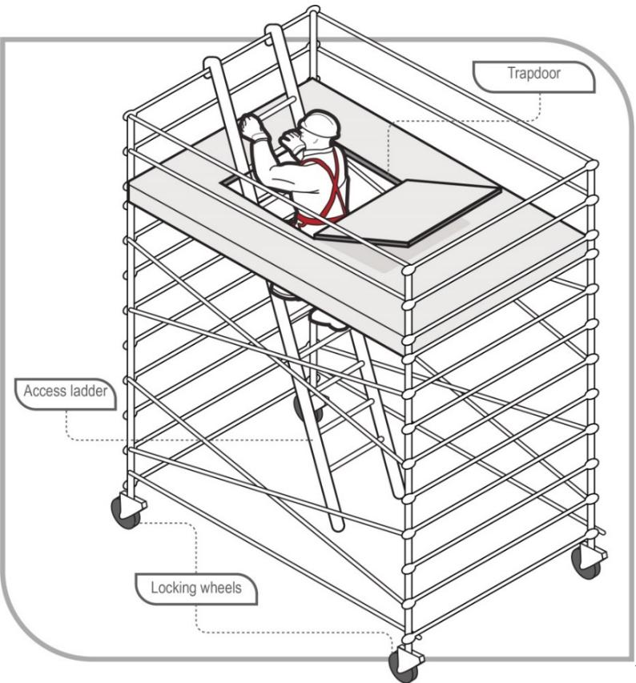
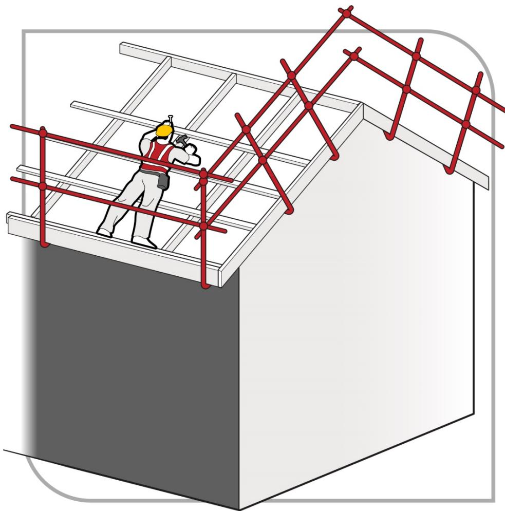

# Managing the risk of falls in housing construction

Code of Practice

# Disclaimer

Safe Work Australia is an Australian Government statutory agency established in 2009. Safe Work Australia includes Members from the Commonwealth, and each state and territory, Members representing the interests of workers and Members representing the interests of employers.

Safe Work Australia works with the Commonwealth, state and territory governments to improve work health and safety and workers' compensation arrangements. Safe Work Australia is a national policy body, not a regulator of work health and safety. The Commonwealth, states and territories have responsibility for regulating and enforcing work health and safety laws in their jurisdiction.

ISBN 978- 0- 642- 33390- 2 (PDF)  ISBN 978- 0- 642- 33391- 9 (DOCX)

# Creative Commons

This copyright work is licensed under a Creative Commons Attribution- Noncommercial 4.0 International licence. To view a copy of this licence, visit creativecommons.org/licenses In essence, you are free to copy, communicate and adapt the work for non- commercial purposes, as long as you attribute the work to Safe Work Australia and abide by the other licence terms.

# Contact information

Safe Work Australia | info@swa.gov.au | www.swa.gov.au

# Contents

# Foreword 5

# 1. Introduction 7

1.1. Who has health and safety duties in relation to falls? 7  1.2. What is involved in managing the risk of falls? 10  1.3. Information, training, instruction and supervision 12

# 2. Managing the risk of falls 14

2.1. The risk management process 14  2.2. Identifying the hazards 14  2.3. Assessing the risks 15  2.4. Controlling the risks 16

# 3. Work on the ground or on a solid construction 19

3.1. Work on the ground 19  3.2. Work on a solid construction 19

# 4. Fall prevention devices 22

4.1. Temporary work platforms 22  4.2. Perimeter guardrails 30

# 5. Work positioning systems 33

5.1. Restraint technique 33

# 6. Fall arrest systems 35

6.1. Catch platforms 35  6.2. Individual fall arrest systems 36  6.3. Safety nets 36

# 7. Administrative controls 38

7.1. No go areas 38  7.2. Organising and sequencing of work 39

# 8. Use of portable ladders 40

8.1. Selection of ladders 40  8.2. Using ladders safely 41

# 9. Safe work methods for common tasks 47

9.1. Floor laying 47  9.2. Fixing ceiling joists and upper level floor joists 49  9.3. Guarding openings 50  9.4. Wall framing 51  9.5. Installing prefabricated roof trusses 52  9.6. Constructing conventional or stick roof 61  9.7. Fixing roof battens to trusses 61

9.8. Installation of battens. 62

# 10. Roofing tasks 64

10.1. Critical angle 6410.2. Access and exit 6410.3. Guardrail systems for roofing work 6410.4. Catch platforms 6610.5. Steep roofs 6710.6. Installation of sarking – tile roofing 6710.7. Installation of perimeter battens – metal roofing 6710.8. Fixing fascias and gutters 67Appendix A—Glossary 68Appendix B—Referenced documents and further reading 71Appendix C—Timber scaffolds 73C1: Introduction 73C2: Timber scaffolds—maximum 2 metre lift heights 73C3: Timber scaffolds—single pole with high first lift height 77Amendments 82

# Foreword

This Code of Practice on how to manage the risk of falls in housing construction is an approved code of practice under section 274 of the Work Health and Safety Act (the WHS Act).

An approved code of practice provides practical guidance on how to achieve the standards of work health and safety required under the WHS Act and the Work Health and Safety Regulations (the WHS Regulations) and effective ways to identify and manage risks.

A code of practice can assist anyone who has a duty of care in the circumstances described in the code of practice. Following an approved code of practice will assist the duty holder to achieve compliance with the health and safety duties in the WHS Act and WHS Regulations, in relation to the subject matter of the code of practice. Like regulations, codes of practice deal with particular issues and may not cover all relevant hazards or risks. The health and safety duties require duty holders to consider all risks associated with work, not only those for which regulations and codes of practice exist.

Codes of practice are admissible in court proceedings under the WHS Act and WHS Regulations. Courts may regard a code of practice as evidence of what is known about a hazard, risk, risk assessment or risk control and may rely on the code in determining what is reasonably practicable in the circumstances to which the code of practice relates. For further information see the Interpretive Guideline: The meaning of reasonably practicable'.

Compliance with the WHS Act and WHS Regulations may be achieved by following another method if it provides an equivalent or higher standard of work health and safety than the code.

An inspector may refer to an approved code of practice when issuing an improvement or prohibition notice.

# Scope and application

This Code is intended to be read by a person conducting a business or undertaking (PCBU). It provides practical guidance for PCBUs on how to eliminate, or if that is not possible, minimise the risk of falls from height in housing construction.

This Code applies to all workplaces covered by the WHS Act carrying out the construction or extension of:

detached houses attached dwellings, separated from each other by a fire resisting wall, such as terrace, row or town houses boarding and guest houses, hostels or similar with a floor area less than  $300m^2$  , and ancillary buildings to the above, such as private garages, gazebos and carports.

Note: The above points are based on Classes 1, 2 and 10 of the National Construction Code.

This Code does not apply to the maintenance or renovation of buildings or to multistorey buildings above two habitable storeys.

This Code is not intended as complete guidance where roofing work involves dismantling or demolition work.

This Code may be a useful reference for other persons interested in the duties under the WHS Act and WHS Regulations.

This Code should be read in conjunction with the Code of Practice: Managing the risk of falls at workplaces and the Code of Practice: Construction work.

# How to use this Code of Practice

This Code includes references to the legal requirements under the WHS Act and WHS Regulations. These are included for convenience only and should not be relied on in place of the full text of the WHS Act or WHS Regulations. The words 'must', 'requires' or 'mandatory' indicate a legal requirement exists that must be complied with.

The word 'should' is used in this Code to indicate a recommended course of action, while 'may' is used to indicate an optional course of action.

# 1. Introduction

1. IntroductionFalls are a major cause of death and serious injury in Australian workplaces. Fall hazards are found when carrying out common tasks in the construction of a typical one or two storey house (see Figure 1). Falls can also occur at ground level into holes, for example trenches or service pits.

  
Figure 1 Examples of potential falls in the housing construction industry

# 1.1. Who has health and safety duties in relation to falls?

There are a number of duty holders who have a role in managing the risk of falls in the workplace. These include:

persons conducting a business or undertaking (PCBU) designers, manufacturers, importers, suppliers and installers of plant, substances or structures, and officers.

Workers and other persons at the workplace also have duties under the WHS Act, such as the duty to take reasonable care for their own health and safety at the workplace.

A person can have more than one duty and more than one person can have the same duty at the same time.

Early consultation and identification of risks can allow for more options to eliminate or minimise risks and reduce the associated costs.

# Person conducting a business or undertaking

# WHS Act section 19

Primary duty of care

A PCBU must eliminate the risk of falls during construction, or if that is not reasonably practicable, minimise the risks so far as is reasonably practicable.

A PCBU has more specific obligations under the WHS Regulations to manage the risk of a fall by a person from one level to another, including requirements to:

- ensure, so far as is reasonably practicable, that any work involving the risk of a fall by a person from one level to another is carried out on the ground or on a solid construction- provide safe means of access to and exit from the workplace, and- if it is not reasonably practicable to eliminate the risk of a fall, minimise the risk of falls so far as is reasonably practicable by providing adequate protection against the risk, including by providing a fall prevention device if it is reasonably practicable to do so, or if not, a work positioning system if it is reasonably practicable to do so, or if not, a fall arrest system.

A combination of the controls that are reasonably practicable to provide adequate protection against the risk may be used if a single control is not sufficient for the purpose.

The WHS Regulations classify a number of activities as 'high risk construction work' for which a Safe Work Method Statement (SWMS) must be prepared before the work starts. High risk construction work includes work that involves a risk of a person falling more than 2 metres. Further information on developing a SWMS can be found in the Code of Practice: Construction work.

PCBUs have a duty to consult workers about work health and safety and may also have duties to consult, cooperate and coordinate with other duty holders.

Designers, manufacturers, importers and suppliers of plant, substances or structures

# WHS Act Part 2 Division 3

Further duties of persons conducting businesses or undertakings

Designers, manufacturers, importers, suppliers, and installers of plant, substances or structures that are to be used or could reasonably be expected to be used for work must ensure, so far as is reasonably practicable, that the plant or structure is without risks to health and safety.

This duty includes carrying out testing and analysis as well as providing specific information about the plant or structure.

To assist in meeting these duties, the WHS Regulations require:

manufacturers to consult with designers of plant importers to consult with designers and manufacturers of plant, and the person who commissions construction work to consult with the designer of the structure.

# Officers

# WHS Act section 27

Duty of officers

Officers, for example company directors, have a duty to exercise due diligence to ensure that the PCBU complies with the WHS Act and WHS Regulations. This includes taking reasonable steps to:

gain an understanding of the hazards and risks associated with the operations of the business or undertaking, and ensure the business or undertaking has and uses appropriate resources and processes to eliminate or minimise risks of falls from one level to another that are likely to cause injury.

Further information on who is an officer and their duties is available in the Interpretive Guideline: The health and safety duty of an officer under section 27.

# Workers

# WHS Act section 28

Duties of workers

Workers have a duty to take reasonable care for their own health and safety and to not adversely affect the health and safety of other persons. Workers must comply with reasonable instructions, as far as they are reasonably able, and cooperate with reasonable health and safety policies or procedures that have been notified to workers. If personal protective equipment (PPE) is provided by the business or undertaking, the worker must so far as they are reasonably able, use or wear it in accordance with the information and instruction and training provided.

# Other persons at the workplace

# WHS Act section 29

Duties of other persons at the workplace

Other persons at the workplace, like visitors, must take reasonable care for their own health and safety and must take care not to adversely affect other people's health and safety. They must comply, so far as they are reasonably able, with reasonable instructions given by the PCBU to allow that person to comply with the WHS Act.

# 1.2. What is involved in managing the risk of falls?

# WHS Regulation 34

Duty to identify hazards WHS Regulation 35 Managing risks to health and safety WHS Regulation 36 Hierarchy of control measures

# WHS Regulation 37

Maintenance of control measures

# WHS Regulation 38

Review of control measures

# WHS Regulation 297

Managing the risks of construction work

# WHS Regulation 299

Safe work method statement required for high risk construction work.

This Code provides guidance on how to manage the risk of falls in housing construction using the following systematic process:

Identify hazards- - find out what could cause harm. Assess the risks, if necessary- - understand the nature of the harm that could be caused by the hazard, how serious the harm could be and the likelihood of it happening. This step may not be necessary if you are dealing with a known risk with known controls. Eliminate risks so far as is reasonably practicable. Control risks- - if it is not reasonably practicable to eliminate the risk, implement the most effective control measures that are reasonably practicable in the circumstances in accordance with the hierarchy of control measures, and ensure they remain effective over time. Review control measures to ensure they are working as planned.

Further guidance on the general risk management process is available in the Code of Practice: How to manage work health and safety risks.

Guidance on the preparation of a SwMS is available in the Safe work method statement for high risk construction work - Information sheet.

# Consulting workers

Consultation involves sharing information, giving workers a reasonable opportunity to express views and taking those views into account before making decisions on health and safety matters.

# WHS Act section 47

Duty to consult workers

A PCBU must consult, so far as is reasonably practicable, with workers who carry out work for the business or undertaking and who are (or are likely to be) directly affected by a health and safety matter.

This duty to consult is based on the recognition that worker input and participation improves decision- making about health and safety matters and assists in reducing work- related injuries and disease.

The broad definition of a 'worker' under the WHS Act means a PCBU must consult, so far as is reasonably practicable, with employees, contractors and subcontractors and their employees, on- hire workers, outworkers, apprentices, trainees, work experience students, volunteers and other people who are working for the PCBU and who are, or are likely to be, directly affected by a health and safety matter.

Workers are entitled to take part in consultations and to be represented in consultations by a health and safety representative who has been elected to represent their work group.

By drawing on the experience, knowledge and ideas of workers, fall hazards are more likely to be identified and effective control measures implemented.

In many cases, decisions about construction work and construction projects are made prior to engaging workers. Therefore, it may not be possible to consult with workers in these early stages. However, it is important to consult with them as the construction work progresses.

Consulting, cooperating and coordinating activities with other duty holders

# WHS Act section 46

Duty to consult with other duty holders

The WHS Act requires a PCBU to consult, cooperate and coordinate activities with all other persons who have a work health or safety duty in relation to the same matter, so far as is reasonably practicable.

There is often more than one business or undertaking involved in a housing construction project, which may each have responsibility for the same health and safety matters, either because they are involved in the same activities or share the same workplace.

In these situations, each duty holder should exchange information to find out who is doing what and work together in a cooperative and coordinated way so risks are eliminated or minimised so far as is reasonably practicable.

For example an electrician working on a roof should consult with other duty holders, including the builder, who are also working on the site to coordinate the provision of suitable fall prevention measures, and cooperate with each other to ensure that each of their activities do not create risks for other workers on the site.

Further guidance is available in the Code of Practice: Work health and safety consultation, cooperation and coordination.

# 1.3. Information, training, instruction and supervision

# WHS Act section 19

Primary duty of care

# WHS Regulation 39

Provision of information, training and instruction

The WHS Act requires PCBUs to ensure, so far as is reasonably practicable, the provision of any information, instruction, training or supervision necessary to protect all persons from risks to their health and safety arising from work carried out as part of the conduct of the business or undertaking.

The PCBU must ensure that information, training and instruction provided to a worker is suitable and adequate having regard to:

the nature of the work carried out by the worker the nature of the risks associated with the work at the time of the information, training and instruction, and the control measures implemented.

The PCBU must also ensure, so far as is reasonably practicable, that the information, training and instruction are provided in a way that is readily understandable for the person to whom it is provided.

Workers must be trained and have the appropriate skills to carry out a particular task safely. Training should be provided to workers by a competent person.

Information, training, instruction provided to workers exposed to potential falls from working at any height should include:

the proper use, wearing, storage and maintenance PPE the hazards and risks associated with work performed at these heights how to follow health and safety procedures associated with this work, including the contents of any SWMS, and the reasons fall protection measures have been set in place and how to use them properly.

Those supervising the work should also receive training. The amount and type of information, training and instruction required will depend on the nature of the work and the risk involved, as well as the type of fall protection measures used.

The information, training and instruction provided to workers should also include:

procedures for emergency and rescue procedures for reporting fall hazards and incidents the correct selection, fitting, use, care, inspection, maintenance and storage of fall arrest and restraint equipment the correct use of tools and equipment used in the work, for example using a tool belt instead of carrying tools, and control measures for other potential hazards, for example electrical hazards and crushing or entanglement from the use of plant like elevating work platforms (EwPs).

Workers exposed to a risk of a fall should also be adequately supervised by a competent person, especially if they are undergoing training or are unfamiliar with the working environment. As a PCBU, you should check that:

only workers who have received training and instruction in relation to the system of work are authorised to carry out the work, and- workers use fall control measures in the correct manner.

# WHS Regulation 317

Duty to ensure worker has been trained

A PCBU must not direct or allow a worker to carry out construction work unless the worker has successfully completed general construction induction training. The PCBU must also ensure the worker holds a general construction induction training card or a general construction induction training certification.

Further information on construction induction training is available in the Workplace induction for construction workplaces – Information sheet.

# 2. Managing the risk of falls

# 2.1. The risk management process

A risk assessment is not mandatory under the WHs Regulations. However, in many circumstances it will be the best way to determine the measures that should be implemented to control risks. It will help to:

identify which workers are at risk of exposure determine what sources and processes are causing that risk identify if and what kind of control measures should be implemented, and check the effectiveness of existing control measures.

Risk management is a systematic process to eliminate or minimise the potential for harm to people.

# 2.2. Identifying the hazards

The first step in the risk management process is to identify all fall hazards in the workplace. This involves finding things and situations which could potentially cause harm to people. Hazards generally arise from the following aspects of work and their interaction:

physical work environment equipment, materials and substances used work tasks and how they are performed, and work design and management.

As a person conducting a business or undertaking (PCBU), you must identify all locations and work tasks that are reasonably likely to cause injury due to a fall. This includes access to and exit from the areas where work is to be carried out.

# Inspect the workplace

Hazards may be identified by looking at the workplace and how work is carried out.

Walk around the workplace and talk to your workers to find out where work is carried out that could result in falls. A checklist may be useful in this process. Key things to look for include:

edges- requiring protection for open edges of floors, working platforms, walkways, walls or roofs holes, openings or excavations- requiring guarding surfaces, including: their stability, fragility or brittleness their strength or capability to support loads the slope of work surfaces the potential to slip, for example where surfaces are wet, polished or glazed, and the safe movement of workers where surfaces change.

levels- where levels change and workers may be exposed to a fall from one level to another structures- the stability of permanent and temporary structures

- the ground--the evenness and stability of the ground for safe support of a scaffold or work platform- the working area--whether it is crowded or cluttered- safe means of access to and exit from the workplace and working area, and- hand grip--places where hand grip may be lost.

Particular attention should also be given to work tasks that are carried out:

- near unprotected open edges, for example near roof and elevated floor edges, incomplete stairwells or leading formwork edges- using equipment to work at the elevated level, for example when using elevating work platforms (EVPs) or portable ladders- on a potentially unstable surface, for example areas where there is potential for ground collapse, and- near a hole, shaft or pit into which a worker could fall, for example trenches, service pits and floor penetrations.

# 2.3. Assessing the risks

A risk assessment involves considering what could happen if someone is exposed to a hazard and the likelihood of it happening. A risk assessment can help you determine:

- how severe a risk is- whether any existing control measures are effective- what action you should take to control the risk, and- how urgently the action needs to be taken.

Hazards have the potential to cause different types and severities of harm, ranging from minor discomfort to a serious injury or death.

Many hazards and their associated risks in housing construction are well known and have well established and accepted effective control measures. In these situations, the second step in the process outlined in section 2.4 of this Code (to formally assess the risk) is not required. If after identifying a hazard you already know the risk and how to control it effectively, you may simply implement the controls.

In some circumstances, a risk assessment will assist to:

- identify which workers are at risk of exposure- determine what sources and processes are causing the risk- identify if and what kind of control measures should be implemented, and- check the effectiveness of existing control measures.

When assessing the risks of each fall hazard the following should be considered:

- What could happen if a fall did occur and how likely it is to happen.- The design and layout of elevated work areas including the distance of a potential fall.- The number and movement of people at the workplace.- The proximity of workers to unsafe areas where loads are placed on elevated working areas, and where work is to be carried out above people and there is a risk of falling objects.- The adequacy of inspection and maintenance of plant and equipment, for example scaffolds.- The adequacy of lighting for clear vision.

- Weather conditions including the presence of rain, wind, extreme heat or cold which can cause slippery or unstable conditions.- The suitability of footwear and clothing for the conditions.- The suitability and condition of ladders including where and how they are being used.- The adequacy of current knowledge and training to carry out work safely, for example young, new or inexperienced workers may be unfamiliar with the work.- The adequacy of procedures for potential emergency situations—including effective procedures for response and evacuation, the provision of medical treatment and assistance (for example ensuring appropriate first aid is provided immediately and ambulances are called for when necessary), and effective communication.- The adequacy of current testing and training of the emergency procedures.

# Generic risk assessment

If you are responsible for a number of different work areas or workplaces and the fall hazards are the same, you may complete a single—or generic—risk assessment. However, a generic risk assessment must be reviewed if there is any likelihood a person may be exposed to greater, additional or different risks at the specific work area or workplace.

# 2.4. Controlling the risks

# Hierarchy of control measures

The WHs Regulations require duty holders to work through the hierarchy of control measures when managing certain risks; however, the hierarchy can be applied to any risk. The hierarchy ranks control measures from the highest level of protection and reliability to the lowest.

Further guidance on the general risk management process and hierarchy of control measures is available in the Code of Practice: How to manage work health and safety risks.

# Managing the risk of falls

# WHS Regulation 78

Management of risk of fall

In managing the risk of falls, the WHs Regulations require specific control measures to be implemented, where it is reasonably practicable to do so.

As a PCBU, you must manage risks to health and safety associated with a fall by a person from one level to another that is reasonably likely to cause injury to the person or any other person.

In managing the risk of a fall, you must ensure, so far as is reasonably practicable, that any work involving a risk of a fall is carried out on the ground or on a solid construction (see Chapter 3).

# WHS Regulation 79

Specific requirements to minimise risk of fall

If it is not reasonably practicable for you to eliminate the risk of a fall by working on the ground or on a solid construction, you must minimise the risk of a fall by providing adequate protection against the risk.

Adequate protection against the risk is provided if you provide and maintain a safe system of work, including by:

- providing a fall prevention device, for example a temporary work platform, if it is reasonably practicable to do so (see Chapter 4), or- if it is not reasonably practicable to provide a fall prevention device, providing a work positioning system, for example a restraint technique (see Chapter 5), or- if it not reasonably practicable to provide a fall prevention device or work positioning system, providing a fall arrest system, for example an industrial safety net or catch platform or harness based fall arrest system (where the system will arrest a fall before the person hits the ground or structure below), so far as is reasonably practicable (see Chapter 6).

If a risk remains after considering all of the control measures mentioned above, you must minimise the remaining risk, so far as is reasonably practicable, by implementing administrative controls, for example safe sequencing of work, permit systems and appropriate signs (see Chapter 7).

Administrative controls may also be used to support other control measures. However, the exclusive use of administrative controls to minimise the risk of falls is only appropriate when it is not reasonably practicable to use a higher order control.

# Combining control measures

A combination of control measures may be used to minimise risks, so far as is reasonably practicable, if a single control is not sufficient for the purpose. In most cases, a combination of control measures will provide the best solution to minimise the risk to the lowest level reasonably practicable.

You should also ensure that the control measures you select do not create new hazards, for example electrical risks from contact with overhead powerlines or crushing and entanglement from plant like EwPs. If any new hazards are created they must also be controlled.

# Maintaining and reviewing control measures

# WHS Regulation 37

Maintenance of control measures

Control measures must be maintained so they remain fit for purpose, suitable for the nature and duration of work and installed, set up and used correctly.

# WHS Regulation 38

Review of control measures

You must review and as necessary revise fall control measures in the following circumstances:

- when the control measure does not control the risk so far as is reasonably practicable

before a change at the workplace that is likely to give rise to a new or different risk to health and safety that the control measure may not effectively control a new relevant hazard or risk is identified the results of consultation indicate that a review is necessary, or a health and safety representative requests a review if that person reasonably believes that:

a circumstance in any of the above points affects or may affect the health and safety of a member of the work group represented by the health and safety representative the control measure has not been adequately reviewed in response to the circumstance.

# 3. Work on the ground or on a solid construction

3. Work on the ground or on a solid constructionThe most effective control measure is to eliminate the risk of a fall, so far as is reasonably practicable. This can be achieved by working on the ground or from a solid construction. A person conducting a business or undertaking (PCBU) can only take steps to minimise the risk of a fall if it is not reasonably practicable to eliminate that risk.

# 3.1.Work on the ground

Eliminating the need to work at height is the most effective way of protecting workers from the risk of falls. Examples of tasks that may be carried out on the ground to eliminate the risks of falls are:

prefabricating roofs at ground level prefabricating wall frames horizontally, then standing them up.

# 3.2.Work on a solid construction

Working on a solid construction provides an environment where the risk of a fall may be eliminated. 'Solid construction' means an area:

with a surface that is structurally capable of supporting workers, materials and any other loads applied to it provided with barriers around its perimeter and around any openings from or through which a person could fall with an even and readily negotiable surface and gradient, and with a safe means of entry and exit.

# Structural strength

Different types of work involve different loads on the supporting surface. Make sure that the surface and its supports can safely carry the expected loads, including workers, materials, tools and equipment. When in doubt, have a structural engineer determine the safe load capacity before use.

Where props are used to support suspended floors, formwork or similar areas you should ensure that:

proprietary brand props are marked with their safe working load the props are designed for the loads imposed single isolated props are secured at the top and bottom groups of props are tied to each other in the longitudinal and transverse directions to form a stable, freestanding structure, and a competent person, for example an engineer or experienced foreman, has confirmed the formwork has been constructed in accordance with its design specifications and has provided a sign- off prior to any concrete pour.

# Barriers

A solid construction has barriers around its perimeter and any openings, including:

the perimeters of buildings, balconies or other structures floors, including mezzanine floors openings in floor or roof structures, and. perimeters of skylights or other fragile roof materials.

Barriers may be permanent, for example a parapet on a balcony, or temporary. Permanent barriers should provide at least the same level of protection as specified in the checklist below for temporary barriers.

# Temporary barrier checklist

Temporary barrier checklist- The guardrail system should be of robust design and able to withstand the force of someone falling against it. (See AS/NZS 4994.1:2009 for required design specifications.)- Top rails should be between  $900mm$  and  $1100mm$  above the working surface.- Mid- rails should be provided. However, wire mesh infill panels incorporating a toe- board may be used instead of a mid- rail.- Toe- boards should be provided where reasonably practicable. Particular attention should be given to installing toe- boards directly above doorways used as access into the building.- A bottom rail above the toe- board may need to be provided for more severe roof slopes. Both a mid- rail and infill mesh panel will assist in preventing persons and objects from sliding off the roof.- If access points are required for equipment such as tile elevators, they must be adequately protected to prevent a person falling.- Every open edge of a stair, landing, platform or shaft opening must be protected to prevent people falling.

# Void covers

Void coversWhere workers are working from trestles, ladders and mobile scaffolds on a solid construction and they are located in close proximity to floor openings such as stairwells and partially completed floors, edge protection will not prevent a fall into the opening. These openings and penetrations must be made safe immediately after being formed. If a cover is used as a control measure it must be made of a material strong enough to prevent people or objects falling through the penetration or opening and should be securely fixed to prevent dislodgement or accidental removal.

# Surface and gradient

Surfaces of a solid construction must be non- slip and free from trip hazards.

Surfaces of a solid construction must be non- slip and free from trip hazards.Surfaces of a solid construction should generally not exceed 7 degrees (1 in 8 gradient). Cleated surfaces, which provide greater slip resistance, should not be steeper than 20 degrees (1 in 3 gradient).

# Entry and exit

The solid construction must have a safe means for people to enter and exit, and to move around the work area, for example using existing floor levels, permanently installed platforms, ramps, stairways or fixed ladders.

Further information on fixed walkways, stairways and ladders is in AS 1657- 2013: Fixed platforms, walkways, stairways and ladders - Design, construction and installation.

Other safety considerations for entrances and exits in a solid construction include:

exposure to the weather, for example rain can make surfaces slippery and strong winds can cause loss of hand grip providing natural or artificial lighting for access ways, and clearing obstructions so people are able to move easily to and from the workplace.

Portable stepladders and trestle ladders should not be used for entries or exits, and single or extension ladders should only be used where the use of safer systems is not reasonably practicable.

# 4. Fall prevention devices

When work cannot be performed on the ground or from a solid construction, you, as a person conducting a business or undertaking (PCBU), must minimise the risk of a fall by providing a fall prevention device, if it is reasonably practicable to do so.

A 'fall prevention device' is material or equipment - or a combination of both - typically designed to prevent a fall for temporary work at heights, that once erected or installed does not require any ongoing adjustment, alteration or operation by any person to ensure the device's integrity. Examples include secure fencing, temporary work platforms, guardrails and covers.

# 4.1. Temporary work platforms

4.1. Temporary work platformsA 'temporary work platform' is a working platform, other than a permanently installed fixed platform, used to provide a working area for the duration of the work. The design of the platform prevents workers from falling. Temporary work platforms commonly used in housing construction include scaffolds (fixed or mobile), elevating work platforms (EWPs) and step platforms.

# Scaffolds

ScaffoldsScaffolds are a common means of providing a safe platform for working at height. A wide variety of scaffold systems are available. Specific requirements apply to some types of scaffolds under the WHS Regulations.

# WHS Regulation 225

Scaffolds

A person with management or control of a scaffold must not allow the use of a scaffold from which a person or object could fall more than 4 metres unless a competent person, who has inspected the scaffold, provides written confirmation that the scaffold has been completed.

The person with management or control of a scaffold must also ensure that:

the scaffold and its supporting structure are inspected by a competent person:

before use of the scaffold is resumed after an incident occurs that may reasonably be expected to affect the stability of the scaffold (such as a severe storm or impact by mobile plant) before use of the scaffold is resumed after any repairs, and at least every 30 days.

if an inspection indicates that a scaffold or its supporting structure creates a risk to health or safety, that any repairs, alterations and additions are made or carried out and the scaffold and its supporting structure are inspected again by a competent person before use is resumed, and unauthorised access is prevented on scaffolding that is incomplete and left unattended, for example by attaching danger tags and warning signs at appropriate locations.

The same requirements also apply to suspended, cantilevered, spur or hung scaffolds, where used.

The WHS Regulations also require that the design of certain types of plant, such as prefabricated scaffolding, must be registered before the plant is used in the workplace. Further information on design registration is available in the Code of Practice: Managing risks of plant in the workplace.

Scaffold working platforms are generally rated as light, medium or heavy duty:

- Light duty—up to  $225 \text{kg}$  per bay. Examples include painting, electrical work, many carpentry tasks and other light tasks. Platforms should be at least two planks wide (approximately  $450 \text{mm}$ )- Medium duty—up to  $450 \text{kg}$  per bay. This is suitable for general trades work. Platforms should be at least four planks wide (approximately  $900 \text{mm}$ )- Heavy duty—up to  $675 \text{kg}$  per bay. This is what is needed for bricklaying, concreting, demolition work and most other work tasks involving heavy loads or heavy impact forces. Platforms should be at least five planks wide (approximately  $1000 \text{mm}$ )- Special duty—has a designated allowable load as designed.

These safe load limits include the weight of people plus the weight of any materials, tools and debris on the working platform. For example, a properly constructed mobile scaffold with a light duty platform holding up to  $225 \text{kg}$  per bay can safely support one  $80 \text{kg}$  worker and  $145 \text{kg}$  of tools and material, or two  $80 \text{kg}$  workers and  $65 \text{kg}$  of tools and materials.

Prefabricated scaffolds should be of the same type and not mixed components, unless the mixing of components has been approved by the manufacturer. Unauthorised mixing of components from different manufacturers can result in scaffold incompatibilities and failures, posing significant risks to persons using the scaffolding.

  
Figure 2 Perimeter scaffold

Where work is carried out from a scaffold, workers must be provided with information, training and instruction on the nature of the scaffolding work, the risks associated with the scaffolding and the control measures implemented to reduce that risk. This may include information, training and instruction on:

emergency response procedures what loads the scaffold can safely take (Safe Working Load (SwL)) not to make unauthorised alterations to the scaffold, such as removing guardrails, planks, ties, toe- boards and braces keeping working platforms clear of debris and obstructions along their length never accessing incomplete or defective scaffolds immediately reporting defects, if they occur isolating electrical leads from the metal frame of the scaffold with plastic lead hooks or an insulated rubber material where reasonably practicable (to prevent damage to the leads or electrifying the scaffold) the requirement for a written safe work method statement (SwMS) to be developed for any work carried out at or above 2 metres, and complying with any electrical permit to work' requirements issued by the electricity supply authority for work conducted from a scaffold that has been erected within the powerline 'no go'zone.

Where mobile scaffolds are used, workers should be trained in their use, including on how to ensure the scaffold:

remains level and plumb is kept well clear of powerlines, open floor edges and penetrations is not accessed until all castors are locked to prevent movement is not moved while anyone is on it, and is only accessed using an internal ladder (see Figure 3), except for low height platforms where this is not reasonably practicable.

  
Figure 3 Mobile scaffold with access ladder

# Trestle scaffolds

Trestle scaffolds are generally not suitable for working at heights of 2 metres or above. If they are used at heights greater than 2 metres, guardrailing and toe- boards should be used to prevent people and material from falling off the open side or end of the work platform.

Working platforms on trestle scaffolds should have a width of at least  $450mm$  (two planks). The use of plank locking devices will extend plank spans and reduce plank whip when walking along the platform. The system (including planks) should be assembled according to the manufacturer's specifications using only compatible components.

Except where the working platform is at or below 2 metres in height, if there is no guardrail or mid- rail provided adjacent to the working face of the structure, the distance between the platform edge and the working face of the structure should not be greater than one plank width  $(225mm)$

Some trestle ladder scaffolds include outriggers to increase stability (see Figure 4). Trestle ladder scaffolds are only suited to light duty work, like painting and rendering and fixing fascias and gutters.

Alternatives to trestle ladders should be considered first, for example small scissor lifts, light duty aluminium mobile scaffolds, EwPs and modular scaffolding.

  
Figure 4 Trestle ladder scaffold with guardrailing and outriggers for stability

When adjusting the height of a bricklayer's trestle scaffold, make sure that only the purpose- designed pins are used. Do not use nails or pieces of reinforcing bar. Pins should be attached to the trestle by a chain to prevent loss.

Work should only be performed between the trestles. Where a trestle scaffold is more than one bay in length, heavy loads should be placed directly over the trestles.

  
Figure 5 Examples of incorrectly used trestle scaffolds

# Scaffolding checklist

Scaffolding checklist- If scaffolding is to be erected from which a person or object could fall more than 4 metres, the scaffold must be erected, altered and dismantled by a licensed scaffolder or a trainee under direct supervision of a licensed scaffolder.- Prefabricated scaffolds should be of the same type and not mixed components, unless the mixing of components has been approved by the manufacturer. AS/NZS 4576:1995: Guidelines for scaffolding sets out the assurances that are needed before the components of different prefabricated scaffolding systems can be mixed in a scaffold.- Scaffolding that is incomplete and left unattended should have danger tags and warning signs attached at appropriate locations. Access points such as stairs or ladders should be blocked off if possible to prevent use.- Scaffolding must be inspected by a competent person before use. Additional inspections must be carried out by a competent person following alteration or repair of the scaffold, or an occurrence that may reasonably be expected to affect the stability of the scaffold before use is resumed. Examples include impact from mobile plant or a severe storm.- Safe access to and exit from the scaffold must be provided.- If the erection of a scaffold enters the electrical no go zone of overhead powerlines, a permit to work must be obtained from the powerline asset owner.- A SWMS has been developed for work above 2 metres.

# Elevating work platforms (EwPs)

Elevating work platforms (EwPs)Elevating work platforms (EwPs) include scissor lifts (see Figure 6) and boom- type EwPs (see Figure 7). Some are designed for hard flat surfaces only, while others are designed to be operated on rough terrain. Some types are designed for indoor use and are not suitable for windy conditions outdoors.

  
Figure 6 Scissor lift elevating work platform

  
Figure 7 Boom-type elevating work platform

If using an EWP as a control measure to minimise the risk of a fall, you must also identify the unique hazards associated with the use of the EWP and implement control measures to eliminate or minimise those risks so far as is reasonably practicable.

The main hazards related to the use of EwPs are contact with electric lines, overturning the machine, falling from the work platform, and potential crushing hazards when elevating the platform or moving laterally.

Where it is not reasonably practicable to use a fall prevention device or a work positioning system to adequately protect against the risk of a fall, workers in travel towers, boom lifts or cherry pickers must wear a properly anchored fall arrest harness. The lanyard should be as short as possible and should be attached directly to the designated anchor point on the EWP, not to the handrail (unless the handrail is the manufacturer's specified anchor point).

Persons working in scissor lifts are not required to wear a fall arrest harness.

Workers using EwPs must be trained and instructed in the safe loading and safe operating procedures for the particular brand and type of plant. During the operation of the EWP, workers should not climb the work platform guardrails to gain extra height.

Workers operating boom- type EwPs with a boom length of 11 metres or more must either:

- hold a boom-type high risk work licence, or- be enrolled in a training course to obtain a boom-type EWP high risk work licence and be supervised by the holder of a boom-type EWP high risk work licence.

# Elevating work platform checklist

- Workers operating the platform should be trained and instructed in safe operating procedures for the particular brand and type of equipment.- The training provided must include safe use of the fall arrest equipment, where appropriate, and emergency rescue procedures.

Workers operating the platform should perform a prestart check of the machine and fill in the machine's logbook. All EWP travel warning devices must be operational. Workers should not operate a machine with defects and should report the defects as soon as possible. Defective machines must be isolated, immobilised and fitted with warning signs. The workplace should be inspected for any overhead structures, protrusions or obstructions that could contribute to an operator crush hazard. During the operation of the EWP, workers should not climb the work platform guardrails to gain extra height. The platforms should only be used as working platforms. They should not be used as a means of access to and exit from a work area unless the conditions set out in AS 2550.10- 2006: Cranes, hoists and winches - Safe use - Mobile elevating work platforms are met. Unless designed for rough terrain, the platforms should be used only on a solid level surface. The surface area must be checked to make sure that there are no penetrations or obstructions which could cause uncontrolled movement or overturning of the platform. If the operation of the EWP requires entry into the electrical no go zone of overhead powerlines, a permit to work must be obtained from the electricity supply authority and the safety controls detailed in the permit must be followed. People working in boom- type EwPs should wear an anchored fall arrest harness and lanyard incorporating a shock absorber as a precaution in case they are tipped or thrown from the basket. The lanyard should be as short as possible. A SwMS must be developed for the use of powered mobile plant and any work conducted above 2 metres.

# 4.2. Perimeter guardrails

Guardrails may be used to provide effective protection from the risk of falling at:

edges of roofs- perimeters of buildings or other structures- perimeters of skylights or other fragile roof materials- openings in floor or roof structures, and- edges of excavations.

Guardrails should incorporate a top rail  $900mm$  to  $1100mm$  above the working surface, a mid- rail and a toe- board, except where it is impractical to do so.

The guardrail system, method of attachment and the supporting structure should be capable of withstanding the loads that will be applied.

Further information is contained in AS/NZS 4994 (set)1: Temporary edge protection.

Wall framing incorporating studs at  $450mm$  centres and one row of hoggings is an acceptable alternative to guardrails. If wall studs have been installed at  $600mm$  centres then an additional guardrail should be installed between  $900mm$  and  $1100mm$  above the floor surface along with a mid- rail.

Where the frame incorporates window or door openings, additional members should be fitted across these openings, which provides the equivalent fall protection to the guard railing described above.

Proprietary systems should be configured, installed, used and dismantled according to the manufacturer's/supplier's instructions.

Wherever feasible, guardrailing should be constructed so that when an outward force is applied the posts are subjected to bending about their strong axis (see Figure 8a).

  
Figure 8a Timber guard rails – posts subject to bending about their weak and strong axes

The designer, manufacturer, importer and supplier of proprietary guardrailing must give adequate information to each person who is provided with the plant regarding any conditions necessary to ensure that the guardrailing is without risks to health and safety when used. Relevant information may include details and instructions on the use of the guardrailing.

A PCBU must provide suitable and adequate information, training and instruction for the use of the guardrailing, having regard to the nature of the work, the risks associated with the work and the control measures implemented.

Building timber should be inspected by a person with relevant qualifications or experience to determine whether it is suitable for use as guardrailing. The methods for connecting timber posts to the support structure or rails to posts should have adequate strength for the purpose intended.

Figure 8b shows details of the connections at A and B in Figure 8a. Detail A shows posts on an edge which are bending about a 'strong' axis. Detail B shows a post on a flat edge bending about a 'weak' axis. The diagrams on the right- hand side show recommended connectors for each detail.

  
Figure 8b Timber guard rails – details of connections at A and B in Figure 8a.

# Guardrails for trenching works

Where trenching works present a risk of a person falling into the trench, any such risk should be controlled by the provision of:

- guardrailing, including guardrails fitted to the top edges of trench shields- a barrier approximately 1.5 metres back from the excavation, to prevent persons approaching the trench, or- structural cover plates over the trench.

Further information on excavation work is available in the Code of Practice: Excavation work.

# 5. Work positioning systems

A 'work positioning system' includes any plant or structure, other than a temporary work platform, that enables a person to be positioned and safely supported at a location in such a way that a fall is prevented.

The use of a work positioning system must only be considered if it is not reasonably practicable to carry out work on the ground or on a solid construction, or by providing a fall prevention device as detailed in Chapter 4, for example an elevating work platform (EWP).

Users, including supervisors, should undertake a relevant competency based course of training before using a work positioning system.

Users should be competent in the technique and possess a suitable attitude for working at height, including a responsible attitude to safety.

Operators should be fit to perform the work and not be affected by alcohol or drugs including prescribed medication which may affect or impair their ability to work at height.

# 5.1. Restraint technique

A restraint technique controls a person's movement by physically preventing the person from reaching a position at which there is a risk of a fall. It consists of a harness connected by a lanyard to a suitable anchorage point or static line. This equipment must be set up to prevent the worker from reaching an unprotected edge from where a fall may occur (see Figure 9).

Inertia reels and retractable lanyards may be used as part of the restraint technique provided the restraint technique is maintained with them in their fully extended condition.

  
Figure 9 Restraint technique options

Restraint techniques must only be used if it is not reasonably practicable to prevent falls by carrying out work on the ground or on a solid construction, or minimise the risk using a fall prevention device, such as edge protection.

A restraint system should be installed by a competent person in accordance with the manufacturer's instructions. Restraint anchorage should be designed for fall arrest loading.

A purpose- designed roof anchor, when used in accordance with the designer's or manufacturer's/supplier's instructions, may be used as part of the restraint technique on metal deck or tiled roofs.

An individual fall arrest system should be used instead of restraint techniques if any of the following situations apply:

- The user can reach a position where a fall is possible.- The user has a restraint line that can be adjusted in length so that a free fall position can be reached.- There is a danger the user may fall through the surface, for example fragile roofing material.- The slope is over 15 degrees.- There is any other reasonably likely use or misuse of the system that could lead to a free fall occurring.

Restraint techniques are not fall arrest devices. Typical anchorage points for these systems are not designed for the impact loads applied in the event of a fall. Therefore, where there is any possibility that a person using a restraint technique may approach an edge from where a fall is possible, a restraint technique should not be used.

# 6. Fall arrest systems

Fall arrest systems such as catch platforms, safety nets and individual fall arrest systems (including anchorage lines or rails), are intended to safely stop a worker falling an uncontrolled distance and reduce the impact of the fall. These systems must only be used if it is not reasonably practicable to use a fall prevention device or work positioning system or if these higher level controls might not be fully effective in preventing a fall on their own.

Equipment used for individual fall arrest systems should be designed, manufactured, selected and used in compliance with AS/NZS 1891(set): Industrial fall- arrest systems and devices.

When using fall arrest systems, the following key safety measures should be observed:

Fall arrest equipment is selected, installed and used correctly. Workers should be trained in the use of fall arrest equipment. The equipment and anchorages are designed, manufactured and installed to be capable of withstanding the force applied to them as a result of a person's fall. The system is designed and installed so that the person travels the shortest possible distance before having the fall stopped.

# 6.1. Catch platforms

A catch platform is a temporary platform located below a work area to catch a worker in a fall. The platform must be designed to sustain the maximum potential impact load.

Catch platforms should:

- incorporate a fully planked deck- be positioned so as to maintain a minimum of 2 metres beyond unprotected edges of the work area, except where extended guardrailing is fitted to the catch platform- be positioned as close as possible to the underside of the work area, and in no case be greater than 1 metre below the work area, and- be used with edge protection.

Catch platforms that include the use of a cantilevered, spur or tube and coupler scaffolding system must be installed by people who:

- hold a high risk work licence for intermediate or advanced scaffolding, or- are enrolled in a training course to obtain an intermediate or advanced scaffolding high risk work licence and are being supervised by the holder of an intermediate or advanced scaffolding high risk work licence.

Catch platforms installed on prefabricated scaffolding systems from which a person or object could fall more than 4 metres must be installed by people who:

- hold a high risk work licence for basic scaffolding, or- are enrolled in a training course to obtain a basic scaffolding high risk work licence and are being supervised by the holder of a basic scaffolding high risk work licence.

Heavy duty trestle scaffolds can be used as simple and inexpensive catch platforms, particularly in voids and stairwells.

# 6.2. Individual fall arrest systems

Individual fall arrest systems are intended to arrest a falling person safely and reduce the impact of the fall. If using an individual fall arrest system, training and supervision is essential. The safe and correct use of individual fall arrest systems relies on many factors, including the design and availability of substantial anchorage points. Individual fall arrest systems have limited application in housing construction because:

- they are generally not appropriate as workers in residential housing construction would generally strike the ground before the system properly deploys (depending on the system design  $6.5m$  clearance may be required)- it is often difficult to achieve the minimum required 15 kN anchorage point rating on a timber roof (particularly when only partially completed), and- rescue procedures must be established and tested.

Before considering the use of individual fall arrest systems, you should ensure that there is adequate clearance under the system so that in the event of a fall the user will not strike the ground or any other obstacle. The total fall distance of an individual fall arrest system will vary with the type of system and equipment used. In working out whether there is enough distance available to arrest a fall, you should take into account:

- the worker's height- the height and position of the anchorage point- the length of the lanyard- any slack in the horizontal lifeline- any stretching of the lanyard or lifeline when extended by a fall, and- the length of the energy absorber when extended by a fall.

Workers using a fall arrest system should wear appropriate personal protective equipment (PPE) to protect them in the event of a fall, for example adequate head protection.

If the equipment has been used to arrest a fall, it should not be used again until it has been inspected and certified by a competent person as safe to use.

# 6.3. Safety nets

Safety nets can provide a satisfactory means of protection while allowing workers maximum freedom of movement. They should not be used to enter or exit a work area or as a working platform.

An internal safety net can be effectively used over stairwell openings and between stud walls during the erection of roof trusses.

Safety nets used in conjunction with basic rigging or scaffolding work must be erected and serviced by people who:

- hold a high risk work licence for Basic Rigging or Basic Scaffolding, or- are enrolled in a training course to obtain a Basic Rigging or Basic Scaffolding high risk work licence and are supervised by the holder of a Basic Rigging or Basic Scaffolding high risk work licence.

# Safety net checklist

If safety nets are used, you should ensure that:

- they are securely anchored before any work starts- they are constructed of material of sufficient strength to catch a falling person or debris- appropriate periodic tests and inspections have been conducted on the nets by a competent person- you control the risk of falls for people installing the safety nets, for example install the nets from below, using a scaffold or EWP such as a cherry picker or scissor lift. If this is not possible, a fall arrest system should be used- they are hung as close as is practicable to the underside of the working area, but no more than 2 metres below the working area- perimeter safety nets, or other secure fencing, are installed where there is no edge protection to prevent workers falling over the edges- they have sufficient tension and clearance to prevent a falling person contacting any surface or structure below the net- material is not allowed to accumulate in safety nets- no welding or oxy cutting is performed above safety nets- they are not used in an environment that exposes them to damage from chemicals or heat- they are inspected, particularly after installation, relocation or repair, and- they are stored correctly in dry, shaded areas with good air circulation.

# 7. Administrative controls

An administrative control is a system of work used to minimise the risk of a fall. Administrative controls must only be used:

where it is not reasonably practicable to use higher order controls, or in addition to higher order controls to further reduce the risk.

Examples of administrative controls are 'no go' zones and sequencing of work.

If relying on administrative controls, it may be necessary to provide a high level of supervision to ensure that they are being adhered to.

Administrative controls must not be used simply because they are the cheapest option.

# 7.1.No go areas

No go areas can be an effective method of making sure people are not exposed to hazards like falls or being hit by a falling object. They require clear signs warning people not to access the hazardous area.

Information and instruction should be provided about no go areas, with supervision to ensure that no unauthorised worker enters the no go area.

The perimeter of the no go zone should be clearly identified, for example with barriers, webbing mesh or warning tape, and signs securely fixed identifying the area as a no go zone. The less secure the perimeter identification is, the greater the level of supervision required.

  
Figure 10 No go area sign

# 7.2. Organising and sequencing of work

Work should be organised so that people do not interfere with other workers or increase the risk to themselves or others. For example, you can sequence jobs so that different trades are not working above or below each other at the same time. Plan so the work is not carried out for extended periods from a ladder, or so that work at height is minimised in extremely hot or cold weather.

Where administrative controls are to be used to minimise the risk of a fall for high risk construction work, the following details should be recorded in the safe work method statement (SwMS):

- a description of the administrative control used- a description of the task to which the administrative control relates, and- a description of how the administrative control is to be implemented, monitored and reviewed.

Workers should be involved in the development of administrative controls. Workers who perform a task regularly often have a good understanding of the risks involved.

# 8. Use of portable ladders

Falls from ladders have resulted in a significant number of serious and fatal injuries, even when working at relatively low heights.

Ladders should only be considered after safer alternatives, for example elevating work platforms (EWPs) or scaffolding, have been considered first.

Extension or single ladders should only be used as a means of access to or exit from a work area or for short duration light work that can be carried out safely from the ladder, for example painting a downpipe, repairing a gutter or carrying out minor electrical work.

Step and platform ladders should only be used for working from, not for access to or exit from a work area.

# 8.1. Selection of ladders

Ladders should be selected to suit the work to be carried out. In doing this, you should consider the duration of the work, the physical surroundings of where the work is to be carried out and the prevailing weather conditions. For example, metal ladders or metal reinforced ladders should not be used for live electrical work.

Depending on the specific task and how it is carried out, step platforms (see Figure 11) should provide an improved level of fall protection over traditional step or single ladders as they include a small working platform and a partial handrail.

Ladders should have a load rating of at least  $120kg$  and be manufactured for industrial use. Domestic or 'homemade' ladders should not be used in construction workplaces.

  
Figure 11 Common work tasks performed at low heights

# 8.2. Using ladders safely

Workers must be provided with information and training on how to use ladders safely. You should only use a ladder if you have been trained in how to set up and use ladders correctly.

# Positioning and setting up ladders

Before setting up a ladder, it should be inspected for visible damage or faults, for example broken rungs, stilles and footings. Faulty or damaged ladders must be removed from service.

When setting up a ladder you should check that:

- the ladder is the correct height for the work to avoid over-reaching or stretching- locking devices on the ladder are secure, and- the ladder is not placed so that the weight of the ladder and any person using the ladder is supported by the rungs.

Ladders used at a workplace should be set up on a solid and stable surface, and to prevent the ladder from slipping. Single and extension ladders can be prevented from slipping by:

- ensuring the ladder has non-slip feet

- placing ladders at a slope of 4:1 (the distance between the ladder base and the supporting structure should be about 1 metre for every 4 metres of working ladder height), and- securing ladders at the top or bottom, or if necessary, at both ends (see Figure 12).

Stepladders should be set up in the fully opened position and may require a second person to 'foot' the ladder for added stability.

  
Figure 12 Examples of effectively securing a ladder

  
Figure 13 Example of acceptable ladder use

# Safe use of ladders

When using a ladder:

always maintain 'three points of contact' as follows:

- when going up or down a ladder, always have two feet and one hand, or one foot and two hands, on the ladder- when working from a ladder, have two feet and one other point of contact with the ladder, such as a hand or thighs leaning against the ladder.- use a tool belt or side pouch so that materials or tools are not carried in the hands while climbing the ladder- ensure only light duty work is carried out while on the ladder, where tools can be operated safely with one hand- make sure that no-one works underneath the ladder- do not allow anyone else on the ladder at the same time- do not straddle the ladder, and- wear slip-resistant footwear.

When using ladders it is not safe to:

- use metal or metal reinforced ladders when working on live electrical installations, or

carry out 'hot' work like arc welding or oxy cutting.

Except where additional fall protection equipment is used in conjunction with the ladder, it is not safe to:

use a stepladder near the edge of an open floor, penetration or beside a railing over- reach- the centre of the torso should be within the ladder stiles throughout the work use power or hand tools requiring two hands to operate, for example circular saws use tools that require a high degree of leverage force which, if released, may cause the user to over- balance or fall from the ladder, for example stillsons or pinch bars face away from the ladder when going up or down, or when working from it stand on a rung closer than  $900mm$  to the top of a single or extension ladder, or stand higher than the second tread below the top plate of a stepladder with the exception of three- rung stepladders, unless working through an overhead opening of the building or structure that provides appropriate additional support above the ladder.

  
Figure 14 Examples of unsafe ladder use

Ladder use in the following situations should only be carried out with additional safety precautions in place:

- in access areas or doorways—if necessary, erect a barrier or lock the door shut- next to powerlines, unless the worker is trained and authorised and the correct ladder for the work is being used

- in very wet or windy conditions, and- next to traffic areas, unless the working area is barricaded.

# Entry and exit

Where single or extension ladders are used for entry and exit, you should check that:

- there is a firm, stable work platform, free from obstructions, to step onto from the ladder- the ladder is securely fixed- the ladder extends at least 1 metre above the stepping-off point on the working platform, and- fall protection is provided at the stepping-off point where people access the working platform.

As an alternative to using ladders as a means of access in stairwells, you should consider having the staircase installed as soon as possible.

Further information on the selection, safe use and care of portable ladders is set out in AS/NZS 1892 (set)3: Portable ladders. The manufacturer's recommendations on safe use should also be followed.

# Ladder maintenance

Ladders should be regularly inspected by a competent person in accordance with the manufacturer's recommendations. Ladders with any of the following faults should be replaced or repaired:

- fibreglass stiles cracked, chipped or severely faded with fibres exposed- timber stiles warped, splintered, cracked or bruised- metal stiles twisted, bent, kinked, crushed or with cracked welds- rungs, steps, treads or top plates that are missing, worn, damaged or loose- tie rods missing, broken or loose- ropes, braces or brackets that are missing, broken or worn- timber members that are covered with opaque paint or other treatment that could disguise faults in the timber- missing, loose, bent or worn fasteners, that is rivets, bolts and pins, and/or- worn or damaged feet including non-slip material.

# Ladder checklist

If a ladder is used check that:

- the type of ladder is appropriate to the task. Do not use 'domestic' or 'home-made' ladders. Further information on portable ladders is available in AS/NZS 1892 (set) and users must follow the manufacturer's/supplier's recommendations on safe use- the ladder is in good condition. Before it is used, the ladder should be inspected for faults such as broken rungs, rails and footing- damaged ladders are removed from service- the ladder is on firm, stable and level ground- the ladder is the correct height for the task to avoid reaching or stretching- the ladder is not too close or too far from the support structure. The ratio should be 4:1. For example, the distance between the ladder base and the supporting structure should be about 1 metre for every 4 metres of working ladder height

the ladder is secured against displacement (that is slipping or sliding) and/or there is another person holding the base of the ladder the ladder is not placed so that the weight of the ladder and any person using the ladder is supported by the rungs all the locking devices on the ladder are secure materials or tools are not carried by hand while climbing the ladder. Tools should be carried in a tool belt or side pouch only light duty work is undertaken while on the ladder, where three points of contact can be maintained and tools can be operated safely with one hand slip resistant base, rungs or steps are provided slip resistant shoes are worn metal or wire bound ladders are never used close to energised powerlines; nonmetallic ladders must be used instead, and ladders are not used:

- on scaffolding or an elevating work platform to get extra height- in very wet or windy conditions, and/or- next to traffic areas unless the working area is barricaded.

# 9. Safe work methods for common tasks

This chapter identifies common tasks in constructing a typical one or two storey house and describes methods that eliminate or minimise the risk of falls associated with these tasks.

Manufacturers' or suppliers' instructions should be checked before commencing tasks.

# 9.1. Floor laying

In order to construct a solid work area for the construction and/or erection of wall frames, flooring should be laid to ground and upper floors at the earliest opportunity.

Note: Working from open floor joists is an unacceptable work practice for any task.

Stairwells and voids should be protected from the risk of falls using the control measures outlined in this Code of Practice before floor laying starts. See section 9.3 of this Code.

Laying flooring is a task that potentially exposes workers to the risk of both internal and external falls. Steep sloping sites increase the potential fall heights.

When laying floor sheets, workers should begin adjacent to an internal or external access point which provides initial fall protection (see Figure 15). Laying of sheets should then proceed using a safe work procedure that minimises the risk of workers falling over the leading edge.

  
Figure 15 Laying sheet flooring at upper level

Fall prevention devices must be used, such as the external scaffolding or guardrailing shown in Figures 16 and 17, if it is reasonably practicable to do so. Where strip flooring is to be installed, temporary sheet flooring may be laid and secured as a fall prevention device.

  
Figure 16 Examples of upper floor edge protection (external scaffolding)

  
Figure 17 Examples of upper floor edge protection (timber guardrailing)

Safe access and exit must also be provided for the area where flooring is being laid. Access should be restricted to only those workers who are laying the flooring and erecting the wall frames.

# 9.2. Fixing ceiling joists and upper level floor joists

The setting out and nailing of level ceiling joists or upper level floor joists should be done by working off scaffolding set up on the floor below. Fall prevention devices such as trestle scaffolds may be used as shown in Figure 18. Section 4.1 of this Code provides further information on the use of trestle scaffolds.

If appropriate control measures such as fall protection devices are in place and those measures provide a safe system of work, a person may stand on or work from the external top plate.

Where it is not reasonably practicable to use scaffolds or other higher order controls, the work may be done using ladders from the floor below.

  
Figure 18 Installing ceiling or upper level floor joists

# 9.3. Guarding openings

All stairwells, atriums and voids through which a person could fall should be sturdily guarded, covered with an industrial safety net or sheeted over, regardless of the fall distance from the upper level floor. Guardrailing should be provided in accordance with section 4.2 of this Code. In particular, toe- boards should be fitted to prevent tools and materials from being kicked into the void.

Voids and atriums should be guarded as soon as possible after laying sheet flooring, as illustrated in Figure 19.

Where a person working from a ladder or working platform without edge protection, such as a low trestle scaffold, may fall over the guardrail and through the opening, adequate protection must be provided against that risk. For example, the opening could be covered or protected, even if guardrails have been erected around it. Possible means include proprietary void platforms, temporary flooring, safety nets and scaffolding from below.

Any fall prevention devices such as coverings or temporary floors and their supports should be of robust construction capable of withstanding impact loads from any potential falls.

  
Figure 19 Void at upper level guarded

# 9.4. Wall framing

Once the floor has been laid and the risk of falls from stairwells, altiums and voids has been minimised so far as is reasonable practicable, work on wall framing may commence. Edge protection, as a form of fall prevention device, can be used to minimise the risk of falls. Window or door openings in external wall frames should be fitted with fall prevention devices such as guardrails prior to raising the frame (see Figure 20). All braces and fixings should be prepared prior to raising the frames. Access to the floor should be restricted to those workers erecting the wall frames.

  
Figure 20 Erecting upper level wall frames

# 9.5. Installing prefabricated roof trusses

This section provides guidance on safe working procedures for the installation of prefabricated roof trusses.

# Preparing for roof truss erection

Where practicable, roof trusses should be placed by crane on the wall top plates at the time of delivery. The truss erector, supplier and transporter should liaise to confirm the order in which the trusses are to be loaded onto the truck. Where possible, the trusses should be able to be unloaded at the site in the order that minimises the amount of handling by the truss erectors. When working at height, the erectors should be able to access the next required truss from the top of the truss stack.

Before commencing work, ensure that all work areas have safe paths of access and exit at all times. This may include ensuring they are free of obstructions.

When working near window penetrations and balconies, ensure the risk of falls through open gaps and penetrations is minimised by providing adequate protection. Fall prevention devices include:

first floor edge protection system timber railings installed at point of manufacture

temporary stud installed by person erecting roof trusses guardrailing system full perimeter scaffold stair void platforms, and catch nets.

As a person conducting a business or undertaking (PCBU), you must ensure that relevant workers are provided with the information, instruction, training or supervision that is necessary to ensure that they are protected from risks to health and safety arising from overloading any wall frames when landing trusses. The designer, manufacturer, importer and supplier must provide the person they give the trusses to with adequate information for the installation of prefabricated timber roof trusses in relation to any conditions necessary to ensure they are used without risks to health and safety. Where trusses have not been landed directly onto the top plates, a safe system of lifting the trusses to the upper level should be developed. At no time should any worker stand on the top plate to receive roof trusses passed up from below.

# Lifting roof trusses onto wall frame top plates for erection

The erection of roof trusses involves both internal and external risks of falls.

To minimise these risks, the erection of trusses may be undertaken from fall prevention devices such as scaffold planks supported on internal wall top plates provided:

planks are adequately supported across their spans, and no person is exposed to the risk of a fall into a stairwell or other void (that is a void protection system is installed).

The person erecting trusses should assess the team's capability to handle the roof trusses. If the size, weight and positioning of the roof trusses poses a risk to the health and safety of the person erecting the trusses, the risk must be eliminated if it is reasonably practicable to do so, or minimised so far as is reasonably practicable, for example by using a crane with a licensed operator to help undertake this task.

Method 1: Using a crane

Unless trusses are to be stored at ground level and individually lifted into final position at the time of erection, the trusses should be craned into position, laid flat and suitably supported prior to erection. Where trusses cannot be self- supporting, use temporary props or internal walls for support (see Figure 21).

The person erecting trusses should ensure that all wall frames are adequately braced to withstand the truss erection loads.

  
Figure 21 Method of supporting long trusses

Method 2: Where a crane is not used:

Smaller trusses for single storey roofs can be separated from the pack and lifted individually into position along the top plates.

If the truss needs to be repositioned, the person erecting the trusses should do this from below to avoid working at heights.

# Safe erection methods for roof trusses

At no time is any person to stand on or work from an external wall top plate without a suitable fall prevention device.

The erection of trusses may be undertaken from internal wall top plates or from scaffold planks supported on internal wall top plates provided:

- no person works closer than 1.5 metres to an external wall, including gable end walls- all persons are adequately protected against the risk of a fall, for example into a stairwell or other void, and- planks are adequately supported across their spans.

The allowable spans for timber planks are given in Appendix C of this Code.

A PCBU must ensure that laminated timber, aluminium and steel planks are used having regard to the information provided by the designer, manufacturer, importer or supplier.

When trusses are erected at up to  $600~\mathrm{mm}$  centres, persons working between the trusses to fix or brace them can use the erected trusses as a form of fall prevention device under controlled conditions as described below. If trusses are erected at greater than  $600~\mathrm{mm}$  centres, refer to Chapter 10 of this Code for suggested methods of working safely at heights.

Truss bottom chords are more likely to provide a safe working area if all the conditions below are met:

- trusses are adequately braced to stabilise the structure. Bracing should be at a maximum of  $3000mm$  apart if the bottom chord is used to support the person erecting trusses (see Figure 22)- only a competent person works at heights- suitable footwear that provides good foothold is worn- a nominated competent person from the truss erection team oversees the work- a competent person or the truss manufacturer/supplier has provided the necessary detail and instructions, including advice in regard to installers standing on the bottom chord- the bottom chord is visually checked by a nominated competent person for defects that may compromise the material's structural integrity (that is knots, splits, cracks and rotting timber) before walking on it.

  
Figure 22 No go zone for persons erecting trusses

If the apex or other high bracing points cannot be reached, you can use the following method:

- Fix waling plates for standing or supporting temporary work platforms at the appropriate height to reach the apex or high points.- Fix the waling plate to the face of the truss according to the manufacturer's recommendations to ensure the load is transferred to the bottom chord.- The waling plate should be timber of  $70mm \times 35mm$  F5, or equivalent, to a maximum of  $1500mm$  long, fixed at each end by a minimum of two  $65mm \times 3.15mm$  nails (see Figure 23).

  
Figure 23 Suggested method of hang temporary waling plate

- The web strut to support the waling plate should be a minimum  $70 \text{mm} \times 35 \text{mm}$  F5, or equivalent, fixed at each end by a minimum of two  $65 \text{mm} \times 3.15 \text{mm}$  nails.- Waling plates should be erected in pairs every fourth truss, or as required, to enable adequate access to fixing points for bracing (see Figure 24).

  
Figure 24 Showing the positions for pairs of waling plates

# Erecting first and second trusses

Erecting first and second trussesErect the first truss at the location specified by the roof manufacturer/supplier. This may be repeated a number of times for each common span series of trusses, depending on the roof layout design.

If work platforms are used, they should be a minimum of  $450mm$  wide.

The person erecting trusses should erect, fix and brace the first and second trusses in the following manner:

Method 1: Crane is used to lift and position trusses

Method 1: Crane is used to lift and position trusses- Set up an appropriate working platform with a platform height not greater than 2 metres from the floor level at each end where the truss is to be fixed to the top plate. After considering the use of safer options, you may consider using a ladder in accordance with Chapter 8 of this Code. If a perimeter scaffold system is installed this work can be done from the outside rather than using internal working platforms or ladders.- Fix temporary braces to solid fixing points ready for connection to the truss. The braces can be timber of adequate size and length fixed by nails.- Guide the first truss into position while supported by the crane.- Use a minimum of two people, one at each end, to fix the truss to top plates and to the temporary braces. At this point, the first truss should be in a stable condition.- Erect the second truss using the same procedure as above.- Temporarily brace the second truss to the first truss.

Method 2: Crane is not used to lift and position trusses

Method 2: Crane is not used to lift and position trusses- Set up an appropriate working platform with a platform height not greater than 2 metres from the floor level at each end where the truss is to be fixed to the top plate. After considering the use of safer options, you may consider using a ladder in accordance with Chapter 8 of this Code. If a perimeter scaffold system is installed this work can be done from the outside rather than using internal working platforms or ladders.- Fix temporary braces to solid fixing point ready for connection to the truss. The braces can be timber of adequate size and length fixed by nails.- Fix skid blocks to top plate at first truss position to prevent the truss from slipping during standing.- Use a minimum of two people, one at each end, to stand the first truss; a third person may be required at mid- span to assist in stabilising a long span truss with a 'v' end push stick (see Figure 25).

  
Figure 25 Recommended method of manually standing trusses with a high apex

- After standing the first truss to the vertical position, fix it to the top plates and secure it to temporary braces. At this point, the first truss should be in a stable condition.  
- Erect the second truss using the same procedure.  
- Temporarily brace the second truss to the first truss.

For both method 1 and method 2, the person erecting trusses should inspect the temporary bracing material for obvious defects that may compromise the material's structural integrity (that is knots, splits, cracks and rotting timber).

# Erecting subsequent roof trusses

Trusses should be taken from the stockpile and moved into position by crane or by the persons erecting them. Additional roof trusses are not to be erected unless the prescribed fixing, bracing and any additional support requirements have been undertaken for the first and second trusses.

Once the first and second trusses are fixed and temporarily braced in, the bottom chord may be used for the person erecting trusses to stand on or to support temporary working platforms.

Each subsequent roof truss should be placed with each end of the truss controlled by a person on the working platform or ladder. A third person at the apex may be required to assist.

Each subsequent roof truss should be fixed and braced having regard to the information provided by the designer, manufacturer, importer or supplier using safe methods for working at heights.

# Fixing temporary bracing to top and bottom chords

Temporary ties should be used on the top chords at spacings no greater than  $3000mm$  and at spacings no greater than  $4000mm$  on the bottom chord.

If the person erecting trusses is to be supported by the bottom cords of the roof trusses, the ties/bracing should be at spacings no greater than  $3000mm$

All bracing and fixing should resist trusses moving towards and away from each other, that is resist both compression and tension. As such, flat strapping or trimmers (noggings) nailed through the sides of the trusses should not be used (see Figure 26).

Further information on temporary ties/bracing for roof truss erection is available in AS 4440- 2004: Installation of nailplated timber roof trusses.

  
Figure 26 Temporary bracing/files to bottom chord of trusses. Note: Bracing to top chord similar

# Erection of gable roof assembly and verge truss assembly

The erection of gable roof assemblies and verge truss assemblies (diminishing truss, verge truss, verge trimmers, gable studs/droppers) must be carried out in accordance with a safe work method statement (SWMS) if it involves high risk work.

Where reasonably practicable, elements of the roof structure, such as a verge sprocket and outriggers, should be pre- assembled on the ground as a complete unit and lifted onto the supporting structure.

# Erection of ancillary items

Items such as girder boots and hangers should be installed having regard to the information provided by the designer, manufacturer, importer or supplier prior to working in the truss space.

The erection should be done using the appropriate safe work methods described in Chapter 10 of this Code.

# Erecting trusses at greater than 600 mm centres

Where truss spacing exceeds 600 mm centres, other fall prevention devices must be provided when working at heights to fix and brace the trusses, if it is reasonably practicable to do so. Such fall protection may include:

- mobile scaffolding system- mesh or netting installed to the manufacturer's specifications- fencing and handrails within adjacent trusses installed to the designer's or manufacturer's specifications- working platforms or elevating platforms, including motorised single person lift platforms, and

- planks placed across internal and external top plates and across the bottom chords of the truss.

# 9.6. Constructing conventional or stick roof

Once the ceiling frame has been securely fixed, the ceiling frame may act as a base to install a platform. Planks or sheet flooring plywood can then be used as a platform to pitch the roof. Where additional height is required above the platform on the ceiling frame, an additional platform may be erected.

When constructing a conventional roof, ceiling joists and hanging beams can be passed up internally through a stair opening or externally through the upper level wall frame when it does not expose the receiver to a risk of falls or further work health and safety risks.

Where ceiling joists are erected prior to pitching the rafters, the placement of the ridge beam and the fixing of rafters to it may be done from planks or a working deck placed on the ceiling joists. Where ceiling joists are not erected, a fall prevention device such as a work platform will need to be provided for framers to work from.

The practice of roof carpenters balancing on a ceiling hanger while nailing ceiling joists to the hanger is to be avoided.

Framers working at the external wall should work internally from either scaffolding or ladders (if it is not reasonably practicable to use a scaffold), or from an external perimeter scaffold. Where a person works from an external top- plate, a PCBU must provide adequate protection against the risk of a fall by using appropriate control measures. An external working platform will also provide a work platform for tasks such as trimming rafters and installing eaves.

Where a bracket scaffold system is used, the wall frames should be braced as necessary to ensure adequate strength and to prevent excessive deflection. Scaffold planks may be used from waling plates or across bottom chords or top plates where necessary.

Where feasible, roofing members should be pre- cut at ground level.

# 9.7. Fixing roof battens to trusses

The process for installation of the roof battens will depend on the type of roofing material that is to be installed. Although there are similarities in the methods used to install metal and tile roofing, there are also differences. Guidelines for the installation of roof battens for each type of roofing material are outlined below. For all roof work, protection against the risk of falls should be provided at the perimeter of the roof (see Chapter 4 of this Code).

# Batten and truss spacing

In all cases, roof battens should be capable of supporting the expected loadings from installers.

Note: For dot points 1 and 2 below, battens may be installed in the manner described in section 9.8 below.

In addition to the external fall prevention, batten and truss spacing should be reduced to minimise the risk of internal falls.

- Roof trusses should be installed and secured at spacings not exceeding  $600~\mathrm{mm}$  centres, with batten spacings not exceeding  $900~\mathrm{mm}$  centres.

- Where roof trusses are installed and secured at spacings greater than  $600~\mathrm{mm}$  but not exceeding  $900~\mathrm{mm}$  centres, batten spacing should not exceed  $450~\mathrm{mm}$  centres.- Where roof truss spacing exceeds  $900~\mathrm{mm}$  centres (for example  $1200~\mathrm{mm}$ ) and manufacturers'/suppliers' instructions permit, intermediate battens should not exceed  $450~\mathrm{mm}$  centres. They should also be installed sequentially and in a manner that controls the risk to installers (that is install the battens at the eaves first and then work up the roof plane to provide a barrier against falling between the truss rafters), otherwise other fall protection should be used.

# 9.8. Installation of battens

# Marking/setting out for batten positioning

If the trusses are installed at  $600~\mathrm{mm}$  centres or less, a person may position their body so that their feet are on adjacent trusses at all times and walk to the apex of the roof in order to mark out measurements.

If trusses are at greater than  $600~\mathrm{mm}$  centres, a person should not walk on the top chord of unbattened trusses unless internal fall protection is in place. Marking/setting out should be done sequentially throughout the batten installation process, or by working from a ladder or work platform. If this is not a viable solution, internal fall prevention options such as internal catch platforms, or the use of planks across waling plates, internal top plates and bottom chords should be used.

As an alternative, place and fix batten material across the tops of the lower chords of trusses (at spacings no greater than the plank manufacturer's recommended plank span), then slide planks in across outer top wall plates and into the space between two trusses. A single plank for truss spacings up to  $900~\mathrm{mm}$  and two planks for truss spacings greater than  $900~\mathrm{mm}$  can provide a stable platform running parallel to the truss. Subject to the  $1200~\mathrm{mm}$  no go zone depicted in Figure 22, this allows workers to traverse the space.

# Installation of battens

Working off a ladder or a working platform, place the battens to be used on top of the trusses or pass/pull them up from the ground. Then secure the lower battens working from a ladder or internal or external work platform prior to roof access being required.

Secure remaining battens sequentially up to the apex of the roof by positioning the body over the truss (see Figure 27), making sure that there is at least one secured batten at waist level or above to minimise the risk of a fall.

  
Figure 27 Fixing roof battens to trusses

# 10. Roofing tasks

Roofing work involves several tasks that potentially expose persons to the risk of falls both through and from the edge of the roof structure. Physical edge protection must be provided for all roofing works, so far as is reasonably practicable.

This section gives basic advice on the provision of fall protection for roofing construction work. This Code is not intended as complete guidance where the roofing work involves dismantling or demolition work.

# 10.1. Critical angle

The pitch of the roof is one of the key risk factors to be considered when determining the type of risk control measures to be put in place for roofing work. The critical angle is the roof pitch below which it is considered roof workers may reasonably be able to work and walk across the roof.

Builders and subcontractors should determine the critical angle as part of their risk assessment. In no case should the critical angle be taken as greater than 26 degrees or 10 degrees where the presence or likelihood of surface moisture, oil or other conditions makes the roof slippery. Consideration should be given to the fact that the critical angle may be reduced in the presence of fully glazed and wet tiles.

# 10.2. Access and exit

Safe access and exit must be provided for workers carrying out work on the roof. Depending on the edge protection system being used, you should ensure that:

people are able to access the roof through the roof edge protection without having to climb over the top rail or mid- rail access ladders are secured against movement where a platform is located more than  $500mm$  below the roof edge, additional means of access to the roof is provided where an elevator, hoist or similar is used it is installed so that materials can be received at the roof level.

# 10.3. Guardrail systems for roofing work

Guardrail systems should include top, mid and bottom rails or toe- boards (see Figure 28). Where toe- boards are used in place of bottom rails they should be able to withstand the likely impact loads.

Guardrail systems should include the following:

Toe- boards or mesh infill to prevent tools, materials or debris falling from the roof, unless a 2 metre no go zone has been established to prevent people entering the area below a clear gap between rails not exceeding  $450mm$  . The clear distance between a mid- . rail and a toe- board or bottom rail should not exceed  $275mm$

- no gap between the roof edge, including the gutter, and a guardrail located outside the roof line exceeding  $100 \text{mm}$ - a clear distance between the roof cladding and the bottom rail of not less than  $150 \text{mm}$  and not greater than  $275 \text{mm}$ - an effective guardrail height above the roof surface of not less than  $900 \text{mm}$  (for roofs with a pitch over 10 degrees the effective height should be measured from a point  $300 \text{mm}$  inside the roof edge)- infill panels where the pitch of the roof exceeds 26 degrees.

  
Figure 28 Guardrail systems for roofing work

# 10.4. Catch platforms

Catch platforms are used to control the risk of a fall. They may be constructed from many types of scaffolding systems (see Figure 29).

# Catch platforms:

Catch platforms:  - where the roof pitch is not greater than 26 degrees: should be positioned as close as feasible to the underside of the roof, and in no case greater than 1 metre below the roof edge  - where the pitch of the roof is greater than 26 degrees: should be positioned as close as feasible to the underside of the roof and in no case more than  $500~\mathrm{mm}$  below the roof edge  - should have a guardrail. The top rail should be located at an effective height of not less than  $900~\mathrm{mm}$  above the point where the roofline projection intersects the guardrailing, installed with  $450~\mathrm{mm}$  mid- rails  - where there is an increased risk of falling due to slippery roofing materials (such as fully glazed tiles or the presence of dust, moisture or oil on roofing) should be positioned not more than  $500~\mathrm{mm}$  below the roof edge, regardless of roof pitch  - should incorporate a toe- board at the platform's outer edge  - should be extended to finish not more than  $225~\mathrm{mm}$  from the building face or be fitted with edge protection on the platform's inner edge  - should be kept clear of equipment, materials and debris.

For further information about the protection components, refer to AS/NZS 4994 (set): Temporary edge protection.

  
Figure 29 Catch platforms for roofing work

# 10.5. Steep roofs

Where the slope of a roof exceeds 35 degrees the roof is an inappropriate surface to stand on, even with guardrailing or a catch platform. In these circumstances, roof workers need a system to prevent both sliding and falling from the perimeter. It is recommended this consist of two or more of the following:

a work positioning system a scaffold platform, located at the roof edge a roof ladder.

The combination of appropriate control measures required will depend on the specific circumstances.

# 10.6. Installation of sarking - tile roofing

If sarking is used the laying of sarking should be done simultaneously with the installation of the battens. Lay the first sheet of sarking and install battens over the sheets, then lay the second sheet and install battens from the bottom of the roof to the apex.

# 10.7. Installation of perimeter battens - metal roofing

Fastening of the perimeter battens to the hips and valleys may be done by affixing those parts of the perimeter battens that can be easily reached from a position on ladders or from inside the trusses. During the sequential battening of the body of the roof, the remaining length of the perimeter battens can then be secured.

# 10.8. Fixing fascias and gutters

On houses with no eaves, fascias and gutters may be installed by working from trestle scaffolds or ladders from inside the house frame.

Where the design involves eaves, an external platform should be provided for fascia and gutter installation work. All external work platforms above 2 metres should be at least two planks  $(450mm)$  wide. Guardrailing should be fitted where there is a risk of injury due to fall. If a gutter is not present, then the  $100mm$  maximum distance of the platform from the roof face is measured from the fascia board.

Other control measures for fixing fascias and gutters may include perimeter scaffolds (for two storey construction) and elevating work platforms (EWPs).

# Appendix A-Glossary

<table><tr><td>Term</td><td>Description</td></tr><tr><td>Duty holder</td><td>Any person who owes a work health and safety duty under the WHS Act including a person conducting a business or undertaking, a designer, manufacturer, importer, supplier, installer of products or plant used at work (upstream duty holder), officer or a worker.</td></tr><tr><td>Fall</td><td>A fall by a person from one level to another.</td></tr><tr><td>Hazard</td><td>A situation or thing that has the potential to harm a person. Hazards at work may include: noisy machinery, a moving forklift, chemicals, electricity, working at heights, a repetitive job, bullying and violence at the workplace.</td></tr><tr><td>Health and safety committee</td><td>A consultative body established under the WHS Act. The committee&#x27;s functions include facilitating cooperation between workers and the person conducting a business or undertaking to ensure workers&#x27; health and safety at work, and assisting to develop work health and safety standards, rules and procedures for the workplace.</td></tr><tr><td>Health and safety representative</td><td>A worker who has been elected by their work group under the WHS Act to represent them on health and safety matters.</td></tr><tr><td>May</td><td>&#x27;May&#x27; indicates an optional course of action.</td></tr><tr><td>Must</td><td>&#x27;Must&#x27; indicates a legal requirement exists that must be complied with.</td></tr><tr><td>Officer</td><td>An officer under the WHS Act includes:
– an officer under section 9 of the Corporations Act 2001 (Cth)
– an officer of the Crown within the meaning of section 247 of the WHS Act, and
– an officer of a public authority within the meaning of section 252 of the WHS Act.
A partner in a partnership or an elected member of a local authority is not an officer while acting in that capacity.</td></tr><tr><td>Person conducting a business or undertaking (PCBU)</td><td>PCBU is an umbrella concept which intends to capture all types of working arrangements or relationships. A PCBU includes a:
– company
– unincorporated body or association, and
– sole trader or self-employed person.
Individuals who are in a partnership that is conducting a business will individually and collectively be a PCBU.</td></tr></table>

<table><tr><td>Term</td><td>Description</td></tr><tr><td></td><td>A volunteer association (defined under the WHS Act, see below) or elected members of a local authority will not be a PCBU.</td></tr><tr><td>Risk</td><td>The possibility harm (death, injury or illness) might occur when exposed to a hazard.</td></tr><tr><td>Risk control</td><td>Taking action to eliminate health and safety risks so far as is reasonably practicable, and if that is not possible, minimising the risks so far as is reasonably practicable. Eliminating a hazard will also eliminate any risks associated with that hazard.</td></tr><tr><td>Risk of a fall</td><td>A circumstance that exposes a worker while at work, or other person while at or in the vicinity of a workplace, to a risk of a fall that is reasonably likely to cause injury to the worker or other person. This includes circumstances in which the worker or other person is:
  - in or on plant or a structure that is at an elevated level
  - in or on plant that is being used to gain access to an elevated level
  - in the vicinity of an opening through which a person could fall4
  - in the vicinity of an edge over which a person could fall
  - on or in the vicinity of a surface through which a person could fall
  - on or near a slippery, sloping or unstable surface.</td></tr><tr><td>Should</td><td>&#x27;Should&#x27; indicates a recommended course of action.</td></tr><tr><td>Solid construction</td><td>An area that has:
  - a surface that is structurally capable of supporting all people and things that may be located or placed on it
  - barriers around its perimeter and any openings to prevent a fall
  - an even and readily negotiable surface and gradient, and
  - a safe means of entry and exit.</td></tr><tr><td>Volunteer association</td><td>A group of volunteers working together for one or more community purposes where none of the volunteers, whether alone or jointly with any other volunteers, employs any person to carry out work for the volunteer association.</td></tr><tr><td>Worker</td><td>Any person who carries out work for a person conducting a business or undertaking, including work as an employee, contractor or subcontractor (or their employee), self-employed person, outworker, apprentice or trainee, work experience student, employee of a labour hire company placed with a &#x27;host employer&#x27; or a volunteer.</td></tr></table>

<table><tr><td>Term</td><td>Description</td></tr><tr><td>Work group</td><td>A group of workers established to facilitate the representation of workers by one or more health and safety representatives. A work group may be all workers at a workplace but it may also be appropriate to split a workplace into multiple work groups where workers share similar work conditions or are exposed to similar risks and hazards. For example all workers on right shift.</td></tr><tr><td>Workplace</td><td>Any place where work is carried out for a business or undertaking and includes any place where a worker goes, or is likely to be, while at work. This may include offices, factories, shops, construction sites, vehicles, ships, aircraft or other mobile structures on land or water.</td></tr></table>

# Appendix B—Referenced documents and further reading

<table><tr><td colspan="2">Australian Standards</td></tr><tr><td>AS/NZS 1418.10:2011</td><td>Cranes, hoists and winches – Mobile elevating work platforms</td></tr><tr><td>AS/NZS 1576 (set)</td><td>Scaffolding</td></tr><tr><td>AS 1577–1993</td><td>Scaffold planks</td></tr><tr><td>AS 1657–2018</td><td>Fixed platforms, walkways, stairways and ladders – Design, construction and installation</td></tr><tr><td>AS 1720.1–2011</td><td>Timber structures – Design methods</td></tr><tr><td>AS/NZS 1891.1:2007</td><td>Industrial fall-arrest systems and devices – Harnesses and ancillary equipment</td></tr><tr><td>AS/NZS 1891.3:1997</td><td>Industrial fall-arrest systems and devices – Fall-arrest devices</td></tr><tr><td>AS/NZS 1891.4:2009</td><td>Industrial fall-arrest systems and devices – Selection, use and maintenance</td></tr><tr><td>AS/NZS 1892 (set)</td><td>Portable ladders</td></tr><tr><td>AS 2550.1–2011</td><td>Cranes, hoists and winches – Safe use – General requirements</td></tr><tr><td>AS 2550.10–2006</td><td>Cranes, hoists and winches – Safe use – Mobile elevating work platforms</td></tr><tr><td>AS 3566.1–2002</td><td>Self-drilling screws for the building and construction industries – General requirements and mechanical properties</td></tr><tr><td>AS 3623–1993</td><td>Domestic metal framing</td></tr><tr><td>AS/NZS 4389</td><td>Roof safety mesh</td></tr><tr><td>AS 4440–2004</td><td>Installation of nailplated timber roof trusses</td></tr><tr><td>AS/NZS 4488 (set)</td><td>Industrial rope access systems</td></tr></table>

# Australian Standards

AS/NZS 4576:1995 Guidelines for scaffolding

AS/NZS 4994.1(Int):2004

Temporary roof edge protection for housing and residential buildings General requirements

AS/NZS 4994.2(Int):2004

Temporary roof edge protection for housing and residential buildings Installation and dismantling

Code of Practice: Managing the risk of falls at workplaces

Code of Practice: Construction work

National Construction Code (NCC), published by the Australian Building Codes Board

# Appendix C—Timber scaffolds

# C1: Introduction

This Appendix sets out recommended rules for the construction of timber scaffolds for works carried out in connection with buildings or structures where the vertical distance between the working platform and the lowest level to which a person or object could fall does not exceed 6 metres, and where the scaffold supports no more than one full- length working platform.

Where it is intended to construct a timber scaffold that does not comply with section C2 or C3 of this Appendix, and that has a working platform greater than 2 metres above the lowest level to which a person or object may fall, a copy of the detailed design drawings for the scaffold, prepared by a competent person, should be kept on site.

# C2: Timber scaffolds—maximum 2 metre lift heights

# 2.1 Scaffold components

Load- bearing structural members used or intended to be used in the construction of a timber scaffold in accordance with this part, including standards, ledgers, guardrails, mid- rails, putlogs, braces, ties and rakers, shall have a stress grading of not less than F8 unseasoned hardwood or MCP 12 seasoned pine.

The minimum cross- sectional dimensions of structural members should be as specified in sections 2.4 to 2.9 in this Appendix. The timber sizes listed in this section are the nominal sizes for rough sawn timber. Where this Appendix nominates an alternative use of a higher grade seasoned dressed timber, the equivalent dressed size may be used.

All components intended for use in the construction of a timber scaffold should be visually inspected for defects prior to each use and components found to be in an unserviceable condition must not be used.

# 2.2 Working platform

Working platforms supported by timber scaffolds should be classified as:

light duty, for loads (people and materials) of up to  $225kg$  per bay medium duty, for loads (people and materials) of up to  $450kg$  per bay heavy duty, for loads (people and materials) of up to  $675kg$  per bay.

The minimum width of working platforms should be:

$450mm$  for light duty working platforms  $900mm$  for medium duty working platforms  $1000mm$  for heavy duty working platforms.

Scaffold planks forming a working platform should:

Scaffold planks forming a working platform should:- be of uniform thickness to prevent trip hazards- be closely laid across the full width of the scaffold to prevent traps and to prevent material or debris from falling through gaps- extend beyond their end putlogs not less than  $150mm$  nor more than  $250mm$

- be supported by putlogs at spacings not greater than the maximum spacing marked on the plank- except at returns or on unusually shaped profiles, be butted rather than lapped- where necessary, be adequately secured against uplift or displacement.

# 2.3 Fixings

Any reference to the use of screws in this section means the use of 10 gauge self- drilling screws complying with AS 3566.1- 2002: Self- drilling screws for the building and construction industries - General requirements and mechanical properties. Screws should be long enough to have a minimum embedment length of  $35~\mathsf{mm}$  into the supporting member.

Fixing for ledgers should be not less than:

- one  $12\mathsf{mm}$  diameter mild steel bolt, nut and washer- where the ledger rests on blocking, a  $10\mathsf{mm}$  mild steel bolt, nut and washer. The blocking should be a minimum  $200\mathsf{mm}$  long of the same cross-sectional area as the ledger and secured by a minimum of two screws to the standard.

Guardrails, mid- rails, braces and ties should be fixed with a minimum of two screws.

# 2.4 Standards

Standards shall be vertical and pitched on timber soleplates of sufficient area to distribute imposed loads without observable subsidence.

There shall be no cavity under a soleplate immediately below a standard.

Where the height of the scaffold requires joints in the standards, they shall be staggered and shall not occur:

- in adjacent standards in the same lift- in the same standard in adjacent lifts- more than once between adjacent ledgers- more than  $300\mathsf{mm}$  from a ledger.

Joints in standards shall be butted and spliced.

The minimum cross- sectional dimensions of standards and the maximum longitudinal and transverse spacing of standards are set out in Table 1.

Table 1 Spacings for standards  

<table><tr><td>Minimum nominal size (mm)</td><td>Duty classification of working platform</td><td>Maximum centre-to-centre longitudinal spacing</td><td>Maximum centre-to-centre transverse spacing</td></tr><tr><td>75 x 38</td><td>Light duty</td><td>1.2 m</td><td>660 mm</td></tr><tr><td>100 x 38</td><td>Light duty</td><td>2.4 m</td><td>1.2 m</td></tr><tr><td>100 x 50</td><td>Medium duty</td><td>2.4 m</td><td>1.2 m</td></tr><tr><td>100 x 75</td><td>Heavy duty</td><td>2.4 m</td><td>1.2 m</td></tr></table>

# 2.5 Ledgers

Each longitudinal row of standards should be joined on the inside face with horizontal ledgers, with their greater cross- sectional dimension vertical and extending the full length of the scaffold.

The distance between the surface supporting a standard and the first ledger, and the distance between vertically adjacent standards, should not exceed 2 metres.

The minimum cross- sectional dimensions of ledgers are set out in Table 2.

Joints in ledgers should be butted and spliced. The joints should be staggered and should not occur:

in horizontally adjacent ledgers in the same bay in vertically adjacent ledgers in the same bay in the same ledger in the same bay in the end bays of a scaffold more than  $300mm$  from a standard.

Table 2 Minimum cross-sectional dimensions of ledgers  

<table><tr><td>Minimum nominal sizes (mm)</td><td>Duty classification of working platform</td></tr><tr><td>75 x 38</td><td>Light duty</td></tr><tr><td>100 x 50</td><td>Medium duty</td></tr><tr><td>100 x 75</td><td>Heavy duty</td></tr></table>

# 2.6 Putlogs

The scaffold should be fixed in the transverse plane at each lift with putlogs.

Putlogs should be set above ledgers with their greater cross- sectional dimension vertical and should be securely fixed to the ledgers or standards. Putlogs should be nailed to the upper surface of the ledger to secure them against dislodgement.

At each end of the scaffold, a putlog should be fixed at a distance not greater than  $200mm$  from the edge of the standard. Where the scaffold is two or more bays in length, a pair of putlogs should be fixed, one on either side of the intermediate standards, with the putlog spacing being not greater than  $500mm$

Where the planks of a working platform butt away from the standards, additional putlogs may be required. In any case, the overhang of planks should not be less than  $150mm$  and not more than  $250mm$  . In the case of a single pole scaffold, the inside end of each putlog should be fixed to the house frame by a minimum of two screws and should also be seated on minimum  $300mm$  long timber blocks of the same cross- section, fixed to the frame studs with a minimum of two nails. No joint should occur in the length of a putlog.

The cross- sectional dimensions and the maximum span of putlogs are set out in Table 3.

Table 3 Maximum span of putlogs  

<table><tr><td>Minimum sizes (mm)</td><td>Duty classification of working platform</td><td>Maximum centre to centre span</td></tr><tr><td>75 x 38</td><td>Light duty</td><td>660mm</td></tr><tr><td>100 x 50</td><td>Medium duty</td><td>1.2m</td></tr><tr><td>125 x 50</td><td>Heavy duty</td><td>1.2m</td></tr></table>

# 2.7 Bracing

Transverse braces should be fixed diagonally in each lift at each end of the scaffold.

Longitudinal braces should be fixed in each lift of the scaffold to the outside of the outer row of standards, with the distance between braced bays not exceeding three bays in length.

Braces should be fixed diagonally as close as possible to the intersection of the standards and ledgers and, in the first lift, the lower end of a brace should be fixed as close as possible to the intersection of the standard and its soleplate. In the case of a single pole scaffold, the inside end of a transverse brace should be fixed as close as possible to the intersection of a putlog and the building or structure.

Braces should be a minimum of F8 unseasoned hardwood or MGP 12 seasoned pine with cross- sectional dimensions not less than:

- 75 mm x 38 mm for a scaffold supporting a light duty working platform, and- 100 mm x 50 mm for a scaffold supporting a medium duty or heavy duty working platform.

# 2.8 Stability

Every scaffold should be effectively stabilised by tying to the building or an adjacent structure, or by rakers to the ground. Ties and rakers should comply with the following:

Every scaffold should be effectively stabilised by tying to the building or an adjacent structure, or by rakers to the ground. Ties and rakers should comply with the following:- Except in single pole scaffolds, ties should be fixed to both standards.- Rakers should be of the same material as the standards, fixed to the outer standards and, at ground level, they should be firmly footed or fixed with timber stakes driven into the ground, and positioned at approximately 45 degrees to the horizontal.- The first level of ties or rakers should not be higher than 4 metres above the lowest soleplate.- The distance between longitudinally adjacent ties or rakers should not exceed two bays.- Ties should not be fixed to the cladding of a building or structure.- Ties and rakers should be positioned so as not to obstruct access along the working platform.- No more than one lift should be constructed above the highest level of ties or rakers.- The minimum cross- sectional dimensions of ties should be the same as for braces.- Ties and rakers should be continuous in their length.

# 2.9 Splicing of members

2.9 Splicing of membersWhere members are spliced, such joints should be butt joints with fishplates of the same cross- sectional dimensions fixed equidistant on each side of the butt point, and bolted through with four  $12 \text{mm}$  diameter mild steel bolts, washers and nuts, spaced at  $225 \text{mm}$  centres.

# 2.10 Working platform edge protection and access

Working platforms must be provided with edge protection and a safe means of entry and exit. Further guidance is available in AS/NZS 4576:1995: Guidelines for scaffolding.

# C3: Timber scaffolds--single pole with high first lift height

This section provides guidance for single pole scaffolds with:

a first lift height of up to 6 metres, and a maximum load rating of medium duty.

These scaffolds are typically suitable for many work tasks in the construction of double storey extensions, including the fixing of cladding, general carpentry, rendering and painting. Scaffolds described in this section are not suitable for heavy duty works such as bricklaying.

# 3.1 Configuration

The configuration of scaffolds described in this section is shown in Figure 30.

For scaffolds erected in accordance with this section, the primary loads are transferred directly from the working platform to the putlogs at each standard. These putlogs transfer the loads directly to the standard at the outer face and to the building frame at the inner face. Intermediate putlogs, supported by a ledger, are only required where it is necessary to ensure planks do not exceed their allowable span or where planks are butted along the working platform.

  
Figure 30 Timber scaffold (single pole – high first lift)

# 3.2 Scaffold components

Load- bearing structural members used or intended to be used in the construction of a timber scaffold in accordance with this section, including standards, guardrails, mid- rails, putlogs, braces, ties and rakers, should have dimensions and stress gradings as specified in sections 3.5 to 3.9.

All components intended for use in the construction of a timber scaffold should be visually inspected for defects prior to each use and components found to be in an unserviceable condition must not be used.

# 3.3 Working platform

Working platforms supported by timber scaffolds constructed in accordance with this section are classified as:

- light duty, for loads (people and materials) of up to  $225 \text{kg}$  per bay, and- medium duty, for loads (people and materials) of up to  $450 \text{kg}$  per bay.

# 3.4 Fixings

Any reference to the use of screws in this section means the use of Type 17 self- drilling screws complying with A3 3566.1- 2002: Self- drilling screws for the building and construction industries – General requirements and mechanical properties. Screws should be long enough to have a minimum embedment length of  $35 \text{mm}$  into the supporting member.

All fixings for ledgers, horizontal ties, putlogs and braces should be not less than two 12 gauge screws to each standard.

Putlogs at each standard should bear directly on the standard and be fixed to the standard as shown in Figure 31. The inside end of these putlogs should be fixed to the building rafter with minimum one M12 bolt. Intermediate putlogs should be nailed to the upper surface of the ledger to secure them against dislodgement.

  
Figure 31 Timber scaffold (single pole – high first lift) details

Detail 'A'  Putlog to standard

Bracing details

# 3.5 Standards

Except as noted in this section, standards should be constructed in accordance with section 2.4 of this Appendix.

Standards should have a stress grading not less than:

- F8 unseasoned hardwood  
- MGP 12 seasoned pine.

The minimum cross- sectional dimensions should be in accordance with Table 4.

The maximum longitudinal spacing of standards should be 2.7 metres.

Table 4 Minimum cross-sectional dimensions of standards  

<table><tr><td>Height to working platform</td><td>Minimum (nominal) sizes</td></tr><tr><td>6.0 m</td><td>2 nos 120 x 45</td></tr><tr><td>5.0 m</td><td>2 nos 120 x 45</td></tr><tr><td>4.0 m</td><td>2 nos 90 x 45</td></tr><tr><td>3.0 m</td><td>2 nos 90 x 45</td></tr></table>

# 3.6 Ledgers and horizontal ties

Each longitudinal row of standards should be joined on the inside face with horizontal ties, with their greater cross- sectional dimension vertical and extending the full length of the scaffold. At the working platform a ledger should perform the function of a horizontal tie.

All horizontal ties should be:

a minimum size of  $70\times 45$  or  $90\times 35$  MGP 10 seasoned pine located at a maximum centre- to- centre vertical spacing of 2 metres with the lowest tie being not greater than  $300mm$  above the soleplate.

A ledger of minimum size  $120\times 35$  F17 KDHw should be fixed to the inside of each standard at the level of the working platform. Joints in ledgers and horizontal ties should be staggered and should not occur in:

vertically adjacent members in the same bay the same member in the same bay the end bays of a scaffold.

Joints in ledgers and horizontal ties should be butted and spliced.

# 3.7 Putlogs

The scaffold should be fixed in the transverse plane at the working platform lift. In this type of scaffold design, the putlogs also perform the function of tying the scaffold to the building. Putlogs should be:

located at each standard fixed to their support in accordance with section 3.4 of this Appendix be continuous along their length.

The cross- sectional dimensions and the maximum span of putlogs are set out in Table 5.

Table 5 Cross-sectional dimensions and maximum span of putlogs  

<table><tr><td>Span of putlog</td><td>Minimum sizes and grading</td></tr><tr><td>2.4 m</td><td>140 x 45 F17 KDHW</td></tr><tr><td>1.8 m</td><td>140 x 45 F17 KDHW</td></tr><tr><td>1.2 m</td><td>150 x 50 F7 Oregon</td></tr></table>

# 3.8 Bracing

Longitudinal braces should be fixed in each lift of the scaffold to the outside of the outer row of standards, with the distance between braced bays not exceeding three bays in length.

Braces should be fixed diagonally as close as possible to the intersection of the standards and ledgers and, in the first lift, the lower end of a brace should be fixed as close as possible to the intersection of the standard and its soleplate.

Braces should be a minimum of F8 unseasoned hardwood or MGP 10 seasoned pine with nominal cross- sectional dimensions not less than  $100 \times 38 \text{mm}$ .

# 3.9 Splicing of members

Where members are spliced, such joints should be butt joints with fishplates of the same cross- sectional dimensions fixed equidistant on each side of the butt point, and bolted through with four  $12 \text{mm}$  diameter mild steel bolts, washers and nuts, spaced at  $225 \text{mm}$  centres.

# 3.10 Working platform edge protection and access

Working platforms must be provided with edge protection and a safe means of access and exit. Further guidance is available in AS/NZS 4576:1995: Guidelines for scaffolding.

# Amendments

The model Code of Practice: Managing the risk of falls in housing construction has been amended since its publication in February 2016, including a number of amendments agreed to in 2018 as part of a technical and usability review of the model Code. The current version, dated October 2018, incorporates all of those amendments.