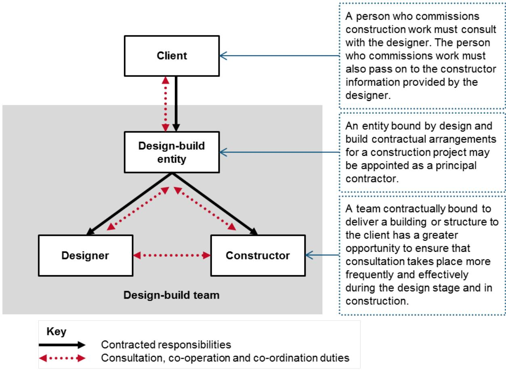

# Safe design of structuresCode of Practice

OCTOBER 2018

# Disclaimer

Safe Work Australia is an Australian Government statutory agency established in 2009. Safe Work Australia includes Members from the Commonwealth, and each state and territory, Members representing the interests of workers and Members representing the interests of employers.

Safe Work Australia works with the Commonwealth, state and territory governments to improve work health and safety and workers' compensation arrangements. Safe Work Australia is a national policy body, not a regulator of work health and safety. The Commonwealth, states and territories have responsibility for regulating and enforcing work health and safety laws in their jurisdiction.

ISBN 978- 0- 642- 78546- 6 [PDF]  ISBN 978- 0- 642- 78547- 3 [DOCX]

# Creative Commons

This copyright work is licensed under a Creative Commons Attribution- Noncommercial 4.0 International licence. To view a copy of this licence, visit creativecommons.org/licenses In essence, you are free to copy, communicate and adapt the work for non- commercial purposes, as long as you attribute the work to Safe Work Australia and abide by the other licence terms.

# Contact information

Safe Work Australia | info@swa.gov.au | www.swa.gov.au

# Contents

Foreword 4

1. Introduction 5

1.1. What is safe design? 5  1.2. Who has health and safety duties in relation to the design of structures? 6  1.3. What is 'reasonably practicable' in relation to the designer's duty? 8  1.4. What is involved in managing risks associated with the design of structures? 9

# 2. Key elements of safe design 11

2.1. Consider the lifecycle 11  2.2. Knowledge and capability 11  2.3. Consultation, cooperation and coordination 12  2.4. Information transfer 13

# 3. Integrating design and risk management 16

3.1. Pre- design phase 17  3.2. Conceptual and schematic design phase 18  3.3. Design development phase 20  3.4. Reviewing control measures 23

# 4. Design considerations 24

4.1. Design for safe construction 24  4.2. Design to facilitate safe use 24  4.3. Design for safe maintenance 25  4.4. Modification 25  4.5. Demolition and dismantling 26

# Appendix A—Glossary 27

Appendix B—Roles and responsibilities 29

Appendix C—Safety in design checklist 34

# Appendix D—Case studies 37

Example 1 37  Example 2 37  Example 3 37  Example 4 38  Example 5 38  Example 6 39

Amendments 40

# Foreword

This Code of Practice on how to meet the requirements for safe design of structures is an approved code of practice under section 274 of the Work Health and Safety Act (the WHS Act).

An approved code of practice provides practical guidance on how to achieve the standards of work health and safety required under the WHS Act and the Work Health and Safety Regulations (the WHS Regulations) and effective ways to identify and manage risks.

A code of practice can assist anyone who has a duty of care in the circumstances described in the code of practice. Following an approved code of practice will assist the duty holder to achieve compliance with the health and safety duties in the WHS Act and WHS Regulations, in relation to the subject matter of the code of practice. Like regulations, codes of practice deal with particular issues and may not cover all relevant hazards or risks. The health and safety duties require duty holders to consider all risks associated with work, not only those for which regulations and codes of practice exist.

Codes of practice are admissible in court proceedings under the WHS Act and WHS Regulations. Courts may regard a code of practice as evidence of what is known about a hazard, risk, risk assessment or risk control and may rely on the code in determining what is reasonably practicable in the circumstances to which the code of practice relates. For further information see the Interpretive Guideline: The meaning of reasonably practicable'.

Compliance with the WHs Act and WHS Regulations may be achieved by following another method if it provides an equivalent or higher standard of work health and safety than the code.

An inspector may refer to an approved code of practice when issuing an improvement or prohibition notice.

# Scope and application

This Code provides practical guidance to persons conducting a business or undertaking (PCBU) who design structures that will be used, or could reasonably be expected to be used, as a workplace. This includes architects, building designers and engineers.

This Code is also relevant for anyone making decisions that influence the design outcome, such as clients, developers and builders.

This Code applies to the design of 'structures' defined under the WHs Act to mean anything that is constructed, whether fixed or moveable, temporary or permanent, and includes:

buildings, masts, towers, framework, pipelines, roads, bridges, rail infrastructure and underground works (shafts or tunnels) any component of a structure, and part of a structure.

# How to use this Code of Practice

This Code includes references to the legal requirements under the WHS Act and WHS Regulations. These are included for convenience only and should not be relied on in place of the full text of the WHS Act or WHS Regulations. The words 'must', 'requires' or 'mandatory' indicate a legal requirement exists that must be complied with.

The word 'should' is used in this Code to indicate a recommended course of action, while 'may' is used to indicate an optional course of action.

# 1. Introduction

Eliminating hazards at the design or planning stage is often easier and cheaper to achieve than making changes later when the hazards become real risks in the workplace.Safe

Safe design can result in many benefits, including:

more effective prevention of injury and illness improved usability of structures improved productivity and reduced costs better prediction and management of production and operational costs over the lifecycle of a structure, and innovation, in that safe design can demand new thinking to resolve hazards that occur in the construction phase and in end use.

Design, in relation to a structure, includes the design of all or part of the structure and the redesign or modification of a design. Design output includes any hard copy or electronic drawing, design detail, design instruction, scope of works document or specification relating to the structure.

# 1.1. What is safe design?

Safe design means the integration of control measures early in the design process to eliminate or, if this is not reasonably practicable, minimise risks to health and safety throughout the life of the structure being designed.

The safe design of a structure will always be part of a wider set of design objectives, including practicability, aesthetics, cost and functionality. These sometimes competing objectives need to be balanced in a manner that, so far as is reasonably practicable, does not compromise the health and safety of those who work on or use the structure over its life.

Safe design begins at the concept development phase of a structure when making decisions about:

the design and its intended purpose materials to be used possible methods of construction, maintenance, operation, demolition or dismantling and disposal, and what legislation, codes of practice and standards need to be considered and complied with.

# 1.2. Who has health and safety duties in relation to the design of structures?

A person conducting a business or undertaking

# WHS Act section 19

Primary duty of care

A person conducting a business or undertaking (PCBU) has the primary duty under the WHS Act to ensure, so far as is reasonably practicable, that workers and other persons are not exposed to health and safety risks arising from the business or undertaking.

A person conducting a business or undertaking that designs a structure

# WHS Act section 22

Duties of persons conducting businesses or undertakings that design plant, substances or structures

PCBUs that design structures that will be used, or could reasonably be expected to be used, as a workplace must ensure, so far as is reasonably practicable, that the structure is designed to be without risks to health and safety of persons:

who are using it for the purpose it was designed constructing it carrying out reasonably foreseeable activities at the workplace in relation to the manufacture, assembly or use of the structure for a purpose for which it was designed or the proper demolition or disposal of the structure, or who are in the vicinity of the workplace and are exposed to the structure at the workplace, or whose health and safety may be affected by one of the uses or activities described above.

A PCBU who alters or modifies a design themselves (instead of having another designer do it) will be and have duties as a designer. Any changes to the design of a structure may affect the health and safety of those who work on or use the structure and must be considered by the person altering or modifying a design.

This duty includes carrying out, or arranging the carrying out of, testing and analysis and providing specific information about the structure to certain persons.

A designer includes a PCBU whose business or undertaking:

- prepares sketches, plans or drawings for a structure, including variations to a plan or changes to a structure- makes decisions for incorporation into a design that may affect the health or safety of persons who construct, use or carry out other activities in relation to the structure, or who are in the vicinity of the workplace and are exposed to the structure.

Designers include PCBUs who are:

- architects, building designers, engineers, building surveyors, interior designers, landscape architects, town planners and all other design practitioners contributing to,

or having overall responsibility for, any part of the design (for example drainage engineers designing the drain for a new development) building service designers, engineering firms or others designing services that are part of the structure such as ventilation, electrical systems and permanent fire extinguisher installations contractors carrying out design work as part of their contribution to a project (for example an engineering contractor providing design, procurement and construction management services) temporary works engineers, including those designing formwork, falsework, scaffolding and sheet piling, or persons who specify low structural alteration, demolition or dismantling work is to be carried out.

The duties also apply to designers of domestic residences, only to the extent that at some stages in the lifecycle the residence may become a workplace and the design could affect the health and safety of workers who will carry out work on the building, such as construction, maintenance and demolition.

# A person conducting a business or undertaking that commissions construction work

# WHS Regulations Part 6.2

Duties of designer of structure and person who commissions construction work

A PCBU who commissions construction work in relation to a structure (referred to in this Code as the 'client') also has specific duties under the WHS Regulations to:

- consult with the designer, so far as is reasonably practicable, about how to ensure that health and safety risks arising from the design during construction are eliminated or minimised, and- provide the designer with any information that the client has in relation to the hazards and risks at the site where the construction work is to be carried out.

# A principal contractor

# WHS Regulation 293

Meaning of principal contractor

A principal contractor is required for a construction project where the value of the construction work is \(\) 250,000$ or more. The principal contractor is the PCBU who:

commissions the construction project (the client), or is engaged by the client to be the principal contractor and is authorised to have management or control of the workplace.

The principal contractor has duties to ensure the construction work is planned and managed in a way that eliminates or minimises health and safety risks so far as is reasonably practicable.

Further guidance on managing risks for construction projects and principal contractor duties is available in the Code of Practice: Construction work.

# 1.3. What is 'reasonably practicable' in relation to the designer's duty?

The duty of a PCBU to ensure health and safety is qualified by what is reasonably practicable. Deciding what is 'reasonably practicable' requires taking into account and weighing up all relevant matters including:

the likelihood of the hazard or the risk occurring the degree of harm that might result from the hazard or the risk knowledge about the hazard or risk, and ways of eliminating or minimising the risk the availability and suitability of ways to eliminate or minimise the risk, and after assessing the extent of the risk and the available ways of eliminating or minimising the risk, the cost associated with eliminating or minimising the risk, including whether the cost is grossly disproportionate to the risk.

For example in deciding what is reasonably practicable, consideration will be given to the prevailing standards of design and the hazards and risks known at the time the designer designed the structure.

In the process of designing structures it will not always be possible to clearly delineate who has or will have responsibility, and in which circumstances, for the elimination or minimisation of hazards associated with the structure. The duties may be concurrent and overlapping.

# WHS Act section 16

More than 1 person can have a duty

Where more than one person has a duty for the same matter, each person retains responsibility for their duty and must discharge it to the extent to which the person has the capacity to influence and control the matter or would have had that capacity but for an agreement or arrangement claiming to limit or remove that capacity.

While designers may not have management and control over the actual construction work, they can discharge their duty by consulting, cooperating and coordinating activities, where reasonably practicable, with those who do have management or control of the construction work, for example by:

applying risk management processes to more traditional designs and considering whether new or innovative approaches to design will eliminate or minimise risk and result in an intrinsically safer building or structure providing information on any identified hazards arising from an unconventional design to those who will construct or use the building providing guidance on how a structure might be constructed safely, or carrying out the above in collaboration with those who have expertise in construction safety.

A designer may be asked to provide health and safety information about a building they designed many years ago. The designer may not be aware of changes made to the building since it was constructed. In this situation, the extent of a designer's duty is limited to the elements of the design detailed or specified by the designer and not by others.

# 1.4. What is involved in managing risks associated with the design of structures?

This Code provides guidance on how to manage the risks associated with the design of structures using the following systematic process:

Identify hazards- - find out what could cause harm. Assess risks, if necessary- - understand the nature of the harm that could be caused by the hazard, how serious the harm could be and the likelihood of it happening. This step may not be necessary if you are dealing with a known risk with known controls. Eliminate risks so far as is reasonably practicable. Control risks- - if it is not reasonably practicable to eliminate the risk, implement the most effective control measures that are reasonably practicable in the circumstances in accordance with the hierarchy of control measures, and ensure they remain effective over time. Review control measures to ensure they are working as planned.

Further guidance on the risk management process is available in the Code of Practice: How to manage work health and safety risks.

# Hierarchy of control measures

The WHs Regulations require duty holders to work through the hierarchy of control measures when managing certain risks; however, it can be applied to any risk. The hierarchy ranks control measures from the highest level of protection and reliability to the lowest. You must, so far as is reasonably practicable:

First, eliminate risks by eliminating hazards; this is the most effective control measure. By designing- in or designing- out certain features, hazards may be eliminated. For example, designing components that facilitate pre- fabrication on the ground can avoid the need for working at height and therefore eliminate the risk of falls. Then substitute hazards with something safer, isolate hazards from people and/or use engineering controls to minimise any risks that have not been eliminated. For example:

Substitute hazards with something safer, for example by using pre- finished materials in preference to on- site finishing. Isolate hazards from people, for example designing the layout of a building so that noisy machinery is isolated from workstations. Use engineering controls, for example including adequate ventilation and lighting in the design, designing and positioning permanent anchorage and hoisting points into buildings where maintenance needs to be undertaken at height.

Then use administrative controls to minimise any remaining risks, for example using warning signs or exclusion zones where a hazardous activity is carried out. Then use of personal protective equipment to minimise any risks that remain.

The lower levels in the hierarchy are less effective because controls that change the hazard or minimise exposure to the hazard can only minimise the risk. You cannot eliminate the risk without eliminating the hazard.

Administrative controls and personal protective equipment (PPE) are the least effective at minimising risk because they do not control the hazard at the source and rely on human behaviour and supervision. These control measures should only be used:

to supplement higher level control measures (as a back- up) as a short term interim measure until a more effective way of controlling the risk can be used, or when there are no other practical control measures available (as a last resort).

The control measures you apply may change the way work is carried out. In these situations, you must consult your workers and develop safe work procedures, and provide your workers with training, instruction, information and supervision on the changes.

When considering which control measures to implement:

look specifically at identifying any risks that a competent builder or user would not be expected to be aware of consider where residual risks remain, and ensure these are communicated to the builder and/or other people likely to exercise control in the next stages of the lifecycle of the structure, for example clients and maintenance contractors take a holistic view on the interaction of hazards in the assessment of their risks and implementation of control measures, and assess alternative control measures for their applicability.

Further guidance on the risk management process and the hierarchy of control measures is in the Code of Practice: How to Manage Work Health and Safety Risks

# 2. Key elements of safe design

# 2.1. Consider the lifecycle

In the same way that designers consider the future impact of a building on environmental sustainability, designers should consider how their design will affect the health and safety of those who will interact with the structure throughout its life.

# WHS Act section 22

Duties of persons conducting businesses or undertakings that design plant, substances or structures

The WHS Act requires the designer to ensure, so far as is reasonably practicable, that a structure is designed to be without risks to the health and safety of persons who:

at a workplace, use the structure for a purpose for which it was designed construct the structure at a workplace carry out any reasonably foreseeable activity at a workplace in relation the manufacture, assembly, use of the structure for a purpose for which it was designed or the proper demolition or disposal of the structure, or are at or in the vicinity of a workplace and are exposed to the structure or whose health and safety may be affected by an activity referred to in the dot points above.

This means persons conducting a business or undertaking (PCBUs) need to think about design solutions for reasonably foreseeable hazards that may occur as the structure is built, commissioned, used, maintained, repaired, refurbished or modified, decommissioned, demolished or dismantled and disposed of or recycled. For example, when designing a building with a lift for occupants, the design should also include sufficient space and safe access to the lift- well or machine room for maintenance work.

# 2.2. Knowledge and capability

In addition to core design capabilities relevant to the designer's role, a designer should also have:

knowledge of work health and safety legislation, codes of practice and other regulatory requirements an understanding of the intended purpose of the structure knowledge of risk management processes knowledge of technical design standards an appreciation of construction methods and their impact on the design, and the ability to source and apply relevant data on human dimensions, capacities and behaviours.

Many design projects are too large and complex to be fully understood by one person. Various persons with specific skills and expertise may need to be included in the design team or consulted during the design process to fill any knowledge gaps, for example ergonomists, engineers and occupational hygienists.

# 2.3. Consultation, cooperation and coordination

There are a number of duty holders who have a role in either consultation, cooperation or coordination. These include:

PCBUs designers, manufacturers, importers and suppliers of plant, substances or structures officers, and workers.

Early consultation and identification of risks can allow for more options to eliminate or minimise risks and reduce the associated costs.

Consultation is a legal requirement and an essential part of managing work health and safety risks. A safe workplace is more easily achieved when people involved, including at the design stage, communicate with each other about potential risks and work together to find solutions. By drawing on the knowledge and experience of other people, including workers, more informed decisions can be made about how the building or structure can be designed to eliminate or minimise risks.

# Consulting workers

# WHS Act section 47

Duty to consult workers

# WHS Act section 48

Nature of consultation

A PCBU must consult, so far as is reasonably practicable, with workers who carry out work for the business or undertaking and who are (or are likely to be) directly affected by a work health and safety matter.

If the workers are represented by a health and safety representative, the consultation must involve that representative.

If you are a PCBU commissioning a new workplace or refurbishing your existing workplace, you must, so far as is reasonably practicable, consult your workers who will be using the workplace, because their health and safety may be affected by the new design.

This duty to consult is based on the recognition that worker input and participation improves decision- making about health and safety matters and assists in reducing work- related injuries and disease.

The broad definition of a 'worker' under the WHS Act means a PCBU must consult, so far as is reasonably practicable, with employees, contractors and sub- contractors and their employees, on- hire workers, outworkers, apprentices, trainees, work experience students, volunteers and other people who are working for the PCBU and who are, or are likely to be, directly affected by a health and safety matter.

Workers are entitled to take part in consultations and to be represented in consultations by a health and safety representative who has been elected to represent their work group.

By drawing on the experience, knowledge and ideas of workers, hazards are more likely to be identified and effective control measures implemented.

# Consulting, cooperating and coordinating activities with other duty holders

# WHS Act section 46

Duty to consult with other duty holders

The WHS Act requires a PCBU to consult, cooperate and coordinate activities with all other persons who have a work health or safety duty in relation to the same matter, so far as is reasonably practicable.

There is often more than one business or undertaking involved in the design of a structure who may each have responsibility for the same health and safety matters, either because they are involved in the same activities or share the same workplace.

In these situations, each duty holder should exchange information to find out who is doing what and work together in a cooperative and coordinated way so risks are eliminated or minimised so far as is reasonably practicable.

Often, the design process will occur over various stages and involve different people who make financial, commercial, specialist or technical decisions over a design, for example clients, architects, project managers and interior designers.

Such decisions may positively or negatively affect the safety of a building. In these circumstances, each party will have responsibility for health and safety in the design stage.

So far as is reasonably practicable, the duty holders involved must consult each other on the hazards and risks associated with the building and work together on appropriate design solutions. This would include a client cooperating and coordinating with a designer in changing a design to address a health and safety risk identified in the design process.

# WHS Regulation 294

Person who commissions work must consult with designer

A PCBU who commissions construction work in relation to a structure must, so far as is reasonably practicable, consult with the designer or designers about how to ensure that health and safety risks arising from the design during construction are eliminated or minimised as far as is reasonably practicable.

Appendix B provides examples of consultation, cooperation and coordination between duty holders in various contractual relationships.

Further guidance on consultation is available in the Code of Practice: Work health and safety consultation, cooperation and coordination.

# 2.4. Information transfer

Key information about identified hazards and action taken or required to control risks should be recorded and transferred from the design phase to those involved in later stages of the lifecycle. Communicating this information to other duty holders will make them aware of any residual risks and minimise the likelihood of safety features incorporated into the design being altered or removed by those engaged in subsequent work on or around the building or structure.

# WHS Act section 22

Duties of persons conducting businesses or undertakings that design plant, substances or structures

Designers must give adequate information to each person who is provided with the design in order to give effect to it concerning:

each purpose for which the structure was designed the results of any calculations, testing, analysis or examination, carried out in accordance with the WHs Act, and any conditions necessary to ensure that the structure is without risks to health and safety when used for a purpose for which it was designed or when carrying out some activities related to the structure, such as construction, maintenance and demolition.

The designer, on request, must also, so far as is reasonably practicable, provide this information to any person who carries out relevant activities in relation to the structure, such as construction, maintenance and demolition.

Points for designers to consider when providing information include:

making notes on drawings, as these will be immediately available to construction workers providing information on significant hazards, as well as:

hazardous substances or flammable materials included in the design heavy or awkward prefabricated elements likely to create handling risks features that create access problems temporary work required to construct or renovate the building as designed, for example bracing of steel or concrete frame buildings features of the design essential to safe operation methods of access where normal methods of securing scaffold are not available any parts of the design where risks have been minimised but not eliminated, and noise and vibration hazards from plant.

# Methods of transferring information

# Safety report

# WHS Regulation 295

Designer must give safety report to person who commissions design

A designer of a structure or part of a structure must provide a written report to the PCBU who commissioned the design that specifies the hazards relating to the design of the structure that, so far as the designer is reasonably aware:

create a health and safety risk to persons who are to carry out the construction work, and are associated only with the particular design and not with other designs of the same type of structure.

The safety report applies to designs of structures that have unusual or atypical features which present hazards and risks during the construction phase that are unique to the particular design.

The safety report should include information about:

any hazardous materials or structural features and the designer's assessment of the risk of injury or illness to construction workers arising from those hazards, and the action the designer has taken to control those risks, for example changes to the design.

The information to be provided by the designer may be incorporated into the safety report prepared under the WHs Regulations.

The client must provide a copy of all the information in the safety report in relation to hazards or risks at or in the vicinity of the workplace to the principal contractor.

# Work health and safety file

The development of a work health and safety file for a structure could assist the designer to meet the duty to provide information to others. It could include copies of all relevant health and safety information the designer prepared and used in the design process, such as the safety report, risk register, safety data sheets, manuals and procedures for safe maintenance, dismantling or eventual demolition.

# 3. Integrating design and risk management

A systems approach that integrates the risk management process in the design phases and encourages collaboration between a client, designer and constructor is recommended.

  
Figure 1 A systematic approach to integrating design and risk management

# 3.1. Pre-design phase

The pre- design phase of the process involves:

Establishing the design context in terms of the purpose of the structure, as well as the scope and complexity of the project. Establishing the risk management context by identifying the breadth of workplace hazards and relevant legislation, codes of practice and standards that need to be considered. Identifying the required design disciplines, skills and competencies. Identifying the roles and responsibilities of various parties in relation to the project, and establishing collaborative relationships with clients and others who influence the design outcome. Conducting consultation and research to assist in identifying hazards, assessing and controlling risks.

# Consultation

The client should prepare a project brief that includes the safety requirements and objectives for the project. This will enable a shared understanding of safety expectations between the client and designer.

The client must give the designer all available information relating to the site that may affect health and safety.

Designers should ask their clients about the types of activities and tasks likely or intended to be carried out in the structure, including the tasks of those who maintain, repair, service or clean the structure as an integral part of its use.

# Research

Information can be found from various sources to assist in identifying hazards, assessing and controlling risks, including:

WHS and building laws, technical standards and codes of practice industry statistics regarding injuries and incidents hazard alerts or other reports from relevant statutory authorities, unions and employer associations, specialists, professional bodies representing designers and engineers, and research and testing done on similar designs.

Table 1 provides suggestions on using consultation and research to obtain information in the pre- design phase.

Table 1 Information sources for identifying hazards  

<table><tr><td>Step</td><td>Possible techniques</td></tr><tr><td>Initial discussions</td><td>Obtain information on the:
– purpose of the structure, including plant, ancillary equipment and tasks
– industry injury profile and statistics and common hazards and safety issues.
Guidance is available from health and safety authorities, relevant associations, and standards.
Establish the breadth of hazards and the consultation arrangements between the client and designer.</td></tr><tr><td>Pre-design preliminary hazard analysis</td><td>Useful techniques for identifying hazards may include a combination of the following actions by the client:
– Conduct workshops and discussions with personnel using or working on similar structures within the client company, including health and safety representatives.
– Conduct on-site assessment of an existing similar structure with feedback from the users of the existing structure.
– Research information or reports from similar structures on hazards and relevant sources and stakeholder groups and then complete analysis for own design needs.
– Conduct workshops with experienced personnel who will construct, use and maintain the new structure.
– Conduct workshops with specialist consultants and experts in the hazards.</td></tr><tr><td>Determine what hazards are ‘in scope’</td><td>Workshops/discussions to determine which hazards are affected, introduced or increased by the design of the structure.</td></tr></table>

# 3.2. Conceptual and schematic design phase

# Hazard identification

Hazard identification should take place as early as possible in the concept development and design stages. It is important that the hazard identification is systematic and not limited to one or two people's experiences of situations.

Broad groupings of hazards should be identified before design scoping begins. Appendix C provides a checklist of issues that should be considered. A designer and others involved in the preliminary hazard analysis should then decide which hazards are 'in scope' of the steps of the risk management process, and should be considered in the design process. A hazard is 'in scope' if it can be affected, introduced or increased by the design of the structure. At this early stage, consideration should be given to possible ways that hazards could be eliminated or minimised.

Where there are systems of work which are foreseeable as part of the construction method and the intended use of a structure as a workplace, they should be identified in the preliminary hazard analysis. Information in the form of likely or intended workflows, if known, will be useful as part of the project brief prepared by the client, including details at the task level.

The brief may also include any activities and systems with hazards specific to the nature of the structure (for example, manual tasks in a health facility, acoustic environment in a call centre, occupational violence in a bank, the storage of dangerous goods in a warehouse) where the safety of these activities or systems is affected by the design of the structure.

# WHS Regulation 61

Duties of designers, manufacturers, importers and suppliers of plant or structures

A designer must ensure that a structure is designed so as to eliminate the need to carry out any hazardous manual task in connection with it. Where this is not reasonably practicable, the designer must ensure the structure is designed so that the need for these hazardous manual tasks is minimised so far as is reasonably practicable.

Refer to the Code of Practice: Hazardous manual tasks for further guidance.

A designer also has duties under other WHS regulations such as WHS Regulation 64: Duty to eliminate or minimise risk.

Table 2 outlines a framework for preliminary hazard identification.

Table 2 Framework for preliminary hazard identification

<table><tr><td>Source of hazard</td><td>Description</td></tr><tr><td>Siting of structure</td><td>Potential design issues that may affect safety include:
    - proximity to adjacent property or nearby roads
    - surrounding land use
    - clearances required for construction equipment and techniques
    - demolition of existing assets
    - proximity to underground or overhead services — especially electricity lines
    - exposure of workers to adjacent traffic or other hazards
    - site conditions — including foundations, and construction over other assets or over water
    - safety of the public, and
    - use of adjacent streets.</td></tr></table>

# High consequence hazards

The storage and handling of dangerous goods, or work with high energy hazards (for example pressure) and health hazards such as biological materials.

Source of hazard Description

Systems of work (involving the interaction of persons with the structure)

The systems of work (including cleaning and maintenance activities) that pose risks, for example:

rapid construction techniques, i.e. prefabrication versus in situ construction materials to be used in construction staging and coordination with other works inadequate pedestrian or vehicle separation restricted access for building and plant maintenance hazardous manual tasks working at height, and exposure to occupational violence.

Consider both technical and human factors, including humans' ability to change behaviour to compensate for design changes. Anticipate misuse throughout the lifecycle.

# Environmental conditions

Impact of adverse natural events such as cyclones, floods and earthquakes, inadequate ventilation or lighting, high background noise levels and facilities that do not meet workplace needs.

Incident mitigation

A structure can increase the consequences of an incident if there are inadequate entry and exit points, poorly situated assembly areas or inadequate access for emergency services.

# 3.3. Design development phase

In this phase the design concepts for the structure are converted into detailed drawings and technical specifications. Control measures are decided and construction documentation is prepared. The design is completed and handed to the client.

Control measures for common hazards may be chosen from known solutions. For other new or complex hazards a risk assessment may be necessary to assist in determining the most effective control measures. The design development phase should involve:

developing a set of design options in accordance with the hierarchy of control selecting the optimum solution. Balance the direct and indirect costs of implementing the design against the benefits derived testing, trialling or evaluating the design solution redesigning to control any residual risks, and finalising the design, preparing the safety report and other risk control information needed for the structure's lifecycle.

# Implement solutions from recognised standards

Implement solutions from recognised standardsLegislative provisions governing the design of buildings and structures in Australia include the building laws in each jurisdiction and the National Construction Code of Australia (NCC). The Building Code of Australia (BCA) is part of the NCC. In addition, there are technical and engineering guidelines and standards produced by other government agencies, Standards Australia and relevant professional bodies.

The primary focus of the NCC is to ensure buildings and structures achieve acceptable standards of structural sufficiency, safety, health and amenity. It contains technical provisions for the design and construction of buildings and other structures relating to structural sufficiency, fire spread within and between buildings, building occupant access and exit, firefighting equipment, smoke hazard management and fire brigade access to buildings. In addition, it covers health and safety amenity aspects such as ventilation, lighting, legionella controls, sanitary facilities and damp and weatherproofing measures.

The NCC refers to Australian Standards, but designers should be aware that these may not adequately control workplace risks if applied to a situation outside that contemplated in the Standard or if the Standard is out- dated. The NCC also does not provide guidance for some specialised structures such as major hazard facilities (for example refineries).

# Assessing risk

A risk assessment involves considering what could happen if someone is exposed to a hazard and the likelihood of it happening. A risk assessment can help you determine:

- how severe a risk is- whether any existing control measures are effective- what action you should take to control the risk, and- how urgently the action needs to be taken.

Hazards have the potential to cause different types and severities of harm, ranging from minor discomfort to a serious injury or death.

Many hazards and their associated risks are well known and have well established and accepted effective control measures that are used in a particular industry and are suited to the circumstances in your workplace. In these situations, the second step to formally assess the risk is not required. If after identifying a hazard you already know the risk and how to control it effectively, you can implement the controls without undertaking a risk assessment.

It may be possible to re- use a risk assessment in situations where all the hazards, tasks, things or circumstances are the same as a previous risk assessment and no worker or other person will be exposed to greater, additional or different risks.

Risk assessment methods for assessing design safety may include:

- fact-finding to determine existing controls, if any- testing design assumptions to ensure that aspects of the design are not based on incorrect beliefs or anticipations on the part of the designer, for example as to how workers or others involved will act or react- testing structures or components specified for use in the construction, end use and maintenance- consulting with key people who have the specialised knowledge and/or capacity to control or influence the design (for example the architect, client, construction manager, engineers, project managers and safety and health representatives); consulting directly with other experts (for example specialist engineers, manufacturers and product or systems designers) who have been involved with similar constructions, and- when designing for the renovation or demolition of existing buildings, reviewing previous design documentation or information recorded about the design structure and any modifications undertaken to address safety concerns; and consulting professional industry or employee associations who may assist with risk assessments for the type of work and workplace.

Table 3 provides suggestions on ways to ensure all risks are addressed in the design and who should be involved.

Table 3 Design process  

<table><tr><td>Step</td><td>Possible techniques</td><td>By whom</td></tr><tr><td>Identify solutions from regulations, codes of practice and recognised standards</td><td>Consult with all relevant persons to determine which hazards can be addressed with recognised standards.
Plan the risk management process for other hazards.</td><td>Designer led.
Client approves decisions.</td></tr><tr><td>Apply risk management techniques</td><td>Further detailed information may be required on hazards, for example by:
– using checklists and referring to codes of practice and guidance materials, and
– job/task analysis techniques.
A variety of quantified and/or qualitative risk assessment measures can be used to check the effectiveness of control measures.
Scale models and consultation with experienced industry personnel may be necessary to achieve innovative solutions to longstanding issues that have caused safety problems.</td><td>Designer led.
Client provides further information as agreed in the planned risk management process.</td></tr><tr><td>Discuss design options</td><td>Take into account how design decisions influence risks when discussing control options.</td><td>Designer led.
Client contributing.</td></tr><tr><td>Design finalisation</td><td>Check that the evaluation of risk control measures in the design is complete and accurate.
Prepare information about risks to health and safety for the structure that remain after the design process.</td><td>Designer led.
Client and designer agree on final result.</td></tr><tr><td>Potential changes in construction stage</td><td>Ensure that changes which affect design do not increase risks, for example substitution of flooring materials which could increase slip/fall potential and may introduce risks in cleaning work.</td><td>Construction team in consultation with designer and client.</td></tr></table>

# 3.4. Reviewing control measures

As the design progresses and design decisions become more fine- tuned and detailed, there are still opportunities for either eliminating or minimising risks. At various points in the design process, designers should review design solutions to confirm the effectiveness of risk controls and, if necessary, redesign to minimise the risks so far as is reasonably practicable.

Wherever possible, design safety reviews should involve the people who will eventually construct the structure. If this is not possible, the client and designer should make every effort to include people with knowledge and experience in the construction and maintenance processes. Their expertise will assist in identifying safety issues which may have been overlooked in the design.

Health and safety aspects of the design should be reflected in the requirements of contract documents for the construction stage and assist in the selection of suitable and competent contractors for the project.

# Post-construction review

On completion of construction, the effectiveness of safety in the design should be evaluated. This will enable identification of the most effective design practices and any design innovations that could be used on other projects. The review may be carried out in a post- construction workshop attended by all relevant parties involved in the project.

Subsequent feedback from users to assist designers in improving their future designs may be provided through:

post occupancy evaluations for buildings defect reports accident investigation reports information regarding modifications user difficulties, and deviations from intended conditions of use.

# 4. Design considerations

4. Design considerationsThis chapter provides examples of design options to control risks in various stages of the lifecycle of a structure.

# 4.1. Design for safe construction

Control measures for risks relating to the construction of a structure include:

4.1. Design for safe constructionControl measures for risks relating to the construction of a structure include:- Provide adequate clearance between the structure and overhead electric lines by burying, disconnecting or re- routing cables before construction begins, to avoid 'contact' when operating cranes and other tall equipment.- Design components that can be prefabricated off- site or on the ground to avoid assembling or erecting at heights and to reduce worker exposure to falls from heights or being struck by falling objects, for example fix windows in place at ground level prior to erection of panels.- Design parapets to a height that complies with guardrail requirements, eliminating the need to construct guardrails during construction and for future roof maintenance.- Use continual support beams for beam- to- column double connections, by adding a beam seat, extra bolt hole, or other redundant connection points during the connection process. This will provide continual support for beams during erection, eliminating falls due to unexpected vibrations, misalignment and unexpected construction loads.- Schedule the design and construction of permanent stairways at the beginning of construction to help prevent falls and other hazards associated with temporary stairs and scaffolding.- Reduce the space between roof trusses and battens to reduce the risk of internal falls during roof construction.- Choose construction materials that are safe to handle.- Limit the size of prefabricated wall panels where site access is restricted.- Select paints or other finishes that emit low volatile organic compound emissions.- Indicate, where practicable, the position and height of all electric lines to assist with site safety procedures.

# 4.2. Design to facilitate safe use

Consider the intended function of the structure, including the likely systems of use, and the types of machinery and equipment that may be used.

Consider whether the structure may be exposed to specific hazards, such as manual tasks in health facilities, occupational violence in banks or dangerous goods storage in warehouses.

Risks relating to the function of a structure can be controlled by:

designing traffic areas to separate vehicles and pedestrians using non- slip materials on floor surfaces in areas exposed to the weather or dedicated wet areas providing sufficient space to safely install, operate and maintain plant and machinery providing adequate lighting for intended tasks in the structure

- designing spaces which accommodate or incorporate mechanical devices to reduce manual task risks- designing adequate access, for example allowing wide enough corridors in hospitals and nursing homes for the movement of wheelchairs and beds- designing effective noise barriers and acoustical treatments to walls and ceilings- specifying plant with low noise emissions or designing the structure to isolate noisy plant, and- designing floor loadings to accommodate heavy machinery that may be used in the building and clearly indicating on documents design loads for the different parts of the structure.

# 4.3. Design for safe maintenance

Risks relating to cleaning, servicing and maintaining a structure can be controlled by:

Risks relating to cleaning, servicing and maintaining a structure can be controlled by:- designing the structure so that maintenance can be performed at ground level or safely from the structure, for example positioning air- conditioning units and lift plant at ground level, designing inward opening windows, integrating window cleaning bays or gangways into the structural frame- designing features to avoid dirt traps- designing and positioning permanent anchorage and hoisting points into structures where maintenance needs to be undertaken at height- designing safe access, such as stairs or fixed ladders, and sufficient space to undertake maintenance of the structure- eliminating or minimising the need for entry into confined spaces (refer to the Code of Practice: Confined spaces for further guidance), and- using durable materials that do not need to be re- coated or treated.

# 4.4. Modification

Design is not always focused on the generation of an entirely new structure. It can involve the alteration of an existing structure which may require demolition in part or whole.

Any modification of a structure requires reapplication of the processes detailed in the design phases. Consultation with professional engineers or other experts may be necessary in order to assess the impact of any proposed modifications or changes in design, for example changes in the load spread across a building floor when heavy equipment is relocated, modified or replaced.

This ensures that any new hazards and risks are identified and controlled, and that the safety features already incorporated into the design are not affected. Additional design issues identified in these phases should be passed back to the designer, where possible.

# 4.5. Demolition and dismantling

# WHS Act section 22

Duties of persons conducting businesses or undertakings that design plant, substances or structures

In relation to the proper demolition or disposal of a structure, designers also have a duty to provide adequate information to each person who is provided with the design concerning:

each purpose for which the structure was designed the results of any calculations, analysis, testing or examination conducted carried out in accordance with the WHS Act carry out, or arrange the carrying out of, any calculations, analysis, testing or examination that may be necessary for the structure to be without risks to health and safety, and provide adequate information to each person who is provided with the design concerning any conditions necessary to ensure that the structure is without risks to health and safety when used for a purpose for which it was designed or when carrying out some activities related to the structure such as construction, maintenance and demolition.

This is particularly important with modern designs where 'limit state' design techniques are used by the structure designer. In this system, the designer considers the structure in its completed form with all the structural components, including bracing, installed. The completed structure can withstand much higher loads (for example, wind and other live loads) than when the structure is in the construction or demolition stage.

A structure should be designed to enable demolition using existing techniques. The designer should provide information so that potential demolishers can understand the structure, load paths and any features incorporated to assist demolition, as well as any features that require unusual demolition techniques or sequencing.

Designers of new structures are well placed to influence the ultimate demolition of a structure by designing- in facilities such as lifting lugs on beams or columns and protecting inserts in pre- cast panels so that they may be utilised for disassembly. Materials and finishes specified for the original structure may require special attention at the time of demolition and any special requirements for the disposal and/or recycling of those materials or finishes should be advised to the client through the risk assessment documentation.

Further guidance on the demolition of buildings and structures can be found in the Code of Practice: Demolition work.

# Appendix A-Glossary

<table><tr><td>Term</td><td>Description</td></tr><tr><td>Client</td><td>A PCBU who commissions a design or construction work or a construction project is referred to in this Code as the &#x27;client&#x27;.</td></tr><tr><td>Duty holder</td><td>Any person who owes a work health and safety duty under the WHS Act including a PCBU, a designer, manufacturer, importer, supplier, installer of products or plant used at work (upstream duty holder), officer or a worker.</td></tr><tr><td>Hazard</td><td>A situation or thing that has the potential to harm a person. Hazards at work may include: noisy machinery, a moving forklift, chemicals, electricity, working at heights, a repetitive job, bullying and violence at the workplace.</td></tr><tr><td>Health and safety committee</td><td>A consultative body established under the WHS Act. The committee&#x27;s functions include facilitating cooperation between workers and the PCBU to ensure workers&#x27; health and safety at work, and assisting to develop work health and safety standards, rules and procedures for the workplace.</td></tr><tr><td>Health and safety representative</td><td>A worker who has been elected by their work group under the WHS Act to represent them on health and safety matters.</td></tr><tr><td>May</td><td>&#x27;May&#x27; indicates an optional course of action.</td></tr><tr><td>Must</td><td>&#x27;Must&#x27; indicates a legal requirement exists that must be complied with.</td></tr><tr><td>Officer</td><td>An officer under the WHS Act includes:
– an officer under section 9 of the Corporations Act 2001 (Cth)
– an officer of the Crown within the meaning of section 247 of the WHS Act, and
– an officer of a public authority within the meaning of section 252 of the WHS Act.
A partner in a partnership or an elected member of a local authority is not an officer while acting in that capacity.</td></tr><tr><td>Person conducting a business or undertaking (PCBU)</td><td>A PCBU is an umbrella concept which intends to capture all types of working arrangements or relationships. A PCBU includes a:
– company
– unincorporated body or association, and
– sole trader or self-employed person.
Individuals who are in a partnership that is conducting a business will individually and collectively be a PCBU.</td></tr></table>

<table><tr><td>Term</td><td>Description</td></tr><tr><td></td><td>A volunteer association (defined under the WHS Act, see below) or elected members of a local authority will not be a PCBU.</td></tr><tr><td>Risk</td><td>The possibility harm (death, injury or illness) might occur when exposed to a hazard.</td></tr><tr><td>Should</td><td>&#x27;Should&#x27; indicates a recommended course of action.</td></tr><tr><td>Volunteer association</td><td>A group of volunteers working together for one or more community purposes where none of the volunteers, whether alone or jointly with any other volunteers, employs any person to carry out work for the volunteer association.</td></tr><tr><td>Work group</td><td>A group of workers established to facilitate the representation of workers by one or more health and safety representatives. A work group may be all workers at a workplace but it may also be appropriate to split a workplace into multiple work groups where workers share similar work conditions or are exposed to similar risks and hazards, for example all workers on night shift.</td></tr><tr><td>Worker</td><td>Any person who carries out work for a PCBU, including work as an employee, contractor or subcontractor (or their employee), self-employed person, outworker, apprentice or trainee, work experience student, employee of a labour hire company placed with a &#x27;host employer&#x27; or a volunteer.</td></tr><tr><td>Workplace</td><td>Any place where work is carried out for a business or undertaking and includes any place where a worker goes, or is likely to be, while at work. This may include offices, factories, shops, construction sites, vehicles, ships, aircraft or other mobile structures on land or water.</td></tr></table>

# Appendix B—Roles and responsibilities

Some design tasks, although related, may be controlled by different parties due to contractual arrangements. For a traditional project delivery model- where the client directly engages a designer to undertake detailed design- the project safety decisions during the design stage are the result of collaboration between the designer and the client. However, in a design and construct or a collaborative project delivery model, the primary collaboration will be between the constructor and the client, with participation of the designer subject to the terms of their engagement.

Figures 2- 6 show some of the often complex arrangements established for construction projects, and how the parties can consult, cooperate and coordinate with each other in relation to safe design.

Note: A construction project is a project where the cost of the construction work is \(\) 250000$ or more. There can only be one principal contractor for a construction project at any specific time. The client may appoint the construction manager or one of the contractors as the principal contractor depending on who will have management and control of the workplace.

  
Figure 2 This model represents design and build arrangements where all parties are contractually bound

  
Figure 3 This model may apply where design and construction are carried out separately, for example when a client is seeking to finance construction at a later date

  
Figure 4 This model may apply where the design and construction activities are integrated such as in a domestic residence or apartment complex

  
Figure 5 This model may apply to a complex construction project such as a hospital or airport terminal where specialist contractors carry out large parts of the project

  
Figure 6 This model may apply to large construction projects where the management role is carried out by a specialist construction manager

# Appendix C-Safety in design checklist

The following list may be used to assist in identifying hazards and controlling risks associated with the design of a structure throughout its lifecycle.

# Electrical safety

- Earthing of electrical installations- Location of underground and overhead power cables- Protection of leads/cables- Number and location of power points

# Fire and emergencies

- Fire risks- Fire detection and fire fighting- Emergency routes and exits- Access for and structural capacity to carry fire tenders- Other emergency facilities

# Movement of people and materials

- Safe access and exit, including for people with disability- Traffic management- Loading bays and ramps- Safe crossings- Exclusion zones- Site security

# Working environment

- Ventilation for thermal comfort and general air quality and specific ventilation requirements for the work to be performed on the premises

# Temperature

- Lighting including that of plant rooms

- Acoustic properties and noise control, for example noise isolation, insulation and absorption

# Seating

- Floor surfaces to prevent slips and trips

- Spaces for occupants

# Plant

- Tower crane locations, loading and unloading

- Mobile crane loads on slabs- Plant and machinery installed in a building or structure- Plant and equipment for material handling- Access for maintenance of plant and equipment- Guarding plant and machinery- Lift installations

# Amenities and facilities

- Access to various amenities and facilities such as storage, first aid rooms/sick rooms, rest rooms, meal and accommodation areas and drinking water

# Earthworks

- Excavations (for example risks from earth collapsing or engulfment)- Location of underground services

# Structural safety

- Erection of steelwork or concrete frameworks- Load-bearing requirements- Stability and integrity of the structure

# Manual tasks

- Methods of material handling- Accessibility for material handling- Loading docks and storage facilities- Workplace space and layout to prevent musculoskeletal disorders, including facilitating use of mechanical aids- Assembly and disassembly of prefabricated fixtures and fittings

# Substances

- Exposure to hazardous substances and materials including insulation and decorative materials

- Exposure to volatile organic compounds and off-gassing through the use of composite wood products or paints

- Exposure to irritant dust and fumes

- Storage and use of hazardous chemicals, including cleaning products

# Falls prevention

- Guardrails

- Window heights and cleaning

- Anchorage points for building maintenance and cleaning

- Access to working spaces for construction, cleaning, maintenance and repairs

- Scaffolding

- Temporary work platforms- Roofing materials and surface characteristics such as fragility, slip resistance and pitch

# Specific risks

- Exposure to radiation, for example electromagnetic radiation- Exposure to biological hazards- Fatigue- Working alone- Use of explosives- Confined spaces- Work over and under water, including diving and work in caissons with compressed air supply

# Noise exposure

- Exposure to noise from plant or from surrounding area

# Appendix D—Case studies

# Example 1

# Incorporating safety in design at the Alice Springs to Darwin Rail Link

This was a Build, Own, Operate and Transfer (BOOT) project to construct a railway from Alice Springs to Darwin and take over an existing railway from Tarcoola to Alice Springs. It was a design and construct contract. A design working group was developed by the client, and included representatives of the client, state and territory governments and other external stakeholders.

Weekly meetings were held during the design stage to ensure that the design was both practical and safe to build and operate. An independent reviewer was engaged by the client to audit and certify all work performed by the design working group.

Monthly design reports were required, documenting (among other things) the safety aspects of the design. Members of the design working group were located on site during the construction work and were able to be directly involved. All subcontractors were required to submit a safety plan describing how they would manage safety in the project. These plans were reviewed by the client, with input from the design and construct team.

# Example 2

# Construction Hazard Assessment Implication Review

A company managing a multi- million dollar construction project made design changes to improve safety after conducting a risk assessment using the CHAIR' (Construction Hazard Assessment Implication Review). They included:

- corridors widened for safer access for movement of goods and people during construction which in turn aided the end users of the building- standard doors enlarged by 25 per cent to improve access for equipment- lighting repositioned to allow for easier/safer maintenance access- windows changed to a 'flip over' style for cleaning from within the building, and- air conditioners moved to ground level, with the ducts remaining in the originally planned position.

# Example 3

# Lightweight air distribution ductwork

The use of pre- insulated ductwork in a large nursing home project assisted in the labour- intensive installation process that took place in the congested roof spaces and ceiling cavities. The lightweight ductwork was only 15 per cent of the weight of traditional sheet metal ductwork and could be easily handled by a single worker without the need for mechanical lifting equipment.

As the material was already insulated there was no need for the ductwork to be lagged, as would have been the case with metal ductwork, resulting in a considerable saving in time and in the need for workers to manipulate mineral fibre insulation in already congested spaces.

Eliminating the need for mineral fibre insulation also eliminated the possible introduction of fibres into the ducting system should there be a leakage in a joint. This also means that the ductwork could be located some  $200mm$  higher in a false ceiling.

The reduced time taken in installation meant that fewer workers were required on site and that they worked at height for a minimum amount of time.

# Example 4

# Use of three-dimensional (3D) modelling as a tool for designers

A building designer had traditionally used sketches and 2D drawings in early project discussions with clients. Not all clients could appreciate the three- dimensional implications from 2D drawings and fewer could afford the expense of scale models.

With the advent of downloadable 3D modelling software it became possible (and feasible) to provide the client with a fully rendered, coloured, and three- dimensional representation of their project. Capable of being submitted electronically, the file allows the client to view the proposal from any direction.

This software also allowed the designer to work with the client to explain the construction process as well as identifying safety issues such as excavations, work at heights and traffic movements that could be resolved by adjusting the design. The designer's clients are also better informed so that they can consider the use of the building after construction is completed and can make any adjustments to the design at the earliest possible stage.

# Example 5

# Pre-assembly of stair frames

An analysis of an early design for the steel framing for a multi- level stairway in a high rise car park revealed that the original design would not allow the framework to be pre- assembled and would require the framework to be assembled in small pieces while working at height. The original design called for a beam running the full width of the stairway at each landing and this prevented the structure from being pre- assembled.

The designer reviewed the original design in consultation with the steelwork fabricator and determined that by splitting the original tie- beam and replacing it with smaller beams tied via fin plates, the stair flights could be pre- assembled at ground level and lifted into place as a whole, including decks, stair treads and handrails. This small modification greatly reduced the amount of time spent by the framework erector at height and provided a greater level of safety for workers as the framework installation proceeded.

# Example 6

# Design changes to reduce risk for construction and maintenance

In a design and construct project in Melbourne, the design process identified a number of risks relating to the ongoing maintenance of the building under construction. As a result, design changes were made.

The building consisted of a glazed sawtooth roof with suspended lighting. Inside was a fully glazed atrium covering all nine floors. In the initial design, there had been some consideration given to the maintenance of all the glazing components and access to services installed on the roof. In the original design, protection from falling during maintenance work consisted of a railing with rope access. The design team deemed this to be unsuitable and designers investigated ways in which maintenance work could be performed more safely.

The final design included a purpose- designed gantry to be installed across the atrium. On top of the gantry was a safe working platform. The platform was installed on hydraulic lifts enabling safe access to the services located high in the ceiling space. When the platform was not in use it was retracted and positioned on top of the gantry. Another moveable working platform was suspended under the gantry, allowing access to the glazed atrium below. Not only did this arrangement provide a safe environment for routine maintenance, but the gantry, which was erected early in the construction process, was also used for access during the construction of the atrium and roofing. The gantry design also contributed to substantial cost savings and improved access for construction of the atrium and roof, thus reducing construction time.

# Amendments

The model Code of Practice: Safe design of structures has been amended since its publication in July 2012 including a number of amendments agreed to in 2018 as part of a technical and usability review of the model Code. The current version, dated October 2018, incorporates all of those amendments.