# How to safely remove asbestos

Code of Practice

JULY 2020

# Disclaimer

Safe Work Australia is an Australian Government statutory agency established in 2009. Safe Work Australia includes Members from the Commonwealth, and each state and territory, Members representing the interests of workers and Members representing the interests of employers.

Representing the interests of employers.

Safe Work Australia works with the Commonwealth, state and territory governments to improve work health and safety and workers' compensation arrangements. Safe Work Australia is a national policy body, not a regulator of work health and safety. The Commonwealth, states and territories have responsibility for regulating and enforcing work health and safety laws in their jurisdiction.

ISBN 978- 0- 642- 33317- 9 (PDF)  ISBN 978- 0- 642- 33318- 6 (DOCX)

# Creative Commons

This copyright work is licensed under a Creative Commons Attribution- Noncommercial 4.0 International licence. To view a copy of this licence, visit creativecommons.org/licenses. In essence, you are free to copy, communicate and adapt the work for noncommercial purposes, as long as you attribute the work to Safe Work Australia and abide by the other licence terms.

Safe Work Australia | info@swa.gov.au | www.swa.gov.au

# Contents

# Foreword 5

# 1. Introduction 7

1.1. Who has health and safety duties when removing asbestos? 7  1.2. Licence requirements for asbestos removal work 10  1.3. Health monitoring duties 11

# 2. Duties for removal work that does not require a licence 14

2.1. Training workers about asbestos or ACM 15

# 3. Duties for licensed asbestos removal work 16

3.1. Asbestos removalist supervisor to be present or readily available 16  3.2. Certification and training 17  3.3. Informing parties of the licensed asbestos removal 19  3.4. Obtaining the asbestos register 20  3.5. Preparing an asbestos removal control plan 20  3.6. Notifying the regulator of the licensed asbestos removal work 22  3.7. Limiting access, displaying signs and installing barricades 23  3.8. Decontamination 23  3.9. Waste containment and disposal 24  3.10. Clearance inspection 25  3.11. Air monitoring 26  3.12. Removing friable asbestos 29

# 4. Controls applicable to all types of asbestos removal 31

4.1. Identifying hazards 31  4.2. Indicating the asbestos removal areas 32  4.3. Wet and dry methods 34  4.4. Tools and equipment 37  4.5. Personal protective equipment 39  4.6. Decontamination 43  4.7. Laundering clothing 49  4.8. Waste containment and disposal 50

# 5. Using an enclosure during large-scale removal work 54

5.1. Designing and installing an enclosure 54  5.2. Testing an enclosure 56  5.3. Negative pressure exhaust units 57  5.4. Bulk stripping and cleaning within an enclosure 58  5.5. Dismantling an asbestos removal enclosure 58

# 6. Methods for small scale removal work 60

6.1. Mini- enclosures 606.2. Glove bag asbestos removal work 626.3. Wrap and cut asbestos removal method 647. Controls for specific asbestos removal work 657.1. Removing asbestos- contaminated soil 657.2. Removing friable asbestos from hot surfaces 667.3. Removing asbestos in plant and pipes or pits 66Appendix A—Glossary 68Appendix B—Asbestos removal control plan contents 72Appendix C—Respiratory protective equipment 75Selection of RPE 80Fit testing of face pieces 82Appendix D—Example of a clearance certificate 84Section A—Clearance inspection details 84Section B—Asbestos removal work paperwork 85Section C—Asbestos removal work area 85Section D—Enclosures 86Section E—Clearance declaration 87Appendix E—Examples of asbestos removal work 88Asbestos cement products 88Removal of floor tiles 89Removing bituminous (malthoid) products 90Removal of ceiling tiles 91Removal of gaskets and rope seals 91Pipe lagging (small section) 92Fire retardant material 92Removal of asbestos- backed vinyl and millboard from beneath a vinyl floor 93Amendments 94

# Foreword

This Code of Practice on how to safely remove asbestos is an approved code of practice under section 274 of the Work Health and Safety Act (the WHS Act).

An approved code of practice provides practical guidance on how to achieve the standards of work health and safety required under the WHS Act and the Work Health and Safety Regulations (the WHS Regulations) and effective ways to identify and manage risks.

A code of practice can assist anyone who has a duty of care in the circumstances described in the code of practice. Following an approved code of practice will assist the duty holder to achieve compliance with the health and safety duties in the WHS Act and WHS Regulations, in relation to the subject matter of the code of practice. Like regulations, codes of practice deal with particular issues and do not cover all hazards or risks. The health and safety duties require duty holders to consider all risks associated with work, not only those for which regulations and codes of practice exist.

Codes of practice are admissible in court proceedings under the WHS Act and WHS Regulations. Courts may regard a code of practice as evidence of what is known about a hazard, risk, risk assessment or risk control and may rely on the code in determining what is reasonably practicable in the circumstances to which the code relates. For further information see the Interpretive Guideline: The meaning of 'reasonably practicable'.

Compliance with the WHS Act and WHS Regulations may be achieved by following another method if it provides an equivalent or higher standard of work health and safety than the code.

An inspector may refer to an approved code of practice when issuing an improvement or prohibition notice.

# Scope and application

This Code is intended to be read by a person conducting a business or undertaking (PCBU). It provides practical guidance to PCBUs on how to manage health and safety risks associated with removing asbestos or asbestos- containing materials (ACM) from workplaces.

A PCBU may be an asbestos removalist who may carry out asbestos removal work that does not require a licence; Class A asbestos removal work; or Class B asbestos removal work. This could include both asbestos removal companies and those persons who may carry out small asbestos removal jobs and may not have an asbestos licence, for example tradespersons.

It is recommended that other duty holders—for example, a PCBU who commissions asbestos removal work at a workplace (PCBU who commissions removal work)—should read this Code to ensure they are aware of mandatory requirements.

This Code may also be used by workers and their health and safety representatives and other people affected by asbestos removal work, for example neighbours.

It is important to read the Code of Practice: How to manage and control asbestos in the workplace, as it provides specific guidance on identifying asbestos or ACM in the workplace, determining whether removal is the best control option and implementing other control measures if removing asbestos is not the most appropriate action to take.

This Code may be a useful reference for other persons interested in the duties under the WHS Act and WHS Regulations.

This Code applies to all workplaces covered by the WHS Act where asbestos removal is carried out. Some chapters of this Code will apply to asbestos that is present in residential premises where the premises become a workplace.

# How to use this Code of Practice

This Code includes references to the legal requirements under the WHS Act and WHS Regulations. These are included for convenience only and should not be relied on in place of the full text of the WHS Act or WHS Regulations. The words 'must', 'requires' or 'mandatory' indicate a legal requirement exists that must be complied with.

The word 'should' is used in this Code to indicate a recommended course of action, while 'may' is used to indicate an optional course of action.

# 1. Introduction

# 1.1. Who has health and safety duties when removing asbestos?

There are a number of duty holders who have a role in managing risks associated with removal of asbestos and ACM at the workplace. These include:

persons conducting a business or undertaking (PCBU) designers, manufacturers, importers, suppliers and installers of plant, substances or structures, and officers.

Workers and other persons at the workplace also have duties under the WHS Act, such as the duty to take reasonable care for their own health and safety at the workplace.

A person can have more than one duty and more than one person can have the same duty at the same time.

Early consultation and identification of risks can allow for more options to eliminate or minimise risks and reduce the associated costs.

# Person conducting a business or undertaking

# WHS Act section 19

Primary duty of care

A PCBU must eliminate risks arising from asbestos removal, or if that is not reasonably practicable, minimise the risks so far as is reasonably practicable.

The WHS Regulations include more specific requirements for PCBUs to manage the risks of hazardous chemicals, airborne contaminants and plant, as well as other hazards associated with asbestos.

PCBUs have a duty to consult workers about work health and safety and may also have duties to consult, cooperate and coordinate with other duty holders.

# WHS Regulation 420

Exposure to airborne asbestos at workplace

The PCBU must also ensure so far as is reasonably practicable that exposure of people at the workplace to airborne asbestos is eliminated. If this is not reasonably practicable, the exposure must be minimised so far as is reasonably practicable.

The PCBU must also ensure the exposure standard for asbestos is not exceeded at the workplace.

# WHS Regulations Chapter 8

Asbestos

The WHS Regulations include specific obligations for a number of duty holders in relation to safely removing asbestos. These duties are described in the following chapters of this Code.

# Officers

# WHS Act section 27

Duty of officers

Officers, for example company directors, have a duty to exercise due diligence to ensure that the business or undertaking complies with the WHs Act and WHs Regulations. This includes taking reasonable steps to ensure that the business or undertaking has and uses appropriate resources and processes to eliminate or minimise risks that arise from asbestos removal work carried out as part of the business or undertaking.

Further information on who is an officer and their duties is available in the Interpretive Guideline: The health and safety duty of an officer under section 27.

# Workers

# WHS Act section 28

Duties of workers

Workers have a duty to take reasonable care for their own health and safety and to not adversely affect the health and safety of other persons. Workers must comply with reasonable instructions, as far as they are reasonably able, and cooperate with reasonable health and safety policies or procedures that have been notified to workers.

# Other persons at the workplace

# WHS Act section 29

Duties of other persons at the workplace

Other persons at the workplace, like visitors, must take reasonable care for their own health and safety and must take reasonable care not to adversely affect other people's health and safety. They must comply, so far as they are reasonably able, with reasonable instructions given by the PCBU to allow that person to comply with the WHS Act.

# Consulting workers

# WHS Act section 47

Duty to consult workers

A PCBU must consult, so far as is reasonably practicable, with workers who carry out work for the business or undertaking and who are (or are likely to be) directly affected by a health and safety matter.

This duty to consult is based on the recognition that worker input and participation improves decision- making about health and safety matters and assists in reducing work- related injuries and disease.

The broad definition of a 'worker' under the WHS Act means a PCBU must consult, so far as is reasonably practicable, with contractors and sub- contractors and their employees, on- hire workers, outworkers, apprentices, trainees, work experience students, volunteers and other people who are working for the PCBU and who are, or are likely to be, directly affected by a health and safety matter.

Workers are entitled to take part in consultations and to be represented in consultations by a health and safety representative who has been elected to represent their work group.

# Consulting, cooperating and coordinating activities with other duty holders

# WHS Act section 46

Duty to consult with other duty holders

The WHS Act requires that a PCBU consult, cooperate and coordinate activities with all other persons who have a work health and safety duty in relation to the same matter, so far as is reasonably practicable.

There is often more than one business or undertaking involved when asbestos- related work is being carried out, who may each have responsibility for the same health and safety matters, either because they are involved in the same activities or share the same workplace.

In these situations, each duty holder should exchange information to find out who is doing what and work together in a cooperative and coordinated way so risks are eliminated or minimised so far as is reasonably practicable.

Further guidance on consultation is available in the Code of Practice: Work health and safety consultation, cooperation and coordination.

Information, training and instruction

# WHS Regulation 39

Provision of information, training and instruction

A PCBU must ensure that information, training and instruction provided to a worker are suitable and adequate having regard to:

the nature of the work carried out by the worker the nature of the risks associated with the work at the time of the information, training and instruction, and the control measures implemented.

The PCBU must also ensure, so far as is reasonably practicable, that the information, training and instruction are provided in a way that is readily understandable to whom it is provided.

Workers must be trained and have the appropriate skills to carry out a particular task safely. Training should be provided to workers by a competent person.

Information, training and instruction provided to workers who carry out asbestos removal should include the proper use, wearing, storage and maintenance of personal protective equipment (PPE).

# 1.2. Licence requirements for asbestos removal work

Licensed asbestos removalists

# WHS Regulation 458

Duty to ensure asbestos removalist is licensed

A PCBU who commissions the removal of asbestos at the workplace must ensure asbestos removal work is carried out only by a licensed asbestos removalist who is licensed to carry out the work, unless the WHS Regulations specify that a licence is not required.

# WHS Regulations Part 8.10 Division 1

Asbestos removalists- - requirement to be licensed

A PCBU may require a license to undertake some types of asbestos removal. There are two types of licences: Class A and Class B. The type of licence required will depend on the type and quantity of asbestos, asbestos- containing material (ACM) or asbestos- containing dust (ACD) that is being removed at a workplace.

Table 1 Licence requirements for asbestos removal work  

<table><tr><td>Type of licence</td><td>What asbestos can be removed?</td></tr><tr><td>Class A</td><td>Can remove any amount or quantity of asbestos or ACM, including:
- any amount of friable asbestos or ACM
- any amount of ACD
- any amount of non-friable asbestos or ACM.</td></tr><tr><td>Class B</td><td>Can remove:
- any amount of non-friable asbestos or ACM
- any amount of ACD associated with the removal of non-friable asbestos or ACM.</td></tr><tr><td>No licence required</td><td>Can remove:
- up to 10 m² of non-friable asbestos or ACM
- ACD that is:
  · associated with the removal of less than 10 m² of non-friable asbestos or ACM
  · not associated with the removal of friable or non-friable asbestos and is only a minor contamination.</td></tr></table>

# Examples where a licence is not required to perform asbestos removal work

A single asbestos cement sheet is to be removed to install an air conditioner. The sheet is  $2m^2$  in total. This job may be performed by a company that is not a licensed asbestos removalist, observing the requirements outlined in Chapter 4. A self- employed person is required to remove an asbestos cement eave to enable access for pipes. The asbestos cement eave is  $1.6m^2$  in total. This job may be. performed by the self- employed person who is not a licensed asbestos removalist, observing the requirements outlined in Chapter 4.

# Examples of Class A or B licensed asbestos removal work

Asbestos- cement sheets are to be removed from a factory toilet block. The material to be removed is non- friable asbestos. The area to be removed is  $12m^2$  in total so a licensed asbestos removalist must be used. As the material to be removed is non- friable the work can be done by a Class A or Class B licensed asbestos removalist. A company is engaged to remove  $0.5m^3$  (cubic metres) of asbestos lagging from a pipe in order to carry out maintenance work. This involves the removal of friable asbestos. The company must hold a Class A asbestos removal licence to do this work.

# Licensed asbestos assessors

# WHS Regulation 489

Requirement to hold asbestos assessor licence

A PCBU who commissions Class A asbestos removal work must ensure that certain work is carried out by an independent licensed asbestos assessor who is licensed to carry out the work.

A person must hold an asbestos assessor licence to:

conduct air monitoring for Class A asbestos removal work conduct clearance inspections for Class A asbestos removal work, or issue clearance certificates in relation to Class A asbestos removal work.

Licensed asbestos assessors can also carry out a number of other tasks including identifying asbestos, carrying out a risk assessment or reviewing an asbestos register, provided they meet the requirements to undertake those tasks (e.g. they must be competent to identify asbestos). More information on these tasks can be found in the Code of Practice: How to manage and control asbestos in the workplace.

# 1.3. Health monitoring duties

# WHS Regulations Part 8.5 Division 1

Asbestos at the Workplace: Health monitoring

A PCBU must ensure health monitoring is provided to a worker if they are at risk of exposure to asbestos when carrying out:

licensed asbestos removal work other ongoing (unlicensed) asbestos removal work, or asbestos- related work.

Examples of ongoing (unlicensed) asbestos removal work or asbestos- related work can include undertaking maintenance work on ACM regularly as part of another job (for instance electricians or building maintenance staff in older buildings).

Health monitoring includes a medical examination to provide an initial baseline medical assessment. Health monitoring must include the following, unless another form of health monitoring is recommended by a registered medical practitioner):

consideration of the worker's demographic, medical and occupational history consideration of records of the worker's personal exposure, and a physical examination of the worker with emphasis on the respiratory system, including standardised respiratory function tests, unless another form of health monitoring is recommended by a registered medical practitioner.

A PCBU must inform workers of any health monitoring requirements before they carry out work that may expose them to asbestos.

# When should health monitoring occur?

The need for health monitoring for workers at risk of exposure to asbestos should be determined on the basis of:

the potential for exposure the frequency of potential exposure, and the duration of the work being undertaken.

If a worker is carrying out licensed asbestos removal work, the health monitoring must be conducted prior to the worker commencing the work. Health monitoring should also be provided to the worker at regular intervals (at least once every two years) after the worker commences asbestos- related work where there is a risk of exposure to asbestos.

# Who can carry out health monitoring?

The PCBU must ensure health monitoring is carried out by or under the supervision of a registered medical practitioner with experience in health monitoring. Prior to deciding who the registered medical practitioner will be, the PCBU must consult the worker.

# Who pays for health monitoring?

The PCBU must pay all expenses relating to health monitoring.

If two or more PCBUs have a duty to provide health monitoring to a worker, they may choose one PCBU to organise health monitoring (known as the PCBU who commissions the health monitoring). The costs must be shared equally between each PCBU unless they agree otherwise.

# What information must be provided to the registered medical practitioner?

The PCBU who commissions health monitoring must provide the following information to the registered medical practitioner:

their name and address the name and date of birth of the worker a description of the work the worker is, or will be, carrying out that has triggered the requirement for health monitoring, and whether the worker has started the work or, if the worker has commenced, carrying out the work, how long this has been for.

# Health monitoring report

The PCBU who commissions health monitoring must take all reasonable steps to obtain a report from the registered medical practitioner as soon as practicable after the monitoring is carried out.

The health monitoring report must include the following information:

the name and date of birth of the worker the name and registration number of the registered medical practitioner the name and address of the PCBU who commissioned the health monitoring the date of the health monitoring any advice that test results indicate the worker may have contracted a disease, injury or illness as a result of carrying out the work that triggered the need for health monitoring any recommended remedial measures, including whether the worker can continue to carry out the work, and whether medical counselling is required for the worker in relation to the work that triggered the requirement for health monitoring.

The PCBU who commissioned health monitoring must also give a copy of the report, as soon as reasonably practicable after obtaining it from the medical practitioner, to:

the worker the regulator, if the report contains:

any advice that test results indicate that the worker may have contracted a disease, injury or illness as a result of the work that triggered the need for health monitoring, and any recommended remedial measures, including whether the worker can continue to carry out the work all other PCBUs who have a duty to provide health monitoring for that worker.

A PCBU must ensure health monitoring reports are kept as a confidential record for at least 40 years after the record is made and identified as a formal record for the particular worker. The report and results must not be disclosed to anyone unless the worker has provided their written consent. However, a PCBU can disclose a worker's health monitoring record to a person who must keep the record confidential under a duty of professional confidentiality without the worker's written consent.

Further information is available in Safe Work Australia's guide Health Monitoring for Exposure to Hazardous Chemicals - Guide for persons conducting a business or undertaking.

# 2. Duties for removal work that does not require a licence

# WHS Regulation 458

Duty to ensure asbestos removalist is licensed

# WHS Regulation 445

Duty to train workers about asbestos

If, as a person conducting a business or undertaking (PCBU), you do not hold a Class A or Class B asbestos removal licence, you may only remove asbestos, or direct or allow a worker to remove asbestos, if the asbestos being removed is:

$10m^2$  or less of non- friable asbestos or ACM (approximately the size of a small bathroom), or ACD that is:

associated with the removal of  $10m^2$  or less of non- friable asbestos or ACM not associated with the removal of friable or non- friable asbestos and is only a minor contamination.

You must not remove, or direct or allow a worker to remove, friable asbestos materials if you do not have a Class A asbestos licence.

You must ensure workers carrying out asbestos removal work are trained in the identification and safe handling of asbestos prior to carrying out asbestos removal work where a licence is not required. An asbestos awareness course or the non- friable removal unit of competency would be considered appropriate training.

For example, if you are a plumber, this allows you to remove small amounts of non- friable asbestos and replace it with non- asbestos alternatives if you come across it during renovations, refurbishments, or service and maintenance work. However, you must still use safe working methods to ensure the work is not creating a risk to the health and safety of people at the workplace.

If you are carrying out asbestos removal work which does not require a licence you must comply with the duties outlined in Chapter 4 of this Code and also with some of the duties in Chapter 3 of this Code. These duties are summarised below:

obtain a copy of the asbestos register for a workplace unless the work is being carried out at residential premises (refer to section 3.4) identify hazards at the workplace (refer to section 4.1) ensure signs and barricades are erected to indicate and delineate the asbestos work area (refer to sections 3.7 and 4.2) use the wet method to remove asbestos where reasonably practicable (refer to section 4.3) ensure the correct tools, equipment (and PPE are used (refer to) ensure decontamination facilities are available (refer to sections 3.8 and 4.6) contain and label asbestos waste and dispose of it as soon as reasonably practicable at a site licensed to accept asbestos waste (refer to sections 3.9 and 4.8), and ensure that PPE and clothing used in asbestos removal work and contaminated with asbestos is handled in accordance with the WHS Regulations (refer to sections 3.9, 4.5 and 4.6).

Although it is not mandatory for you to prepare an asbestos removal control plan for this type of asbestos removal work, it may be beneficial to do so to ensure the work is being carried out safely. Refer to section 3.5 for further information on an asbestos removal control plan.

It is also not mandatory to conduct air monitoring but an independent licensed asbestos assessor or competent person can carry it out in these situations. Refer to section 3.11 for further information on air monitoring.

# 2.1. Training workers about asbestos or ACM

# WHS Regulation 445

Duty to train workers about asbestos

As a PCBU you must ensure workers you reasonably believe may be involved in asbestos removal work in the workplace or the carrying out of asbestos- related work are trained in the identification, safe handling and suitable control measures for asbestos and ACM.

The training you provide should cover obligations under the WHS Regulations and may include the following topics:

- purpose of the training- health risks of asbestos- types, uses and likely presence of asbestos in the workplace- you and your workers' roles and responsibilities under the asbestos management plan- where the asbestos register is located, how it can be accessed and how to understand the information contained in it- processes and safe work procedures to be followed to prevent exposure, including exposure from any accidental release of airborne asbestos- where applicable, the correct use of PPE including respiratory protective equipment (RPE)- the implementation of control measures and safe work methods to eliminate or minimise the risks associated with asbestos to limit the exposure to workers and other persons- exposure standard and control levels for asbestos, and- purpose of any exposure monitoring or health monitoring that may occur.

This training is more general than the training that a worker undertaking licensed asbestos removal work would receive. Workers who are undertaking licensed asbestos removal work are required to complete specific units of competency.

Refer to section 3.2 for further information.

You must keep records of all training while the worker is carrying out the work and for five years after the day the worker stops working for you. These records must also be available for inspection by the regulator.

# 3. Duties for licensed asbestos removal work

# WHS Regulations Part 8.7

Asbestos Removal Work

WHS Regulations Part 8.8

Asbestos Removal Requiring Class A Asbestos Removal Licence

Licensed asbestos removal work can differ greatly depending on the type, quantity and condition of the asbestos or ACM being removed. There are a number of duties in the WHS Regulations to ensure licensed asbestos work is carried out safely and without releasing airborne asbestos and exposing workers and other people.

Specific duties in the WHS Regulations for licensed asbestos removalists include:

- ensuring an asbestos removalist supervisor is readily available or present when the work is being carried out- providing appropriate training and ensuring the asbestos removal worker has undertaken the relevant units of competency associated with the asbestos removal- telling various parties about the asbestos removal and providing them with appropriate information- obtaining the workplace's asbestos register- preparing an asbestos removal control plan- notifying the regulator about the work before it starts- displaying signs and installing barricades in the asbestos work area- limiting access to the asbestos work area- ensuring appropriate decontamination facilities are in place, and- ensuring waste containment and disposal procedures are in place.

Additional duties apply to a number of other duty holders including the person conducting a business or undertaking (PCBU) who commissioned the asbestos removal work, and the person with management and control of the workplace. These duties include:

- informing various persons about the asbestos removal and providing them with appropriate information- ensuring clearance inspections are conducted and clearance certificates are issued, and- ensuring air monitoring is conducted, where appropriate.

Licensed asbestos removalists might also have these duties if asbestos removal work is carried out in residential premises.

These duties are explained further below.

# 3.1. Asbestos removalist supervisor to be present or readily available

# WHS Regulation 459

Asbestos removalist supervisor must be present or readily available

# WHS Regulation 493

Content of application—Class A asbestos removal licence

# WHS Regulation 494

Content of application—Class B asbestos removal licence

# WHS Regulation 529

Work must be supervised by named supervisor

As a licensed asbestos removalist you must ensure one or more asbestos removal supervisors are named in your licence to oversee asbestos removal work.

You must also ensure the named asbestos supervisor(s) hold the appropriate certification to supervise the type of licensed asbestos removal work being carried out.

If the asbestos removal work requires a Class A licence, for example removing friable asbestos, you must ensure a named asbestos removal supervisor is present at the asbestos removal area whenever the work is being carried out.

However, if the asbestos removal work requires a Class B licence, for example non- friable asbestos that is more than  $10m^2$  then you must ensure a named asbestos removal supervisor is readily available to a worker whenever they are carrying out the work. For example, the supervisor would be regarded as being accessible if they are contactable by phone and able to arrive at the workplace within 20 minutes.

If you are self- employed and working alone where asbestos removal work requires a Class B licence, for example you are a plumber removing more than  $10m^2$  of AC sheeting, you must hold a Class B licence, the competency of a worker for non- friable asbestos removal and the competency of a supervisor for non- friable asbestos removal.

# 3.2. Certification and training

# Certification

# WHS Regulation 460(1)

Asbestos removal worker must be trained

As a licensed asbestos removalist you must not direct or allow a worker to carry out licensed asbestos removal work unless you are satisfied the worker holds certification for the class of licensed asbestos removal work they will be carrying out.

Workers (including asbestos removal supervisors) who are carrying out licensed asbestos removal work are required to acquire certification by completing units of competency to show they have the relevant training to be able to remove (or supervise the removal of) asbestos. The units of competency completed by the person will determine what type of asbestos work they can carry out. Asbestos removal supervisors will have additional units of competency to complete.

Registered training organisations conduct training and education for the specific units of competency for both Class A and Class B asbestos removal work as well as asbestos removal supervisor certification. The Class B removal unit of competency must be completed before the Class A removal unit of competency.

# Training

# WHS Regulation 460

Asbestos removal worker must be trained

As a licensed asbestos removalist you must provide 'appropriate training' to a worker carrying out licensed asbestos removal work at the workplace to ensure the work is carried out in accordance with the specific asbestos removal control plan for that workplace.

This is additional training to the general training that is provided on the identification, safe handling and appropriate controls for asbestos referred to in section 6.3 of the Code of Practice: How to manage and control asbestos in the workplace.

This is a requirement for each specific workplace. As a licensed asbestos removalist you should provide this training before the commencement of each asbestos removal job. The training should include:

the nature of the hazards and risks how asbestos can affect a person's health the risks arising from exposure to airborne asbestos the control measures in place and maintenance of the asbestos removal control plan for that job the methods and equipment that will be used to do the job properly choosing, using and caring for PPE and RPE decontamination procedures waste disposal procedures emergency procedures, and any other legal requirements (for example contaminated sites).

You may need to provide additional training if the worker is required to hold other licences for the particular task, for example a demolition licence.

# WHS Regulation 461

Licensed asbestos removalist must keep training records

As a licensed asbestos removalist you must keep a record of all training undertaken by a worker who is carrying out licensed asbestos removal work:

while the worker is carrying out licensed asbestos removal work, and for five years after the day the worker stopped carrying out licensed asbestos removal work for you.

You must ensure the training record is readily accessible at the asbestos removal area and is available for inspection under the WHS Act.

# 3.3. Informing parties of the licensed asbestos removal

# WHS Regulation 467

Licensed asbestos removalist must inform certain persons about intended asbestos removal work

As a licensed asbestos removalist you must inform the person with management or control of the workplace about the work and the date it is to commence before any licensed asbestos removal work is carried out.

Before commencing the licensed asbestos removal work at residential premises, you must, so far as is reasonably practicable, tell the following people about the asbestos removal work and when it will commence:

the person who commissioned the asbestos removal work other PCBUs at the workplace the occupier of the residential premises the owner of the residential premises, and anyone occupying premises in the immediate vicinity of the workplace.

# WHS Regulation 468

Person with management or control of workplace must inform persons about intended asbestos removal work

The person with management or control of the workplace must then ensure the following people are told that the asbestos removal work is to be carried out and when the work is to commence:

their workers and any other people at the workplace, and the person who commissioned the asbestos removal work.

The person with management or control of the workplace must also take all reasonable steps to ensure the following people are told that the asbestos removal work is to be carried out and when the work is to commence:

any other PCBUs at or in the vicinity of the workplace, and anyone occupying premises in the immediate vicinity of the workplace.

Providing information to persons that may carry out licensed asbestos work

# WHS Regulation 462

Duty to give information about health risks of licensed asbestos removal work

If you are a licensed asbestos removalist you must provide the following information to a person who is likely to be engaged to carry out the work:

the health risks and health effects associated with exposure to asbestos, and

the need for and details of health monitoring of a worker carrying out licensed asbestos removal work. Section 1.4 of this Code provides more specific details on health monitoring.

# 3.4. Obtaining the asbestos register

# WHS Regulation 463

Asbestos removalist must obtain register

If you are a licensed asbestos removalist you must obtain a copy of the asbestos register for the workplace from the person with management or control of the workplace before commencing licensed asbestos removal work.

The person with management or control of the workplace must ensure that the asbestos register is maintained to ensure the information in the register is up to date, and must review and if necessary revise the asbestos register if asbestos removal work is being conducted.

This provision does not apply if the work is being carried out at residential premises.

# 3.5. Preparing an asbestos removal control plan

# WHS Regulation 464

Asbestos removal control plan

# WHS Regulation 465

Asbestos removal control plan to be kept and available

As a licensed asbestos removalist you must prepare an asbestos removal control plan for any licensed asbestos removal work you are commissioned to undertake.

# What is the purpose of an asbestos removal control plan?

An asbestos removal control plan is a document that identifies the specific control measures you will use to ensure workers and other people are not at risk when asbestos removal work is being conducted. It is focused on the specific control measures necessary to minimise any risk from exposure to asbestos.

An asbestos removal control plan helps ensure the asbestos removal is well planned and carried out in a safe manner. An asbestos removal control plan is only required to be prepared for licensed asbestos removal work. However, one can be prepared to assist you when planning asbestos removal work that does not require a licence.

You must also take into account any asbestos register relevant to the asbestos to be removed and the area to be worked on. The structure of the asbestos removal control plan may be generic but each plan must address the specific requirements for each job.

# When is an asbestos removal control plan required to be prepared?

You must prepare the asbestos removal control plan before the licensed asbestos removal work commences.

# What is contained in an asbestos removal control plan?

The asbestos removal control plan must include details of:

how the asbestos removal will be carried out, including the method, tools, equipment and PPE to be used, and the asbestos to be removed, including the location, type and condition of the asbestos.

You should also attach specifications or drawings that are relevant to the asbestos removal work, to the asbestos removal control plan to provide additional information about the asbestos. Appendix B provides further details of what can be in a comprehensive asbestos removal control plan.

# Preparing the asbestos removal control plan

When preparing the asbestos removal control plan, you must, so far as is reasonably practicable, consult with the person who commissioned the work, the person with management or control of the workplace (if not the same person) and workers. You should also consult with the workers' health and safety representatives.

If you are carrying out licensed asbestos removal work at residential premises, you must, so far as is reasonably practicable consult with the PCBU who commissioned the removal work. You should also consult with the owner or the occupier (if not the same person).

# Access to the asbestos removal control plan

Once you have prepared the asbestos removal control plan, you must:

give a copy to the person who commissioned the licensed asbestos removal work ensure that a copy of the asbestos removal control plan is kept at the workplace until the completion of the asbestos removal work, and make a copy readily accessible on- site for the duration of the licensed asbestos removal work to: PCBUs at the workplace workers or their health and safety representatives, and the occupants of the premises (if the work is carried out in residential premises).

The asbestos removal control plan must also be made available for inspection under the WHS Act.

If a notifiable incident occurs in connection with the asbestos removal work to which the asbestos removal control plan relates, the licensed asbestos removalist must keep the plan for at least two years after the incident occurs.

# 3.6. Notifying the regulator of the licensed asbestos removal work

# WHS Regulation 466

Regulator must be notified of asbestos removal

As a licensed asbestos removalist you must notify the regulator in writing at least five days before the licensed asbestos removal work commences.

The following information must be included in your notification:

name, registered business name, Australian Business Number, licence number and business contact details name and business contact details of the supervisor who will oversee the removal work name of the licensed asbestos assessor or competent person engaged to carry out a clearance inspection and to issue a clearance certificate for the work client name and contact details name, including registered business or corporate name, of the person with management or control of the workplace address of the workplace, including the specific location if it is a large workplace kind of workplace where the removal work will be performed (for example an office building or construction site) date of notification the start date of the removal work and an estimation of how long it will take whether the asbestos to be removed is friable or non- friable if the asbestos is friable, the way the removal area will be enclosed estimated quantity of asbestos to be removed number of workers who will perform the removal work, and details of each worker's competency to carry out removal work.

The notification may also include information on:

the type of work that is carried out at the workplace, and the type of asbestos or ACM that are being removed (for example, asbestos cement (AC) sheeting, vinyl tiles, lagging, gaskets).

It may not be possible to provide five days notice, and removal work may commence immediately in the following limited circumstances:

a sudden and unexpected event, including a failure of equipment, that may cause persons to be exposed to respirable asbestos fibres, for example a burst pipe that was lagged with asbestos or a forklift crashing into an asbestos cement sheet wall, or an unexpected breakdown of an essential service that requires immediate rectification to enable the service to continue, for example gas, water, sewerage or telecommunications services.

If this is the case, the licensed asbestos removalist must notify the regulator:

immediately by telephone, and in writing no more than 24 hours after providing notice by telephone.

# 3.7. Limiting access, displaying signs and installing barricades

# WHS Regulation 469

Signage and barricades for asbestos removal work

# WHS Regulation 470

Limiting access to asbestos removal area

As a licensed asbestos removalist you must ensure signs indicate where the asbestos removal work is being carried out and that barricades are erected to delineate the asbestos area. This will assist in limiting access to the asbestos removal work area.

If the PCBU who commissions the licensed asbestos removal work and the person with management or control of the workplace (if not the same person) are aware that licensed asbestos removal work is being carried out, they must ensure, so far as is reasonably practicable, that access to the removal area is limited to the following people:

workers who are engaged in the removal work other people who are associated with the removal work, and people who are allowed under the WHS Regulations or another law to be in the asbestos removal area (for example inspectors, emergency service workers).

A PCBU may refuse to allow access to any of these people if they do not comply with a control measure implemented for the workplace in relation to asbestos, or a direction of the licensed asbestos removalist.

A combination of using signs and barricades may be necessary to limit access to the asbestos removal area, for example installing a fence and signs may be used as a method to inform people where the asbestos removal area is and to limit access. Using locking access doors may be appropriate as long it does not create an evacuation hazard.

All people who have access to the removal area must comply with any direction given by the licensed asbestos removalist.

Section 4.2 of this Code provides further details on the types of signs and barricades that should be used at a workplace.

# 3.8. Decontamination

# WHS Regulation 471

Decontamination facilities

As a licensed asbestos removalist, you must ensure decontamination facilities are available to decontaminate the asbestos removal work area, any plant used in that area, workers carrying out the asbestos removal work, and other persons who have access to the asbestos removal area because they are associated with the asbestos removal work.

You must also ensure items removed from the asbestos work area which are likely to be contaminated are:

decontaminated before they are removed, or

they are sealed in containers and the exterior of the containers are:

- decontaminated, and- labelled in accordance with the Globally Harmonized System of Classification and Labelling of Chemicals, 7th revised edition (GHS) to indicate the presence of asbestos.

Section 4.6 of this Code outlines decontamination procedures that can be put in place at the workplace.

# 3.9. Waste containment and disposal

# WHS Regulation 472

Disposing of asbestos waste and contaminated personal protective equipment

As a licensed asbestos removalist you must ensure that asbestos waste is contained and labelled in accordance with the GHS before it is removed from the asbestos removal area. Examples of labels are provided in section 4.8 of this Code. You must ensure it is disposed of as soon as is practicable at a site authorised to accept asbestos waste. Further information is provided in the Code of Practice: Labelling of workplace hazardous chemicals.

# PPE

You must ensure disposable PPE that has been used in the asbestos work area and is contaminated with asbestos is sealed and labelled in a container before being removed from the asbestos waste area, and disposed of upon completion of the asbestos removal work.

In some cases, it may not be reasonably practicable to dispose of PPE that is clothing. In this case, you must ensure the clothing is laundered at a laundry that is equipped to launder asbestos- contaminated clothing. If this is not practicable, you must ensure the clothing is kept in a sealed and labelled container until it is reused for asbestos removal purposes.

It may also not be reasonably practicable to dispose of other PPE. If this is the case, the PPE must be decontaminated prior to it being removed from the asbestos removal area. If the PPE cannot be decontaminated in the asbestos removal area, it must be kept in a sealed and labelled container until it is reused for asbestos removal purposes.

Where a sealed container has been used, it must be decontaminated and labelled in accordance with the GHS prior to it being removed from the asbestos removal area to indicate that it contains asbestos.

Section 4.5 of this Code provides guidance on the type of PPE that can be used. Section 4.8 of this Code outlines waste containment and disposal procedures that can be implemented at the workplace.

# 3.10. Clearance inspection

# WHS Regulation 473

Clearance inspection WHS Regulation 474 Clearance certificates

A PCBU who commissions licensed asbestos removal work at a workplace must ensure that once the licensed asbestos removal work has been completed:

a clearance inspection is carried out, and a clearance certificate in writing is issued before the workplace can be re- occupied.

As a licensed asbestos removalist you must ensure this is done if the licensed asbestos removal work is carried out at residential premises.

Clearance inspections must be carried out and clearance certificates issued by:

an independent licensed asbestos assessor, for work that must be carried out by a Class A licensed asbestos removalist (for example if the removal work involved friable asbestos), or an independent competent person, for asbestos work that is not required to be carried out by a Class A licensed asbestos removalist (for example if removal work involved more than  $10m^2$  of non- friable asbestos).

To be independent, the licensed asbestos assessor or competent person must:

not be involved in the removal of asbestos for that specific job, and not be involved in a business or undertaking involved in the removal of the asbestos for that specific job.

In some cases, it may not be reasonably practicable for the licensed asbestos assessor or competent person to be independent from the person who carried out the asbestos removal work. If this is the case, the PCBU commissioning the asbestos removal work can apply to the regulator for an exemption from this requirement under Part 11.2 of the WHS Regulations.

The independent licensed assessor or competent person must not issue a clearance certificate unless they are satisfied that the asbestos removal area and the area immediately surrounding it are free from visible asbestos contamination. To do this, they must conduct a visual inspection for evidence of dust and debris. If air monitoring is also conducted, the results of that test must show that any identified respirable asbestos fibre levels are below 0.01 fibres/mL.

If a clearance certificate has not been obtained, the asbestos removal area must not be re- occupied for normal use or other work activities. A clearance certificate must be issued before the area can be re- occupied for demolition or other work.

Unauthorized people cannot enter the asbestos removal work area prior to a clearance certificate being issued and any protective barricades should remain in place until the completion of all licensed asbestos removal work and the final clearance certificate is issued.

Appendix D provides an example of a clearance certificate.

# 3.11. Air monitoring

Air monitoring involves collecting air samples to assist in assessing the levels of airborne asbestos fibres present in either:

the asbestos removal area to assess the effectiveness of controls (control monitoring), or the worker's breathing zone to assess exposures to asbestos (exposure monitoring).

Air monitoring must be conducted in accordance with the Guidance Note on the Membrane Filter Method for Estimating Airborne Asbestos Fibres, 2nd Edition (INOHSC: 3003 (2005)] (the membrane filter method).

When is air (control) monitoring required?

# WHS Regulation 475

Air monitoring- - asbestos removal requiring Class A asbestos removal licence

# WHS Regulation 473

Clearance inspection

# WHS Regulation 474

Clearance certificates

Control monitoring requirements will vary depending on the type of asbestos being removed, the location and position of the asbestos, if an enclosure is used and whether the asbestos removal work is within a building or outside.

Friable asbestos removal- control monitoring is mandatory for all friable asbestos removal. This includes prior to dismantling an enclosure and for the purposes of the clearance inspection. More than  $10m^2$  of non- friable asbestos removal- control monitoring is not required but may be carried out by an independent licensed asbestos assessor or competent person to ensure that controls being used to eliminate or minimise exposure to airborne asbestos are effective. Public location- Air monitoring should be considered where the asbestos removal work is being undertaken in or next to a public location.

Air monitoring may be required when:

it is not clear whether new or existing control measures are effective there is evidence (for example, dust deposits are outside the enclosure) the control measures have deteriorated as a result of poor maintenance modifications or changes in safe work methods have occurred that may adversely affect worker exposure, or there has been an uncontrolled disturbance of asbestos at the workplace.

# When must the air (control) monitoring be carried out for asbestos removal?

Control monitoring must be conducted immediately before and during Class A asbestos removal work. However, it is not required immediately before friable asbestos removal work commences when the glove bag removal technique is used. Control monitoring must be

carried out within the enclosure used for removing friable asbestos before it can be dismantled, as well as outside the enclosure prior to, during and after the removal.

Control monitoring may be carried out before and during Class B asbestos removal work to ensure that controls being used to eliminate or minimise exposure to airborne asbestos are effective. Control monitoring results cannot be compared to the exposure standard for asbestos. Where there are concerns about possible worker exposure, exposure monitoring should be undertaken to ensure compliance with Part 8.2 of the WHs Regulations.

# Who must conduct air (control) monitoring?

A PCBU who commissions asbestos removal work that requires a Class A licence must ensure that an independent licensed asbestos assessor undertakes air monitoring of the asbestos removal area at the workplace. If the workplace is residential premises, the licensed removalist must ensure that an independent licensed asbestos assessor undertakes air monitoring of the asbestos removal area of the premises. The independent licensed asbestos assessor must use the membrane filter method.

In relation to asbestos removal work requiring a licence:

- Friable asbestos removal—an independent licensed asbestos assessor must be engaged to carry out air monitoring when it is required.- Non-friable asbestos removal (more than  $10 \text{m}^2$ )—an independent licensed asbestos assessor or competent person must be engaged to carry out air monitoring when it is required.

Where control monitoring is otherwise required, for instance following an uncontrolled disturbance or release of asbestos at the workplace, an independent licensed asbestos assessor or competent person may carry it out. However, if the release involves friable asbestos, only an independent licensed asbestos assessor can carry out the air monitoring.

Results of the air (control) monitoring

# WHS Regulation 476

Action if respirable asbestos fibre level too high

As a licensed asbestos removalist you must take action depending on the respirable fibre levels reported in control monitoring results. Where the results show that respirable asbestos fibre levels exceed the action levels outlined in Table 2, regardless of whether removal has commenced, action must be taken immediately.

Table 2 Air monitoring action levels.  

<table><tr><td>Action level</td><td>Control</td><td>Action</td></tr><tr><td>Less than 0.01 fibres/mL</td><td>No new control measures are necessary</td><td>Continue with control measures.</td></tr><tr><td>At 0.01 fibres/ml or more than 0.01 fibres/mL but less than or equal to 0.02 fibres/mL</td><td>1. Review</td><td>Review control measures.</td></tr></table>

<table><tr><td>Action level</td><td>Control</td><td>Action</td></tr><tr><td></td><td>2. Investigate</td><td>Investigate the cause.</td></tr><tr><td></td><td>3. Implement</td><td>Implement controls to eliminate or minimise exposure and prevent further release.</td></tr><tr><td rowspan="5">More than 0.02 fibres/mL</td><td>1. Stop removal work</td><td>Stop removal work.</td></tr><tr><td>2. Notify regulator</td><td>Notify the relevant regulator by phone followed by a written statement that work has ceased and the results of the air monitoring.</td></tr><tr><td>3. Investigate the cause</td><td>For example, conduct a thorough visual inspection of the enclosure (if used) and associated equipment in consultation with all workers involved with the removal work.</td></tr><tr><td>4. Implement controls to eliminate or minimise exposure and prevent further release</td><td>For example, extend the isolated/barricaded area around the removal area/enclosure as far as reasonably practicable until fibre levels are at or below 0.01 fibres/mL, wet wipe and vacuum the surrounding area, seal any identified leaks (e.g. with expandable foam or adhesive (cloth or duct) tape) and smoke test the enclosure until it is satisfactorily sealed.</td></tr><tr><td>5. Do not recommence removal work until further air monitoring is conducted</td><td>Do not recommence until fibre levels are at or below 0.01 fibres/mL.</td></tr></table>

Any information that is gathered from these actions can be referred to during future asbestos removal jobs (where applicable).

Communicating the results of the (air) control monitoring

# WHS Regulation 475

Air monitoring—as asbestos removal requiring Class A asbestos removal licence

The PCBU who commissions licensed asbestos removal work at the workplace requiring a Class A licence must ensure the results of the control monitoring are given to the following people:

- workers at the workplace- health and safety representatives for the workplace- PCBUs at the workplace, and- other people at the workplace.

The PCBU who commissions licensed asbestos removal work must ensure that the results of control monitoring are readily accessible to the workers and other persons who were in the work area during the time.

If the workplace is residential premises, you must ensure the results are given to the following people:

the person who commissioned the work workers at the workplace health and safety representatives for the workplace PCBUs at the workplace the occupier of the residential premises the owner of the residential premises, and other people at the workplace.

# Air (exposure) monitoring

# WHS Regulation 420

Exposure to airborne asbestos at workplace

WHS Regulations Part 3.2 Division 7

Managing risks from airborne contaminants

WHS Regulation 477

Removing friable asbestos

A PCBU, including licensed asbestos removalists, must ensure that the exposure standard for asbestos is not exceeded at the workplace, unless:

the asbestos removal area is enclosed to prevent the release of respirable asbestos fibres, and negative pressure is used (except where a glove bag is used for the removal).

Exposure monitoring should be carried out to determine a worker's exposure to airborne asbestos if there is uncertainty as to whether the exposure standard may be exceeded at the workplace. Where exposure monitoring is carried out, the PCBU must keep records of the results for 30 years and must ensure that the results of air monitoring are readily accessible to persons at the workplace who may be exposed to asbestos.

# 3.12. Removing friable asbestos

# WHS Regulation 477

Removing friable asbestos

As a licensed asbestos removalist removing friable asbestos (requiring a Class A licence), you must ensure, so far as is reasonably practicable:

the asbestos removal area is enclosed to prevent the release of respirable asbestos fibres negative pressure is used, provided the enclosure being used has been tested for leaks the wet method of asbestos removal is used

the asbestos removal work does not commence until the air monitoring is started by an independent licensed asbestos assessor, provided the enclosure has been tested for leaks air monitoring is undertaken during the asbestos removal work at times decided by the independent licensed assessor undertaking the monitoring, and any glove bag used to enclose the asbestos removal area is dismantled and disposed of safely.

However, if the glove bag method is used, you are not required to conduct air monitoring prior to the work commencing or to use negative pressure during the asbestos removal work.

You must not dismantle the enclosure until air monitoring results are received from:

if the friable asbestos is removed from a residential premises- - the independent licensed asbestos assessor who undertook the air monitoring, and in any other case- - the person who commissioned the Class A asbestos removal work.

The results must show that the respirable asbestos fibre level is below 0.01 fibres/mL.

You must, so far as is reasonably practicable, decontaminate the enclosure prior to dismantling it to minimise the release of respirable asbestos fibres. The PCBU who commissions the removal of the friable asbestos at the workplace must obtain a clearance certificate from the licensed asbestos assessor after the enclosure has been dismantled.

Chapter 6 provides further detail on enclosures. Section 4.3 provides further detail on the wet method. Section 6.2 provides further detail on the glove bag method.

# 4. Controls applicable to all types of asbestos removal

Note: This chapter applies to all asbestos removal work i.e. Class A and Class B licensed asbestos removal work and asbestos removal work that does not require a licence.

# 4.1. Identifying hazards

If you are a person conducting a business or undertaking (PCBU) and you are undertaking asbestos removal work you must consider not only the direct hazards that are associated with that work but also those hazards related to the work activity and the work environment (for example demolition or construction).

# Confined spaces

You should only remove asbestos in a confined space where it is not possible to avoid working in that the confined space. A safe system of work should be developed for inclusion in the asbestos management plan or asbestos removal control plan.

Friable asbestos removal requires the use of enclosures that are designed to eliminate or minimise the release of airborne asbestos spreading from the asbestos removal work area. Depending on the conditions inside the enclosure, an asbestos enclosure may also become a confined space.

Further information is available in the Code of Practice: Confined spaces.

# Falls

You must not undertake work at heights if the task can be performed on the ground. If asbestos removal work must be undertaken at height, for example when removing AC roofing tiles, then other WHS Regulations apply.

Further information is available in the Code of Practice: Managing the risk of falls at workplaces.

# Heat stress

Heat- related hazards can be created from working in enclosures or confined spaces or using PPE. You should consider factors that can lead to heat stress, including temperature, humidity, air movement, exposure to a heat source, work activities and demands, how long the PPE must be worn, and individual physical factors.

Control measures to help prevent heat stress include:

- selecting appropriate PPE to reduce the build-up of heat- providing an adequate number of extraction units in enclosures- wearing cool cotton underclothing- scheduling appropriate work breaks- job rotation- making cool drinks readily available outside the vicinity of the asbestos removal work zone and decontamination zone- providing a cool, shaded rest area, and- educating workers about heat stress risks and controls.

Further information is available in the Code of Practice: Managing the work environment and facilities and Safe Work Australia's Guide for managing the risks of working in heat.

# Electrical equipment

When undertaking asbestos removal work, you must control the risks to health and safety associated with electrical risks.

Control measures include:

- De-energising and removing electrical equipment from the asbestos removal work area. If the electrical equipment cannot be disconnected and removed it must be de-energised. You must ensure the de-energised equipment is secured so it cannot be inadvertently reenergised.- Labelling any electrical cabling or equipment remaining in the asbestos removal area and protecting it from mechanical damage or the ingress of water in accordance with AS/NZ 3000:2018: Electrical installations (known as the Australian/New Zealand Wiring Rules).- Ensuring a licensed electrician safely removes and reinstalls electrical cables and equipment.- Where it is required, ensuring only a person able to do the following tasks is engaged to do that work:  
- prior to asbestos removal work, remove and isolate the circuits and heads for electrical equipment, such as fire detectors, smoke detectors and thermal detectors  
- replace, reactivate and test the system, prepare a certificate stating that the heads are operational and forward the certificate to you.

All portable electrical tools and equipment, including flexible leads and any electrical installations used by workers during asbestos removal, should comply with AS/NZS 3012:2010: Electrical Installations - Construction and demolition sites.

Further information is available in the Code of Practice: Managing electrical risks in the workplace.

# 4.2. Indicating the asbestos removal areas

# WHS Regulation 469

Signage and barricades for asbestos removal work

You must use signs and barricades to clearly indicate the area where asbestos removal work is being performed. You must place signs in positions that indicate to people where the asbestos removal work area is and you should ensure they remain in place until removal is completed and a clearance certificate has been issued.

Responsibilities for the security and safety of the asbestos removal site and removal work area should be specified in the asbestos removal control plan (where required—see section 3.5). This includes inaccessible areas that are likely to contain asbestos.

# Warning signs

Warning signs must be placed to inform all people nearby that asbestos removal work is taking place in the area. Signs should be placed at all of the main entry points to the asbestos removal work area where asbestos is present.

These signs should be weatherproof, constructed of lightweight material and adequately secured so they remain in prominent locations. The signs should be in accordance with AS 1319:1994: Safety signs for the occupational environment.

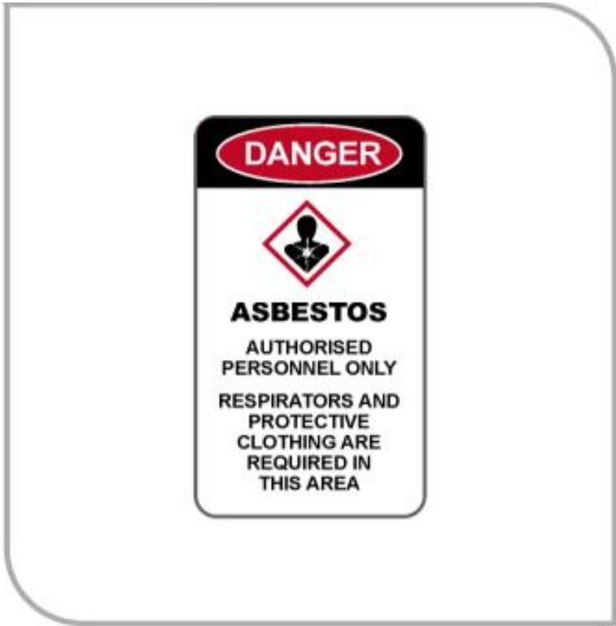  
Figure 1 An example of an asbestos removal area sign

# Barricades

Barricades assist with traffic control and prevent access to the asbestos removal work area.

The purpose of barricades is to delineate and isolate the asbestos removal area. Barricades can take various forms, from high visibility PVC (polyvinylchloride) barrier tape to solid hoarding. The type of barricading should reflect the level of risk. For friable asbestos removal work, solid barricades should be used. PVC barrier tape may be appropriate for non- friable asbestos removal work of short duration.

The location of barricades will depend on the physical environment and the level of risk. An assessment of the asbestos removal work site should determine the appropriate placement of barricades.

For example, a non- friable asbestos cement removal job where the asbestos cement is in good condition may use a wall located three metres from the asbestos removal area as the barrier. A friable sprayed asbestos removal job being performed dry due to electrical restrictions may require a barricade 15 metres from the asbestos removal area.

You should consider the following in determining the distance between barriers and the asbestos removal area:

- whether the asbestos is friable or non-friable- activity around the asbestos removal area (for example other workers, visitors, neighbours, the public) to determine the risk of other people being exposed- the method of asbestos removal- any existing barriers (walls, doors)- the quantity of asbestos to be removed, and- the type of barrier used (for example hoarding or PVC tape).

# 4.3. Wet and dry methods

You should use techniques to eliminate or minimise the generation of asbestos fibres so far as is reasonably practicable. You should choose the method of asbestos removal that is most effective at minimising fibre release at the source. The removal methods are listed in preferred order:

Wet spray method- asbestos fibres are significantly suppressed; however, they are not entirely eliminated so the use of RPE is as essential. Saturation and water injection method- - used during friable asbestos removal. Dry method- - can only be used if the wet spray method is not suitable, for example if there are live electrical conductors or if equipment could be permanently damaged or made dangerous by contact with water.

# Wet spray method

The wet spray method is the preferred asbestos removal method and should be used for the removal of asbestos from structures and plant (see Figure 2). The wet spray method requires the use of a constant low- pressure water supply for wetting down asbestos and related items to suppress asbestos fibres- - i.e. water should be in the form of a fine spray or mist. This can be achieved with a mains- supplied garden hose fitted with a pistol grip. If no water supply is readily available, a portable pressurised vessel (for example, a pump- up garden sprayer) may be used.

The design of the spraying equipment will depend on the availability of a water supply and access to the area to be sprayed.

When using the wet spray method, you should apply a fine water spray to the asbestos in a manner that ensures the entire surface of the asbestos is saturated and the run- off is minimised. You should ensure asbestos is maintained in a wet condition throughout the removal.

A wetting agent (surfactant), for example detergent, may be added to the water to facilitate more rapid wetting of the asbestos. For very small areas, a small spray water bottle may be sufficient. In all cases, the use of water should be in the form of a mist to minimise the potential to generate respirable dust.

The asbestos should be wetted through to its full depth and the water spray should be directed at the site of any cuts that are made. The wetted material should be removed as the cut is progressed.

Immediately after the asbestos is removed from its fixed or installed position, spray should be directed on sides previously not exposed.

The wet friable asbestos removed in sections should immediately be placed in suitably labelled asbestos waste containers and properly sealed with adhesive tape (cloth tape is generally more durable and suitable than duct tape) along with any small sections dislodged as the asbestos is cut.

Wherever reasonably practicable, a high efficiency particulate air (HEPA) filtered H- class industrial vacuum cleaner should be used in conjunction with the wet spray method. The vacuum cleaner should be used prior to spraying asbestos with water and for the collection of any dust spread over a large area. Refer to section 4.4 for more information on vacuum cleaners.

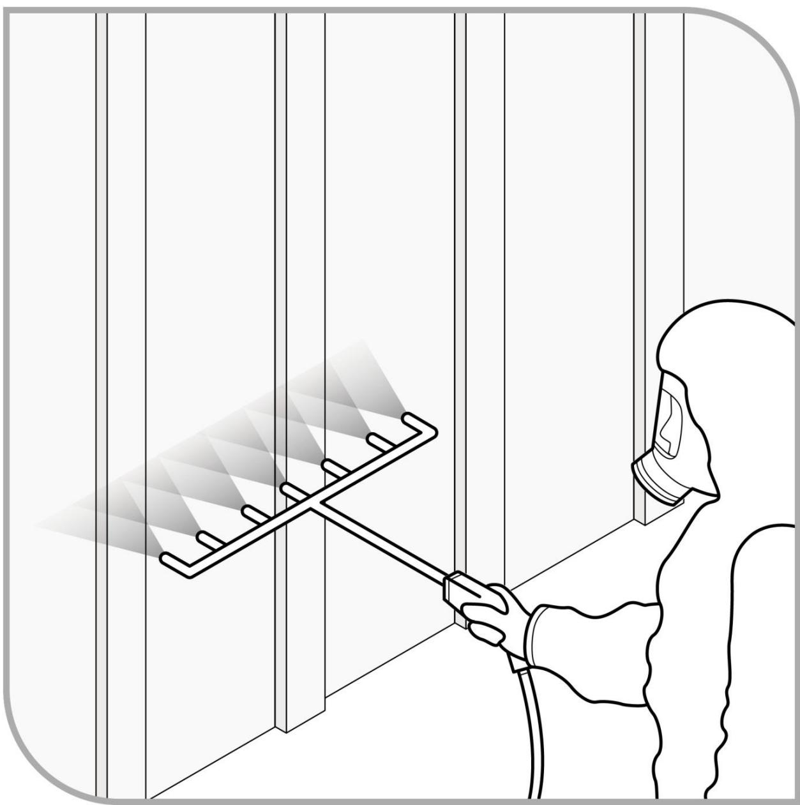  
Figure 2 Person using the wet spray method on asbestos

Airborne asbestos fibres are significantly suppressed when the wet spray method is used; however, they are not entirely eliminated so effective PPE including RPE is also essential. Refer to section 4.5 of this Code for information on PPE.

Consideration should be given to applying a polyvinyl acetate (PVA) emulsion as it may be more effective than water, with or without a wetting agent, in minimising fibre release. Water alone may not be sufficient. For example, PVA can be applied and allowed to dry on AC roofing prior to its removal as an alternative method to prevent slip hazards.

# Saturation and water injection method

If the asbestos is so thick that the spray method will not suppress the release of asbestos significantly during removal work, you should soak the asbestos until total saturation is achieved. This method involves injecting water or a water- based solution directly into friable asbestos. You will need to undertake specific training to use the process and the required equipment.

The asbestos is soaked by the introduction of water or other wetting agents through an appropriate applicator that consists of an injection head with numerous side holes or outlets through which the water or wetting agent is fed to the asbestos.

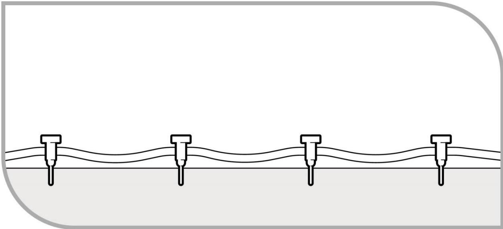  
Figure 3 Saturating asbestos using the water injection method

To facilitate more rapid wetting of the asbestos, holes or cuts should be made in the outer covering to enable the water or wetting agent to be injected in a manner that ensures the asbestos is saturated but not washed out—i.e. it is not carried away by run- off.

The soaking should be done before removal. The quantity of water or wetting agent and the time to soak will depend on the thickness of the asbestos, access to the asbestos and location of the holes.

The saturated asbestos should then be removed in sections, placed in a properly labelled container, sealed and disposed of as outlined in section 4.8.

# Dry method

The dry method is not preferred as there is a much greater potential for airborne asbestos fibres to be generated. You should only use the dry removal method if the wet spray or soaking methods are not suitable, for example if there are live electrical conductors or if major electrical equipment could be permanently damaged or made dangerous by contact with water.

If the dry removal method is used, you should use the following controls:

- Non-friable removal—Enclose the asbestos removal work area as far as is reasonably practicable.- Friable removal—Fully enclose the asbestos removal work area with heavy duty polyethylene, (also known as polythene) sheeting (minimum  $200\mu \mathrm{m}$  thickness) and maintain at a negative pressure [at least  $12\mathrm{Pa}$  (water gauge)]. Ensure all workers involved in the removal operation wear full-face positive-pressure supplied air-line respirators.- Friable and non-friable removal—The asbestos should be removed in small, pre-cut sections with minimal disturbance to minimise the generation of airborne asbestos fibres as much as possible. Wherever reasonably practicable, a HEPA filtered H-Class industrial vacuum cleaner should be used.- All waste material should be immediately placed in appropriate wet containers which are wetted to suppress creation of dust and airborne fibres.

# 4.4. Tools and equipment

# WHS Regulation s Part 8.5 Division 3

Control on use of certain equipment

# Prohibited tools and equipment

A PCBU or their workers must not use high- pressure water sprays or compressed air on asbestos or ACM, unless for fire fighting or fire protection purposes.

Other tools and equipment that generate dust such as high- speed abrasive power and pneumatic tools (e.g. angle grinders, sanders, saws and high speed drills) and brooms and brushes (unless brushes are used for sealing) must also not be used on asbestos, unless the use of the equipment is controlled. This means the equipment is enclosed when used, or the equipment is designed or used in a way that captures or suppresses airborne asbestos fibres.

# Use of tools and equipment

Tools and equipment that you can use during asbestos removal work include HEPA filtered H- Class industrial vacuum cleaners, and manually operated hand tools and equipment that have been designed to capture or suppress respirable dust or are used in a way that is designed to capture or suppress respirable dust.

Tools and equipment that cause the release of asbestos, including power tools and brooms, must only be used on asbestos or ACM if the equipment is enclosed and/or designed to capture or suppress asbestos fibres and/or the equipment is used in a way that is designed to capture or suppress asbestos fibres safely, for example:

enclosing the tool or instrument using engineering controls such as extraction ventilation, and using the tools and instruments within an enclosed removal area (for example full enclosure or small enclosure).

Controls are assumed to be effective if exposure monitoring results are less than 0.05 fibres/mL or control monitoring results are less than 0.01 fibres/mL. Should test results show that either of these values have been exceeded, you must cease the asbestos removal work and review and, if necessary, improve control measures to ensure the levels of airborne asbestos do not exceed these levels.

In addition to any equipment required to complete a particular task, the following equipment may be required on site before the work begins:

disposable cleaning rags bucket of water and/or a misting spray bottle sealant suitable asbestos waste container, and warning signs and/or PVC barrier tape.

# Inspection and maintenance of equipment

After the asbestos removal work is completed, tools must be decontaminated (refer to section 4.6).

All equipment to be used for the removal of asbestos should be inspected before the commencement of the asbestos removal work, after any repairs and at least once every seven days when it is continually being used. A register with the details of these inspections, the state of the equipment and any repair details should be maintained.

At the completion of the asbestos removal work, the tools and equipment must be decontaminated, placed in sealed, labelled containers and if necessary, disposed of as asbestos waste.

# HEPA filtered H-class industrial vacuum cleaners (Asbestos vacuum cleaners)

Asbestos vacuum cleaners should comply with the Dust Class H requirements in Australian Standard AS/NZS 60335.2.69:2017: Household and similar electrical appliances - Safety: Particular requirements for wet and dry vacuum cleaners, including power brush, for commercial use. HEPA filtered H- Class industrial vacuum cleaners should not be used on wet materials or surfaces. Attachments with brushes should not be used as they are difficult to decontaminate.

Filters for these vacuum cleaners should conform to the requirements of AS 4260- 1997: High efficiency particulate air (HEPA) filters - Classification, construction and performance or its equivalent.

You should never use household vacuum cleaners where asbestos is or may be present, even if they have a HEPA filter.

Asbestos vacuum cleaners can only be used for collecting small pieces of asbestos dust and debris. Larger pieces should be picked up and placed in suitable waste containers and should never be broken into smaller sizes for vacuuming.

The asbestos vacuum cleaner and attachments must be decontaminated before they are removed from the asbestos removal area.

You should ensure that procedures are established for the general maintenance, including emptying, of asbestos vacuum cleaners in a controlled environment.

Vacuum cleaners should be cleaned externally with a wet cloth after each task, the hose and attachments should be stored in a labelled impervious bag, and a cap should be placed over the opening to the asbestos vacuum cleaner when the attachments are removed.

PPE should be worn whenever an asbestos vacuum cleaner is opened to change the bag or filter or to perform other maintenance.

The emptying of asbestos vacuum cleaners can be hazardous if the correct procedures are not followed. Asbestos vacuum cleaners should only be emptied by a competent person wearing the correct PPE, in a controlled environment and in compliance with the manufacturer's instructions.

The asbestos vacuum cleaner and attachments must also be decontaminated before they are removed from the asbestos removal area. The bag and filter must be removed in accordance with the manufacturer's instructions and disposed of as asbestos waste.

Whenever possible, you should not hire asbestos vacuum cleaners as they can be difficult to fully decontaminate.

Hiring may be more viable in some instances if the vacuum cleaner is completely decontaminated, such as when a one- off maintenance task is required for asbestos. Asbestos vacuum cleaners should be hired only from organisations that provide vacuum cleaners specifically for work involving asbestos and the asbestos vacuum cleaner has been previously decontaminated. If hired, the asbestos vacuum cleaner should be decontaminated before it is returned.

Alternatively, the hire organisation may undertake the decontamination and maintenance of the filters and bags of the asbestos vacuum cleaner itself. In these cases, the asbestos vacuum cleaner should be hired out if the hire organisation has:

placed it in a sealed storage container provided instructions stating that it may be removed from the container only when it is inside the asbestos removal work area, and provided instructions that users must wear appropriate PPE when using the vacuum cleaner.

When the minor maintenance work is completed the asbestos vacuum cleaner should be resealed in the storage container provided, and the sealed storage container should then be decontaminated by wet wiping before it is removed from the asbestos removal work area and returned to the hire organisation for decontamination and maintenance.

Organisations that hire out asbestos vacuum cleaners should ensure all their asbestos vacuum cleaners are decontaminated, maintained in good working order and the hirers are competent in their safe use. It is suggested that asbestos vacuum cleaners are only hired out to asbestos removal supervisors or licence holders.

# Spray equipment

Spray equipment includes wet sprays with water mist or wetting solution. A constant low- pressure water supply is required for wetting down asbestos and related items to suppress airborne asbestos fibres.

Wet spray can be achieved with a mains- supplied garden hose fitted with a pistol grip. If no water supply is readily available, a portable pressurised vessel (such as a pump- up garden sprayer) may be used. For very small areas, a small spray water bottle may be sufficient. In all cases, the use of water should be in the form of a mist to minimise the potential to generate airborne dust. Further information is contained in the Code of Practice: Management and control of asbestos in the workplace.

# 4.5. Personal protective equipment

Personal protective equipment (PPE)

# WHS Regulations Part 3.2 Division 5

Personal protective equipment

# WHS Regulation 472

Disposing of asbestos waste and contaminated personal protective equipment

If PPE is to be used at the workplace, you must ensure that the PPE is selected to minimise risk to health and safety by ensuring it is:

suitable for the nature of the work and any hazard associated with the work a suitable size and fit and reasonably comfortable for the person wearing it

maintained, repaired or replaced so it continues to minimise the risk, including ensuring that the PPE is clean and hygienic and in good working order, and used or worn by the worker, so far as is reasonably practicable.

You must provide the worker with information, training and instruction in the proper use and wearing of PPE; and the storage and maintenance of PPE.

A worker must, so far as reasonably able, wear the PPE in accordance with any information, training or reasonable instruction.

The effectiveness of PPE relies heavily on workers following instructions and procedures correctly, as well as fit, maintenance and cleaning. If PPE must be used for long periods, if dexterity and clear vision are needed for the task, or if workers have not been adequately trained on how to fit and use PPE properly, workers might avoid using it.

The best way to determine this is to observe workers performing the task. If they discard the PPE or do not use it, this may indicate that it does not fit, is uncomfortable or is a hindrance in the work. You should also observe workers after the task is complete to ensure that the PPE they have used is stored and maintained correctly.

As asbestos removal is a high hazard activity, appropriate PPE should be worn regardless of other control measures in place.

PPE must be worn at all times during the work in the asbestos removal area. PPE includes clothing, for example coveralls, gloves and safety footwear, as well as RPE. PPE should be made from materials that provide protection against fibre penetration and not from wool or other materials that attract fibrous dusts.

All PPE used for the removal of asbestos should be inspected before the commencement of the asbestos removal work, after it undergoes any repairs and at least once every seven days when it is continually being used. A register with the details of these inspections, the state of the equipment and any repair details should be maintained. At the end of the asbestos removal work and upon leaving the asbestos removal work area you must ensure that all PPE is - disposed of as asbestos waste, or- decontaminated and stored in sealed double bags before being removed from the asbestos removal site to be laundered by a laundry with facilities for laundering asbestos-contaminated materials.

PPE should be thoroughly wet before being placed in bags.

# Coveralls

You should provide disposable coveralls, which are:

- of a suitable standard to prevent tearing or penetration of asbestos fibres so far as is practicable—disposable coveralls rated type 5, category 3 (ENISO 13982-1) would meet this standard- one size too big, as this will help prevent ripping at the seams, and- fitted with hood and cuffs, ensuring that:  
- if cuffs are loose, they are sealed with adhesive (cloth or duct) tape  
- coverall legs are worn over footwear as tucking them in lets the dust in, and  
- the fitted hood is worn over the respirator straps.

Coveralls should:

- not be made of material that is easily torn- not have external pockets or velcro fastenings because these are easily contaminated and difficult to decontaminate

- never be taken home- never be reused, and- be disposed of as asbestos waste after a single use.

If it is not reasonably practicable to provide coveralls that can be disposed of after a single use, the coveralls may be laundered at a commercial laundry equipped to launder asbestos- contaminated clothing by prior arrangement. The coveralls must be sealed in a decontaminated container before they are removed from the asbestos removal work area.

However, laundering of asbestos- contaminated protective clothing is not recommended because decontamination cannot be guaranteed. It is recommended that such re- usable coveralls should only be used in limited instances, for example in emergency services where the coveralls must be inflammable to protect against fire hazards and continual disposal and replacement is not practicable. Refer to section 4.8 for more information on laundering of contaminated clothing.

In some cases (particularly dusty jobs) double coveralls should be used, with the outer coverall being removed a predetermined distance from the final decontamination area. Disposable coveralls should be wrapped in a double layer of heavy duty polyethylene sheeting (minimum  $200\mu m$  thickness) or double bagged before disposal as asbestos- contaminated waste after the removal task is completed.

# Gloves

Gloves should be worn when conducting asbestos removal work. If significant quantities of asbestos fibres may be present, single- use disposable nitrile gloves should be worn. If latex gloves must be used, low protein (powder free) gloves should be provided.

Gloves used for asbestos removal work should be disposed of as asbestos waste. Workers should clean their hands and fingernails thoroughly whenever leaving the asbestos removal work area. However, as with coveralls, if it is not reasonably practicable to use disposable gloves, then re- usable gloves may be used in limited circumstances and must be laundered appropriately.

# Safety footwear

You should provide safety footwear (for example steel- capped, rubber- soled work shoes or gumboots) for all workers removing asbestos. Safety footwear should be laceless, as laces and eyelets can be contaminated and are difficult to clean. The footwear should remain inside the barricaded area or dirty decontamination area for the duration of the asbestos removal work and should not be shared for hygiene reasons. You should avoid using disposable overshoes unless they are of a design that has an anti- slip sole.

When safety footwear is not in use, it should be stored upside down to minimise asbestos contamination inside the footwear. Storage facilities should be provided to the shoes. At the end of the removal work and each time the worker leaves the asbestos removal work area, safety footwear must be:

- decontaminated- sealed in containers (e.g. double bags) for use on the next asbestos removal site (but not for any other type of work), or- sealed in containers (e.g. double bags) and disposed of as asbestos waste.

# Respiratory protective equipment (RPE)

You should ensure that all workers engaged in asbestos removal work wear RPE conforming to the requirements of AS/NZS 1716:2012: Respiratory protective devices or its equivalent.

The type of respiratory protection depends on the work to be conducted. The type of respiratory protection and supplied air respirators should be determined by a competent person. The selection of suitable RPE depends on the nature of the asbestos removal work, the probable maximum concentrations of asbestos fibres expected and any personal characteristics of the wearer that may affect the facial fit of the respirator (for example facial hair and glasses).

Disposable RPE may be used but it is not preferred as it provides little protection after short- term use. If used, it should be stored in a suitable and clean location before use and disposed of as asbestos waste after a single use.

A competent person may change the level of RPE required at any stage during the asbestos removal job after assessing asbestos fibre levels in the asbestos removal work area. For example, during the final clean- up after the removal of friable asbestos the use of air- lines may no longer be considered necessary.

If a medical condition precludes the use of negative pressure respirators (RPE fitted with filters or cartridges), workers should be provided with a continuous- flow, positive pressure respirator wherever possible.

A fit test should be performed to ensure the RPE fits the individual and provides a good face seal between the worker's skin and the face piece. Fit tests should be repeated when changing from different model of RPE or a different sized face piece.

Appendix C provides more information on selecting suitable RPE and fit tests.

# Using and maintaining RPE

You must ensure RPE is worn at all times in the asbestos removal area and until the appropriate stage of personal decontamination has been completed (see section 4.6). You should ensure that RPE is taken off last at the end of a shift or at a break as part of the decontamination process.

At every asbestos removal job you (or your supervisor) must ensure all workers undertaking any asbestos removal work receive instruction and training in:

- fit testing/checking- the importance of a correct facial fit- the correct method of using their respirators- the procedures for regular cleaning, inspection and maintenance of respirators before use, and- when to stop asbestos removal work and leave the area if they think their RPE is not working properly.

Workers must be instructed that RPE must be worn in accordance with the manufacturer's instructions and the coverall hood should go over the straps of the RPE. RPE should be examined in accordance with the manufacturer's instructions before use to ensure that it is not damaged and is in good working order. All parts, including filters, valves and seals, should be inspected before and after each use. RPE defects should be reported immediately to the asbestos removal supervisor for repair or replacement.

The pre- use examination should include an inspection of:

- the condition of the straps and face piece, including the seal and the nose piece- the condition of the exhalation valve, and- a fit check.

Non- disposable RPE must be decontaminated before it is removed from the asbestos removal area. If it is not practicable to decontaminate the RPE, it must be kept in a sealed container until it is re- used for asbestos removal purposes.

A system of regular cleaning, inspection and maintenance of non- disposable respirators should be in place to ensure they are clean and in a safe working condition.

Records of all respirator issues, uses and maintenance should be kept up- to- date.

The length of time a particulate filter can be used for the asbestos removal work depends on the resistance to breathing and damage to the filter. The filter should be replaced if damaged or when resistance increases. A damaged filter must be replaced before resistance begins to increase. The replacement should be done according to the manufacturer's instructions.

Some types of filters may not be usable after being exposed to certain conditions, such as a full decontamination shower. Specific advice should be sought from the supplier regarding the effectiveness of a filter after being subjected to certain conditions.

# Air-line respirators

You should use air- line respirators when the asbestos being removed is friable and the dry method is being used. When in use, the air- line should incorporate a belt- mounted back- up filter. If a failure of the air supply system occurs, workers should leave the asbestos removal work area using normal decontamination procedures; the use of a belt- mounted back- up filter device allows for adequate respiratory protection during this process.

Manifolds should be provided where the number of workers wearing air- line respirators inside the enclosure is likely to result in the tangling of air lines and to assist workers in moving around the enclosure.

The capacity of the compressor should be adequate for the number of air- lines, and the location of the compressor's air intake should be assessed to ensure appropriate air quality and avoid contamination. Air from a compressor must be filtered before supply to a respirator.

# 4.6. Decontamination

Decontamination for the work area, workers, PPE and tools used in asbestos removal work is an important process in eliminating or minimising exposure to airborne asbestos fibres, particularly to people outside the asbestos removal work area.

You should assess the risks of each individual asbestos removal job to determine the appropriate decontamination procedure.

# Decontamination of the asbestos removal work area

There are two types of decontamination process:

- Wet decontamination, or wet wiping, involves the use of damp rags or wet wipes to wipe down contaminated areas. Rags should only be used once, although they may be refolded to expose a clean surface. The rags should be used flat and should not be wadded. If a bucket of water is used, the rags should not be re-wetted in the bucket as this will contaminate the water. If the water is contaminated, it must be treated as asbestos waste. Care should be taken to avoid any potential electrical hazards when using this procedure.

- Dry decontamination involves carefully rolling or folding up and sealing polythene sheeting and/or vacuuming the asbestos removal area with a HEPA filtered H-Class industrial vacuum cleaner. Dry decontamination should only be used where the wet method is not suitable or poses a risk because of hazards such as electricity or slipping.

Contaminated items, tools, equipment and clothing must not be removed from the removal work area unless they have been decontaminated or placed in sealed containers labelled in accordance with the GHS. If an item is not able to be decontaminated, or is not suitable for decontamination, it should be placed in an appropriately labelled and sealed container and disposed of as asbestos waste (see section 4.8). The sealed container must be decontaminated before it is removed from the asbestos removal work area.

If asbestos removal work involves friable asbestos, the decontamination procedures must include decontamination units. 'Glove bag' and 'wrap and cut' methods are exceptions where personal decontamination procedures are likely to be satisfactory and decontamination units will not be necessary. Mini- enclosure removals may require a combination of personal decontamination and decontamination units if used for friable asbestos removal.

# Decontamination of tools

You should ensure all tools used during asbestos removal work are fully dismantled (where appropriate), cleaned under controlled conditions and decontaminated using either the wet or dry decontamination procedures described above before they are removed from the asbestos removal work area. The method chosen will depend on its practicality, the level of contamination and the presence of any electrical hazards.

If tools cannot be decontaminated in the asbestos removal work area, or are to be re- used at another asbestos removal work area, they should be put into containers (e.g. double bagged) labelled in accordance with the GHS to indicate the presence of asbestos before being removed from the asbestos removal work area. The exteriors of these containers must also be decontaminated.

The containers used for storing the tools must remain sealed until decontamination or the commencement of the next asbestos maintenance or service task where the equipment can be taken into the asbestos removal work area and re- used under full control conditions.

PPE should be worn when opening the bag to clean or re- use the equipment or tools, and decontamination should only be performed in a controlled environment.

In some circumstances it may be better to dispose of contaminated tools and equipment as asbestos waste, depending on the level of contamination and the ease of replacement.

# Personal decontamination procedures

Personal decontamination involves the removal of all visible asbestos dust/residue from PPE and RPE. You must ensure personal decontamination is undertaken each time a worker leaves the asbestos removal work area and at the completion of the asbestos maintenance or service work. Personal decontamination should be done within the asbestos removal work area to avoid the worker re- contaminating themselves or contaminating adjacent areas. Personal decontamination should be carried out even where a decontamination unit is not necessary, such as during minor or small- scale asbestos removal and maintenance work.

An asbestos removalist must ensure that asbestos- contaminated PPE is not transported outside the asbestos removal work area unless it is decontaminated or placed in a sealed container labelled in accordance with the GHS. Before work clothes and safety footwear worn during asbestos removal work are removed from the asbestos removal work area for any reason, they must be decontaminated. They should be thoroughly vacuumed with a HEPA filtered H- Class industrial vacuum cleaner to remove any asbestos fibres, and the safety footwear should also be wiped down with damp rags or wet wipes.

RPE should be used until all contaminated disposable coveralls and clothing have been vacuum cleaned and/or removed and bagged for disposal and personal washing has been completed. Any PPE used while carrying out asbestos removal work must not be taken home by a worker.

Personal hygiene and careful washing are essential. Particular attention should be paid to the hands, fingernails, face and head.

Table 3 Personal decontamination  

<table><tr><td colspan="2">Never leave the asbestos removal work area until decontamination is complete.</td></tr><tr><td>□</td><td>Remove any visible asbestos dust/residue from protective clothing using a HEPA filtered H-Class industrial vacuum cleaner or wiping down with damp rags or wet wipes. Warning: do not reuse or resoak damp rags or wet wipes.</td></tr><tr><td>□</td><td>Carefully remove disposable protective clothing and place into bags (RPE must still be worn).</td></tr><tr><td>□</td><td>Place rags and cloths into heavy duty polyethylene asbestos disposal bags (minimum 200 μm thickness).</td></tr><tr><td>□</td><td>Take disposable coveralls off and place into disposal bags (RPE must still be worn).</td></tr><tr><td>□</td><td>Use damp rags or wet wipes to wipe down safety footwear and place rags or wet wipes into asbestos disposal bag.</td></tr><tr><td>□</td><td>Seal all asbestos disposal bags with adhesive (cloth or duct) tape and place each into a second asbestos disposal bag (double bagging).</td></tr><tr><td>□</td><td>Seal this second asbestos disposal bag and ensure it is labelled/marked as &#x27;Asbestos Waste&#x27;.</td></tr><tr><td>□</td><td>Use damp rags or wet wipes to wipe external surfaces of the asbestos disposal bags to remove any dust before they are removed from the asbestos removal work area.</td></tr><tr><td>□</td><td>Remove non-disposable PPE and place in container labelled as containing asbestos.</td></tr><tr><td>□</td><td>Remove RPE and double bag, seal with adhesive (cloth or duct) tape and ensure it is labelled/marked as &#x27;Asbestos Waste&#x27;.</td></tr><tr><td>□</td><td>Ensure the outside of each bag is decontaminated by using a damp rag or wet wipes.</td></tr><tr><td>□</td><td>Place the damp rag or wet wipes into asbestos disposal bags.</td></tr><tr><td>□</td><td>Dispose of asbestos waste at the appropriate waste facility as soon as practicable.</td></tr></table>

# Setting up personal decontamination areas outside the asbestos removal work area

You must ensure specific areas are set up for people to personally decontaminate themselves and any tools and equipment when they are entering and leaving the asbestos

removal work area to eliminate or minimise airborne asbestos being released from the asbestos removal work area.These areas are:

These areas are:

a dirty decontamination area that includes:

a suitable rack for air- lines to be stored on at the entrance of the area equipment for vacuum cleaning or hosing down (by use of a fine mist) contaminated clothing and footwear storage for contaminated clothing and footwear labelled waste bags/bins for disposing of protective clothing, and shower area with an adequate supply of hot and cold water and toiletries.

a clean decontamination area that includes:

storage for individual RPE in containers or lockers airflow towards the dirty decontamination area, and shower area with an adequate supply of hot and cold water and toiletries.

a clean changing area that includes:

storage for clean clothing separate storage for clean and dirty towels, and airflow towards the clean decontamination area.

Below is an example of how a person would enter and leave a removal work area.

# Entering the asbestos removal work area

- Cleaning area: Change into clean work clothes and put on clean protective clothing. Store any removed clothing in a dust-proof container. Move into clean decontamination area.- Clean decontamination area: Put on RPE. Check that it is working properly and there is a good facial seal, such as a fit check. Move to the dirty decontamination area.- Dirty decontamination area: Put on any additional PPE that has been stored in the dirty decontamination area such as safety footwear. Connect the RPE to the air-line supply if required. Move from the decontamination unit to the asbestos removal work area.

# Leaving the asbestos removal work area

Asbestos removal area: Use a HEPA filtered H- Class industrial vacuum cleaner and PVA/water spray to remove any obvious signs of asbestos dust from protective clothing. Remove safety footwear and leave shoes/boots inside the asbestos removal area next to the decontamination unit (footwear should be stored upside down to minimise further contamination). Proceed into the dirty decontamination area.

Dirty decontamination area: If shoes/boots have not already been removed, remove them and store upside- down within the dirty decontamination area. Disconnect the airline if being used and connect the RPE to the back- up filter during decontamination. Shower while wearing protective clothing and RPE. Leaving RPE on, remove protective clothing and place in labelled disposal bags. Remove wet underclothing, such as t- shirts or shorts, while showering and place in the storage unit provided within the dirty decontamination area. Pass through the airlock into the clean decontamination area.

Clean decontamination area: Shower and remove RPE. Thoroughly wash hands, fingernails, face, head and respirator. Store RPE in a suitable container within the clean decontamination area. Move to the clean change area.

Clean change area: Change into clean clothing.

# Decontamination units attached to an enclosure

You should conduct a risk assessment to determine the number of units required based on the number of workers in the asbestos removal work area. As a guide, one decontamination unit should be provided for every six workers in the asbestos removal work area.

Where men and women are required to use the same decontamination unit, you need to implement a system of work to enable them to access the unit separately.

In many instances, the only satisfactory way of providing appropriate changing facilities is to provide a mobile or specially constructed on- site decontamination unit.

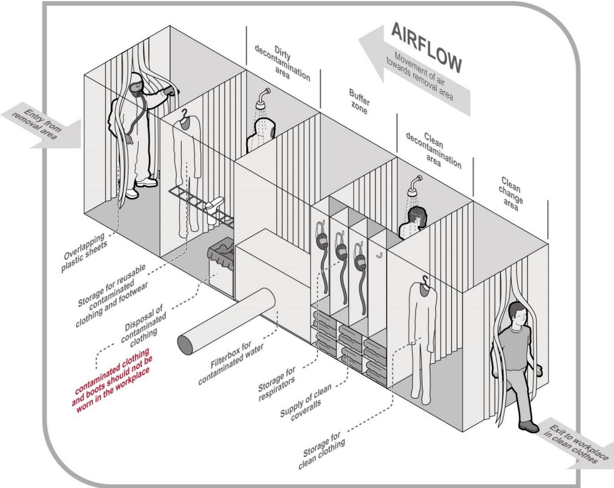  
Figure 4 Decontamination unit

The decontamination unit should be immediately adjacent to and directly connected to the enclosed asbestos removal work area. It should be located as far away as practicable from workplace facilities such as a lunchroom.

The decontamination unit should include a dirty decontamination area, a clean decontamination area and a clean changing area. These areas need to:

- be large enough to enable workers to adequately decontaminate themselves- be separated by suitable airlocks or buffer zones, and- have doors with large openings with overlapping, hinged flaps operating as a one-way valve to ensure there is sufficient airflow through the decontamination unit.

Towels and soap should be provided to allow workers to appropriately decontaminate themselves.

All water from the decontamination facility should pass through a particulate filter or other trap before it passes into sewer mains. The filter or trap should be capable of capturing particles down to  $5\mu \mathrm{m}$ .

Workers should not smoke, eat or drink in any part of the decontamination unit.

You should have a worker stationed outside an enclosure for the duration of the asbestos removal work to liaise with the asbestos removal supervisor, communicate with personnel inside the work enclosure and instigate emergency/evacuation procedures if necessary.

Records about these activities should be kept on a daily basis.

# Remote decontamination units for friable asbestos removal

Remote decontamination units are decontamination units not attached to an enclosure which should be used when friable asbestos is being removed. Remote units are not located next to the asbestos removal work area and can only be used if a decontamination unit cannot be located immediately adjacent to the asbestos removal work area.

When a remote decontamination unit is to be used, you need to implement additional transiting procedures to minimise asbestos contamination of pathways leading from the enclosure to the decontamination unit. These procedures are longer and more complex than non- transiting. This involves the use of 'transiting' PPE and additional facilities to enable the worker to carry out preliminary decontamination before travelling to the decontamination unit for full decontamination.

This may include a three- stage airlock isolated changing area, which should be specially constructed and made of heavy duty polyethylene sheeting (minimum  $200\mu \mathrm{m}$  thickness). The area should be attached to the enclosure and should comprise three compartments separated by weighted sheets to minimise the spread of dust between the compartments.

Before workers enter this changing area, all obvious signs of asbestos dust need to be removed from their protective clothing using a HEPA filtered H- Class industrial vacuum cleaner in the enclosure. The isolated changing area is then used to discard outer garments, including coveralls and overshoes, before workers put on fresh outer/protective clothing for the journey to the remote decontamination unit. RPE should be worn until the appropriate phase of the decontamination procedure within the remote decontamination unit.

The route of access from the asbestos removal area to the decontamination unit should be suitably signposted and barricaded to restrict public access.

Air monitoring must be conducted in the immediate vicinity of this access route and at other suitable locations outside the asbestos removal area.

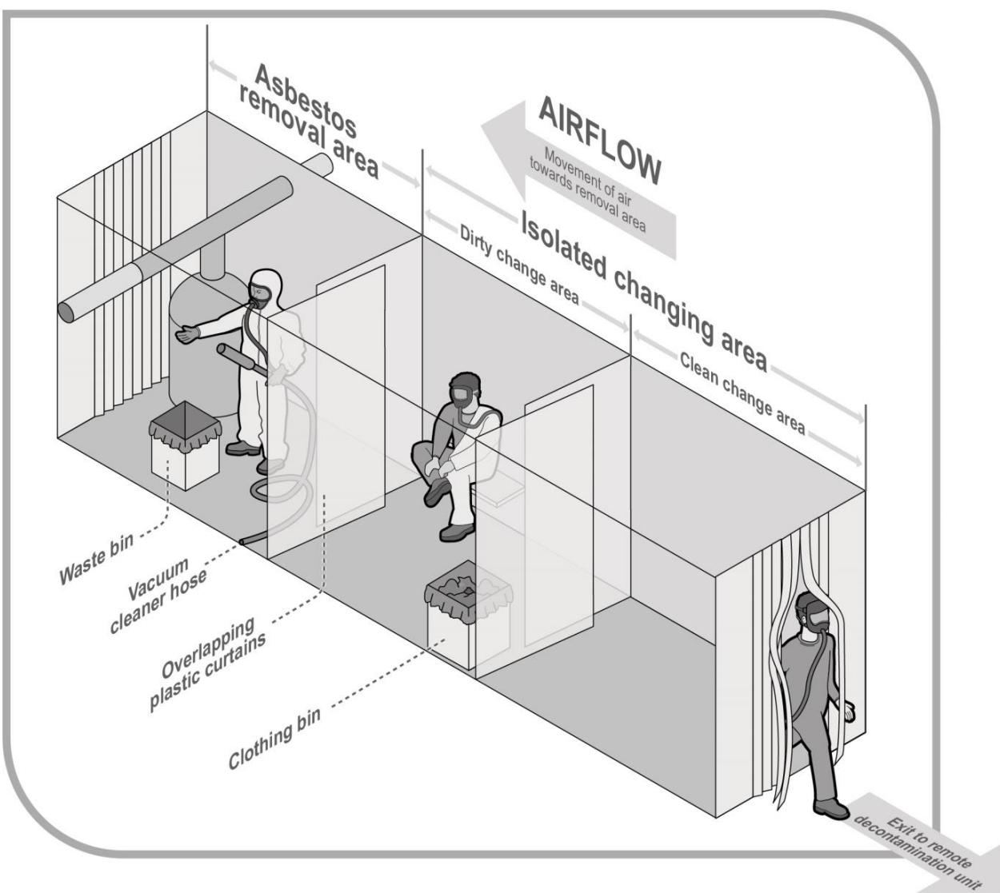  
Figure 5 Preliminary decontamination procedure where a remote decontamination unit is used

# 4.7. Laundering clothing

Disposable coveralls should be used as protective clothing unless it is not reasonably practicable to do so. When non- disposable protective clothing is used, you must ensure the contaminated clothing is laundered in a suitable laundering facility that is equipped to launder asbestos- contaminated clothing. Contaminated protective clothing must not be laundered in homes. Any clothing worn under coveralls must be disposed of or suitably bagged for laundering as asbestos- contaminated clothing.

The laundering facility that is equipped to launder asbestos- contaminated clothing:

- should be informed of the asbestos contamination- should have a management plan in place to control the release of respirable fibres- should be constructed of smooth surfaces that are able to be lined with heavy duty polyethylene sheeting (minimum  $200\mu \mathrm{m}$  thickness) or easily wiped clean- may use conventional washing machines provided they are not used for other clothing- may need to have a laundry room that is under negative pressure to eliminate or minimise the release of airborne asbestos fibres during the laundering process- this can be determined during the risk assessment, and

- should have procedures established for cleaning up spills and for the prevention of flooding of neighbouring areas.

The contaminated clothing should:

- be removed by workers when damp and then thoroughly wetted, placed in impermeable containers or bags the outside of which are decontaminated and labelled to indicate the presence of asbestos before being sent to the commercial laundering facility, and- not be allowed to dry out before washing.

At the laundry facility:

the containers and bags holding the asbestos- contaminated clothing should be opened in the washing machine while being further saturated. A minimum P1 respiratory protection must be worn while unloading clothes into the washing machine, and- the empty containers or bags should be disposed of as asbestos waste. Waste water must be filtered and the filtering medium disposed of as asbestos waste.

# 4.8. Waste containment and disposal

You should design the route for removal of the asbestos waste bags or containers through the asbestos removal work area prior to commencement of the asbestos removal work. Only unused heavy duty polyethylene bags (minimum  $200\mu m$  thickness) and heavy- duty polyethylene sheeting can be used. Bags labelled for asbestos waste should not be used for any other purpose.

When developing a waste disposal program, you should take the following into account:

- the containment of waste so as to eliminate the release of airborne asbestos fibres- details of any asbestos or ACM to be left in situ- the types of fittings and supports and whether removal and disposal of these items is part of the work specifications- the location and security of waste storage on site- the transport of waste within the site and off site- the location of the waste disposal site- ensure that the proposed location for the storage and asbestos removal work area and the surrounding area will be unoccupied for the duration of the removal- approvals needed from the relevant local disposal authority, and- any local disposal authority requirements that may apply to the amount and dimensions of asbestos waste.

The development of the waste disposal program and methods used to transport waste through a building needs to be determined by a competent person (usually the asbestos removal supervisor) following discussions with the person with management or control of the workplace. In occupied workplaces, all movement of waste containers through a building should take place outside normal working hours.

# Removal work area waste containment

You should include a waste disposal program in the asbestos removal control plan (where required—see section 3.5 of this Code) and specify the method of transport and routes to be used for removing waste from the asbestos removal area before the commencement of each removal.

Loose asbestos waste must not accumulate within the asbestos removal work area. The loose asbestos waste should be placed in labelled asbestos waste bags or wrapped in heavy- duty polyethylene sheeting (minimum  $200\mu m$  thickness) and labelled. Once the

labelled asbestos waste has been removed from the asbestos removal area, it should either be:

placed in a solid waste drum, bin or skip which should only be used for asbestos waste and labelled for secure storage and eventual disposal, or removed immediately from the site by an Environment Protection Agency (EPA) approved/licensed carrier for disposal.

The asbestos waste must be disposed of at a licensed asbestos waste disposal site. The disposal process must occur in a manner that eliminates the release of airborne asbestos fibres- - this can be done by ensuring:

bagged asbestos waste is securely packaged in labelled containers waste containers are secured during transport, and waste is unloaded at the landfill site using waste disposal procedures which prevent the tearing of the polythene lining.

# Waste removal

The asbestos waste must be disposed of as soon as reasonably practicable, whether that is:

at the end of the removal job (providing the asbestos waste is secured on site at the end of each day to prevent unauthorised access) when the waste containers are full, or at the end of each day if the asbestos waste cannot be secured at the removal site.

# Asbestos waste bags

You must ensure all asbestos waste, friable asbestos and small pieces of non- friable asbestos is contained to prevent exposure to airborne asbestos fibres. New heavy duty polyethylene bags (minimum  $200\mu m$  thickness) that are no more than  $1200mm$  long and  $900mm$  wide should be used to prevent manual handling injuries.

Controlled wetting of the asbestos waste should be carried out to minimise asbestos dust emissions when polyethylene bags are sealed or during any subsequent rupture of the bag or wrapped bundles. The bags must be twisted tightly, the neck folded over and then secured with adhesive (cloth or duct) tape (referred to as goose- necking).

To minimise the risk of a bag tearing or splitting and to assist in manual handling, asbestos waste bags should not be filled more than half full (depending on the weight of the items) and excess air should be gently evacuated from the waste bag in a way that does not cause the release of dust.

The bags should be labelled in accordance with the GHS to indicate they contain asbestos and that dust creation and inhalation should be avoided.

The external surface of each bag should be cleaned to remove any adhering dust before the bag is removed from the asbestos removal work area and double bagged outside the asbestos removal area immediately following the decontamination process.

# Polyethylene sheeting for containing asbestos waste

Asbestos sheeting and redundant asbestos- lagged pipes and equipment should be double wrapped in heavy duty polyethylene (polythene) sheeting (minimum  $200\mu m$  thickness) and adhesive (cloth or duct) tape applied to the entire length of every overlap to secure the bundles and minimise the risk of the polyethylene sheeting tearing or splitting.

Polyethylene sheeting should be new (not recycled) as recycled sheeting can have flaws in it.

Once wrapped in polythene, the bundles need to be labelled to indicate they contain asbestos so they can be treated appropriately.

# Removing waste from the removal work area

Once the waste has been removed from the asbestos removal work area, you should ensure it is either:

placed in a solid waste drum, bin or skip that has been signposted as asbestos waste for secure storage and eventual disposal, and immediately removed from the site by the relevant EPA approved/licensed carrier for disposal.

# Labels for waste containers and drums

You must ensure all containers containing a hazardous chemical such as asbestos comply with labelling elements of the GHS. The waste drums or bins should be lined with heavy duty polyethylene sheeting (minimum  $200\mu m$  thickness), and labels warning of the asbestos waste should be placed on the top and side of each drum or bin with the words, 'Danger: Asbestos Do not break seal' or a similar warning.

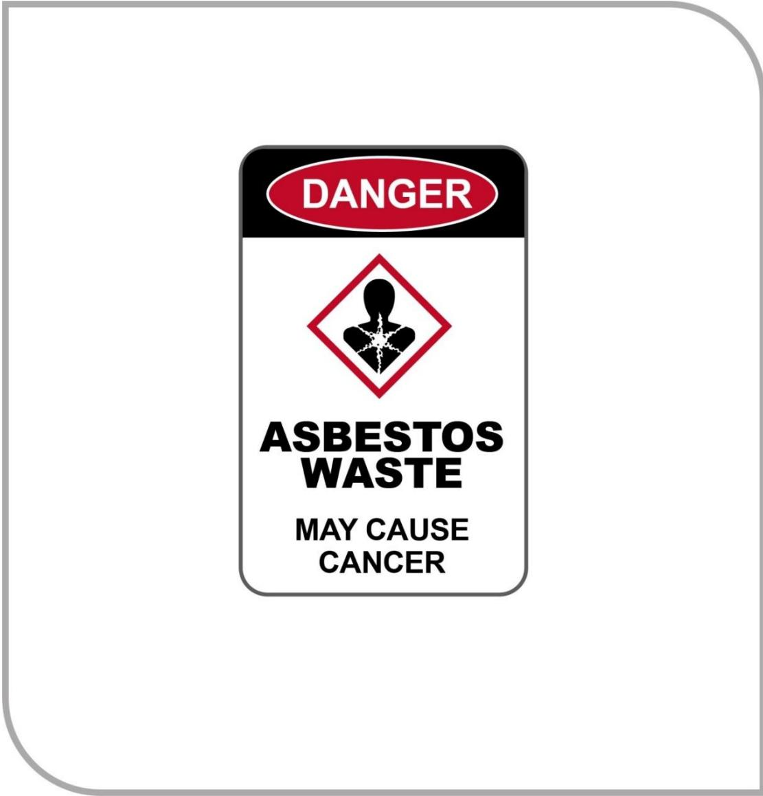  
Figure 6 Example of an asbestos waste label

# Asbestos waste drums or bins

You should ensure all drums or bins used for the storage and disposal of asbestos waste are in good condition with lids and rims in good working order and free of hazardous residue.

The drums or bins should be:

placed in the asbestos removal work area or located as close to the asbestos removal work area as possible before removal work commences be lined with heavy duty polyethylene sheeting (minimum  $200\mu \mathrm{m}$  thickness), and have their rims sealed and their outer surfaces wet- wiped and inspected before they are removed from the asbestos removal work area.

You must ensure labels warning of the asbestos waste are placed on the exterior of each drum or bin.

Controlled wetting of the waste during drum or bin filling should be carried out to minimise asbestos dust emissions.

Drums or bins used to store asbestos waste must be stored in a secure location when they are not in use. They should not be moved manually once they have been filled. Trolleys or drum lifters should be used.

If the drum or bin is to be re- used, the asbestos waste should be packed and sealed so that when the drum or bin is emptied there is no residual asbestos contamination. The drum or bin should be inspected after each use to ensure there is no asbestos residue.

# Asbestos waste skips, vehicle trays and similar containers

If the volume or size of the asbestos waste cannot be contained in asbestos waste bags, drums or bins, you should use a waste skip, vehicle tray or similar container that is in good condition.

The asbestos should be sealed in double- lined, heavy duty polyethylene sheeting (minimum  $200\mu \mathrm{m}$  thickness) or double bagged before it is placed in the skip, tray or similar container. However, non- friable asbestos waste may be placed directly into a skip or vehicle tray that has been double- lined with polyethylene sheeting provided it is kept damp to minimise the generation of airborne asbestos.

Once the skip, tray or similar container is full, its contents should be completely sealed with the polythene sheeting. If the skip is emptied at a waste disposal site, waste disposal procedures which prevent the tearing of the polythene lining should be developed.

If asbestos waste cannot be disposed of immediately, the skip may be used for storing the asbestos waste on site over a period of time provided that the contents are secured (for example using a lockable lid or locating the skip in a secure area) to prevent unauthorised access.

# Transport and disposal of asbestos waste

Disposal of asbestos waste is the final step in the process of asbestos removal work. It is therefore the last point at which the exposure to risks associated with asbestos is likely to occur. The asbestos waste must be disposed of as soon as is practicable at a licensed asbestos disposal site.

The transport of commercial asbestos waste is covered under EPA legislation. Disposal sites are regulated by the EPA and local government regulations. For further information about the transportation and disposal of asbestos waste, contact your local council or state or territory EPA.

# 5. Using an enclosure during large-scale removal work

Large scale asbestos removal includes removal that occurs on a frequent basis, is generally of a longer duration, usually generates a significant amount of airborne asbestos fibres and may pose a serious risk both to workers and others.

You must have a Class A licence to remove friable asbestos. As a Class A licenced removalist, you must ensure, so far as is reasonably practicable, the asbestos removal work area is enclosed (sometimes referred to as the 'bubble') to eliminate or minimise the release of airborne asbestos fibres. When large- scale friable asbestos removal work is being undertaken, you must ensure the asbestos removal work area is enclosed and under 'negative pressure' with the use of negative air pressure units.

As a licensed asbestos removalist, you should use a risk assessment to determine if enclosures should be used for large scale non- friable asbestos removal requiring a Class B licence. You should consider factors such as proximity to other work areas, weather conditions if outdoors, and the amount of material to be removed.

# 5.1. Designing and installing an enclosure

The design and installation of the enclosure should consider:

- methods used to contain the asbestos removal work area 
- provision and locations of decontamination/changing facilities and negative pressure exhaust units 
- precautions to be implemented to eliminate or minimise the spread of asbestos contamination outside the asbestos removal work area 
- air quality within the enclosure 
- types of lighting, whether natural or artificial 
- temperature within the enclosure to avoid heat stress, and 
- any other hazards in the enclosure (these must be identified and the risks controlled before any asbestos removal work commences).

The enclosure should:

- be constructed of heavy-duty polyethylene sheeting (200  $\mu$ m minimum thickness) and enclose all the walls, windows and doors. Wooden cleats may be used to anchor the polyethylene sheeting to walls. Recycled polyethylene sheeting should not be used 
- have viewing panels placed in appropriate locations so that the asbestos removal work area can be seen from outside the enclosure, and 
- have adequate lighting within the enclosure, either:    
- naturally, using clear plastic or perspex panels in the enclosure walls, or    
- artificially, preferably from outside the enclosure using clear plastic or perspex panels.

During the masking up and later removal of the enclosure sheeting, all workers must wear appropriate PPE, for example coveralls, and, as a minimum, a half- face respirator with P1 filters. Full 'A' class PPE is recommended.

Where the asbestos removal work area connects either to the outside environment or to the rest of the building (for example through windows, ducts, wall cavities and lift entrances), it

should be enclosed so that an airtight seal is maintained for the duration of the asbestos removal work.

All movable items should be removed from the asbestos removal area. If this is not possible, move the items from the immediate asbestos removal work area and cover with two layers of polyethylene sheeting with a minimum overlap of  $300mm$  between the layers. Both layers should be double taped.

All non- movable items such as fixtures and fittings should be covered with polyethylene sheeting and the joints sealed.

Airlocks should be placed at the entry points to the decontamination/change area and constructed using double sets of overlapping polyethylene with suitable provisions for ensuring a seal.

All floors should be protected with at least one layer of woven polyethylene to prevent penetration during the asbestos removal work. The joints should overlap by  $300mm$  and be sealed with double- sided tape and adhesive (cloth or duct) tape.

If the asbestos removal area is next to areas occupied by unprotected people, priority should be given to:

- greater isolation of the asbestos removal area, and/or- performing the asbestos removal work during periods when these areas are unoccupied.

Consideration should be given to the use of hoarding to form a barrier between the asbestos removal work area and the adjoining occupied areas. A barrier lined with heavy duty polyethylene sheeting should be erected within this hoarding and a buffer area should be reserved between the hoarding and occupied areas.

Platforms and fixed scaffolding should be erected during the early stages of the work. These structures should ideally be erected on the outside of the enclosed area. Any platforms or fixed scaffolding within the enclosed area must be decontaminated and visually inspected at the end of the asbestos removal work.

All tools and equipment used for asbestos removal work, including HEPA- filtered H- Class industrial vacuum cleaners, must remain within the asbestos removal work area until the completion of the job.

All the polyethylene sheeting and tape used for the enclosure must be disposed of as asbestos waste. Temporary structures must be disposed of as asbestos waste if they cannot be decontaminated. An inspection by a competent person will confirm if the structures are free of any visible asbestos or ACM.

Work methods should be adapted for the work environment within the enclosure. For example, rest breaks need to be based on a risk assessment taking into account factors such as the weather and heating/cooling requirements.

# Security and checks when using an enclosure

As a licensed asbestos removalist you should ensure an employee is stationed outside the asbestos work area for the duration of the asbestos removal work to:

- liaise with the project supervisor- check and maintain negative air units, compressor units, decontamination units and hot water service- ensure security of the area is maintained- communicate with personnel inside the work enclosure, and- instigate emergency or evacuation procedures if necessary.

Records of these checks should be made on a daily basis and kept.

# 5.2. Testing an enclosure

# Initial testing

Prior to the asbestos removal work commencing, the licensed asbestos removalist should ensure the enclosure is tested by an independent licensed asbestos assessor, and must ensure that any enclosure used in removing friable asbestos is tested for leaks.

An independent licensed asbestos assessor should visually inspect and conduct smoke testing to ensure there are no leaks or deficiencies in the enclosure before the asbestos removal work commences.

While smoke is generated within the enclosure, a worker should be outside the enclosure to check for leaks. Only smoke- generating devices incorporating non- oil- based, non- toxic smoke fluids can be used. Flares should not be used. Smoke (fire) detection devices in the immediate vicinity of the asbestos removal area should be isolated for the duration of the smoke test. The results of the smoke test should be documented and a copy provided to the licensed asbestos removalist.

Negative pressure exhaust units should not be used while the smoke test is being conducted.

The effectiveness of the enclosure should be regularly monitored while asbestos removal work is underway (for example, a visual examination, air- monitoring results and negative pressure readings).

If leaks or deficiencies are found during the initial testing of the enclosure they must be rectified. An expandable foam sealant, adhesive (cloth or duct) tape or equivalent may be used. Additional smoke tests must be performed until no leaks or deficiencies are identified.

Following a visual examination of the enclosure and surrounding area, if a leak of asbestos is detected, and Class A asbestos removal work is being conducted, you must do the following.

If more than 0.01 fibres/mL but less than 0.02 fibres/mL is detected, you must immediately, before work recommences:

- investigate the cause of the respirable asbestos fibre level- implement controls to prevent exposure of anyone else to asbestos, and- prevent the further release of respirable asbestos fibre.

- In addition to the immediate action you must take, you should:

- seal the leaks in the enclosure- re-test the enclosure by smoke testing until the enclosure is effective again- clean any contaminated areas- conduct visual inspections- conduct an air monitoring test specific to the incident (air monitoring)- re-assess the boundaries of the asbestos removal work area and site.

If more than 0.02 fibres/mL is detected, you must immediately, before work recommences:

- order the asbestos removal work to stop- notify the regulator- investigate the cause of the respirable asbestos fibre level- implement controls to prevent exposure of anyone to asbestos, and- prevent the further release of respirable asbestos fibre.

The asbestos removal work must stop until any defects have been rectified. Work cannot recommence until you can ensure that air- monitoring results show the recorded respirable asbestos fibre level is below 0.01 fibres/mL.

A supply of expandable foam sealant, polyester insulation or equivalent should be kept on site for sealing leaks.

# 5.3. Negative pressure exhaust units

To prevent the escape of airborne asbestos fibres from an enclosed asbestos removal work area, exhaust extraction fans should be installed to create a 'negative' air pressure of approximately  $12\mathrm{Pa}$  (water gauge) within the enclosed area. This may require the use of more than one negative pressure exhaust unit.

Units should incorporate warning devices for filter integrity/overload and power failure, and should have a manometer or magnetelic gauge and an audible and visual alarm system.

The negative pressure exhaust unit should be positioned opposite the decontamination unit to enable laminar (smooth) air flow.

- The air entering the asbestos removal work area passes through the decontamination unit or point-of-entry while the air extracted passes through a HEPA filter to remove any asbestos before it is discharged to the outside.- If this is not possible, consideration should be given to how to set up the enclosure, decontamination unit and negative pressure exhaust unit to enable optimum smooth flow of air through the enclosure so as to minimise dead air pockets. Discharge of the air from the enclosure should be at a location away from other working areas, air-conditioning inlets or breathing air compressors.

The HEPA filter must comply with AS 4260- 1997: High efficiency particulate air (HEPA) filters - Classification, construction and performance or its equivalent.

- A coarse pre-filter should be installed on the air intake side of the negative air unit to prolong the useful life of the HEPA filter.- These pre-filters may need to be changed once per work shift or more frequently depending on dust loads.- Used pre-filters must be disposed of as asbestos waste.- A process of regular inspection of the integrity of the HEPA filter and seal fittings in conjunction with a static pressure alarm should indicate failures in the system.

The negative air units should operate continuously (24 hours a day) until all asbestos removal work and decontamination within the enclosure has been completed, a clearance certificate issued and the enclosure dismantled. If the units stop during removal work, the licensed asbestos removalist must ensure all removal work ceases immediately until the problem is rectified and the required number of units are in operation. To minimise the risk of airborne asbestos fibres escaping the enclosure, the delay should be as short as possible to avoid interruption. Consideration should be given to backup negative pressure exhaust units and the use of a generator.

Maintenance work on these units should only be performed after they have been thoroughly decontaminated, or the work may be carried out under controlled conditions, such as in an asbestos removal enclosure while wearing appropriate PPE.

# 5.4. Bulk stripping and cleaning within an enclosure

Sprayed asbestos insulation needs to be wet thoroughly using a fine water spray. Aim to achieve maximum saturation with minimum run- off to minimise any subsequent clean- up and slip hazards.

Wetting, scraping and vacuuming methods need to be used wherever reasonably practicable. Where the asbestos or ACM is covered with cloth, metal cladding or wire reinforcing, it should be wet thoroughly during the removal process.

Once a competent person has determined the removal area is clean, as a licensed asbestos removalist you should, wherever reasonably practicable, spray clean surfaces within the removal area with tinted PVA or a similar acrylic emulsion, using airless spraying equipment. . This includes any layer of polyethylene sheeting forming the inner surface of the enclosure to ensure any loose asbestos fibres on the polyethylene sheeting are firmly adhered to prior to its dismantling.

After the PVA has dried and sufficient time has elapsed for fumes to dissipate, air (clearance) monitoring should take place, where required. The polyethylene enclosure must not be dismantled until a satisfactory visual inspection and air monitoring by a licenced asbestos assessor has taken place.

# 5.5. Dismantling an asbestos removal enclosure

As a licensed asbestos removalist you should only dismantle a structure used to enclose an asbestos removal area once all of the following are done:

asbestos removal work has been completed visual inspection by an independent competent person is satisfactory, and air monitoring by a licensed asbestos assessor, in the case of friable asbestos removal, is found to be less than O.01 fibres/mL.

The polyethylene sheeting that formed the enclosure must be disposed of as asbestos waste along with any other contaminated material that assisted in forming the enclosure. In some cases, structures used in building the enclosure (other than the polyethylene sheeting that formed the enclosure) may be wrapped and sealed in polyethylene sheeting and not opened until in a similar controlled environment, such as another asbestos removal enclosure (for example collapsible rods used to form the enclosure frame).

The area from which the enclosure was dismantled must be thoroughly cleaned and inspected. This should be followed by further air monitoring demonstrating the levels are below O.01 fibres/mL.

Ropes, warning signs and protective polyethylene sheeting isolating public areas should not be removed until:

the enclosure has been dismantled and removed as asbestos waste satisfactory air- monitoring results have been achieved, and the removal area and its surrounds have been visually inspected by an independent competent person and found to be satisfactory for reoccupation.

# Security and checks when using an enclosure

As a licensed asbestos removalist you should ensure an employee is stationed outside the asbestos work area for the duration of the asbestos removal work to:

- liaise with the project supervisor- check and maintain negative air units, compressor units, decontamination units and hot water service- ensure security of the area is maintained- communicate with personnel inside the work enclosure, and- instigate emergency or evacuation procedures if necessary.

Records of these checks should be made on a daily basis and kept.

# 6. Methods for small scale removal work

6. Methods for small scale removal workSmall scale friable asbestos removal work usually generates enough airborne asbestos fibres to require the use of PFE and generally is carried out only in short periods, for example minor maintenance work. Small scale removal work involves using mini-enclosures, 'glove bag' and 'wrap and cut' techniques.

# 6.1. Mini-enclosures

6.1. Mini- enclosuresMini- enclosures are suitable for asbestos removal work in areas with restricted access, such as ceiling spaces, and for emergency asbestos removals. Hazards and work procedures that should be considered for large enclosures should also be considered for mini- enclosures.

# Building the mini-enclosure

To build a mini- enclosure, the following process should be used:

Building the mini- enclosureTo build a mini- enclosure, the following process should be used:- Off- the- shelf mini- enclosures can be used or alternatively other materials such as PVC or timber can be used to build a frame. The frame of a mini- enclosure can be made from a variety of materials, but has to be strong enough to support the polyethylene sheeting that forms the enclosure.- Heavy- duty polyethylene sheeting (minimum  $200\mu m$  thickness) should be used for making the enclosure. Do not use recycled polyethylene.- Make the enclosure large enough to do the work safely, allowing for movement inside the enclosure and all the equipment needed for the removal work such as tools for the task including a bucket of water, rags, sprayer, vacuum cleaner nozzle and hose.- Machinery that emits exhaust fumes should not be placed in a mini- enclosure.- Attach the polyethylene sheeting inside the frame with adhesive tape (cloth tape is preferable to duct tape). The adhesive tape used should be strong enough to securely hold the polyethylene sheeting to the frame.- Attach the polyethylene sheeting to the ceiling with cloth tape or masking tape. Attach it to non- asbestos surfaces with duct tape.- Make an entry slit in one wall of the enclosure and reinforce this with adhesive (cloth or duct) tape from inside the enclosure. Attach a polyethylene sheet above the entry slit to cover it.- Check all seals inside the enclosure for leaks with a smoke test, using smoke tubes for mini- enclosures. The competent person, usually the licensed asbestos supervisor, should check for leaks outside the enclosure and seal all leaks.

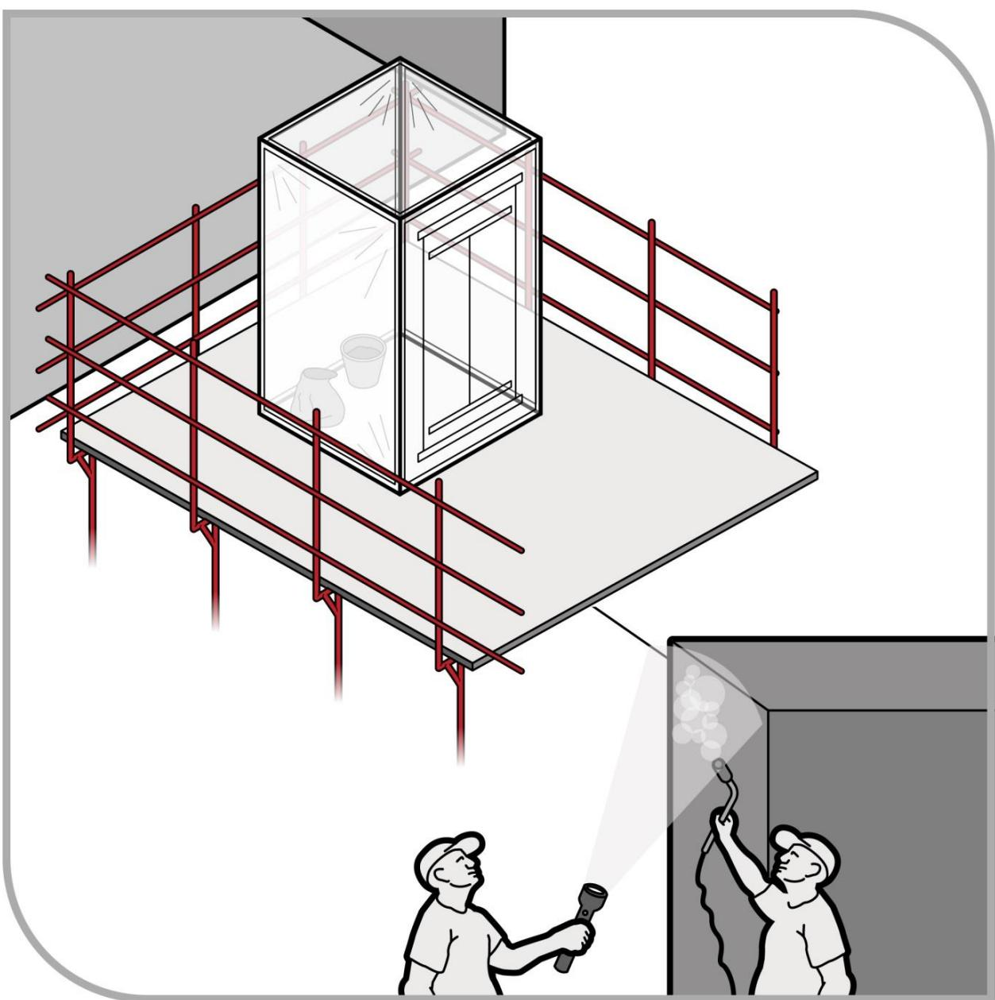  
Figure 7 Building and using a mini-enclosure

# Dismantling the mini-enclosure

To eliminate or minimise airborne asbestos fibres escaping when dismantling the mini- enclosure, the following process should be used:

- Put the asbestos waste in a heavy duty polyethylene bag with an asbestos warning sign or label to indicate the presence of asbestos.- Clean the enclosed area with a HEPA filtered H-Class industrial vacuum cleaner.- Clean the equipment and polyethylene sheeting with damp rags or wet wipes.- Workers leaving a mini-enclosure must follow personal decontamination procedures.- Inspect the enclosure visually for cleanliness.- Ensure that a clearance inspection is conducted by an independent licensed asbestos assessor or competent person and a clearance certificate is issued.- Spray the polyethylene sheeting with PVA sealant.- Remove the sheeting from the framework and put it in the labelled asbestos waste container.

- Remove PPE and put it in the labelled asbestos waste container, taping the container closed.- If the framework was fully protected and had been decontaminated and inspected by the asbestos removalist, it can be reused.

# 6.2. Glove bag asbestos removal work

The glove bag removal technique is suitable for the removal of small amounts of asbestos lagging from individual valves, joints and piping. Glove bags:

- are designed to isolate small removal jobs from the general working environment and provide a flexible, easily-installed and quickly-dismantled temporary enclosure for small removal work- are single-use bags constructed from transparent, heavy-duty polyethylene (minimum  $200\mu m$  thickness) with built-in arms and access ports; glove bags are about one metre wide and 1.5 metres deep- contain all waste and contamination within them, eliminating the need for extensive PPE and decontamination; a limitation in using glove bags is the volume of waste material they are able to contain and care should be taken to prevent overfilling the bag with waste, and- should not be used for hot pipe work due to difficulties in sealing the glove bag to the pipe or maintaining a seal.

The process below should be followed when using the glove bag removal technique:

- Equipment and removal tools for the asbestos removal work should be placed into the glove bag at the start of the job. The tools used to remove the asbestos depend on the nature of the material to be removed.- A P1 filtered respirator and disposable coveralls need to be worn as a minimum while using glove bags in case a bag ruptures or leaks.- The glove bag should completely cover the pipe or object. The lagging on either side of the bag should be sound enough to support the weight of the bag and its wet contents.- Cut the sides of the glove bag to fit the size of the pipe from which asbestos is to be removed. Attach the glove bag to the pipe by folding the open edges together and securely sealing them with adhesive (cloth or duct) tape, or an equivalent.- Seal all openings in the glove bag with adhesive tape, including the bottom and side seams, to prevent any leakage if there is a defect in a seam.- Saturate the asbestos with a wetting agent and then remove it from the pipe, beam or other surface. The wetting agent should be applied with an airless sprayer through a pre-cut port, as provided in most glove bags, or through a small hole cut in the bag. Asbestos that has fallen into the bag should be thoroughly saturated.- Asbestos or ACM is generally covered with painted canvas and/or wire. Any canvas and/or wire should be cut and peeled away starting from beneath the pipe, valve or joint and then the ACM removed. If the asbestos or ACM is dry, it should be re-sprayed with the wetting agent before it is removed.- Clean the pipe or surface once the asbestos or ACM has been removed using a wire brush or similar tool and wet-wipe it until no traces of the asbestos or ACM can be seen. Wash down the upper section of the bag to remove any adhering asbestos.- Seal edges of asbestos exposed by the removal or by maintenance activity to ensure the edges do not release respirable asbestos fibres after the glove bag is removed.- Rinse any non-disposable tools that are in the glove bag, and grasping them in one hand, pull the hand out, turning the sleeve inside out, and release allowing the tools to remain in the glove.

Twist and tape the glove containing the tools, then cut through the centre of the taped area. When the asbestos has been removed and sealed, insert a vacuum hose from a HEPA- filtered H- Class industrial vacuum cleaner into the glove bag through the access port to remove any air in the bag that might contain respirable asbestos fibres. When the bag has been evacuated, squeeze it tightly (as close to the top as possible) and twist and seal it with adhesive tape, keeping the asbestos safely in the bottom of the bag. Remove the vacuum line from the bag and then remove the glove bag from the workplace for disposal as asbestos waste. When the asbestos removal is complete, the worker must follow the procedures to personally decontaminate and decontaminate tools according to the decontamination requirements. The asbestos waste in the bag should be sealed and disposed of according to the waste disposal procedures (see section 4.8 of this Code).

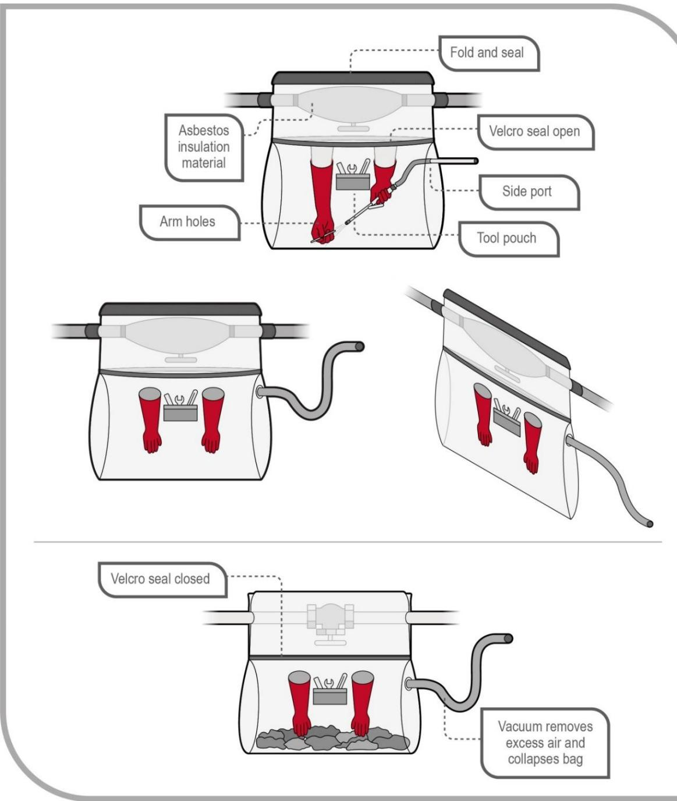  
Figure 8 Using a glove bag

# 6.3. Wrap and cut asbestos removal method

The 'wrap and cut' technique of removal produces the lowest levels of respirable asbestos fibres. This technique is used instead of full containment procedures when removing a small amount of non- friable asbestos or ACM which is in good condition and not damaged. This method is most appropriate when the entire component is to be removed, such as redundant plant and equipment covered with lagging.

The process below should be followed when using the wrap and cut removal technique:

The process below should be followed when using the wrap and cut removal technique:- The plant or equipment to be removed should be vacuumed with a HEPA- filtered H- Class industrial vacuum cleaner and/or wiped with damp rags or wet wipes (which should be disposed of as asbestos waste).- The plant or equipment should be double wrapped with heavy duty polyethylene sheeting (minimum  $200\mu \mathrm{m}$  thickness) and taped so that the asbestos is totally sealed within the polyethylene sheeting. The wrapped plant or equipment is cut from the rest of the plant and equipment using mechanical shears or oxy- cutting tools.- Only exposed metal can be cut and care should be taken to ensure the polyethylene sheeting is not punctured or melted. The cut section is then removed as asbestos waste.- If lagging has to be removed to allow a pipe to be cut, the glove bag removal method may be used to expose the metal at the point to be cut and for a sufficient length on either side. The pipe is then cut at the centre of the exposed section.- A P1 filtered respirator and disposable coveralls should be worn as a minimum while doing wrap and cut removal work. If the lagging is in very poor condition, such that significant airborne asbestos fibres might be generated, a higher level of respiratory protection may be required or the method of asbestos removal reconsidered.- On completion of the removal work, workers need to follow personal decontamination procedures and dispose of the waste according to asbestos waste disposal procedures (see section 4.8 of this Code).

# 7. Controls for specific asbestos removal work

Appendix E provides some additional examples of asbestos removal work.

# 7.1. Removing asbestos-contaminated soil

'Asbestos- contaminated soil comprises non- attached pieces of asbestos cement products and other material containing asbestos uncovered in soil during other work activities.

Contamination can be detected during building and road construction and excavation, waste disposal, damage following a severe weather event such as a hailstorm, weathering over time, or when asbestos is poorly handled or damaged during removal jobs.

A risk assessment by an independent licensed asbestos assessor or competent person, including contaminated site risk assessment practitioners, should determine the most appropriate control measures and remediation strategies.

Asbestos- contaminated soil is also subject to requirements of other regulatory agencies such as the EPA, public health departments and local governments. Where guidance on the assessment and remediation of contaminated sites is sought, the National Environment Protection (Assessment of Site Contamination) Measure 1999 (ASC NEPM) should be referred to. The contaminated sites are published by the NEPC (National Environment Protection Council) (NEPC).

Removal of asbestos from contaminated soil will require a Class A licensed asbestos removalist for any friable asbestos to be removed, or a Class B licensed asbestos removalist if more than  $10m^2$  of non- friable asbestos is to be removed. A person who does not have a licence can remove  $10m^2$  or less of non- friable asbestos. Where there is uncertainty as to whether the amount of non- friable asbestos is more or less than  $10m^2$  , a Class A or Class B licensed asbestos removalist should be engaged.

For all asbestos removal requiring a Class A asbestos removal licence, an air- monitoring program must be implemented to ensure the control measures do not release airborne asbestos fibre. When all visible asbestos has been removed, and the air- monitoring program indicates that the level of respirable asbestos fibres does not exceed 0.01 fibres/mL (10 per cent of the asbestos exposure standard), the independent licensed asbestos assessor must complete the clearance certificate.

All asbestos and any contaminated soil removed must be disposed of as asbestos waste according to the WHs Regulations (i.e. it must be contained and labelled in accordance with the GHS), the EPA and the requirements of the local licensed waste disposal facility.

# Immediate action

If the soil is suspected of containing asbestos, the person with management or control of the workplace should assume the soil contains asbestos and cease work immediately. A competent person should take samples of the material for analysis to confirm or refute that assumption.

If confirmed, the person with management or control of the workplace must ensure control measures are implemented to minimise the release of airborne asbestos. Control measures may include:

preparation of an asbestos management plan for the site

- setting the boundaries of the contamination as determined by an independent licensed asbestos assessor or competent person- ensuring there is minimal disturbance of the contaminated soil until the asbestos management procedures have been implemented- isolating and securing the removal work site using signs and barriers- controlling dust with dust suppression techniques (such as water and wetting agents)- providing PPE based on the level of contamination and the control measures implemented- sampling and/or air monitoring- providing education and training for workers on hazards and safe work practices to minimise airborne dust exposure, and- implementing decontamination procedures for the workers and the equipment.

# 7.2. Removing friable asbestos from hot surfaces

Friable asbestos in or on hot metal or machinery presents one of the worst conditions for removal, as airborne asbestos fibres can spread on convection currents in the air and the potential for burns is high.

Removal of asbestos from hot surfaces should be avoided. If possible, the removal should be scheduled and planned around shutdowns, with sufficient time being allowed for the metal or machinery to cool down before removal is attempted. Hot metal removal should be used only in emergency situations as the use of water sprays may create steam, making the removal task unsafe or more difficult.

In the limited circumstances where the dry removal of asbestos from hot surfaces is the only option (for instance in emergency situations), particular care should be taken in the selection of dust extraction equipment to cope with the convection currents involved, and the selection of appropriate PPE also becomes even more important.

Heat stress should be considered when preparing the asbestos removal control plan, particularly in the selection of PPE and the design of the work program.

Arrangements for the removal of asbestos from hot plant and equipment should be factored into the asbestos management plan for the workplace. This should include cooling requirements and/or the shutdown periods required to achieve adequate cooling.

# 7.3. Removing asbestos in plant and pipes or pits

Asbestos products include gaskets reinforced with asbestos that are used in plant and equipment between flanges on pipes to control the temperature and pressure. Asbestos rope was used for lagging pipes and valves and for sealing hatches. Asbestos is also found in friction products such as brake linings and cylinders.

It is likely that the asbestos in gaskets and rope and friction products will be friable asbestos and a Class A licensed asbestos removalist will be required to remove the asbestos using methods required or recommended for friable asbestos. For example, friable asbestos may be removed using the 'glove bag' or 'wrap and cut' method.

If the plant or equipment contains only non- friable asbestos a Class B licensed asbestos removalist can conduct the asbestos removal work. If  $10m^2$  or less of non- friable asbestos is being removed a person who does not hold an asbestos removal licence can undertake the asbestos removal work.

In the past, telecommunication pits were constructed using asbestos and when accessing these pits there is potential for exposure to airborne asbestos fibres at the access points. Installing or modifying telecommunication lines in these pits may require cutting and removal of asbestos or ACM. Where no other asbestos- related removal work is required and the asbestos is non- friable, a Class A or a Class B licensed asbestos removalist can remove the asbestos. If the amount of non- friable asbestos to be removed is less than  $10 \text{m}^2$  it may be removed by a person who does not have a licence.

# Appendix A-Glossary

Table 4 The meaning of key terms  

<table><tr><td>Key terms</td><td>Meaning</td></tr><tr><td>Airborne asbestos</td><td>Any fibres of asbestos small enough to be made airborne. For the purposes of monitoring airborne asbestos fibres, only respirable fibres are counted.</td></tr><tr><td>Asbestos</td><td>The asbestiform varieties of mineral silicates belonging to the serpentine or amphibole groups of rock-forming minerals, including actinolite asbestos, grunerite (or amosite) asbestos (brown), anthophyllite asbestos, chrysotile asbestos (white), crocidolite asbestos (blue) and tremolite asbestos, or a mixture of any of these.</td></tr><tr><td>Asbestos containing material (ACM)</td><td>Any material or thing that, as part of its design, contains asbestos.</td></tr><tr><td>Asbestos-contaminated dust or debris (ACD)</td><td>Dust or debris that has settled within a workplace and is (or is assumed to be) contaminated with asbestos.</td></tr><tr><td>Asbestos-related work</td><td>Work involving asbestos (other than asbestos removal work to which Part 8.7 of the WHS Regulations applies) that is permitted under the exceptions set out in regulation 419(3), (4) and (5).</td></tr><tr><td>Asbestos removalist</td><td>A person conducting a business or undertaking who carries out asbestos removal work.</td></tr><tr><td>Asbestos removal work</td><td>Work involving the removal of asbestos or ACM, or Class A asbestos removal work or Class B asbestos removal work as outlined in Part 8.10 of the WHS Regulations.</td></tr><tr><td>Competent person</td><td>In relation to carrying out clearance inspections of asbestos removal areas under WHS Regulation 473—a person who has acquired through training or experience the knowledge and skills of relevant asbestos removal industry practice and holds:
  
  – a certification in relation to the specified VET course for asbestos assessor work, or
  
  – a tertiary qualification in occupational health and safety, occupational hygiene, science, building, construction or environmental health. 
For all other purposes—a person who has acquired through training, qualification or experience, the knowledge and skills to carry out the task.</td></tr><tr><td>Duty holder</td><td>Any person who owes a work health and safety duty under the WHS Act including a person conducting a business or undertaking, a designer, manufacturer, importer, supplier, installer of products or plant used at work (upstream), officer or a worker.</td></tr></table>

<table><tr><td>Key terms</td><td>Meaning</td></tr><tr><td>Exposure standard</td><td>An exposure standard published by Safe Work Australia in the Workplace Exposure Standards for Airborne Contaminants.
For asbestos the exposure standard is a respirable fibre level of 0.1 fibres/mL of air measured in a person&#x27;s breathing zone and expressed as a time-weighted average fibre concentration calculated over an eight-hour working day and measured over a minimum period of four hours in accordance with:
– the Membrane Filter Method
– a method determined by the relevant regulator.</td></tr><tr><td>Friable asbestos</td><td>Material that is in a powder form or that can be crumbled, pulverised or reduced to a powder by hand pressure when dry, and contains asbestos.</td></tr><tr><td>GHS</td><td>The &#x27;Globally Harmonized System of Classification and Labelling of Chemicals, 7th revised edition, published by the United Nations as modified by Schedule 6 to the WHS Regulations.</td></tr><tr><td>Hazard</td><td>A situation or thing that has the potential to harm a person. Hazards at work may include: noisy machinery, a moving forklift, chemicals, electricity, working at heights, a repetitive job, bullying and violence at the workplace.</td></tr><tr><td>Health and safety committee</td><td>A consultative body established under the WHS Act. The committee&#x27;s functions include facilitating cooperation between workers and the person conducting a business or undertaking to ensure workers&#x27; health and safety at work, and assisting to develop work health and safety standards, rules and procedures for the workplace.</td></tr><tr><td>Health and safety representative</td><td>A worker who has been elected by their work group under the WHS Act to represent them on health and safety matters.</td></tr><tr><td>Licensed asbestos assessor</td><td>A person who holds an asbestos assessor licence.</td></tr><tr><td>Licensed asbestos removalist</td><td>A person conducting a business or undertaking who is licensed under the WHS Regulations to carry out Class A or Class B asbestos removal work.</td></tr><tr><td>May</td><td>&#x27;May&#x27; indicates an optional course of action.</td></tr><tr><td>Membrane filter method</td><td>The membrane filter method described in the National Occupational Health and Safety Commission&#x27;s Guidance Note on the Membrane Filter Method for Estimating Airborne Asbestos Fibres, 2nd Edition [NOHSC: 3003 (2005)].</td></tr><tr><td>Must</td><td>&#x27;Must&#x27; indicates a legal requirement exists that must be complied with.</td></tr></table>

<table><tr><td>Key terms</td><td>Meaning</td></tr><tr><td>Naturally occurring asbestos (NOA)</td><td>The natural geological occurrence of asbestos minerals found in association with geological deposits including rock, sediment or soil.</td></tr><tr><td>Non-friable asbestos</td><td>Material containing asbestos that is not friable asbestos, including material containing asbestos fibres reinforced with a bonding compound.</td></tr><tr><td>Officer</td><td>An officer under the WHS Act includes:
– an officer under section 9 of the Corporations Act 2001 (Cth)
– an officer of the Crown within the meaning of section 247 of the WHS Act, and
– an officer of a public authority within the meaning of section 252 of the WHS Act.
A partner in a partnership or an elected member of a local authority is not an officer while acting in that capacity.</td></tr><tr><td>Person conducting a business or undertaking (PCBU)</td><td>A PCBU is an umbrella concept which intends to capture all types of working arrangements or relationships. A PCBU includes a:
– company
– unincorporated body or association
– sole trader or self-employed person.
Individuals who are in a partnership that is conducting a business will individually and collectively be a PCBU.
A volunteer association (defined under the WHS Act) or elected members of a local authority will not be a PCBU.</td></tr><tr><td>Respirable asbestos fibre</td><td>An asbestos fibre that
– is less than 3 micrometres (μm) wide
– is more than 5 micrometres (μm) long, and
– has a length to width ratio of more than 3:1.</td></tr><tr><td>Risk</td><td>The possibility harm (death, injury or illness) might occur when exposed to a hazard.</td></tr><tr><td>Should</td><td>&#x27;Should&#x27; indicates a recommended course of action.</td></tr><tr><td>Volunteer association</td><td>A group of volunteers working together for one or more community purposes where none of the volunteers, whether alone or jointly with any other volunteers, employs any person to carry out work for the volunteer association.</td></tr><tr><td>Work group</td><td>A group of workers established to facilitate the representation of workers by one or more health and safety representatives. A work group may be all workers at a workplace but it may also be appropriate to split a workplace into multiple work groups where workers share similar work conditions or are exposed to similar risks and hazards. For example all workers on night shift.</td></tr></table>

<table><tr><td>Key terms</td><td>Meaning</td></tr><tr><td>Worker</td><td>Any person who carries out work for a person conducting a business or undertaking, including work as an employee, contractor or subcontractor (or their employee), self-employed person, outworker, apprentice or trainee, work experience student, employee of a labour hire company placed with a &#x27;host employer&#x27; or a volunteer.</td></tr><tr><td>Workplace</td><td>Any place where work is carried out for a business or undertaking and includes any place where a worker goes, or is likely to be, while at work. This may include offices, factories, shops, construction sites, vehicles, ships, aircraft or other mobile structures on land or water.</td></tr></table>

# Appendix B—Asbestos removal control plan contents

<table><tr><td></td><td>Buildings &amp;amp; structures</td><td></td><td>Plant &amp;amp; equipment</td><td></td></tr></table>

# Notification

<table><tr><td>Notification requirements have been met and required documentation will be on site (e.g. removal licence, control plan, training records)</td><td>Yes</td><td>Yes</td><td>Yes</td><td>Yes</td></tr></table>

# Identification

<table><tr><td>Details of asbestos to be removed identified (e.g. the locations, whether asbestos is friable/non-friable, its type, condition and quantity being removed)</td><td>Yes</td><td>Yes</td><td>Yes</td><td>Yes</td></tr></table>

# Preparation

<table><tr><td>Consult with relevant parties (health and safety representative; workers; person who commissioned the removal work, licensed asbestos assessors)</td><td>Yes</td><td>Yes</td><td>Yes</td><td>Yes</td></tr><tr><td>Assigned responsibilities for the removal</td><td>Yes</td><td>Yes</td><td>Yes</td><td>Yes</td></tr><tr><td>Program commencement and completion dates</td><td>Yes</td><td>Yes</td><td>Yes</td><td>Yes</td></tr><tr><td>Emergency plans</td><td>Yes</td><td>Yes</td><td>Yes</td><td>Yes</td></tr><tr><td>Asbestos removal boundaries, including the type and extent of isolation required and the location of any signs and barriers</td><td>Yes</td><td>Yes</td><td>Yes</td><td>Yes</td></tr><tr><td>Control of other hazards including electrical and lighting installations</td><td>Yes</td><td>Yes</td><td>Yes</td><td>Yes</td></tr></table>

<table><tr><td></td><td>Buildings &amp;amp; structures</td><td></td><td>Plant &amp;amp; equipment</td><td></td></tr><tr><td></td><td>Friable</td><td>Non-friable</td><td>Friable</td><td>Non-friable</td></tr><tr><td>PPE to be used, including RPE, identified</td><td>Yes</td><td>Yes</td><td>Yes</td><td>Yes</td></tr><tr><td>Removal</td><td></td><td></td><td></td><td></td></tr><tr><td>Details of air-monitoring program
Control and clearance</td><td>Yes</td><td>No</td><td>Yes</td><td>No</td></tr><tr><td>Waste storage and disposal program</td><td>Yes</td><td>Yes</td><td>Yes</td><td>Yes</td></tr><tr><td>Method for removing the asbestos (wet and dry methods)</td><td>Yes</td><td>Yes</td><td>Yes</td><td>Yes</td></tr><tr><td>Asbestos removal equipment (e.g. spray equipment, HEPA-filtered H-Class industrial vacuum cleaners, cutting tools)</td><td>Yes</td><td>Yes</td><td>Yes</td><td>Yes</td></tr><tr><td>Details of required enclosures, including their size, shape, structure, etc., smoke testing of enclosures and the location of negative pressure exhaust units</td><td>Yes</td><td>No</td><td>Yes</td><td>No</td></tr><tr><td>Details on temporary buildings required by the asbestos removalist (e.g. decontamination units) including details on water, lighting and power requirements, negative pressure exhaust units and the locations of decontamination units</td><td>Yes</td><td>May be required depending on the job</td><td>Yes</td><td>May be required depending on the job</td></tr><tr><td>Other risk control measures to prevent the release of airborne asbestos fibres from the asbestos removal work area</td><td>Yes</td><td>Yes</td><td>Yes</td><td>Yes</td></tr><tr><td>Decontamination</td><td></td><td></td><td></td><td></td></tr></table>

<table><tr><td></td><td colspan="2">Buildings &amp;amp; structures</td><td colspan="2">Plant &amp;amp; equipment</td></tr><tr><td></td><td>Friable</td><td>Non-friable</td><td>Friable</td><td>Non-friable</td></tr><tr><td>Detailed procedures for workplace decontamination, the decontamination of tools and equipment, personal decontamination and the decontamination of non-disposable PPE and RPE</td><td>Yes</td><td>Yes</td><td>Yes</td><td>Yes</td></tr></table>

# Waste disposal

<table><tr><td>Method of disposing of asbestos wastes, including details on:
- the disposal of protective clothing</td><td>Yes</td><td>Yes</td><td>Yes</td><td>Yes</td></tr><tr><td>- the structures used to enclose the removal area</td><td>Yes</td><td>No</td><td>Yes</td><td>Yes</td></tr></table>

# Clearance and air monitoring

<table><tr><td>Name of the independent licensed asbestos assessor or competent person engaged to conduct air monitoring (if any)</td><td>Yes</td><td>No</td><td>Yes</td><td>No</td></tr></table>

# Consultation

<table><tr><td>Consult with any people who may be affected by the removal work, including neighbours</td><td>Yes</td><td>Yes</td><td>Yes</td><td>Yes</td></tr></table>

# Appendix C—Respiratory protective equipment

When selecting RPE, you should also refer to AS/NZS 1715:2009: Selection, use and maintenance of respiratory protective equipment and AS/NZS 1716:2012: Respiratory protective devices.

The figures below provide examples of some respirators that can be used. The protection afforded by each device depends not only on the design and fit of the respirator but also upon the efficiency of the filters (for instance P1, P2 or P3). These figures are indicative only. In order to show the correct respirator fit, they do not show the use of hoods. Respirators must always be worn under a hood.

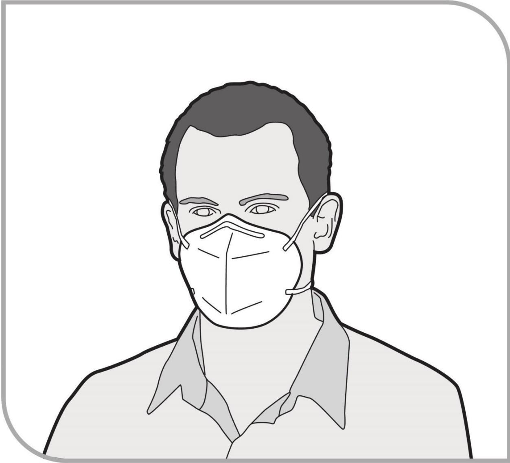  
Figure 9 Disposable, half-face particulate respirator

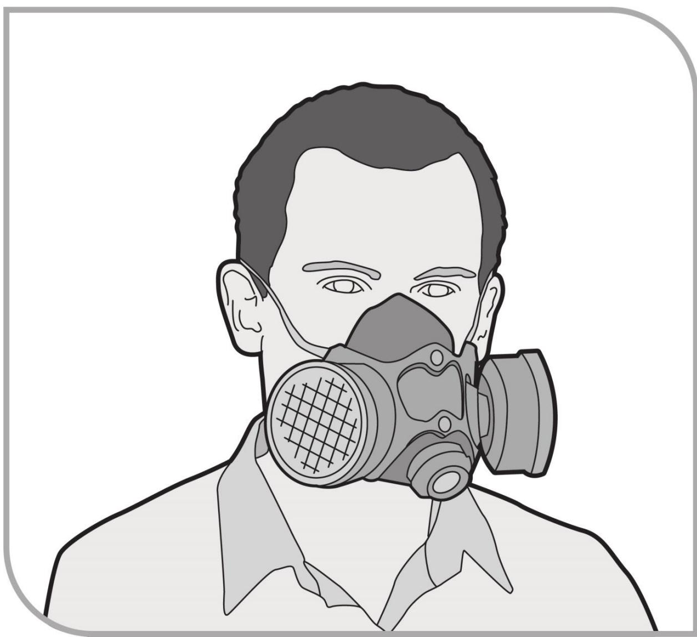  
Figure 10 Half-face particulate filter (cartridge) respirator

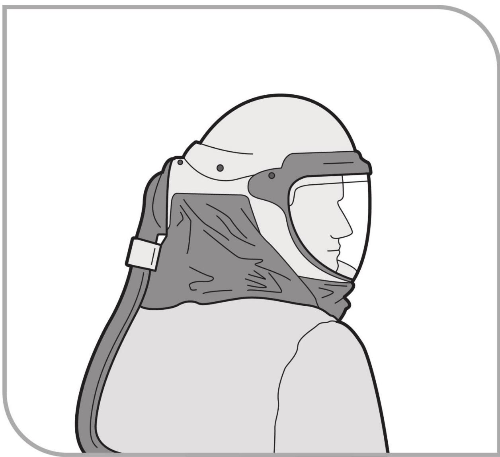  
Figure 11 Powered, air-purifying ventilated respirator

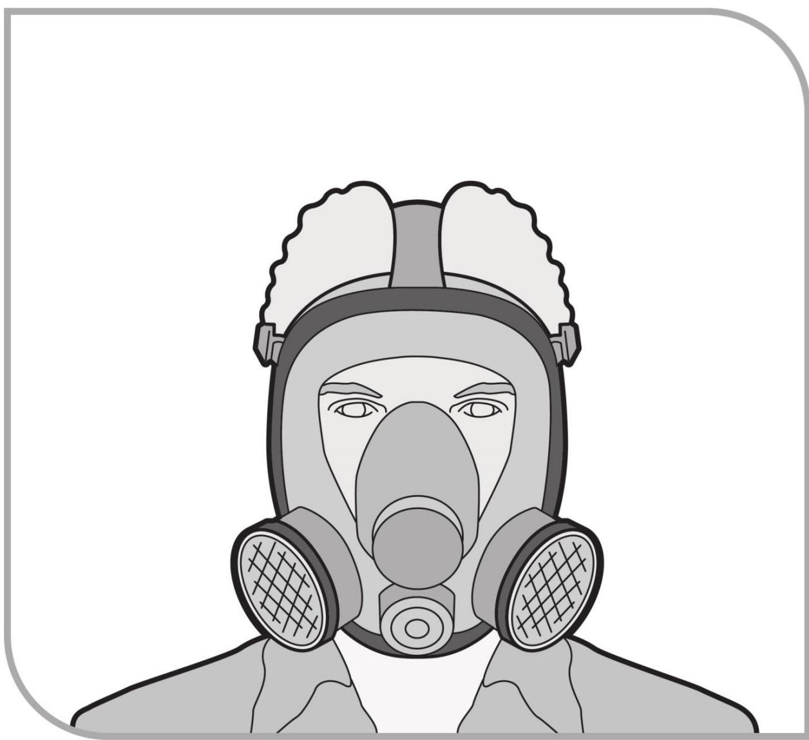  
Figure 12 Full-face, particulate filter (cartridge) respirator

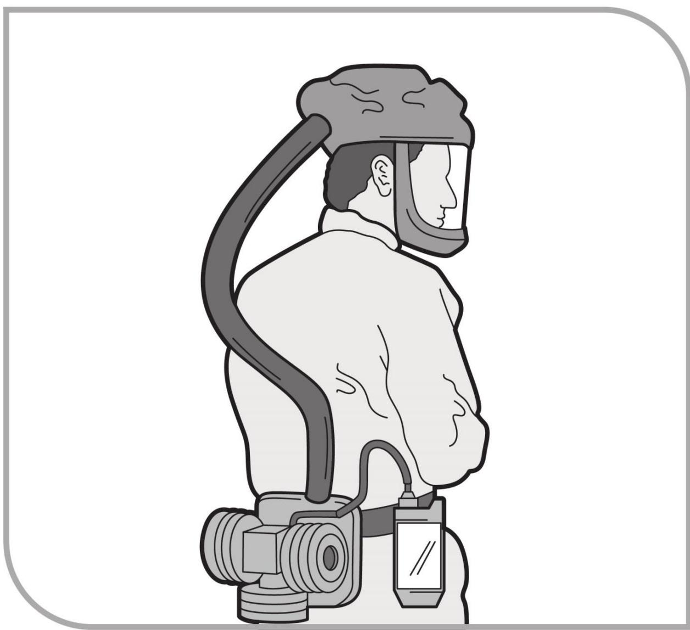  
Figure 13 Full-face, powered air-purifying particulate respirator

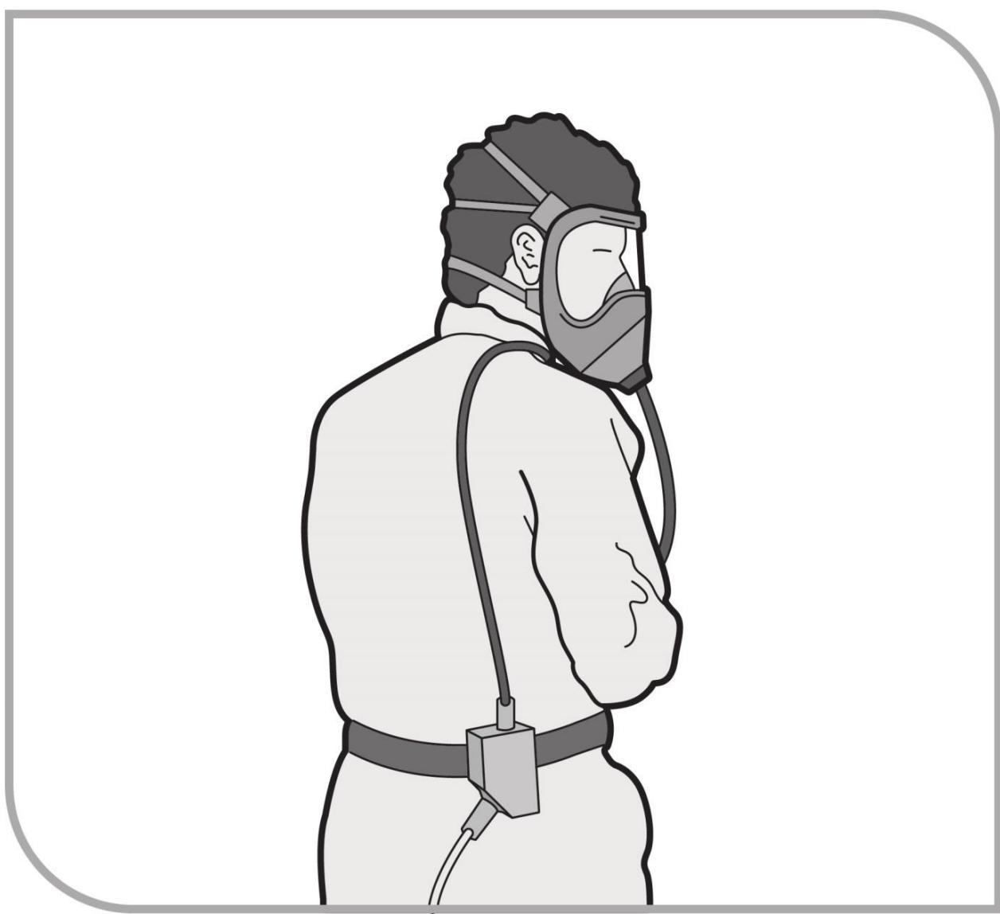  
Figure 14 Full-face, positive pressure demand air-line respirator

# Selection of RPE

The most efficient respirator and filter for the task should be used. Proper fit is critical; fitting a disposable half- face respirator can be difficult. Consideration should be given to upgrading to a non- disposable half- face respirator.

Table 5 provides guidance for the selection of appropriate respiratory protection for different tasks, assuming the correct work procedures are being followed. This table does not take into account personal features including facial hair or where glasses are worn. Full protection cannot be achieved if either of these factors interferes with the face seal.

Workers should be consulted on the selection of RPE to ensure individual fit and medical factors have been considered.

Table 5 Selecting RPE  

<table><tr><td>Work procedure</td><td>Required respirator</td><td>Filter type</td></tr><tr><td>Simple enclosure erection for containing undamaged asbestos materials to prevent damage—no direct handling but possible disturbance of asbestos</td><td>Disposable, half-face particulate respirators
OR
Half-face, particulate filter (cartridge) respirator</td><td>P1 or P2</td></tr><tr><td>Inspection of the condition of any installed friable asbestos, which appears in poor condition or has been disturbed</td><td>Disposable, half-face particulate respirators
OR
Half-face, particulate filter (cartridge) respirator</td><td>P1 or P2</td></tr><tr><td>Sampling material for the purpose of identifying asbestos</td><td>Disposable, half-face particulate respirators
OR
Half-face, particulate filter (cartridge) respirator</td><td>P1 or P2</td></tr><tr><td>Removal of non-friable asbestos (e.g. asbestos cement sheets, ceiling tiles and vinyl tiles)</td><td>Disposable, half-face particulate respirators
OR
Half-face, particulate filter (cartridge) respirator</td><td>P1 or P2</td></tr><tr><td>Extensive sample operations on friable asbestos</td><td>Full-face, particulate filter (cartridge) respirator</td><td>P3</td></tr><tr><td>Maintenance work involving the removal of small quantities of friable asbestos (e.g. replacement of friable asbestos gaskets and insulation)</td><td>Full-face, particulate filter (cartridge) respirator</td><td>P3</td></tr><tr><td>Certain forms of wet stripping in which wetting is prolonged and effective, and certain small-scale dry stripping operations</td><td>Full-face, powered air-purifying particulate respirator
OR
Full-face, positive pressure demand air-line respirator</td><td>P3</td></tr></table>

<table><tr><td>Work procedure</td><td>Required respirator</td><td>Filter type</td></tr><tr><td>Certain forms of dry stripping and ineffective wet stripping (light wetting, no time given to saturate)</td><td>Full-face, powered air-purifying particulate respirator
OR
Full-face, positive pressure demand air-line respirator
No lesser respirator will suffice</td><td>P3</td></tr><tr><td>Dry stripping in confined areas</td><td>Full suit or hood, positive pressure demand continuous flow air-line respirator
No lesser respirator will suffice</td><td>P3 only as a backup</td></tr></table>

# Fit testing of face pieces

The fit of a negative- pressure respirator to a worker's face is critical. A fit test, in accordance with AS/NZS 1715:2009: Selection, use and maintenance of respiratory protective equipment and the manufacturer's instructions, should be performed to assist in determining the respirator with the best fit for the individual worker immediately before commencing work and a fit check performed each time the respirator is to be used.

The performance of RPE depends on a good contact between the wearer's skin and the face seal of the mask so that the mask is tight- fitting, whether it is a face piece or a full mask. A good face seal can only be achieved if the wearer is clean- shaven in the region of the seal and the face piece is the correct size and shape to fit the wearer's face.

Workers using negative- pressure respirators should also be clean- shaven to ensure a good face seal. Workers with beards, stubble or facial hair should use a continuous- flow positive pressure respirator.

Workers wearing prescription glasses with side arms may not be able to use full- face respirators because of the loss of seal around the arms of the glasses. If their glasses cannot be modified so they do not need to be supported by the ears, these workers should not use full- face respirators and should wear air supply hoods instead. Ensure that these hoods will provide a sufficient level of protection.

Where the half- face respirator has been selected as providing the most appropriate protection and a seal or fit is not achievable from non- disposable respirators, a disposable respirator may be used.

To conduct a full- or half- face respirator fit check:

- close off inlet to filter- inhale gently- hold for 10 seconds, and- check that the face piece remains slightly collapsed, as it should be.

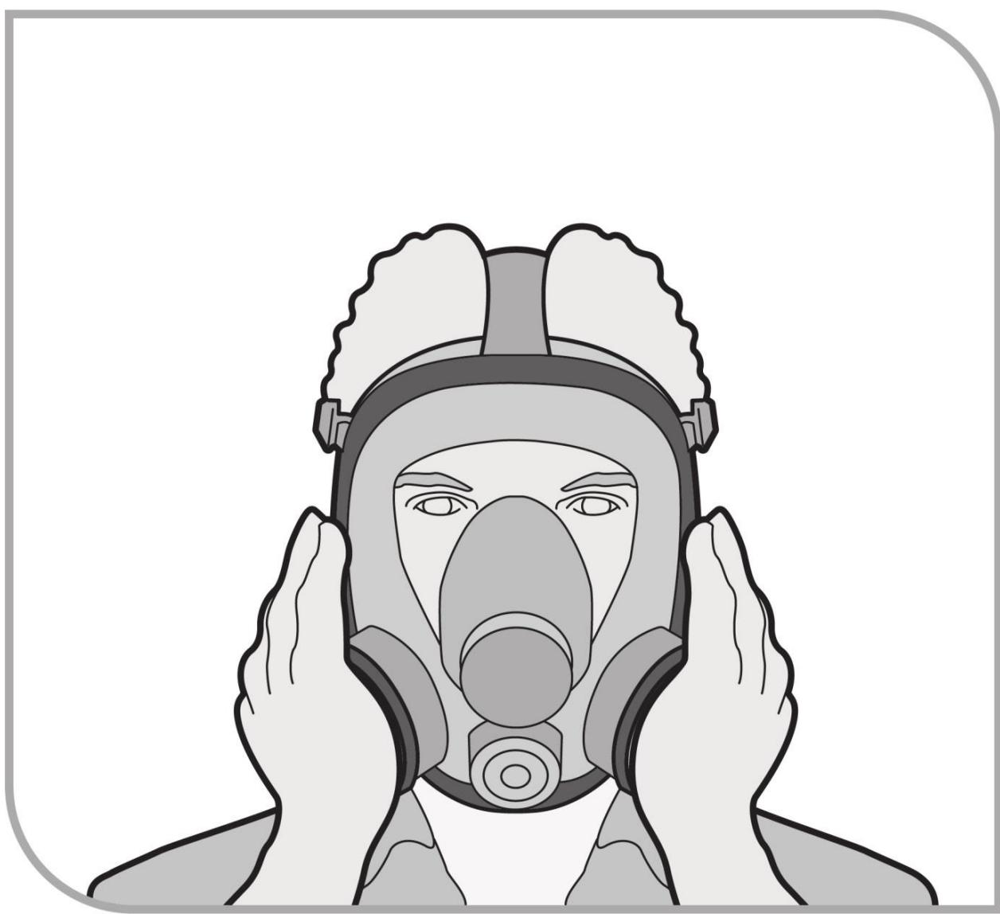  
Figure 15 Conducting a fit check for a full-face, particulate filter (cartridge) respirator

# Appendix D-Example of a clearance certificate

Where asbestos removal work requires a Class A licence, an independent licensed asbestos assessor must carry out a clearance inspection and complete a clearance certificate once they are satisfied that the area is safe to reoccupy.

# Section A-Clearance inspection details

<table><tr><td colspan="2">Details</td></tr><tr><td colspan="2">Client details</td></tr><tr><td>Name of client:</td><td>Click here to enter text.</td></tr><tr><td>Client contact details:</td><td>Click here to enter text.</td></tr><tr><td colspan="2">Removal work details</td></tr><tr><td>Date removal work carried out:</td><td>Click here to enter text.</td></tr><tr><td>Site address where removal work is being carried out:</td><td>Click here to enter text.</td></tr><tr><td>Details of the specific asbestos removal work area(s):</td><td>Click here to enter text.</td></tr><tr><td>Name of licensed asbestos removalist:</td><td>Click here to enter text.</td></tr><tr><td>Name and contact details of licensed asbestos removalist supervisor (if different to removalist):</td><td>Click here to enter text.</td></tr><tr><td colspan="2">Inspection details</td></tr><tr><td>Date of clearance inspection:</td><td>Click here to enter a date.</td></tr><tr><td>Time of clearance inspection:</td><td>Click here to enter text.</td></tr></table>

# Section B—Asbestos removal work paperwork

<table><tr><td></td><td>Yes</td><td>No</td></tr><tr><td>Do you have a copy of the asbestos removal control plan?</td><td>□</td><td>□</td></tr><tr><td>Do you have a copy of the notification form?</td><td>□</td><td>□</td></tr><tr><td>Is the removal work (e.g. use of enclosures, decontamination facilities, waste facilities) consistent with the control plan and the notification form?</td><td>□</td><td>□</td></tr></table>

# Section C—Asbestos removal work area

# 1. Visual inspection

<table><tr><td></td><td>Yes</td><td>No</td></tr><tr><td>Inspection of the specific area detailed in Section A found no visible asbestos remaining as a result of the asbestos removal work carried out.</td><td>□</td><td>□</td></tr><tr><td>Is air monitoring required? (if no, proceed to Section E)</td><td>□</td><td>□</td></tr><tr><td>Can the area be reoccupied?</td><td>□</td><td>□</td></tr><tr><td>Has additional information been attached? (e.g. photos, drawings, plans)</td><td>□</td><td>□</td></tr></table>

# 2. Air monitoring

<table><tr><td></td><td>Yes</td><td>No</td></tr><tr><td>Air monitoring was carried out as part of the clearance inspection. The result was below 0.01 fibres/mL.</td><td>□</td><td>□</td></tr><tr><td>Has the air-monitoring sample been analysed by a NATA-accredited laboratory or a laboratory approved by the WHS regulator?</td><td>□</td><td>□</td></tr><tr><td>Is the air-monitoring report attached?</td><td>□</td><td>□</td></tr><tr><td>Can the area be reoccupied?</td><td>□</td><td>□</td></tr></table>

# Section D-Enclosures

# 1. Prior to dismantling the enclosure

<table><tr><td></td><td>Yes</td><td>No</td></tr><tr><td>The area within the enclosure and the area immediately surrounding the enclosure were inspected and no visible asbestos was found.</td><td>□</td><td>□</td></tr><tr><td>Air monitoring was carried out as part of the clearance inspection. The result was below 0.01 fibres/mL.</td><td>□</td><td>□</td></tr><tr><td>Is the air-monitoring report attached?</td><td>□</td><td>□</td></tr><tr><td>Can the enclosure be dismantled?</td><td>□</td><td>□</td></tr></table>

Number of samples collected: Click here to enter text.

<table><tr><td>Sample 1</td><td>Sample 2</td><td>Sample 3</td><td>Sample 4</td><td>Sample 5</td></tr></table>

# Results

# 2. After the enclosure was dismantled and removed

<table><tr><td></td><td>Yes</td><td>No</td></tr><tr><td>An inspection of the area in which the enclosure was erected and the area immediately surrounding the area where the enclosure was erected was inspected and no visible asbestos was found.</td><td>□</td><td>□</td></tr><tr><td>Air monitoring was carried out as part of the clearance inspection. The result was below 0.01 fibres/mL.</td><td>□</td><td>□</td></tr><tr><td>Is the air-monitoring report attached?</td><td>□</td><td>□</td></tr><tr><td>Can the area be reoccupied?</td><td>□</td><td>□</td></tr></table>

Number of samples collected: Click here to enter text.

<table><tr><td>Sample 1</td><td>Sample 2</td><td>Sample 3</td><td>Sample 4</td><td>Sample 5</td></tr></table>

# Results

# Section E—Clearance declaration

I declare that:

- the former enclosure, asbestos removal work area and the surrounding area are free from any visible asbestos- the transit route and waste routes are free from any asbestos, and- all asbestos in the scope of the removal work has been removed and any known asbestos is intact.

Signature of licensed asbestos assessor/competent person

Assessor licence number (if applicable)

Name of licensed asbestos assessor/competent person

# Appendix E-Examples of asbestos removal work

This appendix does not address other hazards that may be present at a workplace, for example falls from heights or electrical hazards. These hazards must also be identified and the associated risks controlled.

This appendix provides guidance on how to perform a specific task associated with asbestos removal work. With all tasks, some general requirements include the following:

Obtain the asbestos register prior to commencing asbestos removal work. Depending on the type of asbestos removal work, follow the requirements outlined in Chapters 2- 4 of this Code (for example, laying polyethylene sheeting, isolating the work areas, signs and barricades, PPE, cleaning up site decontamination).

# Asbestos cement products

Asbestos cement products consist of approximately 15 per cent asbestos fibres by weight. A wide range of products have been commonly found—including roofing, shingles, exterior cladding on industrial, public and some residential premises, corrugated/profile sheets as well as flat sheets—that have been used for exterior flexible building boards.

If possible, you should remove the asbestos cement products whole. If some sections have been damaged prior to removal, these may be strengthened, for example by using adhesive (cloth or duct) tape. Applying water and PVA glue mixture to the damaged section may assist in minimising the release of asbestos fibres.

Identify the method by which the asbestos cement product is held in place, then use a method that would minimise airborne dust generation in removing the product. For example:

- fasteners: dampen then carefully remove using a chisel. 
- bolts: dampen then use bolt cutters (or an oxy torch)—do not use an angle grinder. 
- screws: dampen then carefully unscrew with a screwdriver. 
- nails: dampen then carefully lever the panel or punch through if absolutely necessary.

Avoid breaking the asbestos cement products. If breakage is absolutely necessary to remove or dislodge the product, dampen the material and minimise breakage.

Remove the asbestos cement product after wetting or dampening it by applying a fine water spray, unless this creates an electrical risk.

Once the asbestos cement product has been removed from its position, spray the back of the product with a fine water spray. Frequent application of a fine water spray may be required depending on the circumstances (for example on a very hot day) but be careful not to create a slip hazard.

Personal decontamination must be carried out in accordance with the WHS Regulations. See section 4.6 of this Code.

# Asbestos cement roof sheeting

Asbestos cement cement roof sheetingAsbestos cement can become brittle with age, so any removal work on roofs should address the risk of fall hazards. If lichen is encountered on roof sheeting, caution should be exercised in the use of water and the choice of workers' footwear because lichen can be slippery, especially when it is wet.

The removal of asbestos cement roof sheeting must be performed in accordance with the WHS Regulations.

Angle grinders should not be used because of the potential for damage to the asbestos cement and subsequent fibre release. Anchoring screws/bolts should be removed from the roof sheeting using an oxy torch or another suitable device, such as a screwdriver or cold chisel that will not significantly damage the sheet.

If the system of removal involves walking on the roof to remove roof sheeting (this should be the last option when choosing a method to remove roof sheeting), spray the asbestos cement roof sheeting with a PVA solution prior to removal. Ensure the PVA is dry before removing it so as to avoid a slip hazard. Once removed, spray the back (underside) of the asbestos cement with either a fine water spray or the PVA solution.

Where the asbestos roof sheeting requires lowering to the ground, ensure this is done in a manner that will minimise the generation of respirable dust. Do not use chutes, ramps or similar gravity- dependent devices. Examples of appropriate lowering methods for roof sheeting include:

by hand, over short distances loading the wrapped sheets on to a cradle for support using scissor lifts or similar devices, and using scaffolds.

You should follow the decontamination (section 4.6), waste containment and disposal procedures (section 4.8) in this Code once the asbestos roof sheeting has been removed.

Where the asbestos roof sheeting to be removed covers an area greater than the size of an average domestic house or where considerable dust will be generated, you should use a decontamination unit.

Ensure that clearance of the area has been completed and a clearance certificate has been issued prior to reoccupation of the area.

Personal decontamination must be carried out in accordance with the WHS Regulations. See Section 4.6 of this Code.

# Removal of floor tiles

Removal of floor tilesFlooring products such as polyvinyl chloride (PVC or vinyl) tiles often contain a few per cent (5–7 per cent) of very fine chrysotile asbestos. Black and brown thermoplastic tiles containing larger amounts of chrysotile, often in visible clumps, were also produced. Sheet floor coverings including sheet vinyl were sometimes backed with a thin layer of chrysotile paper. Some underfellts, such as hessian underlays for carpets and linoleum, were also manufactured containing asbestos. The mastics which were used to bond the floor covering to the surface could also contain asbestos. Some hard- wearing composite floors (for example magnesium oxychloride) also contain about 2 per cent of mineral fibres, which could be asbestos.

Place a tool (such as a scraper or wide blade) or use a heat gun between the tiles and lift the tile away from the floor, being careful to minimise breakage. A hammer or mallet can be used to tap the tool under firmly- adhered tiles to assist in separating the tiles from the floor.

Minimise dust by spraying fine water mist under tiles as they are lifted.

Place the tiles into heavy duty polyethylene sheeting (minimum  $200\mu m$  thickness) asbestos waste bag or suitable alternate waste container dedicated for asbestos waste that is clearly labelled as asbestos waste.

Use the scraper to remove any adhesive that is left adhered to the floor after each tile has been removed and place this waste into the asbestos waste bag or suitable waste container.

The vinyl can be cut into strips prior to its removal to facilitate bagging, or it can be rolled into one roll and wrapped securely with polyethylene sheeting, making sure it is totally sealed.

If a heat source is used to soften the adhesive beneath a vinyl tile, care should be taken not to scorch or burn the tile. Burning or scorching vinyl tiles can result in the release of toxic decomposition products and generate a fire hazard. In some cases, the adhesive may contain asbestos.

Follow decontamination (section 4.6), waste containment and disposal procedures (section 4.8) in this Code once the tiles have been removed.

Ensure that a clearance inspection of the area is conducted by a licensed asbestos assessor and a clearance certificate has been completed prior to reoccupation of the area.

Personal decontamination must be carried out in accordance with the WHs Regulations. See section 4.6 of this Code.

# Removing bituminous (malthoid) products

Bituminous (malthoid) products are generally regarded as non- friable and include bitumen products such as roofing felts and damp- proof courses that have been widely reinforced by the addition of asbestos, usually in the form of chrysotile paper. Bitumen- based wall and floor coverings were also produced.

Some mastics used to stick the bitumen products commonly had asbestos added to them for flexibility. Other sealants also had asbestos added to improve the performance of the product. When removing bituminous products:

- seal access points (for example skylights) with material such as heavy duty polyethylene sheeting (minimum  $200\mu m$  thickness) using adhesive (cloth or duct) tape- where there are exhaust vents from gasfired equipment in the area, it is dangerous to seal over them. Turn the gas off if possible- cut and remove manageable sections. Place cut pieces in a lined skip or wrap in polyethylene sheeting- remove adhering material by dampening and gently scraping. Consider using an HEPA-filtered H-Class industrial vacuum cleaner while scraping- remember that mastics are flexible and may require removal by using scraping and chipping tools. The pieces removed should be kept as intact as possible- if heating is used to soften the material to enable the material to be peeled, it is important not to burn the material, as this can release respirable asbestos fibres. Excessive heating is also likely to generate toxic fumes and gases and generate a fire hazard, and- collect all debris and dispose of waste according to the waste disposal procedures.

Personal decontamination must be carried out in accordance with the WHs Regulations. See section 4.6 of this Code.

# Removal of ceiling tiles

False ceiling tiles or suspended ceilings sometimes need to be removed so maintenance work can be performed. If asbestos has been used on structural materials above a false ceiling there could be contamination on the upper surface of the tiles.

The minimum RPE suitable for this operation is a P1 or P2 filter with a half- face piece respirator. If considerable amounts of asbestos dust or debris are likely to be involved, full- face air- purifying positive pressure respirators should be worn.

Any surface below the tiles that might be contaminated should be covered with heavy duty polyethylene sheeting (minimum  $200\mu m$  thickness).

The first tile should be lifted carefully to minimise the disturbance of any asbestos fibres. The top of each tile should be thoroughly vacuumed and wet wiped, where possible, prior to removing subsequent tiles.

Where non- asbestos ceiling tiles are to be re- used, they should be covered with polyethylene sheeting as they are removed from the ceiling to prevent further dust settling on them.

Wrap the asbestos ceiling tiles in a double layer of polyethylene sheeting.

Waste containment, disposal and a clearance inspection must be carried out in accordance with the WHS Regulations. See sections 4.8 and 3.10 of this Code.

Personal decontamination must be carried out in accordance with the WHS Regulations. See section 4.6 of this Code.

# Removal of gaskets and rope seals

Gaskets and rope seals containing asbestos are generally regarded as friable. If there is any doubt, advice should be sought from a person with knowledge and experience in dealing with asbestos.

Gaskets reinforced with asbestos were once used extensively in plant and equipment exposed to high temperatures and/or pressures. These gaskets were typically used between the flanges of pipes.

Asbestos rope was often used for lagging pipes and valves and for sealing hatches. It is likely gaskets and rope from plant and equipment will contain friable asbestos. When removing gaskets and rope seals:

- ensure the plant or equipment is shut down and isolated- dismantle the equipment carefully. Protect any other components with heavy duty polyethylene sheeting (minimum  $200\mu m$  thickness)- ensure the plant and equipment has been made safe (pipework emptied, electrical supply isolated and equipment shut down, etc.)- unbolt or unscrew the flange or dismantle the equipment- once accessible, dampen the asbestos with a fine water mist or similar. Continue dampening the asbestos as more of it is exposed/accessible- ease the gasket or rope seal away with the scraper and place into the asbestos waste container positioned directly beside/beneath it. Keep the area damp and scrape away any residue, and- consider using a HEPA filtered H-Class industrial vacuum cleaner while scraping.

Personal decontamination must be carried out in accordance with the WHS Regulations. See section 4.6 of this Code.

# Pipe lagging (small section)

Asbestos was widely used to insulate pipes, boilers and heat exchangers.

There are several types and forms of insulation, often with multi- layer construction. Preformed sections of asbestos insulation were made to fit the diameter of the pipe. These would be strapped on and calco- wrapped and sometimes painted (for example, 'Decadex' finish) or sealed with a hard plaster (often asbestos- containing) to protect against knocks and abrasion. Other types of asbestos- containing felts, blankets, tapes, ropes and corrugated papers were also used. For bends and joins, ensure the plant and equipment has been made safe (for example pipework emptied, electrical supply isolated and equipment shut down).

Set up/attach the glove bag and perform the removal work as described in section 6.2. Remove and dispose of waste according to the relevant parts of section 4.8.

Personal decontamination must be carried out in accordance with the WHs Regulations. See section 4.6 of this Code.

# Fire retardant material

Fire retardant material is normally a homogeneous coating sprayed or trowelled onto reinforced concrete or steel columns or beams as fireproofing. Sprays were also commonly used on the underside of ceilings for fireproofing and sound and thermal insulation in many high- rise premises. Warehouses and factories commonly had sprayed asbestos applied to walls, ceilings and metal support structures for fireproofing.

Some fire doors contained loose asbestos insulation sandwiched between the wooden or metal facings to give them the appropriate fire rating. Loose asbestos was also packed around electrical cables, sometimes using chicken wire to contain it.

Mattresses containing loose asbestos were widely manufactured for thermal insulation. Acoustic insulation has been provided between floors by the use of loose asbestos in paper bags, and in some areas near removal works it is known that loose asbestos has been used as a readily available form of loft insulation.

Asbestos textiles were manufactured for primary heat (for example insulation tapes and ropes) or fire protection uses (for example fire blankets, fire curtains and fire- resistant clothing). Asbestos textiles were also used widely as a reinforcing material in friction products and composites.

It will depend on where the fire retardant material is located and the quantity of the material as to how the removal process is conducted. However, the asbestos is friable and a Class A licensed asbestos removalist must perform the asbestos removal work.

An asbestos removal control plan must be developed.

Establish the extent of the removal area and move all items out of the area or cover them with heavy duty polyethylene sheeting (minimum  $200\mu m$  thickness) if they could be contaminated during the removal work. Develop an enclosure that allows smooth flow of air from the decontamination unit to the negative air units. In constructing the enclosure, pay particular attention to penetrations through the floor and ceiling/roof. Set up the enclosure and decontamination unit, and remove and dispose of asbestos. Ensure all air- conditioning equipment has been shut and isolated/blanked from this area.

- Maintain regular checks on the negative air unit and decontamination unit. An independent licensed asbestos assessor must conduct/control air monitoring throughout the asbestos removal work.- Clearance monitoring by an independent licensed asbestos assessor and the issue of a clearance certificate is required before re-entry into the removal work area.Personal decontamination must be carried out in accordance with the WHS Regulations. See section 4.6 of this Code.

Personal decontamination must be carried out in accordance with the WHs Regulations. See section 4.6 of this Code.

# Removal of asbestos-backed vinyl and millboard from beneath a vinyl floor

As asbestos millboard is typically 100 per cent asbestos and very friable, a full enclosure with negative air extraction units must be used for this type of asbestos removal work.

The asbestos millboard should be wetted down as the vinyl is peeled from the floor, preferably with the millboard attached. The vinyl can be cut into strips prior to its removal to facilitate bagging, or it can be rolled into one roll and wrapped securely with heavy duty polyethylene sheeting (minimum  $200\mu m$  thickness), making sure it is totally sealed. If the vinyl sheeting cannot be removed without leaving some of the asbestos millboard on the floor surface, the remaining asbestos millboard should be wetted down and, when thoroughly soaked, scraped off the floor surface.

Sufficient water should be used to dampen the asbestos millboard, but not so much that runoff or pools of contaminated water will occur.

If a heat source is used to soften the adhesive beneath a vinyl tile, care should be taken not to scorch or burn the tile. Burning or scorching vinyl tiles can result in the release of toxic decomposition products and generate a fire hazard.

Alternative removal methods should only be used if they do not result in excessive fibre release from the asbestos millboard and do not result in any additional hazard.

Personal decontamination must be carried out in accordance with the WHs Regulations. See section 4.6 of this Code.

# Amendments

The model Code of Practice: How to safely remove asbestos has been amended since its publication in April 2016, including a number of amendments agreed to in 2018 as part of a technical and usability review of the model Code. The current version, dated October 2018, incorporates all of those amendments.

Additional amendments were made to this model Code of Practice in July 2020 to reflect the adoption of the 7th revised edition of the GHS.