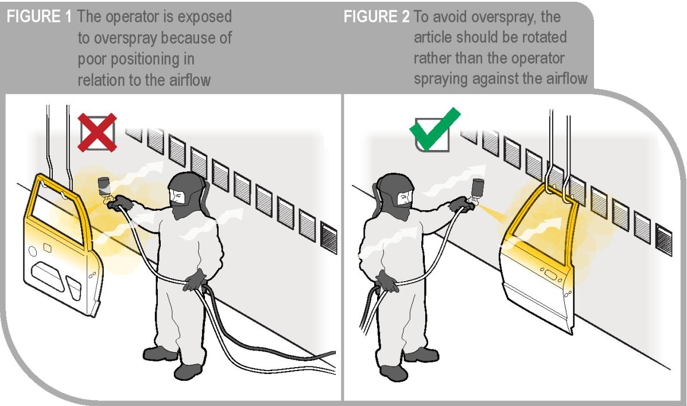
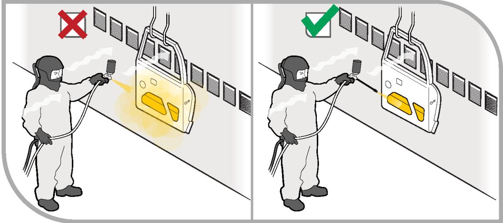
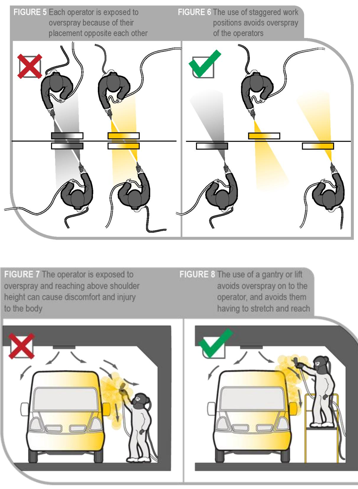
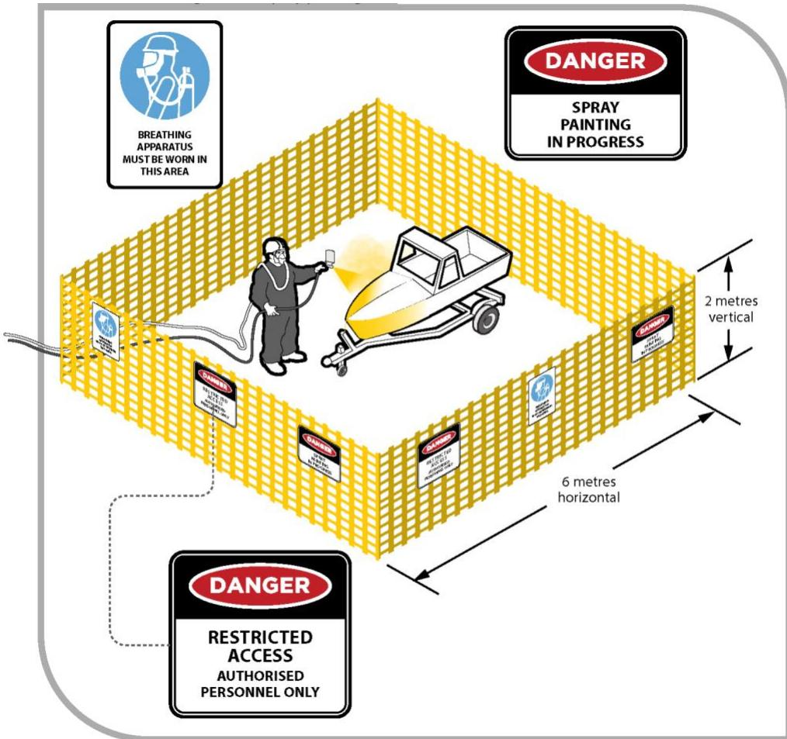
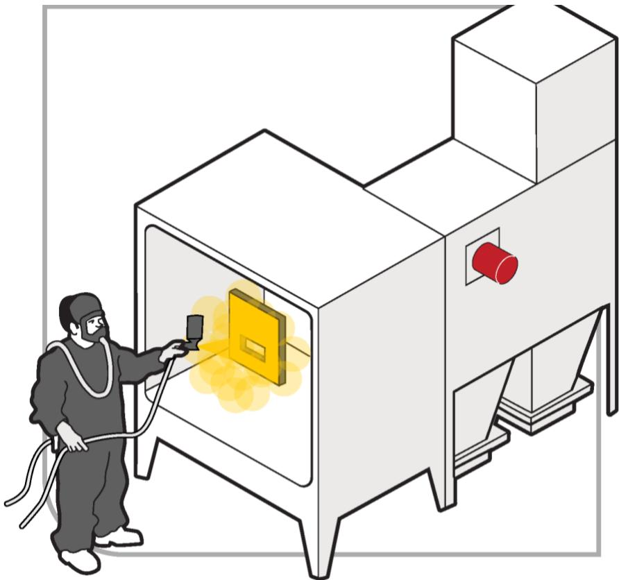

# Spray painting and powder coating

Code of Practice

# Disclaimer

Safe Work Australia is an Australian Government statutory agency established in 2009. Safe Work Australia includes Members from the Commonwealth, and each state and territory, Members representing the interests of workers and Members representing the interests of employers.

Safe Work Australia works with the Commonwealth, state and territory governments to improve work health and safety and workers' compensation arrangements. Safe Work Australia is a national policy body, not a regulator of work health and safety. The Commonwealth, states and territories have responsibility for regulating and enforcing work health and safety laws in their jurisdiction.

ISBN 978- 0- 642- 78423- 0 (PDF)  ISBN 978- 0- 642- 78424- 7 (DOCX)

# Creative Commons

This copyright work is licensed under a Creative Commons Attribution- Noncommercial 4.0 International licence. To view a copy of this licence, visit creativecommons.org/licenses In essence, you are free to copy, communicate and adapt the work for non- commercial purposes, as long as you attribute the work to Safe Work Australia and abide by the other licence terms.

# Contact information

Safe Work Australia | info@swa.gov.au | www.swa.gov.au

# Contents

Foreword 4

1. Introduction 5

1.1. What are spray painting and powder coating? 5  1.2. Who has health and safety duties in relation to spray painting and powder coating? 5  1.3. What is involved in managing risks associated with spray painting and powder coating? 7  1.4. Information, training, instruction and supervision 9

2. The risk management process 10

2.1. Identifying the hazards 10  2.2. Assessing the risks 11  2.3. Controlling the risks 15  2.4. Maintaining and reviewing control measures 15

# 3. Controlling the risks of spray painting and powder coating 17

3.1. Hazardous chemicals used in the workplace 17  3.2. Plant (machinery and equipment) hazards 21  3.3. Hazardous manual tasks 22  3.4. Fire and explosion 23  3.5. Working at height 25  3.6. Electricity or static electricity 25  3.7. Noise 27  3.8. Confined spaces 28  3.9. Heat and high humidity 28  3.10. Personal protective equipment (PPE) 29

# 4. Specific hazards and control measures 33

4.1. Spray painting 33  4.2. Powder coating 38

5. Health monitoring 43

Appendix A—Glossary 45

Appendix B—Sample risk assessment sheet 47

Appendix C—Spray painting exclusion zones and ventilation conditions 50

List of amendments 56

# Foreword

This Code of Practice on how to manage the risks associated with spray painting and powder coating is an approved code of practice under section 274 of the Work Health and Safety Act (the WHS Act).

An approved code of practice provides practical guidance on how to achieve the standards of work health and safety required under the WHS Act and the Work Health and Safety Regulations (the WHS Regulations) and effective ways to identify and manage risks.

A code of practice can assist anyone who has a duty of care in the circumstances described in the code of practice. Following an approved code of practice will assist the duty holder to achieve compliance with the health and safety duties in the WHS Act and WHS Regulations, in relation to the subject matter of the code of practice. Like regulations, codes of practice deal with particular issues and may not cover all relevant hazards or risks. The health and safety duties require duty holders to consider all risks associated with work, not only those for which regulations and codes of practice exist.

Codes of practice are admissible in court proceedings under the WHS Act and WHS Regulations. Courts may regard a code of practice as evidence of what is known about a hazard, risk, risk assessment or risk control and may rely on the code in determining what is reasonably practicable in the circumstances to which the code of practice relates. For further information see the Interpretive Guideline: The meaning of 'reasonably practicable'.

Compliance with the WHS Act and WHS Regulations may be achieved by following another method if it provides an equivalent or higher standard of work health and safety than the code.

An inspector may refer to an approved code of practice when issuing an improvement or prohibition notice.

# Scope and application

This Code is intended to be read by a person conducting a business or undertaking (PCBU). It provides practical guidance to PCBUs on how to manage health and safety risks associated with spray painting and powder coating.

This Code may be a useful reference for other persons interested in the duties under the WHS Act and WHS Regulations.

This Code applies to all workplaces covered by the WHS Act where spray painting and powder coating processes are carried out and where spray painting and powder coating products and equipment are used and stored.

# How to use this Code of Practice

This Code includes references to the legal requirements under the WHS Act and WHS Regulations. These are included for convenience only and should not be relied on in place of the full text of the WHS Act or WHS Regulations. The words 'must', 'requires' or 'mandatory' indicate a legal requirement exists that must be complied with.

The word 'should' is used in this Code to indicate a recommended course of action, while 'may' is used to indicate an optional course of action.

# 1. Introduction

# 1.1. What are spray painting and powder coating?

Spray painting, including electrostatic spray painting, is a process by which liquid paint is applied under pressure to an object. Spray painting may be carried out by hand or automatically.

There are several methods used to atomise the paint for spraying:

using a conventional air compressor where air is driven across the mouth of a small outlet under pressure to draw liquid paint out of the container and produce an air- paint mist from the nozzle of the spray- gun airless spray painting where the paint container is pressurised pushing the paint to the nozzle where it is atomised by the spray gun, and electrostatic spray painting where an electric pump drives the electrostatically charged liquid paint out of the nozzle which is then applied to the object which is earthed.

Powder coating is a process by which electrostatically charged powder is applied onto an earthed object.

Spray painting and powder coating are carried out in a variety of industries. For example, items that are commonly spray painted include motor vehicles, buildings, furniture, whitegoods, boats, ships, aircraft and machinery.

The processes involved in spray painting and powder coating are hazardous due to a combination of factors including the use, handling and storage of hazardous chemicals and exposure to electrical, noise, manual handling and plant hazards.

# 1.2. Who has health and safety duties in relation to spray painting and powder coating?

There are a number of duty holders who have a role in managing the risks of spray painting and powder coating. These include:

persons conducting a business or undertaking (PCBU) designers, manufacturers, importers, suppliers and installers of plant, substances or structures, and officers.

Workers and other persons at the workplace also have duties under the WHs Act, such as the duty to take reasonable care for their own health and safety at the workplace.

A person can have more than one duty and more than one person can have the same duty at the same time.

Early consultation and identification of risks can allow for more options to eliminate or minimise risks and reduce the associated costs.

# Person conducting a business or undertaking

# WHS Act section 19

Primary duty of care

A PCBU must eliminate risks arising from spray painting and powder coating, or if that is not reasonably practicable, minimise the risks so far as is reasonably practicable.

The WHS Regulations include more specific requirements for PCBUs to manage the risks of hazardous chemicals, airborne contaminants and plant, as well as other hazards associated with spray painting or powder coating activities such as noise and manual handling.

PCBUs have a duty to consult workers about work health and safety and may also have duties to consult, cooperate and coordinate with other duty holders.

Designers, manufacturers, importers and suppliers of plant, substances or structures

# WHS Act Part 2 Division 3

Further duties of persons conducting businesses or undertakings

Designers, manufacturers, importers and suppliers of plant or substances used in spray painting and powder coating processes must ensure, so far as is reasonably practicable, the plant or substance they design, manufacture, import or supply is without risks to health and safety. This duty includes carrying out testing and analysis as well as providing specific information about the plant or substance.

To assist in meeting these duties, the WHS Regulations require:

- manufacturers to consult with designers of the plant- importers to consult with designers and manufacturers of plant, and- the person who commissions construction work to consult with the designer of the structure.

# Officers

# WHS Act section 27

Duty of officers

Officers, for example company directors, have a duty to exercise due diligence to ensure the PCBU complies with the WHS Act and WHS Regulations. This includes taking reasonable steps to ensure the business or undertaking has and uses appropriate resources and processes to eliminate or minimise, risks from spray painting and powder coating. Further information on who is an officer and their duties is available in the Interpretive Guideline: The health and safety duty of an officer under section 27.

# Workers

# WHS Act section 28

Duties of workers

WorkersDuties of workersWorkers have a duty to take reasonable care for their own health and safety and to not adversely affect the health and safety of other persons. Workers must comply with reasonable instructions, as far as they are reasonably able, and cooperate with reasonable health and safety policies or procedures that have been notified to workers. If personal protective equipment (PPE) is provided by the business or undertaking, the worker must so far as they are reasonably able, use or wear it in accordance with the information and instruction and training provided.

# Other persons in the workplace

# WHS Act section 29

Duties of other persons at the workplace

Other persons at the workplace, like visitors, must take reasonable care for their own health and safety and must take care not to adversely affect other people's health and safety. They must comply, so far as they are reasonably able, with reasonable instructions given by the PCBU to allow that person to comply with the WHS Act.

# 1.3. What is involved in managing risks associated with spray painting and powder coating?

# WHS Regulations Part 3.1 Regulations 32-38

Managing Risks to Health and Safety

This Code provides guidance on how to manage the risks associated with spray painting and powder coating in the workplace using the following systematic process:

Identify hazards- find out what could cause harm. Assess risks, if necessary- understand the nature of the harm that could be caused by the hazard, how serious the harm could be and the likelihood of it happening. This step may not be necessary if you are dealing with a known risk with known controls. Eliminate risks so far as is reasonably practicable. Control risks- if it is not reasonably practicable to eliminate the risk, implement the most effective control measures that are reasonably practicable in the circumstances in accordance with the hierarchy of control measures, and ensure they remain effective over time. Review control measures to ensure they are working as planned.

Further guidance on the risk management process is available in the Code of Practice: How to manage work health and safety risks.

# Consulting workers

# WHS Act section 47

Duty to consult workers

A PCBU must consult, so far as is reasonably practicable, with workers who carry out work for the business or undertaking and who are (or are likely to be) directly affected by a health and safety matter.

This duty to consult is based on the recognition that worker input and participation improves decision- making about health and safety matters and assists in reducing work- related injuries and disease.

The broad definition of a 'worker' under the WHS Act means a PCBU must consult, so far as is reasonably practicable, with employees, contractors and subcontractors and their employees, on- hire workers, outworkers, apprentices, trainees, work experience students, volunteers and other people who are working for the PCBU and who are, or are likely to be, directly affected by a health and safety matter.

Workers are entitled to take part in consultations and to be represented in consultations by a health and safety representative who has been elected to represent their work group.

Consulting, cooperating and coordinating activities with other duty holders

# WHS Act section 46

Duty to consult with other duty holders

The WHS Act requires a PCBU to consult, cooperate and coordinate activities with all other persons who have a work health or safety duty in relation to the same matter, so far as is reasonably practicable.

There is often more than one business or undertaking involved in spray painting and powder coating, that may each have responsibility for the same health and safety matters, either because they are involved in the same activities or share the same workplace.

In these situations, each duty holder should exchange information to find out who is doing what and work together in a cooperative and coordinated way so risks are eliminated or minimised so far as is reasonably practicable.

For example, if a PCBU engages a contractor to carry out spray painting at a workplace then the PCBU must work together with the contractor to coordinate management of the risks associated with the spray painting work being carried out at that workplace.

Further guidance on consultation is available in the Code of Practice: Work health and safety consultation, cooperation and coordination.

# 1.4. Information, training, instruction and supervision

# WHS Act section 19

Primary duty of care

# WHS Regulation 39

Provision of information, training and instruction

The WHS Act requires that a PCBU ensure, so far as is reasonably practicable, the provision of any information, training, instruction or supervision that is necessary to protect all persons from risks to their health and safety arising from work carried out as part of the conduct of the business or undertaking.

The PCBU must ensure that information, training or instruction provided to a worker are suitable and adequate having regard to:

the nature of the work carried out by the worker the nature of the risks associated with the work at the time of the information, training and instruction, and the control measures implemented.

The PCBU must also ensure, so far as is reasonably practicable, that the information, training and instruction are provided in a way that is readily understandable for the workers to whom it is provided.

Workers must be trained and have the appropriate skills to carry out a particular task safely. Training should be provided to workers by a competent person.

Information, training and instruction provided to workers who carry out spray painting and powder coating activities should also include:

the proper use, wearing, storage and maintenance of personal protective equipment (PPE) how to work safely in hazardous environments, for example a confined space first aid and emergency procedures how to access safety data sheets (SDS) for hazardous chemicals, and the nature of, and reasons for, any health monitoring if required.

Training should be practical, and where relevant, include hands- on sessions, for example correctly setting up a spray zone or practising emergency procedures.

In addition to the PCBU's general duty to provide any supervision necessary to protect all persons from work health and safety risks, the WHS Regulations also impose specific duties to provide supervision necessary to protect a worker from risks to health and safety in certain circumstances, for example where the worker:

uses, generates or handles hazardous chemicals operates, tests, maintains, repairs or decommissions a storage or handling system for a hazardous chemical, or is likely to be exposed to a hazardous chemical.

The supervision must be suitable and adequate having regard to the risks associated with the spray painting or powder coating activity and the information, training and instruction required under WHS Regulation 39.

# 2. The risk management process

A risk assessment is not mandatory for spray painting and powder coating under the WHS Regulations. However, in many circumstances it will be the best way to determine the measures that should be implemented to control risks. It will help to:

identify which workers are at risk of exposure determine what sources and processes are causing that risk identify if and what kind of control measures should be implemented, and check the effectiveness of existing control measures.

Risk management is a systematic process to eliminate or minimise the potential for harm to people.

# 2.1. Identifying the hazards

The first step in the risk management process is to identify all hazards associated with spray painting and powder coating. This involves finding things and situations which could potentially cause harm to people. Hazards generally arise from the following aspects of work and their interaction:

physical work environment equipment, materials and substances used work tasks and how they are performed, and work design and management.

Hazards may be identified by looking at the workplace and how work is carried out. It is also useful to talk to workers, manufacturers, suppliers and health and safety specialists and review relevant information, records and incident reports. Potential hazards may also be identified through:

inspecting the materials and equipment that will be used during the spray painting or powder coating process, and reading product labels, SDS and manufacturers' instruction manuals.

Table 1 lists the common hazards associated with spray painting or powder coating.

Table 1 Examples of common hazards associated with spray painting and powder coating  

<table><tr><td>Hazard</td><td>Potential harm</td><td>Examples</td></tr><tr><td>Hazardous chemicals</td><td>- dermatitis, respiratory illnesses and cancers
- some hazardous chemicals are also fire and explosion risks</td><td>paints, solvents, adhesives, resins, rust removers, rust converters, lacquers and degreasers</td></tr><tr><td>Plant (machinery and equipment)</td><td>- injection injuries; being caught by moving parts of machinery can cause fractures, bruises, lacerations, dislocations, permanent injuries or death</td><td>spray booths, sanding, grinding equipment, airless spray equipment, compressed air</td></tr></table>

<table><tr><td>Hazard</td><td>Potential harm</td><td>Examples</td></tr><tr><td>Hazardous manual tasks</td><td>- overexertion, sustained awkward postures or repetitive movement can cause muscular strain</td><td>repetitive spraying action, lifting and pushing objects into place</td></tr><tr><td>Fire and explosion</td><td>- serious burns and death
- exposure to projectiles and damage to property</td><td>flammable paints and solvents in contact with an ignition source; combustible dusts used in powder coating</td></tr><tr><td>Working at height</td><td>- falling objects, falls, slips and trips can cause fractures, bruises, lacerations, dislocations, concussion, permanent injuries or death</td><td>spray painting at height or of trucks, ships, aeroplanes or bridges</td></tr><tr><td>Electricity or static electricity</td><td>- exposure to electricity can cause shock, burns or death from electric shock
- electricity and static electricity are also sources of ignition for combustible dusts and hazardous atmospheres</td><td>using electrical equipment; wiring of and within equipment; electrostatic charges</td></tr><tr><td>Noise</td><td>- exposure to loud noise can cause permanent damage to hearing</td><td>noise from pumps, compressors and spray booths</td></tr><tr><td>Confined spaces</td><td>- exposure to hazardous chemicals, unsafe oxygen levels, potential for fire, explosion and engulfment</td><td>spraying inside the cavity of ships, aircraft or tanks</td></tr><tr><td>Heat or high humidity</td><td>- exposure to heat or high humidity can cause burns, heat stroke and fatigue</td><td>wearing impervious PPE, working outdoors or in a poorly ventilated workplace</td></tr></table>

# 2.2. Assessing the risks

A risk assessment involves considering what could happen if someone is exposed to a hazard and the likelihood of it happening. A risk assessment can help you determine:

- how severe a risk is- whether any existing control measures are effective- what action you should take to control the risk, and- how urgently the action needs to be taken.

Hazards have the potential to cause different types and severities of harm, ranging from minor discomfort to a serious injury or death. For example, exposure to chemicals used in spray painting or powder coating activities can adversely affect a worker's health in ways ranging from minor illness such as headaches, to major illness such as asthma and cancer.

Many liquid and powder paints contain flammable substances. Spray painting vapours and mists and powder paints used in powder coating can spread rapidly, particularly in an enclosed space, and create a potentially explosive atmosphere. If the aerosol, mist, vapour or powder paint is ignited, for example by static electricity, open flame, a lit cigarette or spark, it could result in an explosion that could destroy the building and kill or injure anyone nearby.

Many hazards and their associated risks are well known and have well established and accepted control measures. In these situations, the second step to formally assess the risk is not required. If after identifying a hazard you already know the risk and how to control it effectively, you may simply implement the controls.

A risk assessment may be appropriate to reuse in situations where all the hazards, tasks, things or circumstances are the same and no worker or other person will be exposed to greater, additional or different risks.

In some circumstances, a risk assessment will assist to:

- identify which workers are at risk of exposure- determine what sources and processes are causing the risk- identify if and what kind of control measures should be implemented, and- check the effectiveness of existing control measures.

The nature and severity of risks will depend on various factors, including the:

- properties of the paints and other substances being used- surface coating of the items being painted or coated  
- for example whether they contain lead or other toxic materials- equipment being used- conditions under which the spray painting or powder coating is carried out  
- for example in confined or restricted spaces, and- skills, competence and experience of the worker.

The following questions may help to assess the risk:

- How often, and for how long, will exposure to the hazard occur?- In the event of exposure to the hazard, will the outcome be severe, moderate or mild?- How do workers interact with the hazard?  
- for example are they being exposed to hazardous chemicals by breathing it in or skin contact?- Is there evidence of exposure?  
- for example are dust or fumes visible in the air, are there chemical odours, spills, splashes?- What are the conditions under which spray painting is carried out?  
- for example in a spray booth or in a partially or enclosed space?- What are the skills, competence and experience of the operator?

Further guidance on the risk management process and the hierarchy of control measures is available in the Code of Practice: How to manage work health and safety risks.

# Assessing the risks of hazardous chemicals

As a PCBU, once you have listed all the hazardous chemicals used in each stage of the spray painting or powder coating activity, you should review the information on the labels and safety data sheets (SDS) to determine the nature and severity of the harm. Depending on the chemical, the severity of the harm could range from minor to major, for example from minor skin irritation to chronic lung disease or cancer.

Using information found in the label and SDS, spray painting and powder coating chemicals, mixtures or materials can be put into three hazard categories as shown in Table 2 below. Many chemicals that are used in spray painting, including two- part polyurethane paints, contain isocyanates and toluene (an ingredient in many oil- based paints), and in powder coating, triglycidyl isocyanurate, hydrofluoric acid and chromic acid are known hazardous chemicals. These chemicals are known to present significant health risks and should be assessed as high risk.

Table 2 Hazard categories of spray painting or powder coating chemicals, mixture and materials  

<table><tr><td>Risk</td><td>Examples</td></tr><tr><td>High risk</td><td>A chemical should be considered high risk if it is:
– carcinogenic
– mutagenic, genotoxic or has reproductive hazards
– affects the central nervous system (including affecting hearing due to ototoxic effects¹)
– a skin or respiratory sensitiser or if it is corrosive or has acute irritant effects
– a chemical which causes severe effects after a single, repeated or prolonged exposure, or
– a flammable liquid, vapour or aerosol.</td></tr><tr><td>Medium risk</td><td>A chemical should be considered medium risk if it is:
– or contains an organic solvent that is not already assessed as high risk
– a flammable liquid, or
– a combustible dust.</td></tr><tr><td>Low risk</td><td>A chemical should be considered low risk if it does not meet the above considerations.</td></tr></table>

The level of risk depends not only on the toxicity or flammability of the hazardous chemical but also on the nature of exposure. This may include frequency of use, quantities used, effectiveness of existing controls (such as exhaust or ventilation systems) and the processes involved at the workplace. For example, some spray painting processes may be more suitable than others when attempting to minimise the exposure of a hazardous chemical or the risk of fire (see Table 3).

Further guidance on managing risks associated with hazardous chemicals is available in the Code of Practice: Managing risks of hazardous chemicals in the workplace.

Table 3 Characteristics of spray painting and powder coating activities  

<table><tr><td>Process</td><td>Characteristics</td></tr><tr><td>Conventional compressed air (low pressure) spray painting</td><td>- extensive overspray of potentially hazardous chemicals
- bounce of potentially hazardous chemicals in cavities and at corners (rebound)</td></tr><tr><td>Airless (high pressure) spray painting</td><td>- risk of injection injury and static electricity that could cause a spark
- less overspray, bounce and aerosol than conventional air spraying
- relatively high viscosity paints can be used (less solvent is needed in the paint)
- higher capacity (flow rate) and faster application</td></tr><tr><td>Air assisted airless spray painting</td><td>- risk of injection injury
- less aerosol and overspray than conventional air spraying</td></tr><tr><td>Hot spraying</td><td>- increase of potential for fire or explosion
- uses very little thinner
- reduced overspray</td></tr><tr><td>Pressure pots</td><td>- risk from over pressurisation (pressure should be released before opening to refill)
- potential for vessel damage and incorrectly fitted hoses and couplings
- awkward hazardous manual tasks
- more solvents used in maintenance</td></tr><tr><td>Powder coating</td><td>- high risk chemicals are used in surface preparation including chromates and hydrofluoric acid
- risk of exposure to airborne particulates and static electricity
- spray guns are heavier and more difficult to handle</td></tr></table>

The nature of spray painting or powder coating activities can vary according to the object being sprayed. When assessing risk, consider:

how the object is positioned in relation to the worker and other people how the size and shape of the object and the direction of the stream of ventilating air influences how coating is applied how easy the object is to move, and whether work systems and plant could be improved.

Appendix B contains an example of a risk assessment that can be used as guidance when assessing the risks involved with spray painting or powder coating activities.

# 2.3. Controlling the risks

# Hierarchy of control measures

Hierarchy of control measuresThe WHS Regulations require duty holders to work through the hierarchy of control measures when managing certain risks; however, it can be applied to any risk. The hierarchy ranks control measures from the highest level of protection and reliability to the lowest. Further guidance on the risk management process and the hierarchy of control measures is in the Code of Practice: How to manage work health and safety risks.

# Eliminating the risk

You must always aim to eliminate the risk. If eliminating the hazards and associated risks is not reasonably practicable, you must minimise the risk by one or more of the following:

- Substitution--minimise the risk by substituting or replacing a hazard or hazardous work practice with something that gives rise to a lesser risk. For example using a:

water- based paint instead of an organic solvent based coating brush or roller instead of a spray gun triglycidyl isocyanurate (TGIC)- free powder coating high volume low pressure (HVLP) sprayer rather than an airless sprayer, or low hazard cleaning solvent.

Isolation- - minimise the risk by isolating or separating the hazard or hazardous work practice from any person exposed to it. For example, conducting spray painting in a spray booth to isolate workers from airborne contaminants.

Engineering controls- - engineering controls are physical control measures to minimise risk. For example, using ventilation systems to reduce exposure to vapours and aerosols.

If risk remains, it must be minimised by implementing administrative controls, so far as is reasonably practicable. For example, you could restrict access to spray painting areas or keep the quantity of hazardous chemicals to a minimum in the spray painting area.

Any remaining risk must be minimised with suitable personal protective equipment (PPE). For example, breathing protection, gloves, aprons and protective eyewear.

Administrative control measures and PPE do not control the hazard at the source. They rely on human behaviour and supervision and used on their own tend to be the least effective in minimising risks.

Chapters 3 and 4 of this Code provide information on control measures for spray painting and powder coating activities.

# 2.4. Maintaining and reviewing control measures

Control measures must be maintained so they remain fit for purpose, suitable for the nature and duration of work and installed, set up and used correctly.

The control measures put in place to protect health and safety should be regularly reviewed to make sure they are effective. Checking effectiveness may involve, for example, air monitoring to measure the concentration of crystalline silica in the worker's breathing zone during the abrasive blasting process. If the control measure is not working effectively it must be revised to ensure it is effective in controlling the risk.

You must review and as necessary revise control measures so as to maintain, so far as is reasonably practicable, a work environment that is without risks to health or safety. For example:

the control measure does not control the risk it was implemented to control so far as is reasonably practicable before a change at the workplace that is likely to give rise to a new or different risk to health and safety that the measure may not effectively control a new relevant hazard or risk is identified the results of consultation indicate that a review is necessary, or a health and safety representative requests a review if that person reasonably believes that: a circumstance in any of the above points affects or may affect the health and safety of a member of the work group represented by the health and safety representative the control measure has not been adequately reviewed in response to the circumstance.

For example, this may involve air monitoring to measure the concentration of solvents in the worker's breathing zone, or reviewing paint mist clearance times following the introduction of spray booths. If the control measure is not working effectively it must be revised.

Common review methods include workplace inspection, consultation, testing and analysing records and data.

You can use the same methods as in the initial hazard identification step to check control measures. You must also consult your workers and their health and safety representatives and consider the following questions:

- Are the control measures working effectively in both their design and operation?- Have the control measures introduced new problems?- Have all hazards been identified?- Have new work methods, new equipment or chemicals made the job safer?- Are safety procedures being followed?- Have the instruction and training provided to workers on how to work safely been successful?- Are workers actively involved in identifying hazards and possible control measures?- Are they openly raising health and safety concerns and reporting problems promptly?- Are the frequency and severity of health and safety incidents reducing over time?- If new legislation or new information becomes available, does it indicate current control measures may no longer be the most effective?

If problems are found, go back through the risk management steps, review your information and make further decisions about controlling the risk.

# 3. Controlling the risks of spray painting and powder coating

This chapter provides an overview of the common hazards associated with spray painting and powder coating and the control measures that can be used to manage them.

Chapter 4 provides more specific and detailed information on the hazards and control measures with separate sections for both spray painting and powder coating.

# 3.1. Hazardous chemicals used in the workplace

Exposure to hazardous chemicals is a significant risk in spray painting and powder coating activities including during preparation (preparing surfaces, tinting, mixing and pouring paints), storage, clean- up and disposal.

The hazardous chemicals that workers may be exposed to include paints, solvents, powders, lacquers, paint strippers, adhesives, surface preparation products, rust converters and rust removers. In most cases the product label and safety data sheet (SDS) will identify any hazardous chemicals.

As the person conducting the business or undertaking (PCBU), you should also identify any dusts or fumes generated by sanding and surface preparation. For example, sanding polyurethane paints that are not fully cured can generate dust containing unreacted isocyanates that can lead to long- term respiratory problems.

# WHS Regulation 351

Management of risks to health or safety

# WHS Regulation 382

Using, handling and storing restricted hazardous chemicals

You must manage risks to health and safety associated with using, handling, generating or storing a hazardous chemical at the workplace.

The WHS Regulations prohibit and restrict the use of some hazardous chemicals. The following chemicals must not be used, handled or stored for spray painting:

- arsenic- arsenic compounds- benzene (benzol), if the substance contains more than one per cent by volume- carbon disulphide (carbon bisulphide)- lead carbonate- methanol (methyl alcohol), if the substance contains more than one per cent by volume- tetrachloroethane- tetrachloromethane (carbon tetrachloride), and- tributyl tin.

# Isocyanates

IsocyanatesLabels and SDS should be checked to determine if the products you are using contain isocyanates.

Isocyanates are commonly found in two- pack liquid spray paints, varnishes, adhesives and polyurethane plastics. Isocyanate polymers may also be present in paints including:

- polyisocyanate- isocyanate pre-polymer- isocyanate polymer, and- polymerised isocyanates

Exposure can occur when aerosols, mists or powder paints containing isocyanates are released into the atmosphere during spraying or powder coating. Exposure to isocyanates can also occur during sanding of polyurethane paint that is not fully cured, as this activity can generate dusts containing un- reacted isocyanates. Further, isocyanate- containing materials may release isocyanates into the atmosphere when heated.

Exposure to isocyanates should be considered as high risk.

As a PCBU, you must provide health monitoring to workers carrying out ongoing work using, handling, generating and storing isocyanates where there is a significant risk to the worker's health because of isocyanate exposure. Health monitoring is further discussed in Chapter 5.

Further guidance about isocyanates can be found in the Safe Work Australia Guide to handling isocyanates.

# Lead

Workers who carry out surface preparation (for example preparing old vehicles for spray painting) could be exposed to lead when removing and sanding lead- based paints.

Paint which contains lead can no longer be purchased in Australia and the use of lead- free paints will eventually eliminate exposure to lead and the associated risks.

The WHs Regulations contain specific requirements for working with lead including the identification of lead risk work, health monitoring of workers carrying out lead risk work, and removing a worker from lead risk work in certain circumstances.

# Identifying the hazards of spray painting and powder coating chemicals

The health effects that a worker may experience following exposure to hazardous chemicals can become apparent after a short period of time and include headaches, nausea or vomiting, dizziness, burns to the skin or eyes and irritation to the nose, throat and lungs. Serious long- term health effects caused by exposure to hazardous chemicals with symptoms that may not be immediately apparent can also occur. Long- term health effects include asthma, dermatitis, kidney or liver damage, cancer and damage to the reproductive system and central nervous system.

Many chemicals used in spray painting and powder coating also have physicochemical hazards. For example, many organic solvents are flammable and some chemicals used for cleaning or surface preparation may be corrosive.

Information about the hazards of chemicals is available from labels and safety data sheets (SDS). A SDS includes information on the health effects, physicochemical properties, safe handling and storage, emergency procedures, and disposal considerations. It also contains information about how hazardous chemicals can enter the body, for example by inhalation into the lungs, absorption through the skin and eyes and through swallowing, including accidently ingesting small amounts.

If you don't have a SDS for a hazardous chemical supplied to your workplace, you must get one from the manufacturer, importer or supplier of the chemical. You should also consider

getting a current SDS before you decide to purchase a new chemical as it is useful to identify hazards before you introduce them into your workplace.

# Information on labels and safety data sheets

Manufacturers, importers and PCBUs all have duties under the WHS Regulations to ensure hazardous chemicals are correctly labelled. These duties are discussed further in the Code of Practice: Labelling of workplace hazardous chemicals.

The purpose of a label is to ensure the contents of a container can be readily identified. The label also includes information on the hazards of the chemical and precautions to be observed to safely use, handle or store the hazardous chemical.

The information on labels and SDS is provided in the form of signal words, hazard pictograms and precautionary statements. You and your workers should always read the label and the SDS before using a hazardous chemical.

In situations where hazardous chemicals are decanted into another container and it will not be used immediately or it is supplied to someone else for later use, then the container should be labelled in accordance with the Code of Practice: Labelling of workplace hazardous chemicals. However, if a decanted hazardous chemical will be used immediately, labelling of its container is not required under the WHS Regulations.

# Hazardous chemical register

A hazardous chemicals register is a list of hazardous chemicals at your workplace, accompanied by the current SDS for each chemical. This could include any paints, coatings, solvents and thinners, fillers, strippers and cleaning products. The purpose of this register is to provide a source of information for you, your workers and anyone else affected by a hazardous chemical, and to assist in the management of substances used or generated in spray painting or powder coating activities.

A hazardous chemicals register is required under the WHS Regulations to be prepared and kept up to date so that information about chemicals stored, handled or used at the workplace can be easily found.

The register must be readily accessible to anyone in the workplace who is likely to be affected by a chemical and workers who are involved in using, handling or storing a chemical in the register.

For more information see the Safe Work Australia Hazardous chemicals register fact sheet.

Control measures for hazardous chemicals in the workplace

Exposure standards

# WHS Regulation 49

Ensuring exposure standards for substances and mixtures not exceeded

You must ensure that no person at the workplace is exposed to a substance or mixture in an airborne concentration that exceeds the exposure standard for the substance or mixture.

Exposure standards represent the airborne concentration of a particular substance or mixture which must not be exceeded. There are three types of exposure standard:

- eight-hour time-weighted average (TWA)- peak limitation, and

short term exposure limit (STEL).

Exposure standards are based on the airborne concentrations of individual substances which, according to current knowledge, should not cause adverse health effects nor cause undue discomfort to workers.

Chemicals with workplace exposure standards are listed in Safe Work Australia's Workplace exposure standards for airborne contaminants. These exposure standards are also available from the Hazardous Chemicals Information System (HCIS) on the Safe Work Australia website. The HCIS database contains additional information and guidance for many substances. Although exposure standards may also be listed in Section 8 of the SDS, you should always check the Workplace exposure standards for airborne contaminants to be certain.

Guidance on interpreting exposure standards is available in Safe Work Australia's Guidance on the Interpretation of Workplace exposure standards for airborne contaminants.

To comply with the WHs Regulations, monitoring of workplace contaminant levels for chemicals with exposure standards may need to be carried out.

# Monitoring airborne contaminant levels

# WHS Regulation 50

Monitoring airborne contaminant levels

As a PCBU, you must ensure that air monitoring is carried out to determine the airborne concentration of a substance or mixture at the workplace to which an exposure standard applies if:

the person is not certain on reasonable grounds whether or not the airborne concentration of the substance or mixture at the workplace exceeds the relevant exposure standard, or monitoring is necessary to determine whether there is a risk to health.

Air monitoring is the sampling of workplace atmospheres to get an estimate of workers' potential inhalation exposure to hazardous chemicals. Air monitoring is used:

when there is uncertainty about the level of exposure to indicate whether the exposure standards are being exceeded or approached, and to test the effectiveness of the control measures.

Air monitoring should be carried out by a competent person, such as an occupational hygienist, with the skills to carry out the monitoring according to standards and to interpret the results. Where monitoring of airborne contaminants is used to determine a person's exposure, the monitoring must be undertaken in the breathing zone of the person.

Monitoring should also be conducted in the breathing zones of other workers in the vicinity to ensure they are not exposed to airborne concentrations that may cause harm.

Results from air monitoring can indicate how effective your control measures are, for example whether ventilation systems are operating as intended. If monitoring identifies that the exposure standard is being exceeded, this indicates that the control measure does not control the risk it was implemented to control and it must be reviewed and any necessary changes made.

Records of air monitoring for airborne contaminants with exposure standards must be kept for a minimum of 30 years after the date the record is made and must be readily accessible to workers who may be exposed.

Air monitoring cannot be used to determine a risk to health via skin contact with airborne chemicals.

Further guidance on exposure standards is available in Safe Work Australia's Workplace exposure standards for airborne contaminants.

# 3.2. Plant (machinery and equipment) hazards

The most common hazard associated with machinery and equipment used for spray painting is injection injuries.

Injection injuries are the injection of paint into the body. Most injection injuries occur through the use of high pressure airless spraying equipment.

Paint injected into the body may initially appear harmless but can cause a lack of blood supply to the area, or cause chemical or thermal burns. Solvents and other substances may be injected in sufficient quantities to cause symptoms affecting the whole body.

All workers with injection injuries should be referred for immediate medical treatment to minimise the possibility of gangrene or tissue destruction, which could result in disability through amputation or death.

Injection injury control measures include:

- using a tip guard on the spray gun- using a spanner to tighten the tip guard, or when clearing a blocked reversible spray tip, and- ensuring the spray gun has a trigger-lock and it is functional.

Chapter 4 provides guidance on how to manage the risks associated with plant when spray painting and powder coating.

# Maintenance

As a PCBU, you must, as far as is reasonably practicable, provide and maintain safe plant and equipment for spray painting and powder coating activities. This may include:

regular visual checks of equipment and plant such as engineering controls and ventilation systems regular monitoring and testing of ventilation flow rates regular servicing of all equipment and plant procedures for reporting and repairing faulty equipment, and records of servicing, maintenance, repair and testing of plant and equipment.

When undertaking maintenance of equipment, ensure:

spraying equipment is regularly cleaned and maintained in accordance with the manufacturer's instructions spray guns are tested in a safe manner spray booths are cleaned regularly: cleaning of spray booths is made easier by covering exposed surfaces with nonflammable plastic film, which can be easily removed for cleaning or washing the use of absorbent material in a spray booth (for example paper, cardboard, wooden platforms) should be avoided. the air filter medium is cleaned according to the manufacturer's instructions:

- frequent cleaning or replacement of the filter medium is required to prevent deposits blocking air flow- you should never spray paint in the spray booth without an air filter medium.

- pressurised paint pots and pressurised spray guns are cleaned in accordance with manufacturers' instructions;

- pressure from the gun and the paint pot should be released prior to cleaning- the gun should never be cleaned by covering the nozzle with a cloth or other material held in the hand, as this method of cleaning can result in paint injection injuries when used with airless spray guns.

# 3.3. Hazardous manual tasks

# WHS Regulation 60

Managing risks to health and safety

As a PCBU, you must manage the risks to health and safety relating to a potential musculoskeletal disorder associated with hazardous manual tasks.

Spray painting can result in musculoskeletal disorders from performing hazardous manual tasks, including back strain from lifting or pushing and muscle strain from working in awkward or unnatural positions.

Strains and sprains are the most common injuries. The most injured body parts are the back and the shoulders. Damage can gradually build up through workers:

- moving vehicles, cartons and equipment- staying in a fixed posture for a long time, for example holding the spray painting gun above shoulder height for a long period- repetitive work with the hand and arms, for example polishing a car or wet-sanding an object- gripping and moving heavy or vibrating tools, and- pushing or pulling, especially when also twisting, for example moving compressors and pressure pots.

# Control measures to prevent injuries when carrying out hazardous manual tasks

Ways of reducing the risk of musculoskeletal disorders include:

- performing work in a comfortable position- reducing the amount of force necessary to perform tasks, for example by using rigging to lift heavy work pieces and using trolleys to transport work pieces, and- ensuring workers do not have to perform hazardous manual tasks in excess of their capability.

Further guidance on how to manage the risks of hazardous manual tasks is available in the Code of Practice: Hazardous manual tasks.

# 3.4. Fire and explosion

# WHS Regulation 51

Managing risks to health and safety

WHS Regulation 52

Ignition sources

WHS Regulation 53

Flammable and combustible material not to be accumulated

WHS Regulation 355

Hazardous chemicals- Specific control- fire and explosion

The use of flammable materials in spray painting, for example organic solvents, increases the risk of fire and explosion because of the amount of solvent vapour in the air.

Under the WHS Regulations an atmosphere is a hazardous atmosphere if the concentration of a flammable gas, vapour, mist or fume exceeds five per cent of the lower explosive limit for the gas, vapour, mist or fume?.

As a PCBU, you must manage risks to health and safety associated with ignition sources in a hazardous atmosphere where the ignition is not part of a deliberate workplace process or activity. This includes identifying all sources of ignition, including other processes associated with spray painting and powder coating. You must also ensure that flammable or combustible substances kept at the workplace are kept at the lowest practicable quantity.

Powder paints used in powder coating are usually combustible and the accumulation of powders or dusts could lead to a major dust explosion. Consider surfaces that are out of sight where dust may accumulate, for example suspended ceilings, and ensure such areas are regularly inspected and cleaned or sealed off to prevent dust accumulation. Ventilation and dust collection systems also require regular inspection and cleaning to remove dust build up.

Sources of ignition include:

open flames including:

matches lighters cigarettes cutting torches, and welding.

hot surfaces including:

engines motors, and light bulbs.

chemical reactions- mixing hazardous chemicals can generate heat or static and create an ignition source

- sparks from electric equipment, portable electric tools, power points, radios, mobile phones or from the discharge of static electricity from poorly-earthed equipment- catalytic reactions, for example a catalyst speeds the resin hardening process when two-pack epoxy paints are mixed and this creates heat, and- self-heating or spontaneous combustion.

The risk associated with ignition sources is increased in an oxygen rich atmosphere. When oxygen comes in contact with oil, grease, other hydrocarbons or oil- based substances, it can spontaneously ignite and result in a fire or explosion.

# Control measures for fire and explosion

You can prevent fire and explosion by eliminating ignition sources, correctly earthing equipment and eliminating short circuits.

Other control measures include:

- ensuring work areas are well ventilated to prevent accumulation of flammable vapours or airborne particles and dusts- establishing an exclusion zone, and- ensuring waste materials, including waste chemicals and paint-soaked rags, are disposed of as soon as possible.

Administrative controls that can be used to supplement these control measures include:

- before pouring flammable liquids from one container into another, set both containers down on an earthed surface then bring the containers into contact before pouring and keep them in contact while pouring- where containers have air-lines, replace the plugs as soon as the air-lines are disconnected- provide suitable fire extinguishers that are readily available- store and handle flammable or combustible liquids safely, for example:

- store paints in containers with lids- always return unused liquid to a labelled container for that liquid- store solvents in covered containers with taps to avoid the need for pouring- solvent soaked rags should be stored wet and safely contained after use or removed from the workshop- store flammable chemicals, mixtures or materials, including unused liquid, in tightly closed containers that are correctly labelled- store flammable chemicals, mixtures or materials in well ventilated storage areas- replace lids of containers after each use- do not leave containers of flammable liquid near any heat source or source of ignition or in direct sunlight, and- place warning signs on storage cabinets and outside storage areas.

To prevent the risk of fire and explosion with spray painting and powder coating activities, drums of paint and cleaning solvents should be removed from the exclusion zone before painting starts. Metal solvent containers should only be used when they are earthed and spray guns should not be cleaned in areas with the high voltage supply switched on.

# 3.5. Working at height

# WHS Regulation 78

Management of risk of fall

Working at height is a high risk activity and a leading cause of death and serious injury. As a PCBU, you must manage risks to health and safety associated with a fall by a person from one level to another that is reasonably likely to cause injury to the person or any other person.

# Control measures to manage risks associated with working at height

The WHS Regulations require the following specific control measures to be implemented:

ensuring, so far as is reasonably practicable, that any work that involves the risk of a fall from one level to another that is reasonably likely to cause injury to the person or another person, is carried out on the ground or on solid construction provide a safe means of access to and exit from the workplace, and specified areas in the workplace (generally, any place from which a person can fall) if it is not reasonably practicable to eliminate a risk of a fall as referred to above, you must minimise the risk by providing and maintaining a safe system of work including:

providing a fall prevention device if it is reasonably practicable to do so (for example temporary work platforms and guardrailing) if it is not reasonably practicable to provide a fall prevention device, providing a work positioning system (for example fire resistant/flame proof industrial rope access systems), or if it is not reasonable practicable to do either of these things, provide a fall arrest system (for example, a catch platform), so far as reasonable practicable.

In some cases, a combination of control measures may be necessary, for example using safety harnesses while working from an elevating work platform.

Further guidance on how to work at height safely is available in the Code of Practice: Managing the risk of falls at workplaces.

# 3.6. Electricity or static electricity

# Electricity

Electricity used in spray painting and powder coating activities poses unique health risks including:

electrocution from direct or indirect contact with electricity, and tissue burns or ignition of flammable gases or dusts from flashes and arcing due to shortcircuiting plant.

Electrical equipment should be positioned appropriately and kept at a safe distance from spray painting exclusion zones. This includes fans, turntables, drying lamps, fixed lighting and switches, heating equipment, electrical appliances used during cleaning and repairing operations and appliances used to mix paint formulations.

# WHS Regulation 147

Risk management

# WHS Regulation 149

Unsafe electrical equipment

# WHS Regulation 150

Inspection and testing of electrical equipment

# WHS Regulation 164

Use of socket outlets in hostile operating environment

As a PCBU, you must manage risks to health and safety associated with electrical risks at the workplace. This includes ensuring that any unsafe electrical equipment is disconnected (or isolated) from its electricity supply.

You must ensure electrical equipment that is used in an environment in which the normal use of the electrical equipment exposes it to operating conditions that are likely to result in damage or reduce the life of the equipment (through moisture, heat, vibration, mechanical damage, corrosive chemicals or dust) is inspected and tested regularly by a competent person.

In such conditions you must also ensure, so far as is reasonably practicable, that any electrical risk associated with the supply of electricity to the electrical equipment through a socket outlet is minimised by the use of an appropriate residual current device (RCD).

Operating electrical equipment that is damaged or not designed to give explosion protection in spray painting and paint mixing areas creates an immediate risk. Further guidance is available in the Code of Practice: Managing electrical risks in the workplace.

# Static electricity

Static electricity charges can be generated during a spray painting process if two differently charged materials come into contact. A common source of static generation is steam, air or gas containing particulate matter flowing from any opening in a pipe or hose. It can be generated by:

touching two metal cans together during decanting clothing or synthetic fibres prone to accumulation of static charge including nylon, pure wool, wool blends (unless treated) and non- conducting footwear liquid flowing in pipes or vessels, and airless spray painting using high fluid pressure (control this by electrically earthing the airless spray gun and any conductive article that is being sprayed, including a container into which the flow from the gun is directed).

Static electricity can exist during the bonding processes.

Static electricity discharge is most likely to occur during mixing and pouring of hazardous chemicals, specifically when the containers of hazardous chemicals are not correctly earthed.

Static can be dissipated from conducting objects by placing them on earthed conducting or antistatic surfaces.

The associated risks of fire and explosion can be managed by removing sources of ignition from the working area to avoid static creating a fire or explosion. Information on methods of

bonding, dissipating charge from installations, and electrical isolation to prevent static discharge can be found in AS/NZS 1020:1995: The control of undesirable static electricity.

For more information on installation and wiring of electrical equipment in a spray painting workshop, including in mixing and storage areas, see AS/NZS 2381.1:2005: Electrical equipment for explosive gas atmospheres - - Selection, installation and maintenance - - General requirements and AS/NZS 3000:2018: Electrical installations.

# 3.7. Noise

# WHS Regulation 57

Managing risk of hearing loss from noise

# WHS Regulation 58

Audiometric testing

Exposure to high noise levels can cause permanent damage to hearing. As a PCBU, you must manage the risk of hearing loss associated with noise. You must ensure that the noise a worker is exposed to at the workplace does not exceed the exposure standard for noise.

The exposure standard for noise is defined in the WHS Regulations as  $\mathsf{L}_{\mathsf{Aeq},8h}$  of 85 dB(A) or  $\mathsf{L}_{\mathsf{C,peak}}$  of 140 dB(C). There are two parts to the exposure standard for noise because noise can either cause gradual hearing loss over a period of time or be so loud it causes immediate hearing loss.

Audiometric testing must be provided to a worker who is frequently required to use personal hearing protectors to protect them from hearing loss associated with noise that exceeds the exposure standard.

Spray painting equipment, including pumps and compressors, can generate varying levels and frequencies of noise that may exceed the exposure standard. Typical noise levels of plant and work practices used in spray painting and powder coating range between 82 and 110 dB(A). Typical noise sources at operator ear level are:

- sander (air or electric) 82-100 dB(A)- nine inch angle grinder 97-110 dB(A)- air compressor 85-89 dB(A)- inside a spray booth 75-91 dB(A), and- processes involving compressed air 93-110 dB(A).

# Control measures to protect against noise

The most effective control measure is to eliminate the source of noise, for example by ceasing to use a noisy machine. If this is not possible, you can minimise the risk by:

- modifying equipment and processes to reduce the noise- isolating the source of noise from workers by using distance, barriers, welding bays and sound absorbing surfaces (types of engineering control measures)- implementing administrative control measures which limit the amount of noise people are exposed to and how long they are exposed to it, and lastly- providing personal hearing protection (PPE) to protect workers from any remaining risk.

Further guidance about controlling noise in the workplace is available in the Code of Practice: Managing noise and preventing hearing loss at work.

# 3.8. Confined spaces

# WHS Regulation 66

Confined spaces- Managing risks to health and safety

As a PCBU, you must manage the risks to health and safety associated with working in a confined space. This includes risks associated with entering, working in, on or in the vicinity of a confined space (including a risk of a person inadvertently entering the confined space). To manage these risks, a risk assessment must be carried out by a competent person.

Hazards which may be encountered when working in a confined space include:

- chemical agents including combustible gases or vapours, toxic gases or vapours, combustible or toxic liquids or solids, or potentially explosive dusts- flammable atmospheres--fire or explosion can result from an ignition source, for example a sparking or electrical tool- oxygen deficiency or excess- physical agents including thermal extremes, radiation, noise or flooding, and- hazards arising from undertaking manual tasks in physically constrained spaces.

Further guidance on how to work safely in confined spaces is available in the Code of Practice: Confined spaces.

# 3.9. Heat and high humidity

Exposure to extreme heat is particularly hazardous when working outdoors in direct sunlight, on hot days, humid environments or in confined spaces. Workers are at risk of heat strain due to working in hot, poorly ventilated or confined spaces and the type of PPE, for example blast helmets and protective suits.

Working in a hot environment can cause heat rash, heat stress, heat stroke and result in permanent injury or death. Heat stress is a serious medical condition. It can occur gradually and has a range of symptoms. While discomfort, dehydration and sweating can be easily noticed by a worker, symptoms such as lack of concentration, fatigue, lethargy and confusion are less noticeable.

Wearing PPE can restrict air movement and sweat evaporation which can prevent the worker's body from undergoing natural cooling due to sweat evaporation. This should be considered in assessing the risks associated with heat.

# Control measures to protect from the effects of heat

As a PCBU, you must do everything that is reasonably practicable to eliminate the risks associated with working in heat. This may include cancelling certain work tasks, rescheduling tasks to cooler parts of the day or waiting for hot conditions to pass. If you cannot eliminate the risk, you must minimise it as much as is reasonably practicable. You may find a combination of controls to be the most effective. Some examples of ways you could manage the risks associated with working in heat include:

- install artificial cooling such as air conditioning- remove heated air or steam from hot processes using local exhaust ventilation- provide air-conditioned, shaded or cool break areas as close as possible to the work site

- isolate hot machinery or surfaces by using shields, barriers and guards, for example around a furnace- ensure workers are not working alone, or if they must work alone, monitor them and make sure that they can easily call for help- modify targets and work rates to make the work easier and reduce physical exertion, and- establish work rest schedules.Further information is available in the Code of Practice: Managing the work environment and facilities and the Safe Work Australia Guide for managing the risks of working in heat.

Further information is available in the Code of Practice: Managing the work environment and facilities and the Safe Work Australia Guide for managing the risks of working in heat.

# 3.10. Personal protective equipment (PPE)

# WHS Regulation 44

Provision to workers and use of personal protective equipment

If PPE is to be used at the workplace, as a PCBU, you must ensure the equipment is selected to minimise risks to health and safety including by ensuring that the equipment is:

suitable for the nature of the work and any hazard associated with the work a suitable size and fit and reasonably comfortable for the person wearing it maintained, repaired or replaced so it continues to minimise the risk, and used or worn by the worker, so far as is reasonably practicable.

If you direct the carrying out of work, you must provide the worker with information, training and instruction in the proper use and wearing of PPE, and the storage and maintenance of PPE.

A worker must, so far as reasonably able, wear the PPE in accordance with any information, training or reasonable instruction and must not intentionally misuse or damage the equipment.

In most cases PPE is provided to workers involved in spray painting and powder coating to supplement higher levels of controls (for example ventilation systems or administrative controls).

Where PPE is worn or used by workers, it should not introduce other hazards to the worker, for instance musculoskeletal injuries, thermal discomfort, or reduced visual and hearing capacity.

Table 4 Personal protective equipment recommended for common spray painting and powder coating hazards  

<table><tr><td>PPE type</td><td>Hazards</td><td>Recommendation</td></tr><tr><td>Eyes, face and head protection</td><td>Exposure to hazardous chemicals</td><td>- Workers should have their eyes, face and head protected whenever spray painting or powder coating.
- Guidance is provided in AS/NZS 1336:1997: Recommended practices for occupational eye protection.</td></tr></table>

<table><tr><td>PPE type</td><td>Hazards</td><td>Recommendation</td></tr><tr><td>Hearing protection 
(e.g. ear muffs and earplugs)</td><td>Hearing loss</td><td>- If workers are exposed to noise levels in excess of the exposure standard after higher order control measures have been implemented, earplugs, ear canal caps and ear muffs or combinations may be required.
- Guidance is provided in AS/NZS 1270:2002: Acoustics – Hearing protectors and AS/NZS 1269.3: Occupational noise management – Hearing protector program.</td></tr><tr><td>Gloves and clothing</td><td>Exposure to hazardous chemicals</td><td>- Gloves and clothing should protect exposed skin.
- Guidance is provided in AS/NZS 2161 (Set)3: Occupational protective gloves and AS/NZS ISO 13994:2006: Clothing for protection against chemicals – Determination of the resistance of protective clothing materials to penetration by liquids under pressure.</td></tr><tr><td>Foot protection 
(e.g. boots and shoes)</td><td>Trips, slips and exposure to hazardous chemicals</td><td>- Foot protection should be non-slip and heat and fire resistant.
- Guidance is provided in AS/NZS 2210:2009 (Set)4: Occupational protective footwear.</td></tr></table>

<table><tr><td>PPE type</td><td>Hazards</td><td>Recommendation</td></tr><tr><td>Respiratory protective devices 
(e.g. dust masks, half face respirators and air supplied respirators)</td><td>Dusts, aerosols, vapours, gases and oxygen-depleted atmospheres</td><td>- Workers carrying out spray painting with two-part epoxy or polyurethane paint or some catalytic acrylic paints should be provided with either a full face piece supplied air respirator or half face piece supplied air respirator with eye protection.
- Respirators should be fit tested for each person individually. The tightness of all connections and the condition of the face piece, headbands and valves should be checked before each use. Air supplied respirators may be required in some situations, e.g. confined spaces. Select air supplied respirators that generate less noise so the worker can hear warning signals and will not become easily tangled or caught on other objects.
- Air supplied respirators should be used when spray painting using isocyanates within an enclosed extraction booth because they are the only respiratory protective devices which provide sufficient protection.
- Respirators should closely fit the wearer to provide its designed protection: it is essential an adequate face seal is achieved. They should be cleaned and disinfected with a broad-spectrum disinfectant in accordance with the manufacturer&#x27;s instructions after each use. They should also be inspected for damage before and after each use. Filters should be changed in accordance with the manufacturer&#x27;s instructions and stored to prevent contaminations, damage and deterioration. Air-line filters should be changed as required.
- For further information see: AS/NZS 1715:2009: Selection, use and maintenance of respiratory protective equipment and AS/NZS 1716:2012: Respiratory protective devices.</td></tr></table>

# Two-part polyurethane paint

When spraying two- part polyurethane paint the sprayer should wear:

an air- supplied respirator full length overalls with hood appropriate chemically resistant gloves, and eye protection.

Alternative respiratory protection should only be used in situations where the use of supplied air respirators increases the risk of injury to the operator due to falls, trips or slips.

# Two-part epoxy paints and two-part catalysed acrylic paint

The respiratory protective equipment required for two- part epoxy paints and two- part catalysed acrylic paint will depend on the toxicity of the paint and the conditions under which the paints are applied. When selecting respirators, the following should be considered:

exposure standards for the various paint components5 the information provided in the manufacturer's safety data sheet (SDS) ventilation in the area where the paint is to be applied the level and duration of exposure, and the protection factor of the respirator.

Workers should not use two- part epoxy paint or two- part catalysed acrylic paint without first considering the information provided in the SDS for these paints.

When spraying two- part epoxy paint or two- part catalysed acrylic paint the sprayer should wear respiratory protection that maintains exposures below the exposure standard. Where there is no exposure standard, exposures should be kept as low as is reasonably possible.

In well ventilated areas half face respirators with combined particulate/organic vapour cartridges may be used. However, higher protection factors may be required where ventilation is not adequate, for example full face or powered air purifying respirators.

When spraying is carried out in poorly ventilated or enclosed areas particular care should be taken to ensure appropriate PPE is worn in accordance with the recommendations contained in the manufacturer's safety data sheet (SDS).

# Organic solvent and water-based paint

When organic solvents or water- based paints are being sprayed and the exposure standard is likely to be exceeded, the sprayer should wear:

a respirator with a combined vapour/particulate filter full length overalls with hood, and eye protection (appropriate for mists/vapours).

Where spraying is carried out in poorly ventilated conditions other types of respirators should be selected as described for two- part epoxy paints above.

If persons entering the spraying area are exposed to vapours and mist they should wear the same protective equipment as worn by the sprayer.

# Spray painting in the open environment

When spraying two- part polyurethane paint and two- part epoxy paint in the open environment the requirements for respiratory protection are the same as for two- part polyurethane paint and two- part epoxy paint above, respectively. For other paints a respirator with a combined vapour/particulate filter should be worn where the exposure standard is likely to be exceeded.

The sprayer should also wear full length overalls, appropriate chemically resistant gloves and eye protection.

# 4. Specific hazards and control measures

# 4.1. Spray painting

Spray painting in spray booths

Spray booths are enclosed or partially enclosed structures designed to prevent or reduce exposure to hazardous chemicals or vapours. A spray booth should be used when spray painting with a hazardous chemical, except when:

the shape, size or weight of an article cannot be easily moved or fitted into a spray booth, for example painting a building, bridge or a large boat, or the painting involves minor work such as spotting or touch- ups, for example painting a scratch or stone chip on a car (however, painting a car panel with two- pack polyurethane paint would not be regarded as minor work).

Types of spray booths include:

- Open-faced spray booths: generally have two walls, roof with air extraction, a filtered rear wall and an open front.- Enclosed type batch booth: a room or large cabinet where the operator enters and spraying is conducted. The airflow is either down draught, cross draught, end draught or any combination thereof.- Tunnel or production spray booths: for mass produced items requiring a continuous painting application process. These booths are usually down draught or cross draught and have open ends.- Full down-draught spray booths: where air enters the booth from the ceiling through a filtering system, and moves downwards vertically. Heavy and large objects like cars, which are not easy to handle, are often painted in the down-draught spray painting booths.- Semi down-draught booths: fresh air enters the booth from outside the building, is ducted through the roof intake filters, and is drawn towards the rear exhaust wall of the booth where it is exhausted through filters.

Spray booths should:

- be designed, constructed and installed to comply with AS/NZS 4114.1:2003: Spray painting booths, designated spray painting areas and paint mixing rooms – Design, construction and testing and AS/NZS 4114.2:2003: Spray painting booths, designated spray painting areas and paint mixing rooms – Installation and maintenance- be fitted with an exhaust capture system and a ventilation system which includes a filter for removing airborne contaminants- have ventilation systems capable of producing a minimum air movement of:  
-  $0.3 \text{m / s}$  for a full down-draught booth  
-  $0.4 \text{m / s}$  for electrostatic spraying, and  
-  $0.5 \text{m / s}$  for any other booth.- be inspected at regular intervals and maintained according to the manufacturer's specifications, and- have a sign indicating the time people should allow for chemicals to clear before entering the spray booth.

Spray booth ventilation control systems should operate a pre- purge cycle to remove any residue contaminants and operate a minimum of a five- minute post- purge period following spraying.

Whenever possible, the spray should be directed towards the exhaust air outlet of a booth. For example, when spraying a tall object in a down- draught booth no spraying should be performed above shoulder height. Extension poles or lift platforms should be used so the operator can get above the object and spray towards the air exhaust outlet in the floor. The spray painter should never be positioned between the spray gun and the exhaust air outlet.

# FIGURE 4 Spraying with a 'long'

nozzle avoids overspray of the operator

  
FIGURE 3 Spraying with a short nozzle may cause overspray of the operator

Even with a ventilation system, there is still potential for flammable mists and vapours to accumulate inside the spray booth. This can increase the risk of fire and explosion. Further information to control these risks and ensure equipment and ventilation systems are suitable for use in a potentially flammable atmosphere is available in AS 1482- 1985: Electrical equipment for explosive atmospheres - Protection by ventilation - Type of protection, AS/NZS 60079.25:2011: Explosive atmospheres - Intrinsically safe electrical systems and

AS/NZS 60079.14:2017: Explosive installations - Design selection, erection and initial inspection.

# Ventilation systems

There are two common types of ventilation used in spray painting.

Local exhaust ventilation: captures the overspray and solvent vapour as close to the source of release as possible by drawing the contaminants into a capture hood. Capture hoods should be fitted with a particulate filtration system to filter overspray. Wherever possible, local exhaust ventilation should be used when a spray booth cannot be used. It may be necessary to use it in combination with other control measures. Information on local exhaust ventilation designed for hazardous areas is available in AS 1482- 1985: Electrical equipment for explosive atmospheres - Protection by ventilation - Type of protection.

Dilution ventilation: dilutes and displaces contaminated air with fresh air that is supplied to the work area by mechanical supply fans or natural air currents through doors, windows or other openings in the building. It can be used to supplement local exhaust ventilation. When using dilution ventilation:

the spray painting operator should stay between the air supply inlet and the source of vapours or aerosols generated temporary barriers may be needed to channel the dilution ventilation through the spray zone and to restrict cross currents make sure the contaminated exhaust air does not re- enter the work area, and use auxiliary mixing fans to disperse the spray painting emissions towards the outlet and to enhance the rate of air dilution.

# Spray painting outside a spray booth

Where it is not reasonably practicable to do spray painting in a booth and it is carried out in a building or structure (other than a confined space), the building or structure should be of open construction, or a mechanical exhaust system should be used to prevent the build- up of flammable or toxic fumes.

When spray painting outside a spray booth or outdoors, a spray painting exclusion zone should be designated around the area where the spray painting is carried out. A risk assessment to determine the relative risk of the chemicals being used will inform the appropriate distance. In general, the exclusion zone should, as far as is reasonably practicable, have a width/length of at least six metres horizontal to ensure three metres distance in all directions (assuming using low risk chemicals; see Appendix B) and two metres vertical clearance above and below the place where the paint is being applied. However, in deciding where to establish an exclusion zone and how big it should be, you should consider:

the nature of the chemicals, mixture or solvents being sprayed the type of process being used the workplace environment including wind speed, temperature and humidity, and the location of workers and other people.

Greater vertical clearance may be needed when spray painting in stairwells and other areas which allow vertical movement of vapours. A risk assessment will help determine if an exclusion zone is required for low risk processes (for example painting with water- based paints).

Once a spray paint exclusion zone is established, a number of procedures can be used to control risks including:

elimination- removing electrical and ignition sources from within the exclusion zone to control fire and explosion risks substitution- using low hazard chemicals for surface preparation or cleaning isolation and engineering- shrouding the area where spraying is to occur to prevent spray drift in walkways, public areas and air conditioning intake vents engineering and administration- physical barriers to prevent people entering the exclusion zone administration:

removing hazardous chemicals that are not needed for spray painting work to reduce unnecessary exposure and fire or explosion risks warning signs to prevent unprotected people from entering the exclusion zone restricting spraying when wind speeds are likely to spread spray drift restricting spraying when there is a close proximity to adjacent premises and property, and removing stored wastes, like solvent- soaked rags and waste paint, to control fire or explosion risks.

Only the spray gun and the cables connected to it should be in the exclusion zone. Put all other electrical equipment outside the zone or enclose it separately in a fire- resistant structure unless the equipment is suitably certified for use in an area in which an explosive atmosphere may be present.

Changing, washing and eating areas should be separated from the spray zone to reduce the risk of cross contamination and to protect others.

People other than the spray painter should not enter the exclusion zone during a spray painting operation unless PPE equivalent to that being worn by the sprayer is worn.

A sign stating 'SPRAY PAINTING AREA—AUTHORISED PERSONNEL ONLY' should be prominently displayed at the exclusion zone. Figure 9 illustrates the control measures required when spraying outdoors.

Additional information about exclusion zones in different ventilation conditions is available in Appendix C.

  
Figure 9 Example of an exclusion zone when conducting outdoor spray painting

# 4.2. Powder coating

Powder coating is a process by which powder is applied onto a charged object. It is the electrostatic charge on the powder and the object that makes the powder stick onto the surface of the object being sprayed.

It is through powder coating that workers are more likely to encounter hazards and risks associated with the use of electrical equipment, for example static electricity and potential ignition sources. Workers are also more likely to be exposed to triglycidyl isocyanurate and experience adverse health effects.

# Hazardous chemicals

# Triglycidyl isocyanurate

Triglycidyl isocyanurate (TGIC) is classified as a hazardous chemical and is commonly used in powder coating activities. It is:

- a skin sensitizer- toxic by ingestion and inhalation- genotoxic, and- capable of causing serious eye damage.

As a PCBU, you should check the label and safety data sheet (SDS) to determine if the product you are using contains TGIC.

Powder coatings containing TGIC are applied by electrostatic processes. Workers who may come into direct contact with TGIC powder coatings include those:

- filling hoppers- manually spraying powder paint including 'touch-up' spraying- reclaiming powder- emptying or cleaning industrial vacuum cleaners- cleaning powder coating booths, filters and other equipment, and- cleaning up major spills of powder coating.

# Surface preparation chemicals

Hazardous surface cleaning or preparation chemicals are commonly used in powder coating. Hazardous ingredients include:

- potassium or sodium hydroxide:  
- may cause severe burns.  
- hydrofluoric acid or hydrogen difluoride salts:  
- may cause severe burns with toxic systemic effects  
- skin contact with concentrate may be fatal, and  
- special first aid requirements apply for example calcium gluconate.

- chromic acid, chromate or dichromate solutions:

- may cause cancer, burns and skin sensation.

- other acids, for example sulphuric acid:

- may cause severe burns.

You should check the label and SDS of all surface preparation chemicals and implement systems for safe handling, storage, spill clean- up, first aid and worker training.

Eye wash and shower facilities and specific first aid items may also be needed. Adequate facilities for workers carrying out powder coating must be provided and accessible by workers, for example facilities to shower or wash. You must ensure the provision of first aid equipment at the workplace.

You should choose TGIC- free powder coatings where readily available.

The most effective engineering controls for reducing worker exposure are booths, local exhaust ventilation and automation of the powder coating process. In particular:

- application of powder coatings should be performed in a booth (see AS 3754-1990: Safe application of powder coatings by electrostatic spraying) where practicable- local exhaust ventilation should be used when conducting powder coating activities, during filling of hoppers, when reclaiming powder and during clean-up- use automatic spray guns, feed lines and feed equipment- prevent unnecessary powder build-up inside powder coating booths by minimising spray gun air pressure to prevent overspray- interlock the power supply and powder coating feed lines with the air extraction system so if a fault develops in the ventilation system, the powder coating and power supplies are cut off- prevent or minimise the generation of dusts by containing the opening of powder coating packages, loading of hoppers and reclaiming of powder, and- minimise the generation of dust when filling the hopper by considering the layout of the work station and the size of the hopper opening.

The following should be considered regarding the use of hoppers:

use spray systems where the container in which the TGIC is supplied can be used as the hopper, thereby avoiding the need to transfer powder large hoppers can be used to avoid frequent refilling of smaller units, and powder coatings that are supplied in drums allow for the powder to be transferred mechanically rather than manually.

  
Figure 10 Example of a local exhaust ventilation system suitable for powder coating activities

Administrative controls should be used to support other measures in order to reduce exposure of workers to hazards associated with powder coating activities. Administrative controls include:

- work practices designed to avoid the generation of dust- restricting access to spray areas- ensuring workers are never between the object to be sprayed and the airflow of contaminated air- situating the articles to be sprayed sufficiently within the booth to avoid rebound- ensuring only spray guns and the cables connected to them are in spray areas or booths. All other electrical equipment should be located outside the booth or area or enclosed in a separate fire-resistant structure, unless the equipment is suitably designed for a hazardous area—for example it may be installed in accordance with AS/NZS 60079.14:2017: Explosive atmospheres – Design selection, erection and initial inspection or AS/NZS 3000:2018: Electrical installations. This equipment should be protected against the depositing of paint residues- implementing good personal hygiene practices, for example powder coating dust should not be allowed to collect on the face; exposed body areas should be thoroughly washed; and overalls should be regularly cleaned- storing powder coating and waste powder in a designated area with restricted access- cleaning booths and surrounding areas on a regular basis

promptly cleaning up spills of powder coatings to reduce the spread of TGIC using a vacuum cleaner with a High Efficiency Particulate Air (HEPA) filter for clean- up operations and not using compressed- air or dry sweeping vacuuming work clothing as an initial method of decontamination emptying vacuum cleaners in the booth and under exhaust ventilation taking care to avoid the generation of dust during disposal of waste powder baking waste powder in the original box for disposal to landfill as a solid ensuring all electrical equipment is switched off before cleaning spray guns keeping the quantity of hazardous chemical to a minimum at the workplace. cleaning spray guns with a solvent that has a high flash point and, have low vapour pressure at the ambient temperature ensuring incompatible chemicals are not stored together for example flammable and oxidising regularly checking plant and equipment are being cleaned and maintained including ventilation and spray equipment and filters, and proper induction training and general training of workers.

# Electrical safety

Powder coating processes bring electrical hazards so additional requirements for safe work practices should be considered.

Electrostatic spray- guns have electrically charged nozzles which transfer the electric charge to droplets of paint which are then attracted to the edges and back of the work piece, an effect known as the 'wrap- around effect'. In some automatic painting processes the objects to be painted are charged. Direct current sources are used and hand guns may be designed with safe nozzles carrying a very low current at high voltage. Automatic guns carry much higher currents which are potentially lethal.

All equipment, including spray guns and booths, should be earthed. All hooks used to suspend objects to be sprayed should be cleaned prior to re- use in order to maintain effective metal contact. By earthing equipment, objects being coated and personnel you ensure maximum coating efficiency, reduce free dust and prevent build- up of static charges capable of causing ignition.

In an electrostatic spraying system, atomised droplets are charged to a high voltage (at least 60 kilovolt) so they are attracted to an earthed work piece. Although this process reduces the risk of overspray and ricochet, there is a risk of electric spark ignition both at the spray gun nozzle and at the wetted surface of the work piece.

All equipment and metal surfaces within three metres of the charged head of the spray gun should be earthed. This includes:

the floor of the exclusion zone should be of a material that is electrically conducting to the earthing of the spray gun (clean any overspray from the floor to avoid build- up of an insulating layer) the metal housing and handle of the gun or the metal areas on the handle of the gun and any metallic screen of the high voltage cable, and regularly cleaning earthing hooks to avoid build- up of an insulating layer.

Workers or other people in the exclusion zone who could receive a charge while working or present should not wear metal articles including metal watches, or non- conductive materials including silk or synthetic fibres that can generate and accumulate static electricity unless regularly treated with an anti- static solution. Workers should also be provided with insulating gloves. Clothing, including socks, should not be made from silk or synthetic fibres unless treated with an anti- static solution. Cotton clothing is preferable as it is less prone to generating static electricity.

The use of anti- static or conductive footwear is recommended for powder coating activities. It is recommended anti- static footwear should have a resistance of:

- not greater than  $10 \times 107$  ohms, and- not less than  $7.5 \times 104$  ohms.

Leather- soled footwear may not always stop static build- up. However, any type of footwear can be worn if a conductive garter is used. Strap the garter onto the skin of the wearer's leg and make electrical contact between it and a large area on the sole of the footwear.

Footwear that is worn or has paint, oil or wax on the sole can make the footwear non- conductive and allow build- up of electrostatic charge.

Further guidance is available in the Code of Practice: Managing electrical risks in the workplace.

# 5. Health monitoring

# WHS Regulation 368

Duty to provide health monitoring

As a person conducting a business or undertaking (PCBU), you must ensure health monitoring is provided to a worker carrying out work for the business or undertaking if:

the worker is carrying out ongoing work at a workplace using, handling, generating or storing hazardous chemicals and there is a significant risk to the worker's health because of exposure to a hazardous chemical referred to in Schedule 14, table 14.1 of the WHS Regulations, and you identify that because of ongoing work carried out by a worker using, handling, generating or storing hazardous chemicals there is a significant risk that the worker will be exposed to a hazardous chemical (other than a hazardous chemical referred to in Schedule 14, table 14.1 of the WHS Regulations) and either: valid techniques are available to detect the effect on the worker's health, or a valid way of determining biological exposure to the hazardous chemical is available and it is uncertain, on reasonable grounds, whether the exposure to the hazardous chemical has resulted in the biological exposure standard being exceeded.

Health monitoring of a worker means monitoring the worker to identify changes in their health status due to exposure to certain substances. It involves the collection of data to measure exposure or evaluate the effects of exposure and to determine whether or not the absorbed dose is within safe levels.

Health monitoring allows decisions to be made about implementing ways to eliminate or minimise the worker's risk of exposure, for example reassigning a worker to other duties which involve less exposure or improving control measures.

Health monitoring, which may include biological monitoring, can assist in:

establishing whether an identifiable disease or health effect known to be linked to exposure to dust, chemicals or noise has occurred, and determining levels of toxic substances in the body so informed decisions can be made about the effectiveness of control measures and whether any further action needs to be taken (for example eliminating or minimising exposure).

Under the WHS Regulations, biological monitoring means the measurement and evaluation of a substance, or its metabolites, in the body tissue, fluids or exhaled air of a person exposed to the substance or blood lead level monitoring.

Biological monitoring is a way of assessing exposure to hazardous chemicals which may have been absorbed through the skin, ingested or inhaled. For example, workers exposed to lead may require biological monitoring to measure the level of lead in their blood.

Biological monitoring has the specific advantage of being able to take into account individual responses to particular hazardous chemicals. Individual responses are influenced by factors including size, fitness, personal hygiene, work practices, smoking and nutritional status.

If health monitoring is required, you must ensure the type of heath monitoring referred to in the WHS Regulations is provided, unless:

an equal or better type of health monitoring is available, and the use of the other type of monitoring is recommended by a registered medical practitioner with experience in health monitoring.

Health monitoring is not an alternative to implementing control measures. If the results of health monitoring indicate that a worker is experiencing adverse health effects or signs of exposure to a hazardous chemical, the control measures must be reviewed and if necessary revised.

You must:

- inform workers and prospective workers about health monitoring requirements- ensure health monitoring is carried out by or under the supervision of a registered medical practitioner with experience in health monitoring- consult workers in relation to the selection of the registered medical practitioner- pay all expenses relating to health monitoring- provide certain information about a worker to the registered medical practitioner- take all reasonable steps to get a report from the registered medical practitioner as soon as practicable after the monitoring has been carried out- provide a copy of the report to the worker as soon as practicable after obtaining the report- provide a copy to the regulator if the report contains test results that indicate the worker may have contracted a disease, injury or illness or recommends remedial measures should be taken as a result of the work that triggered the requirement for health monitoring- provide the report to all other persons conducting a business or undertaking who have a duty to provide health monitoring for the worker as soon as reasonably practicable after obtaining the report- keep reports as confidential records for at least 30 years after the record is made (40 years for reports relating to asbestos exposure), and- not disclose the report to anyone without the worker's written consent unless required to under the WHs Regulations.

The WHs Regulations also contain specific requirements relating to health monitoring for lead. If a worker is to carry out lead risk work, health monitoring must be provided to a worker before the worker first commences lead risk work and one month after the worker first commences lead risk work.

Workers must comply, so far as they are reasonably able, with any reasonable instruction, including those relating to health monitoring, given by you to comply with your work health and safety duties. Workers must also cooperate with any reasonable policy or procedure, including those relating to health monitoring, if they have been given prior notice of that policy or procedure.

You must consult with workers in relation to health monitoring procedures and workers can discuss their preferences for the types of testing that may be carried out as part of your health monitoring program.

Further information on health monitoring can be found in Safe Work Australia's Health Monitoring for Exposure to Hazardous Chemicals—Guide for workers and Health Monitoring for Exposure to Hazardous Chemicals—Guide for persons conducting a business or undertaking.

# Appendix A-Glossary

<table><tr><td>Term</td><td>Description</td></tr><tr><td>Competent person</td><td>A person who has acquired through training, qualification or experience the knowledge and skills to carry out the task.</td></tr><tr><td>Duty holder</td><td>Any person who owes a work health and safety duty under the WHS Act including a person conducting a business or undertaking (PCBU), a designer, manufacturer, importer, supplier, installer of products or plant used at work (upstream duty holder), officer or a worker.</td></tr><tr><td>Hazard</td><td>A situation or thing that has the potential to harm a person. Hazards at work may include: noisy machinery, a moving forklift, chemicals, electricity, working at heights, a repetitive job, bullying and violence at the workplace.</td></tr><tr><td>Hazardous chemical</td><td>Any substance, mixture or article that satisfies the criteria for any one or more hazard classes in the GHS (including a classification referred to in Schedule 6 of the WHS Regulations), unless the only hazard class or classes for which the substance, mixture or article satisfies the criteria are any one or more of the following:
- acute toxicity—oral—category 5
- acute toxicity—dermal—category 5
- acute toxicity—inhalation—category 5
- skin corrosion/irritation—category 3
- aspiration hazard—category 2
- flammable gas—category 2
- acute hazard to the aquatic environment—category 1, 2 or 3
- chronic hazard to the aquatic environment—category 1, 2, 3 or 4
- hazardous to the ozone layer.
Note: The Schedule 6 tables replace some tables in the GHS.</td></tr><tr><td>May</td><td>&#x27;May&#x27; indicates an optional course of action.</td></tr><tr><td>Must</td><td>&#x27;Must&#x27; indicates a legal requirement exists that must be complied with.</td></tr><tr><td>Officer</td><td>An officer under the WHS Act includes:
- an officer under section 9 of the Corporations Act 2001 (Cth)
- an officer of the Crown within the meaning of section 247 of the WHS Act, and
- an officer of a public authority within the meaning of section 252 of the WHS Act.
A partner in a partnership or an elected member of a local authority is not an officer while acting in that capacity.</td></tr></table>

# Term

# Description

# Person conducting a business or undertaking (PCBU)

PCBU is an umbrella concept which intends to capture all types of working arrangements or relationships. A PCBU includes a:

company unincorporated body or association, and sole trader or self- employed person.

Individuals who are in a partnership that is conducting a business will individually and collectively be a PCBU.

A volunteer association (defined under the WHS Act, see below) or elected members of a local authority will not be a PCBU.

# Plant

Plant includes machinery, equipment, appliance, container, implement and tool components or anything fitted or connected to those things. Plant includes items as diverse as lifts, cranes, computers, machinery, conveyors, forklifts, vehicles, power tools, quad bikes, mobile plant and amusement devices.

Plant that relies exclusively on manual power for its operation and is designed to be primarily supported by hand, for example a screwdriver, is not covered by the WHS Regulations. The general duty of care under the WHS Act applies to this type of plant.

Certain kinds of plant, for example forklifts, cranes and some pressure equipment, require a licence from the regulator to operate and some high- risk plant must also be registered with the regulator.

# Risk

The possibility harm (death, injury or illness) might occur when exposed to a hazard.

# Should

'Should' indicates a recommended course of action.

# Substance

A chemical element or compound in its natural state or obtained or generated by a process:

including any additive necessary to preserve the stability of the element or compound and any impurities deriving from the process, but excluding any solvent that may be separated without affecting the stability of the element or compound, or changing its composition.

# Volunteer association

A group of volunteers working together for one or more community purposes where none of the volunteers, whether alone or jointly with any other volunteers, employs any person to carry out work for the volunteer association.

# Appendix B--Sample risk assessment sheet

# Date:

Assessor: Location:

Tasks:

Workers involved:

Duration of work:

Hazards identified:

1 February 2018

Ann Person

Main spray painting and baking line

Paint mixing, colour matching, spraying, baking and cleaning up

P. Stone and 
J. Saunders

Approximately 1.5 hours of preparation and mixing, 5 hours spraying and 1.5 hours cleaning up

Hazardous chemicals: 2- pack paint containing isocyanates (toxic, possible skin/respiratory sensitisation), thinners containing xylene (harmful by inhalation or through skin, skin irritant)

Static electricity: potential contact of flammable solvents with static electricity may result in fire and explosion

Other issues: hazardous manual tasks, heat stress, visibility, noise from plant and injection injury

# Review of control measures:

- review control measures including work processes and systems of work- review the safety data sheets and label of the products- review induction training (as required)- review inspection and maintenance logs of plant- review notifiable incidents

<table><tr><td></td><td>Paint mixing conducted on open bench</td><td>Colour matching conducted indoors</td><td>Spraying conducted in spray booth</td><td>Baking</td><td>Clean up conducted indoors</td></tr><tr><td>Possible exposure for each task</td><td>- no ventilation
- possible static electricity
- exposure of skin to paint
- inhalation of vapour possible</td><td>- no ventilation
- intermittent inhalation exposure to spray paint
- hands protected but body unprotected</td><td>- possible inhalation exposure route
- skin exposure possible to whole of body
- possibility of skin injection injuries
- heat stress in hot weather with unbroken work
- noise from extraction system and spray gun</td><td>- vapours from curing paint and solvents
- drying line obstructs access</td><td>- skin exposure to solvents, e.g. gun washing product
- inhalation of cleaning solvent and residual paint
- vapours
- area contaminated by solvent cleaning rags
- risk of fire from solvent soaked rags</td></tr><tr><td>Existing controls</td><td>- none</td><td>- latex gloves</td><td>- half face (class 2 respirator)
- latex gloves, spray booth</td><td>- none</td><td>- latex gloves</td></tr><tr><td>Potential for exposure</td><td>- skin – high
- inhalation – possible vapour</td><td>- skin – high
- inhalation – high</td><td>- skin – high
- inhalation – extremely high
- noise – moderate</td><td>- skin – high
- paint inhalation – moderate</td><td>- skin – high
- paint inhalation – moderate</td></tr></table>

<table><tr><td></td><td>Paint mixing conducted on open bench</td><td>Colour matching conducted indoors</td><td>Spraying conducted in spray booth</td><td>Baking</td><td>Clean up conducted indoors</td></tr><tr><td>Recommended control</td><td>- conduct paint mixing in the spray booth with air supplied respirator or conduct paint mixing in a specially constructed extractor booth
- skin protection by chemically resistant gloves required
- conduct air monitoring to determine isocyanates and other solvents to determine level of respiratory protection required
- use of static spark arrester</td><td>- conduct colour matching in the spray booth with air supplied respirator or conduct colour matching in a specially constructed extractor booth
- skin protection by chemically resistant gloves required</td><td>- use of air supplied respirator is required
- full body protection
- gloves and eye protection
- mandatory
- boots and boot covers
- continued use of spray booth
- build extra work breaks into schedule in hot weather
- install low noise fan to reduce extraction noise and use quieter nozzle for spray-gun
- hearing protectors against any remaining noise risks</td><td>- if entry is required, wearing of air supplied respirator is preferred
- air monitoring may establish the need for Class 3 organic and gas vapour filtering respirator</td><td>- skin – hand and arm dermal protection required
- chemically resistant gloves
- inhalation protection from solvent vapours using an air supplied respirator, unless air monitoring indicates a half-face air purifying respirator with a solvent vapour cartridge is adequate
- alternatively, conduct all equipment cleaning in an automatic solvent washing system
- store solvent soaked rags submerged in water in a flooded metal container</td></tr></table>

# Appendix C—Spray painting exclusion zones and ventilation conditions

<table><tr><td>Ventilation conditions</td><td>Exclusion zone</td><td>Time factors</td><td>Source</td><td>Comments</td></tr><tr><td>High risk chemicals</td><td></td><td></td><td></td><td></td></tr><tr><td>1. Inside closed spray booth that complies with AS/NZS 4114.1: Spray painting booths, designated spray painting areas and paint mixing rooms – Design, construction and testing</td><td>According to AS/NZS 4114.1, exclusion zones do not apply outside a closed spray booth</td><td>At least 5 minutes after spraying with spray booth operating</td><td>AS/NZS 4114.1</td><td>The distance and time factors indicated in this table may not be practicable for all conditions. Hazard controls from the risk of explosion and the inhalation of hazardous chemicals will depend on the conditions under which certain types of paints are applied and should always be selected as part of a risk assessment and control process.
The hazard control factors of distance and time referred to in this appendix are provided as a guide and are based on AS/NZS 4114.1: Spray Painting Booths and AS/NZS 60079-10-1: Explosive atmospheres – Classification of areas – Explosive gas atmospheres [EC 60079-10-1, Ed 1.0 MOD].</td></tr></table>

<table><tr><td>Ventilation conditions</td><td>Exclusion zone</td><td>Time factors</td><td>Source</td><td>Comments</td></tr><tr><td>2. Inside exhaust ventilated enclosed area (e.g. blast unit, closed hangar with exhaust ventilation, temporary enclosure supplied with local exhaust ventilation, e.g. &#x27;mucksucker&#x27;, domestic bathroom with doors and windows sealed and supplied with local exhaust ventilation)</td><td>At least 6 metres horizontal and 3 metres vertical</td><td>At least 30 minutes after spraying with ventilation operating</td><td>AS/NZS 60079.10.1</td><td></td></tr><tr><td>3. Inside open spray booth that complies with AS/NZS 4114.1</td><td>At least 2 metres extending in all directions from any opening or outlet</td><td>At least 5 minutes after spraying with spray booth operating</td><td>AS/NZS 4114.1</td><td></td></tr><tr><td>4. Spray painting indoors without exhaust ventilation</td><td></td><td></td><td></td><td>High hazard paints should not be sprayed for any reason without exhaust ventilation, unless other suitable means of safely limiting exposure to those in the area are in place</td></tr><tr><td>5. Spray painting outdoors</td><td>Distances should be determined by conducting a risk assessment</td><td>Until concentration of volatile organic solvent or other volatile components has dropped below exposure standard</td><td>AS/NZS 60079.10.1</td><td>Air quality can be monitored to ensure concentrations are not exceeding exposure standards. This may lead to the exclusion zone distances being adjusted, e.g. greater wind speed, higher temperatures and low humidity mean fumes and vapours spread further and a larger exclusion zone may be required.
Risk assessment to determine vertical distance if required.
Administrative and PPE controls should be used for touch up.</td></tr></table>

<table><tr><td>Ventilation conditions</td><td>Exclusion zone</td><td>Time factors</td><td>Source</td><td>Comments</td></tr><tr><td>Medium risk chemicals</td><td></td><td></td><td></td><td></td></tr><tr><td>1. Inside closed spray booth</td><td>According to AS/NZS 4114.1, distances regarding ignition do not apply outside a closed spray booth</td><td>At least 5 minutes after spraying with booth operating</td><td>AS/NZS 4114.1</td><td>The distance and time factors indicated in this table may not be practicable for all conditions. Hazard controls from the risk of explosion and the inhalation of hazardous chemicals will depend on the conditions under which certain types of paints are applied and should always be selected as part of a risk assessment and control process.
The hazard control factors of distance and time referred to in this appendix are provided as a guide and are based on AS/NZS 4114.1 and AS/NZS 60079.10.1.</td></tr><tr><td>2. Inside exhaust ventilated enclosed area</td><td>At least 6 metres extending in all directions from any opening or outlet</td><td>At least 30 minutes after spraying with ventilation operating</td><td>AS/NZS 60079.10.1</td><td></td></tr><tr><td>3. Inside open spray booth</td><td>At least 2 metres extending in all directions from any opening or outlet</td><td>At least 5 minutes after spraying with booth operating</td><td>AS/NZS 4114.1</td><td></td></tr></table>

<table><tr><td>Ventilation conditions</td><td>Exclusion zone</td><td>Time factors</td><td>Source</td><td>Comments</td></tr><tr><td>4. Indoors without exhaust ventilation</td><td>Distances should be determined by conducting a risk assessment</td><td>Until concentration of volatile organic solvent or other volatile components has dropped below exposure standard</td><td>AS/NZS 60079.10.1</td><td>Should be avoided unless air monitoring can be used to confirm all bystanders are not being exposed to vapours exceeding the exposure standards.</td></tr><tr><td>5. Spray painting outdoors</td><td>Distances should be determined by conducting a risk assessment</td><td>Until concentration of volatile organic solvent or other volatile components has dropped below exposure standard</td><td>AS/NZS 60079.10.1</td><td>Air quality can be monitored to determine concentrations are not exceeding exposure standards. This may lead to the exclusion zone distances being adjusted, e.g. greater wind speed, higher temperatures and low humidity mean fumes and vapours spread further and a larger exclusion zone may be required.
Risk assessment to determine vertical distance if required.
Administrative and PPE controls should be used for touch up.</td></tr></table>

<table><tr><td>Ventilation conditions</td><td>Exclusion zone</td><td>Time factors</td><td>Source</td><td>Comments</td></tr><tr><td>Low risk chemicals</td><td></td><td></td><td></td><td></td></tr><tr><td>1. Inside closed spray booth that complies with AS/NZS 4114.1</td><td>According to AS/NZS 4114.1, exclusion zones do not apply outside a closed spray booth.</td><td>At least 5 minutes after spraying with booth operating</td><td>AS/NZS 4114.1</td><td>The distance and time factors indicated in this table may not be practicable for all conditions. Hazard controls from the risk of explosion and the inhalation of hazardous chemicals will depend on the conditions under which certain types of paints are applied and should always be selected as part of a risk assessment and control process.
The hazard control factors of distance and time referred to in this appendix are provided as a guide and are based on AS/NZS 4114.1 and AS/NZS 60079.10.1.</td></tr><tr><td>2. Inside exhaust ventilated enclosed area</td><td>At least 6 metres extending in all directions from any opening or outlet</td><td></td><td>AS/NZS 60079.10.1</td><td></td></tr><tr><td>3. Inside open spray booth</td><td>At least 2 metres extending in all directions from any opening or outlet</td><td>At least 5 minutes after spraying with booth operating</td><td>AS/NZS 4114.1</td><td></td></tr><tr><td>4. Indoors without exhaust ventilation</td><td></td><td>Until concentration of volatile components has dropped below exposure standard</td><td>AS/NZS 60079.10.1</td><td></td></tr></table>

Spray painting and powder coating Code of Practice

<table><tr><td>Ventilation conditions</td><td>Exclusion zone</td><td>Time factors</td><td>Source</td><td>Comments</td></tr><tr><td>5. Outdoors</td><td>At least 3 metres in all directions</td><td>No time restriction for re-entry</td><td></td><td></td></tr></table>

# Amendments

The model Code of Practice: Spray painting and powder coating has been amended since its publication in March 2015, including a number of amendments agreed to in 2018 as part of a technical and usability review of the model Code. The current version, dated October 2018, incorporates all of those amendments.

Additional amendments were made to this model Code of Practice in July 2020 to reflect the adoption of the  $7^{\text{th}}$  revised edition of the GHS.