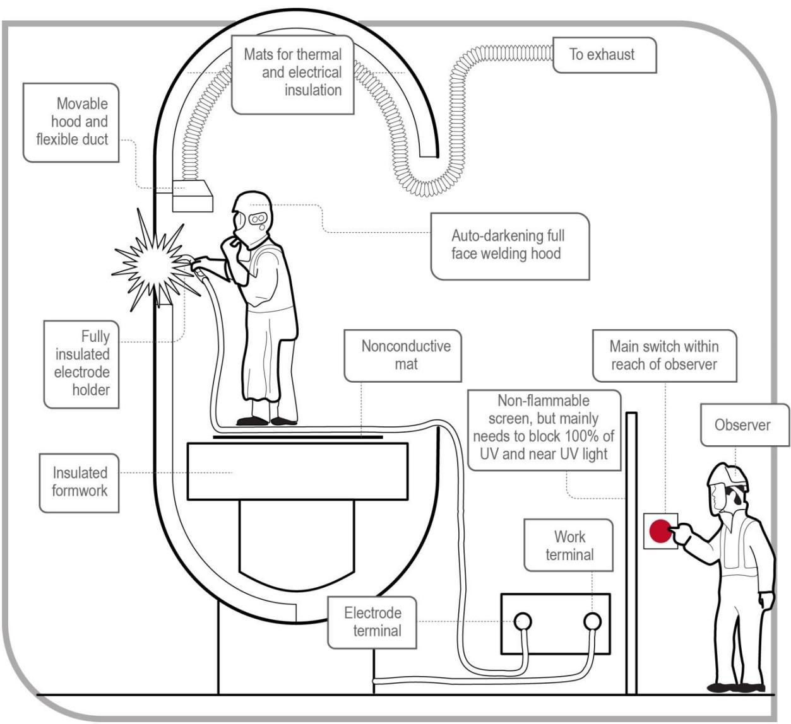
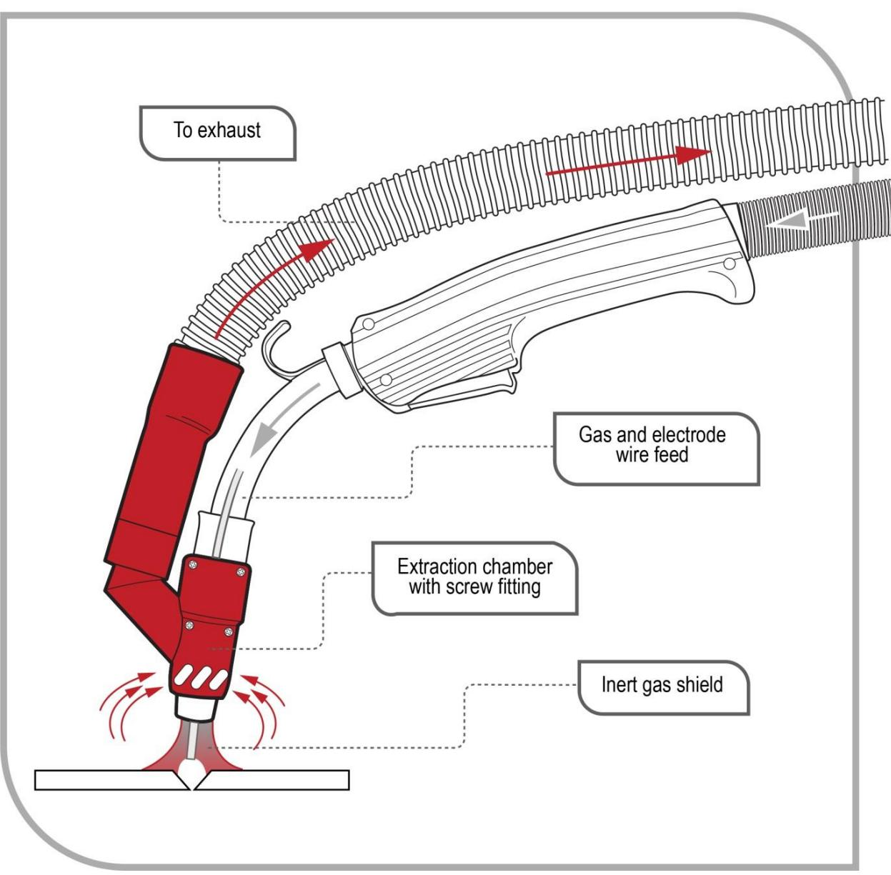
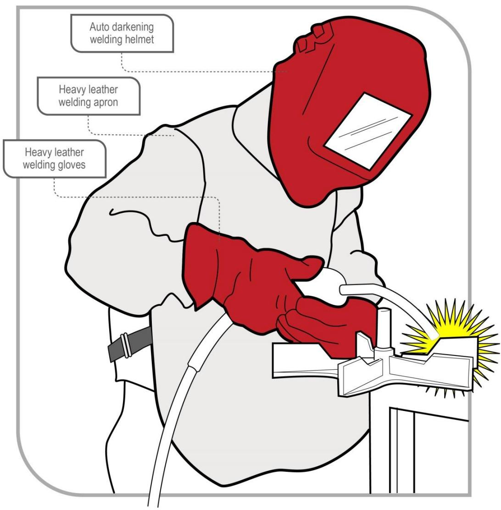

# Welding processes

Code of Practice

# Disclaimer

Safe Work Australia is an Australian Government statutory agency established in 2009. Safe Work Australia includes Members from the Commonwealth, and each state and territory, Members representing the interests of workers and Members representing the interests of employers.

Representing the interests of employers.

Safe Work Australia works with the Commonwealth, state and territory governments to improve work health and safety and workers' compensation arrangements. Safe Work Australia is a national policy body, not a regulator of work health and safety. The Commonwealth, states and territories have responsibility for regulating and enforcing work health and safety laws in their jurisdiction.

ISBN 978- 0- 642- 78538- 1 (PDF)  ISBN 978- 0- 642- 78539- 8 (DOCX)

# Creative Commons

This copyright work is licensed under a Creative Commons Attribution- Noncommercial 4.0 International licence. To view a copy of this licence, visit creativecommons.org/licenses In essence, you are free to copy, communicate and adapt the work for noncommercial purposes, as long as you attribute the work to Safe Work Australia and abide by the other licence terms.

Safe Work Australia | info@swa.gov.au | www.swa.gov.au

# Contents

Foreword 4

1. Introduction 6

1.1. What is welding? 6  1.2. Who has health and safety duties in relation to welding processes? 6  1.3. What is involved in managing risks associated with welding processes? 10

2. The risk management process 11

2.1. Identifying the hazards 11  2.2. Assessing the risks 11  2.3. Controlling the risks 12  2.4. Maintaining and reviewing control measures 13

# 3. Specific hazards and control measures 15

3.1. Airborne contaminants. 15  3.2. Radiation. 17  3.3. Electrical risks. 18  3.4. Fire and explosion. 20  3.5. Burns and exposure to heat. 22  3.6. Compressed and liquefied gases. 23  3.7. Noise. 24  3.8. Lead. 24  3.9. Other hazards. 26

# 4. Other hazards and control measures 28

4.1. Ventilation 28  4.2. Personal protective equipment (PPE). 31  4.3. Maintenance of equipment 35

# 5. Health monitoring. 36

Appendix A—Glossary 38

Appendix B—By- products of welding 41

List of amendments 44

# Foreword

This Code of Practice on how to manage the risks associated with welding processes in the workplace is an approved code of practice under section 274 of the Work Health and Safety Act (WHS Act).

An approved code of practice provides practical guidance on how to achieve the standards of work health and safety required under the WHs Act and the Work Health and Safety Regulations (the WHS Regulations) and effective ways to identify and manage risks.

A code of practice can assist anyone who has a duty of care in the circumstances described in the code of practice. Following an approved code of practice will assist the duty holder to achieve compliance with the health and safety duties in the WHS Act and WHS Regulations, in relation to the subject matter of the code of practice. Like regulations, codes of practice deal with particular issues and may not cover all relevant hazards or risks. The health and safety duties require duty holders to consider all risks associated with work, not only those for which regulations and codes of practice exist.

Codes of practice are admissible in court proceedings under the WHs Act and WHS Regulations. Courts may regard a code of practice as evidence of what is known about a hazard, risk, risk assessment or risk control and may rely on the code in determining what is reasonably practicable in the circumstances to which the code of practice relates. For further information see the Safe Work Australia Interpretive Guideline: The meaning of 'reasonably practicable'.

Compliance with the WHs Act and WHS Regulations may be achieved by following another method if it provides an equivalent or higher standard of work health and safety than the code.

An inspector may refer to an approved code of practice when issuing an improvement or prohibition notice.

# Scope and application

This Code is intended to be read by a person conducting a business or undertaking (PCBU). It provides practical guidance to PCBUs on how to manage health and safety risks associated with welding processes in their workplace.

This Code may be a useful reference for other persons interested in the duties under the WHS Act and WHS Regulations.

Although this Code focuses on welding processes, it may also be relevant to manage the risks associated with allied processes. Welding and allied processes involve similar hazards and in some cases the same risk control measures can be implemented. There are many different types of allied processes including metal preparation, metal cutting, gouging, brazing and soldering which need specific control measures. For more guidance on allied process control measures see Health and Safety in Welding, WTIA Technical Note No. 7, published by the Welding Technology Institute of Australia.

This Code applies to all workplaces covered by the WHS Act where welding is carried out and where welding products and equipment are used and stored.

# How to use this Code of Practice

This Code includes references to the legal requirements under the WHS Act and WHS Regulations. These are included for convenience only and should not be relied on in place of

the full text of the WHS Act or WHS Regulations. The words 'must', 'requires' or 'mandatory' indicate a legal requirement exists that must be complied with.

The word 'should' is used in this Code to indicate a recommended course of action, while 'may' is used to indicate an optional course of action.

# 1. Introduction

# 1.1. What is welding?

Welding is the process of permanently joining two or more materials together, usually metals, by heat or pressure or both. When heated, the material reaches molten state and may be joined together with or without extra filler materials being added. Thermoplastics, for example, can be welded together using a suitable heat source to form permanent joins.

Many different energy sources can be used for welding including gas flames, electric arcs, electric resistance, lasers, electron beams, friction, molten metal baths and ultrasound. Welding includes joining methods as diverse as spot welding, resistance welding, forge welding, friction welding, braze welding, brazing, soldering and explosion welding.

Welding is a potentially hazardous activity and precautions are required to avoid electrocution, fire and explosion, burns, electric shock, vision damage, inhalation of poisonous gases and fumes, hearing loss, and exposure to intense ultraviolet radiation.

# 1.2. Who has health and safety duties in relation to welding processes?

Duty holders who have a role in managing the risks of welding processes include:

persons conducting a business or undertaking (PCBUs) designers, manufacturers, importers, suppliers and installers of plant, substances or structures, and officers.

Workers and other persons at the workplace also have duties under the WHS Act, such as the duty to take reasonable care for their own health and safety at the workplace.

A person can have more than one duty and more than one person can have the same duty at the same time.

Early consultation and identification of risks can allow for more options to eliminate or minimise risks and reduce the associated costs.

# Person conducting a business or undertaking

# WHS Act section 19

Primary duty of care

A PCBU must eliminate risks arising from welding processes, or if that is not reasonably practicable, minimise the risks so far as is reasonably practicable.

The WHS Regulations include more specific requirements for PCBUs to manage the risks of hazardous chemicals, airborne contaminants and plant, as well as other hazards associated with welding such as noise and manual tasks.

PCBUs have a duty to consult workers about work health and safety and may also have duties to consult, cooperate and coordinate with other duty holders.

# Consulting workers

# WHS Act section 47

Duty to consult workers

A PCBU must consult, so far as is reasonably practicable, with workers who carry out work for the business or undertaking and who are (or are likely to be) directly affected by a health and safety matter.

This duty to consult is based on the recognition that worker input and participation improves decision- making about health and safety matters and assists in reducing work- related injuries and disease.

The broad definition of a 'worker' under the WHS Act means a PCBU must consult, so far as is reasonably practicable, with contractors and subcontractors and their employees, on- hire workers, outworkers, apprentices, trainees, work experience students, volunteers and other people who are working for the PCBU and who are, or are likely to be, directly affected by a health and safety matter.

Workers are entitled to take part in consultations and to be represented in consultations by a health and safety representative who has been elected to represent their work group.

# Consulting, cooperating and coordinating activities with other duty holders

# WHS Act section 46

Duty to consult with other duty holders

The WHS Act requires a PCBU to consult, cooperate and coordinate activities with all other persons who have a work health or safety duty in relation to the same matter, so far as is reasonably practicable.

There is often more than one business or undertaking involved in welding processes, who may each have responsibility for the same health and safety matters, either because they are involved in the same activities or share the same workplace.

In these situations, each duty holder should exchange information to find out who is doing what and work together in a cooperative and coordinated way so risks are eliminated or minimised so far as is reasonably practicable.

Examples of where a PCBU will have a health and safety duty include where:

the PCBU engages workers to carry out work the PCBU directs or influences workers in carrying out work other persons may be put at risk from work carried out in their business or undertaking the PCBU manages or controls a workplace or the fixtures, fittings or plant at a workplace the PBCU's business or undertaking involves designing, manufacturing, importing or supplying plant, substances or structures for use at a workplace, and/or the PBCU's business or undertaking involves installing, constructing or commissioning plant or structures at a workplace.

Further guidance on consultation is available in the Code of Practice: Work health and safety consultation, cooperation and coordination.

# Information, training, instruction and supervision

# WHS Act 19

Primary duty of care

# WHS Regulation 39

Provision of information, training and instruction

The WHS Act requires that a PCBU ensure, so far as is reasonably practicable, the provision of any information, training, instruction or supervision that is necessary to protect all persons from risks to their health and safety arising from work carried out as part of the conduct of the business or undertaking.

You must ensure that information, training or instructions provided to a worker are suitable and adequate having regard to:

the nature of the work carried out by the worker the nature of the risks associated with the work at the time of the information, training or instruction, and the control measures implemented.

You must also ensure, so far as is reasonably practicable, that the information, training and instruction are provided in a way that is readily understandable for the workers to whom it is provided.

Workers must be trained and have the appropriate skills to carry out a particular task safely. Training should be provided to workers by a competent person.

Information, training, instruction provided to workers who carry out welding processes should include:

the proper use, wearing, storage and maintenance of personal protective equipment (PPE) how to work safely in hazardous environments, such as a confined space safe welding procedures, including manual handling first aid and emergency procedures how to access safety data sheets (SDS) for hazardous chemicals, and the nature of, and reasons for, any health monitoring if required.

Designers, manufacturers, importers and suppliers of plant, substances or structures

# WHS Act Part 2 Division 3

Further duties of persons conducting businesses or undertakings

Designers, manufacturers, importers and suppliers of plant or substances used in welding processes must ensure, so far as is reasonably practicable, the plant or substance they design, manufacture, import or supply is without risks to health and safety. This duty includes carrying out testing and analysis as well as providing specific information about the plant or substance.

To assist in meeting these duties, the WHS Regulations require:

- manufacturers to consult with designers of the plant- importers to consult with designers and manufacturers of plant, and

- the person who commissions construction work to consult with the designer of the structure.

# Principal contractors

# WHS Regulation 309

WHS management plan—preparation

The principal contractor for a construction project has a specific duty under the WHS Regulations to document, in their WHS Management Plan for the project, the arrangements in place for consultation, cooperation and coordination between the PCBUs at the site.

# Officers

# WHS Act section 27

Duty of officers

Officers, for example company directors, have a duty to exercise due diligence to ensure the PCBU complies with the WHS Act and WHS Regulations. This includes taking reasonable steps to ensure the business or undertaking has and uses appropriate resources and processes to eliminate or minimise risks from welding processes. Further information on who is an officer and their duties is available in the SWA Interpretive Guideline: The health and safety duty of an officer under section 27.

# Workers

# WHS Act section 28

Duties of workers

Workers have a duty to take reasonable care for their own health and safety and to not adversely affect the health and safety of other persons. Workers must comply with reasonable instructions, as far as they are reasonably able, and cooperate with reasonable health and safety policies or procedures that have been notified to workers. If personal protective equipment (PPE) is provided by the business or undertaking, the worker must so far as they are reasonably able, use or wear it in accordance with the information and instruction and training provided.

# Other persons at the workplace

# WHS Act section 29

Duties of other persons at the workplace

Other persons at the workplace, like visitors, must take reasonable care for their own health and safety and must take care not to adversely affect other people's health and safety. They must comply, so far as they are reasonably able, with reasonable instructions given by the PCBU to allow that person to comply with the WHS Act.

# 1.3. What is involved in managing risks associated with welding processes?

WHS Regulations Part 3.1 Regulations 32- 38 Managing Risks to Health and Safety

This Code provides guidance on how to manage the risks associated with welding in the workplace using the following systematic process:

Identify hazards - find out what could cause harm. Assess risks, if necessary - understand the nature of the harm that could be caused by the hazard, how serious the harm could be and the likelihood of it happening. This step may not be necessary if you are dealing with a known risk with known controls. Eliminate risks so far as is reasonably practicable. Control risks - if it is not reasonably practicable to eliminate the risk, implement the most effective control measures that are reasonably practicable in the circumstances in accordance with the hierarchy of control measures, and ensure they remain effective over time. Review control measures to ensure they are working as planned.

Further guidance on the risk management process is available in the Code of Practice: How to manage work health and safety risks.

# 2. The risk management process

A risk assessment is not mandatory for welding processes under the WHs Regulations. However, in many circumstances it will be the best way to determine the measures that should be implemented to control risks. It will help to:

identify which workers are at risk of exposure determine what sources and processes are causing that risk identify if and what kind of control measures should be implemented, and check the effectiveness of existing control measures.

Risk management is a systematic process to eliminate or minimise the potential for harm to people.

# 2.1. Identifying the hazards

The first step in the risk management process is to identify all hazards associated with the welding process. This involves finding things and situations which could potentially cause harm to people. Hazards generally arise from the following aspects of work and their interaction:

physical work environment equipment, materials and substances used work tasks and how they are performed, and work design and management.

Hazards may be identified by looking at the workplace and how work is carried out. It is also useful to talk to workers, manufacturers, suppliers and health and safety specialists and review relevant information, records and incident reports. Typical hazards found in welding and allied processes can include ultra violet and infra- red radiation which can cause burns, cancer and blindness. Potential hazards may be identified in a number of ways, including:

conducting a walk- through assessment of the workplace observing the work and talking to workers about how work is carried out inspecting the materials and equipment used during the welding process reading product labels, safety data sheets and manufacturers' instruction manuals talking to manufacturers, suppliers, industry associations and health and safety specialists, and reviewing incident reports.

# 2.2. Assessing the risks

A risk assessment involves considering what could happen if someone is exposed to a hazard and the likelihood of it happening. A risk assessment can help you determine:

how severe a risk is whether any existing control measures are effective what action you should take to control the risk, and how urgently the action needs to be taken.

Hazards have the potential to cause different types and severities of harm, ranging from minor discomfort to a serious injury or death.

Many hazards and their associated risks are well known and have well established and accepted control measures. In these situations, the second step to formally assess the risk is not required. If after identifying a hazard you already know the risk and how to control it effectively, you may simply implement the controls.

There are no specific requirements under the WHS Regulations for a risk assessment for welding. However, there are specific requirements for specific situations where welding is performed, for example when working in a confined space.

In some circumstances, a risk assessment will assist to:

- identify which workers are at risk of exposure- determine what sources and processes are causing the risk- identify if and what kind of control measures should be implemented, and- check the effectiveness of existing control measures.

The nature and severity of risks will depend on various factors, including the:

- properties of the materials being welded- surface coating of the items being welded (for example whether they contain lead or other toxic materials)- condition of the welding equipment- conditions under which welding is carried out (for example, confined spaces and working at heights), and- skills, competence and experience of the welder.

Different welding processes also influence the risk. For example, the risk of electric shock is lower using gas metal arc welding than manual metal arc welding because the open circuit voltages are lower, only direct current is used and the power is switched at the hand piece.

The following questions may help to assess the risk:

- in the event of exposure to the hazard, will the outcome be severe, moderate or mild?- how often, and for how long, will exposure to the hazard occur?

# 2.3. Controlling the risks

# Hierarchy of control measures

The WHS Regulations require duty holders to work through the hierarchy of control measures when managing certain risks; however, it can be applied to any risk. The hierarchy ranks control measures from the highest level of protection and reliability to the lowest. Further guidance on the risk management process and the hierarchy of control measures is available in the Code of Practice: How to manage work health and safety risks.

# Eliminating the risk

You must always aim to eliminate the risk. For example, fabrications may be designed to include many pre- cast components or extruded shapes to eliminate the need to weld.

If eliminating the hazards and associated risks is not reasonably practicable, you must minimise the risk by one or more of the following:

- Substitution—minimise the risk by substituting or replacing a hazard or hazardous work practice with something that gives rise to a lesser risk. For example, using submerged arc welding instead of flux-cored wire welding will reduce the risk of exposure to radiation and fumes. In welding, such types of substitution are not always practical or technically suitable.

Isolation- minimise the risk by isolating or separating the hazard or hazardous work practice from any person exposed to it. For example, removing the welder and nearby workers from the hazard or isolating or screening the hazard from the welder; conducting ancillary processes like plasma cutting, gouging, grinding, fetling and guillotining in specified areas away from general fabrication, to reduce risk of exposure to loud noise at the welding station. Engineering controls- engineering controls are physical control measures to minimise risk. For example, ventilation systems to remove welding fumes.

If risk remains, it must be minimised by implementing administrative controls, so far as is reasonably practicable. For example, if a welding process takes place in a very hot environment, allowing the welder to weld for a limited time followed by a suitable rest and cooling- off period will reduce the risk of heat exhaustion.

Any remaining risk must be minimised with suitable personal protective equipment (PPE). For example, if the welder has to stand on metallic surfaces which form part of the electric circuit it may become live. The use of rubber- soled boots will reduce the risk of electric shock.

Administrative control measures and PPE do not control the hazard at the source. They rely on human behaviour and supervision and used on their own tend to be the least effective in minimising risks.

Chapter 3 of this Code provides information on control measures for welding processes. Guidance on allied processes control measures can be found in Health and Safety in Welding, WTIA Technical Note No. 7, published by the Welding Technology Institute of Australia.

# 2.4. Maintaining and reviewing control measures

Control measures must be maintained so they remain:

fit for purpose, suitable for the nature and duration of work and installed, set up and used correctly.

The control measures put in place to protect health and safety should be regularly reviewed to make sure they are effective. Checking effectiveness may involve, for example, air monitoring to measure the amount of welding fume in the welder's breathing zone following introduction of fume extraction equipment. If the control measure is not working effectively it must be revised to ensure it is effective in controlling the risk.

You must review and as necessary revise control measures so as to maintain, so far as is reasonably practicable, a work environment that is without risks to health or safety. For example:

when the control measure does not control the risk so far as is reasonably practicable before a change at the workplace that is likely to give rise to a new or different risk to health and safety that the measure may not effectively control a new or relevant hazard or risk is identified the results of consultation indicate a review is necessary, or a health and safety representative requests a review if that person reasonably believes that: a circumstance in any of the above points affects or may affect the health and safety of a member of the work group represented by the health and safety representative

Common review methods include workplace inspection, consultation, testing and analysing records and data.

You can use the same methods as in the initial hazard identification step to check control measures. You must also consult your workers and their health and safety representatives.

If problems are found, go back through the risk management steps, review your information and make further decisions about controlling the risk.

Many welding processes are carried out during construction works. Further guidance for working on construction sites is available in the Code of Practice: Construction work.

# 3. Specific hazards and control measures

# 3.1. Airborne contaminants

# WHS Regulation 49

Ensuring exposure standards for substances and mixtures not exceeded

As a person conducting a business or undertaking (PCBU), you must ensure that no person at the workplace is exposed to a substance or mixture in an airborne concentration that exceeds the exposure standard for the substance or mixture.

Welding can generate fumes, mists, dust, vapours and gases, including ozone. The amounts and types of fumes produced vary greatly depending on the process involved and the materials being used such as metals, solvents, flux, paint and plastics. The health effects of exposure to fumes, dust, vapour and gases can vary. Effects can include irritation of the upper respiratory tract (nose and throat), tightness in the chest, asphyxiation, asthma, wheezing, metal fume fever, lung damage, bronchitis, cancer, pneumonia or emphysema.

Some welding fumes are easy to see. However, many fumes, mists, dust, vapours and gases are invisible. Generally, fewer fumes are generated from gas welding than from electric welding processes. Also, intense ultraviolet radiation emitted by arcs may travel significant distances from arcs, especially in reflective environments, and may give rise to significant quantities of ozone. Appendix B contains information about fumes which are commonly released during welding.

To determine the risk of exposure to fumes during welding you should identify what equipment and materials are being used and the level of fumes, dust, vapour and gases generated. For example, phosphine is generated when steel which is coated with a rustproofing compound is welded. High concentrations of phosphine gas are irritating to the eyes, nose and skin. The substance can have detrimental effects on the lungs and other organs. In order to prevent exposure to phosphine in this circumstance, you would first identify rust- proofed steel in the material to be welded.

For exposure to welding fumes, total fume concentrations as well as individual fume components should be considered.

Control measures for welding fumes, mists, dust, vapours and gases:

- eliminate, so far as is reasonably practicable, any exposure to welding fumes- if it is not reasonably practicable to eliminate the risk, measures to minimise the risk must be used. For example:  
- substituting a hazardous chemical with a less hazardous one  
- reducing the quantity of a hazardous chemical which is used, handled or stored at the workplace, for example removing surface contaminants before carrying out welding will reduce fumes (or airborne contaminants)  
- isolating the source of exposure to the hazardous chemical, for example welding in isolation booths away from others, and  
- using engineering control measures, for example installing ventilation systems to capture or remove airborne contaminants. See Chapter 4 Section 1 of this code for more information on ventilation.

implement administrative control measures, for example procedures to handle hazardous chemicals safely, and provide appropriate respiratory protective equipment.

It is also good practice to reduce the quantity of a hazardous chemical which is used, handled or stored at the workplace where welding processes are carried out.

Check the welding rods' SDS, if available, to identify which gases and fumes are released during welding. Further information about controlling airborne contaminants is available in the Fume Minimisation Guidelines published by the Welding Technology Institute of Australia.

# Exposure standards

Exposure standards provide airborne concentrations of a particular substance or mixture which must not be exceeded. There are three types of exposure standard:

- 8-hour time-weighted average--the average airborne concentration of a particular substance permitted over an eight-hour working day and a 5-day working week- peak limitation--a maximum or peak airborne concentration of a particular substance determined over the shortest analytically practicable period of time which does not exceed 15 minutes, and- short term exposure limit--the time-weighted maximum average airborne concentration of a particular substance permitted over a 15-minute period.

Exposure standards are based on the airborne concentrations of individual substances which, according to current knowledge, should not cause adverse health effects nor cause undue discomfort to nearly all workers.

Chemicals with workplace exposure standards are listed in the Workplace exposure standards for airborne contaminants on the SWA website. Guidance on interpreting exposure standards is available in the Guidance on the interpretation of Workplace exposure standards for airborne contaminants.

Exposure standards are also available from the Hazardous Chemical Information System (HCIS) on the Safe Work Australia website. The HCIS database contains information and guidance for many substances. Although exposure standards may also be listed in Section 8 of the SDS, you should always check the Workplace exposure standards for airborne contaminants or HCIS to be certain of the mandatory value.

To comply with the WHs Regulations, monitoring of workplace contaminant levels for chemicals with exposure standards may need to be carried out.

# Monitoring airborne contaminant levels

# WHS Regulation 50

Monitoring airborne contaminant levels

You must ensure that air monitoring is carried out to determine the airborne concentration of a substance or mixture at the workplace to which an exposure standard applies if:

you are not certain on reasonable grounds whether or not the airborne concentration of the substance or mixture at the workplace exceeds the relevant exposure standard, or monitoring is necessary to determine whether there is a risk to health.

Air monitoring is the sampling of workplace atmospheres to get an estimate of workers' potential inhalation exposure to hazardous chemicals. Air monitoring is used:

when there is uncertainty about the level of exposure to indicate whether exposure standards are being exceeded or approached, and to test the effectiveness of the control measures.

Air monitoring should be carried out by a competent person, such as an occupational hygienist, with skills to carry out the monitoring according to standards and to interpret the results. Where monitoring of airborne contaminants is used to determine a person's exposure, the monitoring must be undertaken in the breathing zone of the person.

Monitoring should also be conducted in the breathing zones of other workers in the vicinity to ensure they are not exposed to hazardous levels of fumes.

Results from air monitoring can indicate how effective your control measures are, for example whether ventilation systems are operating as intended. If monitoring identifies the exposure standard is exceeded, this indicates that the control measure does not control the risk it was implemented to control and it must be reviewed and any necessary changes made.

Records of air monitoring for airborne contaminants with exposure standards must be kept for a minimum of 30 years after the date the record is made and must be readily accessible to workers who may be exposed.

Air monitoring cannot be used to determine a risk to health via skin contact of airborne chemicals. Further information on interpreting exposure standards is available in Guidance on the interpretation of Workplace exposure standards for airborne contaminants on the SWA website.

# 3.2. Radiation

Radiation is energy traveling as waves of electromagnetic radiation or subatomic particles.

Electric arc and laser welding emit ultraviolet, visible light and infra- red radiation. Gas welding emits visible light and infra- red radiation.

The potential effect of radiation on the body depends on the type, intensity, the distance you are from it and the duration of exposure. Eye disorders and skin burns may be caused by exposure to intense ultraviolet and infra- red radiation in welding. Exposure to the eyes causes 'arc eye' or 'welders' flash' which is a painful inflammation of the cornea. The cornea can repair itself in one to two days. However, if the cornea becomes infected it may lead to some loss of vision.

The effects of ultraviolet and infra- red radiation are not normally felt until some time after exposure. Radiation from laser welding is less obvious than from electric welding arcs but both are serious hazards.

Workers directly involved in the welding process are at greatest risk. However, other workers in the workplace and passers- by could also be exposed to radiation.

Control measures to protect from the effects of radiation:

- isolate the process by installing non-flammable screens and partitions to prevent exposure to UV light- use signs to warn welding is occurring- limit entry into the work area unless appropriate safeguards are used such as personal protective equipment (PPE), and

- provide PPE including filter shades for goggles and face shields to protect the eyes from radiation; gloves and other protective clothing should also be worn to cover exposed skin.

# 3.3. Electrical risks

# WHS Regulation 147

Risk management

# WHS Regulation 149

Unsafe electrical equipment

# WHS Regulation 150

Inspection and testing of electrical equipment

# WHS Regulation 164

Use of socket outlets in hostile operating environment

An electrical risk is a risk to a person of death, shock or other injury caused by electricity.

You must manage risks to health and safety associated with electrical risks at the workplace. This includes ensuring that any unsafe electrical equipment is disconnected (or isolated) from its electricity supply.

You must ensure electrical equipment is regularly inspected and tested by a competent person if it is used in an environment in which the normal use of the equipment exposes it to operating conditions that are likely to result in damage to the equipment, or reduce the life of the equipment (such as through moisture, heat, vibration, mechanical damage, corrosive chemicals or dust).

In such conditions you must also ensure, so far as is reasonably practicable, that any electrical risk associated with the supply of electricity to the electrical equipment through a socket outlet is minimised by the use of an appropriate residual current device (RCD).

Using electrical welding equipment involves a risk of electric shock or electrocution. Exposure to electromagnetic fields is also a potential hazard for workers with some medical conditions.

Welding equipment may need to be regularly inspected and tested as it could be exposed to operating conditions likely to result in damage or a reduction in expected lifespan. For more information see model Code of Practice: Managing electrical risks in the workplace.

# Electric shock

Electric shock may result in serious burns or death by electrocution. Electric shock or electrocution can occur through direct contact with the electrode, live parts, the work piece, or through contact with a device such as an unearthed cable or tool. The risk of electric shock can be exacerbated by moisture and high humidity.

Control measures to protect from electric shock:

- isolate the hazard by using fully insulated electrode holders; the holder should never be dipped into water to cool, or be placed on conductive surfaces- prevent contacting electrodes or welding wire with bare hands when in the holder or welding gun (wear dry welding gloves), and make sure holders or welding guns are never held under the armpit

prevent holders or electrodes coming into contact with any other person check the working area does not have any potentially live structures, components or wet areas install an RCD, and inspect all equipment to check it is in good condition before use, including power switches, terminals, connections, cables and insulation.

The working environment should be designed to minimise the risk of electric shock. For example, areas where welding is undertaken can be insulated and air- ventilated to prevent workers from perspiring as perspiration is a conductor of electricity.

Table 1 below, lists several ways to minimise the risk of electric shock when carrying out welding.

Table 1 Procedures to minimise the risk of electric shock  

<table><tr><td>Work phase</td><td>Procedure</td></tr><tr><td>Before welding</td><td>- Check the equipment is well maintained, for example, conductors should be well insulated to prevent contact with live conductors.
- Install shut-down mechanisms such as fuses, low voltage safety switches or RCDs on equipment.
- Do not work in an environment which is damp, humid or wet, or where a worker may be exposed to rain.
- Become familiar with the procedures and emergency plans for your workplace and make sure you understand how to perform welding activities safely and what you need to do if a person suffers an electric shock.</td></tr><tr><td>During welding</td><td>- Always keep the welding machine terminals and cable connections clean and tight.
- Only use welding cables which are fully insulated for their entire length.
- Where devices have an earth (ground) connection, it is essential it is connected at all times.
- Do not connect or change welding cables before switching off the power at the mains.
- Use an appropriate hazard reducing device.
- In hazardous working environments avoid working alone.
- Wear personal protective equipment including welding gloves and rubber insulated shoes while working.
- Minimise perspiration by allowing time to dry equipment during breaks, changing clothing, gloves, using ventilators and using an air-fed welding mask.
- Do not change electrodes by hand while simultaneously touching the bench or the work piece.
- Where practicable stand, lay or sit on non-conducting material while carrying out welding.
- Avoid leaning against the material or structure during welding.</td></tr><tr><td>After welding</td><td>- Check the condition of all equipment after use and report any defects.</td></tr></table>

Further guidance about electrical safety is available in:

Code of Practice: Managing electrical risks in the workplace

- Welding Electrical Safety, WTIA Technical Note No. 22, published by the Welding Technology Institute of Australia- AS 1674.2-2007: Safety in welding and allied processes – Electrical.- AS 60974.1-2006: Arc welding equipment – Welding power sources (Section 11 and 13 for hazard reducing devices).

# Electromagnetic fields

Electric arc welding produces strong electric and magnetic fields close to the power source and around the current- carrying cables. Electromagnetic fields can disrupt the operation of pacemakers, permanent defibrillators or other medical devices which could cause the heart to stop or slow down. A worker will not be aware of a magnetic field hazard unless a heart pacemaker or other device is behaving irregularly. You should seek medical advice before exposing a worker wearing such a device to welding- related electromagnetic fields.

Electromagnetic fields can also occur wherever power is being generated and near transmission lines. Before work near these facilities begins, you should check with the electricity supply company to make sure work will not affect the supply of power or if there are any special precautions welders need to take when working in those areas.

Control measures for electromagnetic field may include:

- using barriers to isolate people who are not directly involved in the welding process- workers with pacemakers or other susceptible devices should substitute work which involves exposure to electromagnetic fields for another type of welding process, such as performing oxy-fuel welding instead of electric arc welding- signs indicating there are strong electromagnetic fields should be used to limit access and alert people to risks, and- workers should not stand close to the power source or drape the welding cable around their body.

# 3.4. Fire and explosion

# WHS Regulation 51

Managing risks to health and safety

WHS Regulation 52

Ignition sources

WHS Regulation 53

Flammable and combustible material not to be accumulated

WHS Regulation 355

Specific control—fire and explosion

You must manage risks to health and safety associated with ignition sources in a hazardous atmosphere at the workplace, where the ignition is not part of a deliberate workplace process or activity.

Under the WHS Regulations an atmosphere is a hazardous atmosphere if the concentration of a flammable gas, vapour, mist or fume exceeds five per cent of the lower explosive limit for the gas, vapour, mist or fume. The criteria for classification of hazardous areas are described in AS/NZS 60079.10.1:2009: Explosive atmospheres – Classification of areas and

AS/NZS 61241.10:2005 Electrical apparatus for use in the presence of combustible dust - - classification of areas where combustible dusts are or may be present.

You must also ensure that flammable or combustible substances kept at the workplace are kept at the lowest practicable quantity and that other ignition sources are not introduced into the workplace.

Welding generates heat, flames and sparks- - all of which are sources of ignition. When combined with sources of fuel and oxygen, sources of ignition present a significant risk of fire and explosion.

You must manage risks to health and safety associated with an ignition source in a hazardous atmosphere. This includes identifying all sources of ignition, including other processes associated with welding, for example grinding which can also generate heat, flames and sparks.

Common sources of fuel which can be found in workplaces include flammable and combustible materials, such as flammable gases, (for example acetylene, hydrogen, methane- - natural gas), liquefied petroleum gas (for example barbeque gas), flammable liquids (for example mineral turpentine, petrol), combustible liquids (for example oils) and materials such as wood, wood chaff/shavings, leaves, cardboard boxes and flammable metal or self- burning dusts. Neighbouring properties may have containers of fuel, flammable liquids and dried grass or leaves which can also present a hazard to your workplace if ignited.

The risk of fire and explosion could be increased by exposure to an oxygen- rich atmosphere at the workplace. Fires in oxygen- rich atmospheres are very difficult to extinguish. When oxygen comes in contact with oil, grease, other hydrocarbons or oil- based substances, it can spontaneously ignite and result in a fire or explosion. For example, you should never cut containers with potentially flammable materials and pressurised cylinders, pipes or vessels.

You may need to develop specific procedures for welding in a hazardous atmosphere or hazardous area. For example, the WHS Regulations require a 'confined spaces entry permit' for work in a confined space. When welding in an area which is not a confined space, you should still document specific procedures which should include the issue of a 'hot work permit'. For further guidance about 'hot work' or 'hot work permit' see AS 1674.1:1997: Safety in welding and allied processes - - Fire precautions. You should also take into consideration the areas and businesses surrounding the workplace.

Control measures for fire and explosion:

- eliminate, or if not reasonably practicable, isolate fuel sources from ignition sources- eliminate the hazard by purging all traces of flammable or combustible materials from drums, vessels and tanks which are to be welded before welding, and preferably fill with an inert substance such as nitrogen gas or water- isolate the process by using fire resistant barriers to prevent welding sparks accidently reaching flammable and combustible materials- check work areas are well ventilated to prevent accumulation of flammable vapours in the work area- check work area is free from rubbish, paper or dust which could be potential fuel sources or produce dust explosions- use flash back arrestors on gas hoses to prevent the flames travelling back and igniting the gas in the cylinder- ensure gas cylinders are secured at all times—AS 4332-2004: The storage and handling of gases in cylinders (note segregation of gases of Class 2.1 and 2.2(5.1))- drain and purge equipment, such as gas hoses, and lock the gas off at the valve immediately after use- do not store flammable and combustible materials near welding area, and

- keep and maintain fire-fighting equipment near welding area.

# 3.5. Burns and exposure to heat

# WHS Regulation 209

Guarding and insulation from heat and cold

Burns are one of the most common injuries in welding. The temperature of a welding arc can reach 6000 degrees Celsius. The intense ultraviolet and infra- red rays can be harmful to both the welder and anyone else nearby. Burns occur frequently on hands and other exposed skin, but also in eyes from sparks and metal fragments. The symptoms of exposure to this level of heat are similar to extreme sunburn.

Persons with management or control of plant must ensure, so far as is reasonably practicable, that any pipe or other part of the plant associated with heat or cold is guarded or insulated so that the plant is without risks to the health and safety of any person.

Control measures to protect from burns:

- isolate workers from coming into contact with hot work pieces, for example carry out post-weld heat treatment in areas where work pieces cannot be accidently touched- mark or label as 'hot' equipment, metals, plates or items likely to be hot in the welding area to minimise accidental burns, and- avoid contact with heated surfaces by using thermal insulating materials and wearing PPE.

# Heat

Welding can often produce heat at a level that creates an uncomfortable and hazardous working environment.

Exposure to extreme heat is particularly hazardous when working outdoors in direct sunlight, on hot days and in confined spaces. Working in a hot environment can cause heat rash, heat stress, heat stroke and result in permanent injury or death. Heat stress is a serious medical condition, can occur gradually and has a range of symptoms. While discomfort, dehydration and sweating can be easily noticed by a worker, symptoms such as lack of concentration, fatigue, lethargy and confusion are less noticeable.

Wearing PPE can also restrict air movement and sweat evaporation which can make a worker's immediate environment hot.

Workers should be familiar with safe working practices in order to avoid exposure to extreme heat. For example, when working with a plasma arc, workers should keep away from the torch tip and not grip materials near the cutting path.

Control measures to protect from the effects of heat:

- ventilate work areas to reduce the build-up of heat in the workplace, and- workers should drink cool drinking water and take regular scheduled rest breaks.

Further information is available in the Code of Practice: Managing the work environment and facilities and the Guide for managing the risks of working in heat.

# 3.6. Compressed and liquefied gases

Compressed and liquefied gases are used as fuel, a source of oxygen or as shielding gases in certain types of welding. Cylinders contain large volumes of gas under high pressure and precautions need to be taken when storing, handling and using cylinders.

The hazards associated with compressed and liquefied gases include fire, explosion, toxicity, asphyxiation, oxidisation and uncontrolled release of pressure. Gas leakage is a particular hazard. Leaking fuel gas is usually recognised by odour. However, oxygen leaks are harder to detect and therefore potentially more hazardous. If a small leak occurs, close the cylinder valve if possible. The area should be well ventilated and air- conditioning systems should be turned off to avoid spreading gas. However, if a large amount of gas escapes, emergency procedures should be implemented.

Control measures for compressed and liquefied gases:

- store and handle cylinders appropriately- keep cylinders maintained free from leaks or dents- store cylinders in an upright position to ensure the safety device functions correctly- secure cylinders to prevent dislodgement- hoses should be secured using crimping or other suitable permanently fitting clips- flashback arrestors should be fitted at the blow pipe and regulator end of both the oxygen and fuel gas lines- keep the cylinder valve closed when the cylinder is not being used, and- keep all sources of heat and ignition away from gas cylinders, even if the cylinders do not contain flammable material.

For further guidance on storing cylinders see AS 4332- 2004: The storage and handling of gases in cylinders. For further guidance on securing hoses see AS/N25 1869.2012. Hose and hose assemblies for liquefied petroleum gases (LP Gas), natural gas and town gas.

# Asphyxiation hazards

Asphyxia is a condition which occurs where there is lack of oxygen. All gases, including fuel gases (for example hydrogen, acetylene and liquid petroleum gas) and inert gases (for example argon, helium and nitrogen) are an asphyxiation hazard in high concentrations.

Too little oxygen in the air we breathe can cause fatigue and in extreme cases death. Using compressed and liquefied gases can result in dangerously low levels of oxygen, either through consumption of oxygen in the air (burning of fuel) or where an accumulation of gases displaces oxygen in air. For example, gases which are heavier than air can accumulate in low- lying areas such as pits, wells and cellars and gases which are lighter than air can accumulate in high areas, for example roof spaces and tolls.

To ensure the controlled release of gas in an emergency situation, oxygen, hydrogen, carbon dioxide and inert gas cylinders should be fitted with a bursting disc safety device and liquid petroleum gas cylinders should have an operational spring- loaded pressure relief valve. Acetylene cylinders should be fitted with a fusible plug in the neck of the cylinder and must always be stored and used in an upright position.

Control measures for asphyxiation hazards:

- avoid work being carried out in oxygen-enriched (over 23 per cent) or oxygen-depleted (under 19.5 per cent) atmospheres- keep the work area well ventilated, particularly in low-lying areas and roof spaces where gases can accumulate- use appropriate PPE, for example an air supplied respirator, particularly in confined spaces

- monitor the atmosphere to check it is free of harmful contaminants and contains an adequate oxygen level, and- check cylinder fittings, hoses and connections are not damaged or in poor condition.- See Chapter 3 section 9 of this Code for more information about confined spaces.

# 3.7. Noise

# WHS Regulation 57

Managing risk of hearing loss from noise

# WHS Regulation 58

Audiometric testing

You must manage the risks to health and safety relating to hearing loss associated with noise. You must ensure that the noise a worker is exposed to at the workplace does not exceed the exposure standard for noise.

The exposure standard for noise regarding hearing loss, is defined in the WHS Regulations as an  $\mathsf{L}_{\mathsf{Aeq},\mathsf{8h}}$  of 85 dB(A) or an  $\mathsf{L}_{\mathsf{C,peak}}$  of 140 dB(C). There are two parts to the exposure standard for noise because noise can either cause gradual hearing loss over a period of time or be so loud it causes immediate hearing loss.

Audiometric testing must be provided to a worker who is frequently required to use personal hearing protectors to protect the worker from the risk of hearing loss associated with noise that exceeds the exposure standard for noise.

Exposure to high noise levels can cause permanent hearing loss. Equipment for performing welding can generate varying levels and frequencies of noise which may cause workers to be exposed to noise which exceeds the exposure standard. Specifically plasma arc welding generally exceeds the noise levels generated by other welding activities and ranges between 98 and 112 dB(A).

# Control measures to protect against noise

The most effective control measure is to eliminate the source of noise. If this is not possible:

- modify equipment and processes to reduce the noise- isolate the source of noise from people by using distance, barriers, welding bays and sound absorbing surfaces (types of engineering control measures)- implement administrative control measures which limit the amount of noise people are exposed to and how long they are exposed to it, and- personal hearing protection must be provided to protect workers from any remaining risk.

Further guidance about controlling noise in the workplace is available in the Code of Practice: Managing noise and preventing hearing loss at work.

# 3.8. Lead

Lead is just one of the many heavy metals that pose a risk when welding metals using fluxes. Lead can become an airborne contaminant when soldering and welding materials. A welder may be exposed to lead when welding on steel painted with leaded paints, on leaded

steel, flame cutting of batteries and materials contaminated with lead (for example old automotive mufflers).

The major risk associated with lead is lead poisoning (plumbism). This affects the blood system and can cause anaemia. Other symptoms include abdominal pain, convulsions, hallucinations, coma, weakness, tremors and the possible increased risk of cancer. Lead exposure can also affect both male and female reproductive systems. A developing foetus is particularly at risk, especially in the early weeks before a pregnancy becomes known.

# WHS Regulation 395

Duty to give information about health risks of lead process

Under the WHS Regulations a lead process is defined as a process by which electric arc, oxyacetylene, oxy gas, plasma arc or a flame is applied for welding, cutting or cleaning, to the surface of metal coated with lead or paint containing more than one per cent by dry weight of lead metal.

This means certain requirements in the WHS Regulations apply, including identifying lead risk work and removing a worker from lead risk work in certain circumstances.

If you carry out lead processes, you must provide information about the lead process to:

- a person who is likely to carry out the lead process, before they are engaged, and- a worker for the business or undertaking—before the worker commences the lead process.

If work is identified as lead risk work after a worker commences the work, you must give information about the lead process to the worker as soon as practicable after it is identified as lead risk work and before health monitoring of the worker is provided.

The information that must be given includes the health risks and toxic effects associated with exposure to lead. If the lead process involves lead risk work, information must also be given on the need for and details of health monitoring.

# Control measures to protect against lead exposure

The WHS Regulations require you to:

ensure so far as is reasonably practicable lead is confined to a lead process area at the workplace and the lead process area is kept clean ensure methods used to clean a lead process area do not create a risk to health of persons in the immediate vicinity or have the potential to spread the contamination of lead take all reasonable steps to ensure a person does not eat, drink, chew gum, smoke or carry materials used for smoking in a lead process area provide and maintain in good working order changing rooms, washing, showering and toilet facilities provide workers with an eating and drinking area that, so far as is reasonably practicable, cannot be contaminated with lead from a lead process, and ensure, so far as reasonably practicable, workers remove clothing and equipment which is or is likely to be contaminated with lead and wash their hands and faces before entering an eating or drinking area.

The WHS Regulations also specify control measures for the laundering, disposal and removal of PPE which is likely to be contaminated with lead dust.

There are also specific notification requirements under the WHS Regulations for notifying the regulator within 7 days of determining that lead risk work is being undertaken.

# 3.9. Other hazards

# Confined spaces

# WHS Regulation 66

Managing risks to health and safety

Welding activities could be conducted within confined spaces. You must manage the risks to health and safety associated with a confined space at a workplace including risks associated with entering, working in, on or in the vicinity of a confined space (including a risk of a person inadvertently entering the confined space).

Hazards which may be encountered in a confined space include:

heat and fumes generated by welding chemical agents including combustible gases or vapours, toxic gases or vapours, combustible or toxic liquids or solids, or potentially explosive dusts oxygen deficiency or excess physical agents including thermal extremes, radiation, noise or flooding, and those arising from undertaking manual tasks in physically constrained spaces.

Further guidance on how to work safely in confined spaces is available in the Code of Practice: Confined spaces and Chapter 4 section 1 of this Code.

# Falls

# WHS Regulation 78

Management of risk of fall

Welding activities may not always take place on the ground. You must manage risks to health and safety associated with a person falling from one level to another where they are reasonably likely to cause injury to themselves or any other person.

The WHS Regulations require the following specific control measures to be implemented:

ensuring, so far as is reasonably practicable, that any work that involves the risk of a fall from one level to another that is reasonably likely to cause injury to the person or another person, is carried out on the ground or on solid construction provide a safe means of access and egress to and from the workplace, and specified areas in the workplace (generally, any place from which a person can fall) if it is not reasonably practicable to eliminate a risk of a fall referred to above, you must minimise the risk by providing and maintaining a safe system of work including: providing fall prevention devices if it is reasonably practicable to do so (for example temporary work platforms and guard railing) if it is not reasonably practicable to provide a fall prevention device, providing a work positioning system (for example, fire resistant/flame proof industrial rope access systems), or if it is not reasonably practicable to do either of these things, providing a fall arrest system (for example a catch platform), so far as is reasonably practicable.

In some cases, a combination of control measures may be necessary, for example using safety harnesses while working from an elevating work platform.

Welding should not be carried out on ladders. There is a risk of injury from falls due to the limited visibility of the worker, instability when working on a ladder and risk of electrocution if

an aluminium ladder is used in conjunction with electric welding. Ladders may also be damaged by welding.

Further guidance about working at heights is available in the Code of Practice: Managing the risk of falls at workplaces.

# Manual tasks

# WHS Regulation 60

Managing risks to health and safety

You must manage risks to health and safety relating to a musculoskeletal disorder associated with hazardous manual tasks.

Welding may result in back strain from lifting or pushing and muscle strain from working in awkward positions. More hazards may arise from the use of PPE which restricts movement, grip and mobility.

Ways of minimising the risk of musculoskeletal disorders include:

- designing the layout of the work area and positioning the work piece in a way which allows workers to adopt a comfortable position, and- reducing the amount of force necessary to perform tasks, such as using rigging to lift heavy work pieces and using trolleys to transport cylinders.

Further guidance on how to manage the risks of hazardous manual tasks is available in the Code of Practice: Hazardous manual tasks.

# 4. Other hazards and control measures

# 4.1. Ventilation

Ventilation can remove heat from the environment and reduce exposure to fumes and other atmospheric contaminants in the work area.

There are three main types of ventilation:

- local exhaust ventilation- forced dilution ventilation, and- natural dilution ventilation.

The choice of ventilation system should take into account:

- the toxicology of the fumes being generated- the amount and type of fumes and contaminants produced- the proximity and location of the welding process relative to the ventilation system- the level of ventilation, natural or mechanical, both for the whole workplace and the welding area—this will also depend on screens and partitions which may restrict cross-flow at the work area- the proximity of the welder's breathing zone to the fume source, and- the need to maintain a safe oxygen level and ensure the concentration of flammable gas, vapour, mist or fumes stays below 5 per cent of the lower explosive limit (LEL).

# Local exhaust ventilation

A local exhaust system may comprise the elements listed:

- a hood which captures the contaminant close to its point of generation- a duct system to move contaminant away from the work area- an air cleaning system to prevent pollution of the general atmosphere- an exhaust fan to provide air flow, and- a stack or other means of discharging the decontaminated air into the atmosphere.

Local exhaust ventilation systems should be designed to provide a minimum capture velocity at the fume source of 0.5 m/second away from the welder. Inlets and outlets should be kept clear at all times. Air from a local exhaust ventilation system should not be re- circulated into the workroom. This air should be discharged into the outside air away from other work areas and away from air- conditioning inlets or compressors supplying breathing air.

  
Figure 1 Portable exhaust ventilation system

Examples of local exhaust ventilation suitable for welding operations include:

fixed installations, such as side- draught or down- draught tables and benches, and partially or completely enclosed booths portable installations, such as movable hoods which are attached to flexible ducts (for example, see Figure 1), and low volume high velocity fume extractors attached directly to the welding gun (for example, see Figure 2).

  
Figure 2 Fume extractor attached directly to welding gun

# Forced dilution ventilation

An elevated concentration of atmospheric contaminants can be diluted with a sufficient volume of clean air. Effective dilution ventilation depends not only on the correct exhaust volume but also on control of the airflow through the workplace. Although forced dilution ventilation systems are not as effective in controlling atmospheric contaminants as local exhaust ventilation systems, they may be useful to control minor emissions of low toxicity contaminants.

# Natural dilution ventilation

Natural dilution ventilation should only be used for general comfort not as an engineering control measure for atmospheric contaminants and fumes. Natural dilution ventilation can assist with the transfer of contaminants from the work area. However, it is not a reliable way of diluting or dispersing contaminants. For example, if a worker is working in a fixed position and the natural wind velocity is mild or wind is in a direction towards the worker, the worker

may remain exposed to contaminants which have not been removed from the worker's breathing zone.

# 4.2. Personal protective equipment (PPE)

# WHS Regulation 44

Provision to workers and use of personal protective equipment

If PPE is to be used at the workplace, as the person conducting the business or undertaking (PCBU), you must ensure the equipment is:

selected to minimise risk to health and safety, including by ensuring that the equipment is suitable for the nature of the work and any hazard associated with the work, and is of suitable size and fit and reasonably comfortable for the worker who is to use or wear it maintained, repaired and replaced so that it continues to minimise risk to the worker who uses it, including by ensuring that the equipment is clean and hygienic, and in good working order.

If you direct the carrying out of work, you must provide the worker with information, training and instruction in the proper use and wearing of PPE, and the storage and maintenance of PPE.

A worker must, so far as reasonably able, use or wear the PPE in accordance with any information, training or reasonable instruction and must not intentionally misuse or damage the equipment.

In most cases PPE must be worn by workers when welding to supplement higher levels of controls such as ventilation systems or administrative controls (see Figure 3).

  
Figure 3 Worker wearing PPE while welding

When PPE is worn by workers, it should not introduce other hazards to the worker, such as musculoskeletal injuries, thermal discomfort, or reduced visual and hearing capacity.

The types of PPE recommended for use in welding are summarised in Table 2.

Table 2 List of key terms used in this Code of Practice  

<table><tr><td>PPE type</td><td>Hazards</td><td>Recommendation</td></tr><tr><td>Eyes, face and head protection (e.g. goggles, helmets, hand shields and protective filters)</td><td>Light, radiation, burns from hot debris and sparks</td><td>Workers should always have their eyes, face and/or head protected whenever they are welding.
For further information see: AS/NZS 1338: (set)¹ Filters for eye protectors, AS/NZS 1338.1:2012: Filters for eye protectors - Filters for protection against radiation generated in welding and allied operations and AS/NZS 1336:2014: Eye and face protection—Guidelines and AS/NZS 1337.1:2010: Personal eye protection: Eye and face protectors for occupational applications.</td></tr><tr><td>Hearing protection (e.g. ear muffs and ear plugs)</td><td>Hearing loss</td><td>Ear plugs or ear muffs may be required to minimise the risks of noise.
For further information see: AS/NZS 1270:2002: Acoustics – Hearing protectors and AS/NZS 1269.3:2005: Occupational noise management – Hearing protector program.</td></tr><tr><td>Gloves/gauntlets</td><td>Heat, ultraviolet light and burns from hot debris and sparks</td><td>Gloves should be fire resistant and protect exposed skin on the hands and wrists.
For further information see: AS/NZS 2161: (set)² Occupational protective gloves.</td></tr><tr><td>Clothing (e.g. flame resistant long sleeved shirts, long trousers, aprons and leather spats)</td><td>Heat, ultraviolet light and burns from hot debris and sparks</td><td>Avoid clothing which has the potential to capture hot sparks and metals, for example in pockets or other folds. Clothing should be made of natural fibres.
For further information see: AS/NZS 4502: (series) Methods for evaluating clothing for protection against heat and fire.</td></tr></table>

<table><tr><td>PPE type</td><td>Hazards</td><td>Recommendation</td></tr><tr><td>Foot protection (e.g. boots and shoes)</td><td>Hot metal debris, other metal debris and electric shock</td><td>Foot protection should be non-slip and be heat and fire resistant. Avoid using foot protection which has the potential to capture hot sparks and metal debris, for example in laces or in open style shoes.
For further information see: AS/NZS 2210: (set)3 Occupational protective footwear and AS/NZS 2210.1:2010: Safety, protective and occupational footwear – Guide to selection, care and use.</td></tr><tr><td>Screens</td><td>Exposure to the rays of an arc during electric welding operations</td><td>Opaque or appropriate translucent screens can be used to protect the health and safety of people within the vicinity of welding.
For further information see: AS/NZS 3957:2014: Light-transmitting screens and curtains for welding operations.</td></tr><tr><td>Respiratory protective devices 
(face respirators and air supplied respirators)</td><td>Dusts, hazardous fumes, gases and chemicals and oxygen depleted atmospheres</td><td>Respirators should be fitted for each person individually and if one is to be used by another operator, it must be disinfected and refitted before use. The tightness of all connections and the condition of the face piece, headbands and valves should be checked before each use. Air supplied respirators may be required in some situations, for example confined spaces.
For further information see: AS/NZS 1716:2012: Respiratory protective devices which should be selected in accordance with AS/NZS 1715:2009: Selection, use and maintenance of respiratory protective equipment.</td></tr></table>

# 4.3. Maintenance of equipment

You must ensure any equipment used in welding is adequately maintained.

Electrical equipment such as power sources, generators and welding machines and devices like ventilation systems and equipment must be properly installed, maintained, repaired and tested.

Equipment used with compressed gases, including regulators, must be properly maintained to prevent hazards such as gas leaks. Persons with management or control of workplaces must ensure gas cylinders are regularly inspected by a competent person. They should frequently check whether cylinders and regulators are visibly damaged or corroded, and whether they are within test date. Gas pipes, hoses and tubing can easily become damaged over time so these should also be inspected regularly.

PPE must be maintained to be in good working order and kept clean and hygienic. Some types of PPE have a limited life span and need to be replaced periodically, while other types may become damaged or ineffective if stored incorrectly. For example some respirators and filters can absorb toxins and contaminants in the air when stored between uses. PPE should be stored in a clean environment to avoid contamination or damage and according to instructions provided by the manufacturer.

# 5. Health monitoring

# WHS Regulation 368

Duty to provide health monitoring

As a person conducting a business or undertaking (PCBU), you must ensure health monitoring is provided to a worker carrying out work for the business or undertaking if:

the worker is carrying out ongoing work using, handling, generating or storing hazardous chemicals and there is a significant risk to the worker's health because of exposure to a hazardous chemical referred to in Schedule 14, table 14.1 to the WHS Regulations you identify that because of ongoing work carried out by a worker using, handling, generating or storing hazardous chemicals there is a significant risk that the worker will be exposed to a hazardous chemical (other than a hazardous chemical referred to in Schedule 14, table 14.1 to the WHS Regulations) and either: valid techniques are available to detect the effect on the worker's health, or a valid way of determining biological exposure to the hazardous chemical is available and it is uncertain, on reasonable grounds, whether the exposure to the hazardous chemical has resulted in the biological exposure standard being exceeded.

Health monitoring of a worker means monitoring the worker to identify changes in their health status due to exposure to certain substances. It involves the collection of data to measure exposure or evaluate the effects of exposure and to determine whether or not the absorbed dose is within safe levels.

Health monitoring allows decisions to be made about implementing ways to eliminate or minimise the worker's risk of exposure, for example reassigning a worker to other duties which involve less exposure or improving control measures.

Health monitoring, which may include biological monitoring, can assist in:

establishing whether an identifiable disease or health effect known to be linked to exposure to dust, chemicals or noise has occurred, and determining levels of toxic substances in the body so informed decisions can be made about the effectiveness of control measures and whether any further action needs to be taken (for example eliminating or minimising exposure).

Under the WHS Regulations, biological monitoring means the measurement and evaluation of a substance, or its metabolites, in the body tissue, fluids or exhaled air of a person exposed to the substance or blood lead level monitoring.

Biological monitoring is a way of assessing exposure to hazardous chemicals which may have been absorbed through the skin, ingested or inhaled. For example workers exposed to lead may require biological monitoring to measure the level of lead in their blood.

Biological monitoring has the specific advantage of being able to take into account individual responses to particular hazardous chemicals. Individual responses are influenced by factors including size, fitness, personal hygiene, work practices, smoking and nutritional status.

If health monitoring is required, you must ensure the type of health monitoring referred to in the WHS Regulations is provided, unless:

an equal or better type of health monitoring is available, and the use of the other type of monitoring is recommended by a registered medical practitioner with experience in health monitoring.

Health monitoring is not an alternative to implementing control measures. If the results of health monitoring indicate that a worker is experiencing adverse health effects or signs of exposure to a hazardous chemical, the control measures must be reviewed and if necessary revised.

You must:

- inform workers and prospective workers about health monitoring requirements- ensure health monitoring is carried out by or under the supervision of a registered medical practitioner with experience in health monitoring- consult workers about the selection of the registered medical practitioner- pay all expenses relating to health monitoring- provide certain information about a worker to the registered medical practitioner- take all reasonable steps to get a report from the registered medical practitioner as soon as practicable after the monitoring has been carried out- provide a copy of the report to the worker as soon as practicable after obtaining the report- provide a copy to the regulator if the report contains test results that indicate the worker may have contracted a disease, injury or illness or recommends remedial measures should be taken as a result of the work that triggered the requirement for health monitoring- provide the report to all other persons conducting a business or undertaking who have a duty to provide health monitoring for the worker as soon as reasonably practicable after obtaining the report- keep reports as confidential records for at least 30 years after the record is made (40 years for reports relating to asbestos exposure), and- not disclose the report to anyone without the worker's written consent unless required to under the WHS Regulations.

The WHS Regulations also contain specific requirements relating to health monitoring for lead. If a worker is carrying out lead risk work, health monitoring must be provided to a worker before the worker first commences lead risk work and one month after the worker first commences lead risk work.

Further information on health monitoring can be found in Health monitoring for exposure to hazardous chemicals - - guide for persons conducting a business or undertaking on the SWA website.

# Appendix A-Glossary

<table><tr><td>Term</td><td>Description</td></tr><tr><td>Competent person</td><td>A person who has acquired through training, qualification or experience the knowledge and skills to carry out the task.</td></tr><tr><td>Duty holder</td><td>Any person who owes a work health and safety duty under the WHS Act including a person conducting a business or undertaking, a designer, manufacturer, importer, supplier, installer of products or plant used at work (upstream duty holder), officer or a worker.</td></tr><tr><td>Hazard</td><td>A situation or thing that has the potential to harm a person. Hazards at work may include: noisy machinery, a moving forklift, chemicals, electricity, working at heights, a repetitive job, bullying and violence at the workplace.</td></tr><tr><td>Hazardous chemical</td><td>Any substance, mixture or article that satisfies the criteria for any one or more hazard classes in the GHS (including a classification referred to in Schedule 6 of the WHS Regulations), unless the only hazard class or classes for which the substance, mixture or article satisfies the criteria are any one or more of the following:
- acute toxicity—oral—category 5
- acute toxicity—dermal—category 5
- acute toxicity—inhalation—category 5
- skin corrosion/irritation—category 3
- aspiration hazard—category 2
- flammable gas—category 2
- acute hazard to the aquatic environment—category 1, 2 or 3
- chronic hazard to the aquatic environment—category 1, 2, 3 or 4
- hazardous to the ozone layer.
Note: The Schedule 6 tables replace some tables in the GHS.</td></tr><tr><td>Health and safety committee</td><td>A consultative body established under the WHS Act. The committee&#x27;s functions include facilitating cooperation between workers and the person conducting a business or undertaking to ensure workers&#x27; health and safety at work, and assisting to develop work health and safety standards, rules and procedures for the workplace.</td></tr><tr><td>Health and safety representative</td><td>A worker who has been elected by their work group under the WHS Act to represent them on health and safety matters.</td></tr><tr><td>May</td><td>&#x27;May&#x27; indicates an optional course of action.</td></tr><tr><td>Must</td><td>&#x27;Must&#x27; indicates a legal requirement exists that must be complied with.</td></tr></table>

# Term

# Description

# Officer

An officer under the WHS Act includes: an officer under section 9 of the Corporations Act 2001 (Cth) an officer of the Crown within the meaning of section 247 of the WHS Act, and an officer of a public authority within the meaning of section 252 of the WHS Act.

A partner in a partnership or an elected member of a local authority is not an officer while acting in that capacity.

# Person conducting a business or undertaking (PCBU)

A PCBU is an umbrella concept which intends to capture all types of working arrangements or relationships.

A PCBU includes a: company unincorporated body or association sole trader or self- employed person.

Individuals who are in a partnership that is conducting a business will individually and collectively be a PCBU.

A volunteer association (defined under the WHS Act, see below) or elected members of a local authority will not be a PCBU.

# Plant

Plant includes machinery, equipment, appliance, container, implement and tool components or anything fitted or connected to those things. Plant includes items as diverse as lifts, cranes, computers, machinery, conveyors, forklifts, vehicles, power tools, quad bikes, mobile plant and amusement devices.

Plant that relies exclusively on manual power for its operation and is designed to be primarily supported by hand, for example a screwdriver, is not covered by the WHS Regulations. The general duty of care under the WHS Act applies to this type of plant.

Certain kinds of plant, for example forklifts, cranes and some pressure equipment, require a licence from the regulator to operate and some high- risk plant must also be registered with the regulator.

# Risk

RiskThe possibility harm (death, injury or illness) might occur when exposed to a hazard.

# Should

Should' indicates a recommended course of action.

# Substance

A chemical element or compound in its natural state or obtained or generated by a process:

including any additive necessary to preserve the stability of the element or compound and any impurities deriving from the process, but excluding any solvent that may be separated without affecting the stability of the element or compound, or changing its composition.

<table><tr><td>Term</td><td>Description</td></tr><tr><td>Volunteer association</td><td>A group of volunteers working together for one or more community purposes where none of the volunteers, whether alone or jointly with any other volunteers, employs any person to carry out work for the volunteer association.</td></tr><tr><td>Work group</td><td>A group of workers established to facilitate the representation of workers by one or more health and safety representatives. A work group may be all workers at a workplace but it may also be appropriate to split a workplace into multiple work groups where workers share similar work conditions or are exposed to similar risks and hazards. For example all workers on night shift.</td></tr><tr><td>Worker</td><td>Any person who carries out work for a person conducting a business or undertaking, including work as an employee, contractor or subcontractor (or their employee), self-employed person, outworker, apprentice or trainee, work experience student, employee of a labour hire company placed with a &#x27;host employer&#x27; or a volunteer.</td></tr><tr><td>Workplace</td><td>Any place where work is carried out for a business or undertaking and includes any place where a worker goes, or is likely to be, while at work. This may include offices, factories, shops, construction sites, vehicles, ships, aircraft or other mobile structures on land or water.</td></tr></table>

# Appendix B - By-products of welding

This appendix contains information on types of fumes typically released during welding. Some of these substances have national exposure standards. See Workplace exposure standards for airborne contaminants published on the SWA website to determine if an exposure standard has been set.

<table><tr><td>Fume type</td><td>Source</td><td>Health effect</td></tr><tr><td>Aluminium</td><td>Aluminium component of some alloys e.g. nickel-chromium, copper, zinc, steel, magnesium, brass and filler materials.</td><td>Respiratory irritant</td></tr><tr><td>Beryllium</td><td>Hardening agent found in copper, magnesium, aluminium alloys and electrical contacts.</td><td>&#x27;Metal Fume Fever&#x27;. A carcinogen. Other chronic effects include damage to the respiratory tract.</td></tr><tr><td>Cadmium oxides</td><td>Stainless steel containing cadmium or plated materials, zinc alloy.</td><td>Irritation of respiratory system, sore and dry throat, chest pain and breathing difficulty. Chronic effects include kidney damage and emphysema. Suspected carcinogen.</td></tr><tr><td>Chromium</td><td>Most stainless-steel and high-alloy materials, welding rods. Also used as plating material.</td><td>Increased risk of lung cancer. Some individuals may develop skin irritation. Some forms are carcinogens (hexavalent chromium).</td></tr><tr><td>Copper</td><td>Alloys such as nickel-copper, brass, bronze. Also some welding rods.</td><td>Acute effects include irritation of the eyes, nose and throat, nausea and &#x27;Metal Fume Fever&#x27;.</td></tr><tr><td>Fluorides</td><td>Common electrode coating and flux material for both low- and high-alloy steels.</td><td>Acute effect is irritation of the eyes, nose and throat. Long-term exposures may result in bone and joint problems. Chronic effects also include excess fluid in the lungs.</td></tr><tr><td>Iron oxides</td><td>The major contaminant in all iron or steel welding processes.</td><td>Siderosis—a benign form of lung disease caused by particles deposited in the lungs. Acute symptoms include irritation of the nose and lungs. Tends to clear up when exposure stops.</td></tr><tr><td>Lead</td><td>Solder, brass and bronze alloys, primer/coating on steels</td><td>Chronic effects to nervous system, kidneys, digestive system and mental capacity. Can cause lead poisoning. Ototoxic and therefore risk of hearing loss.</td></tr></table>

Table 3 Source and health effects of welding gases  

<table><tr><td>Fume type</td><td>Source</td><td>Health effect</td></tr><tr><td>Manganese</td><td>Most welding processes, especially high-tensile steels</td><td>&#x27;Metal Fume Fever&#x27;. Chronic effects may include central nervous system problems. Ototoxic and therefore risk of hearing loss.</td></tr><tr><td>Molybdenum</td><td>Steel alloys, iron, stainless steel, nickel alloys</td><td>Acute effects are eye, nose and throat irritation, and shortness of breath.</td></tr><tr><td>Nickel</td><td>Stainless steel, nickel-chromium, nickel-copper and other high-alloy materials, welding rods and plated steel</td><td>Acute effect is irritation of the eyes, nose and throat. Increased cancer risk has been noted in occupations other than welding. Also associated with dermatitis and lung problems.</td></tr><tr><td>Vanadium</td><td>Some steel alloys, iron, stainless steel, nickel alloys</td><td>Acute effect is irritation of the eyes, skin and respiratory tract. Chronic effects include bronchitis, retinitis, fluid in the lungs and pneumonia.</td></tr><tr><td>Zinc oxides</td><td>Galvanised and painted metal</td><td>&#x27;Metal Fume Fever&#x27;</td></tr></table>

<table><tr><td>Gas type</td><td>Source</td><td>Health effect</td></tr><tr><td>Carbon monoxide</td><td>Formed in the arc</td><td>Absorbed readily into the bloodstream, causing headaches, dizziness or muscular weakness. High concentrations may result in unconsciousness and death. Ototoxic and therefore risk of hearing loss.</td></tr><tr><td>Hydrogen fluoride</td><td>Decomposition of rod coatings</td><td>Irritating to the eyes and respiratory tract. Overexposure can cause lung, kidney, bone and liver damage. Chronic exposure can result in chronic irritation of the nose, throat and bronchi.</td></tr><tr><td>Nitrogen oxides</td><td>Formed in the arc</td><td>Eye, nose and throat irritation in low concentrations. Abnormal fluid in the lung and other serious effects at higher concentrations. Chronic effects include lung problems such as emphysema.</td></tr><tr><td>Oxygen deficiency</td><td>Welding in confined spaces, and air displacement by shielding gas</td><td>Dizziness, mental confusion, asphyxiation and death</td></tr></table>

<table><tr><td>Gas type</td><td>Source</td><td>Health effect</td></tr><tr><td>Ozone</td><td>Formed in the welding arc during open arc welding processes including Manual Metal Arc Welding (MMAW), Flux Cored Arc Welding (FCAW), especially during plasma-arc, Metal Inert Gas (MIG) and Tungsten Inert Gas (TIG) processes.</td><td>Acute effects include fluid in the lungs. Very low concentrations (for example one part per million) cause headaches and dryness of the eyes. Chronic effects include significant changes in lung function.</td></tr><tr><td>Phosphine</td><td>Metal coated with rust inhibitors. Phosphine is formed by reaction of the rust inhibitor with welding radiation.</td><td>Irritant to eyes and respiratory system, can damage kidneys and other organs.</td></tr></table>

Table 4 Source and health effects of organic vapours as a result of welding  

<table><tr><td>Organic vapour type</td><td>Source</td><td>Health effect</td></tr><tr><td>Aldehydes (such as formaldehyde)</td><td>Metal coating with binders and pigments. Degreasing solvents</td><td>Irritant to eyes and respiratory tract</td></tr><tr><td>Diisocyanates</td><td>Metal with polyurethane paint</td><td>Eye, nose and throat irritation. High possibility of sensitisation, producing asthmatic or other allergic symptoms, even at very low exposures.</td></tr><tr><td>Phosgene</td><td>Metal with residual degreasing solvents. Phosgene is formed by reaction of the solvent and welding radiation.</td><td>Severe irritant to eyes, nose and respiratory system. Symptoms may be delayed.</td></tr></table>

# Amendments

The model Code of Practice: Welding processes work has been amended since its publication in November 2013, including a number of amendments agreed to in 2017 as part of a technical and usability review of the model Code. The current version, dated May 2018, incorporates all of those amendments.

Additional amendments were made to this model Code of Practice in July 2020 to reflect the adoption of the  $7^{\text{th}}$  revised edition of the GHS.