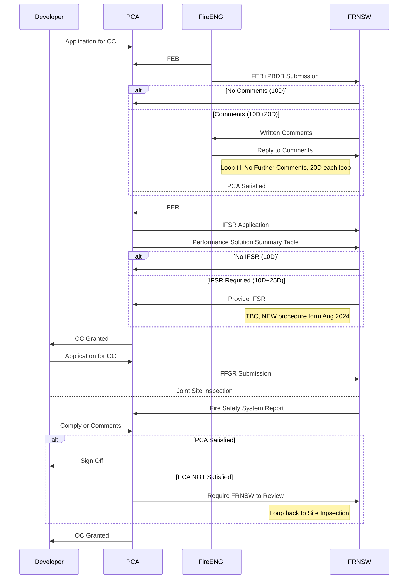

# Fire System (CC) Application for Class 1 Building

## Definitions

| Short |	Full name |
|-------|------------|
|FEB	|Fire Engineering Brief|
|PBDB	|Performance-Based Design Brief|
|FER	|Fire Engineering Report|
|			|Performance Solution Summary Table|
|IFSR	|Initial Fire Safety Report|
|FFSR	|Final Fire Safety Report|
|FRNSW |Fire & Rescue New South Wales|

## Sequence Diagram

Date: 15.08.2025 | Revision: 2025.07.b

