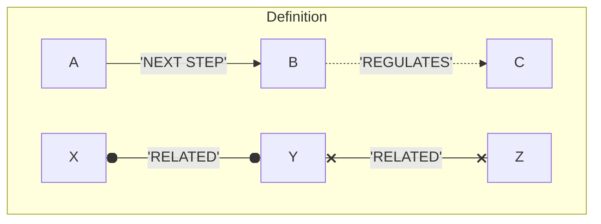
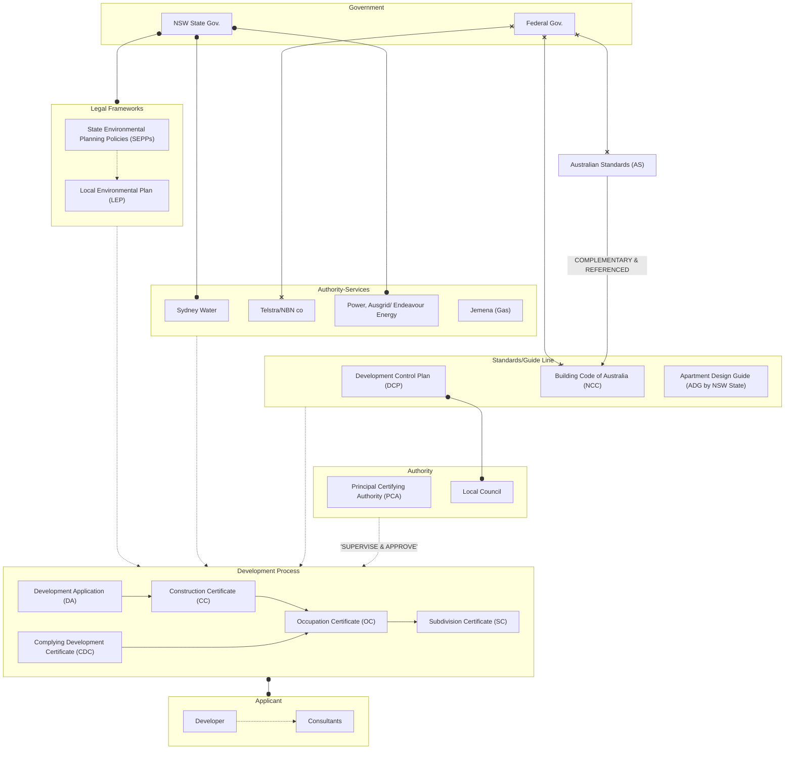

# Developement Flowchat

Date: 14.02.2025 | Revision: 2025.02.a

!> Note: This diagram is a simplified overview. Real-world processes are more complex—use this chart as a general guideline and verify against project-specific requirements.

[Download Link](docs/11-assets/images/DevFlowchat.png ':ignore')

