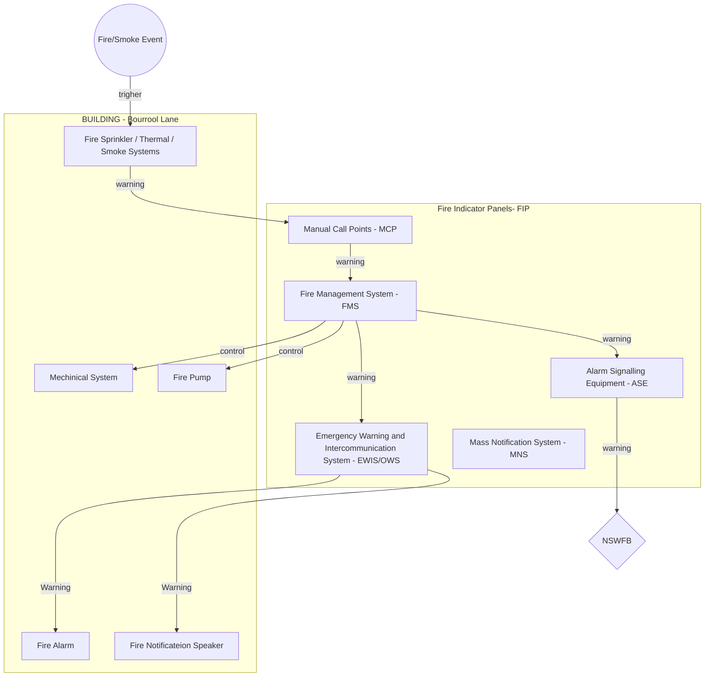

# Fire Indicator Panels (FIPs)

Fire Indicator Panels (FIPs) in NSW incorporate modular designs and interface with multiple external systems to coordinate fire safety responses. Here’s a detailed breakdown:

---

## **FIP Module Configuration**
1. **Modular Design**:  
   The F3200 Fire Indicator Panel uses **up to 8 internal modules**, with each module supporting either:  
   - **8-Zone Input Module**: Monitors fire detection zones (e.g., smoke detectors, heat sensors).  
   - **8-Relay Output Module**: Controls external systems like alarms, door releases, or HVAC shutdowns.  
   This allows a total capacity of **64 detection zones** per FIP.

2. **Key Components**:  
   - **Firefighter Facility**: Includes a 2-line LCD display for zone-specific alarm messages (compliant with AS 4428.1).  
   - **Network Compatibility**: Supports mimic panels, nurse station annunciators, and graphics terminals for centralized monitoring.

---

## **External Systems Communication**
FIPs interface with the following external boards and systems:  

| **System/Board**          | **Function**                                                                 | **Standard/Interface**                |
|---------------------------|-----------------------------------------------------------------------------|---------------------------------------|
| **Alarm Signalling Equipment (ASE)** | Transmits alarms to Fire and Rescue NSW (FRNSW) via dual SIM arrangements. | AS1670.1 (mandatory for brigade callout). |
| **Emergency Warning and Intercommunication System (EWIS/OWS)** | Broadcasts evacuation alerts and enables warden communication via WIP phones. | AS1670, AS1851.6-8. |
| **Fire Management System - FMS** | Monitors Fire Sprinkler System; Monitors and control valves and pumps; Monitors and control Mechanical Systems. | IP network connection. |
| **Manual Call Points (MCP)** | Each MCP is wired as a unique alarm zone for precise identification.    | AS1670.1 (individual zone labeling). |
| **Mass Notification System (MNS)** | Used in large campuses for coordinated alerts.                         | Addressable network protocols. |

---

## **Additional Notes**
- **REMTEC**: REMTEC is a service provide, refers to **remote telecommunication interfaces** used for fire brigade monitoring. In NSW, ASEs handle this function, often via IP networks or PABX systems.  
- **Compliance**: All installations must adhere to AS1670 (detection and control) and AS1851.6-8 (maintenance).  
- **Testing**: `Monthly` system checks and bi-annual detector testing are required.  

--- 
> Monthly system checks and bi-annual detector testing for fire systems in NSW are **required under Australian Standard AS 1851-2012**, which is now legally enforceable under NSW fire safety regulations.  {.is-info}

### Breakdown of Requirements:
1. **Monthly Checks**:  
   - Mandated by AS 1851-2012 Section 6 for fire indicator panels (FIPs), including functional tests of alarms, battery backups, and brigade callout systems.  
   - Includes visual inspections of detectors and manual call points.

2. **Bi-Annual (6-Monthly) Testing**:  
   - Covers detector sensitivity testing for smoke/heat alarms and full system interface checks (e.g., HVAC shutdowns, door releases).  
   - Required under AS 1851-2012 but does not require formal certification.

3. **Legal Basis**:  
   - AS 1851-2012 became directly enforceable in NSW in February 2025 under the *Environmental Planning and Assessment Regulation 2021*.  
   - Non-compliance risks fines up to $5,500 for building owners under NSW strata laws.

### Relationship to Other Frameworks:
- **NCC**: References AS 1851 for compliance but does not independently specify testing intervals.  
- **NSW Fire Brigade (FRNSW)**: Conducts audits of maintenance records but defers to AS 1851 for technical requirements.

For clarity:  
- **AS 1851-2012 = Source of testing frequencies**.  
- **NSW legislation = Legal enforcement mechanism**.  
- **NCC = Performance standard referencing AS 1851**.

---
*Last updated: 2025-05-14*