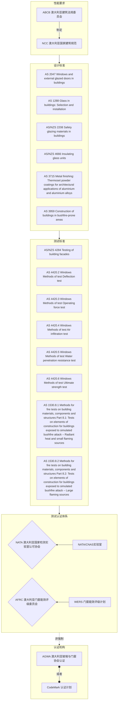

# Importing aluminium window and doors into Australia

[Download Link](docs/11-assets/images/AlumImport.png ':ignore')

```mermaid
flowchart TB

AS2047[AS 2047 Windows and external glazed doors in buildings]
AS1288[AS 1288 Glass in buildings: Selection and installation]
AS/NZS2208[AS/NZS 2208 Safety glazing materials in buildings]
AS/NZS4666[AS/NZS 4666 Insulating glass units]
AS3715[AS 3715 Metal finishing: Thermoset powder coatings for architectural applications of aluminium and aluminium alloys]
AS3959[AS 3959 Construction of buildings in bushfire-prone areas]

AS/NZS4284[AS/NZS 4284 Testing of building facades]
AS44202[AS 4420.2 Windows Methods of test Deflection test]
AS44203[AS 4420.3 Windows Methods of test Operating force test]
AS44204[AS 4420.4 Windows Methods of test Air infiltration test]
AS44205[AS 4420.5 Windows Methods of test Water penetration resistance test]
AS44206[AS 4420.6 Windows Methods of test Ultimate strength test]
AS153081[AS 1530.8.1 Methods for fire tests on building materials, components and structures Part 8.1: Tests on elements of construction for buildings exposed to simulated bushfire attack – Radiant heat and small flaming sources]
AS153082[AS 1530.8.2 Methods for fire tests on building materials, components and structures Part 8.2: Tests on elements of construction for buildings exposed to simulated bushfire attack – Large flaming sources]

NCC[NCC 澳大利亚国家建筑规范]
ABCB[ABCB 澳大利亚建筑法规委员会]

WERS[WERS 门窗能效评级计划]
AFRC{AFRC 澳大利亚门窗能效评级委员会}
NATA{NATA 澳大利亚国家检测实验室认可协会}

codemark[CodeMark Certification Scheme]

    subgraph 性能要求
    direction TB
        ABCB--"制定"-->NCC
    end

    subgraph 设计标准
    direction LR
        AS2047
        AS1288
        AS/NZS2208
        AS/NZS4666
        AS3715
        AS3959
    end

    subgraph 测试标准
    direction LR
        AS/NZS4284
        AS44202
        AS44203
        AS44204
        AS44205
        AS44206
        AS153081
        AS153082
    end

    subgraph 认证机构
    direction TB
        AGWA[AGWA 澳大利亚玻璃与门窗协会认证]
        codemark[CodeMark 认证计划]
        AGWA o--"或者"--o codemark
    end

    subgraph 测试认证体系
        direction RL
        NATA_CNAS[NATA/CNAS实验室]-->NATA
        WERS-->AFRC
    end

性能要求-->设计标准-->测试标准-->测试认证体系-.非强制.->认证机构
```